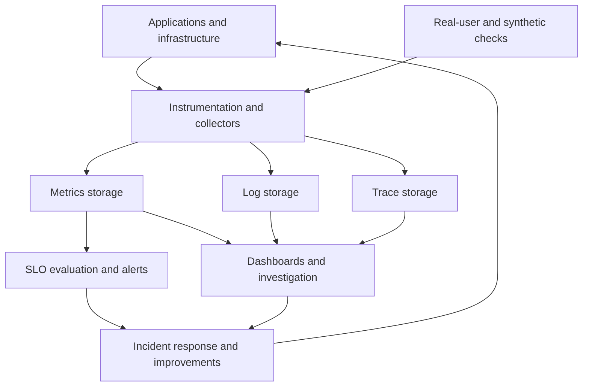

Below are interview-ready explanations using a **hypothetical digital-banking application**. For a Principal SRE interview, connect technical details to customer impact, architectural trade-offs, and operational decisions.

**1. What is observability architecture? Can you explain it?**

Observability architecture is the design of how a system **produces, collects, processes, stores, and connects telemetry** so engineers can understand its behavior and investigate failures.

For a banking application, it should help answer questions such as:

* Can customers log in, check balances, and complete transfers?
* Which customers or regions are affected by a problem?
* Where is a request spending time?
* Did a deployment or configuration change cause the issue?

A typical architecture looks like this:



The main components are:

| Component       | Responsibility                                                                      |
| --------------- | ----------------------------------------------------------------------------------- |
| Instrumentation | Generate application metrics, structured logs, and spans                            |
| Collection      | Receive telemetry from applications, hosts, containers, and cloud services          |
| Processing      | Add metadata, redact sensitive fields, batch data, and apply sampling               |
| Storage         | Retain telemetry in suitable metrics, logs, and tracing backends                    |
| Correlation     | Connect signals using service names, deployment versions, trace IDs, and timestamps |
| Operational use | Evaluate SLOs, alert responders, investigate incidents, and validate recovery       |

For example, applications can use OpenTelemetry instrumentation. An OpenTelemetry Collector receives the signals, processes them, and exports them to storage backends. **The Collector is a telemetry pipeline, not the long-term storage system.** [OpenTelemetry Collector architecture](https://opentelemetry.io/docs/collector/architecture/)

At Principal SRE level, also discuss the architecture’s operating characteristics:

* **Reliability:** collector failures should not block customer transactions; buffering must have defined limits.
* **Coverage:** external checks should detect failures that application instrumentation cannot see, such as broken DNS.
* **Cost:** control metric cardinality, sampling, and retention.
* **Data protection:** avoid collecting passwords, tokens, or unnecessary customer information.
* **Ownership:** every critical service needs an owner, useful dashboards, and actionable alerts.
* **Self-monitoring:** detect dropped telemetry, exporter failures, and missing data.

Collecting telemetry is only the first step. The architecture must make that evidence usable during an incident.

---

**2. What is DNS? What happens when you type `google.com` into a browser?**

**DNS—Domain Name System—is a distributed naming system.** One of its main functions is resolving a hostname into addresses that clients can connect to.

For a typical fresh HTTPS navigation, the sequence is as follows. Caching, proxies, and connection reuse can shorten or alter it.

**Step 1: The browser interprets the address**

The browser identifies `google.com` as a hostname and determines the URL to request. Browser policy or HSTS may require HTTPS.

A cached response or service worker could sometimes satisfy a request without a new network request.

**Step 2: The client checks available DNS information**

The browser or operating system may already have a cached DNS answer. Depending on configuration, resolution may use the operating system’s resolver or a browser-managed resolver.

**Step 3: A recursive resolver finds the answer**

If the answer is not cached, the client asks a recursive resolver—perhaps operated by an enterprise, ISP, or public DNS provider.

When the resolver lacks the necessary cached information, it follows the DNS hierarchy:

1. A root server directs it toward the `.com` name servers.
2. A `.com` server provides a referral for `google.com`.
3. An authoritative server provides the requested records or an alias to resolve further.

The client normally asks the recursive resolver; it does not personally query every level.

**Step 4: The result is returned and cached**

The result can contain IPv4 addresses in **A records** and IPv6 addresses in **AAAA records**. TTL values govern how long DNS information can normally remain cached. [DNS concepts and resolution](https://www.rfc-editor.org/rfc/rfc1034)

Traditional DNS commonly uses UDP or TCP port 53. DNS over HTTPS transports DNS queries over HTTPS, so not every browser lookup appears as a port-53 request. [DNS over HTTPS](https://www.rfc-editor.org/rfc/rfc8484)

**Step 5: The browser establishes a connection**

The device routes packets toward a selected address.

* HTTP/1.1 and HTTP/2 over HTTPS normally use TCP followed by TLS negotiation.
* HTTP/3 uses QUIC over UDP, incorporating TLS security.

The browser validates the server certificate and establishes an encrypted connection. An existing suitable connection may be reused. [HTTP/3 specification](https://www.rfc-editor.org/rfc/rfc9114)

**Step 6: The browser sends an HTTP request**

The request identifies the destination hostname and requested path. The server processes it, potentially involving caches, load balancing, and backend services.

**Step 7: The browser renders the response**

It parses HTML and CSS, executes JavaScript as required, fetches additional resources, and performs layout and painting. Resources hosted under other names can require additional DNS lookups. [Browser navigation and rendering](https://developer.mozilla.org/en-US/docs/Web/Performance/Guides/How_browsers_work)

From an SRE perspective, distinguish **DNS lookup time, connection establishment, TLS negotiation, server response time, and rendering time**. A slow page is not automatically a slow application server.

---

**3. What is the difference between observability and monitoring?**

**Monitoring is the practice of measuring and checking system behavior. Observability is the capability to understand that behavior from the available evidence.**

| Monitoring                                      | Observability                                                         |
| ----------------------------------------------- | --------------------------------------------------------------------- |
| Tracks selected indicators and conditions       | Supports investigation across system behavior                         |
| Commonly uses predefined dashboards and alerts  | Supports questions that were not anticipated beforehand               |
| Detects changes such as increased latency       | Helps determine which requests, dependencies, or changes explain them |
| Example: transfer failures exceeded a threshold | Example: failures affect one release calling a particular dependency  |

For example, monitoring alerts that customers are experiencing slow transfers.

Observability allows the engineer to investigate whether those slow requests share a region, deployment version, dependency, or database behavior.

They overlap. Monitoring can use metrics, logs, and traces, and it can support diagnosis. Good monitoring is part of an observable system.

Installing a particular tool does not by itself establish observability; the system needs useful instrumentation, context, and query capabilities. [OpenTelemetry observability concepts](https://opentelemetry.io/docs/concepts/observability-primer/)

---

**4. When we already have logs, why do we need traces?**

Logs record individual events. **Traces connect operations into the journey of a request across services.**

Imagine a transfer request passes through an API gateway, authentication, fraud checking, and a ledger service.

Logs might tell you:

* The gateway received the request.
* Authentication succeeded.
* A dependency timed out.
* The customer received an error.

However, reconstructing the sequence from many services’ logs can be difficult, especially with concurrent requests, retries, and asynchronous processing.

A trace contains **spans**, each representing an operation with timing, status, attributes, and relationships to other spans. [OpenTelemetry traces](https://opentelemetry.io/docs/concepts/signals/traces/)

An illustrative trace might show:

| Operation                 | Observed duration |
| ------------------------- | ----------------: |
| Complete transfer request |       3.1 seconds |
| Authentication call       |   40 milliseconds |
| Fraud-service call        |       2.8 seconds |
| Ledger database query     |   45 milliseconds |

This immediately directs attention toward the fraud-service call. Further logs, metrics, and downstream spans help explain why it was slow.

Tracing is particularly useful for:

* Identifying slow dependencies.
* Understanding fan-out and parallel calls.
* Finding retries and repeated requests.
* Following work across service boundaries.
* Distinguishing database execution time from waiting elsewhere.

Trace context must propagate between components. HTTP instrumentation commonly uses the W3C `traceparent` header. Including trace and span IDs in structured logs makes navigation between the two signals much easier. [Context propagation](https://opentelemetry.io/docs/concepts/context-propagation/)

Logs remain valuable for detailed events and error messages. Also, traces may be sampled or incomplete, so absence of a recorded span does not prove an operation never happened.

---

**5. How are SLA and SLO set from a business perspective?**

Start with **what customers need to accomplish and what happens when they cannot accomplish it**.

The distinction is:

* **SLA:** a formal service commitment between parties, with agreed consequences when the commitment is not met.
* **SLO:** a measurable reliability target that product and engineering teams use to operate and improve the service.
* **SLI:** the measurement used to determine the actual experience.

An internal SLO is commonly stricter than a corresponding external SLA, giving the team room to react before breaching the commitment. Not every application needs a public SLA, but it can still benefit from SLOs. [Google SRE service-level objectives](https://sre.google/sre-book/service-level-objectives/)

The business discussion should follow this sequence:

**First, identify the important customer journeys.**

For a bank, these might include login, viewing balances, transferring funds, and downloading statements. Their consequences of failure differ.

A slow statement download may be inconvenient. An unclear transfer outcome can cause customer anxiety, repeated submissions, and support calls.

**Second, define what an acceptable experience means.**

Ask questions such as:

* How long will customers reasonably wait?
* Must this journey work at all hours?
* Are there payment or settlement deadlines?
* What is the impact of a short widespread outage versus a prolonged issue affecting a smaller group?
* What recovery behavior do customers expect?

**Third, evaluate feasibility and cost.**

Review current performance, dependency reliability, recovery capabilities, and architecture. Explain what additional resilience would require and what customer benefit it would provide.

The business should understand the trade-off between additional reliability investment and other product priorities. Historical performance is evidence, not the sole reason for choosing a target.

**Fourth, agree and document the commitment.**

Specify the journey, target, measurement period, scope, ownership, and treatment of planned maintenance or expected business rejections.

Correctness requirements—such as preventing lost or duplicate accepted transfers—should be addressed explicitly alongside availability and latency.

**Finally, make the target affect decisions.**

When reliability deteriorates, the team may prioritize recovery improvements, reduce risky changes, or pause a rollout. When reliability is healthy, it can continue delivering features within the agreed risk policy.

This is why SLOs need agreement from product, business, engineering, and operations; they guide prioritization rather than merely reporting a number. [Implementing SLOs](https://sre.google/workbook/implementing-slos/), [Example error-budget policy](https://sre.google/workbook/error-budget-policy/)

---

**6. How do you decide which SLIs to use for an application?**

Choose SLIs by working backward from the **customer’s definition of success**.

Begin with the journey, define a good outcome, and then choose a trustworthy way to measure it.

For a banking application:

| Customer journey          | Useful SLI                                                                               |
| ------------------------- | ---------------------------------------------------------------------------------------- |
| Login                     | Eligible login attempts completing successfully and promptly                             |
| Balance enquiry           | Requests returning a correct, sufficiently fresh balance within the agreed response time |
| Transfer submission       | Valid transfers receiving a durable acknowledgement                                      |
| Transfer processing       | Accepted transfers reaching the expected state within the agreed deadline                |
| Statement generation      | Required statements becoming available by the promised time                              |
| Transaction notifications | Notifications delivered with acceptable delay and completeness                           |

Availability and latency are common indicators, but some systems also need **correctness, freshness, durability, or completeness**.

A useful selection process is:

1. **Define the unit being measured.** Is it an HTTP request, a customer transaction, or a batch? Retries should not accidentally distort the customer-success measurement.
2. **Define good and bad outcomes.** An HTTP `200` is insufficient if the returned balance is wrong or the transfer was never recorded.
3. **Classify expected business responses.** Insufficient funds may be a correct business rejection; a timeout caused by your service is different.
4. **Choose the measurement point.** Use client telemetry, external checks, gateway instrumentation, application events, or reconciliation data as appropriate.
5. **Specify scope and windows.** Identify the service, journey, regions, time boundary, and missing-data behavior.
6. **Validate against actual incidents.** If customers report serious problems while the SLI remains healthy, revisit the indicator.

Document the SLI implementation as well as its business meaning so different teams measure the same thing consistently. [Example SLO documentation](https://sre.google/workbook/slo-document/)

CPU and memory are useful diagnostic metrics, but they usually do not directly describe customer success.

Also avoid calculating service availability directly from a trace sample deliberately biased toward errors. Use a measurement method that represents the intended population.

---

**7. Explain metrics, logs, and traces, including the tools used.**

The three signals offer different views of the same system.

| Signal  | What it represents                              | Example                                                                       |
| ------- | ----------------------------------------------- | ----------------------------------------------------------------------------- |
| Metrics | Numerical measurements over time                | Transfer error rate, request latency, queue depth                             |
| Logs    | Individual recorded events                      | Dependency timeout with contextual fields                                     |
| Traces  | Related operations across a request or workflow | A transfer’s path through authentication, fraud checking, and ledger services |

**Metrics**

Metrics work well for trends, dashboards, capacity analysis, and alerting.

Common types include:

* **Counter:** accumulates events, such as completed requests.
* **Gauge:** represents a current value, such as active connections.
* **Histogram:** captures a distribution, such as request durations.

For user-facing services, the four golden signals are **latency, traffic, errors, and saturation**. Tail latency matters because a healthy average can hide a poor experience for a subset of customers. [Google SRE monitoring guidance](https://sre.google/sre-book/monitoring-distributed-systems/)

Keep metric dimensions controlled. Service, region, and route are generally more manageable than labels containing individual customer IDs or arbitrary URLs.

**Logs**

Logs provide event details. Structured logs make those details searchable and consistent:

```json
{
  "timestamp": "2026-09-19T10:14:00Z",
  "severity": "ERROR",
  "service": "transfer-api",
  "environment": "production",
  "event": "dependency_timeout",
  "dependency": "fraud-service",
  "trace_id": "90b8de60541b4a97b7347b1f8e3fb280"
}
```

Useful fields include time, severity, service, version, operation, error classification, and correlation IDs. Avoid unnecessary sensitive payloads. [OpenTelemetry logs](https://opentelemetry.io/docs/concepts/signals/logs/)

**Traces**

Traces describe operation relationships and timing. They support dependency analysis and investigation of individual slow or failed requests.

Sampling controls volume. Head sampling decides early; tail sampling can consider outcomes such as errors or latency after observing spans, but requires more processing and buffering. [OpenTelemetry sampling](https://opentelemetry.io/docs/concepts/sampling/)

One complete example toolchain is:

| Layer                       | Example tools                                             | Responsibility                                |
| --------------------------- | --------------------------------------------------------- | --------------------------------------------- |
| Application instrumentation | OpenTelemetry SDKs and automatic instrumentation          | Generate metrics and spans; correlate logs    |
| Collection and processing   | OpenTelemetry Collector; Fluent Bit for log collection    | Receive, enrich, filter, and export telemetry |
| Metrics backend             | Prometheus                                                | Store and query time-series metrics           |
| Logs backend                | Grafana Loki                                              | Store and query logs                          |
| Trace backend               | Grafana Tempo or Jaeger                                   | Store and investigate distributed traces      |
| Visualization               | Grafana                                                   | Dashboards and navigation across signals      |
| Alert routing               | Alertmanager                                              | Group, deduplicate, route, and silence alerts |
| External journey checks     | CloudWatch Synthetics or another synthetic-testing system | Exercise endpoints and customer journeys      |

These roles are documented in [Prometheus](https://prometheus.io/docs/introduction/overview/), [Loki](https://grafana.com/docs/loki/latest/), [Tempo](https://grafana.com/docs/tempo/latest/), and [Alertmanager](https://prometheus.io/docs/alerting/latest/alertmanager/).

An AWS-oriented implementation could instead use OpenTelemetry instrumentation with CloudWatch, Application Signals, and X-Ray. Application Signals integrates service metrics, traces, topology, and SLO evaluation. [CloudWatch Application Signals](https://docs.aws.amazon.com/AmazonCloudWatch/latest/monitoring/CloudWatch-Application-Monitoring-Sections.html)

In an interview, explain the responsibilities and trade-offs of the tools you have actually operated.

---

**8. How does observability help maintain site reliability?**

Observability provides the evidence needed to **detect customer impact, restore service, and prevent repeated failures**.

It supports reliability in several ways:

| Reliability activity  | How observability helps                                                     |
| --------------------- | --------------------------------------------------------------------------- |
| Detection             | Identifies failed or degraded customer journeys                             |
| Diagnosis             | Connects symptoms to dependencies, releases, regions, and resource behavior |
| Mitigation            | Helps select and evaluate actions such as rollback or traffic shifting      |
| Recovery verification | Confirms that customer outcomes have recovered                              |
| Change management     | Compares a canary release with the existing version                         |
| Capacity planning     | Reveals saturation, queue growth, and demand patterns                       |
| Improvement planning  | Shows which recurring problems cause the most customer impact               |

For alerting, focus on actionable symptoms and threats to the SLO. **Error-budget burn** describes how quickly reliability allowance is being consumed. Looking across shorter and longer windows helps distinguish urgent degradation from persistent slower problems. [Alerting on SLOs](https://sre.google/workbook/alerting-on-slos/)

Consider this hypothetical incident:

1. Customers start experiencing slow transfers after a deployment.
2. The transfer-latency SLI detects the degradation.
3. Instrumented traces show increased time waiting to obtain database connections.
4. Connection-pool metrics show a growing wait queue, while actual query execution remains normal.
5. Logs and deployment metadata identify a connection-pool configuration change.
6. The team restores the previous configuration.
7. Customer-facing measurements confirm that transfers are succeeding promptly again.

The immediate priority is restoring service. Deeper investigation can follow to establish why the configuration escaped testing.

Afterward, improve the concurrency tests, configuration validation, rollout checks, and relevant alerts. External synthetic checks also help detect problems when real customer traffic is low. [Synthetic monitoring](https://docs.aws.amazon.com/AmazonCloudWatch/latest/monitoring/CloudWatch_Synthetics_Canaries.html)

Observability does not itself create redundancy, repair code, or guarantee reliability. Its value comes from connecting trustworthy evidence to effective action. Evaluate that value through fewer failed customer journeys, faster restoration, and fewer recurring incidents.
