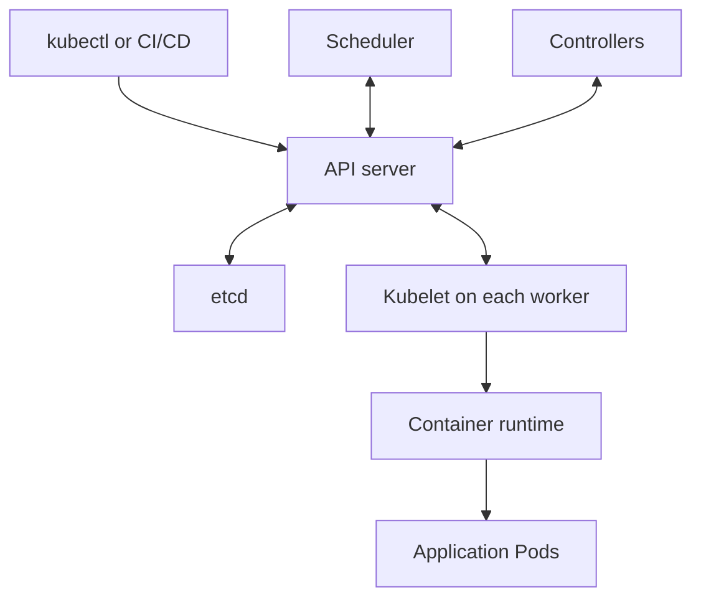

Below are detailed answers to all 21 questions. For questions about your experience, use the example designs to explain systems you actually worked on.

**1. What types of nodes did you deploy in AWS?**

“Node” can mean an EC2 server, an ECS container instance, or an EKS worker node. Explain the platform first, then describe the instance choice and its purpose.

| Workload requirement         | Example EC2 family | Reason                                                 |
| ---------------------------- | ------------------ | ------------------------------------------------------ |
| General application services | M family           | Balanced CPU and memory                                |
| CPU-intensive processing     | C family           | More compute capacity relative to memory               |
| Memory-intensive workloads   | R family           | Higher memory capacity                                 |
| GPU workloads                | G or P families    | Hardware acceleration for graphics or machine learning |

Instance size also depends on network throughput, storage performance, architecture compatibility, and measured utilization. [AWS EC2 instance types](https://docs.aws.amazon.com/ec2/latest/instancetypes/instance-types.html)

Then explain the operating model:

* **On-Demand capacity:** Suitable for baseline workloads that should not depend on spare-capacity availability.
* **Spot capacity:** Suitable for workloads designed to tolerate interruptions.
* **Private subnets:** Common placement for application and worker nodes.
* **Multiple Availability Zones:** Reduce dependence on one AZ.
* **Auto Scaling:** Adjust capacity to workload demand.

For EKS, distinguish worker nodes from the AWS-managed control plane. A strong answer explains **why you chose the capacity**, how it scaled, and which operational responsibilities you owned.

---

**2. What is the difference between an Interface Endpoint and a Gateway Endpoint?**

Both provide private access to supported services, but their networking mechanisms differ.

| Aspect            | Interface endpoint                                              | Gateway endpoint                                          |
| ----------------- | --------------------------------------------------------------- | --------------------------------------------------------- |
| Mechanism         | AWS PrivateLink                                                 | Route-table integration                                   |
| Network resources | Creates endpoint network interfaces in selected subnets         | Does not create endpoint ENIs                             |
| Service support   | Many AWS services and supported endpoint services               | Amazon S3 and DynamoDB                                    |
| Traffic routing   | Requests reach endpoint IP addresses, often through private DNS | Service prefix-list routes direct traffic to the endpoint |
| Security groups   | Applied to endpoint ENIs                                        | No security group attached to the endpoint                |
| Endpoint policies | Available where supported                                       | Supported                                                 |
| Endpoint charges  | Generally hourly and data-processing charges                    | No additional endpoint charge                             |

Current AWS documentation lists **both gateway and interface endpoint support for S3 and DynamoDB**. [Gateway endpoints](https://docs.aws.amazon.com/vpc/latest/privatelink/gateway-endpoints.html), [Interface endpoints](https://docs.aws.amazon.com/vpc/latest/privatelink/create-interface-endpoint.html)

For example:

* EC2 instances accessing S3 within their VPC commonly use an S3 gateway endpoint.
* Private access from an on-premises network can use an interface endpoint, with the necessary connectivity and DNS configuration.

Gateway endpoints cannot be consumed through a Transit Gateway. [S3 endpoint considerations](https://docs.aws.amazon.com/vpc/latest/privatelink/vpc-endpoints-s3.html)

**An endpoint supplies a network path; IAM and resource policies still determine access.**

---

**3. How did you set up ECS using EC2 instances?**

A complete answer should cover networking, host capacity, application deployment, permissions, and scaling.

1. **Prepare networking.** Create a VPC with application subnets across multiple AZs. Private EC2 hosts need outbound connectivity or the appropriate endpoints for image pulls, ECS communication, logging, and other dependencies.

2. **Create an ECS cluster.** This is the logical grouping for container capacity and workloads.

3. **Create a launch template.** Use an ECS-optimized AMI, an instance profile, security groups, storage configuration, and bootstrap settings.

For an ECS-optimized Amazon Linux host, the cluster registration setting can be supplied through user data:

```bash
#!/bin/bash
echo 'ECS_CLUSTER=production-cluster' >> /etc/ecs/ecs.config
```

The ECS agent uses this setting when registering the instance. [ECS instance bootstrapping](https://docs.aws.amazon.com/AmazonECS/latest/developerguide/bootstrap_container_instance.html)

4. **Create an Auto Scaling group and capacity provider.** Associate the capacity provider with the cluster and configure managed scaling and draining as appropriate. [ECS Auto Scaling group capacity providers](https://docs.aws.amazon.com/AmazonECS/latest/developerguide/asg-capacity-providers.html)

5. **Register a task definition.** Specify the container image, CPU, memory, ports, logging, networking mode, secrets, and IAM roles.

Keep the permissions separate:

| Role                        | Purpose                                                                                 |
| --------------------------- | --------------------------------------------------------------------------------------- |
| EC2 container instance role | Permissions used by the host’s ECS agent                                                |
| Task execution role         | Permissions for configured task startup features, such as retrieving referenced secrets |
| Task role                   | AWS permissions used by application code inside the container                           |

The exact execution-role requirements depend on the launch type and enabled features. [ECS instance role](https://docs.aws.amazon.com/AmazonECS/latest/developerguide/instance_IAM_role.html), [Task execution role](https://docs.aws.amazon.com/AmazonECS/latest/developerguide/task_execution_IAM_role.html)

6. **Create an ECS service and load balancer integration.** Configure desired task count, placement, health checks, and deployment behavior. For tasks using `awsvpc` networking, the ALB target group must use target type **`ip`**, including when those tasks run on EC2. [ECS ALB integration](https://docs.aws.amazon.com/AmazonECS/latest/developerguide/alb.html)

7. **Configure both scaling layers.** Service Auto Scaling changes the number of tasks; capacity-provider scaling changes the EC2 capacity available to run them.

---

**4. Can’t we configure Route 53?**

Yes. In the ECS example, Route 53 provides a custom domain for the application.

For `app.example.com`:

1. Manage the domain’s DNS in a Route 53 hosted zone.
2. Create an alias record pointing to the ALB.
3. Configure an HTTPS listener and a certificate covering the application domain.
4. Let the ALB forward requests to healthy ECS tasks.

Route 53 answers the DNS query. The client then connects to the load balancer; application requests do not pass through Route 53.

An alias record avoids maintaining the load balancer’s changing IP addresses manually. It can also be used at the zone apex, such as `example.com`. [Route 53 routing to an ELB load balancer](https://docs.aws.amazon.com/Route53/latest/DeveloperGuide/routing-to-elb-load-balancer.html)

For internal applications, a private hosted zone can provide names resolvable within the associated VPC environment.

---

**5. How do you configure a GoDaddy domain in Route 53?**

Domain registration and DNS hosting are separate. The domain can remain registered with GoDaddy while Route 53 hosts its DNS.

The migration process is:

1. **Inventory the existing DNS records.** Include website records, MX records, email verification records, SPF, DKIM, and DMARC.
2. **Create a public hosted zone** in Route 53 with the same domain name.
3. **Re-create the required records** and validate them against the Route 53 authoritative name servers.
4. **Plan the DNS transition.** Lower relevant TTLs in advance where possible and allow existing cached values to expire.
5. **Update the domain’s nameservers at GoDaddy** to the four nameservers assigned to the Route 53 hosted zone.
6. **Verify DNS and application behavior**, keeping the old DNS configuration available while caches expire.

Example checks:

```bash
dig NS example.com
dig A app.example.com
dig MX example.com
```

If DNSSEC is enabled, coordinate the existing DS record removal and subsequent Route 53 DNSSEC setup; stale delegation information can break validation.

**Transferring the registration to AWS is optional.** [AWS DNS migration procedure](https://docs.aws.amazon.com/Route53/latest/DeveloperGuide/migrate-dns-domain-in-use.html)

---

**6. What is the difference between AWS Config and AWS CloudTrail?**

| Aspect           | AWS Config                                                        | AWS CloudTrail                                            |
| ---------------- | ----------------------------------------------------------------- | --------------------------------------------------------- |
| Main question    | “How is this resource configured, and is it compliant?”           | “Who performed this action, when, and through which API?” |
| Main information | Resource configurations, relationships, and configuration history | User, role, and service activity                          |
| Typical use      | Detect configuration drift and evaluate rules                     | Investigate changes and audit API activity                |
| Example          | A security group permits SSH from everywhere                      | A particular role called `AuthorizeSecurityGroupIngress`  |

For a security group opened to `0.0.0.0/0`:

* **Config** can record the configuration change and flag a rule violation.
* **CloudTrail** can identify the principal and API request responsible.

Config rules can support remediation workflows, but recording a violation does not automatically prevent the change. [AWS Config](https://docs.aws.amazon.com/config/latest/developerguide/WhatIsConfig.html), [AWS CloudTrail](https://docs.aws.amazon.com/awscloudtrail/latest/userguide/cloudtrail-user-guide.html)

CloudTrail’s default Event history covers 90 days of management events. S3 object operations such as `GetObject` require appropriate **data-event logging**; they are not all captured by default. [CloudTrail data events](https://docs.aws.amazon.com/awscloudtrail/latest/userguide/logging-data-events-with-cloudtrail.html)

---

**7. What node groups have you used in AWS EKS?**

Describe the grouping, its purpose, and the scheduling decisions. An illustrative design is:

| Node group        | Capacity                         | Purpose                                                        |
| ----------------- | -------------------------------- | -------------------------------------------------------------- |
| Baseline group    | On-Demand                        | Critical platform components and baseline application capacity |
| Application group | On-Demand                        | Services needing predictable capacity                          |
| Batch group       | Spot                             | Retryable jobs and interruption-tolerant processing            |
| Specialized group | Suitable memory or GPU instances | Workloads with specific hardware requirements                  |

Explain how you used:

* Labels and node affinity to select suitable nodes.
* Taints and tolerations to reserve specialized capacity.
* Multiple AZs for availability.
* Pod disruption budgets and controlled updates.
* Autoscaling to add or remove capacity.

An EKS managed node group uses **either On-Demand or Spot capacity**. Separate groups can provide both within one cluster. [EKS managed node groups](https://docs.aws.amazon.com/eks/latest/userguide/managed-node-groups.html)

Avoid simply saying “we used managed nodes.” Explain what you configured and why that arrangement suited the workloads.

---

**8. What are the types of node groups in AWS EKS?**

For conventional EC2 node groups, the main distinction is:

| Type                         | Operational responsibility                                                                                                        |
| ---------------------------- | --------------------------------------------------------------------------------------------------------------------------------- |
| **Managed node groups**      | EKS manages substantial parts of EC2 provisioning and node lifecycle; you configure capacity and initiate/manage relevant updates |
| **Self-managed node groups** | You manage the EC2 instances, bootstrap process, scaling arrangements, patching, and replacement workflow                         |

The broader EKS compute options also include:

* **AWS Fargate:** Runs selected Pods without customer-managed EC2 hosts; selection uses Fargate profiles.
* **EKS Auto Mode:** Automates more of the compute and supporting infrastructure lifecycle.
* **EKS Hybrid Nodes:** Connects supported customer-managed infrastructure outside AWS to an EKS control plane.

Fargate profiles and Auto Mode compute should not simply be described as conventional EC2 managed node groups. [EKS compute options](https://docs.aws.amazon.com/eks/latest/userguide/eks-compute.html)

Also distinguish **Pod scaling** from **node scaling**: increasing replicas does not guarantee sufficient compute capacity exists.

---

**9. If a user wants access to an S3 bucket, what is the process?**

First establish the required access: which bucket or prefix, which operations, and whether access is permanent or temporary.

A typical process is:

1. **Authenticate through an appropriate identity.** For employees, federation or IAM Identity Center commonly supplies temporary role credentials.
2. **Grant least-privilege permissions.**
3. **Check resource policies and other restrictions.**
4. **Provide a reachable S3 endpoint.**
5. **Test the intended operation and audit access where required.**

The permissions differ by operation:

| Requirement    | IAM action        | Resource                       |
| -------------- | ----------------- | ------------------------------ |
| List objects   | `s3:ListBucket`   | Bucket ARN                     |
| Read objects   | `s3:GetObject`    | Object ARN or permitted prefix |
| Upload objects | `s3:PutObject`    | Object ARN or permitted prefix |
| Delete objects | `s3:DeleteObject` | Object ARN or permitted prefix |

For example, reading reports can be restricted to:

```text
arn:aws:s3:::company-reports/reports/*
```

Listing can separately be restricted with an `s3:prefix` condition. Keep Block Public Access enabled for private data. SSE-KMS objects may additionally require KMS authorization. [S3 access management](https://docs.aws.amazon.com/AmazonS3/latest/userguide/access-management.html)

For **cross-account direct access**, configure the required identity permissions and bucket policy, or let the user assume an appropriately trusted role in the bucket’s account. [Cross-account S3 permissions](https://docs.aws.amazon.com/AmazonS3/latest/userguide/example-walkthroughs-managing-access-example2.html)

For **temporary access to a specific object**, a presigned URL may be appropriate. Its effective lifetime is also limited by the signing credentials. [S3 presigned URLs](https://docs.aws.amazon.com/AmazonS3/latest/userguide/ShareObjectPreSignedURL.html)

---

**10. How does VPC Peering work?**

VPC Peering provides private connectivity between two VPCs. The VPCs can belong to different accounts and can be in different Regions. [VPC Peering overview](https://docs.aws.amazon.com/vpc/latest/peering/what-is-vpc-peering.html)

For VPC A `10.10.0.0/16` and VPC B `10.20.0.0/16`:

1. Create the peering request.
2. Accept it from the peer account when required.
3. Add a route in A for `10.20.0.0/16` targeting the peering connection.
4. Add the reverse route in B.
5. Allow the required traffic through security groups and network ACLs.
6. Configure DNS resolution behavior if needed.

Two limitations matter:

* **CIDRs must not overlap.**
* **Peering is not transitive.** If A peers with B and B peers with C, A does not automatically reach C through B.

A peered VPC also cannot simply use the other VPC’s NAT gateway, internet gateway, or S3 gateway endpoint as a shared exit. [VPC Peering behavior and limitations](https://docs.aws.amazon.com/vpc/latest/peering/vpc-peering-basics.html)

---

**11. How does Transit Gateway work, and how would you configure it?**

AWS Transit Gateway acts as a regional routing hub connecting VPCs and supported network attachments. It is useful when connectivity needs extend beyond a small number of VPC pairs.

A typical configuration is:

1. Create the Transit Gateway.
2. Share it through AWS Resource Access Manager if other accounts need to attach their VPCs.
3. Create VPC attachments using suitable subnets in the required AZs.
4. Associate attachments with the appropriate Transit Gateway route tables.
5. Configure route propagation or static routes.
6. Update the workload subnet route tables.
7. Verify return routes, security groups, network ACLs, and DNS.

Two concepts are essential:

* **Association:** Determines which Transit Gateway route table is consulted for traffic arriving from an attachment.
* **Propagation:** Adds an attachment’s reachable prefixes to selected Transit Gateway route tables.

Separate route tables can support different connectivity policies—for example, allowing production and development to reach shared services without providing general connectivity between them. [Transit Gateway route tables](https://docs.aws.amazon.com/vpc/latest/tgw/tgw-route-tables.html)

Attaching a VPC alone does not complete the routing configuration.

---

**12. When VPCs connect to Transit Gateway, what changes are needed in the VPC route tables?**

Add routes for the remote networks, with the **Transit Gateway ID as the target**.

For this example:

* VPC A: `10.10.0.0/16`
* VPC B: `10.20.0.0/16`

The relevant subnet route tables need:

| Route table | Destination    | Target  |
| ----------- | -------------- | ------- |
| VPC A       | `10.10.0.0/16` | `local` |
| VPC A       | `10.20.0.0/16` | `tgw-…` |
| VPC B       | `10.20.0.0/16` | `local` |
| VPC B       | `10.10.0.0/16` | `tgw-…` |

The Transit Gateway route tables also need routes directing:

* `10.10.0.0/16` to attachment A.
* `10.20.0.0/16` to attachment B.

**VPC routes target the Transit Gateway; Transit Gateway routes target attachments.**

Update the route tables associated with the participating workload subnets. The attachment subnets must also have appropriate routes to destinations inside their VPC.

Do not assume enabling Transit Gateway route propagation automatically updates VPC subnet route tables. [VPC attachment routing requirements](https://docs.aws.amazon.com/vpc/latest/tgw/tgw-vpc-attachments.html)

---

**13. Do you configure each Transit Gateway attachment with a CIDR range?**

An attachment is created using:

* Transit Gateway ID.
* VPC ID.
* Subnet IDs.

You select at most one attachment subnet per AZ. The attachment connects the VPC to the Transit Gateway; **CIDR ranges belong in the routing configuration**.

For example:

```bash
aws ec2 create-transit-gateway-vpc-attachment \
  --transit-gateway-id tgw-0123456789abcdef0 \
  --vpc-id vpc-0123456789abcdef0 \
  --subnet-ids subnet-11111111111111111 subnet-22222222222222222
```

The example subnets must belong to the specified VPC and different AZs. [Create a Transit Gateway VPC attachment](https://docs.aws.amazon.com/cli/latest/reference/ec2/create-transit-gateway-vpc-attachment.html)

Selecting attachment subnets does not mean that only resources in those subnets may communicate. Other workload subnets need the correct routing and attachment availability in their AZ.

Overlapping VPC CIDRs remain a routing problem; Transit Gateway does not automatically translate overlapping addresses.

---

**14. What is Route 53?**

Amazon Route 53 is AWS’s managed DNS service. Its capabilities include domain registration, DNS hosting, and health checking. [Route 53 overview](https://docs.aws.amazon.com/Route53/latest/DeveloperGuide/Welcome.html)

Its major components include:

* **Public hosted zones:** DNS records intended for public resolution.
* **Private hosted zones:** DNS records available through associated private AWS environments.
* **DNS records:** Such as A, AAAA, CNAME, MX, TXT, and aliases.
* **Routing policies:** Control which DNS answers Route 53 returns.
* **Health checks:** Can influence suitable routing configurations.

Examples of routing policies:

| Policy      | Example use                                               |
| ----------- | --------------------------------------------------------- |
| Simple      | One straightforward destination                           |
| Weighted    | Distribute DNS responses between deployments              |
| Latency     | Prefer a configured endpoint based on latency             |
| Failover    | Select a secondary endpoint when the primary is unhealthy |
| Geolocation | Choose answers according to the requester’s location      |

DNS routing is affected by caching. A weighted policy does not guarantee an exact percentage of individual HTTP requests, and a failover change does not instantly replace every cached DNS answer.

For an application behind an ALB, Route 53 supplies the DNS answer; the ALB distributes application requests.

---

**15. What are WAF and AAF?**

**AWS WAF** is a web application firewall that inspects HTTP and HTTPS requests reaching supported resources, including CloudFront, Application Load Balancers, and API Gateway REST APIs.

Typical protections include:

* SQL injection and cross-site scripting rules.
* IP allow/block rules.
* Request-rate controls.
* Rules inspecting paths, headers, and query parameters.
* Managed rule groups and bot-related controls.

You associate a **web ACL** with the protected resource. New rules can first run in **Count** mode to assess their effect before enforcing blocks. [AWS WAF documentation](https://docs.aws.amazon.com/waf/latest/developerguide/what-is-aws-waf.html)

**“AAF — Application Access Firewall” is ambiguous here.** It is not a standard AWS counterpart to WAF; establish which product or capability the interviewer means.

Related AWS services have different purposes:

| Service              | Purpose                                                      |
| -------------------- | ------------------------------------------------------------ |
| AWS WAF              | Filter web requests                                          |
| AWS Network Firewall | Inspect and filter routed VPC network traffic                |
| AWS Shield           | DDoS protection                                              |
| AWS Firewall Manager | Centrally manage supported security policies across accounts |

AWS Network Firewall supports stateful and stateless inspection; it requires traffic to be routed through its firewall endpoints. [AWS Network Firewall](https://docs.aws.amazon.com/network-firewall/latest/developerguide/what-is-aws-network-firewall.html)

---

**16. What are VPC Flow Logs, and how do you track IPs hitting a VPC?**

VPC Flow Logs record metadata about IP traffic associated with network interfaces. You can configure collection at the VPC, subnet, or network-interface level, with delivery to CloudWatch Logs, S3, or Amazon Data Firehose. [VPC Flow Logs](https://docs.aws.amazon.com/vpc/latest/userguide/flow-logs.html)

Useful fields include:

* Source and destination IP addresses.
* Source and destination ports.
* Protocol.
* Network interface ID.
* Packet and byte counts.
* Start and end times.
* `ACCEPT` or `REJECT`.

To investigate an IP:

1. Identify the affected resource and its interfaces.
2. Select the relevant time window.
3. Filter by source or destination IP.
4. Examine ports, actions, volume, and traffic direction.
5. Correlate with load balancer or application logs.

Flow Logs contain traffic metadata, not HTTP URLs or packet payloads. Delivery is best effort, so they should not be treated as a complete packet capture. Custom fields such as `pkt-srcaddr` can help distinguish packet-level addresses from intermediary addresses. [Flow log fields](https://docs.aws.amazon.com/vpc/latest/userguide/flow-log-records.html)

For applications behind proxies or load balancers, use the corresponding access logs to investigate the client request. An `ACCEPT` flow record does not prove that the application request succeeded.

---

**17. How do you filter a particular IP in a CloudWatch log group?**

Use **CloudWatch Logs Insights**:

1. Select the relevant log group.
2. Choose the investigation time range.
3. Run a query appropriate to the log format.

For VPC Flow Logs with automatically discovered fields:

```sql
fields @timestamp, interfaceId, srcAddr, dstAddr,
       srcPort, dstPort, action, bytes
| filter srcAddr = "198.51.100.25"
      or dstAddr = "198.51.100.25"
| sort @timestamp desc
| limit 100
```

This returns records where the address appears on either side of the flow.

To investigate rejected traffic originating from that address:

```sql
fields @timestamp, interfaceId, srcAddr, dstAddr, dstPort, action
| filter srcAddr = "198.51.100.25" and action = "REJECT"
| sort @timestamp desc
| limit 100
```

To summarize traffic volume:

```sql
filter srcAddr = "198.51.100.25"
| stats sum(bytes) as totalBytes, count(*) as flowRecords
  by dstAddr, dstPort, action
| sort totalBytes desc
```

Field names depend on the log format. Custom text logs may need a `parse` expression; JSON application logs might expose a field such as `clientIp` instead. Prefer exact field comparisons over matching an IP anywhere in a message. [CloudWatch Logs Insights examples](https://docs.aws.amazon.com/AmazonCloudWatch/latest/logs/CWL_QuerySyntax-examples.html)

---

**18. If the logs are stored in S3, how do you track a particular IP?**

Use **Amazon Athena** to query the log objects.

The process is:

1. Identify the S3 prefix and log format.
2. Create a table in the AWS Glue Data Catalog whose schema matches that format.
3. Configure partitions or partition projection.
4. Configure the Athena query-results location.
5. Query the relevant dates and IP fields.

For a VPC Flow Logs table following AWS’s example schema, including a `date` partition:

```sql
SELECT
    from_unixtime("start") AS start_time,
    interface_id,
    srcaddr,
    dstaddr,
    dstport,
    action,
    bytes
FROM vpc_flow_logs
WHERE "date" = DATE '2026-09-19'
  AND (
      srcaddr = '198.51.100.25'
      OR dstaddr = '198.51.100.25'
  )
ORDER BY start_time DESC
LIMIT 100;
```

The table’s column order and types must match the delivered logs. Filtering a registered date partition reduces the data scanned. [Athena VPC Flow Logs table and queries](https://docs.aws.amazon.com/athena/latest/ug/vpc-flow-logs-create-table-statement.html)

Use a different schema for ALB, CloudFront, WAF, or CloudTrail logs. The relevant field might represent a client IP, a request source address, or an intermediary address.

**S3 stores the logs; Athena provides the SQL query capability.**

---

**19. How do you back up AWS services?**

Start with business recovery requirements:

* **RPO:** How much recent data loss is acceptable?
* **RTO:** How quickly must the service be restored?
* **Retention:** How long must recovery points remain available?
* **Failure scope:** Must recovery survive an account compromise or Regional outage?

Then choose the appropriate mechanism:

| Resource   | Typical backup approach                                                                      |
| ---------- | -------------------------------------------------------------------------------------------- |
| EC2/EBS    | EBS snapshots or AWS Backup protection for supported EC2 instances                           |
| RDS/Aurora | Automated backups, point-in-time recovery, and snapshots as supported                        |
| DynamoDB   | Point-in-time recovery and on-demand backups                                                 |
| EFS        | AWS Backup                                                                                   |
| S3         | Versioning and suitable AWS Backup protection; replication can provide additional protection |
| EKS        | Supported cluster-resource and persistent-storage backups                                    |

Current AWS Backup support includes EKS, but backup, copy, and restore capabilities vary by resource type and Region. [AWS Backup supported resources](https://docs.aws.amazon.com/aws-backup/latest/devguide/whatisbackup.html), [Feature availability](https://docs.aws.amazon.com/aws-backup/latest/devguide/backup-feature-availability.html)

A practical implementation includes scheduled backup plans, resource assignments, retention rules, encryption, monitoring, and appropriate account or Regional copies.

For databases running on EC2, consider application consistency: a storage snapshot alone may not provide the recovery behavior the application requires.

**Regular restore testing is essential.** Restore into an isolated environment, validate the data, start the application, and measure recovery time. A completed backup job does not establish that the full business service can recover within its target.

---

**20. Can we create AWS backups using shell scripting?**

Yes. A shell script can call the AWS CLI to start backups and inspect their status.

For example, this script submits an AWS Backup job for an EBS volume and retrieves its initial status:

```bash
#!/usr/bin/env bash
set -euo pipefail

region="ap-south-1"
vault="production-backups"
resource_arn="arn:aws:ec2:ap-south-1:123456789012:volume/vol-0123456789abcdef0"
backup_role_arn="arn:aws:iam::123456789012:role/AWSBackupServiceRole"

# Supply a stable identifier for this logical backup request.
request_id="${1:?Usage: backup.sh unique-request-id}"

job_id="$(
  aws backup start-backup-job \
    --region "$region" \
    --backup-vault-name "$vault" \
    --resource-arn "$resource_arn" \
    --iam-role-arn "$backup_role_arn" \
    --idempotency-token "$request_id" \
    --query BackupJobId \
    --output text
)"

printf 'Submitted backup job: %s\n' "$job_id"

aws backup describe-backup-job \
  --region "$region" \
  --backup-job-id "$job_id" \
  --query '{State:State,RecoveryPoint:RecoveryPointArn,Message:StatusMessage}' \
  --output json
```

Replace the example values with existing resources. The runner needs the appropriate backup permissions and `iam:PassRole`; the backup service role needs access to the resource and relevant encryption keys.

The idempotency token helps prevent duplicate submissions when retrying the same logical request. [Start backup job](https://docs.aws.amazon.com/cli/latest/reference/backup/start-backup-job.html)

**Submitting a job is asynchronous.** The script above does not wait for completion. A production workflow should use EventBridge or bounded polling to track the job, handle failure states, and record the recovery point. Inspect status messages too: a completed job can have reported issues. [Describe backup job](https://docs.aws.amazon.com/cli/latest/reference/backup/describe-backup-job.html), [Backup events](https://docs.aws.amazon.com/aws-backup/latest/devguide/eventbridge.html)

For routine scheduled protection, AWS Backup plans provide scheduling and retention management without requiring a custom scheduler.

---

**21. Once the backup is created, where do you store the log files?**

Keep backup data, operational logs, and audit records distinct:

| Information              | Suitable location                                                                          |
| ------------------------ | ------------------------------------------------------------------------------------------ |
| Backup recovery data     | AWS Backup vault or the service’s native backup storage                                    |
| Script output and errors | CloudWatch Logs through the configured execution environment or log agent                  |
| Backup job status        | AWS Backup job records, with EventBridge events sent to configured monitoring destinations |
| API audit activity       | CloudTrail                                                                                 |
| Long-term log archive    | A protected S3 logging bucket                                                              |

AWS Backup integrates with CloudWatch for metrics and EventBridge for job events. Configure failure notifications and log delivery explicitly; do not assume every job automatically produces a detailed CloudWatch log stream. [AWS Backup monitoring integrations](https://docs.aws.amazon.com/aws-backup/latest/devguide/whatisbackup.html)

Useful log fields include:

* Resource ARN and backup job ID.
* Start time, completion time, and final state.
* Recovery-point ARN.
* Failure or warning messages.
* Copy-job results where applicable.
* Restore-test results.

For archived logs, use a predictable account/Region/date prefix, appropriate access controls, and a defined retention policy.

**An EBS snapshot is not an ordinary object in a customer-managed S3 bucket.** The recovery data stays in its managed backup storage; execution and audit logs can be stored separately in CloudWatch Logs and S3.

Below are answers to all **28 Deloitte questions**, at a level suitable for a **5-year DevOps interview**. For experience-based questions, adapt the examples to work you have actually done.

**1. How do you migrate a Git repository from GitHub to GitLab while preserving commit history?**

A Git migration transfers the commit graph and repository references without rewriting existing commits.

The process is:

1. Inventory branches, tags, Git LFS objects, submodules, and any custom references.
2. Create an **empty destination repository** without an initial README or other commit.
3. Confirm source read access and destination push access.
4. Coordinate a write freeze for the final migration.
5. Transfer branches, tags, and their history.
6. Validate the destination.
7. Reconfigure permissions, integrations, and developer remotes.

For a branch-and-tag migration:

```bash
git clone --bare git@github.com:source-team/payments.git
cd payments.git

git remote add target git@gitlab.com:target-team/payments.git

git push target 'refs/heads/*:refs/heads/*'
git push target 'refs/tags/*:refs/tags/*'
```

A bare clone contains repository data without a working directory. Existing commit IDs, authors, and timestamps remain unchanged. [Git clone documentation](https://git-scm.com/docs/git-clone)

For a complete reference mirror, `git clone --mirror` and `git push --mirror` are alternatives. **Mirror pushing can overwrite or delete destination references**, so use it deliberately with an appropriate destination. Hosting-provider-specific references may also need special handling.

If Git LFS is used:

```bash
git lfs fetch --all origin
git lfs push --all target
```

LFS file contents require separate transfer from the Git pointers. [Repository duplication and LFS migration](https://docs.github.com/en/repositories/creating-and-managing-repositories/duplicating-a-repository)

Validate branch and tag object IDs, perform a fresh clone, and run the build. Then update:

* Default branch and branch protections.
* Jenkins repository URLs and webhooks.
* Credentials and CI variables.
* Submodule URLs where needed.
* Developer remote URLs.

Issues, pull requests, comments, and CI settings are platform data. Use an appropriate importer where these are required; GitLab’s GitHub importer supports additional project metadata. [GitLab GitHub migration](https://docs.gitlab.com/user/project/import/github/)

---

**2. What is the difference between `git fetch` and `git pull`?**

| Command     | Behavior                                                                        |
| ----------- | ------------------------------------------------------------------------------- |
| `git fetch` | Downloads objects and updates remote-tracking references                        |
| `git pull`  | Fetches changes and integrates a selected remote branch into the current branch |

A normal fetch does not change your checked-out branch or working files:

```bash
git fetch --prune origin

git log --oneline HEAD..origin/main
git diff HEAD origin/main
```

Use fetch when you want to **inspect incoming changes before integrating them**. [Git fetch documentation](https://git-scm.com/docs/git-fetch)

Pull combines fetching with integration. Depending on options and configuration, integration may fast-forward, merge, or rebase.

For routine updates where you expect no divergence:

```bash
git switch main
git pull --ff-only origin main
```

`--ff-only` refuses the operation if updating would require reconciling divergent history.

Use:

* **Fetch:** Before reviewing differences, resolving divergence, or preparing a merge.
* **Pull:** When you intentionally want to update your current branch immediately.

Be careful with rebasing commits that other developers already depend on, because rebase rewrites commit history. [Git pull documentation](https://git-scm.com/docs/git-pull)

---

**3. What is Git cherry-pick, and how do you use it?**

Cherry-pick applies the changes introduced by selected commits to your current branch, normally creating new commits.

A common use is backporting a production fix without merging all changes from another branch.

```bash
git fetch origin
git switch release/1.2

git cherry-pick -x a1b2c3d
```

`-x` records the original commit reference in the new commit message, helping trace backports.

For multiple commits:

```bash
git cherry-pick COMMIT_A COMMIT_B COMMIT_C
```

Apply them in dependency order. A fix may depend on earlier changes even if it applies without a textual conflict.

If conflicts occur:

```bash
git status

# Edit and resolve the affected files.

git add path/to/resolved-file
git cherry-pick --continue
```

To cancel:

```bash
git cherry-pick --abort
```

The new commit normally has a different SHA because it belongs to a different history. Cherry-pick transfers selected changes; it does not merge the entire source branch. [Git cherry-pick documentation](https://git-scm.com/docs/git-cherry-pick)

---

**4. How do you handle merge conflicts? Do you check source or target history?**

**Check both histories and their common ancestor.** You need to understand what each side intended.

For a normal merge into `main`:

```bash
git fetch origin
git switch main
git merge --ff-only origin/main
git merge origin/feature/payments
```

If conflicts occur:

```bash
git status

git log --left-right --oneline \
  HEAD...MERGE_HEAD -- path/to/file
```

During the unresolved merge, Git can expose three versions:

```bash
git show :1:path/to/file   # Common ancestor
git show :2:path/to/file   # Current branch: ours
git show :3:path/to/file   # Incoming branch: theirs
```

Then:

1. Read the conflicting changes and relevant commit messages.
2. Determine the correct combined behavior.
3. Resolve the file and remove conflict markers.
4. Run relevant tests.
5. Stage the resolution and complete the merge.

```bash
git add path/to/file
git merge --continue
```

To cancel:

```bash
git merge --abort
```

Start from a clean working tree so existing uncommitted changes do not complicate recovery.

Avoid blindly accepting “ours” or “theirs.” Also, their interpretation during a rebase can differ from a normal merge. [Git merge documentation](https://git-scm.com/docs/git-merge)

---

**5. What CI/CD tools do you use?**

Explain the toolchain by responsibility rather than listing product names.

| Responsibility               | Example                                |
| ---------------------------- | -------------------------------------- |
| Source control               | GitHub or GitLab                       |
| Pipeline orchestration       | Jenkins                                |
| Application build            | Maven, Gradle, npm                     |
| Testing and analysis         | Application test frameworks, SonarQube |
| Container build and scanning | Docker/BuildKit, Trivy                 |
| Artifact storage             | ECR or an artifact repository          |
| Infrastructure provisioning  | Terraform                              |
| Configuration management     | Ansible                                |
| Kubernetes deployment        | Helm or a GitOps controller            |

For an AWS application, a coherent example is: Jenkins builds and tests the application, creates an image, publishes it to ECR, and deploys the approved image to EKS.

Be prepared to explain where you implemented gates, managed credentials, handled failures, and verified deployments.

---

**6. How do you connect a new Jenkins installation to GitHub? Are webhooks enough?**

**Webhooks trigger builds; they do not complete repository access or Jenkins configuration.**

For Git access, the common transports are:

* **HTTPS:** Using suitable token-based credentials.
* **SSH:** Using an SSH key and verified host keys.

GitHub App authentication is also available through supported Jenkins integrations. [Jenkins Git plugin](https://plugins.jenkins.io/git/), [GitHub Branch Source](https://plugins.jenkins.io/github-branch-source/)

A complete setup includes:

1. **Prepare Jenkins and its agents.** Install required Pipeline, Git, and GitHub integration plugins. Ensure Git and build tools exist where checkout/build commands execute.

2. **Establish network access.** Jenkins needs GitHub API access; checkout agents need access to the repository through the chosen transport.

3. **Configure credentials.** Store credentials in Jenkins and reference credential IDs. Scope access to the required repositories and operations.

4. **Create the job.** Configure Pipeline from SCM or a Multibranch Pipeline, repository URL, credentials, branch discovery, and Jenkinsfile path.

5. **Validate repository access.** Confirm checkout succeeds using the actual job configuration.

6. **Configure triggering.** For the GitHub plugin, a common webhook endpoint is:

```text
https://jenkins.example.com/github-webhook/
```

GitHub must be able to reach the configured webhook receiver. A Jenkins server accessible only through `localhost` or an isolated private network cannot receive GitHub.com deliveries without additional connectivity or an approved relay.

7. **Test a push event.** Inspect GitHub’s delivery response and Jenkins’s resulting checkout/build.

Configure HTTPS and supported webhook validation. [Jenkins GitHub integration](https://plugins.jenkins.io/github/)

Triggering choices include webhooks, SCM polling, manual execution, schedules, and API/upstream jobs. There is therefore no single “number of connection methods”: repository authentication and build triggering are separate choices.

---

**7. What stages do you define in a pipeline?**

Stages represent meaningful groups of work. A typical application pipeline contains:

| Stage                   | Purpose                                                |
| ----------------------- | ------------------------------------------------------ |
| Checkout                | Obtain the intended source revision                    |
| Validate                | Check configuration, formatting, and basic correctness |
| Build                   | Compile/package the application                        |
| Unit tests              | Validate isolated application behavior                 |
| Security/quality checks | Evaluate code, dependencies, and secrets               |
| Image/package creation  | Produce the deployable artifact                        |
| Publish                 | Store the versioned artifact                           |
| Deploy to test          | Install in a validation environment                    |
| Integration/smoke tests | Check dependencies and important user paths            |
| Production promotion    | Deploy the approved artifact                           |
| Verification            | Check rollout health and application behavior          |

Stages can execute sequentially or in parallel. Conditions such as `when` can restrict execution, while an `input` step can introduce an approval.

For example, pull requests may run validation stages, while production deployment is restricted to approved release revisions. [Jenkins Pipeline syntax](https://www.jenkins.io/doc/book/pipeline/syntax/)

---

**8. Can more than two stages run at the same time?**

Yes. Jenkins supports multiple parallel branches.

Assuming the repository contains the referenced scripts:

```groovy
pipeline {
    agent none

    options {
        skipDefaultCheckout(true)
    }

    stages {
        stage('Quality checks') {
            parallel {
                stage('Unit tests') {
                    agent { label 'linux' }
                    steps {
                        checkout scm
                        sh './ci/unit-tests.sh'
                    }
                }

                stage('Lint') {
                    agent { label 'linux' }
                    steps {
                        checkout scm
                        sh './ci/lint.sh'
                    }
                }

                stage('Security checks') {
                    agent { label 'linux' }
                    steps {
                        checkout scm
                        sh './ci/security-checks.sh'
                    }
                }
            }
        }
    }
}
```

Actual simultaneous execution depends on available agents, executors, and other resource constraints. With insufficient executor capacity, some branches wait.

Parallelize independent work and isolate workspaces or output paths. A deployment must still wait for the artifacts and checks it depends on.

You can configure fail-fast behavior to stop sibling branches when one fails. [Jenkins parallel stages](https://www.jenkins.io/doc/book/pipeline/syntax/#parallel)

---

**9. Have you written Groovy from scratch? What is Declarative Pipeline versus Scripted Pipeline?**

For the experience question, describe a specific implementation: its inputs, logic, failure handling, credentials, and testing. Examples include a reusable deployment function, shared-library step, or pipeline generator.

| Aspect              | Declarative Pipeline               | Scripted Pipeline               |
| ------------------- | ---------------------------------- | ------------------------------- |
| Typical structure   | `pipeline { ... }`                 | Often `node { ... }`            |
| Style               | Structured Pipeline DSL            | More direct Groovy control flow |
| Organization        | Prescribed sections and directives | More flexible organization      |
| Completion handling | `post` conditions                  | Often `try/catch/finally`       |
| Custom logic        | Can use `script` blocks            | Groovy logic throughout         |
| Typical benefit     | Consistency and readability        | Flexibility for complex flows   |

Both are Groovy-based and use Jenkins Pipeline steps. Declarative Pipeline is not YAML.

A Scripted example:

```groovy
node('linux') {
    stage('Checkout') {
        checkout scm
    }

    stage('Build') {
        sh './ci/build.sh'
    }
}
```

Choose based on maintainability and complexity; both support reusable libraries and sophisticated workflows. [Jenkins Pipeline overview](https://www.jenkins.io/doc/book/pipeline/)

---

**10. What is the difference between EKS and ECS?**

| Aspect                | EKS                                         | ECS                                     |
| --------------------- | ------------------------------------------- | --------------------------------------- |
| Orchestrator          | Managed Kubernetes                          | AWS-native container orchestration      |
| Workload unit         | Pod                                         | Task                                    |
| Configuration         | Kubernetes resources, Helm, Kubernetes APIs | Task definitions, services, AWS APIs    |
| Ecosystem             | Kubernetes controllers, operators, tooling  | AWS-native integrations                 |
| Compute               | Includes EC2-based capacity and Fargate     | Includes EC2-based capacity and Fargate |
| Operational knowledge | Kubernetes concepts and lifecycle           | ECS concepts and AWS integration        |

AWS manages the orchestration control plane in both services, but compute and workload responsibilities depend on the selected operating model. Both offer additional managed compute options. [Amazon EKS](https://docs.aws.amazon.com/eks/latest/userguide/what-is-eks.html), [Amazon ECS](https://docs.aws.amazon.com/AmazonECS/latest/developerguide/Welcome.html)

Choose EKS when Kubernetes APIs, operators, tooling, or organizational standardization are important.

ECS can suit teams wanting AWS-integrated container orchestration without adopting Kubernetes.

Kubernetes compatibility can improve portability, but applications using AWS-specific services and integrations still require migration work.

---

**11. What are the prerequisites for EKS with two worker nodes and X Pods?**

For a standard EKS cluster with EC2 workers, check:

1. **Permissions:** A provisioning identity, cluster role, node role, and appropriate access configuration.
2. **Networking:** A suitable VPC and cluster subnets in at least two AZs, with sufficient available IP addresses.
3. **Connectivity:** Nodes must reach the API endpoint and required services, including image registries.
4. **Compute:** Supported instance types, AMIs, capacity availability, and EC2 quotas.
5. **Add-ons:** Appropriate networking, DNS, and Service networking components.
6. **Administration:** AWS CLI, kubectl, and the chosen provisioning tool.
7. **Workload requirements:** CPU/memory requests, storage, architecture, placement constraints, and availability targets.

Private nodes may use NAT or appropriate VPC endpoints for their dependencies. [EKS creation prerequisites](https://docs.aws.amazon.com/eks/latest/userguide/create-cluster.html), [EKS networking requirements](https://docs.aws.amazon.com/eks/latest/userguide/network-reqs.html)

**Two nodes do not guarantee capacity for an arbitrary number of Pods.**

For example, 20 Pods requesting `250m` CPU each require **5 requested vCPUs**, before system workloads. Two 2-vCPU nodes cannot accommodate that demand.

Also account for:

* Node allocatable resources rather than raw instance capacity.
* DaemonSets and platform components.
* Per-node Pod limits.
* VPC CNI address availability.
* Capacity during node failure or maintenance.

Instance networking limits and CNI configuration can constrain Pod density even when CPU and memory remain available. [EKS instance selection](https://docs.aws.amazon.com/eks/latest/userguide/choosing-instance-type.html)

---

**12. With multiple Pods, how do you manage load balancing? Do you always need an ALB?**

**For normal internal traffic, use a Kubernetes Service. An ALB is not required simply because multiple Pods exist.**

For Pods labeled `app: payments` and listening on port 8080:

```yaml
apiVersion: v1
kind: Service
metadata:
  name: payments
spec:
  type: ClusterIP
  selector:
    app: payments
  ports:
    - port: 80
      targetPort: 8080
```

The Service provides a stable internal address and DNS name. Kubernetes tracks its endpoints, and the Service networking implementation forwards traffic to eligible backend Pods.

Readiness influences which endpoints normally receive traffic. Do not assume equal distribution of every HTTP request: persistent connections can keep requests on one backend. [Kubernetes Services](https://kubernetes.io/docs/concepts/services-networking/service/)

For external access:

* An **ALB** is appropriate for HTTP/HTTPS routing through the relevant AWS controller integration.
* An **NLB** can provide network-level access, commonly through a controller-managed `LoadBalancer` Service.

With ALB IP targets, traffic can reach Pod IPs directly. With instance targets, it reaches node ports before being forwarded to Pods. [EKS ALB integration](https://docs.aws.amazon.com/eks/latest/userguide/alb-ingress.html)

The decision depends on the traffic source and required routing behavior—not the number of Pods alone.

---

**13. When do you use ALB versus NLB?**

| Requirement                    | ALB                                              | NLB                                                   |
| ------------------------------ | ------------------------------------------------ | ----------------------------------------------------- |
| Operating layer                | Application layer, L7                            | Network/transport layer, L4                           |
| Typical traffic                | HTTP/HTTPS                                       | TCP, UDP, TLS and other supported protocols           |
| Host/path routing              | Supported                                        | Does not inspect HTTP paths for routing               |
| Static frontend IP requirement | Normally addressed through its DNS endpoint      | Static addresses per enabled AZ; optional EIPs        |
| TLS termination                | Supported                                        | Supported with TLS listeners                          |
| Typical example                | Route `/api` and `/orders` to different services | Expose a TCP service or satisfy fixed-IP requirements |

Use **ALB** when application-aware routing is needed—for example, several web services sharing one entry point. [ALB documentation](https://docs.aws.amazon.com/elasticloadbalancing/latest/application/introduction.html)

Use **NLB** when transport-level behavior, supported non-HTTP protocols, or static frontend addresses are important. A TCP listener can also pass TLS through to the backend. [NLB documentation](https://docs.aws.amazon.com/elasticloadbalancing/latest/network/introduction.html)

Do not choose solely by “more traffic means NLB.” Evaluate protocol, routing, connection behavior, and integration requirements.

---

**14. Tomcat listens on port 8080. How do you expose it on port 9090?**

If 9090 is the **host port**, publish it to container port 8080:

```bash
docker build -t tomcat-app:1.0 .

docker run -d \
  --name tomcat-app \
  -p 9090:8080 \
  tomcat-app:1.0
```

The mapping is:

```text
HOST_PORT:CONTAINER_PORT
```

Tomcat continues listening on 8080 inside the container. Clients connect to the Docker host on 9090.

Verify:

```bash
docker port tomcat-app
curl http://localhost:9090/
```

`EXPOSE 8080` documents the intended container port; it does not publish that port. [Docker port publishing](https://docs.docker.com/get-started/docker-concepts/running-containers/publishing-ports/)

If Tomcat itself must listen on **9090 inside the container**, change its connector configuration and publish the corresponding port. Changing `EXPOSE` alone does not reconfigure Tomcat.

---

**15. What is the use of Helm charts?**

A Helm chart packages Kubernetes resource templates and default configuration.

It helps you:

* Deploy related resources together.
* Reuse templates across environments.
* Supply configuration through values.
* Manage dependencies.
* Version deployment packages.
* Track and upgrade installed releases.

A **chart** is the package; a **release** is an installed instance of that chart.

```bash
helm upgrade --install payments ./payments \
  --namespace dev \
  --create-namespace \
  -f values-dev.yaml \
  --wait
```

The same chart can be deployed with different values for development and production. [Helm charts](https://helm.sh/docs/topics/charts/)

Helm release rollback restores the recorded Kubernetes configuration; it does not automatically reverse database migrations or external side effects.

---

**16. What have you worked on in Linux?**

Organize the answer around operational responsibilities.

| Area                   | Examples to discuss                          |
| ---------------------- | -------------------------------------------- |
| Users and permissions  | Service accounts, groups, ownership, sudo    |
| Processes and services | `ps`, `top`, `systemctl`, `journalctl`       |
| Storage                | Filesystems, mounts, `df`, `du`, inode usage |
| Networking             | `ip`, `ss`, DNS checks, `curl`               |
| Software management    | Package repositories, installation, upgrades |
| Automation             | Bash scripts, cron, Ansible                  |
| Troubleshooting        | CPU, memory, disk, network, startup failures |

Commands are useful, but an incident demonstrates depth.

For example, when investigating a full filesystem:

1. Check filesystem and inode usage.
2. Locate the directories consuming space.
3. Examine log rotation.
4. Check for deleted files still held open by processes.
5. Correct the cause and verify recovery.

Similarly, for a failed service, inspect its unit status, journal, configuration, permissions, and dependencies. [systemctl manual](https://man7.org/linux/man-pages/man1/systemctl.1.html)

---

**17. Which command shows the number of CPU cores?**

For processing units available to the current process:

```bash
nproc
```

For CPU topology:

```bash
lscpu
```

For detailed CPU, core, and socket mapping:

```bash
lscpu -e=CPU,CORE,SOCKET,ONLINE
```

**Logical CPUs and physical cores are different.** Simultaneous multithreading can expose multiple logical CPUs per physical core.

`nproc` reports available processing units and can reflect execution constraints. `lscpu` provides topology information, but a VM’s reported topology may describe virtual CPUs rather than the physical host. [nproc manual](https://man7.org/linux/man-pages/man1/nproc.1.html), [lscpu manual](https://man7.org/linux/man-pages/man1/lscpu.1.html)

---

**18. What is a cron job, and how is it used?**

Cron schedules commands at specified times.

Manage a user’s schedule with:

```bash
crontab -e
crontab -l
```

Example: run a backup script every day at 02:00:

```cron
0 2 * * * /usr/local/bin/backup.sh >> /var/log/backup.log 2>&1
```

The five scheduling fields are:

1. Minute.
2. Hour.
3. Day of month.
4. Month.
5. Day of week.

A user crontab runs commands as that user. System crontabs and files under `/etc/cron.d` include an additional username field.

Operational considerations include:

* Use explicit paths and the required environment.
* Confirm execution and log-file permissions.
* Check the configured timezone.
* Capture failures.
* Prevent overlapping executions where necessary.

Cron starts a command on schedule; it does not guarantee that the command succeeds. [Cron table manual](https://man7.org/linux/man-pages/man5/crontab.5.html)

---

**19. How do you check the size of a particular file in Linux?**

Human-readable file size:

```bash
ls -lh /path/to/file
```

Exact logical size in bytes:

```bash
stat -c '%n: %s bytes' /path/to/file
```

Allocated disk usage:

```bash
du -h /path/to/file
```

Total directory usage:

```bash
du -sh /path/to/directory
```

The distinction matters for sparse files: their logical size can be much larger than the disk space allocated to them. [stat manual](https://man7.org/linux/man-pages/man1/stat.1.html), [du manual](https://man7.org/linux/man-pages/man1/du.1.html)

---

**20. What installations have you performed on Linux?**

Typical DevOps installation work includes:

* Git, JDK, Maven, and application dependencies.
* Jenkins agents.
* NGINX or Apache.
* Docker or containerd where appropriate.
* AWS CLI, kubectl, Helm, and Terraform.
* Monitoring and logging agents.

Explain the complete lifecycle: choose a trusted repository, install a suitable version, configure the software, manage its service, verify functionality, and automate updates.

For example, on Ubuntu:

```bash
sudo apt update
sudo apt install nginx

sudo nginx -t
sudo systemctl enable --now nginx

systemctl status nginx
```

Installing a package is only one step. A stronger answer explains configuration validation, service permissions, networking, log inspection, and repeatable automation. [Ubuntu package management](https://ubuntu.com/server/docs/how-to/software/package-management/)

---

**21. Have you worked on Ansible automation?**

Useful examples to describe include:

* Installing and configuring packages.
* Managing users, groups, and SSH keys.
* Deploying application configuration.
* Managing services.
* Installing monitoring agents.
* Rolling application updates or patching.

A typical design uses:

* Inventories for target environments.
* Roles for reusable configuration.
* Variables for environment differences.
* Templates for generated files.
* Handlers for actions triggered by changes.
* Protected secret storage.

For example, an NGINX role could install the package, render and validate configuration, start the service, and reload it only when configuration changes.

```bash
ansible-playbook -i inventory.ini site.yml --check
ansible-playbook -i inventory.ini site.yml --limit staging
```

Check mode support depends on the tasks and modules involved.

Explain **idempotency**: rerunning suitable tasks should converge on the desired state without repeatedly making unnecessary changes. Not every arbitrary shell command is automatically idempotent. [Ansible playbooks](https://docs.ansible.com/projects/ansible/latest/playbook_guide/playbooks_intro.html)

---

**22. What have you done with Terraform in AWS?**

A strong answer describes both the infrastructure and how you managed changes.

An example project might provision:

* VPCs, subnets, routes, and gateways.
* Security groups and IAM roles.
* EC2 launch templates and Auto Scaling groups.
* Load balancers and target groups.
* EKS clusters and node groups.
* RDS, S3, and supporting encryption configuration.

Then explain the workflow:

1. Define reusable modules.
2. Separate environments appropriately.
3. Pin provider/module versions.
4. Run formatting and validation.
5. Review the plan.
6. Apply the approved change.
7. Verify the resulting service.

```bash
terraform init
terraform validate
terraform plan -out=tfplan
terraform apply tfplan
```

Terraform tracks resource relationships through state, so state access and concurrent changes require careful management. [Terraform overview](https://developer.hashicorp.com/terraform/intro)

For an S3 backend, current Terraform supports native locking with:

```hcl
use_lockfile = true
```

DynamoDB-based locking is deprecated in the current S3 backend documentation. Protect the state bucket and enable suitable recovery/versioning controls. [Terraform S3 backend](https://developer.hashicorp.com/terraform/language/backend/s3)

---

**23. What is the difference between Terraform and CloudFormation templates?**

| Aspect            | Terraform                                      | CloudFormation                                           |
| ----------------- | ---------------------------------------------- | -------------------------------------------------------- |
| Primary scope     | Many platforms through providers               | AWS-focused, with extension support                      |
| Configuration     | HCL or JSON                                    | YAML or JSON                                             |
| Resource tracking | Terraform state in a configured backend        | AWS-managed stack state                                  |
| Change preview    | `terraform plan`                               | Change sets                                              |
| Reuse             | Modules                                        | Nested stacks, modules, and related mechanisms           |
| Execution         | Terraform CLI or managed automation            | CloudFormation service                                   |
| Failure behavior  | May leave successfully applied partial changes | Supports stack rollback, depending on operation/settings |

Both describe desired infrastructure and manage dependencies. [Terraform overview](https://developer.hashicorp.com/terraform/intro), [CloudFormation overview](https://docs.aws.amazon.com/AWSCloudFormation/latest/UserGuide/Welcome.html)

CloudFormation change sets show proposed stack changes before execution. [CloudFormation change sets](https://docs.aws.amazon.com/AWSCloudFormation/latest/UserGuide/using-cfn-updating-stacks-changesets.html)

Avoid saying CloudFormation can only ever manage AWS resource types: its registry supports third-party and custom extensions. Terraform nevertheless offers a broad provider-based model across platforms. [CloudFormation registry](https://docs.aws.amazon.com/AWSCloudFormation/latest/UserGuide/registry.html)

Choose based on the environment, existing tooling, governance, team skills, and resource support.

---

**24. What resources are needed to expose an EC2 application to the internet?**

Assuming IPv4, a basic direct-access design needs:

1. A VPC.
2. A subnet.
3. An internet gateway attached to the VPC.
4. A subnet route table with `0.0.0.0/0` pointing to that gateway.
5. An EC2 instance with a public IPv4 address or Elastic IP.
6. Security-group rules permitting the intended application traffic.
7. Compatible network ACL and host-firewall rules.
8. An application listening on the correct interface and port.

A subnet’s internet route alone does not give an instance a public IPv4 address. [VPC internet gateway behavior](https://docs.aws.amazon.com/vpc/latest/userguide/VPC_Internet_Gateway.html)

For a production web application, a common design is:

| Component                     | Purpose                                               |
| ----------------------------- | ----------------------------------------------------- |
| Public subnets across two AZs | Host the internet-facing ALB                          |
| Internet gateway              | Internet connectivity                                 |
| ALB listener and target group | Accept requests and select healthy targets            |
| ACM certificate               | HTTPS                                                 |
| Private application subnets   | Host EC2 instances                                    |
| Auto Scaling group            | Maintain and scale application capacity               |
| Security groups               | Allow ALB-to-application traffic on the required port |
| DNS record                    | Provide the application’s domain name                 |

The application instances can receive traffic from the ALB without having public IP addresses. [AWS public-load-balancer/private-server example](https://docs.aws.amazon.com/vpc/latest/userguide/vpc-example-private-subnets-nat.html)

A NAT gateway is an option for private instances needing outbound IPv4 internet access. **It is not required merely to receive application requests through the ALB.** Appropriate VPC endpoints can provide private access to supported AWS dependencies.

---

**25. What is Transit Gateway?**

AWS Transit Gateway is a regional routing hub for connecting VPCs and supported network attachments, including connections to on-premises networks.

It helps avoid managing a large mesh of individual VPC peering connections. [Transit Gateway overview](https://docs.aws.amazon.com/vpc/latest/tgw/what-is-transit-gateway.html)

For communication between two attached VPCs:

* Their relevant subnet route tables need routes to the Transit Gateway.
* Transit Gateway route tables need routes to the destination attachments.
* Return routes and security controls must permit the traffic.

Two concepts matter:

* **Association:** Selects the Transit Gateway route table used for traffic arriving from an attachment.
* **Propagation:** Adds an attachment’s reachable prefixes to selected Transit Gateway route tables.

Separate routing tables can implement different connectivity policies, such as production, development, and shared-services networks. [Transit Gateway route tables](https://docs.aws.amazon.com/vpc/latest/tgw/tgw-route-tables.html)

Attaching VPCs alone does not complete the end-to-end routing configuration.

---

**26. What are the top five technologies you are good at?**

Choose five you can defend with concrete examples. A possible list for this interview is:

| Technology | Evidence to prepare                                       |
| ---------- | --------------------------------------------------------- |
| AWS        | A networking or infrastructure design you implemented     |
| Kubernetes | A deployment and a difficult troubleshooting incident     |
| Jenkins    | A pipeline or shared-library implementation               |
| Terraform  | Reusable modules, state management, and a reviewed change |
| Linux      | A service, network, or resource troubleshooting example   |

You can substitute Ansible, Git, or observability if those better represent your strengths.

For each technology, prepare a short explanation of **what you owned, one difficult problem, how you solved it, and the outcome**. Avoid selecting a tool only because it appears frequently in job descriptions.

---

**27. Explain Kubernetes architecture at a high level.**

Kubernetes consists of a **control plane** and **worker nodes**.



The major responsibilities are:

* **API server:** Accepts Kubernetes API requests.
* **etcd:** Stores cluster state.
* **Scheduler:** Selects nodes for unscheduled Pods.
* **Controllers:** Reconcile desired and actual state.
* **Kubelet:** Manages assigned workloads on a node.
* **Container runtime:** Runs containers.

Networking also needs a CNI implementation and Service networking, commonly through kube-proxy or an alternative implementation. CoreDNS supplies cluster DNS.

When you create a Deployment, controllers create the required Pods, the scheduler assigns nodes, and kubelets arrange for the containers to run.

The API server coordinates cluster operations; normal application requests do not pass through it. [Kubernetes architecture](https://kubernetes.io/docs/concepts/architecture/)

---

**28. What have you done with monitoring solutions?**

Explain what you collected, which problems you detected, and how monitoring changed operational decisions.

An example stack is:

| Requirement                        | Example implementation                                 |
| ---------------------------------- | ------------------------------------------------------ |
| Infrastructure/application metrics | Prometheus and CloudWatch                              |
| Dashboards                         | Grafana or CloudWatch dashboards                       |
| Alert routing                      | Alertmanager or CloudWatch alarms                      |
| Centralized logs                   | CloudWatch Logs, Loki, or an Elasticsearch-based stack |
| Distributed traces                 | OpenTelemetry with a tracing backend                   |

Prometheus collects and queries time-series metrics. Alertmanager groups, deduplicates, and routes alerts. [Prometheus overview](https://prometheus.io/docs/introduction/overview/), [Alertmanager](https://prometheus.io/docs/alerting/latest/alertmanager/)

Useful work to describe includes:

* Instrumenting application metrics.
* Collecting host and container metrics.
* Building dashboards for deployments and dependencies.
* Centralizing logs with useful correlation fields.
* Defining alerts, ownership, and runbooks.
* Testing alert delivery.
* Reviewing noisy or unactionable alerts.

For user-facing services, cover **latency, traffic, errors, and saturation**. CPU utilization alone does not establish whether customers are receiving a reliable service. [Google SRE monitoring guidance](https://sre.google/sre-book/monitoring-distributed-systems/)

In AWS, distinguish service-provided metrics from guest metrics requiring an agent or another collector. CloudWatch supports metrics, alarms, logs, and agent-based collection. [CloudWatch overview](https://docs.aws.amazon.com/AmazonCloudWatch/latest/monitoring/WhatIsCloudWatch.html)

Prepare one real incident showing how an alert led to correlated evidence, a root cause, a corrective action, and verified recovery.


Below are detailed answers for the **Deloitte interview questions for approximately four years of experience**. The project and incident examples are illustrative—adapt them to work you have actually done.

**1. The web application is inaccessible, but EC2 is running. What are the major reasons?**

An EC2 instance being **running** only confirms its lifecycle state. The application process, network path, load balancer, or database can still be failing.

I would troubleshoot from the client toward the application:

| Layer            | Possible problem                                                | What I would check                                                     |
| ---------------- | --------------------------------------------------------------- | ---------------------------------------------------------------------- |
| DNS              | Incorrect record, stale IP, expired domain                      | Does the hostname resolve to the expected load balancer or address?    |
| Network          | Security group, route, or network ACL blocking traffic          | Is the application port reachable through the intended path?           |
| Load balancer    | Incorrect listener rule, target port, or health check           | Target health, listener configuration, and health-check failure reason |
| TLS              | Expired certificate or hostname mismatch                        | Certificate validity, hostname, and certificate chain                  |
| Operating system | Full disk, exhausted memory, or host firewall                   | Resource usage, system logs, and firewall rules                        |
| Application      | Process stopped, startup failure, or wrong listening address    | Service status, listening ports, and application logs                  |
| Dependencies     | Database failure, exhausted connection pool, or unavailable API | Dependency connectivity and application errors                         |

For example:

```bash
# From a client
dig +short app.example.com
curl -v --connect-timeout 5 https://app.example.com/health

# On the EC2 instance
sudo ss -lntp
sudo systemctl status nginx
sudo journalctl -u nginx --since "15 minutes ago"

# Test the application locally; use its actual port
curl -v http://127.0.0.1:8080/health

df -h
df -i
free -m
```

The results narrow the investigation:

* **Local request fails:** investigate the application, host, and dependencies.
* **Local request succeeds but external access fails:** investigate the listening address, network, proxy, and load balancer.
* **Connection refused:** the connection reached something that rejected it, commonly because no process is listening.
* **Timeout:** investigate dropped traffic, routing, or an unresponsive service.
* **HTTP error:** inspect the response source and logs; the load balancer and application can generate different errors.

With an ALB, I check that the instance security group permits traffic **from the ALB security group** on the target port. Health-check paths and expected response codes must also match the application. An ALB-generated 503 can indicate no registered targets or targets in an unused state. [AWS ALB troubleshooting](https://docs.aws.amazon.com/elasticloadbalancing/latest/application/load-balancer-troubleshooting.html)

A strong interview answer ends with: **“I correlate the failure with recent changes and verify recovery through the actual user-facing URL.”**

**2. What measures would you take to reduce infrastructure cost by 20%?**

I would establish a baseline, identify specific savings opportunities, and validate that the changes preserve the application’s performance and availability.

**First, understand the spending.** Review several weeks of billing and utilization data, grouped by account, service, environment, and application. Cost Optimization Hub consolidates recommendations and accounts for overlapping opportunities and existing discounts. [AWS Cost Optimization Hub](https://docs.aws.amazon.com/cost-management/latest/userguide/cost-optimization-hub.html)

Then prioritize changes:

| Area            | Action                                                       | What must be checked                                        |
| --------------- | ------------------------------------------------------------ | ----------------------------------------------------------- |
| EC2             | Right-size consistently underused instances                  | Peak CPU, memory, network, and application latency          |
| Non-production  | Schedule shutdown outside working hours                      | Working schedules, dependencies, and restart requirements   |
| EKS             | Correct excessive resource requests and consolidate nodes    | Scheduling capacity, disruption budgets, and workload peaks |
| EBS             | Remove confirmed unused volumes; assess gp2-to-gp3 migration | Ownership, retention, required IOPS, and throughput         |
| S3 and logs     | Apply suitable retention and lifecycle policies              | Retrieval needs and retention obligations                   |
| Networking      | Investigate NAT and cross-AZ transfer charges                | Traffic paths and the availability consequences of changes  |
| Purchasing      | Apply Savings Plans or reservations to stable usage          | Commitment coverage after rightsizing                       |
| Batch workloads | Use Spot where interruption is acceptable                    | Retry, checkpointing, and fallback behavior                 |

I would implement low-risk changes first and purchase commitments after understanding the optimized baseline.

For an **illustrative $10,000 monthly bill**, a proposed savings plan might be:

| Change                                  | Estimated monthly saving |
| --------------------------------------- | -----------------------: |
| Right-size compute                      |                     $800 |
| Schedule non-production resources       |                     $500 |
| Storage cleanup and optimization        |                     $300 |
| Reduce unnecessary logging and transfer |                     $200 |
| Additional commitment discounts         |                     $200 |
| **Total**                               |         **$2,000 — 20%** |

These estimates must avoid double-counting. For example, the same instance cannot contribute its full original cost to both shutdown savings and rightsizing savings.

Finally, compare actual spending and cost per business transaction against the baseline, while monitoring latency and availability. AWS’s cost principles emphasize matching consumption to demand and measuring business efficiency. [AWS cost optimization principles](https://docs.aws.amazon.com/wellarchitected/latest/cost-optimization-pillar/design-principles.html)

**3. Write a Terraform configuration for EC2 with an EBS volume attached.**

The following `main.tf` creates an EC2 instance, a separate encrypted data volume, and the attachment. It assumes an existing subnet, security group, and suitable AMI.

```hcl
terraform {
  required_version = ">= 1.5, < 2.0"

  required_providers {
    aws = {
      source  = "hashicorp/aws"
      version = "~> 6.0"
    }
  }
}

provider "aws" {
  region = var.aws_region
}

variable "aws_region" {
  type    = string
  default = "ap-south-1"
}

variable "ami_id" {
  type        = string
  description = "AMI compatible with the instance type in this region"
}

variable "subnet_id" {
  type        = string
  description = "Existing subnet for the instance"
}

variable "security_group_ids" {
  type        = list(string)
  description = "Security groups from the subnet's VPC"
}

variable "instance_type" {
  type    = string
  default = "t3.small"
}

resource "aws_instance" "app" {
  ami                         = var.ami_id
  instance_type               = var.instance_type
  subnet_id                   = var.subnet_id
  vpc_security_group_ids      = var.security_group_ids
  associate_public_ip_address = false

  metadata_options {
    http_tokens = "required"
  }

  root_block_device {
    volume_type = "gp3"
    volume_size = 20
    encrypted   = true
  }

  tags = {
    Name        = "app-server"
    Environment = "dev"
  }
}

resource "aws_ebs_volume" "data" {
  availability_zone = aws_instance.app.availability_zone
  size              = 50
  type              = "gp3"
  encrypted         = true

  tags = {
    Name        = "app-data"
    Environment = "dev"
  }
}

resource "aws_volume_attachment" "data" {
  device_name = "/dev/sdf"
  volume_id   = aws_ebs_volume.data.id
  instance_id = aws_instance.app.id
}

output "instance_id" {
  value = aws_instance.app.id
}

output "data_volume_id" {
  value = aws_ebs_volume.data.id
}
```

Supply actual values in `terraform.tfvars`:

```hcl
ami_id             = "ami-REPLACE_WITH_VALID_ID"
subnet_id          = "subnet-REPLACE_WITH_VALID_ID"
security_group_ids = ["sg-REPLACE_WITH_VALID_ID"]
```

Then:

```bash
terraform init
terraform fmt
terraform validate
terraform plan -out=tfplan
terraform apply tfplan
```

The points to explain in an interview are:

* **The volume and instance must be in the same Availability Zone.** Referencing the instance’s AZ ensures this. [AWS EBS attachment requirements](https://docs.aws.amazon.com/ebs/latest/userguide/ebs-attaching-volume.html)
* References establish Terraform dependencies; an explicit `depends_on` is unnecessary here.
* The separate data volume is managed using `aws_ebs_volume` and `aws_volume_attachment`. Avoid combining this approach with inline `ebs_block_device` management on the same instance. [Terraform volume attachment documentation](https://registry.terraform.io/providers/hashicorp/aws/latest/docs/resources/volume_attachment)
* **Attaching a volume does not create or mount a filesystem.** Configure that separately after identifying the device and checking whether it already contains data. On Nitro instances, the operating system commonly exposes EBS disks as NVMe devices. [Making an EBS volume available for use](https://docs.aws.amazon.com/ebs/latest/userguide/ebs-using-volumes.html)
* A separately managed volume still needs a deliberate backup and deletion policy; Terraform can delete it during destruction.

**4. How would you achieve zero downtime during an EKS cluster upgrade?**

I would treat uninterrupted application traffic as the objective. Achieving it depends on the application’s redundancy, dependency availability, and ability to shut down gracefully.

My approach has five parts.

**Prepare the application and capacity.**

Run sufficient replicas across nodes and Availability Zones. Configure readiness probes, graceful termination, load-balancer connection draining, and appropriate client retries.

Make sure the cluster can temporarily accommodate replacement nodes and rescheduled pods. Check subnet IP availability, EC2 quotas, and instance capacity.

**Validate compatibility before upgrading.**

Review EKS upgrade insights, removed Kubernetes APIs, admission webhooks, controllers, and add-ons such as VPC CNI, CoreDNS, kube-proxy, and the EBS CSI driver. Exercise the upgrade in a representative test environment and follow supported version transitions. [EKS upgrade guidance](https://docs.aws.amazon.com/eks/latest/userguide/update-cluster.html)

**Protect workloads during node maintenance.**

For an application with three replicas, an example PDB is:

```yaml
apiVersion: policy/v1
kind: PodDisruptionBudget
metadata:
  name: payments-pdb
spec:
  minAvailable: 2
  selector:
    matchLabels:
      app: payments
```

This restricts voluntary evictions so that two healthy matching pods remain. It does not protect against every failure or guarantee application availability. A PDB requiring all replicas to remain available can block node draining. [Kubernetes disruption budgets](https://kubernetes.io/docs/tasks/run-application/configure-pdb/)

**Upgrade the control plane, then update workers and compatible add-ons.**

Follow the version-specific prerequisites; some add-ons may require preparation before the control-plane upgrade.

For workers, use a managed rolling update with suitable spare capacity or introduce a replacement node group. Verify new nodes are Ready, then drain old nodes gradually while respecting PDBs.

If draining fails, investigate the blocker. Forcing eviction can interrupt the application. AWS documents both node update behavior and `PodEvictionFailure` conditions. [EKS managed node updates](https://docs.aws.amazon.com/eks/latest/userguide/managed-node-update-behavior.html)

For application Deployment updates, `maxUnavailable: 0` and a positive `maxSurge` can help preserve capacity, but these settings govern Deployment rollouts; node draining uses eviction and PDB behavior.

**Verify and retain a recovery option.**

Monitor synthetic transactions, error rate, latency, healthy targets, and pending pods throughout the upgrade. Keep old worker capacity until replacements are proven healthy.

Current AWS documentation supports rolling an eligible EKS control plane back **one minor version within seven days** of an in-place upgrade. Eligibility and compatibility checks apply, and worker nodes and add-ons may need separate preparation. It is not a database or application-data restore. [EKS rollback requirements](https://docs.aws.amazon.com/eks/latest/userguide/rollback-cluster.html)

**5. Have you written automation for cost optimization?**

Use a project you have actually implemented. An illustrative example is **automated identification and cleanup of unused EBS volumes**.

The workflow could be:

1. Run an inventory job daily across approved accounts and Regions.
2. Identify unattached volumes and collect owner tags, size, type, and identifiers.
3. Track how long each volume has continuously remained unattached.
4. Apply ownership and retention rules before cleanup.
5. Record actions and compare realized savings with the billing baseline.

Here is a small Python example that reports currently unattached volumes in one Region:

```python
import csv
import sys

import boto3

region = sys.argv[1]
session = boto3.Session(region_name=region)

ec2 = session.client("ec2")
account_id = session.client("sts").get_caller_identity()["Account"]

writer = csv.writer(sys.stdout)
writer.writerow([
    "account_id", "region", "volume_id",
    "size_gib", "volume_type", "owner"
])

paginator = ec2.get_paginator("describe_volumes")

for page in paginator.paginate(
    Filters=[{"Name": "status", "Values": ["available"]}]
):
    for volume in page["Volumes"]:
        tags = {
            tag["Key"]: tag["Value"]
            for tag in volume.get("Tags", [])
        }

        writer.writerow([
            account_id,
            region,
            volume["VolumeId"],
            volume["Size"],
            volume["VolumeType"],
            tags.get("Owner", "UNASSIGNED")
        ])
```

Example execution using an already authenticated AWS session:

```bash
python unused_ebs.py ap-south-1 > unused-ebs.csv
```

The SDK supports filtering by volume state and paginating results. [Boto3 DescribeVolumes](https://docs.aws.amazon.com/boto3/latest/reference/services/ec2/client/describe_volumes.html)

For production, extend this with scheduled execution, cross-account roles, centralized reports, and failure logging.

Two details demonstrate operational experience:

* **A volume’s creation time is not its detachment time.** Track the first observed unattached state and reset that tracking if it becomes attached again.
* An unattached volume may contain required recovery data. Cleanup must use ownership and retention information.

The report identifies candidates; reviewed cleanup produces the savings.

**6. What Terraform file structure would you use for VPC and EKS?**

I would separate reusable modules from the configurations that instantiate them in each environment.

| Location             | Purpose                                                           |
| -------------------- | ----------------------------------------------------------------- |
| `modules/vpc/`       | Reusable VPC, subnet, routing, and networking resources           |
| `modules/eks/`       | Reusable EKS cluster, node groups, IAM, and related configuration |
| `live/dev/network/`  | Development network root configuration                            |
| `live/dev/eks/`      | Development EKS root configuration                                |
| `live/prod/network/` | Production network root configuration                             |
| `live/prod/eks/`     | Production EKS root configuration                                 |

Inside a module:

| File           | Contents                            |
| -------------- | ----------------------------------- |
| `main.tf`      | Resources and child-module calls    |
| `variables.tf` | Inputs and validation               |
| `outputs.tf`   | Values exposed to callers           |
| `versions.tf`  | Terraform and provider requirements |
| `README.md`    | Usage and assumptions               |

A root configuration also usually includes `providers.tf`, `backend.tf`, and environment-specific input values.

For example, the VPC module might expose:

```hcl
output "vpc_id" {
  value = aws_vpc.this.id
}

output "private_subnet_ids" {
  value = aws_subnet.private[*].id
}
```

The EKS configuration consumes the VPC ID and private subnet IDs as inputs.

My main design decisions would be:

* **Separate production and development state and access.**
* Store state in a protected remote backend with locking and recovery capability.
* Separate network and cluster state when their ownership or change lifecycles justify it.
* Pass outputs between configurations through a controlled mechanism.
* Commit provider lock files and constrain module versions.
* Keep credentials and sensitive state out of source control.

File names primarily organize the code. Terraform evaluates the configuration files within a module together; naming a file `vpc.tf` does not create a separate execution stage.

**7. How would you count running EC2 instances and attached EBS volumes across 50–60 AWS accounts?**

I would use centralized inventory with cross-account authorization. Individual console sessions are unnecessary.

There are two useful approaches.

**Approach A: AWS Config organization aggregator**

If AWS Config already records the required resources, configure an organization aggregator in the central account. It can aggregate configuration information across accounts and Regions. The source accounts still need appropriate recording enabled. [AWS Config aggregation](https://docs.aws.amazon.com/config/latest/developerguide/aggregate-data.html)

Example advanced queries:

```sql
SELECT accountId, awsRegion, COUNT(*)
WHERE resourceType = 'AWS::EC2::Instance'
  AND configuration.state.name = 'running'
GROUP BY accountId, awsRegion
```

```sql
SELECT accountId, awsRegion, COUNT(*)
WHERE resourceType = 'AWS::EC2::Volume'
  AND configuration.state = 'in-use'
GROUP BY accountId, awsRegion
```

This is convenient for repeated reporting, but the results reflect recorded configuration and may lag live service state. AWS Config supports aggregation queries but does not support SQL joins. [AWS Config advanced queries](https://docs.aws.amazon.com/config/latest/developerguide/querying-AWS-resources.html)

**Approach B: AWS Organizations, STS, and service APIs**

For a direct inventory job:

1. List the organization’s active accounts.
2. Assume a dedicated read-only inventory role in each account.
3. Enumerate the applicable enabled Regions.
4. Paginate `DescribeInstances`, filtering for running instances.
5. Paginate `DescribeVolumes` and examine volume states and attachments.
6. Aggregate results by account and Region.
7. Save timestamped results centrally, such as in S3 for reporting.

The target role needs permissions such as `ec2:DescribeInstances`, `ec2:DescribeVolumes`, and `ec2:DescribeRegions`. Its trust policy permits the central inventory role to assume it. The central role also needs permission to call `sts:AssumeRole`. [AWS STS AssumeRole](https://docs.aws.amazon.com/STS/latest/APIReference/API_AssumeRole.html)

Deploy the target roles consistently, for example through CloudFormation StackSets. Use pagination, retries, bounded concurrency, and explicit reporting of inaccessible accounts.

For account enumeration, use the current `State` field rather than building new code around the deprecated `Status` field. [Organizations ListAccounts](https://docs.aws.amazon.com/organizations/latest/APIReference/API_ListAccounts.html)

**Clarify what “attached EBS count” means:**

* Unique volumes in use.
* Individual attachment relationships.
* Only volumes attached to running instances.

These differ: stopped instances can retain attached volumes, and supported Multi-Attach volumes can have multiple attachments. To count only volumes attached to running instances, match attachment `InstanceId` values against the running-instance inventory and deduplicate volume IDs.

An account that failed inventory must be reported as **failed or unavailable**, never silently counted as zero.

**8. What are `terraform init` and `terraform refresh`?**

| Command             | Purpose                                          | Effect                                                              |
| ------------------- | ------------------------------------------------ | ------------------------------------------------------------------- |
| `terraform init`    | Prepare a working directory                      | Initializes the backend and installs required providers and modules |
| `terraform refresh` | Synchronize state with observed remote resources | Updates Terraform state; the command is deprecated                  |

Run `terraform init` after cloning a configuration or when initialization must reflect changed dependencies or backend settings:

```bash
terraform init
```

It prepares Terraform to work with the configuration; it does not provision the declared EC2 instances or networks. Re-running it is normal. `terraform init -upgrade` requests dependency upgrades within configured constraints. [Terraform init documentation](https://developer.hashicorp.com/terraform/cli/commands/init)

`terraform refresh` reads resources already managed by Terraform and updates state to reflect their observed attributes. It does not rewrite configuration files or import unrelated resources.

The preferred reviewable workflow is:

```bash
terraform plan -refresh-only -out=refresh.tfplan

# Review the displayed changes before applying the saved plan
terraform apply refresh.tfplan
```

Alternatively:

```bash
terraform apply -refresh-only
```

The older `terraform refresh` effectively performs an automatically approved refresh-only apply, which removes the opportunity to review the state changes first. Ordinary plans already refresh managed resources by default. [Terraform refresh documentation](https://developer.hashicorp.com/terraform/cli/commands/refresh)

For example, if someone changes a managed resource’s tag through the console, refresh-only records the observed tag in state. The HCL still expresses the desired tag, so a subsequent normal plan can propose restoring it.

**9. How do you integrate SonarQube into a Jenkins pipeline?**

The integration needs Jenkins configuration, a scanner execution, and a quality-gate decision.

**Configure the connection.**

* Install the SonarQube Scanner for Jenkins plugin.
* Create a suitably scoped SonarQube analysis token.
* Store it in Jenkins as a secret-text credential.
* Configure the SonarQube server URL and credential under Jenkins system settings.
* Ensure the build agent can reach SonarQube. [SonarQube Jenkins setup](https://docs.sonarsource.com/sonarqube-server/analyzing-source-code/ci-integration/jenkins-integration/global-setup)

**Generate test results and analyze the code.**

For a Maven application, run the build, tests, and scanner inside `withSonarQubeEnv`. The project must separately configure its coverage tool, such as JaCoCo; SonarQube consumes coverage reports rather than generating coverage itself.

An example Jenkinsfile is:

```groovy
pipeline {
    agent none

    options {
        skipDefaultCheckout(true)
    }

    stages {
        stage('Build, test and analyze') {
            agent {
                label 'java-build'
            }

            steps {
                checkout scm

                withSonarQubeEnv('sonarqube-prod') {
                    sh '''
                        ./mvnw -B clean verify sonar:sonar \
                          -Dsonar.projectKey=payments
                    '''
                }
            }
        }

        stage('Quality gate') {
            steps {
                timeout(time: 10, unit: 'MINUTES') {
                    script {
                        def gate = waitForQualityGate()

                        if (gate.status != 'OK') {
                            error(
                                "SonarQube quality gate failed: " +
                                gate.status
                            )
                        }
                    }
                }
            }
        }
    }
}
```

This assumes that the agent has the required Java environment, the repository contains the Maven wrapper, and the POM configures the scanner and coverage tooling. The wrapper supplies the configured SonarQube connection environment. [Adding analysis to a Jenkins job](https://docs.sonarsource.com/sonarqube-server/analyzing-source-code/ci-integration/jenkins-integration/add-analysis-to-job)

**Configure the quality-gate callback.**

SonarQube needs a webhook pointing to:

```text
https://jenkins.example.com/sonarqube-webhook/
```

Configure webhook-secret verification and allow SonarQube to reach this endpoint. `waitForQualityGate` waits for server-side analysis completion without holding a build agent. A successful scanner upload alone does not mean the quality gate passed. [SonarQube pipeline quality gates](https://docs.sonarsource.com/sonarqube-server/analyzing-source-code/ci-integration/jenkins-integration/pipeline-pause)

Place release and deployment stages after the gate. Explain the actual policy your team uses—for example, thresholds for new-code coverage, duplication, and security findings.

**10. What major Kubernetes issue have you resolved?**

Choose a real incident and explain **impact, evidence, mitigation, root cause, and prevention**.

An illustrative EKS incident is **new pods failing to start because the VPC CNI could not allocate IP addresses**.

**Situation and impact**

During a deployment, existing pods continued serving traffic, but replacement pods remained in `ContainerCreating`. Available replicas decreased, slowing the rollout and putting application capacity at risk.

**Investigation**

Start with:

```bash
kubectl get pods -n payments -o wide

kubectl describe pod <pod-name> -n payments

kubectl get events -n payments \
  --sort-by=.metadata.creationTimestamp

kubectl get pods -n kube-system \
  -l k8s-app=aws-node -o wide

kubectl logs -n kube-system <aws-node-pod-on-affected-node> \
  -c aws-node --since=30m
```

Suppose pod events show `FailedCreatePodSandBox`, and CNI logs show IP allocation failures. Check:

* Available IP addresses in the affected subnets.
* Instance ENI and IP-address limits.
* VPC CNI configuration and warm IP allocation.
* Whether failures are concentrated in particular nodes or Availability Zones.

A useful distinction is that these pods may already be scheduled to nodes. That differs from scheduler `FailedScheduling` events caused by insufficient CPU or memory.

**Mitigation**

Pause the rollout to preserve healthy capacity. Restore usable IP capacity through an appropriate network expansion or replacement node capacity in subnets with sufficient addresses, then verify that new pods become Ready.

Adding nodes to an already exhausted subnet will not solve the underlying shortage. AWS documents subnet planning, additional IP space, and CNI configuration as parts of addressing IP exhaustion. [EKS IP address optimization](https://docs.aws.amazon.com/eks/latest/best-practices/ip-opt.html)

**Permanent correction**

Improve subnet capacity planning and add alerts for available addresses, pod startup failures, and rollout stalls. Account for temporary capacity needed during upgrades and deployments.

Prefix delegation may improve per-node pod density, but it still requires subnet space and contiguous `/28` IPv4 blocks. It does not create additional addresses inside an exhausted subnet. [EKS prefix delegation guidance](https://docs.aws.amazon.com/eks/latest/best-practices/prefix-mode-linux.html)

When describing the result, use your actual measurements: affected services, recovery time, availability impact, and the preventive changes you implemented.

