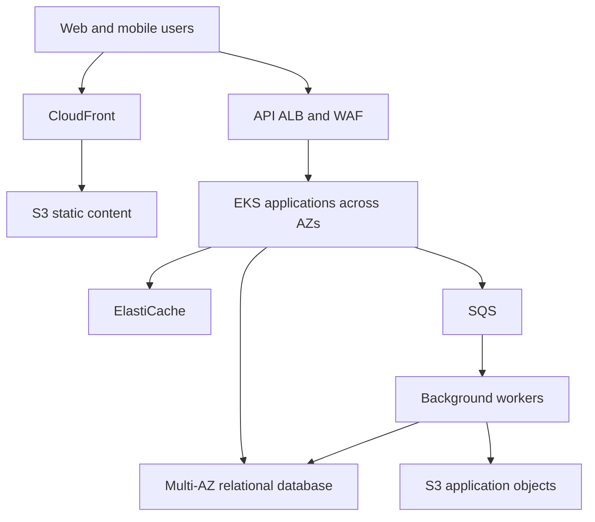
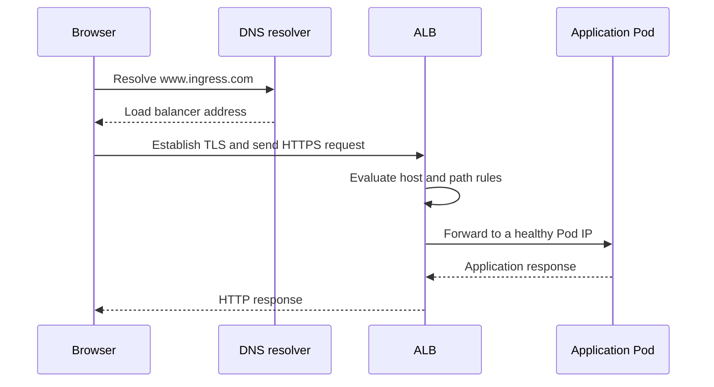
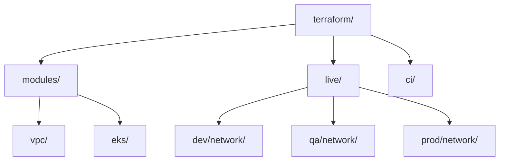

Below are detailed answers to all **28 EXL Service questions**, using **AWS and EKS** as the reference platform. Experience-based examples are illustrative—adapt them to work you have actually performed.

**1. You are onboarding a customer with 5 million+ users. How would you design the complete application architecture?**

I would first establish the workload requirements. Five million registered users gives the population; infrastructure sizing depends on active users, peak requests, transaction complexity, data volume, and reliability requirements.

I would clarify:

* Daily active users and peak concurrent users.
* Read/write ratio and expected request rate.
* Geographic distribution.
* Latency and availability objectives.
* Data sensitivity, tenant isolation, and retention.
* Recovery-time and recovery-point objectives.
* Budget and expected growth.

For example, **1 million daily active users making 50 requests each generates 50 million requests per day**, averaging approximately 580 requests per second. A peak ten times higher would be about 5,800 requests per second. These are illustrative assumptions; load testing determines actual capacity.

A possible architecture is:



The main design choices would be:

* **DNS and edge:** Route 53 for DNS, CloudFront for cacheable content, and WAF rules appropriate to the application.
* **Application tier:** Stateless services across availability zones, with readiness checks, disruption budgets, and horizontal scaling.
* **Data tier:** RDS or Aurora for transactional data, read replicas where useful, and carefully designed indexes and connection pools. Aurora provides several availability and failover mechanisms. [Aurora high availability](https://docs.aws.amazon.com/AmazonRDS/latest/AuroraUserGuide/Concepts.AuroraHighAvailability.html)
* **Caching:** Cache frequently accessed data, with explicit expiry and invalidation behavior.
* **Asynchronous processing:** Queues absorb bursts and separate user-facing requests from slower work.
* **Security:** Private application/data subnets, workload identities, least-privilege permissions, encryption, and controlled ingress.
* **Operations:** Infrastructure as code, progressive deployments, centralized telemetry, backups, and regional DR.

For customer onboarding into an existing platform, I would also define whether isolation requires a dedicated account/database or carefully enforced logical tenancy.

I would size the system to meet peak demand during the loss of an availability zone, then validate this through load and failure testing.

---

**2. Explain your complete CI/CD pipeline from commit to production.**

A representative workflow would be:

1. **Developer opens a pull request.** Required reviews and automated checks protect the main branch.
2. **Run early validation.** Formatting, linting, unit tests, secret scanning, dependency checks, and static analysis.
3. **Merge the approved change.** Record the exact source commit used for the release.
4. **Build the release artifact.** Create an immutable container image.
5. **Validate the image.** Scan dependencies and OS packages, generate an SBOM, and attach build provenance and a signature.
6. **Publish to ECR.** Record its digest and source commit.
7. **Deploy to a test environment.** Run integration, API-contract, security, and smoke tests.
8. **Promote the same artifact.** Update the appropriate environment configuration through a reviewed change.
9. **Deploy progressively.** Argo CD reconciles the desired state; a rollout controller manages canary or blue-green behavior.
10. **Evaluate production health.** Check application SLIs and business outcomes.
11. **Promote or recover.** Continue after successful analysis, or restore the stable release and record the recovery in Git.

The image digest remains the same across environments. Environment differences come from configuration and secret references.

I would retain a release record linking the commit, image digest, checks, approvals, deployment destination, and result. That makes both incident investigation and audit review much easier.

---

**3. Explain your Git branching strategy and environment mapping.**

I would normally prefer **short-lived feature branches with a protected main branch**.

A practical mapping is:

| Git event                   | Environment behavior                                              |
| --------------------------- | ----------------------------------------------------------------- |
| Feature-branch pull request | Validation and, where useful, a temporary preview environment     |
| Merge to `main`             | Build the release candidate and deploy to development/integration |
| Approved release candidate  | Promote the existing artifact to QA                               |
| Approved production release | Promote the tested artifact to production                         |

Production promotion should identify an exact commit and artifact digest.

If the organization needs a stabilization period, a short-lived `release/*` branch can map to QA. An approved artifact from that release branch then moves to production.

For a production defect:

1. Identify the affected release and mitigate customer impact.
2. Create a hotfix from the relevant production revision if necessary.
3. Run the required tests and deployment checks.
4. Release through the normal controlled process.
5. Merge or otherwise integrate the fix back into ongoing development.

Environment access must also be enforced through pipeline permissions and deployment identities. A branch-name condition alone is not a sufficient security boundary.

---

**4. If Git is the source of truth, why do we need Argo CD? Why not use Helm or kubectl directly?**

**Git records the desired state. Argo CD continuously compares that state with the cluster and reconciles differences.**

The tools serve different purposes:

| Tool        | Main responsibility                                                                   |
| ----------- | ------------------------------------------------------------------------------------- |
| Git         | Versioning, review, and desired-state history                                         |
| CI pipeline | Building, testing, and publishing artifacts                                           |
| Helm        | Packaging/rendering Kubernetes configuration and managing releases when used directly |
| `kubectl`   | Interacting with the Kubernetes API                                                   |
| Argo CD     | Continuous reconciliation, synchronization, and application visibility                |

With direct CI deployment, the cluster receives an update when the pipeline runs. If someone later changes a Deployment manually, another mechanism is needed to detect and handle that drift.

Argo CD can detect the difference and, when configured, restore the declared state automatically. Automatic synchronization, pruning, and self-healing are separate settings that should be enabled deliberately. [Argo CD synchronization](https://argo-cd.readthedocs.io/en/stable/user-guide/auto_sync/)

Argo CD also reduces the need for CI jobs to hold direct cluster deployment credentials.

Direct Helm deployment remains a valid design. Argo CD becomes particularly useful when managing many applications, environments, or clusters that need continuous reconciliation and a consistent operating model.

---

**5. Explain the request flow from `www.ingress.com` to an application Pod.**

Treating the hostname as an example, assume **EKS with an ALB configured by AWS Load Balancer Controller using IP targets**.



The detailed flow is:

1. **DNS resolution:** The browser and operating system check caches, then use DNS resolution to obtain the load balancer address.
2. **Connection establishment:** The client establishes the connection and negotiates TLS. Plain HTTP can redirect to HTTPS if configured.
3. **Listener processing:** The ALB accepts the request and evaluates its listener rules.
4. **Routing:** The hostname and URL path select the appropriate target group.
5. **Backend selection:** The ALB chooses a healthy registered Pod target.
6. **Application execution:** The container handles the request and accesses any required dependencies.
7. **Response:** The response returns through the ALB to the client.

The **Ingress object is configuration**, not a proxy through which packets physically travel. The controller watches Kubernetes resources and configures AWS listeners, routing rules, and target groups.

In **IP mode**, the ALB forwards directly to Pod IPs. In **instance mode**, it forwards to node NodePorts. A Service’s ClusterIP is therefore not a mandatory network hop in every ingress architecture. [AWS Load Balancer Controller traffic modes](https://kubernetes-sigs.github.io/aws-load-balancer-controller/latest/how-it-works/)

---

**6. How would you expose an application internally without LoadBalancer or NodePort?**

For access **inside the Kubernetes cluster**, I would use a **ClusterIP Service**:

```yaml
apiVersion: v1
kind: Service
metadata:
  name: orders
  namespace: applications
spec:
  type: ClusterIP
  selector:
    app: orders
  ports:
    - name: http
      port: 80
      targetPort: 8080
```

Clients in the same namespace can use:

```text
http://orders
```

Clients in another namespace can use:

```text
http://orders.applications
```

With the default cluster domain, the full name is:

```text
orders.applications.svc.cluster.local
```

The Service selects matching Pods and provides a stable access point while Pods are replaced or scaled. [Kubernetes Services](https://kubernetes.io/docs/concepts/services-networking/service/)

If “internal” means users outside Kubernetes but inside the corporate network, ClusterIP alone normally does not provide that access. A private gateway, proxy, or explicitly supported routing arrangement is needed.

---

**7. How do you block communication between Pods in different namespaces? Where does the NetworkPolicy go?**

A NetworkPolicy is created **in the namespace containing the Pods it selects**.

Ingress rules control connections into selected Pods. Egress rules control connections leaving them. The networking implementation must support and enforce NetworkPolicy.

This example allows ordinary Pod communication only within the `payments` namespace:

```yaml
apiVersion: networking.k8s.io/v1
kind: NetworkPolicy
metadata:
  name: same-namespace-only
  namespace: payments
spec:
  podSelector: {}
  policyTypes:
    - Ingress
    - Egress
  ingress:
    - from:
        - podSelector: {}
  egress:
    - to:
        - podSelector: {}
```

A peer `podSelector` without a `namespaceSelector` selects Pods in the policy’s namespace.

I would apply equivalent policies in each namespace requiring isolation, then add narrowly scoped allowances for legitimate dependencies.

**This base policy also blocks DNS servers outside the namespace.** Add the appropriate DNS egress rule for the cluster’s DNS configuration before rollout.

Policies are additive: another policy granting broader access can expand what is allowed. Test both permitted and prohibited connections. [Kubernetes NetworkPolicies](https://kubernetes.io/docs/concepts/services-networking/network-policies/)

---

**8. How would you implement a canary where only 10% of users receive the new version?**

I would first distinguish **10% of users** from **10% of requests**.

Weighted traffic routing usually distributes requests. The same user might therefore reach both versions. For a consistent user experience, I would assign a stable cohort.

For example:

* Use a verified user identifier to compute a stable bucket.
* Assign approximately 10% of buckets to the canary.
* For anonymous visitors, use a protected assignment cookie.
* Have a trusted gateway attach the internal routing information.
* Route the canary cohort to the new version.

Header-based routing is supported by systems such as Istio. Public clients should not be allowed to supply arbitrary trusted internal routing headers. [Istio request routing](https://istio.io/latest/docs/tasks/traffic-management/request-routing/)

The pipeline would:

1. Build, test, scan, and publish the new image.
2. Update the release configuration in Git.
3. Create the canary workload.
4. Enable routing for the selected cohort.
5. Run automated health analysis.
6. Expand the cohort progressively or abort.

When several services participate, propagate the cohort consistently rather than independently randomizing each hop.

Rollback must also disable the cohort-routing override. Setting a weighted route to zero is insufficient if a separate header rule still sends users to the canary.

If the requirement is simply 10% of requests, a rollout controller with weighted traffic routing is simpler. [Argo Rollouts canary deployments](https://argo-rollouts.readthedocs.io/en/stable/features/canary/)

---

**9. How would you verify that the canary is healthy before moving to 100%?**

I would compare the canary with the stable release using **release-specific metrics**, sufficient traffic, and an appropriate observation period.

| Area              | Signals                                                                  |
| ----------------- | ------------------------------------------------------------------------ |
| Availability      | Successful requests, failed requests, timeouts                           |
| Performance       | p95/p99 latency, throughput, queue delay                                 |
| Runtime health    | Restarts, OOM events, CPU throttling, memory growth                      |
| Dependencies      | Database errors, connection-pool saturation, downstream failures         |
| Business outcomes | Login success, completed transactions, conversion, duplicate processing  |
| Data correctness  | Validation failures, unexpected record changes, processing discrepancies |

A passing readiness probe only confirms a limited health condition. An application can return HTTP 200 while producing incorrect business results.

Promotion gates should include:

* Thresholds derived from application SLOs.
* Comparison with the stable cohort.
* A minimum request or transaction count.
* Enough time to observe relevant workload behavior.
* An explicit response to missing telemetry.

I would progress through intermediate stages such as 10%, 25%, and 50%, evaluating each stage before full promotion.

Argo Rollouts analysis can continue, abort, or pause a rollout according to the analysis result. [Argo Rollouts analysis](https://argo-rollouts.readthedocs.io/en/stable/features/analysis/)

On failure, I would restore stable traffic, preserve evidence, and update the release intent in Git.

---

**10. Do you execute Terraform locally or through CI/CD? Explain the workflow.**

For shared and production infrastructure, I would use **CI/CD for controlled applies**. Engineers can run local formatting, validation, and authorized planning while developing changes.

The production workflow would be:

1. Create a branch and modify the configuration.
2. Run formatting and validation.
3. Open a pull request.
4. Generate a plan using the intended environment identity and backend.
5. Run security and policy checks.
6. Review the planned changes.
7. Apply the approved saved plan.
8. Retain execution records and verify the resulting infrastructure.

Typical commands are:

```bash
terraform init -input=false
terraform fmt -check -recursive
terraform validate
terraform plan -input=false -out=tfplan
```

After the required authorization:

```bash
terraform apply -input=false tfplan
```

I would use remote encrypted state, state locking, short-lived credentials, pinned provider versions, and restricted plan artifacts.

The apply stage must use the reviewed source, backend, and saved plan. If relevant state or configuration changes, regenerate and review the plan.

For AWS, the S3 backend supports native locking through `use_lockfile`. [Terraform S3 backend](https://developer.hashicorp.com/terraform/language/backend/s3)

---

**11. How do you prevent conflicts when two engineers work on the same Terraform code?**

There are three different problems to control:

| Problem                         | Control                                              |
| ------------------------------- | ---------------------------------------------------- |
| Conflicting code changes        | Git branches, reviews, and merge-conflict resolution |
| Concurrent Terraform operations | Backend locking and pipeline concurrency controls    |
| Changes made outside Terraform  | Drift detection and reconciliation                   |

An example backend configuration is:

```hcl
terraform {
  backend "s3" {
    bucket       = "example-company-tfstate-prod"
    key          = "payments/prod/network.tfstate"
    region       = "eu-west-1"
    encrypt      = true
    use_lockfile = true
  }
}
```

The bucket must already exist and have appropriate access, versioning, and recovery controls. DynamoDB-based S3 locking is deprecated in current Terraform documentation. [S3 state locking](https://developer.hashicorp.com/terraform/language/backend/s3)

A state lock exists during an operation; it does not necessarily remain held throughout an approval wait. Plans can become stale.

If a lock remains after a failed process, I would confirm that no operation is still active before considering `terraform force-unlock`. [Terraform force-unlock](https://developer.hashicorp.com/terraform/cli/commands/force-unlock)

For drift, scheduled plans can detect differences. With `-detailed-exitcode`, exit code `0` means no changes, `2` means changes, and `1` means an error. The team then decides whether to restore the declared configuration or approve the external change in code.

---

**12. Draw your Terraform repository structure. How do dev, QA, and prod consume shared modules?**

I would separate **reusable modules** from **environment-specific root configurations**.



| Location             | Contents                                                |
| -------------------- | ------------------------------------------------------- |
| `modules/vpc/`       | VPC resources, input variables, outputs                 |
| `modules/eks/`       | Cluster-related resources, inputs, outputs              |
| `live/dev/network/`  | Development root configuration and backend              |
| `live/qa/network/`   | QA root configuration and backend                       |
| `live/prod/network/` | Production root configuration and backend               |
| `ci/`                | Validation, planning, policy, and deployment automation |

Each environment root can consume the same module:

```hcl
module "vpc" {
  source = "../../../modules/vpc"

  environment = var.environment
  cidr_block  = var.vpc_cidr
}
```

Environment inputs might be:

| Environment | CIDR           | State key              |
| ----------- | -------------- | ---------------------- |
| Dev         | `10.10.0.0/16` | `dev/network.tfstate`  |
| QA          | `10.20.0.0/16` | `qa/network.tfstate`   |
| Prod        | `10.30.0.0/16` | `prod/network.tfstate` |

Provider configuration selects the intended account and region. Each root owns its own state; a child module does not automatically receive a separate state file. [Terraform module composition](https://developer.hashicorp.com/terraform/language/modules/develop/composition)

Local modules use the checked-out repository revision. If environments need independent module-version promotion, publish versioned modules or use immutable remote references.

---

**13. Two VPCs have overlapping CIDRs, and Transit Gateway is prohibited. What would you recommend?**

For access to **specific applications or services**, I would normally recommend **AWS PrivateLink**.

The arrangement is:

1. The provider VPC exposes its application through a Network Load Balancer.
2. It publishes an endpoint service and permits the intended consumers.
3. The consumer VPC creates an interface endpoint in its own subnets.
4. Clients use the endpoint’s DNS name or an approved private DNS mapping.
5. Security groups and application authentication control access.

PrivateLink supports this service-access pattern even when VPC address ranges overlap. [AWS PrivateLink connectivity](https://docs.aws.amazon.com/whitepapers/latest/aws-vpc-connectivity-options/aws-privatelink.html)

Its scope matters: it provides access to published services, not unrestricted routed connectivity between every host in both VPCs.

If full bidirectional network connectivity is required, I would evaluate:

* Renumbering or rebuilding one network with a non-overlapping address plan.
* A carefully designed NAT/proxy appliance solution over a suitable transport, such as VPN, using translated address ranges.

VPC peering cannot be created while the VPC CIDRs overlap. Adding a non-overlapping secondary CIDR does not remove that restriction if another CIDR still overlaps. [VPC peering limitations](https://docs.aws.amazon.com/vpc/latest/peering/vpc-peering-basics.html)

---

**14. Explain a DR strategy, including RTO, RPO, failover, and traffic redirection.**

An illustrative design would be **warm standby in a second AWS Region**.

First, I would agree on business targets:

* **RTO:** How quickly the service must be restored after a disaster.
* **RPO:** How much recent data loss the business can tolerate.

For example, RTO might be 30 minutes and RPO five minutes. These would be agreed targets, not assumed capabilities. [AWS DR planning](https://docs.aws.amazon.com/wellarchitected/latest/reliability-pillar/plan-for-disaster-recovery-dr.html)

The recovery region would have:

* Reproducible infrastructure and minimum operating capacity.
* Available application images and configuration.
* An appropriate database replication arrangement.
* Replicated object data and protected backups.
* Working secrets, encryption keys, identity, and DNS access.

The failover process would:

1. Declare the incident and establish operational ownership.
2. Use a tested write-fencing mechanism to prevent conflicting database writers.
3. Promote or recover the secondary data tier.
4. Scale application capacity and validate dependencies.
5. Redirect traffic using the chosen DNS or global traffic mechanism.
6. Run end-to-end checks and monitor service recovery.

DNS failover is affected by caching and existing client connections.

Failback requires data reconciliation and restored replication before traffic moves back. I would run recovery exercises and record measured recovery time and data loss.

---

**15. Explain Rolling Update, Blue-Green, and Canary deployments.**

| Strategy       | How it works                                            | Main benefit                                                                             | Main consideration                         |
| -------------- | ------------------------------------------------------- | ---------------------------------------------------------------------------------------- | ------------------------------------------ |
| Rolling Update | Gradually replaces old replicas with new replicas       | Moderate additional capacity                                                             | Old and new versions coexist               |
| Blue-Green     | Runs two versions and switches production traffic       | Fast traffic switch and straightforward fallback while the old version remains available | Additional capacity and data compatibility |
| Canary         | Exposes a limited cohort or traffic share, then expands | Measures real production behavior before broad release                                   | Requires routing and reliable analysis     |

For a Kubernetes rolling update, `maxSurge` controls extra Pods and `maxUnavailable` controls how many desired replicas may be unavailable.

A standard Deployment does not automatically reverse a release because business metrics deteriorate. That requires additional deployment or monitoring automation. [Kubernetes Deployments](https://kubernetes.io/docs/concepts/workloads/controllers/deployment/)

All three strategies need compatible APIs and database changes while versions coexist.

Traffic rollback also does not automatically reverse database writes, emitted events, or external side effects.

---

**16. Which deployment strategy would you choose for a mission-critical application?**

My usual choice would be **a canary with automated health analysis and rapid traffic recovery**, provided the application and routing platform support it.

The reasons are:

* Initial exposure is limited.
* The release is tested against real production behavior.
* Latency, errors, and business outcomes can be compared with the stable version.
* Promotion can stop before most users are affected.

I would retain enough stable capacity to accept traffic immediately if the canary fails.

For a release requiring extensive parallel validation and a coordinated cutover, blue-green may be more suitable. The additional environment provides a useful preview target, but the final traffic switch still needs monitoring.

My decision would consider traffic volume, statefulness, database compatibility, available capacity, and recovery requirements.

For either strategy, I would require backward-compatible migrations, explicit rollback or roll-forward procedures, and a tested response to telemetry failure. No deployment strategy compensates for an incompatible data change on its own.

---

**17. Have you worked on Databricks pipelines? Explain the experience.**

For this question, distinguish the work you personally owned: data transformation, platform provisioning, job orchestration, CI/CD, governance, or operations.

A representative Databricks pipeline could process application events as follows:

| Layer  | Processing                                          |
| ------ | --------------------------------------------------- |
| Bronze | Ingest raw data from sources such as S3             |
| Silver | Validate schemas, deduplicate, clean, and enrich    |
| Gold   | Produce business aggregates and analytical datasets |

This is commonly called a medallion architecture. [Databricks medallion architecture](https://docs.databricks.com/aws/en/lakehouse/medallion)

A DevOps/platform contribution could include:

* Provisioning workspaces and configuring access.
* Managing compute policies and environment configuration.
* Deploying notebooks, Python packages, jobs, and pipeline definitions.
* Configuring task dependencies, schedules, retries, and notifications.
* Applying Unity Catalog permissions.
* Monitoring failures, data freshness, duration, and cost.
* Supporting checkpoints and safe retry behavior.

Databricks provides Lakeflow Jobs for workflow orchestration. [Lakeflow Jobs](https://docs.databricks.com/aws/en/jobs/)

For deployment, current documentation uses **Declarative Automation Bundles**, formerly Databricks Asset Bundles, to version and deploy project code and resource definitions. [Databricks bundles](https://docs.databricks.com/aws/en/dev-tools/bundles/)

If your responsibility was pipeline deployment rather than Spark transformation development, state that clearly and explain your part in depth.

---

**18. What do you know about Apache Hadoop and its ecosystem?**

Apache Hadoop provides infrastructure for distributed storage and processing of large datasets.

| Core component | Responsibility                             |
| -------------- | ------------------------------------------ |
| Hadoop Common  | Shared libraries and utilities             |
| HDFS           | Distributed file storage                   |
| YARN           | Cluster resource management and scheduling |
| MapReduce      | Distributed batch processing               |

In HDFS, the NameNode manages filesystem metadata and DataNodes store data blocks. In YARN, the ResourceManager and NodeManagers participate in allocating and managing execution resources. [Apache Hadoop](https://hadoop.apache.org/)

Related ecosystem tools include:

* **Hive:** SQL-oriented analytics.
* **HBase:** Distributed wide-column storage.
* **Spark:** Distributed processing for batch, streaming, and other workloads.
* **ZooKeeper:** Coordination used by distributed systems.

Spark can integrate with Hadoop, but using Spark does not necessarily mean operating an HDFS cluster.

Operational concerns include NameNode health, available disk space, under-replicated blocks, resource contention, failed tasks, data skew, and excessive shuffle activity.

For a cloud design, I would evaluate whether object storage and managed processing services better match the workload and operating model.

---

**19. Which EC2 instance types have you used, and why?**

Use the exact families and sizes from your own projects. A useful way to explain the choice is:

| Family examples | Typical reason to choose it                               |
| --------------- | --------------------------------------------------------- |
| `m7i`, `m7g`    | Balanced CPU and memory for general application workloads |
| `c7i`, `c7g`    | CPU-intensive processing or compute-heavy services        |
| `r7i`, `r7g`    | Memory-intensive applications and analytics               |
| `t3`, `t4g`     | Low baseline CPU demand with occasional bursts            |
| `i4i`           | Workloads needing high local-storage performance          |

AWS groups instance families by workload characteristics. [EC2 instance types](https://docs.aws.amazon.com/ec2/latest/instancetypes/instance-types.html)

I would justify the choice using CPU and memory demand, storage latency, network throughput, architecture compatibility, and measured cost.

For Graviton-based instances, application images and dependencies must support Arm.

For burstable instances, I would monitor CPU credits and understand sustained-load behavior. For instance-store workloads, I would account for the storage lifecycle and durability requirements.

Spot, On-Demand, and commitment-based discounts are purchasing choices; they are separate from the hardware-family decision.

---

**20. Explain Git Merge versus Git Rebase.**

| Aspect              | Merge                                                     | Rebase                                      |
| ------------------- | --------------------------------------------------------- | ------------------------------------------- |
| Operation           | Combines development histories                            | Replays commits onto a new base             |
| Existing commit IDs | Preserved                                                 | Replayed commits receive new IDs            |
| History             | May include a merge commit; fast-forward is also possible | Usually produces a more linear history      |
| Typical use         | Integrating shared branches                               | Updating a privately managed feature branch |

On a feature branch after fetching remote changes:

```bash
git merge origin/main
```

Alternatively:

```bash
git rebase origin/main
```

During a rebase conflict:

```bash
git add path/to/resolved-file
git rebase --continue
```

To cancel:

```bash
git rebase --abort
```

I would keep shared main/release history stable and coordinate any rewriting of already-published feature branches.

Rebase changes commit identity, so collaborators working from the previous history must reconcile their branches. [Git rebasing](https://git-scm.com/book/en/v2/Git-Branching-Rebasing)

---

**21. Give a real-world use case for AWS Lambda.**

A practical example is **processing uploaded images**.

The workflow could be:

1. A user uploads an image to a versioned S3 bucket.
2. An event places a message on SQS.
3. Lambda consumes the message.
4. The function validates the object and creates thumbnails.
5. It writes outputs to a separate location.
6. It records processing status in DynamoDB.
7. Monitoring tracks failures, duration, and queue age.

SQS buffers bursts so the application does not need enough continuously running workers for the highest upload peak.

I would make processing idempotent using the object identity and version, since Lambda’s SQS integration can process records more than once. Failed records should be retried appropriately and eventually reach a dead-letter queue when recovery requires investigation. [Lambda with SQS](https://docs.aws.amazon.com/lambda/latest/dg/with-sqs.html)

The output bucket or event-filtered prefix should prevent processed files from recursively triggering the same workflow. [Lambda with S3 events](https://docs.aws.amazon.com/lambda/latest/dg/with-s3.html)

Concurrency limits would protect downstream systems and control consumption.

---

**22. Where do you store CI/CD secrets?**

I would minimize stored secrets by using **short-lived federated identities** wherever supported.

For example, GitHub Actions can exchange an OIDC identity for temporary cloud credentials. The cloud trust configuration should restrict the approved repository and deployment context. [GitHub Actions OIDC](https://docs.github.com/en/actions/concepts/security/openid-connect)

For credentials that must be stored, I would use a central secret manager such as AWS Secrets Manager or HashiCorp Vault.

The controls would include:

* Separate credentials and permissions per environment.
* Narrow access for the job that needs the credential.
* Rotation and audit logging.
* Restricted access to production pipeline definitions.
* Ephemeral build agents where appropriate.
* Protected handling of artifacts and logs.

Jenkins also provides a credentials store with scoped credential references. Its administrative access and backups must be protected. [Jenkins credentials](https://www.jenkins.io/doc/book/using/using-credentials/)

Log masking is a useful safeguard, but it does not prevent a privileged or malicious pipeline from misusing a secret. Control who can modify code that executes with those permissions.

---

**23. Where do you store application configuration and secrets?**

I would separate them according to sensitivity and lifecycle:

| Information                         | Typical location                                |
| ----------------------------------- | ----------------------------------------------- |
| Non-sensitive application settings  | Git-managed configuration and ConfigMaps        |
| Dynamic application settings        | A controlled configuration service where needed |
| Passwords, API tokens, certificates | Secrets Manager or Vault                        |
| Kubernetes runtime secret material  | Kubernetes Secrets or supported secret mounts   |
| AWS access permissions              | Workload identity rather than embedded AWS keys |

For EKS workloads, a supported integration such as EKS Pod Identity can provide temporary AWS credentials to the application. [EKS Pod Identity](https://docs.aws.amazon.com/eks/latest/userguide/pod-identities.html)

An external-secret controller can retrieve values from the secret manager and create Kubernetes Secrets. Another option is mounting values through a supported secrets provider.

Kubernetes Secret encoding is not encryption. Verify encryption at rest, RBAC, and who can create workloads that consume the secret.

Rotation must include application behavior: mounted values may need reloading, while environment-variable values generally require a restart.

Secrets Manager supports controls for encryption, permissions, rotation, monitoring, and regional replication. [Secrets Manager practices](https://docs.aws.amazon.com/secretsmanager/latest/userguide/best-practices.html)

---

**24. A developer commits AWS credentials to Git. What is your incident-response process?**

I would treat the credentials as potentially compromised, including when the repository is private.

**First, contain access:**

1. Identify the affected credential and AWS identity.
2. Disable the exposed access key promptly.
3. Replace any legitimate dependency on it through the approved secret mechanism.
4. Investigate temporary sessions obtained using that identity and revoke their permissions where necessary.

Disabling a long-lived key is not a complete response if the attacker has already obtained usable temporary credentials. AWS provides controls for disabling temporary-session permissions and revoking role sessions. [Temporary credential controls](https://docs.aws.amazon.com/IAM/latest/UserGuide/id_credentials_temp_control-access_disable-perms.html), [Role-session revocation](https://docs.aws.amazon.com/IAM/latest/UserGuide/id_roles_use_revoke-sessions.html)

**Then determine scope and remove persistence:**

* Preserve the relevant commit, timestamps, identifiers, and audit evidence securely.
* Investigate CloudTrail across relevant accounts and Regions.
* Examine unexpected role assumptions, policy changes, new credentials, resource creation, and data access.
* Review GuardDuty findings and unusual usage or spending.
* Investigate additional secrets the identity could access.
* Remove unauthorized resources or access paths through the incident process.

Available logs determine what can be established; missing data-event logs do not prove that no data was accessed.

**Clean up the exposure:**

Remove the secret from current code, artifacts, and affected storage. Coordinate history rewriting when necessary, including branches, tags, and collaborator clones. Rotation comes before repository cleanup because deleting a commit does not invalidate a credential already copied elsewhere. [GitHub sensitive-data removal](https://docs.github.com/en/authentication/keeping-your-account-and-data-secure/removing-sensitive-data-from-a-repository)

Finally, document the incident and improve secret scanning, push protection, short-lived identity, and permission scope.

---

**25. What metrics do you monitor using Prometheus?**

I would cover user experience, application behavior, dependencies, and infrastructure.

| Layer                | Metrics                                                             |
| -------------------- | ------------------------------------------------------------------- |
| Application          | Request rate, errors, latency, active requests                      |
| Kubernetes workloads | Restarts, readiness, unavailable replicas, Pending Pods             |
| Containers           | CPU, throttling, memory, resource requests and limits               |
| Nodes                | CPU, available memory, filesystem capacity, disk and network errors |
| Dependencies         | Database connections, cache hit rate, queue depth and age           |
| Monitoring system    | Target availability, scrape failures, rule-evaluation health        |

Useful examples include:

* `kube_pod_container_status_restarts_total`
* `container_cpu_usage_seconds_total`
* `container_memory_working_set_bytes`
* `node_filesystem_avail_bytes`

For an application exposing a classic latency histogram, an illustrative p95 query is:

```promql
histogram_quantile(
  0.95,
  sum by (le, service) (
    rate(http_request_duration_seconds_bucket[5m])
  )
)
```

Metric names and labels must match the actual instrumentation. Histogram buckets also affect the accuracy and usefulness of the result. [Prometheus histograms](https://prometheus.io/docs/practices/histograms/)

I would avoid unbounded labels such as user IDs, request IDs, and raw URLs because they create excessive time-series cardinality. [Prometheus instrumentation practices](https://prometheus.io/docs/practices/instrumentation/)

---

**26. What Grafana dashboards and alerts would you configure?**

Examples worth discussing are:

| Dashboard           | Purpose                                                      |
| ------------------- | ------------------------------------------------------------ |
| Service overview    | Request rate, error ratio, latency, current release          |
| Kubernetes health   | Unavailable replicas, restarts, Pending Pods, node health    |
| Capacity            | Requests versus usage, scheduling pressure, scaling behavior |
| Dependencies        | Database, cache, queue, and external-service health          |
| Release comparison  | Stable-versus-canary behavior                                |
| Reliability         | SLO compliance and error-budget consumption                  |
| Cost and efficiency | Resource allocation, utilization, and linked cost data       |

For alerts, I would prioritize user-impacting failures:

* Sustained availability or latency deterioration.
* Excessive error-budget consumption.
* No healthy replicas for a critical workload.
* Queue age approaching a business deadline.
* Database saturation affecting requests.
* Missing critical telemetry.

Every actionable alert should identify the service owner, severity, dashboard, and runbook.

Grafana Alerting supports rule evaluation, notification routing, grouping, and silences. I would define explicit behavior for missing data and evaluation errors and avoid duplicate paging from overlapping alert systems. [Grafana Alerting](https://grafana.com/docs/grafana/latest/alerting/fundamentals/)

For an experience answer, explain one alert that helped diagnose a real issue and how you reduced false positives.

---

**27. What monitoring agents would you install?**

The selection depends on what must be collected:

| Component                | Purpose                                | Common placement                          |
| ------------------------ | -------------------------------------- | ----------------------------------------- |
| Node Exporter            | Linux host metrics                     | DaemonSet or host service                 |
| kube-state-metrics       | Kubernetes object-state metrics        | Deployment                                |
| Kubelet/cAdvisor metrics | Container resource usage               | Exposed by the node’s existing components |
| Fluent Bit               | Log collection and forwarding          | DaemonSet                                 |
| OpenTelemetry Collector  | Receive, process, and export telemetry | Agent and/or gateway deployment           |
| CloudWatch Agent         | Additional EC2 metrics and logs        | EC2 instances where required              |

kube-state-metrics reports Kubernetes object state, such as desired and available replicas; it does not replace a host resource exporter. [kube-state-metrics](https://github.com/kubernetes/kube-state-metrics)

OpenTelemetry Collector supports different deployment patterns according to collection and processing needs. [Collector deployment patterns](https://opentelemetry.io/docs/collector/deploy/)

I would choose a coherent collection path instead of sending duplicate copies of every signal through several agents. Agent health, dropped data, permissions, resource overhead, and upgrade compatibility also need monitoring.

---

**28. How do you optimize infrastructure cost using monitoring and observability?**

I would combine **usage telemetry with actual billing data**. CPU dashboards alone cannot establish the financial impact of a change.

The process would be:

1. Attribute resources and costs to teams, services, and environments.
2. Establish a representative usage baseline.
3. Identify waste and capacity mismatches.
4. Make controlled changes.
5. Verify savings alongside latency, availability, and operational impact.

| Observation                                 | Possible action                                     |
| ------------------------------------------- | --------------------------------------------------- |
| Persistently low instance utilization       | Evaluate a smaller or better-matched instance       |
| Kubernetes requests much higher than demand | Adjust requests and validate scheduling/autoscaling |
| Idle non-production environments            | Schedule shutdown or use expiry-based cleanup       |
| Unused disks, load balancers, or addresses  | Confirm ownership and remove unnecessary resources  |
| Retryable burst workloads                   | Evaluate interruption-tolerant capacity             |
| High transfer costs                         | Review placement, caching, and data movement        |
| Excessive telemetry cost                    | Reduce unnecessary logs, cardinality, and retention |
| Stable baseline usage                       | Evaluate appropriate commitment discounts           |

AWS Cost Explorer provides cost and usage analysis, while Compute Optimizer can help identify resource-configuration opportunities. Recommendations still need workload validation. [Cost Explorer](https://docs.aws.amazon.com/cost-management/latest/userguide/ce-what-is.html), [Compute Optimizer](https://docs.aws.amazon.com/compute-optimizer/latest/ug/what-is-compute-optimizer.html)

For Kubernetes, resource requests and HPA behavior must be considered together: changing CPU requests can change utilization-based scaling.

I would report efficiency measures such as **cost per successful transaction, processed event, or active customer**, alongside the application’s reliability and performance.
