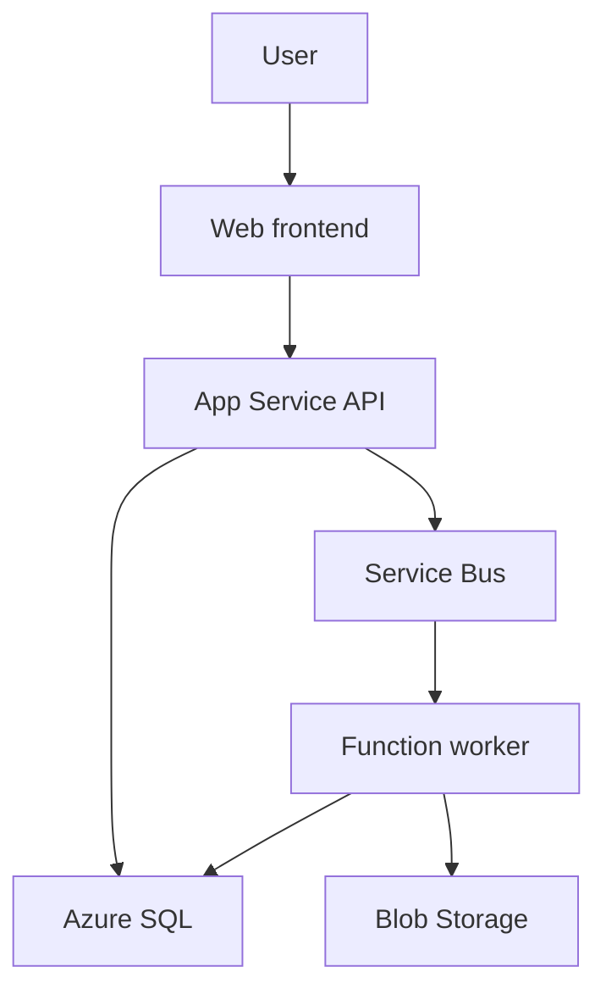

Below are detailed answers to questions **1–15**. I’m assuming “land job activity” means **landing zone activities**, and the final scenario refers to **continuous video/CCTV recording**. First-person examples are templates—adapt them to your actual experience.

**1. What are landing zone activities in migration?**

An **Azure landing zone** is the foundation prepared before applications move to Azure. It establishes how workloads will be organized, connected, secured, governed, and operated.

Typical activities include:

| Area            | Migration preparation                                                                |
| --------------- | ------------------------------------------------------------------------------------ |
| Organization    | Define management groups, subscriptions, resource groups, naming, and tagging        |
| Identity        | Configure Microsoft Entra ID, RBAC, privileged access, and workload identities       |
| Networking      | Plan address ranges, VNets, subnets, DNS, firewalls, and on-premises connectivity    |
| Governance      | Apply Azure Policy for approved regions, configurations, and organizational controls |
| Operations      | Configure monitoring, logging, backup, and recovery requirements                     |
| Cost management | Establish budgets, ownership tags, and cost reporting                                |
| Automation      | Deploy repeatable infrastructure through Terraform or Bicep                          |

A **platform landing zone** provides shared capabilities such as connectivity and governance. An **application landing zone** hosts a workload within those controls. ([Microsoft Learn][1])

An interview answer could be:

> “Before migration, I prepare the target environment: subscriptions, access controls, networking, DNS, policies, monitoring, and deployment automation. Then I validate that the application can reach its dependencies and that the operational controls work before the migration cutover.”

Application discovery, dependency assessment, data replication, testing, cutover, and rollback planning are related migration activities, but they extend beyond landing zone preparation.

**2. What basic Azure services would you consider?**

I would start with the application’s requirements and select services accordingly.

| Requirement               | Azure services to consider                                                 |
| ------------------------- | -------------------------------------------------------------------------- |
| Resource organization     | Subscriptions, resource groups, management groups                          |
| Identity and permissions  | Microsoft Entra ID, Azure RBAC, managed identities                         |
| Networking                | VNet, subnets, NSGs, route tables, Private DNS                             |
| Hybrid connectivity       | VPN Gateway or ExpressRoute                                                |
| Web applications and APIs | Azure App Service                                                          |
| Background processing     | Azure Functions                                                            |
| Virtual machines          | Azure Virtual Machines                                                     |
| Relational database       | Azure SQL Database or SQL Managed Instance                                 |
| Files and objects         | Azure Files and Blob Storage                                               |
| Messaging                 | Azure Service Bus                                                          |
| Secrets and certificates  | Azure Key Vault                                                            |
| Application monitoring    | Azure Monitor, Application Insights, Log Analytics                         |
| Application entry point   | Application Gateway/WAF or Azure Front Door, depending on the access model |
| Delivery automation       | Azure Pipelines with Terraform or Bicep                                    |

For the .NET application in your question, my initial design would consider **App Service, Functions, Service Bus, Azure SQL, Storage, Key Vault, and monitoring**. App Service provides managed hosting for web applications and APIs. ([Microsoft Learn][2])

The important interview point is explaining **why each service is needed**, rather than listing every Azure service.

**3. Explain hub-and-spoke topology**

Hub-and-spoke separates shared network services from individual workload networks.

* The **hub VNet** contains shared connectivity and infrastructure: VPN/ExpressRoute gateways, DNS resolution, and optionally Azure Firewall.
* **Spoke VNets** contain workloads, often separated by application, environment, or ownership.
* VNet peering connects each spoke to the hub.

Example:

| Network             | Illustrative address space | Purpose                            |
| ------------------- | -------------------------- | ---------------------------------- |
| Hub                 | `10.0.0.0/16`              | Shared connectivity, firewall, DNS |
| Production spoke    | `10.10.0.0/16`             | Production workloads               |
| Nonproduction spoke | `10.20.0.0/16`             | Development and testing            |

These address spaces must fit the organization’s wider IP plan.

**Peering is not automatically transitive.** Connecting two spokes to the same hub does not, by itself, establish communication between those spokes. That requires an explicit design, such as direct peering or routing through a firewall/router.

For spokes to use the hub gateway, configure gateway transit on the hub-side peering and remote gateway usage on the spoke side. Configure routes and forwarded-traffic settings where the design requires them. ([Microsoft Learn][3])

The benefits are shared connectivity costs, consistent controls, workload separation, and centralized network operations. However, creating a hub firewall alone does not force traffic through it; routing must enforce the intended path.

**4. What are your day-to-day activities? Is your role support or project work?**

Explain both your responsibilities and the balance between planned delivery and operations.

A suitable template is:

> “My role includes project delivery and operational support. For project work, I provision infrastructure, develop deployment pipelines, configure networking and access, and onboard applications. For operations, I investigate alerts, troubleshoot failed deployments and connectivity issues, support releases, and improve reliability through automation.”

Typical activities include:

* Reviewing application health, alerts, and failed pipeline runs.
* Working on infrastructure changes through Terraform pull requests.
* Supporting developers with deployment and configuration issues.
* Troubleshooting DNS, permissions, networking, and application dependencies.
* Deploying approved changes to QA, UAT, and production.
* Reviewing resource utilization and costs.
* Updating runbooks and completing incident follow-up actions.

If the role is mostly support, say so and explain the engineering improvements you contribute. If it is project-focused, explain the milestones and deliverables you own.

**5. What pipelines do you handle—QA, UAT, and production?**

**QA and UAT are deployment environments**, while a pipeline defines the build, test, and deployment process.

A typical structure is:

| Stage                   | Main activities                                                |
| ----------------------- | -------------------------------------------------------------- |
| Pull request validation | Compile, unit tests, code analysis, dependency/security checks |
| Build                   | Produce a versioned application package or image               |
| Development             | Deploy and run basic smoke tests                               |
| QA                      | Run integration, regression, and automated functional tests    |
| UAT                     | Let business users validate acceptance criteria                |
| Production              | Apply release approvals, deploy, and verify application health |

For a .NET application, build activities commonly include restoring dependencies, building, testing, and publishing the application.

**Build once and promote the same artifact** through environments. Supply environment-specific configuration separately.

I would also separate database instances, messaging entities, secrets, and deployment permissions between environments. A UAT worker should not accidentally consume production messages.

Azure Pipelines environments can track deployments and enforce approvals and checks. Resource owners configure these checks independently of the pipeline YAML. ([Microsoft Learn][4])

For App Service, an appropriate plan can provide deployment slots so that a release is deployed and validated before a production swap. Database changes still need their own compatibility and rollback strategy. ([Microsoft Learn][5])

**6. How many team members are there?**

Give your actual team size and explain how responsibilities are divided.

For example:

> “Our immediate team has [N] members: [number] developers, [number] QA engineers, [number] DevOps/cloud engineers, and [other roles]. We also work with shared networking, security, and database teams. I own [specific responsibilities] and coordinate with [teams] for changes outside my ownership.”

The interviewer is usually assessing collaboration, scope, and ownership. Avoid inventing a team size or claiming that you personally own every component.

**7. Is the deployment model IaaS or SaaS?**

For your App Service, Functions, and Service Bus example, the missing category is **PaaS**.

| Model           | What you manage                                                     | Example                       |
| --------------- | ------------------------------------------------------------------- | ----------------------------- |
| IaaS            | Operating system, runtime, application, and configuration           | .NET application on Azure VMs |
| PaaS            | Application code, configuration, data, and relevant access controls | Azure App Service             |
| Serverless/FaaS | Function code, triggers, configuration, and dependencies            | Azure Functions               |
| SaaS            | Use and configure a finished software product                       | Microsoft 365                 |

Azure App Service is a managed application platform; deploying an application there is generally a **PaaS deployment**. ([Microsoft Learn][2])

A useful distinction:

> “Our hosting infrastructure is PaaS. If our application is sold to customers as a subscription software product, that product may be SaaS from the customer’s perspective.”

The product’s business model and the infrastructure service model are separate questions.

**8. Pick one requirement and explain an end-to-end Azure deployment**

Use a real project if possible. The following is a design example.

**Requirement:** An internal claims-processing application needs a web interface, .NET APIs, document uploads, and asynchronous document processing.

I would approach it in this order:

1. **Clarify requirements.**
   Establish expected traffic, data sensitivity, availability, recovery objectives, retention, and on-premises dependencies.

2. **Choose the components.**
   Host the frontend and API in App Service, store relational data in Azure SQL, store documents in Blob Storage, and process background work through Service Bus and Functions.

3. **Prepare infrastructure.**
   Use Terraform to create the workload resources, network integration, private endpoints, DNS, identities, and monitoring configuration.

4. **Configure access.**
   Authenticate users through the appropriate identity provider. Use managed identities for application-to-service access and Key Vault for secrets that cannot be eliminated.

5. **Implement the business flow.**
   The API receives a claim, records its status, stores documents, and schedules processing. The Function processes the work and updates the claim status.

6. **Build deployment pipelines.**
   Run tests and scans, publish a versioned artifact, and promote it through QA and UAT before production.

7. **Validate failures as well as success.**
   Test duplicate messages, dependency outages, authorization failures, recovery procedures, and deployment rollback.

8. **Release and operate.**
   Monitor API errors, latency, queue backlog, failed processing, database performance, and costs.

For production, I would address the possibility of saving a database record successfully but failing to publish its message—for example, with a transactional outbox pattern. Background processing would be idempotent so that retries do not create duplicate business actions.

**9. How do App Service, Function Apps, Service Bus, and the database connect?**

First, clarify the architecture: the three tiers are usually **presentation, business/API, and data**. Functions and messaging provide asynchronous processing alongside those tiers.



The arrows show logical application flow. The Function worker establishes the connection used to receive Service Bus messages.

Configure **network reachability and authorization separately**.

**Network connectivity**

* Enable **VNet integration** on App Service so the API can make outbound connections into the VNet.
* Use private endpoints for dependencies that require private access.
* Configure Private DNS so normal service hostnames resolve to the intended private IP addresses.
* Provide a separate integration subnet from the private endpoint subnet.
* If users must reach the API privately, configure an **App Service private endpoint**.

**VNet integration provides outbound connectivity; it does not make the app’s inbound endpoint private.** ([Microsoft Learn][6])

For Functions, choose a hosting option that supports the required networking. Flex Consumption, Elastic Premium, and Dedicated plans support relevant VNet connectivity; the classic Consumption plan has different limitations. Also configure access to the Function’s runtime storage and validate scaling against network-restricted trigger sources. ([Microsoft Learn][7])

Service Bus private endpoints require the **Premium tier**, which must be included in the cost estimate. ([Microsoft Learn][8])

**Authentication and authorization**

| Connection              | Example permission                                                                 |
| ----------------------- | ---------------------------------------------------------------------------------- |
| API → Service Bus       | API managed identity with **Azure Service Bus Data Sender**                        |
| Function → Service Bus  | Function managed identity with **Azure Service Bus Data Receiver**                 |
| Function → Blob Storage | Appropriate Blob data role scoped to the required container                        |
| Application → Azure SQL | Entra authentication with an authorized database identity and database permissions |

Service Bus supports managed identity authentication, avoiding hardcoded messaging credentials. ([Microsoft Learn][9])

A managed identity does not bypass a firewall, and a private endpoint does not grant permission to read data.

For troubleshooting, check DNS, routing and allowed ports, then identity permissions. For reliability, configure retries, dead-letter handling, and idempotent processing.

**10. How does an on-premises user access the cloud application or its code?**

These are different access paths.

**Accessing the application privately**

Connect the office/datacenter network to Azure through Site-to-Site VPN or ExpressRoute. Then provide private application access through an App Service private endpoint or a suitable internal application entry point.

For a Site-to-Site VPN, the setup typically involves:

1. Plan non-overlapping on-premises and Azure address ranges.
2. Create the hub VNet and `GatewaySubnet`.
3. Deploy Azure VPN Gateway.
4. Create a **Local Network Gateway** resource describing the on-premises VPN endpoint and network.
5. Configure the connection and matching IPsec/IKE settings on both sides.
6. Configure routes, workload firewall rules, and hub-to-spoke gateway access.
7. Test connectivity and failover.

The Local Network Gateway is an Azure configuration object representing the remote network; it is not the physical VPN appliance. ([Microsoft Learn][10])

**DNS is essential.** Configure on-premises DNS to forward the relevant Azure service domains to an Azure DNS Private Resolver inbound endpoint or an appropriate DNS forwarder. A working VPN alone does not make Azure private names resolve correctly. ([Microsoft Learn][11])

For example, from a Windows client:

```powershell
Resolve-DnsName api.example.com
Test-NetConnection api.example.com -Port 443
```

Verify the expected DNS result, TCP connectivity, TLS, and application authentication.

**Accessing source code**

Developers access the repository—such as Azure Repos or GitHub—through repository authentication and permissions. Accessing the running application does not grant access to its source code.

**Deploying to a private application**

The deployment agent needs network and DNS access to the deployment endpoint. For private App Service deployments, include the SCM/Kudu endpoint in the design; a self-hosted agent with private network access is one option. ([Microsoft Learn][12])

**11. Would you recommend Site-to-Site VPN or ExpressRoute?**

I would recommend the option that meets the workload’s connectivity requirements at an acceptable total cost.

| Factor             | Site-to-Site VPN                                      | ExpressRoute                                                    |
| ------------------ | ----------------------------------------------------- | --------------------------------------------------------------- |
| Transport          | Public internet                                       | Private connectivity through a provider or Direct               |
| Network encryption | IPsec encryption                                      | Not encrypted by default                                        |
| Deployment         | Usually quicker to establish                          | Requires connectivity provisioning                              |
| Cost               | Usually lower entry cost                              | Includes circuit/provider and Azure connectivity costs          |
| Performance        | Influenced by internet conditions and VPN capacity    | Often more predictable                                          |
| Typical fit        | Moderate traffic, initial migration, branches, backup | Sustained hybrid traffic and demanding performance requirements |

The actual performance depends on gateway sizing, routes, providers, and the full application path. ([Microsoft Learn][13])

My interview answer would be:

> “I first check peak bandwidth, latency tolerance, availability, security requirements, provider availability, and budget. VPN can be suitable for production when it meets those requirements. I would select ExpressRoute when private transport or more predictable connectivity justifies its additional cost.”

For either option, design the complete path for resilience, including the on-premises equipment and connectivity provider.

**12. A banking customer has a limited budget. How do you justify VPN versus ExpressRoute?**

The first correction is: **private connectivity and encryption are different properties**.

A Site-to-Site VPN encrypts traffic over the internet. ExpressRoute provides a private path, but network-layer encryption is not enabled automatically. Encryption can be added through application TLS, IPsec over ExpressRoute, or MACsec on supported ExpressRoute Direct connections. ([Microsoft Learn][14])

I would evaluate the bank’s specific requirements:

* Is encrypted internet transport permitted for this workload?
* What information crosses the connection?
* What are the throughput and latency requirements?
* What outage duration is acceptable?
* What resilience and audit evidence are required?

If VPN meets those requirements, a design could include application TLS, strong VPN configuration, tightly scoped access, monitoring, and the required gateway/device/ISP redundancy.

To control cost, I would right-size capacity and share hub connectivity across appropriately separated workloads.

If private-circuit connectivity is a mandatory requirement, a smaller budget does not make VPN satisfy it. I would discuss phased migration, reduced scope, existing enterprise circuits, or a revised budget.

A strong interview answer is:

> “I would justify the design against the bank’s controls and service targets. I would not label VPN insecure simply because it uses the internet, or claim ExpressRoute is automatically encrypted. The selected design must meet the agreed requirements within the available budget.”

**13. In which scenarios would you use each?**

| Scenario                                                   | Likely choice                                                |
| ---------------------------------------------------------- | ------------------------------------------------------------ |
| Initial migration pilot                                    | Site-to-Site VPN, if capacity is sufficient                  |
| Branch office with moderate traffic                        | Site-to-Site VPN                                             |
| Temporary hybrid connection                                | Site-to-Site VPN                                             |
| Sustained large transfers and demanding hybrid performance | Evaluate ExpressRoute                                        |
| Explicit private-connectivity requirement                  | ExpressRoute                                                 |
| Individual administrator connecting remotely               | Point-to-Site VPN or another approved remote-access solution |
| Backup path for an ExpressRoute connection                 | Site-to-Site VPN, if failover capacity meets requirements    |

ExpressRoute can provide private connectivity between on-premises infrastructure and Azure, including access to VNets. ([Microsoft Learn][15])

Using VPN as an ExpressRoute backup is an established pattern, but routing and failover must be tested. A backup that cannot carry essential traffic does not meet the recovery objective. ([Microsoft Learn][16])

**14. What storage components have you worked with?**

Mention the services you have actually used, then explain the problem each solved.

| Component                    | Typical purpose                                                            |
| ---------------------------- | -------------------------------------------------------------------------- |
| Blob Storage                 | Documents, images, video, backups, and other objects                       |
| Azure Files                  | Managed file shares                                                        |
| Azure Data Lake Storage Gen2 | Analytics storage using Blob Storage’s hierarchical namespace capabilities |
| Managed Disks                | Persistent VM block storage                                                |
| Queue Storage                | Simple asynchronous messaging                                              |
| Table Storage                | Key/attribute-based NoSQL data                                             |

For the recording scenario, I would evaluate **standard Blob Storage using block blobs**. Access tiering applies to block blobs; it is not the same capability for append and page blobs. ([Microsoft Learn][17])

A practical experience answer could be:

> “I used Blob Storage for [actual purpose]. My responsibilities included provisioning accounts and containers, configuring application access, setting lifecycle policies, monitoring growth and costs, and validating recovery procedures.”

Discuss redundancy separately from access tiers: redundancy addresses failure protection, while access tiers address storage and access patterns.

**15. How would you optimize the cost of continuously growing recording data?**

**Start with retention and retrieval requirements.** The cheapest storage tier is not necessarily the cheapest solution after retrieval, transaction, and transfer charges.

I would establish:

* Daily ingestion volume.
* How long recordings must be retained.
* Which ages of recordings users typically retrieve.
* Whether retrieval must be immediate.
* Required resilience and recovery capabilities.
* Whether selected incident recordings need longer retention.

For scale, **100 streams averaging 2 Mbps each generate approximately 2.16 TB per day**, before additional copies and overhead.

**Choose tiers according to access patterns**

For standard general-purpose v2 Blob Storage:

| Tier    | Suitable data                                              | Retrieval            | Minimum billable storage duration |
| ------- | ---------------------------------------------------------- | -------------------- | --------------------------------- |
| Hot     | Frequently accessed recordings                             | Online               | No tier minimum                   |
| Cool    | Infrequently accessed recordings                           | Online               | 30 days                           |
| Cold    | Rarely accessed recordings needing prompt access           | Online               | 90 days                           |
| Archive | Long-term recordings where delayed retrieval is acceptable | Requires rehydration | 180 days                          |

Deleting, overwriting, or moving data out of a cooler tier too early can produce early-deletion charges. These durations concern **time in the tier**, not merely the recording’s age. ([Microsoft Learn][17])

**If every historical recording must play immediately, Archive is unsuitable for that requirement.** Archived data must first be rehydrated, which can take hours. The application would need a restore-request workflow and notify the user when retrieval is ready. ([Microsoft Learn][18])

**Automate lifecycle management**

An illustrative policy—subject to actual access and retention requirements—could be:

| Recording age             | Action                                          |
| ------------------------- | ----------------------------------------------- |
| First 30 days             | Keep in Hot                                     |
| Approximately 1–4 months  | Move to Cool                                    |
| Approximately 4–12 months | Move to Cold                                    |
| Older than one year       | Archive if retrieval delays are acceptable      |
| End of approved retention | Delete, except recordings that must be retained |

Azure lifecycle rules can select data using prefixes or supported tags and transition or expire eligible blobs. They run asynchronously, so they should not be treated as exact-time schedulers. Tier transitions can incur operation charges. ([Microsoft Learn][19])

**Improve how recordings are stored and retrieved**

* Upload bounded recording segments rather than continually overwriting one enormous object.
* Maintain an index by camera, timestamp, and recording identifier.
* Retrieve the required segment instead of repeatedly listing or downloading large datasets.
* Cache frequently replayed clips where access controls permit.
* Consider approved encoding, bitrate, and resolution changes. Already compressed video often gains little from additional general-purpose compression.

**Control retained copies**

Review versions, snapshots, soft-deleted data, duplicate uploads, and temporary processing outputs. Retention settings should protect recovery needs without accumulating unnecessary copies indefinitely.

**Choose redundancy deliberately**

Select redundancy based on the required failure protection. Do not remove necessary resilience simply to lower the bill.

Archive currently supports LRS, GRS, and RA-GRS accounts, but not ZRS, GZRS, or RA-GZRS. If active and archived data need different configurations, evaluate separate accounts and include movement costs in the design. ([Microsoft Learn][20])

**Measure the complete bill**

Track stored capacity, transaction volume, retrieval charges, outbound transfer, and growth. A cooler tier can become more expensive overall if users repeatedly read large amounts of data. ([Microsoft Learn][21])

For a predictable storage baseline, evaluate reserved capacity after checking expected utilization and eligibility. Capacity discounts do not eliminate retrieval, transaction, or transfer charges. ([Microsoft Learn][22])

[1]: https://learn.microsoft.com/en-us/azure/cloud-adoption-framework/ready/landing-zone/?utm_source=chatgpt.com "What is an Azure landing zone? - Cloud Adoption Framework"
[2]: https://learn.microsoft.com/en-us/azure/app-service/overview?utm_source=chatgpt.com "Overview of Azure App Service - Azure App Service"
[3]: https://learn.microsoft.com/en-us/azure/architecture/networking/architecture/hub-spoke?utm_source=chatgpt.com "Hub-Spoke Network Topology in Azure - Azure Architecture Center"
[4]: https://learn.microsoft.com/en-us/azure/devops/pipelines/process/environments?view=azure-devops&utm_source=chatgpt.com "Create and target Azure DevOps environments for pipelines - Azure Pipelines"
[5]: https://learn.microsoft.com/en-us/azure/app-service/deploy-best-practices?utm_source=chatgpt.com "Deployment best practices - Azure App Service"
[6]: https://learn.microsoft.com/en-us/azure/app-service/overview-vnet-integration?utm_source=chatgpt.com "Integrate your app with an Azure virtual network - Azure App Service"
[7]: https://learn.microsoft.com/en-us/azure/azure-functions/functions-networking-options?utm_source=chatgpt.com "Azure Functions networking options"
[8]: https://learn.microsoft.com/en-us/azure/service-bus-messaging/private-link-service?utm_source=chatgpt.com "Integrate Azure Service Bus with Azure Private Link Service - Azure Service Bus"
[9]: https://learn.microsoft.com/en-us/azure/service-bus-messaging/service-bus-managed-service-identity?utm_source=chatgpt.com "Use Managed Identities to access Azure Service Bus - Azure Service Bus"
[10]: https://learn.microsoft.com/en-us/azure/vpn-gateway/tutorial-site-to-site-portal?utm_source=chatgpt.com "Tutorial - Create S2S VPN connection between on-premises network and Azure virtual network: Azure portal - Azure VPN Gateway"
[11]: https://learn.microsoft.com/en-us/azure/architecture/networking/architecture/azure-dns-private-resolver?utm_source=chatgpt.com "Azure DNS Private Resolver - Azure Architecture Center"
[12]: https://learn.microsoft.com/en-us/azure/app-service/networking/private-endpoint?utm_source=chatgpt.com "Use Private Endpoints for Apps - Azure App Service"
[13]: https://learn.microsoft.com/en-us/azure/networking/design-guide/hybrid-connectivity?utm_source=chatgpt.com "Plan hybrid connectivity: VPN vs ExpressRoute"
[14]: https://learn.microsoft.com/en-us/azure/expressroute/expressroute-about-encryption?utm_source=chatgpt.com "About encryption for Azure ExpressRoute"
[15]: https://learn.microsoft.com/en-us/azure/expressroute/expressroute-introduction?utm_source=chatgpt.com "Azure ExpressRoute Overview: Connect over a private connection"
[16]: https://learn.microsoft.com/en-us/azure/architecture/reference-architectures/hybrid-networking/expressroute?utm_source=chatgpt.com "Use Site-to-Site VPN as Failover for Azure ExpressRoute - Azure Architecture Center"
[17]: https://learn.microsoft.com/en-us/azure/storage/blobs/access-tiers-overview?utm_source=chatgpt.com "Access tiers for blob data - Azure Storage"
[18]: https://learn.microsoft.com/en-us/azure/storage/blobs/archive-rehydrate-overview?utm_source=chatgpt.com "Blob rehydration from the archive tier"
[19]: https://learn.microsoft.com/en-us/azure/storage/blobs/lifecycle-management-overview?utm_source=chatgpt.com "Azure Blob Storage lifecycle management overview - Azure Blob Storage"
[20]: https://learn.microsoft.com/en-us/azure/storage/common/storage-redundancy?utm_source=chatgpt.com "Data redundancy - Azure Storage"
[21]: https://learn.microsoft.com/en-us/azure/storage/blobs/blob-storage-estimate-costs?utm_source=chatgpt.com "Estimate the Cost of Using Azure Blob Storage"
[22]: https://learn.microsoft.com/en-us/azure/storage/blobs/storage-blob-reserved-capacity?utm_source=chatgpt.com "Optimize costs for Blob storage with reserved capacity - Azure Storage"


Continuing with **questions 16–25**. The incident and project examples below are hypothetical; adapt them to situations you have actually handled.

**16. If a storage account was created with the Hot tier, can you change it to Cool?**

**Yes—for a supported standard Blob Storage account, you can change the default access tier from Hot to Cool.** You do not need to create a new account.

There are two different operations:

| Operation                                | Effect                                                      |
| ---------------------------------------- | ----------------------------------------------------------- |
| Change the account’s default access tier | Changes the tier for blobs that inherit the account default |
| Change an individual blob’s tier         | Explicitly sets the tier for that blob                      |

For example, suppose an account contains:

* `recording-a.mp4`: **Hot, inferred**
* `recording-b.mp4`: **Hot, explicitly assigned**

Changing the account default to Cool changes `recording-a.mp4` to the inferred Cool tier. `recording-b.mp4` remains explicitly Hot. New uploads inherit Cool unless the upload specifies another tier. ([Microsoft Learn][1])

Change the account default using Azure CLI:

```bash
az storage account update \
  --resource-group rg-recordings \
  --name examplerecordings123 \
  --access-tier Cool
```

Change one blob explicitly:

```bash
az storage blob set-tier \
  --account-name examplerecordings123 \
  --container-name recordings \
  --name camera01/segment001.mp4 \
  --tier Cool \
  --auth-mode login
```

These are separate account-level and blob-level operations. The example names must be replaced with your actual resources. ([Microsoft Learn][2])

Changing the Blob access tier does not change Azure Files or convert a Premium storage account into Standard storage.

**17. With huge amounts of data, will changing Hot to Cool take a long time?**

**Hot-to-Cool tiering does not require downloading and uploading the data again.** It is a service-side operation, so it is different from copying terabytes between accounts.

However, distinguish changing an account default from processing millions of explicitly tiered blobs.

* **Account default change:** A configuration update affects blobs that inherit the default.
* **Individual blob changes:** Each targeted blob needs a tier operation. Listing objects, submitting requests, throttling, and retries affect the overall completion time.

Hot and Cool are online tiers, so this transition does not involve Archive rehydration. ([Microsoft Learn][3])

For large datasets, I would choose an approach based on the requirement:

| Requirement                            | Approach                              |
| -------------------------------------- | ------------------------------------- |
| Change the default for inherited blobs | Update the account default            |
| Automatically cool older recordings    | Lifecycle management                  |
| Process a specific existing collection | AzCopy or an SDK-based bulk operation |
| Reduce request overhead                | Blob Batch API                        |

Blob Batch supports up to **256 subrequests per batch**, including supported Set Blob Tier operations. Each subrequest has its own result, so batch acceptance does not prove every blob succeeded. ([Microsoft Learn][4])

For the continuous-recording scenario, I would normally create a lifecycle policy that moves eligible older recordings automatically. Lifecycle processing is asynchronous; I would monitor progress rather than promise immediate completion for the entire account. ([Microsoft Learn][5])

I would also estimate transaction and subsequent retrieval charges before making a large change. An account-wide tier change can affect the bill even though no client-side data transfer occurs. ([Microsoft Learn][6])

**18. What challenges can occur while taking backups?**

Common challenges include:

* VM agent or backup extension failures.
* Windows VSS writer failures during snapshot creation.
* Insufficient disk space.
* Network, DNS, or firewall restrictions.
* Long initial backups or backups exceeding their operating window.
* Permission or encryption-key access problems.
* Successful backup jobs whose recovery points have not been restore-tested.

**Hypothetical example: a Windows VM backup fails during snapshot creation.**

I would:

1. Check the backup job’s error code, failed phase, and latest successful recovery point.

2. Inspect VM agent and backup extension health.

3. Check VSS writers:

   ```powershell
   vssadmin list writers
   ```

4. Correlate failed writers with Windows event logs, disk space, application activity, and overlapping backup jobs.

5. Fix the identified cause using the appropriate maintenance procedure.

6. Rerun the backup and validate restoration in an isolated environment.

Azure’s troubleshooting guidance distinguishes agent, extension, snapshot, and connectivity failures; the error should drive the investigation. ([Microsoft Learn][7])

A strong interview point is:

> “I monitor the age of the latest usable recovery point, not just whether a job failed. A backup problem becomes more urgent when it puts the application’s recovery objective at risk.”

**19. Which services would you use for Azure and on-premises backups?**

The choice depends on what must be recovered.

| Workload                                                     | Typical protection approach                                                           |
| ------------------------------------------------------------ | ------------------------------------------------------------------------------------- |
| Azure VMs                                                    | Azure Backup using a Recovery Services vault                                          |
| SQL Server running inside Azure VMs                          | Workload-aware SQL backup through Azure Backup                                        |
| Azure Files                                                  | Azure Backup with supported snapshot/vaulted protection                               |
| Azure Blob Storage                                           | Operational and/or vaulted Blob backup                                                |
| Azure SQL Database                                           | Built-in automated backups, point-in-time restore, and configured long-term retention |
| On-premises Windows files, folders, and system state         | Microsoft Azure Recovery Services agent—MARS                                          |
| Supported on-premises applications and virtualized workloads | Microsoft Azure Backup Server—MABS—or System Center DPM                               |

Recovery Services vaults and Backup vaults support different workload types. Select the appropriate vault for the protected resource. ([Microsoft Learn][8])

Three distinctions matter:

* **MARS is not a universal full-server backup agent.** Its supported Windows protection includes files, folders, and system state. It does not provide application-aware database backup through application VSS writers. ([Microsoft Learn][9])
* **Azure SQL Database differs from SQL Server on a VM.** Azure SQL Database provides managed automated backups; VM-hosted SQL requires the appropriate workload protection. ([Microsoft Learn][10])
* **Operational Blob backup and vaulted Blob backup are different.** Operational protection relies on capabilities in the source storage account; vaulted protection creates a separate protected copy. ([Microsoft Learn][11])

For application code and infrastructure definitions, retain repositories and versioned deployment artifacts as well. Those do not replace backups of application data.

In an interview, describe which of these you actually configured, including schedules, retention, access controls, alerts, and restore tests.

**20. What disaster recovery scenarios would you configure?**

I would start with two business requirements:

* **RTO:** How long the business can tolerate the service being unavailable.
* **RPO:** How much recent data the business can tolerate losing.

For example, an RTO of one hour and an RPO of fifteen minutes are design targets to validate through testing—not guarantees created by enabling replication.

**Typical scenarios**

| Scenario                                                  | Possible approach                                                         |
| --------------------------------------------------------- | ------------------------------------------------------------------------- |
| Azure VM workloads affected by a regional outage          | Azure Site Recovery to another region                                     |
| Supported on-premises workloads losing their primary site | Site Recovery replication to Azure                                        |
| Accidental deletion or application data corruption        | Restore a suitable backup or point-in-time recovery                       |
| Azure SQL Database regional outage                        | Failover groups or another appropriate database recovery design           |
| App Service application regional outage                   | Secondary-region application deployment and a traffic-switching mechanism |

Azure Site Recovery orchestrates supported workload replication, failover, and failback. Azure Backup serves the separate purpose of recovering protected data. ([Microsoft Learn][12])

For your earlier **App Service + Functions + Service Bus + Azure SQL** application, the DR design must cover the whole application:

* Application code and configuration in the recovery region.
* Database replication and usable connection endpoints.
* Message availability and worker behavior.
* Storage data.
* Network access, private DNS, identities, and secrets.
* Traffic redirection and sufficient recovery capacity.

Azure SQL failover groups provide stable listener endpoints, but database failover alone does not recover the entire application. Forced failover can involve data loss. ([Microsoft Learn][13])

For Service Bus, check the exact feature: **Geo-Replication includes message data; metadata Geo-Disaster Recovery does not.** They are not interchangeable protection mechanisms. ([Microsoft Learn][14])

**A practical recovery runbook would:**

1. Confirm the incident and decide whether failover criteria are met.
2. Establish which region is permitted to accept writes and run active workers.
3. Recover or promote the required data services.
4. Start and validate application components.
5. Redirect traffic.
6. Verify business transactions and measure actual data loss and recovery time.
7. Plan reprotection and controlled failback.

For Site Recovery drills, use an appropriately isolated test network to avoid duplicate production processing or network conflicts. ([learn.microsoft.com][15])

**21. What monitoring and alerts would you configure?**

I would monitor **user experience, application dependencies, infrastructure capacity, and recoverability**.

| Area                     | Example signals                                                        |
| ------------------------ | ---------------------------------------------------------------------- |
| Application availability | Synthetic transaction failures and endpoint availability               |
| API performance          | Request latency, failed requests, and throughput                       |
| Database                 | Connection failures, resource pressure, storage, and query performance |
| Background processing    | Failed executions, processing delays, and retries                      |
| Service Bus              | Backlog growth, dead-letter messages, and processing lag               |
| Storage                  | Availability, latency, throttling, and capacity growth                 |
| Backup and DR            | Failed protection jobs, stale recovery points, and replication health  |
| Azure platform           | Service Health and Resource Health events                              |

For each alert, define:

* Resource scope and signal.
* Aggregation and evaluation window.
* Threshold and required duration.
* Severity and owner.
* Notification or automated response.
* Runbook and recovery criteria.

Azure Monitor supports metric alerts, log-search alerts, and activity-log alerts. Action groups can notify responders or invoke integrations such as Logic Apps and webhooks. ([Microsoft Learn][16])

An **illustrative** application alert could be:

> “Alert when the failed-request percentage exceeds the agreed threshold over five minutes, with a minimum request count to avoid misleading percentages during very low traffic.”

I would test both detection and notification delivery. A correctly configured rule is ineffective if the responsible team never receives its notification.

**22. Hundreds of alerts are firing across production. How do you prioritize them?**

**Prioritize by business impact, affected scope, and urgency—not simply by the number of alerts or the highest CPU value.**

I would address this at both the incident-response and alert-design levels.

**A. Establish an agreed severity model**

For example:

| Azure severity      | Example business interpretation                                        | Typical response                   |
| ------------------- | ---------------------------------------------------------------------- | ---------------------------------- |
| Sev 0—Critical      | Critical customer journey unavailable or immediate data-integrity risk | Immediate incident response        |
| Sev 1—Error         | Significant degradation or a serious recovery/resilience risk          | Urgent owner investigation         |
| Sev 2—Warning       | Sustained resource pressure without current customer impact            | Investigate before impact develops |
| Sev 3—Informational | Operational event requiring awareness                                  | Dashboard, notification, or ticket |
| Sev 4—Verbose       | Diagnostic information                                                 | Investigation and reporting        |

The business interpretations are organizational choices. Assigning a severity label does not automatically establish the actual incident priority.

**B. Identify the affected business service**

Associate resources with:

* Application or service.
* Environment.
* Business criticality.
* Owning team.
* Region and dependencies.
* Runbook.

Ensure the incident-processing system receives or looks up this context. Do not assume resource tags automatically appear in every alert payload.

**C. Correlate related alerts**

Suppose one database outage causes:

* API failures.
* Frontend timeouts.
* Function failures.
* Queue growth.
* Failed health checks.

That may be **one incident with several symptoms**.

I would group the alerts by dependency, time, and affected service, then investigate the shared failure. The incident/event-processing layer should link the evidence and avoid creating hundreds of independent pages.

**D. Separate notification routing from detection**

Use action groups and integrations to route:

* Application failures to the application on-call team.
* Connectivity failures to the network/platform team.
* Database failures to the database team.
* Relevant security events to security operations.

Alert processing rules can add or suppress action groups for matching fired alerts, including scheduled maintenance suppression. They do not perform business-impact analysis for you. ([Microsoft Learn][17])

**E. Reduce noise without hiding real failures**

* Remove duplicate rules.
* Use stateful alerts where appropriate.
* Require sustained violations when the customer’s requirement permits it.
* Use suitable aggregation windows.
* Apply minimum-volume conditions to percentage-based alerts.
* Use dynamic thresholds where supported and appropriate.
* Review rules that repeatedly produce no actionable response.

Dynamic thresholds can help when normal behavior varies, but they should not silently replace a customer’s explicit limit. ([Microsoft Learn][18])

**Example prioritization**

A QA server at 95% CPU usually has lower priority than a production payment API failing requests while its CPU remains normal.

Similarly, a missing backup may deserve urgent attention if the latest recovery point is already outside the agreed RPO—even though the application is currently healthy.

For large infrastructure, manage alert definitions through reusable infrastructure-as-code templates, then measure duplicate notifications, actionable-alert rate, acknowledgment time, and missed incidents.

**23. Describe a critical pipeline or production issue and how you resolved it**

Use a real incident. The following is a coherent **hypothetical example**.

**Situation**

A new .NET API release reaches production. Basic health checks pass, but a critical customer operation starts returning HTTP 500 errors.

**Investigation**

1. Correlate the start of failures with the deployment.
2. Examine failed requests and dependency traces in Application Insights.
3. Find SQL errors indicating that the new code expects a column absent from the database.
4. Review the release logs and discover that the database migration failed, but the pipeline continued because the failure was treated as nonblocking.

**Why it is critical**

The criticality comes from the failed customer operation and its scope. A successful deployment task does not prove the application is working.

**Immediate recovery**

* Stop further releases.
* Restore the last known-good application version.
* Verify that the previous version remains compatible with the current database schema.
* Confirm recovery using the affected business operation and error metrics.

If deployment slots retain the previous release, swapping back is one possible recovery mechanism. A slot swap does not undo database changes. ([Microsoft Learn][19])

**Permanent correction**

* Make required database migration failures block deployment.
* Use a appropriately scoped migration identity.
* Prefer backward-compatible, additive schema changes before removing old structures.
* Test application/database compatibility in a representative environment.
* Include dependency-aware smoke tests.
* Define deployment success using application behavior, not only task completion.

In your interview answer, finish with the actual recovery time and evidence from your incident. Do not invent figures; explain what you measured.

**24. Have you migrated from on-premises to Azure or between Azure environments? Was it resource or data migration?**

Explain the **source, target, reason, method, downtime, and your own responsibility**.

These are distinct scenarios:

| Scenario                                  | Migration category                 | Typical approach                                                           |
| ----------------------------------------- | ---------------------------------- | -------------------------------------------------------------------------- |
| On-premises VM → Azure VM                 | Rehosting/infrastructure migration | Azure Migrate                                                              |
| IIS-hosted .NET application → App Service | Replatforming                      | Compatibility assessment and application deployment                        |
| SQL Server → Azure SQL target             | Database/schema/data migration     | Supported DMS or native migration method                                   |
| Files or objects → Azure Storage          | Data migration                     | Suitable online or offline transfer tooling                                |
| Azure resources → another Azure region    | Regional relocation                | Resource Mover for supported resources, or redeployment and data migration |
| Resource group/subscription change        | Management-scope move              | Supported Azure Resource Manager move                                      |

Azure Migrate supports discovery, readiness assessment, dependency analysis, and supported migration workflows. Database migration methods depend on the source, target, and required downtime. ([Microsoft Learn][20])

Azure Resource Mover supports particular resource types and helps resolve their dependencies; it is not a universal mover for every Azure service. ([Microsoft Learn][21])

A resource-group or subscription move does not itself relocate a resource to another physical region. Move support and restrictions must be checked, including tenant constraints. ([Microsoft Learn][22])

An adaptable project example:

> “The requirement was to move an on-premises .NET application to Azure. We assessed application dependencies, deployed the target App Service environment, migrated the database using a supported method, and transferred application files to Storage. We tested the application, performed final synchronization during cutover, redirected traffic, and monitored the new environment.”

That example includes **application replatforming and data migration**. If your responsibility covered only networking or pipelines, say that explicitly.

**25. What prechecks should be completed before migration?**

I would organize prechecks around **compatibility, connectivity, data integrity, operating readiness, and reversibility**.

| Area                | What to verify                                                                                               |
| ------------------- | ------------------------------------------------------------------------------------------------------------ |
| Scope and ownership | Application inventory, resource inventory, business owners, technical owners, and acceptance criteria        |
| Dependencies        | Databases, APIs, file shares, DNS, identity systems, scheduled jobs, messaging, and third-party integrations |
| Compatibility       | OS/runtime support, database features, application assumptions, licensing, and target-service limitations    |
| Capacity            | CPU, memory, IOPS, throughput, peak traffic, storage growth, target quotas, and regional SKU availability    |
| Networking          | Address overlap, routes, VPN/ExpressRoute capacity, ports, firewalls, private endpoints, and DNS             |
| Identity            | User access, workload identities, RBAC, database permissions, certificates, secrets, and encryption keys     |
| Data                | Size, change rate, transfer duration, replication health, consistency, and validation method                 |
| Recovery            | A usable backup, successful restore test, rollback criteria, and responsibility for recovery decisions       |
| Operations          | Monitoring, alerts, backup policies, runbooks, support coverage, and escalation paths                        |
| Cutover             | Change window, write freeze/final synchronization, job coordination, traffic switching, and validation       |
| Cost                | Target running cost, temporary dual-running cost, migration tooling, and data-transfer charges               |

Dependency discovery and readiness assessment are particularly important: moving an application while overlooking one required on-premises service can leave an apparently successful migration unusable. ([Microsoft Learn][20])

**Additional checks for your .NET application**

* Does the application depend on local disk persistence, Windows authentication, or machine-specific configuration?
* Can App Service and Functions resolve and reach private dependencies?
* Does the production managed identity have the required data-plane permissions?
* Are Service Bus entities and message contracts compatible?
* Could old and new background workers process the same jobs?
* Are connection settings and secrets correct for the target environment?
* Can the recovery environment actually retrieve encryption keys and certificates?

**Before approving cutover**

Complete a representative rehearsal, validate data and business behavior, confirm rollback readiness, and assign clear go/no-go ownership.

For a database migration, explicitly document how to handle **writes made after cutover**. Switching traffic back to the old database may lose those writes unless the rollback process includes reconciliation or reverse synchronization.

[1]: https://learn.microsoft.com/en-us/azure/storage/blobs/access-tiers-overview?utm_source=chatgpt.com "Access tiers for blob data - Azure Storage"
[2]: https://learn.microsoft.com/en-us/azure/storage/blobs/access-tiers-online-manage?utm_source=chatgpt.com "Set a blob's access tier - Azure Storage"
[3]: https://learn.microsoft.com/en-us/rest/api/storageservices/set-blob-tier?utm_source=chatgpt.com "Set Blob Tier (REST API) - Azure Storage"
[4]: https://learn.microsoft.com/en-us/rest/api/storageservices/blob-batch?utm_source=chatgpt.com "Blob Batch (REST API) - Azure Storage"
[5]: https://learn.microsoft.com/en-us/azure/storage/blobs/lifecycle-management-overview?utm_source=chatgpt.com "Azure Blob Storage lifecycle management overview - Azure Blob Storage"
[6]: https://learn.microsoft.com/en-us/azure/storage/common/storage-plan-manage-costs?utm_source=chatgpt.com "Plan and manage costs for Azure Blob Storage"
[7]: https://learn.microsoft.com/en-us/azure/backup/backup-azure-vms-troubleshoot?utm_source=chatgpt.com "Troubleshoot backup errors with Azure VMs - Azure Backup"
[8]: https://learn.microsoft.com/en-us/azure/backup/backup-support-matrix?utm_source=chatgpt.com "Azure Backup support matrix - Azure Backup"
[9]: https://learn.microsoft.com/en-us/azure/backup/backup-azure-about-mars?utm_source=chatgpt.com "About the MARS Agent - Azure Backup"
[10]: https://learn.microsoft.com/en-us/azure/azure-sql/database/automated-backups-overview?view=azuresql&utm_source=chatgpt.com "Automatic, Geo-Redundant Backups - Azure SQL Database"
[11]: https://learn.microsoft.com/en-us/azure/backup/blob-backup-configure-manage?utm_source=chatgpt.com "Configure and manage backup for Azure Blobs using Azure Backup - Azure Backup"
[12]: https://learn.microsoft.com/en-us/azure/site-recovery/site-recovery-overview?utm_source=chatgpt.com "About Azure Site Recovery - Azure Site Recovery"
[13]: https://learn.microsoft.com/en-us/azure/azure-sql/database/failover-group-sql-db?view=azuresql&utm_source=chatgpt.com "Failover Groups Overview & Best Practices - Azure SQL Database"
[14]: https://learn.microsoft.com/en-us/azure/reliability/reliability-service-bus?utm_source=chatgpt.com "Reliability in Azure Service Bus"
[15]: https://learn.microsoft.com/en-us/azure/site-recovery/azure-to-azure-tutorial-dr-drill?utm_source=chatgpt.com "Tutorial: Run a disaster recovery drill for Azure VMs"
[16]: https://learn.microsoft.com/en-us/azure/azure-monitor/alerts/alerts-overview?utm_source=chatgpt.com "Overview of Azure Monitor alerts - Azure Monitor"
[17]: https://learn.microsoft.com/en-us/azure/azure-monitor/alerts/alerts-action-rules?utm_source=chatgpt.com "Alert processing rules for Azure Monitor alerts - Azure Monitor"
[18]: https://learn.microsoft.com/en-us/azure/azure-monitor/alerts/best-practices-alerts?utm_source=chatgpt.com "Best practices for Azure Monitor alerts - Azure Monitor"
[19]: https://learn.microsoft.com/en-us/azure/app-service/deploy-staging-slots?utm_source=chatgpt.com "Set Up Staging Environments - Azure App Service"
[20]: https://learn.microsoft.com/en-us/azure/migrate/migrate-services-overview?utm_source=chatgpt.com "About Azure Migrate - Azure Migrate"
[21]: https://learn.microsoft.com/en-us/azure/resource-mover/overview?utm_source=chatgpt.com "What is Azure Resource Mover?"
[22]: https://learn.microsoft.com/en-us/azure/azure-resource-manager/management/move-resources-overview?utm_source=chatgpt.com "Move Azure resources across resource groups, subscriptions, or regions. - Azure Resource Manager"
