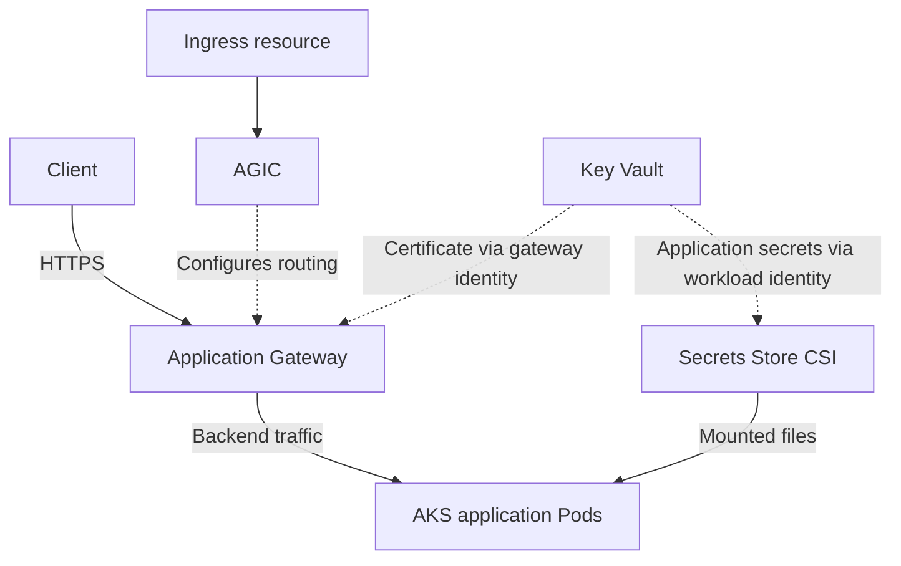

Below are answers to all **19 Encora questions**, with practical examples. The Terraform snippets are independent examples and assume an authenticated, configured AzureRM provider.

**1. What is Terraform lifecycle?**

Terraform’s `lifecycle` block controls how Terraform handles changes to a resource.

| Setting                          | Purpose                                                                     |
| -------------------------------- | --------------------------------------------------------------------------- |
| `create_before_destroy`          | Creates a replacement before destroying the existing object                 |
| `prevent_destroy`                | Rejects plans that would destroy the protected resource                     |
| `ignore_changes`                 | Ignores specified attributes when planning updates                          |
| `replace_triggered_by`           | Replaces a resource when a referenced managed resource or attribute changes |
| `precondition` / `postcondition` | Validates assumptions and resulting conditions                              |

Example:

```hcl
resource "azurerm_resource_group" "production" {
  name     = "rg-production"
  location = "eastus"

  lifecycle {
    prevent_destroy = true
  }
}
```

Important interview points:

* `prevent_destroy` does not prevent someone deleting the resource through Azure.
* Removing the resource block also removes that protection.
* `create_before_destroy` requires enough capacity and compatible naming constraints.
* Use `ignore_changes` for explicitly shared ownership, rather than hiding unexplained drift. ([HashiCorp Developer][1])

If the interviewer means the **Terraform operational workflow**, explain initialization, validation, planning, applying, and eventual decommissioning separately from the `lifecycle` block.

**2. A resource was created manually. How do you manage it through Terraform?**

Use **Terraform import** to associate the existing object with a Terraform resource address.

Suppose `rg-existing-prod` already exists in Azure.

First, describe its intended configuration:

```hcl
resource "azurerm_resource_group" "existing" {
  name     = "rg-existing-prod"
  location = "eastus"

  tags = {
    Environment = "prod"
  }
}

import {
  to = azurerm_resource_group.existing
  id = "/subscriptions/<subscription-id>/resourceGroups/rg-existing-prod"
}
```

Then:

```bash
terraform init
terraform plan -out=import.tfplan
```

Review the plan carefully, then apply the reviewed plan:

```bash
terraform apply import.tfplan
terraform plan
```

The configuration must match the real resource’s settings, including relevant tags. Import can be combined with planned updates, so do not assume an import plan contains only a state change.

The objective is to import successfully and reach a plan with **no unintended changes**. ([HashiCorp Developer][2])

Terraform can also generate initial configuration from import blocks when configuration is missing:

```bash
terraform plan -generate-config-out=generated.tf
```

Review and refactor generated configuration before adopting it. ([HashiCorp Developer][3])

A **data source** is appropriate when you only need to read information about an existing resource. Import is appropriate when Terraform should manage that resource’s lifecycle.

**3. What is the difference between `for_each` and `count`?**

Both create multiple instances from one resource or module block.

| Aspect             | `count`                                   | `for_each`                                   |
| ------------------ | ----------------------------------------- | -------------------------------------------- |
| Input              | Integer                                   | Map or set of strings                        |
| Instance identity  | Numeric index                             | Map key or set member                        |
| Example address    | `resource.example[0]`                     | `resource.example["prod"]`                   |
| Common use         | Similar instances or conditional creation | Resources with meaningful, stable identities |
| Collection changes | Index shifts can cause unintended changes | Stable keys preserve unrelated identities    |

**Using `count`:**

```hcl
variable "environments" {
  type    = list(string)
  default = ["dev", "qa", "prod"]
}

resource "azurerm_resource_group" "by_index" {
  count = length(var.environments)

  name     = "rg-${var.environments[count.index]}"
  location = "eastus"
}
```

Removing an item from the middle of the list shifts later indexes, which can cause changes or replacements.

**Using `for_each`:**

```hcl
variable "environment_locations" {
  type = map(string)

  default = {
    dev  = "eastus"
    qa   = "eastus"
    prod = "westus2"
  }
}

resource "azurerm_resource_group" "by_name" {
  for_each = var.environment_locations

  name     = "rg-${each.key}"
  location = each.value
}
```

Here, removing `qa` does not change the identity of `prod`.

You cannot use both arguments in the same block. Their instance count or keys must be determinable before resource creation. When converting existing resources from `count` to `for_each`, account for the address changes using appropriate state migration or `moved` blocks. ([HashiCorp Developer][4])

**4. How do you create and reference a Terraform module?**

A module is a collection of Terraform configuration files used together. A reusable child module exposes **inputs and outputs**.

Typical files:

| File           | Purpose                             |
| -------------- | ----------------------------------- |
| `main.tf`      | Resource definitions                |
| `variables.tf` | Module inputs                       |
| `outputs.tf`   | Values exposed to callers           |
| `versions.tf`  | Terraform and provider requirements |

These filenames are conventions; Terraform combines the configuration files in the directory.

Example child module:

```hcl
# modules/resource_group/variables.tf
variable "name" {
  type = string
}

variable "location" {
  type = string
}

# modules/resource_group/main.tf
resource "azurerm_resource_group" "this" {
  name     = var.name
  location = var.location
}

# modules/resource_group/outputs.tf
output "id" {
  value = azurerm_resource_group.this.id
}
```

Reference it from the root module:

```hcl
module "app_rg" {
  source = "./modules/resource_group"

  name     = "rg-orders-prod"
  location = "eastus"
}

output "application_resource_group_id" {
  value = module.app_rg.id
}
```

Run `terraform init` after adding or changing module sources.

For production, design modules around useful infrastructure capabilities, document their inputs, and version shared remote modules. Provider configurations generally belong in the root module and are inherited or passed to child modules. ([HashiCorp Developer][5])

**5. How would you handle peak traffic after launching a product?**

I would prepare capacity before launch, then combine caching, scaling, dependency protection, and monitoring.

1. **Estimate and test demand.**
   Identify expected requests per second, concurrent users, important user journeys, latency targets, and failure limits. Load-test the complete application.

2. **Increase minimum capacity before the launch.**
   Avoid relying entirely on reactive scaling, because nodes, containers, and application instances take time to become ready.

3. **Scale the application and its infrastructure.**
   In AKS, HPA changes Pod replicas. The cluster autoscaler adds nodes when Pods cannot be scheduled because of capacity constraints. Configure appropriate resource requests and scaling limits. ([learn.microsoft.com][6])

4. **Reduce repeated work.**
   Cache suitable content at the edge and frequently requested data in an appropriate cache.

5. **Protect dependencies.**
   Use bounded connection pools, timeouts, controlled retries, queue-based background processing, and rate limits.

6. **Monitor the user experience.**
   Track request errors, latency percentiles, queue age, database saturation, and successful business transactions.

Scaling API Pods alone can overload the database if every new Pod opens a large connection pool. Capacity planning must cover the complete dependency chain.

For a scheduled launch, also confirm cloud quotas, subnet address capacity, image availability, and the ability to sustain traffic during a component failure.

**6. How would you secure multiple microservices and websites?**

I would apply controls at several layers:

| Layer               | Controls                                                                           |
| ------------------- | ---------------------------------------------------------------------------------- |
| Public entry points | HTTPS, certificate management, WAF, rate limiting, and appropriate DDoS protection |
| Application access  | Authentication and authorization for each API                                      |
| Service identity    | Separate workload identities with narrowly scoped permissions                      |
| Network             | Private dependencies and explicit allowed communication paths                      |
| Kubernetes          | RBAC, Pod security controls, and NetworkPolicies                                   |
| Secrets             | Key Vault integration, rotation, and restricted access                             |
| Software delivery   | Dependency/image scanning, trusted artifacts, and deployment controls              |
| Detection           | Audit logs, runtime detection, and actionable alerts                               |

For multiple websites, use deliberate hostname routing and certificate configuration. Keep administration endpoints restricted.

For microservices, a practical policy might allow the frontend to reach the orders API, while permitting only the orders API to reach its database.

**Namespaces organize workloads but do not, by themselves, block communication.** NetworkPolicy enforcement requires a supporting network implementation. ([Kubernetes][7])

Use separate production and nonproduction access boundaries. For workloads requiring stronger isolation, evaluate separate clusters or subscriptions.

For AKS, these controls should be consistent with the platform’s identity, network, and workload security baseline. ([Microsoft Learn][8])

**7. What are CSI drivers?**

**CSI means Container Storage Interface.** It is a standard interface that allows Kubernetes to integrate with storage systems through drivers.

A typical persistent-storage flow is:

1. An application requests storage using a PersistentVolumeClaim.
2. A StorageClass identifies the provisioner and storage settings.
3. The CSI integration provisions or connects suitable storage.
4. The node-side driver makes the volume available to the Pod.

Depending on the driver and storage system, capabilities can include provisioning, attachment, mounting, expansion, and snapshots. ([Kubernetes][9])

Azure examples include:

* **Azure Disk CSI:** Managed disk storage, commonly used for single-node read/write access.
* **Azure Files CSI:** Shared file storage for supported multi-node access scenarios.
* **Secrets Store CSI:** Mounts external secret material into Pods; it is a different use case from provisioning application data disks.

CSI standardizes integration; it does not mean every storage backend supports identical capabilities.

**8. What is the difference between `helm template` and `helm install`?**

| Command         | Purpose                                           |
| --------------- | ------------------------------------------------- |
| `helm template` | Renders chart templates into Kubernetes manifests |
| `helm install`  | Installs a chart as a named Helm release          |

Render locally:

```bash
helm template orders ./orders \
  --namespace qa \
  --values values-qa.yaml
```

By default, this displays generated YAML without creating Kubernetes resources. Successful local rendering does not prove the cluster supports every API or will admit every resource. ([Helm][10])

Install:

```bash
helm install orders ./orders \
  --namespace qa \
  --create-namespace \
  --values values-qa.yaml \
  --wait \
  --timeout 5m
```

Here:

* `orders` is the release name.
* `./orders` is the chart.
* The values file overrides chart defaults.
* `--wait` waits for supported readiness conditions.

For repeatable delivery, a common command is:

```bash
helm upgrade --install orders ./orders \
  --namespace qa \
  --create-namespace \
  --values values-qa.yaml
```

`helm install` normally creates a new release; `upgrade --install` handles either an existing release or a first installation. ([Helm][11])

**9. What is the purpose of `_helpers.tpl` in Helm?**

`templates/_helpers.tpl` conventionally contains reusable named templates.

Common helpers generate:

* Resource names.
* Labels.
* Selector labels.
* Service account names.
* Repeated configuration fragments.

Example:

```gotemplate
{{- define "orders.labels" -}}
app.kubernetes.io/name: {{ .Chart.Name | quote }}
app.kubernetes.io/instance: {{ .Release.Name | quote }}
{{- end -}}
```

Use it in another template:

```yaml
metadata:
  name: {{ .Release.Name }}
  labels:
    {{- include "orders.labels" . | nindent 4 }}
```

Here:

* `define` declares the helper.
* `include` renders it as a string.
* `.` passes the current context.
* `nindent 4` supplies the required YAML indentation.

Files beginning with `_` are not rendered as standalone Kubernetes manifests. Prefix helper names with the chart name because named templates share a global naming scope across the chart and its dependencies. ([Helm][12])

**10. How do you rotate Key Vault secrets and use a PFX certificate with Application Gateway and AKS ingress?**

Separate the two requirements:

* **Application secrets** must be rotated at their source and refreshed in consumers.
* **HTTPS listener certificates** must be renewed and loaded by Application Gateway.

The following design assumes **Application Gateway v2 with Application Gateway Ingress Controller—AGIC**.



**Application-secret rotation**

For a database password or another credential:

1. Generate or activate the replacement credential in the target system.
2. Store a new secret version in Key Vault.
3. Refresh consuming applications.
4. Verify successful access with the replacement.
5. Revoke the previous credential.

Where supported, use overlapping credentials or alternate keys to avoid interrupting consumers. Event-driven or scheduled automation can coordinate the rotation. Merely adding a new Key Vault value does not update a database password. ([Microsoft Learn][13])

For AKS consumers, use workload identity and an appropriate `SecretProviderClass`. With Secrets Store CSI autorotation enabled, mounted content is periodically refreshed; the documented default polling interval is two minutes.

The application must reload changed files. Secrets consumed through environment variables require replacement Pods to obtain new values. ([Microsoft Learn][14])

**Application Gateway certificate setup**

1. Import the PFX certificate, including its private key, into Key Vault.
2. Ensure the certificate is enabled and its private key is exportable.
3. Attach a user-assigned managed identity to Application Gateway.
4. Grant that identity the required secret-read access, such as **Key Vault Secrets User** under the RBAC model.
5. Ensure the gateway can reach Key Vault, including correct private DNS when private endpoints are used.
6. Reference the certificate’s **versionless backing secret URI**.

Example URI:

```text
https://kv-orders-prod.vault.azure.net/secrets/orders-tls/
```

A versionless reference allows Application Gateway to pick up renewed versions. Gateway instances poll Key Vault at four-hour intervals. ([Microsoft Learn][15])

Create the gateway certificate reference after identity and access are configured:

```bash
az network application-gateway ssl-cert create \
  --resource-group rg-network-prod \
  --gateway-name agw-prod \
  --name orders-tls \
  --key-vault-secret-id \
  "https://kv-orders-prod.vault.azure.net/secrets/orders-tls/"
```

Then reference that installed certificate name through AGIC:

```yaml
apiVersion: networking.k8s.io/v1
kind: Ingress
metadata:
  name: orders
  annotations:
    kubernetes.io/ingress.class: azure/application-gateway
    appgw.ingress.kubernetes.io/appgw-ssl-certificate: orders-tls
    appgw.ingress.kubernetes.io/ssl-redirect: "true"
spec:
  rules:
    - host: orders.example.com
      http:
        paths:
          - path: /
            pathType: Prefix
            backend:
              service:
                name: orders
                port:
                  number: 80
```

The annotation names the certificate configuration on Application Gateway. AGIC configures the listener and routing.

For this pattern, do not also supply an Ingress `spec.tls` configuration: AGIC documents that it takes precedence over the certificate annotation. For gateway-to-backend HTTPS, additionally configure the backend protocol and certificate trust. ([Microsoft Learn][16])

Certificate renewal must create a valid new version in Key Vault. After renewal, verify the certificate actually served to clients, its hostname, expiry, and chain.

**11. Explain Kubernetes architecture**

Kubernetes consists of a control plane and worker nodes.

| Component                    | Role                                          |
| ---------------------------- | --------------------------------------------- |
| API server                   | Handles Kubernetes API requests               |
| etcd                         | Stores cluster configuration and state        |
| Scheduler                    | Assigns unscheduled Pods to suitable nodes    |
| Controller manager           | Reconciles desired and actual state           |
| Cloud controller manager     | Provides supported cloud integration          |
| Kubelet                      | Ensures assigned Pod containers run on a node |
| Container runtime            | Pulls images and runs containers              |
| kube-proxy or an alternative | Implements Service traffic handling           |

Network plugins provide Pod networking; cluster DNS provides service discovery.

When you apply a Deployment, the API server accepts the object, controllers create the required workload objects, the scheduler assigns Pods, and kubelets start containers through their runtimes. Controllers continue reconciling changes and failures. ([kubernetes.io][17])

In AKS, Azure manages the control plane. You still manage application configuration, workload security, access, networking choices, and the relevant node-management responsibilities for your cluster mode.

**12. What is an Azure service principal? Give an example**

A **service principal** is an identity used by an application or automation within a Microsoft Entra tenant.

An application registration defines the application. Its service principal is the tenant-local identity to which permissions can be assigned. The application/client ID and service principal object ID are different identifiers. ([Microsoft Learn][18])

**Example: deployment pipeline**

Suppose an Azure DevOps pipeline provisions infrastructure in `rg-orders-prod`.

You could:

1. Create the application/service principal identity.
2. Configure workload identity federation for the pipeline.
3. Assign the necessary Azure role at the resource-group scope.
4. Configure the pipeline’s service connection.
5. Use that connection for Terraform operations.

Grant only the permissions required. For example, Contributor can manage many resources but does not grant unrestricted role-assignment administration.

Workload identity federation avoids maintaining a long-lived client secret. For supported Azure-hosted workloads, managed identity is another option; a managed identity is a special type of service principal managed by Azure. ([learn.microsoft.com][19])

**13. How would you secure communication between backend APIs?**

For **API A calling API B**, I would combine transport security, workload authentication, authorization, and network controls.

A Microsoft Entra-based design could be:

1. Register API B and define application permissions, such as `Orders.Read`.
2. Give API A a workload identity.
3. Assign API A only the required application role.
4. Have API A obtain an access token for API B.
5. Send it over HTTPS using the `Authorization: Bearer` header.
6. Have API B validate the signature, issuer, audience, expiry, and required role.

For app-only OAuth client credentials, the requested scope typically uses the resource’s `/.default` scope. Use application roles for application permissions. ([Microsoft Learn][20])

Additional controls include:

* Keeping internal APIs privately reachable where appropriate.
* Restricting permitted service-to-service paths.
* Applying timeouts, request limits, and audit logging.
* Using mTLS where workload-to-workload certificate authentication is required.
* Keeping tokens and credentials out of logs.

mTLS establishes workload identity; API authorization determines which operations that identity may perform.

If a call must preserve an end user’s permissions, use the appropriate delegated identity flow rather than treating every request as unrestricted application access.

**14. What are DaemonSets and StatefulSets?**

| Aspect        | DaemonSet                                      | StatefulSet                               |
| ------------- | ---------------------------------------------- | ----------------------------------------- |
| Main purpose  | Run a Pod on each eligible node                | Run workloads requiring stable identities |
| Scaling model | Follows eligible nodes                         | Uses a configured replica count           |
| Identity      | Node-oriented placement                        | Stable ordinal identities, such as `db-0` |
| Storage       | Depends on the agent’s needs                   | Often uses a separate PVC per replica     |
| Examples      | Log agents, node monitoring, networking agents | Databases, brokers, stateful clusters     |

A **DaemonSet** creates Pods on nodes matching its scheduling requirements. When eligible nodes are added, the DaemonSet reconciles Pods onto them. ([Kubernetes][21])

A **StatefulSet** provides stable identities and supports ordered management and persistent-storage associations. A replacement Pod can retain its logical identity and reconnect to its associated volume.

StatefulSet does not implement database replication or backup for the application. PVC retention and storage reclamation also depend on the configured policies. ([Kubernetes][22])

**15. How do you divide `10.0.0.0/16` into `/21` subnets using Terraform locals?**

The prefix increases by five bits:

```text
21 - 16 = 5
```

Therefore:

* Number of `/21` subnets: `2^5 = 32`.
* Total addresses per subnet: `2^(32-21) = 2048`.

Terraform’s `cidrsubnet(prefix, newbits, netnum)` calculates each subnet. ([HashiCorp Developer][23])

```hcl
locals {
  vnet_cidr = "10.0.0.0/16"

  subnet_cidrs = {
    for index in range(32) :
    format("subnet-%02d", index + 1) =>
    cidrsubnet(local.vnet_cidr, 5, index)
  }
}

resource "azurerm_resource_group" "network" {
  name     = "rg-network"
  location = "eastus"
}

resource "azurerm_virtual_network" "main" {
  name                = "vnet-main"
  location            = azurerm_resource_group.network.location
  resource_group_name = azurerm_resource_group.network.name
  address_space       = [local.vnet_cidr]
}

resource "azurerm_subnet" "this" {
  for_each = local.subnet_cidrs

  name                 = each.key
  resource_group_name  = azurerm_resource_group.network.name
  virtual_network_name = azurerm_virtual_network.main.name
  address_prefixes     = [each.value]
}

output "subnet_cidrs" {
  value = local.subnet_cidrs
}
```

Example results:

| Subnet      | CIDR            |
| ----------- | --------------- |
| `subnet-01` | `10.0.0.0/21`   |
| `subnet-02` | `10.0.8.0/21`   |
| `subnet-03` | `10.0.16.0/21`  |
| `subnet-04` | `10.0.24.0/21`  |
| `subnet-32` | `10.0.248.0/21` |

If only four subnets are required, use `range(4)` and leave the remaining address space available.

`locals` defines reusable expressions; reference an individual value using the singular `local`, such as `local.vnet_cidr`. Locals are internal to the module, while input variables provide its external configuration interface. ([HashiCorp Developer][24])

**16. How do you troubleshoot `CrashLoopBackOff`?**

`CrashLoopBackOff` indicates repeated container failures with a delay before another restart. It is a symptom, not the root cause.

Start with:

```bash
kubectl get pod orders-abc -n production -o wide

kubectl describe pod orders-abc -n production

kubectl logs orders-abc -n production \
  -c app --previous

kubectl logs orders-abc -n production \
  -c app
```

`--previous` is especially useful when the current container has restarted and its logs are empty. ([Kubernetes][25])

Then investigate systematically:

| Evidence                          | What to investigate                                                                |
| --------------------------------- | ---------------------------------------------------------------------------------- |
| `OOMKilled`                       | Memory usage, limits, leaks, and workload behavior                                 |
| Nonzero application exit          | Startup errors, configuration, credentials, or dependencies                        |
| Exit code `0` followed by restart | A process that finishes normally but is managed as a continuously running workload |
| Probe failures                    | Startup time, endpoint behavior, timeouts, and resource pressure                   |
| Permission errors                 | Runtime user, file permissions, security context, and volume access                |
| `exec format error`               | Image architecture or executable format                                            |
| Dependency timeouts               | DNS, network policies, routing, and backend availability                           |

Check events:

```bash
kubectl get events -n production \
  --field-selector involvedObject.name=orders-abc \
  --sort-by=.metadata.creationTimestamp
```

Additional points:

* Exit code `137` alone does not prove an OOM event; inspect the termination reason.
* Liveness and startup probe failures can restart a container. Readiness failures normally remove it from service endpoints.
* Inspect init containers and sidecars, not only the main application.
* If the process dies before logging, inspect entrypoint arguments, termination information, mounted files, and runtime compatibility.
* Use an isolated debug Pod or ephemeral debugging container when appropriate.

Apply a fix supported by evidence, then verify restart counts and application behavior. Repeatedly deleting the Pod does not resolve a persistent underlying problem.

**17. What branching strategies and pipeline creation mechanisms do you use?**

Choose branching based on release frequency and the number of supported versions.

| Strategy                            | Suitable situation                                                  |
| ----------------------------------- | ------------------------------------------------------------------- |
| Trunk-based development             | Frequent releases with short-lived branches                         |
| Feature branches with pull requests | Reviewed collaboration around a protected main branch               |
| Release branches                    | Stabilization or maintenance of supported releases                  |
| GitFlow                             | Products needing explicit development, release, and hotfix branches |

A common approach is short-lived feature branches, required PR checks, protected `main`, and identifiable release tags. Hotfixes must also be integrated into the relevant ongoing development branches. ([Microsoft Learn][26])

**Creating the pipeline**

1. Keep its definition in the repository, such as `azure-pipelines.yml` or `Jenkinsfile`.
2. Configure repository integration and triggers.
3. Select suitable build agents.
4. Configure scoped service connections or federated identities.
5. Define build, test, scan, package, and publication stages.
6. Deploy the same artifact through QA, UAT, and production.
7. Configure environment checks and approvals.
8. Validate deployments and maintain a rollback procedure.

Branch names do not have to correspond directly to environments. Promoting a tested artifact through environments avoids rebuilding different binaries for each environment.

In Azure Pipelines, environment owners can configure approvals and checks separately from the pipeline YAML. ([learn.microsoft.com][27])

**18. What files are present in a Helm chart?**

Common chart contents are:

| File or directory        | Purpose                                              |
| ------------------------ | ---------------------------------------------------- |
| `Chart.yaml`             | Chart metadata, version, and dependency declarations |
| `values.yaml`            | Default configuration values                         |
| `values.schema.json`     | Optional JSON Schema for values validation           |
| `templates/`             | Kubernetes resource templates                        |
| `templates/_helpers.tpl` | Reusable named templates                             |
| `templates/NOTES.txt`    | Post-install usage information                       |
| `templates/tests/`       | Optional Helm test resources                         |
| `charts/`                | Chart dependencies                                   |
| `Chart.lock`             | Resolved dependency versions                         |
| `crds/`                  | CustomResourceDefinition files                       |
| `.helmignore`            | Files excluded from chart packaging                  |
| `README.md`              | Documentation                                        |

Application templates commonly include Deployments, Services, ServiceAccounts, ConfigMaps, and routing resources.

Files such as `values-dev.yaml` and `values-prod.yaml` are conventions. Helm uses them when explicitly passed with `-f`; their filenames do not automatically select an environment. ([Helm][28])

**19. What is a CNI plugin?**

**CNI means Container Network Interface.** It defines an interface for configuring container networking.

In Kubernetes, the runtime and networking implementation use CNI to configure the Pod’s network attachment, including interfaces, IP allocation, and relevant connectivity.

Depending on the implementation, additional capabilities can include network policy enforcement, routing, encryption, or network observability. ([Kubernetes][29])

Examples include Azure CNI and implementations using technologies such as Calico or Cilium.

With **Azure CNI Overlay**, Pod addresses come from a separate Pod CIDR rather than directly consuming addresses from the node subnet. Traffic leaving the cluster is generally translated to the node’s address. Network design must account for reachability and integration requirements. ([Microsoft Learn][30])

The interview distinction is:

| Interface | Responsibility       |
| --------- | -------------------- |
| CNI       | Container networking |
| CSI       | Container storage    |

When troubleshooting CNI-related issues, inspect Pod IP allocation, subnet or Pod-CIDR capacity, plugin health, routes, and network policies. DNS resolution should also be checked, while recognizing that cluster DNS is a separate component.

[1]: https://developer.hashicorp.com/terraform/language/meta-arguments/lifecycle?utm_source=chatgpt.com "lifecycle meta-argument reference | Terraform"
[2]: https://developer.hashicorp.com/terraform/language/import?utm_source=chatgpt.com "Import resources overview | Terraform"
[3]: https://developer.hashicorp.com/terraform/language/import/generating-configuration?utm_source=chatgpt.com "Import - Generating Configuration | Terraform"
[4]: https://developer.hashicorp.com/terraform/language/meta-arguments/count?utm_source=chatgpt.com "count meta-argument reference | Terraform"
[5]: https://developer.hashicorp.com/terraform/language/modules/develop?utm_source=chatgpt.com "Creating Modules | Terraform"
[6]: https://learn.microsoft.com/en-us/azure/aks/concepts-scale?utm_source=chatgpt.com "Scaling options for applications in Azure Kubernetes ..."
[7]: https://kubernetes.io/docs/concepts/services-networking/network-policies/?utm_source=chatgpt.com "Network Policies"
[8]: https://learn.microsoft.com/en-us/azure/aks/security-baseline?utm_source=chatgpt.com "Azure security baseline for Azure Kubernetes Service (AKS)"
[9]: https://kubernetes.io/docs/concepts/storage/volumes/?utm_source=chatgpt.com "Volumes"
[10]: https://helm.sh/docs/helm/helm_template/?utm_source=chatgpt.com "helm template"
[11]: https://helm.sh/docs/helm/helm_install/?utm_source=chatgpt.com "helm install"
[12]: https://helm.sh/docs/chart_template_guide/named_templates/?utm_source=chatgpt.com "Named Templates"
[13]: https://learn.microsoft.com/en-us/azure/key-vault/secrets/tutorial-rotation-dual?utm_source=chatgpt.com "Rotation tutorial for resources with two sets of credentials"
[14]: https://learn.microsoft.com/en-us/azure/aks/csi-secrets-store-configuration-options?utm_source=chatgpt.com "Azure Key Vault Provider for Secrets Store CSI Driver for Azure Kubernetes Service (AKS) Configuration Options - Azure Kubernetes Service"
[15]: https://learn.microsoft.com/en-us/azure/application-gateway/key-vault-certs?utm_source=chatgpt.com "TLS termination with Azure Key Vault certificates"
[16]: https://learn.microsoft.com/en-us/azure/application-gateway/ingress-controller-annotations?utm_source=chatgpt.com "Application Gateway Ingress Controller annotations"
[17]: https://kubernetes.io/docs/concepts/overview/components/?utm_source=chatgpt.com "Kubernetes Components"
[18]: https://learn.microsoft.com/en-us/entra/identity-platform/app-objects-and-service-principals?utm_source=chatgpt.com "Apps & service principals in Microsoft Entra ID - Microsoft identity platform"
[19]: https://learn.microsoft.com/en-us/entra/workload-id/workload-identity-federation?utm_source=chatgpt.com "Workload identity federation concepts"
[20]: https://learn.microsoft.com/en-us/entra/identity-platform/v2-oauth2-client-creds-grant-flow?utm_source=chatgpt.com "OAuth 2.0 client credentials flow on the Microsoft identity platform - Microsoft identity platform"
[21]: https://kubernetes.io/docs/concepts/workloads/controllers/daemonset/?utm_source=chatgpt.com "DaemonSet"
[22]: https://kubernetes.io/docs/concepts/workloads/controllers/statefulset/?utm_source=chatgpt.com "StatefulSets"
[23]: https://developer.hashicorp.com/terraform/language/functions/cidrsubnet?utm_source=chatgpt.com "cidrsubnet - Functions - Configuration Language | Terraform"
[24]: https://developer.hashicorp.com/terraform/language/values/locals?utm_source=chatgpt.com "Use locals to reuse expressions | Terraform"
[25]: https://kubernetes.io/docs/tasks/debug/debug-application/debug-running-pod/?utm_source=chatgpt.com "Debug Running Pods"
[26]: https://learn.microsoft.com/en-us/azure/devops/repos/git/git-branching-guidance?view=azure-devops&utm_source=chatgpt.com "Git branching guidance - Azure Repos"
[27]: https://learn.microsoft.com/en-us/azure/devops/pipelines/process/approvals?tabs=check-pass&view=azure-devops&utm_source=chatgpt.com "Pipeline deployment approvals - Azure Pipelines"
[28]: https://helm.sh/docs/topics/charts/?utm_source=chatgpt.com "Charts"
[29]: https://kubernetes.io/docs/concepts/extend-kubernetes/compute-storage-net/network-plugins/?utm_source=chatgpt.com "Network Plugins"
[30]: https://learn.microsoft.com/en-us/azure/aks/azure-cni-overlay?utm_source=chatgpt.com "Configure Azure CNI Overlay Networking in Azure Kubernetes Service (AKS) - Azure Kubernetes Service"
