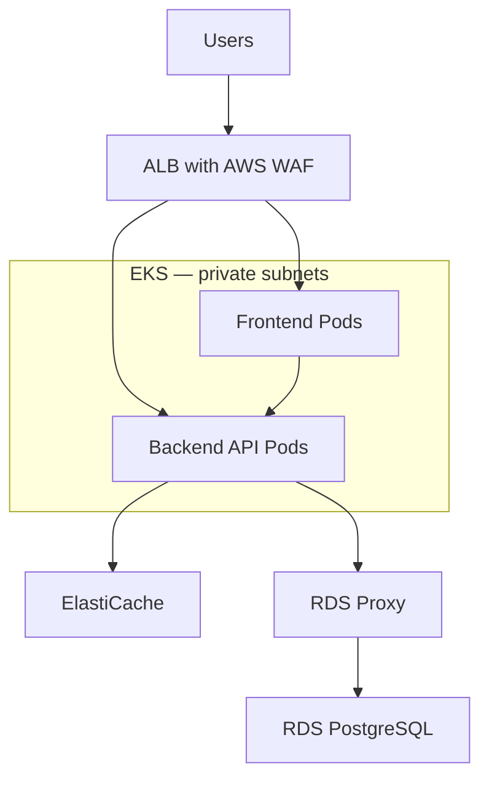

For project-specific questions, use the example below as a template and replace it with your actual application stack, responsibilities, and environment details.

**1. What is the architecture of your current project?**

A strong answer explains the application, request flow, infrastructure, deployment process, and your responsibilities.

**Example: a customer-facing portal on AWS**



In this example:

* Route 53 resolves the application domain to the ALB.
* The ALB handles HTTPS and routes requests to frontend or backend workloads.
* EKS worker nodes run in private subnets across multiple Availability Zones.
* RDS PostgreSQL stores transactional data.
* RDS Proxy manages database connections.
* ElastiCache stores frequently accessed data.
* Images are stored in ECR.
* Terraform manages infrastructure, and the delivery pipeline deploys versioned images through Helm.
* Production is separated from nonproduction.

The AWS Load Balancer Controller configures the ALB from Kubernetes resources. With IP targets, the ALB can route directly to Pod IP addresses. ([Amazon EKS][1])

Finish by explaining **your actual contribution**: for example, maintaining Terraform modules, managing deployments, investigating incidents, or configuring monitoring. Distinguish those responsibilities from decisions owned by the broader team.

---

**2. What applications are deployed in the frontend and backend?**

Explain both the technology and its business purpose.

For the example architecture:

| Layer    | Example technology     | Responsibility                                       |
| -------- | ---------------------- | ---------------------------------------------------- |
| Frontend | React with Next.js     | User interface and server-rendered pages             |
| Backend  | Python FastAPI         | Business logic, authorization, and APIs              |
| Database | RDS PostgreSQL         | Persistent transactional records                     |
| Cache    | ElastiCache for Valkey | Frequently accessed data with appropriate expiration |

The frontend and backend have separate container images and Deployments, allowing independent releases and scaling.

For example:

* The frontend displays customer information.
* The backend validates the user’s permissions and retrieves the information.
* The backend checks the cache and queries PostgreSQL when needed.

Database credentials belong in the backend’s secret-management mechanism. They must never be embedded in browser-delivered JavaScript.

If your actual frontend is an Angular application served by Nginx, say that rather than adopting the Next.js example.

---

**3. Why deploy the frontend on EKS instead of S3 and CloudFront?**

The answer depends on whether the frontend needs a **server runtime**.

For a static application consisting of HTML, CSS, JavaScript, and images, **S3 with CloudFront is often a simpler hosting choice**. A static frontend can still call APIs and support authenticated users.

S3 cannot execute application server code. ([Amazon Simple Storage Service][2])

Valid reasons for using EKS include:

* The application performs server-side rendering.
* It runs a Node.js server or custom backend-for-frontend.
* It needs server-side middleware or runtime processing.
* The team already has a suitable Kubernetes platform and deployment process.

For the Next.js example, an interview answer could be:

> “The frontend required server-side rendering and a Node.js runtime. We packaged it as a container and deployed it on our existing EKS platform. For a purely static frontend, I would evaluate S3 and CloudFront to reduce operational overhead.”

EKS is one possible runtime platform; the runtime requirement alone does not prove that Kubernetes is necessary.

Also, CloudFront can sit in front of an ALB, and static assets can be stored separately in S3. For a private S3 origin, use CloudFront Origin Access Control with the appropriate bucket configuration. ([Amazon CloudFront][3])

---

**4. What is a namespace in EKS?**

An EKS namespace is a **Kubernetes namespace**: a logical scope for organizing resources within a cluster.

It helps separate applications, teams, or environments.

Examples:

```text
development
qa
production
monitoring
```

Resources such as Pods, Deployments, Services, ConfigMaps, and Secrets are namespaced. Nodes and PersistentVolumes are cluster-scoped.

Two namespaces can contain Services with the same name:

```text
orders.development.svc.cluster.local
orders.qa.svc.cluster.local
```

Namespaces can have their own RBAC permissions, ResourceQuotas, and LimitRanges. ([Kubernetes][4])

However, **creating namespaces does not automatically block network communication between them**. Use NetworkPolicies and a network implementation that enforces them when network isolation is required. ([Kubernetes][5])

Useful commands:

```bash
kubectl get namespaces
kubectl create namespace development
kubectl get pods -n development
```

---

**5. How many namespaces do you currently have?**

Give the actual number from your environment and explain why they exist.

Check it using:

```bash
kubectl get namespaces
```

To count them:

```bash
kubectl get namespaces --no-headers | wc -l
```

An **illustrative nonproduction cluster** could have seven:

| Namespace         | Purpose                                                       |
| ----------------- | ------------------------------------------------------------- |
| `default`         | Default namespace for resources without an explicit namespace |
| `kube-system`     | Cluster system components and add-ons                         |
| `kube-public`     | Cluster information intended for broad visibility             |
| `kube-node-lease` | Node heartbeat Lease objects                                  |
| `development`     | Development workloads                                         |
| `qa`              | QA workloads                                                  |
| `monitoring`      | Monitoring components                                         |

Kubernetes initially creates the first four namespaces. ([Kubernetes][4])

In this example, production runs in a separate cluster. The useful interview detail is the organization and access model, not simply the namespace count.

---

**6. What is a node group?**

In EKS, an EC2 node group is a collection of worker nodes configured to provide capacity for Kubernetes workloads.

A group typically has settings such as:

* Instance types and AMI.
* Subnets.
* Node IAM role.
* Minimum, maximum, and desired capacity.
* Labels and taints.
* Capacity purchasing options.

**Managed node groups** use EC2 Auto Scaling groups managed through EKS. EKS provides node provisioning, registration, and managed update mechanisms. You still choose important configuration and update decisions. ([Amazon EKS][6])

For example:

| Node group          | Purpose                                     |
| ------------------- | ------------------------------------------- |
| `system-nodes`      | Core add-ons and platform services          |
| `application-nodes` | Main application workloads                  |
| `batch-nodes`       | Interruption-tolerant background processing |

Labels, selectors, affinity, and taints help place appropriate workloads on each group.

A useful distinction:

* **HPA** changes the number of Pod replicas.
* **Cluster Autoscaler** can change EC2 capacity in configured node groups.
* Setting a node group’s maximum size does not, by itself, install or activate Cluster Autoscaler.

Fargate profiles are a different compute mechanism; they are not EC2 managed node groups.

---

**7. How do you optimize costs for ECS, RDS, and ElastiCache?**

I would first establish utilization, cost, and application-performance baselines. Changes should be validated against latency, error rate, and availability requirements.

**ECS**

* Right-size task CPU and memory using observed usage.
* Configure service scaling against meaningful demand metrics.
* For ECS on EC2, improve task placement and remove unnecessary idle capacity.
* Schedule disposable development workloads off when unused.
* Use Fargate Spot or EC2 Spot for workloads that tolerate interruptions.
* Consider Compute Savings Plans for predictable eligible usage.

Fargate Spot capacity can be interrupted and may be unavailable, so maintain an appropriate capacity strategy for critical workloads. ([AWS Prescriptive Guidance][7])

**RDS**

* Review CPU, memory, connections, I/O, latency, and query efficiency.
* Optimize expensive queries and indexes before simply increasing instance size.
* Right-size instance class and storage performance.
* Remove unused replicas and snapshots according to retention requirements.
* Schedule eligible nonproduction databases to stop when unused.
* Evaluate Reserved DB Instances for predictable usage.

Stopped RDS instances automatically restart after seven days. Storage and applicable backup charges continue while stopped. ([Amazon Relational Database Service][8])

**ElastiCache**

* Monitor memory utilization, cache hit rate, evictions, CPU, and latency.
* Remove unnecessary cached data and set appropriate TTLs.
* Right-size shards and replicas while preserving required availability.
* Compare serverless and node-based deployment costs for the workload.
* Consider supported data-tiering options when the working set and latency requirements fit.
* Evaluate reserved nodes for stable eligible node-based workloads. ([Amazon ElastiCache][9])

Current AWS pricing also includes **Database Savings Plans** for eligible database usage, including supported RDS and ElastiCache for Valkey usage. Compare eligibility, flexibility, and utilization before committing; discounts do not simply stack on the same usage. ([aws.amazon.com][10])

A cost reduction is successful when it lowers spending while keeping the agreed service performance and reliability.

---

**8. Why did you use RDS Proxy?**

A typical reason is to protect the database from excessive connection creation during application scaling or traffic bursts.

Without a proxy, many application instances may independently open connections to RDS. Connection establishment and large connection counts consume database resources.

RDS Proxy maintains and reuses a pool of database connections. It can:

* Reduce database connection churn.
* Control the number of backend connections.
* Queue or reject requests when capacity is exhausted.
* Improve connection handling during database failover.
* Integrate with supported IAM authentication or Secrets Manager configurations. ([Amazon Relational Database Service][11])

An example answer:

> “As application concurrency increased, database connections became a bottleneck. We introduced RDS Proxy to reuse backend connections and control connection pressure, then monitored borrowing latency, connection counts, and application response time.”

RDS Proxy does not increase database query-processing capacity or eliminate every failover error.

Also, some session behavior causes **pinning**, where a client session remains tied to one database connection. Heavy pinning reduces the benefits of connection reuse. ([Amazon Relational Database Service][12])

---

**9. The client application did not have connection pooling. How did you handle it?**

If application changes were difficult, RDS Proxy could provide **database-side connection pooling**.

A practical implementation would be:

1. Confirm that the database engine and application behavior are supported.
2. Create the proxy and register the database target.
3. Configure authentication and TLS.
4. Configure network access from the application to the proxy and from the proxy to RDS.
5. Change the application’s database hostname to the proxy endpoint.
6. Tune the connection budget and borrowing timeout.
7. Load-test the application and monitor the results.

Relevant settings include:

| Setting                     | Purpose                                                                             |
| --------------------------- | ----------------------------------------------------------------------------------- |
| `MaxConnectionsPercent`     | Limits the proxy’s database connections relative to the database connection setting |
| `MaxIdleConnectionsPercent` | Controls retained idle backend connections                                          |
| `ConnectionBorrowTimeout`   | Controls how long a request waits for an available database connection              |
| `IdleClientTimeout`         | Controls how long idle client connections remain open                               |

Choose these settings from measured workload requirements and leave operational headroom. ([Amazon Relational Database Service][13])

I would monitor:

* `ClientConnections`
* `DatabaseConnections`
* `DatabaseConnectionsBorrowLatency`
* `DatabaseConnectionsCurrentlySessionPinned`
* Application latency, errors, and database load. ([Amazon Relational Database Service][14])

**Client-side pooling still has value.** If the application opens a new connection for every request, it still pays application-to-proxy connection overhead. A bounded application pool, prompt connection release, short transactions, and suitable timeouts remain useful.

---

**10. A node cannot join the EKS cluster. What could be wrong?**

First identify which stage failed:

| Observation                               | Initial investigation                                                           |
| ----------------------------------------- | ------------------------------------------------------------------------------- |
| No EC2 instance was created               | Auto Scaling activity, capacity, quotas, subnet addresses, launch configuration |
| EC2 is running but absent from Kubernetes | Bootstrap, API connectivity, authentication                                     |
| Node appears as `NotReady`                | Kubelet, container runtime, networking, node conditions                         |

For a running instance that cannot register, check:

**IAM and cluster authorization**

* Correct node IAM role and EC2 trust relationship.
* Required worker-node and image-pull permissions.
* Correct node-role authorization for the cluster’s authentication mode.
* Appropriate EKS access entry or legacy `aws-auth` mapping.
* Use the node role ARN, not the instance-profile ARN. ([Amazon EKS][15])

**Network access**

* Can the node reach the Kubernetes API endpoint on HTTPS?
* Is a public endpoint access restriction excluding its source address?
* Are private endpoint routing and DNS working?
* Are security groups and NACLs allowing necessary communication?
* Can the node reach required AWS services through suitable egress or VPC endpoints? ([Amazon EKS][16])

**Bootstrap and operating system**

* Correct cluster name, endpoint, and CA information.
* Compatible AMI and Kubernetes version.
* Successful initialization.
* Running kubelet and container runtime.

For Amazon Linux 2023, check the `nodeadm` configuration rather than assuming an older bootstrap script applies. Custom launch-template security groups can also omit communication normally enabled by the cluster security group. ([Amazon EKS][17])

Useful commands:

```bash
aws eks describe-nodegroup \
  --cluster-name example-cluster \
  --nodegroup-name application-nodes \
  --query 'nodegroup.health.issues'

kubectl get nodes -o wide
```

On the affected node:

```bash
sudo systemctl status kubelet containerd

sudo journalctl -u kubelet -b \
  --no-pager -n 100
```

For a registered but unhealthy node:

```bash
kubectl describe node NODE_NAME
kubectl get pods -n kube-system -o wide
```

Use the actual error to guide the fix—for example, unauthorized registration, endpoint timeout, or a network plugin that has not initialized.

---

**11. What is the difference between the control plane and the data plane?**

The **control plane manages cluster state and decisions**. The **data plane executes workloads and carries application traffic**.

| Area           | Control plane                                    | Data plane                                            |
| -------------- | ------------------------------------------------ | ----------------------------------------------------- |
| Main role      | Maintain desired state                           | Run workloads                                         |
| Components     | API server, etcd, scheduler, controllers         | Nodes, kubelet, runtime, networking, application Pods |
| Example action | Assign a Pod to a node                           | Start and run its containers                          |
| Failure impact | Can prevent scheduling and management operations | Can interrupt affected application workloads          |

For example, when you create a Deployment:

1. The API server accepts the desired configuration.
2. Controllers create the necessary Pod objects.
3. The scheduler selects nodes.
4. Kubelets and runtimes start containers on those nodes.

In standard EKS, AWS manages the Kubernetes control plane. Responsibility for compute and node operations depends on whether you use EC2 nodes, Fargate, or other EKS compute options. ([Amazon EKS][18])

Existing workloads may continue during some control-plane interruptions, but scheduling, scaling, or configuration changes can be affected.

---

**12. What is the difference between a Pod and a container?**

A **container** runs an application process with its dependencies and operating-system isolation.

A **Pod** is Kubernetes’ smallest deployable unit. It contains one or more containers that belong together.

| Aspect       | Container                          | Pod                                         |
| ------------ | ---------------------------------- | ------------------------------------------- |
| Represents   | A running application component    | A Kubernetes workload unit                  |
| Created from | A container image                  | A Pod specification                         |
| Scheduling   | Runs within its Pod                | Scheduled onto a node                       |
| Networking   | Shares its Pod’s network namespace | Normally has a Pod IP and shared port space |
| Storage      | Uses its mounted storage           | Can define volumes shared by its containers |

Containers in the same Pod can communicate through `localhost`. Shared volumes must be explicitly mounted into the relevant containers.

A Pod might contain an application container and a closely related sidecar. It does not normally contain unrelated frontend and backend applications merely because they belong to the same project.

Individual containers can restart within a Pod. Replacing the Pod creates a new Pod identity. ([Kubernetes][19])

---

**13. What are requests and limits in Kubernetes?**

**Requests** tell the scheduler how much resource capacity to account for when placing a workload.

**Limits** control how much a container can consume at runtime.

Example container configuration:

```yaml
resources:
  requests:
    cpu: "2"
    memory: "10Gi"
  limits:
    cpu: "4"
    memory: "16Gi"
```

| Setting                | Meaning                                                      |
| ---------------------- | ------------------------------------------------------------ |
| CPU request: `2`       | Scheduler accounts for two CPUs                              |
| Memory request: `10Gi` | Scheduler accounts for 10 GiB                                |
| CPU limit: `4`         | CPU execution can be throttled at the configured quota       |
| Memory limit: `16Gi`   | Exceeding the enforced memory boundary can cause an OOM kill |

A container can use more than its request when resources are available, subject to limits. Requests do not mean the application continuously consumes that amount.

CPU exhaustion normally causes **throttling**. Memory exhaustion can terminate a container; the two resources behave differently. ([Kubernetes][20])

For utilization-based HPA metrics, requests also matter because utilization is calculated relative to requested resources. Incorrect requests can therefore affect scaling decisions. ([Kubernetes][21])

---

**14. An 8-vCPU, 32-GB node runs Pods requesting 2 vCPU/10 GB and limited to 4 vCPU/16 GB. With HPA allowing four replicas, how many fit?**

**The theoretical scheduling capacity is three Pods**, assuming consistent memory units, no other workloads, and no system overhead.

Kubernetes schedules using **requests**, not the sum of limits.

CPU-based capacity:

$$
\left\lfloor \frac{8}{2} \right\rfloor = 4
$$

Memory-based capacity:

$$
\left\lfloor \frac{32}{10} \right\rfloor = 3
$$

Therefore:

$$
\text{Pod capacity} = \min(4,3) = 3
$$

| Replicas | Total CPU requests | Total memory requests | Fits nominal capacity? |
| -------- | -----------------: | --------------------: | ---------------------- |
| 1        |             2 vCPU |                 10 GB | Yes                    |
| 2        |             4 vCPU |                 20 GB | Yes                    |
| 3        |             6 vCPU |                 30 GB | Yes                    |
| 4        |             8 vCPU |                 40 GB | No                     |

**The production answer depends on allocatable resources.**

The OS, kubelet, runtime, and other workloads consume resources. Three Pods require at least 6 vCPU and 30 GB of remaining schedulable capacity. If less is available, fewer fit. Kubernetes exposes this distinction through node capacity and allocatable values. ([Kubernetes][22])

Check:

```bash
kubectl describe node NODE_NAME
kubectl describe pod POD_NAME
kubectl get hpa -n APPLICATION_NAMESPACE
```

If HPA requests four replicas and no other node has space, one remains Pending. A correctly configured node autoscaler may add capacity.

Two further points matter:

* `maxReplicas: 4` is a ceiling; it does not force HPA to run four replicas.
* Three Pods have combined limits of **12 vCPU and 48 GB**, exceeding the node’s capacity. Scheduling them does not guarantee they can all reach their limits simultaneously. Plan headroom and monitor contention and memory pressure. ([Kubernetes][21])

---

**15. What did you implement using Lambda and API Gateway?**

Use a real example and explain the trigger, processing, permissions, failure handling, and deployment.

**Example to adapt: a document-upload feature alongside the main application.**

1. The frontend calls an API Gateway endpoint such as `POST /uploads`.
2. API Gateway validates the user’s token through a configured authorizer.
3. Lambda checks application-level authorization and creates a short-lived S3 upload URL for an approved object key.
4. The browser uploads directly to S3.
5. An S3 event triggers a processing Lambda.
6. The function validates or processes the document and records its status.

API Gateway can route requests to Lambda, and HTTP APIs support JWT authorizers. The application must still enforce the user’s permission to perform the requested business operation. ([AWS Lambda][23])

Presigned URLs allow a bounded S3 operation without giving the browser permanent AWS credentials. ([Amazon Simple Storage Service][24])

Implementation details worth discussing:

* Least-privilege Lambda execution roles.
* Request validation and appropriate CORS configuration.
* Upload keys and expiration controlled by the backend.
* Idempotent processing for repeated events.
* Retry and failure-handling configuration.
* CloudWatch logs and error alerts.
* Separate input/output prefixes or buckets to avoid recursively triggering the function with its own output. ([AWS Lambda][25])

In the interview, identify which parts you personally implemented—for example, Terraform resources, Lambda code, pipeline packaging, permissions, or monitoring—and explain how you verified the workflow.

[1]: https://docs.aws.amazon.com/eks/latest/userguide/alb-ingress.html?utm_source=chatgpt.com "Route application and HTTP traffic with Application Load Balancers"
[2]: https://docs.aws.amazon.com/AmazonS3/latest/userguide/WebsiteHosting.html?utm_source=chatgpt.com "Hosting a static website using Amazon S3"
[3]: https://docs.aws.amazon.com/AmazonCloudFront/latest/DeveloperGuide/private-content-restricting-access-to-s3.html?utm_source=chatgpt.com "Restrict access to an Amazon S3 origin"
[4]: https://kubernetes.io/docs/concepts/overview/working-with-objects/namespaces/?utm_source=chatgpt.com "Namespaces"
[5]: https://kubernetes.io/docs/concepts/services-networking/network-policies/?utm_source=chatgpt.com "Network Policies"
[6]: https://docs.aws.amazon.com/eks/latest/userguide/managed-node-groups.html?utm_source=chatgpt.com "Simplify node lifecycle with managed node groups"
[7]: https://docs.aws.amazon.com/prescriptive-guidance/latest/optimize-costs-microsoft-workloads/optimizer-ecs-fargate.html?utm_source=chatgpt.com "Optimize costs for AWS Fargate tasks on Amazon ECS"
[8]: https://docs.aws.amazon.com/AmazonRDS/latest/UserGuide/USER_StopInstance.html?utm_source=chatgpt.com "Stopping an Amazon RDS DB instance temporarily"
[9]: https://docs.aws.amazon.com/AmazonElastiCache/latest/dg/CostOptimizationPillar.html?utm_source=chatgpt.com "Amazon ElastiCache Well-Architected Lens Cost Optimization Pillar"
[10]: https://aws.amazon.com/savingsplans/database-pricing/?utm_source=chatgpt.com "Database Savings Plan"
[11]: https://docs.aws.amazon.com/AmazonRDS/latest/UserGuide/rds-proxy.html?utm_source=chatgpt.com "Amazon RDS Proxy"
[12]: https://docs.aws.amazon.com/AmazonRDS/latest/UserGuide/rds-proxy-pinning.html?utm_source=chatgpt.com "Avoiding pinning an RDS Proxy"
[13]: https://docs.aws.amazon.com/AmazonRDS/latest/UserGuide/rds-proxy-connections.html?utm_source=chatgpt.com "RDS Proxy connection considerations"
[14]: https://docs.aws.amazon.com/AmazonRDS/latest/UserGuide/rds-proxy.monitoring.html?utm_source=chatgpt.com "Monitoring RDS Proxy metrics with Amazon CloudWatch"
[15]: https://docs.aws.amazon.com/eks/latest/userguide/troubleshooting.html?utm_source=chatgpt.com "Troubleshoot problems with Amazon EKS clusters and nodes"
[16]: https://docs.aws.amazon.com/eks/latest/userguide/network-reqs.html?utm_source=chatgpt.com "View Amazon EKS networking requirements for VPC and subnets"
[17]: https://docs.aws.amazon.com/eks/latest/userguide/launch-templates.html?utm_source=chatgpt.com "Customize managed nodes with launch templates"
[18]: https://docs.aws.amazon.com/eks/latest/userguide/what-is-eks.html?utm_source=chatgpt.com "What is Amazon EKS?"
[19]: https://kubernetes.io/docs/concepts/workloads/pods/?utm_source=chatgpt.com "Pods"
[20]: https://kubernetes.io/docs/concepts/configuration/manage-resources-containers/?utm_source=chatgpt.com "Resource Management for Pods and Containers"
[21]: https://kubernetes.io/docs/tasks/run-application/horizontal-pod-autoscale/?utm_source=chatgpt.com "Horizontal Pod Autoscaling"
[22]: https://kubernetes.io/docs/tasks/administer-cluster/reserve-compute-resources/?utm_source=chatgpt.com "Reserve Compute Resources for System Daemons"
[23]: https://docs.aws.amazon.com/lambda/latest/dg/services-apigateway.html?utm_source=chatgpt.com "Invoking a Lambda function using an Amazon API Gateway endpoint"
[24]: https://docs.aws.amazon.com/AmazonS3/latest/userguide/PresignedUrlUploadObject.html?utm_source=chatgpt.com "Uploading objects with presigned URLs"
[25]: https://docs.aws.amazon.com/lambda/latest/dg/with-s3.html?utm_source=chatgpt.com "Process Amazon S3 event notifications with Lambda"
