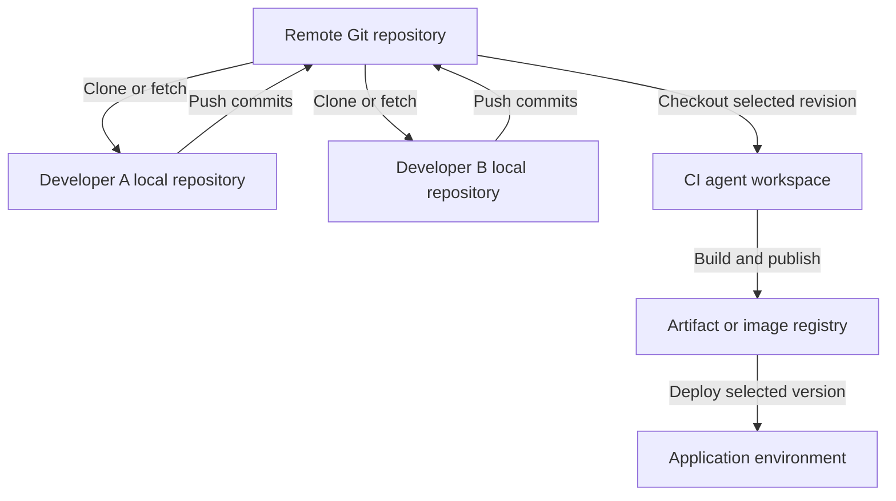

Use the organizational examples below as templates and adapt them to your actual project. The cloning, merge-conflict, and scheduling questions are testing how the complete development workflow fits together.

**1. What Git branching strategy is used in your organization?**

A practical example is **trunk-based development with short-lived feature branches**.

| Branch or reference | Purpose |
|---|---|
| `main` | Stable, integrated application code |
| `feature/*` | Individual features or improvements |
| `fix/*` | Bug fixes |
| `release/*` | Optional stabilization branches when maintaining separate release lines |
| Release tags | Identify specific released commits |

A typical workflow is:

1. Create a feature branch from the latest `main`.
2. Make small commits and run tests.
3. Push the branch and open a pull request.
4. Run build, test, security, and SonarQube checks.
5. Complete code review.
6. Merge the approved PR and delete the feature branch.

Protect `main` using required reviews and successful validation checks. Microsoft’s branching guidance similarly emphasizes feature branches, pull requests, and a healthy main branch. :chatgpt-content-reference{index="0"}

An interview answer could be:

> “We use short-lived feature branches from main. Developers raise pull requests, and automated checks plus code review are required before merging. We identify releases with tags and promote the resulting artifacts through our environments.”

If your organization uses GitFlow with `develop`, `release`, and `main`, describe that accurately. There is no single branching strategy used by every organization.

---

**2. How is deployment done to different environments using a Git repository?**

Git stores application code and deployment definitions. The pipeline uses a selected revision to build an artifact and deploy it.

A typical flow is:

| Event | Pipeline action |
|---|---|
| Feature-branch PR | Build, test, scan, and optionally create a preview environment |
| Merge to `main` | Build and publish a versioned application artifact |
| Development deployment | Deploy that artifact automatically |
| QA/UAT promotion | Deploy the same artifact with environment-specific configuration |
| Production approval | Deploy the approved artifact and perform health checks |

For containers, the artifact is an image stored in a registry such as ACR or ECR. Prefer promoting the **same image digest** through environments instead of rebuilding it separately for each environment.

Environment differences come from:

- Configuration files or Helm values.
- Environment variables.
- Environment-specific service connections.
- Secrets retrieved from Key Vault.
- Deployment approvals and checks.

In Azure Pipelines, a stage can have a branch condition:

```yaml
condition: and(
  succeeded(),
  eq(variables['Build.SourceBranch'], 'refs/heads/main')
)
```

This allows the stage to run only when previous work succeeded and the source branch is `main`. It does not automatically make the deployment a production deployment; the job must target the appropriate environment. :chatgpt-content-reference{index="1"}

Production approvals should be configured on protected environments or other protected resources. Azure Pipelines manages these checks separately from the pipeline YAML. :chatgpt-content-reference{index="2"}

---

**3. From where do you clone the repository? Do you use a local repository and transfer it to a remote repository?**

The interviewer is probably asking you to explain **where the code lives and how developers and pipelines obtain it**.

There are usually three separate copies:

1. **Remote repository:** Hosted in Azure Repos, GitHub, GitLab, or another Git service.
2. **Developer’s local repository:** A clone on a laptop or development machine.
3. **Pipeline workspace:** A checkout on the CI agent.



For an existing Azure Repos repository:

```bash
git clone https://dev.azure.com/ORG/PROJECT/_git/orders
cd orders

git switch -c feature/add-health-check

# Edit and test the application.

git add src/health.py
git commit -m "Add health endpoint"

git push -u origin feature/add-health-check
```

A normal clone creates a working directory and a local Git repository containing history. It also normally configures the source repository as the remote named `origin`. :chatgpt-content-reference{index="3"}

Important distinctions:

- `git commit` records changes **locally**.
- `git push` sends commits and updates references in the remote repository.
- `git fetch` downloads remote changes.
- You do not normally copy the whole project folder manually after each change.
- The CI agent checks out code from the remote repository; it does not depend on a developer’s laptop.

If you are starting a completely new project, you can use `git init` locally, create a remote repository, add it as `origin`, and push the initial commits.

---

**4. What is a PAT?**

**PAT stands for Personal Access Token.**

It is a credential used to authenticate to supported Git-hosting operations and APIs. In Azure DevOps, it can act as an alternative to a password for supported operations such as Git over HTTPS.

A PAT is associated with:

- A user identity.
- An organization or applicable scope.
- Selected permissions.
- An expiration date.

For example, a token intended only for cloning repositories should not receive unrelated administrative permissions. :chatgpt-content-reference{index="4"}

Good practices include:

- Use the minimum required permissions.
- Choose a short, practical expiration.
- Store it in a credential manager or secret store.
- Revoke it immediately if exposed.
- Avoid embedding it in clone URLs, scripts, or Git commits.

For Azure production automation, prefer supported service connections, workload identity federation, managed identities, or Microsoft Entra authentication when possible. A PAT is a long-lived bearer secret tied to a person, which creates additional lifecycle and security concerns. :chatgpt-content-reference{index="5"}

**A PAT is not the same thing as an Azure service principal or an SSH key.**

---

**5. How do you configure SonarQube?**

There are two parts: **setting up the SonarQube service** and **integrating analysis into the pipeline**.

**Server setup**

1. Select a supported SonarQube release and suitable edition.
2. Provision the required compute and storage.
3. Configure a supported external database, such as PostgreSQL.
4. Configure HTTPS, authentication, permissions, and backups.
5. Create or import the application project.
6. Configure its quality profile and quality gate.
7. Generate an appropriately scoped analysis token.

The embedded H2 database is intended for evaluation or testing rather than production use. :chatgpt-content-reference{index="6"}

These terms are different:

| Term | Meaning |
|---|---|
| Quality profile | The analysis rules enabled for a language |
| Quality gate | Conditions that determine whether the analyzed project passes |
| SonarScanner | The component that analyzes code and submits results |
| Analysis token | Credential used to authenticate analysis |

A quality gate might enforce a team policy on new security issues, coverage, and duplication. Treat any chosen thresholds as your team’s policy rather than assuming universal defaults. :chatgpt-content-reference{index="7"}

**Jenkins integration**

1. Install the SonarQube Scanner for Jenkins plugin.
2. Configure the SonarQube server URL in Jenkins.
3. Store the analysis token in Jenkins credentials.
4. Configure the build agent with the required build tools.
5. Run tests and generate coverage reports.
6. Run analysis.
7. Wait for the quality gate before allowing deployment.

Example for a Maven project, assuming a configured `linux-maven` agent and SonarQube installation named `sonarqube-prod`:

```groovy
pipeline {
    agent none

    stages {
        stage('Build, test and analyze') {
            agent { label 'linux-maven' }

            steps {
                withSonarQubeEnv('sonarqube-prod') {
                    sh '''
                        mvn -B clean verify sonar:sonar \
                          -Dsonar.projectKey=orders
                    '''
                }
            }
        }

        stage('Quality gate') {
            steps {
                timeout(time: 10, unit: 'MINUTES') {
                    script {
                        def gate = waitForQualityGate()

                        if (gate.status != 'OK') {
                            error "Quality gate failed: ${gate.status}"
                        }
                    }
                }
            }
        }
    }
}
```

Configure the SonarQube webhook to reach:

```text
https://jenkins.example.com/sonarqube-webhook/
```

The Jenkins integration requires this webhook for the quality-gate waiting workflow. Configure webhook-secret verification where appropriate. :chatgpt-content-reference{index="8"}

SonarQube normally **imports coverage generated by your test tooling**; it does not replace the test runner. For Java, this might be a JaCoCo report produced during the build. :chatgpt-content-reference{index="9"}

For Azure Pipelines, configure the SonarQube extension and service connection, then use the task sequence appropriate to the project’s language and build tool. Explicitly enforce the quality gate; publishing analysis results alone is not sufficient release control. :chatgpt-content-reference{index="10"}

---

**6. How do you integrate Azure Key Vault with Jenkins or Azure Pipelines?**

The basic process is:

1. Give the automation platform an Azure identity.
2. Authorize that identity to read the required secrets.
3. Ensure it can reach the vault.
4. Retrieve secrets during execution.
5. Pass them only to the steps that need them.

For an RBAC-enabled vault, **Key Vault Secrets User** permits reading secret values. **Key Vault Reader** reads metadata and does not grant access to secret contents. :chatgpt-content-reference{index="11"}

**Azure Pipelines**

Create an Azure Resource Manager service connection using workload identity federation where supported, and grant its identity the required vault access. :chatgpt-content-reference{index="12"}

Then fetch the secret:

```yaml
steps:
- task: AzureKeyVault@2
  displayName: Fetch deployment secret
  inputs:
    azureSubscription: sc-prod-workload-identity
    KeyVaultName: kv-orders-prod
    SecretsFilter: db-password
    RunAsPreJob: false

- bash: |
    set +x
    ./ci/deploy.sh
  displayName: Deploy application
  env:
    DB_PASSWORD: $(db-password)
```

Here:

- `azureSubscription` is the **service connection name**.
- `SecretsFilter` selects the required secret.
- With `RunAsPreJob: false`, the secret is available to subsequent tasks in the job.
- The deployment script reads `DB_PASSWORD` from its environment.

The `AzureKeyVault@2` task creates pipeline variables from the retrieved secrets. :chatgpt-content-reference{index="13"}

**Jenkins**

Install the Azure Key Vault plugin and configure a supported Azure credential, such as a managed identity or service principal.

Example stage in a Declarative Pipeline:

```groovy
stage('Deploy') {
    options {
        azureKeyVault(
            credentialID: 'azure-keyvault-reader',
            keyVaultURL: 'https://kv-orders-prod.vault.azure.net',
            secrets: [[
                secretType: 'Secret',
                name: 'db-password',
                envVariable: 'DB_PASSWORD'
            ]]
        )
    }

    steps {
        sh '''
            set +x
            ./ci/deploy.sh
        '''
    }
}
```

The credential ID refers to an Azure identity configured in Jenkins. The plugin binds the retrieved value to the environment variable. :chatgpt-content-reference{index="14"}

For private vaults, ensure that the component retrieving the secret has the required network route and DNS resolution. A service connection supplies identity; it does not bypass network restrictions.

Restrict production secrets to trusted pipelines. Secret masking helps reduce accidental logging, but it does not prevent an authorized script from reading or transmitting a secret.

---

**7. How do you resolve Git merge conflicts when two people change the same file?**

**Two people changing the same file does not necessarily cause a conflict.** Git can often merge changes to different lines automatically.

A conflict occurs when Git cannot safely reconcile changes—for example, incompatible edits to the same section or one person deleting a file that another modifies.

Also, these situations differ:

| Situation | Meaning |
|---|---|
| Two developers commit locally | Usually no conflict; their repositories are independent |
| Push rejected as non-fast-forward | The remote branch has commits missing locally |
| Merge or rebase stops with conflicts | Git needs help combining changes |

**Example: your feature branch conflicts with `main`**

Start with a clean working tree:

```bash
git switch feature/login
git fetch origin
git merge origin/main
```

Inspect the conflicts:

```bash
git status
git diff --name-only --diff-filter=U
```

A text conflict may look like:

```text
<<<<<<< HEAD
timeout = 30
=======
timeout = 60
>>>>>>> origin/main
```

Review both changes, decide the correct behavior, edit the file, and remove the conflict markers.

Then run relevant tests and finish the merge:

```bash
git add path/to/file
git merge --continue
git push origin feature/login
```

To abandon the merge:

```bash
git merge --abort
```

These commands follow Git’s merge-resolution workflow. :chatgpt-content-reference{index="15"}

If the push was rejected because another developer updated **the same feature branch**, integrate that remote feature branch instead of assuming `origin/main` is the missing history.

**How many ways can conflicts be resolved?**

There is no fixed number. Common interfaces include:

- Manually editing the conflicted files.
- An IDE merge editor, such as VS Code.
- A configured `git mergetool`.
- The repository provider’s web conflict editor for supported conflicts.

You can also integrate using **rebase** rather than merge:

```bash
git fetch origin
git rebase origin/main

# Resolve conflicts, then:
git add path/to/file
git rebase --continue
```

Or abort:

```bash
git rebase --abort
```

Rebasing rewrites commits. If your own already-published branch must be updated afterward, use an agreed workflow and `--force-with-lease` when appropriate; do not casually rewrite shared or protected branch history. :chatgpt-content-reference{index="16"}

---

**8. What is SonarQube’s output? How do you fix code smells or vulnerabilities?**

SonarQube produces analysis results in its project dashboard and can report status to pull requests and pipelines.

Typical results include:

| Result | What it tells you |
|---|---|
| Reliability findings | Code that may behave incorrectly |
| Security findings | Potentially unsafe implementation |
| Maintainability findings or code smells | Code that is difficult to understand or maintain |
| Coverage | Coverage imported from test tooling |
| Duplication | Repeated code |
| Quality-gate status | Whether configured acceptance conditions passed |

Terminology varies between SonarQube modes and versions. Where **Security Hotspots** are reported, they identify security-sensitive code that requires review; they are not automatically confirmed vulnerabilities. :chatgpt-content-reference{index="17"}

The remediation process is:

1. Open the finding and read the rule explanation.
2. Inspect the affected code and any reported data flow.
3. Determine whether it is a genuine issue.
4. Fix the code on a branch.
5. Add or update relevant tests.
6. Rerun tests and analysis.
7. Confirm that the finding and quality gate are resolved.

Examples:

- **Duplicated logic:** Extract a suitable shared function.
- **Excessive complexity:** Break a large function into smaller responsibilities.
- **Resource leak:** Ensure files or database resources are closed.
- **SQL injection risk:** Replace string-built queries with parameterized queries.
- **Exposed credential:** Revoke or rotate it and remove it from the code.

For example, with a PostgreSQL driver supporting `%s` parameters:

```python
# Unsafe construction
cursor.execute(
    f"SELECT * FROM users WHERE email = '{email}'"
)

# Parameterized query
cursor.execute(
    "SELECT * FROM users WHERE email = %s",
    (email,)
)
```

A false-positive or accepted-risk decision should include a documented technical reason and appropriate review.

**Successful scanner execution does not necessarily mean a passing quality gate.** The pipeline must obtain and act on the gate result after analysis processing. :chatgpt-content-reference{index="18"}

---

**9. Where do you write the pipeline code or YAML file?**

Normally, you write it in a text editor or IDE and commit it to Git alongside the application.

| Platform or purpose | Typical file |
|---|---|
| Jenkins Pipeline | `Jenkinsfile` |
| Azure Pipelines | `azure-pipelines.yml` |
| Shared Azure pipeline templates | `.ci/templates/build.yml`, `.ci/templates/deploy.yml` |
| Reusable shell commands | `ci/test.sh`, `ci/deploy.sh` |

**Jenkinsfiles use a Groovy-based DSL, not YAML.**

In Jenkins, configure either:

- **Pipeline from SCM**, pointing to the repository and Jenkinsfile path.
- A **Multibranch Pipeline**, which discovers branches containing a Jenkinsfile.

Jenkins supports defining pipeline code in its UI, but storing the Jenkinsfile in source control enables review, versioning, and traceability. :chatgpt-content-reference{index="19"}

In Azure DevOps, select the repository and YAML path when creating the pipeline. Editing through the Azure pipeline editor also results in a repository change that should follow your review process.

For Azure Repos, configure PR build validation through **target-branch policies**. A YAML `pr` trigger does not configure Azure Repos PR validation. :chatgpt-content-reference{index="20"}

---

**10. What is inside a Dockerfile?**

A Dockerfile contains instructions for building a container image.

| Instruction | Purpose |
|---|---|
| `FROM` | Select a base image |
| `WORKDIR` | Set the working directory |
| `COPY` | Copy files into the image |
| `RUN` | Execute commands during image building |
| `ENV` | Define environment variables |
| `ARG` | Define build-time arguments |
| `USER` | Select the runtime user |
| `EXPOSE` | Document the intended listening port |
| `ENTRYPOINT` | Define the executable |
| `CMD` | Supply the default command or arguments |

Example for a Python FastAPI application, assuming `requirements.txt` includes the required packages and `app/main.py` exposes an application named `app`:

```dockerfile
FROM python:3.13-slim

ENV PYTHONDONTWRITEBYTECODE=1 \
    PYTHONUNBUFFERED=1

WORKDIR /app

COPY requirements.txt .
RUN pip install --no-cache-dir -r requirements.txt

COPY --chown=10001:10001 app/ ./app/

USER 10001:10001

EXPOSE 8000

CMD ["uvicorn", "app.main:app", \
     "--host", "0.0.0.0", "--port", "8000"]
```

Build and run locally:

```bash
docker build -t orders-api:dev .

docker run --rm \
  -p 127.0.0.1:8000:8000 \
  orders-api:dev
```

`RUN` executes during the build; `CMD` specifies the default command when the container starts.

`EXPOSE` does not publish a host port. The `-p` option performs the host-to-container port mapping. :chatgpt-content-reference{index="21"}

Practical improvements include pinned dependencies, reviewed base-image updates, non-root execution, and a `.dockerignore` excluding unnecessary files such as `.git`, local virtual environments, and secret files. Use multi-stage builds when build tools or compilation outputs should be separated from the runtime image. :chatgpt-content-reference{index="22"}

---

**11. How do you schedule a validated pipeline for the `stage` or `main` branch?**

First separate three concepts:

- **Branch:** The Git revision to execute.
- **Schedule:** When to start a pipeline run.
- **Deployment environment:** Where an artifact is deployed.

The interviewer may mean either “run this branch nightly” or “deploy an approved build during a release window.”

**Scheduling Azure Pipelines**

Suppose the requirement is to run the pipeline for both `stage` and `main` every day at **10:00 PM IST**.

That is **16:30 UTC**. Add this scheduling configuration to the pipeline’s main YAML file:

```yaml
# Disable ordinary push-triggered runs for this example.
trigger: none

schedules:
- cron: '30 16 * * *'
  displayName: Daily at 10 PM IST
  branches:
    include:
    - stage
    - main
  always: true
```

Keep your existing stages or jobs below this configuration.

This schedules separate runs for matching branches. `always: true` allows scheduled execution even when there have been no relevant changes since the previous successful scheduled run.

Azure YAML cron schedules use **UTC**. :chatgpt-content-reference{index="23"}

The process after changing a pipeline is:

1. Make the YAML change on a feature branch.
2. Validate it using an appropriate test run.
3. Raise a PR.
4. Merge the approved change into the branches that should use it.
5. Verify the scheduled runs and branch filters.

The schedule must exist in the YAML file **in the branch being scheduled**. Adding `stage` to the schedule in `main` does not automatically update the YAML in `stage`.

Also, UI-defined schedules take precedence over YAML schedules; inspect both when troubleshooting. :chatgpt-content-reference{index="24"}

**Selecting the deployment environment**

You can apply branch conditions to deployment stages:

```yaml
# On the staging deployment stage:
condition: and(
  succeeded(),
  eq(variables['Build.SourceBranch'], 'refs/heads/stage')
)
```

```yaml
# On the production deployment stage:
condition: and(
  succeeded(),
  eq(variables['Build.SourceBranch'], 'refs/heads/main')
)
```

The deployment jobs must then reference the appropriate Azure Pipelines environments. :chatgpt-content-reference{index="25"}

**Deploying an already validated artifact at a particular time**

If the requirement is “deploy this exact tested build tonight,” preserve and select that artifact version. A later scheduled branch build may use newer commits.

For controlled deployment windows, Azure environment checks can combine approvals with a **Business Hours** check. An exclusive lock can help control concurrent deployments to the same environment. :chatgpt-content-reference{index="26"}

**Jenkins equivalent**

For a Jenkins controller configured to UTC:

```groovy
triggers {
    cron('30 16 * * *')
}
```

This schedules a daily run at 16:30 UTC. Configure the intended branch through the Pipeline-from-SCM job or the relevant multibranch job settings.

Jenkins `cron` starts scheduled runs; `pollSCM` periodically checks for source changes. They serve different purposes. :chatgpt-content-reference{index="27"}
