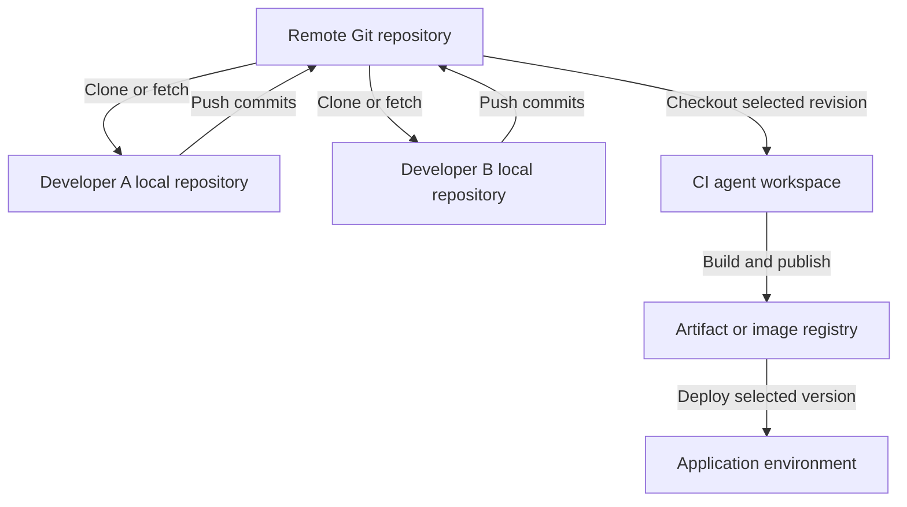

Use the organizational examples below as templates and adapt them to your actual project. The cloning, merge-conflict, and scheduling questions are testing how the complete development workflow fits together.

**1. What Git branching strategy is used in your organization?**

A practical example is **trunk-based development with short-lived feature branches**.

| Branch or reference | Purpose |
|---|---|
| `main` | Stable, integrated application code |
| `feature/*` | Individual features or improvements |
| `fix/*` | Bug fixes |
| `release/*` | Optional stabilization branches when maintaining separate release lines |
| Release tags | Identify specific released commits |

A typical workflow is:

1. Create a feature branch from the latest `main`.
2. Make small commits and run tests.
3. Push the branch and open a pull request.
4. Run build, test, security, and SonarQube checks.
5. Complete code review.
6. Merge the approved PR and delete the feature branch.

Protect `main` using required reviews and successful validation checks. Microsoft’s branching guidance similarly emphasizes feature branches, pull requests, and a healthy main branch. :chatgpt-content-reference{index="0"}

An interview answer could be:

> “We use short-lived feature branches from main. Developers raise pull requests, and automated checks plus code review are required before merging. We identify releases with tags and promote the resulting artifacts through our environments.”

If your organization uses GitFlow with `develop`, `release`, and `main`, describe that accurately. There is no single branching strategy used by every organization.

---

**2. How is deployment done to different environments using a Git repository?**

Git stores application code and deployment definitions. The pipeline uses a selected revision to build an artifact and deploy it.

A typical flow is:

| Event | Pipeline action |
|---|---|
| Feature-branch PR | Build, test, scan, and optionally create a preview environment |
| Merge to `main` | Build and publish a versioned application artifact |
| Development deployment | Deploy that artifact automatically |
| QA/UAT promotion | Deploy the same artifact with environment-specific configuration |
| Production approval | Deploy the approved artifact and perform health checks |

For containers, the artifact is an image stored in a registry such as ACR or ECR. Prefer promoting the **same image digest** through environments instead of rebuilding it separately for each environment.

Environment differences come from:

- Configuration files or Helm values.
- Environment variables.
- Environment-specific service connections.
- Secrets retrieved from Key Vault.
- Deployment approvals and checks.

In Azure Pipelines, a stage can have a branch condition:

```yaml
condition: and(
  succeeded(),
  eq(variables['Build.SourceBranch'], 'refs/heads/main')
)
```

This allows the stage to run only when previous work succeeded and the source branch is `main`. It does not automatically make the deployment a production deployment; the job must target the appropriate environment. :chatgpt-content-reference{index="1"}

Production approvals should be configured on protected environments or other protected resources. Azure Pipelines manages these checks separately from the pipeline YAML. :chatgpt-content-reference{index="2"}

---

**3. From where do you clone the repository? Do you use a local repository and transfer it to a remote repository?**

The interviewer is probably asking you to explain **where the code lives and how developers and pipelines obtain it**.

There are usually three separate copies:

1. **Remote repository:** Hosted in Azure Repos, GitHub, GitLab, or another Git service.
2. **Developer’s local repository:** A clone on a laptop or development machine.
3. **Pipeline workspace:** A checkout on the CI agent.



For an existing Azure Repos repository:

```bash
git clone https://dev.azure.com/ORG/PROJECT/_git/orders
cd orders

git switch -c feature/add-health-check

# Edit and test the application.

git add src/health.py
git commit -m "Add health endpoint"

git push -u origin feature/add-health-check
```

A normal clone creates a working directory and a local Git repository containing history. It also normally configures the source repository as the remote named `origin`. :chatgpt-content-reference{index="3"}

Important distinctions:

- `git commit` records changes **locally**.
- `git push` sends commits and updates references in the remote repository.
- `git fetch` downloads remote changes.
- You do not normally copy the whole project folder manually after each change.
- The CI agent checks out code from the remote repository; it does not depend on a developer’s laptop.

If you are starting a completely new project, you can use `git init` locally, create a remote repository, add it as `origin`, and push the initial commits.

---

**4. What is a PAT?**

**PAT stands for Personal Access Token.**

It is a credential used to authenticate to supported Git-hosting operations and APIs. In Azure DevOps, it can act as an alternative to a password for supported operations such as Git over HTTPS.

A PAT is associated with:

- A user identity.
- An organization or applicable scope.
- Selected permissions.
- An expiration date.

For example, a token intended only for cloning repositories should not receive unrelated administrative permissions. :chatgpt-content-reference{index="4"}

Good practices include:

- Use the minimum required permissions.
- Choose a short, practical expiration.
- Store it in a credential manager or secret store.
- Revoke it immediately if exposed.
- Avoid embedding it in clone URLs, scripts, or Git commits.

For Azure production automation, prefer supported service connections, workload identity federation, managed identities, or Microsoft Entra authentication when possible. A PAT is a long-lived bearer secret tied to a person, which creates additional lifecycle and security concerns. :chatgpt-content-reference{index="5"}

**A PAT is not the same thing as an Azure service principal or an SSH key.**

---

**5. How do you configure SonarQube?**

There are two parts: **setting up the SonarQube service** and **integrating analysis into the pipeline**.

**Server setup**

1. Select a supported SonarQube release and suitable edition.
2. Provision the required compute and storage.
3. Configure a supported external database, such as PostgreSQL.
4. Configure HTTPS, authentication, permissions, and backups.
5. Create or import the application project.
6. Configure its quality profile and quality gate.
7. Generate an appropriately scoped analysis token.

The embedded H2 database is intended for evaluation or testing rather than production use. :chatgpt-content-reference{index="6"}

These terms are different:

| Term | Meaning |
|---|---|
| Quality profile | The analysis rules enabled for a language |
| Quality gate | Conditions that determine whether the analyzed project passes |
| SonarScanner | The component that analyzes code and submits results |
| Analysis token | Credential used to authenticate analysis |

A quality gate might enforce a team policy on new security issues, coverage, and duplication. Treat any chosen thresholds as your team’s policy rather than assuming universal defaults. :chatgpt-content-reference{index="7"}

**Jenkins integration**

1. Install the SonarQube Scanner for Jenkins plugin.
2. Configure the SonarQube server URL in Jenkins.
3. Store the analysis token in Jenkins credentials.
4. Configure the build agent with the required build tools.
5. Run tests and generate coverage reports.
6. Run analysis.
7. Wait for the quality gate before allowing deployment.

Example for a Maven project, assuming a configured `linux-maven` agent and SonarQube installation named `sonarqube-prod`:

```groovy
pipeline {
    agent none

    stages {
        stage('Build, test and analyze') {
            agent { label 'linux-maven' }

            steps {
                withSonarQubeEnv('sonarqube-prod') {
                    sh '''
                        mvn -B clean verify sonar:sonar \
                          -Dsonar.projectKey=orders
                    '''
                }
            }
        }

        stage('Quality gate') {
            steps {
                timeout(time: 10, unit: 'MINUTES') {
                    script {
                        def gate = waitForQualityGate()

                        if (gate.status != 'OK') {
                            error "Quality gate failed: ${gate.status}"
                        }
                    }
                }
            }
        }
    }
}
```

Configure the SonarQube webhook to reach:

```text
https://jenkins.example.com/sonarqube-webhook/
```

The Jenkins integration requires this webhook for the quality-gate waiting workflow. Configure webhook-secret verification where appropriate. :chatgpt-content-reference{index="8"}

SonarQube normally **imports coverage generated by your test tooling**; it does not replace the test runner. For Java, this might be a JaCoCo report produced during the build. :chatgpt-content-reference{index="9"}

For Azure Pipelines, configure the SonarQube extension and service connection, then use the task sequence appropriate to the project’s language and build tool. Explicitly enforce the quality gate; publishing analysis results alone is not sufficient release control. :chatgpt-content-reference{index="10"}

---

**6. How do you integrate Azure Key Vault with Jenkins or Azure Pipelines?**

The basic process is:

1. Give the automation platform an Azure identity.
2. Authorize that identity to read the required secrets.
3. Ensure it can reach the vault.
4. Retrieve secrets during execution.
5. Pass them only to the steps that need them.

For an RBAC-enabled vault, **Key Vault Secrets User** permits reading secret values. **Key Vault Reader** reads metadata and does not grant access to secret contents. :chatgpt-content-reference{index="11"}

**Azure Pipelines**

Create an Azure Resource Manager service connection using workload identity federation where supported, and grant its identity the required vault access. :chatgpt-content-reference{index="12"}

Then fetch the secret:

```yaml
steps:
- task: AzureKeyVault@2
  displayName: Fetch deployment secret
  inputs:
    azureSubscription: sc-prod-workload-identity
    KeyVaultName: kv-orders-prod
    SecretsFilter: db-password
    RunAsPreJob: false

- bash: |
    set +x
    ./ci/deploy.sh
  displayName: Deploy application
  env:
    DB_PASSWORD: $(db-password)
```

Here:

- `azureSubscription` is the **service connection name**.
- `SecretsFilter` selects the required secret.
- With `RunAsPreJob: false`, the secret is available to subsequent tasks in the job.
- The deployment script reads `DB_PASSWORD` from its environment.

The `AzureKeyVault@2` task creates pipeline variables from the retrieved secrets. :chatgpt-content-reference{index="13"}

**Jenkins**

Install the Azure Key Vault plugin and configure a supported Azure credential, such as a managed identity or service principal.

Example stage in a Declarative Pipeline:

```groovy
stage('Deploy') {
    options {
        azureKeyVault(
            credentialID: 'azure-keyvault-reader',
            keyVaultURL: 'https://kv-orders-prod.vault.azure.net',
            secrets: [[
                secretType: 'Secret',
                name: 'db-password',
                envVariable: 'DB_PASSWORD'
            ]]
        )
    }

    steps {
        sh '''
            set +x
            ./ci/deploy.sh
        '''
    }
}
```

The credential ID refers to an Azure identity configured in Jenkins. The plugin binds the retrieved value to the environment variable. :chatgpt-content-reference{index="14"}

For private vaults, ensure that the component retrieving the secret has the required network route and DNS resolution. A service connection supplies identity; it does not bypass network restrictions.

Restrict production secrets to trusted pipelines. Secret masking helps reduce accidental logging, but it does not prevent an authorized script from reading or transmitting a secret.

---

**7. How do you resolve Git merge conflicts when two people change the same file?**

**Two people changing the same file does not necessarily cause a conflict.** Git can often merge changes to different lines automatically.

A conflict occurs when Git cannot safely reconcile changes—for example, incompatible edits to the same section or one person deleting a file that another modifies.

Also, these situations differ:

| Situation | Meaning |
|---|---|
| Two developers commit locally | Usually no conflict; their repositories are independent |
| Push rejected as non-fast-forward | The remote branch has commits missing locally |
| Merge or rebase stops with conflicts | Git needs help combining changes |

**Example: your feature branch conflicts with `main`**

Start with a clean working tree:

```bash
git switch feature/login
git fetch origin
git merge origin/main
```

Inspect the conflicts:

```bash
git status
git diff --name-only --diff-filter=U
```

A text conflict may look like:

```text
<<<<<<< HEAD
timeout = 30
=======
timeout = 60
>>>>>>> origin/main
```

Review both changes, decide the correct behavior, edit the file, and remove the conflict markers.

Then run relevant tests and finish the merge:

```bash
git add path/to/file
git merge --continue
git push origin feature/login
```

To abandon the merge:

```bash
git merge --abort
```

These commands follow Git’s merge-resolution workflow. :chatgpt-content-reference{index="15"}

If the push was rejected because another developer updated **the same feature branch**, integrate that remote feature branch instead of assuming `origin/main` is the missing history.

**How many ways can conflicts be resolved?**

There is no fixed number. Common interfaces include:

- Manually editing the conflicted files.
- An IDE merge editor, such as VS Code.
- A configured `git mergetool`.
- The repository provider’s web conflict editor for supported conflicts.

You can also integrate using **rebase** rather than merge:

```bash
git fetch origin
git rebase origin/main

# Resolve conflicts, then:
git add path/to/file
git rebase --continue
```

Or abort:

```bash
git rebase --abort
```

Rebasing rewrites commits. If your own already-published branch must be updated afterward, use an agreed workflow and `--force-with-lease` when appropriate; do not casually rewrite shared or protected branch history. :chatgpt-content-reference{index="16"}

---

**8. What is SonarQube’s output? How do you fix code smells or vulnerabilities?**

SonarQube produces analysis results in its project dashboard and can report status to pull requests and pipelines.

Typical results include:

| Result | What it tells you |
|---|---|
| Reliability findings | Code that may behave incorrectly |
| Security findings | Potentially unsafe implementation |
| Maintainability findings or code smells | Code that is difficult to understand or maintain |
| Coverage | Coverage imported from test tooling |
| Duplication | Repeated code |
| Quality-gate status | Whether configured acceptance conditions passed |

Terminology varies between SonarQube modes and versions. Where **Security Hotspots** are reported, they identify security-sensitive code that requires review; they are not automatically confirmed vulnerabilities. :chatgpt-content-reference{index="17"}

The remediation process is:

1. Open the finding and read the rule explanation.
2. Inspect the affected code and any reported data flow.
3. Determine whether it is a genuine issue.
4. Fix the code on a branch.
5. Add or update relevant tests.
6. Rerun tests and analysis.
7. Confirm that the finding and quality gate are resolved.

Examples:

- **Duplicated logic:** Extract a suitable shared function.
- **Excessive complexity:** Break a large function into smaller responsibilities.
- **Resource leak:** Ensure files or database resources are closed.
- **SQL injection risk:** Replace string-built queries with parameterized queries.
- **Exposed credential:** Revoke or rotate it and remove it from the code.

For example, with a PostgreSQL driver supporting `%s` parameters:

```python
# Unsafe construction
cursor.execute(
    f"SELECT * FROM users WHERE email = '{email}'"
)

# Parameterized query
cursor.execute(
    "SELECT * FROM users WHERE email = %s",
    (email,)
)
```

A false-positive or accepted-risk decision should include a documented technical reason and appropriate review.

**Successful scanner execution does not necessarily mean a passing quality gate.** The pipeline must obtain and act on the gate result after analysis processing. :chatgpt-content-reference{index="18"}

---

**9. Where do you write the pipeline code or YAML file?**

Normally, you write it in a text editor or IDE and commit it to Git alongside the application.

| Platform or purpose | Typical file |
|---|---|
| Jenkins Pipeline | `Jenkinsfile` |
| Azure Pipelines | `azure-pipelines.yml` |
| Shared Azure pipeline templates | `.ci/templates/build.yml`, `.ci/templates/deploy.yml` |
| Reusable shell commands | `ci/test.sh`, `ci/deploy.sh` |

**Jenkinsfiles use a Groovy-based DSL, not YAML.**

In Jenkins, configure either:

- **Pipeline from SCM**, pointing to the repository and Jenkinsfile path.
- A **Multibranch Pipeline**, which discovers branches containing a Jenkinsfile.

Jenkins supports defining pipeline code in its UI, but storing the Jenkinsfile in source control enables review, versioning, and traceability. :chatgpt-content-reference{index="19"}

In Azure DevOps, select the repository and YAML path when creating the pipeline. Editing through the Azure pipeline editor also results in a repository change that should follow your review process.

For Azure Repos, configure PR build validation through **target-branch policies**. A YAML `pr` trigger does not configure Azure Repos PR validation. :chatgpt-content-reference{index="20"}

---

**10. What is inside a Dockerfile?**

A Dockerfile contains instructions for building a container image.

| Instruction | Purpose |
|---|---|
| `FROM` | Select a base image |
| `WORKDIR` | Set the working directory |
| `COPY` | Copy files into the image |
| `RUN` | Execute commands during image building |
| `ENV` | Define environment variables |
| `ARG` | Define build-time arguments |
| `USER` | Select the runtime user |
| `EXPOSE` | Document the intended listening port |
| `ENTRYPOINT` | Define the executable |
| `CMD` | Supply the default command or arguments |

Example for a Python FastAPI application, assuming `requirements.txt` includes the required packages and `app/main.py` exposes an application named `app`:

```dockerfile
FROM python:3.13-slim

ENV PYTHONDONTWRITEBYTECODE=1 \
    PYTHONUNBUFFERED=1

WORKDIR /app

COPY requirements.txt .
RUN pip install --no-cache-dir -r requirements.txt

COPY --chown=10001:10001 app/ ./app/

USER 10001:10001

EXPOSE 8000

CMD ["uvicorn", "app.main:app", \
     "--host", "0.0.0.0", "--port", "8000"]
```

Build and run locally:

```bash
docker build -t orders-api:dev .

docker run --rm \
  -p 127.0.0.1:8000:8000 \
  orders-api:dev
```

`RUN` executes during the build; `CMD` specifies the default command when the container starts.

`EXPOSE` does not publish a host port. The `-p` option performs the host-to-container port mapping. :chatgpt-content-reference{index="21"}

Practical improvements include pinned dependencies, reviewed base-image updates, non-root execution, and a `.dockerignore` excluding unnecessary files such as `.git`, local virtual environments, and secret files. Use multi-stage builds when build tools or compilation outputs should be separated from the runtime image. :chatgpt-content-reference{index="22"}

---

**11. How do you schedule a validated pipeline for the `stage` or `main` branch?**

First separate three concepts:

- **Branch:** The Git revision to execute.
- **Schedule:** When to start a pipeline run.
- **Deployment environment:** Where an artifact is deployed.

The interviewer may mean either “run this branch nightly” or “deploy an approved build during a release window.”

**Scheduling Azure Pipelines**

Suppose the requirement is to run the pipeline for both `stage` and `main` every day at **10:00 PM IST**.

That is **16:30 UTC**. Add this scheduling configuration to the pipeline’s main YAML file:

```yaml
# Disable ordinary push-triggered runs for this example.
trigger: none

schedules:
- cron: '30 16 * * *'
  displayName: Daily at 10 PM IST
  branches:
    include:
    - stage
    - main
  always: true
```

Keep your existing stages or jobs below this configuration.

This schedules separate runs for matching branches. `always: true` allows scheduled execution even when there have been no relevant changes since the previous successful scheduled run.

Azure YAML cron schedules use **UTC**. :chatgpt-content-reference{index="23"}

The process after changing a pipeline is:

1. Make the YAML change on a feature branch.
2. Validate it using an appropriate test run.
3. Raise a PR.
4. Merge the approved change into the branches that should use it.
5. Verify the scheduled runs and branch filters.

The schedule must exist in the YAML file **in the branch being scheduled**. Adding `stage` to the schedule in `main` does not automatically update the YAML in `stage`.

Also, UI-defined schedules take precedence over YAML schedules; inspect both when troubleshooting. :chatgpt-content-reference{index="24"}

**Selecting the deployment environment**

You can apply branch conditions to deployment stages:

```yaml
# On the staging deployment stage:
condition: and(
  succeeded(),
  eq(variables['Build.SourceBranch'], 'refs/heads/stage')
)
```

```yaml
# On the production deployment stage:
condition: and(
  succeeded(),
  eq(variables['Build.SourceBranch'], 'refs/heads/main')
)
```

The deployment jobs must then reference the appropriate Azure Pipelines environments. :chatgpt-content-reference{index="25"}

**Deploying an already validated artifact at a particular time**

If the requirement is “deploy this exact tested build tonight,” preserve and select that artifact version. A later scheduled branch build may use newer commits.

For controlled deployment windows, Azure environment checks can combine approvals with a **Business Hours** check. An exclusive lock can help control concurrent deployments to the same environment. :chatgpt-content-reference{index="26"}

**Jenkins equivalent**

For a Jenkins controller configured to UTC:

```groovy
triggers {
    cron('30 16 * * *')
}
```

This schedules a daily run at 16:30 UTC. Configure the intended branch through the Pipeline-from-SCM job or the relevant multibranch job settings.

Jenkins `cron` starts scheduled runs; `pollSCM` periodically checks for source changes. They serve different purposes. :chatgpt-content-reference{index="27"}


Below are detailed, interview-ready answers to all 10 questions. The project designs and incident stories are **examples to adapt to your actual experience**.

**1. Explain your CI/CD pipeline design. Which tools did you use and why?**

A strong answer explains the flow, the purpose of each tool, and how the pipeline prevents a failed change from reaching production.

**Sample answer:**

> “I design pipelines around repeatable builds, automated validation, and controlled promotion. Every release is traceable to a Git commit, an immutable container image, and its deployment configuration. The same tested image moves through dev, stage, and production.”

An example toolset is:

| Responsibility | Tool | Why use it? |
|---|---|---|
| Source control | GitHub, GitLab, or Azure Repos | Pull requests, reviews, branch protection, and change history |
| Pipeline orchestration | Jenkins | Pipeline as code, integration with existing tools, and reusable shared libraries |
| Build and testing | Maven, Gradle, npm, or pytest | Application-specific build and automated tests |
| Code analysis | SonarQube | Quality gates and supported static security analysis |
| Security checks | Trivy and a secret scanner | Dependency, image, infrastructure, and credential checks |
| Packaging and storage | Docker with ECR or ACR | Versioned container artifacts |
| Deployment | Helm and Kubernetes | Repeatable application configuration and rollout |
| Infrastructure | Terraform | Reviewed, versioned infrastructure changes |
| Observability | Prometheus, Grafana, and centralized logs | Deployment verification and production troubleshooting |

**The pipeline flow:**

1. **Trigger:** A webhook starts validation for a pull request or trusted branch update.
2. **Checkout:** Jenkins checks out the exact commit associated with the build.
3. **Build and test:** Compile or package the application, run unit tests, and generate coverage reports.
4. **Quality and security gates:** Analyze code, dependencies, secrets, and infrastructure configuration.
5. **Package:** Build the container image and scan the resulting image.
6. **Publish:** Push the approved artifact and record its immutable digest.
7. **Deploy to dev:** Run smoke and integration tests.
8. **Promote to stage:** Run broader regression, performance, and security checks.
9. **Promote to production:** Apply the required approval and deployment strategy.
10. **Verify:** Check application health, customer-facing metrics, and rollback criteria.

The `Jenkinsfile` belongs in source control so pipeline changes receive reviews and retain an audit history. Jenkins coordinates the build tools; it does not replace them. :chatgpt-content-reference{index="0"}

**Points that demonstrate experience:**

- Build once and promote the same image digest.
- Keep environment configuration separate from the application image.
- Run untrusted pull-request builds without production credentials.
- Record the Git commit, image digest, chart version, test results, and deployment outcome.
- Define recovery before deploying.
- Treat database migrations separately: reverting an image does not reverse a destructive database change.

---

**2. How would you implement Jenkins deployments across dev, stage, and prod?**

I would separate **artifact creation** from **artifact promotion**.

The build pipeline creates a release. The deployment pipeline selects that release and moves it through environments.

| Environment | Typical deployment policy | Validation |
|---|---|---|
| Dev | Automatic after successful CI | Smoke tests and integration tests |
| Stage | Promote a selected release candidate | Regression, performance, and acceptance tests |
| Prod | Promote the approved stage artifact | Controlled rollout and production health checks |

Each environment should have its own configuration and deployment identity. Production commonly uses a separate account, subscription, or cluster, depending on the isolation requirements.

**Example Jenkins promotion pipeline**

This example assumes three existing deployment jobs. Each job validates the supplied digest against an approved release record, deploys it, and runs environment-specific tests.

```groovy
pipeline {
    agent none

    options {
        timestamps()
        disableConcurrentBuilds()
    }

    parameters {
        string(
            name: 'IMAGE_DIGEST',
            defaultValue: '',
            description: 'Approved image digest: sha256:...'
        )
    }

    stages {
        stage('Deploy Dev') {
            steps {
                build job: 'orders-deploy-dev',
                    parameters: [
                        string(name: 'IMAGE_DIGEST',
                               value: params.IMAGE_DIGEST)
                    ],
                    wait: true,
                    propagate: true
            }
        }

        stage('Deploy Stage') {
            steps {
                build job: 'orders-deploy-stage',
                    parameters: [
                        string(name: 'IMAGE_DIGEST',
                               value: params.IMAGE_DIGEST)
                    ],
                    wait: true,
                    propagate: true
            }
        }

        stage('Approve Production') {
            options {
                timeout(time: 30, unit: 'MINUTES')
            }
            steps {
                input(
                    message: "Promote ${params.IMAGE_DIGEST} to production?",
                    submitter: 'release-managers'
                )
            }
        }

        stage('Deploy Production') {
            steps {
                build job: 'orders-deploy-prod',
                    parameters: [
                        string(name: 'IMAGE_DIGEST',
                               value: params.IMAGE_DIGEST)
                    ],
                    wait: true,
                    propagate: true
            }
        }
    }
}
```

`wait: true` waits for the downstream job. `propagate: true` propagates its result, preventing a failed deployment from being treated as successful. :chatgpt-content-reference{index="1"}

With `agent none`, the approval step does not reserve a build executor. The `submitter` setting restricts who can approve. `disableConcurrentBuilds()` serializes this particular pipeline; separate jobs targeting the same environment still need coordinated deployment locking. :chatgpt-content-reference{index="2"}

Inside a deployment job, a Helm command could look like:

```bash
helm upgrade --install orders ./charts/orders \
  --kube-context "$KUBE_CONTEXT" \
  --namespace "$ENVIRONMENT" \
  --values "./charts/orders/values-${ENVIRONMENT}.yaml" \
  --set-string image.digest="$IMAGE_DIGEST" \
  --wait \
  --timeout 5m
```

Here, the chart must render the image as `repository@digest`. The chart and configuration revisions should also be pinned in the release record. Helm supports supplying values and waiting for resource readiness during an upgrade. :chatgpt-content-reference{index="3"}

**Production controls:**

- Restrict production job execution and configuration changes.
- Give each job only the permissions required for its environment.
- Keep credentials unavailable to untrusted pipeline code.
- Verify the deployed digest after rollout.
- Run application smoke tests; resource readiness alone is insufficient.
- Keep the previous known-good release available.

An approval button supports release governance. Cloud IAM, Kubernetes RBAC, and Jenkins authorization enforce the access boundary.

---

**3. How do you debug Jenkins pipeline failures? Give practical examples.**

Start by locating the **first meaningful failure**, then determine whether it belongs to the pipeline, build agent, application, or deployment platform.

**My investigation sequence:**

1. Identify the failed stage and command exit status.
2. Compare with the last successful run: commit, dependencies, agent image, credentials, and configuration.
3. Inspect the relevant console output and test reports.
4. Check agent availability, disk space, memory, network access, and tool versions.
5. If deployment failed, inspect the target platform.
6. Restore service where necessary, then implement and verify the permanent fix.

| Failure | Evidence to inspect | Typical resolution |
|---|---|---|
| Build remains queued | Agent label, online status, executor availability, agent provisioning logs | Correct the label or restore/provision agents |
| Checkout fails | Repository URL, credential scope, token validity, DNS and connectivity | Correct access or network configuration |
| Tests fail | Test report, application changes, test dependencies | Fix the application or test environment |
| Image push fails | Registry authentication, repository permissions, network access | Refresh authentication or correct permissions |
| Deployment times out | Pod events, image pulls, scheduling, probes | Fix the specific Kubernetes failure |
| Terraform cannot acquire a lock | Lock owner, active pipeline, backend connectivity | Wait for the owner or investigate an abandoned lock |

Jenkins agents execute build work, so an agent failure must be distinguished from an application build failure. :chatgpt-content-reference{index="4"}

For Kubernetes deployment failures, useful commands include:

```bash
# Set POD to the affected pod name.
kubectl -n prod describe pod "$POD"

kubectl -n prod logs "$POD" \
  -c orders --previous

kubectl -n prod get events \
  --sort-by=.metadata.creationTimestamp

kubectl -n prod rollout status \
  deployment/orders --timeout=5m
```

`--previous` retrieves logs from the previous container instance when available. This is useful when the current container has restarted and has produced little output. :chatgpt-content-reference{index="5"}

**Example incident: deployment repeatedly restarts during startup**

- **Symptom:** Jenkins reports a rollout timeout.
- **Evidence:** Pod events show liveness failures while the application is still initializing.
- **Recovery:** Restore the previous release if customer availability is affected.
- **Fix:** Introduce an appropriately sized startup probe and investigate unexpectedly slow initialization.
- **Prevention:** Include startup behavior in deployment testing and track startup duration.

A startup probe delays liveness and readiness probing until startup succeeds. Increasing the liveness timeout alone can hide an unhealthy application. :chatgpt-content-reference{index="6"}

**Example incident: Jenkins shows success, but nothing was deployed**

Check whether:

- A `when` condition skipped the stage.
- The pipeline targeted the wrong branch or environment.
- A script used `|| true`.
- `returnStatus: true` returned an error code that nobody checked.
- Error handling converted a deployment failure into a successful result.

The prevention is to validate the actual deployed version and application health before declaring success.

---

**4. What Dockerfile best practices would you follow for production?**

A production image should be reproducible, small enough to maintain, run with limited privileges, and shut down correctly.

**Example: Python API**

This assumes `requirements.txt` contains pinned dependencies and their hashes, including the application server.

```dockerfile
FROM python:3.13-slim AS builder

WORKDIR /build

RUN python -m venv /opt/venv

ENV PATH="/opt/venv/bin:$PATH"

COPY requirements.txt .

RUN pip install \
    --no-cache-dir \
    --require-hashes \
    -r requirements.txt


FROM python:3.13-slim AS runtime

ENV PATH="/opt/venv/bin:$PATH" \
    PYTHONDONTWRITEBYTECODE=1 \
    PYTHONUNBUFFERED=1

WORKDIR /app

RUN groupadd --gid 10001 app \
    && useradd --uid 10001 --gid 10001 \
       --no-create-home app

COPY --from=builder /opt/venv /opt/venv
COPY --chown=10001:10001 app/ ./app/

USER 10001:10001

EXPOSE 8000

CMD ["uvicorn", "app.main:app", \
     "--host", "0.0.0.0", "--port", "8000"]
```

For production, replace the illustrative base tags with approved image digests and update them through a tested patching process.

**Why these choices matter:**

- **Multiple stages:** Keep build-only content out of the runtime image.
- **Dependency files copied first:** Application changes can reuse the dependency installation layer.
- **Non-root execution:** Reduces privileges available to a compromised application.
- **Minimal runtime content:** Reduces unnecessary packages and maintenance.
- **Pinned base images:** Make the selected base explicit and reproducible.
- **Regular rebuilds:** Incorporate security fixes rather than leaving pinned images unchanged indefinitely. :chatgpt-content-reference{index="7"}

`--require-hashes` requires hashes for the complete dependency set and verifies downloaded packages against them. Native dependencies may also require explicitly installed runtime system libraries. :chatgpt-content-reference{index="8"}

The JSON form of `CMD` runs the application directly, avoiding an unnecessary shell between the container runtime and application. `EXPOSE` documents a port; it does not publish that port. :chatgpt-content-reference{index="9"}

Also use a `.dockerignore`, for example:

```text
.git
.env
.venv
__pycache__
.pytest_cache
coverage*
```

**Secrets:** Never put credentials in image layers or use `ARG`/`ENV` to pass build secrets. Use BuildKit secret mounts when a build needs private dependency credentials. The build command must also avoid copying those secrets into its output. :chatgpt-content-reference{index="10"}

---

**5. Explain Kubernetes rolling updates using YAML.**

A rolling update gradually replaces old application pods with new ones while maintaining the configured availability budget.

The following example assumes:

- The `prod` namespace exists.
- The application implements `/livez` and `/readyz`.
- Registry access is configured.
- The illustrative image reference is replaced with your approved image digest.

```yaml
apiVersion: apps/v1
kind: Deployment
metadata:
  name: orders
  namespace: prod
spec:
  replicas: 3
  revisionHistoryLimit: 5
  minReadySeconds: 5
  progressDeadlineSeconds: 600

  strategy:
    type: RollingUpdate
    rollingUpdate:
      maxSurge: 1
      maxUnavailable: 0

  selector:
    matchLabels:
      app: orders

  template:
    metadata:
      labels:
        app: orders
    spec:
      terminationGracePeriodSeconds: 30

      containers:
        - name: orders
          image: registry.example.com/orders:1.4.2

          ports:
            - name: http
              containerPort: 8000

          resources:
            requests:
              cpu: "250m"
              memory: "256Mi"
            limits:
              cpu: "1"
              memory: "512Mi"

          startupProbe:
            httpGet:
              path: /livez
              port: http
            periodSeconds: 5
            failureThreshold: 30

          readinessProbe:
            httpGet:
              path: /readyz
              port: http
            periodSeconds: 5
            timeoutSeconds: 2

          livenessProbe:
            httpGet:
              path: /livez
              port: http
            periodSeconds: 10
            timeoutSeconds: 2
---
apiVersion: v1
kind: Service
metadata:
  name: orders
  namespace: prod
spec:
  selector:
    app: orders
  ports:
    - port: 80
      targetPort: http
```

**The key settings:**

- `maxSurge: 1`: Allows one additional pod above the desired replica count during rollout.
- `maxUnavailable: 0`: Prevents the rollout from deliberately reducing available replicas below the desired count.
- `minReadySeconds: 5`: A new pod must remain ready for five seconds before being considered available.
- `progressDeadlineSeconds`: Reports a stalled rollout; it does **not** automatically roll back the Deployment. Terminating pods can temporarily consume additional capacity beyond the surge allowance. :chatgpt-content-reference{index="11"}

The readiness probe controls eligibility for normal Service traffic. Liveness detects when a container needs restarting. Startup probing gives initialization its own allowance. Avoid making liveness depend on a shared external database, because a database outage could then restart every application pod. :chatgpt-content-reference{index="12"}

**Deploy and observe:**

```bash
kubectl apply -f orders.yaml

kubectl -n prod rollout status \
  deployment/orders --timeout=10m

kubectl -n prod rollout history deployment/orders
```

After deciding that rollback is appropriate:

```bash
kubectl -n prod rollout undo deployment/orders
```

For a Helm- or GitOps-managed application, perform recovery through that deployment mechanism and keep the declared configuration consistent.

**Does this guarantee zero downtime?**

No. You also need sufficient capacity, meaningful readiness checks, graceful shutdown, load-balancer draining, and compatible application/database changes. During termination, the application should handle its termination signal and finish in-flight work within its grace period. :chatgpt-content-reference{index="13"}

A PodDisruptionBudget helps with supported voluntary evictions such as node draining. It does not control the Deployment controller’s own rolling-update behavior. :chatgpt-content-reference{index="14"}

---

**6. Why do we need a Terraform remote backend and state locking? How do you configure them?**

Terraform state records the relationship between configuration resource addresses and real infrastructure resources.

For example, it records which EC2 instance is managed by `aws_instance.web`.

A remote backend provides a shared location for that state. Locking prevents concurrent operations from writing conflicting updates to the same state.

**Example S3 backend:**

```hcl
terraform {
  backend "s3" {
    bucket       = "example-company-terraform-state"
    key          = "orders/prod/terraform.tfstate"
    region       = "ap-south-1"
    encrypt      = true
    use_lockfile = true
  }
}
```

The bucket must already exist. Enable versioning for recovery and restrict access to the relevant state and lock objects.

Current Terraform supports native S3 locking with `use_lockfile = true`. DynamoDB-based locking is deprecated. Native locking also requires the appropriate permissions on the `.tflock` object. :chatgpt-content-reference{index="15"}

**Typical pipeline execution:**

```bash
terraform init

terraform fmt -check
terraform validate

terraform plan \
  -lock-timeout=5m \
  -out=tfplan

# After review/approval:
terraform apply \
  -lock-timeout=5m \
  tfplan
```

**How I organize it:**

- Separate state for dev, stage, and production.
- Separate access permissions for sensitive environments.
- Short-lived cloud credentials for pipeline authentication.
- Versioned state backups and a documented recovery process.
- Reviewed plans before production applies.
- Scheduled plans to detect drift.

A state lock applies to an operation, not the entire time between planning and approval. If state changes before a saved plan is applied, a new plan may be required.

**What if the state remains locked?**

First determine whether the owning operation is still running. If it is, wait or coordinate with its owner.

Only after confirming that the lock is abandoned, and that the correct backend is selected, consider:

```bash
terraform force-unlock LOCK_ID
```

Forcing an active lock open can allow concurrent writers. Disabling locking is not a routine workaround. :chatgpt-content-reference{index="16"}

Also distinguish:

- **State locking:** Protects concurrent state operations.
- **`.terraform.lock.hcl`:** Records provider selections and checksums.

Treat state and saved plans as sensitive artifacts. Marking a variable `sensitive` hides it in ordinary output but does not necessarily remove its value from state or plans. :chatgpt-content-reference{index="17"}

---

**7. How would you manage secrets using AWS Secrets Manager or Azure Key Vault?**

The design has three parts:

1. Store secrets in a managed secret store.
2. Give workloads an identity with narrowly scoped access.
3. Make rotation and application refresh work together.

| Concern | AWS example | Azure example |
|---|---|---|
| Secret storage | Secrets Manager | Key Vault |
| Workload authentication | IAM roles; EKS Pod Identity or IRSA | Managed identity; AKS Workload Identity |
| Read permission | Access to specified secret ARNs | Appropriate Key Vault data-plane RBAC |
| Audit | CloudTrail | Key Vault audit logs through Azure Monitor |
| Private connectivity | Interface VPC endpoint | Private endpoint and private DNS |

**Example: an EKS application needs a database password**

- Store the credential in Secrets Manager.
- Associate the application’s Kubernetes service account with an appropriate IAM role.
- Grant access to the required secret, plus applicable KMS permissions.
- Retrieve the secret through a supported SDK or an approved secrets integration.
- Cache it with a refresh strategy.
- Audit retrieval and rotation.

EKS Pod Identity provides temporary AWS credentials to applications using supported SDK credential providers. The application does not need embedded AWS access keys. :chatgpt-content-reference{index="18"}

**Equivalent AKS approach**

Use Microsoft Entra Workload ID to federate the Kubernetes service account with an Azure identity, then grant that identity the required Key Vault access. A supported Azure Identity SDK can obtain credentials for the application. :chatgpt-content-reference{index="19"}

For reading secret values, a role such as **Key Vault Secrets User** is relevant. **Key Vault Reader** does not grant access to secret contents. :chatgpt-content-reference{index="20"}

**Rotation is an end-to-end operation**

Changing a stored password value alone is insufficient. Rotation must coordinate:

- The actual database or external service credential.
- The secret store.
- Application refresh and connection behavior.

Secrets Manager supports configured rotation workflows and recommends controlled access, caching, and auditing. :chatgpt-content-reference{index="21"}

For arbitrary passwords in Key Vault, implement the required rotation automation. Microsoft’s example uses Event Grid and an Azure Function to update both the vault secret and the database credential. :chatgpt-content-reference{index="22"}

**For Jenkins:**

- Retrieve credentials only in the stage that requires them.
- Prefer temporary workload credentials.
- Avoid printing secrets or passing them as ordinary job parameters.
- Keep deployment credentials separate from application credentials.
- Remember that log masking cannot protect a secret from malicious pipeline code.

---

**8. Explain Gitflow and how you would use it in a real project.**

Gitflow organizes development around integration, release preparation, and production maintenance.

| Branch | Purpose | Typical destination |
|---|---|---|
| `main` | Production release history | Tagged releases |
| `develop` | Integration of upcoming changes | Release branch |
| `feature/*` | Individual features | Merge into `develop` |
| `release/*` | Stabilize a release candidate | Merge into `main` and `develop` |
| `hotfix/*` | Urgent production correction | Merge into `main` and back into ongoing development |

**Example:**

A developer creates `feature/payment-retry` from `develop`. After review and validation, it merges into `develop`.

When the release scope is ready, the team creates `release/2.4.0`. QA validates that branch while new feature development continues separately. Release fixes are incorporated into both the production history and future development.

For an urgent production defect, create a hotfix from the deployed production revision, validate it, release it, and incorporate the fix into the relevant development/release branches.

Gitflow suits explicitly versioned releases. Its original author recommends simpler workflows for many continuous-delivery teams. :chatgpt-content-reference{index="23"}

**How this connects to deployment:**

- `develop` may automatically deploy to dev.
- Release candidates may deploy to stage.
- Production deployment promotes the approved artifact with the required authorization.
- Record exactly which source revision produced that artifact.

Protect branches with reviews and validation checks. A branch name by itself should not grant production access.

---

**9. How would you set up logging and monitoring?**

Start with what customers need from the service: successful transactions, acceptable response times, and availability.

Then collect the signals needed to detect and explain failures.

| Signal | Purpose | Example tools |
|---|---|---|
| Metrics | Trends, rates, latency, and capacity | Prometheus |
| Logs | Detailed application and infrastructure events | Collector with Loki, Elasticsearch, or cloud logging |
| Traces | Request paths across services | OpenTelemetry with Tempo or Jaeger |
| Dashboards | Operational and business views | Grafana |
| Alert routing | Grouping, deduplication, escalation | Alertmanager |

Prometheus collects and stores time-series metrics. Grafana queries configured data sources for visualization. The OpenTelemetry Collector receives, processes, and exports telemetry; it needs an appropriate storage backend for long-term analysis. :chatgpt-content-reference{index="24"}

**Implementation approach:**

1. **Instrument the application.** Expose request counts, error counts, and latency histograms. Add distributed tracing.
2. **Collect platform signals.** Monitor nodes, containers, workload availability, storage, databases, and queues.
3. **Centralize structured logs.** Include timestamp, severity, service, environment, release version, and trace ID.
4. **Build useful dashboards.** Separate customer health, service dependencies, infrastructure capacity, and deployment views.
5. **Configure actionable alerts.** Give each alert an owner, severity, runbook, and escalation route.
6. **Test the monitoring system.** Verify that failures produce the expected notifications.

For application metrics, I would prioritize:

- Request rate.
- Error rate.
- Latency distribution.
- Queue backlog and processing delay.
- Dependency failures.
- Business success rates.

Keep metric labels bounded. Customer IDs or arbitrary request URLs can create excessive time-series cardinality. :chatgpt-content-reference{index="25"}

**How do you avoid alert fatigue?**

Use customer-impact and SLO-based alerts where possible. Group related alerts, inhibit predictable secondary alerts, and use maintenance silences deliberately. Alertmanager supports grouping, deduplication, routing, silencing, and inhibition. :chatgpt-content-reference{index="26"}

For example, high CPU under healthy traffic may require capacity investigation. A sudden fall in successful payments should trigger urgent investigation even when CPU is normal.

Finally, set retention, sampling, access controls, and redaction policies. Observability should not become an uncontrolled repository of credentials or customer data.

---

**10. Explain a practical DevSecOps implementation.**

A strong answer explains **where checks run, what happens when they fail, who can approve exceptions, and how production remains protected**.

**Example design:**

> “For an application running on Kubernetes, I would integrate security checks into pull requests, builds, deployment admission, and runtime monitoring. Each release would carry test results, scan results, an image digest, and provenance.”

| Stage | Control | Expected behavior |
|---|---|---|
| Pull request | Secret scanning and static analysis | Block exposed credentials and policy violations |
| Dependency resolution | Vulnerability and license checks | Report or block according to policy |
| Infrastructure validation | Terraform and Kubernetes configuration checks | Reject prohibited public access or excessive privileges |
| Image build | Scan the actual image and generate an SBOM | Associate findings with its digest |
| Release | Sign the image and retain evidence | Establish approved artifact provenance |
| Admission | Verify image source/signature and workload policy | Reject noncompliant deployments |
| Runtime | Detect suspicious behavior and audit access | Alert and initiate incident response |

**Example image scan:**

```bash
trivy image \
  --scanners vuln \
  --severity HIGH,CRITICAL \
  --exit-code 1 \
  "$IMAGE_REF"
```

`IMAGE_REF` should identify the exact image being promoted, preferably by digest. The severity filter selects findings, while `--exit-code 1` makes matching findings fail the command. :chatgpt-content-reference{index="27"}

A production policy should also define exploitability considerations, remediation deadlines, and narrowly scoped exceptions with an owner and expiry date. Do not silently suppress findings to make the pipeline green.

**Artifact integrity**

Sign approved images with a tool such as Cosign and verify them against the expected trust policy. For keyless signatures, verification must check the expected signer identity and OIDC issuer. A signature from an arbitrary identity is insufficient. :chatgpt-content-reference{index="28"}

Admission policies, such as Kyverno image verification policies, can enforce image trust requirements before workloads are admitted. :chatgpt-content-reference{index="29"}

**Runtime protection**

Falco can detect suspicious activity such as an unexpected shell or access to sensitive files on supported Kubernetes nodes. Route detections to the security incident process and tune rules against expected workload behavior. Detection does not automatically mean the activity was blocked. :chatgpt-content-reference{index="30"}

**Example incident story to adapt**

“A release candidate contained a vulnerable dependency. The image scan blocked promotion. We identified the introducing package, updated it, rebuilt the image, reran tests and scans, and approved the new digest. We retained the failed and successful scan evidence and added dependency-update automation.”

If a credential is discovered in Git, the response starts with revoking or rotating it and investigating its use. Removing it from the latest commit does not invalidate an exposed credential.


Below are detailed answers to all **23 HCL DevOps questions**. Treat the project designs and incident stories as examples, and adapt them to your actual experience.

**1. Explain your CI/CD pipeline design. Which tools did you use and why?**

A good answer explains the workflow, the reason for each tool, and how you prevent an unsuccessful change from reaching production.

**Example answer:**

> “My pipeline validates every change, produces a versioned artifact, and promotes the same artifact through dev, stage, and production. Every deployment is traceable to its Git commit, image digest, configuration, and approval.”

| Responsibility | Example tool | Reason |
|---|---|---|
| Source control | GitHub, GitLab, Azure Repos | Reviews, branch protection, change history |
| Pipeline orchestration | Jenkins | Pipeline as code, integrations, shared libraries |
| Build and tests | Maven, Gradle, npm, pytest | Application-specific compilation and testing |
| Code quality | SonarQube | Automated analysis and quality gates |
| Security scanning | Trivy and secret scanning | Detect vulnerable packages, images, and exposed credentials |
| Artifact storage | ECR, ACR, Artifactory | Store versioned, reusable artifacts |
| Application deployment | Helm and Kubernetes | Repeatable releases and controlled rollouts |
| Infrastructure | Terraform | Reviewed infrastructure changes |
| Observability | Prometheus, Grafana, centralized logs | Release verification and troubleshooting |

**Typical sequence:**

1. A webhook triggers validation for a pull request or branch update.
2. Jenkins checks out the exact commit.
3. Build, unit tests, and coverage generation run.
4. Code quality and security checks enforce the agreed policies.
5. The pipeline builds and scans a container image.
6. It publishes the image and records its digest.
7. Dev and stage deployments run integration and acceptance tests.
8. Production promotion follows the required approval.
9. Post-deployment checks verify customer-facing behavior.
10. A defined recovery path restores the previous release if necessary.

Store the `Jenkinsfile` in Git so pipeline changes receive reviews and retain an audit trail. Jenkins coordinates build tools rather than replacing them. :chatgpt-content-reference{index="0"}

**Points interviewers look for:** build once, promote the same artifact, separate configuration from code, protect production credentials, and verify the application after deployment.

---

**2. How do you create a Jenkins pipeline for dev, stage, and prod?**

Separate **building a release** from **promoting a release**.

The build pipeline produces an approved release record containing the image digest, chart version, and source commit. A promotion pipeline deploys that release into each environment.

**Example Jenkinsfile:**

```groovy
pipeline {
    agent none

    options {
        disableConcurrentBuilds()
    }

    parameters {
        string(
            name: 'RELEASE_ID',
            defaultValue: '',
            description: 'Approved release to promote'
        )
    }

    stages {
        stage('Dev') {
            agent { label 'deploy-dev' }

            steps {
                sh './ci/deploy.sh dev "$RELEASE_ID"'
            }
        }

        stage('Stage') {
            agent { label 'deploy-stage' }

            steps {
                sh './ci/deploy.sh stage "$RELEASE_ID"'
            }
        }

        stage('Approve production') {
            steps {
                timeout(time: 30, unit: 'MINUTES') {
                    input(
                        message: 'Promote the tested release?',
                        submitter: 'release-managers'
                    )
                }
            }
        }

        stage('Production') {
            agent { label 'deploy-prod' }

            steps {
                sh './ci/deploy.sh prod "$RELEASE_ID"'
            }
        }
    }
}
```

Here, `deploy.sh` is a team-maintained script. It should validate the release, authenticate to the correct environment, deploy with Helm, wait for readiness, and run smoke tests.

**Design decisions:**

- Each environment has its own configuration and deployment identity.
- Production permissions are available only to trusted deployment jobs.
- The same image digest moves through all environments.
- `agent none` avoids reserving an executor during approval.
- `disableConcurrentBuilds()` serializes this job; other jobs targeting the same environment need coordinated locking.
- Jenkins authorization and cloud IAM enforce access. Agent labels merely select where work runs. :chatgpt-content-reference{index="1"}

For production, a separate cloud account/subscription or cluster often provides stronger isolation than namespaces alone.

---

**3. What is the difference between freestyle and Pipeline jobs in Jenkins?**

| Aspect | Freestyle job | Pipeline job |
|---|---|---|
| Common configuration method | Jenkins UI | `Jenkinsfile` |
| Workflow definition | Build steps and post-build actions | Stages, steps, conditions, parallel branches |
| Version control | Possible through additional tooling such as Job DSL | Naturally versioned with application or pipeline code |
| Complex workflows | Often need additional jobs/plugins | Well suited to multi-stage workflows |
| Reuse | Job templates and plugins | Shared libraries and reusable functions |
| Approvals and recovery | More plugin-dependent | Pipeline supports controlled pauses and resumable workflows |
| Typical use | Simple utility or legacy job | Application CI/CD |

A freestyle job can build and deploy software. The limitation is that complex workflows become harder to review, reuse, and maintain when their logic is spread across UI configuration.

Pipeline is usually preferable for production delivery because the workflow is code and supports structured stages and durable execution. :chatgpt-content-reference{index="2"}

**Interview answer:**

> “I use Pipeline jobs for application delivery because the workflow is reviewed and versioned in Git. Freestyle jobs can still be suitable for small utilities or existing integrations.”

---

**4. How do you handle Jenkins pipeline failures? Give a practical issue and resolution.**

First identify the earliest meaningful failure. A later “deployment failed” message may only be a consequence.

**Investigation sequence:**

1. Locate the failed stage and command.
2. Check its exit code and relevant logs.
3. Compare the run with the last successful one.
4. Inspect changes to code, dependencies, credentials, agents, and configuration.
5. Investigate the target platform if deployment failed.
6. Restore service where necessary, then fix and verify the cause.

| Symptom | What to inspect |
|---|---|
| Job remains queued | Agent labels, available executors, agent provisioning |
| Checkout fails | Repository permissions, credentials, DNS, connectivity |
| Build fails | Dependency resolution, compiler output, tool versions |
| Image push fails | Registry authentication and repository permissions |
| Deployment times out | Pod events, scheduling, image pulls, probes |
| Exit code 137 | Termination reason and memory evidence; the code alone does not prove OOM |
| Pipeline succeeds without deploying | Skipped stages, ignored exit codes, wrong environment |

Useful Kubernetes commands:

```bash
kubectl -n prod describe pod "$POD"

kubectl -n prod logs "$POD" \
  -c orders --previous

kubectl -n prod get events \
  --sort-by=.metadata.creationTimestamp
```

Previous-container logs and pod events are useful when a container repeatedly restarts or produces little current output. :chatgpt-content-reference{index="3"}

**Illustrative incident:**

- **Problem:** A release passed CI but repeatedly restarted after deployment.
- **Evidence:** Pod events showed liveness failures during application initialization.
- **Recovery:** Restore the previous release if availability is affected.
- **Fix:** Add an appropriately sized startup probe and investigate the increased startup time.
- **Prevention:** Test cold starts and track startup duration.

A startup probe postpones liveness and readiness checks until startup succeeds. :chatgpt-content-reference{index="4"}

Avoid repeatedly rerunning failed deployments without understanding whether the underlying operation is safe to repeat.

---

**5. Have you integrated SonarQube? How do you do it?**

A typical Jenkins integration involves:

1. Configure the SonarQube project and analysis token.
2. Install and configure the Jenkins SonarQube integration.
3. Store the token in Jenkins credentials.
4. Run tests and generate coverage reports.
5. Execute analysis using the configured SonarQube environment.
6. Wait for the quality gate before publishing or deploying.

Configure the SonarQube webhook to:

```text
https://jenkins.example.com/sonarqube-webhook/
```

The trailing slash matters. Configure a webhook secret to verify the payload.

**Example for a Maven project:**

```groovy
pipeline {
    agent none

    stages {
        stage('Test and analyze') {
            agent { label 'java-build' }

            steps {
                withSonarQubeEnv('sonarqube-prod') {
                    sh '''
                      mvn -B clean verify sonar:sonar \
                        -Dsonar.projectKey=orders
                    '''
                }
            }
        }

        stage('Quality gate') {
            steps {
                timeout(time: 10, unit: 'MINUTES') {
                    script {
                        def gate = waitForQualityGate()

                        if (gate.status != 'OK') {
                            error "Quality gate failed: ${gate.status}"
                        }
                    }
                }
            }
        }
    }
}
```

`withSonarQubeEnv` associates analysis with the pipeline. The webhook supports `waitForQualityGate`, which can wait without occupying a build node. :chatgpt-content-reference{index="5"}

**Two useful distinctions:**

- A **quality profile** determines which analysis rules run.
- A **quality gate** determines whether the results meet release criteria.

For example, the gate might enforce requirements on new-code coverage, reliability, security, and duplication. :chatgpt-content-reference{index="6"}

SonarQube imports coverage generated by tools such as JaCoCo; it does not generate test coverage by running your tests itself. :chatgpt-content-reference{index="7"}

---

**6. How do you write a production-ready Dockerfile?**

Aim for a reproducible build, a limited runtime image, non-root execution, and correct process shutdown.

**Example for a Java application:**

This assumes Maven produces an executable `target/orders.jar`.

```dockerfile
FROM maven:3.9-eclipse-temurin-21 AS builder

WORKDIR /build

COPY pom.xml .
RUN mvn -B dependency:go-offline

COPY src ./src
RUN mvn -B verify


FROM eclipse-temurin:21-jre AS runtime

WORKDIR /app

RUN groupadd --gid 10001 app \
    && useradd --uid 10001 --gid 10001 \
       --no-create-home app

COPY --from=builder \
    /build/target/orders.jar \
    /app/app.jar

USER 10001:10001

EXPOSE 8080

ENTRYPOINT ["java", "-jar", "/app/app.jar"]
```

The Maven and Eclipse Temurin images provide the build and runtime environments respectively. For production, pin approved image digests and update them through a tested patching process. :chatgpt-content-reference{index="8"}

**Best practices:**

- Use multiple stages to separate build tools from runtime content.
- Run as a non-root user.
- Pin application dependencies and base images.
- Copy dependency manifests before frequently changing source files to improve caching.
- Exclude `.git`, `.env`, build output, and local credentials with `.dockerignore`.
- Scan the final image.
- Rebuild regularly to incorporate security fixes.
- Write application logs to stdout/stderr.
- Keep configuration outside the image. :chatgpt-content-reference{index="9"}

Use BuildKit secret mounts when builds need credentials. Build arguments and environment variables are unsuitable for build secrets because they can expose sensitive values in image metadata or build outputs. :chatgpt-content-reference{index="10"}

`EXPOSE` documents a port; it does not publish it. The JSON-form entrypoint avoids an unnecessary shell between the runtime and application.

---

**7. What is the difference between CMD and ENTRYPOINT?**

| Instruction | Purpose |
|---|---|
| `ENTRYPOINT` | Defines the executable the container normally runs |
| `CMD` | Supplies a default command, or default arguments when an entrypoint exists |

Example:

```dockerfile
ENTRYPOINT ["java", "-jar", "/app/app.jar"]
CMD ["--server.port=8080"]
```

Running:

```bash
docker run orders:1.0
```

executes:

```text
java -jar /app/app.jar --server.port=8080
```

Running:

```bash
docker run orders:1.0 --server.port=9090
```

replaces the default `CMD` arguments and executes:

```text
java -jar /app/app.jar --server.port=9090
```

To replace the entrypoint:

```bash
docker run --rm \
  --entrypoint java \
  orders:1.0 -version
```

Prefer exec-form JSON arrays for normal application startup. Shell-form entrypoints have different argument and signal behavior. :chatgpt-content-reference{index="11"}

Also distinguish `RUN`: it executes during image creation, while `CMD` and `ENTRYPOINT` describe container startup.

---

**8. What is Docker Compose, and where would you use it?**

Docker Compose defines and runs a multi-container application using a YAML configuration.

For example, a development environment might contain:

- An API.
- PostgreSQL.
- Redis.
- A test runner.
- Networks and persistent volumes.

Compose makes that environment reproducible through one configuration. Services on its application network can address each other by service name. :chatgpt-content-reference{index="12"}

Common commands:

```bash
docker compose up -d --build
docker compose ps
docker compose logs -f api
docker compose down
```

**Typical uses:**

- Local development.
- Integration testing in CI.
- Reproducing defects with several dependencies.
- Controlled single-host deployments.

**Interview example:**

> “I would use Compose to start the API, database, and cache together during development and integration testing. That reduces differences between individual developers’ environments.”

A dependency starting does not necessarily mean it is ready. Use health checks and `depends_on` with `service_healthy` where appropriate, while retaining application retries for runtime failures. :chatgpt-content-reference{index="13"}

Compose alone does not provide Kubernetes-style multi-node scheduling and cluster recovery.

---

**9. Explain container orchestration and why it is important.**

Container orchestration automates running containers across a pool of machines.

It handles:

- Placement.
- Desired replica counts.
- Recovery after failures.
- Service discovery.
- Scaling.
- Configuration delivery.
- Controlled updates.

**How Kubernetes does this:**

1. You submit a desired state through the API server.
2. Controllers create or update the required workload objects.
3. The scheduler assigns unscheduled pods to suitable nodes.
4. Each node’s kubelet works with a container runtime to run containers.
5. Controllers continue comparing actual state with desired state and correcting differences. :chatgpt-content-reference{index="14"}

**Example:** You request three replicas of an API. If a node fails, the workload controller creates replacement pods, which can run on other suitable nodes if capacity and scheduling rules permit.

This reduces manual operations and makes deployment behavior consistent. Application resilience still requires appropriate replicas, failure-domain placement, storage design, and dependency handling.

---

**10. What are Pods, Deployments, and Services?**

| Object | Meaning | Example |
|---|---|---|
| Pod | Smallest deployable Kubernetes workload unit | API container with a supporting sidecar |
| Deployment | Manages replicated application pods through ReplicaSets | Maintain three API replicas and update them |
| Service | Stable access point for selected workloads | Route requests to ready API pods |

**Pod**

Containers in a pod share its network namespace and can communicate through `localhost`. They can also share explicitly configured volumes. A pod is replaceable; applications should not depend on its IP remaining unchanged. :chatgpt-content-reference{index="15"}

**Deployment**

A Deployment manages desired replica count and updates. It is commonly used for stateless applications.

**Service**

A Service typically selects pods through labels and provides stable discovery despite changes to the underlying pods.

Common Service types:

- `ClusterIP`: Internal cluster access.
- `NodePort`: Access through a port on nodes.
- `LoadBalancer`: Requests an external load-balancer integration.
- `ExternalName`: Provides a DNS alias rather than a pod-backed proxy. :chatgpt-content-reference{index="16"}

For example, a Deployment creates pods labeled `app: orders`, and the `orders` Service selects that label.

---

**11. How do you perform a Kubernetes rolling update using YAML?**

Change the Deployment’s pod template, usually its image reference, and apply the manifest.

This example assumes the application implements `/livez` and `/readyz`. Replace the illustrative image with your approved image digest.

```yaml
apiVersion: apps/v1
kind: Deployment
metadata:
  name: orders
  namespace: prod
spec:
  replicas: 3
  minReadySeconds: 5
  progressDeadlineSeconds: 600

  strategy:
    type: RollingUpdate
    rollingUpdate:
      maxSurge: 1
      maxUnavailable: 0

  selector:
    matchLabels:
      app: orders

  template:
    metadata:
      labels:
        app: orders
    spec:
      terminationGracePeriodSeconds: 30

      containers:
        - name: orders
          image: registry.example.com/orders:1.4.2

          ports:
            - name: http
              containerPort: 8080

          startupProbe:
            httpGet:
              path: /livez
              port: http
            periodSeconds: 5
            failureThreshold: 30

          readinessProbe:
            httpGet:
              path: /readyz
              port: http
            periodSeconds: 5

          livenessProbe:
            httpGet:
              path: /livez
              port: http
            periodSeconds: 10
```

Apply and observe:

```bash
kubectl apply -f deployment.yaml

kubectl -n prod rollout status \
  deployment/orders --timeout=10m

kubectl -n prod rollout history deployment/orders
```

**How it works:**

- The changed pod template creates a new ReplicaSet.
- `maxSurge: 1` permits additional rollout capacity.
- `maxUnavailable: 0` prevents the rollout from deliberately reducing availability below the desired count.
- `minReadySeconds` requires sustained readiness before a pod is considered available.
- Old replicas are gradually replaced.

`progressDeadlineSeconds` reports stalled progress; it does not automatically roll back. Terminating pods can temporarily consume capacity beyond the surge allowance. :chatgpt-content-reference{index="17"}

Readiness controls normal traffic eligibility; liveness detects a container that needs restarting. Give initialization a separate startup allowance. :chatgpt-content-reference{index="18"}

For reliable updates, also configure resource requests, graceful shutdown, sufficient capacity, and backward-compatible database changes.

A PodDisruptionBudget helps with supported voluntary evictions. It does not govern the Deployment controller’s own rollout. :chatgpt-content-reference{index="19"}

---

**12. What is a ConfigMap versus a Secret? How do you use them?**

| Aspect | ConfigMap | Secret |
|---|---|---|
| Intended content | Non-sensitive configuration | Sensitive values |
| Examples | Log level, feature configuration, endpoint names | Passwords, tokens, private keys |
| Consumption | Environment variables or mounted files | Environment variables or mounted files |
| Security expectation | Ordinary configuration | Restricted access and appropriate encryption |

Example ConfigMap:

```yaml
apiVersion: v1
kind: ConfigMap
metadata:
  name: orders-config
  namespace: prod
data:
  LOG_LEVEL: "INFO"
  PAYMENT_API_URL: "https://payments.internal"
```

Inside a Deployment’s container definition:

```yaml
env:
  - name: LOG_LEVEL
    valueFrom:
      configMapKeyRef:
        name: orders-config
        key: LOG_LEVEL

  - name: DB_PASSWORD
    valueFrom:
      secretKeyRef:
        name: orders-db
        key: password
```

This assumes `orders-db` has been provisioned through your approved secret-management process.

**Update behavior matters:**

- Existing environment variables do not change when their source object changes; restart the workload to consume new values.
- Mounted configuration can update eventually, but the application must reread it.
- `subPath` mounts do not receive the usual projected updates. :chatgpt-content-reference{index="20"}

**Base64 is not encryption.** Secret data encoded in a manifest can be decoded easily. Restrict RBAC, verify encryption at rest, and avoid committing plaintext or merely base64-encoded production secrets to Git. :chatgpt-content-reference{index="21"}

---

**13. How do you handle Kubernetes resource requests and limits?**

**Requests** influence scheduling and resource allocation. **Limits** constrain runtime consumption.

```yaml
resources:
  requests:
    cpu: "500m"
    memory: "256Mi"
  limits:
    cpu: "1"
    memory: "512Mi"
```

This means:

- CPU request: half a CPU.
- Memory request: 256 MiB.
- CPU limit: one CPU.
- Memory limit: 512 MiB.

The scheduler considers requests against available node allocatable resources.

A CPU limit is normally enforced through throttling. Exceeding a memory limit can trigger an OOM kill; inspect the actual termination reason when troubleshooting. :chatgpt-content-reference{index="22"}

**How I choose values:**

1. Measure representative traffic and startup behavior.
2. Review CPU, memory, throttling, and OOM history.
3. Set requests to support normal workload needs.
4. Set limits according to workload behavior and platform policy.
5. Load-test and adjust.

Use `LimitRange` for namespace defaults/bounds and `ResourceQuota` for aggregate namespace consumption.

For CPU-utilization-based HPA, utilization is calculated relative to CPU requests. A container using `500m` with a `500m` request is at 100% utilization for that calculation, even if its CPU limit is higher. :chatgpt-content-reference{index="23"}

Pod autoscaling and node autoscaling are separate concerns: more replicas still need suitable cluster capacity.

---

**14. Which cloud provider have you worked with, and which services did you use?**

Answer using the provider and responsibilities you actually know. Explain how services connected in your project.

**AWS example to adapt:**

> “The application ran on EKS, images were stored in ECR, and Terraform managed networking and infrastructure. Jenkins handled delivery, Secrets Manager stored application credentials, and CloudWatch supported infrastructure monitoring and logs.”

Common mappings are:

| Capability | AWS | Azure |
|---|---|---|
| Virtual machines | EC2 | Azure Virtual Machines |
| Managed Kubernetes | EKS | AKS |
| Container registry | ECR | ACR |
| Networking | VPC, subnets, security groups | VNet, subnets, NSGs |
| Secret storage | Secrets Manager | Key Vault |
| Object storage | S3 | Blob Storage |
| Monitoring | CloudWatch | Azure Monitor and Log Analytics |
| Managed relational databases | RDS | Azure SQL and other managed database services |
| Native delivery tooling | CodeBuild, CodePipeline | Azure Pipelines |

Follow the service list with one concrete responsibility, such as:

- Provisioning environments with Terraform.
- Configuring workload identity.
- Deploying applications.
- Investigating an outage.
- Implementing backup or cost controls.

That demonstrates more depth than naming many services without explaining your involvement.

---

**15. How do you manage infrastructure using Terraform in Azure or AWS?**

Terraform defines desired infrastructure as code. Providers interact with cloud APIs to discover, create, update, and delete resources. :chatgpt-content-reference{index="24"}

**My workflow would be:**

1. Create reusable modules for networking, compute, identity, and supporting services.
2. Create separate root configurations for environments.
3. Configure remote state and locking.
4. Authenticate the pipeline using an approved workload identity.
5. Validate changes in a pull request.
6. Review the plan.
7. Apply the approved plan.
8. Verify resources and application connectivity.

Typical commands:

```bash
terraform init
terraform fmt -check
terraform validate

terraform plan \
  -lock-timeout=5m \
  -out=tfplan

# After approval:
terraform apply \
  -lock-timeout=5m \
  tfplan
```

**Environment management:**

- Share module implementations.
- Supply environment-specific inputs.
- Isolate production state and permissions.
- Pin module and provider versions.
- Commit the provider dependency lock file.
- Schedule plans to detect unexpected changes.

For AWS, modules might manage VPCs, EKS, IAM roles, and RDS. For Azure, they might manage VNets, AKS, managed identities, and Key Vault.

Backend authentication and provider authentication are separate configurations, even when they use the same identity.

Treat plan and state files as sensitive. Terraform’s `sensitive` marking does not necessarily prevent values from being stored in them. :chatgpt-content-reference{index="25"}

---

**16. What is a Terraform backend? Have you used remote state with locking?**

A backend determines where Terraform stores state and, where supported, how state locking works.

Remote state provides a shared source of infrastructure mappings. Locking prevents concurrent state-writing operations from interfering with one another.

**AWS S3 example:**

```hcl
terraform {
  backend "s3" {
    bucket       = "example-company-tfstate"
    key          = "orders/prod/terraform.tfstate"
    region       = "ap-south-1"
    encrypt      = true
    use_lockfile = true
  }
}
```

The bucket must already exist. Enable versioning and restrict state and lock-object access.

Current Terraform supports native S3 locking with `use_lockfile`. DynamoDB-based locking is deprecated. :chatgpt-content-reference{index="26"}

**Azure alternative:**

```hcl
terraform {
  backend "azurerm" {
    resource_group_name  = "rg-tfstate"
    storage_account_name = "stcompanytfstate"
    container_name       = "tfstate"
    key                  = "orders/prod.tfstate"

    use_azuread_auth = true
    use_oidc         = true
  }
}
```

This assumes the runner supplies the configured federated identity settings. The Azure backend uses Blob Storage’s native locking capabilities. :chatgpt-content-reference{index="27"}

**If a lock remains:**

- Identify its owner.
- Check whether an operation is still running.
- Wait or coordinate if the owner is active.
- Force-unlock only after confirming an abandoned lock and the correct backend.

```bash
terraform force-unlock LOCK_ID
```

Removing an active lock can allow concurrent writers. :chatgpt-content-reference{index="28"}

Remember: `.terraform.lock.hcl` records provider selections and checksums; it is not the remote state lock.

---

**17. How do you securely store secrets in cloud pipelines?**

Store secrets centrally and let an authorized pipeline identity retrieve only what its current task needs.

**AWS approach:**

- Store credentials in Secrets Manager.
- Give the runner an appropriate IAM role.
- Restrict access to required secret ARNs.
- Retrieve secrets at execution time.
- Audit access and configure rotation.

Secrets Manager recommends least-privilege access, controlled caching, rotation, and audit monitoring. :chatgpt-content-reference{index="29"}

**Azure Pipelines example:**

```yaml
steps:
  - task: AzureKeyVault@2
    inputs:
      azureSubscription: 'azure-prod-wif'
      KeyVaultName: 'kv-orders-prod'
      SecretsFilter: 'deployment-token'
      RunAsPreJob: false

  - bash: |
      set +x
      ./ci/deploy.sh
    env:
      DEPLOY_TOKEN: $(deployment-token)
```

The service connection must have permission to retrieve the secret, and the agent must have network access to the vault. With `RunAsPreJob: false`, retrieved values become available to subsequent tasks in the job. :chatgpt-content-reference{index="30"}

For secret contents, use an appropriate data-plane role such as **Key Vault Secrets User**. Key Vault Reader does not grant access to secret values. :chatgpt-content-reference{index="31"}

**Additional controls:**

- Prefer temporary credentials and federation.
- Scope secrets to the relevant stage.
- Avoid credentials in Git, images, command-line arguments, and logs.
- Protect pipeline code that can access secrets.
- Separate deployment credentials from application credentials.
- Coordinate rotation with the actual external credential and consumers.

For application pods, EKS Pod Identity and AKS Workload Identity allow cloud access without embedded cloud access keys. :chatgpt-content-reference{index="32"}

---

**18. How do you set up an autoscaling group using Terraform?**

For AWS, the main components are:

1. A launch template.
2. An Auto Scaling group spanning suitable subnets.
3. Load-balancer target-group integration.
4. Health-check configuration.
5. A scaling policy.
6. An update strategy for existing instances.

The following core configuration assumes the AWS provider and referenced input variables are configured. The AMI must start the application successfully.

```hcl
resource "aws_launch_template" "app" {
  name_prefix   = "orders-"
  image_id      = var.ami_id
  instance_type = "m7i.large"

  vpc_security_group_ids = [
    var.app_security_group_id
  ]

  metadata_options {
    http_tokens = "required"
  }

  monitoring {
    enabled = true
  }
}

resource "aws_autoscaling_group" "app" {
  name_prefix = "orders-"

  min_size         = 2
  desired_capacity = 2
  max_size         = 6

  vpc_zone_identifier = var.private_subnet_ids
  target_group_arns   = [var.target_group_arn]

  health_check_type         = "ELB"
  health_check_grace_period = 180
  default_instance_warmup   = 180

  launch_template {
    id      = aws_launch_template.app.id
    version = tostring(
      aws_launch_template.app.latest_version
    )
  }

  instance_refresh {
    strategy = "Rolling"

    preferences {
      min_healthy_percentage = 100
      max_healthy_percentage = 150
    }
  }

  lifecycle {
    ignore_changes = [desired_capacity]
  }
}

resource "aws_autoscaling_policy" "cpu" {
  name                   = "orders-cpu-target"
  autoscaling_group_name = aws_autoscaling_group.app.name
  policy_type            = "TargetTrackingScaling"

  target_tracking_configuration {
    predefined_metric_specification {
      predefined_metric_type = "ASGAverageCPUUtilization"
    }

    target_value = 50.0
  }
}
```

The target-tracking policy adjusts capacity to maintain approximately the selected group-average metric, within configured capacity limits. The metric and target should reflect workload behavior. :chatgpt-content-reference{index="33"}

**Settings interviewers may probe:**

- **Health-check grace period:** Gives newly launched instances time before relevant unhealthy replacement decisions.
- **Warmup:** Allows resource utilization to stabilize before contributing to scaling calculations.
- **Instance refresh:** Replaces existing instances when the launch configuration changes. These solve different problems. :chatgpt-content-reference{index="34"}

Using the launch template’s explicit `latest_version` attribute allows Terraform to detect a version change and trigger the configured refresh. A literal `$Latest` reference does not provide the same change detection. :chatgpt-content-reference{index="35"}

Ignoring `desired_capacity` allows autoscaling to manage that value without Terraform continually resetting it. Minimum and maximum capacity remain managed in code. :chatgpt-content-reference{index="36"}

Tune the sample timings through measurement. Also configure encrypted volumes, appropriate instance roles, subnet capacity, and application security groups.

In Azure, the comparable VM pattern uses a Virtual Machine Scale Set with Azure Monitor autoscale settings.

---

**19. How do you manage RBAC in Jenkins or Kubernetes?**

**Jenkins**

Use an identity provider for authentication and an authorization strategy for permissions.

An example access model:

| Role | Typical permissions |
|---|---|
| Developer | View and run permitted non-production jobs |
| Release manager | Approve or operate permitted production releases |
| Platform administrator | Manage agents, plugins, and Jenkins configuration |
| Auditor | Read relevant configuration and execution history |

The Role Strategy plugin supports global, item, and agent roles. Scope production job access carefully. :chatgpt-content-reference{index="37"}

Job configuration and pipeline-code permissions are sensitive because pipeline code can execute commands and access available credentials. Protecting only the approval button is insufficient. :chatgpt-content-reference{index="38"}

**Kubernetes**

| Object | Purpose |
|---|---|
| Role | Permissions within a namespace |
| ClusterRole | Reusable or cluster-scoped permissions |
| RoleBinding | Grants permissions within a namespace |
| ClusterRoleBinding | Grants permissions across the cluster |

Example granting a group permission to read pods:

```bash
kubectl create role pod-reader \
  --namespace dev \
  --verb=get,list,watch \
  --resource=pods

kubectl create rolebinding developers-read-pods \
  --namespace dev \
  --role=pod-reader \
  --group=developers
```

Verify access while authenticated as the intended user:

```bash
kubectl auth can-i list pods -n dev
```

Kubernetes RBAC permissions are additive; there is no explicit deny rule in RBAC. Bind identity-provider groups or service accounts to narrowly scoped roles. Manage the resulting objects through versioned manifests. :chatgpt-content-reference{index="39"}

Use NetworkPolicy separately for network communication restrictions.

---

**20. How do you roll back a faulty deployment using Git and CI tools?**

Separate immediate service recovery from correcting the source of future deployments.

**Recovery sequence:**

1. Confirm impact and stop further promotion.
2. Identify the previous known-good release.
3. Redeploy its existing image digest and compatible configuration.
4. Verify customer-facing health.
5. Correct Git so the faulty release is not redeployed.
6. Record the incident and prevention actions.

**Git revert:**

```bash
git revert <faulty-commit>
```

Review and merge that change through the appropriate branch process. `git revert` creates a new commit reversing changes; it preserves shared history. A merge commit requires deliberate selection of the parent to retain. :chatgpt-content-reference{index="40"}

**Helm rollback:**

```bash
helm history orders -n prod

helm rollback orders <known-good-revision> \
  -n prod \
  --wait \
  --timeout 5m
```

Helm rollback selects a release revision and can wait for the resulting resources. :chatgpt-content-reference{index="41"}

**GitOps:** Restore the desired image digest and configuration in the deployment repository. The controller reconciles the cluster to that declared state.

A Git revert alone does not change running containers. Similarly, an emergency runtime rollback must be reflected in the deployment source of truth.

Check database compatibility before reverting application versions. Image rollback does not undo destructive schema changes.

---

**21. Explain Gitflow and branching strategies in DevOps.**

Gitflow organizes work around development, release preparation, and production maintenance.

| Branch | Purpose |
|---|---|
| `main` | Production release history |
| `develop` | Integration of upcoming changes |
| `feature/*` | Individual features |
| `release/*` | Stabilize a release candidate |
| `hotfix/*` | Urgent production correction |

**Example flow:**

1. Create a feature branch from `develop`.
2. Merge it through a reviewed pull request.
3. Create a release branch when the release scope is ready.
4. Validate and fix the release candidate.
5. Merge the release into `main`, tag it, and incorporate its fixes into ongoing development.
6. For production incidents, branch from the deployed production revision and merge the fix into the relevant maintenance/development branches.

Gitflow suits explicitly versioned releases. Its original author recommends simpler workflows for many continuous-delivery teams. :chatgpt-content-reference{index="42"}

**Deployment integration:**

- Feature branches run validation.
- `develop` may deploy to dev.
- Release candidates deploy to stage.
- Approved artifacts are promoted to production.

Branching and deployment are related policies, but a branch name should not itself grant production permissions. Protect branches, require reviews, and promote the tested artifact.

---

**22. How do you set up logging and monitoring for infrastructure and applications?**

Start with customer outcomes, then collect the signals needed to detect and explain failures.

| Signal | Examples | Typical tooling |
|---|---|---|
| Metrics | Request rate, latency, errors, CPU, memory | Prometheus, cloud monitoring |
| Logs | Exceptions, transaction events, platform events | Centralized log platform |
| Traces | Request paths across services | OpenTelemetry with a tracing backend |
| Dashboards | Service health and capacity | Grafana |
| Notifications | Routing, grouping, escalation | Alertmanager |

Prometheus stores and queries time-series metrics. OpenTelemetry collects and exports telemetry to configured backends; its Collector is not itself a long-term observability database. :chatgpt-content-reference{index="43"}

**Implementation approach:**

1. Define service owners and meaningful SLIs.
2. Instrument requests, errors, latency, and business success.
3. Collect node, container, database, queue, and storage metrics.
4. Centralize structured logs with service, environment, version, and trace IDs.
5. Add distributed tracing across service boundaries.
6. Build customer-health, dependency, and infrastructure dashboards.
7. Configure alerts with owners, runbooks, and escalation routes.
8. Test that a simulated failure produces the intended response.

Useful application metrics include request success rate, p95/p99 latency, queue processing delay, dependency failures, and connection-pool saturation.

**Alerting approach:**

Prioritize user impact and imminent service failure. Group related alerts, suppress predictable secondary alerts, and distinguish paging conditions from investigation tickets.

Alertmanager supports grouping, deduplication, routing, silences, and inhibition. :chatgpt-content-reference{index="44"}

Set retention, access controls, sampling, and redaction policies so telemetry remains useful and affordable without exposing sensitive information.

---

**23. Have you implemented DevSecOps? Share an example.**

A strong answer explains where controls run, what happens when they fail, and how exceptions are governed.

**Illustrative implementation:**

> “For a Kubernetes application, I would integrate security checks into pull requests, image builds, deployment admission, and runtime monitoring. Every approved release would retain its scan results, image digest, and provenance.”

| Stage | Control | Outcome |
|---|---|---|
| Pull request | Secret scanning and static analysis | Detect exposed credentials and unsafe code |
| Dependencies | Vulnerability and license checks | Enforce dependency policy |
| Infrastructure | Terraform and Kubernetes configuration checks | Detect prohibited exposure or privileges |
| Image build | Scan final image and generate SBOM | Associate findings with the deployable artifact |
| Release | Image signing | Establish artifact provenance and integrity |
| Admission | Verify image trust and workload policy | Reject noncompliant deployments |
| Runtime | Threat detection and audit monitoring | Detect suspicious activity and trigger response |

Example vulnerability gate:

```bash
trivy image \
  --scanners vuln \
  --severity HIGH,CRITICAL \
  --exit-code 1 \
  "$IMAGE_REF"
```

Use the exact image being promoted, preferably identified by digest. `--exit-code 1` makes matching findings fail the command. :chatgpt-content-reference{index="45"}

Define remediation deadlines and narrowly scoped exceptions with an owner and expiry. Do not silently suppress findings.

Cosign verification should enforce the expected trust policy. For keyless signatures, verify the intended signer identity and OIDC issuer. :chatgpt-content-reference{index="46"}

An admission system such as Kyverno can enforce image verification before workloads are admitted. :chatgpt-content-reference{index="47"}

Falco can detect suspicious runtime behavior, such as unexpected shells or sensitive-file access on supported nodes. Detection needs a response process; it does not automatically mean the activity was blocked. :chatgpt-content-reference{index="48"}

**Example incident story to adapt:**

- **Problem:** A release candidate contained a vulnerable dependency.
- **Detection:** The image scan blocked promotion.
- **Resolution:** Update the dependency, rebuild, rerun tests and scans, and approve the new digest.
- **Prevention:** Add dependency-update automation and retain evidence for each release.

If scanning discovers a committed credential, revoke or rotate it and investigate possible use. Deleting the value from the latest commit does not invalidate the exposed credential.
