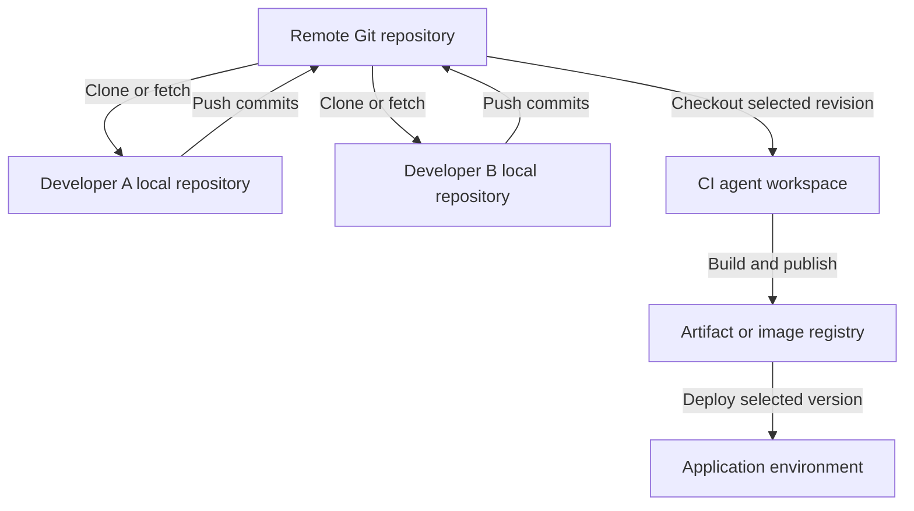
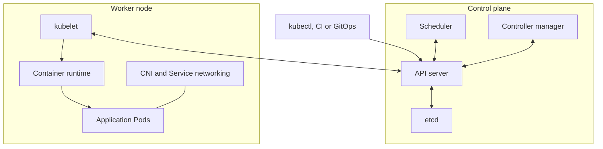

Use the organizational examples below as templates and adapt them to your actual project. The cloning, merge-conflict, and scheduling questions are testing how the complete development workflow fits together.

**1. What Git branching strategy is used in your organization?**

A practical example is **trunk-based development with short-lived feature branches**.

| Branch or reference | Purpose |
|---|---|
| `main` | Stable, integrated application code |
| `feature/*` | Individual features or improvements |
| `fix/*` | Bug fixes |
| `release/*` | Optional stabilization branches when maintaining separate release lines |
| Release tags | Identify specific released commits |

A typical workflow is:

1. Create a feature branch from the latest `main`.
2. Make small commits and run tests.
3. Push the branch and open a pull request.
4. Run build, test, security, and SonarQube checks.
5. Complete code review.
6. Merge the approved PR and delete the feature branch.

Protect `main` using required reviews and successful validation checks. Microsoft’s branching guidance similarly emphasizes feature branches, pull requests, and a healthy main branch. :chatgpt-content-reference{index="0"}

An interview answer could be:

> “We use short-lived feature branches from main. Developers raise pull requests, and automated checks plus code review are required before merging. We identify releases with tags and promote the resulting artifacts through our environments.”

If your organization uses GitFlow with `develop`, `release`, and `main`, describe that accurately. There is no single branching strategy used by every organization.

---

**2. How is deployment done to different environments using a Git repository?**

Git stores application code and deployment definitions. The pipeline uses a selected revision to build an artifact and deploy it.

A typical flow is:

| Event | Pipeline action |
|---|---|
| Feature-branch PR | Build, test, scan, and optionally create a preview environment |
| Merge to `main` | Build and publish a versioned application artifact |
| Development deployment | Deploy that artifact automatically |
| QA/UAT promotion | Deploy the same artifact with environment-specific configuration |
| Production approval | Deploy the approved artifact and perform health checks |

For containers, the artifact is an image stored in a registry such as ACR or ECR. Prefer promoting the **same image digest** through environments instead of rebuilding it separately for each environment.

Environment differences come from:

- Configuration files or Helm values.
- Environment variables.
- Environment-specific service connections.
- Secrets retrieved from Key Vault.
- Deployment approvals and checks.

In Azure Pipelines, a stage can have a branch condition:

```yaml
condition: and(
  succeeded(),
  eq(variables['Build.SourceBranch'], 'refs/heads/main')
)
```

This allows the stage to run only when previous work succeeded and the source branch is `main`. It does not automatically make the deployment a production deployment; the job must target the appropriate environment. :chatgpt-content-reference{index="1"}

Production approvals should be configured on protected environments or other protected resources. Azure Pipelines manages these checks separately from the pipeline YAML. :chatgpt-content-reference{index="2"}

---

**3. From where do you clone the repository? Do you use a local repository and transfer it to a remote repository?**

The interviewer is probably asking you to explain **where the code lives and how developers and pipelines obtain it**.

There are usually three separate copies:

1. **Remote repository:** Hosted in Azure Repos, GitHub, GitLab, or another Git service.
2. **Developer’s local repository:** A clone on a laptop or development machine.
3. **Pipeline workspace:** A checkout on the CI agent.



For an existing Azure Repos repository:

```bash
git clone https://dev.azure.com/ORG/PROJECT/_git/orders
cd orders

git switch -c feature/add-health-check

# Edit and test the application.

git add src/health.py
git commit -m "Add health endpoint"

git push -u origin feature/add-health-check
```

A normal clone creates a working directory and a local Git repository containing history. It also normally configures the source repository as the remote named `origin`. :chatgpt-content-reference{index="3"}

Important distinctions:

- `git commit` records changes **locally**.
- `git push` sends commits and updates references in the remote repository.
- `git fetch` downloads remote changes.
- You do not normally copy the whole project folder manually after each change.
- The CI agent checks out code from the remote repository; it does not depend on a developer’s laptop.

If you are starting a completely new project, you can use `git init` locally, create a remote repository, add it as `origin`, and push the initial commits.

---

**4. What is a PAT?**

**PAT stands for Personal Access Token.**

It is a credential used to authenticate to supported Git-hosting operations and APIs. In Azure DevOps, it can act as an alternative to a password for supported operations such as Git over HTTPS.

A PAT is associated with:

- A user identity.
- An organization or applicable scope.
- Selected permissions.
- An expiration date.

For example, a token intended only for cloning repositories should not receive unrelated administrative permissions. :chatgpt-content-reference{index="4"}

Good practices include:

- Use the minimum required permissions.
- Choose a short, practical expiration.
- Store it in a credential manager or secret store.
- Revoke it immediately if exposed.
- Avoid embedding it in clone URLs, scripts, or Git commits.

For Azure production automation, prefer supported service connections, workload identity federation, managed identities, or Microsoft Entra authentication when possible. A PAT is a long-lived bearer secret tied to a person, which creates additional lifecycle and security concerns. :chatgpt-content-reference{index="5"}

**A PAT is not the same thing as an Azure service principal or an SSH key.**

---

**5. How do you configure SonarQube?**

There are two parts: **setting up the SonarQube service** and **integrating analysis into the pipeline**.

**Server setup**

1. Select a supported SonarQube release and suitable edition.
2. Provision the required compute and storage.
3. Configure a supported external database, such as PostgreSQL.
4. Configure HTTPS, authentication, permissions, and backups.
5. Create or import the application project.
6. Configure its quality profile and quality gate.
7. Generate an appropriately scoped analysis token.

The embedded H2 database is intended for evaluation or testing rather than production use. :chatgpt-content-reference{index="6"}

These terms are different:

| Term | Meaning |
|---|---|
| Quality profile | The analysis rules enabled for a language |
| Quality gate | Conditions that determine whether the analyzed project passes |
| SonarScanner | The component that analyzes code and submits results |
| Analysis token | Credential used to authenticate analysis |

A quality gate might enforce a team policy on new security issues, coverage, and duplication. Treat any chosen thresholds as your team’s policy rather than assuming universal defaults. :chatgpt-content-reference{index="7"}

**Jenkins integration**

1. Install the SonarQube Scanner for Jenkins plugin.
2. Configure the SonarQube server URL in Jenkins.
3. Store the analysis token in Jenkins credentials.
4. Configure the build agent with the required build tools.
5. Run tests and generate coverage reports.
6. Run analysis.
7. Wait for the quality gate before allowing deployment.

Example for a Maven project, assuming a configured `linux-maven` agent and SonarQube installation named `sonarqube-prod`:

```groovy
pipeline {
    agent none

    stages {
        stage('Build, test and analyze') {
            agent { label 'linux-maven' }

            steps {
                withSonarQubeEnv('sonarqube-prod') {
                    sh '''
                        mvn -B clean verify sonar:sonar \
                          -Dsonar.projectKey=orders
                    '''
                }
            }
        }

        stage('Quality gate') {
            steps {
                timeout(time: 10, unit: 'MINUTES') {
                    script {
                        def gate = waitForQualityGate()

                        if (gate.status != 'OK') {
                            error "Quality gate failed: ${gate.status}"
                        }
                    }
                }
            }
        }
    }
}
```

Configure the SonarQube webhook to reach:

```text
https://jenkins.example.com/sonarqube-webhook/
```

The Jenkins integration requires this webhook for the quality-gate waiting workflow. Configure webhook-secret verification where appropriate. :chatgpt-content-reference{index="8"}

SonarQube normally **imports coverage generated by your test tooling**; it does not replace the test runner. For Java, this might be a JaCoCo report produced during the build. :chatgpt-content-reference{index="9"}

For Azure Pipelines, configure the SonarQube extension and service connection, then use the task sequence appropriate to the project’s language and build tool. Explicitly enforce the quality gate; publishing analysis results alone is not sufficient release control. :chatgpt-content-reference{index="10"}

---

**6. How do you integrate Azure Key Vault with Jenkins or Azure Pipelines?**

The basic process is:

1. Give the automation platform an Azure identity.
2. Authorize that identity to read the required secrets.
3. Ensure it can reach the vault.
4. Retrieve secrets during execution.
5. Pass them only to the steps that need them.

For an RBAC-enabled vault, **Key Vault Secrets User** permits reading secret values. **Key Vault Reader** reads metadata and does not grant access to secret contents. :chatgpt-content-reference{index="11"}

**Azure Pipelines**

Create an Azure Resource Manager service connection using workload identity federation where supported, and grant its identity the required vault access. :chatgpt-content-reference{index="12"}

Then fetch the secret:

```yaml
steps:
- task: AzureKeyVault@2
  displayName: Fetch deployment secret
  inputs:
    azureSubscription: sc-prod-workload-identity
    KeyVaultName: kv-orders-prod
    SecretsFilter: db-password
    RunAsPreJob: false

- bash: |
    set +x
    ./ci/deploy.sh
  displayName: Deploy application
  env:
    DB_PASSWORD: $(db-password)
```

Here:

- `azureSubscription` is the **service connection name**.
- `SecretsFilter` selects the required secret.
- With `RunAsPreJob: false`, the secret is available to subsequent tasks in the job.
- The deployment script reads `DB_PASSWORD` from its environment.

The `AzureKeyVault@2` task creates pipeline variables from the retrieved secrets. :chatgpt-content-reference{index="13"}

**Jenkins**

Install the Azure Key Vault plugin and configure a supported Azure credential, such as a managed identity or service principal.

Example stage in a Declarative Pipeline:

```groovy
stage('Deploy') {
    options {
        azureKeyVault(
            credentialID: 'azure-keyvault-reader',
            keyVaultURL: 'https://kv-orders-prod.vault.azure.net',
            secrets: [[
                secretType: 'Secret',
                name: 'db-password',
                envVariable: 'DB_PASSWORD'
            ]]
        )
    }

    steps {
        sh '''
            set +x
            ./ci/deploy.sh
        '''
    }
}
```

The credential ID refers to an Azure identity configured in Jenkins. The plugin binds the retrieved value to the environment variable. :chatgpt-content-reference{index="14"}

For private vaults, ensure that the component retrieving the secret has the required network route and DNS resolution. A service connection supplies identity; it does not bypass network restrictions.

Restrict production secrets to trusted pipelines. Secret masking helps reduce accidental logging, but it does not prevent an authorized script from reading or transmitting a secret.

---

**7. How do you resolve Git merge conflicts when two people change the same file?**

**Two people changing the same file does not necessarily cause a conflict.** Git can often merge changes to different lines automatically.

A conflict occurs when Git cannot safely reconcile changes—for example, incompatible edits to the same section or one person deleting a file that another modifies.

Also, these situations differ:

| Situation | Meaning |
|---|---|
| Two developers commit locally | Usually no conflict; their repositories are independent |
| Push rejected as non-fast-forward | The remote branch has commits missing locally |
| Merge or rebase stops with conflicts | Git needs help combining changes |

**Example: your feature branch conflicts with `main`**

Start with a clean working tree:

```bash
git switch feature/login
git fetch origin
git merge origin/main
```

Inspect the conflicts:

```bash
git status
git diff --name-only --diff-filter=U
```

A text conflict may look like:

```text
<<<<<<< HEAD
timeout = 30
=======
timeout = 60
>>>>>>> origin/main
```

Review both changes, decide the correct behavior, edit the file, and remove the conflict markers.

Then run relevant tests and finish the merge:

```bash
git add path/to/file
git merge --continue
git push origin feature/login
```

To abandon the merge:

```bash
git merge --abort
```

These commands follow Git’s merge-resolution workflow. :chatgpt-content-reference{index="15"}

If the push was rejected because another developer updated **the same feature branch**, integrate that remote feature branch instead of assuming `origin/main` is the missing history.

**How many ways can conflicts be resolved?**

There is no fixed number. Common interfaces include:

- Manually editing the conflicted files.
- An IDE merge editor, such as VS Code.
- A configured `git mergetool`.
- The repository provider’s web conflict editor for supported conflicts.

You can also integrate using **rebase** rather than merge:

```bash
git fetch origin
git rebase origin/main

# Resolve conflicts, then:
git add path/to/file
git rebase --continue
```

Or abort:

```bash
git rebase --abort
```

Rebasing rewrites commits. If your own already-published branch must be updated afterward, use an agreed workflow and `--force-with-lease` when appropriate; do not casually rewrite shared or protected branch history. :chatgpt-content-reference{index="16"}

---

**8. What is SonarQube’s output? How do you fix code smells or vulnerabilities?**

SonarQube produces analysis results in its project dashboard and can report status to pull requests and pipelines.

Typical results include:

| Result | What it tells you |
|---|---|
| Reliability findings | Code that may behave incorrectly |
| Security findings | Potentially unsafe implementation |
| Maintainability findings or code smells | Code that is difficult to understand or maintain |
| Coverage | Coverage imported from test tooling |
| Duplication | Repeated code |
| Quality-gate status | Whether configured acceptance conditions passed |

Terminology varies between SonarQube modes and versions. Where **Security Hotspots** are reported, they identify security-sensitive code that requires review; they are not automatically confirmed vulnerabilities. :chatgpt-content-reference{index="17"}

The remediation process is:

1. Open the finding and read the rule explanation.
2. Inspect the affected code and any reported data flow.
3. Determine whether it is a genuine issue.
4. Fix the code on a branch.
5. Add or update relevant tests.
6. Rerun tests and analysis.
7. Confirm that the finding and quality gate are resolved.

Examples:

- **Duplicated logic:** Extract a suitable shared function.
- **Excessive complexity:** Break a large function into smaller responsibilities.
- **Resource leak:** Ensure files or database resources are closed.
- **SQL injection risk:** Replace string-built queries with parameterized queries.
- **Exposed credential:** Revoke or rotate it and remove it from the code.

For example, with a PostgreSQL driver supporting `%s` parameters:

```python
# Unsafe construction
cursor.execute(
    f"SELECT * FROM users WHERE email = '{email}'"
)

# Parameterized query
cursor.execute(
    "SELECT * FROM users WHERE email = %s",
    (email,)
)
```

A false-positive or accepted-risk decision should include a documented technical reason and appropriate review.

**Successful scanner execution does not necessarily mean a passing quality gate.** The pipeline must obtain and act on the gate result after analysis processing. :chatgpt-content-reference{index="18"}

---

**9. Where do you write the pipeline code or YAML file?**

Normally, you write it in a text editor or IDE and commit it to Git alongside the application.

| Platform or purpose | Typical file |
|---|---|
| Jenkins Pipeline | `Jenkinsfile` |
| Azure Pipelines | `azure-pipelines.yml` |
| Shared Azure pipeline templates | `.ci/templates/build.yml`, `.ci/templates/deploy.yml` |
| Reusable shell commands | `ci/test.sh`, `ci/deploy.sh` |

**Jenkinsfiles use a Groovy-based DSL, not YAML.**

In Jenkins, configure either:

- **Pipeline from SCM**, pointing to the repository and Jenkinsfile path.
- A **Multibranch Pipeline**, which discovers branches containing a Jenkinsfile.

Jenkins supports defining pipeline code in its UI, but storing the Jenkinsfile in source control enables review, versioning, and traceability. :chatgpt-content-reference{index="19"}

In Azure DevOps, select the repository and YAML path when creating the pipeline. Editing through the Azure pipeline editor also results in a repository change that should follow your review process.

For Azure Repos, configure PR build validation through **target-branch policies**. A YAML `pr` trigger does not configure Azure Repos PR validation. :chatgpt-content-reference{index="20"}

---

**10. What is inside a Dockerfile?**

A Dockerfile contains instructions for building a container image.

| Instruction | Purpose |
|---|---|
| `FROM` | Select a base image |
| `WORKDIR` | Set the working directory |
| `COPY` | Copy files into the image |
| `RUN` | Execute commands during image building |
| `ENV` | Define environment variables |
| `ARG` | Define build-time arguments |
| `USER` | Select the runtime user |
| `EXPOSE` | Document the intended listening port |
| `ENTRYPOINT` | Define the executable |
| `CMD` | Supply the default command or arguments |

Example for a Python FastAPI application, assuming `requirements.txt` includes the required packages and `app/main.py` exposes an application named `app`:

```dockerfile
FROM python:3.13-slim

ENV PYTHONDONTWRITEBYTECODE=1 \
    PYTHONUNBUFFERED=1

WORKDIR /app

COPY requirements.txt .
RUN pip install --no-cache-dir -r requirements.txt

COPY --chown=10001:10001 app/ ./app/

USER 10001:10001

EXPOSE 8000

CMD ["uvicorn", "app.main:app", \
     "--host", "0.0.0.0", "--port", "8000"]
```

Build and run locally:

```bash
docker build -t orders-api:dev .

docker run --rm \
  -p 127.0.0.1:8000:8000 \
  orders-api:dev
```

`RUN` executes during the build; `CMD` specifies the default command when the container starts.

`EXPOSE` does not publish a host port. The `-p` option performs the host-to-container port mapping. :chatgpt-content-reference{index="21"}

Practical improvements include pinned dependencies, reviewed base-image updates, non-root execution, and a `.dockerignore` excluding unnecessary files such as `.git`, local virtual environments, and secret files. Use multi-stage builds when build tools or compilation outputs should be separated from the runtime image. :chatgpt-content-reference{index="22"}

---

**11. How do you schedule a validated pipeline for the `stage` or `main` branch?**

First separate three concepts:

- **Branch:** The Git revision to execute.
- **Schedule:** When to start a pipeline run.
- **Deployment environment:** Where an artifact is deployed.

The interviewer may mean either “run this branch nightly” or “deploy an approved build during a release window.”

**Scheduling Azure Pipelines**

Suppose the requirement is to run the pipeline for both `stage` and `main` every day at **10:00 PM IST**.

That is **16:30 UTC**. Add this scheduling configuration to the pipeline’s main YAML file:

```yaml
# Disable ordinary push-triggered runs for this example.
trigger: none

schedules:
- cron: '30 16 * * *'
  displayName: Daily at 10 PM IST
  branches:
    include:
    - stage
    - main
  always: true
```

Keep your existing stages or jobs below this configuration.

This schedules separate runs for matching branches. `always: true` allows scheduled execution even when there have been no relevant changes since the previous successful scheduled run.

Azure YAML cron schedules use **UTC**. :chatgpt-content-reference{index="23"}

The process after changing a pipeline is:

1. Make the YAML change on a feature branch.
2. Validate it using an appropriate test run.
3. Raise a PR.
4. Merge the approved change into the branches that should use it.
5. Verify the scheduled runs and branch filters.

The schedule must exist in the YAML file **in the branch being scheduled**. Adding `stage` to the schedule in `main` does not automatically update the YAML in `stage`.

Also, UI-defined schedules take precedence over YAML schedules; inspect both when troubleshooting. :chatgpt-content-reference{index="24"}

**Selecting the deployment environment**

You can apply branch conditions to deployment stages:

```yaml
# On the staging deployment stage:
condition: and(
  succeeded(),
  eq(variables['Build.SourceBranch'], 'refs/heads/stage')
)
```

```yaml
# On the production deployment stage:
condition: and(
  succeeded(),
  eq(variables['Build.SourceBranch'], 'refs/heads/main')
)
```

The deployment jobs must then reference the appropriate Azure Pipelines environments. :chatgpt-content-reference{index="25"}

**Deploying an already validated artifact at a particular time**

If the requirement is “deploy this exact tested build tonight,” preserve and select that artifact version. A later scheduled branch build may use newer commits.

For controlled deployment windows, Azure environment checks can combine approvals with a **Business Hours** check. An exclusive lock can help control concurrent deployments to the same environment. :chatgpt-content-reference{index="26"}

**Jenkins equivalent**

For a Jenkins controller configured to UTC:

```groovy
triggers {
    cron('30 16 * * *')
}
```

This schedules a daily run at 16:30 UTC. Configure the intended branch through the Pipeline-from-SCM job or the relevant multibranch job settings.

Jenkins `cron` starts scheduled runs; `pollSCM` periodically checks for source changes. They serve different purposes. :chatgpt-content-reference{index="27"}


Below are detailed, interview-ready answers to all 10 questions. The project designs and incident stories are **examples to adapt to your actual experience**.

**1. Explain your CI/CD pipeline design. Which tools did you use and why?**

A strong answer explains the flow, the purpose of each tool, and how the pipeline prevents a failed change from reaching production.

**Sample answer:**

> “I design pipelines around repeatable builds, automated validation, and controlled promotion. Every release is traceable to a Git commit, an immutable container image, and its deployment configuration. The same tested image moves through dev, stage, and production.”

An example toolset is:

| Responsibility | Tool | Why use it? |
|---|---|---|
| Source control | GitHub, GitLab, or Azure Repos | Pull requests, reviews, branch protection, and change history |
| Pipeline orchestration | Jenkins | Pipeline as code, integration with existing tools, and reusable shared libraries |
| Build and testing | Maven, Gradle, npm, or pytest | Application-specific build and automated tests |
| Code analysis | SonarQube | Quality gates and supported static security analysis |
| Security checks | Trivy and a secret scanner | Dependency, image, infrastructure, and credential checks |
| Packaging and storage | Docker with ECR or ACR | Versioned container artifacts |
| Deployment | Helm and Kubernetes | Repeatable application configuration and rollout |
| Infrastructure | Terraform | Reviewed, versioned infrastructure changes |
| Observability | Prometheus, Grafana, and centralized logs | Deployment verification and production troubleshooting |

**The pipeline flow:**

1. **Trigger:** A webhook starts validation for a pull request or trusted branch update.
2. **Checkout:** Jenkins checks out the exact commit associated with the build.
3. **Build and test:** Compile or package the application, run unit tests, and generate coverage reports.
4. **Quality and security gates:** Analyze code, dependencies, secrets, and infrastructure configuration.
5. **Package:** Build the container image and scan the resulting image.
6. **Publish:** Push the approved artifact and record its immutable digest.
7. **Deploy to dev:** Run smoke and integration tests.
8. **Promote to stage:** Run broader regression, performance, and security checks.
9. **Promote to production:** Apply the required approval and deployment strategy.
10. **Verify:** Check application health, customer-facing metrics, and rollback criteria.

The `Jenkinsfile` belongs in source control so pipeline changes receive reviews and retain an audit history. Jenkins coordinates the build tools; it does not replace them. :chatgpt-content-reference{index="0"}

**Points that demonstrate experience:**

- Build once and promote the same image digest.
- Keep environment configuration separate from the application image.
- Run untrusted pull-request builds without production credentials.
- Record the Git commit, image digest, chart version, test results, and deployment outcome.
- Define recovery before deploying.
- Treat database migrations separately: reverting an image does not reverse a destructive database change.

---

**2. How would you implement Jenkins deployments across dev, stage, and prod?**

I would separate **artifact creation** from **artifact promotion**.

The build pipeline creates a release. The deployment pipeline selects that release and moves it through environments.

| Environment | Typical deployment policy | Validation |
|---|---|---|
| Dev | Automatic after successful CI | Smoke tests and integration tests |
| Stage | Promote a selected release candidate | Regression, performance, and acceptance tests |
| Prod | Promote the approved stage artifact | Controlled rollout and production health checks |

Each environment should have its own configuration and deployment identity. Production commonly uses a separate account, subscription, or cluster, depending on the isolation requirements.

**Example Jenkins promotion pipeline**

This example assumes three existing deployment jobs. Each job validates the supplied digest against an approved release record, deploys it, and runs environment-specific tests.

```groovy
pipeline {
    agent none

    options {
        timestamps()
        disableConcurrentBuilds()
    }

    parameters {
        string(
            name: 'IMAGE_DIGEST',
            defaultValue: '',
            description: 'Approved image digest: sha256:...'
        )
    }

    stages {
        stage('Deploy Dev') {
            steps {
                build job: 'orders-deploy-dev',
                    parameters: [
                        string(name: 'IMAGE_DIGEST',
                               value: params.IMAGE_DIGEST)
                    ],
                    wait: true,
                    propagate: true
            }
        }

        stage('Deploy Stage') {
            steps {
                build job: 'orders-deploy-stage',
                    parameters: [
                        string(name: 'IMAGE_DIGEST',
                               value: params.IMAGE_DIGEST)
                    ],
                    wait: true,
                    propagate: true
            }
        }

        stage('Approve Production') {
            options {
                timeout(time: 30, unit: 'MINUTES')
            }
            steps {
                input(
                    message: "Promote ${params.IMAGE_DIGEST} to production?",
                    submitter: 'release-managers'
                )
            }
        }

        stage('Deploy Production') {
            steps {
                build job: 'orders-deploy-prod',
                    parameters: [
                        string(name: 'IMAGE_DIGEST',
                               value: params.IMAGE_DIGEST)
                    ],
                    wait: true,
                    propagate: true
            }
        }
    }
}
```

`wait: true` waits for the downstream job. `propagate: true` propagates its result, preventing a failed deployment from being treated as successful. :chatgpt-content-reference{index="1"}

With `agent none`, the approval step does not reserve a build executor. The `submitter` setting restricts who can approve. `disableConcurrentBuilds()` serializes this particular pipeline; separate jobs targeting the same environment still need coordinated deployment locking. :chatgpt-content-reference{index="2"}

Inside a deployment job, a Helm command could look like:

```bash
helm upgrade --install orders ./charts/orders \
  --kube-context "$KUBE_CONTEXT" \
  --namespace "$ENVIRONMENT" \
  --values "./charts/orders/values-${ENVIRONMENT}.yaml" \
  --set-string image.digest="$IMAGE_DIGEST" \
  --wait \
  --timeout 5m
```

Here, the chart must render the image as `repository@digest`. The chart and configuration revisions should also be pinned in the release record. Helm supports supplying values and waiting for resource readiness during an upgrade. :chatgpt-content-reference{index="3"}

**Production controls:**

- Restrict production job execution and configuration changes.
- Give each job only the permissions required for its environment.
- Keep credentials unavailable to untrusted pipeline code.
- Verify the deployed digest after rollout.
- Run application smoke tests; resource readiness alone is insufficient.
- Keep the previous known-good release available.

An approval button supports release governance. Cloud IAM, Kubernetes RBAC, and Jenkins authorization enforce the access boundary.

---

**3. How do you debug Jenkins pipeline failures? Give practical examples.**

Start by locating the **first meaningful failure**, then determine whether it belongs to the pipeline, build agent, application, or deployment platform.

**My investigation sequence:**

1. Identify the failed stage and command exit status.
2. Compare with the last successful run: commit, dependencies, agent image, credentials, and configuration.
3. Inspect the relevant console output and test reports.
4. Check agent availability, disk space, memory, network access, and tool versions.
5. If deployment failed, inspect the target platform.
6. Restore service where necessary, then implement and verify the permanent fix.

| Failure | Evidence to inspect | Typical resolution |
|---|---|---|
| Build remains queued | Agent label, online status, executor availability, agent provisioning logs | Correct the label or restore/provision agents |
| Checkout fails | Repository URL, credential scope, token validity, DNS and connectivity | Correct access or network configuration |
| Tests fail | Test report, application changes, test dependencies | Fix the application or test environment |
| Image push fails | Registry authentication, repository permissions, network access | Refresh authentication or correct permissions |
| Deployment times out | Pod events, image pulls, scheduling, probes | Fix the specific Kubernetes failure |
| Terraform cannot acquire a lock | Lock owner, active pipeline, backend connectivity | Wait for the owner or investigate an abandoned lock |

Jenkins agents execute build work, so an agent failure must be distinguished from an application build failure. :chatgpt-content-reference{index="4"}

For Kubernetes deployment failures, useful commands include:

```bash
# Set POD to the affected pod name.
kubectl -n prod describe pod "$POD"

kubectl -n prod logs "$POD" \
  -c orders --previous

kubectl -n prod get events \
  --sort-by=.metadata.creationTimestamp

kubectl -n prod rollout status \
  deployment/orders --timeout=5m
```

`--previous` retrieves logs from the previous container instance when available. This is useful when the current container has restarted and has produced little output. :chatgpt-content-reference{index="5"}

**Example incident: deployment repeatedly restarts during startup**

- **Symptom:** Jenkins reports a rollout timeout.
- **Evidence:** Pod events show liveness failures while the application is still initializing.
- **Recovery:** Restore the previous release if customer availability is affected.
- **Fix:** Introduce an appropriately sized startup probe and investigate unexpectedly slow initialization.
- **Prevention:** Include startup behavior in deployment testing and track startup duration.

A startup probe delays liveness and readiness probing until startup succeeds. Increasing the liveness timeout alone can hide an unhealthy application. :chatgpt-content-reference{index="6"}

**Example incident: Jenkins shows success, but nothing was deployed**

Check whether:

- A `when` condition skipped the stage.
- The pipeline targeted the wrong branch or environment.
- A script used `|| true`.
- `returnStatus: true` returned an error code that nobody checked.
- Error handling converted a deployment failure into a successful result.

The prevention is to validate the actual deployed version and application health before declaring success.

---

**4. What Dockerfile best practices would you follow for production?**

A production image should be reproducible, small enough to maintain, run with limited privileges, and shut down correctly.

**Example: Python API**

This assumes `requirements.txt` contains pinned dependencies and their hashes, including the application server.

```dockerfile
FROM python:3.13-slim AS builder

WORKDIR /build

RUN python -m venv /opt/venv

ENV PATH="/opt/venv/bin:$PATH"

COPY requirements.txt .

RUN pip install \
    --no-cache-dir \
    --require-hashes \
    -r requirements.txt


FROM python:3.13-slim AS runtime

ENV PATH="/opt/venv/bin:$PATH" \
    PYTHONDONTWRITEBYTECODE=1 \
    PYTHONUNBUFFERED=1

WORKDIR /app

RUN groupadd --gid 10001 app \
    && useradd --uid 10001 --gid 10001 \
       --no-create-home app

COPY --from=builder /opt/venv /opt/venv
COPY --chown=10001:10001 app/ ./app/

USER 10001:10001

EXPOSE 8000

CMD ["uvicorn", "app.main:app", \
     "--host", "0.0.0.0", "--port", "8000"]
```

For production, replace the illustrative base tags with approved image digests and update them through a tested patching process.

**Why these choices matter:**

- **Multiple stages:** Keep build-only content out of the runtime image.
- **Dependency files copied first:** Application changes can reuse the dependency installation layer.
- **Non-root execution:** Reduces privileges available to a compromised application.
- **Minimal runtime content:** Reduces unnecessary packages and maintenance.
- **Pinned base images:** Make the selected base explicit and reproducible.
- **Regular rebuilds:** Incorporate security fixes rather than leaving pinned images unchanged indefinitely. :chatgpt-content-reference{index="7"}

`--require-hashes` requires hashes for the complete dependency set and verifies downloaded packages against them. Native dependencies may also require explicitly installed runtime system libraries. :chatgpt-content-reference{index="8"}

The JSON form of `CMD` runs the application directly, avoiding an unnecessary shell between the container runtime and application. `EXPOSE` documents a port; it does not publish that port. :chatgpt-content-reference{index="9"}

Also use a `.dockerignore`, for example:

```text
.git
.env
.venv
__pycache__
.pytest_cache
coverage*
```

**Secrets:** Never put credentials in image layers or use `ARG`/`ENV` to pass build secrets. Use BuildKit secret mounts when a build needs private dependency credentials. The build command must also avoid copying those secrets into its output. :chatgpt-content-reference{index="10"}

---

**5. Explain Kubernetes rolling updates using YAML.**

A rolling update gradually replaces old application pods with new ones while maintaining the configured availability budget.

The following example assumes:

- The `prod` namespace exists.
- The application implements `/livez` and `/readyz`.
- Registry access is configured.
- The illustrative image reference is replaced with your approved image digest.

```yaml
apiVersion: apps/v1
kind: Deployment
metadata:
  name: orders
  namespace: prod
spec:
  replicas: 3
  revisionHistoryLimit: 5
  minReadySeconds: 5
  progressDeadlineSeconds: 600

  strategy:
    type: RollingUpdate
    rollingUpdate:
      maxSurge: 1
      maxUnavailable: 0

  selector:
    matchLabels:
      app: orders

  template:
    metadata:
      labels:
        app: orders
    spec:
      terminationGracePeriodSeconds: 30

      containers:
        - name: orders
          image: registry.example.com/orders:1.4.2

          ports:
            - name: http
              containerPort: 8000

          resources:
            requests:
              cpu: "250m"
              memory: "256Mi"
            limits:
              cpu: "1"
              memory: "512Mi"

          startupProbe:
            httpGet:
              path: /livez
              port: http
            periodSeconds: 5
            failureThreshold: 30

          readinessProbe:
            httpGet:
              path: /readyz
              port: http
            periodSeconds: 5
            timeoutSeconds: 2

          livenessProbe:
            httpGet:
              path: /livez
              port: http
            periodSeconds: 10
            timeoutSeconds: 2
---
apiVersion: v1
kind: Service
metadata:
  name: orders
  namespace: prod
spec:
  selector:
    app: orders
  ports:
    - port: 80
      targetPort: http
```

**The key settings:**

- `maxSurge: 1`: Allows one additional pod above the desired replica count during rollout.
- `maxUnavailable: 0`: Prevents the rollout from deliberately reducing available replicas below the desired count.
- `minReadySeconds: 5`: A new pod must remain ready for five seconds before being considered available.
- `progressDeadlineSeconds`: Reports a stalled rollout; it does **not** automatically roll back the Deployment. Terminating pods can temporarily consume additional capacity beyond the surge allowance. :chatgpt-content-reference{index="11"}

The readiness probe controls eligibility for normal Service traffic. Liveness detects when a container needs restarting. Startup probing gives initialization its own allowance. Avoid making liveness depend on a shared external database, because a database outage could then restart every application pod. :chatgpt-content-reference{index="12"}

**Deploy and observe:**

```bash
kubectl apply -f orders.yaml

kubectl -n prod rollout status \
  deployment/orders --timeout=10m

kubectl -n prod rollout history deployment/orders
```

After deciding that rollback is appropriate:

```bash
kubectl -n prod rollout undo deployment/orders
```

For a Helm- or GitOps-managed application, perform recovery through that deployment mechanism and keep the declared configuration consistent.

**Does this guarantee zero downtime?**

No. You also need sufficient capacity, meaningful readiness checks, graceful shutdown, load-balancer draining, and compatible application/database changes. During termination, the application should handle its termination signal and finish in-flight work within its grace period. :chatgpt-content-reference{index="13"}

A PodDisruptionBudget helps with supported voluntary evictions such as node draining. It does not control the Deployment controller’s own rolling-update behavior. :chatgpt-content-reference{index="14"}

---

**6. Why do we need a Terraform remote backend and state locking? How do you configure them?**

Terraform state records the relationship between configuration resource addresses and real infrastructure resources.

For example, it records which EC2 instance is managed by `aws_instance.web`.

A remote backend provides a shared location for that state. Locking prevents concurrent operations from writing conflicting updates to the same state.

**Example S3 backend:**

```hcl
terraform {
  backend "s3" {
    bucket       = "example-company-terraform-state"
    key          = "orders/prod/terraform.tfstate"
    region       = "ap-south-1"
    encrypt      = true
    use_lockfile = true
  }
}
```

The bucket must already exist. Enable versioning for recovery and restrict access to the relevant state and lock objects.

Current Terraform supports native S3 locking with `use_lockfile = true`. DynamoDB-based locking is deprecated. Native locking also requires the appropriate permissions on the `.tflock` object. :chatgpt-content-reference{index="15"}

**Typical pipeline execution:**

```bash
terraform init

terraform fmt -check
terraform validate

terraform plan \
  -lock-timeout=5m \
  -out=tfplan

# After review/approval:
terraform apply \
  -lock-timeout=5m \
  tfplan
```

**How I organize it:**

- Separate state for dev, stage, and production.
- Separate access permissions for sensitive environments.
- Short-lived cloud credentials for pipeline authentication.
- Versioned state backups and a documented recovery process.
- Reviewed plans before production applies.
- Scheduled plans to detect drift.

A state lock applies to an operation, not the entire time between planning and approval. If state changes before a saved plan is applied, a new plan may be required.

**What if the state remains locked?**

First determine whether the owning operation is still running. If it is, wait or coordinate with its owner.

Only after confirming that the lock is abandoned, and that the correct backend is selected, consider:

```bash
terraform force-unlock LOCK_ID
```

Forcing an active lock open can allow concurrent writers. Disabling locking is not a routine workaround. :chatgpt-content-reference{index="16"}

Also distinguish:

- **State locking:** Protects concurrent state operations.
- **`.terraform.lock.hcl`:** Records provider selections and checksums.

Treat state and saved plans as sensitive artifacts. Marking a variable `sensitive` hides it in ordinary output but does not necessarily remove its value from state or plans. :chatgpt-content-reference{index="17"}

---

**7. How would you manage secrets using AWS Secrets Manager or Azure Key Vault?**

The design has three parts:

1. Store secrets in a managed secret store.
2. Give workloads an identity with narrowly scoped access.
3. Make rotation and application refresh work together.

| Concern | AWS example | Azure example |
|---|---|---|
| Secret storage | Secrets Manager | Key Vault |
| Workload authentication | IAM roles; EKS Pod Identity or IRSA | Managed identity; AKS Workload Identity |
| Read permission | Access to specified secret ARNs | Appropriate Key Vault data-plane RBAC |
| Audit | CloudTrail | Key Vault audit logs through Azure Monitor |
| Private connectivity | Interface VPC endpoint | Private endpoint and private DNS |

**Example: an EKS application needs a database password**

- Store the credential in Secrets Manager.
- Associate the application’s Kubernetes service account with an appropriate IAM role.
- Grant access to the required secret, plus applicable KMS permissions.
- Retrieve the secret through a supported SDK or an approved secrets integration.
- Cache it with a refresh strategy.
- Audit retrieval and rotation.

EKS Pod Identity provides temporary AWS credentials to applications using supported SDK credential providers. The application does not need embedded AWS access keys. :chatgpt-content-reference{index="18"}

**Equivalent AKS approach**

Use Microsoft Entra Workload ID to federate the Kubernetes service account with an Azure identity, then grant that identity the required Key Vault access. A supported Azure Identity SDK can obtain credentials for the application. :chatgpt-content-reference{index="19"}

For reading secret values, a role such as **Key Vault Secrets User** is relevant. **Key Vault Reader** does not grant access to secret contents. :chatgpt-content-reference{index="20"}

**Rotation is an end-to-end operation**

Changing a stored password value alone is insufficient. Rotation must coordinate:

- The actual database or external service credential.
- The secret store.
- Application refresh and connection behavior.

Secrets Manager supports configured rotation workflows and recommends controlled access, caching, and auditing. :chatgpt-content-reference{index="21"}

For arbitrary passwords in Key Vault, implement the required rotation automation. Microsoft’s example uses Event Grid and an Azure Function to update both the vault secret and the database credential. :chatgpt-content-reference{index="22"}

**For Jenkins:**

- Retrieve credentials only in the stage that requires them.
- Prefer temporary workload credentials.
- Avoid printing secrets or passing them as ordinary job parameters.
- Keep deployment credentials separate from application credentials.
- Remember that log masking cannot protect a secret from malicious pipeline code.

---

**8. Explain Gitflow and how you would use it in a real project.**

Gitflow organizes development around integration, release preparation, and production maintenance.

| Branch | Purpose | Typical destination |
|---|---|---|
| `main` | Production release history | Tagged releases |
| `develop` | Integration of upcoming changes | Release branch |
| `feature/*` | Individual features | Merge into `develop` |
| `release/*` | Stabilize a release candidate | Merge into `main` and `develop` |
| `hotfix/*` | Urgent production correction | Merge into `main` and back into ongoing development |

**Example:**

A developer creates `feature/payment-retry` from `develop`. After review and validation, it merges into `develop`.

When the release scope is ready, the team creates `release/2.4.0`. QA validates that branch while new feature development continues separately. Release fixes are incorporated into both the production history and future development.

For an urgent production defect, create a hotfix from the deployed production revision, validate it, release it, and incorporate the fix into the relevant development/release branches.

Gitflow suits explicitly versioned releases. Its original author recommends simpler workflows for many continuous-delivery teams. :chatgpt-content-reference{index="23"}

**How this connects to deployment:**

- `develop` may automatically deploy to dev.
- Release candidates may deploy to stage.
- Production deployment promotes the approved artifact with the required authorization.
- Record exactly which source revision produced that artifact.

Protect branches with reviews and validation checks. A branch name by itself should not grant production access.

---

**9. How would you set up logging and monitoring?**

Start with what customers need from the service: successful transactions, acceptable response times, and availability.

Then collect the signals needed to detect and explain failures.

| Signal | Purpose | Example tools |
|---|---|---|
| Metrics | Trends, rates, latency, and capacity | Prometheus |
| Logs | Detailed application and infrastructure events | Collector with Loki, Elasticsearch, or cloud logging |
| Traces | Request paths across services | OpenTelemetry with Tempo or Jaeger |
| Dashboards | Operational and business views | Grafana |
| Alert routing | Grouping, deduplication, escalation | Alertmanager |

Prometheus collects and stores time-series metrics. Grafana queries configured data sources for visualization. The OpenTelemetry Collector receives, processes, and exports telemetry; it needs an appropriate storage backend for long-term analysis. :chatgpt-content-reference{index="24"}

**Implementation approach:**

1. **Instrument the application.** Expose request counts, error counts, and latency histograms. Add distributed tracing.
2. **Collect platform signals.** Monitor nodes, containers, workload availability, storage, databases, and queues.
3. **Centralize structured logs.** Include timestamp, severity, service, environment, release version, and trace ID.
4. **Build useful dashboards.** Separate customer health, service dependencies, infrastructure capacity, and deployment views.
5. **Configure actionable alerts.** Give each alert an owner, severity, runbook, and escalation route.
6. **Test the monitoring system.** Verify that failures produce the expected notifications.

For application metrics, I would prioritize:

- Request rate.
- Error rate.
- Latency distribution.
- Queue backlog and processing delay.
- Dependency failures.
- Business success rates.

Keep metric labels bounded. Customer IDs or arbitrary request URLs can create excessive time-series cardinality. :chatgpt-content-reference{index="25"}

**How do you avoid alert fatigue?**

Use customer-impact and SLO-based alerts where possible. Group related alerts, inhibit predictable secondary alerts, and use maintenance silences deliberately. Alertmanager supports grouping, deduplication, routing, silencing, and inhibition. :chatgpt-content-reference{index="26"}

For example, high CPU under healthy traffic may require capacity investigation. A sudden fall in successful payments should trigger urgent investigation even when CPU is normal.

Finally, set retention, sampling, access controls, and redaction policies. Observability should not become an uncontrolled repository of credentials or customer data.

---

**10. Explain a practical DevSecOps implementation.**

A strong answer explains **where checks run, what happens when they fail, who can approve exceptions, and how production remains protected**.

**Example design:**

> “For an application running on Kubernetes, I would integrate security checks into pull requests, builds, deployment admission, and runtime monitoring. Each release would carry test results, scan results, an image digest, and provenance.”

| Stage | Control | Expected behavior |
|---|---|---|
| Pull request | Secret scanning and static analysis | Block exposed credentials and policy violations |
| Dependency resolution | Vulnerability and license checks | Report or block according to policy |
| Infrastructure validation | Terraform and Kubernetes configuration checks | Reject prohibited public access or excessive privileges |
| Image build | Scan the actual image and generate an SBOM | Associate findings with its digest |
| Release | Sign the image and retain evidence | Establish approved artifact provenance |
| Admission | Verify image source/signature and workload policy | Reject noncompliant deployments |
| Runtime | Detect suspicious behavior and audit access | Alert and initiate incident response |

**Example image scan:**

```bash
trivy image \
  --scanners vuln \
  --severity HIGH,CRITICAL \
  --exit-code 1 \
  "$IMAGE_REF"
```

`IMAGE_REF` should identify the exact image being promoted, preferably by digest. The severity filter selects findings, while `--exit-code 1` makes matching findings fail the command. :chatgpt-content-reference{index="27"}

A production policy should also define exploitability considerations, remediation deadlines, and narrowly scoped exceptions with an owner and expiry date. Do not silently suppress findings to make the pipeline green.

**Artifact integrity**

Sign approved images with a tool such as Cosign and verify them against the expected trust policy. For keyless signatures, verification must check the expected signer identity and OIDC issuer. A signature from an arbitrary identity is insufficient. :chatgpt-content-reference{index="28"}

Admission policies, such as Kyverno image verification policies, can enforce image trust requirements before workloads are admitted. :chatgpt-content-reference{index="29"}

**Runtime protection**

Falco can detect suspicious activity such as an unexpected shell or access to sensitive files on supported Kubernetes nodes. Route detections to the security incident process and tune rules against expected workload behavior. Detection does not automatically mean the activity was blocked. :chatgpt-content-reference{index="30"}

**Example incident story to adapt**

“A release candidate contained a vulnerable dependency. The image scan blocked promotion. We identified the introducing package, updated it, rebuilt the image, reran tests and scans, and approved the new digest. We retained the failed and successful scan evidence and added dependency-update automation.”

If a credential is discovered in Git, the response starts with revoking or rotating it and investigating its use. Removing it from the latest commit does not invalidate an exposed credential.


Below are detailed answers to all **23 HCL DevOps questions**. Treat the project designs and incident stories as examples, and adapt them to your actual experience.

**1. Explain your CI/CD pipeline design. Which tools did you use and why?**

A good answer explains the workflow, the reason for each tool, and how you prevent an unsuccessful change from reaching production.

**Example answer:**

> “My pipeline validates every change, produces a versioned artifact, and promotes the same artifact through dev, stage, and production. Every deployment is traceable to its Git commit, image digest, configuration, and approval.”

| Responsibility | Example tool | Reason |
|---|---|---|
| Source control | GitHub, GitLab, Azure Repos | Reviews, branch protection, change history |
| Pipeline orchestration | Jenkins | Pipeline as code, integrations, shared libraries |
| Build and tests | Maven, Gradle, npm, pytest | Application-specific compilation and testing |
| Code quality | SonarQube | Automated analysis and quality gates |
| Security scanning | Trivy and secret scanning | Detect vulnerable packages, images, and exposed credentials |
| Artifact storage | ECR, ACR, Artifactory | Store versioned, reusable artifacts |
| Application deployment | Helm and Kubernetes | Repeatable releases and controlled rollouts |
| Infrastructure | Terraform | Reviewed infrastructure changes |
| Observability | Prometheus, Grafana, centralized logs | Release verification and troubleshooting |

**Typical sequence:**

1. A webhook triggers validation for a pull request or branch update.
2. Jenkins checks out the exact commit.
3. Build, unit tests, and coverage generation run.
4. Code quality and security checks enforce the agreed policies.
5. The pipeline builds and scans a container image.
6. It publishes the image and records its digest.
7. Dev and stage deployments run integration and acceptance tests.
8. Production promotion follows the required approval.
9. Post-deployment checks verify customer-facing behavior.
10. A defined recovery path restores the previous release if necessary.

Store the `Jenkinsfile` in Git so pipeline changes receive reviews and retain an audit trail. Jenkins coordinates build tools rather than replacing them. :chatgpt-content-reference{index="0"}

**Points interviewers look for:** build once, promote the same artifact, separate configuration from code, protect production credentials, and verify the application after deployment.

---

**2. How do you create a Jenkins pipeline for dev, stage, and prod?**

Separate **building a release** from **promoting a release**.

The build pipeline produces an approved release record containing the image digest, chart version, and source commit. A promotion pipeline deploys that release into each environment.

**Example Jenkinsfile:**

```groovy
pipeline {
    agent none

    options {
        disableConcurrentBuilds()
    }

    parameters {
        string(
            name: 'RELEASE_ID',
            defaultValue: '',
            description: 'Approved release to promote'
        )
    }

    stages {
        stage('Dev') {
            agent { label 'deploy-dev' }

            steps {
                sh './ci/deploy.sh dev "$RELEASE_ID"'
            }
        }

        stage('Stage') {
            agent { label 'deploy-stage' }

            steps {
                sh './ci/deploy.sh stage "$RELEASE_ID"'
            }
        }

        stage('Approve production') {
            steps {
                timeout(time: 30, unit: 'MINUTES') {
                    input(
                        message: 'Promote the tested release?',
                        submitter: 'release-managers'
                    )
                }
            }
        }

        stage('Production') {
            agent { label 'deploy-prod' }

            steps {
                sh './ci/deploy.sh prod "$RELEASE_ID"'
            }
        }
    }
}
```

Here, `deploy.sh` is a team-maintained script. It should validate the release, authenticate to the correct environment, deploy with Helm, wait for readiness, and run smoke tests.

**Design decisions:**

- Each environment has its own configuration and deployment identity.
- Production permissions are available only to trusted deployment jobs.
- The same image digest moves through all environments.
- `agent none` avoids reserving an executor during approval.
- `disableConcurrentBuilds()` serializes this job; other jobs targeting the same environment need coordinated locking.
- Jenkins authorization and cloud IAM enforce access. Agent labels merely select where work runs. :chatgpt-content-reference{index="1"}

For production, a separate cloud account/subscription or cluster often provides stronger isolation than namespaces alone.

---

**3. What is the difference between freestyle and Pipeline jobs in Jenkins?**

| Aspect | Freestyle job | Pipeline job |
|---|---|---|
| Common configuration method | Jenkins UI | `Jenkinsfile` |
| Workflow definition | Build steps and post-build actions | Stages, steps, conditions, parallel branches |
| Version control | Possible through additional tooling such as Job DSL | Naturally versioned with application or pipeline code |
| Complex workflows | Often need additional jobs/plugins | Well suited to multi-stage workflows |
| Reuse | Job templates and plugins | Shared libraries and reusable functions |
| Approvals and recovery | More plugin-dependent | Pipeline supports controlled pauses and resumable workflows |
| Typical use | Simple utility or legacy job | Application CI/CD |

A freestyle job can build and deploy software. The limitation is that complex workflows become harder to review, reuse, and maintain when their logic is spread across UI configuration.

Pipeline is usually preferable for production delivery because the workflow is code and supports structured stages and durable execution. :chatgpt-content-reference{index="2"}

**Interview answer:**

> “I use Pipeline jobs for application delivery because the workflow is reviewed and versioned in Git. Freestyle jobs can still be suitable for small utilities or existing integrations.”

---

**4. How do you handle Jenkins pipeline failures? Give a practical issue and resolution.**

First identify the earliest meaningful failure. A later “deployment failed” message may only be a consequence.

**Investigation sequence:**

1. Locate the failed stage and command.
2. Check its exit code and relevant logs.
3. Compare the run with the last successful one.
4. Inspect changes to code, dependencies, credentials, agents, and configuration.
5. Investigate the target platform if deployment failed.
6. Restore service where necessary, then fix and verify the cause.

| Symptom | What to inspect |
|---|---|
| Job remains queued | Agent labels, available executors, agent provisioning |
| Checkout fails | Repository permissions, credentials, DNS, connectivity |
| Build fails | Dependency resolution, compiler output, tool versions |
| Image push fails | Registry authentication and repository permissions |
| Deployment times out | Pod events, scheduling, image pulls, probes |
| Exit code 137 | Termination reason and memory evidence; the code alone does not prove OOM |
| Pipeline succeeds without deploying | Skipped stages, ignored exit codes, wrong environment |

Useful Kubernetes commands:

```bash
kubectl -n prod describe pod "$POD"

kubectl -n prod logs "$POD" \
  -c orders --previous

kubectl -n prod get events \
  --sort-by=.metadata.creationTimestamp
```

Previous-container logs and pod events are useful when a container repeatedly restarts or produces little current output. :chatgpt-content-reference{index="3"}

**Illustrative incident:**

- **Problem:** A release passed CI but repeatedly restarted after deployment.
- **Evidence:** Pod events showed liveness failures during application initialization.
- **Recovery:** Restore the previous release if availability is affected.
- **Fix:** Add an appropriately sized startup probe and investigate the increased startup time.
- **Prevention:** Test cold starts and track startup duration.

A startup probe postpones liveness and readiness checks until startup succeeds. :chatgpt-content-reference{index="4"}

Avoid repeatedly rerunning failed deployments without understanding whether the underlying operation is safe to repeat.

---

**5. Have you integrated SonarQube? How do you do it?**

A typical Jenkins integration involves:

1. Configure the SonarQube project and analysis token.
2. Install and configure the Jenkins SonarQube integration.
3. Store the token in Jenkins credentials.
4. Run tests and generate coverage reports.
5. Execute analysis using the configured SonarQube environment.
6. Wait for the quality gate before publishing or deploying.

Configure the SonarQube webhook to:

```text
https://jenkins.example.com/sonarqube-webhook/
```

The trailing slash matters. Configure a webhook secret to verify the payload.

**Example for a Maven project:**

```groovy
pipeline {
    agent none

    stages {
        stage('Test and analyze') {
            agent { label 'java-build' }

            steps {
                withSonarQubeEnv('sonarqube-prod') {
                    sh '''
                      mvn -B clean verify sonar:sonar \
                        -Dsonar.projectKey=orders
                    '''
                }
            }
        }

        stage('Quality gate') {
            steps {
                timeout(time: 10, unit: 'MINUTES') {
                    script {
                        def gate = waitForQualityGate()

                        if (gate.status != 'OK') {
                            error "Quality gate failed: ${gate.status}"
                        }
                    }
                }
            }
        }
    }
}
```

`withSonarQubeEnv` associates analysis with the pipeline. The webhook supports `waitForQualityGate`, which can wait without occupying a build node. :chatgpt-content-reference{index="5"}

**Two useful distinctions:**

- A **quality profile** determines which analysis rules run.
- A **quality gate** determines whether the results meet release criteria.

For example, the gate might enforce requirements on new-code coverage, reliability, security, and duplication. :chatgpt-content-reference{index="6"}

SonarQube imports coverage generated by tools such as JaCoCo; it does not generate test coverage by running your tests itself. :chatgpt-content-reference{index="7"}

---

**6. How do you write a production-ready Dockerfile?**

Aim for a reproducible build, a limited runtime image, non-root execution, and correct process shutdown.

**Example for a Java application:**

This assumes Maven produces an executable `target/orders.jar`.

```dockerfile
FROM maven:3.9-eclipse-temurin-21 AS builder

WORKDIR /build

COPY pom.xml .
RUN mvn -B dependency:go-offline

COPY src ./src
RUN mvn -B verify


FROM eclipse-temurin:21-jre AS runtime

WORKDIR /app

RUN groupadd --gid 10001 app \
    && useradd --uid 10001 --gid 10001 \
       --no-create-home app

COPY --from=builder \
    /build/target/orders.jar \
    /app/app.jar

USER 10001:10001

EXPOSE 8080

ENTRYPOINT ["java", "-jar", "/app/app.jar"]
```

The Maven and Eclipse Temurin images provide the build and runtime environments respectively. For production, pin approved image digests and update them through a tested patching process. :chatgpt-content-reference{index="8"}

**Best practices:**

- Use multiple stages to separate build tools from runtime content.
- Run as a non-root user.
- Pin application dependencies and base images.
- Copy dependency manifests before frequently changing source files to improve caching.
- Exclude `.git`, `.env`, build output, and local credentials with `.dockerignore`.
- Scan the final image.
- Rebuild regularly to incorporate security fixes.
- Write application logs to stdout/stderr.
- Keep configuration outside the image. :chatgpt-content-reference{index="9"}

Use BuildKit secret mounts when builds need credentials. Build arguments and environment variables are unsuitable for build secrets because they can expose sensitive values in image metadata or build outputs. :chatgpt-content-reference{index="10"}

`EXPOSE` documents a port; it does not publish it. The JSON-form entrypoint avoids an unnecessary shell between the runtime and application.

---

**7. What is the difference between CMD and ENTRYPOINT?**

| Instruction | Purpose |
|---|---|
| `ENTRYPOINT` | Defines the executable the container normally runs |
| `CMD` | Supplies a default command, or default arguments when an entrypoint exists |

Example:

```dockerfile
ENTRYPOINT ["java", "-jar", "/app/app.jar"]
CMD ["--server.port=8080"]
```

Running:

```bash
docker run orders:1.0
```

executes:

```text
java -jar /app/app.jar --server.port=8080
```

Running:

```bash
docker run orders:1.0 --server.port=9090
```

replaces the default `CMD` arguments and executes:

```text
java -jar /app/app.jar --server.port=9090
```

To replace the entrypoint:

```bash
docker run --rm \
  --entrypoint java \
  orders:1.0 -version
```

Prefer exec-form JSON arrays for normal application startup. Shell-form entrypoints have different argument and signal behavior. :chatgpt-content-reference{index="11"}

Also distinguish `RUN`: it executes during image creation, while `CMD` and `ENTRYPOINT` describe container startup.

---

**8. What is Docker Compose, and where would you use it?**

Docker Compose defines and runs a multi-container application using a YAML configuration.

For example, a development environment might contain:

- An API.
- PostgreSQL.
- Redis.
- A test runner.
- Networks and persistent volumes.

Compose makes that environment reproducible through one configuration. Services on its application network can address each other by service name. :chatgpt-content-reference{index="12"}

Common commands:

```bash
docker compose up -d --build
docker compose ps
docker compose logs -f api
docker compose down
```

**Typical uses:**

- Local development.
- Integration testing in CI.
- Reproducing defects with several dependencies.
- Controlled single-host deployments.

**Interview example:**

> “I would use Compose to start the API, database, and cache together during development and integration testing. That reduces differences between individual developers’ environments.”

A dependency starting does not necessarily mean it is ready. Use health checks and `depends_on` with `service_healthy` where appropriate, while retaining application retries for runtime failures. :chatgpt-content-reference{index="13"}

Compose alone does not provide Kubernetes-style multi-node scheduling and cluster recovery.

---

**9. Explain container orchestration and why it is important.**

Container orchestration automates running containers across a pool of machines.

It handles:

- Placement.
- Desired replica counts.
- Recovery after failures.
- Service discovery.
- Scaling.
- Configuration delivery.
- Controlled updates.

**How Kubernetes does this:**

1. You submit a desired state through the API server.
2. Controllers create or update the required workload objects.
3. The scheduler assigns unscheduled pods to suitable nodes.
4. Each node’s kubelet works with a container runtime to run containers.
5. Controllers continue comparing actual state with desired state and correcting differences. :chatgpt-content-reference{index="14"}

**Example:** You request three replicas of an API. If a node fails, the workload controller creates replacement pods, which can run on other suitable nodes if capacity and scheduling rules permit.

This reduces manual operations and makes deployment behavior consistent. Application resilience still requires appropriate replicas, failure-domain placement, storage design, and dependency handling.

---

**10. What are Pods, Deployments, and Services?**

| Object | Meaning | Example |
|---|---|---|
| Pod | Smallest deployable Kubernetes workload unit | API container with a supporting sidecar |
| Deployment | Manages replicated application pods through ReplicaSets | Maintain three API replicas and update them |
| Service | Stable access point for selected workloads | Route requests to ready API pods |

**Pod**

Containers in a pod share its network namespace and can communicate through `localhost`. They can also share explicitly configured volumes. A pod is replaceable; applications should not depend on its IP remaining unchanged. :chatgpt-content-reference{index="15"}

**Deployment**

A Deployment manages desired replica count and updates. It is commonly used for stateless applications.

**Service**

A Service typically selects pods through labels and provides stable discovery despite changes to the underlying pods.

Common Service types:

- `ClusterIP`: Internal cluster access.
- `NodePort`: Access through a port on nodes.
- `LoadBalancer`: Requests an external load-balancer integration.
- `ExternalName`: Provides a DNS alias rather than a pod-backed proxy. :chatgpt-content-reference{index="16"}

For example, a Deployment creates pods labeled `app: orders`, and the `orders` Service selects that label.

---

**11. How do you perform a Kubernetes rolling update using YAML?**

Change the Deployment’s pod template, usually its image reference, and apply the manifest.

This example assumes the application implements `/livez` and `/readyz`. Replace the illustrative image with your approved image digest.

```yaml
apiVersion: apps/v1
kind: Deployment
metadata:
  name: orders
  namespace: prod
spec:
  replicas: 3
  minReadySeconds: 5
  progressDeadlineSeconds: 600

  strategy:
    type: RollingUpdate
    rollingUpdate:
      maxSurge: 1
      maxUnavailable: 0

  selector:
    matchLabels:
      app: orders

  template:
    metadata:
      labels:
        app: orders
    spec:
      terminationGracePeriodSeconds: 30

      containers:
        - name: orders
          image: registry.example.com/orders:1.4.2

          ports:
            - name: http
              containerPort: 8080

          startupProbe:
            httpGet:
              path: /livez
              port: http
            periodSeconds: 5
            failureThreshold: 30

          readinessProbe:
            httpGet:
              path: /readyz
              port: http
            periodSeconds: 5

          livenessProbe:
            httpGet:
              path: /livez
              port: http
            periodSeconds: 10
```

Apply and observe:

```bash
kubectl apply -f deployment.yaml

kubectl -n prod rollout status \
  deployment/orders --timeout=10m

kubectl -n prod rollout history deployment/orders
```

**How it works:**

- The changed pod template creates a new ReplicaSet.
- `maxSurge: 1` permits additional rollout capacity.
- `maxUnavailable: 0` prevents the rollout from deliberately reducing availability below the desired count.
- `minReadySeconds` requires sustained readiness before a pod is considered available.
- Old replicas are gradually replaced.

`progressDeadlineSeconds` reports stalled progress; it does not automatically roll back. Terminating pods can temporarily consume capacity beyond the surge allowance. :chatgpt-content-reference{index="17"}

Readiness controls normal traffic eligibility; liveness detects a container that needs restarting. Give initialization a separate startup allowance. :chatgpt-content-reference{index="18"}

For reliable updates, also configure resource requests, graceful shutdown, sufficient capacity, and backward-compatible database changes.

A PodDisruptionBudget helps with supported voluntary evictions. It does not govern the Deployment controller’s own rollout. :chatgpt-content-reference{index="19"}

---

**12. What is a ConfigMap versus a Secret? How do you use them?**

| Aspect | ConfigMap | Secret |
|---|---|---|
| Intended content | Non-sensitive configuration | Sensitive values |
| Examples | Log level, feature configuration, endpoint names | Passwords, tokens, private keys |
| Consumption | Environment variables or mounted files | Environment variables or mounted files |
| Security expectation | Ordinary configuration | Restricted access and appropriate encryption |

Example ConfigMap:

```yaml
apiVersion: v1
kind: ConfigMap
metadata:
  name: orders-config
  namespace: prod
data:
  LOG_LEVEL: "INFO"
  PAYMENT_API_URL: "https://payments.internal"
```

Inside a Deployment’s container definition:

```yaml
env:
  - name: LOG_LEVEL
    valueFrom:
      configMapKeyRef:
        name: orders-config
        key: LOG_LEVEL

  - name: DB_PASSWORD
    valueFrom:
      secretKeyRef:
        name: orders-db
        key: password
```

This assumes `orders-db` has been provisioned through your approved secret-management process.

**Update behavior matters:**

- Existing environment variables do not change when their source object changes; restart the workload to consume new values.
- Mounted configuration can update eventually, but the application must reread it.
- `subPath` mounts do not receive the usual projected updates. :chatgpt-content-reference{index="20"}

**Base64 is not encryption.** Secret data encoded in a manifest can be decoded easily. Restrict RBAC, verify encryption at rest, and avoid committing plaintext or merely base64-encoded production secrets to Git. :chatgpt-content-reference{index="21"}

---

**13. How do you handle Kubernetes resource requests and limits?**

**Requests** influence scheduling and resource allocation. **Limits** constrain runtime consumption.

```yaml
resources:
  requests:
    cpu: "500m"
    memory: "256Mi"
  limits:
    cpu: "1"
    memory: "512Mi"
```

This means:

- CPU request: half a CPU.
- Memory request: 256 MiB.
- CPU limit: one CPU.
- Memory limit: 512 MiB.

The scheduler considers requests against available node allocatable resources.

A CPU limit is normally enforced through throttling. Exceeding a memory limit can trigger an OOM kill; inspect the actual termination reason when troubleshooting. :chatgpt-content-reference{index="22"}

**How I choose values:**

1. Measure representative traffic and startup behavior.
2. Review CPU, memory, throttling, and OOM history.
3. Set requests to support normal workload needs.
4. Set limits according to workload behavior and platform policy.
5. Load-test and adjust.

Use `LimitRange` for namespace defaults/bounds and `ResourceQuota` for aggregate namespace consumption.

For CPU-utilization-based HPA, utilization is calculated relative to CPU requests. A container using `500m` with a `500m` request is at 100% utilization for that calculation, even if its CPU limit is higher. :chatgpt-content-reference{index="23"}

Pod autoscaling and node autoscaling are separate concerns: more replicas still need suitable cluster capacity.

---

**14. Which cloud provider have you worked with, and which services did you use?**

Answer using the provider and responsibilities you actually know. Explain how services connected in your project.

**AWS example to adapt:**

> “The application ran on EKS, images were stored in ECR, and Terraform managed networking and infrastructure. Jenkins handled delivery, Secrets Manager stored application credentials, and CloudWatch supported infrastructure monitoring and logs.”

Common mappings are:

| Capability | AWS | Azure |
|---|---|---|
| Virtual machines | EC2 | Azure Virtual Machines |
| Managed Kubernetes | EKS | AKS |
| Container registry | ECR | ACR |
| Networking | VPC, subnets, security groups | VNet, subnets, NSGs |
| Secret storage | Secrets Manager | Key Vault |
| Object storage | S3 | Blob Storage |
| Monitoring | CloudWatch | Azure Monitor and Log Analytics |
| Managed relational databases | RDS | Azure SQL and other managed database services |
| Native delivery tooling | CodeBuild, CodePipeline | Azure Pipelines |

Follow the service list with one concrete responsibility, such as:

- Provisioning environments with Terraform.
- Configuring workload identity.
- Deploying applications.
- Investigating an outage.
- Implementing backup or cost controls.

That demonstrates more depth than naming many services without explaining your involvement.

---

**15. How do you manage infrastructure using Terraform in Azure or AWS?**

Terraform defines desired infrastructure as code. Providers interact with cloud APIs to discover, create, update, and delete resources. :chatgpt-content-reference{index="24"}

**My workflow would be:**

1. Create reusable modules for networking, compute, identity, and supporting services.
2. Create separate root configurations for environments.
3. Configure remote state and locking.
4. Authenticate the pipeline using an approved workload identity.
5. Validate changes in a pull request.
6. Review the plan.
7. Apply the approved plan.
8. Verify resources and application connectivity.

Typical commands:

```bash
terraform init
terraform fmt -check
terraform validate

terraform plan \
  -lock-timeout=5m \
  -out=tfplan

# After approval:
terraform apply \
  -lock-timeout=5m \
  tfplan
```

**Environment management:**

- Share module implementations.
- Supply environment-specific inputs.
- Isolate production state and permissions.
- Pin module and provider versions.
- Commit the provider dependency lock file.
- Schedule plans to detect unexpected changes.

For AWS, modules might manage VPCs, EKS, IAM roles, and RDS. For Azure, they might manage VNets, AKS, managed identities, and Key Vault.

Backend authentication and provider authentication are separate configurations, even when they use the same identity.

Treat plan and state files as sensitive. Terraform’s `sensitive` marking does not necessarily prevent values from being stored in them. :chatgpt-content-reference{index="25"}

---

**16. What is a Terraform backend? Have you used remote state with locking?**

A backend determines where Terraform stores state and, where supported, how state locking works.

Remote state provides a shared source of infrastructure mappings. Locking prevents concurrent state-writing operations from interfering with one another.

**AWS S3 example:**

```hcl
terraform {
  backend "s3" {
    bucket       = "example-company-tfstate"
    key          = "orders/prod/terraform.tfstate"
    region       = "ap-south-1"
    encrypt      = true
    use_lockfile = true
  }
}
```

The bucket must already exist. Enable versioning and restrict state and lock-object access.

Current Terraform supports native S3 locking with `use_lockfile`. DynamoDB-based locking is deprecated. :chatgpt-content-reference{index="26"}

**Azure alternative:**

```hcl
terraform {
  backend "azurerm" {
    resource_group_name  = "rg-tfstate"
    storage_account_name = "stcompanytfstate"
    container_name       = "tfstate"
    key                  = "orders/prod.tfstate"

    use_azuread_auth = true
    use_oidc         = true
  }
}
```

This assumes the runner supplies the configured federated identity settings. The Azure backend uses Blob Storage’s native locking capabilities. :chatgpt-content-reference{index="27"}

**If a lock remains:**

- Identify its owner.
- Check whether an operation is still running.
- Wait or coordinate if the owner is active.
- Force-unlock only after confirming an abandoned lock and the correct backend.

```bash
terraform force-unlock LOCK_ID
```

Removing an active lock can allow concurrent writers. :chatgpt-content-reference{index="28"}

Remember: `.terraform.lock.hcl` records provider selections and checksums; it is not the remote state lock.

---

**17. How do you securely store secrets in cloud pipelines?**

Store secrets centrally and let an authorized pipeline identity retrieve only what its current task needs.

**AWS approach:**

- Store credentials in Secrets Manager.
- Give the runner an appropriate IAM role.
- Restrict access to required secret ARNs.
- Retrieve secrets at execution time.
- Audit access and configure rotation.

Secrets Manager recommends least-privilege access, controlled caching, rotation, and audit monitoring. :chatgpt-content-reference{index="29"}

**Azure Pipelines example:**

```yaml
steps:
  - task: AzureKeyVault@2
    inputs:
      azureSubscription: 'azure-prod-wif'
      KeyVaultName: 'kv-orders-prod'
      SecretsFilter: 'deployment-token'
      RunAsPreJob: false

  - bash: |
      set +x
      ./ci/deploy.sh
    env:
      DEPLOY_TOKEN: $(deployment-token)
```

The service connection must have permission to retrieve the secret, and the agent must have network access to the vault. With `RunAsPreJob: false`, retrieved values become available to subsequent tasks in the job. :chatgpt-content-reference{index="30"}

For secret contents, use an appropriate data-plane role such as **Key Vault Secrets User**. Key Vault Reader does not grant access to secret values. :chatgpt-content-reference{index="31"}

**Additional controls:**

- Prefer temporary credentials and federation.
- Scope secrets to the relevant stage.
- Avoid credentials in Git, images, command-line arguments, and logs.
- Protect pipeline code that can access secrets.
- Separate deployment credentials from application credentials.
- Coordinate rotation with the actual external credential and consumers.

For application pods, EKS Pod Identity and AKS Workload Identity allow cloud access without embedded cloud access keys. :chatgpt-content-reference{index="32"}

---

**18. How do you set up an autoscaling group using Terraform?**

For AWS, the main components are:

1. A launch template.
2. An Auto Scaling group spanning suitable subnets.
3. Load-balancer target-group integration.
4. Health-check configuration.
5. A scaling policy.
6. An update strategy for existing instances.

The following core configuration assumes the AWS provider and referenced input variables are configured. The AMI must start the application successfully.

```hcl
resource "aws_launch_template" "app" {
  name_prefix   = "orders-"
  image_id      = var.ami_id
  instance_type = "m7i.large"

  vpc_security_group_ids = [
    var.app_security_group_id
  ]

  metadata_options {
    http_tokens = "required"
  }

  monitoring {
    enabled = true
  }
}

resource "aws_autoscaling_group" "app" {
  name_prefix = "orders-"

  min_size         = 2
  desired_capacity = 2
  max_size         = 6

  vpc_zone_identifier = var.private_subnet_ids
  target_group_arns   = [var.target_group_arn]

  health_check_type         = "ELB"
  health_check_grace_period = 180
  default_instance_warmup   = 180

  launch_template {
    id      = aws_launch_template.app.id
    version = tostring(
      aws_launch_template.app.latest_version
    )
  }

  instance_refresh {
    strategy = "Rolling"

    preferences {
      min_healthy_percentage = 100
      max_healthy_percentage = 150
    }
  }

  lifecycle {
    ignore_changes = [desired_capacity]
  }
}

resource "aws_autoscaling_policy" "cpu" {
  name                   = "orders-cpu-target"
  autoscaling_group_name = aws_autoscaling_group.app.name
  policy_type            = "TargetTrackingScaling"

  target_tracking_configuration {
    predefined_metric_specification {
      predefined_metric_type = "ASGAverageCPUUtilization"
    }

    target_value = 50.0
  }
}
```

The target-tracking policy adjusts capacity to maintain approximately the selected group-average metric, within configured capacity limits. The metric and target should reflect workload behavior. :chatgpt-content-reference{index="33"}

**Settings interviewers may probe:**

- **Health-check grace period:** Gives newly launched instances time before relevant unhealthy replacement decisions.
- **Warmup:** Allows resource utilization to stabilize before contributing to scaling calculations.
- **Instance refresh:** Replaces existing instances when the launch configuration changes. These solve different problems. :chatgpt-content-reference{index="34"}

Using the launch template’s explicit `latest_version` attribute allows Terraform to detect a version change and trigger the configured refresh. A literal `$Latest` reference does not provide the same change detection. :chatgpt-content-reference{index="35"}

Ignoring `desired_capacity` allows autoscaling to manage that value without Terraform continually resetting it. Minimum and maximum capacity remain managed in code. :chatgpt-content-reference{index="36"}

Tune the sample timings through measurement. Also configure encrypted volumes, appropriate instance roles, subnet capacity, and application security groups.

In Azure, the comparable VM pattern uses a Virtual Machine Scale Set with Azure Monitor autoscale settings.

---

**19. How do you manage RBAC in Jenkins or Kubernetes?**

**Jenkins**

Use an identity provider for authentication and an authorization strategy for permissions.

An example access model:

| Role | Typical permissions |
|---|---|
| Developer | View and run permitted non-production jobs |
| Release manager | Approve or operate permitted production releases |
| Platform administrator | Manage agents, plugins, and Jenkins configuration |
| Auditor | Read relevant configuration and execution history |

The Role Strategy plugin supports global, item, and agent roles. Scope production job access carefully. :chatgpt-content-reference{index="37"}

Job configuration and pipeline-code permissions are sensitive because pipeline code can execute commands and access available credentials. Protecting only the approval button is insufficient. :chatgpt-content-reference{index="38"}

**Kubernetes**

| Object | Purpose |
|---|---|
| Role | Permissions within a namespace |
| ClusterRole | Reusable or cluster-scoped permissions |
| RoleBinding | Grants permissions within a namespace |
| ClusterRoleBinding | Grants permissions across the cluster |

Example granting a group permission to read pods:

```bash
kubectl create role pod-reader \
  --namespace dev \
  --verb=get,list,watch \
  --resource=pods

kubectl create rolebinding developers-read-pods \
  --namespace dev \
  --role=pod-reader \
  --group=developers
```

Verify access while authenticated as the intended user:

```bash
kubectl auth can-i list pods -n dev
```

Kubernetes RBAC permissions are additive; there is no explicit deny rule in RBAC. Bind identity-provider groups or service accounts to narrowly scoped roles. Manage the resulting objects through versioned manifests. :chatgpt-content-reference{index="39"}

Use NetworkPolicy separately for network communication restrictions.

---

**20. How do you roll back a faulty deployment using Git and CI tools?**

Separate immediate service recovery from correcting the source of future deployments.

**Recovery sequence:**

1. Confirm impact and stop further promotion.
2. Identify the previous known-good release.
3. Redeploy its existing image digest and compatible configuration.
4. Verify customer-facing health.
5. Correct Git so the faulty release is not redeployed.
6. Record the incident and prevention actions.

**Git revert:**

```bash
git revert <faulty-commit>
```

Review and merge that change through the appropriate branch process. `git revert` creates a new commit reversing changes; it preserves shared history. A merge commit requires deliberate selection of the parent to retain. :chatgpt-content-reference{index="40"}

**Helm rollback:**

```bash
helm history orders -n prod

helm rollback orders <known-good-revision> \
  -n prod \
  --wait \
  --timeout 5m
```

Helm rollback selects a release revision and can wait for the resulting resources. :chatgpt-content-reference{index="41"}

**GitOps:** Restore the desired image digest and configuration in the deployment repository. The controller reconciles the cluster to that declared state.

A Git revert alone does not change running containers. Similarly, an emergency runtime rollback must be reflected in the deployment source of truth.

Check database compatibility before reverting application versions. Image rollback does not undo destructive schema changes.

---

**21. Explain Gitflow and branching strategies in DevOps.**

Gitflow organizes work around development, release preparation, and production maintenance.

| Branch | Purpose |
|---|---|
| `main` | Production release history |
| `develop` | Integration of upcoming changes |
| `feature/*` | Individual features |
| `release/*` | Stabilize a release candidate |
| `hotfix/*` | Urgent production correction |

**Example flow:**

1. Create a feature branch from `develop`.
2. Merge it through a reviewed pull request.
3. Create a release branch when the release scope is ready.
4. Validate and fix the release candidate.
5. Merge the release into `main`, tag it, and incorporate its fixes into ongoing development.
6. For production incidents, branch from the deployed production revision and merge the fix into the relevant maintenance/development branches.

Gitflow suits explicitly versioned releases. Its original author recommends simpler workflows for many continuous-delivery teams. :chatgpt-content-reference{index="42"}

**Deployment integration:**

- Feature branches run validation.
- `develop` may deploy to dev.
- Release candidates deploy to stage.
- Approved artifacts are promoted to production.

Branching and deployment are related policies, but a branch name should not itself grant production permissions. Protect branches, require reviews, and promote the tested artifact.

---

**22. How do you set up logging and monitoring for infrastructure and applications?**

Start with customer outcomes, then collect the signals needed to detect and explain failures.

| Signal | Examples | Typical tooling |
|---|---|---|
| Metrics | Request rate, latency, errors, CPU, memory | Prometheus, cloud monitoring |
| Logs | Exceptions, transaction events, platform events | Centralized log platform |
| Traces | Request paths across services | OpenTelemetry with a tracing backend |
| Dashboards | Service health and capacity | Grafana |
| Notifications | Routing, grouping, escalation | Alertmanager |

Prometheus stores and queries time-series metrics. OpenTelemetry collects and exports telemetry to configured backends; its Collector is not itself a long-term observability database. :chatgpt-content-reference{index="43"}

**Implementation approach:**

1. Define service owners and meaningful SLIs.
2. Instrument requests, errors, latency, and business success.
3. Collect node, container, database, queue, and storage metrics.
4. Centralize structured logs with service, environment, version, and trace IDs.
5. Add distributed tracing across service boundaries.
6. Build customer-health, dependency, and infrastructure dashboards.
7. Configure alerts with owners, runbooks, and escalation routes.
8. Test that a simulated failure produces the intended response.

Useful application metrics include request success rate, p95/p99 latency, queue processing delay, dependency failures, and connection-pool saturation.

**Alerting approach:**

Prioritize user impact and imminent service failure. Group related alerts, suppress predictable secondary alerts, and distinguish paging conditions from investigation tickets.

Alertmanager supports grouping, deduplication, routing, silences, and inhibition. :chatgpt-content-reference{index="44"}

Set retention, access controls, sampling, and redaction policies so telemetry remains useful and affordable without exposing sensitive information.

---

**23. Have you implemented DevSecOps? Share an example.**

A strong answer explains where controls run, what happens when they fail, and how exceptions are governed.

**Illustrative implementation:**

> “For a Kubernetes application, I would integrate security checks into pull requests, image builds, deployment admission, and runtime monitoring. Every approved release would retain its scan results, image digest, and provenance.”

| Stage | Control | Outcome |
|---|---|---|
| Pull request | Secret scanning and static analysis | Detect exposed credentials and unsafe code |
| Dependencies | Vulnerability and license checks | Enforce dependency policy |
| Infrastructure | Terraform and Kubernetes configuration checks | Detect prohibited exposure or privileges |
| Image build | Scan final image and generate SBOM | Associate findings with the deployable artifact |
| Release | Image signing | Establish artifact provenance and integrity |
| Admission | Verify image trust and workload policy | Reject noncompliant deployments |
| Runtime | Threat detection and audit monitoring | Detect suspicious activity and trigger response |

Example vulnerability gate:

```bash
trivy image \
  --scanners vuln \
  --severity HIGH,CRITICAL \
  --exit-code 1 \
  "$IMAGE_REF"
```

Use the exact image being promoted, preferably identified by digest. `--exit-code 1` makes matching findings fail the command. :chatgpt-content-reference{index="45"}

Define remediation deadlines and narrowly scoped exceptions with an owner and expiry. Do not silently suppress findings.

Cosign verification should enforce the expected trust policy. For keyless signatures, verify the intended signer identity and OIDC issuer. :chatgpt-content-reference{index="46"}

An admission system such as Kyverno can enforce image verification before workloads are admitted. :chatgpt-content-reference{index="47"}

Falco can detect suspicious runtime behavior, such as unexpected shells or sensitive-file access on supported nodes. Detection needs a response process; it does not automatically mean the activity was blocked. :chatgpt-content-reference{index="48"}

**Example incident story to adapt:**

- **Problem:** A release candidate contained a vulnerable dependency.
- **Detection:** The image scan blocked promotion.
- **Resolution:** Update the dependency, rebuild, rerun tests and scans, and approve the new digest.
- **Prevention:** Add dependency-update automation and retain evidence for each release.

If scanning discovers a committed credential, revoke or rotate it and investigate possible use. Deleting the value from the latest commit does not invalidate the exposed credential.


Below are detailed, interview-ready answers. For experience-based questions, adapt the examples to the tools and responsibilities you actually handled.

**1. What is the difference between PV and PVC?**

A **PersistentVolume (PV)** represents storage available to Kubernetes. A **PersistentVolumeClaim (PVC)** is an application’s request for storage.

| Aspect | PV | PVC |
|---|---|---|
| Represents | A provisioned storage volume | A request for storage |
| Scope | Cluster-wide | Namespaced |
| Created by | Administrator or storage provisioner | Application owner or workload controller |
| Contains | Capacity, access modes, storage details, reclaim policy | Requested capacity, access mode, StorageClass |
| Used by | Bound to a claim | Referenced by a Pod |

A bound PV–PVC relationship is one-to-one. The storage lifecycle is independent of an individual Pod. :chatgpt-content-reference{index="0"}

Example PVC:

```yaml
apiVersion: v1
kind: PersistentVolumeClaim
metadata:
  name: application-data
spec:
  storageClassName: gp3
  accessModes:
    - ReadWriteOnce
  resources:
    requests:
      storage: 10Gi
```

This assumes a suitable StorageClass named `gp3` exists. With dynamic provisioning, its provisioner creates the backing storage and PV in response to the claim. :chatgpt-content-reference{index="1"}

**Interview detail:** `ReadWriteOnce` means writable from one **node**, not necessarily one Pod. `ReadWriteOncePod` restricts access to one Pod when supported.

---

**2. Explain Kubernetes architecture.**

Kubernetes has a **control plane**, which manages desired state, and **worker nodes**, which run application containers.



| Component | Responsibility |
|---|---|
| **kube-apiserver** | Exposes the Kubernetes API; processes authenticated and authorized requests |
| **etcd** | Persists Kubernetes cluster state |
| **kube-scheduler** | Selects suitable nodes for unscheduled Pods |
| **kube-controller-manager** | Runs controllers that reconcile actual state with desired state |
| **Cloud integration components** | Connect Kubernetes to cloud resources where applicable |
| **kubelet** | Ensures assigned Pods and containers run on its node |
| **Container runtime** | Runs containers, commonly through containerd or CRI-O |
| **Service networking** | Implements Service traffic routing through kube-proxy or an alternative |
| **CNI implementation** | Provides Pod networking |

Some networking implementations replace kube-proxy, so it is not mandatory in every cluster design. :chatgpt-content-reference{index="2"}

**What happens when you create a Deployment?**

1. The API server accepts and stores the desired configuration.
2. The Deployment controller creates or updates a ReplicaSet.
3. The ReplicaSet controller creates the required Pods.
4. The scheduler assigns Pods to nodes.
5. Each node’s kubelet works with the runtime to start containers.
6. Controllers keep reconciling the workload when replicas fail or configuration changes. :chatgpt-content-reference{index="3"}

---

**3. What is the difference between a Deployment and a StatefulSet?**

| Aspect | Deployment | StatefulSet |
|---|---|---|
| Typical workloads | APIs, web applications, interchangeable workers | Applications requiring stable identity or per-replica storage |
| Pod identity | Replaceable; replacement names generally change | Stable ordinal names such as `mongo-0` |
| Storage | Can use PVCs | Can create a separate PVC for each replica |
| Replacement | Any suitable replica serves the workload | Replacement preserves the replica’s logical identity |
| Default rolling update | Uses ReplicaSets and surge/unavailability settings | Updates in reverse ordinal order |
| Network identity | Usually accessed through a shared Service | Can have stable per-Pod DNS through a headless Service |

A Deployment **can use persistent storage**. The main distinction is whether replicas require individual, stable identities and storage associations. :chatgpt-content-reference{index="4"}

**Example:**

- A stateless payment API is usually a Deployment.
- A database replica set may require a StatefulSet or an application-specific operator.

A StatefulSet does not automatically configure database replication, leader election, or backups.

---

**4. What is Calico?**

Calico provides Kubernetes networking and network security.

Its main responsibilities can include:

- Pod-to-Pod connectivity.
- IP address management.
- NetworkPolicy enforcement.
- Controlling allowed ingress and egress traffic.
- Additional networking and observability capabilities, depending on the edition and configuration.

Its networking architecture can use different routing or overlay options. The installation mode determines which networking functions Calico owns. :chatgpt-content-reference{index="5"}

**Example use case:**

Suppose an application has frontend, API, and database workloads.

You can implement policies that:

- Allow frontend Pods to contact API Pods.
- Allow API Pods to contact database Pods.
- Deny direct frontend-to-database communication.
- Permit necessary DNS and platform traffic.

The Kubernetes `NetworkPolicy` resource expresses the policy; a supporting implementation such as Calico enforces it.

**Interview answer:**

> “Calico is a Kubernetes networking and network-security solution. I would use its policy capabilities to restrict communication between workloads according to application requirements.”

---

**5. What is etcd?**

etcd is a distributed, strongly consistent key-value store used by Kubernetes to persist cluster state.

It stores representations of resources such as:

- Deployments and StatefulSets.
- Pods and Services.
- ConfigMaps and Secrets.
- RBAC configuration.
- PersistentVolume and PersistentVolumeClaim objects.

The Kubernetes API server reads and writes this state. Other components normally interact through the API server.

etcd uses the **Raft consensus algorithm** to maintain agreement between members. :chatgpt-content-reference{index="6"}

For voting-member clusters:

- Three members require a majority of two.
- Five members require a majority of three.

If etcd loses quorum, it cannot continue accepting updates. Existing application containers may continue running, but normal control-plane operations are affected. :chatgpt-content-reference{index="7"}

**Important distinction:** etcd stores the Kubernetes objects describing persistent storage. It does **not** contain the application files or database records stored inside those volumes.

---

**6. How do you back up a Kubernetes cluster?**

A complete backup strategy covers several layers.

| Layer | What to preserve |
|---|---|
| Kubernetes state | Resource definitions, custom resources, configuration |
| Application data | Persistent volumes and application-aware database backups |
| Infrastructure | Terraform, networking configuration, node configuration |
| Recovery dependencies | Certificates, encryption configuration, required keys, images and external services |

**For self-managed Kubernetes**

Take etcd snapshots using compatible etcd tools.

For a typical kubeadm-style control-plane node, an illustrative command sequence is:

```bash
sudo install -d -m 0700 /var/backups/etcd

sudo etcdctl \
  --endpoints=https://127.0.0.1:2379 \
  --cacert=/etc/kubernetes/pki/etcd/ca.crt \
  --cert=/etc/kubernetes/pki/etcd/healthcheck-client.crt \
  --key=/etc/kubernetes/pki/etcd/healthcheck-client.key \
  snapshot save /var/backups/etcd/snapshot.db

sudo etcdutl snapshot status \
  /var/backups/etcd/snapshot.db \
  --write-out=table
```

Paths depend on the installation. Snapshot status is a useful check, but a successful restore test provides stronger evidence of recoverability. Encrypt backups, use unique filenames, and store copies outside the failed cluster’s infrastructure. :chatgpt-content-reference{index="8"}

**For application resources and volumes**

Velero can back up and restore Kubernetes resources and persistent data through supported integrations. Verify that the chosen configuration actually protects the required volumes. Database workloads may need native backups or consistency hooks. :chatgpt-content-reference{index="9"}

**For Amazon EKS**

AWS manages the control-plane etcd service; customers do not perform direct etcd snapshot restores against it.

Current AWS Backup functionality supports EKS cluster-state backups and supported persistent storage. Check its prerequisites, supported storage types, and exclusions. Keep infrastructure definitions and container images protected separately. :chatgpt-content-reference{index="10"}

A backup process should include retention, failure alerts, restoration exercises, and measured RPO/RTO.

---

**7. How do you upgrade an EKS cluster?**

Treat it as a controlled change across the **control plane, nodes, add-ons, and applications**.

The high-level process is:

1. Review compatibility and deprecated APIs.
2. Test the target version in a representative environment.
3. Verify backups and recovery arrangements.
4. Prepare application availability and node capacity.
5. Upgrade the control plane one minor version at a time.
6. Update nodes and compatible add-ons.
7. Validate workloads and customer transactions.

Changing the control-plane version alone does not complete the upgrade of every cluster component. :chatgpt-content-reference{index="11"}

Question 15 below gives the operational sequence in more detail.

---

**8. What is a rolling update?**

A rolling update gradually replaces old application replicas with new replicas, allowing the application to continue serving traffic during the transition.

For a Deployment:

- `maxSurge` controls additional replicas above the desired count.
- `maxUnavailable` controls how many desired replicas may be unavailable.
- Readiness checks determine whether a new Pod is ready to serve traffic. :chatgpt-content-reference{index="12"}

Example:

```yaml
apiVersion: apps/v1
kind: Deployment
metadata:
  name: web
spec:
  replicas: 2
  minReadySeconds: 10

  strategy:
    type: RollingUpdate
    rollingUpdate:
      maxSurge: 1
      maxUnavailable: 0

  selector:
    matchLabels:
      app: web

  template:
    metadata:
      labels:
        app: web
    spec:
      containers:
        - name: web
          image: nginx:stable
          ports:
            - name: http
              containerPort: 80
          readinessProbe:
            httpGet:
              path: /
              port: http
            initialDelaySeconds: 5
            periodSeconds: 5
```

This example permits an extra replica while maintaining the desired availability during a healthy rollout. In production, use an approved immutable image reference.

```bash
kubectl apply -f deployment.yaml
kubectl rollout status deployment/web
```

Changing the Pod template triggers replacement. Successful rolling updates also depend on spare capacity, graceful termination, and compatibility between old and new application versions. :chatgpt-content-reference{index="13"}

---

**9. Which deployment strategy do you use?**

Answer using the strategy you actually implemented, then explain why it fits the application.

| Strategy | Suitable situation | Main consideration |
|---|---|---|
| Rolling update | Routine releases of replicated, compatible services | Old and new versions coexist temporarily |
| Blue-green | A controlled switch between complete application versions | Requires additional capacity and careful state handling |
| Canary | Gradual exposure of a new version | Requires meaningful traffic control and health evaluation |
| Recreate | Workloads that cannot safely run mixed versions | Usually introduces downtime |

**Sample answer to adapt:**

> “For routine releases of our stateless services, we use rolling updates with readiness checks and sufficient spare capacity. For higher-risk changes, we use a canary process and compare errors, latency, and business-transaction success before increasing exposure.”

If using Argo Rollouts, explain the rollout steps, analysis, and traffic-routing integration. Replica percentages alone do not guarantee an exact percentage of requests reaches the new version. :chatgpt-content-reference{index="14"}

Also explain how you roll back application configuration and handle database changes.

---

**10. Can we run one container with two Pods?**

**One running container instance belongs to one Pod.** It cannot simultaneously belong to two Pods.

However, you can run the **same container image in two Pods**.

For example, a Deployment with:

```yaml
spec:
  replicas: 2
```

and one application container in its template creates two Pods, each with its own container instance.

Those containers share the image definition but have separate runtime identities and writable container filesystems.

If the interviewer means **“Can one Pod contain two containers?”**, the answer is yes. Containers in a Pod share its network namespace and can access explicitly shared volumes. An application container and a tightly coupled helper container are a common example. :chatgpt-content-reference{index="15"}

---

**11. What is a StatefulSet?**

A StatefulSet manages Pods that need stable identities and often individual persistent storage.

For a StatefulSet named `mongo` with three replicas, the default ordinal names are:

- `mongo-0`
- `mongo-1`
- `mongo-2`

With a volume claim template named `data`, the corresponding claims can be:

- `data-mongo-0`
- `data-mongo-1`
- `data-mongo-2`

The controller associates replacement Pods with their existing logical identities and storage claims. :chatgpt-content-reference{index="16"}

A headless Service can provide stable per-Pod DNS names. For example, with Service `mongo-headless` in namespace `database`:

```text
mongo-0.mongo-headless.database.svc.cluster.local
```

The StatefulSet supplies Kubernetes lifecycle behavior. MongoDB replication, authentication, elections, and backup procedures still require application-specific configuration.

---

**12. Have you built a VM using Terraform?**

If you have, describe what you provisioned and how you managed its lifecycle.

**Sample answer:**

> “I used Terraform to provision EC2 instances with networking, security groups, IAM instance profiles, encrypted storage, and tags. Changes went through a reviewed plan and apply workflow.”

An illustrative resource block is:

```hcl
resource "aws_instance" "application" {
  ami                         = var.ami_id
  instance_type               = "t3.small"
  subnet_id                   = var.private_subnet_id
  vpc_security_group_ids      = [var.application_security_group_id]
  iam_instance_profile        = var.instance_profile_name
  associate_public_ip_address = false

  metadata_options {
    http_tokens = "required"
  }

  root_block_device {
    volume_type = "gp3"
    volume_size = 20
    encrypted   = true
  }

  tags = {
    Name        = "application-vm"
    Environment = var.environment
  }
}
```

This assumes the provider, input variables, and referenced infrastructure are configured separately.

Typical workflow:

```bash
terraform init
terraform fmt -check
terraform validate
terraform plan -out=tfplan
terraform apply tfplan
```

Terraform uses the cloud provider’s APIs and records resource mappings in state. Explain how your team protects state, authenticates the pipeline, and reviews changes. :chatgpt-content-reference{index="17"}

---

**13. What is an Ingress controller?**

An **Ingress resource** declares HTTP/HTTPS routing rules.

An **Ingress controller** watches those resources and configures the implementation that handles traffic.

For example:

- `shop.example.com` routes to the shop Service.
- `api.example.com/orders` routes to the orders Service.

Creating an Ingress resource requires a corresponding controller or managed implementation to make those rules effective. :chatgpt-content-reference{index="18"}

The implementation might be:

- An in-cluster reverse proxy.
- A cloud load balancer configured by a controller.

On AWS, the AWS Load Balancer Controller can configure an ALB from Kubernetes resources. With IP targets, the ALB sends traffic directly to registered Pod IPs. In instance-target mode, traffic reaches nodes through the configured NodePort path. :chatgpt-content-reference{index="19"}

**Interview distinction:** The controller is responsible for configuration. It is not necessarily the component through which application traffic passes.

---

**14. If we have an etcd backup and the old VM is corrupted, can we create a new VM and recover?**

**Yes, you can rebuild a self-managed control plane on replacement infrastructure and restore its etcd state. An etcd snapshot is not a VM image.**

First identify the failure:

- **Worker VM failed:** Normally rebuild and rejoin the worker; an etcd restore is unnecessary.
- **One etcd member failed but quorum remains:** Replace the failed member using the healthy cluster.
- **The etcd cluster is unrecoverable:** Perform disaster recovery from a snapshot.

Replacing a member in a healthy cluster is different from restoring the entire cluster to an earlier point. :chatgpt-content-reference{index="20"}

For disaster recovery:

1. Provision replacement VMs.
2. Install compatible Kubernetes and etcd components.
3. Restore or reconstruct required certificates and configuration.
4. Recover encryption configuration and access to required keys.
5. Restore the snapshot using `etcdutl snapshot restore`.
6. Configure the restored etcd membership, peer addresses, and data directories.
7. Start and reconnect the control-plane components.
8. Restore or reconnect application storage.
9. Validate cluster health and application transactions.

For Kubernetes, etcd recommends considering revision bumps and `--mark-compacted` during restoration to invalidate stale watcher caches. Follow the procedure for the installed etcd version and recovery topology. :chatgpt-content-reference{index="21"}

The snapshot does not restore the old VM’s operating system, container images, or database-volume contents. Writes after the backup may also be lost from the restored cluster state.

---

**15. What are the detailed steps to upgrade an EKS cluster?**

**Step 1: Assess the current environment.**

Record:

- Control-plane and node versions.
- Add-on and controller versions.
- Deprecated API usage.
- Admission webhooks and custom resources.
- Storage and networking dependencies.

Review EKS upgrade insights and the target version’s release notes.

**Step 2: Test compatibility.**

Run the upgrade in a representative non-production environment. Test application deployment, DNS, networking, storage attachment, autoscaling, and critical transactions.

**Step 3: Prepare availability and recovery.**

- Verify recoverable backups.
- Ensure sufficient replica and node capacity.
- Review PodDisruptionBudgets and topology placement.
- Check available subnet addresses.
- Define validation and recovery criteria.

Upgrade preparation should account for the whole platform, including third-party controllers. :chatgpt-content-reference{index="22"}

**Step 4: Apply prerequisite component updates.**

Some add-ons or controllers may need an intermediate compatible version before the control-plane upgrade. Follow their compatibility requirements.

**Step 5: Upgrade the control plane.**

Upgrade one minor version at a time. For example, after setting `TARGET_VERSION` to the approved next supported minor version:

```bash
aws eks update-cluster-version \
  --name example-eks \
  --kubernetes-version "$TARGET_VERSION" \
  --region ap-south-1
```

Track the returned update ID and wait for successful completion.

**Step 6: Update the data plane.**

For managed node groups, use a controlled node-group update or migrate to a new group. Check drain behavior, replacement capacity, and PDB constraints. Avoid forcing evictions simply to make a blocked update proceed. :chatgpt-content-reference{index="23"}

**Step 7: Complete compatible add-on updates and validate.**

Review VPC CNI, CoreDNS, kube-proxy where applicable, CSI drivers, autoscaling components, and other controllers.

Validate application behavior and monitor errors, latency, pending Pods, node health, and storage operations.

**Current rollback detail:** AWS now documents rollback to the previous minor version within seven days for eligible in-place upgrades, subject to prerequisites. Add-ons and non-Auto-Mode nodes require separate handling. Verify eligibility rather than assuming any upgrade can always be reversed. :chatgpt-content-reference{index="24"}

---

**16. If `mongo-0` dies, what will the replacement Pod be named?**

The replacement will still be named **`mongo-0`**.

| Property | Replacement behavior |
|---|---|
| Pod name | Remains `mongo-0` |
| Ordinal | Remains `0` |
| Pod UID | New value |
| Pod IP | May change |
| Node | May change |
| Existing associated PVC | Normally reused |
| MongoDB primary role | Determined by MongoDB, not the ordinal |

The controller preserves the replica’s logical identity. It does not rename the replacement to `mongo-3`. :chatgpt-content-reference{index="25"}

Replacement may not be immediate when a node is unreachable and the old Pod’s status is uncertain. Force-deleting a StatefulSet Pod without ensuring the old instance has stopped can violate the application’s single-identity assumptions. :chatgpt-content-reference{index="26"}

---

**17. Have you worked with Argo CD and Helm?**

Explain their different responsibilities.

| Tool | Purpose |
|---|---|
| **Helm** | Packages and templates Kubernetes resources |
| **Argo CD** | Reconciles declared application state from Git into a cluster |

Typical Helm commands:

```bash
helm lint ./chart

helm template application ./chart \
  -f values-prod.yaml

helm upgrade --install application ./chart \
  --namespace production \
  -f values-prod.yaml \
  --wait
```

The last command is a direct Helm deployment workflow. Helm supports installing, upgrading, and managing releases. :chatgpt-content-reference{index="27"}

With Argo CD:

1. Store the application definition and configuration in Git.
2. Configure an Argo CD Application.
3. Review differences between desired and live state.
4. Synchronize manually or through configured automated synchronization.
5. Monitor application health and reconciliation.

When Argo CD uses Helm, Helm renders the manifests; Argo CD manages the application lifecycle. Avoid routinely running direct Helm upgrades against resources Argo CD owns. :chatgpt-content-reference{index="28"}

**Experience answer:** Describe which parts you configured, such as values files, applications, access control, synchronization policies, or troubleshooting.

---

**18. How do rolling updates work when some workloads are Deployments and others are StatefulSets?**

The controllers operate **independently**. Kubernetes does not automatically coordinate application release order across them.

Assume a Deployment and a StatefulSet each have two replicas.

**Deployment with two replicas**

With:

```yaml
strategy:
  type: RollingUpdate
  rollingUpdate:
    maxSurge: 1
    maxUnavailable: 0
```

One possible sequence is:

| Stage | Old replicas | New replicas |
|---|---:|---:|
| Initial state | 2 | 0 |
| Start and ready a new replica | 2 | 1 |
| Remove an old replica | 1 | 1 |
| Start and ready another new replica | 1 | 2 |
| Finish replacement | 0 | 2 |

Terminating Pods may remain visible temporarily, so the observed Pod count can exceed the simple running-replica counts shown here. :chatgpt-content-reference{index="29"}

**StatefulSet with two replicas**

With the default rolling behavior and maximum unavailability of one:

1. Replace the higher ordinal, such as `db-1`.
2. Wait for the replacement `db-1` to become Ready.
3. Replace `db-0`.
4. Wait for `db-0` to become Ready.

The names and storage associations remain stable. If the updated Pod never becomes Ready, the rollout can stall. :chatgpt-content-reference{index="30"}

**Cross-workload considerations**

- Application and database versions must remain compatible.
- Database quorum and replication determine whether an update preserves availability.
- Pipeline orchestration, operators, or GitOps ordering can coordinate dependencies.
- A PDB does not replace each controller’s rolling-update settings.
- Changing one workload does not automatically update the other.

---

**19. What is a Docker multi-stage build, and why is it used?**

A multi-stage build uses multiple `FROM` instructions in one Dockerfile.

An earlier stage compiles or builds the application. A later stage copies only the required runtime artifacts.

Example for a Go application:

```dockerfile
FROM golang:1 AS build

WORKDIR /src

COPY go.mod go.sum ./
RUN go mod download

COPY . .
RUN CGO_ENABLED=0 GOOS=linux \
    go build -trimpath -o /out/application .

FROM scratch AS runtime

COPY --from=build /out/application /application
COPY --from=build /etc/ssl/certs/ca-certificates.crt \
    /etc/ssl/certs/ca-certificates.crt

USER 65532:65532

ENTRYPOINT ["/application"]
```

This assumes the project contains `go.mod` and `go.sum` and supports the illustrated static build. The runtime image contains the application and CA certificates, without the Go compiler and source tree. :chatgpt-content-reference{index="31"}

**Benefits:**

- Smaller runtime images.
- Faster image transfer and startup preparation.
- Fewer unnecessary runtime packages.
- Separation of build dependencies from runtime dependencies.
- Better caching when dependencies are copied before frequently changing source files.

For production, pin approved base-image versions or digests, use `.dockerignore`, and scan the final image. Multi-stage builds do not make it safe to embed credentials in build instructions. :chatgpt-content-reference{index="32"}

---

**20. Have you worked with Grafana?**

Explain what you configured and how it helped operations.

Grafana queries configured data sources to visualize and investigate telemetry. With Prometheus, dashboards commonly use PromQL queries. :chatgpt-content-reference{index="33"}

**Typical setup:**

1. Instrument applications and configure appropriate exporters.
2. Configure Prometheus to discover and scrape targets.
3. Add the Prometheus data source to Grafana.
4. Build dashboards with useful filters such as cluster, namespace, and service.
5. Configure actionable alerts and notification routing.
6. Maintain access controls, dashboard definitions, and monitoring-system health.

Prometheus performs metric collection and time-series storage in this setup; Grafana queries the resulting data. :chatgpt-content-reference{index="34"}

**Useful dashboards include:**

| Area | Example signals |
|---|---|
| Application | Request rate, error rate, p95/p99 latency |
| Kubernetes | Available replicas, restarts, Pending Pods |
| Nodes | CPU, memory, disk capacity, network usage |
| Database | Connections, query latency, replication health |
| Reliability | SLO performance and error-budget consumption |

**Sample answer to adapt:**

> “I configured Grafana dashboards for [actual services] using [actual data sources]. I used them to investigate [real issue], correlate application behavior with infrastructure signals, and improve [specific alert or operational process].”

Be prepared to explain one dashboard’s queries, why its metrics matter, and what action an associated alert should trigger.

Below are detailed answers for a **5-year DevOps interview**, with corrections to a few assumptions in your notes. For experience questions, describe only the work you actually performed.

**1. What are landing zones, guardrails, SCPs, and AWS Control Tower?**

These terms describe the foundation and governance of a multi-account AWS environment.

| Term | Meaning | Example |
|---|---|---|
| **Landing zone** | A configured AWS environment containing account structure, identity, security, logging, and networking foundations | Separate production, development, security, and log-archive accounts |
| **AWS Control Tower** | A service that helps establish and govern a multi-account landing zone | Account provisioning, baseline configuration, and governance controls |
| **Guardrail / control** | A rule that prevents or detects undesirable configurations | Detect publicly accessible S3 buckets |
| **SCP — Service Control Policy** | An AWS Organizations policy limiting the permissions available to principals in member accounts | Prevent selected accounts from using an unapproved service |

Control Tower uses AWS Organizations and other services to implement and manage the landing zone. “Guardrails” is commonly used interview vocabulary; AWS documentation now generally calls them **controls**. :chatgpt-content-reference{index="0"}

Control Tower has three control behaviors:

- **Preventive:** Prevent prohibited actions, using mechanisms such as SCPs.
- **Detective:** Identify noncompliant resources, commonly through AWS Config rules.
- **Proactive:** Evaluate supported CloudFormation resources before provisioning, using hooks. :chatgpt-content-reference{index="1"}

**SCP interview points:**

- An SCP does **not grant permissions**.
- An IAM policy must still allow the action.
- An applicable SCP can restrict an otherwise allowed action.
- SCPs affect member-account principals, including the member account’s root user.
- They do not restrict management-account principals or service-linked roles. :chatgpt-content-reference{index="2"}

If “guard trail” meant **CloudTrail**, that is different: CloudTrail records AWS account activity for auditing and investigation. :chatgpt-content-reference{index="3"}

---

**2. How do you share a KMS-encrypted AMI from Account 1 to Account 2?**

You must consider **AMI permissions, backing-storage permissions, and KMS permissions**.

First determine whether Account 2 needs to:

- Launch instances from the shared AMI, or
- Create its own independent copy.

**Step 1: Check the encryption key.**

If the backing snapshots use the default AWS-managed EBS key, commonly identified as `aws/ebs`, you cannot share that encrypted AMI across accounts.

In Account 1, first copy the AMI and re-encrypt its snapshots using a **customer-managed KMS key**. :chatgpt-content-reference{index="4"}

**Step 2: Grant Account 2 launch permission on the AMI.**

Illustrative command using example account and resource IDs:

```bash
aws ec2 modify-image-attribute \
  --profile account1 \
  --region ap-south-1 \
  --image-id ami-0123456789abcdef0 \
  --launch-permission 'Add=[{UserId=222222222222}]'
```

The profiles must represent authorized identities in the respective accounts.

**Step 3: Configure cross-account KMS access.**

Both sides are involved:

- Account 1’s key policy permits the intended Account 2 principal.
- Account 2’s IAM policy permits that principal to use Account 1’s key.

Cross-account access is not established merely by adding an IAM permission in Account 2. :chatgpt-content-reference{index="5"}

For encrypted EBS operations, grant the required decrypt, re-encryption, data-key, key-description, and grant permissions. Restrict service-created grants using `kms:GrantIsForAWSResource` where appropriate. Preserve existing key-administration access when editing the key policy. :chatgpt-content-reference{index="6"}

**Step 4: If Account 2 will copy the AMI, share its backing snapshots.**

For an AMI copy, Account 2 also needs read access to the backing EBS snapshots.

This differs from simply launching an instance: sharing the AMI provides access to its referenced snapshots for launch, but encrypted launches still need KMS access. :chatgpt-content-reference{index="7"}

**Step 5: Copy and re-encrypt in Account 2.**

```bash
aws ec2 copy-image \
  --profile account2 \
  --region ap-south-1 \
  --source-region ap-south-1 \
  --source-image-id ami-0123456789abcdef0 \
  --name application-account2-copy \
  --encrypted \
  --kms-key-id \
    "arn:aws:kms:ap-south-1:222222222222:key/DESTINATION-KEY-ID"
```

Wait until the copied AMI is available, then validate a test launch and confirm the copied snapshots use Account 2’s key. The destination KMS key must be in the destination Region. :chatgpt-content-reference{index="8"}

**Interview answer:**

> “I share the AMI, configure cross-account KMS authorization, and share backing snapshots if the target account will copy it. For independent ownership, the target account copies the AMI and encrypts the copy with its own KMS key.”

---

**3. An EC2 instance has an IAM role. What can applications on it access?**

Applications can perform the AWS actions allowed by the role’s effective permissions.

Examples include:

| Permission | Possible use |
|---|---|
| S3 object permissions | Upload reports or download application files |
| Secrets Manager permissions | Retrieve an application secret |
| CloudWatch permissions | Publish logs or custom metrics |
| SQS permissions | Send or consume messages |
| DynamoDB permissions | Read or update application records |
| `sts:AssumeRole` | Assume an authorized role, potentially in another account |

EC2 receives the role through an **instance profile**. Supported SDKs and the CLI can obtain temporary credentials through the instance metadata credential provider, avoiding embedded access keys. :chatgpt-content-reference{index="9"}

To identify the identity actually being used, when STS is reachable:

```bash
aws sts get-caller-identity
```

This is useful because environment variables or a configured profile might override the intended instance-role credentials.

To inspect the role’s policies, your identity needs appropriate IAM read permissions.

**Important:** Attaching a role does not automatically grant administrator access, Linux root access, or network connectivity to AWS services.

---

**4. EC2 and S3 are in the same subnet and Region. How do you access the bucket?**

The premise needs correction: **an ordinary S3 bucket is not located inside your VPC subnet**. EC2 resides in a subnet; S3 is accessed through service endpoints.

You need two things:

1. **Authorization**
2. **Network connectivity**

**Authorization**

Attach an appropriate IAM role to EC2.

For example:

| Action | Resource scope |
|---|---|
| `s3:ListBucket` | Bucket ARN |
| `s3:GetObject` | Required object-prefix ARN |
| `s3:PutObject` | Required object-prefix ARN |

Bucket policies, endpoint policies, and applicable organization controls must not block the request. Reading objects encrypted with a customer-managed KMS key also requires appropriate KMS authorization.

**Connectivity**

For private EC2-to-S3 access in the same Region, an **S3 gateway VPC endpoint** is a common choice:

- Create the endpoint.
- Associate the relevant subnet route tables.
- Configure its policy.
- Verify security-group egress and other network controls.

This allows S3 access without an Internet Gateway or NAT gateway. The endpoint itself does not grant S3 permissions. :chatgpt-content-reference{index="10"}

Example access:

```bash
aws s3 ls s3://example-reports-bucket/reports/

aws s3 cp ./report.csv \
  s3://example-reports-bucket/reports/report.csv
```

---

**5. An EC2 instance has no internet connectivity. How do you troubleshoot it?**

First establish whether internet access is required and whether the instance is intended to be public or private.

**For direct public IPv4 connectivity, check:**

- The instance has a public IPv4 address or Elastic IP.
- An Internet Gateway is attached to the VPC.
- The instance’s subnet route table has the appropriate route to that gateway.
- Security groups, NACLs, and host controls permit the traffic.

A public subnet alone does not give an instance a public IP address. :chatgpt-content-reference{index="11"}

**For private-instance internet access, check:**

- The private subnet has a route through the intended NAT or approved proxy.
- The NAT gateway is available.
- Its internet-routing configuration is correct.
- The instance’s egress rules permit the destination.
- NACLs permit the request and return traffic.

If only AWS service access is required, VPC endpoints may remove the need for general internet connectivity.

**Then isolate the failure layer.**

```bash
ip addr
ip route

getent hosts aws.amazon.com

curl -I \
  --connect-timeout 5 \
  --max-time 10 \
  https://aws.amazon.com
```

Interpret the results:

- DNS failure suggests a resolver or DNS configuration issue.
- Connection timeout suggests routing, filtering, or destination reachability.
- TLS errors suggest certificate, trust-store, proxy, or clock issues.
- An HTTP error can still demonstrate that network connectivity works.

Check host firewall rules and proxy settings as well.

VPC Reachability Analyzer helps identify configuration blocks on supported network paths. It analyzes configuration rather than sending live test packets. :chatgpt-content-reference{index="12"}

Do not conclude that all internet connectivity is broken solely because `ping` fails.

---

**6. What is the best way for two EC2 instances to communicate? Do we need another NIC?**

Usually, they should communicate through their **existing network interfaces and private IP addresses or private DNS names**.

For two instances in the same VPC:

1. Verify the routing path.
2. Allow the application port in the destination instance’s security group.
3. Prefer a source security-group reference where appropriate.
4. Ensure source egress, NACLs, and host firewalls allow communication.
5. Ensure the application listens on the correct interface and port.

The VPC route tables contain local routes for communication within the VPC, although custom routing can alter the path. :chatgpt-content-reference{index="13"}

**Example:** An application instance connects to a database instance on TCP port `5432`. The database security group allows that port from the application security group.

Additional network interfaces are useful for specific requirements, such as separate management networks, network appliances, or moving a secondary interface between replacement instances. They are not normally required for basic instance-to-instance connectivity.

An ENI can attach to an instance in the same Availability Zone; it is not a shared cable connecting two instances. :chatgpt-content-reference{index="14"}

For instances in different VPCs, establish suitable connectivity such as peering, Transit Gateway, or service-specific PrivateLink access.

---

**7. Should policies be attached individually to IAM users or through groups?**

Between those two choices, **group-based permissions are generally easier to manage**.

For example:

- `Developers`
- `OperationsReadOnly`
- `DatabaseAdministrators`

Attach suitable policies to the groups, then manage membership.

Advantages include:

- Consistent permissions for people with the same responsibilities.
- Easier onboarding and removal.
- Less duplicated policy administration.
- Simpler access reviews.

IAM groups contain IAM users; you do not place IAM roles inside IAM groups. :chatgpt-content-reference{index="15"}

Direct user policies can handle a specific exception, but excessive exceptions make access difficult to audit.

For workforce access in a modern multi-account environment, AWS recommends federation and temporary credentials. IAM Identity Center with group assignments and permission sets is often the appropriate approach instead of maintaining many long-lived IAM users. :chatgpt-content-reference{index="16"}

---

**8. Which is better: an inline policy or an attached managed policy?**

Neither is universally correct. Choose according to the policy’s ownership and reuse requirements.

| Aspect | Managed policy | Inline policy |
|---|---|---|
| Exists independently | Yes | No |
| Can be reused across identities | Yes | No |
| Relationship | One policy can serve many identities | Embedded in one user, group, or role |
| Identity deletion | Policy can remain | Embedded policy is deleted |
| Typical use | Centrally maintained permissions | Permissions tightly coupled to one identity |

Managed policies include:

- **AWS-managed policies:** Maintained by AWS.
- **Customer-managed policies:** Maintained by your organization.

For reusable organizational permissions, customer-managed policies provide centralized control and policy versioning. AWS-managed policies are convenient, but their permissions can change when AWS updates them.

Inline policies can be appropriate for a deliberately unique permission set that should remain attached to one identity. :chatgpt-content-reference{index="17"}

**Interview answer:**

> “I generally use customer-managed policies for reusable, reviewed permissions. I use inline policies when a strict one-to-one relationship with the identity is intentional.”

---

**9. What are permissions boundaries? Have you used them?**

A permissions boundary is a managed policy attached as a boundary to an IAM user or role. It limits the permissions that identity-based policies can grant.

**It does not grant permissions itself.**

Example:

- Role policy allows S3 and EC2 actions.
- Boundary allows only the relevant S3 actions.
- In this identity-policy example, the role cannot perform the EC2 actions.

A common use case is **delegating role creation**:

> Developers may create application roles, but every role must use an approved boundary that prevents excessive privileges.

The delegation policy should also prevent users from removing, replacing, or modifying the controls that enforce that boundary.

| Mechanism | Main scope |
|---|---|
| IAM permissions policy | Grants permissions to an identity |
| Permissions boundary | Limits identity-policy permissions for a user or role |
| SCP | Establishes organization-level permission restrictions for member-account principals |

AWS policy evaluation includes special rules for resource-based grants. Some same-account grants directly to user or session principals are not constrained by a boundary’s implicit deny, so a boundary should not be described as a universal restriction on every possible access path. Explicit denies still matter. :chatgpt-content-reference{index="18"}

For the experience question, explain your actual use case. If you have not implemented boundaries, state that and describe how you would use them.

---

**10. What are the advantages of S3 lifecycle rules?**

S3 lifecycle rules automate storage transitions and object expiration according to defined conditions.

They can help:

- Reduce storage costs as data ages.
- Apply retention schedules.
- Remove obsolete noncurrent object versions.
- Clean up incomplete multipart uploads.
- Reduce repetitive manual administration. :chatgpt-content-reference{index="19"}

Example policy for an appropriate log dataset:

| Object age | Action |
|---|---|
| Initially | Store in S3 Standard |
| After 30 days | Transition to Standard-IA |
| After 90 days | Transition to Glacier Flexible Retrieval |
| After 365 days | Expire, if retention requirements permit |

Evaluate retrieval requirements before archiving. Some storage classes have retrieval charges, minimum storage durations, or delayed retrieval.

Current lifecycle defaults generally prevent objects smaller than 128 KB from transitioning unless configured otherwise; transition costs can outweigh savings for small objects. :chatgpt-content-reference{index="20"}

For versioned buckets, expiring a current version does not automatically remove every older version. Configure noncurrent-version handling separately.

Lifecycle rules are also different from immutable retention controls such as S3 Object Lock.

---

**11. What is Transit Gateway, and how would you use it?**

AWS Transit Gateway is a regional routing hub connecting VPCs and on-premises networks.

It is useful when many networks need controlled connectivity and individual peering connections become difficult to operate. :chatgpt-content-reference{index="21"}

A typical implementation involves:

1. Creating the Transit Gateway.
2. Creating VPC attachments with suitable Availability Zone coverage.
3. Adding VPN or Direct Connect connectivity where required.
4. Configuring Transit Gateway route tables.
5. Updating VPC subnet route tables.
6. Configuring return routes and security controls.
7. Validating permitted and prohibited paths.

For VPC A to reach VPC B:

| Location | Required route |
|---|---|
| VPC A subnet route table | VPC B CIDR → Transit Gateway |
| Relevant TGW route table | VPC B CIDR → VPC B attachment |
| Return path | Corresponding routes back to VPC A |

**Association** determines which TGW route table processes traffic arriving through an attachment.

**Propagation** determines where an attachment’s routes are advertised.

An attachment associates with one TGW route table and can propagate routes to multiple tables. These controls allow segmentation between production, development, and shared services. :chatgpt-content-reference{index="22"}

Transit Gateway does not automatically solve overlapping CIDR ranges.

---

**12. What is the difference between ALB and NLB?**

| Aspect | ALB | NLB |
|---|---|---|
| Main layer | Application layer, Layer 7 | Transport layer, Layer 4 |
| Typical traffic | HTTP and HTTPS | TCP, UDP, TLS, and other supported transport protocols |
| Routing decisions | Host, path, headers, and other HTTP conditions | Connection or flow characteristics |
| Common use | Websites, APIs, microservice routing | Transport-level services and static-IP requirements |
| Addressing | Normally accessed through its DNS name | Supports static addresses per enabled Availability Zone |
| TLS | Can terminate HTTPS | Can terminate TLS or pass encrypted TCP traffic through |

ALB is appropriate when different URLs or hostnames must route to different target groups. NLB is appropriate when transport-level handling or its addressing characteristics are required. :chatgpt-content-reference{index="23"}

**Examples:**

- `/orders` and `/payments` routing to separate services: ALB.
- A TCP service requiring fixed ingress addresses: NLB.

A common outdated interview answer is “NLB does not support security groups.” NLB does support them. AWS documents that an NLB created without associated security groups cannot have them added later. :chatgpt-content-reference{index="24"}

For an experience answer, explain listeners, target groups, health checks, TLS configuration, and an actual troubleshooting example.

---

**13. A private subnet uses a NAT gateway. What is its purpose?**

Its usual purpose is to let private instances initiate outbound connections without assigning public IPv4 addresses to those instances.

Examples include:

- Downloading operating-system updates.
- Calling external APIs.
- Downloading dependencies.

In the traditional **zonal public NAT gateway** design:

| Component | Configuration |
|---|---|
| Private subnet | Default route points to the NAT gateway |
| Public NAT gateway | Located in a public subnet and associated with an Elastic IP |
| NAT subnet route table | Internet-bound route points to the Internet Gateway |

The private subnet is associated with a route table that points to the NAT gateway. That does not mean the public NAT gateway is deployed inside the private subnet.

A **private NAT gateway** is a different connectivity type, used for translated private connectivity. It does not provide internet access through an Internet Gateway. :chatgpt-content-reference{index="25"}

**Current AWS distinction:** Regional NAT gateways are VPC-level resources and do not require a public subnet to host them. Specify the availability mode when discussing placement rather than assuming every NAT gateway uses the traditional zonal design. :chatgpt-content-reference{index="26"}

---

**14. Does NAT protect a private subnet by “masking” its IP addresses?**

Address translation is part of the explanation, but **IP masking alone is not a security guarantee**.

For an outbound connection:

1. The private instance initiates traffic.
2. NAT translates the source address and, where needed, source port.
3. The gateway maintains the mapping required for return traffic.
4. Responses are translated back to the original instance.
5. Unsolicited inbound internet connections cannot use that outbound mapping to initiate arbitrary connections to the instance.

For a zonal public NAT gateway, AWS documents translation to the NAT gateway’s private address, followed by the Internet Gateway mapping it to the associated Elastic IP. :chatgpt-content-reference{index="27"}

However, NAT does not:

- Inspect application payloads for attacks.
- Authenticate users.
- Encrypt traffic.
- Prevent an already compromised instance from making permitted outbound connections.

Security still depends on security groups, appropriate NACLs, application controls, patching, and any required egress inspection.

You cannot attach a security group directly to a NAT gateway; apply relevant security groups to the workloads. :chatgpt-content-reference{index="28"}

**Interview answer:**

> “NAT provides outbound translation and return-flow handling while preventing unsolicited inbound connections through that path. Its protection comes from that connectivity model, not simply from hiding an IP address.”

---

**15. What are KMS and Secrets Manager?**

| Service | Main purpose | Example |
|---|---|---|
| **AWS KMS** | Manage cryptographic keys and authorize cryptographic operations | Protect EBS, S3, and application encryption keys |
| **AWS Secrets Manager** | Store, retrieve, and manage secret values | Database credentials, API keys, application tokens |

KMS controls access to encryption keys through policies and grants. AWS services commonly integrate with it to protect their data. :chatgpt-content-reference{index="29"}

Secrets Manager stores secret values and supports rotation workflows. It uses KMS to protect those values at rest. :chatgpt-content-reference{index="30"}

**Example application flow:**

1. The application runs with an IAM role.
2. The role is permitted to retrieve a specific secret.
3. The application retrieves it through the SDK.
4. Where applicable, access to the customer-managed KMS key is also authorized.
5. The application uses the credential without logging it.

**Rotation distinction:**

- KMS key rotation changes cryptographic key material.
- Secret rotation changes a credential, such as a database password.

Rotating a KMS key does not rotate the database password. A secret-rotation design must also account for updating the database credential and how application clients obtain the new value.

---

**16. EC2 was manually changed from `t3.medium` to `t3.large`. The code was updated and committed, but the pipeline did not run. What happens when it runs?**

The result depends on **the effective configuration and exact revision the pipeline uses**.

Assume the real instance is currently `t3.large`.

| Configuration used by the pipeline | Expected fresh-plan result |
|---|---|
| `t3.large` | Usually no instance-type change is proposed |
| `t3.medium` | Terraform normally proposes returning the instance to `t3.medium` |
| Instance type is ignored through `ignore_changes` | Terraform generally does not reconcile that attribute |
| Pipeline applies a previously saved plan | It applies that plan’s intended actions; the latest checkout does not rewrite it |

A normal plan refreshes its view of remote objects and proposes changes to reconcile them with configuration. The plan itself does not perform those infrastructure changes. :chatgpt-content-reference{index="31"}

**The Git distinction matters:**

- `git commit` records a change locally.
- The pipeline cannot see that commit until it reaches the source revision the pipeline checks out.
- That normally requires pushing it to the appropriate remote branch and selecting that revision.

Therefore, “nothing happens because the code is on the local machine” is not a reliable answer. If the pipeline still reads `t3.medium`, it may propose reverting the manual resize.

Also verify:

- Backend and workspace.
- Variable files and pipeline overrides.
- Lifecycle settings.
- Whether a fresh plan or saved plan is being applied.

After an intentional manual change, review a fresh plan and persist the refreshed state through the appropriate apply workflow. A refresh-only apply updates Terraform’s records; it does not rewrite your configuration. :chatgpt-content-reference{index="32"}

---

**17. Can the same CodeBuild buildspec be reused for Terraform?**

Yes. CodeBuild can run Terraform commands, and a parameterized buildspec can be reused across projects or environments.

The environment-specific details still need separation:

- AWS role and account.
- Terraform root directory.
- Variable inputs.
- Backend/state location.
- Approval and deployment permissions.

Example **planning buildspec**, assuming the build image already contains an approved Terraform version and the project defines `TF_ROOT` and `TF_VARS_FILE`:

```yaml
version: 0.2

env:
  variables:
    TF_IN_AUTOMATION: "true"
    TF_INPUT: "false"

phases:
  build:
    commands:
      - terraform -chdir="$TF_ROOT" fmt -check -recursive
      - terraform -chdir="$TF_ROOT" init -input=false
      - terraform -chdir="$TF_ROOT" validate
      - terraform -chdir="$TF_ROOT" plan -input=false -var-file="$TF_VARS_FILE" -out="$CODEBUILD_SRC_DIR/tfplan"

artifacts:
  files:
    - tfplan
```

Buildspec version `0.2` supports commands sharing the build shell’s state, unlike the isolation behavior of version `0.1`. :chatgpt-content-reference{index="33"}

A separate controlled apply stage can consume the approved plan, using the corresponding source revision and provider selections.

Protect plan artifacts because they can contain sensitive values. Reusing a buildspec does not mean sharing production and development state or granting every build broad production permissions.

---

**18. What is a DaemonSet? Which default daemons run in Kubernetes?**

A DaemonSet maintains a Pod on each **eligible node**.

Eligibility can depend on node selection, affinity, taints, tolerations, and other scheduling requirements.

Typical uses include:

- Node log collectors.
- Monitoring agents.
- Networking agents.
- Storage-node plugins.
- Runtime-security agents. :chatgpt-content-reference{index="34"}

There is no universal list of default DaemonSets across every Kubernetes distribution.

Examples in conventional EKS configurations include:

- `aws-node` for the Amazon VPC CNI.
- `kube-proxy` for Service networking.

Other networking modes or managed compute options can differ. :chatgpt-content-reference{index="35"}

Inspect the actual cluster with:

```bash
kubectl get daemonsets --all-namespaces
```

**Distinguish a daemon from a DaemonSet:**

| Component | Common deployment form |
|---|---|
| kubelet | Host service |
| Container runtime | Host service |
| kube-proxy | Often a DaemonSet |
| CoreDNS | Usually a Deployment |
| kubeadm control-plane components | Commonly static Pods |
| Managed EKS control plane | Operated by AWS |

A component running on a node is not automatically a DaemonSet.

---

**19. Does an init container automatically start when the Kubernetes cluster starts?**

No. A regular init container belongs to a **Pod specification**. It runs during that Pod’s initialization.

Regular init containers:

- Run before application containers.
- Run sequentially when several are defined.
- Must complete successfully before application startup proceeds.
- Can prepare files, validate prerequisites, or perform bounded initialization.

They are not automatically created merely because the cluster starts. :chatgpt-content-reference{index="36"}

Example Pod-spec fragment:

```yaml
spec:
  initContainers:
    - name: prepare-content
      image: busybox:1.37
      command:
        - sh
        - -c
        - 'printf "Application ready\n" > /work/index.html'
      volumeMounts:
        - name: content
          mountPath: /work

  containers:
    - name: web
      image: nginx:stable
      volumeMounts:
        - name: content
          mountPath: /usr/share/nginx/html

  volumes:
    - name: content
      emptyDir: {}
```

Here, initialization creates content in a shared volume before the web container starts.

Init logic should tolerate retries. Avoid treating a one-time dependency check as a substitute for application retries and readiness handling during normal operation.

---

**20. What are taints and tolerations?**

A **taint** is applied to a node to repel Pods that do not tolerate it.

A **toleration** is applied to a Pod to allow it past a matching taint.

| Effect | Behavior |
|---|---|
| `NoSchedule` | Prevents new non-tolerating Pods from being scheduled there |
| `PreferNoSchedule` | Attempts to avoid placing non-tolerating Pods there |
| `NoExecute` | Also evicts existing Pods that do not tolerate the taint |

Example node taint:

```bash
kubectl taint nodes worker-1 dedicated=batch:NoSchedule
```

Matching Pod configuration:

```yaml
spec:
  tolerations:
    - key: dedicated
      operator: Equal
      value: batch
      effect: NoSchedule
```

**Important:** A toleration permits scheduling on the node; it does not force the Pod onto it.

If the batch workload must run only on dedicated batch nodes, also use a matching node label and required node affinity or an appropriate node selector. :chatgpt-content-reference{index="37"}

Typical uses include dedicated workloads, specialized hardware, and handling node conditions.

To remove the example taint:

```bash
kubectl taint nodes worker-1 dedicated=batch:NoSchedule-
```

`NoSchedule` does not evict Pods that are already running.

---

**21. What is “compute reservation” in Kubernetes manifests?**

This usually refers to **resource requests**, configured alongside resource limits.

```yaml
apiVersion: v1
kind: Pod
metadata:
  name: application
spec:
  containers:
    - name: application
      image: nginx:stable

      resources:
        requests:
          cpu: "500m"
          memory: "256Mi"

        limits:
          cpu: "1"
          memory: "512Mi"
```

| Setting | Meaning |
|---|---|
| CPU request `500m` | Scheduler accounts for half a CPU unit |
| Memory request `256Mi` | Scheduler accounts for 256 MiB |
| CPU limit `1` | CPU usage is constrained to the configured limit |
| Memory limit `512Mi` | Memory consumption is constrained by the container’s memory limit |

Requests help the scheduler decide whether a node has sufficient **allocatable capacity after accounting for other requests**. Scheduling is not based solely on current observed CPU or memory usage. :chatgpt-content-reference{index="38"}

**Requests are not necessarily exclusive hardware reservations.**

- A CPU request does not normally pin an exclusive CPU core.
- A memory request does not mean all that memory is allocated immediately.
- A container can use more than its request when capacity and limits permit.
- CPU limits can cause throttling.
- Exceeding memory limits can trigger an out-of-memory kill. :chatgpt-content-reference{index="39"}

If requests cannot fit on any eligible node, the Pod may remain `Pending`. Inspect the scheduler events:

```bash
kubectl describe pod application
```

Events such as `Insufficient cpu` or `Insufficient memory` help distinguish capacity problems from taints, affinity constraints, or storage-related scheduling failures.


Here are practical answers for a **5-year DevOps interview**. The Docker and Compose examples use a Python/FastAPI application.

**1. How do you display the last 10 lines of a large log file without opening it fully?**

Use `tail`:

```bash
tail -n 10 /var/log/application.log
```

For a normal, seekable log file, `tail` reads from the end efficiently instead of loading the complete file into an editor.

To display the last 10 lines and continue watching new entries:

```bash
tail -n 10 -F /var/log/application.log
```

`-F` follows the filename and retries if it disappears, making it useful when log rotation replaces the file. :chatgpt-content-reference{index="0"}

---

**2. In Kubernetes, how would you double CPU allocation once usage crosses 70%?**

First clarify what **“CPU allocation”** means:

| Requirement | Appropriate approach |
|---|---|
| Add application replicas as CPU utilization increases | Horizontal Pod Autoscaler — HPA |
| Increase CPU requests or limits for each Pod | Vertical scaling, potentially using VPA |
| Exactly double a configured value after crossing a threshold | An explicit scaling policy or custom automation |

**HPA does not increase CPU per Pod, and a 70% target does not mean “double immediately.”**

**For horizontal scaling**

Assume a Deployment named `api` in namespace `apps`. Configure resource requests on its application container:

```yaml
resources:
  requests:
    cpu: "500m"
    memory: "256Mi"
  limits:
    cpu: "1"
    memory: "512Mi"
```

Then configure an HPA:

```yaml
apiVersion: autoscaling/v2
kind: HorizontalPodAutoscaler
metadata:
  name: api-cpu
  namespace: apps
spec:
  scaleTargetRef:
    apiVersion: apps/v1
    kind: Deployment
    name: api

  minReplicas: 2
  maxReplicas: 4

  metrics:
    - type: Resource
      resource:
        name: cpu
        target:
          type: Utilization
          averageUtilization: 70
```

The cluster needs a working resource-metrics API, commonly provided by Metrics Server. Relevant CPU requests must be defined for utilization-based scaling. :chatgpt-content-reference{index="1"}

Here, **70% is relative to CPU requests**, averaged across the targeted Pods. With a `500m` request, 70% corresponds to approximately `350m` CPU usage.

The basic HPA calculation is:

```text
desired replicas =
ceil(current replicas × current utilization / target utilization)
```

For two replicas:

- At 80% utilization: `ceil(2 × 80 / 70) = 3`
- At 140% utilization: `ceil(2 × 140 / 70) = 4`

Actual decisions also account for tolerance, missing metrics, readiness, and scaling behavior. Setting `maxReplicas: 4` establishes a ceiling; it does not force a jump from two to four. :chatgpt-content-reference{index="2"}

Check behavior with:

```bash
kubectl get hpa -n apps
kubectl describe hpa api-cpu -n apps
kubectl top pods -n apps
```

**For increasing CPU per Pod**

VPA can recommend and apply resource changes, using recreation or supported in-place update modes. Its recommendations are not a built-in “70%, then multiply by two” rule. :chatgpt-content-reference{index="3"}

A literal doubling requirement needs a defined policy—for example, sustained utilization above the agreed threshold changes a request from `500m` to `1000m`, with maximum values, a cooldown, and separate scale-down criteria.

Also distinguish **requests** from **limits**: increasing the request changes scheduling allocation; increasing the limit changes the permitted CPU ceiling.

---

**3. Can you write a basic Dockerfile for your application?**

Assume:

- The application is in `app.py`.
- It exposes a FastAPI object named `app`.
- `requirements.txt` includes the application’s pinned dependencies, including FastAPI and Uvicorn.

```dockerfile
FROM python:3.13-slim

ENV PYTHONDONTWRITEBYTECODE=1 \
    PYTHONUNBUFFERED=1

WORKDIR /app

RUN useradd --create-home --uid 10001 appuser

COPY requirements.txt .
RUN pip install --no-cache-dir -r requirements.txt

COPY --chown=appuser:appuser . .

USER appuser

EXPOSE 8000

CMD ["uvicorn", "app:app", "--host", "0.0.0.0", "--port", "8000"]
```

**Explanation:**

| Instruction | Purpose |
|---|---|
| `FROM` | Selects the base image |
| `ENV` | Configures Python runtime behavior |
| `WORKDIR` | Sets the application directory |
| First `COPY` | Copies dependency definitions separately for caching |
| `RUN pip install` | Installs dependencies |
| Second `COPY` | Copies application source |
| `USER` | Runs the application as a non-root user |
| `EXPOSE` | Documents the application port |
| `CMD` | Defines the default startup command |

The JSON form of `CMD` starts the executable directly, which helps it receive process signals correctly. `EXPOSE` does not publish the port to the host. :chatgpt-content-reference{index="4"}

Example `.dockerignore`:

```text
.git
.venv
__pycache__
*.pyc
.env
.env.*
secrets/
*.log
```

Build and run:

```bash
docker build -t interview-api:local .

docker run --rm \
  -p 127.0.0.1:8000:8000 \
  interview-api:local
```

The application is available locally on port `8000`, provided it starts successfully.

For production, use an approved base-image digest, scan the resulting image, keep credentials out of the build context, and add only the operating-system dependencies the application requires.

---

**4. What top-level OWASP security risks do you usually check?**

Name the edition you are using. The current **OWASP Top 10:2025** includes the following categories. :chatgpt-content-reference{index="5"}

| Category | Practical checks |
|---|---|
| **A01: Broken Access Control** | Can users access another user’s records, another tenant’s data, or unauthorized administrative actions? |
| **A02: Security Misconfiguration** | Default credentials, debug mode, excessive permissions, exposed management endpoints, unsafe configuration |
| **A03: Software Supply Chain Failures** | Vulnerable dependencies, untrusted packages, compromised build tools, unsafe artifact distribution |
| **A04: Cryptographic Failures** | Missing TLS, weak password protection, exposed secrets, inadequate key management |
| **A05: Injection** | SQL injection, command injection, unsafe queries, and untrusted data rendered without appropriate encoding |
| **A06: Insecure Design** | Missing abuse controls, flawed business workflows, inadequate trust boundaries |
| **A07: Authentication Failures** | Weak account recovery, missing MFA where required, insecure sessions, ineffective brute-force protection |
| **A08: Software or Data Integrity Failures** | Unverified updates, unsafe deserialization, missing integrity verification |
| **A09: Security Logging and Alerting Failures** | Missing security events, ineffective alerts, inadequate incident evidence |
| **A10: Mishandling of Exceptional Conditions** | Fail-open behavior, unsafe error handling, resource exhaustion, unexpected failure paths |

For access-control testing, I would use different authorized test accounts and verify that server-side authorization protects each sensitive operation. Hiding a button in the UI is insufficient. :chatgpt-content-reference{index="6"}

For supply-chain security, I would review more than dependency vulnerabilities: repository access, build permissions, artifact provenance, and the integrity of the release process also matter. :chatgpt-content-reference{index="7"}

For logging, I would verify that meaningful security events generate usable evidence and reach the responsible team through actionable alerts. :chatgpt-content-reference{index="8"}

**How I integrate checks into delivery:**

- SAST for source-code issues.
- Software composition analysis for dependencies.
- Secret scanning.
- Container and infrastructure-configuration scanning.
- DAST against an authorized test environment.
- Manual authorization and business-logic testing.

The Top 10 is an awareness framework. For detailed verification requirements, OWASP ASVS provides a more comprehensive testing basis. :chatgpt-content-reference{index="9"}

---

**5. How do you configure Prometheus and Grafana for monitoring?**

For Kubernetes, I would configure the collection pipeline, dashboards, alerting, and operational controls.

| Component | Responsibility |
|---|---|
| Application instrumentation | Exposes application metrics |
| Exporters | Expose infrastructure or dependency metrics |
| Prometheus | Scrapes and stores metrics; evaluates rules |
| Prometheus Operator | Manages Prometheus-related Kubernetes resources |
| Grafana | Queries data sources and displays dashboards |
| Alertmanager | Groups and routes Prometheus alerts |

**Step 1: Install the monitoring stack.**

A common approach is the `kube-prometheus-stack` Helm chart.

After selecting an approved chart version and setting `CHART_VERSION`:

```bash
helm repo add prometheus-community \
  https://prometheus-community.github.io/helm-charts

helm repo update

helm upgrade --install monitoring \
  prometheus-community/kube-prometheus-stack \
  --namespace monitoring \
  --create-namespace \
  --version "$CHART_VERSION"
```

Use version-controlled values for persistence, retention, resource requests, authentication, and other environment settings. :chatgpt-content-reference{index="10"}

**Step 2: Expose application metrics.**

Assume the API:

- Runs in namespace `apps`.
- Has Pod label `app: api`.
- Exposes Prometheus-format metrics at `/metrics` on port `8000`.

FastAPI needs suitable instrumentation; `/metrics` does not appear automatically merely because the application runs in Kubernetes.

Create a Service and ServiceMonitor:

```yaml
apiVersion: v1
kind: Service
metadata:
  name: api-metrics
  namespace: apps
  labels:
    app: api
spec:
  selector:
    app: api
  ports:
    - name: metrics
      port: 8000
      targetPort: 8000

---
apiVersion: monitoring.coreos.com/v1
kind: ServiceMonitor
metadata:
  name: api
  namespace: monitoring
  labels:
    release: monitoring
spec:
  namespaceSelector:
    matchNames:
      - apps

  selector:
    matchLabels:
      app: api

  endpoints:
    - port: metrics
      path: /metrics
      interval: 30s
```

The selection chain is important:

1. Prometheus selects the ServiceMonitor.
2. The ServiceMonitor selects the Service.
3. The Service selects application Pods.

The endpoint’s `port` refers to the **Service port name**, here `metrics`. :chatgpt-content-reference{index="11"}

The `release: monitoring` label matches the conventional chart selection behavior for this release name. Verify the selectors in your pinned chart and deployed Prometheus resource.

**Step 3: Verify collection.**

```bash
kubectl get pods -n monitoring
kubectl get servicemonitors -A
kubectl get endpointslices -n apps
```

Then check Prometheus targets and query `up`.

If a target is missing or down, inspect labels, namespaces, port names, network policies, authentication, and the metrics endpoint itself.

**Step 4: Configure Grafana.**

The chart can provision a Prometheus data source. Verify its URL and connectivity.

For manual configuration, select the Prometheus data-source type and use the actual Prometheus Service address. `localhost:9090` inside the Grafana container refers to Grafana’s own network namespace, not another Prometheus container. :chatgpt-content-reference{index="12"}

**Step 5: Build dashboards and alerts.**

Useful signals include:

- Request rate, error rate, and latency percentiles.
- CPU throttling and memory usage.
- Unavailable replicas and container restarts.
- Node and persistent-volume capacity.
- Database latency and connection utilization.
- SLO performance and error-budget consumption.

Configure alert ownership, routing, severity, grouping, and runbook links. Keep administrative interfaces and metrics endpoints appropriately protected, and monitor the telemetry pipeline itself.

---

**6. How would you migrate an on-premises application to a cloud-native environment?**

I would plan the migration around business requirements, application dependencies, and recoverability.

**Step 1: Assess the application.**

Document:

- Application components and dependency versions.
- Databases, files, sessions, queues, and scheduled jobs.
- External integrations and network dependencies.
- Current traffic, latency, availability, and capacity.
- Data sensitivity and residency requirements.
- RTO, RPO, and acceptable migration downtime.

This identifies state that must survive container replacement and dependencies that might block migration.

**Step 2: Choose the migration strategy.**

Common options include:

- **Rehost:** Move the existing workload with minimal architectural change.
- **Replatform:** Introduce selected cloud improvements, such as containers or a managed database.
- **Refactor:** Change architecture where business requirements justify it.

A phased replatforming approach can reduce the risk of combining a large migration with extensive application redesign. :chatgpt-content-reference{index="13"}

**Step 3: Build the cloud foundation.**

For an AWS example:

| Requirement | Possible implementation |
|---|---|
| Network isolation | VPC, public/private subnets, security groups |
| Hybrid connectivity | Site-to-Site VPN or Direct Connect |
| Application platform | EKS, ECS, or an appropriate managed application service |
| Database | Compatible managed database such as RDS |
| File/object storage | S3 or suitable shared storage |
| Identity and secrets | IAM roles and Secrets Manager |
| Repeatable infrastructure | Terraform |

Select services according to the workload’s needs and the team’s operating capabilities.

**Step 4: Prepare the application.**

- Build a tested container image.
- Externalize environment-specific configuration.
- Move required persistent data to appropriate storage.
- Provide health endpoints.
- Implement graceful shutdown and dependency retries.
- Define resource requests and scaling behavior.

**Step 5: Create the delivery pipeline.**

A typical flow is:

```text
Commit → Tests → Security checks → Image build
→ Registry → Test deployment → Validation → Production promotion
```

Promote the same validated artifact between environments.

**Step 6: Migrate data.**

Choose backup/restore, replication, or full-load-plus-change-data-capture according to database compatibility and downtime requirements.

Validate replication lag, data completeness, and application transactions. AWS DMS is one option where supported, but migration tasks still need sizing, monitoring, and validation. :chatgpt-content-reference{index="14"}

**Step 7: Test and cut over.**

Run functional, performance, security, recovery, and dependency-failure tests.

During cutover:

1. Control writes as required.
2. Complete final synchronization.
3. Validate the target.
4. Redirect traffic.
5. Monitor customer transactions and reliability signals.

Define rollback before cutover. Once the new database accepts writes, changing DNS back alone may lose or split data; recovery must account for those writes.

**Step 8: Stabilize and optimize.**

Confirm operational ownership, alerts, backups, restore procedures, capacity, and costs before retiring the old environment.

---

**7. What is Docker Compose, and how does it help with multi-container applications?**

Docker Compose defines and runs an application’s containers, networks, volumes, configuration, and secrets through a YAML file.

It helps make environments repeatable: developers and CI jobs can start the same application stack with one command. :chatgpt-content-reference{index="15"}

Here is a **local development example** for the Python API and PostgreSQL:

```yaml
services:
  api:
    build: .
    ports:
      - "127.0.0.1:8000:8000"

    environment:
      DB_HOST: db
      DB_PORT: "5432"
      DB_NAME: appdb
      DB_USER: appuser
      DB_PASSWORD_FILE: /run/secrets/db_password

    secrets:
      - db_password

    depends_on:
      db:
        condition: service_healthy

  db:
    image: postgres:17

    environment:
      POSTGRES_DB: appdb
      POSTGRES_USER: appuser
      POSTGRES_PASSWORD_FILE: /run/secrets/db_password

    secrets:
      - db_password

    volumes:
      - postgres-data:/var/lib/postgresql/data

    healthcheck:
      test: ["CMD-SHELL", "pg_isready -U appuser -d appdb"]
      interval: 10s
      timeout: 5s
      retries: 5

volumes:
  postgres-data:

secrets:
  db_password:
    file: ./secrets/db_password.txt
```

**How it works:**

- `api` is built from the Dockerfile.
- `db` runs PostgreSQL.
- Compose provides a project network.
- The API connects to hostname `db`, using Compose service discovery.
- The named volume preserves database data across container replacement.
- The API waits for the database’s configured health check before starting.

`depends_on` with `service_healthy` governs startup readiness. The application still needs retry and recovery behavior for later database interruptions. :chatgpt-content-reference{index="16"}

Create the secret file outside version control and ensure the relevant container users can read it. Exclude `secrets/` from both `.gitignore` and `.dockerignore`.

The application must implement reading `DB_PASSWORD_FILE`. The `_FILE` convention is supported by some images, including PostgreSQL; it is not automatically implemented for arbitrary application code. :chatgpt-content-reference{index="17"}

Common commands:

```bash
# Build and start the application stack
docker compose up -d --build

# Inspect services
docker compose ps

# Follow API logs
docker compose logs -f api

# Stop and remove containers and the project network
docker compose down
```

Named volumes remain after a normal `docker compose down`.

Compose is useful for local development, integration testing, and suitable single-host deployments. Cluster scheduling, automatic failover across hosts, and broader platform scaling require an appropriate orchestration platform.
