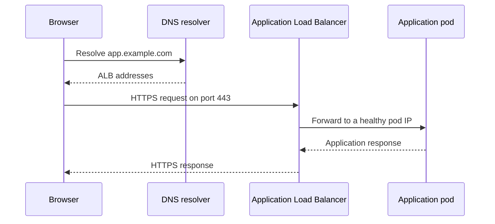

The examples below assume **Amazon EKS with EC2 worker nodes**. Treat the project examples as approaches you can explain in an interview, and adapt them to your actual experience.

**TC Infotech — 1. How would you connect on-premises infrastructure to AWS, especially for sharing files?**

First, clarify whether the requirement is **network connectivity, periodic file transfer, or a shared filesystem**. These lead to different solutions.

| Requirement | Suitable approach |
|---|---|
| Connect an office or data center to private AWS resources | Site-to-Site VPN or Direct Connect |
| Upload files periodically to S3 | AWS CLI, SDK, or DataSync |
| Let existing applications access S3 through SMB/NFS shares | S3 File Gateway |
| Provide a native shared filesystem | Evaluate Amazon FSx or EFS, with suitable hybrid connectivity |

**For network connectivity**

With **AWS Site-to-Site VPN**, I configure:

1. A customer gateway representing the on-premises VPN device.
2. A virtual private gateway attached to the VPC, or a Transit Gateway for a larger network.
3. The VPN connection and its two tunnels.
4. Routes on both sides, using BGP where appropriate.
5. Firewall, security group, NACL, and DNS settings.
6. Monitoring and failover testing.

The on-premises and AWS address ranges should not overlap unless the design explicitly handles address translation. Site-to-Site VPN carries encrypted traffic over the internet. :chatgpt-content-reference{index="0"}

For sustained bandwidth and more predictable connectivity, I would evaluate **Direct Connect**. Direct Connect does **not encrypt traffic by default**; encryption requirements may call for IPsec over the connection or supported MACsec connectivity. :chatgpt-content-reference{index="1"}

**For file sharing**

If an existing application expects an SMB or NFS share, **S3 File Gateway** provides that interface while storing the files as S3 objects. Its local cache helps serve frequently accessed data. I would check file-locking, caching, and application compatibility requirements before choosing it. :chatgpt-content-reference{index="2"}

If the requirement is to migrate or periodically transfer large datasets, **DataSync** is more appropriate. It can transfer data from supported on-premises storage to AWS storage with scheduling and verification capabilities. :chatgpt-content-reference{index="3"}

An application that can upload directly through the S3 API may simply use HTTPS; a VPN is not automatically required.

**An important endpoint distinction:** an S3 **gateway endpoint** serves resources in its associated VPC. On-premises clients cannot use it through a VPN or Direct Connect connection. Private S3 access from on-premises can instead use an **S3 interface endpoint**, with the necessary connectivity and DNS configuration. :chatgpt-content-reference{index="4"}

**Interview answer:**

> “I separate the connectivity requirement from the file-access requirement. I use VPN or Direct Connect for private network connectivity, DataSync for managed transfers, and S3 File Gateway when existing applications need SMB or NFS access to S3.”

---

**TC Infotech — 2. How would you upload files generated daily on EC2 to S3?**

I would use an **EC2 IAM role**, an upload script, and a scheduler.

S3 is object storage, so the normal approach is to upload through its API using the AWS CLI or an SDK.

**Step 1: Give EC2 permission through an IAM role**

Attach an IAM role to the EC2 instance through an instance profile. The CLI retrieves temporary credentials automatically; access keys do not need to be stored in the script. :chatgpt-content-reference{index="5"}

For an upload-only application, an example policy is:

```json
{
  "Version": "2012-10-17",
  "Statement": [
    {
      "Effect": "Allow",
      "Action": [
        "s3:PutObject",
        "s3:AbortMultipartUpload"
      ],
      "Resource": "arn:aws:s3:::example-daily-reports/ec2/*"
    }
  ]
}
```

Replace the bucket name and prefix. If the bucket uses a customer-managed KMS key, configure the required KMS permissions and key policy too.

**Step 2: Provide connectivity**

For EC2 in a private subnet, I would normally create an **S3 gateway endpoint** and associate it with the subnet’s route table. The endpoint policy and bucket policy must permit the upload. This allows S3 access without routing it through a NAT gateway. :chatgpt-content-reference{index="6"}

**Step 3: Generate and upload the file**

Example script:

```bash
#!/usr/bin/env bash
set -euo pipefail

export PATH=/usr/local/bin:/usr/bin:/bin

REPORT_DIR="/var/lib/daily-reports"
BUCKET="example-daily-reports"
REGION="ap-south-1"
RUN_ID="$(date -u +%Y%m%dT%H%M%SZ)"

mkdir -p "$REPORT_DIR"

tmp_file="$(mktemp "$REPORT_DIR/report.XXXXXX")"
report_file="$REPORT_DIR/report-$RUN_ID.csv"

trap 'rm -f "$tmp_file"' EXIT

# Replace this with your application-specific report command.
# It must return a nonzero exit code if generation fails.
/opt/app/generate-report > "$tmp_file"

# Publish the local file only after generation succeeds.
mv "$tmp_file" "$report_file"

aws s3 cp \
  "$report_file" \
  "s3://$BUCKET/ec2/$(basename "$report_file")" \
  --region "$REGION" \
  --only-show-errors

printf 'Upload completed: %s\n' "$report_file"
```

`aws s3 cp` supports uploading a local file to an S3 object. A failed command exits nonzero, which stops this script because of `set -e`. :chatgpt-content-reference{index="7"}

**Step 4: Schedule and monitor it**

For example, run it daily at 02:00 in the server’s configured timezone:

```cron
0 2 * * * /opt/jobs/upload-report.sh >> /var/log/report-upload.log 2>&1
```

The execution user needs permission to write the report directory and log file.

For production, I would also:

- Prevent overlapping runs.
- Alert on upload failures and missing daily uploads.
- Retain local files until successful upload is confirmed.
- Configure S3 retention or lifecycle rules.
- Use a systemd timer with persistent scheduling if missed runs during reboots must be handled.

---

**TC Infotech — 3. How would you write a Terraform module for EKS?**

An EKS module should accept environment-specific inputs and create a consistent cluster configuration.

Typical responsibilities include:

- EKS control plane.
- Managed node groups.
- Cluster access.
- IAM roles and policies, where the module owns them.
- Add-ons and workload identity configuration.
- Useful outputs for deployment tooling.

I usually keep VPC creation in a separate module so the networking design can be reused.

A simple repository arrangement is:

| Location | Purpose |
|---|---|
| `modules/eks/main.tf` | Cluster, node group, and access resources |
| `modules/eks/variables.tf` | Module inputs |
| `modules/eks/outputs.tf` | Cluster information |
| `modules/eks/versions.tf` | Provider requirements |
| `environments/dev/` | Development root configuration and state |
| `environments/prod/` | Production root configuration and state |

**Example scope**

The following module assumes these already exist:

- Private subnets in at least two Availability Zones.
- An EKS cluster IAM role.
- An EC2 node IAM role.
- A platform administrator IAM role.

The cluster role needs the appropriate EKS permissions. The node role needs worker-node and image-pull permissions. For this minimal IPv4 example, it must also provide VPC CNI permissions; a production design should give the CNI its own IAM identity. :chatgpt-content-reference{index="8"}

`modules/eks/versions.tf`:

```hcl
terraform {
  required_providers {
    aws = {
      source  = "hashicorp/aws"
      version = "~> 6.0"
    }
  }
}
```

`modules/eks/variables.tf`:

```hcl
variable "cluster_name" {
  type = string
}

variable "kubernetes_version" {
  type = string
}

variable "private_subnet_ids" {
  type = list(string)
}

variable "cluster_role_arn" {
  type = string
}

variable "node_role_arn" {
  type = string
}

variable "platform_admin_role_arn" {
  type = string
}
```

`modules/eks/main.tf`:

```hcl
resource "aws_eks_cluster" "this" {
  name     = var.cluster_name
  version  = var.kubernetes_version
  role_arn = var.cluster_role_arn

  enabled_cluster_log_types = [
    "api",
    "audit",
    "authenticator"
  ]

  # Bootstrap the standard networking and DNS components.
  bootstrap_self_managed_addons = true

  access_config {
    authentication_mode                         = "API"
    bootstrap_cluster_creator_admin_permissions = false
  }

  vpc_config {
    subnet_ids              = var.private_subnet_ids
    endpoint_private_access = true
    endpoint_public_access  = false
  }
}

resource "aws_eks_node_group" "general" {
  cluster_name    = aws_eks_cluster.this.name
  node_group_name = "${var.cluster_name}-general"
  node_role_arn   = var.node_role_arn
  subnet_ids      = var.private_subnet_ids

  version        = var.kubernetes_version
  ami_type       = "AL2023_x86_64_STANDARD"
  instance_types = ["m6i.large"]
  capacity_type  = "ON_DEMAND"

  scaling_config {
    desired_size = 2
    min_size     = 2
    max_size     = 4
  }

  update_config {
    max_unavailable = 1
  }
}

resource "aws_eks_access_entry" "platform" {
  cluster_name  = aws_eks_cluster.this.name
  principal_arn = var.platform_admin_role_arn
  type          = "STANDARD"
}

resource "aws_eks_access_policy_association" "platform" {
  cluster_name  = aws_eks_cluster.this.name
  principal_arn = aws_eks_access_entry.platform.principal_arn

  policy_arn = "arn:aws:eks::aws:cluster-access-policy/AmazonEKSClusterAdminPolicy"

  access_scope {
    type = "cluster"
  }
}
```

These resources manage the control plane and a managed node group. EKS access entries authorize the designated IAM principal to use the Kubernetes API. The administrator policy above is for a platform administration role; application deployment roles should receive narrower access. :chatgpt-content-reference{index="9"}

`modules/eks/outputs.tf`:

```hcl
output "cluster_name" {
  value = aws_eks_cluster.this.name
}

output "cluster_endpoint" {
  value = aws_eks_cluster.this.endpoint
}
```

A root configuration calls the module:

```hcl
provider "aws" {
  region = "ap-south-1"
}

variable "kubernetes_version" {
  description = "An approved Kubernetes version supported by EKS"
  type        = string
}

module "eks" {
  source = "../../modules/eks"

  cluster_name       = "tc-dev-eks"
  kubernetes_version = var.kubernetes_version

  # Replace these example identifiers with existing resources.
  private_subnet_ids = [
    "subnet-REPLACE_A",
    "subnet-REPLACE_B"
  ]

  cluster_role_arn = "arn:aws:iam::123456789012:role/eks-cluster-role"
  node_role_arn    = "arn:aws:iam::123456789012:role/eks-node-role"

  platform_admin_role_arn = "arn:aws:iam::123456789012:role/platform-admin"
}
```

**Points to explain during the interview**

- Keep the backend configuration in the root configuration and use separate state for each environment.
- Commit the provider lock file and review version upgrades.
- Ensure the pre-existing IAM policies are attached before creating the cluster and nodes.
- Private nodes need routes or endpoints for required AWS services and image pulls.
- Because the Kubernetes API endpoint is private, `kubectl` and Helm need private network access.
- The node group’s maximum size does not itself trigger scaling; install and configure an appropriate node autoscaling mechanism.
- For production, manage compatible add-on versions, storage drivers, workload identities, and node configuration explicitly.

This is a foundation for explaining module design, rather than a complete production platform.

---

**TC Infotech — 4. How does traffic reach an application on EKS when a user opens its URL?**

Assume:

- The URL is `https://app.example.com`.
- Route 53 manages DNS.
- An Application Load Balancer terminates HTTPS.
- AWS Load Balancer Controller manages the ALB.
- The ALB uses **IP targets**.



The sequence is:

1. **DNS resolution:** the browser resolves the hostname. A Route 53 alias can point it to the ALB.
2. **TLS connection:** the browser connects to the ALB’s HTTPS listener and validates its certificate.
3. **Routing decision:** the ALB evaluates listener rules, such as hostname and URL path.
4. **Target selection:** the matching target group selects a healthy backend.
5. **Application processing:** the pod handles the request and returns the response.

With the annotation:

```yaml
alb.ingress.kubernetes.io/target-type: ip
```

the ALB sends traffic directly to registered pod IPs. The Service identifies the application backends, but its ClusterIP is not a mandatory packet hop in this mode. :chatgpt-content-reference{index="10"}

**What changes with instance targets?**

With:

```yaml
alb.ingress.kubernetes.io/target-type: instance
```

the path is typically:

**ALB → worker-node NodePort → Service forwarding rules → pod.**

The Service must support the required NodePort path.

**Where does the controller fit?**

AWS Load Balancer Controller watches Kubernetes resources and configures AWS load-balancing resources. It does not forward every application request through the controller pod. :chatgpt-content-reference{index="11"}

For troubleshooting, I would check DNS, certificates, listener rules, target health, security groups, Service selectors, EndpointSlices, readiness, and the application’s listening port.

---

**TC Infotech — 5. What is the difference between CoreDNS and kube-proxy?**

**CoreDNS resolves names. kube-proxy implements Service traffic forwarding.**

| Aspect | CoreDNS | kube-proxy |
|---|---|---|
| Main responsibility | DNS resolution | Service networking |
| Example | Resolves `orders.default.svc.cluster.local` | Sends traffic addressed to a Service IP to a backend pod |
| Typical deployment | Deployment with multiple replicas | DaemonSet on worker nodes |
| Information used | Services, endpoints, DNS configuration | Services and EndpointSlices |
| Typical failure symptom | Applications cannot resolve names | Service IP traffic fails despite reachable pod IPs |

For example:

```text
orders.default.svc.cluster.local
```

For a normal ClusterIP Service, CoreDNS returns the Service’s virtual IP. The client then connects to that address, and the node’s Service networking implementation forwards the traffic to a backend pod. A headless Service instead provides endpoint addresses through DNS. :chatgpt-content-reference{index="12"}

On Linux, kube-proxy commonly programs kernel networking rules, such as iptables or nftables. It generally does not receive and forward every request as a userspace proxy.

Some networking implementations replace kube-proxy with an alternative data plane, such as eBPF-based Service forwarding. :chatgpt-content-reference{index="13"}

Useful checks include:

```bash
kubectl -n kube-system get deployment coredns

kubectl -n kube-system logs deployment/coredns --tail=100

kubectl -n kube-system get daemonset kube-proxy

kubectl -n orders get services,endpointslices
```

Also distinguish both from the **CNI plugin**, which handles pod network connectivity and IP allocation according to its implementation.

---

**TC Infotech — 6. What is an OIDC provider in AWS?**

**OpenID Connect, or OIDC, is an identity protocol built on OAuth 2.0.**

An **IAM OIDC identity provider** allows AWS IAM to trust tokens issued by a configured external identity provider. An IAM role’s trust policy then controls which identities can assume that role.

A common DevOps use case is obtaining temporary AWS credentials without storing AWS access keys.

**Example: an EKS pod needs S3 access**

Using **IAM Roles for Service Accounts, or IRSA**:

1. EKS exposes an OIDC issuer for the cluster.
2. You register that issuer as an IAM OIDC provider.
3. You create an IAM role with the required S3 permissions.
4. The role’s trust policy permits a specific Kubernetes service account.
5. The pod receives a projected service-account token.
6. The AWS SDK exchanges that token through STS using `AssumeRoleWithWebIdentity`.
7. STS returns temporary AWS credentials. :chatgpt-content-reference{index="14"}

For a service account named `orders-app` in namespace `orders`, the trust conditions should restrict claims such as:

```text
aud = sts.amazonaws.com
sub = system:serviceaccount:orders:orders-app
```

The service account references the role:

```yaml
apiVersion: v1
kind: ServiceAccount
metadata:
  name: orders-app
  namespace: orders
  annotations:
    eks.amazonaws.com/role-arn: arn:aws:iam::123456789012:role/orders-s3-role
```

The pod uses that service account:

```yaml
spec:
  serviceAccountName: orders-app
```

The issuer, audience, subject, and IAM role permissions all matter. Creating an OIDC provider alone does not grant S3 access. :chatgpt-content-reference{index="15"}

**How does EKS Pod Identity differ?**

EKS Pod Identity is another way to assign AWS permissions to workloads. It uses service-account associations and the Pod Identity Agent, without requiring a separate IAM OIDC provider for each cluster. Its IAM role trusts the `pods.eks.amazonaws.com` service principal. :chatgpt-content-reference{index="16"}

Also distinguish workload access to AWS from authenticating people to the Kubernetes API: they are separate access paths.

---

**Infinite Solutions — 1. How would you manage Kubernetes disaster recovery?**

I would start with the application’s business recovery requirements:

- **RTO:** how long the application can remain unavailable.
- **RPO:** how much recent data the business can afford to lose.

These determine the recovery architecture, backup frequency, replication, and budget.

A multi-AZ cluster improves availability during an AZ failure. Regional disaster recovery requires a recovery environment and data accessible outside the affected region.

**Choose a recovery strategy**

| Strategy | What is maintained | Main trade-off |
|---|---|---|
| Backup and restore | Backups and rebuild automation | Lower ongoing cost; longer recovery |
| Pilot light | Essential infrastructure and data replication | Some infrastructure must be started or expanded |
| Warm standby | A smaller functioning environment | Faster recovery with ongoing cost |
| Active-active | Multiple serving environments | More complex data consistency and traffic management |

**Protect all application dependencies**

| Component | Recovery approach |
|---|---|
| VPC, EKS, node groups, IAM | Terraform and reviewed configuration |
| Kubernetes manifests and Helm values | Git and GitOps |
| Kubernetes resources not fully represented in Git | Kubernetes-aware backups |
| Persistent volumes | Supported snapshots or data backups |
| External databases | Native backups, PITR, or replication |
| Images and charts | Available or replicated registries |
| Secrets and certificates | Recoverable secret stores and key access |
| DNS and ingress | Reproducible configuration and a failover procedure |
| Terraform state | Protected remote backend with recovery capability |

For EKS, AWS manages the control plane. I would not base the recovery process on taking direct customer-managed snapshots of EKS’s etcd.

**Example regional failover procedure**

1. Confirm the incident and invoke the recovery runbook.
2. Stop or fence the old writer where necessary to prevent split-brain writes.
3. Provision or scale the recovery infrastructure.
4. Restore or promote databases and persistent storage.
5. Install required cluster components, CRDs, and controllers.
6. Restore application resources and reconcile the intended application version from Git.
7. Validate secrets, connectivity, data freshness, and business transactions.
8. Redirect traffic to the recovery environment.
9. Monitor errors, latency, saturation, and data integrity.

DNS-based redirection must account for caching and existing connections; it is not instant for every client.

**Test the complete process**

I would run recovery exercises in an isolated environment and measure:

- Time until users can complete a critical transaction.
- Actual recoverable data freshness.
- Missing permissions, keys, images, or dependencies.
- Whether failback works after the original region recovers.

A successful backup job is useful evidence, but a successful recovery exercise demonstrates recoverability.

**Interview answer:**

> “I combine infrastructure as code, GitOps, protected application-data backups, and a tested failover runbook. The recovery target includes the application’s databases, identities, storage, and traffic routing. I measure recovery against the agreed RTO and RPO.”

---

**Infinite Solutions — 2. How would you back up Kubernetes?**

I would protect **resource configuration and application data**, because they recover different things.

**A. Kubernetes resource configuration**

Examples include:

- Deployments and StatefulSets.
- Services and Ingress resources.
- ConfigMaps and Secrets.
- Service accounts and RBAC.
- PVC definitions.
- CRDs and custom resources.

Git should hold the intended declarative configuration. A Kubernetes-aware backup can capture additional cluster state.

**B. Persistent application data**

Backing up a PVC manifest does not back up the files or database stored on its volume.

Depending on the storage and application, I would use:

- CSI volume snapshots.
- Supported file-system backups.
- Snapshot data movement to backup storage.
- Database-native backups and transaction logs.

A volume snapshot may only be crash-consistent. Databases may require backup hooks, write quiescing, or their native backup mechanisms.

**Using Velero**

Velero stores backup information in object storage and can integrate with supported volume-backup mechanisms. Before creating backups, configure its storage location, cloud permissions, compatible plugins, and the chosen volume-backup method. :chatgpt-content-reference{index="17"}

For CSI snapshots, the cluster needs a compatible CSI driver and snapshot components, a suitable `VolumeSnapshotClass`, and the required Velero CSI configuration. :chatgpt-content-reference{index="18"}

An example namespace backup is:

```bash
BACKUP_NAME="orders-$(date -u +%Y%m%d%H%M%S)"

velero backup create "$BACKUP_NAME" \
  --include-namespaces orders \
  --wait

velero backup describe "$BACKUP_NAME" --details

velero backup logs "$BACKUP_NAME"
```

An hourly schedule with seven-day retention:

```bash
velero schedule create orders-hourly \
  --schedule="CRON_TZ=UTC 0 * * * *" \
  --include-namespaces orders \
  --ttl=168h
```

Select frequency and retention from the application’s requirements; the schedule above is illustrative. :chatgpt-content-reference{index="19"}

On a prepared recovery cluster:

```bash
velero restore create orders-recovery \
  --from-backup "$BACKUP_NAME" \
  --wait

velero restore describe orders-recovery --details

velero restore logs orders-recovery
```

Configure the recovery cluster’s backup location appropriately, commonly read-only during recovery, to avoid accidental backup deletion. :chatgpt-content-reference{index="20"}

A namespace-only example also requires a recovery plan for cluster-scoped dependencies such as CRDs and storage classes.

**Cross-region consideration**

If the backup references an EBS snapshot in the failed region, having the backup metadata in another region is insufficient. The volume data itself must be recoverable there through supported snapshot copies or data movement, with usable encryption keys.

**AWS Backup is also an EKS option**

AWS Backup now supports EKS cluster resource configuration and supported persistent storage, including qualifying EBS, EFS, and S3-backed volumes. It does not include all surrounding infrastructure or ECR images.

I would verify storage-driver support, IAM prerequisites, regional availability, and individual recovery-point status. A partial backup or one completed with issues must be investigated. :chatgpt-content-reference{index="21"}

For **self-managed Kubernetes**, I would additionally maintain protected etcd snapshots and test the documented control-plane restoration procedure.

---

**Infinite Solutions — 3. How would you set up an ingress controller?**

For this EKS example, I would use **AWS Load Balancer Controller** to provision an ALB from Kubernetes Ingress resources.

The relevant components are:

- **Ingress resource:** hostname and path routing rules.
- **Ingress controller:** watches those rules and configures the implementation.
- **ALB:** receives and forwards application traffic.
- **Service:** identifies the application backends.

**Step 1: Prepare networking**

For a public ALB:

- Provide public subnets in at least two Availability Zones.
- Ensure suitable subnet tags or explicit subnet selection.
- Allow the intended HTTPS traffic.
- Allow ALB-to-application traffic through the relevant security groups.
- Ensure sufficient subnet IP capacity.

Worker nodes and application pods can remain in private subnets. :chatgpt-content-reference{index="22"}

**Step 2: Configure controller IAM permissions**

Create a dedicated IAM role using the controller release’s documented policy.

For an IRSA installation:

1. Configure the cluster’s IAM OIDC provider.
2. Restrict the role trust to the controller’s service account.
3. Create that service account with the role annotation.

Example, after creating the matching IAM role:

```yaml
apiVersion: v1
kind: ServiceAccount
metadata:
  name: aws-load-balancer-controller
  namespace: kube-system
  annotations:
    eks.amazonaws.com/role-arn: arn:aws:iam::123456789012:role/eks-lb-controller
```

Apply it before installing the chart:

```bash
kubectl apply -f controller-serviceaccount.yaml
```

**Step 3: Install the controller using Helm**

Set `LBC_CHART_VERSION` to an approved chart version compatible with the cluster and corresponding IAM policy.

```bash
helm repo add eks https://aws.github.io/eks-charts

helm repo update eks

helm upgrade --install aws-load-balancer-controller \
  eks/aws-load-balancer-controller \
  --namespace kube-system \
  --version "${LBC_CHART_VERSION:?Set an approved chart version}" \
  --set clusterName=tc-dev-eks \
  --set region=ap-south-1 \
  --set vpcId=vpc-REPLACE \
  --set serviceAccount.create=false \
  --set serviceAccount.name=aws-load-balancer-controller \
  --set replicaCount=2 \
  --wait \
  --timeout 10m
```

Replace the cluster, region, VPC, and IAM identifiers.

For controller upgrades, follow the release instructions for updating CRDs; Helm upgrades do not automatically upgrade chart CRDs. :chatgpt-content-reference{index="23"}

**Step 4: Create the application Service and Ingress**

Assume the `orders` namespace already contains application pods with:

```yaml
labels:
  app: orders
```

The application listens on port `8080` and provides `/healthz`.

```yaml
apiVersion: v1
kind: Service
metadata:
  name: orders
  namespace: orders
spec:
  type: ClusterIP
  selector:
    app: orders
  ports:
    - name: http
      port: 80
      targetPort: 8080
---
apiVersion: networking.k8s.io/v1
kind: Ingress
metadata:
  name: orders
  namespace: orders
  annotations:
    alb.ingress.kubernetes.io/scheme: internet-facing
    alb.ingress.kubernetes.io/target-type: ip
    alb.ingress.kubernetes.io/listen-ports: '[{"HTTPS":443}]'
    alb.ingress.kubernetes.io/certificate-arn: arn:aws:acm:ap-south-1:123456789012:certificate/REPLACE
    alb.ingress.kubernetes.io/healthcheck-path: /healthz
spec:
  ingressClassName: alb
  rules:
    - host: app.example.com
      http:
        paths:
          - path: /
            pathType: Prefix
            backend:
              service:
                name: orders
                port:
                  number: 80
```

This example exposes HTTPS only. The ACM certificate must cover the hostname and be available in the ALB’s region.

The `ip` target mode allows the ALB to register pod IPs while the Kubernetes Service remains `ClusterIP`. :chatgpt-content-reference{index="24"}

**Step 5: Configure DNS and verify**

Create a Route 53 alias for `app.example.com` pointing to the provisioned ALB.

Then check:

```bash
kubectl get ingressclass alb

kubectl -n kube-system get deployment aws-load-balancer-controller

kubectl -n orders get ingress,service,endpointslices

kubectl -n orders describe ingress orders

kubectl -n kube-system logs \
  deployment/aws-load-balancer-controller \
  --tail=100

curl -fsS https://app.example.com/healthz
```

If the ALB exists but requests fail, inspect target-group health reasons, the health-check path, application port, Service selectors, readiness, and network rules.

For new installations, choose a maintained controller. The community **ingress-nginx** project reached retirement in March 2026; the Kubernetes Ingress API remains available, and AWS Load Balancer Controller is a separate implementation. :chatgpt-content-reference{index="25"}
