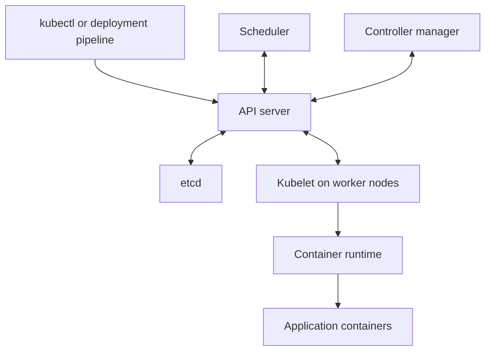
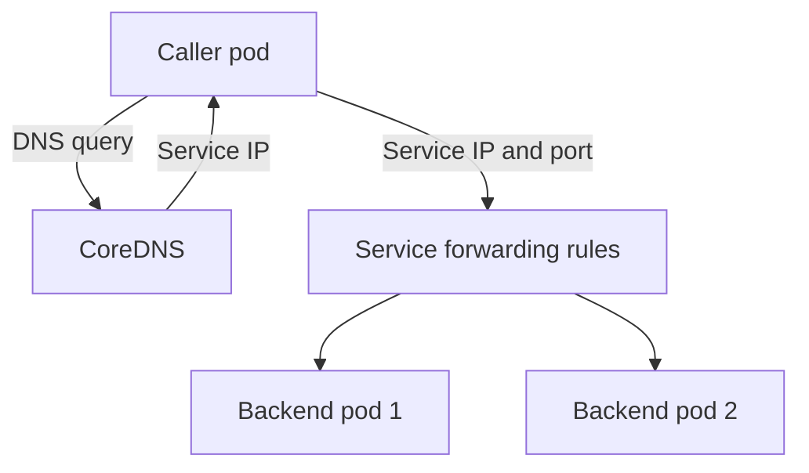
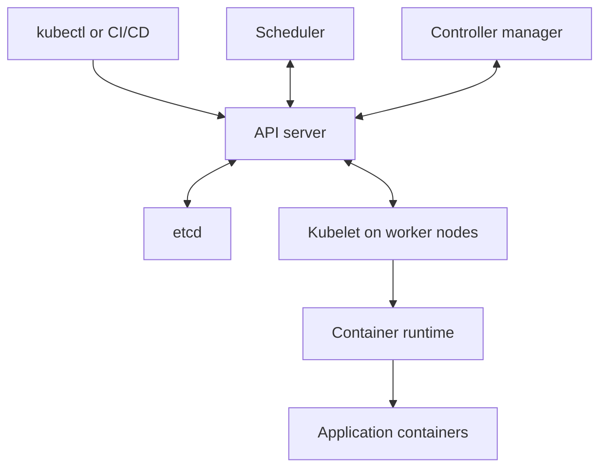

Below are detailed answers for the **Infosys interview questions**. For questions about your background and project, replace the placeholders with your actual experience.

**1. Introduce yourself**

Keep your introduction to approximately 60–90 seconds. Cover your experience, current project, responsibilities, tools, and one useful contribution.

**Sample answer:**

> “Hi, I’m [Name]. I have [total experience] years of IT experience, including [DevOps experience] years working in DevOps.
>
> In my current project, we support a [banking/e-commerce/healthcare/other] application hosted on [AWS/Azure]. My responsibilities include maintaining CI/CD pipelines, provisioning infrastructure using Terraform, deploying applications to Kubernetes, and investigating deployment and production issues.
>
> I primarily work with [tools you actually use—for example, Git, Jenkins, Docker, Kubernetes, Terraform, and Ansible]. I also use [monitoring tools] to monitor application availability and infrastructure health.
>
> One improvement I contributed to was [actual improvement], which helped us achieve [real outcome]. I’m looking for an opportunity where I can contribute further to automation, reliable deployments, and cloud operations.”

Be ready to explain everything you mention. If you say you reduced deployment time, explain the previous process, your changes, and how you measured the improvement.

---

**2. Which Git commands do you use in day-to-day activities?**

These are common commands and the reasons for using them:

| Command | Purpose |
|---|---|
| `git clone <repository-url>` | Create a local working copy of a remote repository |
| `git status` | Check the current branch and changed files |
| `git switch -c feature/login` | Create and switch to a feature branch |
| `git switch main` | Switch to the main branch |
| `git diff` | Review unstaged changes |
| `git diff --staged` | Review changes staged for the next commit |
| `git add app.py` | Stage a specific file |
| `git commit -m "Add login validation"` | Record the staged changes |
| `git fetch origin` | Download remote changes without integrating them into the current branch |
| `git pull --ff-only` | Update the current branch only when a fast-forward is possible |
| `git push -u origin feature/login` | Push the branch and configure its upstream |
| `git log --oneline --graph --all` | Inspect commit history and branch relationships |
| `git stash push -m "Work in progress"` | Temporarily save uncommitted changes |
| `git stash pop` | Reapply the latest stash; conflicts are possible |
| `git cherry-pick <commit>` | Apply a particular commit to the current branch |
| `git revert <commit>` | Create a new commit that reverses an earlier commit |

**Important distinctions:**

- `fetch` updates your knowledge of remote branches.
- `pull` fetches and then integrates changes according to the selected strategy.
- `pull --ff-only` stops if the local and remote branches have diverged. :chatgpt-content-reference{index="0"}

For a problematic commit already shared with the team, `git revert` is usually appropriate because it preserves the existing history. :chatgpt-content-reference{index="1"}

**Interview answer:**

> “My usual workflow is to update my local repository, create a feature branch, make changes, review the diff, commit, and push the branch for a pull request. I use fetch and log to inspect incoming changes, and merge or rebase according to our branching policy.”

---

**3. Write a sample Dockerfile**

Assume a Python application where:

- `app.py` exposes a Flask application named `app`.
- `requirements.txt` contains Flask, Gunicorn, and the application dependencies.

```dockerfile
# syntax=docker/dockerfile:1

FROM python:3.13-slim

ENV PYTHONDONTWRITEBYTECODE=1 \
    PYTHONUNBUFFERED=1

WORKDIR /app

COPY requirements.txt .

RUN python -m pip install --no-cache-dir -r requirements.txt \
    && groupadd --gid 10001 appuser \
    && useradd --uid 10001 --gid 10001 \
       --create-home appuser

COPY --chown=appuser:appuser . .

USER appuser

EXPOSE 8000

ENTRYPOINT ["gunicorn"]

CMD ["--bind", "0.0.0.0:8000", "--workers", "2", "app:app"]
```

**Explanation:**

- `FROM`: selects the base image.
- `WORKDIR`: sets the working directory for subsequent instructions.
- `COPY requirements.txt`: allows dependency installation to remain cached when only application code changes.
- `RUN`: installs dependencies and creates a non-root user during the build.
- `USER`: runs the application without root privileges.
- `EXPOSE`: documents the application port; it does not publish the port.
- `ENTRYPOINT` and `CMD`: together define the container’s startup command.

A suitable `.dockerignore` could contain:

```text
.git
.venv
__pycache__
*.pyc
.env*
```

Build and run:

```bash
docker build -t orders-api:1.0.0 .

docker run --rm -p 8080:8000 orders-api:1.0.0
```

The application is then reachable through host port `8080`.

For production, pin approved base-image digests and dependency versions, scan the image, and keep credentials outside the image. Use multi-stage builds when build tools or compiled artifacts need to be separated from the runtime image. :chatgpt-content-reference{index="2"}

---

**4. Write a sample Terraform resource file**

This example creates an EC2 instance using an existing subnet, security groups, and an approved AMI.

```hcl
terraform {
  required_providers {
    aws = {
      source  = "hashicorp/aws"
      version = "~> 6.0"
    }
  }
}

provider "aws" {
  region = "ap-south-1"
}

variable "ami_id" {
  description = "Approved x86_64 AMI in ap-south-1"
  type        = string
}

variable "subnet_id" {
  description = "Existing subnet for the instance"
  type        = string
}

variable "security_group_ids" {
  description = "Existing security groups in the same VPC"
  type        = list(string)
}

resource "aws_instance" "app" {
  ami                    = var.ami_id
  instance_type          = "t3.micro"
  subnet_id              = var.subnet_id
  vpc_security_group_ids = var.security_group_ids

  associate_public_ip_address = false

  root_block_device {
    volume_type = "gp3"
    volume_size = 20
    encrypted   = true
  }

  metadata_options {
    http_tokens = "required"
  }

  tags = {
    Name        = "dev-app-server"
    Environment = "dev"
    ManagedBy   = "Terraform"
  }
}

output "instance_id" {
  value = aws_instance.app.id
}

output "private_ip" {
  value = aws_instance.app.private_ip
}
```

**Explain these points:**

- `aws_instance` is the resource type.
- `app` is its Terraform-local name.
- `aws_instance.app.id` references an attribute of that resource.
- Variables allow the configuration to be reused.
- The root EBS volume is encrypted.
- `http_tokens = "required"` requires IMDSv2 for instance metadata requests. :chatgpt-content-reference{index="3"}

Typical workflow:

```bash
terraform init
terraform fmt
terraform validate
terraform plan -out=tfplan

# After reviewing the saved plan:
terraform apply tfplan
```

In a team, I would run this through a controlled pipeline using remote state, locking, and reviewed changes.

---

**5. What is the difference between Git rebase and Git merge?**

Both integrate changes from another branch, but they produce different histories.

| Aspect | Merge | Rebase |
|---|---|---|
| Operation | Combines branch histories | Replays commits onto another base |
| Existing commit IDs | Preserved | Replayed commits receive new IDs |
| History | Shows the original branching relationship | Can produce a linear sequence |
| Merge commit | Created when needed, or when explicitly requested | Does not normally create a merge commit |
| Typical use | Integrating shared branches | Updating a personal feature branch before integration |

**Merge example**

While on the feature branch:

```bash
git fetch origin
git switch feature/login
git merge origin/main
```

If the histories have diverged, Git normally creates a merge commit. If a fast-forward is possible, a merge commit is not required. :chatgpt-content-reference{index="4"}

**Rebase example**

```bash
git fetch origin
git switch feature/login
git rebase origin/main
```

Git replays the feature commits on top of the updated `origin/main`.

If a conflict occurs:

```bash
# Edit the conflicting files first.
git add <resolved-file>
git rebase --continue
```

To cancel:

```bash
git rebase --abort
```

Avoid rewriting a shared branch without coordination. If your own previously pushed feature branch is rebased, updating it may require `git push --force-with-lease`; follow the team’s policy. :chatgpt-content-reference{index="5"}

---

**6. What is the difference between CMD and ENTRYPOINT?**

Both affect container startup.

| Instruction | Purpose | Override behavior |
|---|---|---|
| `ENTRYPOINT` | Defines the executable the container normally runs | Override with `docker run --entrypoint` |
| `CMD` | Provides a default command or default arguments | Arguments after the image name replace it |

Example:

```dockerfile
ENTRYPOINT ["python"]
CMD ["app.py"]
```

Running:

```bash
docker run my-python-app
```

effectively starts:

```bash
python app.py
```

Running:

```bash
docker run my-python-app worker.py
```

starts:

```bash
python worker.py
```

Here, `worker.py` replaces `CMD`, while the executable remains `python`.

To replace the executable:

```bash
docker run --rm \
  --entrypoint /bin/sh \
  my-python-app \
  -c 'echo "Debug session"'
```

Use the JSON/exec form for predictable argument handling. It also avoids inserting a shell between the container runtime and the main executable. :chatgpt-content-reference{index="6"}

---

**7. Explain Prometheus and Grafana**

**Prometheus collects and queries metrics. Grafana visualizes data from sources such as Prometheus.**

| Tool | Main responsibility |
|---|---|
| Prometheus | Scrapes metrics, stores time series, evaluates PromQL queries and alert rules |
| Grafana | Provides dashboards, exploration, and alerting across configured data sources |
| Alertmanager | Groups, deduplicates, and routes alerts generated by Prometheus |

Prometheus normally pulls metrics from HTTP endpoints such as `/metrics`. Applications can expose their own metrics, while exporters expose metrics from infrastructure and other systems. :chatgpt-content-reference{index="7"}

**Metrics I would monitor**

- Application request rate.
- Error rate and response-time percentiles.
- CPU and memory usage.
- Container restarts and unavailable replicas.
- Node health and disk capacity.
- Database connection usage and latency.
- Queue depth and processing delay.

**Example setup in Kubernetes**

1. Deploy Prometheus with suitable storage, retention, and access permissions.
2. Instrument the applications and install relevant exporters.
3. Configure target discovery and confirm that targets are healthy.
4. If using Prometheus Operator, define `ServiceMonitor` or `PodMonitor` resources.
5. Add Prometheus as a Grafana data source.
6. Create application and infrastructure dashboards.
7. Configure alerts and test their delivery. :chatgpt-content-reference{index="8"}

Example PromQL for request rate, assuming the application exposes this metric:

```promql
sum(rate(http_requests_total{job="orders"}[5m]))
```

For paging, I would prioritize user-impacting conditions such as sustained failures or latency, then use infrastructure metrics to investigate the cause. Alertmanager can group related notifications to reduce duplicate pages. :chatgpt-content-reference{index="9"}

---

**8. What would you do if `pod.yaml` failed?**

First, determine whether **Kubernetes rejected the manifest** or **the pod was created and then failed**.

**A. If applying the YAML fails**

Check the context and validate the manifest:

```bash
kubectl config current-context

kubectl apply --dry-run=client -f pod.yaml

kubectl apply --dry-run=server \
  --validate=strict \
  -f pod.yaml
```

Server-side dry-run checks the request against the API server without persisting the resource. :chatgpt-content-reference{index="10"}

Common causes include:

| Error | What to investigate |
|---|---|
| YAML parsing error | Indentation, quoting, tabs, malformed lists |
| Unknown field or invalid value | Field name, nesting, expected data type |
| No matching resource kind | Incorrect API version or missing CRD |
| `Forbidden` | Kubernetes authorization or admission policy |
| Namespace not found | Wrong or missing namespace |
| Quota exceeded | Namespace quotas and requested resources |
| Connection error | Cluster endpoint, credentials, DNS, network connectivity |

**B. If the pod exists but is unhealthy**

```bash
kubectl -n app get pods -o wide

kubectl -n app describe pod <pod-name>

kubectl -n app get events \
  --sort-by=.metadata.creationTimestamp
```

Then investigate its state:

- **Pending:** capacity, scheduling rules, taints, or unbound PVCs.
- **ImagePullBackOff:** image reference, registry permissions, or connectivity.
- **CreateContainerConfigError:** missing configuration references, such as a Secret.
- **CrashLoopBackOff:** the container repeatedly exits or is restarted.
- **Running but not Ready:** readiness checks or application dependencies may be failing. :chatgpt-content-reference{index="11"}

Fix the underlying issue, apply the corrected configuration through the normal deployment process, and verify the application.

---

**9. Explain blue-green deployment**

Blue-green deployment maintains two application versions:

- **Blue:** the currently serving version.
- **Green:** the new version being prepared and validated.

**Deployment sequence**

1. Keep blue serving production traffic.
2. Deploy green with the new image.
3. Test green through a preview endpoint.
4. Validate health, configuration, dependencies, and key transactions.
5. Switch production traffic to green.
6. Observe the release.
7. Keep blue available for rollback until the observation period ends.

In Kubernetes, two Deployments can use different pod labels:

```yaml
# Blue pod labels
app: orders
version: blue
```

```yaml
# Green pod labels
app: orders
version: green
```

The active Service initially selects blue:

```yaml
apiVersion: v1
kind: Service
metadata:
  name: orders
  namespace: production
spec:
  selector:
    app: orders
    version: blue
  ports:
    - port: 80
      targetPort: 8000
```

An illustrative traffic switch is:

```bash
kubectl -n production patch service orders \
  --type=merge \
  -p '{"spec":{"selector":{"version":"green"}}}'
```

The Service’s selector determines its backends. In a GitOps workflow, make the corresponding change through the declared configuration so reconciliation preserves it. :chatgpt-content-reference{index="12"}

**Important considerations**

- Allow for routing propagation and connection draining before stopping blue.
- Ensure enough capacity for both versions during the transition.
- Database changes must remain compatible with rollback.
- A traffic switch does not reverse database migrations or external side effects.

Tools such as Argo Rollouts can automate preview Services, promotion, analysis, and delayed scale-down. :chatgpt-content-reference{index="13"}

---

**10. Explain Kubernetes architecture**

Kubernetes consists of a **control plane** that manages desired state and **worker nodes** that run application workloads.



| Component | Responsibility |
|---|---|
| API server | Receives and validates Kubernetes API requests |
| etcd | Stores Kubernetes API state |
| Scheduler | Selects suitable nodes for unscheduled pods |
| Controller manager | Runs reconciliation controllers |
| Cloud controller manager | Integrates cloud-specific capabilities where used |
| Kubelet | Ensures assigned pods and containers run on a node |
| Container runtime | Runs containers; examples include containerd and CRI-O |
| kube-proxy or an alternative Service data plane | Implements Service traffic forwarding |

Other essential components commonly include a CNI plugin for pod networking, CoreDNS for DNS resolution, and CSI drivers for storage integration. :chatgpt-content-reference{index="14"}

**What happens when you create a Deployment?**

1. `kubectl` submits the Deployment to the API server.
2. The API server validates and stores it.
3. Controllers create the necessary ReplicaSet and pods.
4. The scheduler assigns each unscheduled pod to a suitable node.
5. The kubelet coordinates container startup through the runtime.
6. Readiness and Service configuration determine when the application can receive traffic.

The scheduler chooses placement; the kubelet and runtime handle execution on the node.

---

**11. Which Kubernetes commands do you use regularly?**

| Activity | Example command |
|---|---|
| Check the active cluster context | `kubectl config current-context` |
| List namespaces | `kubectl get namespaces` |
| Check nodes | `kubectl get nodes -o wide` |
| List pods across namespaces | `kubectl get pods -A` |
| Inspect a workload’s pods | `kubectl -n app get pods -o wide` |
| Inspect pod details and events | `kubectl -n app describe pod <pod>` |
| View application logs | `kubectl -n app logs <pod> -c app` |
| Follow logs | `kubectl -n app logs -f <pod> -c app` |
| Read the previous container’s logs | `kubectl -n app logs <pod> -c app --previous` |
| Execute a command in a running container | `kubectl -n app exec -it <pod> -c app -- sh` |
| Apply configuration | `kubectl apply -f deployment.yaml` |
| Watch deployment progress | `kubectl -n app rollout status deployment/orders` |
| Inspect rollout history | `kubectl -n app rollout history deployment/orders` |
| Roll back a Deployment revision | `kubectl -n app rollout undo deployment/orders` |
| Change replica count | `kubectl -n app scale deployment/orders --replicas=3` |
| Inspect Service backends | `kubectl -n app get services,endpointslices` |
| Check resource usage | `kubectl -n app top pods` |
| Forward a local port for testing | `kubectl -n app port-forward service/orders 8080:80` |

`kubectl top` requires a working resource metrics pipeline, commonly Metrics Server. `kubectl exec ... sh` requires a running container containing a shell.

Use explicit contexts and namespaces when working across environments. A Deployment rollback restores a previous pod-template revision; it does not reverse database changes.

---

**12. The application crashes, and you cannot enter the pod. How would you troubleshoot?**

You can investigate a crashed container without entering it.

`kubectl exec` starts a process inside a running container. It may fail because the container stops too quickly, or because the image has no shell.

**Step 1: Inspect status and termination details**

```bash
kubectl -n app get pod <pod-name> -o wide

kubectl -n app describe pod <pod-name>
```

Check:

- Container state and last termination state.
- Exit code and termination reason.
- Restart count.
- Probe failures.
- Mount or configuration errors.
- Node-related events.

`CrashLoopBackOff` indicates repeated failures with increasing restart delays; it is not the root cause. :chatgpt-content-reference{index="15"}

**Step 2: Read the previous container’s logs**

```bash
kubectl -n app logs <pod-name> \
  -c app \
  --previous \
  --timestamps
```

Also check the current container:

```bash
kubectl -n app logs <pod-name> \
  -c app \
  --timestamps
```

`--previous` retrieves logs from the previous instance of that container, when available. Check init-container logs separately if startup is blocked there. :chatgpt-content-reference{index="16"}

**Step 3: Investigate according to the evidence**

| Finding | Likely investigation |
|---|---|
| `OOMKilled` | Memory limits, usage spikes, leaks, application heap settings |
| Exit code `1` | Application exception, invalid configuration, dependency failure |
| Exit code `137` | SIGKILL; inspect the termination reason and node evidence to determine why |
| Missing executable or permission error | Image contents, command, file permissions, execution user |
| Probe failures | Probe path, port, timeouts, startup duration, actual application health |
| Database connection failure | DNS, credentials, network policy, security groups, database availability |

Do not assume every exit code `137` is proof of an OOM kill. Kubernetes termination details provide stronger evidence. :chatgpt-content-reference{index="17"}

**Step 4: If logs are empty**

Check whether:

- The application failed before logging initialized.
- Logs are written to files rather than stdout/stderr.
- Output buffering prevented logs from being flushed.
- The configured startup command is incorrect.
- You selected the wrong container.

An approved ephemeral debug container can help inspect the pod’s networking context:

```bash
kubectl debug -n app <pod-name> -it \
  --image=busybox:1.37 \
  -- sh
```

This requires suitable authorization and cluster policy. It does not automatically provide the failed container’s filesystem or restore its terminated process.

For startup failures, reproduce the issue in an isolated debug copy using the same image and relevant configuration. If the image contains a shell, overriding the startup command can help inspect files and permissions. :chatgpt-content-reference{index="18"}

**Step 5: Restore service and verify**

If the new release caused the failure, use the approved rollback path while investigating. Then verify application health, restart counts, error rate, and user transactions.

A startup probe may be appropriate for a slow-starting application. Readiness controls traffic eligibility; failed liveness or startup probes can trigger container restarts. :chatgpt-content-reference{index="19"}

---

**13. Explain your project pipeline**

Describe your actual pipeline from commit to production, including the checks and decisions between stages.

**Example architecture to adapt:**

Git repository → Jenkins → tests and scans → Docker image → ECR → Kubernetes deployment → verification.

**A complete explanation could be:**

1. **Source control and trigger**  
   Developers create feature branches and submit pull requests. Repository webhooks trigger the appropriate Jenkins pipeline.

2. **Checkout and dependency installation**  
   Jenkins checks out the exact commit and installs dependencies from approved lock files.

3. **Testing and code quality**  
   The pipeline runs linting, unit tests, and coverage checks. SonarQube evaluates the configured quality gate.

4. **Security checks**  
   Run secret detection, dependency scanning, and other checks appropriate to the application.

5. **Build the artifact**  
   Build the container image and record its immutable digest. Tag it with the commit or release identifier for traceability.

6. **Scan and publish**  
   Scan the image and push the approved artifact to the registry.

7. **Deploy to lower environments**  
   Deploy through Helm or the project’s chosen deployment mechanism. Run integration, smoke, and acceptance tests.

8. **Production approval and deployment**  
   Promote the same tested artifact. Apply the environment’s configuration and follow the approved deployment strategy.

9. **Post-deployment verification**  
   Check rollout status, application transactions, dashboards, logs, and alerts. Roll back if the release fails the defined criteria.

The Jenkins pipeline is normally stored as a `Jenkinsfile` alongside the application or in a governed pipeline repository. Shared libraries can hold common pipeline logic. :chatgpt-content-reference{index="20"}

**Points that make the answer stronger:**

- Explain which checks block promotion.
- Describe where credentials come from.
- Promote the same artifact between environments.
- Explain your rollback procedure.
- Distinguish application deployments from infrastructure changes, which may use a separate Terraform pipeline.
- State which stages you personally implemented or maintained.

---

**14. Have you worked on production deployment activities?**

Answer according to your actual involvement: executing deployments, supporting them, or observing them.

**If you have participated, this is a useful structure:**

> “Yes. My role in production deployments involved [your actual responsibility]. Before deployment, I checked the approved release version, test results, environment configuration, and rollback readiness.
>
> During deployment, I monitored pipeline execution, Kubernetes rollout status, and application health. Afterward, I verified smoke tests and production dashboards, checked for increased errors or latency, and updated the deployment record.
>
> If the release failed our acceptance criteria, we followed the rollback procedure and coordinated the investigation with the development and operations teams.”

Be prepared to explain:

- Who approved the change.
- Who executed it.
- How database changes were handled.
- What success criteria you checked.
- What triggered rollback.
- How you communicated status.

If you have only supported deployments under supervision, say that clearly and explain the work you performed.

---

**15. How frequently do you deploy to production in your current project?**

There is no single correct frequency. Give your actual team’s cadence and explain what influences it.

**Sample answer:**

> “We deploy to production [actual frequency—for example, on demand, weekly, or during planned release windows]. Development deployments happen [actual frequency], and production promotion depends on successful testing, required approvals, and operational readiness.
>
> Emergency fixes follow an expedited process with the required validation and rollback preparation. Different services may have different release schedules depending on their business criticality and dependencies.”

If asked why the team does not deploy more often, discuss concrete constraints such as test automation, database dependencies, coordinated releases, or customer change windows. Distinguish deploying software from exposing a feature to users when feature flags are involved.

Use the personal-experience answers as templates, replacing the examples with your actual project, tools, and responsibilities.

**1. Introduction**

Aim for a clear introduction of about 60–90 seconds.

> “Hi, I’m [Name]. I have [total experience] years of IT experience, including [relevant experience] years in DevOps and cloud operations.
>
> In my current role, I work on [application/domain] hosted on [AWS/Azure]. My responsibilities include maintaining CI/CD pipelines, provisioning infrastructure with Terraform, deploying containerized applications, and monitoring application and infrastructure health.
>
> My primary tools are [tools you actually use]. I also support deployment troubleshooting, incident investigation, and automation of repetitive tasks.
>
> One improvement I contributed to was [actual improvement], which resulted in [real outcome]. I’m looking for a role where I can contribute further to automation and reliable application delivery.”

Prepare a follow-up explanation for every technology and achievement you mention.

---

**2. Explain your current company’s project**

Explain the business purpose first, followed by the architecture and your contribution.

| Area | What to explain |
|---|---|
| Business purpose | What the application does and who uses it |
| Application | Frontend, backend, APIs, background jobs |
| Infrastructure | Cloud, networking, compute, databases, storage |
| Delivery | Repository, pipeline, registry, deployment tools |
| Reliability | Monitoring, logging, backups, recovery |
| Your contribution | What you implemented, maintained, or troubleshot |

**Example structure:**

> “Our project supports [business function]. The application consists of [frontend], [backend services], and [database].
>
> We deploy the application on [platform]. Our pipeline runs tests and scans, builds a container image, publishes it to [registry], and promotes it through [environments].
>
> We monitor metrics using [tools] and investigate logs using [tools]. My responsibility is [specific scope], including [two concrete examples].”

Be ready to explain the request flow, deployment flow, and one actual incident.

---

**3. What tasks and activities do you perform daily?**

A realistic answer should cover delivery, operations, and improvement work.

Typical activities include:

- Reviewing failed pipelines, overnight alerts, and scheduled-job results.
- Investigating deployment failures and application incidents.
- Reviewing infrastructure and pipeline pull requests.
- Updating Terraform modules, Helm values, or configuration-management code.
- Supporting deployments according to the release schedule.
- Checking capacity, certificate expiry, backup status, and resource utilization.
- Automating repetitive operational tasks.
- Updating runbooks and participating in incident reviews.

**Sample answer:**

> “I usually start by reviewing pipeline failures and production alerts. I then work on planned changes such as infrastructure provisioning, pipeline improvements, or application deployments. I also support developers with build and Kubernetes issues. After incidents, I contribute to root-cause analysis and preventive automation.”

Describe how your time is divided between project work and production support.

---

**4. What are Prometheus, Grafana, and Loki?**

| Tool | Main purpose | Typical data/query language |
|---|---|---|
| Prometheus | Collects, stores, and queries metrics | Time-series metrics; PromQL |
| Grafana | Visualizes and explores data from configured backends | Uses each data source’s query capabilities |
| Loki | Stores and queries logs | Log streams; LogQL |

**Prometheus** helps answer questions such as:

- How many requests are we receiving?
- What percentage of requests fail?
- Is memory usage increasing?

It commonly collects metrics by scraping HTTP endpoints. :chatgpt-content-reference{index="0"}

**Loki** organizes logs into streams identified by labels, such as application, namespace, and cluster. It stores log chunks and supports filtering and parsing through LogQL. :chatgpt-content-reference{index="1"}

**Grafana** brings these sources together in dashboards. For example, you can investigate increased API latency in a Prometheus panel and then inspect related Loki logs. :chatgpt-content-reference{index="2"}

For a new Loki collection pipeline, use a supported collector such as **Grafana Alloy**. The Promtail agent reached end of life on **March 2, 2026**. :chatgpt-content-reference{index="3"}

---

**5. What is Kibana?**

Kibana is the user interface used to explore, visualize, and manage data in Elasticsearch.

Common uses include:

- Searching logs in **Discover**.
- Filtering by application, environment, severity, or time.
- Creating dashboards and visualizations.
- Investigating errors across services.
- Managing indices and data streams.
- Configuring alerting rules.

A typical logging setup has these responsibilities:

| Component | Responsibility |
|---|---|
| Elastic Agent, Fluent Bit, or another collector | Collect and forward logs |
| Logstash or an ingest pipeline, when needed | Parse, transform, and enrich events |
| Elasticsearch | Store and search the indexed data |
| Kibana | Provide the exploration and visualization interface |

For example, an ingested log might have fields such as `service.name`, `log.level`, `message`, and `@timestamp`. Kibana lets you search those fields and correlate events. :chatgpt-content-reference{index="4"}

---

**6. How does Prometheus collect metrics?**

Prometheus normally uses a **pull model**.

1. An application or exporter exposes an HTTP metrics endpoint.
2. Prometheus discovers or is configured with the target.
3. Prometheus requests the endpoint at the configured interval.
4. It stores metric samples with timestamps and labels.
5. Queries and alert rules operate on those time series.

Example configuration for two node exporters:

```yaml
global:
  scrape_interval: 30s
  evaluation_interval: 30s

scrape_configs:
  - job_name: nodes
    metrics_path: /metrics
    static_configs:
      - targets:
          - node1.internal:9100
          - node2.internal:9100
```

The exporters and hostnames must exist and be reachable from Prometheus. :chatgpt-content-reference{index="5"}

In Kubernetes, targets can be discovered through the Kubernetes API. With Prometheus Operator, resources such as `ServiceMonitor` and `PodMonitor` describe what should be scraped.

The monitors’ labels and namespace selection must match the Prometheus configuration. Creating a `ServiceMonitor` does not guarantee that a particular Prometheus instance will select it. :chatgpt-content-reference{index="6"}

For replicated applications, discover and scrape individual endpoints so each replica’s metrics are represented.

---

**7. How is Prometheus set up?**

For Kubernetes, a common approach is the community **kube-prometheus-stack** Helm chart.

It can deploy Prometheus Operator, Prometheus, Alertmanager, Grafana, node exporter, and kube-state-metrics.

**Example installation**

Choose a tested chart version compatible with the cluster:

```bash
helm repo add prometheus-community \
  https://prometheus-community.github.io/helm-charts

helm repo update prometheus-community

helm upgrade --install monitoring \
  prometheus-community/kube-prometheus-stack \
  --namespace monitoring \
  --create-namespace \
  --version "${MONITORING_CHART_VERSION:?Set an approved version}" \
  --values monitoring-values.yaml \
  --wait \
  --timeout 10m
```

A minimal persistence example in `monitoring-values.yaml` is:

```yaml
prometheus:
  prometheusSpec:
    retention: 15d
    storageSpec:
      volumeClaimTemplate:
        spec:
          storageClassName: gp3
          accessModes:
            - ReadWriteOnce
          resources:
            requests:
              storage: 50Gi
```

This assumes a working StorageClass named `gp3`. The capacity and retention values are examples; size them from expected ingestion. :chatgpt-content-reference{index="7"}

**After installation**

1. Check pods, Services, and PVCs.
2. Verify discovered targets in Prometheus.
3. Add application monitors.
4. Confirm Grafana can query Prometheus.
5. Configure alert rules and notification receivers.
6. Test alert delivery and resolution.
7. Configure production access controls, resource sizing, and persistence.

Useful checks:

```bash
kubectl -n monitoring get pods,services,pvc

kubectl -n monitoring get prometheus

kubectl -n monitoring get servicemonitors,podmonitors
```

A healthy monitoring pod alone does not prove that application metrics are being collected. Check target health and actual queries.

---

**8. How is Kibana set up?**

For a self-managed Elastic deployment, I would follow this sequence:

1. **Deploy Elasticsearch** with appropriate storage, security, and TLS.
2. **Install a matching Kibana version**.
3. **Configure Kibana’s authenticated connection to Elasticsearch**.
4. **Expose Kibana through an appropriately secured endpoint**.
5. **Configure log collection and ingestion**.
6. **Create data views and dashboards**.
7. **Configure access roles, alerts, and retention policies**.

For Elasticsearch installations using security auto-configuration, an enrollment token can configure Kibana’s connection:

```bash
/usr/share/elasticsearch/bin/elasticsearch-create-enrollment-token \
  -s kibana
```

Start Kibana and complete the enrollment process. This token command applies to clusters configured for the supported enrollment workflow; manually secured installations use their corresponding connection and credential configuration. :chatgpt-content-reference{index="8"}

After logs arrive, create a data view such as:

```text
logs-orders-*
```

Select `@timestamp` as the time field where appropriate.

An example Kibana query, assuming these fields exist, is:

```text
service.name: "orders" and log.level: "error"
```

Data views can target matching indices, aliases, or data streams. ES|QL also supports workflows that do not require a data view. :chatgpt-content-reference{index="9"}

---

**9. What is a log rotation job, and how does it work?**

Log rotation controls the growth and retention of log files.

A typical rotation process:

1. Renames the current log file.
2. Creates a new active file with appropriate permissions.
3. Makes the application reopen its log file.
4. Compresses older logs.
5. Removes archives exceeding the retention policy.

On Linux, `logrotate` is commonly invoked by a systemd timer or cron.

An example for an Ubuntu-style Nginx installation is:

```text
/var/log/nginx/*.log {
    daily
    maxsize 100M
    rotate 7
    missingok
    notifempty
    compress
    delaycompress
    create 0640 www-data adm
    sharedscripts

    postrotate
        if [ -s /run/nginx.pid ]; then
            /usr/sbin/nginx -s reopen
        fi
    endscript
}
```

Nginx supports reopening its logs after rotation. :chatgpt-content-reference{index="10"}

Important details:

- `rotate 7` retains seven rotated versions, which may represent less than seven days.
- Size thresholds are checked when logrotate runs; they are not continuously enforced.
- `copytruncate` supports applications that cannot reopen logs, but records can be lost during the copy-and-truncate interval. :chatgpt-content-reference{index="11"}

Inspect configuration without rotating files:

```bash
sudo logrotate -d /etc/logrotate.conf
```

For Kubernetes container stdout/stderr logs, rotation is normally managed through the node’s container logging configuration rather than a cron job inside every application pod. :chatgpt-content-reference{index="12"}

---

**10. What are Jenkins and Ansible?**

| Tool | Purpose | Typical project use |
|---|---|---|
| Jenkins | Automation server for CI/CD workflows | Build, test, scan, publish, deploy |
| Ansible | Automation and configuration-management tool | Configure servers, install packages, manage services, deploy software |

**Jenkins**

A Jenkins pipeline defines stages such as checkout, testing, image building, security scanning, and deployment. Pipelines can be stored in a `Jenkinsfile` and run on suitable build agents. :chatgpt-content-reference{index="13"}

**Ansible**

Ansible uses inventories, playbooks, and modules to automate tasks. For Linux hosts, it commonly connects through SSH. Many modules are designed to converge the system to a desired state, making repeated execution predictable.

Example invocation:

```bash
ansible-playbook -i inventory.ini configure-web.yml
```

The playbook might install Nginx, render configuration, and ensure the service is running. :chatgpt-content-reference{index="14"}

A Jenkins pipeline can invoke Ansible when configuration or deployment steps require it.

---

**11. What is Terraform, and how do you use it in your project?**

Terraform is an infrastructure-as-code tool. You declare infrastructure in configuration files, and Terraform uses provider APIs to create and manage the resources.

Its state records the relationship between resource addresses in the configuration and real infrastructure. :chatgpt-content-reference{index="15"}

A typical workflow is:

```bash
terraform init
terraform fmt -check
terraform validate
terraform plan -out=tfplan

# Apply the reviewed plan:
terraform apply tfplan
```

**Project practices to explain**

- Shared modules for repeated infrastructure patterns.
- Separate configuration and state boundaries for environments.
- Protected remote state with locking.
- Pull-request review and pipeline execution.
- Short-lived cloud credentials.
- Reviewed plans before production changes.
- Drift investigation when infrastructure changes outside Terraform.

**Resources you might discuss, if you have managed them**

| Area | AWS examples |
|---|---|
| Networking | VPCs, subnets, route tables, gateways |
| Security | Security groups, IAM roles and policies |
| Compute | EC2, launch templates, Auto Scaling groups |
| Containers | EKS, node groups, ECR |
| Storage and databases | S3, EBS, RDS |
| Traffic and monitoring | Load balancers, Route 53, CloudWatch alarms |

Mention resources you can explain beyond their names, including their inputs, dependencies, and update behavior.

---

**12. What are Deployments, DaemonSets, and StatefulSets?**

| Workload | Purpose | Example |
|---|---|---|
| Deployment | Manages replaceable application replicas through ReplicaSets | Web applications and APIs |
| DaemonSet | Runs a pod on each eligible node | Log collectors and node monitoring agents |
| StatefulSet | Manages pods needing stable identities and associated storage | Stateful distributed applications |

A **Deployment** supports controlled updates and revision rollback. Its pods are generally treated as interchangeable. :chatgpt-content-reference{index="16"}

A **DaemonSet** targets eligible nodes according to scheduling constraints. It does not necessarily run on every node if selectors, affinity, or taints prevent placement. :chatgpt-content-reference{index="17"}

A **StatefulSet** provides stable pod identities, such as:

```text
database-0
database-1
database-2
```

It can associate each replica with its own persistent volume claim. StatefulSet management alone does not implement database replication, backup, or application-level failover. :chatgpt-content-reference{index="18"}

---

**13. What basic Kubernetes commands do you use?**

| Task | Command |
|---|---|
| Check current context | `kubectl config current-context` |
| List nodes | `kubectl get nodes -o wide` |
| List all pods | `kubectl get pods -A` |
| Inspect application pods | `kubectl -n app get pods -o wide` |
| Describe a pod | `kubectl -n app describe pod <pod>` |
| Read logs | `kubectl -n app logs <pod> -c app` |
| Read previous container logs | `kubectl -n app logs <pod> -c app --previous` |
| Execute a command | `kubectl -n app exec -it <pod> -c app -- sh` |
| Apply configuration | `kubectl apply -f deployment.yaml` |
| Check rollout progress | `kubectl -n app rollout status deployment/orders` |
| Inspect Service backends | `kubectl -n app get services,endpointslices` |
| Check resource usage | `kubectl -n app top pods` |
| Review events | `kubectl -n app get events --sort-by=.metadata.creationTimestamp` |
| Forward a port for testing | `kubectl -n app port-forward service/orders 8080:80` |

`kubectl top` requires a configured resource metrics API, commonly provided by Metrics Server. Shell-based `exec` requires a running container with that shell installed.

---

**14. What is Docker, and how do you use it in your project?**

Docker provides tools to build and run container images.

An **image** packages application code, dependencies, and startup configuration. A **container** is a running instance of an image.

A typical project workflow is:

1. Build the image in CI.
2. Run tests and image scans.
3. Publish it to a registry.
4. Deploy the approved image to Kubernetes.
5. Promote the same artifact between environments.

**Sample Dockerfile**

Assume `app.py` exposes a Flask application named `app`, and `requirements.txt` includes its dependencies and Gunicorn:

```dockerfile
FROM python:3.13-slim

WORKDIR /app

ENV PYTHONUNBUFFERED=1 \
    PYTHONDONTWRITEBYTECODE=1

COPY requirements.txt .

RUN python -m pip install --no-cache-dir -r requirements.txt \
    && groupadd --gid 10001 app \
    && useradd --uid 10001 --gid app --create-home app

COPY --chown=app:app . .

USER app

EXPOSE 8000

CMD ["gunicorn", "--bind", "0.0.0.0:8000", "app:app"]
```

Build and run:

```bash
docker build -t orders-api:demo .

docker run --rm -p 8080:8000 orders-api:demo
```

Use `.dockerignore` to exclude local environments, Git metadata, and secrets. For production, use approved base-image digests and pinned dependencies, and run the application as a non-root user. :chatgpt-content-reference{index="19"}

---

**15. What are the data sources for Grafana and Kibana?**

| Interface | Common data sources |
|---|---|
| Grafana | Prometheus, Loki, Elasticsearch, CloudWatch, Azure Monitor, SQL databases, Tempo |
| Kibana | Elasticsearch indices, aliases, and data streams |

Grafana supports multiple backend types through built-in integrations and plugins. Each source requires its URL or connection details, authentication, and suitable permissions. :chatgpt-content-reference{index="20"}

Kibana primarily queries Elasticsearch. A data view defines which Elasticsearch data is available for a particular exploration workflow.

For example:

```text
logs-orders-*
```

can select matching logs across multiple backing sources.

Logstash and log collectors perform ingestion; Elasticsearch is the backend Kibana searches. :chatgpt-content-reference{index="21"}

---

**16. How is traffic routed inside Kubernetes?**

Consider one application calling another through a ClusterIP Service.

1. The caller resolves a name such as `orders.app.svc.cluster.local`.
2. CoreDNS returns the Service’s virtual IP.
3. The caller connects to that IP and port.
4. The Service networking implementation selects a backend endpoint.
5. The cluster network carries the packet to the selected pod.



CoreDNS provides name resolution. For a normal ClusterIP Service, it resolves the name to the Service IP; headless Services have different DNS behavior. :chatgpt-content-reference{index="22"}

Service forwarding can be implemented by kube-proxy programming kernel rules, or by an alternative data plane such as an eBPF implementation. The CNI networking implementation provides pod connectivity. :chatgpt-content-reference{index="23"}

Other cases:

- Containers in the same pod can communicate through `localhost`.
- Pods can communicate directly using reachable pod IPs.
- NetworkPolicies can restrict communication when supported and enforced by the networking implementation.
- Service selectors and EndpointSlices determine which application endpoints are available.

---

**17. Explain ELB and Ingress**

**Elastic Load Balancing** is an AWS service family.

| Load balancer | Typical use |
|---|---|
| Application Load Balancer | HTTP/HTTPS routing, including host and path rules |
| Network Load Balancer | TCP, UDP, and TLS traffic |
| Gateway Load Balancer | Deploying and scaling network virtual appliances |

The choice depends on the protocol and routing requirements. :chatgpt-content-reference{index="24"}

A Kubernetes **Ingress** declares HTTP/HTTPS routing rules. An **Ingress controller** interprets those rules and configures the corresponding implementation.

For a common EKS setup:

1. A user resolves the application hostname.
2. Traffic reaches an ALB.
3. Listener rules select the target group.
4. The ALB forwards traffic to healthy application targets.

AWS Load Balancer Controller configures the AWS resources from Kubernetes objects.

With ALB **IP targets**, traffic can go directly to pod IPs. With **instance targets**, it commonly goes through a worker-node NodePort. The controller itself is not a forwarding hop for every request. :chatgpt-content-reference{index="25"}

For troubleshooting, check DNS, certificates, listener rules, target health, security groups, Service selectors, and pod readiness.

---

**18. How do you receive alerts, and how are they configured?**

A common Prometheus-based setup uses:

- **Prometheus** to evaluate alert conditions.
- **Alertmanager** to group and route alerts.
- **Notification integrations** to reach the responsible team.

For example:

| Severity | Example routing |
|---|---|
| Critical user impact | On-call paging |
| Warning requiring investigation | Team chat and ticket workflow |
| Informational | Dashboard or scheduled reporting |

An example Prometheus rule is:

```yaml
groups:
  - name: application-monitoring
    rules:
      - alert: OrdersMetricsTargetDown
        expr: up{job="orders"} == 0
        for: 5m
        labels:
          severity: warning
          team: platform
        annotations:
          summary: "Metrics scraping failed for {{ $labels.instance }}"
```

This detects a scrape failure for an existing target. Pair it with application health and workload availability checks; a scrape failure alone does not establish the application’s business availability. :chatgpt-content-reference{index="26"}

Alertmanager configuration should define:

- Routes by team, environment, and severity.
- Grouping of related alerts.
- Notification intervals.
- Inhibition of redundant alerts.
- Temporary silences for approved maintenance.

Test both firing and resolved notifications. :chatgpt-content-reference{index="27"}

Grafana and Kibana also have alerting capabilities. Define clear ownership so the same condition does not generate duplicate notifications from multiple systems. :chatgpt-content-reference{index="28"}

---

**19. What is a pod?**

A pod is Kubernetes’ smallest deployable workload unit.

It contains one or more containers that are scheduled together.

Containers in the same pod:

- Share a network namespace and pod IP.
- Share the port space.
- Can communicate through `localhost`.
- Can access shared volumes when configured.

A common pod contains one application container. Additional containers can provide closely related functions, such as a sidecar.

Pods are replaceable objects. When a pod is lost, a controller such as a Deployment can create a replacement. The replacement is a new pod with a new identity; the existing pod is not moved between nodes. :chatgpt-content-reference{index="29"}

---

**20. What are indices in Kibana?**

An **index** is an Elasticsearch data structure containing documents. **Indices** is the plural.

For example, documents might contain:

```json
{
  "@timestamp": "2026-09-30T10:00:00Z",
  "service": {
    "name": "orders"
  },
  "log": {
    "level": "error"
  },
  "message": "Database connection timed out"
}
```

Important terms:

| Term | Meaning |
|---|---|
| Document | One stored JSON record |
| Mapping | Field definitions and types |
| Primary shard | A partition of an index |
| Replica shard | A copy providing redundancy and read capacity |
| Data view | Kibana’s selection of matching Elasticsearch data |

Elasticsearch stores the documents and manages shards. Kibana provides tools to inspect and manage them. For append-only logs, data streams and lifecycle policies help manage rollover and retention. :chatgpt-content-reference{index="30"}

A read-only check in Kibana Dev Tools is:

```http
GET _cat/indices?v
```

A data view such as `logs-orders-*` references matching data; it does not create a separate copy of the logs.

---

**21. What are cron jobs?**

Cron schedules recurring tasks.

A Linux cron entry has five time fields followed by a command:

```text
minute hour day-of-month month day-of-week command
```

For example, run a script daily at 02:00 in the cron daemon’s configured timezone:

```cron
0 2 * * * /opt/jobs/report.sh >> /var/log/report.log 2>&1
```

Cron jobs need an explicit execution environment, suitable permissions, and monitoring for failures. :chatgpt-content-reference{index="31"}

In Kubernetes, a **CronJob creates Jobs**, and those Jobs run pods.

```yaml
apiVersion: batch/v1
kind: CronJob
metadata:
  name: daily-report
spec:
  schedule: "0 2 * * *"
  timeZone: "Asia/Kolkata"
  concurrencyPolicy: Forbid
  successfulJobsHistoryLimit: 3
  failedJobsHistoryLimit: 3
  jobTemplate:
    spec:
      backoffLimit: 2
      template:
        spec:
          restartPolicy: Never
          containers:
            - name: report
              image: registry.example.com/reports:1.0.0
              command:
                - /app/generate-report
```

Replace the image and command with the actual job.

`Forbid` prevents overlapping Jobs from that CronJob. Jobs should still be idempotent because scheduling can be missed or duplicated under some circumstances. :chatgpt-content-reference{index="32"}

Check execution with:

```bash
kubectl get cronjobs,jobs,pods
```

---

**22. What is PaaS? What questions should you prepare for?**

**Platform as a Service** provides a managed application platform, reducing the infrastructure and runtime administration required from the application team.

Examples include **Azure App Service** and **AWS Elastic Beanstalk**. The exact responsibilities differ by service. :chatgpt-content-reference{index="33"}

| Model | Typical customer responsibilities |
|---|---|
| IaaS | Operating system, runtime, application, configuration, and data |
| PaaS | Application, configuration, data, access, and service-specific settings |
| SaaS | Product configuration, users, access, and appropriate data management |

For a PaaS application, prepare to explain:

- How code or container images are deployed.
- How configuration and secrets are supplied.
- How the application connects to private databases.
- How inbound access is controlled.
- How scaling and health checks work.
- How logs, metrics, and alerts are configured.
- How releases and rollback are handled.

For Azure App Service, deployment slots, managed identity, VNet integration, and private endpoints are common follow-up topics.

---

**23. How do you handle disk and CPU alerts?**

First confirm **which resource is affected, how sustained the condition is, and whether users are impacted**.

**Disk alerts**

Check filesystem capacity and inode usage:

```bash
df -h
df -i
```

Identify large directories on the affected filesystem:

```bash
sudo du -xhd1 /var
```

Check for deleted files still held open by a process:

```bash
sudo lsof +L1
```

Common causes include:

- Application logs growing unexpectedly.
- Failed log rotation or retention.
- Temporary files.
- Container images and runtime data.
- Database growth.
- Inode exhaustion.
- Deleted-but-open files continuing to occupy space.

Actions depend on the cause: apply approved retention, repair rotation, make the application release old file handles, or expand storage and its filesystem. Preserve application and database data.

In Kubernetes, inspect `DiskPressure`, ephemeral-storage consumption, PVC capacity, and pod eviction events. Node disk pressure can trigger pod eviction. :chatgpt-content-reference{index="34"}

**CPU alerts**

Inspect the workload:

```bash
top

ps -eo pid,comm,%cpu,%mem --sort=-%cpu | head

vmstat 1 5
```

For Kubernetes:

```bash
kubectl top nodes

kubectl -n app top pods --containers
```

Investigate:

- Traffic changes.
- Recent releases.
- Hot loops or expensive requests.
- Garbage collection.
- CPU throttling.
- Batch jobs competing with interactive workloads.
- Autoscaling limits and unavailable node capacity.

CPU limits can cause throttling. Increasing a limit or scaling replicas should follow evidence about the bottleneck and application behavior. :chatgpt-content-reference{index="35"}

After restoring service, improve capacity planning, resource settings, retention, or the application behavior that caused the alert.

---

**24. What Kubernetes issues have you worked on?**

Choose incidents you actually handled. These are common examples to prepare:

| Issue | What you should be able to explain |
|---|---|
| `Pending` pods | Capacity, requests, affinity, taints, PVC binding |
| `ImagePullBackOff` | Image reference, registry access, credentials, connectivity |
| `CrashLoopBackOff` | Exit reason, previous logs, startup configuration, dependencies |
| `OOMKilled` | Memory usage, limits, leaks, heap configuration |
| Unready pods | Probe configuration and application health |
| Service connectivity failures | Selectors, EndpointSlices, ports, network policy |
| DNS failures | CoreDNS health, DNS configuration, network reachability |
| Volume mount failures | CSI driver, permissions, topology, attachment state |
| `NodeNotReady` | Kubelet, runtime, networking, resource pressure |

The Kubernetes troubleshooting workflow starts with pod details, events, logs, and the relevant dependencies. :chatgpt-content-reference{index="36"}

For each real incident, explain:

1. The symptom and user impact.
2. The evidence you collected.
3. The root cause.
4. How you restored service.
5. What prevented recurrence.

For example, if a slow-starting application was repeatedly restarted by its liveness probe, explain how you proved that and why a correctly configured startup probe addressed the problem. Avoid presenting an example as personal experience unless it happened in your work.

---

**25. If a pod or node goes down, how do you troubleshoot and monitor it?**

I would investigate the workload and node separately, while checking application availability.

**A. If a pod fails**

Start with:

```bash
kubectl -n app get pods -o wide

kubectl -n app get deployments,statefulsets,daemonsets

kubectl -n app describe pod <pod-name>

kubectl -n app logs <pod-name> -c app --previous

kubectl -n app get events \
  --sort-by=.metadata.creationTimestamp
```

Determine whether:

- A container restarted inside an existing pod.
- The pod was terminated or evicted.
- A controller created a replacement.
- The replacement is Pending or unready.
- The application still has sufficient healthy replicas.

If the pod has already been deleted, use centralized logs and monitoring history. Kubernetes’ previous-container logs are not a general archive of deleted pods.

A controller-managed workload can recreate lost pods. A bare pod has no Deployment or StatefulSet controller maintaining its replica count.

**B. If a node fails**

Check:

```bash
kubectl get nodes -o wide

kubectl describe node <node-name>

kubectl get pods -A \
  --field-selector spec.nodeName=<node-name>
```

Investigate:

- Node readiness and pressure conditions.
- Kubelet and container-runtime health.
- Connectivity to the API server.
- Disk, memory, and CPU conditions.
- CNI errors.
- Cloud instance status and node-group activity.

Where node access is available, relevant Linux checks may include:

```bash
sudo journalctl -u kubelet --since "30 min ago"

sudo journalctl -u containerd --since "30 min ago"
```

A running cloud VM can still be an unhealthy Kubernetes node. :chatgpt-content-reference{index="37"}

Replacement scheduling depends on failure detection, tolerations, controller behavior, capacity, and storage constraints. Recovery is not necessarily immediate. :chatgpt-content-reference{index="38"}

**C. Use monitoring alongside cluster commands**

Monitor:

- Node readiness and pressure.
- Desired versus available workload replicas.
- Container restart and termination patterns.
- Pending and evicted pods.
- Volume capacity.
- Application error rate and latency.
- External health checks and critical business transactions.
- Monitoring collection failures themselves.

Prometheus and Grafana show trends and timing. Loki or Elasticsearch/Kibana provide application and system logs. Cloud monitoring adds instance, load-balancer, and storage evidence.

**D. Restore and verify**

Depending on the cause, recovery could involve rollback, correcting configuration, adding capacity, repairing a node, or replacing it. Planned node evacuation should respect disruption budgets and storage requirements.

Verify that replacement pods are ready, traffic reaches them, critical transactions succeed, and the original symptoms remain resolved.

For a **three-year DevOps profile**, focus on your hands-on contribution, the commands or configuration you used, and how you verified the result. Replace the placeholders in personal-experience answers with your actual details.

**1. What are your day-to-day activities?**

A practical answer should cover delivery, operations, and automation.

> “My daily responsibilities include checking failed pipelines and production alerts, supporting application deployments, updating infrastructure configuration, and troubleshooting Kubernetes issues.
>
> I work with developers to resolve build and deployment problems, review infrastructure or pipeline changes, and automate repetitive activities. I also check monitoring dashboards, capacity, and scheduled-job results.
>
> During releases, I help verify deployment health and follow the rollback procedure if required.”

Examples you can discuss, if applicable:

- Fixing failed Jenkins stages.
- Updating Helm values for an environment.
- Investigating pod restarts or image-pull failures.
- Reviewing a Terraform plan.
- Configuring a dashboard or alert.
- Writing a cleanup, reporting, or operational script.

Explain which activities you own and which you perform with another team.

---

**2. How do you reduce Docker image size?**

I would inspect what contributes to the image, then remove unnecessary content.

| Technique | Why it helps |
|---|---|
| Multi-stage builds | Keeps compilers and build tools outside the final image |
| Appropriate minimal base image | Reduces the starting filesystem and package footprint |
| Copy only runtime artifacts | Excludes source, tests, caches, and build output that the application does not need |
| Production-only dependencies | Avoids packaging development tools |
| `.dockerignore` | Excludes unnecessary build-context files that might otherwise be copied |
| Clean package caches during installation | Avoids retaining downloaded package metadata |

For example, a multi-stage Java build can use Maven in the build stage, then copy only the application JAR into a suitable Java runtime image. Docker supports copying selected artifacts between stages. :chatgpt-content-reference{index="0"}

If packages are needed, install and clean up within the same instruction:

```dockerfile
RUN apt-get update \
    && apt-get install -y --no-install-recommends curl \
    && rm -rf /var/lib/apt/lists/*
```

Deleting files in a later layer does not remove their bytes from earlier layers.

Inspect the result:

```bash
docker image ls

docker history orders-api:1.0.0
```

Choose the smallest suitable base and test library compatibility. Image size, startup behavior, security updates, and debugging requirements all matter. :chatgpt-content-reference{index="1"}

---

**3. What is HPA, and how do you implement it?**

**Horizontal Pod Autoscaler** adjusts the replica count of a workload, such as a Deployment, using observed metrics.

For example, it can increase application replicas when average CPU utilization rises.

CPU-based utilization is calculated against **CPU requests**, not CPU limits. For a single-container pod requesting `200m`, a target of `60%` corresponds to approximately `120m` CPU usage per pod. :chatgpt-content-reference{index="2"}

**Implementation steps**

1. Ensure the resource metrics API is available, commonly through Metrics Server.
2. Set CPU requests for the containers included in the calculation.
3. Create an HPA targeting the Deployment.
4. Generate controlled load in a test environment.
5. Observe scaling and application health.

Example container resources in the Deployment:

```yaml
resources:
  requests:
    cpu: "200m"
    memory: "256Mi"
  limits:
    cpu: "1"
    memory: "512Mi"
```

Requests also influence scheduling; limits control the container’s permitted resource consumption. :chatgpt-content-reference{index="3"}

Assuming a Deployment named `orders` exists in namespace `app`:

```yaml
apiVersion: autoscaling/v2
kind: HorizontalPodAutoscaler
metadata:
  name: orders
  namespace: app
spec:
  scaleTargetRef:
    apiVersion: apps/v1
    kind: Deployment
    name: orders

  minReplicas: 2
  maxReplicas: 10

  metrics:
    - type: Resource
      resource:
        name: cpu
        target:
          type: Utilization
          averageUtilization: 60

  behavior:
    scaleDown:
      stabilizationWindowSeconds: 300
```

This maintains at least two replicas, permits up to ten, and uses a stabilization window to reduce rapid scale-down changes.

Check it:

```bash
kubectl get apiservice v1beta1.metrics.k8s.io

kubectl -n app top pods

kubectl apply -f hpa.yaml

kubectl -n app get hpa orders -w

kubectl -n app describe hpa orders
```

If the metric shows `<unknown>`, investigate metric availability, resource requests, and HPA conditions. :chatgpt-content-reference{index="4"}

HPA changes pod replicas. Additional node capacity requires a separate node-scaling mechanism. For custom metrics from Prometheus, an appropriate metrics adapter must expose them to Kubernetes. :chatgpt-content-reference{index="5"}

---

**4. What branching strategy do you use?**

Describe one coherent workflow that matches your project.

A common example uses short-lived feature branches and a protected `main` branch:

| Branch or reference | Purpose |
|---|---|
| `main` | Reviewed, integrated code |
| `feature/TICKET-ID` | Development of a specific change |
| `hotfix/TICKET-ID` | Urgent correction based on the relevant released version |
| Release tag | Identifies an approved release commit |

**Sample answer:**

> “Developers create short-lived feature branches and raise pull requests. The pipeline runs tests and quality checks, and reviewers approve the change before it is merged into main.
>
> The main pipeline produces a versioned artifact. We deploy and validate that artifact in lower environments, then promote the same artifact to production through the release process.
>
> Hotfixes are based on the affected release and are also integrated into the ongoing development branch.”

Short-lived topic branches isolate changes and support focused review. :chatgpt-content-reference{index="6"}

If your team uses Gitflow, explain its `develop`, release, feature, and hotfix branches accurately. Be clear about how branch events trigger pipelines and how artifacts move between environments.

---

**5. What is pod affinity?**

Pod affinity influences scheduling based on **other pods’ labels and placement**.

For example, an application might prefer the same Availability Zone as cache pods to reduce network latency.

| Rule | Behavior |
|---|---|
| `requiredDuringSchedulingIgnoredDuringExecution` | Scheduling requires the condition to be satisfied |
| `preferredDuringSchedulingIgnoredDuringExecution` | The scheduler prefers the condition but may choose another placement |

Example under a Deployment’s `spec.template.spec`:

```yaml
affinity:
  podAffinity:
    preferredDuringSchedulingIgnoredDuringExecution:
      - weight: 100
        podAffinityTerm:
          labelSelector:
            matchLabels:
              app: cache
          topologyKey: topology.kubernetes.io/zone
```

This prefers a node in a zone containing matching `app=cache` pods. With no namespace selector or explicit namespaces, matching is within the incoming pod’s namespace.

`IgnoredDuringExecution` means Kubernetes does not automatically evict an already scheduled pod when the relevant placement conditions subsequently change. :chatgpt-content-reference{index="7"}

Related concepts:

- **Node affinity:** matches node labels.
- **Pod anti-affinity:** separates pods according to matching pod labels.
- **Topology spread constraints:** distribute replicas across topology domains.

---

**6. What is your team size?**

State both your DevOps team size and the broader project size.

> “Our DevOps/platform team has [number] engineers. The wider project team has approximately [number] people, including developers, QA engineers, and project leadership.
>
> My responsibilities cover [specific applications, environments, or activities]. I coordinate with [teams] during deployments and troubleshooting.”

If infrastructure, security, and database responsibilities belong to separate teams, explain those boundaries. Do not invent a team size to match an expected interview answer.

---

**7. How many pods do you manage?**

Explain your operational scope and the fact that pod counts change.

> “I support [number] applications across [environments/clusters]. Under normal load, our team’s namespaces contain approximately [number] application pods. The count changes because of HPA, deployments, and scheduled Jobs.
>
> Platform components such as monitoring and DNS add separate pods. My direct responsibility is [scope].”

To inspect the current count, using `jq`:

```bash
# All pod objects in your team's namespace:
kubectl -n app get pods -o json \
  | jq '.items | length'

# Running pod objects across the cluster:
kubectl get pods -A \
  --field-selector=status.phase=Running \
  -o json \
  | jq '.items | length'
```

A `Running` pod can still be unready. Discuss normal and peak counts separately, and distinguish application pods from cluster-wide platform workloads.

---

**8. Explain Kubernetes architecture**

Kubernetes has a **control plane** that manages cluster state and **worker nodes** that execute workloads.



| Component | Responsibility |
|---|---|
| API server | Receives and validates Kubernetes API requests |
| etcd | Stores Kubernetes API state |
| Scheduler | Selects suitable nodes for unscheduled pods |
| Controller manager | Reconciles actual state with desired state |
| Kubelet | Manages assigned pods on a node |
| Container runtime | Runs containers |
| kube-proxy or an alternative data plane | Implements Service forwarding |
| CNI plugin | Provides pod networking |
| CoreDNS | Provides cluster DNS |

When you create a Deployment, the API server stores it, controllers create the required workload objects, the scheduler assigns pods to nodes, and kubelets coordinate container startup. :chatgpt-content-reference{index="8"}

In a managed service such as EKS, the provider operates the control plane. Your responsibilities for worker capacity depend on the selected compute model.

---

**9. What is a security group, and what are its default traffic rules?**

An AWS security group is a **stateful virtual firewall** associated with resources through their network interfaces.

It controls allowed inbound and outbound traffic.

Distinguish these two cases:

| Security group | Initial inbound rules | Initial outbound rules |
|---|---|---|
| Newly created custom security group | No inbound traffic allowed | All outbound traffic allowed |
| VPC’s default security group | Traffic allowed from resources associated with that same default group | All outbound traffic allowed |

The default group’s self-referencing rule does not permit inbound traffic from every resource in the VPC or from the internet. IPv6 outbound defaults depend on the VPC’s IPv6 configuration. :chatgpt-content-reference{index="9"}

Other important points:

- Security groups contain allow rules.
- Multiple associated groups contribute to the effective allowed traffic.
- They are stateful: responses to permitted traffic are automatically allowed.
- Network routes, NACLs, and the listening application must also support the connection. :chatgpt-content-reference{index="10"}

These are initial defaults. Always inspect the actual rules after configuration or infrastructure-as-code deployment.

---

**10. Tell me one task or tool you implemented from scratch**

Choose something you actually implemented and can explain end to end.

An example is **creating a CI/CD pipeline for one application**.

**Sample structure:**

> “The application previously had [actual problem]. I implemented a Jenkins pipeline to standardize its build and deployment process.
>
> I configured repository integration, created the Jenkinsfile, added tests and quality checks, built and scanned the Docker image, and published it to the registry.
>
> I then automated deployment to the development environment and added rollout verification. Production promotion followed our approval process.
>
> I validated failure cases such as a failed test or an unhealthy deployment. The result was [actual improvement].”

Jenkins supports keeping pipeline definitions in a version-controlled `Jenkinsfile`. :chatgpt-content-reference{index="11"}

Be ready to explain:

- What you wrote personally.
- How authentication worked.
- Which checks blocked deployment.
- How you tested the automation.
- How rollback worked.
- Which parts another team reviewed or owned.

---

**11. What difficulties have you faced while building Docker images?**

Discuss real examples. Common issues include:

| Issue | Investigation or correction |
|---|---|
| `COPY` cannot find a file | Check the build context, relative path, and `.dockerignore` |
| Dependency installation fails | Check package versions, lock files, repository availability, and compatibility |
| Private package access fails | Configure authenticated access using build secrets |
| Native library incompatibility | Verify the base image and required system libraries |
| Permission errors | Check file ownership and the user executing each instruction |
| Build runner runs out of memory or disk | Inspect runner capacity and build-resource requirements |
| Unexpected cached behavior | Check dependency-copy order, cache inputs, and mutable dependencies |
| Architecture mismatch | Validate the target platform, base image, and built artifacts |

For detailed build output:

```bash
docker build --progress=plain \
  -t orders-api:debug .
```

Use the first meaningful failure in the build log to guide investigation.

BuildKit secret mounts are appropriate for sensitive build-time credentials; credentials should not be embedded through ordinary build arguments or copied into image layers. :chatgpt-content-reference{index="12"}

Also distinguish build failures from runtime failures. An image can build successfully and still fail when its startup command runs.

---

**12. Why is Terraform used?**

Terraform makes infrastructure changes declarative, repeatable, and reviewable.

Its benefits include:

- **Version control:** infrastructure definitions can be reviewed in Git.
- **Consistency:** environments can consume common modules.
- **Planning:** proposed changes can be reviewed before execution.
- **Automation:** provider APIs perform resource operations.
- **State tracking:** configuration addresses are associated with real resources.
- **Drift detection:** planning can reveal differences between managed infrastructure and configuration. :chatgpt-content-reference{index="13"}

**Sample answer:**

> “We use Terraform to provision and maintain cloud infrastructure through reviewed code. Shared modules help us keep environments consistent, and the pipeline produces a plan before applying approved changes.
>
> We protect remote state and use locking so concurrent operations do not modify the same state at the same time.”

Terraform does not prevent someone from making console changes. Your process must identify and resolve such changes.

---

**13. What Terraform modules do you use?**

A module groups related Terraform resources behind a defined set of inputs and outputs.

Common modules in an AWS project include:

| Module | Typical resources |
|---|---|
| VPC | Subnets, routing, gateways |
| EKS | Cluster, node groups, access configuration |
| IAM | Roles and policies |
| Load balancing | Load balancers, listeners, target groups |
| RDS | Database configuration and related settings |
| S3 | Buckets, lifecycle, encryption, access configuration |
| Monitoring | Alarms and notification configuration |

An illustrative call to an internal module is:

```hcl
module "network" {
  source = "../../modules/vpc"

  environment = var.environment
  vpc_cidr    = var.vpc_cidr
}
```

The child module must define the corresponding inputs.

Explain whether you **created modules**, **modified existing modules**, or **consumed maintained modules**. These are different levels of ownership.

Modules improve reuse, but a child module normally shares its calling root configuration’s state. Environment and state isolation require a separate design decision. :chatgpt-content-reference{index="14"}

---

**14. What do you work on in Kubernetes?**

A realistic answer for three years of experience might cover:

- Deployments, Services, ConfigMaps, and Secrets.
- Helm-based application releases.
- Readiness, liveness, and startup probes.
- Resource requests, limits, and HPA.
- Ingress and application connectivity.
- Pod logs, events, and rollout troubleshooting.
- PVC-related issues.
- Monitoring and alert investigation.
- Supporting planned node or cluster maintenance.

**Sample answer:**

> “My main Kubernetes work is application deployment and operational support. I maintain Helm values, configure resources and probes, verify releases, and troubleshoot issues such as Pending pods, image-pull failures, and crash loops.
>
> I also investigate Service connectivity and monitoring alerts. For cluster-level changes, I work with [the platform team/my lead], according to our ownership model.”

Clearly distinguish application operations from designing or administering the entire cluster.

---

**15. What tools do you use in your project?**

Explain what each tool does in the delivery process.

| Area | Example tools |
|---|---|
| Source control | Git with GitHub, GitLab, or Bitbucket |
| CI/CD | Jenkins or Azure DevOps |
| Infrastructure | Terraform |
| Server configuration | Ansible |
| Containers and registry | Docker and ECR |
| Application orchestration | Kubernetes/EKS |
| Kubernetes packaging | Helm |
| Metrics and dashboards | Prometheus and Grafana |
| Logging | Loki, CloudWatch, or Elasticsearch/Kibana |
| Quality and security checks | SonarQube and an image scanner |
| Secrets | Cloud secret stores or Vault |

**Sample answer:**

> “Git stores our application and infrastructure code. Jenkins runs the build, test, and deployment pipeline. Docker packages the application, and ECR stores the images. Terraform provisions infrastructure, while Helm deploys the application to EKS. Prometheus and Grafana provide metrics and dashboards.”

Use only tools present in your project and explain your actual level of involvement.

---

**16. Give a crisp overview of your client**

Cover the domain, business function, platform, and your role in about 30 seconds.

**Template:**

> “My client operates in [industry]. We support an application that provides [business function] to [users]. The application runs on [platform], and our team manages [scope].
>
> My responsibility is [specific DevOps contribution], including [two examples].”

**Banking example—use only if applicable:**

> “My client is in the banking sector. We support [specific banking service] running on [cloud/platform]. Our team automates infrastructure and application delivery and monitors production health. My role focuses on maintaining pipelines, supporting Kubernetes deployments, and investigating operational issues.”

Be precise about whether your application supports payments, account services, reporting, or another function.

---

**17. How do you set up a Prometheus dashboard?**

Usually, this means **using Grafana to visualize metrics stored in Prometheus**. Prometheus also has its own query interface. :chatgpt-content-reference{index="15"}

**Practical steps**

1. Verify that Prometheus is collecting the required metrics.
2. In Grafana, add a **Prometheus data source**.
3. Configure an endpoint reachable from the Grafana server.
4. Configure the required authentication and TLS settings.
5. Use **Save & test** to verify connectivity.
6. Create or import a dashboard.
7. Validate every panel’s metric names, labels, and units.

For example, if the Kubernetes Service is named `prometheus` in namespace `monitoring`, its URL might be:

```text
http://prometheus.monitoring.svc.cluster.local:9090
```

Use the actual Service name from your installation. :chatgpt-content-reference{index="16"}

Example PromQL for **non-idle CPU percentage per node**, using node exporter metrics:

```promql
100 * (
  1 - avg by (instance) (
    rate(node_cpu_seconds_total{mode="idle"}[5m])
  )
)
```

Typical dashboard panels include:

- CPU and memory.
- Filesystem and PVC capacity.
- Pod restarts and unavailable replicas.
- Request rate and error rate.
- Response-time percentiles.
- Node readiness.

Add filters for cluster, namespace, application, and instance. Imported dashboards often need adjustment to match your metric labels.

---

**18. How is data fetched into Prometheus?**

Prometheus normally **scrapes metrics endpoints**.

The sequence is:

1. The application or exporter exposes metrics over HTTP.
2. Prometheus discovers or is configured with its address.
3. Prometheus requests the endpoint at a configured interval.
4. Samples are stored with timestamps and labels.
5. Grafana queries those stored metrics.

Common sources include:

| Source | Metrics provided |
|---|---|
| Node exporter | Linux host CPU, memory, filesystem, and other system metrics |
| kube-state-metrics | Kubernetes object state, such as desired and available replicas |
| Kubelet/container metrics | Container resource usage |
| Application instrumentation | Request counts, errors, latency, business metrics |

Node exporter exposes host metrics that Prometheus can scrape. :chatgpt-content-reference{index="17"}

Example static configuration:

```yaml
global:
  scrape_interval: 30s

scrape_configs:
  - job_name: nodes
    static_configs:
      - targets:
          - node1.internal:9100
          - node2.internal:9100
```

The target names must resolve and be reachable. :chatgpt-content-reference{index="18"}

In Kubernetes, discovery commonly uses the Kubernetes API. With Prometheus Operator, `ServiceMonitor` and `PodMonitor` resources describe scrape targets. Their labels and namespace selection must match the Prometheus instance’s selectors. :chatgpt-content-reference{index="19"}

---

**19. What alerts do you configure in Grafana?**

Describe alerts you actually configured and explain the response expected when they fire.

Common examples are:

| Category | Example condition |
|---|---|
| Application availability | Critical endpoint fails or available replicas fall below the required minimum |
| Errors | Sustained application error rate above the agreed threshold |
| Latency | Response-time percentile breaches the application objective |
| CPU | Sustained high utilization or significant throttling |
| Memory | Low available memory or OOM events |
| Disk/PVC | Low free capacity, inode pressure, or rapid growth |
| Pod health | Repeated container restarts or prolonged unready state |
| Node health | Node remains NotReady |
| Scheduled jobs | Required job fails or does not complete |
| Certificates | Certificate approaches expiry |

Thresholds should reflect the workload. For example, “CPU above 80% for ten minutes” is an illustrative warning condition, not a universal production standard.

**Grafana-managed alert setup**

1. Select the data source and query.
2. Define the condition or threshold.
3. Set the evaluation interval and pending period.
4. Add labels such as environment, team, and severity.
5. Configure a contact point.
6. Route alerts through notification policies.
7. Define behavior for query errors and missing data.
8. Test firing and recovery notifications. :chatgpt-content-reference{index="20"}

Example PromQL for a container with more than three recorded restarts in ten minutes:

```promql
increase(
  kube_pod_container_status_restarts_total{
    namespace="app"
  }[10m]
) > 3
```

This requires kube-state-metrics data. Confirm the labels and investigate the termination reason when it fires.

**Sample interview answer:**

> “I have configured [actual alerts]. Each alert includes the affected resource, severity, and a runbook or investigation link. Critical user-impacting alerts reach the on-call team, while warnings follow the team’s notification policy. I test both alert firing and resolution and review noisy alerts after incidents.”

