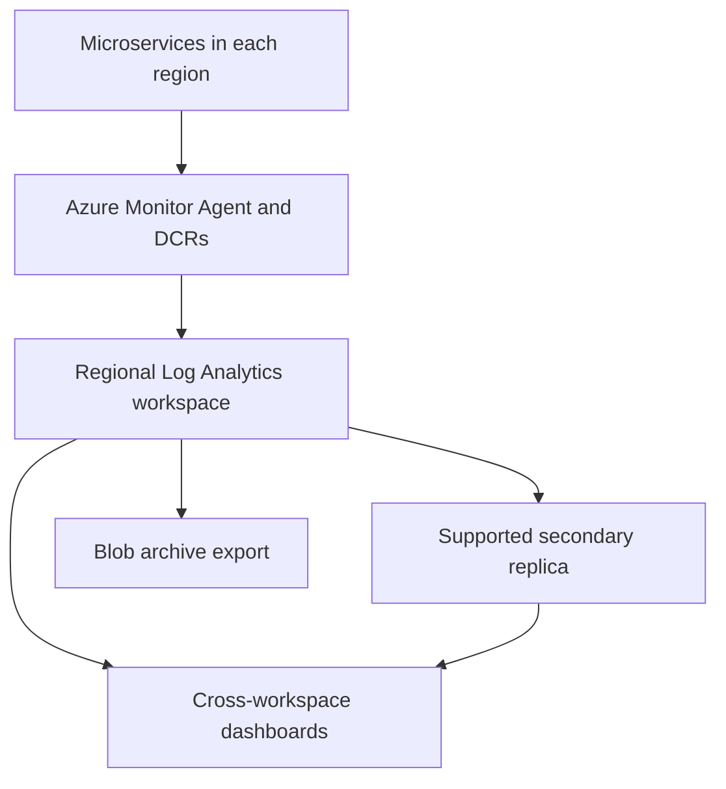

Below are answers for all three rounds. Adapt the project and experience examples to your actual work. The Java examples use Java 21; Spring Boot version differences are called out where relevant.

**Round 1**

**1. Explain the project you are currently working on.**

Structure your answer around **business purpose, architecture, responsibilities, and results**.

An example to adapt:

> “The project is an order-processing platform with services for orders, payments, inventory, and shipping. We use Spring Boot for REST APIs and business logic, relational databases for transactional data, and messaging for asynchronous workflows.
>
> Applications run as containers on AWS. Our pipeline builds the application, runs tests and security checks, publishes an image, and deploys the same tested artifact across environments. Okta handles user authentication, while individual services enforce authorization.
>
> My responsibilities include [the services or platform components you own], implementation, automated testing, deployment support, and production troubleshooting.”

Be ready to explain:

- One complete request flow.
- Which decisions you personally made.
- How you handle failures and data consistency.
- Actual traffic, availability targets, and improvements, where known.

Avoid listing technologies without explaining their purpose.

---

**2. What Spring Boot starters have you used?**

A starter supplies a coordinated set of dependencies for a capability. Spring Boot then uses the available libraries and configuration to configure components.

Common examples:

| Capability | Dependencies |
|---|---|
| REST APIs using Spring MVC | Boot 3: `spring-boot-starter-web`; Boot 4: `spring-boot-starter-webmvc` |
| JPA/Hibernate persistence | `spring-boot-starter-data-jpa` |
| JDBC access | `spring-boot-starter-jdbc` |
| Request validation | `spring-boot-starter-validation` |
| Authentication and authorization | `spring-boot-starter-security` |
| OAuth resource server | Boot 3: `spring-boot-starter-oauth2-resource-server`; Boot 4: `spring-boot-starter-security-oauth2-resource-server` |
| Health and operational endpoints | `spring-boot-starter-actuator` |
| Testing | `spring-boot-starter-test` |
| Kafka | Boot 3 commonly uses `spring-kafka`; Boot 4 provides `spring-boot-starter-kafka` |

These names are version-sensitive: current Spring Boot documentation deprecates some older starter names in favor of the more specific names above. :chatgpt-content-reference{index="0"}

Explain which starters your application actually uses and why. For example, JPA simplifies persistence, but you still need to understand generated SQL, transactions, connection pools, and query performance.

---

**3. How have you implemented transaction management?**

For operations within one database, I would usually put the transaction boundary at the **service layer**.

```java
@Service
public class OrderService {

    // Constructor-injected repositories omitted.

    @Transactional(rollbackFor = Exception.class)
    public void placeOrder(Order order) throws BusinessException {
        inventoryRepository.reserve(
            order.getProductId(),
            order.getQuantity()
        );

        orderRepository.save(order);
    }
}
```

Assume both repositories participate in the same database transaction. If saving the order fails, the stock reservation should roll back.

Important details:

- Default propagation is `REQUIRED`: join an existing transaction or create one.
- Without customized rollback rules, Spring rolls back for `RuntimeException` and `Error`, but not ordinarily for checked exceptions.
- `rollbackFor` lets you specify checked exceptions that should trigger rollback.
- An exception must reach the transaction interceptor, or the transaction must otherwise be marked rollback-only. Catching and suppressing an exception can allow a commit. :chatgpt-content-reference{index="1"}

Common mistakes:

- Calling an annotated method from another method in the same object. Default proxy-based interception does not apply to this self-invocation. :chatgpt-content-reference{index="2"}
- Assuming a transaction automatically propagates into newly created threads.
- Holding a database transaction open during a slow remote API call.
- Assuming `readOnly = true` is a universal database-enforced prohibition on writes. :chatgpt-content-reference{index="3"}

For concurrent updates, also consider database constraints, isolation, and optimistic or pessimistic locking.

---

**4. How do you connect to two databases and ensure rollback during exceptions?**

There are two separate problems: **configuring connections** and **coordinating transactions**.

For two databases, configure:

| Component | Orders database | Payments database |
|---|---|---|
| Connection pool | `ordersDataSource` | `paymentsDataSource` |
| JDBC access | Orders `JdbcTemplate` | Payments `JdbcTemplate` |
| JPA alternative | Orders `EntityManagerFactory` | Payments `EntityManagerFactory` |
| Local transaction manager | `ordersTxManager` | `paymentsTxManager` |

With JPA, explicitly associate each repository package with its entity-manager factory and transaction manager. Use qualifiers to avoid ambiguous injection. Spring Boot documents explicit configuration for multiple data sources. :chatgpt-content-reference{index="4"}

A local transaction can select its manager:

```java
@Transactional(
    transactionManager = "ordersTxManager",
    rollbackFor = Exception.class
)
public void updateOrder(Order order) {
    orderRepository.save(order);
}
```

**This annotation does not automatically include the payments database.**

Suppose:

1. Database A commits.
2. Database B fails.

Two independent local transaction managers cannot undo A’s completed commit.

Choose the consistency model deliberately:

- **Both databases must commit atomically:** Consider XA-capable resources and a JTA transaction coordinator. This requires correct resource enlistment, recovery configuration, and support from both databases.
- **Independent microservices:** Use local transactions with a saga, durable messaging, and compensating operations.
- **Closely related data:** Consider whether the operation should live within one database transaction.

Spring supports JTA-based distributed transactions, including integration with XA resources. Simply declaring two local transaction managers is insufficient. :chatgpt-content-reference{index="5"}

Verify rollback through integration tests that deliberately fail the second operation and inspect both databases afterward.

---

**5. How are you managing code coverage?**

A common Java setup is:

- **JUnit:** Test execution.
- **Mockito:** Isolating collaborators in unit tests.
- **Testcontainers:** Integration tests with real database or broker containers.
- **JaCoCo:** Measuring executed code.
- **SonarQube:** Importing coverage reports and enforcing quality gates.

In Maven, configure JaCoCo’s agent, report generation, and optional coverage checks. The pipeline runs:

```bash
mvn clean verify
```

SonarQube imports the generated JaCoCo XML report; SonarQube does not itself execute the tests or generate the underlying coverage data. :chatgpt-content-reference{index="6"}

Focus on:

- Line and branch coverage.
- Coverage of changed code.
- Error paths, authorization failures, rollback, and retry exhaustion.
- Integration behavior across real boundaries.

An example threshold might be 80% coverage on new code, but the team should agree on the target. High coverage does not prove that assertions are meaningful or that the application is correct.

---

**6. How do you perform load testing?**

Start with the workload and performance objectives:

- Expected requests per second.
- User journeys and request mix.
- Peak load and burst behavior.
- Acceptable latency and error rates.
- Realistic data size and downstream behavior.

Use tools such as **k6, JMeter, or Gatling**.

Run different tests:

| Test | Purpose |
|---|---|
| Baseline/load | Validate normal and expected peak traffic |
| Stress | Find capacity limits and failure behavior |
| Spike | Check sudden traffic increases |
| Soak | Detect leaks and degradation over time |

These test types answer different performance questions. :chatgpt-content-reference{index="7"}

Monitor application latency—especially p95/p99—throughput, errors, CPU, heap, GC, connection-pool waits, database latency, and queue lag.

For example, rising latency with low CPU but a saturated database pool suggests connection contention rather than insufficient application CPU.

Use a representative test environment and payment-provider sandboxes or controlled substitutes. Also distinguish **virtual users** from **requests per second**; they are not interchangeable.

---

**7. How have you implemented security?**

Explain security at several layers:

- **Identity:** Okta authenticates users; services validate access tokens.
- **Authorization:** Enforce scopes/roles and object-level ownership checks.
- **Application:** Validate inputs, use parameterized database access, restrict uploads, and avoid sensitive data in logs.
- **Network:** TLS, restricted ingress/egress, private database access, and appropriate service-to-service authentication.
- **Cloud:** Least-privilege IAM roles, managed secrets, encryption, and audit trails.
- **Delivery:** Dependency scanning, secret scanning, image scanning, and controlled production deployment.

For example, possession of `orders.read` should not allow a customer to read every customer’s orders. The service must also check ownership or the appropriate business entitlement.

Separate **authentication—who is calling—from authorization—what that caller may do**. Spring Security resource-server support validates tokens, while application rules determine permitted operations. :chatgpt-content-reference{index="8"}

---

**8. Explain Okta integration for identity and access management.**

Okta can act as the identity provider and authorization server.

For a user-facing application:

1. Register the application and redirect URIs in Okta.
2. Configure the appropriate authorization server, scopes, audience, and access policies.
3. Use Authorization Code flow, with PKCE where appropriate.
4. The client obtains tokens.
5. It sends an **access token** to the API.
6. The API validates that token and enforces authorization.

An **ID token** describes the authenticated user to the client. It should not be substituted for an API access token. :chatgpt-content-reference{index="9"}

A Spring resource-server configuration can use:

```yaml
spring:
  security:
    oauth2:
      resourceserver:
        jwt:
          issuer-uri: ${OKTA_ISSUER}
          audiences: api://orders
```

The issuer must be the authorization server configured for your API. Validate:

- Signature and trusted signing keys.
- Issuer.
- Audience.
- Expiry and other applicable time claims.
- Required scopes or mapped authorities.

Spring Security supports issuer-based configuration and audience validation. :chatgpt-content-reference{index="10"}

For method-level authorization, enable method security and apply a rule:

```java
@PreAuthorize("hasAuthority('SCOPE_orders.read')")
public Order getOrder(Long orderId) {
    // Also verify the caller's entitlement to this order.
    return orderService.findAuthorizedOrder(orderId);
}
```

For machine-to-machine access, use an appropriate service application and client-credentials flow. Keep client credentials out of browser code and source control.

---

**9. How do you secure internal communication between microservices?**

A private network alone is insufficient.

Use:

1. **TLS** to protect traffic in transit.
2. **Workload authentication**, such as mTLS or service access tokens.
3. **Authorization policies** specifying which service may call which operation.
4. **Network restrictions**, such as security groups and Kubernetes NetworkPolicies.
5. **Short-lived credentials and automatic rotation.**
6. **Audit and trace correlation** without logging secrets.

A service mesh such as Istio can provide workload identity, certificate management, mTLS, and authorization policies. :chatgpt-content-reference{index="11"}

Example: the order service may call the payment service’s authorization operation, while the reporting service may only read approved payment summaries.

mTLS authenticates communicating workloads; it does not automatically establish every business permission.

---

**10. How do you implement retries for a failed API call?**

Retry **transient failures**, using:

- A small attempt limit.
- Exponential backoff and jitter.
- Per-attempt timeouts and an overall deadline.
- Idempotency for operations with side effects.
- Metrics for attempts, exhaustion, and downstream failures.

Do not blindly retry validation errors or authentication failures. For throttling, respect `Retry-After` where applicable.

**Spring Framework 7 / Spring Boot 4 example:**

```java
@Configuration
@EnableResilientMethods
class ResilienceConfig {
}
```

On a method in a Spring-managed bean:

```java
@Retryable(
    includes = TransientApiException.class,
    maxRetries = 2,
    delay = 200,
    jitter = 100,
    multiplier = 2,
    maxDelay = 1000
)
public StockResponse getStock(String sku) {
    return inventoryClient.getStock(sku);
}
```

These annotations are from `org.springframework.resilience.annotation`. Here, two retries mean **at most three total attempts**. Configure the HTTP client to classify retryable failures and enforce timeouts. :chatgpt-content-reference{index="12"}

For Boot 3 projects, use a compatible Resilience4j or existing Spring Retry configuration; annotation names and attempt-count semantics differ.

For payments, a timeout can mean “payment succeeded but the response was lost.” Reuse the same idempotency key or reconcile status before attempting another charge.

---

**11. How do you implement blue-green deployment?**

Maintain two application versions:

- **Blue:** Currently serving production.
- **Green:** New version undergoing validation.

A typical AWS container deployment:

1. Build and publish an immutable image.
2. Deploy green with sufficient capacity.
3. Run health checks, smoke tests, and dependency checks.
4. Switch production traffic to green.
5. Monitor errors, latency, and business success.
6. Keep blue available during a defined observation period.
7. Roll traffic back if necessary.

Amazon ECS supports native blue-green deployments, including validation before traffic shifting and a bake period with both revisions running. Existing CodeDeploy-based deployments are another supported implementation. :chatgpt-content-reference{index="13"}

The difficult part is often **database compatibility**:

- Use expand-and-contract schema changes.
- Keep both application versions compatible during transition.
- Do not assume switching traffic back reverses database changes.
- Coordinate background consumers separately to avoid unintended duplicate side effects.

---

**12. How do you deploy an application to AWS?**

For an illustrative Spring Boot application on **ECS Fargate**:

1. Provision networking, IAM roles, ECR, ECS, load balancing, and databases through infrastructure as code.
2. Run tests, quality checks, and security scans.
3. Build and push the image to ECR.
4. Register a task-definition revision with the image digest, resources, logging, and configuration.
5. Deploy that revision through an ECS service.
6. Validate health and monitor the rollout.

Typical supporting services:

- **ALB:** Application traffic.
- **RDS/Aurora:** Relational data.
- **Secrets Manager:** Application credentials.
- **CloudWatch:** Logs, metrics, and alarms.
- **Route 53 and ACM:** DNS and certificates.

Separate the **task execution role**, used for supported startup operations such as image pulls, from the **task role**, used by application code to access AWS services. ECS manages task placement and service operation. :chatgpt-content-reference{index="14"}

On EKS, the deployment objects instead include Deployments, Services, workload identities, and an appropriate ingress implementation.

---

**13. What is serverless in AWS, and how are you using it?**

Serverless means the provider manages the underlying server infrastructure and execution capacity. You still manage application behavior, permissions, configuration, and reliability.

A sample use case:

> “An S3 upload triggers a Lambda function that validates the file and submits processing work. Results are stored durably, and failures are retried or routed for investigation.”

Other examples include scheduled reconciliation, notifications, event processing, and APIs.

Lambda is event-driven compute without managing application servers. Serverless architecture can also use services such as API Gateway, SQS, EventBridge, and DynamoDB. :chatgpt-content-reference{index="15"}

Choose it based on workload duration, latency, concurrency, integration, and cost—not simply because it eliminates server administration.

---

**14. Payment succeeds, but order or shipping fails. What do you do?**

Treat this as a **distributed workflow**, not a local database rollback.

A robust design is:

1. **Persist an order intent before charging.**  
   Create a durable order or workflow record with a unique operation ID.

2. **Make payment requests idempotent.**  
   Repeated requests for the same logical charge use the same idempotency key.

3. **Persist confirmed payment status.**  
   Update local state and write a `PaymentConfirmed` outbox event in one database transaction.

4. **Deliver the event reliably.**  
   An outbox publisher or CDC process sends it to the broker. Consumers handle duplicate delivery safely.

5. **Retry temporary downstream failures.**  
   Shipping unavailability should ordinarily leave the workflow pending and retriable, rather than immediately triggering another charge or refund.

6. **Compensate permanent failures.**  
   If the order cannot be fulfilled, follow business policy to cancel and initiate a refund. Persist states such as `REFUND_PENDING` until completion is confirmed.

A saga coordinates these local transactions and compensating actions. Compensation is a new business operation; it does not erase the original transaction. :chatgpt-content-reference{index="16"}

**Critical failure window:** Payment can succeed externally while your local payment-status write fails. An outbox alone cannot close that gap. Use durable provider callbacks, status queries, and reconciliation keyed by the operation ID.

The outbox specifically addresses the database-write/event-publication problem. Delivery can still be duplicated, so consumers need idempotency—for example, recording a processed event ID in the same transaction as their business update. :chatgpt-content-reference{index="17"}

---

**15. Find duplicate colors and their counts using streams.**

For a non-null list of non-null color names:

```java
import java.util.*;
import java.util.function.Function;
import java.util.stream.Collectors;

List<String> colors = List.of(
    "Red", "Blue", "Red", "Green", "Blue", "Red"
);

Map<String, Long> counts = colors.stream()
    .collect(Collectors.groupingBy(
        Function.identity(),
        LinkedHashMap::new,
        Collectors.counting()
    ));

Map<String, Long> duplicates = counts.entrySet().stream()
    .filter(entry -> entry.getValue() > 1)
    .collect(Collectors.toMap(
        Map.Entry::getKey,
        Map.Entry::getValue,
        (first, second) -> first,
        LinkedHashMap::new
    ));

System.out.println(counts);
System.out.println(duplicates);
```

Output:

```text
{Red=3, Blue=2, Green=1}
{Red=3, Blue=2}
```

`groupingBy` groups equal colors, while `counting()` produces a `Long` count. `LinkedHashMap` preserves first-seen order. :chatgpt-content-reference{index="18"}

This comparison is case-sensitive. Normalize values first if `"Red"` and `"red"` should be treated as the same color.

---

**16. Remove duplicate colors and return a unique list.**

```java
List<String> uniqueColors = colors.stream()
    .distinct()
    .toList();

System.out.println(uniqueColors);
```

Output:

```text
[Red, Blue, Green]
```

For an ordered stream, `distinct()` preserves encounter order. Equality is determined through `equals()`.

In Java 21, `Stream.toList()` returns an unmodifiable list. If mutation is required:

```java
List<String> mutableUniqueColors = colors.stream()
    .distinct()
    .collect(Collectors.toCollection(ArrayList::new));
```

For custom objects, implement equality consistently with the intended definition of a duplicate. :chatgpt-content-reference{index="19"}

---

**17. Use two candles to measure 45 minutes without cutting or measuring.**

The standard puzzle requires these assumptions:

- Each candle—or, more commonly, rope—takes exactly **60 minutes** to burn from one end.
- Burning can be uneven.
- You can light both ends.

Procedure:

1. At the start, light candle A at **both ends** and candle B at **one end**.
2. A finishes after **30 minutes**.
3. Immediately light the other end of B.
4. B has 30 minutes of one-ended burn time remaining. Burning the remainder from both ends takes **15 minutes**.

Elapsed time: **30 + 15 = 45 minutes**.

Without the known one-hour burn duration and the ability to burn from both ends, the question does not contain enough information. The reasoning uses the idealized puzzle model; ordinary physical candles may not behave that way.

---

**Round 2**

**1. How are you provisioning AWS services?**

A typical approach is Terraform or CloudFormation/CDK, executed through a controlled pipeline.

With Terraform:

```bash
terraform fmt -check
terraform init
terraform validate
terraform plan -out=tfplan

# Apply the reviewed plan.
terraform apply tfplan
```

Use:

- Reusable modules for networking, compute, databases, and IAM.
- Separate environment configuration and appropriately isolated state.
- Remote state with restricted access and locking.
- Pull-request review and production approval.
- Short-lived pipeline credentials.
- Scheduled drift detection.

For an S3 backend, current Terraform supports native locking through `use_lockfile = true`; DynamoDB-based locking is deprecated. :chatgpt-content-reference{index="20"}

Explain which resources you provisioned personally and how you handled changes, rollback limitations, and drift.

---

**2. How do you provision container-based services for microservices?**

For ECS, provision:

- ECR repositories.
- An ECS cluster.
- Fargate configuration or EC2 capacity.
- A task definition per workload.
- ECS services for long-running workloads.
- Load-balancer listeners and target groups.
- IAM task and execution roles.
- Security groups, logs, secrets, and scaling policies.

For EKS, provision:

- An EKS cluster and suitable compute.
- Networking and required add-ons.
- Workload IAM access.
- Registry access.
- Kubernetes Deployments, Services, configuration, and scaling resources.

ECS uses task definitions and services; EKS exposes Kubernetes APIs and workload resources. :chatgpt-content-reference{index="21"}

Build the image once and promote its digest. Keep application deployment changes separate from unrelated foundational infrastructure changes when that improves review and recovery.

---

**3. What database services did you provision with the application?**

Answer based on actual requirements. A sample architecture could include:

| Requirement | Service |
|---|---|
| Orders, payments, relational constraints | RDS PostgreSQL/MySQL or Aurora |
| Key-based access at large scale | DynamoDB |
| Caching or short-lived derived data | ElastiCache |
| Object/file storage | S3 |

RDS manages common relational database administration capabilities; ElastiCache provides managed in-memory data-store options. :chatgpt-content-reference{index="22"}

Explain the associated configuration:

- Private connectivity and restricted access.
- Backups and point-in-time recovery.
- Encryption and credential rotation.
- Monitoring and connection limits.
- Availability configuration.
- Schema migration tooling.

Distinguish **availability from read scaling**. A traditional RDS Multi-AZ DB-instance standby is not a read replica. RDS Multi-AZ DB clusters have different reader capabilities, so name the deployment type precisely. :chatgpt-content-reference{index="23"}

---

**4. What is the primary difference between ECS and EKS?**

| Aspect | ECS | EKS |
|---|---|---|
| Orchestration | AWS-native container orchestration | Managed Kubernetes |
| Workload definitions | Task definitions and services | Pods, Deployments, Services, and other Kubernetes objects |
| Ecosystem | AWS-focused integration | Kubernetes tools and APIs |
| Operational knowledge | ECS concepts | Kubernetes plus AWS integration |
| Compute | EC2 or Fargate | Supported EC2-based options and Fargate |

The main distinction is the **orchestration model**, not whether containers or serverless compute are supported.

Choose ECS when its AWS-native capabilities meet the requirements with less platform complexity. Choose EKS when Kubernetes APIs, ecosystem, or organizational standards are required. :chatgpt-content-reference{index="24"}

Fargate is a compute option; it is not a replacement name for either orchestrator.

---

**5. Where do you define autoscaling parameters?**

It depends on what is being scaled:

| Target | Configuration location |
|---|---|
| ECS task count | Application Auto Scaling target and policy |
| EC2 fleet | Auto Scaling Group and scaling policies |
| Kubernetes replicas | HPA resource |
| Kubernetes node capacity | The chosen node-autoscaling system |
| Lambda concurrency | Function concurrency and event-source settings; provisioned-concurrency scaling where used |

For ECS, define minimum/maximum capacity and policies such as target tracking using CPU, memory, or a suitable workload metric. :chatgpt-content-reference{index="25"}

Store these settings in infrastructure or deployment code.

Also define:

- Scaling responsiveness and stabilization.
- Safe downstream limits.
- Queue backlog or request-based metrics where CPU is misleading.
- Capacity required during deployments.

Increasing application replicas does not automatically increase database capacity.

---

**6. What do you know about serverless architecture?**

Serverless architecture combines managed execution and managed services, often around events.

Key design characteristics:

- Stateless or externally persisted execution state.
- Automatic capacity management within service limits.
- Event triggers and asynchronous processing.
- Fine-grained permissions.
- Explicit retry and duplicate-handling behavior.
- Managed operational interfaces.

For example, API Gateway can invoke Lambda, which writes data and publishes work to a queue. A separate consumer processes that work.

Trade-offs include cold starts, concurrency limits, execution constraints, distributed debugging, and workload-dependent cost. Serverless does not eliminate architecture, security, or operational responsibility. :chatgpt-content-reference{index="26"}

---

**7. How do you optimize Lambda cold starts?**

First measure initialization latency and its contribution to user-visible latency.

Then consider:

1. **Reduce initialization work:** Avoid loading unnecessary frameworks and dependencies.
2. **Reuse suitable clients:** Initialize reusable SDK clients outside the handler.
3. **Tune memory:** More memory can provide additional CPU; benchmark latency and cost.
4. **Use provisioned concurrency:** Maintain initialized environments for latency-sensitive traffic.
5. **Use SnapStart where supported:** Restore initialized state from snapshots.
6. **Review initialization correctness:** Refresh stale connections, credentials, or other snapshot-sensitive state.

AWS recommends execution-environment reuse and appropriate memory tuning. :chatgpt-content-reference{index="27"}

Important distinctions:

- **Reserved concurrency does not pre-warm environments.**
- Provisioned concurrency has additional cost and must be applied to the version/alias receiving traffic.
- Traffic exceeding provisioned capacity can still use on-demand environments. :chatgpt-content-reference{index="28"}
- SnapStart operates on published versions and has runtime/configuration restrictions. It cannot be combined with provisioned concurrency on the same function configuration. :chatgpt-content-reference{index="29"}

Periodic “keep warm” requests do not guarantee sufficient warm capacity during a burst.

---

**8. What is serverless deployment in AWS?**

It means deploying the application code **and its managed infrastructure configuration**, without provisioning application servers.

Using AWS SAM:

1. Define functions, APIs, events, permissions, and configuration.
2. Build the artifacts.
3. Test.
4. Package and deploy through CloudFormation.
5. Validate and monitor the release.

Typical commands:

```bash
sam validate
sam build
sam deploy --guided
```

For CI/CD, use saved configuration and an appropriately scoped deployment role instead of interactive configuration.

SAM provides an infrastructure template model and tools for building and deploying serverless applications. :chatgpt-content-reference{index="30"}

Lambda artifacts can be deployment archives or supported container images. Using a container image for Lambda still follows Lambda’s execution model; it does not create an ECS service.

---

**9. What is HPA?**

The **Horizontal Pod Autoscaler** changes a workload’s replica count based on observed metrics.

```yaml
apiVersion: autoscaling/v2
kind: HorizontalPodAutoscaler
metadata:
  name: orders
spec:
  scaleTargetRef:
    apiVersion: apps/v1
    kind: Deployment
    name: orders
  minReplicas: 2
  maxReplicas: 10
  metrics:
    - type: Resource
      resource:
        name: cpu
        target:
          type: Utilization
          averageUtilization: 70
```

Here, CPU utilization is measured relative to configured CPU requests. For a container requesting `500m`, 70% corresponds to approximately `350m` CPU usage.

HPA needs the relevant metrics provider. Resource-based scaling commonly uses Metrics Server; custom/external metrics require suitable adapters. :chatgpt-content-reference{index="31"}

HPA scales replicas, not per-Pod CPU or node count. If the cluster has insufficient capacity, additional Pods can remain pending until node capacity becomes available.

---

**10. What are Regions and Availability Zones?**

- An **AWS Region** is a geographic area containing multiple Availability Zones.
- An **Availability Zone** consists of one or more discrete data centers with independent infrastructure and redundant connectivity.

Availability Zones within a Region are connected through low-latency networking. :chatgpt-content-reference{index="32"}

Use multiple AZs to tolerate an AZ-level failure. Use multiple Regions when requirements justify geographic disaster recovery, global access, or other regional separation.

A multi-AZ deployment does not automatically protect against every Region-wide failure.

---

**11. How do you monitor microservice health?**

Monitor both technical behavior and business outcomes.

| Area | Examples |
|---|---|
| Traffic | Requests per second, queue arrival rate |
| Errors | HTTP failures, failed messages, exceptions |
| Latency | p50/p95/p99 response time |
| Saturation | CPU, heap, threads, connection-pool waits |
| Dependencies | Database latency, broker lag, downstream failures |
| Business | Payment success, completed orders, stuck workflows |

A typical stack combines:

- Actuator and Micrometer for application telemetry.
- Prometheus or CloudWatch for metrics.
- Grafana or CloudWatch dashboards.
- Centralized logs.
- Distributed tracing with propagated trace context.

Spring Boot integrates with Micrometer and supported monitoring registries. :chatgpt-content-reference{index="33"}

Separate liveness from readiness. A temporary database outage should not automatically cause every application instance to restart.

---

**12. How do you enable Spring Boot Actuator?**

Add:

```xml
<dependency>
    <groupId>org.springframework.boot</groupId>
    <artifactId>spring-boot-starter-actuator</artifactId>
</dependency>
```

Configure selected endpoints:

```yaml
management:
  endpoints:
    web:
      exposure:
        include: health,info,prometheus
  endpoint:
    health:
      show-details: never
      probes:
        enabled: true
```

For Prometheus output, also add `micrometer-registry-prometheus`.

Endpoints include:

```text
/actuator/health
/actuator/health/liveness
/actuator/health/readiness
/actuator/prometheus
```

Expose only what is needed and restrict operational access. :chatgpt-content-reference{index="34"}

---

**13. Are Actuator endpoints accessible without authentication?**

**It depends on exposure and security configuration.**

- By default, only health is exposed over HTTP.
- With Spring Security present and no custom security filter chain, Boot secures Actuator endpoints other than health.
- Defining a custom `SecurityFilterChain` makes you responsible for the applicable access rules.
- Without an authentication configuration, exposing an endpoint does not automatically secure it. :chatgpt-content-reference{index="35"}

A production approach is to allow minimal health status where required, authenticate operational endpoints, and restrict their network reachability.

Do not expose detailed health information, environment data, or heap dumps publicly.

---

**14. Have you worked with Kafka or another messaging service?**

Use your actual experience. An example answer could cover:

> “We used messaging to decouple order processing from notifications and fulfillment. Producers published events, and independently deployed consumers processed them. We monitored lag, handled poison messages, and made consumers idempotent.”

For Kafka, be prepared to explain:

- Topics and partitions.
- Message keys and ordering within a partition.
- Consumer groups and partition assignment.
- Offset management and rebalancing.
- Retry topics or dead-letter handling.
- Serialization and schema evolution.
- Producer and consumer security.

Spring provides Kafka integration, including producer templates and listener support. :chatgpt-content-reference{index="36"}

Avoid claiming end-to-end exactly-once behavior merely because Kafka transactions are enabled. External databases, payment providers, and other side effects require their own consistency strategy.

---

**15. What serialization/deserialization frameworks have you used?**

| Format/tool | Typical purpose |
|---|---|
| Jackson JSON | REST request/response mapping |
| Apache Avro | Schema-based messaging with evolution support |
| Protocol Buffers | Compact contracts, commonly with gRPC |
| Kafka serializers/deserializers | Convert application values to/from Kafka message bytes |

Serialization converts application data into a transferable representation. Deserialization reconstructs usable data from it.

Discuss:

- Backward/forward compatibility.
- Required fields and defaults.
- Unknown fields.
- Date/time and numeric precision.
- Payload size and performance.

For money, use an agreed decimal representation and currency information; avoid silently converting monetary amounts to binary floating-point.

---

**16. Where do you register an Avro schema?**

Typically in a **schema registry**, such as Confluent Schema Registry or AWS Glue Schema Registry.

A common process is:

1. Store the `.avsc` definition in version control.
2. Review schema changes.
3. Run compatibility checks in CI.
4. Register the approved schema.
5. Configure producers and consumers to use the registry.

In Confluent’s default topic-name strategy, a topic such as `orders` commonly uses subjects:

```text
orders-key
orders-value
```

A subject holds schema versions and compatibility rules. Messages serialized using the corresponding Confluent format identify the schema so consumers can retrieve the required definition. :chatgpt-content-reference{index="37"}

AWS Glue Schema Registry is an AWS-managed alternative, with its own integration and wire-format details. :chatgpt-content-reference{index="38"}

Do not confuse storing the schema file in Git with registering it for runtime serialization.

---

**17. Have you implemented concurrency APIs in Java?**

Examples include:

- `ExecutorService` for task execution.
- `CompletableFuture` for asynchronous composition.
- `ConcurrentHashMap` for concurrent map access.
- `AtomicInteger` and related classes for atomic operations.
- `Semaphore` for concurrency limits.
- Locks and synchronization for protected shared state.
- Java 21 virtual threads for suitable blocking I/O workloads.

A practical example is calling independent downstream services concurrently to reduce aggregate response time.

Important considerations:

- Bound concurrency to protect downstream services.
- Set deadlines and handle cancellation.
- Avoid blocking the common fork-join pool with uncontrolled I/O.
- Shut down application-owned executors appropriately.
- Propagate required tracing/security context.

CompletableFuture asynchronous methods use their configured executor, or commonly the default asynchronous execution facility when one is not supplied. :chatgpt-content-reference{index="39"}

A Spring thread-bound transaction does not automatically follow work into another thread.

---

**18. How do you combine responses from three APIs?**

If the calls are independent, run them concurrently and combine their results.

Assume the clients and an application-managed bounded executor are injected:

```java
public record Dashboard(
    Profile profile,
    List<Order> orders,
    Offers offers
) {}

public CompletableFuture<Dashboard> loadDashboard(String userId) {

    CompletableFuture<Profile> profile =
        CompletableFuture.supplyAsync(
            () -> profileClient.getProfile(userId),
            apiExecutor
        );

    CompletableFuture<List<Order>> orders =
        CompletableFuture.supplyAsync(
            () -> orderClient.getOrders(userId),
            apiExecutor
        );

    CompletableFuture<Offers> offers =
        CompletableFuture.supplyAsync(
            () -> offerClient.getOffers(userId),
            apiExecutor
        );

    return CompletableFuture.allOf(profile, orders, offers)
        .orTimeout(2, TimeUnit.SECONDS)
        .thenApply(ignored -> new Dashboard(
            profile.join(),
            orders.join(),
            offers.join()
        ));
}
```

`allOf` coordinates completion; it does not directly return the individual results. The `join()` calls inside `thenApply` read already-completed results after successful completion. :chatgpt-content-reference{index="40"}

Decide the failure contract:

- Fail the whole operation if every response is required.
- Return explicitly marked partial results if the business allows it.
- Use fallbacks only where they remain meaningful.

`orTimeout` does not necessarily terminate the underlying network calls. Configure HTTP-client timeouts and resource cleanup too.

---

**19. What is active-active?**

In active-active architecture, multiple deployments serve production traffic simultaneously.

For example:

- Region A serves some users.
- Region B serves others.
- Routing redistributes traffic when one deployment becomes unavailable.

Benefits include capacity utilization, geographic proximity, and reduced dependence on a single active site.

Challenges include:

- Cross-region data consistency.
- Write conflicts and duplicate processing.
- Routing and failure detection.
- Capacity to absorb a failed site’s traffic.
- Operational complexity.

Active-active application servers do not automatically imply that the database supports writes in every Region. Define the architecture separately for each layer. :chatgpt-content-reference{index="41"}

---

**20. How does active-passive differ from active-active?**

| Aspect | Active-active | Active-passive |
|---|---|---|
| Normal traffic | Multiple sites serve traffic | Primary serves traffic |
| Secondary environment | Already active | Standby, with varying readiness |
| Failover | Redistribute traffic and handle data routing | Promote/activate standby and redirect traffic |
| Data concerns | Concurrent access and possibly write conflicts | Replication lag, promotion, and split-brain prevention |
| Cost | Capacity active in multiple sites | Depends on cold, warm, or hot standby design |

Choose based on business recovery objectives:

- **RTO:** How long the service can take to recover.
- **RPO:** How much data loss is acceptable.

Neither pattern guarantees zero downtime or zero data loss. Test promotion, traffic redirection, failback, and database recovery. :chatgpt-content-reference{index="42"}

---

**21. Find all array pairs that sum to a target.**

Clarify whether the interviewer wants **unique value pairs** or **every matching index pair**.

This Java solution returns unique unordered value pairs and handles integer-overflow boundaries:

```java
import java.util.*;

public class PairFinder {

    public record Pair(int first, int second) {}

    public static List<Pair> findPairs(int[] numbers, int target) {
        Set<Integer> seen = new HashSet<>();
        Set<Pair> pairs = new LinkedHashSet<>();

        for (int number : numbers) {
            long complement = (long) target - number;

            if (complement >= Integer.MIN_VALUE
                    && complement <= Integer.MAX_VALUE) {

                int other = (int) complement;

                if (seen.contains(other)) {
                    pairs.add(new Pair(
                        Math.min(number, other),
                        Math.max(number, other)
                    ));
                }
            }

            seen.add(number);
        }

        return new ArrayList<>(pairs);
    }

    public static void main(String[] args) {
        int[] numbers = {1, 5, 7, -1, 5, 3, 3};

        System.out.println(findPairs(numbers, 6));
    }
}
```

Output:

```text
[Pair[first=1, second=5],
 Pair[first=-1, second=7],
 Pair[first=3, second=3]]
```

The lookup occurs before adding the current element, so one array position cannot pair with itself.

Average complexity is **O(n) time** and **O(n) auxiliary space**.

For every matching index pair, store previously seen indices per value. Output can be quadratic when many duplicates exist.

---

**Manager round**

**1. Can you share your previous experience?**

Give a concise progression rather than repeating your entire résumé.

Template:

> “I have [X] years of experience, including [Y] years focused on [relevant area]. In my previous role, I worked on [business domain] and owned [specific responsibilities]. I then moved into [expanded responsibility], where I worked on [relevant delivery or reliability work]. My strongest areas are [two or three strengths], supported by [a concrete example].”

Include your actual contribution, team interactions, and one measurable result if you have reliable numbers.

---

**2. Have you recently worked on a challenging task?**

Use **Situation, Task, Action, Result**, followed by what you learned.

A suitable example—if it reflects your experience—is diagnosing intermittent timeouts:

- **Situation:** Latency increased during peak traffic.
- **Task:** Restore service and identify the cause.
- **Action:** Correlate traces, pool metrics, database waits, and recent changes; apply a controlled mitigation; implement a lasting fix.
- **Result:** Describe the measured recovery and subsequent validation.
- **Learning:** Add prevention through capacity testing, limits, alerts, or design changes.

Be precise about what you did personally. Explain the evidence behind your decision and one alternative you considered.

---

**3. How do you handle pressure and multiple critical deadlines?**

A strong answer:

> “I first prioritize by customer impact, urgency, and dependencies. During an incident, I establish ownership and a communication rhythm, stabilize the service, and separate immediate mitigation from root-cause work. For competing delivery deadlines, I break work into milestones, identify what can run in parallel, and raise trade-offs early.
>
> If all deadlines cannot realistically be met, I propose a clear choice—scope reduction, sequencing, or additional help—rather than silently accepting an unachievable plan.”

Support this with an actual example showing how you communicated and protected delivery quality.

---

**4. What if a lead or teammate is technically weak or behaves poorly?**

Address the specific problem without labeling the person.

> “If there is a technical gap, I clarify expectations and offer pairing, examples, documentation, or review support. I use evidence and tests to discuss technical disagreements.
>
> If the issue is behavior, I raise specific examples privately and explain their impact. I agree on a constructive way of working. If the behavior continues or creates a serious delivery or workplace concern, I escalate through the appropriate manager with factual examples.”

Show that you can maintain respectful collaboration while setting boundaries and protecting team outcomes.

---

**5. What do you do in your free time or on weekends?**

Answer honestly and naturally. The interviewer is often assessing communication and personal interests, not expecting every weekend to involve technical study.

A template:

> “Outside work, I enjoy [genuine hobby or activity]. I also spend time on [another real interest]. When I explore technology, I usually choose a small topic or project that interests me, such as [something you actually did].”

Be ready for a follow-up about whichever activity you mention.

For senior-level interviews, explain **how you contain customer impact, isolate the failing layer, gather evidence, and validate recovery**. Avoid jumping directly to restarting Pods or increasing resources.

**1. An application on AKS randomly fails health checks. How do you debug it end-to-end?**

**First identify which health check is failing.** A kubelet probe, ingress-controller check, and Application Gateway backend probe can test different paths.

For Kubernetes probes:

- **Readiness failure:** Removes the Pod from normal Service traffic.
- **Liveness failure:** Can restart the container.
- **Startup probe:** Allows initialization to finish before readiness and liveness checks begin. :chatgpt-content-reference{index="0"}

Collect the timeline:

```bash
kubectl get pods -n payments -o wide

kubectl describe pod <pod> -n payments

kubectl logs <pod> -n payments -c app \
  --since=30m --timestamps

# Relevant if the container restarted:
kubectl logs <pod> -n payments -c app \
  --previous --timestamps

kubectl get events -n payments \
  --sort-by=.metadata.creationTimestamp

kubectl top pod -n payments --containers

kubectl get endpointslices -n payments \
  -l kubernetes.io/service-name=payments
```

Then investigate systematically:

1. **Probe configuration:** Correct path, port, protocol, timeout, thresholds, and startup allowance?
2. **Application behavior:** Does the endpoint block on database calls, thread-pool availability, or another service?
3. **Resources:** CPU throttling, GC pauses, OOM termination, connection exhaustion, or node pressure?
4. **Distribution:** Does failure follow one version, Pod, node, zone, or traffic level?
5. **Networking:** DNS, TLS/SNI, NetworkPolicy, NSGs, routing, and gateway backend health.
6. **Lifecycle:** Does failure occur during startup, termination, scaling, or deployment?

Compare direct Pod access with the actual ingress path. Application Gateway failures can result from backend connectivity, probe settings, certificate validation, or response behavior. :chatgpt-content-reference{index="1"}

A useful hypothesis might be: “Only Pods on one node fail probes during CPU contention.” Confirm that correlation before changing configuration.

**Do not make liveness depend on a shared database:** a database outage could otherwise cause every application container to restart.

---

**2. During a canary deployment, half the traffic returns 502. What do you do?**

**Stop promotion and reduce customer impact first.** If the canary is implicated, route traffic back to the verified stable version while preserving diagnostic evidence.

Next, determine **which proxy generated the 502**:

- Front Door?
- Application Gateway?
- An ingress controller?
- A service-mesh proxy?
- An application acting as a gateway?

Compare successful and failed requests by:

- Application version and image digest.
- Backend Pod/IP.
- Node and availability zone.
- Route, method, and payload.
- User/session affinity.
- Gateway instance and request timestamp.

Check:

```bash
kubectl get pods -n prod -l app=payments -o wide

kubectl get svc payments -n prod -o yaml

kubectl get endpointslices -n prod \
  -l kubernetes.io/service-name=payments

kubectl describe deployment payments-canary -n prod
```

Typical causes include:

- Canary listens on a different port.
- Service `targetPort` or selectors are incorrect.
- HTTP/HTTPS mismatch between proxy and backend.
- Backend TLS/SNI validation failure.
- Canary resets connections or crashes under traffic.
- Health checks pass, but real business requests fail.
- Different configuration or missing secrets.
- Connections reach terminating Pods before draining completes.

Application Gateway’s backend-health information helps separate unhealthy targets, connectivity problems, and TLS/probe errors. :chatgpt-content-reference{index="2"}

**Do not conclude that “50% failures means half the Pods are bad.”** Weighted routing, sticky sessions, persistent connections, and unequal request volume can produce different distributions. Replica counts alone do not provide precise canary traffic percentages. :chatgpt-content-reference{index="3"}

Validate the fix with representative traffic and version-specific error and latency metrics before resuming promotion.

---

**3. A pipeline takes 40 minutes for a small change. How would you optimize it?**

Measure the **critical path** before changing anything.

Separate:

- Agent queue time.
- Checkout and dependency downloads.
- Compilation.
- Tests.
- Image build.
- Security scans.
- Artifact transfer.
- Approval waiting.
- Deployment and readiness verification.

Then optimize the expensive stages:

| Bottleneck | Improvement |
|---|---|
| Waiting for agents | Right-size agent capacity or maintain an appropriate warm pool |
| Dependency downloads | Cache using OS, runtime version, and dependency-lock information |
| Repeated compilation | Build once and reuse the resulting artifact |
| Long test suite | Parallelize independent tests and investigate slow tests |
| Large Docker context | Use `.dockerignore`, effective layer ordering, and build caching |
| Every microservice rebuilt | Use dependency-aware change detection |
| Repeated environment builds | Promote the same image digest |
| Fixed sleeps | Wait for actual readiness or completion conditions |
| Slow artifact transfer | Improve registry proximity, artifact size, and network paths |

Azure Pipelines caching can reuse dependencies, but cache restoration and upload also have costs. Measure whether each cache actually saves time. :chatgpt-content-reference{index="4"}

For monorepos, changes to shared libraries or build tooling may require rebuilding multiple services.

**Keep required quality and approval gates.** Optimize execution and scheduling instead of hiding failures or skipping validation.

Compare median and p95 pipeline duration, cost per run, cache-hit rate, flaky-test frequency, and deployment failure rate after each improvement.

---

**4. One Pod has high CPU, but its logs look clean. What next?**

Logs do not explain CPU consumption by themselves. Start by checking whether the Pod is doing more work or doing the same work inefficiently.

```bash
kubectl top pod <pod> -n prod --containers

kubectl describe pod <pod> -n prod

kubectl get pod <pod> -n prod -o yaml
```

Compare the affected Pod with healthy peers:

- Requests per second.
- Request types and payload sizes.
- CPU requests, limits, and throttling.
- Heap and GC activity.
- Thread count and runnable threads.
- Image digest and configuration.
- Node CPU pressure.
- Queue partitions or consumer assignments.

Possible explanations:

- Sticky sessions or uneven load balancing.
- One expensive tenant or endpoint.
- A hot Kafka partition.
- A busy loop or excessive retries.
- Serialization, encryption, or compression overhead.
- Garbage collection.
- Background jobs.
- CPU limits restricting throughput.

**Profile the process.** For a Java application, where appropriate tooling and permissions are available:

```bash
jcmd <java-pid> JFR.start \
  name=cpu-investigation \
  settings=profile \
  duration=60s \
  filename=/tmp/cpu-investigation.jfr
```

Java Flight Recorder can provide evidence about execution hotspots, allocation, locking, and other runtime behavior. :chatgpt-content-reference{index="5"}

Use a bounded recording and assess overhead. If the image lacks tools, use an approved diagnostic approach.

Scale or increase resources when capacity is the issue; fix the code, traffic distribution, or retry behavior when those are the cause.

---

**5. Design highly available logging for 100+ microservices across three regions.**

For an Azure-centered platform, I would start with:

- Structured application logs.
- Azure Monitor Agent and Container Insights for AKS collection.
- Regional Log Analytics workspaces.
- Cross-workspace dashboards and queries.
- Supported cross-region workspace replication where required.
- Blob Storage export for longer retention.

A regional pattern would look like this:



**Collection and schema**

Standardize fields such as service, environment, region, version, timestamp, severity, trace ID, and request ID. Redact credentials and sensitive customer data before storage.

Workspace boundaries should reflect operational ownership, access, geography, and data requirements—not automatically one workspace per microservice. :chatgpt-content-reference{index="6"}

**Availability and recovery**

- Keep collection regional so another region’s outage does not stop local collection.
- Use supported in-region resilience.
- Configure workspace replication where its supported regions and table types meet requirements.
- Test ingestion and query switchover.
- Protect dashboards, alerts, DCRs, and other configuration through infrastructure as code.

Log Analytics workspace replication requires an explicitly triggered switchover. It replicates newly ingested logs after activation, and alert rules are not automatically replicated with the workspace. :chatgpt-content-reference{index="7"}

**Retention and operations**

Keep frequently queried logs searchable for an agreed period and export supported tables to storage for longer retention. Export is a separate data path that also needs monitoring. :chatgpt-content-reference{index="8"}

Alert on ingestion delay, missing service heartbeats, agent failures, export failures, and unexpected volume changes.

For business-critical audit records, use a durable application recording mechanism; container stdout alone cannot guarantee that a record survives a sudden node failure before collection.

---

**6. Internal users succeed, but external users get 403. How do you isolate it?**

A 403 means an HTTP component rejected the request. Determine **which component**, rather than immediately changing network rules.

Compare an internal and external request using the same:

- Hostname and path.
- HTTP method.
- User permissions.
- Headers and content type.
- Payload.
- Authentication method.

Investigate these differences:

| Layer | Possible cause |
|---|---|
| DNS | Internal and external users reach different endpoints |
| Front Door/WAF | IP, geo, bot, managed-rule, or custom-rule blocking |
| Gateway | Listener, routing, or access-policy differences |
| Identity | Token audience, scope, conditional access, or tenant mismatch |
| Application | Role, ownership, CSRF, or source-address checks |
| Browser | Preflight request denied or cookie/domain behavior |

For resource-specific Application Gateway logs:

```kusto
AGWAccessLogs
| where TimeGenerated > ago(30m)
| where HttpStatus == 403
| project TimeGenerated, TransactionId, ClientIp,
          RequestUri, HttpStatus, ServerStatus
```

Then investigate a matching transaction:

```kusto
AGWFirewallLogs
| where TransactionId == "<transaction-id>"
| project TimeGenerated, Action, RuleId, RequestUri
```

The access log distinguishes client-facing status from backend status; transaction IDs help correlate WAF decisions. :chatgpt-content-reference{index="9"}

If WAF is responsible, inspect all contributing matches. An anomaly-score blocking entry may be the final decision rather than the underlying false-positive rule. Apply a narrow, tested correction. :chatgpt-content-reference{index="10"}

Also remember that a gateway’s immediate client may be another proxy, not the original user.

---

**7. How do you ensure secure, dynamic secret rotation in Azure DevOps pipelines?**

Separate **pipeline authentication**, **secret retrieval**, and **credential rotation**.

**Pipeline authentication**

Use an Azure Resource Manager service connection with workload identity federation where supported. This removes the need for a long-lived Azure client secret in the pipeline. :chatgpt-content-reference{index="11"}

**Secret retrieval**

Store necessary secrets in Key Vault and fetch them shortly before use:

```yaml
steps:
- task: AzureKeyVault@2
  inputs:
    azureSubscription: 'prod-workload-identity'
    KeyVaultName: 'kv-prod-delivery'
    SecretsFilter: 'artifact-token'
    RunAsPreJob: false

- bash: ./ci/publish.sh
  env:
    ARTIFACT_TOKEN: $(artifact-token)
```

Use narrowly scoped access, authorize only the intended pipelines, and ensure the agent has network access to the vault. Do not print the value or write it into artifacts. :chatgpt-content-reference{index="12"}

**Rotation workflow**

1. Generate or obtain a new credential in the target system.
2. Store the new version in Key Vault.
3. Validate it.
4. Allow consumers to transition.
5. Revoke the old credential after the transition is verified.
6. Alert on failures and approaching expiry.

Where supported, dual credentials provide an overlap period. Azure documents automated rotation patterns using Key Vault, Event Grid, and Functions. :chatgpt-content-reference{index="13"}

Key details:

- Linked variable groups fetch current values at runtime; adding a new secret name still requires updating the mapping. :chatgpt-content-reference{index="14"}
- A running step does not automatically refresh a value already fetched.
- Runtime application secrets should preferably be retrieved through workload identity and an appropriate runtime integration.
- AKS secret volumes can update, but applications must reload them. Secrets injected as environment variables require Pod replacement or restart. :chatgpt-content-reference{index="15"}

---

**8. How would you use Application Gateway and WAF for a sensitive banking application?**

Use **Application Gateway WAF_v2** with a deliberately designed security and availability configuration.

**Traffic and availability**

- Zone-redundant deployment in a supported region.
- Appropriate minimum capacity and autoscaling limits.
- HTTPS listeners with correct host-based routing.
- Private backends with restricted origin access.
- Backend probes that reflect application readiness.
- Connection draining during releases.

For AKS, an integration such as AGIC can configure Application Gateway from Kubernetes resources. Define ownership clearly so Terraform and the controller do not continuously overwrite the same settings. :chatgpt-content-reference{index="16"}

**TLS**

Use certificates managed through Key Vault and validate backend certificates and hostnames. Application Gateway can terminate client TLS, inspect the request, and establish a separate TLS connection to the backend. :chatgpt-content-reference{index="17"}

**WAF policy**

- Use supported managed rules.
- Test legitimate banking workflows.
- Enforce prevention after tuning.
- Add appropriate custom access and rate-control rules.
- Use narrow exclusions for proven false positives.
- Send access and WAF logs to the monitoring platform.

WAF helps detect common web attacks, but business authorization, API authentication, secure application code, and appropriate DDoS controls remain necessary. :chatgpt-content-reference{index="18"}

Do not log tokens, account details, or sensitive request bodies unnecessarily.

Application Gateway is regional. Multi-region availability requires an additional global routing and recovery design.

---

**9. What causes intermittent DNS resolution during Azure deployment?**

Classify the symptom first:

- `NXDOMAIN`: Name does not exist from that resolver’s perspective.
- `SERVFAIL`: Resolver or upstream processing failure.
- Timeout: No response within the deadline.
- Wrong IP: Incorrect records, caching, or split-DNS behavior.

Common causes include:

- Private DNS zone not linked to the required VNet.
- Incorrect conditional forwarding between on-premises and Azure.
- Private-endpoint records missing or created in the wrong zone.
- Different DNS configurations across nodes or networks.
- Cached positive or negative responses.
- CoreDNS resource pressure.
- UDP/TCP port 53 blocked on part of the path.
- Upstream resolver failures or forwarding loops.
- Excessive search-domain queries.
- Deployment ordering that starts applications before DNS configuration is ready.

From an affected Pod or diagnostic Pod:

```bash
cat /etc/resolv.conf

dig api.example.com

dig +tcp api.example.com
```

Inspect CoreDNS:

```bash
kubectl get pods -n kube-system \
  -l k8s-app=kube-dns -o wide

kubectl logs -n kube-system \
  -l k8s-app=kube-dns --since=15m
```

Compare queries against the DNS Service, individual CoreDNS Pods, and the configured upstream resolver. Microsoft’s AKS troubleshooting guidance uses this separation to locate failures. :chatgpt-content-reference{index="19"}

For hybrid/private DNS, validate VNet links and forwarding paths explicitly. VNet peering alone does not establish every required private-DNS resolution path. :chatgpt-content-reference{index="20"}

Avoid making arbitrary DNS changes before identifying where responses diverge.

---

**10. An AKS application experiences 10-second delays every 15 minutes. How do you begin RCA?**

The periodicity is a clue, not a diagnosis.

**Establish the pattern:**

- Every 15 minutes by wall clock, or 15 minutes after startup?
- One endpoint, user, Pod, node, or all instances?
- Requests delayed or actually failing?
- Did infrastructure, data volume, configuration, or dependency behavior change?

“No code changes” does not mean nothing changed.

Correlate high-resolution traces and metrics around each occurrence:

| Potential cause | Evidence |
|---|---|
| Cache expiry and stampede | Dependency traffic rises when cache entries expire |
| Token/secret refresh | Blocking refresh calls or synchronized authentication requests |
| Scheduled job | CPU, database, or storage activity aligns with a schedule |
| Connection recycling | New connections and TLS handshakes spike |
| DNS timeout/retry | DNS spans or packet captures show repeated delays |
| Database maintenance | Locks, checkpoints, backup activity, or I/O waits |
| GC or memory pressure | Runtime pause events align with latency |
| Scaling/restarts | Kubernetes events align with the symptom |

A ten-second delay might represent two five-second timeouts, but verify that in traces or captures. AKS DNS troubleshooting documentation shows why delayed DNS responses can outlast client timeouts. :chatgpt-content-reference{index="21"}

Form one testable hypothesis and change one variable in a controlled environment. For example, stagger cache expirations and observe whether synchronized dependency spikes disappear.

Confirm recovery over several expected recurrence intervals.

---

**11. Jenkins jobs randomly fail during artifact upload. What layers do you check?**

First identify the exact operation: `archiveArtifacts`, `stash`, Maven publishing, a container push, or an upload to Blob/S3/Nexus/Artifactory.

Then isolate the layers:

| Layer | What to inspect |
|---|---|
| Artifact creation | File exists, correct path, complete output, checksum |
| Agent | Disk space, inode usage, memory, eviction, process termination |
| Credentials | Expiry, permissions, token refresh, clock skew |
| Network | DNS, proxy, TLS, packet loss, NAT/SNAT, connection timeout |
| Upload client/plugin | Compatibility, multipart behavior, retry handling |
| Repository | Quotas, storage capacity, throttling, backend errors |
| Naming/concurrency | Multiple jobs publishing the same immutable version |
| Jenkins controller | CPU, memory, I/O, plugin errors, connection loss |

Interpret the error:

- `401/403`: Authentication or authorization.
- `409`: Often a version or conflict issue.
- `413`: Request-size limit.
- `429`: Throttling.
- `5xx`: Repository or intermediary failure.
- Timeout/reset: Investigate the network and both endpoints.

For large `stash` operations, check controller compression and transfer costs. Jenkins recommends considering external artifact-management approaches for larger transfers. :chatgpt-content-reference{index="22"}

Use bounded retries only for transient failures. Before retrying, consider partial uploads and immutable-version semantics.

Verify success using artifact metadata or checksums, not merely the absence of an exception.

---

**12. How would you automate rollback in Kubernetes?**

Use two levels of validation:

1. **Deployment health:** Scheduling, image pulls, startup, readiness, and rollout progress.
2. **Business/service health:** Error rate, latency, transaction success, and dependency behavior.

A Kubernetes Deployment reports `ProgressDeadlineExceeded` when stalled; Kubernetes does not automatically roll it back. :chatgpt-content-reference{index="23"}

For progressive delivery, use a controller such as Argo Rollouts with a supported traffic-routing integration:

- Start with limited canary traffic.
- Require minimum traffic and observation time.
- Evaluate version-specific error and latency metrics.
- Stop promotion if telemetry is missing or inconclusive.
- Abort and restore stable traffic when failure criteria are met.
- Retain sufficient stable capacity for recovery.

Argo Rollouts supports metric-based analysis and explicit success/failure conditions. :chatgpt-content-reference{index="24"}

For an existing Helm release, Helm 4 can roll back a failed upgrade:

```bash
helm upgrade payments ./chart \
  --namespace prod \
  --rollback-on-failure \
  --timeout 10m
```

This enables readiness waiting, but does not independently validate payment success or other business outcomes. Helm 3 commonly uses `--atomic` for upgrade rollback behavior. :chatgpt-content-reference{index="25"}

Also ensure:

- Previous image digests remain available.
- Deployments are serialized appropriately.
- Database changes remain backward compatible.
- Release/Git state records the recovery.
- Rollback itself is monitored.

Restarting Pods is not a version rollback.

---

**13. Design a cost-optimized nightly reporting application with three years of logs.**

I would separate **execution**, **report storage**, and **log retention**.

**Execution**

A scheduled Azure Container Apps Job is a good candidate for a containerized nightly batch workload:

- Run only when scheduled.
- Set resource limits, execution timeout, and retry policy.
- Make processing idempotent.
- Prevent overlapping runs where necessary.
- Use managed identity for storage and database access.
- Checkpoint long-running work.

Scheduled Container Apps Jobs use UTC cron expressions, so translate the business schedule explicitly. :chatgpt-content-reference{index="26"}

Use Azure Batch instead if the workload needs substantial parallel compute. Reuse existing data sources where practical rather than creating a permanently running reporting database.

**Storage**

Store reports in Blob Storage, using compression and a format suited to retrieval. Separate customer reports from operational logs.

An illustrative retention policy:

| Age | Storage approach |
|---|---|
| Recent troubleshooting window | Searchable Log Analytics data |
| Recent raw logs | Blob hot or cool tier, according to access |
| Older rarely retrieved logs | Cold or archive tier |
| End of required retention | Controlled deletion, subject to applicable holds |

Blob lifecycle policies automate tier transitions. Archive retrieval takes additional time, and cool/cold/archive tiers have retention and retrieval-cost implications. :chatgpt-content-reference{index="27"}

Use immutable retention where required by the organization’s policy. Align deletion rules with that retention policy rather than assuming lifecycle deletion overrides immutability. :chatgpt-content-reference{index="28"}

Measure total cost: execution, database access, ingestion, storage operations, retrieval, networking, and persistent platform components. Compute scaling to zero does not make those other components free.

---

**14. How do you perform zero-downtime database migrations in a distributed application?**

Use **expand, migrate, switch, contract**.

1. **Expand the schema.**  
   Add compatible structures without removing fields required by existing application versions.

2. **Deploy compatible application code.**  
   Old and new versions must coexist during the release.

3. **Backfill data gradually.**  
   Use bounded batches, checkpoints, retries, and throttling. Monitor locks, I/O, and replication lag.

4. **Keep concurrent changes consistent.**  
   Use an appropriate transactional dual-write, CDC, or other synchronization approach.

5. **Validate correctness.**  
   Compare counts, constraints, business invariants, and relevant record-level results.

6. **Switch reads and writes.**  
   Use a controlled configuration change or feature flag.

7. **Contract later.**  
   Remove old structures only after the rollback window and after confirming no old consumers remain.

For PostgreSQL, `CREATE INDEX CONCURRENTLY` can reduce write blocking compared with a conventional index build, but it has restrictions and cannot run inside a transaction block. “Online” does not mean “no operational impact.” :chatgpt-content-reference{index="29"}

Run migrations through a controlled process with locking rather than allowing every application Pod to race to execute them.

In distributed systems, also preserve compatibility of events and API contracts.

**Rollback must be designed in advance:** switching application code back cannot restore a dropped column or reverse an incompatible data transformation.

---

**15. What is your DR approach for stateful containerized applications?**

Begin with business-defined **RTO and RPO** for each workload.

Protect four categories:

1. **Infrastructure:** Networking, clusters, identities, registries, and policies.
2. **Application configuration:** Manifests, charts, operators, and release versions.
3. **Persistent data:** Databases, volumes, queues, and object storage.
4. **Recovery dependencies:** Secrets, certificates, DNS, and external connectivity.

Use infrastructure as code and GitOps to recreate the platform. Use database-native backup, replication, or continuous-log recovery where required for short RPOs.

For AKS, Azure Backup can protect Kubernetes resources and supported persistent volumes. Support differs by storage type: current documentation supports Azure Files SMB volumes in the operational tier, while vault-tier protection is limited to supported Azure Disk volumes. :chatgpt-content-reference{index="30"}

Snapshot consistency matters. Crash-consistent volume snapshots are not automatically application-consistent database backups. Coordinate application hooks or database-native backup procedures as appropriate. :chatgpt-content-reference{index="31"}

A recovery runbook should:

- Rebuild or activate the target environment.
- Restore data and verify consistency.
- Reconnect identities and dependencies.
- Prevent the old primary from accepting conflicting writes.
- Validate business operations.
- Redirect traffic.
- Monitor recovery and plan failback.

For supported AKS vault backups, cross-region restore requires the appropriate geo-redundancy and restore configuration and uses the supported paired-region model. :chatgpt-content-reference{index="32"}

Test restores regularly and measure actual recovery time. A successful backup job does not prove a successful recovery.

---

**16. An Azure Function is being throttled. How do you detect and fix it?**

First identify **who is throttling**:

- API Management or another frontend.
- The Functions platform.
- Application-level rate limiting.
- A downstream dependency such as a database or external API.

Check whether the function was invoked for failed requests. Correlate request and dependency telemetry in Application Insights. Inspect status codes, retry headers, concurrency, duration, memory, CPU, instance count, and queue age. :chatgpt-content-reference{index="33"}

Then address the cause:

| Cause | Response |
|---|---|
| Insufficient function capacity | Review hosting plan, instance limits, quotas, and scaling behavior |
| Excessive per-instance concurrency | Tune concurrency according to trigger and plan |
| Downstream throttling | Reduce consumer concurrency, buffer work, or increase downstream capacity |
| Expensive function execution | Profile and optimize code |
| Bursty traffic | Use queues and controlled processing |
| Intentional API limit | Respect the contract; adjust only through an approved policy change |

Azure Functions dynamic concurrency is supported for specific triggers and extension versions; it is not a universal setting for every function. Its decisions are logged under `Host.Concurrency`. :chatgpt-content-reference{index="34"}

For retries, honor `Retry-After`, use backoff and jitter, and make processing idempotent.

Adding more function instances can worsen the incident if the downstream service is the bottleneck.

---

**17. Plan blue-green deployment with rollback on Azure using Terraform and pipelines.**

For an AKS application, define two independently addressable versions and a controlled traffic switch.

**Infrastructure ownership**

Terraform provisions the durable platform: AKS, networking, ACR, identities, Key Vault integration, ingress infrastructure, and monitoring.

The release system owns application versions and traffic-selection configuration. Avoid competing controllers managing the same fields.

**Pipeline plan**

| Stage | Action |
|---|---|
| Build | Test, scan, and publish an immutable image |
| Infrastructure | Review and apply any required Terraform changes |
| Database expansion | Apply backward-compatible changes |
| Deploy green | Start the new version without normal production traffic |
| Validate | Readiness, smoke tests, dependency checks, security checks |
| Approve | Apply the required production release controls |
| Promote | Switch the stable route or Service selection to green |
| Observe | Check technical and business metrics |
| Finalize | Retire blue after the agreed rollback window |

For example, the stable Service might select:

```yaml
selector:
  app: payments
  slot: blue
```

Promotion changes the selected slot to `green`. A separate preview Service allows validation before the switch.

If Application Gateway is involved, verify that the controller has updated backend configuration and that gateway health agrees with Kubernetes readiness. Routing changes and existing connection draining are not instantaneous. AGIC derives gateway configuration from Kubernetes resources. :chatgpt-content-reference{index="35"}

**Rollback**

- Restore the previous traffic selection.
- Retain blue at adequate capacity.
- Verify user-facing recovery.
- Record the rollback in the release source of truth.
- Keep database changes compatible.

Handle background workers separately so deploying green does not unintentionally activate duplicate side effects.

Do not restore an old Terraform state file to roll back an application release.

---

**18. How do you monitor end-to-end SLA for a payments pipeline?**

Start by defining the **customer-visible payment outcome**.

For example:

- When does the measurement start?
- What counts as success?
- Does completion mean authorization, capture, or settlement?
- What latency is acceptable?
- How are valid business declines classified?
- How are retries, duplicates, and late callbacks handled?

The SLA is the agreed commitment; operational SLOs and SLIs should measure whether that commitment is being met.

Instrument:

- A unique payment/operation ID.
- Trace context across HTTP and messaging boundaries.
- Durable payment-state transitions.
- Queue age and processing delay.
- Provider response time.
- Final outcomes and reconciliation results.

Do not treat an HTTP `202 Accepted` as proof that payment processing completed successfully.

Useful indicators include:

- Percentage of eligible payments reaching the required correct outcome.
- End-to-end completion latency.
- Payments stuck beyond a business deadline.
- Duplicate charges or inconsistent states.
- Error-budget consumption.

Use durable outcomes and appropriately designed metrics for exact accounting. Sampled traces are excellent for diagnosis but should not be the sole source of payment-success counts.

Alert using short and long observation windows so rapid incidents trigger promptly while slower degradation is still detected. Multiwindow burn-rate alerting is a documented SRE approach. :chatgpt-content-reference{index="36"}

Do not average component availability percentages and call the result the end-to-end SLA.

---

**19. How do scaling strategies differ for compute-intensive and I/O-intensive workloads?**

| Aspect | Compute-intensive | I/O-intensive |
|---|---|---|
| Typical bottleneck | CPU execution | Waiting for network, storage, or database |
| Useful signals | CPU utilization, throttling, throughput, job backlog | Queue age, in-flight requests, connection waits, dependency latency |
| Application approach | Parallelize suitable CPU work and optimize algorithms | Use asynchronous I/O and bounded concurrency |
| Capacity options | More replicas, larger CPU allocation, suitable compute profiles | More workers where dependencies can support them |
| Main risk | Oversubscription and CPU contention | Overwhelming databases or external services |

For AKS:

- CPU-based HPA can suit CPU-correlated workloads.
- Queue-based scaling through KEDA can suit asynchronous consumers.
- Node autoscaling must provide capacity for additional Pods.
- Requests must reflect realistic resource needs.

AKS supports KEDA for event-driven scaling. :chatgpt-content-reference{index="37"}

For Functions, select concurrency and scaling behavior according to the plan and trigger.

For an I/O bottleneck, more replicas may create more waiting connections and make performance worse. Use backpressure, connection reuse, caching where valid, and downstream capacity planning.

Queue-based load leveling helps absorb bursts while controlling the rate at which dependencies receive work. :chatgpt-content-reference{index="38"}

---

**20. Production deployment is blocked by approvals, and stakeholders are unreachable. What do you do?**

First determine whether this is a **routine release** or an **active production emergency**.

For a routine release:

- Keep deployment blocked.
- Contact designated alternate approvers and the escalation chain.
- Communicate the delay and business impact.
- Keep the reviewed artifact and evidence ready.
- Reschedule if authorization cannot be obtained.

For an emergency:

1. Declare or reference the incident.
2. Engage the incident commander and authorized emergency approvers.
3. Follow the documented emergency-change process.
4. Record the risk assessment, validation, rollback plan, and decision.
5. Use a permitted emergency mechanism only with the required authorization.
6. Complete the audit trail and retrospective review.

Azure DevOps technically allows certain checks to be bypassed by an administrator of the protected resource, and records who performed the bypass. **Technical ability is not equivalent to organizational authorization.** :chatgpt-content-reference{index="39"}

If there is no authorized emergency route, leave the deployment blocked and escalate the impact. Do not move the deployment to an unprotected pipeline or deploy manually to evade the control.

Prevent recurrence with alternate approvers, clear on-call ownership, escalation time limits, and regularly exercised emergency-release procedures.

Below are detailed, interview-ready answers. I’ve separated the two probe questions so the answers run from **1 to 15**. Adapt the experience-based examples to work you have actually done.

**1. What is your strongest DevOps/SRE skill, and what do you want to focus on next?**

Choose a strength you can support with an incident, an implementation, and a measurable outcome.

**Example answer:**

> “My strongest area is Kubernetes reliability and infrastructure automation. I’m comfortable following a production issue across the load balancer, Kubernetes networking, application resources, and downstream dependencies. I use metrics, logs, and traces to narrow down the cause, restore service, and then automate preventive controls.
>
> On the infrastructure side, I focus on reusable Terraform modules, reviewed plans, secure state management, and repeatable deployments.
>
> Going forward, I want to deepen my knowledge of distributed tracing, progressive delivery, and platform engineering. My goal is to help development teams deploy independently while maintaining clear reliability and security standards.”

Be ready for follow-up questions:

- Which incident best demonstrates this strength?
- What did you personally investigate or implement?
- How did you measure improvement?
- What would you do differently now?

For an SRE role, connecting your technical strength to **customer impact, recovery time, and reduced operational work** makes the answer stronger.

---

**2. How would you migrate an application from EC2 instances in a public subnet to a private subnet without downtime? How would you roll back?**

**I would create a replacement fleet in private subnets and gradually transfer traffic to it.**

An existing EC2 instance cannot simply be reassigned to another subnet. Its primary network interface is tied to its subnet and cannot be detached. Therefore, this is a replacement-and-cutover exercise. :chatgpt-content-reference{index="0"}

**Step 1: Understand the current application**

Check:

- Whether users access an ALB, a DNS name, or an instance IP directly.
- Where sessions, uploaded files, and application state are stored.
- Database connectivity and schema compatibility.
- Outbound dependencies, including vendor IP allowlists.
- Long-running requests, WebSockets, and background jobs.

If local disks hold changing application data, I need a replication and consistency plan before promising uninterrupted service.

**Step 2: Establish a stable entry point**

Use an internet-facing ALB in public subnets, with application instances as targets.

If users currently connect directly to an EC2 public IP, first introduce the ALB and migrate clients to its DNS endpoint. Keep the previous endpoint available while clients transition. Hardcoded IP addresses require explicit client migration.

**Step 3: Build the private environment**

Create an Auto Scaling Group across private subnets in multiple Availability Zones.

Configure:

- The same tested application release and configuration.
- Application security groups allowing inbound traffic from the ALB security group.
- Database access from the new application security group.
- Required outbound access through VPC endpoints or NAT.
- Systems Manager access using an instance role and the necessary network connectivity. :chatgpt-content-reference{index="1"}

**Step 4: Validate before sending production traffic**

Register the private instances in a separate target group. Test health checks, authentication, database writes, external integrations, and application functionality.

Keep sessions and persistent data accessible to both environments.

**Step 5: Shift traffic gradually**

For example:

- Start with a small percentage to the private fleet.
- Compare error rate, latency, successful transactions, and resource saturation.
- Increase traffic only while those signals remain acceptable.
- Finish at 100%, then retain the old fleet for an agreed observation period.

ALB weighted target groups support this approach. However, an unhealthy weighted target group does **not** automatically cause its traffic to move to another target group; rollback must be explicitly controlled. :chatgpt-content-reference{index="2"}

**Rollback**

Return the listener configuration to the old target group and verify recovery.

A reliable rollback requires:

- The old fleet to remain healthy and adequately sized.
- Compatible database schemas and shared state.
- Appropriate connection draining.
- Consideration of sticky sessions and existing connections.

I would keep the application version unchanged during the subnet migration wherever possible, so networking and software changes can be evaluated separately.

---

**3. Two healthy Pods cannot communicate. How would you troubleshoot?**

**Running and Ready status do not prove that the network path between two Pods works.** I would isolate the failing layer.

Start with the workload and Service configuration:

```bash
kubectl get pods -n prod -o wide
kubectl get svc -n prod
kubectl get endpointslices -n prod \
  -l kubernetes.io/service-name=backend
kubectl get networkpolicy -n prod
```

Then test from the **actual source Pod**, because another diagnostic Pod might have different labels, policies, or service-mesh identity.

For example, if the source container includes these tools:

```bash
kubectl exec -n prod frontend -- \
  nslookup backend.prod.svc.cluster.local

kubectl exec -n prod frontend -- \
  curl -v --connect-timeout 3 http://backend:8080/health
```

Compare access through the Service with access directly to the destination Pod IP.

| Observation | Likely area to investigate |
|---|---|
| Pod IP works, DNS name fails | DNS configuration, CoreDNS, DNS egress |
| Pod IP works, Service IP fails | Service selector, ports, EndpointSlices, Service dataplane |
| Same-node communication works, cross-node fails | CNI routing, encapsulation, MTU, underlying network rules |
| Connection refused | Application not listening, wrong port, localhost-only binding |
| Connection times out | Policy, firewall, routing, or dropped traffic |
| TCP connects, but HTTPS fails | Certificates, SNI, mTLS, protocol mismatch |
| HTTP returns 401 or 403 | Application or service-mesh authorization |

The Kubernetes Service troubleshooting process specifically includes checking selectors, endpoints, ports, and the backing Pods. :chatgpt-content-reference{index="3"}

**Additional checks**

- Confirm the destination listens on the Pod interface, rather than only `127.0.0.1`.
- Check both source egress and destination ingress NetworkPolicies.
- Check cloud security groups, NSGs, NACLs, and routes where applicable.
- Inspect CNI agents and kube-proxy, or the equivalent eBPF dataplane.
- Inspect service-mesh authorization policies and proxy logs.

When NetworkPolicies isolate both ends, **source egress and destination ingress must both allow the connection**. Namespaces alone do not provide network isolation. :chatgpt-content-reference{index="4"}

I would restore communication with the smallest necessary configuration change, then verify both the required connection and the isolation that should remain.

---

**4. How do you troubleshoot failing liveness or readiness probes?**

First, distinguish their effects:

| Probe | Purpose | Effect of repeated failure |
|---|---|---|
| Startup | Determines whether startup has completed | Restarts the container; other probes wait for startup success |
| Liveness | Detects an unhealthy or stuck container | Restarts the container |
| Readiness | Determines whether the Pod should receive traffic | Marks it unready for normal Service routing |

A readiness failure does not itself restart the container. :chatgpt-content-reference{index="5"}

**Investigation commands**

```bash
kubectl describe pod app-pod -n prod

kubectl logs app-pod -n prod -c app
kubectl logs app-pod -n prod -c app --previous

kubectl top pod app-pod -n prod

kubectl get events -n prod --sort-by=.lastTimestamp
```

Check:

- Exact probe path, port, protocol, and required headers.
- Whether the endpoint requires authentication.
- Application startup duration.
- Probe timeout and failure threshold.
- CPU throttling, memory pressure, garbage collection, and thread exhaustion.
- Whether the container was `OOMKilled`.
- Whether the health endpoint depends on an unavailable downstream service.

Reproduce the exact request. A successful request to `localhost` alone does not prove that the kubelet can reach the Pod IP.

**Typical fixes**

- Slow startup: configure a startup probe.
- Incorrect path or port: correct the manifest.
- Resource starvation: fix resource sizing or application behavior.
- Overly aggressive timing: adjust it using measured response times.

Avoid making liveness depend on every downstream service. A database outage should not automatically cause every application container to restart.

---

**5. Apart from Actuator endpoints, what can Kubernetes probes check?**

Actuator is one application implementation of a health endpoint. Kubernetes supports several probe mechanisms:

| Mechanism | Example | Limitation |
|---|---|---|
| HTTP | A custom `/ready` or `/live` endpoint | The endpoint must accurately represent application health |
| TCP socket | Check whether a process accepts connections on a port | An open port does not prove requests can be processed correctly |
| Exec | Run a local health-check command | The command must exist, finish quickly, and avoid expensive work |
| gRPC | Call the standard gRPC health-check protocol | The application must implement that protocol |

For HTTP probes, status codes from **200 through 399** count as success. Built-in gRPC probes require a numeric port and do not provide authentication or TLS configuration parameters. :chatgpt-content-reference{index="6"}

For a background worker, a custom check could confirm that its processing loop is responsive. However, “no messages processed recently” is not necessarily unhealthy when the queue is empty.

Use lightweight internal probes for container health, and separate external synthetic tests for full user journeys such as login or payment submission.

---

**6. With one replica, will a rolling restart cause downtime? What happens step by step?**

**Not necessarily. A Deployment can temporarily run a replacement Pod before terminating the existing Pod.**

With one replica, the default rolling-update percentages produce:

- `maxSurge: 25%` → rounded up to **1**.
- `maxUnavailable: 25%` → rounded down to **0**.

Therefore, the rollout can temporarily have two Pods. :chatgpt-content-reference{index="7"}

I prefer making the intention explicit:

```yaml
spec:
  replicas: 1
  minReadySeconds: 10
  strategy:
    type: RollingUpdate
    rollingUpdate:
      maxSurge: 1
      maxUnavailable: 0
```

The restart command is:

```bash
kubectl rollout restart deployment/app -n prod
kubectl rollout status deployment/app -n prod
```

**Sequence**

1. The restart changes the Deployment’s Pod template.
2. The Deployment creates a new ReplicaSet.
3. A replacement Pod is scheduled; image pulling, volume mounting, and initialization occur.
4. The application starts and passes its startup probe, if configured.
5. The Pod passes readiness and becomes eligible for Service traffic.
6. After meeting `minReadySeconds`, it counts as available for rollout progression.
7. The Deployment scales down the old ReplicaSet. :chatgpt-content-reference{index="8"}

During termination, endpoint updates and container shutdown proceed concurrently. The kubelet runs a configured `preStop` hook, signals the container to stop, and allows graceful shutdown within the termination grace period. Remaining processes can be forcibly killed when that period expires. :chatgpt-content-reference{index="9"}

**Conditions for avoiding interruption**

- Enough capacity to run the replacement.
- Accurate readiness checks.
- Application support for graceful connection draining.
- No exclusive storage or port constraint preventing overlap.
- Compatible sessions and application state.

A single replica still provides poor protection against unexpected failures. A successful rolling restart does not make it highly available.

---

**7. During a two-replica rollout, the first replacement succeeds and the second enters CrashLoopBackOff. Which Pods receive traffic?**

**Traffic goes to eligible, healthy endpoints—not according to whether a Pod is old or new.**

Assume:

- A normal Service selects both revisions.
- `maxSurge: 1`.
- `maxUnavailable: 0`.
- The second replacement never becomes Ready.

The expected situation is:

| Pod | State | Receives normal new Service traffic? |
|---|---|---|
| Old Pod A | Already replaced and removed | No |
| New Pod A | Ready | Yes |
| Old Pod B | Still Ready while replacement fails | Yes |
| New Pod B | Unready and crash-looping | No |

Therefore, **the healthy new Pod and the remaining healthy old Pod can both receive traffic**.

There are important variations:

- If the rollout permits unavailable replicas, Old Pod B may already have been removed.
- If New Pod B briefly passed readiness before crashing, Old Pod B might already have been scaled down.
- In those situations, only New Pod A may remain available.
- Incorrect readiness checks can briefly expose a failing container to traffic.

Check the actual state:

```bash
kubectl get pods -n prod -l app=payments \
  -L pod-template-hash

kubectl get endpointslices -n prod \
  -l kubernetes.io/service-name=payments

kubectl describe deployment payments -n prod
```

An external load balancer targeting Pod IPs also has its own target-health and propagation behavior.

The rollout can stall while existing capacity continues serving. A Deployment reporting a progress deadline failure does not itself perform an automatic rollback. :chatgpt-content-reference{index="10"}

---

**8. How do you prevent insecure Terraform changes, such as opening a security group to `0.0.0.0/0`?**

**Use mandatory policy checks before apply, and restrict who can execute infrastructure changes.**

The policy must express the actual security requirement. Public HTTPS access to an internet-facing ALB may be intentional, while public SSH, RDP, or database access should usually be rejected.

**A. Scan the Terraform configuration**

Run an IaC scanner such as Checkov or Trivy during pull-request validation.

Check for:

- Public administrative ports.
- Unencrypted storage.
- Public databases.
- Excessive IAM permissions.
- Disabled logging.

**B. Evaluate the generated plan**

Plan checks evaluate the proposed values after variables and modules have been processed.

```bash
terraform init
terraform validate

terraform plan -out=tfplan
terraform show -json tfplan > tfplan.json

checkov -f tfplan.json --framework terraform_plan
```

Checkov supports Terraform plan scanning. Protect the plan and JSON files because they can contain sensitive values. :chatgpt-content-reference{index="11"}

Use centrally managed OPA or Sentinel policies where appropriate. A failed mandatory policy should block apply, with tightly controlled exceptions. :chatgpt-content-reference{index="12"}

**C. Build validation into modules**

For example, this illustrative variable permits only one approved administrative network:

```hcl
variable "ssh_source_cidr" {
  type = string

  validation {
    condition = contains(
      ["10.20.0.0/16"],
      var.ssh_source_cidr
    )

    error_message = "SSH must use an approved administrative network."
  }
}
```

Variable validations and preconditions can stop invalid operations. Terraform `check` blocks behave differently: failed checks issue warnings and continue, so they should not be the sole security gate. :chatgpt-content-reference{index="13"}

**D. Enforce the deployment path**

- Require protected branches and successful security checks.
- Require code-owner review for sensitive resources.
- Give the apply role to the controlled pipeline.
- Apply the exact reviewed plan.
- Protect policy definitions from being weakened in the same application change.
- Detect out-of-band cloud changes.

Policies should also cover IPv6 `::/0`, standalone security-group-rule resources, and values that are unknown during planning. Searching for the literal string `0.0.0.0/0` is insufficient.

---

**9. How would you manage Terraform state securely for a team?**

There are three separate concerns.

**A. Store the state securely**

Use a remote backend, such as an S3 bucket with:

- Encryption at rest, preferably with controlled KMS access.
- TLS-only access.
- S3 Block Public Access.
- Versioning.
- Least-privilege IAM permissions.
- Separate state boundaries for environments and ownership.

Example backend configuration:

```hcl
terraform {
  backend "s3" {
    bucket       = "company-terraform-state"
    key          = "prod/payments/terraform.tfstate"
    region       = "ap-south-1"
    encrypt      = true
    use_lockfile = true
  }
}
```

The bucket must already exist and have the required security configuration. Do not place access keys in this block.

State may contain secrets even when Terraform marks their output as `sensitive`. :chatgpt-content-reference{index="14"}

**B. Ensure only one writer operates on a state at a time**

Use backend locking and pipeline concurrency controls.

- S3 supports native locking through `use_lockfile = true`.
- DynamoDB-based S3 locking is deprecated.
- Azure Blob backends use native blob locking.
- Queue operations that target the same state; unrelated states can run concurrently. :chatgpt-content-reference{index="15"}

If a lock appears stale, verify that its owning operation has stopped before using `terraform force-unlock`. Removing an active lock can allow conflicting writes. :chatgpt-content-reference{index="16"}

Also, `.terraform.lock.hcl` is the **provider dependency lock file**; it does not lock Terraform state.

**C. Prevent, detect, and recover from tampering**

- Allow routine state writes only through a controlled CI identity.
- Restrict human administrative access.
- Enable CloudTrail S3 object-level data events for the state bucket.
- Alert on unexpected writes, deletes, or permission changes.
- Retain protected versions and independent backup copies.
- Test recovery before an incident.

S3 object-level access auditing requires the relevant data events to be configured. :chatgpt-content-reference{index="17"}

Object Lock can protect retained object versions, but it does not prevent an authorized identity from writing a new version. Keep immutable backup retention separate from operational lock files that Terraform must create and delete. :chatgpt-content-reference{index="18"}

Encryption protects confidentiality, locking coordinates writers, and access controls plus auditing address unauthorized changes.

---

**10. How would you bring manually created production infrastructure under Terraform management?**

**My first objective would be a trustworthy, no-change Terraform baseline.**

**Step 1: Discover the environment**

Inventory resources, accounts, regions, dependencies, owners, and criticality.

Use cloud inventory services and read-only API queries. Identify resources that appear unused but may support failover, scheduled jobs, or external integrations.

**Step 2: Establish operational safeguards**

Confirm backups, document recovery procedures, and coordinate manual changes during adoption. Start with a small, understandable application boundary.

**Step 3: Design ownership and state boundaries**

Decide:

- Which team owns each resource.
- Which resources belong in each state.
- Which resources should be referenced through data sources.
- Which provider and module versions will be used.

A resource should have one Terraform management address, rather than being independently managed by multiple states.

**Step 4: Write configuration and import existing resources**

Example:

```hcl
import {
  to = aws_instance.legacy_app
  id = "i-0123456789abcdef0"
}
```

With the provider and backend configured, generate starting configuration where useful:

```bash
terraform plan -generate-config-out=generated.tf
```

Generated configuration requires review. It is not automatically a well-designed module, and importing one resource does not recursively adopt all its dependencies. :chatgpt-content-reference{index="19"}

**Step 5: Review the adoption plan**

```bash
terraform plan -out=adopt.tfplan
```

For the initial adoption, I want the intended imports with **no unexpected creates, updates, replacements, or destroys**.

Investigate every difference instead of hiding it with broad `ignore_changes` rules.

**Step 6: Apply the reviewed imports**

```bash
terraform apply adopt.tfplan
terraform plan
```

The final plan should show the intended no-change baseline.

**Step 7: Improve the structure incrementally**

Refactor into modules, add policies, and introduce controlled improvements. Use `moved` blocks when changing resource addresses so refactoring preserves resource identity. :chatgpt-content-reference{index="20"}

---

**11. Are you aware of recent AWS and Azure outages? What were your takeaways?**

A strong answer names specific incidents and distinguishes confirmed findings from preliminary updates.

**Examples verified as of 1 October 2026:**

- **AWS Middle East disruption:** In its 15 September update, AWS reported that it could not restore access to resources and data hosted exclusively in the Bahrain Region following damage across Availability Zones. For the UAE, the corresponding statement specifically concerned resources and data hosted exclusively in `mec1-az2`; recovery work continued for other affected resources. This demonstrates the importance of recoverable copies outside the affected failure domain. :chatgpt-content-reference{index="21"}

- **Azure, 30 September–1 October 2026:** Microsoft reported connectivity and management-operation problems affecting a subset of gateway customers across multiple regions. Its update identified a correlation with OS servicing and said further servicing was paused. The incident was mitigated, but the final post-incident review was still pending. :chatgpt-content-reference{index="22"}

- **Azure West US, 23 July 2026:** Microsoft’s completed review described a maintenance operation that affected redundant network paths because of defects in change-scope analysis and safety checks. Automatic rollback also depended on impaired connectivity, and manual recovery was required. :chatgpt-content-reference{index="23"}

**My engineering takeaways from these reports would be:**

1. Multi-AZ deployment does not cover every regional disaster.
2. Redundant infrastructure can still share a damaging automation or maintenance dependency.
3. Recovery tools must work when normal management paths fail.
4. DNS, identity, encryption keys, registries, and backups must be included in dependency analysis.
5. Disaster recovery needs exercised runbooks and verified data restoration.

In an interview, avoid presenting a preliminary status update as a completed root-cause analysis.

---

**12. If an entire region goes down and multiple clouds are affected, how do you keep data safe?**

**I would design for agreed failure scenarios and prove recovery through testing. I would not promise zero data loss under every conceivable failure.**

First establish:

- **RPO:** How much recent data can the business afford to lose?
- **RTO:** How long can the service remain unavailable?
- Which simultaneous failures the design must tolerate.

For zero loss of acknowledged transactions within a defined failure model, the commit process may need synchronous durability across independent locations. That brings latency and availability trade-offs during network partitions.

**My protection strategy would include:**

**1. Independent copies**

Keep recovery copies outside the production region and production administrative boundary. For particularly critical data, add another provider or an offline copy in an approved location.

Two copies controlled by the same compromised credentials provide limited protection.

**2. Immutable recovery points**

Use protected retention appropriate to the workload, such as AWS Backup Vault Lock or Azure Backup immutable vault capabilities. Protect the policies and administrative identities as well as the backup data. :chatgpt-content-reference{index="24"}

**3. Application-consistent backups and transaction logs**

For databases, combine suitable full backups with continuous transaction-log protection and point-in-time recovery.

For distributed applications, document how databases, object storage, and event streams will be reconciled.

**4. Replication plus historical backups**

Replication supports continuity, while historical backups support recovery from corruption, accidental deletion, and malicious changes.

Monitor replication lag. S3 replication and Azure Storage geo-replication are asynchronous, so recent writes can remain exposed before replication completes. :chatgpt-content-reference{index="25"}

**5. Independent recovery dependencies**

Ensure recovery can access:

- Decryption capabilities and recovery credentials.
- Application images and deployment configuration.
- DNS and certificates.
- Infrastructure definitions.
- Backup catalogs and documented procedures.

A backup is ineffective if its only usable decryption path is unavailable.

For cross-cloud recovery, verify that the data format can actually be restored on the target platform. Provider-native snapshots are not automatically portable.

**6. Regular restoration exercises**

Restore into an isolated environment and verify data correctness, application functionality, and achieved RPO/RTO.

A successful backup job is evidence of a completed backup operation. **A successful restoration is evidence that the recovery process works.**

---

**13. What components or agents are installed alongside Prometheus?**

A Kubernetes monitoring stack commonly includes the following:

| Component | Responsibility |
|---|---|
| Prometheus server | Scrapes metrics, stores time series, evaluates PromQL and rules |
| Application instrumentation | Exposes application and business metrics, commonly through `/metrics` |
| Node Exporter | Exposes host CPU, memory, disk, filesystem, and network metrics |
| kubelet/cAdvisor metrics | Provide container resource-usage information |
| kube-state-metrics | Exposes Kubernetes object state, such as desired and available replicas |
| Alertmanager | Groups, deduplicates, routes, silences, and inhibits alerts |
| Grafana | Queries data sources and presents dashboards |
| Prometheus Operator | Manages Prometheus-related deployments and configuration through custom resources |
| Blackbox Exporter | Performs probes such as HTTP, TCP, and DNS checks |
| Database exporters | Expose database-specific operational metrics |

Prometheus normally uses a pull model: it discovers targets and scrapes their metrics endpoints. Exporters make metrics available for systems that do not expose the required format directly. :chatgpt-content-reference{index="26"}

**Common interview distinctions**

- **kube-state-metrics versus resource metrics:** kube-state-metrics describes Kubernetes API objects; it is not the component measuring container CPU consumption. :chatgpt-content-reference{index="27"}
- **Prometheus versus Alertmanager:** Prometheus evaluates alert expressions; Alertmanager handles notification grouping and routing. :chatgpt-content-reference{index="28"}
- **Operator resources:** `ServiceMonitor`, `PodMonitor`, and `PrometheusRule` are configuration resources used by the Operator, rather than monitoring agents. :chatgpt-content-reference{index="29"}
- **Metrics Server:** commonly supports `kubectl top` and resource-based HPA. It serves a different purpose from a historical Prometheus monitoring system.

**Where does Pushgateway fit?**

It is useful for certain short-lived, service-level batch jobs. Prometheus then scrapes the Pushgateway. It should not become the default collection mechanism for every application, and stale pushed metrics need lifecycle management. :chatgpt-content-reference{index="30"}

---

**14. What does each EFK/ELK component do? How do filtering and indexing work?**

**ELK** stands for Elasticsearch, Logstash, and Kibana.  
**EFK** usually replaces Logstash with Fluentd. Fluent Bit is also commonly used as a lightweight log collector.

| Component | Role |
|---|---|
| Elasticsearch | Stores documents and supports search and aggregations |
| Logstash | Receives events, transforms them, and sends them to destinations |
| Fluentd / Fluent Bit | Collects, processes, buffers, and forwards logs |
| Kibana | Provides search, visualizations, dashboards, and investigation interfaces |

**How the pipeline works**

1. Applications write structured logs to standard output or files.
2. Collectors read the logs and add metadata such as namespace, Pod, service, and environment.
3. Processing stages parse timestamps, normalize fields, redact sensitive values, and route events.
4. Elasticsearch indexes the resulting documents.
5. Kibana queries Elasticsearch for investigation and dashboards.

Logstash organizes processing into **inputs, filters, and outputs**. Elasticsearch can also transform documents using ingest pipelines before indexing. :chatgpt-content-reference{index="31"}

**Filtering during ingestion**

Examples include:

- Parsing JSON or unstructured text.
- Extracting severity and request IDs.
- Removing credentials or unnecessary fields.
- Dropping explicitly unwanted events.
- Routing different services to appropriate data streams.

This changes what gets stored.

**Indexing inside Elasticsearch**

A log event becomes a document containing fields.

Mappings define field behavior:

- `date` for timestamps.
- Numeric types for durations and status codes.
- `keyword` for exact values such as service names.
- `text` for searchable message content.

Text analysis can tokenize and normalize a message into searchable terms. These terms support an inverted index that identifies matching documents. Explicit mappings help avoid inconsistent types and uncontrolled field growth. :chatgpt-content-reference{index="32"}

Indices are divided into shards. Replicas provide redundancy and additional read capacity, while backups are still required for recovery.

**Filtering during a search**

Search-time filtering selects stored documents without modifying them.

For example:

```json
GET logs-payments-*/_search
{
  "query": {
    "bool": {
      "must": [
        {
          "match": {
            "message": "timeout"
          }
        }
      ],
      "filter": [
        {
          "term": {
            "service.name": "payments"
          }
        },
        {
          "term": {
            "log.level": "ERROR"
          }
        },
        {
          "range": {
            "@timestamp": {
              "gte": "now-15m",
              "lt": "now"
            }
          }
        }
      ]
    }
  }
}
```

This assumes `service.name` and `log.level` use keyword mappings.

The `match` clause searches message content. The filter clauses restrict service, severity, and time without calculating relevance scores for those restrictions. :chatgpt-content-reference{index="33"}

---

**15. What questions would you ask the interviewer?**

Choose three or four based on the discussion:

- “What are the most significant reliability problems this team wants to solve?”
- “How are service ownership, SLOs, and on-call responsibilities divided between development and SRE?”
- “What proportion of infrastructure and deployment work is currently automated?”
- “How frequently do you test disaster recovery, and what have those exercises revealed?”
- “How does the team make time for incident follow-up and reducing repetitive operational work?”
- “How are emergency production changes handled while maintaining auditability?”
- “What would successful performance in this role look like during the first 90 days?”

- 
