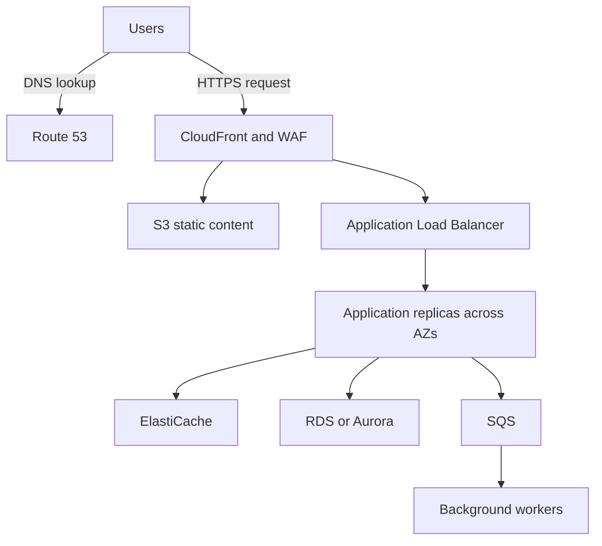

These answers cover all **37 Koerber Pharma questions** in the order you provided. For experience-based questions, use the examples only if they match work you have actually done.

**1. How do you plan AWS cost optimization?**

**Start with a spending baseline, identify waste, and validate savings without weakening reliability.**

My approach would be:

1. **Understand the bill:** Use Cost Explorer and billing reports to identify spending by account, service, environment, and application.
2. **Assign ownership:** Apply consistent tags such as application, environment, owner, and cost centre.
3. **Find avoidable spending:** Look for idle instances, unused load balancers, unattached EBS volumes, unnecessary snapshots, and excessive log retention.
4. **Right-size workloads:** Compare CPU, memory, disk, network, and application performance before reducing capacity.
5. **Match capacity to demand:** Use autoscaling and schedule appropriate development environments to stop outside working hours.
6. **Optimize storage and networking:** Review storage classes, lifecycle policies, NAT processing, cross-AZ traffic, and data transfer.
7. **Purchase commitments carefully:** Consider Savings Plans or Reserved Instances after understanding the stable workload baseline.
8. **Measure the result:** Track both monthly spending and a business measure such as cost per successful transaction.

AWS Cost Optimization Hub helps consolidate recommendations and account for existing discounts when estimating savings. [docs.aws.amazon.com](https://docs.aws.amazon.com/cost-management/latest/userguide/cost-optimization-hub.html?utm_source=chatgpt.com)

For example, reducing a production instance size based only on average CPU can fail during peak traffic. I would check peak demand, memory, latency, and failure-recovery capacity first.

Stopping EC2 also does not eliminate every associated cost: retained storage and other resources can continue generating charges.

---

**2. If someone deletes a Terraform-managed resource, how do you identify and recover it?**

First determine **what was deleted**:

| Situation | Expected Terraform behaviour | Recovery |
|---|---|---|
| Resource deleted directly in AWS | A normal plan can propose recreating it if configuration still requires it | Review recreation and restore required data |
| Resource block removed from configuration | Plan normally proposes destroying the resource | Restore the configuration if removal was accidental |
| Resource removed from Terraform state | Existing infrastructure becomes unmanaged by that state | Import the existing resource again |
| Entire state file deleted | Terraform loses its resource mappings | Recover state as explained in question 5 |

**Detection**

```bash
terraform plan -detailed-exitcode
```

Exit codes mean:

- `0`: no proposed changes.
- `1`: planning error.
- `2`: proposed changes exist.

A scheduled plan can detect drift, but exit code `2` does not specifically mean deletion; inspect the plan. Terraform normally refreshes its view of remote resources while planning. [developer.hashicorp.com](https://developer.hashicorp.com/terraform/cli/commands/plan?utm_source=chatgpt.com)

**Recovery**

Confirm that the deletion was unintended, investigate its cause, and generate a reviewed recovery plan:

```bash
terraform plan -out=recovery.tfplan
terraform apply recovery.tfplan
```

A recreated EC2 instance receives a new instance ID. A recreated EBS volume or database does not automatically recover its previous contents.

**Terraform restores infrastructure configuration; snapshots, database backups, or other recovery mechanisms restore data.**

---

**3. How would you design a web application for fluctuating traffic and low latency? Explain the traffic flow.**

I would use an elastic application tier, caching, and managed data services, then identify where latency actually occurs.

A possible architecture is:



**Request flow**

1. Route 53 resolves the application hostname.
2. The user connects to CloudFront.
3. CloudFront serves eligible cached content from an edge location.
4. Requests requiring application processing reach the ALB.
5. The ALB sends traffic to healthy application instances or containers.
6. The application accesses its cache or database.
7. Work that does not require an immediate response is placed on a queue.

CloudFront can serve cached objects without retrieving them from the origin for every request. [docs.aws.amazon.com](https://docs.aws.amazon.com/AmazonCloudFront/latest/DeveloperGuide/HowCloudFrontWorks.html?utm_source=chatgpt.com)

**Handling fluctuating demand**

- Scale application replicas using meaningful demand metrics.
- Maintain enough minimum capacity to absorb traffic while new capacity starts.
- Scale workers using queue depth or message age.
- Use connection pooling and database query optimization.
- Cache appropriate results and static assets.
- Protect dependencies with timeouts, bounded retries, and circuit breakers.
- Keep application sessions outside individual instances.

I would monitor **p95/p99 latency, error rate, throughput, and saturation**. Scaling the web tier alone will not fix a slow database query or an exhausted connection pool.

---

**4. How do you achieve low-latency routing? Which policy would you use?**

For an application deployed in multiple AWS Regions, I would consider **Route 53 latency-based routing**, with suitable health checks.

It selects a regional endpoint using AWS latency information and the DNS query’s origin information. It is different from simply choosing the geographically closest endpoint. [docs.aws.amazon.com](https://docs.aws.amazon.com/Route53/latest/DeveloperGuide/routing-policy-latency.html?utm_source=chatgpt.com)

The choice depends on the traffic:

| Requirement | Suitable option |
|---|---|
| Route DNS queries towards a regional endpoint with lower expected latency | Route 53 latency-based routing |
| Serve cacheable web content near users | CloudFront |
| Improve the network path for supported regional application endpoints, with static entry IPs | Global Accelerator |
| Choose destinations according to geography | Route 53 geolocation routing |
| Prefer a primary location and switch when unhealthy | Route 53 failover routing |

Global Accelerator directs traffic through the AWS global network to suitable healthy endpoints. [docs.aws.amazon.com](https://docs.aws.amazon.com/global-accelerator/latest/dg/what-is-global-accelerator.html?utm_source=chatgpt.com)

DNS responses can be cached, so Route 53 does not make a fresh routing decision for every HTTP request.

Also, routing users to a nearby region will provide limited benefit if every request still makes synchronous database calls to a distant region.

---

**5. If the Terraform state file is deleted, how do you recover without recreating resources?**

**Recover the resource mappings before applying infrastructure changes.**

My steps would be:

1. Pause pipelines and other Terraform writers.
2. Verify the AWS account, backend bucket, state key, and workspace. An incorrect backend can appear to be missing state.
3. Recover the latest trustworthy state version.
4. Compare it with the real infrastructure.
5. Resume changes only after understanding the plan.

For an S3 backend with versioning, restore the appropriate previous object version. If a normal deletion created a delete marker, earlier versions may still exist. [docs.aws.amazon.com](https://docs.aws.amazon.com/AmazonS3/latest/userguide/RestoringPreviousVersions.html?utm_source=chatgpt.com)

For local state, check protected backups, including a valid `terraform.tfstate.backup` if one exists. Terraform documents recovery from backed-up state. [HashiCorp Developer](https://developer.hashicorp.com/terraform/cli/state/recover?utm_source=chatgpt.com)

After recovery:

```bash
terraform init
terraform plan -refresh-only
terraform plan
```

Review the output; do not automatically apply a refresh-only plan that would forget missing resources.

**If no usable state backup exists**

Rebuild the configuration-to-resource mapping using imports:

```hcl
import {
  to = aws_instance.web
  id = "i-0123456789abcdef0"
}
```

Import associates an existing resource with a Terraform address. It does not require creating a replacement. Associated resources must be adopted separately where appropriate. [developer.hashicorp.com](https://developer.hashicorp.com/terraform/language/import?utm_source=chatgpt.com)

For prevention, use remote state, versioning, restricted access, backups, and locking. Current S3 backends support `use_lockfile = true`; DynamoDB-based locking is deprecated. [developer.hashicorp.com](https://developer.hashicorp.com/terraform/language/backend/s3?utm_source=chatgpt.com)

---

**6. How do you connect a client’s environment to your AWS environment?**

I would establish both **network connectivity and access permissions**.

| Client environment | Common connectivity approach |
|---|---|
| On-premises network | Site-to-Site VPN or Direct Connect |
| Another AWS VPC | VPC peering, Transit Gateway, or PrivateLink |
| Another cloud | Site-to-Site VPN or an appropriate private interconnect |
| Individual administrators | Client VPN, approved access gateway, or Systems Manager |

AWS provides several connectivity patterns because the appropriate choice depends on scale, security, bandwidth, and operational requirements. [docs.aws.amazon.com](https://docs.aws.amazon.com/whitepapers/latest/aws-vpc-connectivity-options/introduction.html?utm_source=chatgpt.com)

For an on-premises connection, I would check:

- Non-overlapping address ranges.
- Routes in both directions.
- VPN tunnels or redundant private connectivity.
- Security groups and firewalls.
- Private DNS resolution.
- Required ports and services.
- Monitoring and failover behaviour.

Direct Connect does not automatically make all traffic encrypted. Use appropriate TLS, VPN, or supported link encryption according to the requirement.

If the client also requires AWS API access, configure a cross-account role with the required trust relationship and permissions. For third-party service providers, an external ID may be appropriate.

**An IAM role grants API permissions; network connectivity makes private endpoints reachable.**

---

**7. If malware is found on a client machine, how do you remove it and create a safer environment?**

**Contain the incident, preserve evidence, investigate its scope, and rebuild from a trusted source.**

My sequence would be:

1. **Quarantine the machine:** Use endpoint detection and response tools or suitable network controls.
2. **Preserve evidence:** Collect relevant logs, disk evidence, and volatile data where required before destructive remediation.
3. **Determine the scope:** Investigate persistence, affected accounts, lateral movement, and possible data access.
4. **Protect identities:** Revoke compromised sessions and rotate affected credentials from a trusted machine.
5. **Rebuild:** Reimage from an approved, patched baseline rather than relying only on deleting the detected malware file.
6. **Restore verified data:** Avoid restoring the original malicious executable or configuration.
7. **Validate:** Confirm endpoint protection, patching, logging, and application functionality.
8. **Correct the entry point:** Address the vulnerable software, exposed service, compromised credentials, or other cause.

AWS incident-response guidance supports structured containment, forensic collection, and eradication activities. [docs.aws.amazon.com](https://docs.aws.amazon.com/prescriptive-guidance/latest/patterns/automate-incident-response-and-forensics.html?utm_source=chatgpt.com)

For ongoing protection, I would use least privilege, MFA, endpoint protection, patch management, network segmentation, restricted administrative access, and protected backups.

GuardDuty can help detect threats affecting supported AWS resources, but it does not replace endpoint protection on an ordinary client laptop.

No environment can be guaranteed malware-proof; the aim is to reduce exposure, detect compromise quickly, and recover safely.

---

**8. What are the types of EC2 instances?**

EC2 instance families are designed around different workload characteristics.

| Category | Family examples | Typical workloads |
|---|---|---|
| General purpose | M, T | Web services, development, balanced workloads |
| Compute optimized | C | CPU-intensive processing and compute-heavy services |
| Memory optimized | R, X | Large in-memory datasets and memory-heavy databases |
| Storage optimized | I, D | High local-storage throughput or capacity |
| Accelerated computing | P, G, Inf, Trn | GPU workloads, machine learning, inference and training |
| High-performance computing | HPC families | Scientific and tightly coupled computing |

The instance type also determines processor architecture, networking, storage support, and other capabilities. [docs.aws.amazon.com](https://docs.aws.amazon.com/AWSEC2/latest/UserGuide/instance-types.html?utm_source=chatgpt.com)

I would choose using CPU, memory, I/O, network, and application measurements.

For example, a burstable T-family instance can suit intermittent demand, but sustained CPU-heavy workloads need careful consideration of CPU credits and charging behaviour.

Instance families and purchasing options are separate decisions.

---

**9. What are Spot, Reserved Instances, and On-Demand instances?**

| Option | Main characteristic | Suitable use |
|---|---|---|
| On-Demand | Usage-based purchasing without a long-term commitment | Unpredictable demand or initial sizing |
| Reserved Instances | Discounts linked to a longer-term commitment and matching attributes | Predictable baseline workloads |
| Spot | Discounted spare capacity that can be interrupted | Fault-tolerant workers, batch processing, suitable CI agents |

AWS distinguishes these purchasing options from capacity reservations and other offerings. [docs.aws.amazon.com](https://docs.aws.amazon.com/AWSEC2/latest/UserGuide/instance-purchasing-options.html?utm_source=chatgpt.com)

**Practical design**

Keep essential baseline capacity on an appropriate reliable purchasing model and use Spot for work that tolerates interruption.

Spot workloads should support:

- Checkpointing or retry.
- Graceful termination.
- Queue-based processing.
- Diversification across suitable instance types and locations.
- Replacement capacity when Spot becomes unavailable.

A Reserved Instance is primarily a billing construct. A regional RI discount does not automatically guarantee capacity; capacity reservation depends on the offering and configuration.

Savings Plans are another commitment model and should also be evaluated against the workload.

---

**10. How do you create dev, prod, and test environments in Terraform?**

I would share modules while keeping environment state, credentials, and configuration appropriately separated.

| Location | Purpose |
|---|---|
| `modules/network` | Reusable VPC and subnet configuration |
| `modules/application` | Reusable application infrastructure |
| `envs/dev` | Development root configuration |
| `envs/test` | Test root configuration |
| `envs/prod` | Production root configuration |

Each root configuration calls the shared modules with its own inputs:

```hcl
module "application" {
  source = "../../modules/application"

  environment   = "prod"
  instance_type = "m7i.large"
  min_capacity  = 3
}
```

The example values should be selected from actual workload requirements.

I would separate:

- State keys or backends.
- AWS accounts where appropriate.
- Deployment roles.
- Environment variables and configuration.
- Approval requirements.
- Recovery procedures.

Changing a variable file alone does not create strong isolation if every environment still shares unrestricted credentials and the same state.

---

**11. What are Terraform provisioners?**

Provisioners execute actions associated with resource creation or destruction when those actions cannot be represented appropriately through normal provider resources.

| Provisioner | Execution location | Purpose |
|---|---|---|
| `local-exec` | The machine running Terraform | Execute a local command |
| `remote-exec` | The target machine | Execute commands over a supported connection |
| `file` | Transfers from the Terraform execution environment | Copy files to the target |

If Terraform runs in Jenkins, `local-exec` runs on the Jenkins execution environment—not automatically on your laptop.

Remote provisioners require connectivity and credentials. Terraform recommends using purpose-built alternatives when possible because provisioning behaviour is harder to model reliably. [HashiCorp Developer](https://developer.hashicorp.com/terraform/language/provisioners?utm_source=chatgpt.com)

Typical alternatives are:

- `user_data` or cloud-init for instance bootstrap.
- Packer for prebuilt machine images.
- Ansible or Systems Manager for configuration.
- Native Terraform resources for supported API operations.

A shell script run through a provisioner does not automatically become idempotent.

---

**12. How do you connect Terraform to AWS and implement CI/CD?**

**Authenticate with an appropriate identity, configure the provider and backend, and run Terraform through a controlled pipeline.**

For local work, an approved federated profile can supply temporary credentials:

```bash
aws sso login --profile devops-dev

AWS_PROFILE=devops-dev \
  terraform -chdir=envs/dev plan
```

For CI, prefer temporary credentials through the runner’s workload identity or an approved federation mechanism. An EC2-hosted runner can use an instance role.

A target-account role can be configured through the AWS provider:

```hcl
provider "aws" {
  region = var.aws_region

  assume_role {
    role_arn = var.deployment_role_arn
  }
}
```

The source identity needs permission to assume the role, and the target role must trust it.

AWS recommends temporary credentials for workloads and federated access for human users. [docs.aws.amazon.com](https://docs.aws.amazon.com/IAM/latest/UserGuide/best-practices.html?utm_source=chatgpt.com)

**Pipeline flow**

1. Checkout reviewed code.
2. Initialize the correct environment.
3. Check formatting and validate configuration.
4. Run IaC security and policy checks.
5. Generate and review a saved plan.
6. Obtain required production approvals.
7. Apply that reviewed plan.
8. Verify application and infrastructure health.

The backend also needs access permissions; provider authentication does not automatically configure every backend authentication requirement.

Protect state and plan artifacts because they may contain sensitive values.

---

**13. What is a Terraform workspace? How do you manage it?**

A **CLI workspace** is a named state instance for the same Terraform configuration.

```bash
terraform workspace list
terraform workspace new dev
terraform workspace select dev
terraform workspace show
```

Workspaces can be useful for multiple similar deployments, but they share the configured backend. They do not automatically provide separate AWS accounts, credentials, or access controls. HashiCorp recommends alternative approaches where stronger separation is required. [HashiCorp Developer](https://developer.hashicorp.com/terraform/cli/workspaces?utm_source=chatgpt.com)

For production environments, I would commonly use separate root configurations and state boundaries, with explicit deployment roles.

Also distinguish:

- **CLI workspace:** primarily selects a named state.
- **HCP Terraform workspace:** an execution and configuration boundary that includes state, variables, run settings, and access controls.

Before running an operation, verify the selected workspace, target account, and backend key.

---

**14. What application deployment strategies are available?**

| Strategy | Behaviour | Main trade-off |
|---|---|---|
| Recreate | Stop the previous version before starting the next | Simple, but can interrupt service |
| Rolling update | Replace replicas gradually | Requires compatibility between versions |
| Blue-green | Maintain two environments and switch traffic | Fast traffic rollback, but extra capacity |
| Canary | Introduce a version to a small traffic share | Requires reliable traffic control and analysis |
| Feature flags | Enable functionality separately from deploying code | Requires disciplined flag management |

For a low-risk service, rolling updates may be sufficient. For a critical change, I might use a canary with automatic analysis and a tested rollback.

Database changes need separate planning. An application rollback is difficult if the new release has already made incompatible data changes.

Deployment success should include user-facing health checks, not only a successful container start.

---

**15. What is the difference between monitoring and observability?**

**Monitoring checks defined health and performance conditions. Observability helps investigate system behaviour using available telemetry.**

| Monitoring | Observability |
|---|---|
| Tracks known indicators and thresholds | Supports deeper investigation and new questions |
| Example: alert when error rate increases | Example: identify which dependency causes those errors |
| Uses dashboards, checks, and alerts | Correlates metrics, logs, traces, and context |

They overlap: good monitoring is part of an observable system.

Useful telemetry includes:

- **Metrics:** numerical trends such as request rate or latency.
- **Logs:** recorded events and diagnostic context.
- **Traces:** the path and timing of a request across services.
- **Context:** release, region, service, and request identifiers.

AWS describes observability as the ability to understand system behaviour through instrumentation and telemetry. [docs.aws.amazon.com](https://docs.aws.amazon.com/whitepapers/latest/aws-caf-operations-perspective/observability.html?utm_source=chatgpt.com)

Installing several tools is insufficient if the application lacks useful instrumentation or correlation identifiers.

---

**16. What are CloudWatch, CloudTrail, and “cloud matrix”?**

“Cloud matrix” is ambiguous. In this context, it likely means **CloudWatch metrics**.

| Term | Purpose | Example |
|---|---|---|
| CloudWatch | Operational monitoring through metrics, logs, alarms, and related capabilities | Detect increased CPU or application errors |
| CloudTrail | Records supported AWS API and account activity | Investigate who terminated an instance |
| CloudWatch metrics | Time-series measurements organized by namespace and dimensions | `CPUUtilization` for an EC2 instance |

A metric needs meaningful dimensions. For example, CPU data for one instance must be distinguishable from CPU data for another.

CloudWatch can collect operating-system and application telemetry through agents and instrumentation. [docs.aws.amazon.com](https://docs.aws.amazon.com/AmazonCloudWatch/latest/monitoring/Install-CloudWatch-Agent.html?utm_source=chatgpt.com)

CloudTrail Event history provides recent management-event investigation. Data events, such as individual object access where applicable, require appropriate logging configuration. [docs.aws.amazon.com](https://docs.aws.amazon.com/awscloudtrail/latest/userguide/view-cloudtrail-events.html?utm_source=chatgpt.com)

CloudTrail is not a substitute for application logs.

---

**17. How do you identify which resource was deleted and who deleted it?**

I would correlate **audit events, resource history, and infrastructure plans**.

**CloudTrail**

Search the relevant account, region, time window, and deletion API.

For example:

```bash
aws cloudtrail lookup-events \
  --region ap-south-1 \
  --lookup-attributes \
    AttributeKey=EventName,AttributeValue=TerminateInstances
```

Inspect the event details for:

- Resource IDs in request parameters.
- Identity and assumed-role session.
- Event time.
- Source information.
- Whether an AWS service or automation initiated the action.

Event history covers recent management events; longer investigations require retained logs or another configured event store. [docs.aws.amazon.com](https://docs.aws.amazon.com/awscloudtrail/latest/userguide/view-cloudtrail-events.html?utm_source=chatgpt.com)

**AWS Config**

If recording was enabled for the resource type, inspect its configuration history and deletion status. AWS Config records configuration changes for supported, recorded resources. [docs.aws.amazon.com](https://docs.aws.amazon.com/config/latest/developerguide/config-concepts.html?utm_source=chatgpt.com)

**Terraform**

Run a plan and compare expected resources with what exists.

For ongoing detection, route relevant deletion events to an alerting workflow and retain centralized audit logs.

Audit history explains the action; resource or data backups enable recovery.

---

**18. What AWS security best practices would you follow?**

I would apply security controls across identity, networking, data, deployment, and operations.

- **Identity:** Federation, MFA, temporary workload credentials, and least privilege.
- **Account separation:** Separate production and non-production where appropriate.
- **Network exposure:** Keep application and database tiers private where practical; allow only required traffic.
- **Secrets:** Use Secrets Manager or another approved secret store, with rotation and controlled access.
- **Encryption:** Protect data in transit and at rest; manage key access carefully.
- **Logging:** Retain CloudTrail and appropriate application, network, and security logs.
- **Detection:** Use relevant threat-detection and vulnerability-management services.
- **Software maintenance:** Patch operating systems, dependencies, and container images.
- **Deployment controls:** Review infrastructure plans and enforce security policies.
- **Recovery:** Maintain protected backups and test restoration.

AWS IAM guidance emphasizes federation, temporary credentials, MFA, least privilege, and regular permission review. [docs.aws.amazon.com](https://docs.aws.amazon.com/IAM/latest/UserGuide/best-practices.html?utm_source=chatgpt.com)

For a web application, I would also use WAF where appropriate and fix application vulnerabilities. A WAF does not remove the need for secure application code.

---

**19. How do you manage certificates? What if a certificate expires?**

I would maintain an inventory of certificates, their owners, expiry dates, and deployment locations.

**ACM-issued certificates**

Use managed renewal where the certificate is eligible, and preserve the required validation configuration. ACM renewal eligibility has conditions; imported and already-expired certificates are not eligible for ACM managed renewal. [docs.aws.amazon.com](https://docs.aws.amazon.com/acm/latest/userguide/managed-renewal.html?utm_source=chatgpt.com)

**Imported certificates**

Arrange renewal with the issuer and reimport the replacement. Reimporting can preserve the certificate ARN and service association. [docs.aws.amazon.com](https://docs.aws.amazon.com/acm/latest/userguide/import-certificate.html?utm_source=chatgpt.com)

**Exported certificates**

Ensure renewed certificates are also deployed to the external server or appliance. Renewal in ACM alone does not update every external installation. [docs.aws.amazon.com](https://docs.aws.amazon.com/pdfs/acm/latest/userguide/acm-ug.pdf?utm_source=chatgpt.com)

**Monitoring**

Configure expiry alerts, including ACM’s `DaysToExpiry` metric and appropriate certificate events. [docs.aws.amazon.com](https://docs.aws.amazon.com/acm/latest/userguide/cloudwatch-metrics.html?utm_source=chatgpt.com)

Check the certificate users actually receive:

```bash
openssl s_client \
  -connect app.example.com:443 \
  -servername app.example.com \
  </dev/null 2>/dev/null |
openssl x509 -noout -dates -issuer -subject
```

**If expired**

Obtain a valid replacement, deploy it to the correct listener or TLS endpoint, and verify hostname, chain, expiry, and client connectivity.

Investigate why renewal or deployment failed. Possible causes include removed DNS validation records, ownership gaps, failed automation, or the endpoint presenting an older certificate.

---

**20. What is the difference between a NAT gateway and a NAT instance?**

| Aspect | NAT gateway | NAT instance |
|---|---|---|
| Management | AWS-managed service | EC2 instance managed by your team |
| Patching | AWS handles service maintenance | You patch and maintain the OS |
| Capacity | Managed scaling capabilities | Depends on instance capacity |
| Availability | Depends on selected gateway architecture | You design failover |
| Security groups | Cannot attach a security group directly | Supports instance security groups |
| Cost | Gateway usage and processing charges | Instance and associated infrastructure charges |

AWS documents these operational differences and generally recommends NAT gateways to reduce administration. [docs.aws.amazon.com](https://docs.aws.amazon.com/vpc/latest/userguide/vpc-nat-comparison.html?utm_source=chatgpt.com)

For a NAT instance, configure forwarding, appropriate routes, and disable source/destination checking. Use a supported operating-system image.

**Current distinction:** AWS offers both zonal and regional NAT gateways. Regional gateways can expand across Availability Zones, so describing every NAT gateway as a single-AZ resource is outdated. [docs.aws.amazon.com](https://docs.aws.amazon.com/vpc/latest/userguide/nat-gateways-regional.html?utm_source=chatgpt.com)

NAT supports outbound connections and their return traffic. It does not provide general unsolicited inbound access, and it should not be treated as a complete security solution.

---

**21. What is the difference between Transit Gateway and VPC peering?**

| Aspect | VPC peering | Transit Gateway |
|---|---|---|
| Topology | Direct connection between two VPCs | Routing hub connecting multiple networks |
| Transitive routing | Unsupported | Supports routing between attachments according to configuration |
| Typical scale | A smaller number of direct connections | Many VPCs and hybrid connections |
| Routing administration | Routes maintained for individual peers | VPC routes plus Transit Gateway route tables |
| Cost considerations | Applicable transfer charges | Attachment, processing, and applicable transfer charges |

VPC peering does not make a third VPC reachable through an existing peer. [docs.aws.amazon.com](https://docs.aws.amazon.com/vpc/latest/peering/invalid-peering-configurations.html?utm_source=chatgpt.com)

Transit Gateway can connect VPCs and hybrid networks through a central routing model. [docs.aws.amazon.com](https://docs.aws.amazon.com/vpc/latest/tgw/what-is-transit-gateway.html?utm_source=chatgpt.com)

For connectivity, configure the relevant VPC routes, attachment associations, Transit Gateway routes, and security controls.

Neither option automatically solves overlapping address ranges. Consider renumbering, NAT, or service-level connectivity such as PrivateLink, depending on the requirement.

---

**22. How would access be given when you join an organization? How would you secure AWS administration?**

I would expect an individual corporate identity connected to the approved identity provider.

A typical process is:

1. Create or enable my corporate identity.
2. Assign approved groups and permission sets.
3. Grant access to the necessary AWS accounts and roles.
4. Require MFA.
5. Provide CLI access through approved federated authentication.
6. Record administrative activity and review access periodically.

IAM Identity Center supports centralized workforce access to AWS accounts and applications. [docs.aws.amazon.com](https://docs.aws.amazon.com/singlesignon/latest/userguide/what-is.html?utm_source=chatgpt.com)

For administration:

- Use a named identity and an appropriate administrative role.
- Prefer temporary elevation for sensitive tasks.
- Protect root credentials and recovery mechanisms.
- Avoid root access keys.
- Maintain controlled emergency access.
- Monitor changes to identities, permissions, logging, and security controls.
- Remove access promptly when responsibilities change.

Shared administrator credentials weaken accountability and make revocation difficult.

---

**23. What is the difference between IAM roles and policies?**

**A role is an assumable identity. A policy defines permissions or other access rules.**

An IAM role normally has:

- A **trust policy**, which defines who may assume it.
- **Permission policies**, which define what its sessions may do.

Assuming a role produces temporary credentials. [docs.aws.amazon.com](https://docs.aws.amazon.com/IAM/latest/UserGuide/id_roles.html?utm_source=chatgpt.com)

Example: an EC2 application needs to upload reports to S3.

- The EC2 instance uses an IAM role.
- The role’s trust allows the appropriate AWS service to use it.
- A permission policy allows required S3 operations on the intended bucket or prefix.

Other policy types include resource policies, permission boundaries, and organization controls. They participate in permission evaluation differently. [docs.aws.amazon.com](https://docs.aws.amazon.com/IAM/latest/UserGuide/access_policies.html?utm_source=chatgpt.com)

Attaching a broad policy is not sufficient justification for granting access; scope actions, resources, and conditions to the actual requirement.

---

**24. How do you achieve zero-downtime deployment?**

**Prepare healthy replacement capacity before removing existing capacity, and keep application and data changes compatible.**

For a Kubernetes Deployment, an explicit strategy could be:

```yaml
spec:
  replicas: 3
  minReadySeconds: 10
  strategy:
    type: RollingUpdate
    rollingUpdate:
      maxSurge: 1
      maxUnavailable: 0
  template:
    spec:
      terminationGracePeriodSeconds: 60
```

This fragment must be combined with suitable readiness/startup probes and an application that shuts down gracefully.

Rolling-update configuration controls how replicas are introduced and removed. [Kubernetes](https://kubernetes.io/docs/concepts/workloads/controllers/deployment/?utm_source=chatgpt.com)

I would also ensure:

- Spare capacity for replacement Pods.
- Health checks that reflect the ability to serve traffic.
- Graceful request and connection draining.
- External session storage where needed.
- Compatibility between simultaneously running versions.
- User-facing verification and rollback triggers.

**Database changes**

Use an expand-and-contract approach:

1. Add compatible schema changes.
2. Deploy code that supports both old and new representations.
3. Backfill or migrate data.
4. Switch usage.
5. Remove obsolete structures in a later release.

For blue-green or canary deployment, retain the previous version and monitor real transactions before completing promotion.

Zero downtime depends on these conditions; choosing a deployment strategy alone does not guarantee it.

---

**25. What is the difference between Docker CMD and ENTRYPOINT?**

| Instruction | Purpose |
|---|---|
| `ENTRYPOINT` | Defines the executable normally run by the container |
| `CMD` | Supplies a default command or default arguments |

Example:

```dockerfile
ENTRYPOINT ["java", "-jar", "/app/app.jar"]
CMD ["--server.port=8080"]
```

Running:

```bash
docker run myapp
```

uses port `8080`.

Running:

```bash
docker run myapp --server.port=9090
```

replaces the default arguments and uses port `9090`.

The entry point can also be explicitly overridden using `--entrypoint`.

Docker documents the interaction between these instructions, including differences between shell and exec forms. [docs.docker.com](https://docs.docker.com/reference/dockerfile/?utm_source=chatgpt.com)

For application containers, exec form generally makes process and signal handling easier to manage. If a startup script launches the application, it should correctly forward termination signals.

---

**26. What are Docker volumes and Docker prune?**

**Volumes provide storage outside a container’s writable layer.**

A named volume can survive removal of the container using it:

```bash
docker volume create app-data

docker run \
  --mount type=volume,src=app-data,dst=/data \
  myapp
```

This is useful for persistent application data, although local volumes still need a backup and host-failure strategy.

**Prune removes resources Docker considers unused.**

| Command | Main scope |
|---|---|
| `docker image prune` | Dangling images by default |
| `docker container prune` | Stopped containers |
| `docker system prune` | Stopped containers, unused networks, eligible images, and build cache |
| `docker volume prune` | Unused anonymous local volumes by default |
| `docker volume prune -a` | Includes unused named local volumes |

`docker system prune` does not remove volumes by default. Adding `--volumes` includes eligible anonymous volumes. [docs.docker.com](https://docs.docker.com/reference/cli/docker/system/prune/?utm_source=chatgpt.com)

Current volume-prune behaviour distinguishes anonymous volumes from named volumes. [docs.docker.com](https://docs.docker.com/reference/cli/docker/volume/prune/?utm_source=chatgpt.com)

“Unused” means not referenced by a container; it does not mean the data has no business value. Inspect and back up relevant data before pruning volumes.

---

**27. What storage types are available? How do S3 and EBS differ?**

Common storage categories include:

- **Object:** S3.
- **Block:** EBS.
- **Shared file:** EFS and appropriate FSx services.
- **Instance-local storage:** Instance store, where supported.

AWS provides these services for different access and durability requirements. [docs.aws.amazon.com](https://docs.aws.amazon.com/whitepapers/latest/aws-overview/storage-services.html?utm_source=chatgpt.com)

| Aspect | S3 | EBS |
|---|---|---|
| Storage model | Objects identified by keys | Block device |
| Application access | APIs, SDKs, and HTTP interfaces | Filesystem or block access through an attached instance |
| Typical use | Files, backups, logs, static assets, data lakes | OS disks, application disks, database storage |
| Location boundary | Regional service; redundancy varies by storage class | Volume belongs to an Availability Zone |
| Sharing | Multiple clients can access authorized objects | Attachment rules apply; Multi-Attach is a specific capability |
| Protection | Versioning, replication, retention, backup mechanisms | Snapshots and backup mechanisms |

EBS persists independently of the running application, but termination settings can cause a volume to be deleted.

Choose S3 when the application needs object storage. Choose EBS when it needs a disk interface and filesystem or block-level access.

---

**28. Explain Kubernetes architecture, Services, and Pod troubleshooting.**

**Architecture**

| Component | Responsibility |
|---|---|
| API server | Exposes the Kubernetes API and processes requests |
| etcd | Stores cluster API state |
| Scheduler | Selects nodes for unscheduled Pods |
| Controller manager | Runs controllers that reconcile desired state |
| kubelet | Manages Pod execution on a node |
| Container runtime | Runs containers through the runtime interface |
| Networking components | Provide Pod connectivity and Service routing |

Cloud-integrated clusters can also use a cloud controller manager. Components may be deployed differently in managed platforms. [kubernetes.io](https://kubernetes.io/docs/concepts/overview/components/?utm_source=chatgpt.com)

**Service types**

| Type | Use |
|---|---|
| ClusterIP | Stable internal access |
| NodePort | Exposes a port through eligible nodes |
| LoadBalancer | Requests a load-balancer integration |
| ExternalName | Returns a DNS alias |

A headless Service uses `clusterIP: None`; it is not a separate Service type. Ingress or Gateway resources provide additional routing through their controllers. [kubernetes.io](https://kubernetes.io/docs/concepts/services-networking/service/?utm_source=chatgpt.com)

**Pod troubleshooting**

```bash
kubectl get pods -n prod -o wide
kubectl describe pod app-pod -n prod
kubectl logs app-pod -n prod -c app
kubectl logs app-pod -n prod -c app --previous
kubectl get events -n prod --sort-by=.lastTimestamp
```

Then investigate according to the state:

- **Pending:** scheduling constraints, capacity, or storage.
- **ImagePullBackOff:** image reference, registry authentication, or connectivity.
- **CrashLoopBackOff:** exit code, configuration, application failure, or probes.
- **OOMKilled:** memory sizing or application memory behaviour.
- **Running but unavailable:** readiness, Service endpoints, networking, or dependencies.

When the application image lacks tools, an authorized ephemeral debug container can help investigate. [kubernetes.io](https://kubernetes.io/docs/tasks/debug/debug-application/debug-running-pod/?utm_source=chatgpt.com)

---

**29. How do you schedule a Pod on a specific node?**

Use a node label and a scheduling constraint.

```bash
kubectl label node worker-1 workload=pharma-web
```

Then configure the Pod specification or workload template:

```yaml
spec:
  nodeSelector:
    workload: pharma-web
```

This requires a node with that label.

For more expressive rules, use node affinity:

- Required affinity makes matching mandatory during scheduling.
- Preferred affinity expresses a preference.
- Affinity can match multiple values and conditions.

Kubernetes supports these mechanisms for node selection. [kubernetes.io](https://kubernetes.io/docs/concepts/scheduling-eviction/assign-pod-node/?utm_source=chatgpt.com)

For production, selecting a node pool is often more resilient than depending on one physical node name.

Also distinguish:

- A toleration allows a Pod to tolerate a taint.
- It does not itself select that node.
- Setting `nodeName` bypasses normal scheduler placement and should be used deliberately.

---

**30. What is the difference between a StatefulSet and a stateless application?**

A **StatefulSet is a Kubernetes controller**. “Stateless” describes application behaviour.

The usual controller comparison is:

| Deployment | StatefulSet |
|---|---|
| Manages interchangeable replicas | Provides stable replica identities |
| Pod names change across replacement | Uses ordinal names such as `database-0` |
| Commonly used for stateless services | Useful for workloads needing stable identity or storage |
| Replica replacement is broadly interchangeable | Supports ordered behaviour where configured |
| Storage can be used, but per-replica identity is not its main purpose | Commonly uses per-replica PVCs |

StatefulSets support stable identities and storage associations. [kubernetes.io](https://kubernetes.io/docs/concepts/workloads/controllers/statefulset/?utm_source=chatgpt.com)

If `database-0` is replaced, the replacement keeps that ordinal name and can reuse its retained claim, although it is a new Pod object.

A StatefulSet does not automatically implement database replication, quorum, backups, or application-level recovery. Those remain responsibilities of the application and its operational design.

---

**31. Can we delete the pause container?**

**The pause container is part of the Pod infrastructure managed by the runtime. Removing it can disrupt the Pod.**

In common Linux runtime implementations, the sandbox infrastructure supports the Pod’s shared networking environment. Application containers use the Pod’s network namespace and share its network identity.

Kubernetes runtime configuration refers to this as the sandbox or Pod infrastructure container. [Kubernetes](https://kubernetes.io/docs/setup/production-environment/container-runtimes/?utm_source=chatgpt.com)

If it is killed or removed, the runtime and kubelet may recreate the sandbox and restart workload containers. Exact behaviour depends on the runtime and failure.

For operational actions, use Kubernetes workload controls rather than manually deleting runtime infrastructure.

Deleting a Deployment-owned Pod normally causes the controller to create a replacement. Deleting a standalone Pod does not provide the same controller-driven replacement.

Process namespace sharing is a separate configurable feature; not every Pod shares all process IDs by default.

---

**32. Where would you use AWS Lambda? Give a use case.**

Lambda Functions suit **event-driven or request-driven work with bounded execution time**.

Examples include:

- Processing uploaded files.
- Responding to queue messages.
- Scheduled automation.
- API request processing.
- Event transformation.
- Lightweight infrastructure remediation.

Lambda manages execution environments and scales function invocation capacity according to demand and configured limits. [AWS Lambda](https://docs.aws.amazon.com/lambda/latest/dg/welcome.html?utm_source=chatgpt.com)

**Example: uploaded-file processing**

1. A user uploads a file to S3.
2. An event reaches a queue or function.
3. Lambda validates and processes the file.
4. Results are stored in the appropriate destination.
5. Failures are retried or sent through the configured failure-handling path.

I would make processing idempotent so retries do not create duplicate business results. Retry behaviour differs by invocation mechanism. [docs.aws.amazon.com](https://docs.aws.amazon.com/lambda/latest/dg/invocation-retries.html?utm_source=chatgpt.com)

Consider runtime duration, concurrency, dependency latency, and cold starts. Long-running or unsuitable workloads may fit ECS, EKS, or Batch better.

---

**33. Explain monitoring versus observability using an incident example.**

This repeats question 15, but an incident makes the distinction easier to explain.

Suppose users report slow checkout:

- **Monitoring** shows that checkout p99 latency and failures have increased.
- **Metrics** identify when the change started and whether saturation increased.
- **Traces** show that most delay occurs in a database call.
- **Logs** reveal repeated connection-acquisition timeouts.
- **Release context** identifies a recent connection-pool configuration change.

These signals let the team investigate the cause and verify recovery.

Consistent attributes and correlation identifiers make it easier to connect logs, metrics, and traces. [docs.aws.amazon.com](https://docs.aws.amazon.com/AmazonCloudWatch/latest/monitoring/CloudWatch-OpenTelemetry-Sections.html?utm_source=chatgpt.com)

---

**34. What Terraform issues have you faced recently?**

Use a real example from your work. Common production issues include:

| Issue | Investigation and resolution |
|---|---|
| State lock failure | Identify the owner; confirm whether the operation is active |
| `AccessDenied` | Check identity, role trust, IAM, organization controls, and key permissions |
| Incorrect account or region | Verify credentials and provider configuration |
| Existing resource conflict | Confirm ownership and import the resource where appropriate |
| Unexpected replacement | Review replacement-triggering attributes and resource addressing |
| Quota or capacity failure | Investigate service limits and available capacity |
| Partial apply failure | Inspect created resources and state before retrying |
| Out-of-band drift | Compare configuration, state, real resources, and audit history |
| Provider upgrade differences | Review compatibility and planned changes before promotion |

**Illustrative interview answer**

> “A deployment failed while acquiring the remote state lock. I checked the lock owner and pipeline history, confirmed the previous operation had stopped, and followed our recovery procedure. I then generated a fresh plan before applying. We added concurrency controls and improved cancellation handling to reduce recurrence.”

Discuss this only if it reflects your experience. Explain the trigger, evidence, immediate recovery, and preventive improvement.

For a failed apply, never assume the environment remained untouched.

---

**35. Which Jenkins plugins are used for CI/CD on AWS?**

Common integrations include:

| Plugin or integration | Purpose |
|---|---|
| Git | Checkout source and support Git-based workflows |
| Pipeline | Define Jenkinsfile-based workflows |
| Credentials Binding | Make approved credentials available to appropriate steps |
| Pipeline: AWS Steps | AWS operations and role-based contexts such as `withAWS` |
| Amazon ECR | Registry authentication integration |
| Amazon EC2 | Provision Jenkins agents on EC2 |
| Kubernetes | Provision Jenkins agents as Pods |
| Docker Pipeline | Container-related pipeline operations |
| SonarQube Scanner | Run code-quality analysis and related integration |

The AWS Steps plugin exposes AWS operations and role assumption, while the EC2 and Kubernetes plugins support dynamic agents. [plugins.jenkins.io](https://plugins.jenkins.io/pipeline-aws/?utm_source=chatgpt.com)

The ECR plugin provides an ECR authentication integration. [plugins.jenkins.io](https://plugins.jenkins.io/amazon-ecr/?utm_source=chatgpt.com)

Terraform, Helm, kubectl, and security scanners can also run as version-controlled CLI tools; a dedicated plugin is not always necessary.

For AWS access, prefer appropriate temporary credentials and narrowly scoped deployment roles. Confirm where plugin operations execute and where they obtain credentials.

---

**36. Which AWS service monitors traffic or CPU spikes?**

**CloudWatch is the primary AWS service for collecting metrics and creating alarms.**

For EC2, monitor:

- CPU utilization.
- Network traffic.
- Relevant disk and EBS indicators.
- Instance health.
- Application throughput, latency, and failures.

EC2 CPU metrics normally have five-minute basic monitoring or one-minute detailed monitoring. [docs.aws.amazon.com](https://docs.aws.amazon.com/AWSEC2/latest/UserGuide/using-cloudwatch.html?utm_source=chatgpt.com)

Memory, filesystem usage, and selected process-level metrics generally need an agent or other instrumentation. The CloudWatch agent can collect additional host and application telemetry. [docs.aws.amazon.com](https://docs.aws.amazon.com/AmazonCloudWatch/latest/monitoring/Install-CloudWatch-Agent.html?utm_source=chatgpt.com)

**Example response to a spike**

1. Alert on a meaningful sustained condition or anomaly.
2. Correlate CPU with request volume, latency, and errors.
3. Compare affected instances or Pods.
4. Investigate processes, recent releases, and dependencies.
5. Scale when additional capacity addresses the bottleneck.
6. Verify customer-facing recovery.

A high CPU metric alone does not prove traffic increased; a tight loop or background task can also cause it.

For Kubernetes, correlate node and container metrics. Scaling replicas will help only if the workload and its dependencies can scale effectively.

---

**37. How do you back up an EBS volume and attach the restored data to another server?**

**Create a snapshot, create a new volume from that snapshot, and attach it to the destination instance.**

**Step 1: Establish the required consistency**

For databases or active writers, use an appropriate application-consistent procedure. Data only in memory is not captured by an ordinary EBS snapshot.

Snapshots provide point-in-time volume protection; consistency requirements still depend on the workload. [docs.aws.amazon.com](https://docs.aws.amazon.com/ebs/latest/userguide/ebs-creating-snapshot.html?utm_source=chatgpt.com)

**Step 2: Create the snapshot**

The following commands use placeholder IDs that must be replaced:

```bash
aws ec2 create-snapshot \
  --region ap-south-1 \
  --volume-id vol-source \
  --description "Application data backup"
```

Wait for the returned snapshot:

```bash
aws ec2 wait snapshot-completed \
  --region ap-south-1 \
  --snapshot-ids snap-backup
```

**Step 3: Create a restored volume**

Create it in the destination instance’s Availability Zone:

```bash
aws ec2 create-volume \
  --region ap-south-1 \
  --snapshot-id snap-backup \
  --availability-zone ap-south-1a \
  --volume-type gp3
```

A snapshot can be used to create a volume in another AZ within its region, but the new volume must be in the same AZ as the target instance. [docs.aws.amazon.com](https://docs.aws.amazon.com/ebs/latest/userguide/ebs-restoring-volume.html?utm_source=chatgpt.com)

**Step 4: Attach the new volume**

```bash
aws ec2 wait volume-available \
  --region ap-south-1 \
  --volume-ids vol-restored

aws ec2 attach-volume \
  --region ap-south-1 \
  --volume-id vol-restored \
  --instance-id i-target \
  --device /dev/sdf
```

Check encryption-key permissions when using encrypted snapshots or cross-account recovery.

**Step 5: Identify and mount the existing filesystem**

```bash
lsblk -f
```

The operating-system device name may differ from `/dev/sdf`, particularly on Nitro-based instances. [docs.aws.amazon.com](https://docs.aws.amazon.com/ebs/latest/userguide/ebs-attaching-volume.html?utm_source=chatgpt.com)

Mount the correct existing filesystem, preferably read-only for initial verification.

**Do not run `mkfs` on a restored volume containing data.** Formatting would overwrite its filesystem. [docs.aws.amazon.com](https://docs.aws.amazon.com/ebs/latest/userguide/ebs-using-volumes.html?utm_source=chatgpt.com)

For recovery in another region, copy the snapshot there first. Validate restored data, permissions, and application behaviour before using the volume in production.
