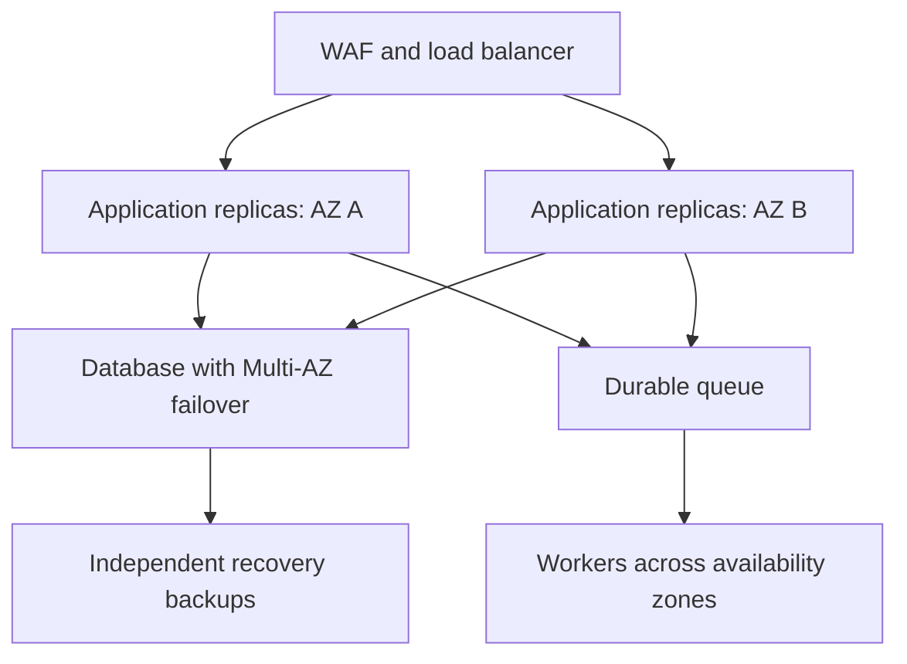

Below are answers for both LTIMindtree sets. Use the experience-based examples as templates and replace them with details from your own projects.

**1. Can we install Docker inside a container?**

**Yes, but installing the Docker client and running a Docker daemon are different things.**

There are two common approaches:

| Approach | How it works | Important consideration |
|---|---|---|
| Docker-in-Docker, or DinD | A Docker daemon runs inside the container | The conventional setup requires elevated privileges |
| Container using the host’s Docker daemon | The container contains the Docker client and accesses the host daemon | It can control host Docker resources |

A demonstration of DinD:

```bash
docker run --privileged \
  --name dind \
  -d docker:dind

docker exec dind docker info
```

The official Docker image provides a `dind` variant. Its conventional configuration uses `--privileged`, which grants extensive access and should be restricted to appropriate, isolated environments. [Docker Hub](https://hub.docker.com/_/docker?utm_source=chatgpt.com)

Another approach mounts the host socket:

```bash
docker run --rm \
  -v /var/run/docker.sock:/var/run/docker.sock \
  docker:cli docker ps
```

Here, the command talks to the **host daemon**. Containers it creates are managed by that daemon; they are not nested inside the client container.

Access to a rootful Docker daemon can provide powerful host-level control. For CI, I would use isolated build agents and carefully control which pipelines can access the daemon. [Docker Docs](https://docs.docker.com/engine/security/?utm_source=chatgpt.com)

---

**2. How can we create three instances from a list of names in Terraform?**

You can use either `count` or `for_each`. The choice affects how Terraform identifies the instances.

**Example using `count`:**

```hcl
variable "instance_names" {
  type    = list(string)
  default = ["app-a", "app-b", "app-c"]
}

variable "ami_id" {
  type = string
}

resource "aws_instance" "app" {
  count = length(var.instance_names)

  ami           = var.ami_id
  instance_type = "t3.micro"

  tags = {
    Name = var.instance_names[count.index]
  }
}
```

The resource addresses are:

```text
aws_instance.app[0]
aws_instance.app[1]
aws_instance.app[2]
```

Terraform identifies these instances by their **numeric indexes**. The AWS `Name` tag does not determine their Terraform identity. [HashiCorp Developer](https://developer.hashicorp.com/terraform/language/meta-arguments/count?utm_source=chatgpt.com)

For resources that have meaningful names, `for_each` often provides a more stable mapping. The next answer explains why.

---

**3. What happens if we remove the second instance name and apply again?**

**It depends on whether the configuration uses `count` or `for_each`.**

Suppose the original list is:

```hcl
["app-a", "app-b", "app-c"]
```

After removing the second name:

```hcl
["app-a", "app-c"]
```

**With the `count` example above:**

| Resource address | Before | After |
|---|---|---|
| `app[0]` | Name: `app-a` | Remains `app-a` |
| `app[1]` | Name: `app-b` | Changes to `app-c` |
| `app[2]` | Name: `app-c` | Destroyed because index 2 is no longer required |

Because only the `Name` tag changes at index 1 in this example, Terraform normally updates that tag in place.

Therefore, the original instance named `app-b` survives but gets renamed, while the original instance named `app-c` is destroyed.

If other index-based settings change—such as an attribute requiring replacement—the plan can contain additional replacements.

**With `for_each`:**

```hcl
resource "aws_instance" "app" {
  for_each = toset(var.instance_names)

  ami           = var.ami_id
  instance_type = "t3.micro"

  tags = {
    Name = each.key
  }
}
```

The addresses become:

```text
aws_instance.app["app-a"]
aws_instance.app["app-b"]
aws_instance.app["app-c"]
```

Removing `"app-b"` then proposes destroying that keyed instance while preserving the other two. `for_each` identifies instances using map keys or set elements. [HashiCorp Developer](https://developer.hashicorp.com/terraform/language/meta-arguments/for_each?utm_source=chatgpt.com)

Always review the plan before applying. Changing an existing configuration from `count` to `for_each` also requires an address-migration plan, such as appropriate `moved` blocks.

---

**4. If a Jenkins pipeline has five stages and the fifth contains a syntax error, what happens?**

**If the error is in the Jenkinsfile’s Groovy syntax or Declarative structure, the pipeline normally fails before executing its stages.**

Jenkins must parse and process the Jenkinsfile as a whole. It does not parse each stage only when that stage starts.

However, distinguish the type of error:

| Error | Expected behaviour |
|---|---|
| Missing brace or quotation mark in the Jenkinsfile | Compilation/parsing fails; stages do not execute |
| Invalid Declarative Pipeline structure | Validation fails before normal stage execution |
| Syntax error inside an external shell script | Earlier stages may complete; failure occurs when the script runs |
| Syntax error in a file loaded during execution | Failure occurs when that file is loaded; earlier work may have completed |

For example:

```groovy
stage('Deploy') {
    steps {
        sh 'bash scripts/deploy.sh'
    }
}
```

The Jenkinsfile can be valid even when `deploy.sh` contains a Bash syntax error. In that case, the failure occurs when Jenkins executes the shell step.

Jenkins provides development tools for validating Declarative Pipelines before running the full workflow. [jenkins.io](https://www.jenkins.io/doc/book/pipeline/development/?utm_source=chatgpt.com)

A useful interview answer is:

> “A Jenkinsfile syntax error generally prevents stage execution. A syntax error in a script invoked by the fifth stage is detected when that script runs.”

---

**5. What are the differences between Scripted and Declarative Pipelines?**

Both are Jenkins Pipeline approaches, and both can be stored in a version-controlled Jenkinsfile.

| Aspect | Declarative | Scripted |
|---|---|---|
| Main structure | `pipeline { ... }` | Commonly `node { ... }` |
| Style | Structured DSL with defined sections | More direct Groovy programming |
| Validation | Enforces Declarative structure | Relies more on Groovy and Pipeline execution |
| Conditions | Usually `when` and related directives | Groovy `if`, loops, and other control flow |
| Error handling | `post` conditions and Pipeline steps | Commonly `try`, `catch`, and `finally` |
| Flexibility | Structured, with `script` blocks when needed | Convenient for complex dynamic logic |

**Declarative example:**

```groovy
pipeline {
    agent any

    stages {
        stage('Build') {
            steps {
                echo 'Building application'
            }
        }
    }

    post {
        failure {
            echo 'Pipeline failed'
        }
    }
}
```

**Scripted example:**

```groovy
node {
    try {
        stage('Build') {
            echo 'Building application'
        }
    } catch (Exception error) {
        echo 'Pipeline failed'
        throw error
    }
}
```

Jenkins documents the syntax and capabilities of both approaches. [jenkins.io](https://www.jenkins.io/doc/book/pipeline/syntax/?utm_source=chatgpt.com)

For standard team workflows, Declarative is often easier to maintain. Scripted is useful when the workflow needs substantial dynamic programming. Declarative Pipelines can still call shared libraries and execute Groovy through appropriate blocks.

---

**6. What is the difference between code quality and code coverage?**

**Code quality concerns how well the code is written. Coverage measures how much code tests execute.**

| Code quality | Code coverage |
|---|---|
| Includes reliability, security, maintainability, and readability | Measures execution of lines, branches, or other structures during tests |
| Can identify defects, insecure patterns, duplication, and complexity | Identifies code that tests do or do not exercise |
| Evaluated through analysis, reviews, and testing | Collected through coverage instrumentation |

For example, if tests execute 80 of 100 executable lines, line coverage is 80%.

However, those tests might contain weak assertions. Executing a function does not prove its output is correct.

I would assess:

- Coverage of important paths.
- Meaningful assertions.
- Error and boundary cases.
- Security and reliability findings.
- Complexity and maintainability.

SonarQube imports coverage reports generated by tools in the build pipeline. It does not generate test coverage simply by scanning the source code. The coverage tool should run before SonarScanner imports its report. [docs.sonarsource.com](https://docs.sonarsource.com/sonarqube-server/analyzing-source-code/test-coverage/overview?utm_source=chatgpt.com)

Typical tools include JaCoCo for Java, coverage.py for Python, and Istanbul-based tooling for JavaScript.

---

**7. What is the default quality gate in SonarQube?**

The built-in default is **Sonar way**, although administrators can select a different default or assign another gate to a project.

The documented Sonar way conditions focus on new code:

| Condition | Required result |
|---|---|
| New issues | No new issues introduced |
| New security hotspots | All reviewed |
| New-code coverage | At least 80% |
| New-code duplication | At most 3% |

Sonar provides this built-in gate as read-only. [docs.sonarsource.com](https://docs.sonarsource.com/sonarqube-server/quality-standards-administration/managing-quality-gates/introduction-to-quality-gates?utm_source=chatgpt.com)

Two practical details:

- Coverage and duplication conditions can be ignored for sufficiently small changes under the default small-change settings.
- Exact security conditions depend on the installed version and migration state; current documentation notes that security hotspots are being phased out. [docs.sonarsource.com](https://docs.sonarsource.com/sonarqube-server/quality-standards-administration/managing-quality-gates/introduction-to-quality-gates?utm_source=chatgpt.com)

Also distinguish:

- **Quality profile:** selects the analysis rules.
- **Quality gate:** decides whether analysis results pass the required conditions.

In CI, wait for the quality-gate result. A successful scanner command alone does not necessarily mean the gate passed.

---

**8. How do you apply a YAML manifest without creating a YAML file?**

Pass the manifest through **standard input**:

```bash
kubectl apply -f - <<'EOF'
apiVersion: v1
kind: ConfigMap
metadata:
  name: application-config
data:
  APP_ENV: "dev"
  LOG_LEVEL: "INFO"
EOF
```

Here:

- `-f -` tells kubectl to read from standard input.
- The heredoc supplies the YAML.
- Quoting `'EOF'` prevents the shell from expanding variables inside the manifest.

Kubectl supports applying configuration from standard input. [Kubernetes](https://kubernetes.io/docs/reference/kubectl/generated/kubectl_apply/?utm_source=chatgpt.com)

You can also create some objects imperatively:

```bash
kubectl create deployment web \
  --image=nginx:stable \
  --replicas=2
```

Or generate YAML and immediately apply it:

```bash
kubectl create deployment web \
  --image=nginx:stable \
  --replicas=2 \
  --dry-run=client -o yaml |
kubectl apply -f -
```

For production, keep the desired configuration in version control so changes remain reviewable and reproducible.

The following answers cover the **five-year-experience set**.

---

**1. What are your day-to-day activities?**

A sample answer to adapt:

> “I start by reviewing production alerts, overnight pipeline failures, and planned changes. I support application teams with build and deployment issues, maintain infrastructure configuration, and investigate Kubernetes or cloud incidents.
>
> I also review pull requests for pipelines and Terraform, support releases across environments, and verify post-deployment health. Alongside operational work, I automate repetitive tasks, improve monitoring, and follow up on security and reliability findings.”

Be specific about your actual responsibilities:

- CI/CD maintenance.
- Infrastructure changes.
- Deployment support.
- Incident investigation.
- Observability.
- Security and patching.
- Automation and documentation.

Prepare one concrete example of an incident and one example of a task you automated. Explain your own contribution rather than presenting every team activity as personal work.

---

**2. Explain Git rebase.**

**Rebase replays commits onto a different base commit.**

Suppose your feature branch was created from `main`, and `main` has advanced. Rebasing places your feature work on top of the newer main history.

```bash
git fetch origin
git switch feature/login
git rebase origin/main
```

The replayed commits generally receive new commit IDs because their parent history changes. Git documents rebase as applying commits on top of another base. [git-rebase Documentation](https://git-scm.com/docs/git-rebase?utm_source=chatgpt.com)

**Handling conflicts**

```bash
# Resolve the affected files
git add path/to/resolved-file
git rebase --continue
```

To abandon the operation:

```bash
git rebase --abort
```

**When I would use it**

- Updating a personal feature branch.
- Keeping a linear history where the team prefers it.
- Cleaning commits before review with interactive rebase.

Rewriting a published shared branch can disrupt other contributors. For an approved update to a personal published branch, `--force-with-lease` provides a useful guard against overwriting unexpected remote changes.

---

**3. Explain Git clone.**

**`git clone` creates a local Git repository from an existing repository.**

A normal clone downloads repository content and history, configures a remote usually named `origin`, and checks out the initial branch.

```bash
git clone https://github.com/example/application.git
cd application
```

Clone into a different directory:

```bash
git clone https://github.com/example/application.git local-app
```

Clone a specific branch:

```bash
git clone \
  --branch develop \
  --single-branch \
  https://github.com/example/application.git
```

A shallow clone limits the history downloaded:

```bash
git clone --depth 1 \
  https://github.com/example/application.git
```

These behaviours and options are documented by Git. [git-clone Documentation](https://git-scm.com/docs/git-clone?utm_source=chatgpt.com)

After cloning, developers edit locally, commit changes locally, and push commits to the remote. CI agents can clone or check out the same remote repository independently.

Repository authentication depends on the hosting service and configured HTTPS or SSH access.

---

**4. Explain the AWS CodeCommit flow.**

**CodeCommit hosts Git repositories; deployment requires a separate build and delivery workflow.**

A typical process is:

1. Create a repository and configure access.
2. Clone it locally.
3. Create a feature branch.
4. Commit and push changes.
5. Open and review a pull request.
6. Merge approved changes.
7. Trigger the configured CI/CD workflow.
8. Build, test, package, and deploy the application.

For supported temporary or federated credentials, AWS recommends `git-remote-codecommit`. [AWS CodeCommit](https://docs.aws.amazon.com/codecommit/latest/userguide/setting-up-git-remote-codecommit.html?utm_source=chatgpt.com)

With that helper installed and an approved profile configured:

```bash
aws sso login --profile devops

AWS_PROFILE=devops \
  git clone codecommit::ap-south-1://MyApp
```

**Example delivery flow**

- CodeCommit provides the source.
- A configured event triggers CodePipeline.
- CodeBuild runs tests and creates artifacts.
- Artifacts go to S3 or images to ECR.
- Required approvals and checks complete.
- The deployment mechanism updates the target environment.

CodeDeploy supports appropriate EC2, ECS, and Lambda deployments. EKS can use a pipeline deployment step or a GitOps controller.

CodeCommit reopened new-customer sign-ups in November 2025. [AWS DevOps & Developer Productivity Blog](https://aws.amazon.com/blogs/devops/aws-codecommit-returns-to-general-availability/?utm_source=chatgpt.com)

---

**5. What are the application deployment types?**

| Strategy | How it works | Main consideration |
|---|---|---|
| Recreate | Stop the old version, then start the new version | Usually causes interruption |
| Rolling update | Replace replicas gradually | Old and new versions coexist |
| Blue-green | Prepare a second environment and switch traffic | Extra capacity and data compatibility |
| Canary | Send a small traffic share to the new version | Requires traffic control and health analysis |

For example, a canary could start with a small percentage of traffic and increase only when error rate, latency, and business transactions remain healthy.

For rolling updates, configure readiness, replacement capacity, and graceful shutdown. Kubernetes Deployments provide controls for introducing and removing replicas. [kubernetes.io](https://kubernetes.io/docs/concepts/workloads/controllers/deployment/?utm_source=chatgpt.com)

For every strategy, define rollback behaviour in advance.

Database compatibility matters: switching application traffic back does not automatically reverse incompatible schema or data changes.

---

**6. What are Lambda functions?**

**Lambda Functions run code in response to events or requests without requiring you to manage the execution servers.**

Triggers include:

- API Gateway.
- S3 events.
- SQS messages.
- EventBridge schedules.
- Other supported service integrations.

Example Python handler:

```python
import json

def lambda_handler(event, context):
    return {
        "statusCode": 200,
        "body": json.dumps({"message": "Hello"})
    }
```

For an HTTP integration, this returns a simple response. The configured handler name must match the module and function.

A deployment normally includes:

1. Code packaged as a supported ZIP artifact or container image.
2. An execution role.
3. Memory and timeout configuration.
4. A trigger or invocation mechanism.
5. Logging, monitoring, and failure handling.

Lambda manages execution environments and scaling for functions. [docs.aws.amazon.com](https://docs.aws.amazon.com/lambda/latest/dg/welcome.html?utm_source=chatgpt.com)

Use idempotent processing when events can be delivered again. For queue-driven work, define retry and dead-letter handling deliberately.

---

**7. How do you secure Lambda?**

I would secure **invocation, execution permissions, data, code, and operations**.

**Invocation**

- Restrict who can invoke the function.
- Use suitable API Gateway authentication or IAM authentication.
- Review resource-based policies.
- Avoid unintentionally exposing an unauthenticated function URL.

Function URLs support `AWS_IAM` and `NONE` authentication types. `NONE` does not provide Lambda-managed authentication. [AWS Lambda](https://docs.aws.amazon.com/lambda/latest/dg/urls-auth.html?utm_source=chatgpt.com)

**Execution permissions**

Give the execution role only the required actions and resources. For example, a file processor might need access to one input prefix and one output destination.

The execution role controls the function’s access to AWS resources. [AWS Lambda](https://docs.aws.amazon.com/us_en/lambda/latest/dg/lambda-intro-execution-role.html?utm_source=chatgpt.com)

**Data and configuration**

- Retrieve secrets from an approved secret store.
- Control encryption-key access.
- Avoid logging passwords, tokens, or sensitive request bodies.
- Validate event input.

**Code and operations**

- Scan dependencies and deployed artifacts.
- Update supported runtimes.
- Control who can change code and configuration.
- Set appropriate timeouts and concurrency controls.
- Monitor failures, unusual invocation patterns, and audit activity.

Connecting Lambda to a VPC enables access to relevant private resources; it does not automatically authenticate its public API endpoint.

---

**8. Explain Kubernetes architecture.**

Kubernetes uses a **control plane** to manage desired state and **worker nodes** to run workloads.

| Component | Responsibility |
|---|---|
| API server | Receives and processes Kubernetes API requests |
| etcd | Stores cluster API state |
| Scheduler | Selects nodes for unscheduled Pods |
| Controller manager | Reconciles desired and observed state |
| kubelet | Manages Pod execution on its node |
| Container runtime | Runs containers through the runtime interface |
| CNI/networking components | Provide Pod connectivity |
| Service dataplane | Implements Service traffic routing |

A cloud controller manager handles relevant cloud integration where used. [Kubernetes](https://kubernetes.io/docs/concepts/overview/components/?utm_source=chatgpt.com)

**What happens when a Deployment is created?**

1. The API server accepts and stores the desired configuration.
2. Controllers create the necessary ReplicaSet and Pods.
3. The scheduler selects nodes.
4. Kubelets request container creation through the runtime.
5. Networking and storage are configured.
6. Readiness determines normal eligibility for Service traffic.

The scheduler selects placement; the kubelet and runtime perform node-level execution.

CoreDNS commonly provides cluster DNS. kube-proxy is one Service-routing implementation; some clusters use alternative dataplanes.

---

**9. What is Git cherry-pick? Give the command.**

**Cherry-pick applies the changes introduced by a selected commit onto the current branch.**

Example: bring a specific bug fix into a release branch:

```bash
git fetch origin
git switch release/1.2
git cherry-pick -x a1b2c3d
```

The `-x` option records the source commit reference in the new commit message, which is useful for tracking backports.

Cherry-pick normally creates a new commit with a different identity on the target branch. [git-cherry-pick Documentation](https://git-scm.com/docs/git-cherry-pick?utm_source=chatgpt.com)

**Conflicts**

```bash
# Resolve the affected files
git add path/to/resolved-file
git cherry-pick --continue
```

To cancel:

```bash
git cherry-pick --abort
```

Before selecting a commit, check whether it depends on earlier changes. A commit that applies cleanly can still fail logically when a dependency is missing.

Run the appropriate tests after applying it.

---

**10. What is `appspec.yml` used for?**

**The AppSpec file tells AWS CodeDeploy how to deploy an application revision and which lifecycle hooks to execute.**

Its contents depend on the deployment platform:

| Platform | AppSpec describes |
|---|---|
| EC2/on-premises | Files, destinations, permissions, and lifecycle scripts |
| ECS | Target service, task definition, container/port information, and hooks |
| Lambda | Function version and alias transition, plus validation hooks |

AWS documents these platform-specific AppSpec formats. [AWS CodeDeploy](https://docs.aws.amazon.com/codedeploy/latest/userguide/reference-appspec-file.html?utm_source=chatgpt.com)

**Example for EC2/Linux:**

```yaml
version: 0.0
os: linux

files:
  - source: app/
    destination: /opt/myapp

hooks:
  AfterInstall:
    - location: scripts/configure.sh
      timeout: 120
      runas: root

  ApplicationStart:
    - location: scripts/start.sh
      timeout: 120
      runas: root

  ValidateService:
    - location: scripts/health-check.sh
      timeout: 60
      runas: root
```

The application files and referenced scripts must be present in the deployment revision. Select hook privileges according to what the scripts require.

For EC2/on-premises deployments, CodeDeploy uses its agent to process the revision and lifecycle events. AppSpec examples show the files and hook structure. [AWS CodeDeploy](https://docs.aws.amazon.com/codedeploy/latest/userguide/reference-appspec-file-example.html?utm_source=chatgpt.com)

Also distinguish:

- `appspec.yml`: CodeDeploy instructions.
- `buildspec.yml`: CodeBuild build instructions.
- `Jenkinsfile`: Jenkins Pipeline instructions.

---

**11. Write and explain a Dockerfile.**

This example assumes:

- `app.py` exposes a Flask application named `app`.
- `requirements.txt` includes Flask and Gunicorn.
- The application listens through Gunicorn on port 8080.

```dockerfile
FROM python:3.12-slim

ENV PYTHONDONTWRITEBYTECODE=1 \
    PYTHONUNBUFFERED=1

WORKDIR /app

COPY requirements.txt .
RUN pip install --no-cache-dir -r requirements.txt

RUN groupadd --gid 10001 app \
    && useradd --uid 10001 --gid app --create-home app

COPY --chown=app:app app.py .

USER app

EXPOSE 8080

CMD ["gunicorn", "--bind", "0.0.0.0:8080", "app:app"]
```

**Explanation**

- `FROM`: chooses the base image.
- `ENV`: configures process defaults.
- `WORKDIR`: sets the working directory.
- `COPY requirements.txt`: allows dependency-layer reuse when only application code changes.
- `RUN`: installs dependencies and creates the runtime user.
- `USER`: runs the application with the selected non-root identity.
- `EXPOSE`: documents the listening port.
- `CMD`: defines the default startup command.

Build and run:

```bash
docker build -t myapp:1.0 .
docker run --rm -p 9090:8080 myapp:1.0
```

The host uses port `9090`, while the application still listens on container port `8080`.

Use an appropriate `.dockerignore`, reviewed dependency versions, trusted updated base images, and build-secret mechanisms where needed. Docker documents these build practices. [Docker Docs](https://docs.docker.com/build/building/best-practices/?utm_source=chatgpt.com)

---

**12. How do you configure environment variables in AWS?**

The mechanism depends on the service:

| Service | Configuration method |
|---|---|
| Lambda | Function environment-variable configuration |
| ECS | Task-definition environment values or secret references |
| CodeBuild | Project or buildspec configuration |
| EC2 | Process configuration, startup scripts, or service environment files |
| EKS | Pod environment configuration, ConfigMaps, and secret integrations |

**Lambda example**

```bash
aws lambda update-function-configuration \
  --function-name my-function \
  --environment \
    'Variables={APP_ENV=dev,LOG_LEVEL=INFO}'
```

Read the value in Python:

```python
import os

environment = os.getenv("APP_ENV", "dev")
```

Updating the Lambda environment map replaces its values, so preserve any existing variables that are still required. Lambda documents configuration and retrieval of environment variables. [AWS Lambda](https://docs.aws.amazon.com/lambda/latest/dg/configuration-envvars.html?utm_source=chatgpt.com)

**ECS**

Use `environment` for appropriate configuration values and `secrets` for supported secret references. Plain environment values in a task definition can be visible to identities permitted to read that definition. [Amazon Elastic Container Service](https://docs.aws.amazon.com/AmazonECS/latest/developerguide/taskdef-envfiles.html?utm_source=chatgpt.com)

**EC2**

Exporting a variable in one shell affects that shell’s child processes. For a systemd-managed application, configure its service environment or an appropriate environment file.

Keep ordinary configuration separate from sensitive credentials. Use approved secret storage and role-based access for secrets.

---

**13. What is Ansible? How do you use it?**

**Ansible automates configuration, application deployment, and operational tasks.**

Its main concepts are:

- **Inventory:** target hosts and groups.
- **Playbook:** YAML defining plays and tasks.
- **Modules:** implementations of operations such as installing packages.
- **Variables:** environment-specific inputs.
- **Roles:** reusable task and configuration structure.

For typical Linux automation, the control node connects over SSH and executes the required operations. Ansible playbooks describe tasks against selected hosts. [Ansible Community Documentation](https://docs.ansible.com/ansible/latest/playbook_guide/playbooks_intro.html?utm_source=chatgpt.com)

**Example playbook**

Assuming suitable repositories and service management are available:

```yaml
---
- name: Install and enable the web server
  hosts: webservers
  become: true

  tasks:
    - name: Install Nginx
      ansible.builtin.package:
        name: nginx
        state: present

    - name: Enable and start Nginx
      ansible.builtin.service:
        name: nginx
        state: started
        enabled: true
```

**Validate and execute**

```bash
ansible-playbook -i inventory.ini web.yml --syntax-check
ansible-playbook -i inventory.ini web.yml --check
ansible-playbook -i inventory.ini web.yml
```

Use idempotent modules where possible: running the same desired configuration again should avoid unnecessary changes.

For credentials, use Ansible Vault or an approved external secret store. Keep SSH and privilege-escalation access controlled, and avoid exposing secret values in task output.

Below are detailed answers to all **27 questions**. The examples use **AWS Lambda, ECR, and EKS**, with Azure-specific explanations for Application Gateway and NSGs.

The complete example files are available here: LTIMindtree_Interview_Examples.zip[LTIMindtree_Interview_Examples.zip](sandbox:/workspace/scratch/cb08965e1c64/LTIMindtree_Interview_Examples.zip).

**LTIMindtree — 5 years**

**1. Write Terraform code to create Azure App Service or AWS Lambda.**

For AWS Lambda, Terraform must configure the deployment package, execution role, logging permissions, and function.

Create `app.py`:

```python
import json
import os

def lambda_handler(event, context):
    return {
        "statusCode": 200,
        "body": json.dumps({
            "message": "Hello from Lambda",
            "environment": os.getenv("APP_ENV", "dev")
        })
    }
```

Create `main.tf`:

```hcl
terraform {
  required_version = ">= 1.6.0"

  required_providers {
    aws = {
      source  = "hashicorp/aws"
      version = "~> 6.0"
    }

    archive = {
      source  = "hashicorp/archive"
      version = "~> 2.0"
    }
  }
}

provider "aws" {
  region = "ap-south-1"
}

locals {
  function_name = "interview-python-dev"
}

data "archive_file" "application" {
  type        = "zip"
  source_file = "${path.module}/app.py"
  output_path = "${path.module}/application.zip"
}

resource "aws_cloudwatch_log_group" "application" {
  name              = "/aws/lambda/${local.function_name}"
  retention_in_days = 30
}

resource "aws_iam_role" "lambda_execution" {
  name = "${local.function_name}-execution"

  assume_role_policy = jsonencode({
    Version = "2012-10-17"

    Statement = [{
      Effect = "Allow"
      Action = "sts:AssumeRole"

      Principal = {
        Service = "lambda.amazonaws.com"
      }
    }]
  })
}

resource "aws_iam_role_policy" "logging" {
  role = aws_iam_role.lambda_execution.id

  policy = jsonencode({
    Version = "2012-10-17"

    Statement = [{
      Effect = "Allow"

      Action = [
        "logs:CreateLogStream",
        "logs:PutLogEvents"
      ]

      Resource = "${aws_cloudwatch_log_group.application.arn}:*"
    }]
  })
}

resource "aws_lambda_function" "application" {
  function_name = local.function_name
  role          = aws_iam_role.lambda_execution.arn

  runtime = "python3.12"
  handler = "app.lambda_handler"

  filename         = data.archive_file.application.output_path
  source_code_hash = data.archive_file.application.output_base64sha256

  memory_size = 128
  timeout     = 10

  environment {
    variables = {
      APP_ENV = "dev"
    }
  }

  depends_on = [aws_iam_role_policy.logging]
}
```

Execute:

```bash
terraform init
terraform fmt
terraform validate
terraform plan -out=tfplan
terraform apply tfplan

aws lambda invoke \
  --function-name interview-python-dev \
  response.json
```

Explain these points in the interview:

- `handler = "app.lambda_handler"` identifies the Python file and function.
- `source_code_hash` lets Terraform detect changes to the packaged code.
- The execution role controls what Lambda can access while running.
- The Terraform deployment identity separately needs resource-creation permissions and permission to pass the execution role.
- An API Gateway, function URL, or another trigger must be configured if the function needs an external invocation endpoint. [raw.githubusercontent.com](https://raw.githubusercontent.com/hashicorp/terraform-provider-aws/main/website/docs/r/lambda_function.html.markdown?utm_source=chatgpt.com)

For Python dependencies, package them with the application, use an appropriate layer, or deploy a supported container image.

---

**2. Create three different images, push them to ECR, and deploy them to EKS.**

Consider three components:

| Component | Image | Deployment | Service |
|---|---|---|---|
| Frontend | `frontend:<release>` | Two replicas | ClusterIP |
| API | `api:<release>` | Two replicas | ClusterIP |
| Background worker | `worker:<release>` | One replica initially | Usually unnecessary |

Each component has its own Dockerfile and build context.

Example Dockerfiles:

```dockerfile
# apps/frontend/Dockerfile
FROM nginxinc/nginx-unprivileged:stable-alpine

COPY nginx.conf /etc/nginx/conf.d/default.conf
COPY index.html /usr/share/nginx/html/index.html

EXPOSE 8080
```

```dockerfile
# apps/api/Dockerfile
FROM python:3.12-slim

ENV PYTHONDONTWRITEBYTECODE=1 \
    PYTHONUNBUFFERED=1

WORKDIR /app
COPY app.py .

USER 10001:10001

EXPOSE 8080
CMD ["python", "app.py"]
```

```dockerfile
# apps/worker/Dockerfile
FROM python:3.12-slim

ENV PYTHONDONTWRITEBYTECODE=1 \
    PYTHONUNBUFFERED=1

WORKDIR /app
COPY worker.py .

USER 10001:10001

CMD ["python", "worker.py"]
```

The application files are included in the downloadable bundle.

Create the repositories once:

```bash
export AWS_REGION=ap-south-1
export IMAGE_TAG=release-001

export AWS_ACCOUNT_ID="$(aws sts get-caller-identity \
  --query Account --output text)"

export REGISTRY="$AWS_ACCOUNT_ID.dkr.ecr.$AWS_REGION.amazonaws.com"

for app in frontend api worker; do
  aws ecr create-repository \
    --region "$AWS_REGION" \
    --repository-name "$app" \
    --image-tag-mutability IMMUTABLE
done
```

Authenticate, build, and push:

```bash
aws ecr get-login-password --region "$AWS_REGION" |
  docker login --username AWS --password-stdin "$REGISTRY"

for app in frontend api worker; do
  docker build \
    -t "$REGISTRY/$app:$IMAGE_TAG" \
    "apps/$app"

  docker push "$REGISTRY/$app:$IMAGE_TAG"
done
```

A compact manifest for all three applications:

```yaml
apiVersion: v1
kind: Namespace
metadata:
  name: demo
---
apiVersion: apps/v1
kind: Deployment
metadata:
  name: frontend
  namespace: demo
spec:
  replicas: 2
  selector:
    matchLabels:
      app: frontend
  template:
    metadata:
      labels:
        app: frontend
    spec:
      containers:
        - name: frontend
          image: REGISTRY_PLACEHOLDER/frontend:IMAGE_TAG_PLACEHOLDER
          ports:
            - containerPort: 8080
---
apiVersion: apps/v1
kind: Deployment
metadata:
  name: api
  namespace: demo
spec:
  replicas: 2
  selector:
    matchLabels:
      app: api
  template:
    metadata:
      labels:
        app: api
    spec:
      containers:
        - name: api
          image: REGISTRY_PLACEHOLDER/api:IMAGE_TAG_PLACEHOLDER
          ports:
            - containerPort: 8080
---
apiVersion: apps/v1
kind: Deployment
metadata:
  name: worker
  namespace: demo
spec:
  replicas: 1
  selector:
    matchLabels:
      app: worker
  template:
    metadata:
      labels:
        app: worker
    spec:
      containers:
        - name: worker
          image: REGISTRY_PLACEHOLDER/worker:IMAGE_TAG_PLACEHOLDER
---
apiVersion: v1
kind: Service
metadata:
  name: frontend
  namespace: demo
spec:
  selector:
    app: frontend
  ports:
    - port: 8080
      targetPort: 8080
---
apiVersion: v1
kind: Service
metadata:
  name: api
  namespace: demo
spec:
  selector:
    app: api
  ports:
    - port: 8080
      targetPort: 8080
```

Kubernetes does not automatically substitute environment variables in manifests. The bundle contains a renderer and a more complete manifest with probes, resources, and security settings:

```bash
python3 scripts/render-manifest.py k8s/three-apps.yaml \
  > /tmp/three-apps.yaml

aws eks update-kubeconfig \
  --region "$AWS_REGION" \
  --name YOUR_CLUSTER

kubectl apply -f /tmp/three-apps.yaml

for app in frontend api worker; do
  kubectl rollout status \
    -n demo "deployment/$app" \
    --timeout=180s
done
```

For EKS on EC2, the node role needs ECR pull permissions. For Fargate, the Pod execution role needs them. Application workload permissions alone do not necessarily enable image pulls. [Amazon ECR](https://docs.aws.amazon.com/AmazonECR/latest/userguide/ECR_on_EKS.html?utm_source=chatgpt.com)

Use an ingress or load balancer when external access is required. The worker generally needs no Service because it does not accept incoming requests.

---

**3. Explain your branching strategy.**

Describe the strategy your team actually uses. A strong example for frequent delivery is **trunk-based development**:

1. Developers create short-lived feature branches from `main`.
2. Pull requests run tests, code-quality checks, security scans, and review.
3. Protected branch rules control merges.
4. A successful merge produces an immutable image or package.
5. Development and QA validate that artifact.
6. Production receives the same artifact after the required approval.

| Git event | Typical action |
|---|---|
| Feature-branch change | Run CI; optionally deploy a preview environment |
| Merge to `main` | Build a release candidate and deploy to development |
| Approved candidate | Promote to QA |
| Approved release | Promote the tested artifact to production |

Feature flags allow unfinished functionality to be merged safely without exposing it immediately.

For a production hotfix, start from the deployed release, make and validate the correction, release it, and ensure the fix also reaches ongoing development.

**Gitflow** is another strategy, with feature, develop, release, main, and hotfix branches. It can suit scheduled releases and multiple supported versions, but requires more merge coordination.

---

**4. Application Gateway backends are healthy, but users receive 404. How do you troubleshoot?**

Backend health checks test a particular endpoint. They do not validate every application route.

My troubleshooting sequence would be:

1. **Reproduce the exact request.** Capture hostname, path, HTTP method, query parameters, and timestamp.
2. **Identify which layer generated the 404.** Check gateway access logs and application logs.
3. **Verify listener and routing configuration.**
4. **Test the backend with the same path and expected Host header.**
5. **Compare the working health-probe request with the failing user request.**

Example access-log query, when resource-specific diagnostic logs are enabled:

```kusto
AGWAccessLogs
| where TimeGenerated > ago(30m)
| where HttpStatus == 404
| project TimeGenerated, Host, RequestUri,
          ListenerName, BackendPoolName,
          ServerRouted, ServerStatus, ErrorInfo
```

`HttpStatus` shows the response returned to the client; `ServerStatus` identifies the backend’s response status. Routing fields help locate the failing component. [Microsoft Learn](https://learn.microsoft.com/en-us/azure/azure-monitor/reference/tables/agwaccesslogs?utm_source=chatgpt.com)

Check:

- DNS points to the intended gateway.
- The requested hostname matches the correct listener.
- Rule priority selects the intended backend.
- URL path mappings cover the requested path.
- Rewrite rules or backend path overrides have not changed the URL incorrectly.
- Backend settings use the hostname expected by the application. [Microsoft Learn](https://learn.microsoft.com/en-us/azure/application-gateway/configuration-overview?utm_source=chatgpt.com)

Direct backend test:

```bash
curl -v \
  -H 'Host: app.example.com' \
  http://10.0.2.10:8080/api/orders
```

For App Service, inspect hostname and custom-domain bindings. For AKS, inspect the Ingress host/path and selected Service.

A received 404 generally makes routing and application paths the first investigation areas.

---

**5. What is the difference between Azure Firewall and NSG?**

| Feature | NSG | Azure Firewall |
|---|---|---|
| Main purpose | Filter traffic at subnet or NIC level | Centralized network security |
| Rule matching | IP addresses, ports, protocols, service tags | Network and application rules |
| Stateful | Yes | Yes |
| Application/FQDN filtering | No equivalent application-rule engine | Supported |
| NAT service | No | DNAT and SNAT |
| Deployment | Associated with subnet or NIC | Dedicated managed firewall service |
| Typical role | Restrict workload-to-workload access | Control and inspect routed network traffic |

NSGs enforce traffic rules close to workloads. Azure Firewall supports centralized policy and application-aware controls, with additional inspection features depending on the tier. Traffic must be routed through the firewall for its rules to apply. [Microsoft Learn](https://learn.microsoft.com/en-us/azure/firewall/overview?utm_source=chatgpt.com)

A common design uses both:

- NSG: permit only the application subnet to reach the database port.
- Azure Firewall: control outbound access to approved destinations.
- WAF: protect HTTP applications against application-layer attacks.

---

**LTIMindtree — 3 years**

**1. How do you deploy a Python application on AWS using Jenkins?**

For a containerized application on EKS:

1. Git webhook triggers Jenkins.
2. Jenkins checks out the reviewed commit.
3. Run Python unit and integration tests.
4. Run quality, dependency, and secret checks.
5. Build a Docker image.
6. Scan the image.
7. Push the approved image to ECR.
8. Deploy it to the target Kubernetes namespace.
9. Wait for rollout completion.
10. Run smoke tests and check operational metrics.
11. Stop promotion or roll back if validation fails.

Typical commands:

```bash
PYTHONPATH=apps/api \
  python3 -m unittest discover -s apps/api/tests -v

docker build -t "$IMAGE_URI" apps/api

trivy image \
  --exit-code 1 \
  --severity HIGH,CRITICAL \
  "$IMAGE_URI"

docker push "$IMAGE_URI"

kubectl apply -f rendered-manifest.yaml

kubectl rollout status \
  deployment/api \
  -n "$NAMESPACE" \
  --timeout=180s
```

The bundle contains a Jenkinsfile implementing this flow and a deployment script that attempts rollback to the previous Deployment revision on rollout failure.

Use temporary AWS credentials or an agent role. Configure EKS authentication and namespace-scoped Kubernetes permissions.

For production, restrict deployment references, approvers, and environment parameters. Build the artifact once, then promote the same image through environments.

---

**2. How does your day start, and what activities do you perform?**

Adapt this sample to your actual work:

> “I start by reviewing the handover, production dashboards, overnight alerts, failed pipelines, and planned changes. I prioritize issues affecting users and then review sprint tasks with the team.
>
> My regular activities include maintaining CI/CD pipelines, reviewing Terraform changes, supporting Kubernetes deployments, troubleshooting infrastructure and application issues, managing access and secrets, and improving monitoring.
>
> Before production deployments, I verify test results, approvals, dependencies, and rollback readiness. After deployment, I validate application health and user-facing metrics. I also work on automation, cost optimization, runbooks, and incident follow-up.”

If asked whether it is support or project work, explain how your time is divided. Give real examples rather than claiming responsibilities you have not handled.

---

**3. How do you upgrade EKS?**

An EKS upgrade involves the control plane, nodes, add-ons, and application compatibility.

1. **Assess:** review current/target versions, deprecated APIs, upgrade insights, controllers, and add-ons.
2. **Test:** upgrade a lower environment and validate representative application flows.
3. **Prepare recovery:** back up configuration and application data.
4. **Prepare availability:** verify replica counts, readiness, spare capacity, and disruption budgets.
5. **Upgrade the control plane:** follow the supported one-minor-version-at-a-time path.
6. **Update nodes and add-ons:** follow their compatibility requirements.
7. **Validate:** check networking, DNS, storage, autoscaling, application errors, and latency.

EKS does not support downgrading an upgraded control plane in place. The recovery plan must account for that limitation. [Amazon EKS](https://docs.aws.amazon.com/eks/latest/userguide/update-cluster.html?utm_source=chatgpt.com)

For managed node groups, update gradually and inspect blocked evictions. Forcing an update can bypass disruption protection and affect application availability. 

Because EKS manages the control plane, customers do not directly take etcd snapshots. Back up workload configuration and stateful application data using suitable tools and service-native backups.

---

**4. How do you handle a Pod dying?**

First distinguish the failure:

| Situation | Expected recovery mechanism |
|---|---|
| Container exits | Kubelet may restart it according to restart policy |
| Deployment-managed Pod is deleted | Controller creates a replacement |
| Bare Pod is deleted | No workload controller recreates it |
| Node fails | Controllers and scheduling restore workloads when conditions permit |

A replacement Pod has a new identity; it is not the original Pod moving to another node. 

Start with:

```bash
kubectl get pods -n demo -o wide
kubectl describe pod POD_NAME -n demo
kubectl logs POD_NAME -n demo -c api --previous
kubectl get events -n demo --sort-by=.metadata.creationTimestamp
kubectl get nodes
```

Check:

- Exit reason and code.
- OOM kills.
- Startup or liveness failures.
- Recent image/configuration changes.
- Node pressure or eviction.
- Volume attachment problems.
- Available replacement capacity.

Restore service through healthy replicas or a known-good release, then fix the underlying cause. For stateful workloads, validate storage and data consistency.

---

**5. Your Jenkins pipeline takes too long. How do you troubleshoot?**

Measure the pipeline before changing it. Separate time spent waiting for an agent from time spent executing stages.

| Bottleneck | Investigation | Improvement |
|---|---|---|
| Agent allocation | Capacity, labels, provisioning delay | Suitable agent capacity |
| Git checkout | Repository size, submodules, LFS | Appropriate checkout depth |
| Dependency download | Slow repositories, repeated downloads | Trusted caching |
| Tests | Serial execution, redundant suites | Parallel independent tests |
| Docker build | Cache misses, large context | Better layer order and `.dockerignore` |
| Security scans | Repeated database downloads | Cache scanner databases |
| Image upload | Large layers, network failures | Smaller images and stable connectivity |
| Kubernetes rollout | Pending Pods, slow pulls/startup | Fix scheduling, capacity, or health checks |

Inspect the agent’s CPU, memory, disk, I/O, and network. Check retries and authentication failures that silently add delay.

Then optimize the measured bottleneck:

- Build once and promote.
- Reuse dependencies and Docker layers appropriately.
- Run independent checks concurrently.
- Avoid rebuilding unaffected components.
- Avoid running unchanged infrastructure operations on every application release.

Preserve the required release checks and compare timings after each improvement.

---

**6. Create a manifest for two nginx replicas.**

```yaml
apiVersion: apps/v1
kind: Deployment
metadata:
  name: nginx-demo
spec:
  replicas: 2
  selector:
    matchLabels:
      app: nginx-demo
  template:
    metadata:
      labels:
        app: nginx-demo
    spec:
      containers:
        - name: nginx
          image: nginx:stable-alpine
          ports:
            - name: http
              containerPort: 80
          readinessProbe:
            httpGet:
              path: /
              port: http
          resources:
            requests:
              cpu: 100m
              memory: 64Mi
            limits:
              cpu: 500m
              memory: 128Mi
---
apiVersion: v1
kind: Service
metadata:
  name: nginx-demo
spec:
  selector:
    app: nginx-demo
  ports:
    - port: 80
      targetPort: http
```

Apply and verify:

```bash
kubectl apply -f nginx-two-replicas.yaml
kubectl rollout status deployment/nginx-demo
kubectl get pods -l app=nginx-demo
kubectl port-forward service/nginx-demo 8080:80
```

The Deployment maintains two replicas. The Service provides a stable endpoint.

If the replicas must run on different nodes or availability zones, add appropriate topology spread constraints or anti-affinity.

---

**7. Create a Terraform state S3 bucket that expires within 30 days.**

The important clarification is that **S3 Lifecycle expires objects, not buckets**.

For production, keep active Terraform state. A sensible 30-day example is to expire disposable objects and older state versions.

With the AWS provider configured:

```hcl
variable "bucket_name" {
  type = string
}

resource "aws_s3_bucket" "state" {
  bucket        = var.bucket_name
  force_destroy = false

  lifecycle {
    prevent_destroy = true
  }
}

resource "aws_s3_bucket_versioning" "state" {
  bucket = aws_s3_bucket.state.id

  versioning_configuration {
    status = "Enabled"
  }
}

resource "aws_s3_bucket_lifecycle_configuration" "retention" {
  bucket = aws_s3_bucket.state.id

  rule {
    id     = "expire-disposable-objects"
    status = "Enabled"

    filter {
      prefix = "demo/"
    }

    expiration {
      days = 30
    }
  }

  rule {
    id     = "expire-old-state-versions"
    status = "Enabled"

    filter {}

    noncurrent_version_expiration {
      noncurrent_days = 30
    }
  }

  depends_on = [aws_s3_bucket_versioning.state]
}
```

This configuration:

- Makes objects under `demo/` eligible for expiration after 30 days.
- Expires older versions 30 days after becoming noncurrent.
- Keeps active state outside the disposable prefix.

For versioned objects, current-version expiration normally creates a delete marker. Lifecycle processing is asynchronous. [Amazon Simple Storage Service](https://docs.aws.amazon.com/AmazonS3/latest/userguide/lifecycle-expire-general-considerations.html?utm_source=chatgpt.com)

The complete bucket example in the download adds encryption, public-access blocking, and a TLS-only policy.

Choose retention according to recovery requirements. Losing state does not delete the actual infrastructure, but it removes Terraform’s current mapping to it.

---

**8. How do you provide security in Docker?**

Secure the build, registry, container runtime, and host.

**Build controls:**

- Trusted minimal base images.
- Reviewed image digests.
- Multi-stage builds.
- Dependency and image scanning.
- `.dockerignore` to exclude credentials and unnecessary files.
- Non-root execution.
- Exec-form `CMD` and `ENTRYPOINT`.
- Build secret mounts instead of embedding secrets.
- SBOM generation and image signing where supported.

**Runtime controls:**

- Avoid privileged containers.
- Avoid mounting the Docker socket into application containers.
- Drop unnecessary Linux capabilities.
- Disable privilege escalation.
- Use a read-only root filesystem where supported.
- Configure seccomp and resource limits.
- Restrict network access.
- Patch the host kernel and container runtime.

Also restrict registry push permissions and continuously rescan published images, because new vulnerabilities can be discovered after release.

---

**LTIMindtree — L2, 3–5 years**

**1. How do you design a fault-tolerant cloud architecture?**

Start with the required availability, latency, RTO, RPO, and failure scenarios.

A typical regional design is:



Key design decisions:

- Place redundant application instances across failure domains.
- Keep application instances replaceable and externalize durable state.
- Use health checks and load balancing.
- Maintain capacity to survive an instance or zone failure.
- Use database replication/failover appropriate to the workload.
- Use durable queues for asynchronous work.
- Design consumers and retries to be idempotent.
- Configure timeouts, bounded retries, and circuit breakers.
- Keep recoverable backups with appropriate isolation.
- Implement regional recovery when regional failure is in scope.

Test the failure paths. Replication supports availability, while backups support recovery from deletion and corruption.

---

**2. How do you manage secrets securely in GitOps or deployment pipelines?**

Store secret values in AWS Secrets Manager, Azure Key Vault, or HashiCorp Vault.

For GitOps, use one of these approaches:

1. Commit secret references; an operator or CSI integration retrieves values using workload identity.
2. Commit encrypted secret files, such as SOPS files, with decryption keys kept outside Git.

For pipelines:

- Authenticate with short-lived credentials.
- Retrieve only required secrets.
- Prevent secret values from appearing in logs.
- Exclude them from caches, artifacts, and image layers.
- Separate access by environment.
- Audit use and automate rotation.

Kubernetes Secret encoding does not provide encryption. Configure encryption at rest and restrict access through RBAC. 

Plan how the application receives rotated values. Environment variables in an existing process do not automatically refresh when a secret changes.

---

**3. How do you implement blue-green or canary deployments?**

| Strategy | Traffic behavior | Main benefit |
|---|---|---|
| Blue-green | Switch traffic between complete versions | Fast promotion and reversal |
| Canary | Gradually increase traffic to the new version | Limit exposure while evaluating behavior |

For **blue-green**:

1. Keep the current version serving traffic.
2. Deploy the new version separately.
3. Validate through a preview endpoint.
4. Switch the active Service or traffic router.
5. Retain the old version during observation.
6. Remove it after successful validation.

Argo Rollouts supports active and preview Services for this workflow. 

For **canary**:

1. Deploy the new version.
2. Route a small percentage of traffic to it.
3. Compare errors, latency, saturation, and business outcomes.
4. Increase traffic progressively.
5. Abort on failed analysis.

Use a supported traffic router for controlled percentages. Replica proportions alone provide approximate traffic distribution. 

Ensure database changes remain compatible with both application versions during the transition.

---

**4. How do you manage multiple environments using reusable infrastructure code?**

Use shared modules with separate environment root configurations.

| Location | Purpose |
|---|---|
| `modules/network` | Reusable networking |
| `modules/cluster` | Reusable cluster infrastructure |
| `modules/application` | Reusable application resources |
| `environments/dev` | Development inputs and backend |
| `environments/qa` | QA inputs and backend |
| `environments/prod` | Production inputs and backend |

Example module consumption:

```hcl
module "application" {
  source = "../../modules/application"

  environment   = var.environment
  instance_type = var.instance_type
  min_capacity  = var.min_capacity
  max_capacity  = var.max_capacity
}
```

Separate environments through:

- Different input values.
- Separate state keys.
- Separate deployment identities.
- Separate accounts or subscriptions where appropriate.
- Environment-specific approvals.

Pin provider and remote module versions. Promote reviewed module changes through lower environments before production.

Terraform workspaces separate state instances, but account and permission isolation must be configured independently.

---

**5. What is the purpose of backends, and how do you implement remote state with locking?**

A backend determines where Terraform stores state and how supported coordination features operate.

State maps Terraform resource addresses to real infrastructure objects. A shared backend lets the team use the same mapping.

Example:

```hcl
terraform {
  required_version = ">= 1.10.0"

  backend "s3" {
    bucket       = "YOUR-STATE-BUCKET"
    key          = "prod/application/terraform.tfstate"
    region       = "ap-south-1"
    encrypt      = true
    use_lockfile = true
  }
}
```

Create the backend bucket first. Enable versioning, encryption, and restricted access.

Current S3 backend configuration supports native locking through `use_lockfile`. DynamoDB-based locking is deprecated. Appropriate permissions are needed for the state object and `.tflock` object. [HashiCorp Developer](https://developer.hashicorp.com/terraform/language/backend/s3?utm_source=chatgpt.com)

To migrate existing local state:

```bash
terraform init -migrate-state
```

With an S3 backend, Terraform still runs on the selected workstation or CI runner; its state is stored in S3.

Locking coordinates Terraform operations against the same state. Manual cloud changes and separate state files managing the same resources require additional controls.

---

**6. How do you implement rollback in an automated deployment pipeline?**

Define failure conditions before deployment:

- Rollout timeout.
- Failed smoke tests.
- Increased error rate or latency.
- Failed business transactions.
- Failed progressive-delivery analysis.

Capture the previous successful Deployment revision, deploy, and validate. On failure:

```bash
kubectl rollout undo \
  deployment/api \
  -n demo \
  --to-revision=PREVIOUS_REVISION

kubectl rollout status \
  deployment/api \
  -n demo \
  --timeout=180s
```

Validate recovery and mark the release as failed.

A Deployment progress deadline reports a stalled rollout; it does not automatically trigger rollback. The pipeline or delivery controller must act. 

For GitOps, revert the desired configuration in Git so reconciliation restores the known-good version.

A Pod-template rollback does not reverse database migrations, external side effects, or every resource in the release. Use backward-compatible schema changes and separate data-recovery procedures.

---

**7. How do readiness and liveness probes work?**

| Probe | Purpose | Failure effect |
|---|---|---|
| Readiness | Determine whether the instance can serve requests | Pod becomes unready |
| Liveness | Detect a condition requiring process restart | Container restarts after the threshold |
| Startup | Allow application initialization to complete | Delays other probes; repeated failure restarts the container |

Readiness failures do not themselves restart containers. Startup probes protect slow-starting applications from premature liveness failures. 

Example:

```yaml
startupProbe:
  httpGet:
    path: /healthz
    port: 8080
  periodSeconds: 2
  failureThreshold: 30

readinessProbe:
  httpGet:
    path: /ready
    port: 8080
  periodSeconds: 5
  failureThreshold: 3

livenessProbe:
  httpGet:
    path: /healthz
    port: 8080
  periodSeconds: 10
  failureThreshold: 3
```

Use liveness for conditions a restart can resolve. Making it depend on a shared database can create widespread restarts during a database outage.

Readiness should represent whether the instance can safely accept traffic. Configure dependency checks carefully to avoid unnecessarily removing all replicas.

---

**8. How do you troubleshoot CrashLoopBackOff?**

It indicates repeated container restarts with a retry delay.

Start with:

```bash
kubectl describe pod POD_NAME -n demo

kubectl logs POD_NAME -n demo \
  -c CONTAINER_NAME --tail=100

kubectl logs POD_NAME -n demo \
  -c CONTAINER_NAME --previous --tail=100

kubectl get events -n demo \
  --sort-by=.metadata.creationTimestamp

kubectl top pod POD_NAME -n demo
```

Investigate:

| Evidence | Likely cause |
|---|---|
| `OOMKilled` | Memory limit, leak, or startup demand |
| Exception in logs | Application/configuration problem |
| Startup/liveness failures | Incorrect probe or actual failure |
| Permission denied | User, mount, or filesystem permissions |
| Missing configuration | Secret, ConfigMap, or environment issue |
| Immediate successful exit | Process finishes instead of remaining active |
| Execution-format error | Architecture or executable mismatch |

If logs are empty, inspect the previous termination state, entrypoint, arguments, init containers, and logging destination.

If the container exits too quickly for `exec`, use an approved ephemeral debugger or a suitably configured copied Pod. Kubernetes supports these debugging approaches. [Kubernetes](https://kubernetes.io/docs/tasks/debug/debug-application/debug-running-pod/?utm_source=chatgpt.com)

Fix or revert the cause, then confirm stable operation and restart counts.

---

**9. How do you secure passwords and API keys in infrastructure?**

Use dedicated secret storage, least-privilege access, encryption, auditing, and rotation.

For Terraform:

```hcl
variable "database_password" {
  type      = string
  sensitive = true
}
```

This masks normal display, but does not automatically exclude the value from state.

Prefer an architecture where Terraform creates the secret container and access permissions, while the application retrieves the value at runtime using workload identity.

Protect:

- State files.
- Saved plans.
- CI artifacts.
- Logs and debug output.
- Secret-manager permissions.
- Encryption keys.

AWS Secrets Manager supports storage and rotation workflows, but applications still require appropriate retrieval permissions and credential-refresh behavior. [AWS Secrets Manager](https://docs.aws.amazon.com/secretsmanager/latest/userguide/intro.html?utm_source=chatgpt.com)

If a credential is exposed, revoke or rotate it promptly and investigate how it was used.

---

**10. How does a GitOps tool detect drift, and how do you manage it?**

Argo CD renders the desired resources from Git and compares them with live cluster resources.

Example:

- Git specifies three replicas.
- Someone manually changes the Deployment to five.
- Argo CD detects the difference and marks the application out of sync.

Automatic correction can be configured:

```yaml
spec:
  syncPolicy:
    automated:
      selfHeal: true
      prune: true
```

`selfHeal` addresses live-state drift. Pruning handles resources removed from the desired configuration. They are separate controls. 

Some differences are legitimate: an HPA may own the replica count, for example. Configure narrow diff handling for externally managed fields. [Declarative GitOps CD for Kubernetes](https://argo-cd.readthedocs.io/en/stable/user-guide/diffing/?utm_source=chatgpt.com)

For emergency changes, coordinate reconciliation behavior and commit the intended final state to Git. Otherwise, the controller may undo the manual change.

---

**11. Write a service-monitoring and restart script with logging.**

```bash
#!/usr/bin/env bash
set -euo pipefail

service_unit="${1:-nginx.service}"

if (( $# > 1 )) ||
   [[ ! "$service_unit" =~ ^[A-Za-z0-9_.@:-]+\.service$ ]]; then
  printf '%s\n' "Usage: service-watch.sh [name.service]" >&2
  exit 64
fi

log_file=/var/log/service-watch.log
lock_file="/run/lock/service-watch-$service_unit.lock"

log() {
  local entry
  entry="$(date -u +'%Y-%m-%dT%H:%M:%SZ') level=$1 unit=$service_unit $2"

  printf '%s\n' "$entry" >> "$log_file"

  if command -v logger >/dev/null 2>&1; then
    logger -t service-watch -- "$entry" || true
  fi
}

exec 9>"$lock_file"

if ! flock -n 9; then
  log INFO "action=skip reason=another-check-running"
  exit 0
fi

if ! load_state="$(systemctl show \
  --property=LoadState --value -- "$service_unit")"; then
  log ERROR "action=check result=systemctl-query-failed"
  exit 1
fi

if [[ "$load_state" != loaded ]]; then
  log ERROR "action=check result=unit-not-loaded"
  exit 1
fi

if systemctl is-active --quiet -- "$service_unit"; then
  log INFO "action=check result=healthy"
  exit 0
fi

log WARN "action=restart reason=inactive"

if systemctl restart -- "$service_unit"; then
  sleep 2

  if systemctl is-active --quiet -- "$service_unit"; then
    log INFO "action=restart result=recovered"
    exit 0
  fi
fi

log ERROR "action=restart result=failed"
exit 1
```

Run with appropriate permissions:

```bash
sudo bash service-watch.sh nginx.service
```

The script provides timestamps, service identification, action results, concurrency protection, and a failure exit status.

Schedule it with a systemd timer or cron and configure log rotation. Disable it during planned service stops.

For process failures, use systemd’s native recovery controls as well:

```ini
[Unit]
StartLimitIntervalSec=60
StartLimitBurst=3

[Service]
Restart=on-failure
RestartSec=5
```

The script checks process state. An active but unresponsive application requires a business or HTTP health check.

---

**12. How do you handle parallel execution in CI/CD?**

Run independent tasks concurrently and preserve dependencies between stages.

For example, unit tests and source scans can run together:

```groovy
stage('Checks') {
    parallel {
        stage('Unit tests') {
            steps {
                sh 'python -m unittest discover'
            }
        }

        stage('Security scan') {
            steps {
                sh 'trivy fs --exit-code 1 .'
            }
        }

        stage('Lint') {
            steps {
                sh 'ruff check .'
            }
        }
    }
}
```

Jenkins Declarative Pipeline supports parallel stages. Available agents and resources determine the actual performance benefit. [jenkins.io](https://www.jenkins.io/doc/book/pipeline/syntax/?utm_source=chatgpt.com)

Important controls:

- Separate workspaces for tasks modifying files.
- Unique artifacts and test ports.
- Bounded concurrency.
- Timeouts and failure handling.
- Locks for shared deployment environments.
- Terraform state locking.

Publishing waits for required checks to pass. Production deployments to the same environment should be coordinated even when builds run concurrently.

---

**13. What is the difference between `count` and `for_each`?**

| Aspect | `count` | `for_each` |
|---|---|---|
| Input | Whole number | Map or set of strings |
| Identity | Numeric index | Key or set member |
| Reference | `server[0]` | `server["api"]` |
| Best use | Similar repeated resources | Individually identified resources |
| Removal behavior | List-derived values can shift indexes | Removing a key affects that keyed instance |

`count` example:

```hcl
resource "aws_instance" "server" {
  count = 3

  ami           = var.ami_id
  instance_type = "t3.micro"

  tags = {
    Name = "server-${count.index}"
  }
}
```

`for_each` example:

```hcl
variable "servers" {
  type = map(string)

  default = {
    frontend = "t3.small"
    api      = "t3.medium"
    worker   = "t3.small"
  }
}

resource "aws_instance" "server" {
  for_each = var.servers

  ami           = var.ami_id
  instance_type = each.value

  tags = {
    Name = each.key
  }
}
```

A common interview scenario is removing the middle name from a list used with `count`. Subsequent names shift between indexed resources; Terraform may update or replace them depending on which attributes change.

With `for_each`, removing `"api"` leaves the other keyed instances stable.

Both require determinable instance identities before creation, and cannot be used together in the same resource or module block. [HashiCorp Developer](https://developer.hashicorp.com/terraform/language/meta-arguments/count?utm_source=chatgpt.com)

---

**14. How do you monitor and alert on cloud resources effectively?**

Monitor user experience first, then connect failures to application and infrastructure signals.

| Layer | Useful signals |
|---|---|
| User experience | Availability, latency, successful transactions |
| Application | Request rate, errors, duration, dependency failures |
| Kubernetes | Available replicas, restarts, Pending Pods, OOM kills |
| Compute | CPU, memory, disk space, I/O, network saturation |
| Database | Connections, query latency, locks, storage, replication lag |
| Queue | Backlog, oldest-message age, processing failures |
| Platform | Load-balancer health, DNS failures, certificate expiry |

A common implementation uses:

- Prometheus for metrics.
- Node Exporter for host metrics.
- kube-state-metrics for Kubernetes object-state metrics.
- Grafana for dashboards.
- Alertmanager for routing, grouping, deduplication, silences, and inhibition. 
- Logs and traces for investigation.
- CloudWatch for AWS telemetry, including Container Insights where appropriate. 

Page on actionable user impact or rapid error-budget consumption. Use lower-priority notifications for capacity trends and housekeeping.

Each alert should have an owner, severity, runbook, relevant dashboard, and clear recovery condition. Test notification delivery and regularly remove or improve noisy alerts.

The included examples were checked locally for Python/API behavior, Bash syntax, rendered YAML structure, and isolated service-monitor behavior. Terraform/provider validation, Docker builds, Kubernetes API validation, and Jenkins runtime execution were not performed; no cloud resources were created.
