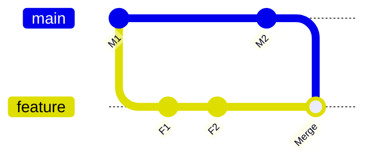

Below are detailed answers to all **17 Marsh McLennan interview questions**. Experience-based answers are examples to adapt to your actual work.

**1. What is the difference between Git Merge and Git Rebase?**

Both integrate changes from one branch into another, but they handle commit history differently.

| Aspect | Merge | Rebase |
|---|---|---|
| Method | Combines branch histories | Replays commits onto a new base |
| Existing commits | Preserves their identities | Replayed commits receive new identities |
| History | Can preserve branching and merge commits | Produces a more linear history |
| Typical use | Integrating shared branches | Updating a developer’s feature branch |
| Conflicts | Resolved during the merge | May require resolution for individual replayed commits |

A merge can fast-forward when the branches have not diverged. When they have diverged, a normal merge creates a commit with two parents. [git-merge Documentation](https://git-scm.com/docs/git-merge?utm_source=chatgpt.com)

Rebase rewrites the commits it replays. Coordinate before rebasing a branch that other developers already use, because their work may depend on its existing history. [git-rebase Documentation](https://git-scm.com/docs/git-rebase?utm_source=chatgpt.com)

A practical approach is to rebase private feature work when appropriate and use the team’s agreed merge policy for shared branches.

---

**2. Explain Merge and Rebase using `main` and `feature` branches.**

Assume:

- Both branches started at commit `M1`.
- `feature` contains commits `F1` and `F2`.
- `main` has advanced with commit `M2`.

**Merge `main` into `feature`:**

```bash
git switch feature
git merge main
```

The feature branch retains `F1` and `F2` and receives a merge commit connecting the two histories.



**Alternatively, rebase `feature` onto `main`:**

Starting from the original diverged history:

```bash
git switch feature
git rebase main
```

Git replays the feature changes after `M2`, creating new commits corresponding to `F1` and `F2`.

| Approach | Result on `feature` |
|---|---|
| Merge | Original feature commits plus a merge commit |
| Rebase | Main’s latest commits followed by rewritten feature commits |

For a rebase conflict:

```bash
git status

# Resolve the conflicting files.
git add application.py
git rebase --continue
```

To cancel:

```bash
git rebase --abort
```

These are alternative ways to update the feature branch. After testing, integrate it into `main` through the reviewed pull-request workflow. [git-rebase Documentation](https://git-scm.com/docs/git-rebase?utm_source=chatgpt.com)

---

**3. How do you reduce the size of a Docker image?**

I would inspect what contributes to the image and then change the build.

Useful commands:

```bash
docker image ls application
docker history application:release-001
```

Common improvements:

1. **Use a minimal compatible base image.** Select one that supports the application’s runtime requirements.
2. **Use multi-stage builds.** Keep compilers and build tools in the build stage.
3. **Copy only required files.** Exclude development files and local dependencies.
4. **Use `.dockerignore`.**
5. **Install only runtime dependencies.**
6. **Remove package-manager downloads in the same build step where appropriate.**
7. **Exclude unnecessary documentation, test artifacts, and generated files.**

Docker recommends appropriate base images, multi-stage builds, and controlled build contexts. [Docker Docs](https://docs.docker.com/build/building/best-practices/?utm_source=chatgpt.com)

Example `.dockerignore`:

```text
.git
.venv
__pycache__
*.log
.env
secrets/
```

Deleting a large file in a later image layer does not remove its content from an earlier layer. Prevent it from entering the final image or remove temporary content within the same relevant build step.

Validate functionality after reducing the image, particularly certificate support, native libraries, and file permissions.

---

**4. What is a multi-stage Docker build?**

A multi-stage build uses multiple `FROM` instructions. Each starts a stage, and selected artifacts can be copied between stages.

For example, a Go application can be compiled in an image containing the Go toolchain, while the final image contains only the executable and required runtime files.

```dockerfile
# Illustrative Go project with go.mod and go.sum.
FROM golang:1 AS build

WORKDIR /src

COPY go.mod go.sum ./
RUN go mod download

COPY . .

RUN CGO_ENABLED=0 GOOS=linux \
    go build -o /out/application .

FROM scratch

COPY --from=build \
    /etc/ssl/certs/ca-certificates.crt \
    /etc/ssl/certs/ca-certificates.crt

COPY --from=build \
    /out/application \
    /application

USER 65532:65532

EXPOSE 8080

ENTRYPOINT ["/application"]
```

Use reviewed base-image versions and digests for production.

The final image excludes the compiler, source tree, and build dependencies. That reduces its size and the amount of software shipped to production. Copying selected artifacts between stages is the central mechanism. [Docker Docs](https://docs.docker.com/build/building/multi-stage/?utm_source=chatgpt.com)

The runtime stage must still contain everything the application requires. `scratch` suits compatible static executables; other applications need an appropriate runtime base.

---

**5. What is Docker image layer caching?**

Build caching lets Docker reuse results from previous build steps when the instruction and relevant inputs have not changed.

Consider:

```dockerfile
COPY requirements.txt .
RUN pip install -r requirements.txt

COPY . .
```

If application code changes but `requirements.txt` remains unchanged, the dependency-installation result can be reused.

If `requirements.txt` changes, its copy step and dependent steps must be rebuilt. BuildKit can still reuse unrelated cached work.

Cache checks depend on instructions and relevant input checksums. A cached `RUN` step does not automatically rerun because an upstream package repository has changed. [Docker Docs](https://docs.docker.com/build/cache/invalidation/?utm_source=chatgpt.com)

Benefits include faster builds, fewer repeated downloads, and lower runner usage.

Build caching improves build performance. Multi-stage builds control the contents of the final image.

---

**6. How do you implement Docker image layer caching?**

Use three techniques:

**Order Dockerfile instructions carefully.**

Place stable dependency definitions before frequently changing application code:

```dockerfile
# syntax=docker/dockerfile:1

FROM python:3.12-slim

WORKDIR /app

COPY requirements.txt .

RUN --mount=type=cache,target=/root/.cache/pip \
    pip install -r requirements.txt

COPY . .

USER 10001:10001

CMD ["python", "application.py"]
```

Here:

- Unchanged requirements allow reuse of the installation step.
- The cache mount helps reuse downloaded packages when installation reruns.
- Frequently changing source is copied afterward.

**Keep the build context small.**

Use `.dockerignore` so unrelated files do not enter relevant build inputs.

**Persist cache for ephemeral CI runners.**

Hosted runners usually start fresh, so use a supported external cache backend.

These techniques—layer ordering, smaller contexts, cache mounts, and external caches—are documented BuildKit optimizations. [Docker Docs](https://docs.docker.com/build/cache/optimize/?utm_source=chatgpt.com)

Run with plain progress output to inspect expected `CACHED` steps:

```bash
docker build --progress=plain \
  -t application:release-001 .
```

Layer-cache exports and package-download cache mounts have different persistence behavior. Do not assume every cache mount is automatically preserved between hosted runners.

---

**7. Which tools do you use for Docker image caching?**

The main tools are:

| Tool or backend | Purpose |
|---|---|
| BuildKit | Build engine and cache management |
| Docker Buildx | CLI interface for advanced BuildKit builds |
| Registry cache | Share cache through a container registry |
| GitHub Actions cache backend | Persist BuildKit cache for Actions runs |
| Local cache | Persist cache on a suitable persistent runner |

Example GitHub Actions workflow:

```yaml
name: Cached image build

on:
  push:

permissions:
  contents: read

jobs:
  image:
    runs-on: ubuntu-latest

    steps:
      - name: Checkout
        uses: actions/checkout@v7

      - name: Set up Buildx
        uses: docker/setup-buildx-action@v4

      - name: Build with cache
        uses: docker/build-push-action@v7
        with:
          context: .
          load: true
          tags: application:${{ github.sha }}
          cache-from: type=gha,scope=application
          cache-to: type=gha,scope=application,mode=max
```

The action majors shown match the current official examples. Production workflows can pin approved action commit SHAs. [Docker Docs](https://docs.docker.com/build/ci/github-actions/cache/?utm_source=chatgpt.com)

For registry-backed caching:

```bash
docker buildx build \
  --cache-from type=registry,ref=registry.example.com/team/app:buildcache \
  --cache-to type=registry,ref=registry.example.com/team/app:buildcache,mode=max \
  --tag registry.example.com/team/app:release-001 \
  --push .
```

Authenticate to the registry first and use a builder supporting that backend. `mode=max` can export intermediate build cache, which is useful for multi-stage builds. [Docker Docs](https://docs.docker.com/build/cache/backends/registry/?utm_source=chatgpt.com)

---

**8. If one GitHub Actions job depends on another, which parameter do you use?**

Use **`needs`**.

```yaml
jobs:
  test:
    runs-on: ubuntu-latest
    steps:
      - run: echo "Run tests"

  build:
    needs: test
    runs-on: ubuntu-latest
    steps:
      - run: echo "Build the approved application"

  deploy:
    needs: [test, build]
    runs-on: ubuntu-latest
    steps:
      - run: echo "Deploy the approved artifact"
```

By default, required jobs must complete successfully. A failed or skipped prerequisite causes dependent jobs to be skipped unless a suitable condition changes that behavior. [GitHub Docs](https://docs.github.com/en/actions/reference/workflows-and-actions/workflow-syntax?utm_source=chatgpt.com)

`needs` establishes execution dependencies. It does not automatically transfer files between runners. Use artifacts, a registry, or job outputs to pass the required results.

---

**9. How do you prevent concurrent executions in GitHub Actions?**

Use **`concurrency`** with a group identifying the shared resource or workflow scope.

For branch CI, newer runs can replace older work:

```yaml
concurrency:
  group: ci-${{ github.workflow }}-${{ github.ref }}
  cancel-in-progress: true
```

For production deployment, serialize operations without canceling the running deployment:

```yaml
concurrency:
  group: deploy-production
  cancel-in-progress: false
  queue: max
```

Current GitHub documentation supports `queue: max`, allowing up to 100 pending runs. With the default `single` queue, a newer pending run replaces the older pending run. [GitHub Docs](https://docs.github.com/en/actions/how-tos/write-workflows/choose-when-workflows-run/control-workflow-concurrency?utm_source=chatgpt.com)

Important details:

- Groups are scoped to the repository.
- Different workflows can coordinate through the same group.
- Choose a group representing the actual shared environment or release.
- Keep cancel-on-new-run behavior on CI workflows that can safely be interrupted.

Concurrency coordinates runs; it does not make deployment operations transactional.

---

**10. What is the difference between `needs` and `concurrency`?**

| Aspect | `needs` | `concurrency` |
|---|---|---|
| Purpose | Define prerequisites | Coordinate overlapping executions |
| Main question | What must finish first? | What can run simultaneously? |
| Example | Deploy waits for build | One production deployment at a time |
| Cross-workflow coordination | Does not establish cross-workflow job dependencies | Matching groups can coordinate within a repository |
| Data transfer | Requires outputs/artifacts separately | Provides no artifact transfer |

They can be used together:

```yaml
deploy:
  needs: build
  runs-on: ubuntu-latest
  environment: production

  concurrency:
    group: deploy-production
    cancel-in-progress: false
    queue: max

  steps:
    - run: echo "Deploy the approved build"
```

This waits for the build and coordinates access to the production deployment slot.

---

**11. Walk through troubleshooting a failed Helm deployment.**

I would identify the failed layer before changing the deployment.

**Check context, release, and version.**

```bash
helm version --short
kubectl config current-context

helm list -n prod --all
helm status application -n prod
helm history application -n prod
```

Confirm the intended cluster, namespace, release name, chart version, and values.

**Validate chart rendering.**

```bash
helm lint ./chart \
  -f values-prod.yaml \
  --strict

helm template application ./chart \
  -n prod \
  -f values-prod.yaml \
  --debug
```

Helm’s debugging tools help identify template errors, missing values, and unexpected manifests. [Helm](https://helm.sh/docs/chart_template_guide/debugging/?utm_source=chatgpt.com)

**Inspect Kubernetes resources and events.**

```bash
kubectl get deploy,sts,pods,svc,pvc,jobs -n prod

kubectl get events -n prod \
  --sort-by=.metadata.creationTimestamp

kubectl describe pod POD_NAME -n prod

kubectl logs POD_NAME -n prod \
  -c CONTAINER_NAME --previous
```

| Symptom | Investigation |
|---|---|
| Template error | Values, syntax, schema, helper templates |
| Resource rejected | API version, admission policy, RBAC |
| Pod Pending | Capacity, placement rules, PVC binding |
| Image pull failure | Image reference, registry access |
| CrashLoopBackOff | Application, configuration, probes, memory |
| Readiness failure | Endpoint, port, startup time, dependencies |
| Hook failure | Hook Job status and logs |
| Ownership conflict | Existing resource ownership and release metadata |
| Timeout | Identify the resource that never became ready |

Also check hooks:

```bash
helm get hooks application -n prod
```

Rendered manifests and values can contain secrets, so handle diagnostic output appropriately. Increase timeouts only when evidence shows the workload legitimately needs more time.

---

**12. How do you roll back a partially deployed Helm release?**

A Helm upgrade can update some resources before another operation fails.

First ensure the original deployment process has stopped. Then inspect history:

```bash
helm history application -n prod
```

Select the last successful revision—for example, revision `3`:

```bash
helm rollback application 3 \
  -n prod \
  --wait \
  --wait-for-jobs \
  --timeout 5m
```

After rollback:

```bash
helm status application -n prod
helm history application -n prod
kubectl get pods -n prod
```

Run application smoke tests and inspect operational metrics. Helm rollback creates a new release revision targeting the selected earlier release. Waiting options help verify resource readiness. [Helm](https://helm.sh/docs/helm/helm_rollback/?utm_source=chatgpt.com)

For automatic rollback of an existing release:

```bash
# Helm 4
helm upgrade application ./chart \
  -n prod \
  -f values-prod.yaml \
  --rollback-on-failure \
  --timeout 5m
```

Helm 4’s flag attempts rollback to the previous successful release and enables its waiting behavior. [Helm](https://helm.sh/docs/helm/helm_upgrade/?utm_source=chatgpt.com)

```bash
# Helm 3
helm upgrade application ./chart \
  -n prod \
  -f values-prod.yaml \
  --atomic \
  --timeout 5m
```

Helm 3 uses `--atomic`, which also enables waiting. [Helm](https://helm.sh/docs/v3/helm/helm_upgrade/?utm_source=chatgpt.com)

Rollback does not reverse database contents or external side effects. CRDs also have separate lifecycle limitations. [Helm](https://helm.sh/docs/chart_best_practices/custom_resource_definitions/?utm_source=chatgpt.com)

A failed first installation has no previous successful release to restore.

---

**13. Where do you store application credentials in CI/CD?**

Choose storage according to the credential’s purpose.

| Credential | Suitable approach |
|---|---|
| GitHub Actions credentials | Restricted repository, organization, or environment secrets |
| Jenkins credentials | Appropriate Jenkins credential store or external integration |
| Cloud deployment identity | Workload federation, OIDC, or runner role |
| Application runtime credentials | Vault, AWS Secrets Manager, Azure Key Vault, or another approved manager |
| Signing keys | Approved signing/key-management service |

I would apply these controls:

- Separate development and production access.
- Use least-privilege identities.
- Prefer short-lived credentials where supported.
- Retrieve secrets only when required.
- Prevent exposure in logs, artifacts, caches, and image layers.
- Rotate and audit access.

Application workloads can retrieve their runtime credentials directly, while the pipeline holds only the permissions required to deploy them.

In GitHub Actions, protected environments can associate production deployment with environment-specific secrets and controls.

---

**14. How do you manage credentials in Jenkins?**

Use the Jenkins Credentials system or an approved external secret integration.

Typical process:

1. Add credentials to the correct store or folder.
2. Select the credential type.
3. Assign a recognizable credential ID.
4. Restrict who can use or modify the credential.
5. Bind it only around the steps requiring it.
6. Rotate its value while retaining the ID when appropriate.

Common types include username/password, secret text, SSH private key, and secret file.

Jenkins stores configured credentials encrypted on the controller and lets pipelines reference credential IDs. Protect the controller’s keys, permissions, and backups. [jenkins.io](https://www.jenkins.io/doc/book/using/using-credentials/?utm_source=chatgpt.com)

Example registry authentication:

```groovy
withCredentials([
    usernamePassword(
        credentialsId: 'production-registry',
        usernameVariable: 'REGISTRY_USER',
        passwordVariable: 'REGISTRY_PASSWORD'
    )
]) {
    sh '''#!/usr/bin/env bash
set -euo pipefail
set +x

registry_auth_dir="$(mktemp -d)"
trap 'rm -rf -- "$registry_auth_dir"' EXIT
export DOCKER_CONFIG="$registry_auth_dir"

printf '%s' "$REGISTRY_PASSWORD" |
  docker login registry.example.com \
    --username "$REGISTRY_USER" \
    --password-stdin

docker push "$IMAGE_URI"
'''
}
```

Assume `IMAGE_URI` identifies an already-built image in that registry.

Single-quoted Groovy strings allow the shell to expand the bound variables. Jenkins masking is best effort; trusted pipeline code and agents remain necessary. [jenkins.io](https://www.jenkins.io/doc/pipeline/steps/credentials-binding/?utm_source=chatgpt.com)

---

**15. Have you used HashiCorp Vault for secret management?**

Answer according to your actual experience.

A sample answer, **if it matches your work**, is:

> “I integrated Vault with CI/CD to retrieve environment-specific credentials. Workloads authenticated through a configured authentication method, and Vault policies restricted access to the required paths.
>
> We used short-lived tokens where appropriate and controlled secret access through roles and policies. For applications, I worked with secret delivery, rotation behavior, and audit requirements.”

Be prepared to explain:

- Which secrets engine you used.
- How the client authenticated.
- Which policy allowed access.
- How credentials reached the application.
- How rotation, expiry, and Vault outages were handled.

If your experience is limited to study or lab work, state that clearly and explain the workflow you understand.

Vault supports versioned static secrets through KV v2 and other engines that can issue leased credentials.

---

**16. How do you store and retrieve secrets from HashiCorp Vault?**

A typical workflow is:

1. Enable the required secrets engine.
2. Define access policies.
3. Configure authentication roles.
4. Authenticate the client.
5. Write or retrieve permitted secrets.
6. Manage rotation, versions, and audit requirements.

An authorized administrator can enable a KV v2 mount if it does not already exist:

```bash
vault secrets enable -path=secret kv-v2
```

After authenticating through an approved method, store values from a protected JSON file:

```bash
vault kv put \
  -mount=secret \
  prod/application \
  @/secure/application-secrets.json
```

Example file structure:

```json
{
  "db_username": "application_user",
  "db_password": "<securely supplied value>"
}
```

The CLI supports file-based input, avoiding secret values directly in command arguments. Protect and manage the temporary plaintext input file. [HashiCorp Developer](https://developer.hashicorp.com/vault/docs/commands/kv/put?utm_source=chatgpt.com)

Retrieve a field:

```bash
vault kv get \
  -mount=secret \
  -field=db_username \
  prod/application
```

In automation, capture sensitive output without logging it:

```bash
set +x

db_password="$(vault kv get \
  -mount=secret \
  -field=db_password \
  prod/application)"
```

Field retrieval is supported by the KV CLI. [HashiCorp Developer](https://developer.hashicorp.com/vault/docs/commands/kv/get?utm_source=chatgpt.com)

A read-only KV v2 policy might be:

```hcl
path "secret/data/prod/application" {
  capabilities = ["read"]
}
```

Attach the policy through the appropriate authentication role.

KV v2 provides versioned static secrets. Automatic issuance and expiry of database credentials requires an appropriate dynamic secrets engine and application integration. [HashiCorp Developer](https://developer.hashicorp.com/vault/docs/secrets/kv/kv-v2?utm_source=chatgpt.com)

---

**17. Which authentication methods and injectors does Vault support?**

Separate **authentication** from **secret delivery**.

Authentication verifies an identity and grants a Vault token with appropriate policies. Injection or integration delivers permitted secrets to the workload.

Common authentication methods:

| Method | Typical use |
|---|---|
| Token | Clients already holding a Vault token |
| AppRole | Machine authentication using RoleID and SecretID |
| JWT/OIDC | Federated workload or human identity |
| Kubernetes | Workload authentication using service-account identity |
| AWS | Supported AWS IAM or EC2 identity |
| Azure | Supported Azure workload identity |
| GCP | Supported Google Cloud identity |
| LDAP | Enterprise directory authentication |
| Userpass | Vault-managed username/password |
| Certificate | Client-certificate authentication |

Vault supports multiple authentication methods and associates authenticated access with policies. [HashiCorp Developer](https://developer.hashicorp.com/vault/docs/auth?utm_source=chatgpt.com)

For GitHub Actions, JWT authentication can use the workflow’s OIDC identity. Restrict the Vault role through appropriate audience and bound claims, such as the approved repository and deployment context. [HashiCorp Developer](https://developer.hashicorp.com/vault/docs/auth/jwt?utm_source=chatgpt.com)

Common delivery mechanisms:

| Mechanism | How secrets reach the workload |
|---|---|
| Vault Agent Injector | Injected init/sidecar agents render secret files |
| Vault CSI provider | Secrets Store CSI volumes mount secret files |
| Vault Secrets Operator | Synchronizes configured Vault secrets into Kubernetes Secrets |
| Vault Agent outside Kubernetes | Authenticates and renders files for services |
| CLI, SDK, or CI integration | Client retrieves permitted secrets directly |

The Agent Injector can use an init container to prepopulate files and a sidecar to continue authentication and rendering. [HashiCorp Developer](https://developer.hashicorp.com/vault/docs/platform/k8s/injector?utm_source=chatgpt.com)

The CSI provider uses the Secrets Store CSI Driver and workload identity to retrieve and mount secrets. [HashiCorp Developer](https://developer.hashicorp.com/vault/docs/platform/k8s/csi?utm_source=chatgpt.com)

The Secrets Operator synchronizes secrets into Kubernetes resources, so Kubernetes encryption and RBAC remain part of the design. [HashiCorp Developer](https://developer.hashicorp.com/vault/docs/platform/k8s/vso?utm_source=chatgpt.com)

Choose the mechanism according to application consumption, startup requirements, rotation, and reload behavior. Updating a secret does not automatically make every application process use the new value.
