# NICE · Cloud Site Reliability Engineer Interview Prep

Experience level: 3 years · Prepared October 2026

Thirty questions from two NICE interview rounds, merged where they overlap into 21 sections: profile, project and "client-based or only deployments" (Q1); what Terraform is, how it was configured, and familiarity with it (Q2); Deployment and Deployment vs StatefulSet (Q7); monitoring set-up and Grafana dashboards (Q18); both YAML-pipeline questions (Q15); and the three Azure Key Vault questions (Q19).

Several questions are about you: your profile, your project, the 60% pipeline improvement on your CV, a recent challenge. For those, each answer gives a structure plus a **sample** built on one consistent example project (below). Replace every sample detail with your own; interviewers drill into whatever you claim. Answers are pitched at a 3-year SRE: hands-on, specific, with the reasoning behind each choice.

Diagrams are Mermaid blocks; they render on GitHub, GitLab, Obsidian, Notion and in published artifacts.

**The sample project used throughout** (replace with yours): a multi-tenant customer-engagement SaaS platform on Azure (AKS, Azure SQL, Redis, Service Bus, Front Door) with a few services on AWS; three environments called E1 (development), E2 (QA/staging) and E3 (production); Terraform, Azure DevOps YAML pipelines, Helm, Argo CD, Prometheus and Grafana, and Key Vault.

**Contents**

- Profile: Q1 your profile, your project, client-based or deployment-only
- Terraform: Q2 Terraform and how you configured it · Q3 modules · Q4 a highly scalable infrastructure you provisioned
- Docker: Q5 CMD vs ENTRYPOINT · Q6 ADD vs COPY
- Kubernetes and Helm: Q7 Deployment vs StatefulSet · Q8 a scalable, highly available container platform · Q9 deployment, scaling and rollback, a scenario · Q10 handling Helm charts
- CI/CD and GitOps: Q11 CI/CD · Q12 the 60% pipeline improvement · Q13 automated testing · Q14 SonarQube · Q15 YAML vs classic pipelines · Q16 branching for a large team · Q17 Argo CD for E1, E2 and E3
- Observability and security: Q18 monitoring set-up and Grafana dashboards · Q19 Azure Key Vault
- Experience: Q20 a recent challenge · Q21 other cloud platforms

---

## Part 1 · Profile and project

### Q1. Brief me through your profile and explain your project. Is it client-based work, or are you only involved in deployments?

**How to answer:** two minutes, in this order: who you are (role, years, domain); the platform you run, in one breath; what you own end to end; two results with numbers; why this role. Then be ready to draw the architecture. For the "client-based or only deployments" follow-up, state the engagement model plainly and show that your ownership goes beyond pushing releases: infrastructure, pipelines, reliability, on-call and incident follow-up.

**Sample profile (replace with your own):**

> "I'm a Cloud SRE with about three years of experience. I work on a multi-tenant customer-engagement SaaS platform that runs mainly on Azure, with a few services on AWS. I own the Kubernetes platform on AKS across three environments, E1 to E3: the Terraform for the infrastructure, the Azure DevOps YAML pipelines, Helm charts and Argo CD for deployments, and Prometheus and Grafana for monitoring and alerting. I'm on the on-call rotation and I run postmortems. Two results I'm proud of: I cut our pipeline time by about 60% with caching, parallel stages and shared templates, and I moved our secrets from pipeline variables into Key Vault with workload identity, so no pipeline stores a credential any more. I'm interested in NICE because running cloud platforms at this scale for customer-engagement products is exactly the reliability work I want to grow in."

**Sample project architecture:**

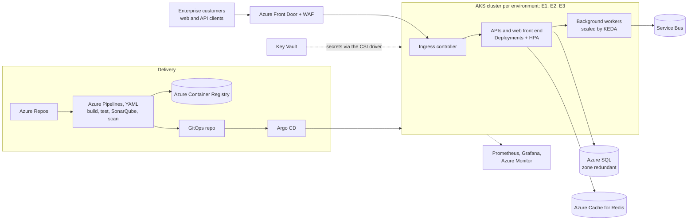

Walk through it in this order: how a request flows (Front Door → ingress → services → data), how a change flows (commit → pipeline → registry → GitOps repo → Argo CD), and how you know it's healthy (metrics, logs, alerts, SLOs). Mention one design decision and why you made it, for example "workers scale on Service Bus queue length with KEDA, because CPU doesn't reflect their backlog".

**"Is it client-based work, or are you only in the middle of deployments?"**

- *Product company (sample):* "It's our own product; we have enterprise customers but no client projects. My team owns the platform end to end: we build the infrastructure, write the pipelines, deploy, and run it in production, including on-call."
- *Service company (sample):* "I work at a services company on a long-term engagement for <client>. I'm embedded in their platform team, so I own the same things their engineers do: Terraform, pipelines, Kubernetes, monitoring and on-call, not just running their releases."

Either way, add one sentence that proves ownership beyond deployments: "Last quarter I designed the KEDA-based autoscaling for the workers and wrote the postmortem for the Redis failover incident."

---

## Part 2 · Terraform

### Q2. What is Terraform, and how did you configure it in your project?

**Short answer:** Terraform is an infrastructure-as-code tool. You declare the infrastructure you want in HCL files; Terraform compares that with its state file and the real cloud, shows a plan, and applies only the differences through provider plugins (azurerm, aws, kubernetes and many more). It builds a dependency graph so resources are created in the right order, and the state file records what it manages. Terraform has been licensed under the Business Source License since version 1.6; OpenTofu is the open-source fork with the same workflow.

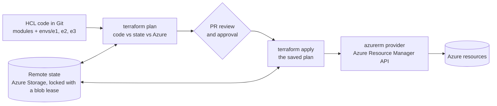

| Command | What it does |
|---|---|
| `terraform init` | Downloads providers and modules, configures the backend |
| `terraform fmt` / `validate` | Formats the code; checks syntax and internal consistency |
| `terraform plan -out=tfplan` | Shows and saves the changes it would make |
| `terraform apply tfplan` | Applies exactly the reviewed plan |
| `terraform destroy` | Removes everything the configuration manages |
| `terraform state list` / `state mv` / `import` | Inspects or reshapes the state, and adopts existing resources |

**How it was configured in the sample project:**

```text
infra/
├── modules/
│   ├── network/          # VNet, subnets, NSGs, private DNS zones
│   ├── aks/              # AKS cluster, node pools, workload identity
│   ├── keyvault/
│   ├── sql/
│   └── monitoring/       # Log Analytics, Azure Monitor workspace, action groups
└── envs/
    ├── e1/               # main.tf, backend.tf, e1.tfvars
    ├── e2/
    └── e3/
```

- **One directory and one state file per environment** (rather than workspaces), so E1 changes can never touch E3 state, and each environment can have its own access rights.
- **Remote state** in an Azure Storage account with blob-lease locking, versioning and soft delete; authentication through Entra ID, not storage keys.
- **Pinned versions:** `required_version`, provider version constraints and the committed `.terraform.lock.hcl`.
- **No secrets in tfvars:** secrets are generated or read from Key Vault, and outputs that contain them are marked `sensitive`.

```hcl
# envs/e3/backend.tf
terraform {
  required_version = ">= 1.6"
  required_providers {
    azurerm = {
      source  = "hashicorp/azurerm"
      version = "~> 4.0"
    }
  }
  backend "azurerm" {
    resource_group_name  = "rg-tfstate"
    storage_account_name = "sttfstateorders001"
    container_name       = "tfstate"
    key                  = "e3/platform.tfstate"
    use_azuread_auth     = true            # Entra ID instead of storage account keys
  }
}

provider "azurerm" {
  features {}
  subscription_id = var.subscription_id   # required since azurerm 4.0
}
```

**The pipeline:** plan on every pull request, apply the saved plan on `main` after an approval, with credentials from a workload identity federation service connection (no client secret anywhere):

```yaml
trigger:
  branches:
    include: [main]
  paths:
    include: [infra]
pr:
  paths:
    include: [infra]

stages:
- stage: Plan
  jobs:
  - job: plan
    pool:
      vmImage: ubuntu-latest
    steps:
    - task: AzureCLI@2
      displayName: terraform init, validate, plan
      inputs:
        azureSubscription: sc-e3-wif                 # workload identity federation
        scriptType: bash
        scriptLocation: inlineScript
        addSpnToEnvironment: true                    # exposes servicePrincipalId, tenantId and idToken
        inlineScript: |
          export ARM_CLIENT_ID=$servicePrincipalId ARM_TENANT_ID=$tenantId
          export ARM_OIDC_TOKEN=$idToken ARM_USE_OIDC=true
          export ARM_SUBSCRIPTION_ID=$(az account show --query id -o tsv)
          cd infra/envs/e3
          terraform init -input=false
          terraform fmt -check -recursive ../..
          terraform validate
          terraform plan -input=false -var-file=e3.tfvars -out=tfplan
    - publish: infra/envs/e3/tfplan
      artifact: tfplan-e3

- stage: Apply
  dependsOn: Plan
  condition: and(succeeded(), eq(variables['Build.SourceBranch'], 'refs/heads/main'))
  jobs:
  - deployment: apply
    environment: infra-e3                            # approval check on this Environment
    pool:
      vmImage: ubuntu-latest
    strategy:
      runOnce:
        deploy:
          steps:
          - checkout: self
          - download: current
            artifact: tfplan-e3
          - task: AzureCLI@2
            displayName: terraform apply
            inputs:
              azureSubscription: sc-e3-wif
              scriptType: bash
              scriptLocation: inlineScript
              addSpnToEnvironment: true
              inlineScript: |
                export ARM_CLIENT_ID=$servicePrincipalId ARM_TENANT_ID=$tenantId
                export ARM_OIDC_TOKEN=$idToken ARM_USE_OIDC=true
                export ARM_SUBSCRIPTION_ID=$(az account show --query id -o tsv)
                cd infra/envs/e3
                terraform init -input=false
                terraform apply -input=false "$(Pipeline.Workspace)/tfplan-e3/tfplan"
```

Also in the pipeline: `tflint` and Checkov on pull requests, and a nightly `terraform plan -detailed-exitcode` per environment that alerts when someone changes something in the portal (exit code 2 means drift).

**"Are you familiar with Terraform?" (sample):** "Yes, I've used it daily for about two years: I wrote our network, AKS and Key Vault modules, migrated the remaining portal-built resources into Terraform with `import` blocks, and run plan and apply through Azure Pipelines with approvals for E3."

**In the interview:** "Terraform is declarative IaC: code, plan, apply, with a state file tracking what it manages. We kept reusable modules plus one directory and one remote state per environment in Azure Storage, pinned provider versions, and ran plan on PRs and apply of the saved plan on main after approval, authenticated with workload identity federation. A nightly plan catches drift."

---

### Q3. What are modules in Terraform?

**Short answer:** a module is a folder of Terraform files that creates a group of resources used together, such as a network, an AKS cluster or a Key Vault with its private endpoint. It takes inputs (variables), exposes outputs, and hides its internals. Every configuration is itself the *root module*; the modules it calls are *child modules*. Modules give you reuse, consistency across environments and a single place to fix things.

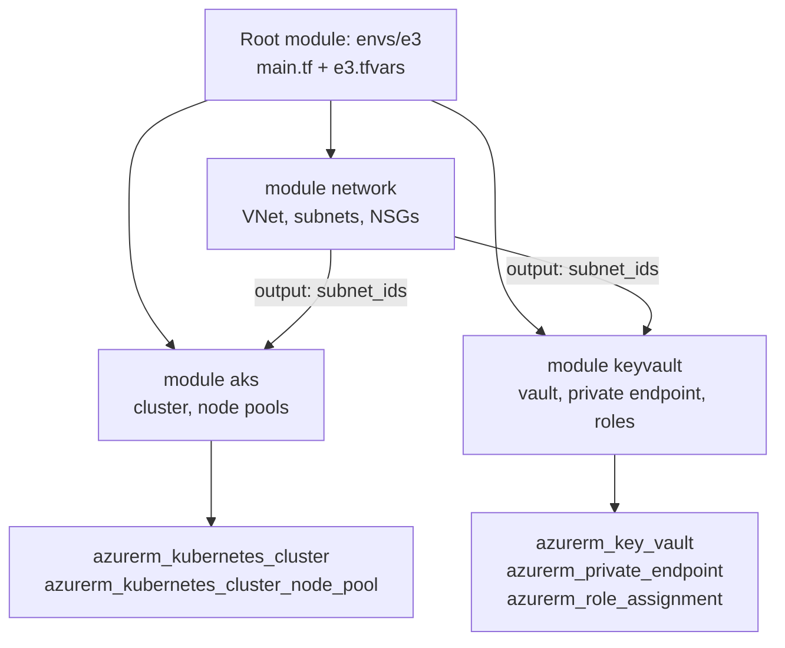

A small module (`modules/aks`):

```hcl
# modules/aks/variables.tf
variable "name" {
  type = string
}
variable "location" {
  type = string
}
variable "resource_group_name" {
  type = string
}
variable "subnet_id" {
  type = string
}
variable "kubernetes_version" {
  type = string
}
variable "system_min_count" {
  type    = number
  default = 3
  validation {
    condition     = var.system_min_count >= 1
    error_message = "system_min_count must be at least 1."
  }
}

# modules/aks/main.tf
resource "azurerm_kubernetes_cluster" "this" {
  name                = var.name
  location            = var.location
  resource_group_name = var.resource_group_name
  dns_prefix          = var.name
  kubernetes_version  = var.kubernetes_version

  default_node_pool {
    name                         = "system"
    vm_size                      = "Standard_D4s_v5"
    vnet_subnet_id               = var.subnet_id
    zones                        = ["1", "2", "3"]
    auto_scaling_enabled         = true
    min_count                    = var.system_min_count
    max_count                    = 6
    only_critical_addons_enabled = true      # keep app pods off the system pool
  }

  identity {
    type = "SystemAssigned"
  }

  network_profile {
    network_plugin      = "azure"
    network_plugin_mode = "overlay"
  }

  oidc_issuer_enabled       = true           # needed for workload identity
  workload_identity_enabled = true
}

# modules/aks/outputs.tf
output "id" {
  value = azurerm_kubernetes_cluster.this.id
}
output "oidc_issuer_url" {
  value = azurerm_kubernetes_cluster.this.oidc_issuer_url
}
```

Calling it from an environment, from Git with a pinned version:

```hcl
# envs/e3/main.tf
module "aks" {
  source              = "git::https://dev.azure.com/example/platform/_git/terraform-modules//aks?ref=v2.3.0"
  name                = "aks-orders-e3"
  location            = "centralindia"
  resource_group_name = azurerm_resource_group.platform.name
  subnet_id           = module.network.subnet_ids["aks"]
  kubernetes_version  = "1.35"
  system_min_count    = 3
}
```

| Module source | Example |
|---|---|
| Local path | `source = "../../modules/aks"` |
| Terraform Registry | `source = "Azure/avm-res-keyvault-vault/azurerm"` with a `version` constraint |
| Git with a tag | `source = "git::https://...//aks?ref=v2.3.0"` |
| Private registry | HCP Terraform / Terraform Enterprise private module registry |

Good-practice points:

- **Small and focused:** one concern per module; avoid modules that wrap a single resource with no added value.
- **Versioned:** tag releases (semantic versioning) and pin them, so upgrading E3 is a deliberate change.
- **Clear interface:** typed variables with `validation` blocks, documented inputs and outputs (`terraform-docs` generates the README), sensible defaults.
- **No provider blocks inside child modules:** the root module configures providers and passes them in.
- **Tested:** `terraform test` (built in since 1.6) or Terratest in the module's own pipeline.
- **Azure Verified Modules (AVM)** are Microsoft-maintained modules worth checking before writing your own.

**In the interview:** "A module is a reusable package of resources with inputs and outputs; the environment folder is the root module that wires them together. Our network, AKS and Key Vault modules live in their own repo, tagged and pinned per environment, so E1 can try v2.4 while E3 stays on v2.3 until it's proven."

---

### Q4. Describe a real scenario where you used Terraform to provision highly scalable infrastructure

**How to answer:** STAR with the architecture, the scaling mechanisms at each layer and a measurable outcome. The sample below is built on Azure, with AWS equivalents at the end.

**Sample (replace with your own):**

- **Situation:** the platform ran on a single-zone AKS cluster with fixed node counts. A marketing campaign was expected to bring about five times normal traffic, and a zone outage would have taken everything down.
- **Task:** rebuild E3 to scale automatically and survive a zone failure, entirely in Terraform so E1 and E2 could match it.
- **Action:** the architecture below, built from our modules:

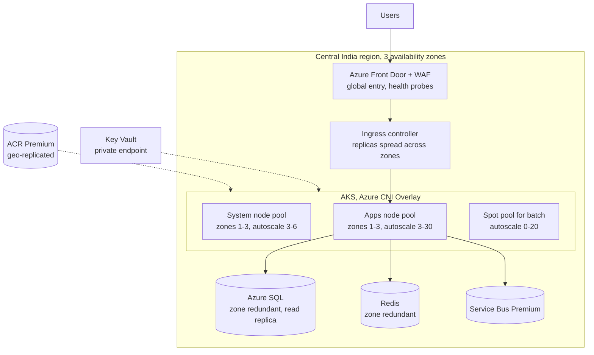

The key Terraform pieces:

```hcl
module "aks" {
  source              = "git::https://dev.azure.com/example/platform/_git/terraform-modules//aks?ref=v2.3.0"
  name                = "aks-orders-e3"
  location            = "centralindia"
  resource_group_name = azurerm_resource_group.platform.name
  subnet_id           = module.network.subnet_ids["aks"]
  kubernetes_version  = "1.35"
}

resource "azurerm_kubernetes_cluster_node_pool" "apps" {
  name                  = "apps"
  kubernetes_cluster_id = module.aks.id
  vm_size               = "Standard_D8s_v5"
  vnet_subnet_id        = module.network.subnet_ids["aks"]
  zones                 = ["1", "2", "3"]
  auto_scaling_enabled  = true
  min_count             = 3
  max_count             = 30
  node_labels           = { workload = "apps" }
  upgrade_settings {
    max_surge = "33%"                       # faster, safer node image upgrades
  }
}

resource "azurerm_kubernetes_cluster_node_pool" "spot" {
  name                  = "spot"
  kubernetes_cluster_id = module.aks.id
  vm_size               = "Standard_D8s_v5"
  vnet_subnet_id        = module.network.subnet_ids["aks"]
  priority              = "Spot"
  eviction_policy       = "Delete"
  spot_max_price        = -1                # pay up to the on-demand price
  auto_scaling_enabled  = true
  min_count             = 0
  max_count             = 20
  node_labels           = { workload = "batch" }
  node_taints           = ["kubernetes.azure.com/scalesetpriority=spot:NoSchedule"]
}
```

On the Kubernetes side the same project added HPA for the APIs, KEDA on Service Bus queue length for the workers, PodDisruptionBudgets and zone topology spread (Q8), all delivered by Argo CD.

- **Result (sample):** the campaign peak of about 5× normal traffic was absorbed by scaling from 6 to 22 app nodes, p95 latency stayed under 300 ms, and a later zone incident caused no customer-visible outage. The spot pool cut batch compute cost by roughly 60%. Because everything was in modules, E1 and E2 got the same design with smaller limits in an afternoon.

| Layer | Azure (sample) | AWS equivalent |
|---|---|---|
| Global entry and WAF | Front Door + WAF | CloudFront + AWS WAF, Route 53 |
| Kubernetes | AKS with zone-spread node pools and cluster autoscaler | EKS with multi-AZ node groups, Cluster Autoscaler or Karpenter |
| Batch capacity | Spot node pool | Spot instances via Karpenter or a spot node group |
| Database | Azure SQL zone redundant, read replicas | RDS or Aurora Multi-AZ, read replicas |
| Cache | Azure Cache for Redis, zone redundant | ElastiCache for Redis, Multi-AZ |
| Queue | Service Bus | SQS / Amazon MQ |
| Registry | ACR Premium, geo-replicated | ECR with cross-region replication |

**In the interview:** "We rebuilt E3 in Terraform for zone redundancy and autoscaling: Front Door in front, AKS with system, app and spot pools spread across three zones with the cluster autoscaler, zone-redundant SQL and Redis, Service Bus for buffering. HPA and KEDA scale the pods and the autoscaler adds nodes, so a 5× peak needed no manual action. The modules meant E1 and E2 matched production design with smaller limits."

---

## Part 3 · Docker

### Q5. What is the difference between CMD and ENTRYPOINT in Docker?

**Short answer:** `ENTRYPOINT` defines the executable the container always runs; `CMD` provides default arguments (or a default command when there is no `ENTRYPOINT`). Anything you type after the image name in `docker run` replaces `CMD`, while replacing `ENTRYPOINT` needs the explicit `--entrypoint` flag. Used together, `ENTRYPOINT` fixes *what* runs and `CMD` sets the overridable *defaults*. In Kubernetes, `command` overrides `ENTRYPOINT` and `args` overrides `CMD`.

```dockerfile
FROM alpine:3.20
ENTRYPOINT ["ping"]
CMD ["-c", "3", "localhost"]
```

```bash
docker build -t pinger .
docker run pinger                          # runs: ping -c 3 localhost
docker run pinger -c 1 8.8.8.8             # runs: ping -c 1 8.8.8.8   (CMD replaced)
docker run -it --entrypoint sh pinger      # runs: sh                  (ENTRYPOINT replaced)
```

How they combine (exec form, the JSON array, is assumed unless stated):

| Dockerfile has | Container runs |
|---|---|
| Only `CMD ["nginx", "-g", "daemon off;"]` | `nginx -g "daemon off;"`; `docker run image bash` replaces it entirely |
| Only `ENTRYPOINT ["ping"]` | `ping`, with any `docker run` arguments appended |
| `ENTRYPOINT ["ping"]` + `CMD ["-c", "3", "localhost"]` | `ping -c 3 localhost`; run-time arguments replace only the CMD part |
| Shell form `ENTRYPOINT ping localhost` | `/bin/sh -c "ping localhost"`; CMD and run-time arguments are ignored |

**Exec form vs shell form matters for shutdowns.** In exec form (`["java", "-jar", "app.jar"]`) the process is PID 1 and receives SIGTERM directly, so `docker stop` and Kubernetes rolling updates shut it down gracefully. In shell form (`java -jar app.jar`) PID 1 is `/bin/sh`, which may not forward the signal, so the process is killed after the grace period.

**The wrapper-script pattern** combines both: the entrypoint script does start-up work, then hands over to CMD.

```dockerfile
COPY docker-entrypoint.sh /usr/local/bin/
ENTRYPOINT ["docker-entrypoint.sh"]
CMD ["java", "-jar", "/app/app.jar"]
```

```sh
#!/bin/sh
set -e
# start-up work: validate required settings, wait for dependencies, prepare config
: "${DB_HOST:?DB_HOST must be set}"
echo "starting with profile ${SPRING_PROFILES_ACTIVE:-default}"
exec "$@"        # replace the shell with CMD, so the app becomes PID 1 and receives SIGTERM
```

The same image in Kubernetes:

```yaml
containers:
- name: pinger
  image: myorg/pinger:1.0
  command: ["ping"]                  # overrides ENTRYPOINT
  args: ["-c", "5", "10.0.0.1"]     # overrides CMD
```

**In the interview:** "ENTRYPOINT is the fixed executable, CMD the default arguments; `docker run` arguments replace CMD, and only `--entrypoint` replaces ENTRYPOINT. I use exec form so the app is PID 1 and gets SIGTERM, and an entrypoint script ending in `exec "$@"` when start-up logic is needed. In Kubernetes, `command` maps to ENTRYPOINT and `args` to CMD."

---

### Q6. What is the difference between ADD and COPY?

**Short answer:** both copy files into the image. `COPY` does only that: files and folders from the build context (or, with `--from`, from another build stage). `ADD` can also unpack local tar archives automatically and download from URLs (and Git repositories). That extra behaviour makes `ADD` less predictable, so use `COPY` by default and `ADD` only when you specifically want local tar extraction.

| | `COPY` | `ADD` |
|---|---|---|
| Local files and folders | Yes | Yes |
| Auto-extracts local tar archives (gzip, bzip2, xz) | No, copies the archive as a file | Yes, unpacks into the destination |
| Remote URLs | No | Yes (downloaded, not extracted); `--checksum` can verify the download |
| Git repositories | No | Yes, with BuildKit |
| Copy from another build stage (`--from`) | Yes | No |
| `--chown` / `--chmod` | Yes | Yes |
| Recommended | Default choice | Only for unpacking local tarballs |

```dockerfile
# COPY: predictable, the default
COPY requirements.txt /app/
COPY --from=build /src/target/app.jar /app/app.jar        # multi-stage builds need COPY
COPY --chown=app:app config/ /app/config/

# ADD: unpacks the local archive into /opt/tool
ADD tool-2.1.0-linux-amd64.tar.gz /opt/tool/

# Downloading: prefer RUN with verification, so you control caching and clean up in one layer
RUN curl -fsSL -o /tmp/tool.tgz https://example.com/tool-2.1.0.tgz \
 && echo "<expected-sha256>  /tmp/tool.tgz" | sha256sum -c - \
 && tar -xzf /tmp/tool.tgz -C /opt \
 && rm /tmp/tool.tgz
```

Why `ADD` with URLs is discouraged: the file isn't verified unless you add `--checksum`, and you can't delete it in the same layer, so the downloaded bytes stay in the image if you only needed part of them. `RUN curl … && rm` downloads, verifies, extracts and cleans up in one layer.

**In the interview:** "COPY copies from the build context or another stage and nothing else; ADD additionally unpacks local tar files and can fetch URLs. I use COPY everywhere and ADD only to unpack a local tarball; for downloads I use `RUN curl` with a checksum check so the archive doesn't stay in a layer."

---

## Part 4 · Kubernetes and Helm

### Q7. What is a Deployment, and how is it different from a StatefulSet?

**Short answer:** a Deployment runs stateless, interchangeable pods. It manages them through ReplicaSets and gives you declarative rolling updates, rollback, scaling and self-healing; pods get random names, and any pod can serve any request. A StatefulSet is for stateful applications that need a stable identity: each pod has a fixed ordinal name (`db-0`, `db-1`), a stable DNS name through a headless Service, and its own PersistentVolumeClaim that follows it across restarts. StatefulSet pods are created, scaled and updated in order.

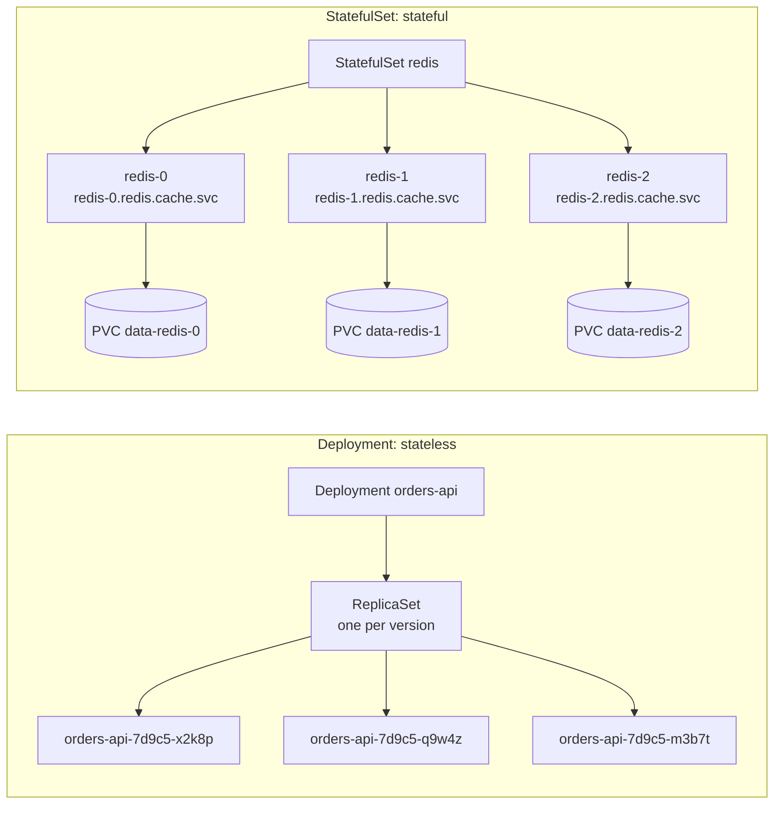

| | Deployment | StatefulSet |
|---|---|---|
| Pod names | Random suffix (`orders-api-7d9c5-x2k8p`) | Stable ordinal (`redis-0`, `redis-1`) |
| Network identity | Through a Service only | Stable per-pod DNS through a headless Service |
| Storage | Shared or none; every pod is the same | One PVC per pod from `volumeClaimTemplates`, kept when the pod is rescheduled |
| Start, scale and delete order | Any order, in parallel | In order (0, 1, 2…); scale-down from the highest ordinal |
| Rolling update | New ReplicaSet, `maxSurge` / `maxUnavailable` | One pod at a time, highest ordinal first; `partition` for canaries |
| Rollback | `kubectl rollout undo` to a previous ReplicaSet | Re-apply the previous spec; data changes are not rolled back |
| Use for | APIs, web front ends, workers | Databases, Kafka, ZooKeeper, Elasticsearch, Redis clusters |

**What is a Deployment?** A controller that keeps a desired number of identical pods running and changes them safely. You declare the pod template and replica count; on a change it creates a new ReplicaSet and shifts pods over gradually, keeps old ReplicaSets for rollback, and replaces pods that die.

```yaml
apiVersion: apps/v1
kind: Deployment
metadata:
  name: orders-api
  namespace: orders
spec:
  replicas: 3
  revisionHistoryLimit: 10                # old ReplicaSets kept for rollback
  selector:
    matchLabels:
      app: orders-api
  strategy:
    type: RollingUpdate
    rollingUpdate:
      maxSurge: 25%                       # extra pods allowed during the update
      maxUnavailable: 0                   # never drop below the desired count
  template:
    metadata:
      labels:
        app: orders-api
    spec:
      containers:
      - name: orders-api
        image: acrorders.azurecr.io/orders-api:2.4.0
        ports:
        - containerPort: 8080
        readinessProbe:
          httpGet: { path: /actuator/health/readiness, port: 8080 }
        resources:
          requests: { cpu: 250m, memory: 512Mi }
          limits: { memory: 1Gi }
```

A StatefulSet with its headless Service:

```yaml
apiVersion: v1
kind: Service
metadata:
  name: redis
  namespace: cache
spec:
  clusterIP: None                         # headless: gives each pod a DNS name
  selector:
    app: redis
  ports:
  - port: 6379
---
apiVersion: apps/v1
kind: StatefulSet
metadata:
  name: redis
  namespace: cache
spec:
  serviceName: redis
  replicas: 3
  selector:
    matchLabels:
      app: redis
  template:
    metadata:
      labels:
        app: redis
    spec:
      containers:
      - name: redis
        image: redis:7.4
        ports:
        - containerPort: 6379
        volumeMounts:
        - name: data
          mountPath: /data
  volumeClaimTemplates:
  - metadata:
      name: data
    spec:
      accessModes: [ReadWriteOnce]
      storageClassName: managed-csi-premium
      resources:
        requests:
          storage: 20Gi
```

```bash
kubectl rollout status deployment/orders-api -n orders
kubectl rollout history deployment/orders-api -n orders
kubectl rollout undo deployment/orders-api -n orders
kubectl scale statefulset redis -n cache --replicas=5     # creates redis-3, then redis-4
kubectl get pvc -n cache                                  # data-redis-0 ... one claim per pod
```

Points worth adding: deleting or scaling down a StatefulSet does not delete its PVCs by default (`persistentVolumeClaimRetentionPolicy` controls that), and in production we prefer managed databases (Azure SQL, Azure Cache for Redis) or a mature operator over hand-written StatefulSets, because backups, failover and upgrades are the hard part.

**In the interview:** "A Deployment manages identical stateless pods through ReplicaSets, with rolling updates and one-command rollback. A StatefulSet gives each pod a stable name, DNS entry and its own volume, and updates them in order, which is what databases and Kafka need. Our APIs and workers are Deployments; stateful pieces are managed services, and the one StatefulSet we run is an internal Redis for a legacy feature."

---

### Q8. How do you design and manage a containerized environment for scalability and high availability?

**Short answer:** remove single points of failure and add automatic scaling at every layer. Run a managed Kubernetes cluster with node pools spread across availability zones and the cluster autoscaler. Run every workload with several replicas spread across zones and nodes, protected by PodDisruptionBudgets and accurate probes, and scaled by HPA (or KEDA for queue-driven workers). Put a health-checking load balancer in front, keep data in zone-redundant managed services, and keep a recovery plan for losing a whole region. Everything is defined in code (Terraform, Helm, GitOps), so the environment can be rebuilt and every change is reviewable.

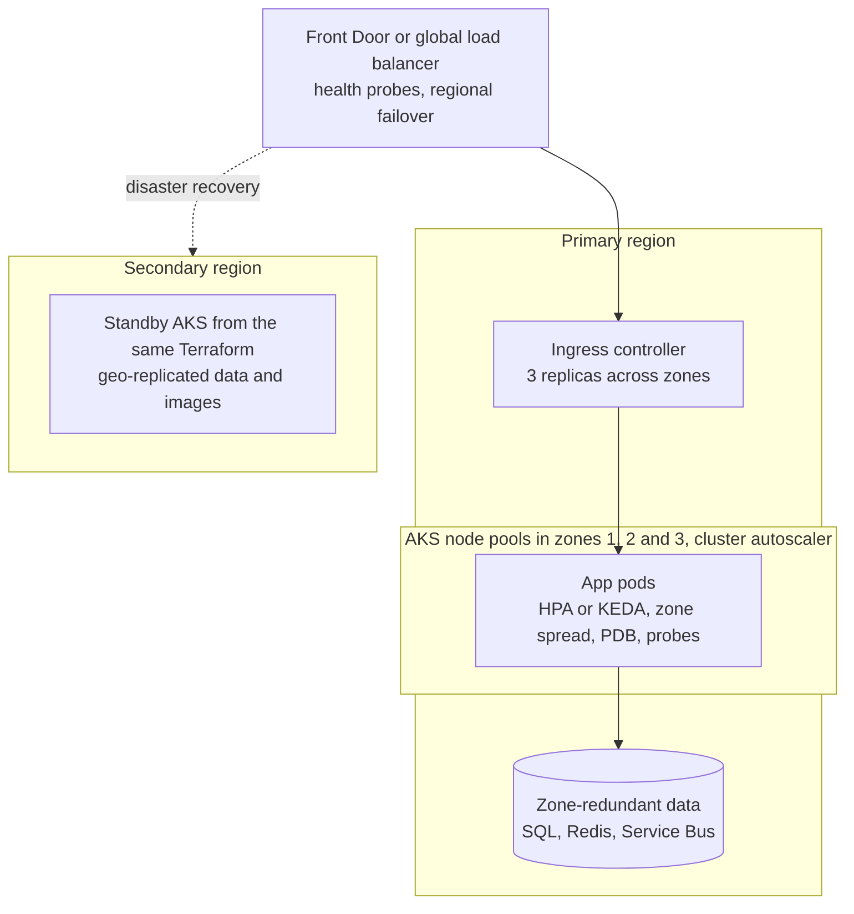

| Layer | Scalability | High availability |
|---|---|---|
| Cluster | Cluster autoscaler (or Karpenter / AKS node auto-provisioning); separate system, app and spot pools | Managed control plane with an uptime SLA; node pools across 3 zones; regular node image upgrades with surge |
| Workload | HPA on CPU, memory or custom metrics; KEDA on queue length; right-sized requests | 3+ replicas, topology spread across zones and nodes, PodDisruptionBudgets, readiness/liveness/startup probes, graceful shutdown |
| Traffic | Ingress replicas autoscaled; CDN and caching at the edge | Health-probing load balancers; connection draining during deploys |
| Data | Read replicas, caching (Redis), queues to absorb bursts | Zone-redundant managed databases, backups with point-in-time restore, geo-replication for DR |
| Delivery | Same images and charts everywhere; build once | Rolling or canary releases with automatic rollback; GitOps so drift is reverted |
| Operations | Capacity dashboards, load tests before peaks | SLOs and alerts, runbooks, chaos tests, rehearsed DR failover |

The workload pieces in YAML:

```yaml
# Deployment excerpt: spread across zones and nodes, shut down gracefully
spec:
  replicas: 3
  template:
    spec:
      topologySpreadConstraints:
      - maxSkew: 1
        topologyKey: topology.kubernetes.io/zone
        whenUnsatisfiable: DoNotSchedule
        labelSelector:
          matchLabels:
            app: orders-api
      - maxSkew: 1
        topologyKey: kubernetes.io/hostname
        whenUnsatisfiable: ScheduleAnyway
        labelSelector:
          matchLabels:
            app: orders-api
      terminationGracePeriodSeconds: 45
      containers:
      - name: orders-api
        image: acrorders.azurecr.io/orders-api:2.4.0
        lifecycle:
          preStop:
            exec:
              command: ["sh", "-c", "sleep 10"]    # let the load balancer stop sending traffic first
---
apiVersion: policy/v1
kind: PodDisruptionBudget
metadata:
  name: orders-api
  namespace: orders
spec:
  minAvailable: 2                                  # node upgrades and drains keep 2 pods serving
  selector:
    matchLabels:
      app: orders-api
---
apiVersion: autoscaling/v2
kind: HorizontalPodAutoscaler
metadata:
  name: orders-api
  namespace: orders
spec:
  scaleTargetRef:
    apiVersion: apps/v1
    kind: Deployment
    name: orders-api
  minReplicas: 3
  maxReplicas: 30
  metrics:
  - type: Resource
    resource:
      name: cpu
      target:
        type: Utilization
        averageUtilization: 65
  behavior:
    scaleDown:
      stabilizationWindowSeconds: 300              # avoid flapping after a spike
```

Queue-driven workers scale on backlog rather than CPU, with KEDA:

```yaml
apiVersion: keda.sh/v1alpha1
kind: ScaledObject
metadata:
  name: invoice-worker
  namespace: orders
spec:
  scaleTargetRef:
    name: invoice-worker
  minReplicaCount: 1
  maxReplicaCount: 50
  triggers:
  - type: azure-servicebus
    metadata:
      queueName: invoices
      namespace: sb-orders-e3                     # the Service Bus namespace
      messageCount: '100'                          # target messages per replica
    authenticationRef:
      name: servicebus-workload-identity           # TriggerAuthentication using workload identity
```

**In the interview:** "No single points of failure and automatic scaling at every layer: zone-spread node pools with the cluster autoscaler, at least three replicas per service with topology spread, PDBs and real probes, HPA for APIs and KEDA for queue workers, zone-redundant managed data behind a health-checking front door, and a standby region built from the same Terraform. It's all in Git, so it's reproducible and every change is reviewed."

---

### Q9. In Kubernetes, how do you manage application deployment, scaling and rollback? Walk through a specific scenario

**Short answer:** deployments go through GitOps: a pull request changes the image tag for an environment and Argo CD applies it. Releases use a rolling update, or a canary with automated analysis for critical services. Scaling is automatic (HPA or KEDA for pods, the cluster autoscaler for nodes), with manual scaling only for planned events. Rollback is a Git revert (or an automatic canary abort), with `kubectl rollout undo` kept for emergencies and followed by a revert so Git matches the cluster.

**Scenario (sample): releasing orders-api 2.4.0 to E3**

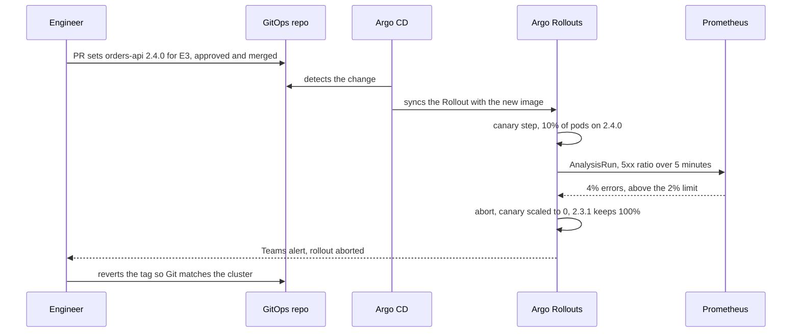

1. **Deploy.** The pipeline built and tested 2.4.0 and it ran in E1 and E2. A pull request to the GitOps repo changes the E3 image tag; after approval and merge, Argo CD syncs it.
2. **Release gradually.** orders-api uses an Argo Rollouts canary: 10% of pods first, then 50%, then 100%, with an analysis step querying Prometheus between steps.

```yaml
apiVersion: argoproj.io/v1alpha1
kind: Rollout
metadata:
  name: orders-api
  namespace: orders
spec:
  replicas: 6
  selector:
    matchLabels:
      app: orders-api
  template:
    metadata:
      labels:
        app: orders-api
    spec:
      containers:
      - name: orders-api
        image: acrorders.azurecr.io/orders-api:2.4.0
  strategy:
    canary:
      steps:
      - setWeight: 10
      - pause: { duration: 5m }
      - analysis:
          templates:
          - templateName: error-rate
      - setWeight: 50
      - pause: { duration: 10m }
      - setWeight: 100
---
apiVersion: argoproj.io/v1alpha1
kind: AnalysisTemplate
metadata:
  name: error-rate
  namespace: orders
spec:
  metrics:
  - name: error-rate
    interval: 1m
    failureLimit: 2
    successCondition: result[0] < 0.02
    provider:
      prometheus:
        address: http://monitoring-kube-prometheus-prometheus.monitoring:9090
        query: |
          sum(rate(http_server_requests_seconds_count{app="orders-api",status=~"5.."}[2m]))
            / sum(rate(http_server_requests_seconds_count{app="orders-api"}[2m]))
```

3. **Detect and roll back.** At 10% the 5xx ratio hit 4%, the analysis failed twice and Argo Rollouts aborted automatically: the canary scaled to zero and 2.3.1 kept serving. Customer impact was limited to 10% of traffic for a few minutes.
4. **Restore consistency and fix.** We reverted the tag commit so Git matched the cluster, found a connection-pool setting that broke under production load, fixed it in 2.4.1, added a load test for it in E2, and redeployed.

**Scaling in the same service:**

- Pods: HPA from 3 to 30 replicas at 65% CPU; when pods go Pending for lack of room, the cluster autoscaler adds nodes in about two to three minutes.
- Planned peaks: raise `minReplicas` ahead of time through Git, and keep a few low-priority placeholder pods that real pods can evict, so capacity is ready instantly.

**Commands for the manual paths:**

```bash
kubectl argo rollouts get rollout orders-api -n orders --watch   # canary progress
kubectl argo rollouts abort orders-api -n orders                 # stop a bad canary by hand

# without Argo Rollouts (plain Deployment)
kubectl rollout status deployment/orders-api -n orders --timeout=5m
kubectl rollout history deployment/orders-api -n orders
kubectl rollout undo deployment/orders-api -n orders --to-revision=12   # emergency only

# the GitOps rollback
git revert <commit-sha> && git push       # Argo CD syncs the previous version
argocd app sync orders-api-e3             # when E3 syncs manually

kubectl get hpa -n orders -w
kubectl scale deployment/orders-api -n orders --replicas=10      # temporary; HPA and Git win afterwards
```

A `kubectl` rollback in a GitOps cluster is temporary: Argo CD's self-heal will re-apply whatever Git says, so always follow it with the Git revert.

**In the interview:** "GitOps for deployment, a canary with Prometheus analysis for critical services, HPA and KEDA plus the cluster autoscaler for scaling, and Git revert for rollback. In one release the canary's error rate hit 4% at 10% traffic, Argo Rollouts aborted on its own, 2.3.1 kept serving, and we shipped the fix with a new load test the next day."

---

### Q10. How do you handle Helm charts?

**Short answer:** one chart per service (or a shared base chart for similar services), kept in Git and versioned. A `values.yaml` holds the defaults and `values-e1.yaml`, `values-e2.yaml` and `values-e3.yaml` hold only what differs per environment. Charts are linted, rendered and validated in CI, packaged and pushed to an OCI registry (ACR), and deployed by Argo CD with a pinned chart version. No secrets in values files; third-party charts are pinned and upgraded in E1 first.

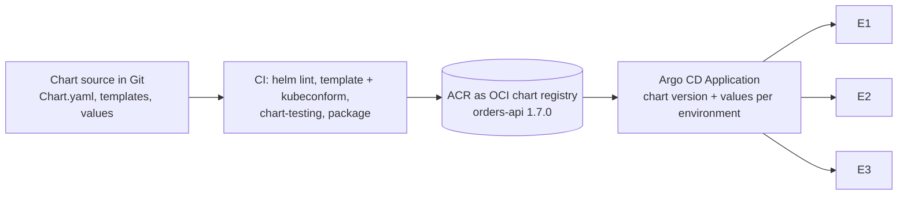

```text
charts/orders-api/
├── Chart.yaml              # version (the chart) and appVersion (the app)
├── values.yaml             # defaults
├── values-e1.yaml          # only what differs per environment
├── values-e2.yaml
├── values-e3.yaml
├── values.schema.json      # validates values before anything is rendered
└── templates/
    ├── _helpers.tpl        # names and labels shared by all templates
    ├── deployment.yaml
    ├── service.yaml
    ├── hpa.yaml
    ├── pdb.yaml
    └── ingress.yaml
```

```yaml
# values.yaml (defaults)
replicaCount: 2
image:
  repository: acrorders.azurecr.io/orders-api
  tag: ""                         # empty: use the chart's appVersion
resources:
  requests: { cpu: 250m, memory: 512Mi }
  limits: { memory: 1Gi }
autoscaling:
  enabled: false
ingress:
  host: orders.e1.example.com
```

```yaml
# values-e3.yaml (production overrides only)
autoscaling:
  enabled: true
  minReplicas: 3
  maxReplicas: 30
  targetCPUUtilizationPercentage: 65
podDisruptionBudget:
  minAvailable: 2
ingress:
  host: orders.example.com
```

```yaml
# templates/deployment.yaml (excerpt)
apiVersion: apps/v1
kind: Deployment
metadata:
  name: {{ include "orders-api.fullname" . }}
  labels:
    {{- include "orders-api.labels" . | nindent 4 }}
spec:
  {{- if not .Values.autoscaling.enabled }}
  replicas: {{ .Values.replicaCount }}
  {{- end }}
  selector:
    matchLabels:
      {{- include "orders-api.selectorLabels" . | nindent 6 }}
  template:
    metadata:
      labels:
        {{- include "orders-api.selectorLabels" . | nindent 8 }}
    spec:
      containers:
      - name: {{ .Chart.Name }}
        image: "{{ .Values.image.repository }}:{{ .Values.image.tag | default .Chart.AppVersion }}"
        resources:
          {{- toYaml .Values.resources | nindent 10 }}
```

CI for the chart:

```bash
helm lint charts/orders-api -f charts/orders-api/values-e3.yaml
helm template orders-api charts/orders-api -f charts/orders-api/values-e3.yaml | kubeconform -strict -summary
helm package charts/orders-api --version 1.7.0 --app-version 2.4.0
helm push orders-api-1.7.0.tgz oci://acrorders.azurecr.io/helm
```

Argo CD deploys the pinned chart version with values from the GitOps repo (a multi-source Application):

```yaml
apiVersion: argoproj.io/v1alpha1
kind: Application
metadata:
  name: orders-api-e3
  namespace: argocd
spec:
  project: e3
  sources:
  - repoURL: acrorders.azurecr.io/helm      # registered in Argo CD as an OCI Helm repository
    chart: orders-api
    targetRevision: 1.7.0
    helm:
      valueFiles:
      - $values/apps/orders-api/values-e3.yaml
  - repoURL: https://dev.azure.com/example/platform/_git/gitops-config
    targetRevision: main
    ref: values
  destination:
    server: https://aks-e3.example.internal:443
    namespace: orders
```

Practices worth naming:

- **Two versions:** bump `version` whenever the chart changes and `appVersion` for the application; images are tagged immutably.
- **Argo CD renders the chart itself** (`helm template`) and applies the manifests, so there are no Helm release records in the cluster: `helm list` and `helm rollback` don't apply, and history lives in Git and Argo CD.
- **Secrets stay out of values:** Key Vault through the CSI driver or External Secrets (Q19).
- **Third-party charts** (ingress controller, cert-manager, KEDA, monitoring) are pinned, upgraded in E1 first, and reviewed with `helm diff` or Argo CD's diff view.
- **Helm 4** (released November 2025) renamed `--atomic` to `--rollback-on-failure` and uses server-side apply by default for new releases; scripts that call Helm directly should use the new flag names ([Helm 3 end-of-life notice](https://helm.sh/blog/helm-v3-end-of-life/)).

**In the interview:** "Each service has a chart with defaults in values.yaml and small per-environment override files. CI lints, renders and validates it with kubeconform, then pushes a versioned package to ACR. Argo CD deploys a pinned chart version with the environment's values from the GitOps repo, so an upgrade or rollback is a one-line PR. Secrets never go in values; they come from Key Vault."

---

## Part 5 · CI/CD and GitOps

### Q11. Explain CI/CD

**Short answer:** Continuous Integration means every change is merged into the shared branch frequently and automatically built, tested and scanned, so problems surface within minutes. Continuous Delivery means every change that passes is automatically deployed through the test environments and is ready for production at any time, with production one approval away. Continuous Deployment removes that last approval. The goals are small, frequent, low-risk releases and fast feedback.

The sample project's flow in Azure DevOps:

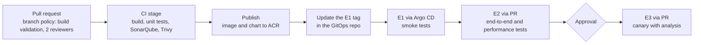

| Term | What is automated | Production release |
|---|---|---|
| Continuous Integration | Build, unit tests, static analysis and scans on every change | Not covered |
| Continuous Delivery | CI plus deployment through E1 and E2 with automated tests | One approval |
| Continuous Deployment | Everything, including production | Automatic |

Principles behind it: build once and promote the same artifact; keep configuration per environment outside the image; fail fast with the cheapest checks first; make every change reviewable (pipelines, infrastructure and deployments all in Git); and design rollback in from the start.

**In the interview:** "CI builds and tests every change automatically; CD pushes the same tested artifact through E1 and E2 and makes production a one-approval step. In our setup Azure Pipelines does CI and publishes to ACR, and Argo CD does CD from a GitOps repo, so promoting or rolling back is a pull request."

---

### Q12. You mentioned improving CI/CD efficiency by 60%. What specific optimizations did you make?

**How to answer:** define the metric (what was 60% faster, measured how), then give three to five specific changes with their individual effect, and a trade-off you managed. Vague answers ("we optimized the pipeline") fail this question; numbers per change pass it. The figures below are a sample; use your own.

**Sample answer:** "Our PR validation pipeline took about 25 minutes and the main build-and-deploy to E1 about 40 minutes, measured from Azure DevOps pipeline analytics over a month. After the changes below, PR validation averaged about 10 minutes and main-to-E1 about 15, roughly 60% faster, and failed runs caused by the pipeline itself dropped by about half."

| Change | What it did | Effect (sample) |
|---|---|---|
| Dependency caching (`Cache@2`) | Maven and npm caches restored instead of downloading every run | -4 min per run |
| Docker layer cache | Reordered Dockerfiles (dependencies before source); BuildKit registry cache in ACR | Image build 7 min → 2 min |
| Parallel jobs and test sharding | Lint, unit tests, SonarQube and scans in parallel jobs; tests split into 4 shards | -6 min |
| Path filters | Only the services that changed are built in the monorepo | Most PRs build 1 service instead of 6 |
| Self-hosted agents with warm caches | Managed DevOps Pools / VMSS agents instead of cold hosted agents | -3 min queue and setup time |
| Shallow checkout | `fetchDepth: 1` on large repositories | -1 min |
| Templates | One versioned YAML template for all services | Fewer pipeline-caused failures; new service onboarded in minutes |
| Build once, deploy via GitOps | No rebuild per environment; promotion by PR instead of manual release steps | Deployment to E1 from 15 min of manual steps to under 5 automated |

Caching dependencies:

```yaml
variables:
  MAVEN_CACHE_FOLDER: $(Pipeline.Workspace)/.m2/repository
  MAVEN_OPTS: '-Dmaven.repo.local=$(MAVEN_CACHE_FOLDER)'

steps:
- checkout: self
  fetchDepth: 1                                   # shallow clone
- task: Cache@2
  displayName: Cache Maven packages
  inputs:
    key: 'maven | "$(Agent.OS)" | **/pom.xml'     # new cache only when a pom.xml changes
    restoreKeys: |
      maven | "$(Agent.OS)"
    path: $(MAVEN_CACHE_FOLDER)
- script: mvn -B verify $(MAVEN_OPTS)
```

Running only what changed, and splitting tests across parallel jobs:

```yaml
trigger:
  branches:
    include: [main]
  paths:
    include:
    - services/orders-api
    - charts/orders-api
    exclude:
    - docs

jobs:
- job: unit_tests
  strategy:
    parallel: 4                                   # four agents, each runs one shard
  steps:
  - script: ./ci/run-tests.sh --shard $(System.JobPositionInPhase) --total $(System.TotalJobsInPhase)
```

Trade-offs to mention: caches must be keyed on lock files or they go stale; self-hosted agents need patching and cleanup; parallel jobs cost more agent minutes, so we parallelized only the stages on the critical path.

**In the interview:** "The 60% was average pipeline duration from Azure DevOps analytics, PR validation from about 25 to 10 minutes. The biggest wins were Maven and Docker layer caching, running lint, tests and scans as parallel jobs with sharded tests, and path filters so a PR only builds the service it touches. Shared YAML templates kept it consistent across 20 services."

---

### Q13. What is your approach to integrating automated testing in pipelines to ensure high code quality?

**Short answer:** follow the test pyramid and put each kind of test at the stage where it's cheapest and most useful. Fast checks (lint, unit tests, static analysis, secret scan) run on every pull request and block the merge; component, contract and image-security tests run on the main build; smoke, end-to-end, performance and DAST tests run after deployment to E1 and E2; production is protected by canary analysis and synthetic monitoring. Every stage publishes results and fails on clear thresholds (quality gate, coverage on new code, performance budgets).

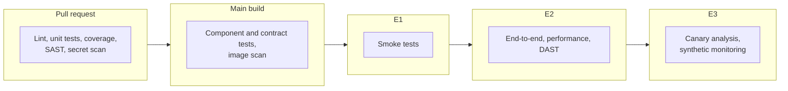

| Test type | Where | Tools (examples) | Gate |
|---|---|---|---|
| Lint and formatting | Pull request | ESLint, Checkstyle, hadolint, tflint | Any error fails |
| Unit tests + coverage | Pull request | JUnit, pytest, Jest; JaCoCo, coverage.py | All pass; coverage on new code ≥ 80% via the SonarQube gate |
| Static analysis, SAST, secrets | Pull request | SonarQube, gitleaks, dependency scanning | Quality gate passed; no new critical issues |
| Component / integration | Main build | Testcontainers (real Postgres or Redis in Docker) | All pass |
| Contract tests | Main build | Pact | Consumer contracts verified |
| Image scan | Main build | Trivy | No critical vulnerabilities |
| Smoke tests | After the E1 deploy | curl or Newman against health and key endpoints | All pass, or the deploy is marked failed |
| End-to-end | After the E2 deploy | Playwright, Postman/Newman | All pass |
| Performance | E2 (nightly or per release) | k6, JMeter | p95 latency and error-rate thresholds |
| DAST | E2 | OWASP ZAP baseline scan | No new high findings |
| Production checks | E3 | Argo Rollouts analysis, synthetic monitors | Error rate and latency within SLO |

Publishing results so failures are visible in the run, and failing on them:

```yaml
- script: mvn -B verify
  displayName: Unit and component tests
- task: PublishTestResults@2
  condition: succeededOrFailed()            # publish even when tests fail
  inputs:
    testResultsFormat: JUnit
    testResultsFiles: '**/surefire-reports/TEST-*.xml'
    failTaskOnFailedTests: true
- task: PublishCodeCoverageResults@2
  inputs:
    summaryFileLocation: '$(System.DefaultWorkingDirectory)/**/jacoco.xml'
```

End-to-end tests after the E2 deployment:

```yaml
- job: e2e
  dependsOn: deploy_e2
  steps:
  - script: npx playwright test --reporter=junit
    env:
      BASE_URL: https://orders.e2.example.com
      PLAYWRIGHT_JUNIT_OUTPUT_NAME: results.xml
  - task: PublishTestResults@2
    condition: succeededOrFailed()
    inputs:
      testResultsFormat: JUnit
      testResultsFiles: results.xml
```

Practices that keep it trustworthy:

- **Fast feedback first:** pull request checks under about 10 minutes; slow suites run later or nightly.
- **Flaky tests are quarantined and fixed,** not retried forever; Azure DevOps test analytics shows the flakiest tests.
- **Test data and environments:** seeded, resettable data; ephemeral namespaces for PR previews where valuable.
- **Gates on new code,** not the whole legacy codebase, so quality improves without blocking every merge.

**In the interview:** "Tests follow the pyramid: lint, unit tests, SonarQube and secret scanning block the PR; Testcontainers integration tests and a Trivy scan run on main; smoke tests after the E1 deploy, Playwright end-to-end, k6 performance and a ZAP scan in E2; and canary analysis protects E3. Every stage publishes results to the run and fails on explicit thresholds."

---

### Q14. How do you integrate tools like SonarQube into your pipelines?

**Short answer:** connect the pipeline to SonarQube with a service connection and the SonarQube extension, run the analysis as part of the build (prepare before, analyze after, with test coverage reports), and make the quality gate decide: the pipeline waits for the gate result and fails if it's red, and an Azure Repos branch policy requires a passing status before a pull request can merge. PR decoration shows the issues as comments on the pull request.

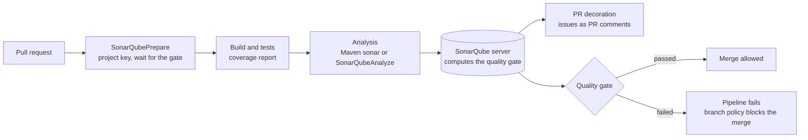

Set-up steps:

1. Install the SonarQube extension from the Azure DevOps Marketplace and create a **SonarQube service connection** (server URL plus a token) in project settings.
2. Create the project in SonarQube, import it from Azure DevOps for PR decoration, and assign a **quality gate**. The built-in "Sonar way" gate checks new code: no new issues, all new security hotspots reviewed, at least 80% coverage, at most 3% duplication.
3. Add the tasks to the pipeline (below), with coverage reports produced by the tests.
4. Add the pipeline as **build validation** in the `main` branch policy, so a failed gate blocks the merge.

A Maven service in YAML (the task's major version must match the extension installed in your organization; `@7` at the time of writing):

```yaml
steps:
- task: SonarQubePrepare@7
  inputs:
    SonarQube: sonarqube-sc                  # the SonarQube service connection
    scannerMode: other                       # Maven or Gradle run the scanner themselves
    extraProperties: |
      sonar.projectKey=orders-api
      sonar.qualitygate.wait=true            # wait for the gate and fail the build if it's red
- task: Maven@4
  inputs:
    mavenPomFile: pom.xml
    goals: verify                            # tests + JaCoCo coverage report
    sonarQubeRunAnalysis: true               # runs the SonarQube analysis after the build
- task: SonarQubePublish@7                   # shows the gate result on the run summary
  inputs:
    pollingTimeoutSec: '300'
```

For JavaScript, Python or Go projects the pattern is `SonarQubePrepare` (scanner mode `cli`), the build and tests, then `SonarQubeAnalyze` and `SonarQubePublish`. In other CI tools: Jenkins uses `withSonarQubeEnv` plus `waitForQualityGate abortPipeline: true`; GitHub Actions uses `SonarSource/sonarqube-scan-action` and `SonarSource/sonarqube-quality-gate-action`.

Points that separate a strong answer:

- **Coverage must be imported:** SonarQube doesn't run tests; it reads the JaCoCo, Cobertura or LCOV reports your tests produce.
- **Gate on new code** (the "clean as you code" approach) so legacy debt doesn't block every merge, while new code stays clean.
- **Branch and PR analysis** need a commercial edition (Developer Edition or above) or SonarQube Cloud; the Community Build analyzes the main branch only.
- **Treat findings as work:** security hotspots are reviewed, false positives marked with a reason, and rules tuned in a shared quality profile.

**In the interview:** "The SonarQube extension and a service connection; Prepare before the build, analysis with the build, coverage from JaCoCo, and `sonar.qualitygate.wait=true` so a red gate fails the pipeline. That pipeline is build validation on main, so a failed gate blocks the PR, and PR decoration shows developers the exact issues inline."

---

### Q15. What is the advantage of YAML pipelines over classic build pipelines in Azure DevOps, and what advantages have you experienced personally?

**Short answer:** a YAML pipeline is code that lives in the repository next to the application, so it's versioned, reviewed in pull requests, branch-specific and reusable through templates. One YAML file can hold CI and multi-stage CD with environments and approvals, where classic pipelines split build and release into separate UI-edited definitions. Microsoft treats YAML as the default: since Sprint 226 (2023), new Azure DevOps organizations have creation of classic build and release pipelines disabled by default, although existing classic pipelines keep working ([Microsoft Learn](https://learn.microsoft.com/en-us/azure/devops/pipelines/security/approach?view=azure-devops)).

| | YAML pipelines | Classic pipelines |
|---|---|---|
| Definition | `azure-pipelines.yml` in the repo | Edited in the web UI, stored in Azure DevOps |
| Change review | Pull requests, history, blame, revert | Revision history in the UI; no PR review |
| Branches | A branch can change its own pipeline safely | One definition shared by all branches |
| Reuse | Templates (steps, jobs, stages) and `extends` templates from a shared repo | Task groups |
| CI and CD | One file, multi-stage, with deployment jobs | Separate build pipelines and release pipelines |
| Approvals and checks | On Environments, service connections and other resources | Pre- and post-deployment approvals in releases |
| Governance | Required-template checks enforce an approved `extends` template | Hard to enforce consistently |
| Runtime parameters | Typed parameters with allowed values | Variables settable at queue time |
| Ease of starting | Learning curve | Easiest for beginners (drag and drop) |

**Advantages experienced personally (sample, replace with yours):**

- **One template, 20 services.** We moved about 40 classic definitions to YAML extending a shared, versioned template. A new service gets a full pipeline (build, tests, SonarQube, Trivy, publish, GitOps update) from a ten-line file, and a security fix in the template reaches every service in one PR.
- **Pipeline changes get reviewed.** A bad change to a deployment step is caught in a pull request instead of breaking everyone's builds, and rolling back a pipeline change is a `git revert`.
- **Safe experimentation.** A feature branch can change its own pipeline (a new test stage, say) without affecting `main`.
- **Enforced guardrails.** A "required template" check on production environments and service connections means only pipelines that extend the approved template can deploy to E3.
- **On-demand runs with typed parameters**, such as choosing the target environment or turning on load tests.

```yaml
# azure-pipelines.yml in a service repository: the whole pipeline in ten lines
resources:
  repositories:
  - repository: templates
    type: git
    name: platform/pipeline-templates
    ref: refs/tags/v3.2.0                     # pinned template version
extends:
  template: microservice.yml@templates
  parameters:
    serviceName: orders-api
    dockerfile: Dockerfile
    environments: [e1, e2, e3]
```

```yaml
# typed runtime parameters, chosen when the pipeline is run
parameters:
- name: environment
  displayName: Target environment
  type: string
  default: e1
  values: [e1, e2, e3]
- name: runLoadTests
  type: boolean
  default: false
```

**In the interview:** "YAML puts the pipeline in the repo, so it's reviewed, versioned and branch-specific, and templates make it reusable; classic definitions are edited in the UI and split build from release. Personally, the biggest win was a shared extends template: 20 services on one versioned pipeline, with a required-template check so only compliant pipelines can deploy to production."

---

### Q16. What branching strategy do you follow for source code management in a large team with a complex application?

**Short answer:** for a large team, short-lived branches merged often into `main`, plus release branches for stabilization and hotfixes. Feature branches live a day or two and merge through pull requests with strict branch policies; unfinished work hides behind feature flags; a release branch is cut from `main` for each release and receives only cherry-picked fixes. This is the model Microsoft calls Release Flow (trunk-based development with release branches). GitFlow fits teams with infrequent, scheduled releases or several versions supported at once, but its long-lived branches cause painful merges at scale.

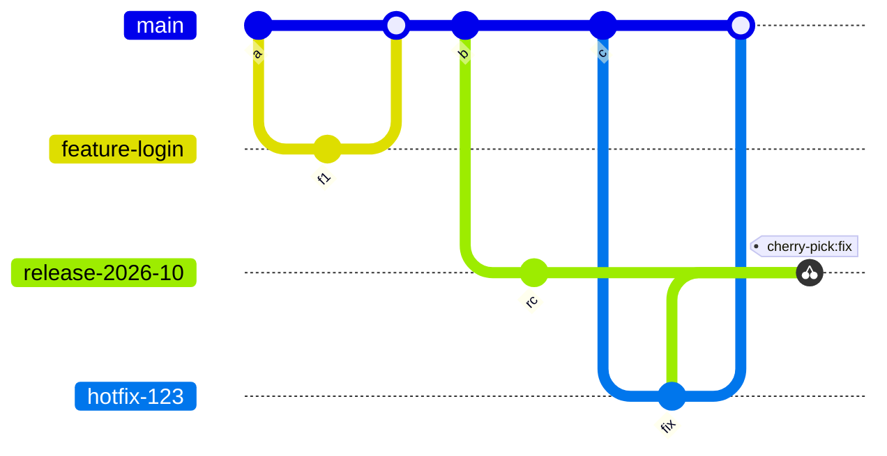

Fixes go to `main` first and are then cherry-picked into the release branch ("upstream first"), so a fix is never lost in the next release.

| Strategy | How it works | Fits |
|---|---|---|
| Trunk-based + release branches (Release Flow) | Short-lived feature branches into `main`; a release branch per release; fixes cherry-picked | Large teams shipping often; SaaS |
| GitFlow | `develop`, `feature/*`, `release/*`, `hotfix/*`, `main` | Scheduled releases, several supported versions, slower cadence |
| GitHub Flow | `main` plus short-lived branches; deploy on merge | Smaller teams with continuous deployment |

Controls that make it work in a large team (Azure Repos branch policies on `main` and `release/*`):

- **Pull requests only**, with at least two reviewers, reset votes on new pushes, linked work items and resolved comments.
- **Build validation:** the PR pipeline (build, tests, SonarQube gate) must pass.
- **Automatically included reviewers by path:** for example, the platform team for `charts/` and `infra/`.
- **Squash merge** for features, keeping `main`'s history readable.
- **Naming:** `feature/<work-item>-short-name`, `bugfix/...`, `release/2026-10`, `hotfix/...`.
- **Feature flags** decouple merging from releasing, so no branch has to live long.

Setting the policies from the CLI (the same can be done in the UI):

```bash
az repos policy approver-count create --repository-id <repo-id> --branch main \
  --minimum-approver-count 2 --creator-vote-counts false --allow-downvotes false \
  --reset-on-source-push true --blocking true --enabled true

az repos policy build create --repository-id <repo-id> --branch main \
  --build-definition-id <pr-pipeline-id> --display-name "PR validation" \
  --manual-queue-only false --queue-on-source-update-only true \
  --valid-duration 720 --blocking true --enabled true
```

**In the interview:** "Trunk-based with release branches: feature branches live a day or two and merge to main through PRs with two reviewers and a validation build; we cut a release branch per release and cherry-pick fixes from main into it. Feature flags let us merge unfinished work safely, and path-based reviewers bring in the platform team for infrastructure changes. That kept merge conflicts small even with 40 developers on one codebase."

---

### Q17. How do you maintain Argo CD for the E1, E2 and E3 environments?

**Short answer:** one GitOps repository holds the desired state of every environment (a base plus per-environment overlays or values files). Argo CD generates one Application per service per environment from an ApplicationSet, and AppProjects scope what each environment may deploy. Sync behaviour gets stricter towards production: E1 syncs automatically with self-heal, E2 syncs automatically, and E3 syncs only inside a release window after an approved pull request. Promotion is a pull request that moves an image tag from one environment's folder to the next. Argo CD itself is installed from code, runs in HA mode, uses Entra ID single sign-on with RBAC, sends notifications, and is upgraded in the lower environments first.

*Assumption: E1 = development, E2 = QA/staging, E3 = production. If your E1 to E3 meant something else (regions, say), keep the structure and rename.*

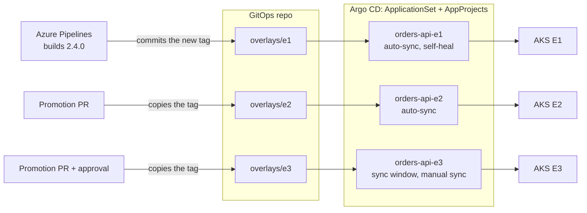

**Repository layout:**

```text
gitops-config/
├── apps/
│   └── orders-api/
│       ├── base/                    # Deployment, Service, HPA, PDB
│       └── overlays/
│           ├── e1/                  # image tag, 1 replica, debug logging
│           ├── e2/                  # image tag, 2 replicas
│           └── e3/                  # image tag, HPA 3-30, production hostnames
├── platform/                        # cluster add-ons per environment: ingress, cert-manager, KEDA, monitoring
│   ├── e1/
│   ├── e2/
│   └── e3/
└── argocd/
    ├── projects/                    # AppProjects e1, e2, e3
    └── applicationsets/             # one ApplicationSet per service
```

**One ApplicationSet per service creates all three Applications,** with stricter sync for E3:

```yaml
apiVersion: argoproj.io/v1alpha1
kind: ApplicationSet
metadata:
  name: orders-api
  namespace: argocd
spec:
  goTemplate: true
  generators:
  - list:
      elements:
      - env: e1
        cluster: https://aks-e1.example.internal:443
        autoSync: 'true'
      - env: e2
        cluster: https://aks-e2.example.internal:443
        autoSync: 'true'
      - env: e3
        cluster: https://aks-e3.example.internal:443
        autoSync: 'false'
  template:
    metadata:
      name: 'orders-api-{{.env}}'
    spec:
      project: '{{.env}}'
      source:
        repoURL: https://dev.azure.com/example/platform/_git/gitops-config
        targetRevision: main
        path: 'apps/orders-api/overlays/{{.env}}'
      destination:
        server: '{{.cluster}}'
        namespace: orders
      syncPolicy:
        syncOptions:
        - CreateNamespace=true
  templatePatch: |
    {{- if eq .autoSync "true" }}
    spec:
      syncPolicy:
        automated:
          prune: true
          selfHeal: true
    {{- end }}
```

**An AppProject per environment** limits where it may deploy and who may sync, and gives E3 a release window:

```yaml
apiVersion: argoproj.io/v1alpha1
kind: AppProject
metadata:
  name: e3
  namespace: argocd
spec:
  description: Production (E3)
  sourceRepos:
  - https://dev.azure.com/example/platform/_git/gitops-config
  destinations:
  - server: https://aks-e3.example.internal:443
    namespace: '*'
  syncWindows:
  - kind: allow
    schedule: '0 5 * * 1-4'          # Monday to Thursday from 05:00, for 3 hours
    duration: 3h
    applications: ['*']
    manualSync: true
  roles:
  - name: release-managers
    policies:
    - p, proj:e3:release-managers, applications, sync, e3/*, allow
    groups:
    - sre-release-managers           # Entra ID group, through SSO
```

**Promotion** from E2 to E3 is a pull request that copies the tag tested in E2 into `overlays/e3`; branch policies on the GitOps repo require release-manager approval for changes under `overlays/e3/`, and the merge is the audit record.

```bash
cd gitops-config/apps/orders-api/overlays/e3
kustomize edit set image orders-api=acrorders.azurecr.io/orders-api:2.4.0
git checkout -b promote/orders-api-2.4.0-e3
git commit -am "Promote orders-api 2.4.0 to E3" && git push -u origin HEAD   # then open the PR
```

**Maintaining Argo CD itself:**

| Area | What we do |
|---|---|
| Installation | The `argo-cd` Helm chart installed by Terraform, then managed through Git (app of apps) |
| Topology | One Argo CD in a management cluster for all three clusters, with prod isolated by its AppProject and RBAC. The alternative, one Argo CD inside each cluster, gives production a smaller blast radius at the cost of three instances to run |
| Availability | HA mode: several repo-server and API-server replicas, Redis HA, controller sharding when the number of apps grows |
| Access | Entra ID single sign-on; RBAC so developers can sync E1 and E2, view E3, and only release managers sync E3 |
| Secrets | Never in Git: Key Vault through the CSI driver or External Secrets; repository credentials also sourced from Key Vault |
| Notifications | Argo CD notifications to Teams on sync failures and degraded health |
| Monitoring | Prometheus scrapes Argo CD metrics; alert when an app stays OutOfSync or Degraded for more than 30 minutes |
| Upgrades | Read the upgrade notes, upgrade in a test instance or E1 first, keep `argocd admin export` backups |
| Disaster recovery | Everything is in Git: a fresh Argo CD pointed at the repo rebuilds every Application |

**In the interview:** "One GitOps repo with base and per-environment overlays, an ApplicationSet per service generating the E1, E2 and E3 Applications, and an AppProject per environment. E1 and E2 auto-sync with self-heal; E3 needs an approved promotion PR and syncs inside a release window, by release managers only. Argo CD itself is deployed from Terraform and Git, runs HA with Entra ID SSO, and alerts us in Teams when something stays out of sync."

---

## Part 6 · Observability and security

### Q18. What is the monitoring set-up for your project, and have you created dashboards in Grafana?

**Short answer (sample set-up):** metrics with kube-prometheus-stack on each AKS cluster (Prometheus, Alertmanager, node-exporter, kube-state-metrics), application metrics from Micrometer or OpenTelemetry, logs in Log Analytics through Container Insights, traces through the OpenTelemetry Collector into Application Insights, and Grafana for dashboards. Alerts are based on SLOs and route to Teams and the on-call pager. Managed alternatives are Azure Monitor managed service for Prometheus and Azure Managed Grafana, with the same queries and dashboards. And yes on dashboards: built as code, with variables and deployment annotations, per service and per team.

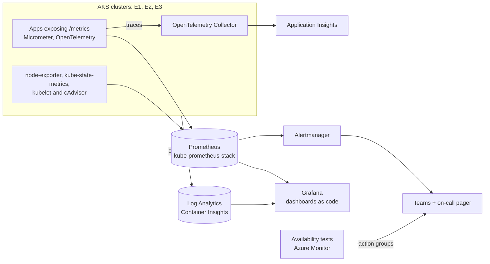

| Signal | Source | Used for |
|---|---|---|
| Infrastructure metrics | node-exporter, kube-state-metrics, cAdvisor | Node and pod health, capacity, throttling, restarts |
| Application metrics (RED) | Micrometer / OpenTelemetry `/metrics` | Request rate, error rate, latency percentiles per endpoint |
| Logs | Container Insights → Log Analytics (KQL) | Debugging, audit, error search |
| Traces | OpenTelemetry → Application Insights | Following a slow request across services |
| Synthetic checks | Azure Monitor availability tests | Is the product reachable from outside, from several regions? |
| Alerts | Prometheus rules → Alertmanager; Azure Monitor alerts | Pages on SLO burn; tickets for slower trends |

**Alerting on SLOs, not on every metric.** For a 99.9% availability SLO, a multi-window burn-rate alert pages only when the error budget is being consumed fast enough to matter:

```yaml
- alert: OrdersApiErrorBudgetBurn
  expr: |
    (
      sum(rate(http_server_requests_seconds_count{app="orders-api",status=~"5.."}[1h]))
        / sum(rate(http_server_requests_seconds_count{app="orders-api"}[1h]))
    ) > (14.4 * 0.001)
    and
    (
      sum(rate(http_server_requests_seconds_count{app="orders-api",status=~"5.."}[5m]))
        / sum(rate(http_server_requests_seconds_count{app="orders-api"}[5m]))
    ) > (14.4 * 0.001)
  for: 2m
  labels:
    severity: page
  annotations:
    summary: 'orders-api is burning its 99.9% error budget 14x faster than sustainable'
    runbook_url: https://wiki.example.com/runbooks/orders-api-errors
```

**Grafana dashboards (sample of what was built):** a cluster overview (nodes, capacity, pending pods), a namespace and workload view (CPU and memory against requests, restarts, throttling), a RED dashboard per service, an SLO dashboard with the remaining error budget, and a business view (orders per minute, queue depth).

How they're built:

- **Variables** for cluster, namespace and service, so one dashboard serves every environment and service.
- **RED panels** from PromQL:

```promql
# requests per second, by endpoint
sum by (uri) (rate(http_server_requests_seconds_count{namespace="$namespace", app="$service"}[5m]))

# error ratio
sum(rate(http_server_requests_seconds_count{namespace="$namespace", app="$service", status=~"5.."}[5m]))
  / sum(rate(http_server_requests_seconds_count{namespace="$namespace", app="$service"}[5m]))

# p95 latency
histogram_quantile(0.95,
  sum by (le) (rate(http_server_requests_seconds_bucket{namespace="$namespace", app="$service"}[5m])))
```

- **Deployment annotations:** markers on every graph when Argo CD syncs a new version, so a latency jump can be matched to a release at a glance.
- **Thresholds and units** set so red means "breaching the SLO", not just "high".
- **Dashboards as code:** the JSON lives in Git and is loaded automatically; in kube-prometheus-stack, a ConfigMap with the `grafana_dashboard` label is picked up by Grafana's sidecar:

```yaml
apiVersion: v1
kind: ConfigMap
metadata:
  name: orders-api-dashboard
  namespace: monitoring
  labels:
    grafana_dashboard: '1'            # picked up by the Grafana sidecar
data:
  orders-api-red.json: |
    { "title": "orders-api: RED", "panels": [] }
```

- **Community dashboards** as a starting point, such as Node Exporter Full (ID 1860), then trimmed to what the team actually uses.

**In the interview:** "kube-prometheus-stack on each cluster for metrics, Container Insights for logs, OpenTelemetry into Application Insights for traces, and Grafana on top. Alerts are SLO burn-rate based and route to Teams and the pager, which cut our noisy pages a lot. I built the RED and SLO dashboards: templated by environment and service, with deployment annotations, stored as JSON in Git and provisioned automatically."

---

### Q19. Azure Key Vault: your experience, integrating it into pipelines, and who created the access policies

*This answers three questions: experience with Key Vault, integration into pipelines and branches, and whether you created the access policies yourself.*

**Short answer:** Key Vault stores secrets, keys and certificates, with access controlled by Microsoft Entra ID, every access logged, and soft delete and purge protection against accidental loss. We used one vault per environment (E1, E2, E3), reached through private endpoints. Pipelines read secrets with the `AzureKeyVault@2` task or a Key Vault-linked variable group; applications on AKS read them at run time through the Key Vault CSI driver with workload identity, so no credentials sit in code, YAML or pipeline variables.

```mermaid
flowchart LR
  subgraph KVS["One Key Vault per environment: kv-orders-e1, e2, e3"]
    S["Secrets, keys, certificates<br/>Azure RBAC, soft delete, purge protection,<br/>private endpoint"]
  end
  TF["Terraform pipeline identity<br/>Key Vault Secrets Officer"] -->|creates and rotates secrets| S
  PIPE["Azure Pipelines<br/>workload identity federation"] -->|AzureKeyVault@2 or a linked variable group| S
  POD["AKS pods<br/>workload identity"] -->|CSI driver, Key Vault Secrets User| S
  S -->|diagnostic logs| LA[("Log Analytics<br/>who read what, when")]
```

**Access policies vs Azure RBAC, and the current default.** Key Vault has two permission models: legacy *access policies*, set on each vault, and *Azure RBAC* role assignments, which Microsoft recommends. With control-plane API version 2026-02-01 and later, new vaults default to Azure RBAC unless you explicitly set access policies; existing vaults keep their current model ([Microsoft Learn](https://learn.microsoft.com/en-us/azure/key-vault/general/access-control-default)). RBAC is safer because only Owners or User Access Administrators can grant data access; with access policies, anyone who can modify the vault can grant themselves access to its secrets.

The vault and its role assignments in Terraform:

```hcl
data "azurerm_client_config" "current" {}

resource "azurerm_key_vault" "orders" {
  name                          = "kv-orders-e3"
  location                      = azurerm_resource_group.app.location
  resource_group_name           = azurerm_resource_group.app.name
  tenant_id                     = data.azurerm_client_config.current.tenant_id
  sku_name                      = "standard"
  rbac_authorization_enabled    = true      # older azurerm versions: enable_rbac_authorization
  purge_protection_enabled      = true
  soft_delete_retention_days    = 90
  public_network_access_enabled = false     # reached through a private endpoint
}

# the application's workload identity may only read secrets
resource "azurerm_role_assignment" "orders_api_reads" {
  scope                = azurerm_key_vault.orders.id
  role_definition_name = "Key Vault Secrets User"
  principal_id         = azurerm_user_assigned_identity.orders_api.principal_id
}

# the platform pipeline may create and rotate secrets
resource "azurerm_role_assignment" "pipeline_manages" {
  scope                = azurerm_key_vault.orders.id
  role_definition_name = "Key Vault Secrets Officer"
  principal_id         = var.pipeline_principal_object_id
}
```

On a vault still using access policies, the equivalent is an access policy resource:

```hcl
resource "azurerm_key_vault_access_policy" "orders_api" {
  key_vault_id       = azurerm_key_vault.legacy.id
  tenant_id          = data.azurerm_client_config.current.tenant_id
  object_id          = azurerm_user_assigned_identity.orders_api.principal_id
  secret_permissions = ["Get", "List"]
}
```

**In pipelines:**

```yaml
- task: AzureKeyVault@2
  inputs:
    azureSubscription: sc-e3-wif            # service connection with workload identity federation
    KeyVaultName: kv-orders-e3
    SecretsFilter: 'db-password,api-key'
    RunAsPreJob: false
- script: ./ci/smoke-test.sh
  env:
    DB_PASSWORD: $(db-password)             # secrets are masked and must be mapped explicitly
```

Alternatively, a variable group linked to the vault (`- group: orders-e3-kv`) makes the secrets available as pipeline variables, refreshed from the vault on every run.

**"Into branches":** each environment has its own vault and its own service connection, and the E3 service connection has a **branch control** check that allows only `refs/heads/main` and `refs/heads/release/*`. A feature branch's pipeline therefore can never read production secrets, even if someone edits its YAML.

**At run time on AKS,** with the Key Vault Secrets Provider add-on (CSI driver) and workload identity:

```yaml
apiVersion: secrets-store.csi.x-k8s.io/v1
kind: SecretProviderClass
metadata:
  name: orders-api-kv
  namespace: orders
spec:
  provider: azure
  parameters:
    clientID: <workload-identity-client-id>     # user-assigned identity federated with the pod's ServiceAccount
    keyvaultName: kv-orders-e3
    tenantId: <tenant-id>
    objects: |
      array:
        - |
          objectName: db-password
          objectType: secret
  secretObjects:                                # optional: also sync into a Kubernetes Secret
  - secretName: orders-api-secrets
    type: Opaque
    data:
    - objectName: db-password
      key: DB_PASSWORD
```

**"Did you create the access policies yourself?"** Answer exactly what you did; interviewers check this with follow-up questions. A credible sample: "I wrote the Terraform for the vaults and the RBAC role assignments, and migrated two older vaults from access policies to RBAC. Changes went through PR review with the security team as required reviewers. I don't hold Owner rights in production, so the E3 role assignments were applied by the platform pipeline, whose identity has User Access Administrator scoped to that resource group; humans get just-in-time access through Privileged Identity Management." If someone else did it, say so and describe what you consumed and how.

**Operational practices:** soft delete and purge protection on; diagnostic logs to Log Analytics with alerts on unusual access; certificate auto-renewal; secret expiry dates with alerts or Event Grid events for rotation; separate vaults per environment and per application boundary.

**In the interview:** "One vault per environment with private endpoints, Azure RBAC rather than access policies, and identities instead of secrets everywhere: the pipeline reads through a workload-identity service connection with branch control on E3, and pods mount secrets through the CSI driver with workload identity. I wrote the Terraform for the vaults and role assignments; E3 changes went through PR review and were applied by the pipeline identity."

---

## Part 7 · Experience

### Q20. What is a recent challenge you faced while implementing a DevOps practice or pipeline?

**How to answer:** one story in STAR form, with a technical root cause, what you specifically did, a measurable result and what you changed in the process afterwards. Pick something you can defend in depth. Don't blame people; show judgment and trade-offs.

**Sample (replace with your own):**

- **Situation:** every monthly AKS node image upgrade in E3 caused two to five minutes of 5xx errors, so upgrades were postponed and nodes fell behind on security patches.
- **Task:** make node upgrades invisible to customers so they could run automatically every month.
- **Action:**
  - Reproduced it in E2 under load during an upgrade and found the causes: several services ran a single replica in E3, none had PodDisruptionBudgets, the ingress controller replicas were packed on one node, and pods were killed while still receiving traffic because there was no shutdown delay.
  - Added a PDB, at least three replicas and zone topology spread as defaults in our base Helm chart; added a `preStop` sleep and correct readiness probes; spread the ingress controller with anti-affinity.
  - Set node-pool `max_surge` to 33% in Terraform and an AKS planned-maintenance window for the node OS upgrades.
  - Wrote a pre-upgrade checklist and a Grafana panel showing 5xx and pending pods during upgrades.
- **Result:** the next three monthly upgrades ran automatically with zero customer-facing errors, and node patch lag went from about 60 days to under 7.
- **Learning:** resilience settings belong in the shared chart as defaults, not in each team's memory.

Other strong options, if they're yours: secrets moved from pipeline variables into Key Vault with workload identity; Argo CD drift from manual `kubectl` hotfixes, solved with self-heal, RBAC and a break-glass process; alert fatigue cut by moving to SLO burn-rate alerts; the pipeline speed-up in Q12.

---

### Q21. Other than Azure and AWS, are you familiar with any other cloud platforms or services?

**How to answer:** be honest about the depth, then show that the skills transfer: Terraform, Kubernetes, Helm, Argo CD and Prometheus work the same everywhere, so what changes is service names and identity models.

**Sample answers:**

- *If you have some exposure:* "Yes, Google Cloud at a smaller scale: I ran a GKE cluster for a proof of concept, with Cloud SQL and Artifact Registry, provisioned with the same Terraform modules pattern and deployed with Argo CD."
- *If you don't:* "Not in production. My depth is Azure, plus AWS for a few services. Because our stack is Terraform, Kubernetes and GitOps, moving to GCP is mostly learning the service names and the IAM model, and I've mapped the equivalents."

| Capability | AWS | Azure | Google Cloud |
|---|---|---|---|
| Virtual machines | EC2 | Virtual Machines | Compute Engine |
| Managed Kubernetes | EKS | AKS | GKE |
| Serverless containers | Fargate (ECS/EKS) | Container Apps | Cloud Run |
| Functions | Lambda | Azure Functions | Cloud Run functions |
| Object storage | S3 | Blob Storage | Cloud Storage |
| Managed relational database | RDS / Aurora | Azure SQL / Azure Database for PostgreSQL | Cloud SQL / AlloyDB |
| Identity and access | IAM | Microsoft Entra ID + Azure RBAC | Cloud IAM |
| Secrets | Secrets Manager | Key Vault | Secret Manager |
| Monitoring | CloudWatch | Azure Monitor | Cloud Monitoring and Cloud Logging |
| Container registry | ECR | ACR | Artifact Registry |
| CI/CD | CodeBuild / CodePipeline | Azure Pipelines | Cloud Build / Cloud Deploy |
| Native IaC | CloudFormation / CDK | ARM / Bicep | Infrastructure Manager (Terraform-based) |

Other platforms worth naming if you've touched them: Oracle Cloud (OCI), on-premises Kubernetes or OpenShift, Cloudflare for DNS, CDN and WAF, and SaaS observability such as Datadog or Grafana Cloud.

**In the interview:** "My production depth is Azure and AWS. I've used GCP only for a GKE proof of concept, but since everything we do goes through Terraform, Kubernetes and Argo CD, the concepts carry over directly; what I'd need to learn is mostly GCP's IAM model and service names."
