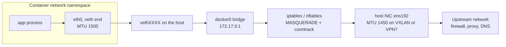
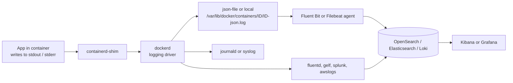
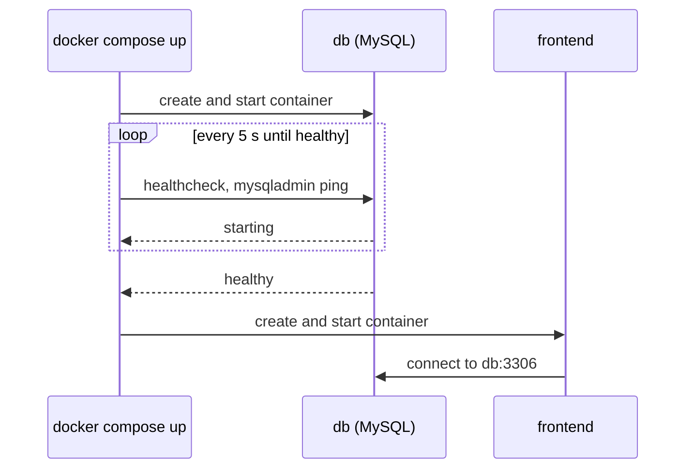
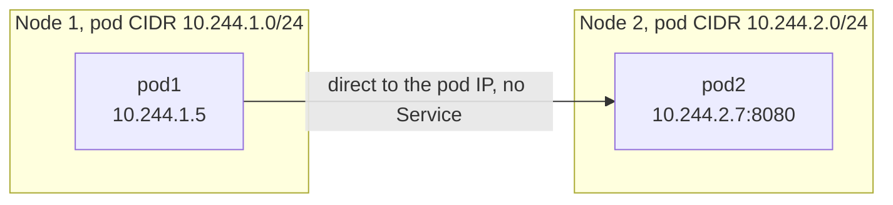
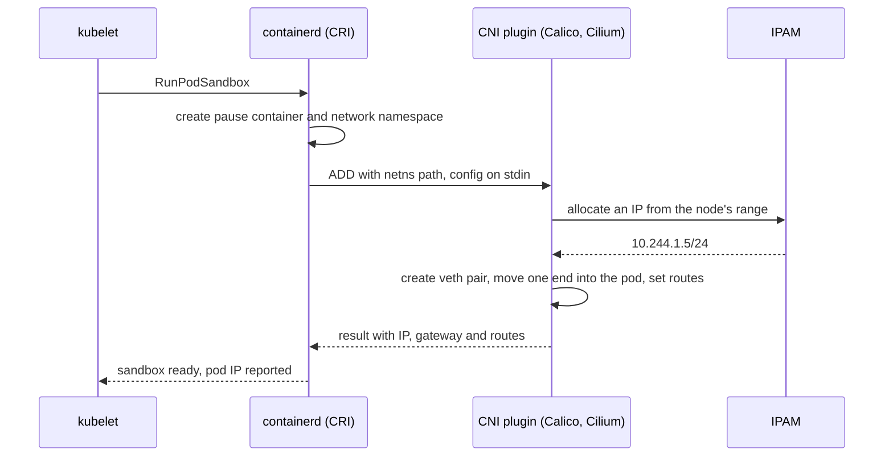
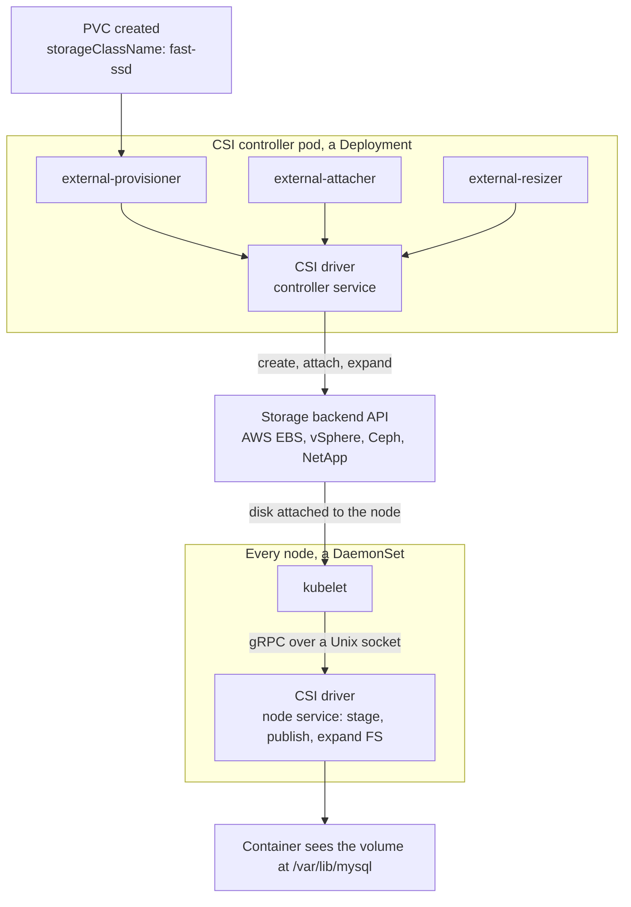
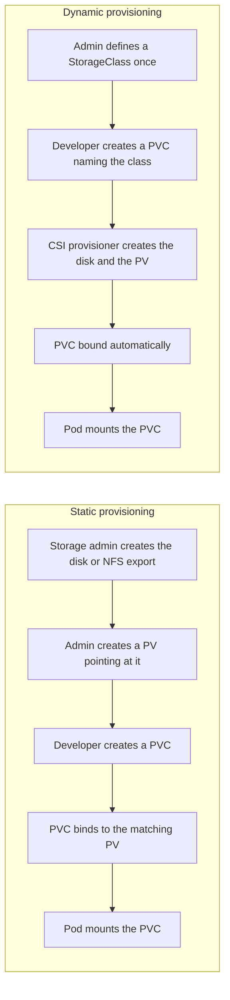
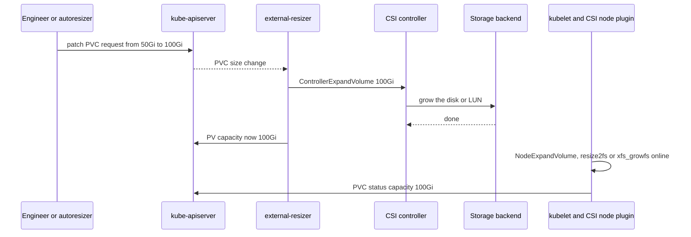

# NPCI DevOps / SRE Interview Prep: Docker and Kubernetes

Experience level: 5 years · Prepared October 2026

Eight questions, grouped Docker → Kubernetes. Each answer opens with a short answer, then how it works, a working example, and the points that separate a 5-year answer. The **In the interview** lines are templates: swap in your own project details before you use them.

Diagrams are Mermaid blocks; they render on GitHub, GitLab, Obsidian and Notion.

**Contents**

1. Docker: app reachable from outside, packet loss from inside
2. Docker: getting logs at the Docker level
3. Docker: starting the DB before the frontend (2-tier app)
4. Kubernetes: calling pod2 from pod1 without a Service
5. Kubernetes: Container Network Interface (CNI)
6. Kubernetes: CSI driver
7. Kubernetes: static vs dynamic volume provisioning
8. Kubernetes: (auto) volume expansion

---

## Part 1 · Docker

### Q1. The app is reachable from outside the container, but from inside I see packet loss. How do you troubleshoot?

**Short answer:** inbound traffic works, so the app and the port publishing are fine; the problem sits on the container's outbound path (veth → docker0 bridge → iptables NAT → host NIC) or upstream of the host. Work layer by layer: reproduce and compare with the host, test MTU, check NAT and conntrack, look for a subnet overlap, check CPU throttling, then capture packets to see exactly where they disappear.

Why inbound and outbound behave differently: inbound traffic to a published port is DNAT-ed to the container, while outbound traffic is SNAT-ed (MASQUERADE) out of the host. They use different rules and conntrack entries, and outbound traffic often carries larger packets (downloads, TLS handshakes), which exposes MTU problems.



Every hop is a place to measure: interface counters on the veth and docker0, conntrack at the NAT step, MTU at the NIC, and tcpdump on both sides of the host.

**1. Reproduce and compare with the host.** Run the same test from inside the container and from the host. If the host is clean and the container is lossy, the problem is in Docker networking (bridge, NAT, MTU, conntrack, cgroup limits); if both are lossy, it is upstream.

```bash
docker exec -it app ping -c 100 10.10.5.20        # loss % and latency from the container
ping -c 100 10.10.5.20                             # the same test from the host

# image has no tools? attach a debug container to the SAME network namespace
docker run -it --rm --network container:app nicolaka/netshoot
#   then, inside netshoot:
#   mtr -rwc 100 10.10.5.20
#   curl -so /dev/null -w '%{time_connect} %{time_total}\n' https://api.partner.example
#   dig api.partner.example
```

**2. Test MTU, the most common cause.** Small pings pass, large packets drop. This happens when the host's uplink has a lower MTU than docker0's 1500: VXLAN or overlay networks, IPsec or VPN tunnels, some cloud and OpenStack networks. Use iputils `ping` (as in netshoot); busybox ping lacks `-M`.

```bash
docker exec app ip link show eth0 | grep mtu      # container side
ip link show ens192 | grep mtu                    # host uplink

# inside netshoot: 1472 bytes + 28 header bytes = a 1500-byte packet with "don't fragment"
ping -c 3 -M do -s 1472 10.10.5.20                # fails if the path MTU is below 1500
ping -c 3 -M do -s 1372 10.10.5.20                # works -> MTU problem confirmed
```

Fix: match Docker's MTU to the path, restart Docker and recreate the containers.

`/etc/docker/daemon.json` (applies to the default bridge):

```json
{
  "mtu": 1450
}
```

```bash
# user-defined networks take the MTU as a driver option
docker network create --opt com.docker.network.driver.mtu=1450 app-net
```

**3. Check NAT, conntrack and forwarding on the host.**

```bash
sysctl net.ipv4.ip_forward                              # must be 1
sudo iptables -t nat -S POSTROUTING | grep MASQUERADE   # the Docker subnet must be masqueraded
sudo dmesg -T | grep -i conntrack                       # "nf_conntrack: table full, dropping packet"
sysctl net.netfilter.nf_conntrack_count net.netfilter.nf_conntrack_max
sudo conntrack -S                                       # insert_failed / drop counters (conntrack-tools)
```

Fix: raise `net.netfilter.nf_conntrack_max`, reduce connection churn (keep-alive, connection pooling), and make sure firewalld, ufw or a security agent is not flushing Docker's iptables chains. After a firewall reload, restart Docker so it re-creates its rules.

**4. Check interface drops and errors.**

```bash
docker exec app cat /sys/class/net/eth0/iflink    # e.g. 23 = index of the host-side veth
ip -o link | grep '^23:'                          # -> 23: vethab12cd@if22
ip -s link show vethab12cd                        # RX/TX dropped, errors, overruns
ip -s link show docker0
ip -s link show ens192                            # host NIC
ethtool -S ens192 | grep -i -E 'drop|err|miss'
```

**5. Look for a subnet overlap.** If docker0 (172.17.0.0/16) or a Compose network (172.18+.x.x) overlaps a corporate, VPN or partner range, replies for that range are routed back into the bridge instead of out of the host. The tell-tale sign: loss or timeouts only for some destinations.

```bash
ip route                                                       # does a Docker bridge route cover the destination?
docker network inspect bridge -f '{{(index .IPAM.Config 0).Subnet}}'
```

Fix in `/etc/docker/daemon.json`:

```json
{
  "bip": "10.200.0.1/24",
  "default-address-pools": [
    { "base": "10.201.0.0/16", "size": 24 }
  ]
}
```

**6. Check CPU throttling.** A throttled container processes packets late, which looks like loss or timeouts at the application level.

```bash
docker stats app --no-stream
# cgroup v2 with the systemd driver (the path varies by setup): nr_throttled, throttled_usec
cat /sys/fs/cgroup/system.slice/docker-$(docker inspect -f '{{.Id}}' app).scope/cpu.stat
```

**7. Capture packets on both sides of the NAT.** See whether requests leave the host and whether replies come back; look for retransmissions and ICMP "fragmentation needed" messages.

```bash
CIP=$(docker inspect -f '{{range .NetworkSettings.Networks}}{{.IPAddress}}{{end}}' app)
sudo tcpdump -ni docker0 host $CIP and host 10.10.5.20     # container side of the NAT
sudo tcpdump -ni ens192 host 10.10.5.20                    # wire side, after MASQUERADE
```

**8. Rule out DNS, often reported as "packet loss".** On user-defined networks the container uses Docker's embedded DNS at 127.0.0.11, which forwards to the host's resolvers; intermittent DNS timeouts look like loss.

```bash
docker exec app cat /etc/resolv.conf
docker run --rm --network container:app nicolaka/netshoot dig +tries=1 +time=2 api.partner.example
```

Fix: point Docker at reachable resolvers with `--dns` or `"dns": ["10.10.0.2"]` in `daemon.json`.

| Symptom | Likely cause | Fix |
|---|---|---|
| Small pings fine; large transfers or TLS handshakes hang | MTU mismatch with the host path | Set `mtu` in daemon.json, or per network |
| Loss only under load; `table full` in dmesg | conntrack table exhausted | Raise `nf_conntrack_max`, reuse connections |
| Only certain destination ranges fail | Docker subnet overlaps that range | Change `bip` / `default-address-pools` |
| All outbound traffic breaks after a firewall reload | firewalld/ufw flushed Docker's NAT rules | Restart Docker; configure the firewall to coexist |
| Random-looking timeouts with a CPU limit set | CPU throttling by cgroups | Raise the CPU limit, profile the app |
| Name lookups time out intermittently | DNS forwarding from 127.0.0.11 | Configure reachable DNS servers |
| Only ICMP shows loss; TCP is fine | Destination rate-limits ICMP | Measure with TCP (`mtr --tcp`, `curl`) |

**In the interview:** "Inbound works, so I'd focus on the egress path. I'd reproduce from a netshoot container in the app's network namespace and compare with the host. The usual culprits are MTU on overlay or VPN links, conntrack exhaustion under load, and bridge subnets that overlap corporate ranges; tcpdump on docker0 and on the uplink shows exactly where packets die."

---

### Q2. How do you get logs at the Docker level?

**Short answer:** there are four layers: the container's own stdout/stderr (`docker logs`), the Docker daemon and containerd logs (`journalctl`), lifecycle events and state (`docker events`, `docker inspect`), and kernel messages for OOM kills (`dmesg`). In production a logging driver or an agent ships container logs to a central store such as OpenSearch/ELK, Loki or Splunk.



**1. Container logs:**

```bash
docker logs api                                   # everything since the container started
docker logs -f --tail 200 api                     # follow the last 200 lines
docker logs -t --since 30m api                    # with timestamps, last 30 minutes
docker logs --since 2026-10-04T10:00:00 --until 2026-10-04T10:15:00 api
docker logs api 2>&1 | grep -i error              # docker logs replays container stderr on your stderr
docker compose logs -f --tail 100 api db          # Compose: several services at once
docker inspect -f '{{.LogPath}}' api              # the json-file on disk
```

**2. Daemon and runtime logs** (image pulls, network setup, daemon errors):

```bash
journalctl -u docker.service --since "1 hour ago"
journalctl -u containerd --since "1 hour ago"
```

For deeper detail, set `"debug": true` in `/etc/docker/daemon.json` and run `systemctl reload docker`; dockerd applies that setting without a restart. Turn it off afterwards.

**3. Events and state** (why a container stopped, restarted or was killed):

```bash
docker events --since 1h --filter container=api      # start, die, oom, kill, health_status
docker inspect -f '{{.State.Status}} exit={{.State.ExitCode}} oom={{.State.OOMKilled}} restarts={{.RestartCount}}' api
docker inspect -f '{{json .State.Health}}' api       # last healthcheck results
dmesg -T | grep -i -E 'out of memory|killed process' # kernel OOM killer
```

**4. Logging drivers and rotation.** The default `json-file` driver never rotates unless told to, a classic cause of disk-full outages on Docker hosts.

`/etc/docker/daemon.json` (applies to containers created afterwards):

```json
{
  "log-driver": "json-file",
  "log-opts": {
    "max-size": "50m",
    "max-file": "5",
    "compress": "true"
  }
}
```

Per container, or in Compose:

```bash
docker run -d --name api --log-driver fluentd \
  --log-opt fluentd-address=127.0.0.1:24224 --log-opt tag='api.{{.Name}}' \
  myorg/api:1.0
```

```yaml
services:
  api:
    image: myorg/api:1.0
    logging:
      driver: json-file
      options:
        max-size: '50m'
        max-file: '5'
```

| Driver | Where logs go | Does `docker logs` still work? |
|---|---|---|
| `json-file` (default) | JSON files under `/var/lib/docker/containers/` | Yes |
| `local` | Compressed, efficient local files | Yes |
| `journald` | systemd journal (`journalctl CONTAINER_NAME=api`) | Yes |
| `syslog`, `fluentd`, `gelf`, `splunk`, `awslogs` | A remote collector | Yes on Engine 20.10+, through dual logging's local cache |

Best practices:

- Apps log to stdout/stderr, ideally as JSON with a request or trace ID; no log files inside containers.
- Always set rotation (`max-size`, `max-file`) and alert on disk usage of `/var/lib/docker`.
- For remote drivers, set `mode: non-blocking` with a `max-buffer-size`, so a slow collector cannot block the app (at the cost of possibly dropping log lines).
- Never log secrets, card data or personal data; mask at the source. In PCI DSS environments this is mandatory.
- Ship logs centrally (Fluent Bit → OpenSearch or Loki) and keep retention per policy.

**In the interview:** "First `docker logs` with `--since` and `-f`, then `docker inspect` and `docker events` to see why a container died, journalctl for daemon problems and dmesg for OOM kills. Every host has json-file rotation configured, and Fluent Bit ships everything to a central store with masking for sensitive fields."

---

### Q3. Two containers, a frontend and a database: how do you make sure the DB starts first? (2-tier app)

**Short answer:** use Docker Compose with `depends_on` and `condition: service_healthy`, plus a `healthcheck` on the database, so Compose starts the frontend only once the DB actually accepts connections. Put both services on a user-defined network so the frontend reaches the DB by name, and still build connection retries into the app.



`compose.yaml`:

```yaml
services:
  db:
    image: mysql:8.4
    environment:
      MYSQL_ROOT_PASSWORD: ${MYSQL_ROOT_PASSWORD}   # from a .env file, never committed
      MYSQL_DATABASE: appdb
      MYSQL_USER: app
      MYSQL_PASSWORD: ${MYSQL_PASSWORD}
    volumes:
      - dbdata:/var/lib/mysql                       # data survives container re-creation
    healthcheck:
      test: ['CMD', 'mysqladmin', 'ping', '-h', '127.0.0.1', '--silent']
      interval: 5s
      timeout: 3s
      retries: 20
      start_period: 30s
    networks: [backend]
    restart: unless-stopped

  frontend:
    image: myorg/frontend:1.0
    ports:
      - '8080:8080'
    environment:
      DB_HOST: db                                   # service name, resolved by Docker's DNS
      DB_PORT: '3306'
      DB_NAME: appdb
      DB_USER: app
      DB_PASSWORD: ${MYSQL_PASSWORD}
    depends_on:
      db:
        condition: service_healthy                  # wait for healthy, not just started
        restart: true                               # restart frontend when Compose restarts db
    networks: [backend]
    restart: unless-stopped

networks:
  backend:

volumes:
  dbdata:
```

The healthcheck pings over TCP (`-h 127.0.0.1`) on purpose: on first start the MySQL image runs a temporary init server without networking, so a TCP ping succeeds only once the real server is up.

```bash
docker compose up -d --wait     # returns once the services are running and healthy
docker compose ps               # db shows (healthy) before frontend starts
docker compose logs -f frontend
```

The same thing with the plain Docker CLI:

```bash
docker network create backend
docker volume create dbdata

docker run -d --name db --network backend \
  -e MYSQL_ROOT_PASSWORD="$MYSQL_ROOT_PASSWORD" -e MYSQL_DATABASE=appdb \
  -e MYSQL_USER=app -e MYSQL_PASSWORD="$MYSQL_PASSWORD" \
  -v dbdata:/var/lib/mysql \
  --health-cmd='mysqladmin ping -h 127.0.0.1 --silent' --health-interval=5s --health-retries=20 \
  --restart unless-stopped mysql:8.4

until [ "$(docker inspect -f '{{.State.Health.Status}}' db)" = "healthy" ]; do
  echo "waiting for db..."; sleep 3
done

docker run -d --name frontend --network backend -p 8080:8080 \
  -e DB_HOST=db -e DB_NAME=appdb -e DB_USER=app -e DB_PASSWORD="$MYSQL_PASSWORD" \
  --restart unless-stopped myorg/frontend:1.0
```

Points that separate a 5-year answer:

- **Started is not ready.** The short form `depends_on: [db]` only waits for the container to start; the `service_healthy` condition waits for readiness.
- **User-defined network.** On the default `bridge` network containers cannot resolve each other by name; on a user-defined network Docker's DNS resolves `db`.
- **Ordering helps only at start-up.** If MySQL restarts later, the frontend must reconnect: connection-pool retries with backoff in the app, or `restart: true` on the dependency.
- **Data and secrets.** A named volume for `/var/lib/mysql`; passwords from `.env` or Docker secrets, never baked into images.
- **Kubernetes has no `depends_on`.** The same need is met with an init container that waits for the DB Service, a readiness probe on the frontend, and retry logic.

```yaml
# Kubernetes equivalent, inside the frontend's Pod spec
initContainers:
- name: wait-for-db
  image: busybox:1.36
  command: ['sh', '-c', 'until nc -z mysql 3306; do echo waiting for db; sleep 2; done']
```

**In the interview:** "Compose with a MySQL healthcheck and `depends_on` with `condition: service_healthy`, both services on a user-defined network so the frontend uses `db` as its host name, plus retry logic in the app, because ordering only helps at start-up. In Kubernetes I'd do the same with an init container and readiness probes."

---

## Part 2 · Kubernetes

### Q4. How do you call pod2 from pod1 without a Service?

**Short answer:** call pod2's IP directly. Kubernetes' network model gives every pod its own IP and lets any pod reach any other pod without NAT, across nodes, so `curl http://<pod2-IP>:<port>` works from pod1. The catch: pod IPs change whenever the pod is recreated and there is no load balancing, so this is for debugging and peer discovery, not for normal service-to-service traffic.



The CNI plugin routes pod IPs between nodes (BGP routes or a VXLAN overlay), so no Service, ClusterIP or kube-proxy rule is involved.

| Option | How | Stable address? | Use it for |
|---|---|---|---|
| Pod IP | `kubectl get pod pod2 -o wide`, then call the IP | No: changes on every restart or reschedule | Debugging, one-off tests |
| Pod DNS A record | `10-244-2-7.default.pod.cluster.local` (CoreDNS `pods insecure`) | No: still derived from the IP | Tools that need a DNS name for an IP |
| hostname + subdomain + headless Service | `pod2.backend-hl.default.svc.cluster.local` | Yes | StatefulSet peers (Kafka, ZooKeeper, MySQL replicas); technically a Service, but with no virtual IP and no proxying |
| Same pod | `localhost:<port>` | Yes | Sidecars only |
| hostNetwork / hostPort | `<nodeIP>:<hostPort>` | Tied to the node | Avoid: port clashes and a wider attack surface |
| Kubernetes API lookup | pod1 lists pods by label (RBAC: get/list pods) and uses their IPs | Yes, if refreshed | Custom discovery in an operator or controller |

```bash
kubectl get pods -o wide                                          # IP and NODE columns
POD2_IP=$(kubectl get pod pod2 -o jsonpath='{.status.podIP}')
kubectl exec -it pod1 -- curl -s http://$POD2_IP:8080/health      # your shell expands $POD2_IP first
kubectl exec -it pod1 -- nslookup 10-244-2-7.default.pod.cluster.local
```

The stable pattern that still avoids a load-balanced Service is a pod hostname plus a headless Service:

```yaml
apiVersion: v1
kind: Service
metadata:
  name: backend-hl
spec:
  clusterIP: None              # headless: DNS records only, no virtual IP, no kube-proxy rules
  selector:
    app: backend
  ports:
  - port: 8080
---
apiVersion: v1
kind: Pod
metadata:
  name: pod2
  labels:
    app: backend
spec:
  hostname: pod2
  subdomain: backend-hl        # must match the headless Service's name
  containers:
  - name: app
    image: myorg/backend:1.0
    ports:
    - containerPort: 8080
```

pod1 can now call `http://pod2.backend-hl.default.svc.cluster.local:8080`, and the name follows the pod across restarts. StatefulSets do this for you: `mysql-0.mysql.db.svc.cluster.local`.

Watch-outs:

- **NetworkPolicy.** Pod-to-pod traffic is allowed by default, but under a default-deny policy pod2 needs an ingress rule for pod1's labels and port (below).
- **Why Services exist:** a stable virtual IP and DNS name, load balancing across replicas, and clients decoupled from pod lifecycles. Direct pod IPs give none of that.
- **From your laptop:** `kubectl port-forward pod/pod2 8080:8080` also reaches a pod without a Service.

```yaml
apiVersion: networking.k8s.io/v1
kind: NetworkPolicy
metadata:
  name: allow-pod1-to-backend
spec:
  podSelector:
    matchLabels:
      app: backend
  policyTypes: [Ingress]
  ingress:
  - from:
    - podSelector:
        matchLabels:
          app: frontend        # pod1's label
    ports:
    - protocol: TCP
      port: 8080
```

**In the interview:** "Every pod gets a routable IP from the CNI, so pod1 can curl pod2's IP directly; I'd find it with `kubectl get pod -o wide`. That's fine for debugging, but the IP changes on restart, so for stable peer addressing I'd use a headless Service with hostname and subdomain, which is exactly what StatefulSets do."

---

### Q5. What is the Container Network Interface (CNI)?

**Short answer:** CNI is a CNCF specification plus plugins that set up networking for containers. When the kubelet, through containerd or CRI-O, creates a pod, the runtime calls a CNI plugin to create the pod's network interface, assign its IP (IPAM), set routes and connect it to the cluster network; it calls the plugin again to clean up when the pod is deleted. Kubernetes only defines the network model; the CNI plugin implements it.

How a plugin is invoked:

- Configuration lives in `/etc/cni/net.d/*.conflist`; plugin binaries in `/opt/cni/bin/`.
- Operations are `ADD`, `DEL`, `CHECK` and `VERSION`; spec 1.1 adds `GC` and `STATUS`.
- The runtime passes the operation, container ID, network-namespace path and interface name as environment variables (`CNI_COMMAND`, `CNI_CONTAINERID`, `CNI_NETNS`, `CNI_IFNAME`) and the JSON config on stdin; the plugin returns the result (IPs, routes) as JSON.



A minimal conflist using the reference `bridge` plugin with `host-local` IPAM, the building blocks that production plugins replace:

```json
{
  "cniVersion": "1.0.0",
  "name": "podnet",
  "plugins": [
    {
      "type": "bridge",
      "bridge": "cni0",
      "isGateway": true,
      "ipMasq": true,
      "ipam": {
        "type": "host-local",
        "ranges": [[{ "subnet": "10.244.1.0/24" }]],
        "routes": [{ "dst": "0.0.0.0/0" }]
      }
    },
    { "type": "portmap", "capabilities": { "portMappings": true } }
  ]
}
```

| Plugin | Data plane | NetworkPolicy | Notes |
|---|---|---|---|
| Calico | Routed with BGP, or VXLAN / IP-in-IP overlay; optional eBPF | Yes, plus its own GlobalNetworkPolicy | Common on-premises; peers with top-of-rack switches |
| Cilium | eBPF | Yes, including L7 (HTTP, gRPC, Kafka) | Can replace kube-proxy; Hubble for flow visibility |
| Flannel | VXLAN overlay | No (paired with Calico as "Canal") | Simple, small clusters |
| AWS VPC CNI | Pods get real VPC IPs from ENIs | Yes, with its network policy agent | Plan subnet IP capacity; prefix delegation |
| Azure CNI | VNet IPs, or overlay mode | Azure NPM, Calico or Cilium | Overlay mode saves VNet addresses |
| OVN-Kubernetes | Open vSwitch / OVN with Geneve | Yes | Default network plugin in OpenShift |
| Multus | Meta-plugin: several interfaces per pod | Through the delegated plugins | Separate data, management and storage networks |

Points to make at 5 years:

- **Overlay vs routed.** VXLAN or Geneve encapsulation adds about 50 bytes of headers, so the pod MTU must be lower than the node MTU; a mismatch causes exactly the packet loss in Q1. Routed (BGP) mode avoids encapsulation and can make pod IPs reachable from outside the cluster.
- **IPAM planning.** Each node gets a pod CIDR (a /24 gives 254 usable addresses, comfortably above the default 110 pods per node), and the pod and Service ranges must not overlap corporate networks.
- **The CNI is also the firewall.** NetworkPolicy is enforced by the plugin; with one that doesn't support it (plain Flannel), policies are accepted by the API but silently do nothing.
- **Pods stuck in `ContainerCreating`** with `failed to setup network for sandbox` usually mean the CNI pods are down, the config file is missing, or the IP pool is exhausted.

```bash
ls /etc/cni/net.d/ /opt/cni/bin/
kubectl -n kube-system get pods -o wide | grep -E 'calico|cilium|flannel|aws-node'
kubectl describe pod <pod> | grep -A5 Events           # "failed to setup network for sandbox"
kubectl get nodes -o jsonpath='{range .items[*]}{.metadata.name}{"  "}{.spec.podCIDR}{"\n"}{end}'   # when the cluster allocates node CIDRs
crictl pods
crictl inspectp <pod-sandbox-id> | grep -i -A3 '"ip"'
```

**In the interview:** "CNI is the contract between the container runtime and the network plugin. When a pod is created, containerd calls the plugin's ADD with the pod's network namespace, and the plugin creates the veth pair, gets an IP from IPAM and programs routes. Kubernetes only defines the model, flat pod IPs with no NAT; the plugin, Calico or Cilium in most clusters, implements it and enforces NetworkPolicy."

---

### Q6. What is a CSI driver?

**Short answer:** CSI (Container Storage Interface) is a standard gRPC API that lets any storage system plug into Kubernetes. A CSI driver is the vendor's implementation: it creates, attaches, mounts, expands and snapshots volumes on request. Because drivers live outside the Kubernetes code base, vendors ship fixes on their own schedule, and the old in-tree cloud volume plugins (awsElasticBlockStore, azureDisk, gcePersistentDisk, vsphereVolume) have been migrated to CSI.

| Piece | Runs as | Does |
|---|---|---|
| Controller plugin | Deployment (1–2 replicas) | `CreateVolume`, `DeleteVolume`, `ControllerPublishVolume` (attach to a node), `CreateSnapshot`, `ControllerExpandVolume`, by calling the storage API |
| Kubernetes sidecars next to it | Same pod | `external-provisioner` (PVC → CreateVolume), `external-attacher` (VolumeAttachment → attach), `external-resizer` (PVC size change → expand), `external-snapshotter` (VolumeSnapshot → snapshot) |
| Node plugin | DaemonSet on every node | `NodeStageVolume` (format and mount to a staging path), `NodePublishVolume` (bind-mount into the pod), `NodeExpandVolume` (grow the filesystem) |
| node-driver-registrar | Sidecar in the node plugin | Registers the driver with the kubelet through a Unix socket |
| API objects | Cluster-wide | `CSIDriver`, `CSINode`, `StorageClass` (`provisioner`), `PersistentVolume` (`spec.csi`), `VolumeAttachment` |



What happens when a pod with a dynamically provisioned volume starts:

1. The PVC names a StorageClass whose `provisioner` is the CSI driver.
2. external-provisioner sees the PVC and calls `CreateVolume`; the driver creates the disk, and a PV is created and bound to the PVC.
3. The pod is scheduled; external-attacher calls `ControllerPublishVolume` to attach the disk to that node.
4. The kubelet calls the node plugin: `NodeStageVolume` formats and mounts the device once per node, then `NodePublishVolume` bind-mounts it into the pod.
5. The container starts with the volume mounted.

| Environment | Driver (provisioner name) |
|---|---|
| AWS | EBS `ebs.csi.aws.com`, EFS `efs.csi.aws.com` |
| Azure | Disk `disk.csi.azure.com`, Files `file.csi.azure.com` |
| Google Cloud | Persistent Disk `pd.csi.storage.gke.io` |
| VMware | vSphere `csi.vsphere.vmware.com` |
| On-premises, software-defined | Ceph via Rook `rook-ceph.rbd.csi.ceph.com`, Portworx `pxd.portworx.com`, Longhorn `driver.longhorn.io`, TopoLVM `topolvm.io` |
| Enterprise arrays | NetApp Trident `csi.trident.netapp.io`, plus Dell, Pure Storage and HPE drivers |
| NFS | `nfs.csi.k8s.io` |

The same interface is used beyond disks: the Secrets Store CSI Driver (`secrets-store.csi.k8s.io`) mounts secrets from Vault or a cloud key vault as files.

```bash
kubectl get csidrivers
kubectl get csinodes
kubectl get storageclass
kubectl get volumeattachments
kubectl -n kube-system get pods | grep -i csi
kubectl describe pvc data-mysql-0                         # provisioning events and errors
kubectl -n kube-system logs <csi-controller-pod> -c csi-provisioner
```

Troubleshooting:

- **PVC stuck in `Pending`:** wrong StorageClass name, provisioner errors in the `csi-provisioner` container's logs, or `volumeBindingMode: WaitForFirstConsumer` (it stays Pending until a pod uses it, which is normal).
- **Pod stuck in `ContainerCreating` with `FailedAttachVolume` or `FailedMount`:** the disk is still attached to another node (an RWO volume after a node failure), the disk and the pod are in different zones, or the node plugin is not running on that node.

**In the interview:** "CSI is the plug-in standard for storage. A controller component with Kubernetes sidecars creates, attaches, resizes and snapshots volumes through the storage API, and a node DaemonSet formats and mounts them for the kubelet. We define a StorageClass per tier, so teams get disks just by creating PVCs."

---

### Q7. Static vs dynamic volume provisioning, with use cases

**Short answer:** in static provisioning an administrator creates the storage and a PersistentVolume first, and a PVC binds to that existing PV. In dynamic provisioning the PVC names a StorageClass and the CSI driver creates the disk and the PV automatically. Static fits existing data and tightly controlled storage; dynamic fits everything self-service, especially StatefulSets.



| | Static | Dynamic |
|---|---|---|
| Who creates the storage | Storage or platform admin, in advance | The CSI driver, on demand |
| PV object | Written by hand | Generated per PVC |
| StorageClass | Not needed (`storageClassName: ""`) | Required |
| Default reclaim policy | Usually `Retain` | `Delete`, unless the class says `Retain` |
| Scaling to many volumes | Manual work per volume | One PVC per replica via StatefulSet templates |
| Typical use | Existing data, shared NFS exports, pre-approved SAN LUNs, migrations | Databases, queues, caches, CI environments, any self-service |

**Static example 1, an existing NFS export (on-premises):** a share where batch reports already live, read and written by several pods.

```yaml
apiVersion: v1
kind: PersistentVolume
metadata:
  name: reports-nfs-pv
spec:
  capacity:
    storage: 100Gi
  accessModes: [ReadWriteMany]
  persistentVolumeReclaimPolicy: Retain   # deleting the PVC never deletes the data
  storageClassName: ''                    # opt out of dynamic provisioning
  mountOptions: [nfsvers=4.1]
  nfs:
    server: 10.20.30.40
    path: /exports/reports
---
apiVersion: v1
kind: PersistentVolumeClaim
metadata:
  name: reports-pvc
  namespace: reports
spec:
  accessModes: [ReadWriteMany]
  storageClassName: ''
  volumeName: reports-nfs-pv              # bind to exactly this PV
  resources:
    requests:
      storage: 100Gi
```

**Static example 2, re-using an existing cloud disk** (for example one restored from a snapshot during a migration):

```yaml
apiVersion: v1
kind: PersistentVolume
metadata:
  name: legacy-db-pv
spec:
  capacity:
    storage: 200Gi
  accessModes: [ReadWriteOnce]
  persistentVolumeReclaimPolicy: Retain
  storageClassName: ''
  csi:
    driver: ebs.csi.aws.com
    volumeHandle: vol-0a1b2c3d4e5f67890   # the existing EBS volume ID
    fsType: ext4
  nodeAffinity:                           # an EBS volume lives in one zone
    required:
      nodeSelectorTerms:
      - matchExpressions:
        - key: topology.kubernetes.io/zone
          operator: In
          values: [ap-south-1a]
```

**Dynamic example, a StorageClass plus a StatefulSet:** each MySQL replica gets its own disk automatically.

```yaml
apiVersion: storage.k8s.io/v1
kind: StorageClass
metadata:
  name: fast-ssd
  annotations:
    storageclass.kubernetes.io/is-default-class: 'true'
provisioner: ebs.csi.aws.com             # on-prem: rook-ceph.rbd.csi.ceph.com, csi.vsphere.vmware.com, csi.trident.netapp.io (parameters differ per driver)
parameters:
  type: gp3
  encrypted: 'true'
reclaimPolicy: Retain                    # keep the data if a PVC is deleted by mistake
volumeBindingMode: WaitForFirstConsumer  # create the disk in the zone where the pod lands
allowVolumeExpansion: true
---
apiVersion: apps/v1
kind: StatefulSet
metadata:
  name: mysql
spec:
  serviceName: mysql
  replicas: 3
  selector:
    matchLabels:
      app: mysql
  template:
    metadata:
      labels:
        app: mysql
    spec:
      containers:
      - name: mysql
        image: mysql:8.4
        env:
        - name: MYSQL_ROOT_PASSWORD
          valueFrom:
            secretKeyRef:
              name: mysql-secret
              key: root-password
        volumeMounts:
        - name: data
          mountPath: /var/lib/mysql
  volumeClaimTemplates:                  # one PVC per replica: data-mysql-0, data-mysql-1, data-mysql-2
  - metadata:
      name: data
    spec:
      accessModes: [ReadWriteOnce]
      storageClassName: fast-ssd
      resources:
        requests:
          storage: 50Gi
```

```bash
kubectl get pv,pvc -A
kubectl get pvc data-mysql-0 -o jsonpath='{.spec.volumeName}'
kubectl describe pv <pv-name>           # source, reclaim policy, claim
```

Terms that come up:

- **Binding:** a PVC binds to a PV with enough capacity, a matching access mode and the same `storageClassName`; `volumeName` or a label `selector` pins it to one PV.
- **Access modes:** `ReadWriteOnce` (one node), `ReadOnlyMany`, `ReadWriteMany` (NFS, CephFS, EFS, Azure Files) and `ReadWriteOncePod` (exactly one pod, stable since v1.29).
- **Reclaim policy:** `Retain` keeps the PV and the data after the PVC is deleted (status `Released`, cleaned up by an admin); `Delete` removes the disk as well; `Recycle` is deprecated.
- **`volumeBindingMode: WaitForFirstConsumer`** delays provisioning until a pod is scheduled, so a zonal disk is created in that pod's zone. `Immediate` can create the disk in a zone where the pod cannot run.

**In the interview:** "Static when the data already exists or storage is controlled by a separate team: we pre-created PVs for NFS shares and bound PVCs to them by `volumeName`, with `Retain`. Dynamic for everything else: a StorageClass per tier with `WaitForFirstConsumer`, `Retain` for databases and expansion enabled, and StatefulSets that get one PVC per replica automatically."

---

### Q8. What is (auto) volume expansion?

**Short answer:** volume expansion means growing a PersistentVolume in place by raising the size on its PVC. It works when the StorageClass has `allowVolumeExpansion: true` and the CSI driver supports resizing; the driver grows the disk and then the filesystem, usually while the pod keeps running. Kubernetes never expands a volume by itself when it fills up; "auto expansion" means adding automation (such as pvc-autoresizer or a storage platform's autopilot) that raises the PVC size when usage crosses a threshold.

**Manual expansion:**

```bash
kubectl get storageclass fast-ssd -o jsonpath='{.allowVolumeExpansion}'      # must print true
kubectl patch pvc data-mysql-0 -p '{"spec":{"resources":{"requests":{"storage":"100Gi"}}}}'
kubectl get pvc data-mysql-0 -w                                              # CAPACITY moves from 50Gi to 100Gi
kubectl describe pvc data-mysql-0                                            # Resizing / FileSystemResizePending conditions and events
kubectl exec mysql-0 -- df -h /var/lib/mysql                                 # the container sees the new size
```



Rules and limits:

- **Grow only.** Shrinking a PVC is not supported; to shrink, create a smaller volume and copy the data.
- **Online vs offline.** Most block drivers resize the filesystem while it is mounted. If the PVC shows `FileSystemResizePending`, the filesystem grows when the pod restarts.
- **Failed expansions can be recovered.** If the backend rejects the new size (a quota, say), you can lower the request again, to anything above the original capacity, and retry; this recovery is stable since v1.34.
- **Backend limits.** AWS EBS allows one modification per volume every 6 hours, so automation must grow in large steps; arrays need free capacity in the pool.
- **StatefulSets.** `volumeClaimTemplates` cannot be edited in place. Patch each PVC (`data-mysql-0`, `-1`, `-2`), then run `kubectl delete statefulset mysql --cascade=orphan` and re-apply the StatefulSet with the larger template size so future replicas match. The pods keep running throughout.
- **Performance, not size:** to change IOPS or throughput, point the PVC at a different VolumeAttributesClass (stable since v1.34) and the driver modifies the volume in place.

**Automatic expansion with pvc-autoresizer** (a TopoLVM project that works with any CSI driver supporting expansion, using the kubelet's volume metrics from Prometheus; check the README of the version you install for the exact annotations):

```yaml
# StorageClass: opt in
metadata:
  annotations:
    resize.topolvm.io/enabled: 'true'
---
# PVC: the rules for this volume
apiVersion: v1
kind: PersistentVolumeClaim
metadata:
  name: data-mysql-0
  annotations:
    resize.topolvm.io/storage_limit: 500Gi   # never grow beyond this
    resize.topolvm.io/threshold: 20%         # act when free space drops below 20%
    resize.topolvm.io/increase: 50Gi         # grow by this much each time
spec:
  accessModes: [ReadWriteOnce]
  storageClassName: fast-ssd
  resources:
    requests:
      storage: 100Gi
```

Alternatives: Portworx Autopilot rules, vendor features on some arrays, or a small operator or CronJob that performs the same patch. Some storage needs no expansion at all: EFS is elastic, and NFS or Azure Files shares only need their quota raised.

The alert you want before any automation:

```yaml
groups:
- name: storage
  rules:
  - alert: PersistentVolumeFillingUp
    expr: kubelet_volume_stats_available_bytes / kubelet_volume_stats_capacity_bytes < 0.15
    for: 10m
    labels:
      severity: warning
    annotations:
      summary: 'PVC {{ $labels.namespace }}/{{ $labels.persistentvolumeclaim }} has less than 15% free space'
```

**In the interview:** "Expansion is enabled per StorageClass with `allowVolumeExpansion`; you raise the PVC size and the CSI resizer grows the disk and then the filesystem online. Kubernetes doesn't do it automatically, so we alert at 85% used and run pvc-autoresizer with a hard limit for volumes that grow predictably, mindful of backend limits such as EBS's 6-hour modification cooldown."
