# Netcracker DevOps Interview Prep: Linux and Kubernetes

Experience level: 7 years, DevOps role · Prepared October 2026

Twenty-two questions, grouped by topic: Linux first, then Kubernetes (extending and exposing apps, operations, access control, scheduling, storage, pod networking). The two StorageClass questions are answered together in Q16, so there are 21 sections. Each answer opens with a short answer, then how it works, a working example and the points that separate a 7-year answer. The **In the interview** lines are templates: swap in your own project details before you use them.

Diagrams are Mermaid blocks; they render on GitHub, GitLab, Obsidian, Notion and in published artifacts.

**Contents**

- Linux: Q1 mount vs directory · Q2 restarting the HTTP service · Q3 disk I/O · Q4 CPU throttling
- Kubernetes, extending and exposing: Q5 custom resources · Q6 Ingress · Q7 Ingress set up but the page doesn't load
- Kubernetes, operations: Q8 monitoring with Prometheus · Q9 upgrading worker nodes · Q10 pods that won't drain
- Kubernetes, access control: Q11 roles for a junior engineer · Q12 Role vs RoleBinding · Q13 read-only (view) access
- Kubernetes, scheduling: Q14 deploying to worker node 2 · Q15 nodeSelector and affinity vs taints and tolerations
- Kubernetes, storage: Q16 StorageClasses and their purpose · Q17 NFS
- Kubernetes, pod networking: Q18 pods on the same node · Q19 pods on different nodes · Q20 restricting traffic with NetworkPolicy · Q21 what goes into a NetworkPolicy

---

## Part 1 · Linux

### Q1. What is the difference between a mount and a directory in Linux?

**Short answer:** a directory is a filesystem object, a named container of files inside some filesystem. A mount attaches a whole filesystem (a disk partition, an LVM volume, an NFS share, tmpfs) onto an existing directory, called the mount point, so that filesystem's contents appear at that path in Linux's single directory tree. Every mount point is a directory, but a directory is just a directory until something is mounted on it; while a mount is active, the directory's original contents are hidden, not deleted.

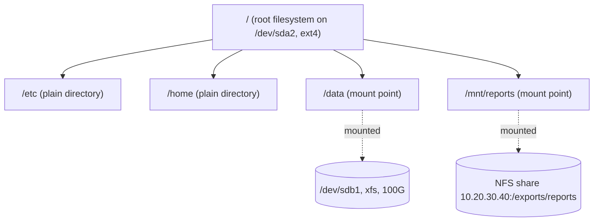

There is one tree rooted at `/` and no drive letters; other disks and shares join the tree through mounts.

| | Directory | Mount |
|---|---|---|
| What it is | An entry in a filesystem that holds other files and directories | A whole filesystem attached onto a directory |
| Created with | `mkdir` | `mount` at run time; `/etc/fstab` or a systemd mount unit to persist |
| Lives on | Its parent's filesystem | Its own device or share, with its own size, type and options |
| Free space | Shares the parent filesystem's space | Its own (check with `df -hT`) |
| After a reboot | Still there | Gone unless it is in `/etc/fstab` or a mount unit |
| Removed with | `rmdir` / `rm -r` (data deleted) | `umount` (the data stays on the device) |

```bash
lsblk -f                                  # disks, partitions, filesystems, mount points
sudo mkfs.xfs /dev/sdb1                   # new disk: create a filesystem on it
sudo mkdir -p /data                       # the mount point is just a directory
sudo mount /dev/sdb1 /data                # attach the filesystem to it
df -hT /data                              # /dev/sdb1  xfs  100G ...  /data
findmnt /data                             # source, type and mount options
mountpoint /data                          # "/data is a mountpoint"

# persistent: reference the UUID, not /dev/sdb1 (device names can change)
sudo blkid /dev/sdb1                      # UUID="3f1c..."
echo 'UUID=<uuid-from-blkid>  /data  xfs  defaults,nofail  0 2' | sudo tee -a /etc/fstab
sudo umount /data && sudo mount -a        # test fstab before any reboot

# network and memory filesystems are mounts too
sudo mount -t nfs4 10.20.30.40:/exports/reports /mnt/reports
sudo mount -t tmpfs -o size=512m tmpfs /scratch

# bind mount: the same directory visible at a second path
sudo mount --bind /srv/app-config /opt/app/config
```

Points that separate a 7-year answer:

- **Hidden files.** Anything written into `/data` while the disk was not mounted lands on the root disk; after mounting, those files are hidden but still use root's space. `du` on the mount point won't show them; unmount (or bind-mount `/` elsewhere) to find them.
- **`umount: target is busy`.** Find the process with `fuser -vm /data` or `lsof +D /data` and stop it; `umount -l` (lazy) is a last resort.
- **Safe fstab entries.** `nofail` for non-critical disks and `_netdev` for network filesystems, so a missing disk or share doesn't drop the server into emergency mode at boot.
- **Mount options are security controls:** `noexec`, `nosuid`, `nodev` on `/tmp` and data mounts; `ro` for shared reference data.
- **Containers are mounts.** Docker and Kubernetes volumes are bind mounts into the container's mount namespace; the kubelet first mounts the disk on the node, then bind-mounts it into the pod.

**In the interview:** "A directory is just an entry in a filesystem; a mount grafts a whole filesystem onto a directory, hiding whatever was there. I always mount by UUID with `nofail`, check with `findmnt` and `df -hT`, and remember that container volumes are bind mounts of the same idea."

---

### Q2. How do you restart the HTTP service on a VM?

**Short answer:** find the service (`httpd` on RHEL-family, `apache2` on Debian/Ubuntu, or `nginx`), validate the configuration first, then use systemd: `reload` for a graceful config reload without dropping connections, `restart` after package, module or binary changes. Verify it is active, listening and answering, and read the journal if it fails. Across a fleet, do it with automation, one server at a time behind the load balancer.

```bash
ssh admin@vm-web-01                              # or AWS SSM Session Manager / Azure Bastion
systemctl list-units --type=service | grep -E 'httpd|apache2|nginx'

# 1. validate the config first: a broken config turns a restart into an outage
sudo apachectl configtest                        # Apache: expects "Syntax OK"
sudo nginx -t                                    # Nginx

# 2. reload when only the config changed; restart for anything else
sudo systemctl reload httpd                      # graceful: in-flight requests finish
sudo systemctl restart httpd                     # full stop and start

# 3. verify
systemctl status httpd --no-pager
systemctl is-active httpd
sudo ss -ltnp | grep -E ':80|:443'               # listening sockets and the owning process
curl -I http://localhost/                        # expect a 200 or 301 status line

# 4. if it failed
journalctl -u httpd -n 50 --no-pager
sudo tail -n 50 /var/log/httpd/error_log         # Ubuntu: /var/log/apache2/error.log; Nginx: /var/log/nginx/error.log
```

| Command | Effect | Use when |
|---|---|---|
| `systemctl reload` | Re-reads configuration; workers finish their requests | Config-only changes, zero downtime |
| `systemctl restart` | Stops and starts the service | Package, module, certificate path or binary changes |
| `systemctl try-restart` | Restarts only if already running | Scripts that must not start a stopped service |
| `systemctl reload-or-restart` | Reload if supported, else restart | Generic automation |
| `systemctl enable --now` | Start now and at every boot | First install |
| `systemctl daemon-reload` | Re-reads unit files | After editing a unit or a drop-in |

Common reasons it won't come back:

| Symptom in the journal | Cause | Fix |
|---|---|---|
| `Address already in use` | Another process holds port 80/443 | `ss -ltnp`, stop or reconfigure the other process |
| `Permission denied` binding a port, or files denied despite correct modes | SELinux | `ausearch -m avc -ts recent`; for a custom port `semanage port -a -t http_port_t -p tcp 8081` |
| `SSLCertificateFile: file does not exist` | Missing or unreadable certificate | Fix the path and permissions, re-run the config test |
| `Syntax error on line N` | Bad config | `apachectl configtest` / `nginx -t` |
| Starts fine, unreachable from outside | Firewall or security group | `firewall-cmd --list-all`, cloud security group / NSG |

Self-healing and fleet operations:

```ini
# /etc/systemd/system/httpd.service.d/restart.conf  (then: systemctl daemon-reload)
[Service]
Restart=on-failure
RestartSec=5s
```

```bash
# Ansible: rolling restart, a few hosts at a time
ansible webservers -i inventories/prod -b -m ansible.builtin.service -a "name=httpd state=restarted" -f 2

# no SSH needed: cloud run-command
aws ssm send-command --document-name "AWS-RunShellScript" --targets "Key=tag:Role,Values=web" \
  --parameters 'commands=["sudo systemctl restart httpd"]'
az vm run-command invoke -g rg-prod -n vm-web-01 --command-id RunShellScript --scripts "sudo systemctl restart httpd"
```

**In the interview:** "Config test first, then `reload` if only the config changed and `restart` otherwise; verify with `systemctl status`, `ss -ltnp` and curl, and go to `journalctl -u httpd` if it fails. On a fleet I'd run it through Ansible or SSM one node at a time, taking each node out of the load balancer first."

---

### Q3. Disk I/O: what is it, and how do you troubleshoot it?

**Short answer:** disk I/O is the reads and writes between memory and storage. It is measured as IOPS (operations per second), throughput (MB/s), latency (ms per operation) and queue depth; throughput = IOPS × block size. Slow disk I/O shows up as high `%wa` (iowait), a high load average with idle CPUs, processes in `D` state and slow responses. Find which device is saturated (`iostat`), which process is causing it (`iotop`, `pidstat -d`), then fix the workload, the storage tier or the layout.

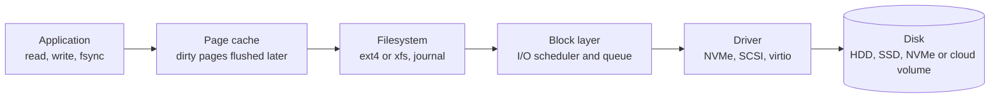

Writes are usually buffered in the page cache and flushed later; `fsync` or `O_DIRECT` make the application wait for the disk, which is why databases are the first to feel slow storage.

**Measure:**

```bash
vmstat 1 5                     # "wa" = CPU time waiting for I/O; "b" = processes blocked on I/O
iostat -xz 1                   # per device: r/s, w/s, rkB/s, wkB/s, r_await, w_await, aqu-sz, %util
sudo iotop -oPa                # which processes are doing the I/O right now
pidstat -d 1                   # per-process read/write kB/s
cat /proc/pressure/io          # PSI: % of time tasks stalled on I/O (some / full)
df -h; df -i                   # full filesystem, or out of inodes
dmesg -T | grep -i -E 'i/o error|blk_update_request|reset'   # hardware or driver errors
sudo smartctl -a /dev/sda      # physical disk health (bare metal)
```

Reading `iostat -xz` (illustrative):

```text
Device    r/s     w/s    rkB/s     wkB/s  r_await  w_await  aqu-sz  %util
nvme0n1  12.0   850.0     96.0   54000.0     0.40    18.70    15.9   99.2
```

Writes dominate, write latency is 18.7 ms on a device that should answer in under a millisecond, and about 16 requests are queued: the disk is saturated by writes. Next step: `iotop` to find the writer.

| Metric | Healthy | Worry when |
|---|---|---|
| `r_await` / `w_await` | Under 1–2 ms on SSD/NVMe, under ~10 ms on HDD | Several times the device's normal latency |
| `aqu-sz` (queue) | Below 1 for HDD; higher is normal for NVMe | Growing steadily alongside latency |
| `%util` | Meaningful for HDD and single-queue devices | Near 100% on HDD; misleading on SSD/NVMe, which serve requests in parallel |
| `wa` in `vmstat` / `top` | Low single digits | Sustained double digits |

**Benchmark a disk** (never against a disk holding production data):

```bash
fio --name=randrw --filename=/data/fio.test --size=2G --rw=randrw --rwmixread=70 \
    --bs=4k --iodepth=32 --ioengine=libaio --direct=1 --runtime=60 --time_based --group_reporting
```

**Typical causes and fixes:**

- **Noisy process:** chatty logging, a backup or batch job, a runaway `find`. Throttle it (`ionice -c3`, cgroup `io.max`), reschedule it or move it to another volume.
- **Swapping:** `vmstat` shows `si`/`so` activity; memory pressure turns into disk I/O. Add memory or fix the leak.
- **Wrong tier or cloud limits:** on AWS, gp3 volumes have a baseline of 3,000 IOPS and 125 MiB/s that you can provision upward, gp2 volumes run out of burst credits, and each instance type caps total EBS bandwidth; check CloudWatch `VolumeQueueLength` and `BurstBalance`. Azure disks and VM sizes have similar caps.
- **Layout:** separate volumes for OS, logs and data; `noatime` on busy filesystems; xfs for large files; RAID or striping for throughput.
- **Failing hardware:** I/O errors in `dmesg` or SMART reallocated sectors mean replace the disk, not tune it.

**In Kubernetes:** heavy `emptyDir` or log writes from one pod slow every pod on that node's root disk. Watch the `DiskPressure` node condition and kubelet eviction thresholds, set `ephemeral-storage` requests and limits, keep container log rotation on, and give databases their own PersistentVolumes. Since v1.36 the kubelet's PSI metrics are generally available, so I/O pressure is visible per node and per container in Prometheus.

**In the interview:** "I start with `vmstat` and `iostat -xz` to see whether a device is saturated (latency and queue, not just %util), then `iotop` to find the process. Fixes range from throttling the noisy job with ionice or cgroups to moving data to a faster tier; in the cloud I check provisioned IOPS, burst credits and the instance's EBS bandwidth before blaming the app."

---

### Q4. What is CPU throttling?

**Short answer:** CPU throttling is the kernel pausing a process or container because it has used up its CPU quota for the current scheduling period, even when the host has idle CPUs. With cgroups (CFS bandwidth control), a CPU limit is a quota per period, 100 ms by default: `limits.cpu: 500m` means 50 ms of CPU time every 100 ms. A multi-threaded app can burn those 50 ms in a few milliseconds of wall time, after which all its threads wait for the next period. The result is latency spikes, timeouts and failed health probes while average CPU usage looks low.

```text
limits.cpu: 500m  ->  quota = 50 ms of CPU time per 100 ms period
4 busy threads during one period ('#' running, '.' throttled):

time (ms)  0           12.5                                                 100
thread 1   |###########|....................................................|
thread 2   |###########|....................................................|
thread 3   |###########|....................................................|
thread 4   |###########|....................................................|
           4 x 12.5 ms = 50 ms of quota used up  ->  throttled for 87.5 ms
```

Requests and limits behave differently:

| Setting | cgroup v2 file | Effect |
|---|---|---|
| `requests.cpu` | `cpu.weight` | A proportional share when the node is busy; never throttles on its own |
| `limits.cpu` | `cpu.max` (quota and period) | A hard ceiling every period: the source of throttling |

**Detect it:**

```bash
# inside the container or on the node (cgroup v2)
cat /sys/fs/cgroup/cpu.max          # "50000 100000" = 50 ms quota per 100 ms period
cat /sys/fs/cgroup/cpu.stat         # nr_periods, nr_throttled, throttled_usec
```

```promql
# share of CFS periods in which each container was throttled (cAdvisor metrics)
sum by (namespace, pod, container) (rate(container_cpu_cfs_throttled_periods_total{container!=""}[5m]))
  /
sum by (namespace, pod, container) (rate(container_cpu_cfs_periods_total{container!=""}[5m]))
  > 0.25
```

kube-prometheus-stack ships a similar `CPUThrottlingHigh` alert. `kubectl top` and `docker stats` show usage only, never throttling, which is why it goes unnoticed. Since v1.36 the kubelet's PSI metrics are also generally available and show CPU pressure directly.

**Fix it:**

- **Right-size or remove CPU limits** for latency-sensitive services. Many teams set accurate CPU requests and no CPU limits, because CPU is compressible and requests already guarantee each pod its share; keep memory limits.
- **Make runtimes limit-aware.** The JVM sizes thread pools and GC threads from the container's CPU limit; Go 1.25 and later set `GOMAXPROCS` from the cgroup limit (older versions need `uber-go/automaxprocs`); tune worker counts in Node.js and Python apps.
- **Use history, not guesses:** VPA recommendations or Prometheus usage percentiles for requests and limits.
- **Exclusive cores** for the most latency-critical pods: Guaranteed QoS with integer CPUs and the kubelet's static CPU manager policy.

**Other meanings worth naming:** thermal or power throttling (the CPU lowers its clock speed when hot; check `dmesg` and `turbostat`) and burstable cloud instances (AWS T-family instances drop to baseline performance when CPU credits run out; watch `CPUCreditBalance`).

**In the interview:** "Throttling is the CFS quota running out within a 100 ms period, so a pod with a 500m limit and four busy threads is paused most of every period even on an idle node. I find it with `container_cpu_cfs_throttled_periods_total` rather than `kubectl top`, and fix it with right-sized or removed CPU limits plus runtime settings that respect the limit."

---

## Part 2 · Kubernetes: extending and exposing

### Q5. What is a custom resource in Kubernetes?

**Short answer:** a custom resource extends the Kubernetes API with your own object type, such as `Certificate`, `KafkaTopic`, `ServiceMonitor` or `Backup`. You define the type with a CustomResourceDefinition (CRD); once it is applied, the API server stores and serves the new kind like a built-in one (kubectl, RBAC, watch, schema validation). A custom resource on its own is only data; a controller, or operator, watches it and reconciles the real world to match. CRD plus controller is the Operator pattern.

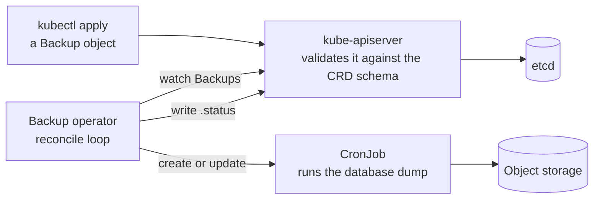

The operator keeps comparing what the Backup object asks for with what exists, and creates, updates or deletes resources until they match.

The definition (CRD):

```yaml
apiVersion: apiextensions.k8s.io/v1
kind: CustomResourceDefinition
metadata:
  name: backups.ops.example.com           # <plural>.<group>
spec:
  group: ops.example.com
  scope: Namespaced
  names:
    kind: Backup
    plural: backups
    singular: backup
    shortNames: [bk]
  versions:
  - name: v1
    served: true
    storage: true
    schema:
      openAPIV3Schema:
        type: object
        properties:
          spec:
            type: object
            required: [database, schedule]
            properties:
              database:
                type: string
              schedule:
                type: string               # cron format
              retentionDays:
                type: integer
                minimum: 1
                default: 7
          status:
            type: object
            properties:
              lastBackupTime:
                type: string
    subresources:
      status: {}
    additionalPrinterColumns:
    - name: Schedule
      type: string
      jsonPath: .spec.schedule
    - name: Last backup
      type: string
      jsonPath: .status.lastBackupTime
```

An instance (the custom resource):

```yaml
apiVersion: ops.example.com/v1
kind: Backup
metadata:
  name: orders-db-nightly
  namespace: prod
spec:
  database: orders-db
  schedule: '0 1 * * *'
  retentionDays: 14
```

```bash
kubectl apply -f backup-crd.yaml
kubectl get crd backups.ops.example.com
kubectl api-resources --api-group=ops.example.com
kubectl apply -f orders-db-nightly.yaml
kubectl get backups -n prod                  # or the short name: kubectl get bk -n prod
kubectl explain backup.spec                  # documentation generated from the schema
```

Custom resources you have probably used already: cert-manager `Certificate` and `Issuer`, Prometheus Operator `ServiceMonitor` and `PrometheusRule`, Argo CD `Application`, Istio `VirtualService`, Strimzi `Kafka` and `KafkaTopic`, External Secrets `ExternalSecret`, Velero `Backup` and `Schedule`, Karpenter `NodePool`.

Points that separate a 7-year answer:

- **Controllers are built with** Kubebuilder or Operator SDK (Go), Kopf (Python) or Metacontroller; reconcile loops must be idempotent and level-triggered.
- **Validation** comes from the OpenAPI schema, defaults and CEL rules (`x-kubernetes-validations`), so bad objects are rejected at the API.
- **Versioning:** several versions can be served, exactly one is the storage version, and a conversion webhook translates between them.
- **Deleting a CRD deletes every custom resource of that type.** Protect CRDs in Helm and Argo CD, and remember that Helm installs CRDs from `crds/` once and never upgrades them.
- **Finalizers** let the operator clean up external resources; if the operator is gone, objects hang in deletion until the finalizer is removed.
- **RBAC applies:** grant verbs on resource `backups` in API group `ops.example.com` like any other resource.

**In the interview:** "A CRD teaches the API server a new type, and a controller gives it behaviour. We used operators such as cert-manager and the Prometheus Operator daily, and wrote a small one with Kubebuilder that turned `Backup` objects into CronJobs and reported the last run in `.status`."

---

### Q6. What is Ingress?

**Short answer:** Ingress is a Kubernetes API object that defines Layer-7 HTTP/HTTPS routing from outside the cluster to Services: host names, URL paths and TLS certificates. An Ingress controller (Traefik, HAProxy, F5 NGINX, Kong, AWS Load Balancer Controller and others) reads those objects and does the actual proxying, usually behind one load balancer that serves many apps. Without a controller, an Ingress object does nothing.

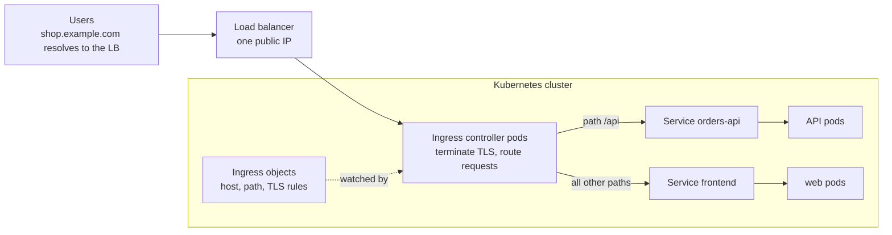

```yaml
apiVersion: networking.k8s.io/v1
kind: Ingress
metadata:
  name: shop
  namespace: prod                        # must be the same namespace as the backend Services
  annotations:
    cert-manager.io/cluster-issuer: letsencrypt-prod
spec:
  ingressClassName: traefik              # which installed controller should handle it
  tls:
  - hosts: [shop.example.com]
    secretName: shop-tls                 # certificate Secret, same namespace
  rules:
  - host: shop.example.com
    http:
      paths:
      - path: /api
        pathType: Prefix                 # Prefix, Exact or ImplementationSpecific
        backend:
          service:
            name: orders-api
            port:
              number: 80                 # the Service port, not the container port
      - path: /
        pathType: Prefix
        backend:
          service:
            name: frontend
            port:
              number: 80
```

| Way to expose an app | Layer | One external IP per | Notes |
|---|---|---|---|
| `NodePort` Service | L4 | Node (ports 30000–32767) | Testing, or behind your own LB |
| `LoadBalancer` Service | L4 | Service | Simple, but one cloud LB per app gets expensive |
| Ingress | L7 | Cluster (shared) | Host and path routing, central TLS, rewrites and auth via the controller |
| Gateway API | L4 and L7 | Gateway (shared) | Successor to Ingress with role-based objects and built-in traffic splitting |

Current-state point: the community `ingress-nginx` controller was retired in March 2026 and receives no further fixes or security patches; existing installations keep working, and the Kubernetes project recommends moving to Gateway API or another controller ([Kubernetes announcement](https://kubernetes.io/blog/2025/11/11/ingress-nginx-retirement/)).

**In the interview:** "Ingress is the L7 routing object; the controller is the reverse proxy that implements it. One LB in front of the controller serves every app by host and path, with TLS from cert-manager. For new platforms I'd look at Gateway API, especially now that the community ingress-nginx controller is retired."

---

### Q7. The application has an Ingress, but the web page is not loading. What do you check?

**Short answer:** follow the request hop by hop and test each hop on its own: DNS → load balancer → Ingress controller → Ingress rule → Service → endpoints → pod. The HTTP status code tells you which hop to look at first: a timeout points at DNS, the LB or firewalls; a 404 from the controller means no rule matched; 502 or 503 mean the controller reached the Service but not a healthy pod.

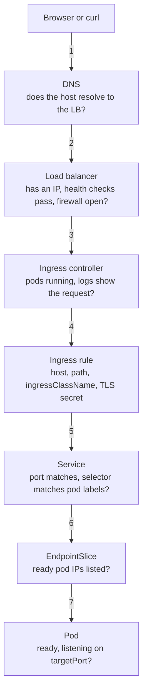

**Start from the status code:**

| What you see | Usually means | Check |
|---|---|---|
| DNS error / NXDOMAIN | Record missing, wrong or not propagated | `dig +short shop.example.com`, ExternalDNS logs |
| Connection timeout | LB not provisioned, wrong IP, security group / NSG / firewall | `kubectl get svc -n <controller-ns>`, cloud LB health checks |
| 404 from the controller | No rule matched: wrong host or path, wrong `ingressClassName`, Ingress in another namespace | `kubectl describe ingress`, controller logs |
| 502 Bad Gateway | Pod reached but answered badly: wrong `targetPort`, app crashing, HTTP vs HTTPS mismatch to the backend | Endpoints, pod logs, backend-protocol setting |
| 503 Service Unavailable | No ready endpoints: selector mismatch or readiness probe failing | `kubectl get endpointslices`, pod readiness |
| 504 Gateway Timeout | App too slow, or a NetworkPolicy silently dropping traffic | App latency, controller timeouts, NetworkPolicies |
| Certificate error | Missing or wrong TLS secret, SNI mismatch | Secret, cert-manager `Certificate` status, `openssl s_client` |
| Redirect loop | HTTPS redirect at both the LB and the controller | TLS termination and redirect settings |

**Work from the pod outward:**

```bash
NS=prod
# 7. pod: running, ready, and the app answers inside the pod
kubectl get pods -n $NS -l app=frontend -o wide
kubectl logs -n $NS deploy/frontend --tail=50
kubectl exec -n $NS deploy/frontend -- wget -qO- http://127.0.0.1:8080/   # app listening on 0.0.0.0, not just 127.0.0.1?

# 5-6. Service and endpoints: selector must match pod labels, targetPort must match containerPort
kubectl get svc frontend -n $NS -o wide
kubectl get endpointslices -n $NS -l kubernetes.io/service-name=frontend
kubectl run nettest -n $NS --rm -it --image=nicolaka/netshoot -- curl -sv http://frontend.$NS.svc.cluster.local/

# 4. Ingress: address assigned, rules, backend Service name and port, class, events
kubectl get ingressclass
kubectl describe ingress shop -n $NS

# 3. controller: running, and its logs show the request with a status code and reason
kubectl get pods -n <controller-namespace>
kubectl logs -n <controller-namespace> deploy/<controller-deployment> --tail=100

# 2-1. test the LB directly, bypassing DNS, then check DNS
kubectl get svc -n <controller-namespace>                     # EXTERNAL-IP of the controller's Service
curl -v -H 'Host: shop.example.com' http://<LB-IP>/
curl -v --resolve shop.example.com:443:<LB-IP> https://shop.example.com/
dig +short shop.example.com

# TLS
kubectl get secret shop-tls -n $NS
kubectl get certificate -n $NS                                # cert-manager: READY should be True
openssl s_client -connect <LB-IP>:443 -servername shop.example.com </dev/null | openssl x509 -noout -subject -dates
```

Usual root causes, roughly in order of how often they bite:

1. Service selector doesn't match the pod labels, so there are no endpoints (503).
2. Ingress backend port points at the container port instead of the Service port, or `targetPort` is wrong (502 or 503).
3. `ingressClassName` missing or wrong, so no controller picks up the Ingress (404 or no address at all).
4. Readiness probe failing, so pods run but never become endpoints (503).
5. App bound to `127.0.0.1` inside the container (502 or connection refused).
6. DNS still pointing to an old LB, or the LB `EXTERNAL-IP` still `<pending>` on bare metal without MetalLB.
7. A NetworkPolicy that doesn't allow traffic from the controller's namespace (timeouts, 504).
8. TLS secret missing, in another namespace, or not matching the host.

**In the interview:** "I let the status code point me to the hop, then test each hop in isolation: pod from inside, Service from a netshoot pod, the controller with curl and a Host header straight at the LB IP, and DNS last. Nine times out of ten it's a selector or port mismatch, a missing ingressClassName or a failing readiness probe."

---

## Part 3 · Kubernetes: operations

### Q8. How do you monitor the cluster with Prometheus?

**Short answer:** install kube-prometheus-stack (Prometheus Operator, Prometheus, Alertmanager, Grafana, node-exporter and kube-state-metrics, plus default alert rules and dashboards). Prometheus pulls metrics from nodes, the kubelet and cAdvisor, the control plane, kube-state-metrics and your applications; alert rules fire into Alertmanager, which routes them to Slack or PagerDuty; Grafana shows the dashboards. Applications are added with ServiceMonitor objects, alerts with PrometheusRule objects.

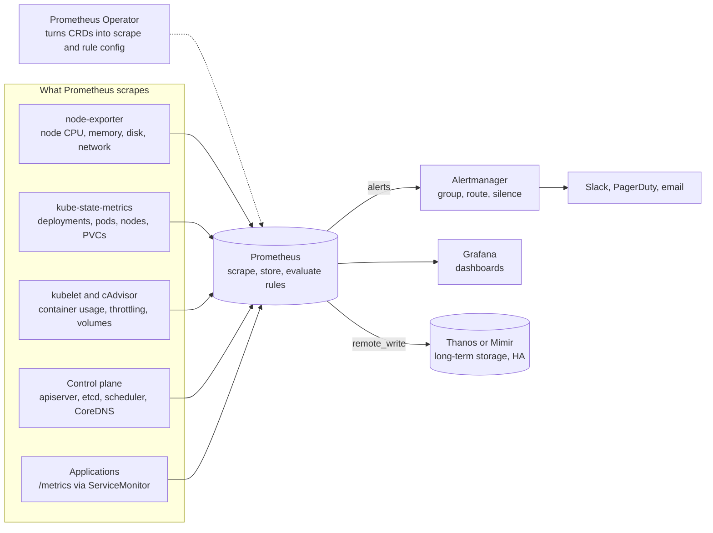

Prometheus pulls (scrapes) every target on an interval; the arrows show the direction the data flows.

**Install:**

```bash
helm repo add prometheus-community https://prometheus-community.github.io/helm-charts
helm repo update
helm upgrade --install monitoring prometheus-community/kube-prometheus-stack \
  -n monitoring --create-namespace -f values-monitoring.yaml
kubectl -n monitoring get pods
kubectl -n monitoring port-forward svc/monitoring-grafana 3000:80
```

`values-monitoring.yaml` (the parts worth knowing):

```yaml
prometheus:
  prometheusSpec:
    replicas: 2                                     # HA pair
    retention: 15d
    serviceMonitorSelectorNilUsesHelmValues: false  # also pick up ServiceMonitors from other releases
    ruleSelectorNilUsesHelmValues: false
    storageSpec:
      volumeClaimTemplate:
        spec:
          storageClassName: standard
          resources:
            requests:
              storage: 100Gi
alertmanager:
  alertmanagerSpec:
    secrets: [alertmanager-slack]                   # mounted at /etc/alertmanager/secrets/alertmanager-slack/
  config:
    route:
      receiver: slack-oncall
      group_by: [alertname, namespace]
    receivers:
    - name: slack-oncall
      slack_configs:
      - channel: '#k8s-alerts'
        api_url_file: /etc/alertmanager/secrets/alertmanager-slack/webhook-url
```

**Scrape an application** (its Service exposes a port named `http-metrics`):

```yaml
apiVersion: monitoring.coreos.com/v1
kind: ServiceMonitor
metadata:
  name: orders-api
  namespace: prod
spec:
  selector:
    matchLabels:
      app: orders-api
  endpoints:
  - port: http-metrics
    path: /metrics
    interval: 30s
```

**Alert on it:**

```yaml
apiVersion: monitoring.coreos.com/v1
kind: PrometheusRule
metadata:
  name: orders-api-alerts
  namespace: prod
spec:
  groups:
  - name: orders-api
    rules:
    - alert: OrdersApiHighErrorRate
      expr: |
        sum(rate(http_requests_total{job="orders-api", code=~"5.."}[5m]))
          / sum(rate(http_requests_total{job="orders-api"}[5m])) > 0.05
      for: 10m
      labels:
        severity: critical
      annotations:
        summary: 'orders-api 5xx rate above 5% for 10 minutes'
```

**Queries worth knowing:**

```promql
# node CPU usage %
100 - (avg by (instance) (rate(node_cpu_seconds_total{mode="idle"}[5m])) * 100)

# node memory available %
node_memory_MemAvailable_bytes / node_memory_MemTotal_bytes * 100

# filesystem free %
node_filesystem_avail_bytes{fstype!~"tmpfs|overlay"} / node_filesystem_size_bytes{fstype!~"tmpfs|overlay"} * 100

# nodes not Ready
kube_node_status_condition{condition="Ready", status="true"} == 0

# containers restarting
increase(kube_pod_container_status_restarts_total[15m]) > 3

# deployments missing replicas
kube_deployment_spec_replicas != kube_deployment_status_replicas_available

# PVCs above 85% full
kubelet_volume_stats_available_bytes / kubelet_volume_stats_capacity_bytes < 0.15

# API server 5xx ratio
sum(rate(apiserver_request_total{code=~"5.."}[5m])) / sum(rate(apiserver_request_total[5m]))
```

Points that separate a 7-year answer:

- **Methods, not just metrics:** USE (utilization, saturation, errors) for nodes and infrastructure, RED (rate, errors, duration) for services, and SLO burn-rate alerts instead of dozens of threshold alerts.
- **Alert hygiene:** every alert has an owner, a severity and a runbook link; group and inhibit in Alertmanager so one node failure doesn't page twenty times.
- **Scale and HA:** two Prometheus replicas, and Thanos or Mimir (or a managed service such as Amazon Managed Service for Prometheus, Azure Monitor managed Prometheus or Google Managed Prometheus) for long retention and a global view across clusters.
- **Cardinality:** labels like user IDs or request IDs explode memory; drop or relabel them at scrape time.
- **Managed control planes** (EKS, AKS, GKE) don't expose etcd, scheduler or controller-manager metrics the same way; disable those scrape jobs or use the provider's metrics.

**In the interview:** "kube-prometheus-stack via Helm, with node-exporter, kube-state-metrics and cAdvisor covering the cluster, ServiceMonitors for each app, PrometheusRules in Git next to the app, Alertmanager routing critical alerts to PagerDuty and the rest to Slack, Grafana dashboards per team, and Thanos for 90-day retention across clusters."

---

### Q9. How do you upgrade the worker nodes in Kubernetes?

**Short answer:** upgrade the control plane first, then the workers one node (or a small batch) at a time: cordon, drain, upgrade or replace the node, uncordon, verify, repeat. PodDisruptionBudgets, at least two replicas and spare capacity keep applications available throughout. Respect the version skew rules: a kubelet must never be newer than the API server and may be at most three minor versions older, and the control plane moves one minor version at a time (for example v1.36 → v1.37).

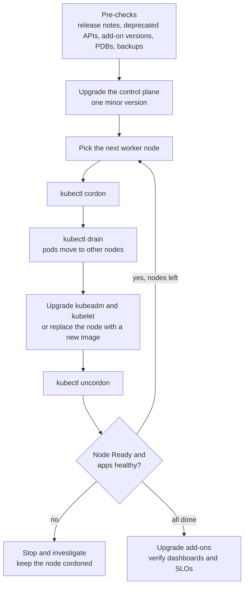

**Pre-checks:**

- Read the release notes; find removed or deprecated APIs in your manifests and Helm releases (`kubent`, `pluto`).
- Check add-on compatibility: CNI, CSI drivers, ingress controller, cert-manager, monitoring stack, service mesh.
- Back up etcd on self-managed clusters (`etcdctl snapshot save`) and workloads with Velero.
- Make sure critical apps have at least two replicas spread across nodes and a PDB, and that the cluster has room to drain one node (or surge an extra one).
- Rehearse the same upgrade in a lower environment first.

**Self-managed (kubeadm) worker node, for example v1.36 → v1.37 on Ubuntu:**

```bash
# admin machine
kubectl cordon worker-2
kubectl drain worker-2 --ignore-daemonsets --delete-emptydir-data --timeout=15m

# on worker-2: first point the pkgs.k8s.io apt repository at the v1.37 channel,
# then upgrade (replace x with the patch version)
sudo apt-mark unhold kubeadm && sudo apt-get update && sudo apt-get install -y kubeadm='1.37.x-*' && sudo apt-mark hold kubeadm
sudo kubeadm upgrade node
sudo apt-mark unhold kubelet kubectl && sudo apt-get install -y kubelet='1.37.x-*' kubectl='1.37.x-*' && sudo apt-mark hold kubelet kubectl
sudo systemctl daemon-reload && sudo systemctl restart kubelet

# admin machine
kubectl uncordon worker-2
kubectl get nodes -o wide                 # worker-2: Ready, VERSION v1.37.x
kubectl get pods -A -o wide --field-selector spec.nodeName=worker-2
```

**Managed clusters:**

| Platform | Control plane | Worker nodes |
|---|---|---|
| EKS | Console, `eksctl upgrade cluster` or Terraform | Managed node groups: `aws eks update-nodegroup-version --cluster-name prod --nodegroup-name ng-app` (rolling, respects PDBs); Karpenter replaces drifted nodes automatically |
| AKS | `az aks upgrade` | `az aks nodepool upgrade --resource-group rg-prod --cluster-name aks-prod --name apppool --kubernetes-version <version> --max-surge 33%` |
| GKE | Release channels or manual upgrade | Surge upgrades or blue-green node pool upgrades |

Strategies:

- **In-place rolling:** one node at a time; cheapest, slowest.
- **Surge:** add new-version nodes first, then drain old ones; no capacity dip.
- **Blue/green node pools:** create a new pool, cordon the old pool, drain it gradually, delete it at the end; the safest, with an instant rollback (uncordon the old pool).

**In the interview:** "Control plane first, then workers one at a time with cordon, drain, upgrade, uncordon and a health check before the next node. Before starting I scan for removed APIs, check add-on compatibility and PDBs, and back up etcd. On EKS we did blue/green node groups so rollback was just uncordoning the old group."

---

### Q10. While draining a node, some pods are not removed. What do you do?

**Short answer:** read what `kubectl drain` reports, because each kind of blocker has its own fix: DaemonSet pods need `--ignore-daemonsets`, pods with `emptyDir` need `--delete-emptydir-data`, bare pods need `--force`, PodDisruptionBudgets need spare replicas, and pods stuck terminating usually have a finalizer or a hanging shutdown. Look at the leftover pods on the node, fix the cause, and bypass safety checks only with the application owner's agreement.

```bash
kubectl drain worker-2 --ignore-daemonsets --delete-emptydir-data --timeout=15m

# what is still on the node, and why
kubectl get pods -A -o wide --field-selector spec.nodeName=worker-2
kubectl get pdb -A                                    # ALLOWED DISRUPTIONS 0 = this PDB is blocking
kubectl describe pdb <name> -n <ns>
kubectl get pods -A --field-selector status.phase=Pending   # evicted pods that can't land elsewhere
kubectl get pod <pod> -n <ns> -o jsonpath='{.metadata.ownerReferences[*].kind}'   # empty = bare pod
kubectl get pod <pod> -n <ns> -o jsonpath='{.metadata.finalizers}'
```

| What you see | Cause | What to do |
|---|---|---|
| `cannot delete DaemonSet-managed Pods` | DaemonSet pods are meant to stay on every node | Add `--ignore-daemonsets` (they are not evicted) |
| `cannot delete Pods with local storage` | Pod uses `emptyDir` | Add `--delete-emptydir-data` (that data is lost) |
| `cannot delete Pods not managed by a controller` | Bare pod; it won't be recreated anywhere | Move it under a Deployment first, or accept losing it with `--force` |
| `Cannot evict pod as it would violate the pod's disruption budget` (drain keeps retrying) | PDB allows 0 disruptions: too few healthy replicas, or a PDB that can never be satisfied (`minAvailable` equal to the replica count) | Scale up so another replica is ready elsewhere, fix unhealthy pods, or correct the PDB |
| Evicted pods stay `Pending`, so the PDB never frees up | No room elsewhere: capacity, `nodeSelector`/affinity pinned to this node, taints, a PVC tied to this node's zone | Add capacity, relax the constraint, or plan a data move |
| Pod stuck in `Terminating` | Long `terminationGracePeriodSeconds`, a hanging `preStop` hook, a finalizer, or an unreachable kubelet | Check the app's shutdown and the finalizer; force delete only as a last resort |
| Pod bound to a local PersistentVolume | Its data lives on this node | Migrate the data or the replica (for example a database failover) before draining |
| Static (mirror) pods stay | Managed by the kubelet's manifest directory, not by the API | Expected; they stop when the kubelet or node stops |

Fixes, from safest to riskiest:

```bash
kubectl scale deployment orders-api -n prod --replicas=3                      # give the PDB room
kubectl drain worker-2 --ignore-daemonsets --delete-emptydir-data --force      # also removes bare pods
kubectl delete pod <pod> -n <ns> --grace-period=0 --force                      # stuck Terminating; never casually for StatefulSets
kubectl drain worker-2 --ignore-daemonsets --delete-emptydir-data --disable-eviction   # bypasses PDBs: only with the owner's sign-off
```

Prevent it next time with PDBs that tolerate one disruption and don't let crash-looping pods block drains:

```yaml
apiVersion: policy/v1
kind: PodDisruptionBudget
metadata:
  name: orders-api
  namespace: prod
spec:
  maxUnavailable: 1
  unhealthyPodEvictionPolicy: AlwaysAllow     # unhealthy pods never block a drain
  selector:
    matchLabels:
      app: orders-api
```

**In the interview:** "I look at what's left with a field selector on the node name and `kubectl get pdb`. DaemonSets and emptyDir are just flags; a PDB at zero allowed disruptions means scaling up or fixing unhealthy replicas, Pending replacements mean capacity or affinity problems, and Terminating pods mean finalizers or slow shutdown hooks. I only use `--disable-eviction` or force deletes with the app owner's agreement."

---

## Part 4 · Kubernetes: access control

### Q11. What roles would you give a junior team member in Kubernetes?

**Short answer:** least privilege, by namespace and by group: the built-in `edit` role in development namespaces, `view` (read-only, no Secrets) in staging and production, and no `cluster-admin`. Changes to production go through Git and CI/CD rather than kubectl, and anything more (exec into prod pods, reading Secrets) is a time-bound, audited break-glass request.

Kubernetes ships four user-facing ClusterRoles; bind them with a RoleBinding to scope them to one namespace:

| Built-in role | Allows | Bound to a junior? |
|---|---|---|
| `view` | Read most namespaced objects, including pod logs; no Secrets, Roles or RoleBindings | Yes: staging and production |
| `edit` | Create, change and delete most namespaced objects, read Secrets, exec and port-forward | Yes: dev namespaces only |
| `admin` | Everything in a namespace, including Roles and RoleBindings | No |
| `cluster-admin` | Everything, everywhere | No |

| Environment | Junior's access | How |
|---|---|---|
| Dev namespaces | `edit` | RoleBinding per namespace to the SSO group |
| Staging / QA | `view` | RoleBinding |
| Production | `view` only; changes via GitOps or the pipeline | RoleBinding; exec and Secrets only through break-glass |
| Cluster-scoped | Read nodes and namespaces, `kubectl top` (optional) | A narrow custom ClusterRole + ClusterRoleBinding |

```yaml
apiVersion: rbac.authorization.k8s.io/v1
kind: RoleBinding
metadata:
  name: juniors-edit
  namespace: dev
subjects:
- kind: Group
  name: k8s-juniors                    # group from SSO: Entra ID, Okta, IAM Identity Center
  apiGroup: rbac.authorization.k8s.io
roleRef:
  kind: ClusterRole
  name: edit                           # built-in role, limited to this namespace by the RoleBinding
  apiGroup: rbac.authorization.k8s.io
---
apiVersion: rbac.authorization.k8s.io/v1
kind: RoleBinding
metadata:
  name: juniors-view
  namespace: prod
subjects:
- kind: Group
  name: k8s-juniors
  apiGroup: rbac.authorization.k8s.io
roleRef:
  kind: ClusterRole
  name: view                           # read-only, no Secrets
  apiGroup: rbac.authorization.k8s.io
---
apiVersion: rbac.authorization.k8s.io/v1
kind: ClusterRole
metadata:
  name: node-reader
rules:
- apiGroups: ['']
  resources: ['nodes', 'namespaces']
  verbs: ['get', 'list', 'watch']
- apiGroups: ['metrics.k8s.io']        # kubectl top
  resources: ['nodes', 'pods']
  verbs: ['get', 'list']
---
apiVersion: rbac.authorization.k8s.io/v1
kind: ClusterRoleBinding
metadata:
  name: juniors-node-reader
subjects:
- kind: Group
  name: k8s-juniors
  apiGroup: rbac.authorization.k8s.io
roleRef:
  kind: ClusterRole
  name: node-reader
  apiGroup: rbac.authorization.k8s.io
```

```bash
kubectl auth can-i --list -n prod --as=jane --as-group=k8s-juniors
kubectl auth can-i get secrets -n prod --as=jane --as-group=k8s-juniors        # no
kubectl auth can-i create deployments -n dev --as=jane --as-group=k8s-juniors   # yes
```

On EKS the same can be done without RBAC YAML through access entries, for example the `AmazonEKSViewPolicy` access policy scoped to the `prod` namespace for the juniors' IAM role.

**In the interview:** "Group-based and namespace-scoped: `edit` in dev, `view` everywhere else, a small node-reader ClusterRole so they can see nodes and `kubectl top`, and no Secrets or exec in production. I verify with `kubectl auth can-i --list` and review the bindings every quarter."

---

### Q12. What is the difference between a Role and a RoleBinding?

**Short answer:** a Role says what can be done: a list of rules (API groups, resources, verbs) inside one namespace. A RoleBinding says who gets it: it attaches a Role, or a ClusterRole, to subjects (users, groups, ServiceAccounts) within its namespace. A Role alone grants nothing until something binds it; a binding is useless without the role it points to. Think of the Role as the job description and the RoleBinding as the appointment letter.

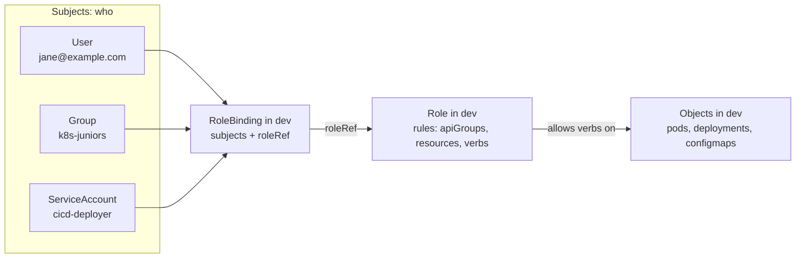

```yaml
apiVersion: rbac.authorization.k8s.io/v1
kind: Role                                 # WHAT
metadata:
  name: pod-reader
  namespace: dev
rules:
- apiGroups: ['']
  resources: ['pods', 'pods/log']
  verbs: ['get', 'list', 'watch']
---
apiVersion: rbac.authorization.k8s.io/v1
kind: RoleBinding                          # WHO
metadata:
  name: jane-pod-reader
  namespace: dev
subjects:
- kind: User
  name: jane@example.com
  apiGroup: rbac.authorization.k8s.io
roleRef:                                   # immutable: delete and recreate the binding to change it
  kind: Role
  name: pod-reader
  apiGroup: rbac.authorization.k8s.io
```

```bash
# the same thing imperatively
kubectl create role pod-reader -n dev --verb=get,list,watch --resource=pods,pods/log
kubectl create rolebinding jane-pod-reader -n dev --role=pod-reader --user=jane@example.com
kubectl auth can-i list pods -n dev --as=jane@example.com     # yes
kubectl auth can-i list pods -n prod --as=jane@example.com    # no: the binding only covers dev
```

| Role kind | Bound with | Result |
|---|---|---|
| Role | RoleBinding | Permissions in that one namespace |
| ClusterRole | RoleBinding | The ClusterRole's rules, but only in the RoleBinding's namespace: one definition reused across namespaces |
| ClusterRole | ClusterRoleBinding | Rules in every namespace, plus cluster-scoped objects (nodes, PVs, namespaces) |
| Role | ClusterRoleBinding | Not possible |

Points that separate a 7-year answer:

- RBAC is additive only; there are no deny rules, so access is removed by deleting bindings.
- `roleRef` cannot be changed on an existing binding.
- A subject can come from another namespace, for example a ServiceAccount in `ci` bound in `prod`.
- Privilege escalation is blocked: you can only grant permissions you hold yourself, unless you have the `bind` or `escalate` verbs, which should be treated like `cluster-admin`.

**In the interview:** "The Role is the permission set, the RoleBinding is the assignment of that set to people or service accounts in a namespace. In practice we define a few ClusterRoles once and bind them per namespace with RoleBindings, because the same `view` or `deployer` role is needed in many namespaces."

---

### Q13. How do you give view (read-only) access to the cluster?

**Short answer:** bind the built-in `view` ClusterRole. A RoleBinding gives read-only access to one namespace; a ClusterRoleBinding gives it in every namespace. `view` deliberately excludes Secrets; add a small ClusterRole if the person also needs to see cluster-scoped objects such as nodes.

```bash
# read-only in one namespace
kubectl create rolebinding jane-view -n prod --clusterrole=view --user=jane@example.com

# read-only in every namespace, for a group
kubectl create clusterrolebinding readonly-all --clusterrole=view --group=k8s-readonly

# generate YAML for Git instead of applying directly
kubectl create rolebinding jane-view -n prod --clusterrole=view --user=jane@example.com \
  --dry-run=client -o yaml > rolebinding.yaml
kubectl apply -f rolebinding.yaml

# verify
kubectl auth can-i list pods -n prod --as=jane@example.com           # yes
kubectl auth can-i delete pods -n prod --as=jane@example.com         # no
kubectl auth can-i get secrets -n prod --as=jane@example.com         # no
```

The `rolebinding.yaml` for READ access in one namespace:

```yaml
apiVersion: rbac.authorization.k8s.io/v1
kind: RoleBinding
metadata:
  name: jane-view
  namespace: prod
subjects:
- kind: User
  name: jane@example.com
  apiGroup: rbac.authorization.k8s.io
roleRef:
  kind: ClusterRole
  name: view                               # built-in read-only role
  apiGroup: rbac.authorization.k8s.io
```

For cluster-wide read access, the same structure becomes a `ClusterRoleBinding` (no namespace in its metadata). If you write your own read role instead of using `view`, list the verbs explicitly:

```yaml
rules:
- apiGroups: ['', 'apps', 'batch', 'networking.k8s.io']
  resources: ['pods', 'pods/log', 'services', 'configmaps', 'deployments', 'replicasets', 'statefulsets', 'jobs', 'cronjobs', 'ingresses']
  verbs: ['get', 'list', 'watch']            # the three read verbs
```

Avoid `resources: ['*']` with read verbs: it includes Secrets, so "read-only" would expose every password in the cluster.

RBAC only authorizes; the person also needs to authenticate. Use SSO (OIDC, cloud IAM mappings such as EKS access entries) for humans; client certificates issued through the CertificateSigningRequest API are for break-glass access only, because they can't be revoked easily.

**In the interview:** "`kubectl create clusterrolebinding readonly-all --clusterrole=view --group=k8s-readonly` for cluster-wide read, or a RoleBinding to `view` for one namespace; the verbs behind it are get, list and watch. I verify with `kubectl auth can-i`, and I never hand out wildcard read because it includes Secrets."

---

## Part 5 · Kubernetes: scheduling

### Q14. If I want to deploy my app on worker node 2, what should I do?

**Short answer:** label the node and add a `nodeSelector` (or node affinity) to the pod template; for one specific node, the built-in `kubernetes.io/hostname` label works without adding a label. If node 2 should run only this app, also taint it and give the app a matching toleration. Avoid `nodeName`: it bypasses the scheduler. And remember that pinning to a single node creates a single point of failure; in production, target a labelled group of nodes.

```bash
kubectl get nodes --show-labels
kubectl label node worker-2 workload=payments        # add a label of your own
```

```yaml
apiVersion: apps/v1
kind: Deployment
metadata:
  name: payments-api
  namespace: prod
spec:
  replicas: 2
  selector:
    matchLabels:
      app: payments-api
  template:
    metadata:
      labels:
        app: payments-api
    spec:
      nodeSelector:
        workload: payments                  # or: kubernetes.io/hostname: worker-2
      containers:
      - name: app
        image: myorg/payments-api:2.3.0
```

```bash
kubectl apply -f payments-api.yaml
kubectl get pods -n prod -l app=payments-api -o wide      # NODE column shows worker-2
kubectl describe pod <pending-pod> -n prod                 # if Pending: "0/3 nodes are available: 2 node(s) didn't match Pod's node affinity/selector"
```

| Option | How | When |
|---|---|---|
| `nodeSelector` | Exact label match on the node | The simple, usual answer |
| Node affinity | `required...` (hard) or `preferred...` (soft) rules with `In`, `NotIn`, `Exists` | Several nodes, zones, preferences (Q15) |
| Taint + toleration | Taint node 2, tolerate it in the app | Dedicate node 2 to this app; combine with a selector |
| `nodeName: worker-2` | Writes the node directly, skipping the scheduler | Avoid: no scheduling checks, ignores `NoSchedule` taints |

**In the interview:** "Label worker-2 and use a nodeSelector, or `kubernetes.io/hostname` for that exact node; if the node must be dedicated, taint it and tolerate the taint in the app. In production I'd label a pool of nodes rather than one, so a node failure doesn't take the app down."

---

### Q15. What is the difference between nodeSelector and node affinity vs taints and tolerations?

**Short answer:** nodeSelector and node affinity are rules on the pod that attract it to nodes with certain labels. Taints and tolerations work the other way round: a taint on a node repels every pod that doesn't tolerate it, and a toleration only permits a pod onto the node, it doesn't pull it there. To dedicate nodes to a workload you need both: taint the nodes to keep everything else off, and give the workload a toleration plus a selector or affinity so it actually lands there.

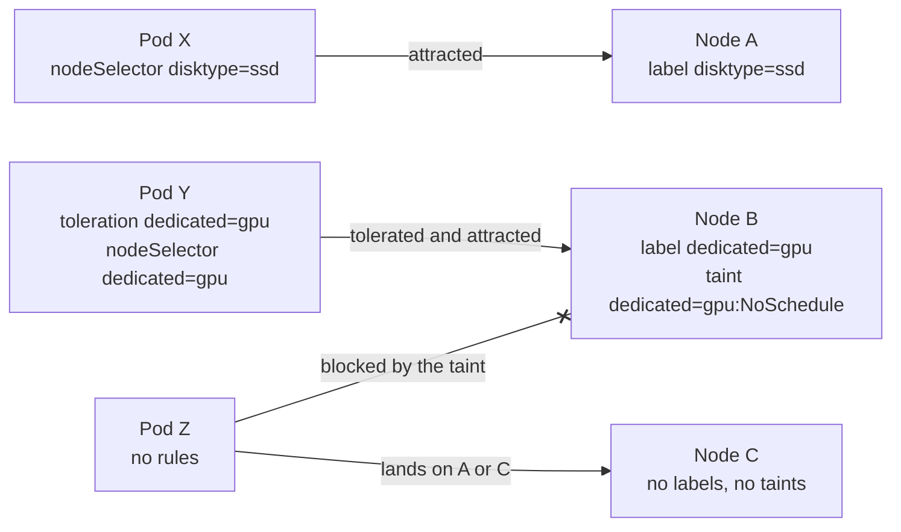

| | nodeSelector | Node affinity | Taints and tolerations |
|---|---|---|---|
| Defined on | Pod | Pod | Taint on the node, toleration on the pod |
| Direction | Attract | Attract (or avoid with `NotIn`) | Repel |
| Matching | Exact labels, all must match | `In`, `NotIn`, `Exists`, `DoesNotExist`, `Gt`, `Lt`; OR across terms | `key=value:effect` |
| Hard or soft | Hard | `required...` is hard, `preferred...` is soft with weights | `NoSchedule` hard, `PreferNoSchedule` soft, `NoExecute` also evicts running pods |
| Typical use | Simple pinning to a node pool | Zones, instance types, soft preferences | Dedicated nodes (GPU, payments), keeping workloads off the control plane, node problems |

nodeSelector:

```yaml
spec:
  nodeSelector:
    disktype: ssd
```

Node affinity, a hard rule plus a soft preference:

```yaml
spec:
  affinity:
    nodeAffinity:
      requiredDuringSchedulingIgnoredDuringExecution:
        nodeSelectorTerms:
        - matchExpressions:
          - key: topology.kubernetes.io/zone
            operator: In
            values: [ap-south-1a, ap-south-1b]
      preferredDuringSchedulingIgnoredDuringExecution:
      - weight: 80
        preference:
          matchExpressions:
          - key: node.kubernetes.io/instance-type
            operator: In
            values: [m6i.2xlarge]
```

`IgnoredDuringExecution` means a label change after scheduling doesn't evict pods that are already running.

Taint and toleration, for a dedicated GPU node:

```bash
kubectl taint nodes gpu-node-1 dedicated=gpu:NoSchedule
kubectl label nodes gpu-node-1 dedicated=gpu
kubectl describe node gpu-node-1 | grep -i taints
kubectl taint nodes gpu-node-1 dedicated=gpu:NoSchedule-      # remove it (trailing minus)
```

```yaml
spec:
  tolerations:
  - key: dedicated
    operator: Equal
    value: gpu
    effect: NoSchedule
  nodeSelector:
    dedicated: gpu                # the toleration lets it in; the selector sends it there
```

Taints you already meet every day:

- `node-role.kubernetes.io/control-plane:NoSchedule` keeps ordinary workloads off control-plane nodes.
- `node.kubernetes.io/not-ready:NoExecute` and `node.kubernetes.io/unreachable:NoExecute` are added when a node fails; pods get a default toleration of 300 seconds, which is why they are evicted about five minutes after a node goes down. Shorten it with `tolerationSeconds` for faster failover.
- `node.kubernetes.io/unschedulable:NoSchedule` is what `kubectl cordon` sets.

Related tools for spreading rather than placing: pod anti-affinity (keep replicas apart) and `topologySpreadConstraints` (spread evenly across zones or nodes).

**In the interview:** "Selectors and affinity attract pods, taints repel them, and a toleration is only permission, not a pull. For dedicated payment nodes we tainted the pool, labelled it, and gave the payment workloads both a toleration and a nodeSelector; everything else stays off those nodes automatically."

---

## Part 6 · Kubernetes: storage

### Q16. What are StorageClasses in Kubernetes, and what is the purpose of using them?

*This answers both StorageClass questions: what they are and why you use them.*

**Short answer:** a StorageClass describes a kind (tier) of storage the cluster offers: which provisioner (CSI driver) creates the volumes, with which parameters (disk type, IOPS, encryption, filesystem), and with which policies (reclaim, binding mode, expansion). A PersistentVolumeClaim names a class, and the provisioner creates a matching disk and PersistentVolume automatically. The purpose is self-service dynamic provisioning, with apps asking for a tier by name instead of knowing anything about the storage underneath.

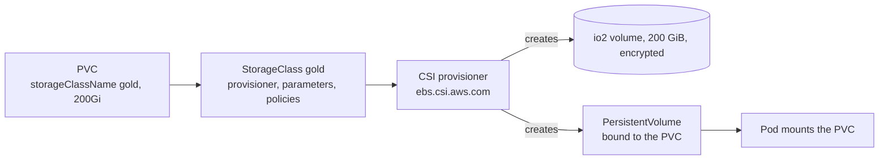

**Why use them:**

1. **Dynamic provisioning:** nobody pre-creates PVs; a developer's PVC (or a StatefulSet's `volumeClaimTemplates`) gets a disk on demand.
2. **Abstraction and portability:** manifests ask for `gold` or `standard`; each cluster maps those names to its own backend (EBS, Azure Disk, Ceph, vSphere), so the same Helm chart works everywhere.
3. **Tiers for cost and performance:** gold, silver, bronze; SSD vs HDD; replicated vs not.
4. **Consistent policies:** encryption, reclaim policy, expansion and topology-aware placement are decided once by the platform team, not per app.
5. **A default:** PVCs that don't name a class get the default one.

| Field | Meaning |
|---|---|
| `provisioner` | The CSI driver that creates volumes: `ebs.csi.aws.com`, `disk.csi.azure.com`, `pd.csi.storage.gke.io`, `csi.vsphere.vmware.com`, `rook-ceph.rbd.csi.ceph.com`, `nfs.csi.k8s.io` |
| `parameters` | Driver-specific: disk type, IOPS, throughput, encryption, filesystem, replica count |
| `reclaimPolicy` | `Delete` (default) removes the disk with the PVC; `Retain` keeps it |
| `volumeBindingMode` | `Immediate`, or `WaitForFirstConsumer` to create the disk in the zone where the pod is scheduled |
| `allowVolumeExpansion` | Whether PVCs of this class can be grown later |
| `mountOptions` | For example `nfsvers=4.1` or `noatime` |
| `allowedTopologies` | Restrict the zones where volumes may be created |
| Default annotation | `storageclass.kubernetes.io/is-default-class: "true"` |

```yaml
apiVersion: storage.k8s.io/v1
kind: StorageClass
metadata:
  name: gold                               # databases: fast, kept on PVC deletion
provisioner: ebs.csi.aws.com
parameters:
  type: io2
  iops: '10000'
  encrypted: 'true'
reclaimPolicy: Retain
volumeBindingMode: WaitForFirstConsumer
allowVolumeExpansion: true
---
apiVersion: storage.k8s.io/v1
kind: StorageClass
metadata:
  name: standard                           # everything else; the cluster default
  annotations:
    storageclass.kubernetes.io/is-default-class: 'true'
provisioner: ebs.csi.aws.com
parameters:
  type: gp3
  encrypted: 'true'
reclaimPolicy: Delete
volumeBindingMode: WaitForFirstConsumer
allowVolumeExpansion: true
---
apiVersion: v1
kind: PersistentVolumeClaim
metadata:
  name: orders-db-data
  namespace: prod
spec:
  accessModes: [ReadWriteOnce]
  storageClassName: gold
  resources:
    requests:
      storage: 200Gi
```

```bash
kubectl get storageclass                    # the default one is marked "(default)"
kubectl describe storageclass gold
kubectl get pvc -n prod                     # STATUS Bound, with the generated VOLUME name
kubectl patch storageclass standard -p '{"metadata":{"annotations":{"storageclass.kubernetes.io/is-default-class":"true"}}}'
```

Points that separate a 7-year answer:

- A StorageClass's parameters can't be edited; create a new class and migrate. To change IOPS or throughput of existing volumes, use a VolumeAttributesClass (stable since v1.34) if the driver supports it.
- `storageClassName: ""` on a PVC opts out of dynamic provisioning and binds to a pre-created PV (static provisioning).
- `WaitForFirstConsumer` matters for zonal block storage: with `Immediate`, a disk can be created in a zone where the pod can't run.
- `Retain` for anything holding data you can't recreate; `Delete` for scratch and test environments.

**In the interview:** "A StorageClass is a named storage tier: provisioner, parameters and policies. It's what makes PVCs self-service. We had gold (io2, Retain) for databases and standard (gp3, Delete) as the default, both encrypted with WaitForFirstConsumer and expansion enabled, so app teams only ever chose a name."

---

### Q17. What is NFS, and how is it used with Kubernetes?

**Short answer:** NFS (Network File System) shares a directory from a server over the network, so many clients can mount and use it like a local filesystem at the same time. NFSv4.x uses a single TCP port (2049), keeps state and supports Kerberos and ACLs; NFSv3 is stateless and needs extra services (rpcbind, mountd). In Kubernetes, NFS is the classic way to get ReadWriteMany volumes: many pods on many nodes reading and writing the same files, such as shared uploads, CMS content, reports or ML datasets.

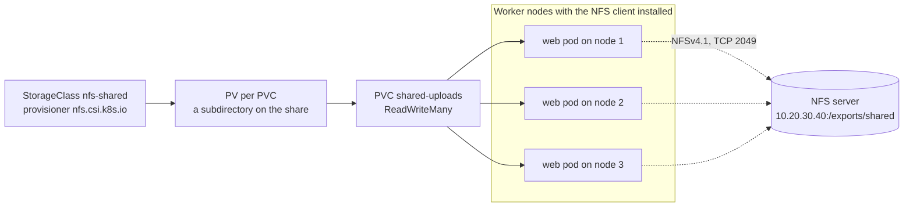

**Server (Linux):**

```bash
sudo dnf install -y nfs-utils                     # Ubuntu: sudo apt install -y nfs-kernel-server
sudo mkdir -p /exports/shared
echo '/exports/shared 10.10.0.0/16(rw,sync,no_subtree_check,root_squash)' | sudo tee -a /etc/exports
sudo systemctl enable --now nfs-server
sudo exportfs -rav                                # re-export everything and list it
showmount -e localhost
```

**Client (every Kubernetes node needs this):**

```bash
sudo dnf install -y nfs-utils                     # Ubuntu: sudo apt install -y nfs-common
sudo mount -t nfs4 -o nfsvers=4.1 10.20.30.40:/exports/shared /mnt/shared
echo '10.20.30.40:/exports/shared  /mnt/shared  nfs4  nfsvers=4.1,_netdev,nofail  0 0' | sudo tee -a /etc/fstab
```

**In Kubernetes there are three common ways:**

| Approach | How | Use it for |
|---|---|---|
| Static PV | An admin writes a PV with an `nfs:` source (server + path) and a PVC binds to it | One existing share with existing data |
| Dynamic: csi-driver-nfs | StorageClass with `provisioner: nfs.csi.k8s.io`; each PVC gets its own subdirectory on the share | Self-service RWX volumes on your own NFS server |
| Managed NFS | AWS EFS (`efs.csi.aws.com`), Azure Files NFS, Google Filestore, NetApp | No server to run, highly available, elastic |

Dynamic provisioning with csi-driver-nfs:

```bash
helm repo add csi-driver-nfs https://raw.githubusercontent.com/kubernetes-csi/csi-driver-nfs/master/charts
helm install csi-driver-nfs csi-driver-nfs/csi-driver-nfs --namespace kube-system
```

```yaml
apiVersion: storage.k8s.io/v1
kind: StorageClass
metadata:
  name: nfs-shared
provisioner: nfs.csi.k8s.io
parameters:
  server: 10.20.30.40
  share: /exports/shared
reclaimPolicy: Retain
volumeBindingMode: Immediate
mountOptions:
  - nfsvers=4.1
---
apiVersion: v1
kind: PersistentVolumeClaim
metadata:
  name: shared-uploads
  namespace: web
spec:
  accessModes: [ReadWriteMany]               # many pods, many nodes, at the same time
  storageClassName: nfs-shared
  resources:
    requests:
      storage: 50Gi                          # informational: plain NFS doesn't enforce it
```

| Strengths | Weaknesses |
|---|---|
| ReadWriteMany across nodes and zones | Slower and higher latency than block storage; not for databases |
| Simple, cheap, well understood | A single NFS server is a single point of failure unless it's HA (NetApp, EFS) |
| Existing data can be shared as-is | No capacity enforcement per PVC on plain NFS |
| | UID/GID permission mismatches (`root_squash`), and some apps misbehave with network file locking |

**Troubleshooting a pod stuck in `ContainerCreating`** (`kubectl describe pod` shows the mount error):

| Error | Cause | Fix |
|---|---|---|
| `wrong fs type, bad option` / `bad superblock` | NFS client utilities missing on the node | Install `nfs-utils` or `nfs-common` on every node |
| `access denied by server` | The node's subnet isn't in `/etc/exports` | Fix the export, `exportfs -ra` |
| `Connection timed out` | Firewall or security group blocks TCP 2049, or a routing problem | Open 2049 from the node subnet; test with `showmount -e <server>` and a manual mount from the node |
| App gets `Permission denied` writing | `root_squash` and a UID/GID mismatch | Match the export directory's ownership to the pod's `runAsUser`/`runAsGroup`, or use `all_squash,anonuid=,anongid=` |

**In the interview:** "NFS gives us ReadWriteMany for shared content. On-prem we ran csi-driver-nfs against an HA NetApp export with a StorageClass per share, and on AWS we used EFS. Databases never go on NFS; they get block volumes. The usual production issues were missing nfs-utils on new nodes and UID mismatches with root_squash."

---

## Part 7 · Kubernetes: pod networking

### Q18. Two pods on the same worker node: will they communicate with each other?

**Short answer:** yes, by default. Each pod has its own network namespace and IP address, and the CNI plugin connects every pod's `eth0` (one end of a veth pair) to the node's bridge or routing table. Traffic between two pods on the same node goes veth → bridge or host routes → veth and never leaves the node. They reach each other by pod IP, or better through a Service name, unless a NetworkPolicy blocks it.

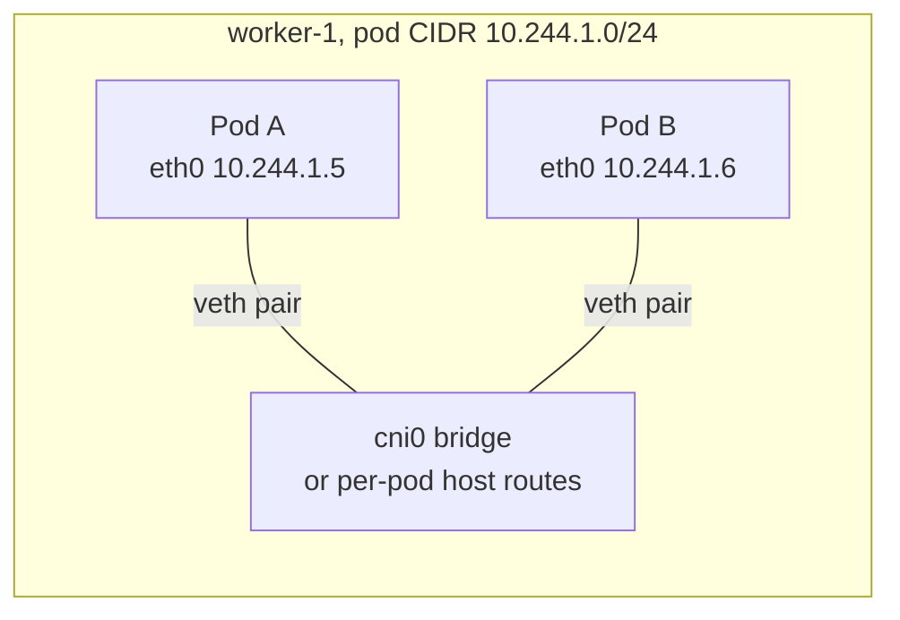

Containers inside the same pod are a different case: they share one network namespace and talk over `localhost`.

```bash
kubectl get pods -o wide                                        # both pods show NODE worker-1
kubectl exec -it pod-a -- curl -s http://10.244.1.6:8080/health
kubectl exec -it pod-a -- curl -s http://backend.default.svc.cluster.local:8080/health   # via the Service
```

The Kubernetes network model guarantees this: every pod gets its own IP, pods can reach all other pods on any node without NAT, and node agents such as the kubelet can reach all pods on their node.

**In the interview:** "Yes: each pod has its own IP, and the CNI wires every pod's veth into the node's bridge or routing table, so same-node traffic stays inside the node. Only a NetworkPolicy would stop it."

---

### Q19. Two pods on different worker nodes: can they communicate?

**Short answer:** yes. The Kubernetes network model requires pod-to-pod connectivity across nodes without NAT, and the CNI plugin provides it in one of two ways. With an overlay (VXLAN, Geneve or IP-in-IP), the pod packet is wrapped in a node-to-node packet. In routed mode (Calico with BGP, AWS VPC CNI, Azure CNI), each node's pod range is routed natively, with no encapsulation.

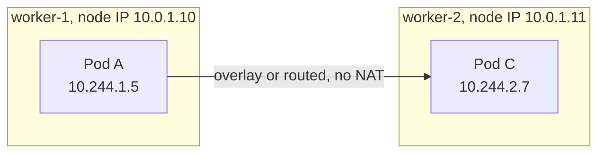

With an overlay, the inner packet (10.244.1.5 → 10.244.2.7) travels inside an outer packet (10.0.1.10 → 10.0.1.11). With routing, worker-1 simply has a route for `10.244.2.0/24` via 10.0.1.11.

What must be in place:

| Requirement | Detail |
|---|---|
| Node-to-node traffic allowed | VXLAN UDP 4789 (Calico), UDP 8472 (Flannel and Cilium VXLAN), Geneve UDP 6081, BGP TCP 179, IP-in-IP (IP protocol 4); open them in security groups and firewalls |
| MTU accounts for encapsulation | VXLAN adds about 50 bytes; a wrong pod MTU makes large requests hang |
| Routes and forwarding | `net.ipv4.ip_forward=1`; routes to every node's pod CIDR; on AWS, disable source/destination checks when routing pod IPs without encapsulation outside the VPC CNI |
| CNI healthy on both nodes | The CNI pod (calico-node, cilium, kube-flannel, aws-node) running on each node |

If same-node traffic works but cross-node doesn't, it's almost always one of those four.

```bash
kubectl get pods -o wide                                         # pod-a on worker-1, pod-c on worker-2
kubectl exec -it pod-a -- curl -s --max-time 3 http://10.244.2.7:8080/health
# on worker-1
ip route | grep 10.244.2.                                        # route to worker-2's pod range
sudo tcpdump -ni eth0 'udp port 4789 or udp port 8472'           # overlay packets between nodes
kubectl -n kube-system get pods -o wide | grep -E 'calico|cilium|flannel|aws-node'
```

**In the interview:** "Yes: the CNI makes pod IPs routable across nodes, either by encapsulating in VXLAN or by routing pod CIDRs with BGP or the cloud VPC. When same-node works but cross-node doesn't, I check the overlay port in the security groups, MTU, routes and the CNI pod on each node."

---

### Q20. How do you restrict communication between pods?

**Short answer:** with NetworkPolicies. A NetworkPolicy is a namespaced object that lists which traffic is allowed to and from the pods it selects, at the IP and port level (L3/L4); the CNI plugin (Calico, Cilium, the AWS VPC CNI's network policy agent, Azure NPM) enforces it. By default every pod can talk to every pod. As soon as a policy selects a pod for a direction (ingress or egress), everything in that direction is denied except what some policy allows. So the standard pattern is: default-deny the namespace, allow DNS, then allow each required flow explicitly.

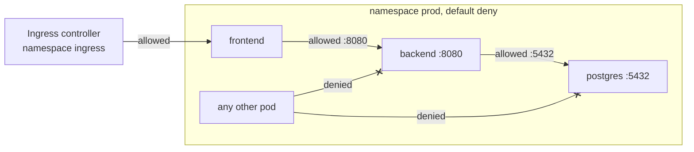

1. Deny everything in the namespace:

```yaml
apiVersion: networking.k8s.io/v1
kind: NetworkPolicy
metadata:
  name: default-deny-all
  namespace: prod
spec:
  podSelector: {}                    # every pod in prod
  policyTypes: [Ingress, Egress]
```

2. Allow DNS, or nothing can resolve names:

```yaml
apiVersion: networking.k8s.io/v1
kind: NetworkPolicy
metadata:
  name: allow-dns-egress
  namespace: prod
spec:
  podSelector: {}
  policyTypes: [Egress]
  egress:
  - to:
    - namespaceSelector:
        matchLabels:
          kubernetes.io/metadata.name: kube-system
      podSelector:
        matchLabels:
          k8s-app: kube-dns
    ports:
    - protocol: UDP
      port: 53
    - protocol: TCP
      port: 53
```

3. Allow frontend → backend on 8080. With default-deny in both directions you need both sides: ingress on the backend and egress on the frontend.

```yaml
apiVersion: networking.k8s.io/v1
kind: NetworkPolicy
metadata:
  name: backend-allow-frontend
  namespace: prod
spec:
  podSelector:
    matchLabels:
      app: backend
  policyTypes: [Ingress]
  ingress:
  - from:
    - podSelector:
        matchLabels:
          app: frontend
    ports:
    - protocol: TCP
      port: 8080
---
apiVersion: networking.k8s.io/v1
kind: NetworkPolicy
metadata:
  name: frontend-egress-backend
  namespace: prod
spec:
  podSelector:
    matchLabels:
      app: frontend
  policyTypes: [Egress]
  egress:
  - to:
    - podSelector:
        matchLabels:
          app: backend
    ports:
    - protocol: TCP
      port: 8080
```

Test both an allowed and a blocked path:

```bash
kubectl get networkpolicy -n prod
kubectl exec -n prod deploy/frontend -- curl -s --max-time 3 http://backend:8080/health          # works
kubectl run probe -n prod --rm -it --image=nicolaka/netshoot --labels=app=probe \
  -- curl -s --max-time 3 http://backend:8080/health                                             # times out
```

Points that separate a 7-year answer:

- **The CNI must support NetworkPolicy.** Plain Flannel accepts the objects and silently enforces nothing.
- **Policies are additive allow-lists**; standard NetworkPolicy has no explicit deny. For cluster-wide guardrails or deny rules, use Calico `GlobalNetworkPolicy`, `CiliumClusterwideNetworkPolicy`, or the newer AdminNetworkPolicy API where supported.
- **Policies are stateful:** replies to an allowed connection are allowed automatically.
- **Remember the platform's own traffic:** the ingress controller's namespace, Prometheus scraping, and egress to external APIs all need explicit rules after a default deny.

**In the interview:** "NetworkPolicy, enforced by the CNI: default-deny ingress and egress per namespace, an allow-DNS policy, then explicit allows per flow using pod labels, namespace labels and ports. I test both an allowed and a blocked path after every change, because a missing DNS or ingress-controller rule is the usual outage."

---

### Q21. What components go into a NetworkPolicy YAML file?

**Short answer:** five parts: the namespace the policy lives in, a `podSelector` choosing which pods it protects, `policyTypes` saying which directions it controls, `ingress` rules (who may connect in, and on which ports) and `egress` rules (where the pods may connect out, and on which ports). Sources and destinations are chosen with `podSelector`, `namespaceSelector` or `ipBlock`.

| Field | Purpose |
|---|---|
| `apiVersion: networking.k8s.io/v1`, `kind: NetworkPolicy` | The object type |
| `metadata.namespace` | Policies are namespaced and select pods only in their own namespace |
| `spec.podSelector` | The pods the policy applies to; `{}` means every pod in the namespace |
| `spec.policyTypes` | `Ingress`, `Egress` or both; each listed direction becomes default-deny for the selected pods |
| `spec.ingress[].from[]` | Allowed sources: `podSelector`, `namespaceSelector`, both together, or `ipBlock` (a CIDR with optional `except`) |
| `spec.ingress[].ports[]` | Allowed ports on the selected pods: `protocol` (TCP, UDP, SCTP), `port` (number or named port), optional `endPort` for a range |
| `spec.egress[].to[]` | Allowed destinations, using the same three selector types |
| `spec.egress[].ports[]` | Allowed destination ports for outbound traffic |

A complete example with every component:

```yaml
apiVersion: networking.k8s.io/v1
kind: NetworkPolicy
metadata:
  name: backend-policy
  namespace: prod                        # 1. where the policy lives
spec:
  podSelector:                           # 2. which pods it protects
    matchLabels:
      app: backend
  policyTypes:                           # 3. which directions it controls
  - Ingress
  - Egress
  ingress:                               # 4. who may connect in
  - from:
    - podSelector:                       #    frontend pods in this namespace
        matchLabels:
          app: frontend
    - namespaceSelector:                 #    OR anything in the monitoring namespace
        matchLabels:
          kubernetes.io/metadata.name: monitoring
    ports:
    - protocol: TCP
      port: 8080
  egress:                                # 5. where it may connect out
  - to:
    - podSelector:
        matchLabels:
          app: postgres
    ports:
    - protocol: TCP
      port: 5432
  - to:
    - ipBlock:                           #    an external partner API range
        cidr: 203.0.113.0/24
    ports:
    - protocol: TCP
      port: 443
  - to:                                  #    DNS
    - namespaceSelector:
        matchLabels:
          kubernetes.io/metadata.name: kube-system
      podSelector:
        matchLabels:
          k8s-app: kube-dns
    ports:
    - protocol: UDP
      port: 53
    - protocol: TCP
      port: 53
```

**The YAML trap interviewers love: AND vs OR.** Selectors in the same list item are combined with AND; separate list items (each starting with `-`) are OR.

```yaml
# AND: only pods labelled app=frontend that are ALSO in a namespace labelled team=a
ingress:
- from:
  - namespaceSelector:
      matchLabels:
        team: a
    podSelector:
      matchLabels:
        app: frontend

# OR: any pod in a team=a namespace, OR any app=frontend pod in this namespace
ingress:
- from:
  - namespaceSelector:
      matchLabels:
        team: a
  - podSelector:
      matchLabels:
        app: frontend
```

Namespaces are matched by labels; every namespace automatically carries `kubernetes.io/metadata.name: <name>`, which is the easiest label to select on.

**In the interview:** "podSelector for which pods, policyTypes for which directions, then ingress `from` and egress `to` with pod, namespace or IP selectors plus ports. The classic mistake is the dash: one list item with two selectors is AND, two list items is OR, and getting that wrong silently opens or closes traffic."
