# Nextturn DevOps / Cloud / SRE Interview Prep

Experience level: not stated; answers are pitched at mid-to-senior DevOps roles · Prepared October 2026

Twenty-two questions, grouped by topic. Overlapping questions are answered together: Continuous Delivery vs Continuous Deployment (asked twice) in Q2, and the four Kubernetes node questions (a node that goes down, 1 of 30 nodes NotReady, common NotReady causes, troubleshooting beyond basic kubectl) in Q13. That leaves 18 sections. Each answer opens with a short answer, then how it works, working code or commands, and the points that separate a strong answer. The **In the interview** lines are templates; Q17 asks about your own Ansible project, so replace the sample with your real one.

Diagrams are Mermaid blocks; they render on GitHub, GitLab, Obsidian, Notion and in published artifacts.

**Contents**

- Scripting: Q1 Python disk-usage alert
- CI/CD: Q2 CI vs Continuous Delivery vs Continuous Deployment · Q3 an end-to-end pipeline · Q4 pre-build, build and post-build stages · Q5 where to publish artifacts to Nexus or Artifactory · Q6 Jenkins vs GitHub Actions · Q7 Jenkins controller down · Q8 Azure DevOps variables and secrets · Q9 GitOps push vs pull
- Containers, Kubernetes, Helm: Q10 Docker layer caching · Q11 Pending, CrashLoopBackOff, ImagePullBackOff · Q12 failed Helm upgrade · Q13 worker node down or NotReady
- Infrastructure as code: Q14 `terraform refresh` vs `terraform plan` · Q15 many EC2 instances with different configurations · Q16 Terraform vs Ansible · Q17 a real Ansible project
- AWS: Q18 installing a package on EC2 without SSH

---

## Part 1 · Scripting

### Q1. Python: write a script to check disk usage and send an alert if it exceeds a threshold

**Short answer:** use `shutil.disk_usage()` for each filesystem, compare the used percentage with a threshold, and send an alert (email, Slack or Teams webhook) when it is exceeded. A production version also discovers every real filesystem, checks inodes, avoids repeating the same alert every few minutes, returns monitoring-friendly exit codes and runs from cron or a systemd timer.

**The whiteboard version** (what most interviewers expect first):

```python
#!/usr/bin/env python3
import shutil, smtplib, socket
from email.message import EmailMessage

THRESHOLD = 80                      # percent
PATHS = ["/", "/var", "/data"]

for path in PATHS:
    du = shutil.disk_usage(path)
    pct = du.used / du.total * 100
    if pct >= THRESHOLD:
        msg = EmailMessage()
        msg["Subject"] = f"Disk alert on {socket.gethostname()}: {path} at {pct:.0f}%"
        msg["From"], msg["To"] = "alerts@example.com", "oncall@example.com"
        msg.set_content(f"{path} is {pct:.1f}% full (threshold {THRESHOLD}%).")
        with smtplib.SMTP("localhost") as smtp:
            smtp.send_message(msg)
```

**The production version** (standard library only, Python 3.8+):

```python
#!/usr/bin/env python3
"""
disk_alert.py - alert when any real filesystem crosses a disk or inode threshold.

Examples:
    disk_alert.py --dry-run
    disk_alert.py --warn 80 --crit 90 --slack-webhook "$SLACK_WEBHOOK_URL"
    disk_alert.py --paths / /var /data --smtp-host smtp.example.com --mail-to oncall@example.com
Exit codes (Nagios style, usable by other tools): 0 OK, 1 WARNING, 2 CRITICAL.
"""
import argparse
import json
import logging
import os
import shutil
import smtplib
import socket
import sys
import time
import urllib.request
from email.message import EmailMessage

PSEUDO_FS = {
    "autofs", "binfmt_misc", "bpf", "cgroup", "cgroup2", "configfs", "debugfs", "devpts",
    "devtmpfs", "efivarfs", "fusectl", "hugetlbfs", "mqueue", "nsfs", "overlay", "proc",
    "pstore", "ramfs", "rpc_pipefs", "securityfs", "squashfs", "sysfs", "tmpfs", "tracefs",
}
STATE_FILE = "/var/tmp/disk_alert_state.json"
COOLDOWN_SECONDS = 3600            # repeat an unchanged alert at most once an hour

log = logging.getLogger("disk_alert")


def real_mount_points():
    """Mount points of real filesystems, read from /proc/mounts."""
    seen = []
    with open("/proc/mounts") as mounts:
        for line in mounts:
            _device, mount_point, fstype = line.split()[:3]
            mount_point = mount_point.replace("\\040", " ")   # spaces are escaped in /proc/mounts
            if fstype not in PSEUDO_FS and mount_point not in seen:
                seen.append(mount_point)
    return seen


def usage(path):
    """Return (disk %, used GB, size GB, inode %), computed the way `df` reports Use%."""
    du = shutil.disk_usage(path)
    disk_pct = round(du.used / (du.used + du.free) * 100, 1) if du.used + du.free else 0.0
    st = os.statvfs(path)
    inode_pct = round((st.f_files - st.f_ffree) / st.f_files * 100, 1) if st.f_files else 0.0
    return disk_pct, du.used / 1024**3, du.total / 1024**3, inode_pct


def send_slack(webhook, text):
    body = json.dumps({"text": text}).encode()
    req = urllib.request.Request(webhook, data=body, headers={"Content-Type": "application/json"})
    with urllib.request.urlopen(req, timeout=10) as resp:
        resp.read()


def send_email(host, sender, recipients, subject, text):
    msg = EmailMessage()
    msg["Subject"], msg["From"], msg["To"] = subject, sender, ", ".join(recipients)
    msg.set_content(text)
    with smtplib.SMTP(host, 587, timeout=10) as smtp:
        smtp.starttls()
        if os.environ.get("SMTP_USER"):
            smtp.login(os.environ["SMTP_USER"], os.environ["SMTP_PASSWORD"])
        smtp.send_message(msg)


def load_state():
    try:
        with open(STATE_FILE) as f:
            return json.load(f)
    except (OSError, ValueError):
        return {}


def main():
    p = argparse.ArgumentParser(description="Alert when disk usage crosses a threshold")
    p.add_argument("--paths", nargs="*", help="mount points to check (default: every real filesystem)")
    p.add_argument("--warn", type=float, default=80.0, help="warning threshold, percent")
    p.add_argument("--crit", type=float, default=90.0, help="critical threshold, percent")
    p.add_argument("--slack-webhook", default=os.environ.get("SLACK_WEBHOOK_URL"))
    p.add_argument("--smtp-host", default=os.environ.get("SMTP_HOST"))
    p.add_argument("--mail-from", default="disk-alert@example.com")
    p.add_argument("--mail-to", nargs="*", default=[])
    p.add_argument("--dry-run", action="store_true", help="print the alert instead of sending it")
    args = p.parse_args()
    logging.basicConfig(level=logging.INFO, format="%(asctime)s %(levelname)s %(message)s")

    host, now, worst = socket.gethostname(), time.time(), 0
    problems = {}                                   # e.g. "CRITICAL:/var" -> message
    for mp in args.paths or real_mount_points():
        try:
            disk_pct, used_gb, size_gb, inode_pct = usage(mp)
        except OSError as err:                      # permission denied, vanished mount ...
            log.warning("cannot check %s: %s", mp, err)
            continue
        log.info("%s: %.1f%% used (%.1f of %.1f GB), inodes %.1f%%",
                 mp, disk_pct, used_gb, size_gb, inode_pct)
        peak = max(disk_pct, inode_pct)
        if peak >= args.warn:
            level = 2 if peak >= args.crit else 1
            label = "CRITICAL" if level == 2 else "WARNING"
            problems[f"{label}:{mp}"] = (f"{label} {host}:{mp} disk {disk_pct}% "
                                         f"({used_gb:.1f}/{size_gb:.1f} GB), inodes {inode_pct}%")
            worst = max(worst, level)

    state = load_state()
    due = {k: m for k, m in problems.items() if now - state.get(k, 0) > COOLDOWN_SECONDS}
    text = "Disk usage alert\n" + "\n".join(due.values())
    channels = bool(args.slack_webhook) or bool(args.smtp_host and args.mail_to)
    if due and (args.dry_run or not channels):
        print(text)
    elif due:
        try:
            if args.slack_webhook:
                send_slack(args.slack_webhook, text)
            if args.smtp_host and args.mail_to:
                send_email(args.smtp_host, args.mail_from, args.mail_to,
                           f"[disk] {host}: {len(due)} filesystem(s) over threshold", text)
            state.update({k: now for k in due})
        except Exception as err:                    # never let a broken webhook hide a full disk
            log.error("alert delivery failed: %s", err)
            worst = 2
    if not args.dry_run:
        # forget resolved problems, so the next breach alerts immediately
        with open(STATE_FILE, "w") as f:
            json.dump({k: v for k, v in state.items() if k in problems}, f)
    sys.exit(worst)


if __name__ == "__main__":
    main()
```

What the production version handles that the short one doesn't:

| Feature | Why it matters |
|---|---|
| Discovers real filesystems from `/proc/mounts`, skipping tmpfs, overlay and other pseudo filesystems | New disks are covered without editing the script |
| Inode usage | A disk can be "full" with free space left when millions of small files use up the inodes |
| Same Use% as `df` (reserved blocks excluded) | The alert matches what the engineer sees when they log in |
| Warning and critical levels; a level change counts as a new alert | Escalation is visible |
| One-hour cooldown per problem; resolved problems are forgotten | No alert storm every 5 minutes, and an immediate alert on the next breach |
| Exit codes 0, 1, 2 | Works as a Nagios/Icinga check or a CI gate as well |
| Delivery failure is logged and returns CRITICAL | A broken webhook can't silently hide a full disk |

Run and schedule it:

```bash
sudo install -m 0755 disk_alert.py /usr/local/bin/disk_alert.py
disk_alert.py --dry-run --warn 1 --crit 2          # force an alert to check the output
echo $?                                            # 2 = CRITICAL

# /etc/cron.d/disk-alert: every 5 minutes; /etc/disk-alert.env (mode 600) holds
#   export SLACK_WEBHOOK_URL=https://hooks.slack.com/services/...
*/5 * * * * root . /etc/disk-alert.env && /usr/local/bin/disk_alert.py --warn 80 --crit 90 >> /var/log/disk_alert.log 2>&1
```

A stale NFS mount can make `statvfs` hang rather than fail; on hosts with network filesystems, pass `--paths` explicitly or add `nfs`, `nfs4` and `cifs` to the skip list.

In production you would normally let node_exporter and Prometheus do this, including a forecast: `predict_linear(node_filesystem_avail_bytes{fstype!~"tmpfs|overlay"}[6h], 4 * 3600) < 0` fires when a filesystem is on course to fill up within four hours. The script is for hosts outside monitoring, or as the interview exercise.

**In the interview:** "The core is `shutil.disk_usage` plus a threshold and an alert call. For production I'd discover filesystems from /proc/mounts, check inodes, add a cooldown so it doesn't page every five minutes, return exit codes, and schedule it with cron or a systemd timer. In a monitored estate I'd rather alert from node_exporter with `predict_linear`, which warns before the disk fills."

---

## Part 2 · CI/CD

### Q2. Explain Continuous Integration, Continuous Delivery and Continuous Deployment, and the difference between Continuous Delivery and Continuous Deployment

*This answers both the general question and the separate "Continuous Delivery vs Continuous Deployment" question.*

**Short answer:** Continuous Integration means every developer merges small changes into the shared branch frequently, and every change is automatically built and tested so integration problems surface within minutes. Continuous Delivery extends CI so every change that passes the pipeline is automatically deployed to test and staging environments and is always ready to release; the production release is one manual approval. Continuous Deployment removes that last gate: every change that passes all automated checks goes to production automatically.

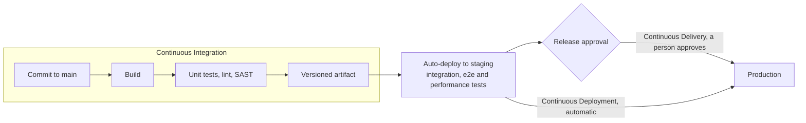

| | Continuous Integration | Continuous Delivery | Continuous Deployment |
|---|---|---|---|
| What is automated | Build, tests and checks on every commit | CI plus deployment to test and staging; every passing build is release-ready | Everything, including the production release |
| Production release | Not covered | One manual approval: a button, a change ticket | Automatic for every change that passes |
| Goal | Find integration problems within minutes | Release on demand, any time, with low risk | The shortest lead time; many small releases a day |
| Needs | Fast reliable tests, short-lived branches, a main branch that stays green | Deployment automation, environment parity, automated acceptance tests | Excellent test coverage, feature flags, canary releases, monitoring and automatic rollback |
| Typical fit | Every team | Banks, payments, regulated industries, release windows, customer sign-off | SaaS products with mature engineering practices |

**Continuous Delivery vs Continuous Deployment** differ only in the final step. In Continuous Delivery the production deployment is a business decision taken with one click; in Continuous Deployment there is no human gate. Both use the same pipeline, but Continuous Deployment needs stronger safety nets, because no person checks the change before customers see it.

The gate in practice:

```groovy
// Jenkins: Continuous Delivery = an approval step before production
stage('Approve production') {
  steps {
    input message: "Deploy ${env.VERSION} to production?", submitter: 'release-managers'
  }
}
```

In GitHub Actions or Azure DevOps the same gate is an environment (`production`) with required reviewers or an approval check; remove the reviewers and you have Continuous Deployment.

Points that separate a strong answer:

- **Deploy is not release.** Feature flags (LaunchDarkly, Unleash, OpenFeature) let code reach production switched off; the release becomes a flag flip. That is what makes Continuous Deployment safe.
- **Progressive delivery:** canary or blue/green with automated analysis (Argo Rollouts, Flagger) and automatic rollback when error rate or latency degrade.
- **Measure it with the DORA metrics:** deployment frequency, lead time for changes, change failure rate and time to restore service.
- **Regulation changes the gate, not the pipeline:** a regulated team can run Continuous Delivery with an automated change record and approval, and still deploy many times a day.

**In the interview:** "CI is merging and testing every change continuously; Continuous Delivery keeps every passing build deployable, with one approval before production; Continuous Deployment removes that approval. For a payments platform I'd run Continuous Delivery with an approval gate and automated change records; for a consumer web app, Continuous Deployment behind feature flags with canary analysis and automatic rollback."

---

### Q3. Explain an end-to-end CI/CD pipeline

**Short answer:** a change travels from a developer's branch through a pull request, CI (build, tests, quality and security gates), an immutable versioned artifact in a registry, and CD that promotes that same artifact through dev, staging and production, with tests at each step, an approval (or canary analysis) before production, and monitoring that feeds back into the next change. Build once, deploy the same artifact everywhere, and change only configuration per environment.

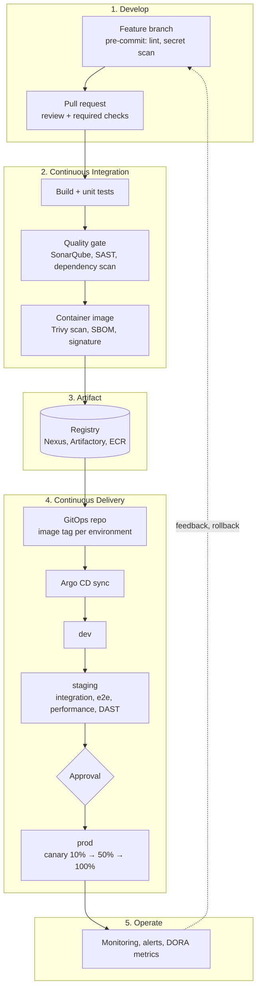

**The stages, in order:**

1. **Develop.** Feature branch; pre-commit hooks for formatting, linting and secret scanning; small changes.
2. **Pull request.** Required reviewers (CODEOWNERS) and required checks: build, unit tests, quality gate. Nothing merges red.
3. **CI on merge to main.** Build once, run unit tests with coverage, static analysis (SonarQube quality gate), SAST and dependency scanning (Snyk, OWASP Dependency-Check, Trivy).
4. **Package.** Build the container image, scan it (Trivy, Grype), generate an SBOM (Syft), sign it (Cosign), and tag it immutably with the version and commit SHA.
5. **Publish.** Push the image and any jars or Helm charts to the registry (Nexus, Artifactory, ECR, ACR). Only green builds get here (Q5).
6. **Deploy to dev.** Bump the image tag in the GitOps repo; Argo CD or Flux syncs the cluster (Q9). Smoke tests run against the new version.
7. **Staging.** Promote the same image by pull request; integration, end-to-end, performance (k6, JMeter) and DAST (OWASP ZAP) tests.
8. **Production.** Approval (Continuous Delivery) or automatic (Continuous Deployment); canary or blue/green with automated analysis on error rate and latency; automatic rollback if they degrade.
9. **Operate.** Dashboards, alerts and SLOs; DORA metrics; Slack notifications and an automatic change record for audit.

| Stage | Typical tools |
|---|---|
| Source and review | GitHub, GitLab, Bitbucket, Azure Repos; branch protection, CODEOWNERS |
| CI engine | Jenkins, GitHub Actions, GitLab CI, Azure Pipelines |
| Quality and security | SonarQube, Snyk, Trivy, Checkov for IaC, gitleaks |
| Artifacts | Nexus, Artifactory, ECR, ACR, Harbor |
| Deployment | Argo CD or Flux (GitOps), Helm, Kustomize, Argo Rollouts for canaries |
| Infrastructure | Terraform pipeline: fmt, validate, tflint, Checkov, plan, approval, apply |
| Observability | Prometheus, Grafana, Loki or ELK, OpenTelemetry tracing |

Points that separate a strong answer:

- **Build once, promote the same artifact:** rebuilding per environment means production runs something that was never tested.
- **Configuration per environment** lives outside the image (Helm values, ConfigMaps, a secret manager).
- **Fast feedback:** PR pipelines in minutes, with dependency caching and parallel test stages; slow suites run later.
- **Security is part of the pipeline** (shift left): secret scanning, SAST, dependency and image scans, signed images, and an admission policy that only allows signed images from the company registry.
- **Rollback is designed in:** a Git revert in the GitOps repo, Helm rollback, or Argo Rollouts aborting the canary.

**In the interview:** "PR checks gate the merge; on main we build once, test, scan, sign and push an immutable image to Nexus; CD bumps the tag in the GitOps repo, Argo CD deploys to dev, the same image is promoted to staging for e2e and performance tests, then to production through an approval and a canary with automatic rollback. Monitoring and DORA metrics close the loop."

---

### Q4. Explain the pre-build, build and post-build stages in a CI/CD pipeline

**Short answer:** pre-build prepares and validates the environment before anything is compiled: checkout, versioning, credentials, dependency restore, linting and secret scanning. Build turns source into a tested artifact: compile, unit tests, static analysis and the container image. Post-build acts on the result: publish test reports, scan and sign, push artifacts to the repository, notify, trigger deployment and clean up. Post-build steps are usually conditional on the build's outcome (success, failure or always).

| Stage | Purpose | Typical steps | If it fails |
|---|---|---|---|
| Pre-build | Get ready, fail fast on cheap checks | Checkout, compute version, registry login, restore dependency cache, lint and format checks, secret scan, start test containers | Stop immediately; nothing is built |
| Build | Produce and verify the artifact | Compile, package, unit tests with coverage, SonarQube quality gate, SAST, `docker build` | Stop; no artifact is published |
| Post-build | Use or report the result | Publish JUnit and coverage reports, image scan, SBOM, sign, push to Nexus/Artifactory/ECR, notifications, trigger deployment, clean the workspace | Reports and notifications still run on failure; publishing runs only on success |

**AWS CodeBuild** has these phases literally (`install`, `pre_build`, `build`, `post_build`):

```yaml
version: 0.2
env:
  variables:
    ECR_REGISTRY: 111122223333.dkr.ecr.ap-south-1.amazonaws.com
phases:
  install:
    runtime-versions:
      java: corretto17
  pre_build:
    commands:
      - aws ecr get-login-password --region "$AWS_REGION" | docker login --username AWS --password-stdin "$ECR_REGISTRY"
      - export IMAGE_TAG=$(echo "$CODEBUILD_RESOLVED_SOURCE_VERSION" | cut -c1-7)
  build:
    commands:
      - mvn -B clean verify
      - docker build -t "$ECR_REGISTRY/orders-api:$IMAGE_TAG" .
  post_build:
    commands:
      # post_build can still run after a failed build phase, so push only green builds
      - |
        if [ "$CODEBUILD_BUILD_SUCCEEDING" = "1" ]; then
          docker push "$ECR_REGISTRY/orders-api:$IMAGE_TAG"
          printf '[{"name":"orders-api","imageUri":"%s"}]' "$ECR_REGISTRY/orders-api:$IMAGE_TAG" > imagedefinitions.json
        fi
reports:
  unit-tests:
    files: ['target/surefire-reports/*.xml']
    file-format: JUNITXML
artifacts:
  files: [imagedefinitions.json]
cache:
  paths: ['/root/.m2/**/*']
```

**Jenkins** has no fixed phases (freestyle jobs have pre-steps, build steps and post-build actions); in a declarative pipeline the same structure is a sequence of stages plus `post` blocks:

```groovy
pipeline {
  agent { label 'linux-docker' }
  options {
    timeout(time: 30, unit: 'MINUTES')
    buildDiscarder(logRotator(numToKeepStr: '30'))
    disableConcurrentBuilds()
  }
  environment {
    REGISTRY = 'nexus.example.com:8443'
    IMAGE    = 'nexus.example.com:8443/payments/orders-api'
  }
  stages {
    // ---------- pre-build ----------
    stage('Checkout & version') {
      steps {
        checkout scm
        script { env.VERSION = "1.4.${env.BUILD_NUMBER}-${env.GIT_COMMIT.substring(0, 7)}" }
        sh 'gitleaks git --redact --no-banner .'             // fail on committed secrets
      }
    }
    // ---------- build ----------
    stage('Compile & unit test') {
      steps { sh 'mvn -B clean verify' }                     // compile, tests, coverage
      post  { always { junit 'target/surefire-reports/*.xml' } }
    }
    stage('Quality gate') {
      steps {
        withSonarQubeEnv('sonarqube') { sh 'mvn -B sonar:sonar' }
        timeout(time: 10, unit: 'MINUTES') { waitForQualityGate abortPipeline: true }
      }
    }
    stage('Image build & scan') {
      steps {
        sh "docker build -t ${env.IMAGE}:${env.VERSION} ."
        sh "trivy image --exit-code 1 --severity CRITICAL ${env.IMAGE}:${env.VERSION}"
      }
    }
    // ---------- post-build ----------
    stage('Publish') {
      when { branch 'main' }
      steps {
        withCredentials([usernamePassword(credentialsId: 'nexus-deploy',
                         usernameVariable: 'NEXUS_USER', passwordVariable: 'NEXUS_PASS')]) {
          sh 'mvn -B deploy -DskipTests -s ci/settings.xml'    // jar to Nexus maven-releases
          sh 'echo "$NEXUS_PASS" | docker login "$REGISTRY" -u "$NEXUS_USER" --password-stdin'
          sh "docker push ${env.IMAGE}:${env.VERSION}"
        }
      }
    }
    stage('Deploy to dev') {
      when { branch 'main' }
      steps { sh "./ci/bump-image-tag.sh dev ${env.VERSION}" }   // commit to the GitOps repo; Argo CD syncs
    }
  }
  post {
    success { slackSend channel: '#deploys', message: "orders-api ${env.VERSION} published" }
    failure { slackSend channel: '#deploys', color: 'danger', message: "orders-api failed: ${env.BUILD_URL}" }
    always  { cleanWs() }
  }
}
```

The `post` conditions are `always`, `success`, `failure`, `unstable`, `changed`, `fixed`, `regression`, `aborted` and `cleanup`, available at pipeline or stage level. Secrets are passed with single-quoted `sh` strings so the shell, not Groovy, expands them and Jenkins can mask them.

**In the interview:** "Pre-build sets up and fails fast: checkout, version, credentials, dependency cache, lint and secret scan. Build produces a verified artifact: compile, unit tests, quality gate, image build. Post-build acts on the outcome: reports always, scanning and publishing only on success, notifications, deployment trigger and cleanup. CodeBuild has those phases literally; in Jenkins they're stages plus `post` blocks."

---

### Q5. In a Jenkins pipeline, at which stage do you publish or push artifacts and images to Nexus or Artifactory: pre-build, build or post-build? Why?

**Short answer:** post-build, in a dedicated Publish stage that runs only after the build, tests, quality gate and scans have all passed, and usually only for the main or release branches. Pre-build is impossible (nothing exists yet), and publishing during the build would put untested or vulnerable artifacts into a repository other teams and environments consume. The repository should only ever contain artifacts that passed every gate.

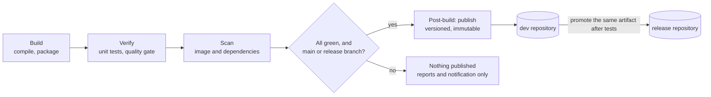

Why post-build:

- **Only verified artifacts are published.** The repository is the source of truth for every deployment ("build once, deploy many"); a broken jar or an image with critical CVEs must never land there.
- **Immutable versions.** Each published version (`1.4.212-a1b2c3d`) is pushed once and never overwritten, so production can always be traced back to a commit and a pipeline run.
- **The Maven lifecycle agrees:** `deploy` (upload to Nexus) comes after `verify`; `install` only copies to the local `.m2`.
- **Promotion, not rebuilds.** Later environments promote the same artifact between repositories (for example `docker-dev` to `docker-release`, or SNAPSHOT to release), with Artifactory build-info or Nexus tags recording which pipeline produced it.

The Publish stage from the Jenkinsfile in Q4:

```groovy
stage('Publish') {
  when { branch 'main' }                     // feature branches build and test, but don't publish
  steps {
    withCredentials([usernamePassword(credentialsId: 'nexus-deploy',
                     usernameVariable: 'NEXUS_USER', passwordVariable: 'NEXUS_PASS')]) {
      sh 'mvn -B deploy -DskipTests -s ci/settings.xml'
      sh 'echo "$NEXUS_PASS" | docker login "$REGISTRY" -u "$NEXUS_USER" --password-stdin'
      sh "docker push ${env.IMAGE}:${env.VERSION}"
    }
  }
}
```

Declarative stages stop at the first failure, so a stage placed after the tests and scans runs only when they passed. Notifications and report publishing belong in `post { always { ... } }`, which runs regardless of the result.

**In the interview:** "Post-build, in its own Publish stage after tests, the quality gate and image scanning, and only for main or release branches. Whatever is in Nexus is what we deploy, so it must be verified and immutable; later environments promote that same artifact instead of rebuilding it."

---

### Q6. Jenkins vs GitHub Actions

**Short answer:** Jenkins is a self-hosted automation server you run and maintain yourself (controller, agents, plugins), with Groovy pipelines and almost unlimited flexibility; it fits on-premises, air-gapped or heavily customized environments. GitHub Actions is CI/CD built into GitHub, with YAML workflows, GitHub-hosted or self-hosted runners and a marketplace of actions; it fits teams whose code is on GitHub and who want little to maintain.

| | Jenkins | GitHub Actions |
|---|---|---|
| Hosting | Self-hosted controller and agents (VMs or Kubernetes pods) | Managed by GitHub; GitHub-hosted runners, or self-hosted runners (Actions Runner Controller on Kubernetes) |
| Pipeline definition | `Jenkinsfile` (Groovy declarative or scripted), shared libraries | YAML workflows in `.github/workflows`, reusable workflows, composite actions |
| Extensions | Thousands of plugins, each to patch and keep compatible | Marketplace actions, pinned by version or commit SHA |
| Maintenance | You patch Jenkins, Java and plugins, back up `JENKINS_HOME`, scale agents | Almost none for hosted runners |
| Source control | Any (GitHub, GitLab, Bitbucket, SVN, Perforce) | Best with GitHub repositories |
| Cloud credentials | Credentials store; OIDC possible with plugins | Built-in OIDC federation to AWS, Azure and GCP, so no stored keys |
| Approvals | `input` step, plugins | Environments with required reviewers, wait timers, branch rules |
| Cost | Your infrastructure and engineering time | Per-minute billing for hosted runners on private repositories beyond the included minutes |
| Best fit | On-prem and air-gapped estates, complex orchestration, non-GitHub SCM, existing investment | GitHub-centric teams, PR-driven workflows, low operational overhead |

The same CI job in GitHub Actions, pushing to ECR with OIDC instead of stored keys:

```yaml
name: ci
on:
  pull_request:
  push:
    branches: [main]
permissions:
  contents: read
  id-token: write                    # lets the job request an OIDC token for AWS
jobs:
  build:
    runs-on: ubuntu-latest
    steps:
    - uses: actions/checkout@v4      # pin to the current major, or to a commit SHA
    - uses: actions/setup-java@v4
      with:
        distribution: temurin
        java-version: '17'
        cache: maven
    - run: mvn -B clean verify
    - name: AWS credentials via OIDC
      if: github.ref == 'refs/heads/main'
      uses: aws-actions/configure-aws-credentials@v4
      with:
        role-to-assume: arn:aws:iam::111122223333:role/gha-ecr-push
        aws-region: ap-south-1
    - name: Log in to ECR
      if: github.ref == 'refs/heads/main'
      id: ecr
      uses: aws-actions/amazon-ecr-login@v2
    - name: Build and push the image
      if: github.ref == 'refs/heads/main'
      run: |
        IMAGE="${{ steps.ecr.outputs.registry }}/orders-api:${GITHUB_SHA::7}"
        docker build -t "$IMAGE" .
        docker push "$IMAGE"
```

The equivalent Jenkinsfile is in Q4.

Points that separate a strong answer:

- **Jenkins' cost is operational:** plugin upgrades breaking pipelines, controller outages (Q7), agent capacity. Keep zero executors on the controller, configure it as code (JCasC), and run agents as ephemeral Kubernetes pods.
- **GitHub Actions' risks are supply-chain ones:** third-party actions run with your token, so pin them to a commit SHA, give `GITHUB_TOKEN` minimal `permissions`, and be careful with `pull_request_target`.
- **Migration is common:** GitHub Actions Importer converts Jenkins pipelines into workflows as a starting point.

**In the interview:** "Jenkins when we need on-prem or air-gapped builds, any SCM and deep customization, and accept running it ourselves; GitHub Actions when code lives on GitHub and we want managed runners, OIDC to the cloud and PR-native checks. For a new GitHub-based team I'd choose Actions; for a large on-prem estate with years of shared libraries, Jenkins, configured as code."

---

### Q7. Jenkins: if the controller (master) node goes down, how do you troubleshoot and restore it?

**Short answer:** first find which layer failed: the host or pod, the Jenkins service, or the network path in front of it. Then read the Jenkins logs for the cause; the usual ones are a full disk, Java heap exhaustion, a bad plugin or Java upgrade, and a corrupted config file. If the controller can't be repaired, rebuild it from code and backups: the same Jenkins and Java versions, `JENKINS_HOME` restored from backup, configuration from JCasC and plugins from a pinned list. Agents and jobs then reconnect, and pipelines are in Git anyway.

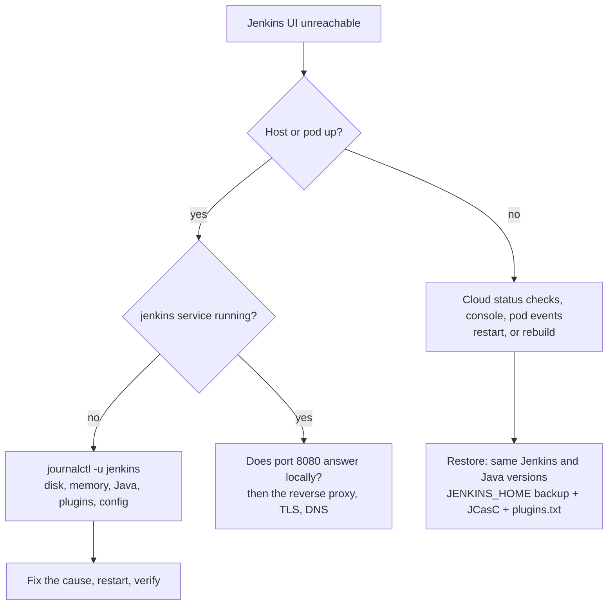

**Troubleshoot:**

```bash
systemctl status jenkins --no-pager
journalctl -u jenkins -n 200 --no-pager            # SEVERE errors, stack traces, OutOfMemoryError
df -h /var/lib/jenkins; df -i /var/lib/jenkins      # full disk or inodes
sudo du -sh /var/lib/jenkins/{jobs,workspace,caches} 2>/dev/null
free -m; dmesg -T | grep -i -E 'oom|killed process'
java -version                                      # was Java changed by an OS update?
sudo ss -ltnp | grep 8080
curl -sI http://localhost:8080/login                # works locally? then it's the proxy, TLS or DNS
sudo -u jenkins jstack "$(pgrep -f jenkins.war)" > /tmp/jenkins-threads.txt   # if it's hung, not down
```

| Cause | Evidence | Fix |
|---|---|---|
| Disk full | `df` at 100% on `JENKINS_HOME`; "No space left on device" | Delete old builds and workspaces, set `buildDiscarder`, move artifacts to Nexus/S3, grow the disk |
| Java heap exhausted | `OutOfMemoryError`, long GC pauses, OOM killer in `dmesg` | Raise `-Xmx` (a systemd override setting `JAVA_OPTS`), take builds off the controller, analyse a heap dump |
| Plugin broken after an upgrade | SEVERE errors naming a plugin at startup | Disable it with an empty `plugins/<name>.jpi.disabled` file, restart, then downgrade it |
| Java version not supported | Startup fails right after an OS or Java update | Install a Java version supported by your Jenkins release and point the service at it |
| Corrupted `config.xml` | XML parse errors naming the file | Restore that file from backup or Git |
| Wrong ownership after a restore | Permission denied on `JENKINS_HOME` | `chown -R jenkins:jenkins /var/lib/jenkins` |
| Proxy, TLS or DNS | Local `curl` works, external access fails | Fix the reverse proxy, the certificate or the DNS record |

**Restore on a new host:**

```bash
# install the SAME Jenkins version and a supported Java first
sudo systemctl stop jenkins
sudo rsync -a /backup/jenkins_home/ /var/lib/jenkins/    # or untar the backup / attach the EBS snapshot
sudo chown -R jenkins:jenkins /var/lib/jenkins
sudo systemctl start jenkins
journalctl -u jenkins -f
```

Restore `secrets/master.key` and `secrets/hudson.util.Secret` together with the rest of `JENKINS_HOME`; without them every stored credential is unreadable.

**Make the next outage a non-event:**

- **Configuration as Code (JCasC):** controller settings in Git; plugins pinned in `plugins.txt` and installed with the plugin installation manager; jobs created from Git through organization folders or Job DSL. A new controller is then a rebuild, not a restore.

```yaml
# jenkins.yaml (JCasC)
jenkins:
  numExecutors: 0                    # builds run on agents, never on the controller
  systemMessage: "Configured as code: change it in Git, not in the UI"
unclassified:
  location:
    url: https://jenkins.example.com/
```

- **Backups:** nightly `JENKINS_HOME` backups (EBS snapshots, a Velero backup of the PVC, or the thinBackup plugin), tested by restoring them.
- **Self-healing hosting:** the official Helm chart on Kubernetes with a persistent volume (the pod is rescheduled automatically), or an auto scaling group of one instance with data on EBS or EFS. Open-source Jenkins has no active-active HA; CloudBees CI offers it commercially.
- **Monitoring:** alerts on disk, heap and queue length (Prometheus metrics plugin); split very large controllers by team to reduce the blast radius.

**In the interview:** "Host first, then the service, then the logs: most outages are a full disk, heap exhaustion or a plugin upgrade. If the controller is lost, I rebuild from JCasC and plugins.txt in Git and restore JENKINS_HOME from the latest snapshot, including the secrets directory so credentials decrypt. Since then we've run the controller on Kubernetes with a PVC, zero executors and nightly snapshots."

---

### Q8. Azure DevOps: Variable Groups, Environment Variables and Secrets

**Short answer:** pipeline variables are defined in YAML or the UI (plus predefined ones such as `Build.BuildId`). Variable groups, kept in the Library, share a set of variables across many pipelines and can be linked to Azure Key Vault. Non-secret variables are exposed to scripts automatically as environment variables (upper-cased, with dots turned into underscores). Secret variables are encrypted, masked in logs and never mapped into the environment automatically: you pass them explicitly with `env:`.

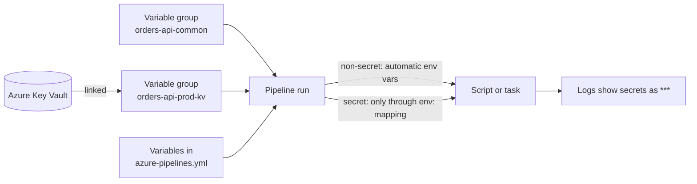

| Kind | Where it's defined | Scope | Secrets? | Example |
|---|---|---|---|---|
| Pipeline variable | YAML `variables:` or the pipeline UI | Pipeline, stage or job | Yes (UI, lock icon) | `buildConfiguration: Release` |
| Predefined variable | Azure DevOps | Every run | No | `Build.SourceBranchName`, `Build.BuildId` |
| Variable group | Library | Any pipeline that references it and is authorized | Yes; can be linked to Key Vault | `- group: orders-api-common` |
| Environment variable | Generated for each step from non-secret variables, or set with `env:` | One step | Only by explicit mapping | `$BUILD_SOURCEBRANCHNAME` |
| Secure file | Library | Pipelines that are authorized | Yes | Certificates, kubeconfig (`DownloadSecureFile@1`) |
| Environment (resource) | Pipelines → Environments | Deployment jobs | Not a variable store | `environment: prod` adds approvals and checks |

```yaml
trigger:
  branches:
    include: [main]

variables:
- name: buildConfiguration                 # plain pipeline variable
  value: Release
- group: orders-api-common                 # variable group from the Library
- ${{ if eq(variables['Build.SourceBranchName'], 'main') }}:
  - group: orders-api-prod-kv              # group linked to Azure Key Vault

stages:
- stage: Build
  jobs:
  - job: build
    pool:
      vmImage: ubuntu-latest
    steps:
    - script: |
        echo "Branch $(Build.SourceBranchName), config $(buildConfiguration)"
        echo "Same value as an env var: $BUILD_SOURCEBRANCHNAME"
      displayName: Show variables
    - script: ./ci/check-db.sh
      displayName: Use a secret
      env:
        DB_PASSWORD: $(dbPassword)         # secrets reach scripts only through explicit mapping

- stage: DeployProd
  dependsOn: Build
  condition: and(succeeded(), eq(variables['Build.SourceBranch'], 'refs/heads/main'))
  jobs:
  - deployment: deploy
    environment: prod                      # approvals and checks configured on this Environment
    pool:
      vmImage: ubuntu-latest
    strategy:
      runOnce:
        deploy:
          steps:
          - task: AzureKeyVault@2
            inputs:
              azureSubscription: sc-prod-wif          # service connection using workload identity federation
              KeyVaultName: kv-orders-prod
              SecretsFilter: 'dbPassword,apiKey'
          - script: ./ci/deploy.sh
            env:
              DB_PASSWORD: $(dbPassword)
```

Setting variables from a script during a run:

```bash
echo "##vso[task.setvariable variable=imageTag]1.4.$(Build.BuildId)"
echo "##vso[task.setvariable variable=apiToken;issecret=true]$TOKEN"      # becomes a masked secret
echo "##vso[task.setvariable variable=imageTag;isOutput=true]1.4.$(Build.BuildId)"   # for later jobs, via the step name
```

Points that separate a strong answer:

- **Three syntaxes:** `$(var)` is replaced at run time just before a task runs; `${{ variables.var }}` is resolved when the YAML is compiled (templates, conditional inserts); `$[variables.var]` is a runtime expression used in conditions and variable definitions.
- **Secrets are deliberately awkward:** masked as `***`, not exported to the environment automatically, not available to builds from forks by default, and not readable through the UI after saving.
- **Prefer Key Vault-linked groups** or the `AzureKeyVault@2` task, so the secret lives and rotates in one place, and service connections with **workload identity federation** instead of stored client secrets.
- **Lock down the Library:** pipeline permissions on each variable group, approvals and checks on production groups and Environments, and separate groups per environment.

**In the interview:** "Pipeline variables for per-pipeline settings, variable groups for shared settings, with production secrets in a Key Vault-linked group. Non-secret variables become environment variables automatically; secrets are masked and must be mapped explicitly with `env:`. Production deploys run as deployment jobs against an Environment with approvals, and the service connection uses workload identity federation, so there's no client secret to leak."

---

### Q9. GitOps: push-based vs pull-based deployment

**Short answer:** in push-based deployment the CI/CD pipeline deploys: after building, it runs `kubectl apply` or `helm upgrade` against the cluster, so the pipeline needs cluster credentials and network access. In pull-based deployment (GitOps), an agent inside the cluster, Argo CD or Flux, watches a Git repository holding the desired state and continuously pulls and applies it; CI only builds the image and commits the new tag to Git. Pull-based keeps credentials inside the cluster, detects and reverts drift, and makes Git the audit log and the rollback button.

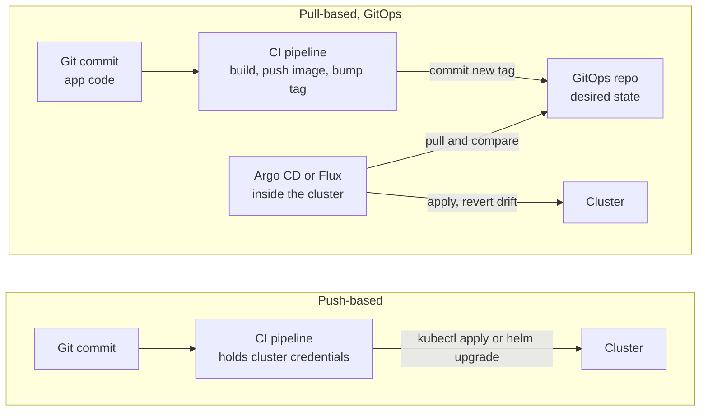

| | Push-based | Pull-based (GitOps) |
|---|---|---|
| Who deploys | The CI/CD pipeline | An agent in the cluster (Argo CD, Flux) |
| Cluster credentials | Stored in CI; often broad | Stay inside the cluster |
| Network | CI must reach the cluster API | Cluster only needs outbound access to Git and the registry; works for private clusters |
| Drift | Undetected until the next deploy | Detected continuously and optionally self-healed |
| Audit and rollback | Pipeline logs; rollback by re-running an old job | Git history; rollback is `git revert` |
| Many clusters | One pipeline step per cluster | Each cluster pulls its own state; scales well |
| Fits | VMs, serverless, simple setups, non-Kubernetes targets | Kubernetes platforms, regulated environments, multi-cluster |

The OpenGitOps principles: the desired state is **declarative**, **versioned and immutable** (in Git), **pulled automatically** by agents, and **continuously reconciled**.

An Argo CD Application with automated sync:

```yaml
apiVersion: argoproj.io/v1alpha1
kind: Application
metadata:
  name: orders-api-prod
  namespace: argocd
spec:
  project: payments
  source:
    repoURL: https://github.com/example/gitops-envs.git
    targetRevision: main
    path: apps/orders-api/overlays/prod
  destination:
    server: https://kubernetes.default.svc
    namespace: prod
  syncPolicy:
    automated:
      prune: true                  # delete resources removed from Git
      selfHeal: true               # revert manual changes made in the cluster
    syncOptions:
    - CreateNamespace=true
```

CI's only deployment step is a commit to the GitOps repository (or a pull request, for environments that need review):

```bash
cd gitops-envs/apps/orders-api/overlays/dev
kustomize edit set image orders-api=nexus.example.com:8443/payments/orders-api:1.4.212-a1b2c3d
git commit -am "orders-api: deploy 1.4.212 to dev" && git push
```

Promotion between environments becomes a pull request that copies the tag from the dev overlay to the staging or prod overlay; Argo CD Image Updater or Flux image automation can automate the dev bump.

**In the interview:** "Push means the pipeline holds kubeconfig and runs helm upgrade; pull means Argo CD in the cluster syncs from Git. We used pull for Kubernetes: CI only commits the new tag, promotions are PRs between environment folders, selfHeal reverts manual kubectl edits, and rollback is a git revert. We kept push for a few VM-based services that Argo CD doesn't manage."

---

## Part 3 · Containers, Kubernetes and Helm

### Q10. Explain Docker layer caching. If layers 1–10 are cached and you modify layer 5, what happens to layers 6–10?

**Short answer:** layers 1–4 are reused from the cache, layer 5 is rebuilt, and layers 6–10 are rebuilt too, even though their instructions did not change. Each step's cache key includes the layer it builds on (its parent) plus its own instruction and inputs; once layer 5 changes, every later layer has a new parent, so none of their cache entries match any more. Docker cannot know whether step 7 depends on what changed in step 5 (a `RUN make` after a `COPY` usually does), so it rebuilds everything after the first change.

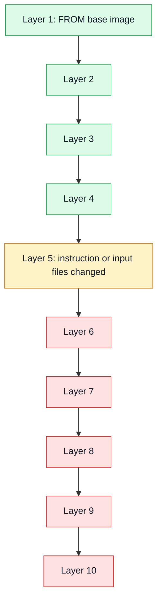

Green: reused from the cache. Amber: the change. Red: rebuilt because their parent changed.

How the cache decides, step by step:

| Instruction | Cache hit when |
|---|---|
| `FROM` | The same base image (use `--pull` to check the registry for a newer one) |
| `RUN` | The same command string on the same parent. Changes outside the build, such as new packages in a repository, are not detected |
| `COPY` / `ADD` | The same parent and the same files: checksums of the copied content and metadata |
| `ARG` / `ENV` | The same values; changing a `--build-arg` value causes a cache miss for the `RUN` steps that follow it |

Strictly, only `RUN`, `COPY` and `ADD` create filesystem layers; `WORKDIR`, `ENV` and similar steps change metadata. The cache rule is the same for every step.

**Why it matters: order the Dockerfile from least to most frequently changed.**

```dockerfile
# 1: base image
FROM node:22-alpine
# 2
WORKDIR /app
# 3: changes only when dependencies change
COPY package.json package-lock.json ./
# 4: reused from cache unless step 3 changed
RUN npm ci
# 5: changes with every code change
COPY . .
# 6: rebuilt whenever step 5 changes
RUN npm run build
CMD ["node", "dist/server.js"]
```

A rebuild after editing one source file:

```text
 => [1/6] FROM docker.io/library/node:22-alpine
 => CACHED [2/6] WORKDIR /app
 => CACHED [3/6] COPY package.json package-lock.json ./
 => CACHED [4/6] RUN npm ci
 => [5/6] COPY . .
 => [6/6] RUN npm run build
```

Had the Dockerfile copied all the source before `npm ci`, every code change would also reinstall every dependency.

Making rebuilt steps fast anyway:

```dockerfile
# syntax=docker/dockerfile:1
# BuildKit cache mount: the npm cache survives even when this step is rebuilt
RUN --mount=type=cache,target=/root/.npm npm ci
```

```bash
# CI runners start with an empty cache: store and reuse it in the registry
docker buildx build \
  --cache-from type=registry,ref=nexus.example.com:8443/payments/orders-api:buildcache \
  --cache-to type=registry,ref=nexus.example.com:8443/payments/orders-api:buildcache,mode=max \
  -t nexus.example.com:8443/payments/orders-api:1.4.212 --push .
# GitHub Actions: --cache-from type=gha --cache-to type=gha,mode=max
```

Gotchas worth naming:

```dockerfile
# Bad: the update step stays cached for months, so later installs use stale package lists
RUN apt-get update
RUN apt-get install -y curl

# Good: one step, always consistent, cache cleaned in the same layer
RUN apt-get update && apt-get install -y --no-install-recommends curl && rm -rf /var/lib/apt/lists/*
```

- `.dockerignore` keeps `.git`, `node_modules`, build output and local files out of the build context, so irrelevant changes don't invalidate `COPY . .`.
- Multi-stage builds cache each stage separately; a change in one stage only affects the stages built from it.
- `docker build --no-cache` forces a clean rebuild (for example to pick up security updates); `--pull` refreshes the base image.

**In the interview:** "Layers 1–4 come from the cache, 5 is rebuilt, and 6–10 are rebuilt as well, because each layer's cache key includes its parent, so the chain breaks at the first change. That's why dependency manifests and installs go before `COPY . .`, and why we use BuildKit cache mounts and a registry-backed cache in CI."

---

### Q11. Kubernetes: troubleshoot a pod stuck in Pending, CrashLoopBackOff or ImagePullBackOff

**Short answer:** each status points at a different stage. **Pending:** the scheduler can't place the pod, or its volume isn't ready; `kubectl describe pod` shows `FailedScheduling` with the reason. **ImagePullBackOff:** the kubelet can't pull the image; the events show the exact pull error. **CrashLoopBackOff:** the container starts and keeps exiting; `kubectl logs --previous` and the last exit code tell you why.

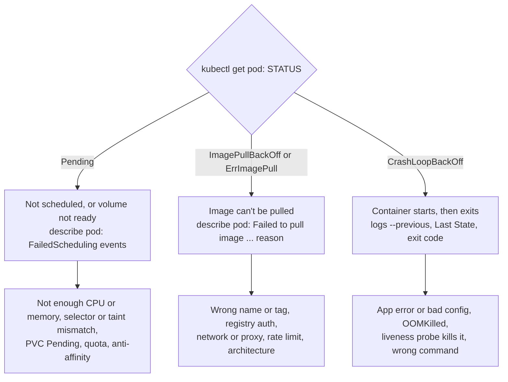

**Pending**

```bash
kubectl get pod <pod> -n <ns> -o wide
kubectl describe pod <pod> -n <ns> | sed -n '/Events/,$p'
# e.g. "0/6 nodes are available: 3 Insufficient cpu, 2 node(s) had untolerated taint {dedicated: gpu},
#       1 node(s) didn't match Pod's node affinity/selector"
kubectl describe nodes | grep -A8 'Allocated resources'
kubectl top nodes
kubectl get pvc -n <ns>; kubectl describe pvc <pvc> -n <ns>
kubectl describe resourcequota -n <ns>
```

| Event message | Cause | Fix |
|---|---|---|
| `Insufficient cpu` / `Insufficient memory` | Requests are larger than free allocatable capacity on every node | Right-size requests; add nodes (Cluster Autoscaler, Karpenter) |
| `didn't match Pod's node affinity/selector` | No node has the required labels | Fix the labels or the selector |
| `had untolerated taint` | Matching nodes are tainted | Add the toleration, or target other nodes |
| `unbound immediate PersistentVolumeClaims`, PVC `Pending` | Missing StorageClass, provisioner error, zone conflict | `kubectl describe pvc`, StorageClass, CSI driver logs |
| `didn't match pod anti-affinity rules` or topology spread | Constraints can't be met with the current nodes | Use preferred rules, add nodes or zones |
| `Too many pods` | Node max-pods reached, or pod IPs exhausted (AWS VPC CNI) | Larger instances, prefix delegation, more nodes |
| No pod at all; ReplicaSet event `exceeded quota` | Namespace ResourceQuota | Raise the quota or lower requests (`kubectl describe rs`) |

**CrashLoopBackOff**

```bash
kubectl logs <pod> -n <ns> --previous            # output of the run that crashed
kubectl describe pod <pod> -n <ns>               # Last State: Terminated, Reason, Exit Code; probe failures in Events
kubectl get pod <pod> -n <ns> -o jsonpath='{.status.containerStatuses[0].lastState.terminated}'

# get a shell: a copy of the pod with the container's command replaced by sh
kubectl debug <pod> -n <ns> -it --copy-to=<pod>-debug --container=<container> -- sh
# or attach an ephemeral debug container to the running pod
kubectl debug -it <pod> -n <ns> --image=busybox:1.36 --target=<container>
```

| Evidence | Cause | Fix |
|---|---|---|
| Stack trace or config error in `logs --previous`, exit code 1 | Missing env var, ConfigMap or Secret key, bad config, dependency unreachable at start | Fix the config; check referenced ConfigMaps and Secrets exist; retry dependencies |
| `Reason: OOMKilled`, exit code 137 | Memory limit too low, or a leak | Raise the limit, fix the leak, size the JVM heap to the limit |
| `Liveness probe failed` events before each restart | Probe too aggressive, or a slow start | Add a startupProbe, relax thresholds, check the probe path and port |
| Exit code 127 or 126 | Command not found, or not executable | Fix `command`/`args`, the entrypoint or file permissions in the image |
| Exit code 0, then a restart | The process finished or daemonized into the background | Run in the foreground; use a Job for run-to-completion work |
| `permission denied`, read-only filesystem | `runAsNonRoot`, `readOnlyRootFilesystem`, volume ownership | Writable `emptyDir` for temp paths, `fsGroup`, fix the image's user |
| `Init:CrashLoopBackOff` | An init container fails (migration, wait script) | `kubectl logs <pod> -c <init-container> --previous` |

**ImagePullBackOff / ErrImagePull**

```bash
kubectl describe pod <pod> -n <ns> | grep -i -A3 'failed'     # the exact pull error
kubectl get pod <pod> -n <ns> -o jsonpath='{.spec.containers[*].image}'
crictl pull nexus.example.com:8443/payments/orders-api:1.4.212   # on the node: reproduces the error directly

# private registry credentials
kubectl create secret docker-registry regcred -n <ns> \
  --docker-server=nexus.example.com:8443 --docker-username=ci-pull --docker-password='<token>'
kubectl patch serviceaccount default -n <ns> -p '{"imagePullSecrets":[{"name":"regcred"}]}'
```

| Error text | Cause | Fix |
|---|---|---|
| `not found`, `manifest unknown` | Wrong repository, tag or digest; the image was never pushed | Check the registry; fix the tag the pipeline writes |
| `unauthorized`, `pull access denied`, `authentication required` | Private registry without `imagePullSecrets`, or expired credentials | Create the secret and attach it to the ServiceAccount; on EKS let the node role pull from ECR |
| `i/o timeout`, `connection refused` | Node can't reach the registry: proxy, firewall, DNS, no NAT | Fix egress; VPC endpoints for ECR; containerd proxy settings |
| `x509: certificate signed by unknown authority` | Registry with an internal CA | Add the CA to containerd (`/etc/containerd/certs.d/<registry>/hosts.toml`) or the node trust store |
| `toomanyrequests` | Docker Hub rate limit | A pull-through cache or mirror in Nexus, Artifactory or ECR; authenticated pulls |
| `no match for platform in manifest` | Image built for another CPU architecture | Build multi-architecture images with `docker buildx` |

Exit codes to know: `0` completed, `1` application error, `126` not executable, `127` command not found, `137` SIGKILL (often OOMKilled), `139` segmentation fault, `143` SIGTERM.

**In the interview:** "Pending is the scheduler: describe the pod and read FailedScheduling. ImagePullBackOff is the kubelet pulling: the event text tells you whether it's the tag, auth, network or TLS. CrashLoopBackOff is the app: `logs --previous`, the exit code and the probe events, and `kubectl debug --copy-to` with a shell when the logs aren't enough."

---

### Q12. Helm: an upgrade failed. How do you roll back and troubleshoot?

**Short answer:** check `helm history` to see which revision failed and why, roll back to the last good revision with `helm rollback <release> <revision>` (which creates a new revision with the old manifests), then find the cause from the release's rendered manifests and values, the Kubernetes events, and the logs of the new pods and hook jobs. Next time, upgrade with automatic rollback on failure: `--atomic` in Helm 3, `--rollback-on-failure` in Helm 4.

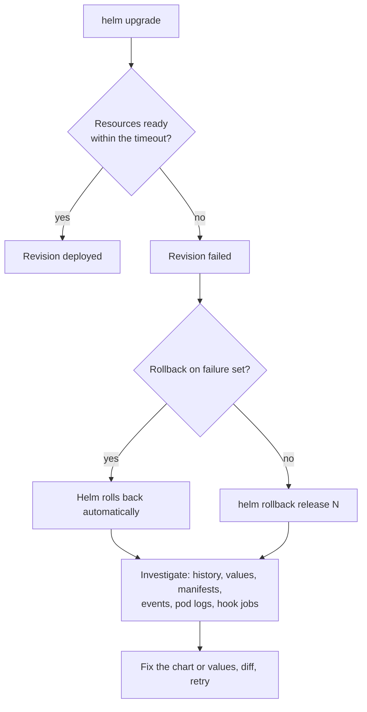

**Roll back:**

```bash
helm history orders-api -n prod
```

```text
REVISION  STATUS      CHART             APP VERSION  DESCRIPTION
6         superseded  orders-api-1.5.2  1.5.2        Upgrade complete
7         deployed    orders-api-1.6.0  1.6.0        Upgrade complete
8         failed      orders-api-1.7.0  1.7.0        Upgrade "orders-api" failed: context deadline exceeded
```

```bash
helm rollback orders-api 7 -n prod --wait --timeout 5m     # creates revision 9 with revision 7's manifests
helm history orders-api -n prod                            # 9 deployed, "Rollback to 7"
kubectl rollout status deployment/orders-api -n prod
```

`helm rollback orders-api` without a revision number goes back to the previous revision.

**"another operation (install/upgrade/rollback) is in progress":** a previous run was killed mid-upgrade (for example a cancelled CI job), leaving the latest revision in `pending-upgrade` or `pending-install`.

```bash
helm history orders-api -n prod                      # the latest revision shows pending-upgrade
helm rollback orders-api 7 -n prod                   # usually clears it
# last resort: delete the stuck revision record (Helm stores each revision as a Secret)
kubectl get secrets -n prod -l owner=helm,name=orders-api
kubectl delete secret sh.helm.release.v1.orders-api.v8 -n prod
```

**Troubleshoot the cause:**

```bash
helm status orders-api -n prod
helm get values orders-api -n prod --revision 8                   # what was deployed
helm get manifest orders-api -n prod --revision 7 > rev7.yaml
helm get manifest orders-api -n prod --revision 8 > rev8.yaml
diff rev7.yaml rev8.yaml
kubectl get pods -n prod -l app.kubernetes.io/instance=orders-api
kubectl describe pod <new-pod> -n prod
kubectl logs <new-pod> -n prod --previous
kubectl get events -n prod --sort-by=.lastTimestamp | tail -30
kubectl get jobs -n prod                                           # pre- and post-upgrade hook jobs

# before the next attempt
helm diff upgrade orders-api ./chart -n prod -f values-prod.yaml   # helm-diff plugin
helm upgrade orders-api ./chart -n prod -f values-prod.yaml --dry-run=server --debug   # validated by the API server
```

| Error | Cause | Fix |
|---|---|---|
| `timed out waiting for the condition` / `context deadline exceeded` | New pods never became ready: image pull, crash loop, failing probes, no capacity | Debug the pods (Q11); raise `--timeout` only if startup is legitimately slow |
| `field is immutable` | Changed a Deployment selector, StatefulSet `volumeClaimTemplates`, a Service `clusterIP` or a Job spec | Keep selectors stable; recreate the object deliberately (Helm 3 `--force`, Helm 4 `--force-replace`, or a manual delete) |
| `invalid ownership metadata` / `exists and cannot be imported into the current release` | The resource exists but belongs to another release or was created manually | Adopt it with the `meta.helm.sh/release-name` and `meta.helm.sh/release-namespace` annotations and the `app.kubernetes.io/managed-by: Helm` label, or remove it |
| `no matches for kind ... in version ...` | Chart uses an API version removed from the cluster, or a CRD that isn't installed | Update the templates (the `helm-mapkubeapis` plugin fixes stored releases); install the CRDs first |
| Hook job failed (`pre-upgrade hooks failed`) | Database migration or other hook job errored | `kubectl logs job/<hook-job>`; make hooks idempotent; set a `helm.sh/hook-delete-policy` |
| `values don't meet the specifications of the schema` | `values.schema.json` validation | Fix the values file |

**Safe upgrades in CI:**

```bash
# Helm 3
helm upgrade --install orders-api ./chart -n prod -f values-prod.yaml --atomic --wait --timeout 10m --history-max 10
# Helm 4: --atomic is renamed --rollback-on-failure (the old flag is deprecated)
helm upgrade --install orders-api ./chart -n prod -f values-prod.yaml --rollback-on-failure --wait --timeout 10m --history-max 10
```

Helm 4 shipped in November 2025, and Helm 3 receives security fixes only until 10 February 2027, so pipelines should switch to the new flag names now ([Helm 3 end-of-life notice](https://helm.sh/blog/helm-v3-end-of-life/)).

What a rollback does **not** undo: database migrations, data written to PersistentVolumes, CRD changes (Helm doesn't upgrade or roll back CRDs) and external side effects. Design migrations to be backward compatible (expand, then contract) so the previous version can still run.

With GitOps (Argo CD or Flux), roll back by reverting the commit in the environment repository rather than with `helm rollback`, or the controller will re-apply the broken version.

**In the interview:** "`helm history` to find the failed revision and its error, `helm rollback` to the last deployed revision with `--wait`, then root-cause from the diff of the two revisions' manifests, events, pod logs and hook jobs. In CI we upgrade with automatic rollback on failure and `helm diff` in the PR; with Argo CD, rollback is a git revert."

---

### Q13. Kubernetes worker node down or NotReady: common causes, finding the root cause, and troubleshooting beyond basic kubectl

*This answers four questions together: troubleshooting a worker node that goes down; one of 30 nodes NotReady when `kubectl describe`, logs and the other basic commands are already done; the common reasons a node becomes NotReady and how to find the root cause; and your approach to node problems beyond basic kubectl.*

**Short answer:** a node is NotReady when the kubelet stops reporting in (status `Unknown`) or reports itself unhealthy (status `False`), so the root cause is always on the node or on its path to the API server. Protect the workloads first (cordon), then work up the layers: is the machine alive, can you get a shell, are the kubelet and container runtime running, are disk, memory and PIDs healthy, can the node reach the API server, are certificates and time valid, and what changed. If it can't be fixed quickly, collect evidence and replace the node; nodes should be cattle, not pets.

**How a node becomes NotReady.** The kubelet renews its Lease (in the `kube-node-lease` namespace) about every 10 seconds and posts the node's status. If the node controller hears nothing within the node-monitor grace period (tens of seconds), it sets `Ready` to `Unknown` ("Kubelet stopped posting node status"). If the kubelet is alive but a health check fails (container runtime down, CNI not ready, PLEG unhealthy), it reports `Ready=False` with a reason. The node is then tainted `node.kubernetes.io/unreachable` or `node.kubernetes.io/not-ready` with effect `NoExecute`.

What happens to the workloads:

| Workload | What happens |
|---|---|
| Deployment / ReplicaSet pods | Evicted after their default 300-second toleration, then recreated on healthy nodes |
| StatefulSet pods | Stay `Terminating` and are **not** replaced while the node is unreachable, to avoid two copies of the same identity. Delete the Node object once you're sure the machine is down, or apply the out-of-service taint |
| DaemonSet pods | Stay bound to that node; nothing moves |
| Pods with local PVs or zonal disks | Can only restart where their data is; plan for it |

```bash
# the machine is confirmed powered off: let StatefulSet pods and their volumes move
kubectl taint nodes worker-17 node.kubernetes.io/out-of-service=nodeshutdown:NoExecute
```

**What "1 of 30 nodes NotReady" tells you.** The control plane, the CNI configuration and cluster-wide add-ons work for the other 29, so look at what is unique to this node: its VM or hardware, its kernel and packages, its disk, its subnet or availability zone, its certificates, the pods that happened to land on it, and anything that changed on it recently (patching, a new AMI, an agent update).

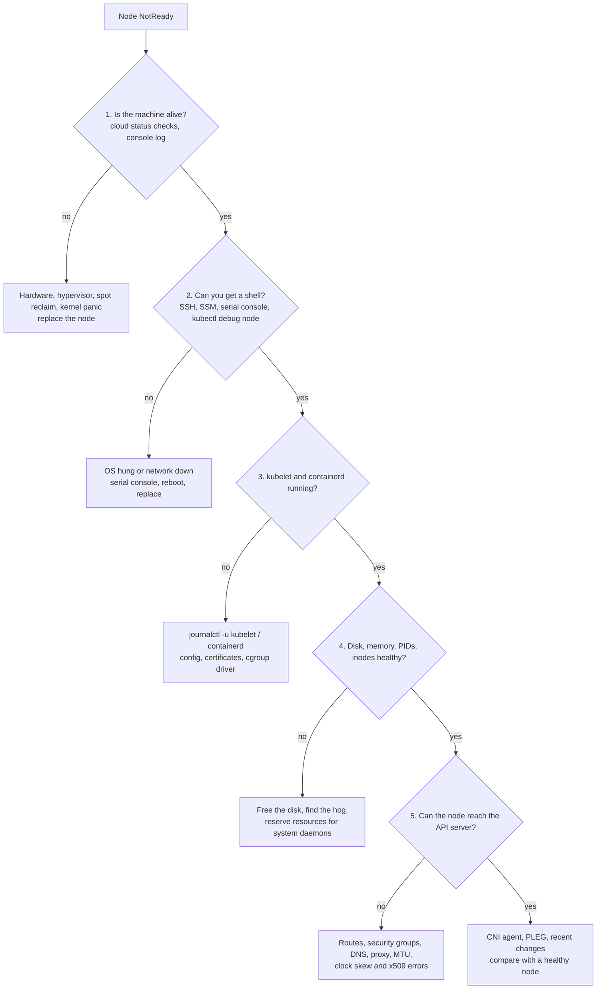

**Step 0: protect the workloads**

```bash
kubectl cordon worker-17                                         # nothing new lands there
kubectl get pods -A -o wide --field-selector spec.nodeName=worker-17
kubectl get pdb -A                                               # will the evictions be allowed?
```

**Step 1: is the machine alive?** (cloud and hypervisor level)

```bash
aws ec2 describe-instance-status --instance-ids i-0abc123def4567890 --include-all-instances
#   SystemStatus = AWS host or network problem; InstanceStatus = the OS itself is unresponsive
aws ec2 get-console-output --instance-id i-0abc123def4567890 --latest --output text | tail -50
#   kernel panic, filesystem check waiting for input, out-of-memory loops at boot
```

On Azure use boot diagnostics and the serial console (`az vm get-instance-view` for power state); on VMware, the VM console and host events. Also check for spot reclamation and scheduled maintenance events.

**Step 2: get a shell without depending on the node's own network**

```bash
aws ssm start-session --target i-0abc123def4567890                # no SSH, no inbound ports
kubectl debug node/worker-17 -it --image=ubuntu                   # only if the kubelet can still start pods
chroot /host                                                      # inside the debug pod: use the node's own tools
```

**Step 3: kubelet and container runtime**

```bash
systemctl status kubelet containerd --no-pager
journalctl -u kubelet --since "-1h" --no-pager | grep -i -E 'error|fail|x509|certificate|pleg|lease|evict|not ready' | tail -50
journalctl -u containerd --since "-1h" --no-pager | tail -50
crictl info | head -40                     # runtime and network (CNI) readiness conditions
crictl ps -a | head -20                    # are kube-proxy and the CNI agent running?
```

**Step 4: resources**

```bash
df -h /var/lib/kubelet /var/lib/containerd /var/log; df -i /
free -m; vmstat 1 5
cat /proc/pressure/cpu /proc/pressure/memory /proc/pressure/io     # PSI: time stalled waiting for each resource
ps -e --no-headers | wc -l; cat /proc/sys/kernel/pid_max
dmesg -T | tail -100      # OOM killer (did it kill the kubelet?), hung tasks, NIC resets, disk I/O errors
```

**Step 5: the path to the API server**

```bash
# kubelet kubeconfig: /etc/kubernetes/kubelet.conf (kubeadm) or /var/lib/kubelet/kubeconfig (EKS)
APISERVER=$(grep 'server:' /etc/kubernetes/kubelet.conf | awk '{print $2}')
curl -sk -o /dev/null -w '%{http_code}\n' "$APISERVER/livez"    # any HTTP code, even 401/403, proves reachability
ip route; ip -s link                                             # routes, interface errors
cat /etc/resolv.conf; ls /etc/cni/net.d/
```

**Step 6: certificates and time**

```bash
openssl x509 -noout -enddate -in /var/lib/kubelet/pki/kubelet-client-current.pem   # kubeadm clusters
timedatectl; chronyc tracking               # clock skew breaks TLS and looks like certificate errors
```

**Step 7: what changed, and how does it differ from a healthy node?**

- Compare `/var/lib/kubelet/config.yaml`, `/etc/containerd/config.toml`, the kernel version and the kubelet and containerd package versions with a Ready node.
- Check `SystemdCgroup = true` in containerd matches the kubelet's `cgroupDriver: systemd`; a mismatch after an upgrade stops the kubelet.
- Look at history, not just the present: node-exporter graphs from before the failure (memory climbing, disk filling), kube-state-metrics node conditions, node-problem-detector events, CloudTrail (who stopped the instance or changed its security group), patching and AMI rollout schedules.

**Common causes of NotReady, the evidence and the fix:**

| Cause | Evidence | Fix |
|---|---|---|
| kubelet stopped or crash-looping | `systemctl status kubelet` failed; errors in its journal | Fix its config or flags, restart it |
| Container runtime down or hung | "container runtime is down", `crictl` hangs | Restart containerd; check its disk and config |
| PLEG not healthy | "PLEG is not healthy" in the kubelet log | Overloaded or hung runtime, too many containers, slow disk; restart the runtime, reduce density |
| Disk full | `DiskPressure`; `df` 100% on `/var/lib/containerd` or `/var/log` | `crictl rmi --prune`, clean logs, fix log rotation, grow the disk |
| Memory exhausted | `MemoryPressure`; the OOM killer hit system processes | Set `kube-reserved`/`system-reserved` and eviction thresholds; find the leaking pod |
| PID exhaustion | `PIDPressure`, "fork: Resource temporarily unavailable" | Pod PID limits; find the process explosion |
| CNI not ready | "network plugin is not ready: cni config uninitialized" | Fix the CNI agent pod on that node and `/etc/cni/net.d` |
| Node can't reach the API server | `Ready=Unknown`; "failed to update lease" or timeouts in the kubelet log | Security group, NACL, routes, DNS, proxy, MTU, API endpoint access |
| Expired kubelet certificate or clock skew | x509 errors in the kubelet log | Fix NTP; rotate or re-issue the certificate (re-join the node) |
| Instance or hardware failure, spot reclaim | Failed cloud status checks; instance stopped or terminated | Replace the node |
| Misconfiguration after an upgrade | cgroup driver mismatch, wrong flags, version skew | Align with a healthy node's configuration |

**Recover:**

```bash
sudo systemctl restart containerd kubelet          # after fixing the cause
kubectl get node worker-17 -w                      # back to Ready?
kubectl uncordon worker-17

# beyond repair: collect evidence (logs, sosreport), then replace it
kubectl drain worker-17 --ignore-daemonsets --delete-emptydir-data --timeout=10m
kubectl delete node worker-17
aws autoscaling terminate-instance-in-auto-scaling-group \
  --instance-id i-0abc123def4567890 --no-should-decrement-desired-capacity
```

**Prevent the next one:**

- Alert on `kube_node_status_condition{condition="Ready",status="true"} == 0`, on node pressure conditions and on kubelet certificate expiry, not just on pods.
- Run node-problem-detector so kernel and runtime problems show up as node conditions and events.
- Turn on node auto-repair where available (GKE auto-repair, AKS node auto-repair, EKS node health monitoring with auto repair), and let the node group or Karpenter replace unhealthy nodes.
- Reserve resources for system daemons, keep log rotation on, roll nodes regularly with fresh images, and spread replicas with PDBs and topology spread so losing a node is a non-event.

**In the interview, by question:**

- *A worker node goes down:* "Cordon it, check what ran there and that Deployment pods are rescheduling; StatefulSet pods need the node deleted or the out-of-service taint once I'm sure it's really down. Then root-cause, or replace the node from the node group."
- *1 of 30 NotReady, basics done:* "29 healthy nodes means the control plane and CNI config are fine, so it's node-local. I check the instance in the cloud console, get a shell through SSM, then kubelet and containerd journals, disk, memory, PIDs and dmesg, the node's path to the API server, its certificates and clock, and finally diff its config against a healthy node."
- *Common causes:* "kubelet or containerd down, disk or memory pressure, CNI not ready, lost connectivity to the API server, an expired certificate or clock skew, and hardware or spot loss; the Ready condition's reason and the kubelet journal tell them apart."
- *Beyond kubectl:* "Bottom-up through the layers with SSM or the serial console, journalctl, crictl, dmesg and PSI, plus history from node-exporter, node-problem-detector and CloudTrail to see what changed before it failed."

---

## Part 4 · Infrastructure as code

### Q14. Terraform: what is the difference between `terraform refresh` and `terraform plan`?

**Short answer:** `terraform plan` reads the real infrastructure, compares it with your configuration and the state, and shows what it would create, change or destroy; it changes nothing. `terraform refresh` only reads the real infrastructure and writes what it finds into the state file, without comparing against your code and without asking first. Because a silent state rewrite is risky (wrong credentials or region can make resources look deleted), `terraform refresh` is deprecated in favour of `terraform plan -refresh-only` (preview) and `terraform apply -refresh-only` (update the state after approval).

| Command | Reads real infrastructure | Compares with your `.tf` code | Writes state | Changes infrastructure | Use it to |
|---|---|---|---|---|---|
| `terraform plan` | Yes (refresh in memory) | Yes | No | No | Preview changes before `apply` |
| `terraform refresh` (deprecated) | Yes | No | Yes, without asking | No | The old way to sync state |
| `terraform plan -refresh-only` | Yes | No | No | No | See drift only |
| `terraform apply -refresh-only` | Yes | No | Yes, after approval | No | Accept drift into the state safely |
| `terraform plan -refresh=false` | No | Yes, against the state | No | No | Faster plans when you trust the state |

**Example:** someone changed an instance type from `t3.medium` to `t3.large` in the AWS console.

```text
$ terraform plan

Note: Objects have changed outside of Terraform

  # aws_instance.web has changed
  ~ resource "aws_instance" "web" {
        id            = "i-0abc123def4567890"
      ~ instance_type = "t3.medium" -> "t3.large"
    }

Terraform will perform the following actions:

  # aws_instance.web will be updated in-place
  ~ resource "aws_instance" "web" {
      ~ instance_type = "t3.large" -> "t3.medium"
    }

Plan: 0 to add, 1 to change, 0 to destroy.
```

`plan` reports the drift and then plans to put the code's value back. If the manual change should stay, update the code to `t3.large`; `terraform apply -refresh-only` alone only records the drift in the state, and the next normal plan would still revert it.

Detect drift on a schedule:

```bash
terraform plan -detailed-exitcode -lock=false    # exit code 0 = no changes, 1 = error, 2 = changes or drift
```

**In the interview:** "`plan` refreshes in memory, diffs real infrastructure and state against the code and proposes actions without changing anything; `refresh` just rewrote the state from reality without review, which is why it's deprecated in favour of `plan -refresh-only` and `apply -refresh-only`. We run a nightly `plan -detailed-exitcode` to catch console drift."

---

### Q15. In Terraform, how do you create multiple EC2 instances, each with a different configuration?

**Short answer:** describe the instances as a map of objects (one key per instance, with its type, AMI, subnet, volumes and tags) and create them with `for_each`. Use `optional()` attributes for defaults, a lookup for AMIs, and flatten the per-instance volume lists into their own `for_each` for extra EBS volumes. Prefer `for_each` to `count`: `count` addresses instances by index, so removing one from the middle shifts the others and Terraform destroys and recreates them.

**Variables:**

```hcl
variable "environment" {
  type    = string
  default = "prod"
}

variable "instances" {
  description = "One entry per EC2 instance"
  type = map(object({
    instance_type = string
    ami_name      = string                 # key into local.ami_ids
    subnet_id     = string
    root_size_gb  = optional(number, 20)
    extra_volumes = optional(list(object({
      device_name = string
      size_gb     = number
      type        = optional(string, "gp3")
    })), [])
    tags = optional(map(string), {})
  }))
}
```

**Values (`prod.tfvars`):**

```hcl
instances = {
  web-1 = {
    instance_type = "t3.medium"
    ami_name      = "amazon-linux-2023"
    subnet_id     = "subnet-0aaa1111"
    tags          = { Role = "web" }
  }
  app-1 = {
    instance_type = "m6i.large"
    ami_name      = "ubuntu-24-04"
    subnet_id     = "subnet-0bbb2222"
    root_size_gb  = 50
    tags          = { Role = "app" }
  }
  db-1 = {
    instance_type = "r6i.xlarge"
    ami_name      = "amazon-linux-2023"
    subnet_id     = "subnet-0ccc3333"
    root_size_gb  = 30
    extra_volumes = [
      { device_name = "/dev/sdf", size_gb = 200 },
      { device_name = "/dev/sdg", size_gb = 500, type = "st1" }
    ]
    tags = { Role = "db", Backup = "daily" }
  }
}
```

**AMI lookup:**

```hcl
data "aws_ami" "al2023" {
  most_recent = true
  owners      = ["amazon"]
  filter {
    name   = "name"
    values = ["al2023-ami-2023.*-x86_64"]
  }
}

data "aws_ami" "ubuntu_2404" {
  most_recent = true
  owners      = ["099720109477"]           # Canonical
  filter {
    name   = "name"
    values = ["ubuntu/images/hvm-ssd-gp3/ubuntu-noble-24.04-amd64-server-*"]
  }
}

locals {
  ami_ids = {
    "amazon-linux-2023" = data.aws_ami.al2023.id
    "ubuntu-24-04"      = data.aws_ami.ubuntu_2404.id
  }
}
```

**Instances and extra volumes:**

```hcl
resource "aws_instance" "this" {
  for_each = var.instances

  ami           = local.ami_ids[each.value.ami_name]
  instance_type = each.value.instance_type
  subnet_id     = each.value.subnet_id

  root_block_device {
    volume_size = each.value.root_size_gb
    volume_type = "gp3"
    encrypted   = true
  }

  tags = merge(
    { Name = each.key, Environment = var.environment, ManagedBy = "terraform" },
    each.value.tags
  )

  lifecycle {
    ignore_changes = [ami]                 # a newer AMI shouldn't replace running servers
  }
}

locals {
  # flatten instance -> volumes into one map keyed "db-1:/dev/sdf"
  extra_volumes = merge([
    for name, inst in var.instances : {
      for v in inst.extra_volumes : "${name}:${v.device_name}" => merge(v, { instance = name })
    }
  ]...)
}

resource "aws_ebs_volume" "extra" {
  for_each          = local.extra_volumes
  availability_zone = aws_instance.this[each.value.instance].availability_zone
  size              = each.value.size_gb
  type              = each.value.type
  encrypted         = true
  tags              = { Name = each.key }
}

resource "aws_volume_attachment" "extra" {
  for_each    = local.extra_volumes
  device_name = each.value.device_name
  volume_id   = aws_ebs_volume.extra[each.key].id
  instance_id = aws_instance.this[each.value.instance].id
}

output "private_ips" {
  value = { for name, inst in aws_instance.this : name => inst.private_ip }
}
```

```bash
terraform plan -var-file=prod.tfvars
terraform apply -var-file=prod.tfvars
terraform state list | grep aws_instance       # aws_instance.this["app-1"], ["db-1"], ["web-1"]
```

| | `count` | `for_each` |
|---|---|---|
| Addresses | `aws_instance.web[0]`, `[1]`, `[2]` | `aws_instance.this["web-1"]`, `["db-1"]` |
| Removing one in the middle | Later instances shift index and get recreated | Only that instance is destroyed |
| Different settings per instance | Awkward (parallel lists) | Natural (one object per key) |
| Best for | N identical copies, or a 0/1 on-off switch | Distinct instances |

Moving existing `count` resources to `for_each` without recreating them:

```hcl
moved {
  from = aws_instance.web[0]
  to   = aws_instance.this["web-1"]
}
```

For many identical, interchangeable servers, use a launch template with an Auto Scaling group instead; `for_each` is for instances that genuinely differ. The same pattern works at module level: `module "server" { for_each = var.instances ... }`.

**In the interview:** "A map of objects with `optional()` defaults, `for_each` on `aws_instance` so each server is addressed by name, an AMI lookup map, and a flattened map for extra EBS volumes and attachments. Not `count`, because index-based addresses recreate servers when the list changes; existing ones move over with `moved` blocks."

---

### Q16. Terraform vs Ansible: when do you use each, and how do they work together?

**Short answer:** Terraform provisions infrastructure: it declares cloud resources (networks, instances, databases, IAM, DNS, Kubernetes clusters), keeps a state file, plans changes and manages the whole lifecycle including destroy. Ansible configures what runs on that infrastructure: packages, files, services, users, application deployments, patching and orchestrated rolling changes over SSH or WinRM, with no state file and no agent. Together: Terraform builds and tags the servers, and Ansible configures them through a dynamic inventory that finds them by those tags, either in the same pipeline or by baking images with Packer.

| | Terraform | Ansible |
|---|---|---|
| Main job | Provisioning: create, change and destroy infrastructure through provider APIs | Configuration management, application deployment, day-2 operations |
| Language | HCL, declarative | YAML playbooks: ordered tasks using mostly idempotent modules |
| State | State file (remote backend with locking) | None; inspects the targets on every run |
| Connects to | Cloud and SaaS APIs | Hosts over SSH or WinRM (plus API modules for clouds and network devices) |
| Preview | `terraform plan` | `--check --diff` |
| Ordering | Dependency graph, parallel where possible | Task order, host batches with `serial` |
| Removal | `terraform destroy` removes what it created | You write tasks that undo changes |
| Typical targets | VPC, subnets, EC2, RDS, EKS, IAM, DNS, load balancers | OS hardening, packages, Tomcat or Nginx config, app releases, patching, certificates |

Each tool can do some of the other's job (Ansible has cloud modules; Terraform has provisioners), but provisioners are a last resort and Ansible without state is weak at tearing infrastructure down.

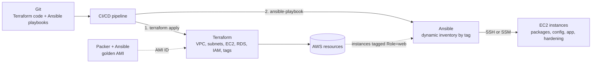

Terraform creates and tags the instances:

```hcl
resource "aws_instance" "web" {
  count         = 2                          # identical copies, so count is fine
  ami           = data.aws_ami.al2023.id
  instance_type = "t3.medium"
  subnet_id     = var.private_subnet_ids[count.index]
  tags = {
    Name = "web-${count.index + 1}"
    Role = "web"
    Env  = "prod"
  }
}
```

Ansible finds them by tag (`inventories/aws_ec2.yml`):

```yaml
plugin: amazon.aws.aws_ec2
regions: [ap-south-1]
filters:
  tag:Env: prod
  instance-state-name: running
keyed_groups:
  - key: tags.Role
    prefix: role                  # creates groups such as role_web
hostnames:
  - private-ip-address
```

The pipeline runs them in order:

```bash
terraform -chdir=infra plan -out=tfplan
terraform -chdir=infra apply tfplan                                  # after review or approval
ansible-playbook -i inventories/aws_ec2.yml site.yml --limit role_web
```

Integration patterns, from loosest to tightest:

1. **Golden images:** Packer runs Ansible to bake an AMI; Terraform launches instances from it. Immutable, fast to scale, the preferred pattern.
2. **Pipeline stages:** Terraform apply, then Ansible with a dynamic inventory by tags (above).
3. **Bootstrap with cloud-init:** Terraform `user_data` does the minimum (agents, hostname), and Ansible or AWX does the rest.
4. **Direct calls:** a Terraform `local-exec` provisioner running `ansible-playbook`. Simple, but couples the tools and hides failures; avoid in production.

**In the interview:** "Terraform for what exists, Ansible for what's on it. Terraform builds the VPC, instances and IAM with tags; Ansible's aws_ec2 inventory groups instances by those tags and configures them, in the same pipeline after `terraform apply`. For autoscaled fleets we bake AMIs with Packer and Ansible so new instances need no configuration at boot."

---

### Q17. What is your hands-on experience with Ansible? Explain a real project where you used it

**How to answer:** this one is about you, so tell a real project in STAR form (situation, task, action, result) with numbers and one technical detail the interviewer can probe. The sample below shows the shape and the level of detail; replace it with your own project, and don't claim parts you didn't build.

**Sample answer (replace with your own project):**

- **Situation:** a Java payments application on about 120 RHEL VMs across on-premises and AWS. Releases and monthly patching were manual runbooks, took most of a night and caused configuration drift between servers.
- **Task:** automate application releases and OS patching with zero downtime and an audit trail.
- **Action:**
  - Roles per concern (`common`, `hardening`, `java`, `tomcat`, `app_deploy`) in Git, with defaults in each role and environment values in per-environment inventories (dynamic `aws_ec2` inventory for the AWS side).
  - A rolling deploy playbook: `serial: 2`, take each server out of HAProxy, download the release from Nexus with a checksum, template the config, restart, wait for the health endpoint, put it back.
  - A patching playbook in batches of 20% that reboots only when `needs-restarting -r` says so.
  - Secrets in Ansible Vault with a separate vault ID for production; `no_log` on secret-handling tasks.
  - Quality: `ansible-lint` and Molecule tests in CI; everything runs from AWX job templates with RBAC, surveys for the version and full job logs for audit.
- **Result:** release time down from about four hours of manual work to about 25 minutes, no downtime, drift eliminated (a nightly `--check --diff` run reports any), and patch compliance reported per run.

The rolling deploy playbook at the heart of it:

```yaml
- name: Rolling deploy of the payments app
  hosts: app_servers
  become: true
  serial: 2                                  # two servers at a time
  max_fail_percentage: 0                     # stop at the first failed batch
  vars:
    app_version: "{{ release_version }}"     # passed by the pipeline: -e release_version=1.4.212
  pre_tasks:
    - name: Take the server out of the load balancer
      community.general.haproxy:
        state: disabled
        host: "{{ inventory_hostname }}"
        backend: payments_backend
        socket: /var/run/haproxy.sock
      delegate_to: "{{ item }}"
      loop: "{{ groups['load_balancers'] }}"
  roles:
    - role: app_deploy                       # get_url from Nexus with checksum, template, restart via handler
  post_tasks:
    - name: Wait until the app is healthy
      ansible.builtin.uri:
        url: "http://{{ inventory_hostname }}:8080/actuator/health"
        status_code: 200
      register: health
      retries: 30
      delay: 5
      until: health.status == 200
    - name: Put the server back into the load balancer
      community.general.haproxy:
        state: enabled
        host: "{{ inventory_hostname }}"
        backend: payments_backend
        socket: /var/run/haproxy.sock
      delegate_to: "{{ item }}"
      loop: "{{ groups['load_balancers'] }}"
```

And the reboot-only-when-needed patching logic:

```yaml
- name: Monthly OS patching
  hosts: app_servers
  become: true
  serial: '20%'
  tasks:
    - name: Apply security updates
      ansible.builtin.dnf:
        name: '*'
        security: true
        state: latest
    - name: Check whether a reboot is required
      ansible.builtin.command: needs-restarting -r
      register: reboot_check
      changed_when: false
      failed_when: reboot_check.rc not in [0, 1]
    - name: Reboot only if required
      ansible.builtin.reboot:
        reboot_timeout: 900
      when: reboot_check.rc == 1
```

Follow-ups to expect, with the points to make:

| Follow-up | Points to make |
|---|---|
| How do you keep it idempotent? | Modules instead of `shell`; `changed_when` and `creates` on the commands you must run; a second run reports zero changes |
| A deploy fails halfway. What happens? | `max_fail_percentage: 0` stops the rollout; `block`/`rescue` restores the previous version on that host; the load balancer keeps serving from healthy servers |
| How do you handle secrets? | Vault with per-environment vault IDs, `no_log`, the vault password from the CI credential store or AWX |
| How do you test roles? | Molecule (converge, verify, idempotence) and `ansible-lint` in CI before merging |
| How did you make it fast? | `forks`, `pipelining = True`, fact caching, `strategy: free` where ordering doesn't matter |
| How do you find drift? | A scheduled `--check --diff` run, alerting on changed tasks |

---

## Part 5 · AWS

### Q18. You can launch an EC2 instance from the console but can't SSH into it. How do you install the `tree` package?

**Short answer:** use AWS Systems Manager instead of SSH: open a Session Manager shell, or send the install command with Run Command. Neither needs port 22, a key pair or a public IP. It requires the SSM Agent (preinstalled on Amazon Linux and recent Ubuntu AMIs), an instance role with the `AmazonSSMManagedInstanceCore` policy, and outbound HTTPS to the Systems Manager endpoints (internet or NAT, or VPC interface endpoints). For new instances, put the package in user data. Then fix SSH itself if you still need it.

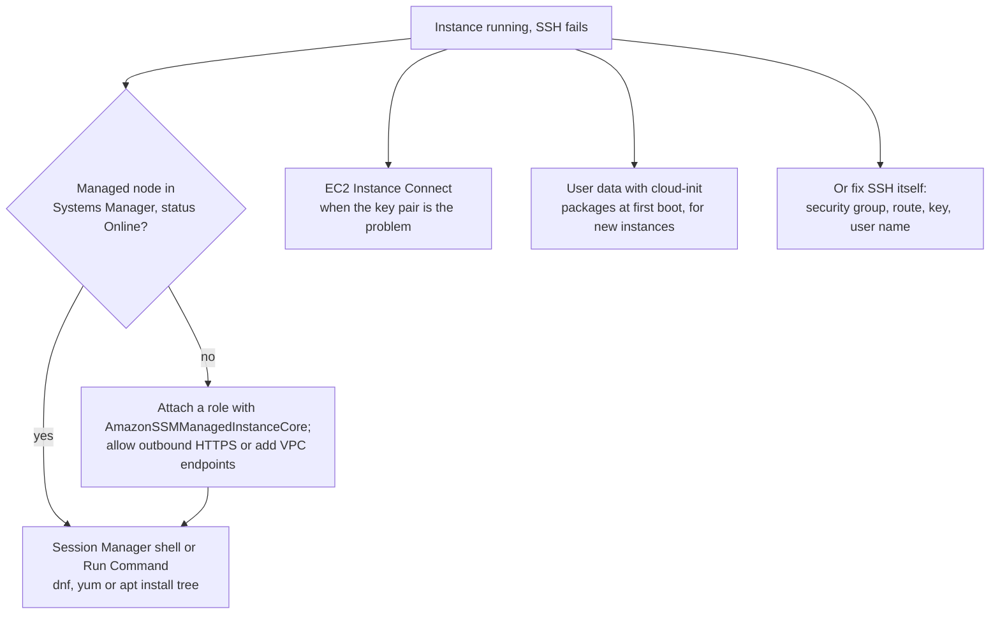

**Option 1: Session Manager (an interactive shell):**

```bash
aws ssm describe-instance-information --filters "Key=InstanceIds,Values=i-0abc123def4567890"   # PingStatus: Online?
aws ssm start-session --target i-0abc123def4567890      # needs the Session Manager plugin for the AWS CLI
sudo dnf install -y tree                                # Amazon Linux 2023 / RHEL
```

**Option 2: Run Command (no shell at all; works on one instance or a whole fleet by tag):**

```bash
aws ssm send-command \
  --instance-ids i-0abc123def4567890 \
  --document-name "AWS-RunShellScript" \
  --comment "install tree" \
  --parameters 'commands=["dnf install -y tree || yum install -y tree || (apt-get update && apt-get install -y tree)","tree --version"]'

aws ssm list-command-invocations --command-id <command-id> --details \
  --query 'CommandInvocations[].CommandPlugins[].Output' --output text
```

Run Command runs as root, so `sudo` isn't needed.

**If the instance doesn't show up in Systems Manager:**

```bash
aws ec2 associate-iam-instance-profile --instance-id i-0abc123def4567890 \
  --iam-instance-profile Name=SSMInstanceProfile          # a role with AmazonSSMManagedInstanceCore
```

- In a private subnet without NAT, create interface endpoints for `ssm`, `ssmmessages` and `ec2messages`.
- Installing a package also needs a route to the package repository: Amazon Linux repositories are reachable through an S3 gateway endpoint; Ubuntu and others need NAT, a proxy or an internal mirror.
- Default Host Management Configuration in Systems Manager can enable this for every instance in an account and region, without per-instance roles.

**Option 3: user data, for new instances** (cloud-init runs it on first boot):

```yaml
#cloud-config
package_update: true
packages:
  - tree
```

User data runs only on the first boot by default; for an existing instance, Systems Manager is the clean route.

**Other routes, depending on why SSH fails:**

- **EC2 Instance Connect** pushes a temporary key for 60 seconds; it helps when the key pair is lost, but still needs port 22 reachable (from the Instance Connect service, or through an EC2 Instance Connect Endpoint for private subnets).
- **EC2 Serial Console** for boot or network misconfiguration (Nitro instances; needs enabling and a user with a password).

**Fix SSH itself** if you need it later:

| Check | What to look for |
|---|---|
| Security group | Inbound TCP 22 from your IP (not 0.0.0.0/0) |
| Network ACL | Inbound 22 and outbound ephemeral ports 1024–65535 allowed |
| Routing | Public subnet with a route to an internet gateway and a public IP, or a VPN, bastion or Instance Connect Endpoint |
| Key and user | The right `.pem`, `chmod 400`, and the right user: `ec2-user` (Amazon Linux), `ubuntu` (Ubuntu), `admin` (Debian) |
| Instance health | Both status checks passing; `sshd` running; no OS firewall blocking 22 |

**In the interview:** "I'd skip SSH entirely and use Systems Manager: Session Manager for a shell, or Run Command with `AWS-RunShellScript` to run `dnf install -y tree`, which also scales to a fleet by tag. If the instance isn't a managed node, I attach a role with `AmazonSSMManagedInstanceCore` and make sure it can reach the SSM endpoints and the package repository. For new instances it belongs in user data or the AMI, and I'd still find out why SSH failed."
