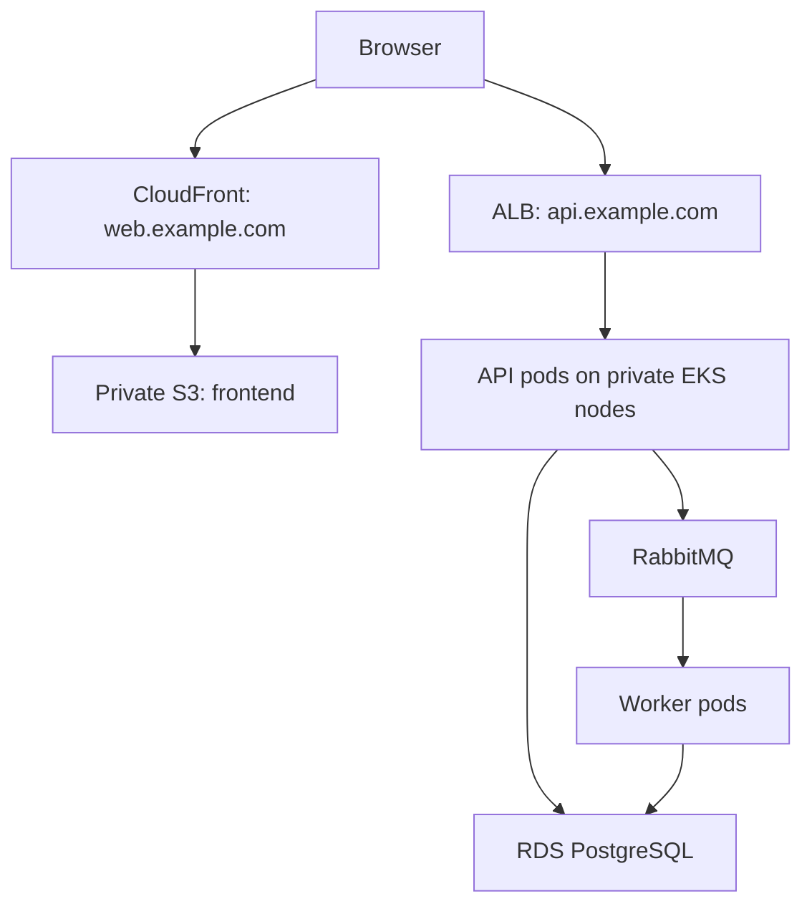

Below are detailed interview answers. The architecture examples assume an **AWS-hosted application with a static frontend, Kubernetes APIs, PostgreSQL, and RabbitMQ workers**. Use the project-experience examples only where they match your actual work.

**1. What have you implemented end to end in your project?**

Choose one implementation and explain the problem, your ownership, the delivery steps, and how you verified the result.

A suitable example is deploying a containerized application with CI/CD, monitoring, and autoscaling:

1. **Understand the application:** Identify its runtime, ports, database, messaging dependencies, and configuration.
2. **Containerize it:** Create a multi-stage Dockerfile and validate startup and shutdown.
3. **Provision infrastructure:** Use Terraform for networking, Kubernetes, database connectivity, and access.
4. **Configure deployment:** Create Helm templates or manifests with probes, resources, secrets, and Services.
5. **Automate delivery:** Build, test, scan, publish, and promote the image through CI/CD.
6. **Add observability:** Collect application metrics, logs, and traces; create dashboards and alerts.
7. **Validate operations:** Test scaling, failed deployments, recovery, and backup restoration where applicable.

An answer you can adapt:

> “I implemented the deployment workflow for [application]. I owned [specific components], worked with developers on application configuration, and validated releases using health checks, load testing, and monitoring.”

Describe measurable results only when you have real evidence.

**2. Explain HPA implementation in detail**

The **Horizontal Pod Autoscaler changes the number of workload replicas** according to measured demand. It does not increase CPU or memory allocation inside an existing pod.

For CPU-based autoscaling, you need:

- A scalable workload, such as a Deployment.
- Working resource metrics, commonly supplied through Metrics Server.
- CPU requests on the relevant containers.
- Sufficient cluster capacity for additional pods.

Metrics Server supplies resource metrics for Kubernetes autoscaling; it is not a replacement for a full historical monitoring system. [GitHub](https://github.com/kubernetes-sigs/metrics-server?utm_source=chatgpt.com)

For example, configure an application container with:

```yaml
resources:
  requests:
    cpu: 200m
    memory: 256Mi
  limits:
    cpu: "1"
    memory: 512Mi
```

Then create an HPA:

```yaml
apiVersion: autoscaling/v2
kind: HorizontalPodAutoscaler
metadata:
  name: orders-api
  namespace: prod
spec:
  scaleTargetRef:
    apiVersion: apps/v1
    kind: Deployment
    name: orders-api

  minReplicas: 2
  maxReplicas: 10

  metrics:
    - type: Resource
      resource:
        name: cpu
        target:
          type: Utilization
          averageUtilization: 70

  behavior:
    scaleDown:
      stabilizationWindowSeconds: 300
```

The target Deployment must exist in the same namespace.

Here, **70% means 70% of requested CPU**, rather than 70% of the CPU limit or node capacity. With a request of `200m`, the target is approximately `140m` per pod. Resource requests provide the basis for utilization-based scaling. [Kubernetes](https://kubernetes.io/docs/tasks/run-application/horizontal-pod-autoscale/?utm_source=chatgpt.com)

The simplified calculation is:

```text
desired replicas =
ceil(current replicas × current utilization ÷ target utilization)
```

If two pods average 140% utilization against a 70% target, the idealized recommendation is four replicas. Actual decisions also consider missing metrics, readiness, tolerance, and stabilization. [Kubernetes](https://kubernetes.io/docs/tasks/run-application/horizontal-pod-autoscale/?utm_source=chatgpt.com)

The scale-down window considers recent recommendations to reduce repeated scaling up and down. [Kubernetes](https://kubernetes.io/docs/reference/kubernetes-api/workload-resources/horizontal-pod-autoscaler-v2/?utm_source=chatgpt.com)

Verify it with:

```bash
kubectl top pods -n prod
kubectl get hpa -n prod
kubectl describe hpa orders-api -n prod
kubectl get deployment orders-api -n prod -w
```

Test representative traffic in staging and confirm that replicas increase, become ready, and later reduce without disrupting requests. The Kubernetes walkthrough demonstrates this observe-and-load-test approach. [Kubernetes](https://kubernetes.io/docs/tasks/run-application/horizontal-pod-autoscale-walkthrough/?utm_source=chatgpt.com)

Also check two operational issues:

- **Node capacity:** HPA can create demand for pods that remain Pending. Node autoscaling addresses infrastructure capacity separately. [Kubernetes](https://kubernetes.io/docs/concepts/cluster-administration/node-autoscaling/?utm_source=chatgpt.com)
- **Replica ownership:** Configure Helm/GitOps so it does not continually overwrite the replica count managed by HPA.

For queue workers or I/O-heavy applications, CPU may poorly represent demand. Consider queue depth, processing lag, or another application metric through a suitable metrics adapter.

**3. Why deploy RabbitMQ as a StatefulSet rather than a Deployment?**

RabbitMQ maintains broker identity and persistent state.

| Requirement | StatefulSet benefit |
|---|---|
| Stable broker identity | Predictable pod names and hostnames |
| Persistent broker data | Per-replica PVCs through volume-claim templates |
| Replacement behavior | A replacement pod retains its ordinal identity |
| Cluster discovery | Stable DNS names simplify peer discovery |

RabbitMQ identifies nodes using names such as `rabbit@hostname`. Cluster members must resolve and contact those names reliably. [RabbitMQ](https://www.rabbitmq.com/docs/clustering?utm_source=chatgpt.com)

A Deployment can mount persistent volumes, but it does not automatically provide stable ordinal identities and individual PVCs for each replica. StatefulSet supplies those capabilities. [Kubernetes](https://kubernetes.io/docs/concepts/workloads/controllers/statefulset/?utm_source=chatgpt.com)

For production, I would normally use the **RabbitMQ Cluster Operator**, which manages the broker resources and RabbitMQ-specific configuration.

However, StatefulSet does not replicate messages by itself. Queue replication comes from RabbitMQ features such as **quorum queues**, which require a majority of their members to operate correctly. [RabbitMQ](https://www.rabbitmq.com/docs/quorum-queues?utm_source=chatgpt.com)

**4. How would you collect application-level metrics?**

Instrument the application to expose measurements describing its behavior.

| Measurement | What it tells you |
|---|---|
| Request rate | Traffic volume |
| Error rate | Failed operations |
| Request duration | Application latency |
| In-flight requests | Current concurrency |
| Connection-pool usage | Database connection pressure |
| Queue processing lag | Delay in asynchronous work |
| Business outcomes | Successful orders, payments, or other important actions |

For a Spring Boot application:

1. Add Actuator and the Micrometer Prometheus registry.
2. Expose the Prometheus endpoint.
3. Configure Prometheus discovery and scraping.
4. Build dashboards and alerting rules.

Example configuration:

```yaml
management:
  endpoints:
    web:
      exposure:
        include: health,prometheus

  metrics:
    tags:
      application: orders-api
    distribution:
      percentiles-histogram:
        http.server.requests: true
```

Spring Boot provides `/actuator/prometheus` for Prometheus-format metrics when the required integration is configured. Restrict access to the monitoring endpoint appropriately. [docs.spring.io](https://docs.spring.io/spring-boot/reference/actuator/metrics.html?utm_source=chatgpt.com)

With typical Micrometer metric names, request rate can be queried as:

```promql
sum(
  rate(
    http_server_requests_seconds_count{
      application="orders-api"
    }[5m]
  )
)
```

Filter real dashboards by environment and service. Use histograms for latency distributions and percentiles rather than relying only on averages. [Prometheus](https://prometheus.io/docs/practices/histograms/?utm_source=chatgpt.com)

For RabbitMQ, enable its Prometheus integration and monitor broker health, messages ready, unacknowledged messages, consumers, and resource pressure. [RabbitMQ](https://www.rabbitmq.com/docs/prometheus?utm_source=chatgpt.com)

**5. How does HPA work with a StatefulSet?**

HPA can target a StatefulSet because it exposes Kubernetes’ `scale` interface.

The target portion would be:

```yaml
scaleTargetRef:
  apiVersion: apps/v1
  kind: StatefulSet
  name: stateful-workers
```

HPA calculates the desired replica count; the StatefulSet controller handles pod creation and removal. [Kubernetes](https://kubernetes.io/docs/tasks/run-application/horizontal-pod-autoscale/?utm_source=chatgpt.com)

Important considerations include:

- New replicas may require new PVCs.
- Storage provisioning and application startup can delay scaling.
- The application must support additional members.
- Before removing replicas, it may need to drain work or redistribute data.
- PVC retention depends on policy; the default is to retain them. [Kubernetes](https://kubernetes.io/docs/concepts/workloads/controllers/statefulset/?utm_source=chatgpt.com)

**RabbitMQ needs additional care.** The current Cluster Operator documentation does not support ordinary downscaling; it documents scaling to zero and back to the original size as a separate capability. [RabbitMQ](https://www.rabbitmq.com/kubernetes/operator/using-operator?utm_source=chatgpt.com)

I would therefore maintain a planned broker cluster size and autoscale **consumer workloads** according to queue demand. For an operator-managed broker, use the operator’s supported configuration rather than independently changing its underlying StatefulSet.

**6. How would you deploy a three-tier architecture?**

Separate the application into:

1. **Presentation tier:** Frontend assets or a frontend server.
2. **Application tier:** APIs and background workers.
3. **Data tier:** Database and persistent data services.

For a static frontend, one possible AWS architecture is:



The frontend and API have separate entry points. The database and message broker remain privately reachable.

For S3 delivery, configure CloudFront origin access control and the bucket policy so CloudFront can retrieve the frontend assets without making the bucket publicly readable. [Amazon CloudFront](https://docs.aws.amazon.com/AmazonCloudFront/latest/DeveloperGuide/private-content-restricting-access-to-s3.html?utm_source=chatgpt.com)

If the frontend requires server-side rendering, run frontend containers behind the application routing layer instead.

Then add:

- Availability across suitable failure domains.
- Appropriate application replicas.
- Restricted network access.
- Secret management.
- Deployment automation.
- Monitoring, backups, and recovery testing.

**7. What tools would you choose?**

For this example:

| Area | Choice | Purpose |
|---|---|---|
| Source control | Git | Version application and deployment configuration |
| Infrastructure | Terraform | Provision repeatable environments |
| Containers | Docker/BuildKit | Build application images |
| Orchestration | EKS/Kubernetes | Manage APIs and workers |
| Registry | ECR | Store versioned images |
| CI | Jenkins or GitHub Actions | Build, test, scan, and publish |
| Deployment packaging | Helm | Reusable Kubernetes configuration |
| GitOps | Argo CD or Flux | Reconcile desired deployment state |
| Database | RDS PostgreSQL | Managed relational persistence |
| Messaging | RabbitMQ | Asynchronous processing |
| Metrics and alerts | Prometheus, Grafana, Alertmanager | Monitoring and notification |
| Logs and traces | A central log store and tracing backend | Incident investigation |

The important interview point is **why each component is needed**. Adjust the stack to workload scale, team skills, operational capacity, and existing standards.

**8. Docker Swarm or Kubernetes?**

Both orchestrate containers.

| Area | Docker Swarm | Kubernetes |
|---|---|---|
| Model | Docker-integrated service orchestration | Pods and workload controllers |
| Operational setup | Generally fewer concepts to operate | More components and configuration |
| Autoscaling | Usually needs additional automation | HPA and related autoscaling integrations |
| Stateful application management | Service and storage configuration | StatefulSets and application operators |
| Extensibility | Docker service ecosystem | Custom resources and controllers |

Swarm provides service scheduling, networking, and declarative service management as part of Docker Engine. [Docker Docs](https://docs.docker.com/engine/swarm/?utm_source=chatgpt.com)

For the requirements here—HPA, RabbitMQ Operator, GitOps, and multiple services—I would choose Kubernetes. For a smaller deployment, assess whether its operational complexity is justified.

**9. Which database would you choose?**

For an application involving orders, users, and transactional updates, I would initially choose **PostgreSQL**.

Reasons include:

- Transactions.
- Relational constraints.
- Flexible querying and indexing.
- A mature operational ecosystem.

Transactions allow related changes to commit together or roll back together. [postgresql.org](https://www.postgresql.org/docs/current/tutorial-transactions.html?utm_source=chatgpt.com)

On AWS, RDS reduces some database administration work. Configure private access, backups, monitoring, maintenance, and availability according to requirements. [Amazon Relational Database Service](https://docs.aws.amazon.com/AmazonRDS/latest/UserGuide/CHAP_BestPractices.html?utm_source=chatgpt.com)

The final choice should follow the data model, access patterns, consistency needs, and recovery requirements.

**10. How would you manage the microservices?**

Give each service clear ownership and a repeatable deployment process.

For each service, maintain:

- A versioned image.
- Deployment configuration.
- Resource requests and limits.
- Startup, readiness, and liveness behavior.
- Configuration and secret references.
- Dashboards, alerts, and operational documentation.

Use APIs and messaging contracts between services. Define timeouts, bounded retries, and idempotency where operations may be retried.

For asynchronous workers, coordinate graceful shutdown with message acknowledgement so interrupted work can be handled safely.

Also establish data ownership. Sharing infrastructure does not require every service to freely modify every other service’s tables.

**11. How would you expose the application?**

For this example:

- Expose frontend assets through CloudFront.
- Expose APIs through an ALB.
- Keep worker services and data services private.
- Use Kubernetes Services for internal application discovery.

Kubernetes Ingress or Gateway API resources express routing configuration; a compatible implementation supplies the routing behavior. Gateway API provides resources such as Gateway and HTTPRoute. [Gateway API](https://gateway-api.sigs.k8s.io/docs/?utm_source=chatgpt.com)

With AWS Load Balancer Controller and ALB IP targets, the ALB can forward directly to pod IPs. The Kubernetes Service identifies the backend workload, but traffic does not necessarily traverse its ClusterIP. [Amazon EKS](https://docs.aws.amazon.com/eks/latest/userguide/alb-ingress.html?utm_source=chatgpt.com)

**12. Is a load balancer required? Why?**

For a highly available application with multiple HTTP-serving replicas, you need a mechanism that distributes traffic among suitable backends.

In this design, the ALB provides:

- A stable public entry point.
- Backend health checking.
- Traffic distribution.
- Host/path routing.
- TLS termination.

Internal Kubernetes Services also provide access to changing pod endpoints. [Kubernetes](https://kubernetes.io/docs/concepts/services-networking/service/?utm_source=chatgpt.com)

A separate load balancer is not necessary for every microservice. Several APIs can share an ingress routing layer, while internal-only services use cluster networking. Background consumers generally receive work from the broker.

**13. How would the reverse proxy work?**

A reverse proxy accepts client requests and forwards them to application backends.

For example:

| Incoming request | Backend |
|---|---|
| `api.example.com/orders` | Orders service |
| `api.example.com/catalog` | Catalog service |
| `api.example.com/users` | User service |

Depending on the implementation, the routing layer can also handle TLS, connection management, request limits, and health checks. [F5](https://www.nginx.com/resources/glossary/reverse-proxy-server/?utm_source=chatgpt.com)

The reverse proxy could be the ALB itself or a maintained Kubernetes gateway implementation.

Because the example frontend calls a different origin, configure appropriate CORS rules and normal application authentication.

**14. How would you configure DNS?**

Use a domain such as `example.com` and configure its authoritative DNS provider.

For Route 53:

- `web.example.com` points to CloudFront.
- `api.example.com` points to the ALB.
- Internal service names are resolved through Kubernetes DNS.
- Applications use the database’s managed DNS endpoint.

Route 53 alias records support routing to CloudFront distributions and ELB load balancers. [Amazon Route 53](https://docs.aws.amazon.com/Route53/latest/DeveloperGuide/routing-to-cloudfront-distribution.html?utm_source=chatgpt.com)

If the domain was purchased elsewhere, configure the registrar’s nameserver delegation appropriately.

DNS selects the destination for a hostname. Path routing such as `/orders` belongs to the HTTP routing layer.

**15. How would you build the entire CI/CD workflow?**

Separate artifact creation from deployment promotion.

A possible flow is:

1. A pull request triggers validation.
2. CI runs linting, tests, quality checks, and security scans.
3. CI builds the application image.
4. The image is scanned and published to ECR.
5. A deployment-repository change references the approved image.
6. GitOps deploys it to development or staging.
7. Integration and smoke tests validate the release.
8. Required approvals promote the same artifact to production.
9. Health and business metrics determine whether the rollout succeeds.

Keep the pipeline definition in source control. [jenkins.io](https://www.jenkins.io/doc/book/pipeline/jenkinsfile/?utm_source=chatgpt.com)

With Argo CD, automated synchronization applies changes from the desired configuration. Configure drift correction and resource pruning deliberately. [Declarative GitOps CD for Kubernetes](https://argo-cd.readthedocs.io/en/stable/user-guide/auto_sync/?utm_source=chatgpt.com)

Use scoped deployment identities and controlled secret access. Preserve a known-good application version and use compatible database migrations so recovery remains practical.

**16. Is NGINX required?**

**No.** NGINX is one possible implementation of web serving or reverse proxying.

In this design:

- CloudFront and S3 serve the static frontend.
- ALB performs API routing and TLS termination.
- Kubernetes Services provide internal discovery.

NGINX may still be useful where its specific web-server or proxy features are needed.

One current distinction matters: **the community `ingress-nginx` project retired in March 2026**. That project is distinct from the NGINX web server and other NGINX controller products. Select a maintained implementation for a new deployment. [Kubernetes](https://kubernetes.io/blog/2025/11/11/ingress-nginx-retirement/?utm_source=chatgpt.com)

**17. How would you manage SSL/TLS?**

Use TLS for browser connections and required backend connections.

For the AWS example:

- Attach an appropriate certificate to CloudFront.
- Attach a regional certificate to the ALB.
- Redirect HTTP clients to HTTPS where appropriate.
- Use encrypted database and broker connections.
- Monitor certificate expiration and renewal.

CloudFront requires its ACM certificate in **`us-east-1`**. [Amazon CloudFront](https://docs.aws.amazon.com/AmazonCloudFront/latest/DeveloperGuide/cnames-and-https-requirements.html?utm_source=chatgpt.com)

Eligible Amazon-issued ACM certificates support managed renewal; imported certificates are not eligible for that managed-renewal process. Maintain required validation and integration configuration. [AWS Certificate Manager](https://docs.aws.amazon.com/acm/latest/userguide/managed-renewal.html?utm_source=chatgpt.com)

For an in-cluster gateway, cert-manager can automate certificate provisioning and renewal through configured issuers and certificate resources. [cert-manager Documentation](https://cert-manager.io/docs/usage/gateway/?utm_source=chatgpt.com)

**18. How would you update and deploy an image?**

Build and publish a new immutable image, then change the desired deployment configuration to reference it.

For GitOps:

1. Publish the validated image.
2. Update its tag or digest in the deployment repository.
3. Review and merge the change.
4. Let the controller reconcile the workload.
5. Verify readiness, traffic handling, and business behavior.

For a rolling Deployment, configure suitable availability and surge settings:

```yaml
strategy:
  type: RollingUpdate
  rollingUpdate:
    maxUnavailable: 0
    maxSurge: 1
```

Provide capacity for the additional pod, correct readiness checks, and graceful termination.

Check progress:

```bash
kubectl rollout status deployment/orders-api -n prod --timeout=5m
```

Roll back by restoring the known-good version in the desired configuration. Database changes and external side effects require separate recovery handling.

**19. How would you configure alerting?**

Build alerts around customer impact and actionable failure conditions.

| Area | Example signal |
|---|---|
| Availability | Synthetic checks failing |
| API reliability | Sustained request failures |
| Performance | Latency exceeding the service objective |
| Kubernetes | Unavailable replicas or unschedulable pods |
| Database | Connection pressure, storage exhaustion, replication issues |
| RabbitMQ | Broker resource alarms, growing backlog, insufficient consumers |
| Delivery | Failed or stalled releases |

Prometheus evaluates alerting rules; Alertmanager groups and routes notifications. Use persistence windows to reduce transient noise and attach ownership and runbook information. [Prometheus](https://prometheus.io/docs/practices/alerting/?utm_source=chatgpt.com)

An illustrative rule, assuming the blackbox target is configured:

```yaml
groups:
  - name: application-availability
    rules:
      - alert: ApiAvailabilityCheckFailed
        expr: >
          probe_success{
            job="blackbox",
            instance="https://api.example.com/health"
          } == 0
        for: 2m
        labels:
          severity: critical
        annotations:
          summary: API availability check is failing
```

The two-minute duration is an example; choose thresholds from your service requirements and observed behavior.

For mature services, use SLO-based alerts to detect significant error-budget consumption. CPU pressure can explain an incident, while customer-facing failures establish its impact. [Prometheus Alerting: Turn SLOs into Alerts](https://sre.google/workbook/alerting-on-slos/?utm_source=chatgpt.com)

**20. How would you determine how many users were affected?**

Define the incident window and what qualifies as affected:

- Failed requests.
- Timeouts.
- Excessive latency.
- Failed business transactions.

Then count **distinct users or sessions** associated with those outcomes.

For example, in an analytics store:

```sql
SELECT COUNT(DISTINCT pseudonymous_user_id) AS affected_users
FROM request_events
WHERE event_time >= :incident_start
  AND event_time < :incident_end
  AND outcome IN ('error', 'timeout', 'too_slow');
```

Request counts can overcount users because one person may retry repeatedly. Shared IP addresses can combine several users.

For failures before requests reach the application, investigate edge/load-balancer logs and browser telemetry as well.

Keep user identifiers in an appropriately controlled event or analytics system. Avoid using raw user IDs as Prometheus labels because unbounded labels create high-cardinality time series. [Prometheus](https://prometheus.io/docs/practices/instrumentation/?utm_source=chatgpt.com)

If reliable identities are unavailable, report affected sessions or failed requests and explain the limits of the estimate.

**21. Which metric tells you whether the application is up or down?**

It depends on what you mean by “up.”

| Signal | What it establishes |
|---|---|
| Prometheus `up` | Whether Prometheus successfully scraped a target |
| Blackbox `probe_success` | Whether the configured external probe succeeded |
| Available deployment replicas | Whether Kubernetes reports available application replicas |
| Business-journey success | Whether a representative customer operation succeeds |

Prometheus sets `up` to `1` after a successful scrape and `0` after a failed scrape. Blackbox Exporter exposes `probe_success` for probe results. kube-state-metrics exposes deployment availability measurements. [Prometheus](https://prometheus.io/docs/concepts/jobs_instances/?utm_source=chatgpt.com)

For example:

```promql
up{job="orders-api"}
```

```promql
probe_success{
  job="blackbox",
  instance="https://api.example.com/health"
}
```

```promql
kube_deployment_status_replicas_available{
  namespace="prod",
  deployment="orders-api"
}
```

**For customer availability, prioritize an external check of a representative user journey and successful business requests.** A metrics endpoint can remain reachable while database operations fail.

Readiness helps determine whether a pod should receive normal Service traffic; liveness determines when Kubernetes should restart a container. These probes serve different purposes from end-to-end customer monitoring. [Kubernetes](https://kubernetes.io/docs/concepts/configuration/liveness-readiness-startup-probes/?utm_source=chatgpt.com)
