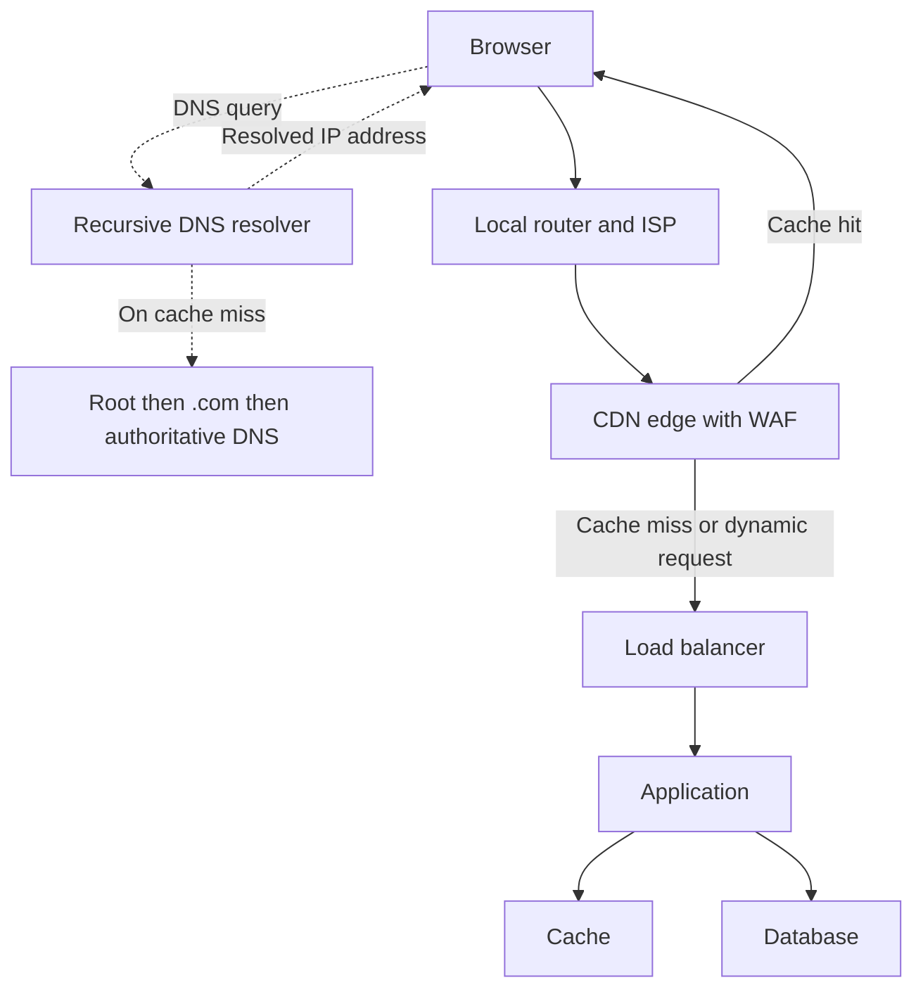
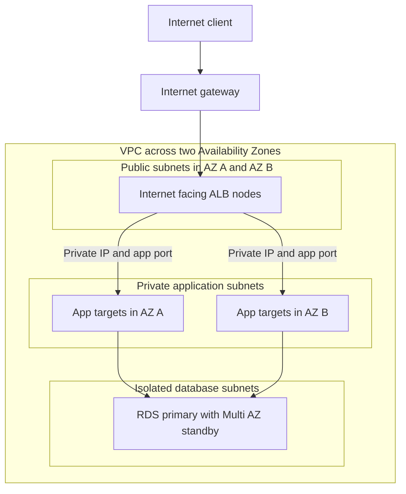
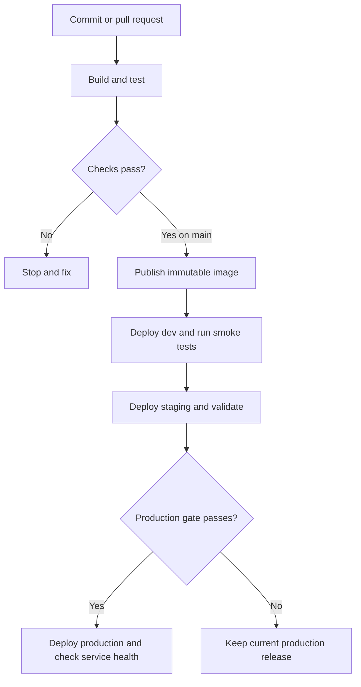
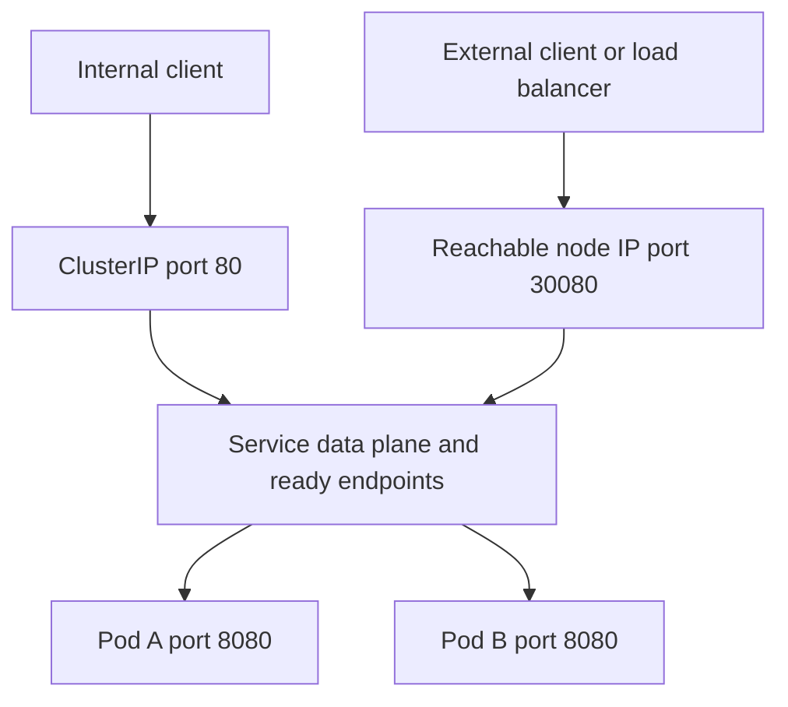
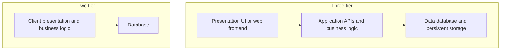
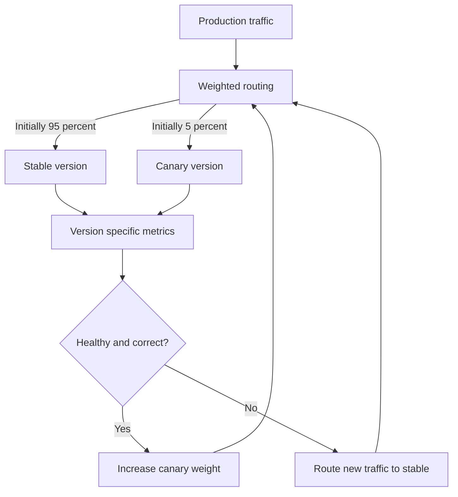
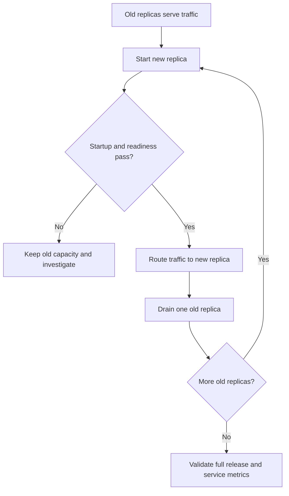
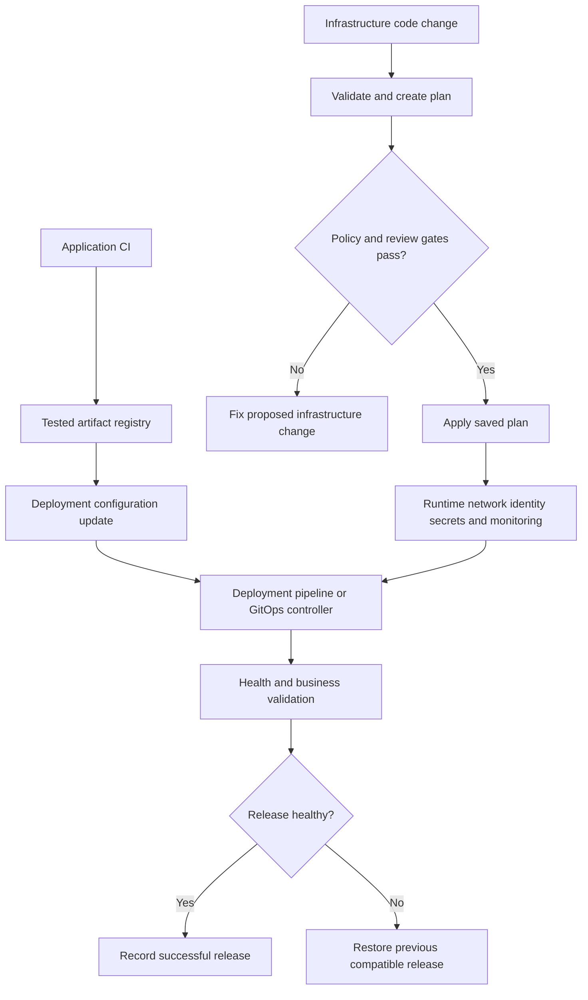

Below are detailed answers suited to **4.7 years of DevOps/Cloud/SRE experience**. The domain and architectures are illustrative. Adapt the automation experience answer to work you have actually done.

Downloadable copy: perfios_devops_cloud_sre_interview_guide.md[perfios_devops_cloud_sre_interview_guide.md](sandbox:/workspace/scratch/61f9f51eb5b1/perfios_devops_cloud_sre_interview_guide.md)

**1. What happens when a user enters `www.clarify.com` in a browser?**

The browser resolves the hostname to an IP address, establishes a connection, negotiates encryption for HTTPS, sends an HTTP request, and renders the response. Depending on the architecture, the request may pass through a CDN, WAF, load balancer, application server, and database.



The dotted arrows show DNS resolution. The solid arrows show an illustrative web request path. DNS provides the address used to make the connection.

1. **The browser interprets the URL.**

   For `https://www.clarify.com/orders`:

   - Protocol: HTTPS
   - Hostname: `www.clarify.com`
   - Default port: 443
   - Path: `/orders`

   Browser caches or a service worker may satisfy some requests locally. If the user explicitly enters HTTP, the browser might initially connect on port 80 and receive an HTTPS redirect. HSTS or browser HTTPS policies can upgrade the request earlier.

2. **DNS resolves the hostname.**

   The browser and operating system may already have a cached answer. Otherwise, the client queries a recursive DNS resolver.

   When the resolver needs to perform a lookup, it follows referrals:

   - Root DNS servers identify the servers responsible for `.com`.
   - `.com` servers identify the authoritative servers for the domain.
   - The authoritative server supplies the relevant records.

   An `A` record provides an IPv4 address; an `AAAA` record provides an IPv6 address. A `CNAME` can introduce an alias that requires further resolution. Answers are cached according to their TTL. Root servers generally return referrals rather than the website’s address. [RFC Editor](https://www.rfc-editor.org/rfc/rfc1034?utm_source=chatgpt.com)

3. **Packets travel through the network.**

   The operating system checks its routing table. For an off-subnet destination, it sends traffic to the default gateway.

   On the local network, ARP resolves the gateway’s MAC address for IPv4; IPv6 uses Neighbor Discovery. A home router may translate the client’s private IPv4 source address using NAT.

   ISP and internet routers forward packets toward the destination IP. BGP helps exchange routes between networks. Routers act on network addresses; the application endpoint handles the URL path.

4. **The browser establishes transport.**

   For HTTP/1.1 or HTTP/2 over a new TCP connection, the handshake is:

   - Client sends SYN.
   - Server sends SYN-ACK.
   - Client sends ACK.

   HTTP/3 uses QUIC over UDP and integrates TLS into connection establishment. Existing connections can also be reused. [MDN](https://developer.mozilla.org/en-US/docs/Glossary/HTTP_3?utm_source=chatgpt.com)

5. **HTTPS negotiates TLS.**

   The browser and server negotiate cryptographic parameters and establish encryption keys. The browser verifies the certificate’s hostname, validity, and trust chain.

   SNI usually identifies the requested hostname during the handshake. ALPN negotiates the application protocol, such as HTTP/2.

   The TLS endpoint might be a CDN or load balancer. Encryption from that intermediary to the application is configured separately. [RFC Editor](https://www.rfc-editor.org/rfc/rfc8446?utm_source=chatgpt.com)

6. **The browser sends an HTTP request.**

   An illustrative HTTP/1.1 request is:

   ```http
   GET /orders HTTP/1.1
   Host: www.clarify.com
   Accept: text/html
   ```

7. **The infrastructure processes it.**

   A CDN may return cached content. A cache miss or dynamic request reaches the origin.

   A WAF evaluates configured security rules. A load balancer chooses a target. The application checks authentication and authorization, executes business logic, and accesses caches or databases as needed.

8. **The browser receives and renders the response.**

   The response includes a status code, headers, and a body. The browser parses HTML and CSS, executes JavaScript, and requests additional images, scripts, fonts, and APIs. The physical internet route can differ between the request and response directions. [MDN](https://developer.mozilla.org/en-US/docs/Web/Performance/Guides/How_browsers_work?utm_source=chatgpt.com)

Useful troubleshooting commands:

```bash
dig www.clarify.com

curl -v https://www.clarify.com/

openssl s_client \
  -connect www.clarify.com:443 \
  -servername www.clarify.com
```

These help separate DNS, connectivity, TLS, and application problems.

**2. Explain AWS traffic architecture. How does traffic reach a private subnet?**

An **internet-facing ALB receives client connections through public subnets and forwards requests to application targets using their private IP addresses**. Those targets can run in private subnets without public IP addresses. [Elastic Load Balancing](https://docs.aws.amazon.com/elasticloadbalancing/latest/userguide/how-elastic-load-balancing-works.html?utm_source=chatgpt.com)



The request flow is:

1. Route 53 resolves the application hostname to the load balancer.
2. The client connects to the ALB’s public endpoint.
3. An HTTPS listener can terminate TLS using an ACM certificate.
4. Listener rules select the appropriate target group.
5. The ALB opens a backend connection to a target’s private IP, for example on port 8080.
6. The application accesses the database if required.
7. The application responds on the backend connection, and the ALB returns the response to the client.

For a VPC with CIDR `10.0.0.0/16`, an example routing configuration is:

| Subnets | VPC route | Internet default route |
|---|---|---|
| Public | `10.0.0.0/16 → local` | `0.0.0.0/0 → Internet Gateway` |
| Private application | `10.0.0.0/16 → local` | `0.0.0.0/0 → NAT Gateway`, if outbound access is needed |
| Isolated database | `10.0.0.0/16 → local` | Usually none |

The VPC route handles communication between the ALB and private application targets. AWS documents this public-load-balancer/private-server arrangement across multiple Availability Zones. [Amazon Virtual Private Cloud](https://docs.aws.amazon.com/vpc/latest/userguide/VPC_Scenario2.html?utm_source=chatgpt.com)

**Where does NAT fit?**

NAT supports connections initiated by private workloads toward the internet—for example, calling a third-party API. It does not admit unsolicited inbound connections.

In this ALB design, the response to an incoming request returns through the ALB’s backend connection. That response does not require a NAT gateway. VPC endpoints can provide private access to supported AWS services. [Amazon Virtual Private Cloud](https://docs.aws.amazon.com/vpc/latest/userguide/vpc-nat-gateway.html?utm_source=chatgpt.com)

Example security-group rules:

| Security group | Inbound permission |
|---|---|
| ALB SG | TCP 443 from intended clients |
| Application SG | TCP 8080 from the ALB SG |
| Database SG | TCP 5432 from the application SG |

Also permit the corresponding outbound and health-check traffic. Security groups are stateful. Network ACLs are stateless, so custom ACLs must permit return traffic and relevant ephemeral ports. [Amazon Virtual Private Cloud](https://docs.aws.amazon.com/vpc/latest/userguide/vpc-security-groups.html?utm_source=chatgpt.com)

For availability, distribute application replicas across AZs. In a conventional **RDS Multi-AZ DB instance deployment**, the standby supports failover and cannot serve reads. Read replicas and Multi-AZ DB clusters have different read-serving capabilities. [Amazon Relational Database Service](https://docs.aws.amazon.com/AmazonRDS/latest/UserGuide/Concepts.MultiAZSingleStandby.html?utm_source=chatgpt.com)

For EKS, ALB targets can be worker-node ports in instance target mode or directly reachable pod IPs in IP target mode. The actual path depends on the controller and networking configuration. [Elastic Load Balancing](https://docs.aws.amazon.com/elasticloadbalancing/latest/application/load-balancer-target-groups.html?utm_source=chatgpt.com)

**3. Do you use one pipeline for three environments or separate pipelines? Write a Groovy pipeline.**

A strong design is **one shared pipeline definition with environment-specific configuration and credentials**.

Build an immutable artifact once and promote the same image digest through dev, staging, and production. This ensures production receives the artifact validated in staging.

Separate deployment jobs are also valid when environments need independent release schedules or stricter access boundaries. Those jobs should reuse shared pipeline logic and consume the same validated artifact.



The following example uses **Jenkins Declarative Pipeline**, written in Groovy.

Assumptions:

- A multibranch Jenkins job with a Java/Maven application.
- A Dockerfile that packages the built JAR.
- An existing ECR repository and provisioned Kubernetes namespaces.
- Java, Maven, Docker, AWS CLI, Helm 3, kubectl, curl, and Bash on the agent.
- An AWS IAM role and environment-specific secret-file kubeconfigs.
- A Helm chart accepting `image.ref`, with values files for each environment.

Jenkins provides the stage, condition, credentials, timeout, and approval mechanisms used below. [jenkins.io](https://www.jenkins.io/doc/book/pipeline/syntax/?utm_source=chatgpt.com)

```groovy
def deployTo(String target) {
    withCredentials([file(
        credentialsId: "kubeconfig-${target}",
        variable: 'KUBECONFIG'
    )]) {
        withEnv(["TARGET_ENV=${target}"]) {
            sh '''#!/usr/bin/env bash
set -euo pipefail

helm upgrade --install orders ./helm/orders \
  --namespace "$TARGET_ENV" \
  --values "./helm/orders/values-${TARGET_ENV}.yaml" \
  --set-string image.ref="$IMAGE_REF" \
  --atomic --wait --timeout 5m

kubectl --namespace "$TARGET_ENV" \
  rollout status deployment/orders --timeout=120s

curl --fail --silent --show-error \
  --connect-timeout 5 --max-time 15 \
  --retry 3 --retry-delay 2 \
  "https://orders.${TARGET_ENV}.example.com/health/ready"
'''
        }
    }
}

pipeline {
    agent { label 'java-docker-aws' }

    options {
        skipDefaultCheckout(true)
        disableConcurrentBuilds()
        skipStagesAfterUnstable()
        timeout(time: 60, unit: 'MINUTES')
    }

    environment {
        AWS_REGION = 'ap-south-1'
        REGISTRY = '123456789012.dkr.ecr.ap-south-1.amazonaws.com'
        ECR_REPOSITORY = 'orders'
    }

    stages {
        stage('Checkout') {
            steps {
                checkout scm

                script {
                    env.RELEASE_TAG =
                        "${env.GIT_COMMIT}-${env.BUILD_NUMBER}"

                    env.IMAGE_REPOSITORY =
                        "${env.REGISTRY}/${env.ECR_REPOSITORY}"

                    env.IMAGE_TAG =
                        "${env.IMAGE_REPOSITORY}:${env.RELEASE_TAG}"
                }
            }
        }

        stage('Build') {
            steps {
                sh 'mvn -B -DskipTests clean package'
            }
        }

        stage('Test') {
            steps {
                sh 'mvn -B test'
            }

            post {
                always {
                    junit 'target/surefire-reports/*.xml'
                }
            }
        }

        stage('Publish image') {
            when { branch 'main' }

            steps {
                sh '''#!/usr/bin/env bash
set -euo pipefail

aws ecr get-login-password --region "$AWS_REGION" |
  docker login --username AWS --password-stdin "$REGISTRY"

docker build --tag "$IMAGE_TAG" .
docker push "$IMAGE_TAG"
'''
                script {
                    def digest = sh(
                        script: '''
aws ecr describe-images \
  --region "$AWS_REGION" \
  --repository-name "$ECR_REPOSITORY" \
  --image-ids imageTag="$RELEASE_TAG" \
  --query 'imageDetails[0].imageDigest' --output text
''',
                        returnStdout: true
                    ).trim()

                    if (!(digest ==~ /sha256:[0-9a-f]{64}/)) {
                        error('Registry did not return a valid image digest')
                    }

                    env.IMAGE_REF =
                        "${env.IMAGE_REPOSITORY}@${digest}"
                }
            }
        }

        stage('Deploy dev') {
            when { branch 'main' }
            steps {
                script { deployTo('dev') }
            }
        }

        stage('Deploy staging') {
            when { branch 'main' }
            steps {
                script { deployTo('staging') }
            }
        }

        stage('Deploy production') {
            when { branch 'main' }

            steps {
                timeout(time: 20, unit: 'MINUTES') {
                    input(
                        message: "Promote ${env.IMAGE_REF} to production?",
                        submitter: 'release-managers'
                    )
                }

                script { deployTo('prod') }
            }
        }
    }

    post {
        success {
            echo 'All applicable pipeline stages succeeded.'
        }

        failure {
            echo 'Pipeline failed. Inspect tests, rollout, and smoke checks.'
        }
    }
}
```

How it works:

- Pull requests build and test.
- The `main` branch publishes the image and deploys it.
- The registry returns the image digest.
- Dev, staging, and production receive the same `IMAGE_REF`.
- Credentials and values differ by environment.
- A failed stage prevents later promotion.

The Helm Deployment template would use:

```yaml
image: {{ .Values.image.ref | quote }}
```

For production, extend this with integration tests, vulnerability and secret scans, business smoke tests, and release health metrics. Run untrusted PR code on isolated agents without production credentials or a privileged shared Docker socket.

**Rollback detail:** Helm 3 `--atomic` can roll back an upgrade that fails within Helm. A separate smoke test that fails after Helm completes requires an additional rollback policy. The production approval is a governance choice; continuous deployment can use automated gates instead. [Helm](https://helm.sh/docs/v3/helm/helm_upgrade?utm_source=chatgpt.com)

The example’s embedded shell blocks were syntax-checked. The pipeline requires your actual repository and infrastructure configuration before execution.

**4. What is the difference between ClusterIP and NodePort?**

A Kubernetes Service provides a stable endpoint while pods change.

**ClusterIP** exposes a cluster-internal virtual IP and DNS name. **NodePort** additionally exposes the Service through eligible node IP addresses and an allocated port.

| Property | ClusterIP | NodePort |
|---|---|---|
| Default Service type | Yes | No |
| Address used | Service DNS or `ClusterIP:port` | `NodeIP:nodePort`, or ClusterIP internally |
| Main use | Internal service communication | External load-balancer integration or direct node access |
| External access | Through an ingress, gateway, or frontend | Requires routing and firewall access to nodes |
| Node port range | Not applicable | Default `30000–32767`; configurable |
| Public IP allocated automatically | No | No |

A NodePort Service also retains a ClusterIP. [Kubernetes](https://kubernetes.io/docs/concepts/services-networking/service/?utm_source=chatgpt.com)



Example:

```yaml
apiVersion: v1
kind: Service
metadata:
  name: orders
spec:
  type: NodePort
  selector:
    app: orders
  ports:
    - name: http
      port: 80
      targetPort: 8080
      nodePort: 30080
```

The ports have different purposes:

- `port: 80`: the Service port.
- `targetPort: 8080`: the selected pod endpoint’s port.
- `nodePort: 30080`: the additional node-level port.

For ClusterIP, set `type: ClusterIP` and remove `nodePort`.

The Service data plane is commonly implemented by kube-proxy or an equivalent networking implementation. With the default cluster-wide external traffic policy, a node can forward to a ready pod on another node. `externalTrafficPolicy: Local` changes that behavior and requires appropriate load-balancer health checks. [Kubernetes](https://kubernetes.io/docs/reference/networking/virtual-ips/?utm_source=chatgpt.com)

NodePort does not make a private node publicly reachable. Network routing, security groups, and firewalls must permit the connection.

**5. What does three-tier architecture look like? Compare it with two-tier.**

Three-tier architecture separates:

1. **Presentation:** UI and frontend.
2. **Application:** APIs and business logic.
3. **Data:** databases and persistent storage.

These are logical responsibilities. Each tier can contain multiple instances or managed services.



For an order application:

- The presentation tier displays the checkout page.
- The application tier validates the order, applies pricing, and coordinates payment.
- The data tier stores orders, customers, and payment records.

An AWS implementation might use:

- S3/CloudFront or web servers for presentation.
- ECS, EKS, or EC2 for application APIs.
- RDS for relational data.

A common two-tier example is a desktop application containing presentation and business logic that connects directly to a database. Another two-tier arrangement combines presentation and business logic in a web application, with the database forming the second tier.

| Dimension | Two-tier | Three-tier |
|---|---|---|
| Separation | Two deployment responsibilities | Presentation, application, and data separated |
| Scaling | Combined responsibilities often scale together | Tiers can scale independently |
| Security | Rich clients may require direct database access | Database access can be restricted to the application tier |
| Changes | Greater coupling between combined responsibilities | APIs separate frontend and backend changes |
| Operations | Usually simpler for small systems | More components and observability requirements |
| Example | Small internal application | Web application with independently growing UI and APIs |

Three tiers do not automatically provide high availability. Each tier still needs appropriate redundancy and failure handling.

Also, **three-tier architecture and microservices are different concepts**. The application tier could be one monolithic application or many services.

**6. What are ALB and NLB? When should you use each?**

An **Application Load Balancer** performs application-layer routing. A **Network Load Balancer** handles transport-layer flows and connections.

| Requirement | ALB | NLB |
|---|---|---|
| Main layer | Layer 7 | Layer 4 |
| Common protocols | HTTP/HTTPS, HTTP/2, gRPC, WebSockets | TCP, TLS, UDP and supported combinations; current documentation also includes QUIC |
| URL/path routing | Supported | No HTTP path inspection |
| Hostname routing | Supported | No HTTP host inspection |
| TLS | HTTPS termination; backend encryption can be configured | TLS termination or TCP passthrough |
| Frontend addresses | Standard addresses can change; use DNS | Static address per enabled AZ; optional Elastic IPs |
| Direct AWS WAF association | Supported | Not supported |
| Typical use | Websites, APIs, HTTP microservices | TCP/UDP services and fixed-IP requirements |

These capabilities are documented separately for ALB, NLB, and NLB listeners. [Elastic Load Balancing](https://docs.aws.amazon.com/elasticloadbalancing/latest/application/introduction.html?utm_source=chatgpt.com)

**Use ALB when HTTP routing matters.**

For example:

- `/orders` goes to the orders target group.
- `/payments` goes to the payments target group.
- Different hostnames route to different applications.

**Use NLB when transport behavior or static IPs matter.**

Examples:

- A custom TCP application.
- A UDP service.
- Clients that must allowlist fixed ingress IP addresses.
- An endpoint service exposed through AWS PrivateLink. [Amazon Virtual Private Cloud](https://docs.aws.amazon.com/vpc/latest/privatelink/create-endpoint-service.html?utm_source=chatgpt.com)

NLB can carry HTTPS traffic too. Choose ALB when the load balancer needs to inspect HTTP and make routing decisions from it.

Both support internal and internet-facing deployments and private targets.

**NLB supports security groups.** Associate them when creating the load balancer. If an NLB is created without security groups, they cannot be added later. [Elastic Load Balancing](https://docs.aws.amazon.com/elasticloadbalancing/latest/network/load-balancer-security-groups.html?utm_source=chatgpt.com)

Client IP preservation on NLB depends on protocol, target type, and configuration. ALB commonly supplies the original address through `X-Forwarded-For`; the application must interpret that header using a trusted proxy configuration.

**7. Write a shell script to sum numbers from 1 to 100. What is the result?**

```bash
#!/usr/bin/env bash
set -euo pipefail

total=0

for ((i = 1; i <= 100; i++)); do
    total=$((total + i))
done

printf '%d\n' "$total"
```

Output:

```text
5050
```

The arithmetic-series formula confirms it:

\[
S=\frac{n(n+1)}{2}
 =\frac{100\times101}{2}
 =5050
\]

The loop uses O(n) time and O(1) additional space. The formula uses O(1) time.

Using assignment for the addition works cleanly with `set -e`. A standalone arithmetic command can return a failure status when its expression evaluates to zero.

**8. Canary deployment versus blue-green deployment**

**Canary** gradually exposes a new version to production traffic and expands exposure when metrics pass.

**Blue-green** prepares a separate release environment, validates it, and switches production routing from the current environment to the new one.



A canary progression could be:

- 5% of traffic to v2.
- Increase to 25% after validation.
- Increase to 50%.
- Promote to 100%.

At every step, examine version-specific error rate, latency, saturation, and business outcomes. For a payment service, payment success matters alongside HTTP status codes.

Wait for enough representative traffic. A fixed pause without sufficient samples can miss problems.

For blue-green:

- Blue serves production using v1.
- Green runs v2 and receives preview tests.
- After validation, routing switches new production requests to green.
- Blue remains available during the rollback window.
- Existing connections are drained.

| Dimension | Canary | Blue-green |
|---|---|---|
| Traffic transition | Gradual | Planned switch |
| Initial exposure | Limited traffic share or cohort | Most new traffic after cutover |
| Capacity | Depends on replica and routing design | Often close to two application environments temporarily |
| Validation | Real production behavior during rollout | Preview tests followed by production monitoring |
| Rollback | Reduce canary weight to zero | Switch routing back |
| Main challenge | Reliable metrics and traffic control | Parallel capacity, shared state, and cutover |

Argo Rollouts supports both strategies. Replica ratios alone approximate request percentages; explicit traffic routing provides better control. [Kubernetes Progressive Delivery Controller](https://argo-rollouts.readthedocs.io/en/stable/features/canary/?utm_source=chatgpt.com)

Neither strategy automatically reverses database writes or schema changes. Also, switching routing for new requests does not migrate existing TCP or WebSocket connections.

**9. How do you achieve a zero-downtime application upgrade?**

Keep sufficient healthy old instances serving while new instances start. Validate the new instances before directing traffic to them, then drain old instances before terminating them.



For Kubernetes, a rolling Deployment can provide the replacement mechanism:

```yaml
apiVersion: apps/v1
kind: Deployment
metadata:
  name: orders
spec:
  replicas: 3
  minReadySeconds: 10
  progressDeadlineSeconds: 600

  strategy:
    type: RollingUpdate
    rollingUpdate:
      maxUnavailable: 0
      maxSurge: 1

  selector:
    matchLabels:
      app: orders

  template:
    metadata:
      labels:
        app: orders

    spec:
      terminationGracePeriodSeconds: 60

      containers:
        - name: orders
          image: registry.example.com/orders:2.0.0

          ports:
            - name: http
              containerPort: 8080

          resources:
            requests:
              cpu: 100m
              memory: 128Mi
            limits:
              cpu: 500m
              memory: 512Mi

          startupProbe:
            httpGet:
              path: /health/live
              port: http
            periodSeconds: 5
            failureThreshold: 30

          readinessProbe:
            httpGet:
              path: /health/ready
              port: http
            periodSeconds: 5
            timeoutSeconds: 2

          livenessProbe:
            httpGet:
              path: /health/live
              port: http
            periodSeconds: 10
            timeoutSeconds: 2
            failureThreshold: 3
```

Replace the illustrative image and implement the health endpoints. Production releases should use the actual image digest.

The rollout settings mean:

- **`replicas: 3`:** maintain three desired replicas.
- **`maxUnavailable: 0`:** the rollout controller does not deliberately reduce available replicas below the desired count.
- **`maxSurge: 1`:** allow an additional replica during replacement.
- **`minReadySeconds: 10`:** require a new pod to remain ready before counting it as available.
- **`progressDeadlineSeconds: 600`:** report stalled progress.

Reserve spare capacity. A new pod can remain Pending if resources are unavailable, and terminating pods can temporarily consume additional capacity. A standard Deployment reports a progress deadline failure; it does not automatically roll back. [Kubernetes](https://kubernetes.io/docs/concepts/workloads/controllers/deployment/?utm_source=chatgpt.com)

The probes have different roles:

- **Startup:** gives a slow-starting application time to initialize.
- **Readiness:** determines whether it should receive traffic.
- **Liveness:** detects a local condition requiring a restart.

A temporary shared-database failure should not automatically cause every application pod to restart. Poor liveness checks can amplify an outage. [Kubernetes](https://kubernetes.io/docs/concepts/configuration/liveness-readiness-startup-probes/?utm_source=chatgpt.com)

The rest of the design is equally important:

- **Graceful shutdown:** on SIGTERM, finish in-flight work within the grace period. Coordinate endpoint propagation, load-balancer deregistration, and application shutdown. A measured `preStop` hook or delay may be required; its duration consumes the termination grace period. Handle long-lived connections explicitly. [Kubernetes](https://kubernetes.io/docs/concepts/workloads/pods/pod-lifecycle/?utm_source=chatgpt.com)
- **Compatible database migrations:** use expand-and-contract changes. For a column rename, add the new field, deploy compatible reads/writes, backfill safely, migrate all versions, and remove the old field after the rollback window. Evaluate database locking and backfill load.
- **Compatible interfaces:** old and new releases coexist. Preserve API and message-schema compatibility.
- **Shared session handling:** avoid relying on a session that exists only in one pod’s memory. Use a suitable shared store or stateless token design.
- **Resilient placement:** distribute replicas across nodes and AZs. A PodDisruptionBudget can protect against supported voluntary evictions, such as node drains; it does not control a Deployment’s own rolling update. [Kubernetes](https://kubernetes.io/docs/concepts/workloads/pods/disruptions/?utm_source=chatgpt.com)
- **Verification:** test real transactions and monitor errors, latency, and business outcomes.
- **Rollback:** retain the previous image digest and configuration, with database compatibility intact.

Example commands:

```bash
kubectl -n prod rollout status deployment/orders --timeout=300s

# Revert to the previous recorded workload-template revision if appropriate:
kubectl -n prod rollout undo deployment/orders
```

`rollout undo` does not reverse database migrations. With GitOps, also restore the desired release in Git so reconciliation preserves the rollback.

Zero downtime is an outcome to validate under realistic traffic; multiple replicas alone do not establish it.

**10. Have you contributed automation initiatives in your current company?**

Use a real example that explains:

- The operational problem.
- Your responsibility.
- What you implemented.
- Failure handling and safeguards.
- A measured outcome.

Here is a template to adapt:

> Our deployment process required engineers to build packages, copy files to servers, update configuration, and restart services manually. It was slow and produced configuration differences between environments.
>
> I implemented a shared CI/CD workflow that ran tests, built a versioned container image, and promoted the same image through the environments. I moved deployment configuration into Helm and provisioned the platform through reusable Terraform modules.
>
> I scoped credentials by environment, added post-deployment health checks, and documented the rollback procedure. I also recorded the deployed image and commit so releases were traceable.
>
> Deployment time reduced from [actual before] to [actual after], manual steps reduced from [before] to [after], and we observed [actual improvement in failures or recovery time].

Other useful examples include:

- Self-service environment provisioning.
- Backup verification.
- Certificate renewal with validation.
- Infrastructure drift detection.
- Idle-resource cleanup.
- Automated incident diagnostics.

Choose an initiative you can explain deeply. Expect questions such as:

- Was it idempotent?
- What happened after a partial failure?
- How did you prevent overlapping runs?
- How were credentials scoped?
- How did you measure the improvement?

Explain one concrete failure you handled. That demonstrates operational understanding beyond tool familiarity.

**11. CI builds a package. How do you build the deployment platform and eliminate manual dependency?**

Build the platform declaratively through infrastructure as code, then provide a repeatable application-deployment interface.

An artifact needs:

- A runtime.
- Networking and traffic routing.
- Identity and permissions.
- Configuration and secrets.
- Storage and databases.
- Logging, metrics, and alerts.



A practical approach is:

1. **Choose the runtime.**

   Use EC2/Auto Scaling for an instance-based application, ECS/Fargate for managed containers, or EKS when Kubernetes capabilities and operational ownership are justified.

2. **Provision the foundation through code.**

   Terraform or CloudFormation can create VPCs, subnets, routes, load balancers, runtime capacity, IAM roles, databases, DNS, certificates, and monitoring.

   Version reusable modules. Store state remotely with access control and use a backend supporting locking. Separate production state and permissions from lower environments. [HashiCorp Developer](https://developer.hashicorp.com/terraform/language/state/locking?utm_source=chatgpt.com)

3. **Validate and review the proposed change.**

   Run formatting, validation, security/policy checks, and a plan. Apply the reviewed saved plan for the same commit. [HashiCorp Developer](https://developer.hashicorp.com/terraform/cli/commands/plan?utm_source=chatgpt.com)

   ```bash
   terraform init -input=false

   terraform fmt -check -recursive

   terraform validate

   terraform plan -input=false -out=tfplan

   # Apply after configured checks and review gates:
   terraform apply -input=false tfplan
   ```

   Plan files can contain sensitive values, so protect them as deployment artifacts.

4. **Bootstrap the runtime automatically.**

   For EC2, use versioned machine images and automated initialization/configuration.

   For containers, define workloads, resource requirements, probes, autoscaling, ingress, and deployment policies. Provision secret access and monitoring alongside them.

5. **Deploy with versioned configuration.**

   Helm charts, ECS task definitions, or another declarative interface bind an artifact digest to environment settings.

   Keep secrets outside images and source control. Use a managed secret store and scoped workload identity.

6. **Automate delivery or use GitOps.**

   A deployment pipeline can update the target directly.

   With GitOps, CI updates the release reference in Git, and a controller such as Argo CD reconciles the target with the declared state. Automated sync, pruning, and self-healing are separate policy choices to enable deliberately. [Declarative GitOps CD for Kubernetes](https://argo-cd.readthedocs.io/en/stable/user-guide/auto_sync/?utm_source=chatgpt.com)

7. **Verify and recover.**

   Run health checks and business transactions, observe service objectives, record the deployed version, and use a defined rollback procedure.

The initial trust setup still needs a bootstrap process: cloud account, identity, state backend, and CI/controller permissions. Subsequent provisioning and releases can run automatically within that boundary.

This removes the routine need to SSH into servers, copy packages, or manually create deployment resources. Production approval may remain as a governance gate.

Platform provisioning usually has its own lifecycle. Ordinary application releases reuse that platform. For self-service, provide validated templates and a service catalog so teams can request supported environments without waiting for a particular engineer.

**12. After a GitHub commit, what validations do you perform? Before or after commit?**

**Validate at multiple points.** Fast local checks provide early feedback; central CI checks enforce shared requirements after push and during pull requests.

A local commit that has not been pushed does not trigger GitHub’s repository workflows.

| Point | Example checks | Purpose |
|---|---|---|
| Before local commit | Formatting, linting, fast unit tests, secret detection | Fast feedback |
| After push or PR update | Reproducible build, tests, static analysis, dependency checks, IaC checks | Validate the proposed change |
| Before merge | Required CI results, reviews, resolved discussions, base-branch integration | Protect the main branch |
| After merge | Build the release revision, scan and publish artifacts, deploy lower environments | Validate the release candidate |
| After deployment | Smoke tests, synthetic transactions, logs, metrics, service objectives | Validate running behavior |

Examples:

```bash
# Java build, tests, and configured verification checks
mvn -B verify

# Terraform checks
terraform fmt -check -recursive
terraform validate
```

Add checks appropriate to the stack:

- Unit and integration tests.
- Static code analysis.
- Dependency vulnerability scanning.
- Secret detection.
- Container-image scanning.
- Terraform and Kubernetes policy checks.

Container scanning matters because base images and operating-system packages introduce dependencies beyond the application manifest.

Local hooks are useful but can be skipped. Protect the main branch through required checks and review rules.

Also validate against the current base branch or use a merge queue when appropriate. Two branches can pass independently and fail when combined. [GitHub Docs](https://docs.github.com/en/repositories/configuring-branches-and-merges-in-your-repository/managing-protected-branches/about-protected-branches?utm_source=chatgpt.com)

The production artifact should be traceable to the validated release revision. For GitHub Actions, isolate untrusted PR jobs, grant minimal token permissions, avoid exposing production secrets to untrusted code, and pin external actions to reviewed full commit SHAs. [GitHub Docs](https://docs.github.com/en/actions/security-for-github-actions/security-guides/security-hardening-for-github-actions?utm_source=chatgpt.com)

**13. Write a shell script that prints consecutive numbers in a triangular pattern, with every row reversed.**

Assume **N means the number of rows**, and numbering starts at 1.

For `N = 5`:

```text
1
3 2
6 5 4
10 9 8 7
15 14 13 12 11
```

Each row consumes the next consecutive numbers, then prints that group in reverse.

```bash
#!/usr/bin/env bash
set -euo pipefail

if (( $# == 0 )); then
    read -r -p "Enter N (number of rows): " n
elif (( $# == 1 )); then
    n=$1
else
    printf 'Usage: %s [number_of_rows]\n' "$0" >&2
    exit 1
fi

if [[ ! "$n" =~ ^[0-9]+$ ]]; then
    printf 'N must be a positive integer.\n' >&2
    exit 1
fi

# Interpret digit strings as decimal, including inputs such as 05.
n=$((10#$n))

if (( n < 1 )); then
    printf 'N must be greater than zero.\n' >&2
    exit 1
fi

next=1

for ((row = 1; row <= n; row++)); do
    end=$((next + row - 1))

    for ((value = end; value >= next; value--)); do
        printf '%d' "$value"

        if (( value > next )); then
            printf ' '
        fi
    done

    printf '\n'
    next=$((end + 1))
done
```

Run it with:

```bash
bash triangle.sh 5
```

For row 4:

- `next` is 7.
- The row contains four numbers.
- Its last number is `7 + 4 - 1 = 10`.
- Printing backward produces `10 9 8 7`.
- The next row starts at 11.

After N rows, the largest allocated number is:

\[
\frac{N(N+1)}{2}
\]

Printing takes **O(N²) time** because that many numbers are produced, and **O(1) additional space**. Values must fit Bash’s integer range.

Both shell scripts passed Bash syntax checks and executable examples. The triangle checks included normal input, leading zeros, prompted input, and invalid inputs.
