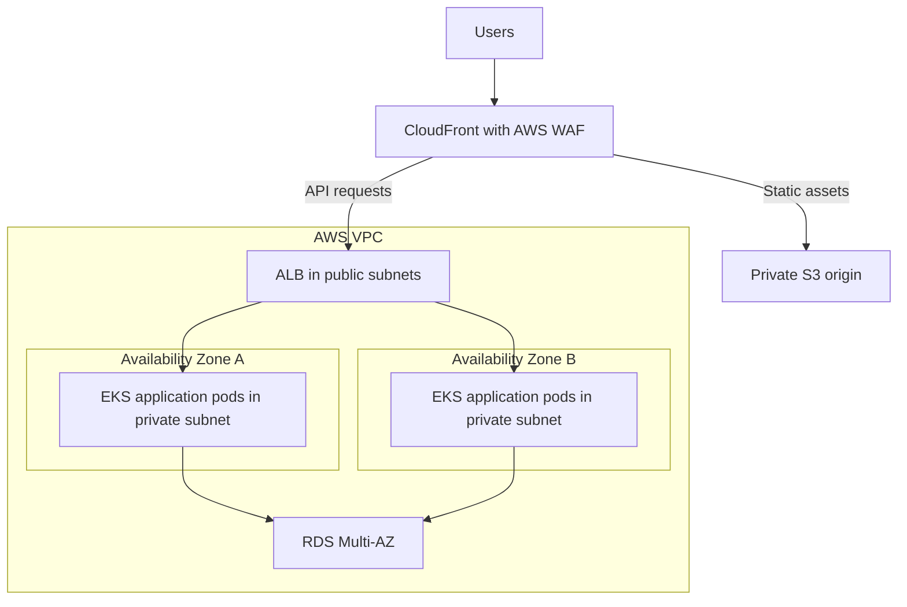
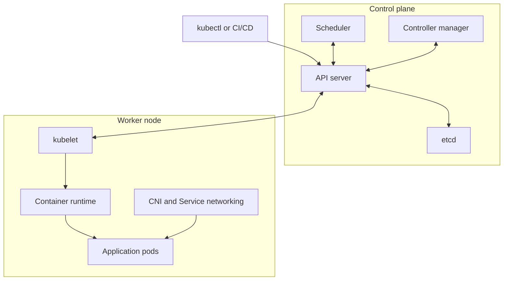
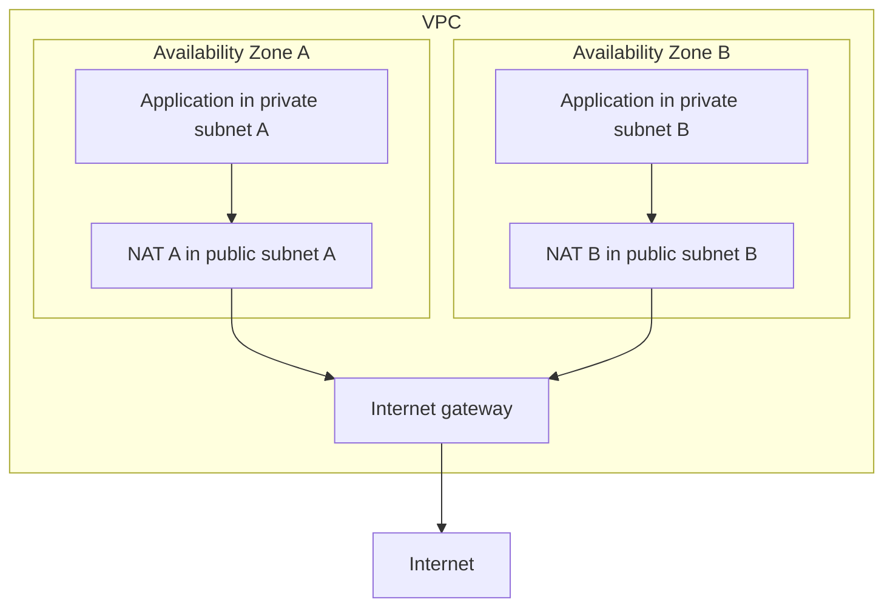

These answers are aimed at a **9-year overall experience / 5-year DevOps profile**. In an interview, explain the concept, give an example, and describe the production decisions you would make.

The current-project answer below is a **sample**. Replace the domain, tools, responsibilities, and results with your actual experience.

### 1. Explain your current project and your activities in it

**Sample interview answer:**

> “My current project is an AWS-hosted application built using microservices. The applications run on Amazon EKS, container images are stored in ECR, and we maintain development, staging, and production environments.
>
> Infrastructure is managed through CloudFormation. GitHub Actions handles application builds, testing, security scanning, and image publishing. We use Helm and Argo CD to deploy versioned application configurations to Kubernetes.
>
> My responsibilities include maintaining CI/CD pipelines, managing Kubernetes upgrades and scaling, configuring AWS networking and IAM, implementing monitoring, and handling production incidents. I also work with developers to improve application reliability and deployment safety.”

**Example architecture:**



In this example, the AWS Load Balancer Controller configures the ALB from Kubernetes resources, and the ALB uses Pod IP targets.

**Explain your activities through ownership:**

| Area | Example responsibilities |
|---|---|
| CI/CD | Maintain reusable workflows, tests, image scanning, release promotion, and rollback procedures |
| Kubernetes | Manage deployments, resource requests, autoscaling, scheduling, upgrades, and troubleshooting |
| Infrastructure | Maintain reusable infrastructure templates and review changes before deployment |
| Observability | Build dashboards and alerts for latency, errors, traffic, and resource saturation |
| Security | Configure IAM roles, workload permissions, secrets, and access controls |
| Reliability | Handle incidents, write postmortems, test recovery, and remove recurring operational problems |

**A useful incident example to adapt:**

> “After a release, some pods repeatedly restarted. I checked deployment events, previous container logs, and memory usage, and identified OOM kills. I restored the previous application version, then worked with the developers to investigate memory growth and validate resource settings under load.”

For a senior profile, finish with a **measured result**: deployment duration, failure rate, availability, infrastructure cost, or MTTR. Use numbers you can substantiate.

### 2. Explain Kubernetes architecture

Kubernetes consists of a **control plane**, which manages cluster state, and **worker nodes**, which run application workloads.



| Component | Responsibility |
|---|---|
| **kube-apiserver** | Exposes the Kubernetes API and processes cluster operations |
| **etcd** | Stores cluster configuration and Kubernetes object state |
| **kube-scheduler** | Selects suitable nodes for unscheduled pods |
| **kube-controller-manager** | Runs controllers that reconcile actual state with desired state |
| **cloud-controller-manager** | Provides cloud integration, where applicable |
| **kubelet** | Ensures assigned pods and containers run on its node |
| **Container runtime** | Runs containers, commonly through containerd or CRI-O |
| **kube-proxy or an alternative implementation** | Implements Service networking |
| **CNI plugin** | Provides Pod networking |
| **CoreDNS** | Provides DNS-based service discovery |

Kubernetes supports alternative networking implementations, so kube-proxy is optional in some architectures. [Kubernetes](https://kubernetes.io/docs/concepts/overview/components/?utm_source=chatgpt.com)

**What happens when you deploy an application?**

1. `kubectl apply` submits a Deployment to the API server.
2. The API server validates the request and stores the object.
3. The Deployment controller creates a ReplicaSet; the ReplicaSet creates Pod objects.
4. The scheduler selects nodes for those pods.
5. Each node’s kubelet coordinates with the runtime and networking components to start its assigned pods.

Controllers continuously reconcile the cluster toward the declared state—for example, creating a replacement Pod when a managed Pod disappears. [Kubernetes](https://kubernetes.io/docs/concepts/workloads/controllers/deployment/?utm_source=chatgpt.com)

### 3. How do you upgrade a Kubernetes cluster?

**Interview answer:**

> “I treat a Kubernetes upgrade as a planned production change. I check API compatibility, node capacity, add-ons, and recovery options; test the upgrade in a lower environment; then upgrade the control plane and nodes in controlled stages.”

**My approach:**

1. **Assess readiness:** Check cluster health, deprecated APIs, admission webhooks, ingress controllers, CNI, CSI, and monitoring compatibility.
2. **Prepare recovery:** Back up application data and configuration. For a self-managed control plane, take and verify an etcd backup.
3. **Prepare workloads:** Check replicas, readiness probes, PodDisruptionBudgets, spare capacity, and workloads using local storage.
4. **Test:** Rehearse the upgrade and run application smoke tests in staging.
5. **Upgrade in stages:** Upgrade the control plane, then nodes and related components according to the deployment tool’s supported procedure.
6. **Validate:** Check DNS, networking, storage, scheduling, application latency, errors, and critical transactions. [Amazon EKS](https://docs.aws.amazon.com/eks/latest/best-practices/cluster-upgrades.html?utm_source=chatgpt.com)

**For a kubeadm cluster:**

- Upgrade one minor version at a time.
- Install the appropriate target `kubeadm` package.
- Run `kubeadm upgrade plan`.
- Use `kubeadm upgrade apply` on the first control-plane node.
- Use `kubeadm upgrade node` on additional control-plane nodes and workers.
- Drain nodes before their kubelet upgrade, update packages, restart kubelet, and uncordon after validation. [Kubernetes](https://kubernetes.io/docs/tasks/administer-cluster/kubeadm/kubeadm-upgrade/?utm_source=chatgpt.com)

Example node-maintenance commands:

```bash
kubectl drain worker-1 --ignore-daemonsets

# Perform the planned node upgrade and restart kubelet.

kubectl uncordon worker-1
```

If draining is blocked, investigate PDBs, insufficient capacity, or local-storage dependencies before proceeding.

**Version skew matters:** kubelet must not be newer than the API server. Current upstream policy permits kubelet to be up to three minor versions older, with additional restrictions for older releases and deployment tools. [Kubernetes](https://kubernetes.io/releases/version-skew-policy/?utm_source=chatgpt.com)

**For Amazon EKS:** AWS manages the control-plane upgrade. I review upgrade insights, upgrade one minor version, then manage worker-node and add-on updates. A new node group followed by controlled workload migration is often a useful approach. [Amazon EKS](https://docs.aws.amazon.com/eks/latest/userguide/update-cluster.html?utm_source=chatgpt.com)

**Recovery detail:** Current EKS documentation supports rollback to the previous minor version **within seven days**, subject to eligibility and compatibility checks. Worker nodes and add-ons require separate handling; this does not restore application data to an earlier point. [Amazon EKS](https://docs.aws.amazon.com/eks/latest/userguide/rollback-cluster.html?utm_source=chatgpt.com)

### 4. Explain Pod affinity and Node affinity

Affinity controls **where pods are scheduled**.

| Mechanism | Uses labels on | Example |
|---|---|---|
| **Node affinity** | Nodes | Run a workload on nodes labelled `workload=payments` |
| **Pod affinity** | Other pods | Prefer placing an application near its cache |
| **Pod anti-affinity** | Other pods | Separate replicas across nodes |

There are two common rule strengths:

- **`requiredDuringSchedulingIgnoredDuringExecution`**: A hard scheduling requirement.
- **`preferredDuringSchedulingIgnoredDuringExecution`**: A preference that the scheduler can relax.

`IgnoredDuringExecution` means a later label change does not automatically evict an already scheduled Pod. [Kubernetes](https://kubernetes.io/docs/concepts/scheduling-eviction/assign-pod-node/?utm_source=chatgpt.com)

**Node affinity example**, placed under a Deployment’s `spec.template.spec`:

```yaml
affinity:
  nodeAffinity:
    requiredDuringSchedulingIgnoredDuringExecution:
      nodeSelectorTerms:
        - matchExpressions:
            - key: workload
              operator: In
              values:
                - payments
```

The Pod requires a node with the matching label. If no eligible node has sufficient resources, it remains Pending. [Kubernetes](https://kubernetes.io/docs/tasks/configure-pod-container/assign-pods-nodes-using-node-affinity/?utm_source=chatgpt.com)

**Pod affinity example:** Prefer the same zone as pods labelled `app=cache`:

```yaml
affinity:
  podAffinity:
    preferredDuringSchedulingIgnoredDuringExecution:
      - weight: 100
        podAffinityTerm:
          labelSelector:
            matchLabels:
              app: cache
          topologyKey: topology.kubernetes.io/zone
```

The `topologyKey` defines what “near” means: the same node, zone, or another labelled topology domain.

**Production consideration:** Hard Pod anti-affinity can prevent additional replicas from scheduling when there are too few eligible nodes. For three replicas with required hostname anti-affinity, you need at least three eligible nodes. [Kubernetes](https://kubernetes.io/docs/concepts/scheduling-eviction/assign-pod-node/?utm_source=chatgpt.com)

### 5. Explain HPA and VPA

| Aspect | HPA | VPA |
|---|---|---|
| Full form | Horizontal Pod Autoscaler | Vertical Pod Autoscaler |
| Changes | Number of replicas | CPU and memory requests; limits according to policy |
| Example | Increase from 3 to 8 pods | Increase each Pod’s memory request |
| Typical use | Workloads that can scale through more replicas | Resource sizing and workloads needing larger pods |

**HPA**

HPA adjusts replicas using CPU, memory, or custom/external metrics. CPU utilization targets are calculated relative to **CPU requests**. Resource metrics commonly come from Metrics Server; custom metrics require an appropriate metrics integration. [Kubernetes](https://kubernetes.io/docs/tasks/run-application/horizontal-pod-autoscale/?utm_source=chatgpt.com)

Example:

```yaml
apiVersion: autoscaling/v2
kind: HorizontalPodAutoscaler
metadata:
  name: checkout-hpa
spec:
  scaleTargetRef:
    apiVersion: apps/v1
    kind: Deployment
    name: checkout
  minReplicas: 3
  maxReplicas: 10
  metrics:
    - type: Resource
      resource:
        name: cpu
        target:
          type: Utilization
          averageUtilization: 60
```

The target Deployment must have suitable CPU requests configured. [Kubernetes](https://kubernetes.io/docs/tasks/run-application/horizontal-pod-autoscale-walkthrough/?utm_source=chatgpt.com)

A simplified calculation is:

\[
\text{desired replicas}
=
\left\lceil
\text{current replicas}
\times
\frac{\text{current utilization}}{\text{target utilization}}
\right\rceil
\]

For 3 replicas at 90% utilization and a 60% target:

\[
\left\lceil 3 \times \frac{90}{60} \right\rceil = 5
\]

The real controller also considers readiness, missing metrics, tolerance, and scaling policies. [Kubernetes](https://kubernetes.io/docs/tasks/run-application/horizontal-pod-autoscale/?utm_source=chatgpt.com)

**VPA**

VPA is installed separately and includes:

- A **recommender** that calculates resource recommendations.
- An **updater** that applies changes through eviction or supported in-place updates.
- An **admission controller** that applies recommendations when pods are created.

Common modes include `Off` for recommendations, `Initial` for Pod creation, and `Recreate` for eviction and recreation. In-place modes depend on the installed VPA version and cluster capabilities. [Kubernetes](https://kubernetes.io/docs/concepts/workloads/autoscaling/vertical-pod-autoscale/?utm_source=chatgpt.com)

A useful starting configuration is recommendation-only mode:

```yaml
apiVersion: autoscaling.k8s.io/v1
kind: VerticalPodAutoscaler
metadata:
  name: checkout-vpa
spec:
  targetRef:
    apiVersion: apps/v1
    kind: Deployment
    name: checkout
  updatePolicy:
    updateMode: "Off"
```

**Production decision:** Because VPA changes requests, it can change the utilization percentage observed by a CPU-based HPA. I therefore start with recommendation-only VPA, or use a carefully designed combination such as HPA driven by queue depth.

Also plan node capacity: increasing replicas or resource requests can leave pods Pending when the cluster lacks sufficient resources. [Kubernetes](https://kubernetes.io/docs/tasks/run-application/horizontal-pod-autoscale/?utm_source=chatgpt.com)

### 6. What is GitHub Actions matrix strategy?

A matrix creates multiple job executions from combinations of variables.

For example, testing on **two operating systems and two Node.js versions creates four jobs**.

```yaml
name: Matrix tests
on: [push, pull_request]

jobs:
  test:
    runs-on: ${{ matrix.os }}

    strategy:
      fail-fast: false
      max-parallel: 2
      matrix:
        os: [ubuntu-latest, windows-latest]
        node: ["22", "24"]

    steps:
      - uses: actions/checkout@v6

      - uses: actions/setup-node@v6
        with:
          node-version: ${{ matrix.node }}

      - run: npm ci
      - run: npm test
```

Useful controls:

- **`include`** adds or extends matrix configurations.
- **`exclude`** removes specific combinations.
- **`max-parallel`** limits concurrent matrix jobs.
- **`fail-fast: false`** allows other matrix jobs to continue after a failure.

**Interview example:** “I use matrices to validate the same application across supported runtimes and operating systems while maintaining one job definition.” [GitHub Docs](https://docs.github.com/en/actions/using-jobs/using-a-matrix-for-your-jobs?utm_source=chatgpt.com)

### 7. How does caching work in GitHub Actions?

Caching reuses files across workflow runs, such as downloaded dependency packages.

The cache action searches accessible branch scopes for an exact **key and cache-version** match, then prefix matches and configured `restore-keys`. On a miss, the workflow installs dependencies; after successful completion, it can save a new cache. Existing cache contents are immutable.

Example steps inside a Linux job after checkout and Node.js 24 setup:

```yaml
- name: Cache npm downloads
  uses: actions/cache@v4
  with:
    path: ~/.npm
    key: ${{ runner.os }}-node24-npm-${{ hashFiles('package-lock.json') }}
    restore-keys: |
      ${{ runner.os }}-node24-npm-

- run: npm ci
- run: npm test
```

The key includes the OS, runtime, and lockfile hash. Dependency changes produce a new key.

This caches npm downloads, so `npm ci` still runs to install the required dependencies.

**Production points:**

- Cache access is restricted by branch and pull-request scope.
- `cache-hit` indicates an exact match.
- Keep credentials and tokens outside cache paths.
- Use artifacts for outputs you need to retain and retrieve, such as test reports or deployment packages. [GitHub Docs](https://docs.github.com/en/actions/using-workflows/caching-dependencies-to-speed-up-workflows?utm_source=chatgpt.com)

### 8. What is a stale branch?

A stale branch is an inactive branch that may contain abandoned or completed work.

GitHub’s **Stale branches** view lists branches with no commits during the **last three months**. Teams can use a different cleanup threshold in their own policy. [GitHub Docs](https://docs.github.com/en/repositories/configuring-branches-and-merges-in-your-repository/managing-branches-in-your-repository/viewing-branches-in-your-repository?utm_source=chatgpt.com)

**Example:** A feature branch was created for a change, the work was merged, and the branch has remained unused.

Before cleanup, I check:

- Whether the work was merged or abandoned.
- Whether an open pull request still uses it.
- Whether it is a protected release or maintenance branch.
- Whether the owner still needs it.

Useful commands:

```bash
git fetch --prune

git branch -r --merged origin/main

git for-each-ref \
  --sort=committerdate \
  --format='%(committerdate:short) %(refname:short)' \
  refs/remotes/origin/
```

`git fetch --prune` removes local tracking references for branches already deleted on the remote.

### 9. What is ACM?

**AWS Certificate Manager** manages TLS certificates used to secure HTTPS connections.

It supports ACM-issued public certificates, private certificates through AWS Private CA integration, and imported certificates. Eligible ACM-issued certificates support managed renewal; imported certificates require your own renewal process. [AWS Certificate Manager](https://docs.aws.amazon.com/acm/latest/userguide/acm-overview.html?utm_source=chatgpt.com)

**Typical setup:**

1. Request a certificate for `app.example.com`.
2. Choose DNS validation.
3. Add the ACM-provided CNAME record to the domain’s DNS.
4. Attach the issued certificate to the relevant service.
5. Keep the validation record available for eligible automatic renewal. [AWS Certificate Manager](https://docs.aws.amazon.com/acm/latest/userguide/dns-validation.html?utm_source=chatgpt.com)

**Region rule:**

| Certificate use | ACM region |
|---|---|
| ALB in Mumbai | Same region as the ALB: `ap-south-1` |
| CloudFront viewer HTTPS | `us-east-1` |

In the sample architecture, HTTPS can terminate at CloudFront, and CloudFront can establish a separate HTTPS connection to the ALB. [AWS Certificate Manager](https://docs.aws.amazon.com/acm/latest/userguide/acm-overview.html?utm_source=chatgpt.com)

**Current detail:** ACM also supports **exportable public certificates** for EC2, containers, and other hosts. ACM manages eligible renewal, while you manage deployment of the renewed exported certificate. [AWS Certificate Manager](https://docs.aws.amazon.com/acm/latest/userguide/acm-exportable-certificates.html?utm_source=chatgpt.com)

### 10. What is CloudTrail?

CloudTrail records AWS account activity for auditing, investigation, and governance.

**Interview answer:**

> “CloudTrail helps me identify which principal performed an AWS operation, when it happened, and the request details. I use it when investigating unexpected infrastructure or permission changes.”

**Example:** A security-group rule unexpectedly permits SSH from the internet. I investigate the `AuthorizeSecurityGroupIngress` event and inspect the identity, time, source IP, and requested rule.

Two important event categories are:

| Category | Examples |
|---|---|
| **Management events** | Creating instances, changing security groups, updating IAM configuration |
| **Data events** | S3 object access or Lambda invocation |

CloudTrail event history provides **90 days of management events per region**. For ongoing retention, configure a trail or event data store. Data events require explicit configuration and are not included in event history. [AWS CloudTrail](https://docs.aws.amazon.com/awscloudtrail/latest/userguide/view-cloudtrail-events.html?utm_source=chatgpt.com)

A practical distinction: **CloudWatch shows operational health; CloudTrail helps investigate account and API activity.**

### 11. What is CloudFront?

CloudFront is AWS’s content delivery network. It serves static and dynamic content through edge locations selected for low latency.

**Example:** An application’s origin is in Mumbai, but users access it globally. CloudFront can serve cached JavaScript, images, and other assets from edge locations, reducing latency and origin traffic.

At a high level:

1. The viewer requests content through CloudFront.
2. If a valid cached object is available, CloudFront serves it.
3. Otherwise, CloudFront retrieves the content from an upstream cache or origin.
4. Whether the response is cached depends on the configured behavior and policies. [Amazon CloudFront](https://docs.aws.amazon.com/AmazonCloudFront/latest/DeveloperGuide/Introduction.html?utm_source=chatgpt.com)

**Example configuration:**

| Path | Origin | Cache approach |
|---|---|---|
| `/static/*` | S3 | Long-lived caching for versioned assets |
| `/api/*` | ALB | Disable caching for personalized responses, or design it carefully |

A cache policy controls TTLs and which headers, cookies, and query strings enter the cache key. Required request values also need appropriate forwarding to the origin. [Amazon CloudFront](https://docs.aws.amazon.com/AmazonCloudFront/latest/DeveloperGuide/controlling-the-cache-key.html?utm_source=chatgpt.com)

For an S3 bucket origin, use **Origin Access Control** and a suitable bucket policy to permit CloudFront access while keeping the bucket private. S3 website endpoints have different restrictions. [Amazon CloudFront](https://docs.aws.amazon.com/AmazonCloudFront/latest/DeveloperGuide/private-content-restricting-access-to-s3.html?utm_source=chatgpt.com)

For releases, versioned asset filenames are useful; invalidations remove cached content when needed. [Amazon CloudFront](https://docs.aws.amazon.com/AmazonCloudFront/latest/DeveloperGuide/Invalidation.html?utm_source=chatgpt.com)

### 12. What is CloudFormation?

CloudFormation is AWS’s infrastructure-as-code service. You describe resources in a YAML or JSON template and deploy them as a **stack**.

**Example:** A template can provision a VPC, subnets, security groups, an ALB, and an RDS database with defined dependencies. Reusing templates helps keep environments consistent. [AWS CloudFormation](https://docs.aws.amazon.com/AWSCloudFormation/latest/UserGuide/Welcome.html?utm_source=chatgpt.com)

Key concepts:

| Concept | Purpose |
|---|---|
| **Template** | Desired infrastructure definition |
| **Stack** | Deployed collection of resources |
| **Parameters** | Inputs such as environment or instance size |
| **Outputs** | Values such as an endpoint or resource ARN |
| **Change set** | Preview of proposed resource changes |
| **StackSets** | Deployment across multiple accounts and regions |

Minimal example:

```yaml
AWSTemplateFormatVersion: "2010-09-09"

Resources:
  ApplicationBucket:
    Type: AWS::S3::Bucket
    DeletionPolicy: Retain
    UpdateReplacePolicy: Retain
    Properties:
      VersioningConfiguration:
        Status: Enabled
      PublicAccessBlockConfiguration:
        BlockPublicAcls: true
        IgnorePublicAcls: true
        BlockPublicPolicy: true
        RestrictPublicBuckets: true
```

**Production approach:** Validate and review the template, create a change set, inspect replacements or deletions, and then deploy. A change set previews changes but does not guarantee that execution will succeed. [AWS CloudFormation](https://docs.aws.amazon.com/AWSCloudFormation/latest/UserGuide/using-cfn-updating-stacks-changesets.html?utm_source=chatgpt.com)

Use **drift detection** to identify supported resource properties changed outside CloudFormation. Detection identifies differences; remediation requires a deliberate action. [AWS CloudFormation](https://docs.aws.amazon.com/AWSCloudFormation/latest/UserGuide/using-cfn-stack-drift.html?utm_source=chatgpt.com)

### 13. What is CloudWatch, and how do you create a custom metric?

CloudWatch provides operational monitoring through metrics, logs, dashboards, and alarms.

Examples include CPU utilization, application errors, request latency, and queue backlog. The CloudWatch agent can collect additional host metrics such as memory and disk-space utilization. [Amazon CloudWatch](https://docs.aws.amazon.com/AmazonCloudWatch/latest/monitoring/data-sources-custom.html?utm_source=chatgpt.com)

**Creating a custom metric**

Choose:

- A **namespace**, such as `MyApp/Workers`.
- A **metric name**, such as `QueueDepth`.
- Useful **dimensions**, such as service and environment.
- A unit, value, and publishing interval.

Give the publishing role `cloudwatch:PutMetricData` permission, then publish through an SDK, CLI, agent, or another supported integration.

This command publishes one observation:

```bash
aws cloudwatch put-metric-data \
  --region ap-south-1 \
  --namespace MyApp/Workers \
  --metric-name QueueDepth \
  --unit Count \
  --value 42 \
  --dimensions \
    Name=Service,Value=order-worker \
    Name=Environment,Value=prod
```

Publishing the first data point creates the metric automatically. Your application or scheduled publisher must continue submitting observations.

Custom metrics support standard one-minute resolution or high-resolution storage at one-second granularity. [Amazon CloudWatch](https://docs.aws.amazon.com/AmazonCloudWatch/latest/monitoring/publishingMetrics.html?utm_source=chatgpt.com)

**Create an alarm:**

```bash
aws cloudwatch put-metric-alarm \
  --region ap-south-1 \
  --alarm-name OrderQueueBacklog \
  --namespace MyApp/Workers \
  --metric-name QueueDepth \
  --dimensions \
    Name=Service,Value=order-worker \
    Name=Environment,Value=prod \
  --statistic Average \
  --period 60 \
  --evaluation-periods 3 \
  --threshold 100 \
  --comparison-operator GreaterThanThreshold \
  --treat-missing-data missing
```

With regularly published data, this alarms when the average exceeds 100 for three consecutive one-minute periods. Configure an alarm action, such as SNS, to send a notification. [AWS CLI 2.37.9 Command Reference](https://docs.aws.amazon.com/cli/latest/reference/cloudwatch/put-metric-alarm.html?utm_source=chatgpt.com)

**Production consideration:** Use bounded dimensions such as service and environment. Unique request IDs create many separate metric series. The alarm must reference the correct metric and dimension combination. [Amazon CloudWatch](https://docs.aws.amazon.com/AmazonCloudWatch/latest/monitoring/cloudwatch_concepts.html?utm_source=chatgpt.com)

### 14. How do you log in to EC2 if you lose the `.pem` key?

Assuming a Linux instance, AWS cannot retrieve the lost private key because EC2 does not keep a copy. You need another access method or must install a new public key. [Amazon Elastic Compute Cloud](https://docs.aws.amazon.com/AWSEC2/latest/UserGuide/ec2-key-pairs.html?utm_source=chatgpt.com)

**Option 1: Systems Manager Session Manager**

If the instance is configured for Systems Manager, start a session through the console or CLI:

```bash
aws ssm start-session \
  --target i-0123456789abcdef0 \
  --region ap-south-1
```

This requires the appropriate agent, instance permissions, service connectivity, and caller permissions. CLI sessions also require the Session Manager plugin.

Once connected, install a new public key in the intended user’s `authorized_keys`. [Amazon Elastic Compute Cloud](https://docs.aws.amazon.com/AWSEC2/latest/UserGuide/connect-with-systems-manager-session-manager.html?utm_source=chatgpt.com)

**Option 2: EC2 Instance Connect**

Where supported and configured, Instance Connect pushes a temporary SSH public key to instance metadata. You establish the SSH connection within its **60-second availability window**.

It requires IAM permission, Instance Connect configuration, and a network path to SSH. Private access can use suitable connectivity or an Instance Connect Endpoint. [Amazon Elastic Compute Cloud](https://docs.aws.amazon.com/AWSEC2/latest/UserGuide/ec2-instance-connect-methods.html?utm_source=chatgpt.com)

**Option 3: Recover through the EBS root volume**

For an EBS-backed instance:

1. Snapshot the root volume and plan downtime.
2. Stop the instance.
3. Detach its root volume.
4. Attach it to a helper instance in the **same Availability Zone**.
5. Mount the appropriate filesystem or partition.
6. Add the new public key to the original user’s `~/.ssh/authorized_keys`.
7. Preserve ownership; use appropriate permissions—typically `700` for `.ssh` and `600` for `authorized_keys`.
8. Unmount and reattach the volume using its original root-device mapping.
9. Start the instance and connect with the new private key. [Amazon Elastic Compute Cloud](https://docs.aws.amazon.com/AWSEC2/latest/UserGuide/TroubleshootingInstancesConnecting.html?utm_source=chatgpt.com)

**Key point:** Creating a replacement key pair in the AWS console is only part of recovery. Its public key must become available to SSH authentication on the existing instance.

### 15. What makes a subnet public or private?

**The subnet’s routing configuration determines whether it is public or private.**

- A **public subnet** has a direct route to an Internet Gateway.
- A **private subnet** has no direct Internet Gateway route.
- A private subnet can still have outbound internet access through NAT.

Both can use private address ranges such as `10.0.x.0/24`. [Amazon Virtual Private Cloud](https://docs.aws.amazon.com/vpc/latest/userguide/configure-subnets.html?utm_source=chatgpt.com)

**Typical IPv4 routes:**

| Subnet | Destination | Target |
|---|---|---|
| Public | `0.0.0.0/0` | Internet Gateway |
| Private with outbound internet | `0.0.0.0/0` | NAT gateway |
| Isolated | VPC CIDR only | Local routing |

For an EC2 instance to communicate directly with the IPv4 internet, it also needs a public IPv4 address or Elastic IP and suitable security-group/NACL rules. Inbound access additionally requires a listening service.

**Example:** An ALB resides in public subnets, while application instances reside in private subnets. Users reach the application through the ALB; the application uses NAT for outbound downloads.

The auto-assign-public-IP setting affects instance addressing. It does not define the subnet’s routing classification. [Amazon Virtual Private Cloud](https://docs.aws.amazon.com/vpc/latest/userguide/configure-subnets.html?utm_source=chatgpt.com)

### 16. Where does a NAT gateway reside?

**Traditional interview answer:**

> “A zonal public NAT gateway resides in a public subnet and has an Elastic IP. Private subnets route outbound IPv4 traffic to it, and it reaches the internet through an Internet Gateway.”

NAT allows outbound connections and their return traffic while preventing unsolicited internet connections through that NAT gateway. [Amazon Virtual Private Cloud](https://docs.aws.amazon.com/vpc/latest/userguide/vpc-nat-gateway.html?utm_source=chatgpt.com)

**Typical architecture with a NAT gateway per Availability Zone:**



With zonal NAT gateways, routing each private subnet to the NAT in its own AZ helps avoid dependence on another AZ and unnecessary cross-AZ traffic.

**Current AWS distinction:**

| NAT type | Placement and purpose |
|---|---|
| **Zonal public NAT** | Public subnet; provides internet egress through an Internet Gateway |
| **Zonal private NAT** | Used for private connectivity, such as other networks through transit or virtual private gateways; has no Elastic IP |
| **Regional NAT** | Standalone VPC resource that does not require a public subnet to host it; supports automatic expansion across AZs |

Regional NAT gateways currently support public connectivity rather than private NAT connectivity. [Amazon Virtual Private Cloud](https://docs.aws.amazon.com/vpc/latest/userguide/nat-gateways-regional.html?utm_source=chatgpt.com)

For native IPv6 outbound-only internet access, an **egress-only Internet Gateway** is another relevant option. [Amazon Virtual Private Cloud](https://docs.aws.amazon.com/vpc/latest/userguide/vpc-nat-gateway.html?utm_source=chatgpt.com)
