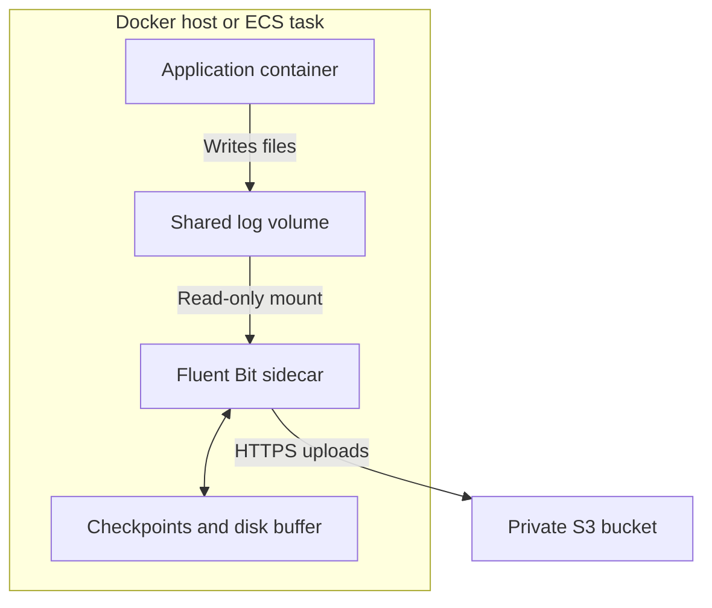
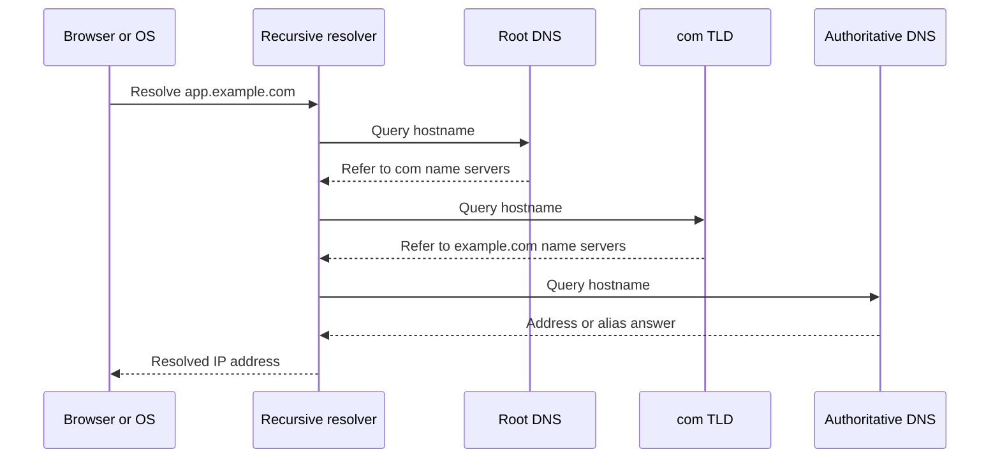
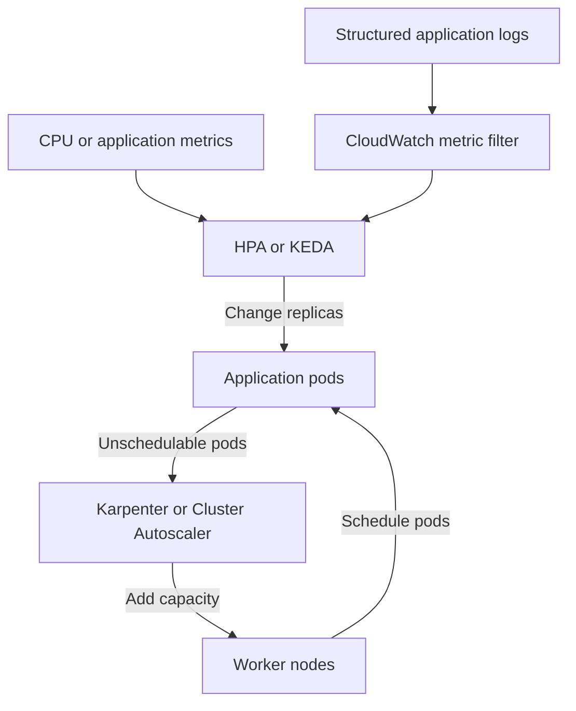
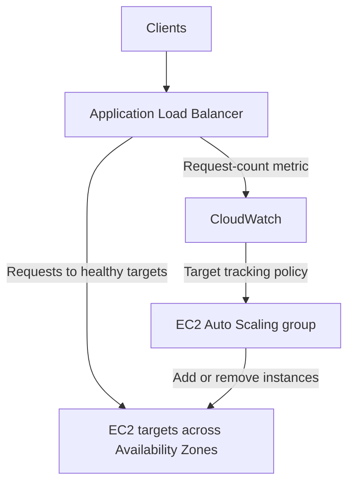

Below are interview-ready answers for **PlanSource / ValueLabs**, with practical examples and architecture diagrams.

## 1. How many subnets can you add to a VPC?

**The default AWS quota is 200 subnets per VPC, and this quota is adjustable.** You can request an increase through Service Quotas. The VPC must also have enough available, nonoverlapping IP address space. [Amazon Virtual Private Cloud](https://docs.aws.amazon.com/vpc/latest/userguide/amazon-vpc-limits.html?utm_source=chatgpt.com)

Each subnet belongs to **one Availability Zone**. A subnet cannot span multiple Availability Zones.

For example, a production VPC across three Availability Zones could have:

| Subnet purpose | Per AZ | Across three AZs |
|---|---:|---:|
| Public subnets for load balancers and NAT gateways | 1 | 3 |
| Private application subnets | 1 | 3 |
| Isolated database subnets | 1 | 3 |
| **Total** | **3** | **9** |

**Important distinction:** subnet quota and address capacity are separate constraints. A `/16` IPv4 CIDR can mathematically accommodate 256 `/24` networks, but the default subnet quota remains 200 unless increased.

---

## 2. How do you stream logs from a specific path inside a Docker container to S3?

**Use a log collector, such as Fluent Bit, to tail the files and upload batches of log records to S3.** Docker’s standard logging drivers collect `stdout` and `stderr`; they do not automatically discover application log files inside the container.

Suppose the application writes to:

```text
/app/logs/application.log
```

Mount that directory onto a shared volume. Give a Fluent Bit sidecar read access to the same volume.



The two containers can mount the shared volume at different paths:

| Container | Mount path | Access |
|---|---|---|
| Application | `/app/logs` | Read/write |
| Fluent Bit | `/logs` | Read-only |
| Fluent Bit state volume | `/state` | Read/write |

Example Fluent Bit configuration:

```ini
[INPUT]
    Name               tail
    Path               /logs/*.log
    Tag                app.files
    DB                 /state/tail.db
    Read_from_Head     On

[OUTPUT]
    Name               s3
    Match              app.files
    bucket             example-app-log-archive
    region             ap-south-1
    store_dir          /state/s3
    total_file_size    5M
    upload_timeout     60s
    use_put_object     On
    s3_key_format      /app/%Y/%m/%d/%H/%M/%S-$UUID.json
```

The Tail plugin tracks file offsets in its database. The S3 output buffers records and creates objects when the configured size or timeout is reached. **This produces a sequence of S3 objects; it does not continuously append to one object.** [docs.fluentbit.io](https://docs.fluentbit.io/manual/data-pipeline/inputs/tail?utm_source=chatgpt.com)

For a production implementation:

- Configure log rotation and multiline parsing.
- Keep checkpoint and buffer storage available across collector restarts.
- Account for buffer loss if the entire host or ECS task is destroyed.
- Monitor delivery failures and buffer growth.
- Use an EC2 instance role or ECS **task role** for S3 permissions, rather than embedded AWS credentials.

On ECS, FireLens can run the log router with a custom configuration. For application files, it still needs the shared volume and Tail input; configuring `awsfirelens` for the application’s console output alone does not collect those files. [Amazon Elastic Container Service](https://docs.aws.amazon.com/AmazonECS/latest/developerguide/using_firelens.html?utm_source=chatgpt.com)

---

## 3. How do you manage Terraform pipeline variables for dev, live, and feature environments?

**Reuse the same Terraform modules, but separate environment configuration, state, and AWS access.**

Here, assume “feature” means a temporary environment created for a feature branch.

| Environment | Variable file | State key example | AWS access |
|---|---|---|---|
| Dev | `env/dev.tfvars` | `dev/app.tfstate` | Development role |
| Live | `env/live.tfvars` | `live/app.tfstate` | Production role |
| Feature | `env/feature.tfvars` plus branch-specific values | `feature/branch-123/app.tfstate` | Restricted development role |

Example configuration:

```hcl
# env/dev.tfvars
environment   = "dev"
instance_type = "t3.small"
replica_count = 2
```

```hcl
# env/live.tfvars
environment   = "live"
instance_type = "t3.large"
replica_count = 4
```

Keep backend configuration separate from application variables:

```hcl
# env/dev.backend.hcl
bucket       = "example-terraform-state"
key          = "dev/app.tfstate"
region       = "ap-south-1"
encrypt      = true
use_lockfile = true
```

The state bucket must already exist. Enable versioning, restrict access, and use state locking. The S3 backend supports locking with `use_lockfile`; DynamoDB-based locking is deprecated. [HashiCorp Developer](https://developer.hashicorp.com/terraform/language/backend/s3?utm_source=chatgpt.com)

A pipeline can then run:

```bash
terraform init -input=false -reconfigure \
  -backend-config="env/dev.backend.hcl"

terraform validate

terraform plan -input=false \
  -var-file="env/dev.tfvars" \
  -out=tfplan

# Run after the environment's approval gate, if configured.
terraform apply -input=false tfplan
```

**Apply the saved plan that was reviewed.** Do not generate a different plan during the apply stage. Saved plans can contain sensitive values, so protect the plan artifact. [HashiCorp Developer](https://developer.hashicorp.com/terraform/cli/commands/plan?utm_source=chatgpt.com)

For secrets and credentials:

- Use short-lived AWS credentials, such as OIDC-based role assumption.
- Inject required secret variables from the pipeline’s secret store.
- Avoid putting secrets in committed `.tfvars` files.
- Remember that `sensitive = true` hides values from normal output but does **not** automatically keep them out of Terraform state. [HashiCorp Developer](https://developer.hashicorp.com/terraform/language/values/variables?utm_source=chatgpt.com)

For ordinary Terraform CLI runs, variable precedence from highest to lowest is:

1. `-var` and `-var-file`, in the supplied order.
2. `*.auto.tfvars` and `*.auto.tfvars.json`, in lexical order.
3. `terraform.tfvars.json`.
4. `terraform.tfvars`.
5. `TF_VAR_...` environment variables.
6. Variable defaults. [HashiCorp Developer](https://developer.hashicorp.com/terraform/language/values/variables?utm_source=chatgpt.com)

For production isolation, use separate AWS accounts or roles and restricted state access. **CLI workspaces separate state; they are not, by themselves, an access-control boundary.** [HashiCorp Developer](https://developer.hashicorp.com/terraform/language/state/workspaces?utm_source=chatgpt.com)

For feature environments, use unique resource names and state keys, and arrange cleanup when the branch closes or its lifetime expires.

---

## 4. What happens when you enter a URL in a browser?

Consider:

```text
https://app.example.com/orders
```

**The browser resolves the hostname, establishes a connection, sends an HTTP request, and renders the response.**

### DNS resolution

The browser needs the address of `app.example.com`. DNS does not resolve the `/orders` path.

1. The browser and configured resolver check available caches.
2. If necessary, the recursive resolver performs DNS lookups.
3. It obtains referrals from the root and `.com` name servers.
4. It queries the authoritative name server.
5. It follows aliases if necessary and obtains an IPv4 `A` or IPv6 `AAAA` answer.
6. It caches the result according to its TTL. [RFC Editor](https://www.rfc-editor.org/rfc/rfc1034?utm_source=chatgpt.com)

The following shows an illustrative lookup when the relevant information is not cached:



### Connection and application request

For a new HTTPS connection:

- HTTP/1.1 and HTTP/2 commonly use TCP followed by TLS.
- HTTP/3 uses QUIC over UDP, with TLS 1.3 integrated into QUIC.
- TLS validates the server certificate and establishes encryption keys.
- The browser sends a request such as `GET /orders`.
- The server returns a response.
- The browser processes HTML and fetches resources such as CSS, JavaScript, and images. [MDN](https://developer.mozilla.org/en-US/docs/Web/HTTP/Guides/Overview?utm_source=chatgpt.com)

**Interview detail:** the full DNS hierarchy is not contacted on every page load. DNS caching and connection reuse can skip much of this work.

---

## 5. What is the difference between HTTP and HTTPS?

**HTTPS is HTTP carried over a connection protected by TLS.** The HTTP methods, status codes, headers, and application semantics remain the same.

| Aspect | HTTP | HTTPS |
|---|---|---|
| URL scheme | `http://` | `https://` |
| Default port | 80 | 443 |
| Transport encryption | No built-in TLS protection | TLS encryption |
| Cryptographic integrity | No built-in protection | Detects modification |
| Server authentication | No certificate-based authentication | Server certificate validation |
| Appropriate use | Controlled cases where another layer provides protection | Websites, APIs, and sensitive traffic |

TLS provides confidentiality, integrity, and usually server authentication. Application login is still a separate concern: a valid certificate does not authenticate the end user. [MDN](https://developer.mozilla.org/en-US/docs/Web/Security/Transport_Layer_Security?utm_source=chatgpt.com)

**AWS example:** an ALB can terminate HTTPS using an ACM certificate. The connection from the ALB to its targets is a separate connection. Configure an HTTPS target group when that hop also needs encryption.

Also, avoid saying “HTTPS always uses TCP”: HTTP/3 uses QUIC over UDP. [RFC Editor](https://www.rfc-editor.org/rfc/rfc9114?utm_source=chatgpt.com)

---

## 6. What is the difference between a Service and a Task in ECS?

**A task is an instance of an application configuration. A service maintains the required number of tasks.**

| ECS concept | Purpose | Example |
|---|---|---|
| Task definition | Blueprint for containers, resources, networking, roles, and logging | Application container plus Fluent Bit sidecar |
| Task | An instantiated copy of a task definition | One application instance and its sidecar |
| Service | Controller that maintains desired tasks and manages deployments | Keep three application tasks running |

An ECS service replaces tasks that stop or become unhealthy, maintaining its desired count. It can also integrate with a load balancer. [Amazon Elastic Container Service](https://docs.aws.amazon.com/AmazonECS/latest/developerguide/ecs_services.html?utm_source=chatgpt.com)

**Example:**

- A task definition contains an API container and a logging sidecar.
- The service’s desired count is three.
- ECS runs three tasks: three API containers and three sidecars.
- If one task fails, the service starts a replacement.

For a one-time database migration or batch job, run a standalone task. It does not have a service continuously maintaining a desired task count.

---

## 7. How does autoscaling work in AWS ECS?

**ECS scaling has two separate concerns: service task count and compute capacity.**

### Service scaling

ECS Service Auto Scaling uses Application Auto Scaling to adjust the service’s **desired task count**.

Example:

```text
Minimum tasks: 2
Maximum tasks: 20
CPU target:    60%
```

A target tracking policy manages CloudWatch alarms and adjusts task count to move the metric toward its target. High demand causes scale-out; lower demand allows scale-in, subject to policy settings and cooldowns. [Amazon Elastic Container Service](https://docs.aws.amazon.com/AmazonECS/latest/developerguide/service-autoscaling-targettracking.html?utm_source=chatgpt.com)

Common choices include:

| Workload | Useful scaling signal |
|---|---|
| CPU-intensive API | ECS service CPU utilization |
| Memory-driven application | ECS service memory utilization, if it responds usefully to scaling |
| HTTP service behind an ALB | `ALBRequestCountPerTarget` |
| Queue worker | Queue backlog per task or queue age |
| Predictable daily traffic | Scheduled scaling |

The chosen metric should reflect demand and respond predictably when more tasks are added.

### Compute capacity scaling

| Infrastructure | How capacity is handled |
|---|---|
| Fargate | AWS provisions infrastructure for the requested tasks |
| EC2-backed ECS | EC2 capacity must be available for task placement |

For EC2-backed ECS, an Auto Scaling group capacity provider can manage EC2 capacity. ECS managed scaling uses capacity demand and the `CapacityProviderReservation` metric to adjust the group. [Amazon Elastic Container Service](https://docs.aws.amazon.com/AmazonECS/latest/developerguide/cluster-auto-scaling.html?utm_source=chatgpt.com)

**Example:** service scaling increases desired tasks from four to eight. If the existing EC2 instances cannot fit the additional tasks, capacity provider scaling adds instances so the tasks can be placed.

**Interview detail:** during supported ECS deployments, target tracking generally suspends scale-in while scale-out can continue. Also, `ALBRequestCountPerTarget` target tracking is not supported for the ECS blue/green deployment type. [Amazon Elastic Container Service](https://docs.aws.amazon.com/AmazonECS/latest/developerguide/service-autoscaling-targettracking.html?utm_source=chatgpt.com)

---

## 8. How do you scale an EKS cluster based on metrics or logs?

**Scale application replicas using workload metrics, and scale nodes when those replicas need additional compute capacity.**

| Layer | Typical mechanism | What changes |
|---|---|---|
| Application | HPA or KEDA | Pod replica count |
| Nodes | Karpenter, Cluster Autoscaler, or EKS Auto Mode | Compute capacity |
| EKS control plane | AWS-managed service | Not scaled by your HPA |

HPA can use CPU and memory through Metrics Server, or custom/external metrics through suitable adapters. KEDA provides event-driven scaling integrations. [AWS Prescriptive Guidance](https://docs.aws.amazon.com/prescriptive-guidance/latest/scaling-amazon-eks-infrastructure/workload-scaling.html?utm_source=chatgpt.com)

### Scaling from logs

Logs must first produce a **numerical scaling signal**.

For example, structured logs might report queue backlog. A CloudWatch Logs metric filter can publish that value as a CloudWatch metric, which KEDA can consume. [Amazon CloudWatch Logs](https://docs.aws.amazon.com/AmazonCloudWatch/latest/logs/MonitoringLogData.html?utm_source=chatgpt.com)



**Example:** a worker deployment should process approximately 100 pending jobs per replica. If the backlog is 900, the scaling target suggests approximately nine replicas, within configured minimum and maximum limits.

An illustrative KEDA configuration:

```yaml
apiVersion: keda.sh/v1alpha1
kind: ScaledObject
metadata:
  name: order-worker-scaling
spec:
  scaleTargetRef:
    name: order-worker
  minReplicaCount: 2
  maxReplicaCount: 20
  triggers:
    - type: aws-cloudwatch
      metadata:
        namespace: MyApp/Workers
        metricName: PendingJobs
        dimensionName: Service
        dimensionValue: order-worker
        targetMetricValue: "100"
        metricStat: Average
        metricStatPeriod: "60"
        metricCollectionTime: "180"
        awsRegion: ap-south-1
        ignoreNullValues: "false"
      authenticationRef:
        name: cloudwatch-auth
```

This assumes the metric exists and `cloudwatch-auth` is configured with the appropriate AWS workload identity and permissions. [KEDA](https://keda.sh/docs/latest/scalers/aws-cloudwatch/?utm_source=chatgpt.com)

When new pods cannot fit:

- **Cluster Autoscaler** increases suitable node-group capacity.
- **Karpenter** provisions nodes that satisfy pod scheduling requirements. [Amazon EKS](https://docs.aws.amazon.com/eks/latest/userguide/autoscaling.html?utm_source=chatgpt.com)

Production considerations include CPU requests, metric delays, stabilization settings, node limits, and graceful scale-in. KEDA usually manages an HPA, so avoid adding another independent HPA for the same deployment.

**Choose demand signals carefully.** Increasing replicas because logs contain errors can worsen a database outage. Queue backlog, request rate, and processing latency are often more useful signals.

---

## 9. What is the difference between ALB and ELB? Which layers do they operate at?

**ELB is the AWS Elastic Load Balancing service family. ALB is one type of load balancer within that family.**

When an interviewer says “ALB versus ELB,” they may mean **ALB versus Classic Load Balancer**, so clarify that terminology. [Elastic Load Balancing](https://docs.aws.amazon.com/elasticloadbalancing/latest/userguide/what-is-load-balancing.html?utm_source=chatgpt.com)

| Type | Main OSI layer | Main capability | Typical choice |
|---|---|---|---|
| Application Load Balancer | Layer 7 | Understands HTTP requests and supports host/path routing | Websites, REST APIs, microservices |
| Network Load Balancer | Layer 4 | Transport-level load balancing; protocols such as TCP, UDP, and TLS | Non-HTTP protocols, static IP requirements, PrivateLink |
| Gateway Load Balancer | Layer 3 | Distributes IP traffic through network appliances | Firewalls and inspection appliances |
| Classic Load Balancer | Layer 4 or Layer 7, depending on listener | Older, basic load balancing model | Existing legacy deployments |

These layers and capabilities are documented separately for ALB, NLB, GWLB, and Classic Load Balancer. [Elastic Load Balancing](https://docs.aws.amazon.com/elasticloadbalancing/latest/application/introduction.html?utm_source=chatgpt.com)

**Choose ALB when:**

```text
app.example.com/orders/*   → Orders target group
app.example.com/payments/* → Payments target group
```

ALB understands the HTTP path and routes to the appropriate service.

**Choose NLB when:** clients use a custom TCP protocol, require stable load-balancer IP addresses, or connect through an AWS PrivateLink endpoint service.

**Choose GWLB when:** traffic must pass through a fleet of network security appliances.

**Interview detail:** terminating TLS does not automatically make a load balancer Layer 7. ALB understands HTTP content; NLB primarily operates on transport connections.

---

## 10. How do you speed up large S3 uploads? If a 10 GB upload fails after 5 GB, how do you verify the uploaded data?

### Improve upload speed

**Use multipart upload with parallel part transfers.** A single S3 `PUT` supports objects up to 5 GB, so a 10 GB object requires multipart upload. [Amazon Simple Storage Service](https://docs.aws.amazon.com/AmazonS3/latest/userguide/upload-objects.html?linkId=197723537\&sc_campaign=Support\&sc_channel=sm\&sc_content=Support\&sc_country=global\&sc_geo=GLOBAL\&sc_outcome=AWS+Support\&sc_publisher=TWITTER\&trk=Support\&utm_source=chatgpt.com)

Useful measures include:

- Use an SDK transfer manager rather than implementing concurrency from scratch.
- Upload multiple parts concurrently.
- Retry failed parts instead of restarting all successful parts.
- Tune part size and concurrency to available bandwidth and CPU.
- Persist upload progress if the application must resume after restarting.
- For browser uploads, consider uploading directly to S3 using authorized, presigned part URLs.

For example, test 64–128 MiB parts with eight concurrent uploads, then measure throughput. Those are starting points, not universal settings. Multipart upload supports parallel transfers and independent retries. [Amazon Simple Storage Service](https://docs.aws.amazon.com/AmazonS3/latest/userguide/mpuoverview.html?utm_source=chatgpt.com)

S3 Transfer Acceleration can help geographically distant clients by using AWS edge locations. Benchmark it for the client’s location and account for its additional cost. [Amazon Simple Storage Service](https://docs.aws.amazon.com/AmazonS3/latest/userguide/transfer-acceleration.html?utm_source=chatgpt.com)

### Verify the interrupted upload

**Successful parts can be stored in S3 before the final object exists.** The upload becomes an object only after `CompleteMultipartUpload` succeeds.

Your application should retain:

```text
Bucket
Object key
Upload ID
Completed part numbers
Part ETags
Checksums, where configured
```

Inspect the parts belonging to the saved upload ID:

```bash
UPLOAD_ID="saved-upload-id"

aws s3api list-parts \
  --bucket client-upload-example \
  --key inbound/video.bin \
  --upload-id "$UPLOAD_ID" \
  --query 'Parts[].{Part:PartNumber,Bytes:Size,ETag:ETag}' \
  --output json
```

Calculate the total size of completed parts:

```bash
aws s3api list-parts \
  --bucket client-upload-example \
  --key inbound/video.bin \
  --upload-id "$UPLOAD_ID" \
  --query 'sum(Parts[].Size)' \
  --output json
```

`ListParts` is paginated. Keep AWS CLI automatic pagination enabled; inspect all pages when calling the API directly. [AWS CLI 2.36.43 Command Reference](https://docs.aws.amazon.com/cli/latest/reference/s3api/list-parts.html?utm_source=chatgpt.com)

For example, 50 completed parts of 100,000,000 bytes each confirm that **5,000,000,000 bytes—5 GB in decimal units—are stored as completed parts**.

Important qualifications:

- Parts can finish out of order; this does not necessarily mean the first contiguous 5 GB is present.
- An interrupted, unfinished part is not counted as a completed part.
- `aws s3 ls` or `HeadObject` cannot show progress for an unfinished multipart upload.
- An older completed object at the same key does not prove progress for the current upload.

To resume, reconcile the listed parts with the saved upload manifest, upload missing parts, and complete the upload using the ordered part numbers and ETags. After completion, verify the final size and appropriate checksum. A multipart ETag should not be treated as the whole-file MD5. [Amazon Simple Storage Service](https://docs.aws.amazon.com/AmazonS3/latest/userguide/mpuoverview.html?utm_source=chatgpt.com)

Also, distinguish resumable application logic from ordinary CLI retries: AWS documents that failed transfers using high-level `aws s3` commands cannot be resumed as interrupted uploads. [AWS Command Line Interface](https://docs.aws.amazon.com/cli/latest/userguide/cli-services-s3-commands.html?utm_source=chatgpt.com)

---

## 11. How do you optimize S3 cost?

**Start by identifying whether the bill comes from storage, requests, retrievals, data transfer, or retained data.**

S3 Storage Lens helps identify opportunities such as incomplete multipart uploads, noncurrent versions, and storage growth. [Amazon Simple Storage Service](https://docs.aws.amazon.com/AmazonS3/latest/userguide/storage-lens-optimize-storage.html?utm_source=chatgpt.com)

| Access pattern | Storage-class option |
|---|---|
| Frequently accessed production data | S3 Standard |
| Predictable, infrequent access with immediate retrieval | S3 Standard-IA |
| Unknown or changing access frequency | S3 Intelligent-Tiering |
| Rare access requiring immediate retrieval | S3 Glacier Instant Retrieval |
| Archives that can tolerate restore delays | S3 Glacier Flexible Retrieval or Deep Archive |

Use lifecycle rules based on retention and retrieval requirements. For example:

```text
Application logs:
Day 0:   S3 Standard
Day 30:  Standard-IA
Day 90:  Glacier archive class
Day 365: Expire, if retention policy permits
```

Check minimum storage durations, retrieval charges, transition fees, and object-size overhead before selecting a class. Small objects may cost more to transition than they save; current lifecycle defaults generally prevent transitions for objects below 128 KB. [Amazon Simple Storage Service](https://docs.aws.amazon.com/AmazonS3/latest/userguide/lifecycle-transition-general-considerations.html?utm_source=chatgpt.com)

Other useful measures:

- Abort abandoned multipart uploads after the allowed resume window.
- Expire unnecessary noncurrent versions using explicit lifecycle rules.
- Compress logs and batch records instead of creating an object for every line.
- Reduce repeated downloads where caching makes sense.
- Use S3 gateway endpoints for private, same-Region access to avoid sending S3 traffic through NAT gateways. Gateway endpoints have no additional endpoint charge. [Amazon Virtual Private Cloud](https://docs.aws.amazon.com/vpc/latest/privatelink/vpc-endpoints-s3.html?utm_source=chatgpt.com)
- For suitable SSE-KMS workloads, use S3 Bucket Keys to reduce KMS request costs. [Amazon Simple Storage Service](https://docs.aws.amazon.com/AmazonS3/latest/userguide/UsingKMSEncryption.html?utm_source=chatgpt.com)

**Interview example:** if versioning is enabled, deleting the current object does not necessarily remove its older versions. Cost optimization must examine noncurrent versions too.

---

## 12. How do you secure S3 containing sensitive client data?

**Combine access control, encryption, controlled data sharing, auditing, and recovery.**

### Prevent unintended access

- Enable S3 Block Public Access.
- Use bucket-owner-enforced Object Ownership to disable ACLs.
- Grant least-privilege permissions through IAM roles and bucket policies.
- Restrict clients to their own objects or prefixes through authorization policies.
- Avoid long-lived access keys in applications. [Amazon Simple Storage Service](https://docs.aws.amazon.com/AmazonS3/latest/userguide/security-best-practices.html?utm_source=chatgpt.com)

A prefix such as `clients/client-a/` is an organizational structure. **The IAM or bucket policy creates the security boundary.**

### Encrypt and control key access

New S3 uploads receive server-side encryption by default. Use SSE-KMS with a customer-managed key when you need additional key-policy control and auditing.

For SSE-KMS, evaluate both S3 permissions and KMS permissions. Encryption does not prevent a principal with valid read and decrypt permissions from accessing the data. [Amazon Simple Storage Service](https://docs.aws.amazon.com/AmazonS3/latest/userguide/UsingKMSEncryption.html?utm_source=chatgpt.com)

Require HTTPS using an appropriate bucket policy condition such as `aws:SecureTransport`. Account for AWS service integrations when constructing explicit deny statements. [Amazon Simple Storage Service](https://docs.aws.amazon.com/AmazonS3/latest/userguide/amazon-s3-policy-keys.html?trk=article-ssr-frontend-pulse_little-text-block\&utm_source=chatgpt.com)

### Control client uploads and downloads

A common design is:

1. The client authenticates with your application.
2. The application checks which object the client may access.
3. The application creates a short-lived presigned URL.
4. The client transfers directly with S3.

Keep URLs scoped to the intended object and operation. **Presigned URLs are bearer credentials:** anyone possessing a valid URL can exercise its granted access. Avoid exposing them in logs or analytics. [Amazon Simple Storage Service](https://docs.aws.amazon.com/AmazonS3/latest/userguide/using-presigned-url.html?utm_source=chatgpt.com)

For AWS-only backend access, use an S3 VPC endpoint and appropriate policies. A blanket endpoint-only restriction would conflict with external clients using direct presigned URLs, so match the policy to the architecture. [Amazon Virtual Private Cloud](https://docs.aws.amazon.com/vpc/latest/privatelink/vpc-endpoints-s3.html?utm_source=chatgpt.com)

### Audit and recover

Enable CloudTrail **S3 data events** for required object-level operations. Use tools such as IAM Access Analyzer and Amazon Macie where appropriate, and maintain versioning and tested recovery procedures. Use Object Lock when the business requires immutable retention. [Amazon Simple Storage Service](https://docs.aws.amazon.com/AmazonS3/latest/userguide/security-best-practices.html?utm_source=chatgpt.com)

---

## 13. How does autoscaling work with an ALB?

**The ALB scales its own load-balancing capacity automatically. Your backend capacity scales through a separate mechanism.** [Elastic Load Balancing](https://docs.aws.amazon.com/elasticloadbalancing/latest/userguide/what-is-load-balancing.html?utm_source=chatgpt.com)

For an EC2 application, the typical architecture is:



Example configuration:

```text
Minimum instances: 2
Desired instances: 2
Maximum instances: 10
Scaling metric:    ALBRequestCountPerTarget
Target value:      1,000 requests per target per minute
```

Choose the target value through load testing against the application’s latency and error-rate requirements.

When incoming requests increase:

1. Requests per target rise.
2. The target tracking policy adjusts the Auto Scaling group’s desired capacity.
3. New instances launch and initialize.
4. They register with the attached target group.
5. The ALB routes traffic to them once they are healthy.

For throughput metrics such as `ALBRequestCountPerTarget`, the target value represents average throughput per instance over a one-minute period. [Amazon EC2 Auto Scaling](https://docs.aws.amazon.com/autoscaling/ec2/userguide/as-scaling-target-tracking.html?utm_source=chatgpt.com)

When demand drops, the group can remove instances. Configure warmup, health checks, deregistration delay, and graceful application shutdown so scaling does not unnecessarily interrupt requests. Instances launched or terminated by an attached Auto Scaling group are automatically registered or deregistered. [Elastic Load Balancing](https://docs.aws.amazon.com/elasticloadbalancing/latest/application/introduction.html?utm_source=chatgpt.com)

The backend mechanism depends on the platform:

| Backend | What scales application capacity |
|---|---|
| EC2 | EC2 Auto Scaling group |
| ECS | ECS Service Auto Scaling; capacity provider if using EC2 |
| EKS | HPA/KEDA for pods and node autoscaling for compute |

**The key interview distinction:** ALB distributes traffic and publishes metrics. It does not independently create EC2 instances, ECS tasks, or Kubernetes pods.
