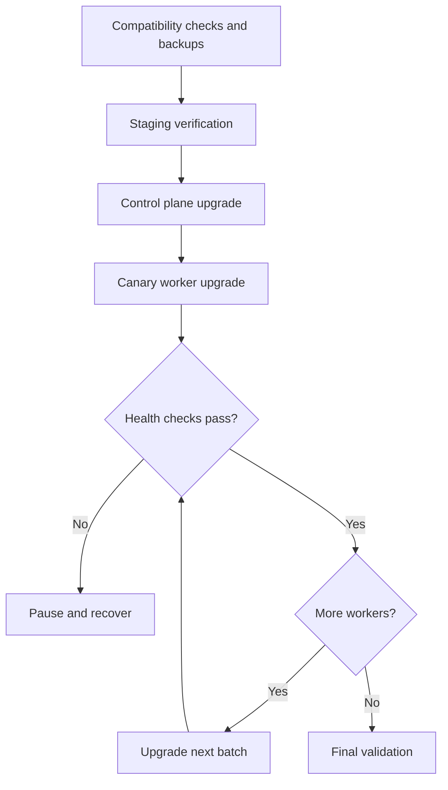
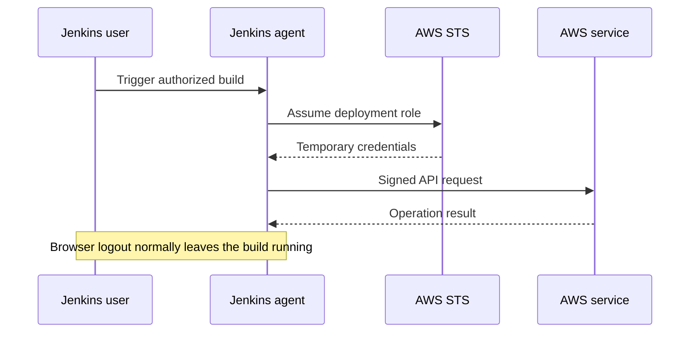
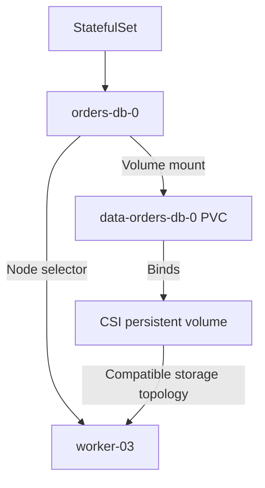

Here are interview-ready answers for **Publicis Global Delivery**, with examples and architecture diagrams.

## 1. How do you upgrade a Kubernetes cluster from one version to another?

**Use a tested, incremental rollout: check compatibility, back up state, upgrade the control plane, and upgrade worker nodes in controlled batches.**

For kubeadm clusters, skipping minor versions is unsupported. For example, upgrade `1.35 → 1.36 → 1.37` rather than directly from `1.35 → 1.37`. [Kubernetes](https://kubernetes.io/docs/tasks/administer-cluster/kubeadm/kubeadm-upgrade/?utm_source=chatgpt.com)

### Recommended approach

| Stage | Activities | Purpose |
|---|---|---|
| Assess | Review release notes, deprecated APIs, admission webhooks, CNI/CSI drivers, ingress controllers, and add-ons | Identify incompatibilities |
| Prepare | Check cluster health, replicas, PDBs, spare capacity, and storage placement | Ensure workloads can move during maintenance |
| Back up | Back up application data and configuration; take an etcd snapshot for a self-managed control plane | Prepare recovery |
| Rehearse | Upgrade staging and test application flows | Detect problems before production |
| Control plane | Upgrade control-plane nodes sequentially | Maintain availability and supported version skew |
| Workers | Upgrade a canary node, then small batches | Limit the impact of failures |
| Validate | Check networking, DNS, storage, application latency, errors, and node health | Confirm the upgrade succeeded |

**Upgrade the control plane before the kubelets.** A kubelet must not be newer than the API server it communicates with. [Kubernetes](https://kubernetes.io/releases/version-skew-policy/?utm_source=chatgpt.com)



### Example: kubeadm cluster

After installing the approved target version of `kubeadm` on the first control-plane node:

```bash
sudo kubeadm upgrade plan

# Replace the placeholder with the approved version.
sudo kubeadm upgrade apply <target-version>
```

On additional control-plane nodes, use:

```bash
sudo kubeadm upgrade node
```

For each worker, install the target `kubeadm`, drain the node, update its kubeadm configuration and kubelet packages, restart kubelet, and uncordon it:

```bash
kubectl drain worker-01 --ignore-daemonsets

# On worker-01:
sudo kubeadm upgrade node

# Install the approved kubelet and kubectl packages.
sudo systemctl daemon-reload
sudo systemctl restart kubelet

# From the administration terminal:
kubectl uncordon worker-01
kubectl get nodes
```

The package-installation commands depend on the operating system. A minor kubelet upgrade requires draining that node first. [Kubernetes](https://kubernetes.io/docs/tasks/administer-cluster/kubeadm/kubeadm-upgrade/?utm_source=chatgpt.com)

A drain uses the eviction mechanism and respects PDBs. If it blocks, investigate workload health and available capacity before proceeding. [Kubernetes](https://kubernetes.io/docs/tasks/administer-cluster/safely-drain-node/?utm_source=chatgpt.com)

### What changes for EKS?

AWS manages the control-plane upgrade. You assess upgrade readiness, upgrade the control plane, and update node groups, compatible add-ons, controllers, and clients. For worker nodes, creating a new node group and gradually moving workloads is another practical approach. [Amazon EKS](https://docs.aws.amazon.com/eks/latest/userguide/update-cluster.html?utm_source=chatgpt.com)

**Current EKS recovery detail:** EKS supports a constrained rollback to the previous minor version within seven days of an eligible upgrade. Compatibility requirements apply, and ordinary node groups and add-ons require separate handling. Recovery planning should use the platform’s documented capabilities. [Amazon EKS](https://docs.aws.amazon.com/eks/latest/userguide/rollback-cluster.html?utm_source=chatgpt.com)

**Interview point:** availability during an upgrade depends on application replicas, readiness checks, PDBs, spare capacity, and storage or database failover.

---

## 2. What is PDP in Kubernetes?

The wording is ambiguous. In Kubernetes availability interviews, the likely term is **PDB—PodDisruptionBudget**. A literal **PDP** can mean **Policy Decision Point** in a policy architecture.

### PDB: PodDisruptionBudget

**A PDB limits how many selected pods can be unavailable during voluntary evictions**, such as a node drain for an upgrade.

Suppose an API has three replicas, and at least two must remain available:

```yaml
apiVersion: policy/v1
kind: PodDisruptionBudget
metadata:
  name: orders-api-pdb
spec:
  minAvailable: 2
  unhealthyPodEvictionPolicy: AlwaysAllow
  selector:
    matchLabels:
      app: orders-api
```

With all three replicas healthy:

1. One healthy pod can be evicted.
2. Two healthy pods remain.
3. Another healthy pod’s eviction must wait until sufficient availability is restored.

`AlwaysAllow` permits eviction of unhealthy running pods, which can help prevent a misbehaving pod from blocking maintenance. [Kubernetes](https://kubernetes.io/docs/tasks/run-application/configure-pdb/?utm_source=chatgpt.com)

You can specify either:

| Setting | Meaning |
|---|---|
| `minAvailable: 2` | Keep at least two selected pods available |
| `maxUnavailable: 1` | Allow at most one selected pod to be unavailable |

Use **one of these settings**, not both.

Important limitations:

- A PDB does not create replacement pods; the workload controller does.
- It cannot prevent hardware failures or other involuntary disruptions.
- Direct pod deletion can bypass it.
- Deployment and StatefulSet rolling updates follow their own update strategies; PDBs do not directly constrain those updates. [Kubernetes](https://kubernetes.io/docs/concepts/workloads/pods/disruptions/?utm_source=chatgpt.com)

A single-replica application with `minAvailable: 1` can block a drain. The PDB cannot provide redundancy that the application does not have.

### PDP: Policy Decision Point

If the interviewer means **Policy Decision Point**, it is the component that evaluates policies and returns an allow/deny decision.

For example, Kubernetes admission control can consult OPA or Gatekeeper to enforce rules such as “container images must come from approved registries.” The API server enforces the admission decision. [Open Policy Agent](https://www.openpolicyagent.org/docs/kubernetes?utm_source=chatgpt.com)

---

## 3. How do you extract all Git commits from the last three days?

For the current branch:

```bash
git log --since="3 days ago" --oneline
```

Git supports date-based filtering of commit history. [Viewing the Commit History](https://git-scm.com/book/en/v2/Git-Basics-Viewing-the-Commit-History?utm_source=chatgpt.com)

For commits reachable from **all locally known references**, first fetch the required remote branches and tags:

```bash
git fetch --all --prune --tags

git log --all \
  --since-as-filter="3 days ago" \
  --until="now" \
  --pretty=format:'%H | %cI | %an | %s' \
  > commits-last-3-days.txt
```

| Option | Meaning |
|---|---|
| `--all` | Traverse commits reachable from locally known refs |
| `--since-as-filter` | Filter by date while continuing through older commits |
| `--until` | Set the upper time boundary |
| `%H` | Full commit hash |
| `%cI` | Committer timestamp in strict ISO format |
| `%an` | Author name |
| `%s` | Commit subject |

`--since-as-filter` is useful when commit timestamps are not ordered consistently through the history. Unlike ordinary `--since`, it continues traversing past older commits. [git-log Documentation](https://git-scm.com/docs/git-log?utm_source=chatgpt.com)

**Interview details:** date filtering uses the committer timestamp. A shallow clone or restricted fetch configuration can omit history. For audit reports, define explicit timestamps and a timezone so “three days” has a precise meaning.

---

## 4. How does Jenkins authenticate to AWS using a particular login? What happens if you log out?

Assuming this asks how the pipeline selects an AWS identity and whether logging out affects it:

**The pipeline uses its configured AWS credentials or IAM role. It normally does not use the Jenkins user’s browser session as its AWS identity.**

| Identity | Responsibility |
|---|---|
| Jenkins user | Starts, configures, or approves a build |
| Jenkins agent’s AWS identity | Provides the pipeline’s initial AWS access |
| Assumed deployment role | Grants permissions for the target account or environment |

### Preferred AWS-hosted pattern

For an EC2 Jenkins agent:

1. Attach a restricted IAM role to the agent instance.
2. Allow that identity to assume the required deployment role.
3. Configure the deployment role’s trust policy.
4. Use AWS STS to obtain temporary credentials.
5. Perform AWS operations using the assumed identity.

STS credentials include an access key ID, secret access key, and session token. Cross-account role assumption requires both the appropriate trust relationship and caller permissions. [AWS Security Token Service](https://docs.aws.amazon.com/STS/latest/APIReference/API_AssumeRole.html?utm_source=chatgpt.com)



Example using the **Pipeline: AWS Steps** plugin:

```groovy
pipeline {
    agent { label 'aws-agent' }

    stages {
        stage('AWS operation') {
            steps {
                withAWS(
                    role: 'DeployRole',
                    roleAccount: '123456789012',
                    region: 'ap-south-1',
                    useNode: true,
                    roleSessionName: "jenkins-${env.BUILD_NUMBER}",
                    duration: 3600
                ) {
                    sh '''
                        aws sts get-caller-identity
                        aws s3 ls s3://example-deployment-artifacts/
                    '''
                }
            }
        }
    }
}
```

This assumes the agent has a usable source identity and role-assumption permissions. `useNode: true` selects credentials from the agent in scope; the plugin’s credential lookup behavior matters when controller and agent identities differ. [Jenkins plugin](https://plugins.jenkins.io/pipeline-aws/?utm_source=chatgpt.com)

For an existing access-key setup, select a Jenkins credential ID:

```groovy
withAWS(credentials: 'aws-dev-credentials', region: 'ap-south-1') {
    sh 'aws sts get-caller-identity'
}
```

Use separate, authorized roles or credential IDs for dev and production.

### What happens after logout?

- **Logging out of Jenkins:** normally does not cancel an already-running build or revoke its AWS credentials.
- **AWS credentials expire:** subsequent requests fail unless the pipeline obtains new credentials.
- **A credential is revoked or its permissions change:** AWS access can fail independently of the Jenkins browser session.

Temporary credentials cannot be extended beyond their original expiry. A long-running pipeline needs a credential provider that renews credentials, or it must obtain a new role session. [AWS Identity and Access Management](https://docs.aws.amazon.com/IAM/latest/UserGuide/id_credentials_temp_use-resources.html?utm_source=chatgpt.com)

**A useful verification command is `aws sts get-caller-identity`**—it shows which AWS identity the build is actually using.

---

## 5. What are the access modes in a PVC?

**Access modes describe the volume’s supported mounting pattern.** The underlying storage driver must support the requested mode.

| Mode | Abbreviation | Meaning |
|---|---|---|
| `ReadWriteOnce` | RWO | Read/write access from a single node |
| `ReadOnlyMany` | ROX | Read-only access from multiple nodes |
| `ReadWriteMany` | RWX | Read/write access from multiple nodes |
| `ReadWriteOncePod` | RWOP | Read/write access restricted to a single pod |

**RWO does not mean one pod.** Multiple pods on the same node can use an RWO volume. RWOP is the mode intended for exclusive access by one pod across the cluster. [Kubernetes](https://kubernetes.io/docs/concepts/storage/persistent-volumes/?utm_source=chatgpt.com)

Example PVC:

```yaml
apiVersion: v1
kind: PersistentVolumeClaim
metadata:
  name: database-data
spec:
  accessModes:
    - ReadWriteOncePod
  storageClassName: stateful-csi
  resources:
    requests:
      storage: 20Gi
```

This assumes a compatible CSI-backed StorageClass. RWOP requires CSI support and suitable CSI component versions. [Kubernetes](https://kubernetes.io/docs/tasks/administer-cluster/change-pv-access-mode-readwriteoncepod/?utm_source=chatgpt.com)

**Access modes are not filesystem permissions.** RWO, ROX, and RWX declarations do not themselves enforce write protection after mounting; configure read-only mounts and application permissions where required. [Kubernetes](https://kubernetes.io/docs/concepts/storage/persistent-volumes/?utm_source=chatgpt.com)

Also distinguish `accessModes` from `volumeMode`: the latter selects a filesystem volume or a raw block device.

---

## 6. You have a MongoDB dump and need to free space. How would you do it?

**First distinguish reducing backup size from reclaiming disk space in a running database.**

| Requirement | Approach |
|---|---|
| Keep all backup data but reduce file size | Compress the dump |
| Keep only selected data | Restore to staging, remove approved data, and create a new dump |
| Produce a filtered collection backup | Use `mongodump --query` or `--queryFile` |
| Return database storage to the operating system | Evaluate supported storage operations such as `compact` |

### A. Reduce backup size without removing records

Create a compressed MongoDB archive:

```bash
mongodump \
  --db appdb \
  --archive=appdb.archive.gz \
  --gzip
```

`--gzip` supports compression of dump files and archive output. For an existing uncompressed dump, compress it using an appropriate archive/compression tool and verify restoration before replacing the original copy. A generic `.tar.gz` package is a different format from a native MongoDB `--archive`. [MongoDB Docs](https://www.mongodb.com/docs/database-tools/mongodump/?utm_source=chatgpt.com)

### B. Remove unnecessary data from an existing dump

Use an isolated staging MongoDB instance and retain the original backup until verification succeeds.

**1. Restore under a separate database name.**

```bash
mongorestore \
  --gzip \
  --archive=original.archive.gz \
  --nsInclude='appdb.*' \
  --nsFrom='appdb.*' \
  --nsTo='cleanupdb.*'
```

Namespace mapping allows the backup to be restored under a different database name. [MongoDB Docs](https://www.mongodb.com/docs/database-tools/mongorestore/?utm_source=chatgpt.com)

**2. Remove data according to an agreed retention rule.**

For example, in `mongosh`, remove events older than an illustrative cutoff:

```javascript
const cleanup = db.getSiblingDB("cleanupdb");

const oldEvents = {
  createdAt: { $lt: ISODate("2026-07-01T00:00:00Z") }
};

cleanup.events.countDocuments(oldEvents);
cleanup.events.deleteMany(oldEvents);
```

**3. Create a compressed replacement dump.**

```bash
mongodump \
  --db cleanupdb \
  --archive=reduced.archive.gz \
  --gzip
```

Restore-test the new archive and compare retained data, indexes, and expected document counts. Map `cleanupdb.*` back to `appdb.*` when restoring for application use.

If you only need a filtered backup of one collection, `--queryFile` can select retained documents directly from the source or staging database without deleting them there. [MongoDB Docs](https://www.mongodb.com/docs/database-tools/mongodump/?utm_source=chatgpt.com)

### C. Reclaim disk space in a running MongoDB database

**Deleting records does not necessarily shrink WiredTiger files.** Freed space is often retained for future reuse rather than returned to the operating system. [MongoDB Docs](https://www.mongodb.com/docs/manual/faq/storage/?utm_source=chatgpt.com)

For an appropriate self-managed secondary, MongoDB 8.0+ supports estimating reclaimable space:

```javascript
db.runCommand({
  compact: "events",
  dryRun: true
});
```

Then, if appropriate for the maintenance plan:

```javascript
db.runCommand({
  compact: "events"
});
```

Compaction effectiveness varies and it may need additional disk space. MongoDB recommends running it on secondaries where possible, and the command is not replicated automatically to other members. [MongoDB Docs](https://www.mongodb.com/docs/manual/reference/command/compact/?utm_source=chatgpt.com)

**The key distinction:** compression reduces a backup’s size; filtering reduces its retained records; compaction operates on database storage files.

---

## 7. How do you deploy a stateful application on a specified Kubernetes node?

**Use a StatefulSet with persistent storage, and constrain scheduling with `nodeSelector` or required node affinity.**

A StatefulSet provides stable pod identities and storage associations. It does not automatically pin the application to one physical node. [Kubernetes](https://kubernetes.io/docs/concepts/workloads/controllers/statefulset/?utm_source=chatgpt.com)

### Label the chosen node

```bash
kubectl label node worker-03 stateful-app=orders-db
```

Apply this label only to the chosen node if exactly one node must match.

### Configure the StatefulSet

The following assumes a matching headless Service named `orders-db` and a compatible CSI StorageClass named `stateful-csi` already exist:

```yaml
apiVersion: apps/v1
kind: StatefulSet
metadata:
  name: orders-db
spec:
  serviceName: orders-db
  replicas: 1

  selector:
    matchLabels:
      app: orders-db

  template:
    metadata:
      labels:
        app: orders-db
    spec:
      nodeSelector:
        stateful-app: orders-db

      containers:
        - name: mongodb
          image: mongo:8.0
          ports:
            - containerPort: 27017
          volumeMounts:
            - name: data
              mountPath: /data/db

  volumeClaimTemplates:
    - metadata:
        name: data
      spec:
        accessModes:
          - ReadWriteOncePod
        storageClassName: stateful-csi
        resources:
          requests:
            storage: 20Gi
```

The scheduler selects a node matching the label, subject to resources, taints, and volume constraints. Required node affinity can express more flexible matching rules using `requiredDuringSchedulingIgnoredDuringExecution`. [Kubernetes](https://kubernetes.io/docs/concepts/scheduling-eviction/assign-pod-node/?utm_source=chatgpt.com)



### Storage placement must agree with scheduling

A node selector alone is insufficient if the volume cannot be mounted on that node.

- A zone-bound volume must be accessible in the selected node’s zone.
- A local PersistentVolume requires node affinity matching its physical location.
- A StorageClass using `WaitForFirstConsumer` coordinates provisioning or binding with the pod’s scheduling constraints. [Kubernetes](https://kubernetes.io/docs/concepts/storage/storage-classes/?utm_source=chatgpt.com)

Prefer scheduler-aware selection over setting `nodeName` directly. `nodeName` bypasses the scheduler and can leave a PVC pending with `WaitForFirstConsumer`. [Kubernetes](https://kubernetes.io/docs/concepts/storage/storage-classes/?utm_source=chatgpt.com)

For a dedicated node, add a taint and give the application a matching toleration **alongside** its node selector or affinity. A toleration permits placement; it does not force placement.

**Availability tradeoff:** if the only matching node fails, a replacement pod cannot run elsewhere under the same constraint. When failover matters, use an eligible node pool with compatible storage and application replication.
