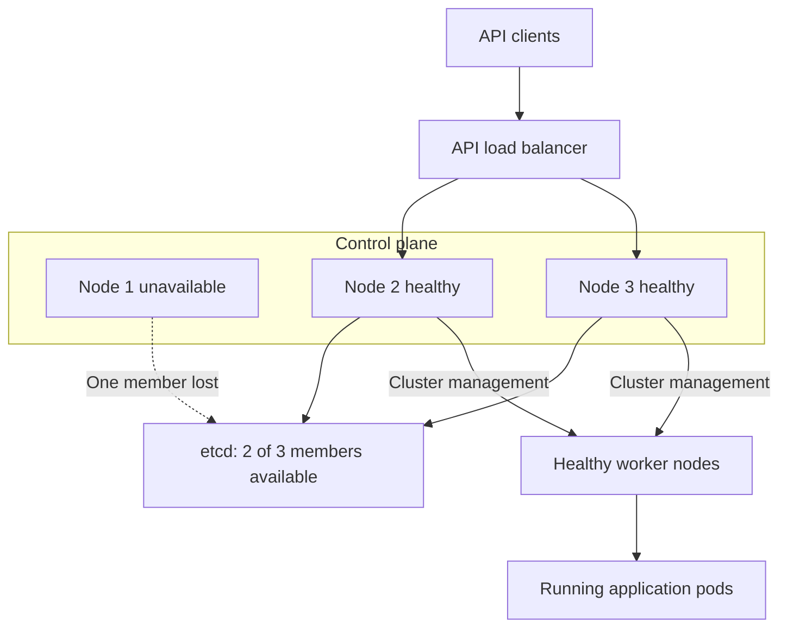
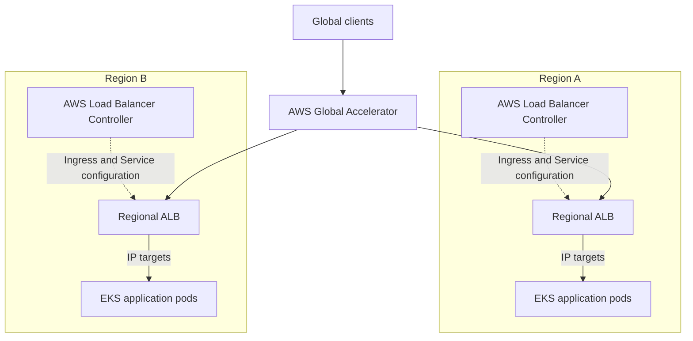
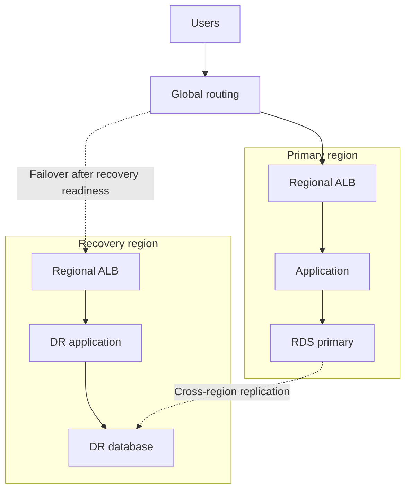
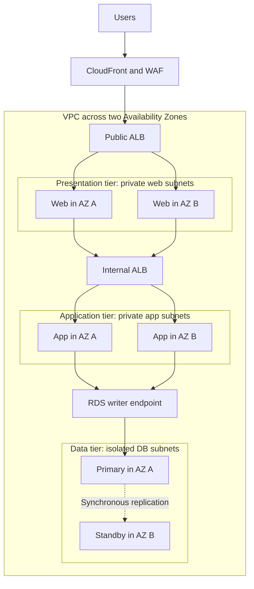
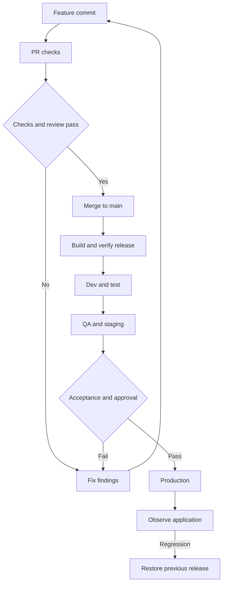
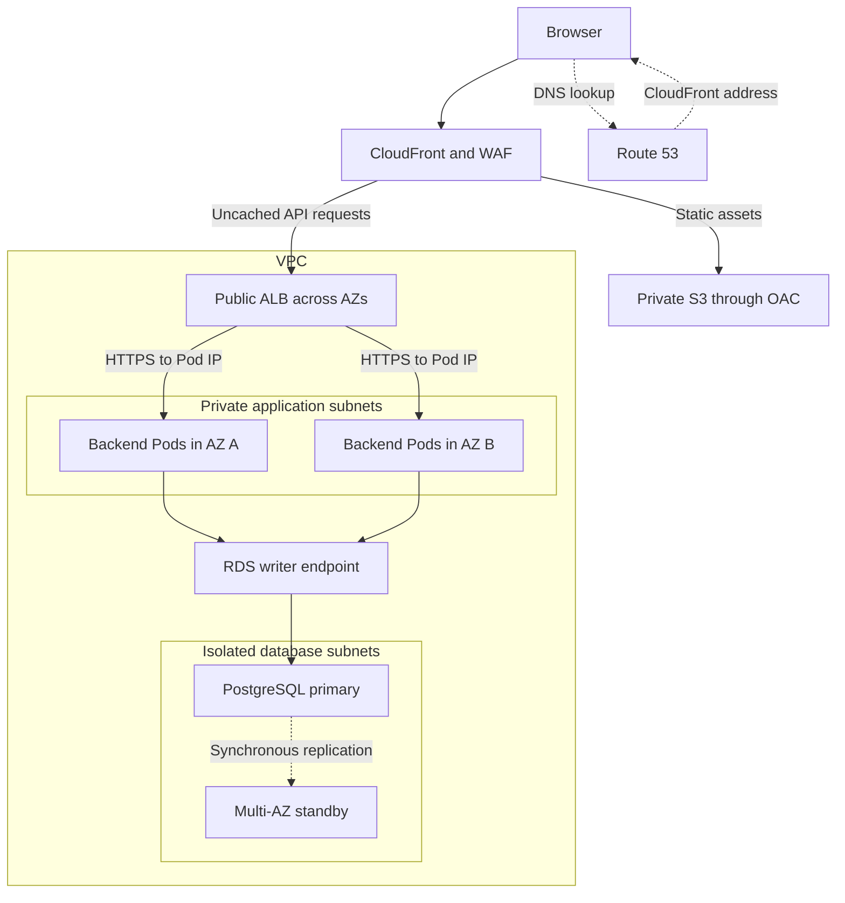
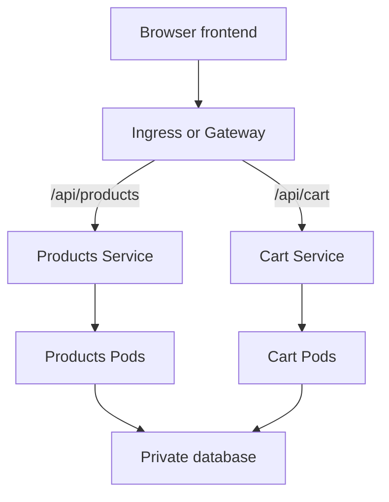
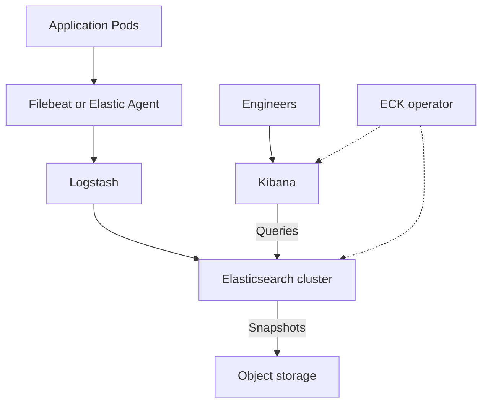
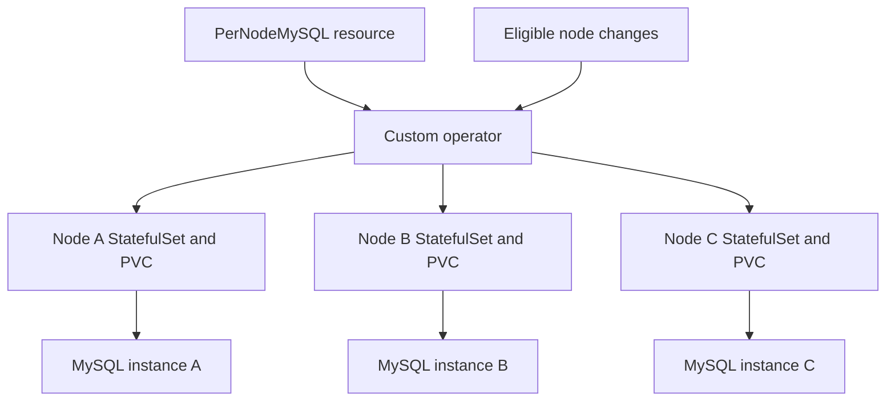

Here are interview-ready answers for **Sigmoid—7 YOE DevOps Engineer**. The coding examples use **Python** and explicit `for` loops.

## 1. Reverse a string using a `for` loop

**Traverse the string from the last character to the first, collect the characters, and join them.**

```python
def reverse_string(text):
    reversed_chars = []

    for index in range(len(text) - 1, -1, -1):
        reversed_chars.append(text[index])

    return "".join(reversed_chars)


print(reverse_string("Hello"))   # olleH
print(reverse_string("DevOps"))  # spOveD
print(reverse_string(""))        # ""
```

For `"Hello"`, the loop visits:

| Index | Character |
|---:|---|
| 4 | `o` |
| 3 | `l` |
| 2 | `l` |
| 1 | `e` |
| 0 | `H` |

**Complexity:** O(n) time and O(n) additional space.

Using a list followed by `join()` avoids repeatedly building larger strings inside the loop.

---

## 2. Check whether a string is a palindrome using a `for` loop

**Compare characters at matching positions from opposite ends. Stop immediately if a pair differs.**

```python
def is_palindrome(text):
    for index in range(len(text) // 2):
        opposite_index = len(text) - 1 - index

        if text[index] != text[opposite_index]:
            return False

    return True


print(is_palindrome("madam"))   # True
print(is_palindrome("abccba"))  # True
print(is_palindrome("hello"))   # False
```

For `"madam"`:

- First comparison: `m == m`.
- Second comparison: `a == a`.
- The middle character does not need comparison.

**Complexity:** O(n) time and O(1) additional space.

This function compares characters exactly. For case-insensitive matching, normalize first:

```python
print(is_palindrome("Madam".casefold()))  # True
```

Whether to ignore spaces and punctuation depends on the requirement. The basic function treats empty strings and single-character strings as palindromes.

---

## 3. In `"Hello World Hello"`, how many times does “hello” occur?

**It occurs twice when matching case-insensitively as a whole word.**

```python
def count_word(text, target):
    count = 0
    target_normalized = target.casefold()

    for word in text.split():
        if word.casefold() == target_normalized:
            count += 1

    return count


text = "Hello World Hello"

print(count_word(text, "hello"))  # 2
```

How the loop works:

| Word | Matches `hello`? | Running count |
|---|---|---:|
| `Hello` | Yes | 1 |
| `World` | No | 1 |
| `Hello` | Yes | 2 |

This counts whitespace-separated words. Consequently, `"helloworld"` does not match `"hello"`. If `"Hello,"` should also count, add punctuation-aware tokenization.

For the fixed target `"hello"`, **time complexity is O(n)** and **additional space is O(n)** because `split()` creates the word list.

If “repeated” means occurrences **after the first**, there is one repetition; the total occurrence count is two.

---

## 4. What is the difference between ReplicaSet and ReplicationController?

**Both maintain a desired number of pods. ReplicaSet is the newer resource and supports more expressive label selectors.**

| Aspect | ReplicationController | ReplicaSet |
|---|---|---|
| API version | `v1` | `apps/v1` |
| Purpose | Maintain the desired pod count | Maintain the desired pod count |
| Selector support | Equality-based labels | Equality-based and set-based requirements |
| Selector structure | Simple label map | `matchLabels` and `matchExpressions` |
| Typical usage | Older applications | Usually managed by a Deployment |
| Rolling updates by itself | No | No |

ReplicaSet supports set-based requirements such as `In`, `NotIn`, `Exists`, and `DoesNotExist`. ReplicationController does not support these set-based requirements. [Kubernetes](https://kubernetes.io/docs/concepts/workloads/controllers/replicaset/?utm_source=chatgpt.com)

Example ReplicationController selector:

```yaml
selector:
  app: orders-api
  environment: production
```

Example ReplicaSet selector:

```yaml
selector:
  matchLabels:
    app: orders-api
  matchExpressions:
    - key: environment
      operator: In
      values:
        - production
        - staging
```

These are selector fragments; a controller’s pod template must satisfy its selector.

### Practical example

Suppose the desired count is three:

- If a selected pod is deleted, the controller creates a replacement.
- If there are too many selected pods under its management, it reduces the count.
- A pod stuck in `CrashLoopBackOff` can still count as an existing pod. Maintaining three pods does not guarantee three healthy application instances.

**For new applications, normally create a Deployment rather than a standalone ReplicaSet.** A Deployment manages ReplicaSets and provides declarative rolling updates and rollback history. [Kubernetes](https://kubernetes.io/docs/concepts/workloads/controllers/replicationcontroller/?utm_source=chatgpt.com)

---

## 5. What backup policies would you implement for Kubernetes?

**Back up Kubernetes state, persistent data, and the dependencies needed to restore the application. Define the policy around RPO and RTO.**

- **RPO—Recovery Point Objective:** how much data loss is acceptable.
- **RTO—Recovery Time Objective:** how long restoration can take.

For example, a critical database might require an RPO of 15 minutes and an RTO of one hour. Backup frequency, log retention, and restore procedures must support those targets.

### What needs backing up?

| Layer | What to protect | Typical approach |
|---|---|---|
| Kubernetes resources | Deployments, Services, CRDs, RBAC, ConfigMaps, Secrets, PVC definitions | Velero and version-controlled configuration |
| Self-managed control-plane state | Kubernetes objects stored in etcd | Consistent etcd snapshots |
| Persistent volume contents | Files stored on application volumes | Supported CSI snapshots, data movement, or filesystem backup |
| Database contents | Records and recovery logs | Database-native backup and point-in-time recovery |
| Recovery dependencies | Required certificates, encryption configuration, keys, images, and infrastructure definitions | Secure, versioned recovery storage |

**An etcd snapshot protects Kubernetes state; it does not contain the application data stored inside persistent volumes.** Kubernetes recommends protecting snapshots because they contain sensitive cluster information. [Kubernetes](https://kubernetes.io/docs/tasks/administer-cluster/configure-upgrade-etcd/?utm_source=chatgpt.com)

### Example policy

The following is an illustrative policy, with different protection requirements for different assets:

| Asset | Backup frequency | Example retention |
|---|---|---|
| Self-managed etcd | Every 15 minutes and before major changes | 7 days |
| Kubernetes application resources | Hourly | 30 days |
| Critical database | Daily base backup plus continuous recovery logs | 30 days |
| Noncritical file volumes | Daily | 30 days |
| Release configuration and images | Every release | Cover the supported recovery period |

### Example: etcd snapshot

For a kubeadm-style installation with the appropriate certificates:

```bash
etcdctl \
  --endpoints=https://127.0.0.1:2379 \
  --cacert=/etc/kubernetes/pki/etcd/ca.crt \
  --cert=/etc/kubernetes/pki/etcd/healthcheck-client.crt \
  --key=/etc/kubernetes/pki/etcd/healthcheck-client.key \
  snapshot save /secure-backup/etcd.db

etcdutl snapshot status /secure-backup/etcd.db --write-out=table
```

Use certificate paths appropriate to the installation. Current guidance uses `etcdutl` for snapshot inspection and restoration. [Kubernetes](https://kubernetes.io/docs/tasks/administer-cluster/configure-upgrade-etcd/?utm_source=chatgpt.com)

### Example: Velero schedule

Assuming Velero, backup storage, and the required volume snapshot integration are configured:

```bash
velero schedule create payments-hourly \
  --schedule="0 * * * *" \
  --include-namespaces=payments \
  --ttl=720h0m0s \
  --snapshot-volumes
```

This requests hourly backups with 30-day retention. Verify the resulting backup status and volume coverage; the command alone does not prove that every volume’s data was protected. [Backup Reference](https://velero.io/docs/main/backup-reference/?utm_source=chatgpt.com)

A CSI snapshot can remain in the underlying storage provider. When the recovery design requires volume data in object storage, configure supported snapshot data movement or another suitable backup mechanism. [CSI Snapshot Data Movement](https://velero.io/docs/main/csi-snapshot-data-movement/?utm_source=chatgpt.com)

### Operational requirements

- Store backups outside the cluster’s failure boundary.
- Encrypt them and restrict read/delete permissions.
- Monitor failed, incomplete, and missing backups.
- Use database-native procedures or application-aware hooks for consistency. A successful volume snapshot alone does not demonstrate application-consistent recovery. [Backup Hooks](https://velero.io/docs/main/backup-hooks/?utm_source=chatgpt.com)
- Perform scheduled restore drills and measure actual RPO/RTO.
- Verify that the recovery environment can access the required storage, images, configuration, and decryption keys.

For managed EKS, AWS operates the control plane. Your recovery policy still needs to protect application resources, configuration, and workload data.

**The strongest interview point:** “I measure backup success through tested restoration, not just through a successful backup job.”

---

## 6. How do you handle deployment failures?

**First identify the failure stage, protect the healthy application version, and decide whether rollback or a forward fix is appropriate.**

A failure could occur during image building, registry push, manifest validation, pod scheduling, startup, or application health checks.

### Step 1: Detect the failure

Make rollout verification part of the deployment pipeline:

```bash
kubectl -n payments rollout status \
  deployment/payments-api \
  --timeout=6m
```

Follow this with application smoke tests and checks of error rate, latency, and important business operations.

**A successful `kubectl apply` does not prove that the application is healthy.**

Also, `progressDeadlineSeconds` does **not** trigger automatic rollback. Kubernetes reports `ProgressDeadlineExceeded`; your deployment process or another controller must decide how to respond. [Kubernetes](https://kubernetes.io/docs/concepts/workloads/controllers/deployment/?utm_source=chatgpt.com)

### Step 2: Diagnose the cause

```bash
kubectl -n payments get pods -l app=payments-api -o wide

kubectl -n payments describe deployment payments-api

kubectl -n payments describe pod <pod-name>

kubectl -n payments logs <pod-name> -c api --tail=100

kubectl -n payments logs <pod-name> -c api --previous

kubectl -n payments get events \
  --sort-by=.metadata.creationTimestamp
```

Use the actual pod and container names. `--previous` retrieves logs from the previous container instance when available.

| Observation | Common investigation |
|---|---|
| `ImagePullBackOff` | Image name/tag, registry access, pull credentials, network |
| `CrashLoopBackOff` | Application logs, startup command, configuration, dependencies |
| `OOMKilled` | Memory limits and application memory usage |
| `Pending` | Resource capacity, taints, affinity, PVC binding |
| Running but not Ready | Readiness endpoint, dependency health, probe settings |

Pod status, events, and container logs are the main starting points for troubleshooting. [Kubernetes](https://kubernetes.io/docs/tasks/debug/debug-application/debug-pods/?utm_source=chatgpt.com)

### Step 3: Recover

If the previous application version remains compatible, roll back to a retained healthy revision:

```bash
kubectl -n payments rollout history deployment/payments-api

# Example: revision 3 is the retained healthy revision.
kubectl -n payments rollout undo \
  deployment/payments-api \
  --to-revision=3

kubectl -n payments rollout status \
  deployment/payments-api \
  --timeout=6m
```

Then repeat the application health checks. Kubernetes supports rolling back a Deployment to an available revision. [Kubernetes](https://kubernetes.io/docs/tasks/run-application/update-deployment-rolling/?utm_source=chatgpt.com)

For GitOps-managed deployments, update or revert the desired configuration in Git so reconciliation maintains the recovered version.

**Check rollback compatibility:** reverting a Deployment’s pod template does not undo database migrations or restore ConfigMap/Secret contents changed in place. Some failures require a forward fix.

### Example: protect the existing version

```yaml
spec:
  replicas: 3
  progressDeadlineSeconds: 300
  strategy:
    type: RollingUpdate
    rollingUpdate:
      maxUnavailable: 0
      maxSurge: 1
```

With three healthy old replicas and a bad image in the new release:

- Kubernetes can create one additional new pod.
- That pod fails to pull its image.
- The existing healthy replicas can continue serving.
- The pipeline detects the stalled rollout and initiates the approved recovery action.

This strategy requires enough spare resources for the additional pod. Readiness probes are also essential because they determine when containers are ready to receive traffic. [Kubernetes](https://kubernetes.io/docs/concepts/workloads/controllers/deployment/?utm_source=chatgpt.com)

To reduce future failures, use immutable image versions, configuration validation, realistic probes, staged promotion, and canary checks. Record the cause and improve the check that should have caught it.

---

## 7. What happens if the master node suddenly fails?

“Master node” is the older term for a **control-plane node**.

**The outcome depends on whether the control plane is highly available and whether etcd still has quorum.**

| Situation | Control-plane impact | Existing applications |
|---|---|---|
| Single control-plane node fails | API access, scheduling, and reconciliation become unavailable | Pods on healthy workers generally continue running |
| One node in a healthy HA control plane fails | Remaining instances can continue managing the cluster | Usually continue, with possible brief management disruption |
| etcd loses quorum | Cluster-state updates cannot proceed | Existing pods may continue, but management and recovery actions stall |

### A. Single control-plane node

The worker’s kubelet and networking components run locally. Therefore, losing the control plane does not automatically stop every existing application container.

However:

- New pods cannot be scheduled normally.
- Deployments and scaling changes cannot be processed.
- Controllers cannot reconcile desired state.
- A pod lost with a failed worker cannot be replaced on another worker through normal scheduling.

The kubelet can still restart containers in existing pods according to their configuration. Application availability remains dependent on healthy workers and application dependencies. [Kubernetes](https://kubernetes.io/docs/concepts/architecture/?utm_source=chatgpt.com)

### B. Highly available control plane

In an HA design:

1. The API load balancer removes the failed backend.
2. Healthy API server instances continue serving requests.
3. Scheduler and controller-manager leadership can move to healthy instances.
4. etcd continues accepting updates if a majority of members remain available.

Scheduler and controller-manager support leader election for replicated HA deployments. [Kubernetes](https://kubernetes.io/docs/reference/command-line-tools-reference/kube-controller-manager/?utm_source=chatgpt.com)

The following shows an illustrative three-node **stacked etcd** topology after one node fails:



With stacked etcd, one node failure removes both a control-plane instance and its etcd member. External etcd separates those failure domains. [Kubernetes](https://kubernetes.io/docs/setup/production-environment/tools/kubeadm/ha-topology/?utm_source=chatgpt.com)

### C. Why etcd quorum matters

| etcd members | Required majority | Member failures tolerated |
|---:|---:|---:|
| 1 | 1 | 0 |
| 3 | 2 | 1 |
| 5 | 3 | 2 |

Having several API servers is insufficient if their etcd cluster cannot reach quorum. Without quorum, etcd cannot agree on cluster-state updates. [etcd](https://etcd.io/docs/v3.6/faq/?utm_source=chatgpt.com)

### Recovery approach

- Determine whether the failure is the node, API server, network, or etcd.
- Check surviving control-plane and etcd members.
- If quorum remains, replace the failed member/node using the documented procedure.
- If quorum is permanently lost, use the tested snapshot recovery procedure.
- After recovery, verify scheduling, controllers, networking, storage, and application health.

Kubernetes etcd recovery also requires correct membership and revision handling so controllers do not retain stale state. [etcd](https://etcd.io/docs/v3.6/op-guide/recovery/?utm_source=chatgpt.com)

For **EKS**, AWS runs the control plane across multiple Availability Zones and detects and replaces unhealthy control-plane instances. You remain responsible for the resilience of worker capacity and application data. [Amazon EKS](https://docs.aws.amazon.com/eks/latest/userguide/disaster-recovery-resiliency.html?utm_source=chatgpt.com)


Download the YAML files, RBAC example, Python script, and supplied log: sigmoid-devops-examples.zip[sigmoid-devops-examples.zip](sandbox:/workspace/scratch/8dc6806ebb9b/sigmoid-devops-examples.zip).

The YAML was checked locally, and the script was tested against your sample.

## 1. What is Terraform taint?

**Taint marks an existing resource in Terraform state for replacement during a subsequent apply.** Marking it does not immediately destroy the resource.

Older command:

```bash
terraform taint aws_instance.app
```

The command is deprecated. The recommended approach is to request replacement through a plan:

```bash
terraform plan \
  -replace=aws_instance.app \
  -out=replacement.tfplan

terraform apply replacement.tfplan
```

This makes the replacement visible in the plan before execution. [HashiCorp Developer](https://developer.hashicorp.com/terraform/cli/commands/taint?utm_source=chatgpt.com)

**Example:** an EC2 instance exists, but its bootstrap configuration is damaged. A replacement plan can recreate it using the desired configuration.

To remove a taint marker:

```bash
terraform untaint aws_instance.app
```

Untainting changes Terraform’s marker; it does not repair the underlying resource.

---

## 2. How do you limit resource usage in Kubernetes? Write requests and limits YAML.

**Use container requests and limits, then apply namespace policies with LimitRange and ResourceQuota.**

| Mechanism | Purpose |
|---|---|
| Requests | Used for scheduling; CPU requests also influence allocation under contention |
| Limits | Restrict container resource consumption |
| LimitRange | Set defaults and permitted resource bounds within a namespace |
| ResourceQuota | Cap aggregate declared resources and object counts within a namespace |

CPU limits are enforced through throttling. Exceeding a memory limit can result in an OOM kill. **Requests are not usage ceilings.** [Kubernetes](https://kubernetes.io/docs/concepts/configuration/manage-resources-containers/?utm_source=chatgpt.com)

### Container requests and limits

```yaml
apiVersion: v1
kind: Pod
metadata:
  name: resource-demo
  namespace: devops-demo
spec:
  containers:
    - name: web
      image: nginx:alpine
      resources:
        requests:
          cpu: 200m
          memory: 128Mi
        limits:
          cpu: 500m
          memory: 256Mi
```

Here:

- `200m` means a CPU request of **0.2 CPU**.
- `500m` means a CPU limit of **0.5 CPU**.
- `128Mi` is the memory request.
- `256Mi` is the memory limit.

Requests and limits apply to each container. Account for sidecars when sizing the pod.

### Namespace defaults and bounds

```yaml
apiVersion: v1
kind: LimitRange
metadata:
  name: container-defaults
  namespace: devops-demo
spec:
  limits:
    - type: Container
      min:
        cpu: 100m
        memory: 64Mi
      max:
        cpu: "1"
        memory: 1Gi
      defaultRequest:
        cpu: 200m
        memory: 128Mi
      default:
        cpu: 500m
        memory: 256Mi
```

LimitRange can supply missing values and reject configurations outside its constraints. [Kubernetes](https://kubernetes.io/docs/concepts/policy/limit-range/?utm_source=chatgpt.com)

### Namespace aggregate budget

```yaml
apiVersion: v1
kind: ResourceQuota
metadata:
  name: namespace-budget
  namespace: devops-demo
spec:
  hard:
    requests.cpu: "2"
    requests.memory: 2Gi
    limits.cpu: "4"
    limits.memory: 4Gi
    pods: "10"
```

This caps the namespace’s aggregate declared requests and limits. Quota enforcement happens during admission; it does not continuously throttle a namespace based on measured CPU consumption. [Kubernetes](https://kubernetes.io/docs/concepts/policy/resource-quotas/?utm_source=chatgpt.com)

The downloadable resource example also creates the namespace.

---

## 3. Write the requested readiness-probe Deployment

```yaml
apiVersion: apps/v1
kind: Deployment
metadata:
  name: space-alien-welcome-message-generator
spec:
  replicas: 1

  selector:
    matchLabels:
      app: space-alien-welcome-message-generator

  template:
    metadata:
      labels:
        app: space-alien-welcome-message-generator
    spec:
      containers:
        - name: httpd
          image: httpd:alpine
          ports:
            - containerPort: 80

          readinessProbe:
            exec:
              command:
                - stat
                - /tmp/ready
            initialDelaySeconds: 10
            periodSeconds: 5
```

**How it works:** `stat /tmp/ready` fails while the file is absent. Once the command succeeds, the readiness probe can mark the container ready. The configured initial delay is ten seconds and the period is five seconds. [Kubernetes](https://kubernetes.io/docs/concepts/workloads/pods/probes/?utm_source=chatgpt.com)

Test it:

```bash
kubectl apply -f space-alien-welcome-message-generator.yaml

kubectl get pods \
  -l app=space-alien-welcome-message-generator

kubectl exec \
  deployment/space-alien-welcome-message-generator \
  -- touch /tmp/ready

kubectl rollout status \
  deployment/space-alien-welcome-message-generator
```

The exec command is expressed as separate executable and argument entries. No shell is needed.

---

## 4. What happens if liveness is healthy but readiness fails?

**The container continues running, but the pod becomes unready and is excluded from normal traffic through matching Services.**

| Property | Result |
|---|---|
| Container process | Continues running |
| Pod phase | Can remain `Running` |
| Pod readiness | `False` |
| Normal Service traffic | Pod is excluded as a ready backend |
| Restart due solely to readiness failure | No |
| Readiness checks | Continue |

Readiness failure does not trigger the restart behavior associated with liveness failure. [Kubernetes](https://kubernetes.io/docs/concepts/workloads/pods/probes/?utm_source=chatgpt.com)

**Example:** an API process is alive, but its database connection is unavailable:

- Liveness succeeds because the process is functioning.
- Readiness fails because the application cannot serve useful requests.
- Traffic can go to other ready replicas.

A Deployment rollout may stall if the new replicas never become ready.

Readiness controls backend eligibility; it does not act as a network firewall preventing every possible direct connection to the pod.

---

## 5. How do you identify data loss when switching back between databases?

Assuming this means **database failover and failback**, use replication evidence and application-level reconciliation.

**Do not switch an old primary back into service merely because it is running again.** It may be missing writes committed on the promoted database.

### Approach

1. **Identify the authoritative primary and fence competing writers.** Prevent both databases from accepting independent writes.
2. **Preserve evidence.** Retain relevant recovery logs, transaction records, and application acknowledgements.
3. **Compare replication positions.** Use WAL positions, binlog/GTID positions, or the database’s equivalent.
4. **Reconcile important records.** Compare expected transaction IDs, key ranges, counts, and content checksums.
5. **Rejoin or rebuild the old database as a replica.** Let it catch up before a controlled failback.

With asynchronous replication, acknowledged transactions can be lost if they had not reached the standby before the primary failed. [postgresql.org](https://www.postgresql.org/docs/current/warm-standby.html?utm_source=chatgpt.com)

### PostgreSQL example

After stopping new writes and draining outstanding transactions, capture the current primary’s durable WAL position:

```sql
SELECT pg_current_wal_flush_lsn();
```

On the candidate standby:

```sql
SELECT pg_last_wal_replay_lsn();
```

The first reports the WAL flush position; the second reports the position replayed during recovery. [postgresql.org](https://www.postgresql.org/docs/current/functions-admin.html?utm_source=chatgpt.com)

Verify that the standby has replayed the required position **on the appropriate shared replication history**. Numerically similar LSNs on divergent timelines do not prove identical data.

Also:

- A WAL gap measures bytes, not the number of missing rows.
- Equal row counts do not prove equal contents.
- Gaps in auto-increment IDs do not automatically mean data loss.
- A successful database connection does not prove recovery completeness.

If the original database is unavailable and no independent expected-write record exists, report the estimated loss window and verification limits rather than claiming zero loss.

---

## 6. Have you integrated a global load balancer with Kubernetes?

Describe your actual experience. An **AWS/EKS architecture you can explain** uses Global Accelerator with regional ALBs.



Global Accelerator provides fixed entry-point IP addresses and routes traffic to regional endpoints using health, location, and configured routing controls. Regional ALBs perform HTTP routing. [AWS Global Accelerator](https://docs.aws.amazon.com/global-accelerator/latest/dg/introduction-how-it-works.html?utm_source=chatgpt.com)

### Integration steps

1. Deploy the application in each regional cluster.
2. Configure the AWS Load Balancer Controller and Kubernetes Ingress/Service resources.
3. Create regional ALBs and verify target health.
4. Add the ALBs to Global Accelerator endpoint groups.
5. Configure traffic distribution, DNS, TLS, and application health checks.
6. Test regional failure and recovery.

In ALB **IP target mode**, traffic goes directly to pod IPs. The Kubernetes Service and Ingress objects configure that integration; traffic does not necessarily traverse a ClusterIP hop. [Amazon EKS](https://docs.aws.amazon.com/eks/latest/userguide/alb-ingress.html?utm_source=chatgpt.com)

Keep session state and database recovery requirements in the regional design. Global traffic steering does not itself synchronize application data.

**Operational detail:** endpoint failover changes routing for new connections. Established connections do not migrate automatically to another regional application instance. [AWS Global Accelerator](https://docs.aws.amazon.com/global-accelerator/latest/dg/introduction-how-it-works.html?utm_source=chatgpt.com)

---

## 7. How do you enable RBAC for ServiceAccounts?

**A ServiceAccount provides a workload identity. A Role and RoleBinding authorize that identity to perform Kubernetes API operations.**

Assuming RBAC is enabled on the cluster:

```yaml
apiVersion: v1
kind: ServiceAccount
metadata:
  name: pod-reader
  namespace: devops-demo
---
apiVersion: rbac.authorization.k8s.io/v1
kind: Role
metadata:
  name: read-pods
  namespace: devops-demo
rules:
  - apiGroups: [""]
    resources: ["pods"]
    verbs: ["get", "list", "watch"]
---
apiVersion: rbac.authorization.k8s.io/v1
kind: RoleBinding
metadata:
  name: pod-reader-binding
  namespace: devops-demo
subjects:
  - kind: ServiceAccount
    name: pod-reader
    namespace: devops-demo
roleRef:
  apiGroup: rbac.authorization.k8s.io
  kind: Role
  name: read-pods
```

RoleBinding connects the ServiceAccount to the Role. These permissions allow reading pods in `devops-demo`. RBAC grants are additive, so consider any other bindings that apply. [Kubernetes](https://kubernetes.io/docs/reference/access-authn-authz/rbac/?utm_source=chatgpt.com)

Assign the account in a pod’s spec, or a Deployment’s pod template:

```yaml
spec:
  serviceAccountName: pod-reader
```

ServiceAccounts are intended for workload authentication, with authorization configured separately. [Kubernetes](https://kubernetes.io/docs/concepts/security/service-accounts/?utm_source=chatgpt.com)

From an administrator identity permitted to impersonate the ServiceAccount:

```bash
kubectl auth can-i list pods \
  --namespace=devops-demo \
  --as=system:serviceaccount:devops-demo:pod-reader

kubectl auth can-i delete pods \
  --namespace=devops-demo \
  --as=system:serviceaccount:devops-demo:pod-reader
```

With only the demonstrated grants, the expected answers are `yes` and `no`.

A ClusterRole can be bound within one namespace using a RoleBinding. Use a ClusterRoleBinding when the required authorization must apply at cluster scope.

Kubernetes RBAC and AWS IAM permissions are separate authorization systems.

---

## 8. A Terraform resource was created, but provisioning failed. What happens?

**If a creation-time provisioner fails under its default failure behavior, Terraform marks the resource as tainted and the apply fails.**

For example:

1. Terraform creates an EC2 instance.
2. A `remote-exec` provisioner attempts application installation.
3. Installation fails.
4. The instance can remain present and tracked as tainted.
5. A subsequent plan normally proposes destroying and recreating it. [HashiCorp Developer](https://developer.hashicorp.com/terraform/language/provisioners?utm_source=chatgpt.com)

Terraform does not automatically undo every successful change from that apply.

You can configure a provisioner with:

```hcl
on_failure = continue
```

This changes its failure handling and default tainting behavior. It is appropriate only when failure of that operation is acceptable.

**Distinguish provisioner failure from provider/API failure.** A partially created cloud object may be tracked in returned state, or it may require reconciliation if the provider could not return its identity. Inspect both Terraform state and the actual infrastructure before recovery.

---

## 9. What is the purpose of `null_resource`?

**`null_resource` is a Terraform-managed placeholder that can hold provisioners and participate in dependency relationships without representing a normal cloud resource.**

A common use is running a script when a configuration input changes:

```hcl
resource "null_resource" "configure_app" {
  triggers = {
    config_hash = filesha256("${path.module}/app-config.json")
  }

  provisioner "local-exec" {
    command = "bash scripts/configure-app.sh"
  }
}
```

When a value in the `triggers` map changes, Terraform replaces the null resource and reruns its creation-time provisioners. [Terraform Registry](https://registry.terraform.io/providers/hashicorp/null/3.2.1/docs/resources/resource?utm_source=chatgpt.com)

Example uses include bootstrap steps, external integrations, or an operation that lacks a suitable provider resource.

Current Terraform also offers the built-in **`terraform_data`** resource:

```hcl
resource "terraform_data" "configure_app" {
  triggers_replace = filesha256("${path.module}/app-config.json")

  provisioner "local-exec" {
    command = "bash scripts/configure-app.sh"
  }
}
```

`terraform_data` supports lifecycle-managed values and provisioner execution without requiring the null provider. [HashiCorp Developer](https://developer.hashicorp.com/terraform/language/resources/terraform-data?utm_source=chatgpt.com)

Terraform tracks the placeholder and its inputs; it does not model every side effect performed inside the script. Prefer provider-supported configuration or bootstrap mechanisms where those can represent the desired state.

---

## 10. A developer committed a hardcoded password. How do you handle it through CI?

**Rotate or revoke the exposed credential first, then remove the hardcoding and strengthen prevention.** Deleting the latest occurrence does not invalidate a leaked credential. [GitHub Docs](https://docs.github.com/en/authentication/keeping-your-account-and-data-secure/removing-sensitive-data-from-a-repository?utm_source=chatgpt.com)

### Immediate response

- Stop further promotion of the affected release.
- Rotate the password and update authorized consumers.
- Review relevant access/audit logs.
- Remove the hardcoded value and obtain it through an appropriate secret-management mechanism.
- Inspect affected build logs, artifacts, and container images.

Evaluate whether repository-history cleanup is required. Rewriting shared history requires coordinated handling of branches, tags, and existing clones; credential rotation remains the immediate access-control remedy.

### CI prevention

Run secret scanning before building or publishing artifacts. For example, with a pinned Gitleaks installation:

```bash
gitleaks git . \
  --redact \
  --exit-code 1 \
  --log-opts="--all"
```

Gitleaks can scan Git patches and return a failing exit code when it finds leaks. Redaction reduces exposure in scanner output. [GitHub](https://github.com/gitleaks/gitleaks?utm_source=chatgpt.com)

For routine PR checks, scan the required commit range after fetching its history. Use periodic full-history scans as well. Handle known historical findings through reviewed remediation or baselines.

Also enable repository push protection for supported secret formats and add rules for organization-specific credentials. Push protection can block a leak before it reaches the repository. [GitHub Docs](https://docs.github.com/en/code-security/concepts/secret-security/command-line-push-protection?utm_source=chatgpt.com)

---

## 11. What is your approach when a Terraform deployment fails?

**Treat an apply as potentially partial. Determine what changed, repair the cause, and review a fresh recovery plan.**

| Failure stage | Recovery focus |
|---|---|
| Validation or planning | Fix configuration, variables, credentials, or provider initialization |
| Provider/API operation | Inspect state and actual infrastructure for completed or partial changes |
| Provisioner | Fix the bootstrap operation and review any proposed replacement |
| Backend state persistence | Preserve recovery state and repair state storage before another apply |
| Interrupted operation | Verify process and lock status before continuing |

A practical sequence is:

1. Identify the exact failing operation and preserve its diagnostics.
2. Confirm the correct backend, environment, configuration revision, and identity.
3. Inspect resources already recorded in state.
4. Reconcile partially created objects and import an existing object if necessary.
5. Repair the underlying issue.
6. Generate and review a new plan.

```bash
terraform validate

terraform state list

terraform state show aws_instance.app

terraform plan \
  -var-file=env/dev.tfvars \
  -out=recovery.tfplan

terraform apply recovery.tfplan
```

Verify the previous apply has stopped before clearing an abandoned lock.

**State-storage failure deserves special handling:** if Terraform cannot persist state to the remote backend, it can write recovery state locally. Preserve that snapshot and follow the documented recovery process before performing another deployment. [HashiCorp Developer](https://developer.hashicorp.com/terraform/language/state/backends?utm_source=chatgpt.com)

Do not assume that reverting configuration restores the previous infrastructure exactly; the resulting plan may include replacements or additional changes.

---

## 12. Write a script to capture repeated failures

**The supplied input and expected output do not match the stated “more than 3” rule.**

Exact counts are:

| Error message | Count | More than 3? |
|---|---:|---|
| `Connection failed to database` | 4 | Yes |
| `Timeout while reading from API` | 2 | No |
| `Timeout while reading` | 1 | No |

Even grouping the last message with the API timeouts produces **three**, which is still not more than three.

### Python implementation

```python
from collections import Counter
import re
import sys

ERROR_LINE = re.compile(
    r"^\d{4}-\d{2}-\d{2}\s+"
    r"\d{2}:\d{2}:\d{2}\s+ERROR:\s*(.+)$"
)

counts = Counter()

with open(sys.argv[1], encoding="utf-8") as log_file:
    for line in log_file:
        match = ERROR_LINE.fullmatch(line.rstrip("\r\n"))

        if match:
            message = match.group(1).strip()

            if message:
                counts[message] += 1

alerted = False

for message, count in counts.items():
    if count > 3:
        print(f"[ALERT] {message!r} occurred more than 3 times")
        alerted = True

sys.exit(1 if alerted else 0)
```

Run:

```bash
python3 capture_failures.py sample_failures.log
```

Correct output for the supplied input:

```text
[ALERT] 'Connection failed to database' occurred more than 3 times
```

The downloaded script additionally supports a configurable threshold, displaying counts, and file/argument error handling.

To produce the second alert, either supply at least four matching API errors or explicitly change the policy to **“at least three”** with an agreed normalization rule for the truncated message.

This implementation counts across the entire file. A sliding time window would require an additional requirement.

---

## 13. What is a DNS custom resolver?

**A DNS resolver answers or forwards DNS queries for clients. A custom resolver lets you control where particular names are resolved.**

Examples include corporate domains, hybrid-cloud private names, and Kubernetes upstream DNS.

### Kubernetes example

CoreDNS normally handles cluster names and forwards other queries to upstream resolvers. You can add a domain-specific forwarding block:

```text
corp.internal:53 {
    errors
    cache 30
    forward . 10.20.0.10 10.20.0.11
}
```

This sends queries for `corp.internal` to the specified corporate DNS servers. Keep the existing CoreDNS configuration that serves the Kubernetes cluster domain. [Kubernetes](https://kubernetes.io/docs/tasks/administer-cluster/dns-custom-nameservers/?utm_source=chatgpt.com)

For example:

- `orders.default.svc.cluster.local` resolves through Kubernetes DNS.
- `database.corp.internal` is forwarded to corporate DNS.
- Other names use the configured default upstream.

### AWS hybrid DNS

| Component | Direction and purpose |
|---|---|
| Resolver inbound endpoint | Allows on-premises DNS to forward queries into AWS |
| Resolver outbound endpoint | Allows AWS Resolver to forward selected queries to external/on-premises DNS |
| Forwarding rule | Specifies which domain should use the external resolver |

Inbound and outbound endpoints serve different directions of hybrid resolution. [Amazon Route 53](https://docs.aws.amazon.com/Route53/latest/DeveloperGuide/resolver-forwarding-outbound-queries.html?utm_source=chatgpt.com)

Verify routing and both UDP/TCP port 53 connectivity, and avoid forwarding loops. Useful diagnostics include `dig`, CoreDNS logs, query latency, and `SERVFAIL` rates.

---

## 14. Which metrics do you use for monitoring?

**Start with user-facing reliability, then monitor the components that explain failures and capacity pressure.**

The four golden signals are **latency, traffic, errors, and saturation**. [sre golden signals](https://sre.google/sre-book/monitoring-distributed-systems/?utm_source=chatgpt.com)

| Area | Useful metrics |
|---|---|
| Application latency | p50, p95, p99; successful and failed request latency |
| Traffic | Requests/second, concurrent requests, messages processed |
| Errors | Failed-request percentage, timeouts, dependency failures |
| Saturation | CPU contention/throttling, queue depth, pending work |
| Kubernetes | Ready replicas, unavailable replicas, restarts, OOM kills, Pending pods, node pressure |
| Compute | CPU usage, available memory, load and resource headroom |
| Storage | Free space, inodes, read/write latency, IOPS |
| Database | Replication lag, connections, locks, query latency, transaction failures |
| DNS/network | DNS latency, `SERVFAIL`, packet loss, connection errors |
| Delivery/recovery | Deployment failures, rollout duration, backup freshness, restore results |

### Example alert

For an API, an example condition might be:

```text
Failed-request percentage exceeds 1% over five minutes,
with enough traffic to make the measurement meaningful.
```

Tune thresholds from the service’s SLO and load-test results.

For Kubernetes, CPU usage alone is insufficient. A service can have low average CPU while experiencing throttling, unavailable replicas, or pods that cannot be scheduled.

An example monitoring stack is Prometheus, kube-state-metrics, node exporters, Grafana, Alertmanager, and CloudWatch for AWS service metrics. Correlate alerts with logs and traces during diagnosis.

Keep metric labels bounded—for example, environment, service, route, and status—so cardinality remains manageable. [Prometheus](https://prometheus.io/docs/practices/naming/?utm_source=chatgpt.com)


These answers use AWS examples with `us-east-1` and `us-west-2`. I treat “us-south” in the question as the primary region.

**1. If a load balancer’s region goes down, what happens?**

An AWS ALB or NLB is a **regional resource**. It can distribute traffic across Availability Zones within its region, but it does not automatically move into another region.

During a complete regional outage:

- Requests to that regional application can fail or time out.
- Its DNS name may still resolve; DNS resolution does not prove application availability.
- Healthy servers in another region do not help unless traffic routing and application recovery have been configured.

For regional recovery, deploy a second application stack and use global routing:

| Option | How regional failover works |
|---|---|
| Route 53 failover routing | Returns the secondary endpoint when the primary is unhealthy; recovery depends partly on health detection and DNS caching. |
| AWS Global Accelerator | Routes new connections to another healthy regional endpoint after detecting failure. Existing connections must reconnect. |

Route 53 supports primary/secondary failover records; Global Accelerator supports health-based routing across regional endpoints. Neither creates the replacement application stack for you. [Amazon Route 53](https://docs.aws.amazon.com/Route53/latest/DeveloperGuide/routing-policy-failover.html?utm_source=chatgpt.com)



The recovery application must have usable data, credentials, network access, and sufficient capacity. A healthy load balancer alone is insufficient.

**Interview answer:** “Multi-AZ load balancing handles failures within a region. For a regional outage, I need another regional application stack and Route 53 or Global Accelerator to redirect traffic.”

---

**2. RDS is in us-west, with cross-region read replicas. How do you redirect traffic without paying for another database?**

**Promote an existing healthy read replica.** You already have another database instance because each read replica has its own compute and storage.

For a standard RDS PostgreSQL or MySQL example, my recovery procedure is:

1. Confirm the primary failure.
2. Fence the old writer: prevent the original application from resuming writes unexpectedly.
3. Choose the healthiest replica using replication progress and available capacity.
4. Promote that replica to an independent writable database.
5. Verify that promotion completed and the database accepts writes.
6. Update the application’s database endpoint configuration.
7. Refresh application connection pools and validate transactions.
8. Enable application traffic to the recovery region.

Read-replica promotion is a recovery operation, not merely a DNS change. RDS can reboot the replica during promotion, and promotion takes time. [Amazon Relational Database Service](https://docs.aws.amazon.com/AmazonRDS/latest/UserGuide/USER_ReadRepl.Promote.html?utm_source=chatgpt.com)

Example: promote a replica located in `us-east-1`, while the original writer was in `us-west-2`:

```bash
aws rds promote-read-replica \
  --region us-east-1 \
  --db-instance-identifier orders-dr

aws rds wait db-instance-available \
  --region us-east-1 \
  --db-instance-identifier orders-dr
```

After confirming it is writable, retrieve its endpoint and update the application’s `DB_HOST` configuration. The web ALB does not redirect SQL database connections.

Cross-region replication is asynchronous, so recently acknowledged writes might not have reached the replica before the outage. Assess this against the business’s **RPO**, the acceptable data-loss window. **RTO** is the acceptable recovery time. [Amazon Relational Database Service](https://docs.aws.amazon.com/AmazonRDS/latest/UserGuide/USER_ReadRepl.Promote.html?utm_source=chatgpt.com)

**What if the client cannot afford a continuously running replica?**

| Design | Normal operating cost | Recovery trade-off |
|---|---|---|
| Cross-region backup and restore | Lower; backup storage and transfer | Must restore a DB before serving traffic |
| Pilot light | Core data resources remain running | Must create or scale application resources |
| Warm standby | Smaller application stack stays running | Faster recovery, but capacity may need scaling |
| Full second-region stack | Higher | Less provisioning needed during recovery |

RDS supports cross-region replication of automated backups for supported configurations. This avoids continuously running recovery DB compute, but recovery requires restoring an instance. [Amazon Relational Database Service](https://docs.aws.amazon.com/AmazonRDS/latest/UserGuide/USER_ReplicateBackups.html?utm_source=chatgpt.com)

A smaller replica can reduce compute cost, provided it keeps up with replication and can support recovery traffic. Storage and replication-transfer costs still apply.

After recovery, rebuild or reconfigure replication from the new primary. Other replicas do not automatically start following it. Failback should be a planned operation.

**Interview answer:** “I would promote an existing cross-region replica and update the application’s database configuration. If the client cannot fund a running replica, I would propose cross-region backups and explicitly agree on the longer recovery time.”

---

**3. Which deployment strategy is best when only one Pod is running?**

The key distinction is **one steady-state replica** versus **a strict maximum of one Pod at any time**.

| Constraint | Suitable strategy | Result |
|---|---|---|
| One replica normally, but temporary extra capacity is available | Rolling update | Old Pod can serve while the replacement starts |
| Only one Pod is permitted at any time | Recreate | Downtime during replacement |
| Controlled traffic switching and quick application rollback are priorities | Blue/green | Requires blue and green to coexist |

For a stateless web application, I would usually choose a rolling update with:

```yaml
spec:
  replicas: 1
  minReadySeconds: 10
  strategy:
    type: RollingUpdate
    rollingUpdate:
      maxSurge: 1
      maxUnavailable: 0
```

These are fields within a Deployment:

- `maxSurge: 1` allows an additional Pod during the rollout.
- `maxUnavailable: 0` prevents deliberately removing the available old Pod before the replacement becomes available.
- `minReadySeconds: 10` requires the replacement to remain ready before it counts as available. [Kubernetes](https://kubernetes.io/docs/concepts/workloads/controllers/deployment/?utm_source=chatgpt.com)

Use a meaningful readiness probe, available scheduling capacity, graceful shutdown, and compatible database migrations.

If the new Pod cannot schedule or become ready, the rollout can stall while the old Pod continues serving. This configuration supports deployment continuity; **one replica still provides no ongoing application redundancy** against an unexpected Pod or node failure.

For applications that require exclusive storage access or prohibit concurrent instances, Recreate may be necessary.

---

**4. In blue/green deployment, exactly which configuration changes to reroute traffic?**

It depends on the routing layer.

| Routing layer | Configuration to change |
|---|---|
| Kubernetes Service | `spec.selector` |
| Ingress routing to separate Services | Backend Service reference |
| AWS ALB | Listener rule’s `forward` action or target-group weights |
| DNS-based switching | DNS record target or routing configuration |

**Kubernetes example**

Assume:

- Blue Pods have labels `app: web`, `slot: blue`.
- Green Pods have labels `app: web`, `slot: green`.
- The external Ingress continues targeting the stable Service `web-live`.

Initially, the Service selects blue:

```yaml
apiVersion: v1
kind: Service
metadata:
  name: web-live
spec:
  selector:
    app: web
    slot: blue
  ports:
    - port: 80
      targetPort: 8080
```

After testing green through a preview Service, change **the live Service selector**:

```bash
kubectl patch service web-live --type=merge \
  -p '{"spec":{"selector":{"app":"web","slot":"green"}}}'
```

Rollback the traffic switch:

```bash
kubectl patch service web-live --type=merge \
  -p '{"spec":{"selector":{"app":"web","slot":"blue"}}}'
```

Kubernetes updates the Service’s EndpointSlices to match the selected Pods. Keep the Deployment selectors unchanged. [Kubernetes](https://kubernetes.io/docs/concepts/services-networking/service/?utm_source=chatgpt.com)

**AWS ALB example**

Create separate blue and green target groups. Change the relevant listener rule:

| Stage | Blue weight | Green weight |
|---|---:|---:|
| Before release | 100 | 0 |
| Optional validation phase | 95 | 5 |
| After cutover | 0 | 100 |

The exact ALB field is:

```text
Actions[].ForwardConfig.TargetGroups[].Weight
```

For a single-target forwarding action, change `TargetGroupArn`. If routing uses the listener’s default action, modify that default action instead.

**Weighted ALB target groups do not automatically fail over to another target group when one group is empty or unhealthy.** Deployment automation must make the routing decision. [Elastic Load Balancing](https://docs.aws.amazon.com/elasticloadbalancing/latest/application/rule-action-types.html?utm_source=chatgpt.com)

Retain blue during the observation period and allow existing connections to drain. With GitOps or a Kubernetes ALB controller, update the source configuration so reconciliation preserves the switch.

Application rollback also requires database schema compatibility; switching traffic does not undo database writes.

---

**5. A new web deployment happened today. How do you detect issues before users report them?**

I would combine **synthetic checks, release-specific monitoring, and controlled exposure**.

**Synthetic checks**

Run customer journeys regularly, including when real traffic is low:

- Open the website and verify expected content.
- Log in using a test account.
- Search or retrieve data.
- Perform a safe test transaction.
- Verify its resulting state.
- Check certificate validity and response time.

CloudWatch Synthetics supports scheduled endpoint and browser checks that follow customer-like workflows. [Amazon CloudWatch](https://docs.aws.amazon.com/AmazonCloudWatch/latest/monitoring/CloudWatch_Synthetics_Canaries.html?utm_source=chatgpt.com)

**Monitor the release**

| Area | Useful signals |
|---|---|
| Availability | Synthetic success, HTTP errors |
| Performance | p95/p99 latency, dependency response time |
| Application | Exceptions, timeouts, failed transactions |
| Kubernetes | Readiness, restarts, OOM kills, CPU throttling |
| Database | Connection failures, locks, query latency |
| Frontend | JavaScript errors, page-load failures |
| Business | Order completion, payment success, login success |

Tag logs, metrics, and traces with the release version, then compare the new version against the previous version and its baseline. Latency, traffic, errors, and saturation are useful starting signals. [sre golden signals](https://sre.google/sre-book/monitoring-distributed-systems/?utm_source=chatgpt.com)

**Example**

Before deployment:

- p95 latency: 250 ms.
- HTTP 5xx rate: 0.1%.

After deployment:

- p95 latency: 900 ms.
- HTTP 5xx rate: 3%.
- Database timeout exceptions increase.

The release pipeline should pause promotion or initiate the agreed rollback procedure when these conditions exceed defined thresholds with sufficient traffic.

For a new release, expose a small traffic percentage first and increase it only after checks pass. A readiness probe returning `200` cannot prove that login, checkout, or data correctness works.

---

**6. What practical difficulties arise with infrastructure in two regions?**

| Difficulty | Practical approach |
|---|---|
| Replication lag and possible data loss | Monitor replication progress; define and test RPO |
| Conflicting writes during recovery | Establish one authoritative writer and fence the old one |
| Increased latency | Keep application requests close to their database; reduce cross-region calls |
| Additional cost | Account for replicated storage, compute, transfer, networking, and observability |
| Configuration drift | Reuse Terraform modules with separate regional configuration and state |
| Regional dependencies | Prepare images, secrets, certificates, keys, and required services in recovery |
| Insufficient recovery capacity | Validate quotas and test scaling to the expected recovery load |
| Session and cache behavior | Use an explicit session strategy; avoid relying on instance-local state |
| Monitoring failure | Run external checks and maintain monitoring outside the primary region |
| Difficult failback | Resynchronize data and perform a controlled return |
| Data-location restrictions | Replicate only to approved regions |

A common failure is having recovery servers available but keeping their image registry, database credentials, or deployment pipeline dependent on the failed region.

**Interview answer:** “The hardest part is consistent data and coordinated recovery. I validate that the second region can serve the application independently, then regularly test failover and failback.”

---

**7. Write a shell script to delete log files older than 30 days**

This GNU/Linux script uses **last modification time** and supports previewing the matches.

```bash
#!/usr/bin/env bash
set -euo pipefail

if (( $# < 1 || $# > 2 )); then
  printf 'Usage: %s LOG_DIRECTORY [--dry-run|--delete]\n' "$0" >&2
  exit 2
fi

log_dir=$(realpath -e -- "$1")
mode="${2:---dry-run}"

if [[ ! -d "$log_dir" || "$log_dir" == / ]]; then
  printf 'Use a specific application log directory.\n' >&2
  exit 2
fi

find_args=(
  "$log_dir" -xdev -type f
  \( -name '*.log' -o -name '*.log.*' \)
  ! -newermt '30 days ago'
)

case "$mode" in
  --dry-run)
    TZ=UTC0 find "${find_args[@]}" -print
    ;;
  --delete)
    TZ=UTC0 find "${find_args[@]}" -delete -print
    ;;
  *)
    printf 'Unknown mode: %s\n' "$mode" >&2
    exit 2
    ;;
esac
```

Usage:

```bash
# Preview
bash delete_old_logs.sh /var/log/myapp --dry-run

# Delete matching files
bash delete_old_logs.sh /var/log/myapp --delete
```

The script:

- Matches regular `.log` and rotated `.log.*` files.
- Uses a cutoff of 30 days ago in UTC.
- Preserves directories and descendant symlinks.
- Avoids crossing into other mounted filesystems.

`-mtime +30` rounds age down to complete 24-hour periods, so it generally starts matching at 31 days. The timestamp comparison avoids that extra-day boundary. It includes files modified at or before the cutoff. [gnu.org](https://www.gnu.org/software/findutils/manual/html_node/find_html/Age-Ranges.html?utm_source=chatgpt.com)

Use this against rotated logs under the agreed retention policy. For continuing rotation of active application logs, configure `logrotate`.

---

**8. Explain the failover mechanism in a load balancer**

Separate the failure levels:

| Failure | Recovery mechanism |
|---|---|
| One application target fails | Health checks remove it from normal traffic selection; remaining healthy targets serve |
| An EC2 instance fails | ASG replaces it using configured health checks |
| An Availability Zone fails | Multi-AZ load balancer and surviving targets serve traffic |
| A region fails | Global routing selects another regional stack |
| Database fails | Database recovery is required; application load balancing does not elect a DB writer |

For ALB, configure a target-group health check such as:

```text
Protocol: HTTP
Path: /ready
Success code: 200
Interval: 10 seconds
Unhealthy threshold: 2
Healthy threshold: 2
```

Choose values suitable for the application. The readiness endpoint should reflect whether the application can serve its intended workload.

ALB normally routes requests to healthy targets. However, **if all registered targets in a target group are unhealthy, ALB can fail open and route to those unhealthy targets**. Health checks are therefore not a general traffic-blocking mechanism. [Elastic Load Balancing](https://docs.aws.amazon.com/elasticloadbalancing/latest/application/target-group-health-checks.html?utm_source=chatgpt.com)

Also enable **ELB health checks in the ASG** if application health failures should cause instance replacement. ASG does not use ELB health results for replacement by default. [Amazon EC2 Auto Scaling](https://docs.aws.amazon.com/autoscaling/ec2/userguide/getting-started-elastic-load-balancing.html?utm_source=chatgpt.com)

Client timeouts, retries with backoff, and idempotency are still necessary because failover does not preserve every in-flight request.

---

**9. Can an ASG and load balancer be in different regions?**

**They cannot use the normal direct ASG-to-load-balancer attachment across regions.**

For managed integration, the load balancer and target group must be in the same AWS account, VPC, and region as the ASG. The target group must use the `instance` target type. [Amazon EC2 Auto Scaling](https://docs.aws.amazon.com/autoscaling/ec2/userguide/getting-started-elastic-load-balancing.html?utm_source=chatgpt.com)

There is a technical distinction: an ALB using **private IP targets** can reach targets in a peered VPC in another region, with appropriate routing and security configuration. That requires separate management of target registration as instances change; it is not native cross-region ASG attachment. [Elastic Load Balancing](https://docs.aws.amazon.com/elasticloadbalancing/latest/application/load-balancer-target-groups.html?utm_source=chatgpt.com)

The usual design is:

- Region A: ALB A with ASG A.
- Region B: ALB B with ASG B.
- Route 53 or Global Accelerator above both regional stacks.

This also removes the dependency on one regional load balancer.

---

**10. How do you create a sub-user in a Dockerfile?**

Create a Linux user and group inside the image, then set `USER` so the application runs under that identity.

Example using an Alpine-based image:

```dockerfile
FROM python:3.13-alpine

ENV PYTHONDONTWRITEBYTECODE=1 \
    PYTHONUNBUFFERED=1

RUN addgroup -S -g 10001 app \
    && adduser -S -D -H -u 10001 -G app app

WORKDIR /app

COPY --chown=10001:10001 app.py /app/app.py

USER 10001:10001

EXPOSE 8080

CMD ["python", "app.py"]
```

Explanation:

| Instruction | Purpose |
|---|---|
| `addgroup` | Creates the application group |
| `adduser` | Creates the application user |
| `COPY --chown` | Gives the copied file the specified ownership |
| `USER 10001:10001` | Sets the default runtime UID and GID |
| `EXPOSE 8080` | Documents the application port; it does not publish it |

`USER` selects an identity; it does not itself create an account. It affects subsequent build instructions and the default runtime identity. [Docker Docs](https://docs.docker.com/reference/dockerfile/?utm_source=chatgpt.com)

Verify:

```bash
docker run --rm my-web:1.0.0 id
```

In Kubernetes, complement this with `runAsNonRoot`, disabled privilege escalation, dropped capabilities, and a read-only root filesystem where the application supports them.

---

**11. How do you create custom Docker images?**

A custom image packages the application, its runtime dependencies, and its startup configuration.

My process is:

1. Select a suitable base image.
2. Write the Dockerfile.
3. Exclude unnecessary files from the build context.
4. Build the image.
5. Run application tests and security scans.
6. Publish an immutable release to a registry.
7. Deploy the tested image reference.

Using the Dockerfile above:

```bash
docker build --pull -t my-web:1.0.0 .

docker run --rm \
  --read-only \
  --cap-drop ALL \
  --security-opt no-new-privileges \
  -p 8080:8080 \
  my-web:1.0.0
```

For larger applications, use multi-stage builds to keep compilers and build tooling out of the runtime image. Arrange dependency-copying steps before frequently changing application code to improve caching. Use reviewed base-image versions or digests and refresh them through the release process. [Docker Docs](https://docs.docker.com/build/building/best-practices/?utm_source=chatgpt.com)

Example publication to ECR, assuming the repository exists and the caller has permission:

```bash
REGISTRY="123456789012.dkr.ecr.us-east-1.amazonaws.com"

aws ecr get-login-password --region us-east-1 |
  docker login --username AWS --password-stdin "$REGISTRY"

docker tag my-web:1.0.0 "$REGISTRY/my-web:1.0.0"

docker push "$REGISTRY/my-web:1.0.0"
```

Replace the account ID with your account. ECR publication requires registry authentication, tagging, and pushing the image. [Amazon ECR](https://docs.aws.amazon.com/AmazonECR/latest/userguide/docker-push-ecr-image.html?utm_source=chatgpt.com)

Inject credentials at runtime from the platform’s secret mechanism. Do not bake them into image layers.

---

**12. How do you enable debug logs in Terraform?**

Set `TF_LOG` and optionally `TF_LOG_PATH`:

```bash
(
  umask 077

  export TF_LOG=DEBUG
  export TF_LOG_PATH="$PWD/terraform-debug.log"

  terraform plan -no-color
)
```

The subshell confines the environment changes to that command block.

| Variable | Purpose |
|---|---|
| `TF_LOG` | Enables logs and sets verbosity |
| `TF_LOG_PATH` | Appends logs to the specified file |
| `TF_LOG_CORE` | Controls Terraform core logging |
| `TF_LOG_PROVIDER` | Controls provider logging |

Verbosity, from most to least detailed:

```text
TRACE, DEBUG, INFO, WARN, ERROR
```

`TF_LOG_PATH` alone does not enable logging. Start with `DEBUG`; use `TRACE` when more detail is needed. [HashiCorp Developer](https://developer.hashicorp.com/terraform/internals/debugging?utm_source=chatgpt.com)

If you exported variables in the current shell, disable them afterward:

```bash
unset TF_LOG TF_LOG_PATH TF_LOG_CORE TF_LOG_PROVIDER
```

Treat debug logs as potentially sensitive, redact them before sharing, and keep them out of source control.

---

**13. Design a secure, highly available three-tier architecture**

Assume a web application with a PostgreSQL database:

1. **Presentation tier:** serves the web interface.
2. **Application tier:** executes business logic.
3. **Data tier:** stores persistent application data.



The public ALB is one regional load balancer enabled across two public subnets.

**Network layout**

Example VPC: `10.0.0.0/16`.

| Subnet purpose | AZ A | AZ B | Default routing |
|---|---|---|---|
| Public ALB and NAT | `10.0.0.0/24` | `10.0.1.0/24` | Internet gateway |
| Private web | `10.0.10.0/24` | `10.0.11.0/24` | Local NAT if outbound internet is required |
| Private application | `10.0.20.0/24` | `10.0.21.0/24` | Local NAT if outbound internet is required |
| Isolated database | `10.0.30.0/24` | `10.0.31.0/24` | No default internet or NAT route |

Place a NAT gateway in each AZ’s public subnet where outbound internet access is required. Use VPC endpoints for supported AWS services to reduce internet dependency. AWS documents this pattern with private servers, multi-AZ load balancing, and NAT gateways in both AZs. [Amazon Virtual Private Cloud](https://docs.aws.amazon.com/vpc/latest/userguide/vpc-example-private-subnets-nat.html?utm_source=chatgpt.com)

**Security-group boundaries**

For this example:

| Destination | Allowed source | Port |
|---|---|---:|
| Public ALB | CloudFront origin-facing prefix list | 443 |
| Web servers | Public ALB security group | 8080 |
| Internal ALB | Web security group | 443 |
| App servers | Internal ALB security group | 8080 |
| RDS PostgreSQL | App security group | 5432 |

Security-group references allow traffic from matching interfaces; they do not create network routes or inherit the referenced group’s rules. [Amazon Virtual Private Cloud](https://docs.aws.amazon.com/vpc/latest/userguide/security-group-rules.html?utm_source=chatgpt.com)

If WAF is applied only at CloudFront, prevent direct ALB access from bypassing it. Combine the CloudFront origin-facing prefix list with a secret origin header required by the ALB listener rule. [Amazon CloudFront](https://docs.aws.amazon.com/AmazonCloudFront/latest/DeveloperGuide/restrict-access-to-load-balancer.html?utm_source=chatgpt.com)

Additional controls:

- HTTPS with appropriate certificates and backend TLS where required.
- IAM roles with permissions specific to each workload.
- Secrets Manager for database credentials.
- Encryption for databases, volumes, backups, and object storage.
- SSM-based administration with controlled access.
- Central application logs, ALB access logs, CloudTrail, and alerts.
- Authentication and authorization at the application layer.

**Availability**

- Separate web and app ASGs, each with at least two instances across AZs.
- Health checks and autoscaling based on suitable workload metrics.
- Stateless application instances or an explicit shared-session design.
- RDS PostgreSQL Multi-AZ DB instance with a synchronous standby.
- Automated backups and regularly tested restores.

The standby in this RDS Multi-AZ DB-instance design provides availability and does not serve read traffic. During supported failures, RDS changes the writer endpoint’s DNS mapping; applications must reconnect. [Amazon Relational Database Service](https://docs.aws.amazon.com/AmazonRDS/latest/UserGuide/Concepts.MultiAZSingleStandby.html?utm_source=chatgpt.com)

**Regional disaster recovery**

This architecture handles failures within its region. For a full regional outage, add the cross-region backup or replica strategy from Question 2 and a recoverable application stack.

**Interview answer:** “I isolate web, application, and database access, distribute compute across AZs, and use RDS Multi-AZ for database availability. I design cross-region recovery separately according to the required RPO, RTO, and budget.”

---

**14. Python: longest substring without duplicate characters**

Use a **sliding window** and track each character’s most recent index.

When a repeated character appears inside the current window, move the window’s left boundary just past its previous occurrence.

```python
#!/usr/bin/env python3

import argparse


def length_of_longest_substring(s: str) -> int:
    last_seen: dict[str, int] = {}
    left = 0
    best = 0

    for right, char in enumerate(s):
        previous = last_seen.get(char, -1)

        # Move left only if the repeat is inside the current window.
        if previous >= left:
            left = previous + 1

        last_seen[char] = right
        best = max(best, right - left + 1)

    return best


def main() -> None:
    parser = argparse.ArgumentParser()
    parser.add_argument("s", help="String to examine")
    args = parser.parse_args()

    print(length_of_longest_substring(args.s))


if __name__ == "__main__":
    main()
```

Run:

```bash
python3 longest_substring.py "abcabcbb"  # 3
python3 longest_substring.py "bbbbb"     # 1
python3 longest_substring.py "pwwkew"    # 3
```

**Walkthrough for `pwwkew`**

| Index | Character | Left boundary | Current unique window | Best length |
|---:|---|---:|---|---:|
| 0 | p | 0 | `p` | 1 |
| 1 | w | 0 | `pw` | 2 |
| 2 | w | 2 | `w` | 2 |
| 3 | k | 2 | `wk` | 2 |
| 4 | e | 2 | `wke` | 3 |
| 5 | w | 3 | `kew` | 3 |

The answer is **3**. Both `wke` and `kew` are valid contiguous substrings.

`pwke` is a subsequence because it skips a character; it is not a substring.

Complexity:

- **Time:** `O(n)` with average constant-time dictionary operations.
- **Space:** `O(min(n, character-set size))`.

The `previous >= left` condition matters. For `abba`, the final `a` appeared outside the current window, so moving `left` backward would incorrectly include duplicate characters.

The supplied examples and additional cases passed local checks. The scripts, Docker example, Kubernetes manifests, and architecture are included in sigmoid-regional-failover-examples.zip[sigmoid-regional-failover-examples.zip](sandbox:/workspace/scratch/8dc6806ebb9b/sigmoid-regional-failover-examples.zip). Docker builds and live AWS/Kubernetes deployments were not performed.

Use the introduction and “current project” answers as templates, replacing placeholders with your actual experience. The architecture below is one consistent reference project used throughout both rounds.

**Round 1 — Technical whiteboard**

**1. Give your introduction**

A good introduction covers your experience, current responsibilities, strongest skills, and one measurable contribution.

> “I’m [Name], with [X] years of experience in IT, including [Y] years in DevOps and cloud engineering. My main skills are AWS, Kubernetes, Terraform, CI/CD, Linux, and monitoring.
>
> In my current project, I support [application/domain]. My responsibilities include provisioning infrastructure, maintaining deployment pipelines, managing Kubernetes workloads, implementing security controls, and investigating production incidents.
>
> One contribution I’m particularly proud of is [actual example], where I improved [deployment time, reliability, recovery time, or infrastructure cost] from [before] to [after].
>
> I work closely with developers and platform teams to make releases repeatable and to ensure that we can monitor, recover, and operate the application reliably.”

Be ready to explain the contribution technically: what changed, how you measured it, and what trade-offs you made.

**2. Explain the development-to-production flow and security checks in CI**

My reference workflow uses short-lived feature branches, protected pull requests, and promotion of a tested release through environments.



The important practice is **build once, promote the same artifact**. For containers, deploy the same `image@sha256:digest` through every environment. Supply environment configuration separately.

Typical security gates:

| Check | Purpose | Example tools or controls |
|---|---|---|
| Secret scanning | Detect credentials committed to source | Gitleaks, repository secret protection |
| SAST | Detect vulnerable code patterns | Semgrep, SonarQube |
| Dependency scanning | Detect vulnerable third-party packages | Trivy, language-specific scanners |
| License checks | Enforce the organization’s dependency policy | Approved license allowlist |
| IaC scanning | Detect unsafe infrastructure configuration | Checkov, Trivy |
| Container scanning | Check application packages and base-image vulnerabilities | Trivy |
| Configuration checks | Reject privileged containers, broad IAM, public databases, missing encryption | Policy checks |
| Artifact verification | Associate the release with its source and build | Image digest, SBOM, signing and provenance |
| Deployment controls | Limit who and what can deploy | Protected environments, approvals, scoped roles |

Secret scanning, code analysis, dependency analysis, and image scanning address different problems; one scanner does not replace the others. [GitHub](https://github.com/gitleaks/gitleaks?utm_source=chatgpt.com)

I also secure the pipeline itself:

- PR jobs run without production credentials.
- Cloud authentication uses short-lived OIDC credentials.
- Third-party actions are pinned to reviewed commit SHAs.
- Deployment roles have only the permissions required for their environment.
- Untrusted PR code runs on isolated runners.
- Workflow changes require review.
- Exceptions to security findings have an owner, justification, and expiry date.

Privileged workflow triggers require particular care: checking out untrusted PR code in a privileged context can expose credentials or trusted runners. [GitHub Docs](https://docs.github.com/en/actions/reference/security/secure-use?utm_source=chatgpt.com)

**3. What branching strategy would you choose, and why?**

For a team delivering frequently, I would choose **trunk-based development with short-lived feature branches and a protected `main` branch**.

| Branch or reference | Purpose |
|---|---|
| `main` | Integrated, releasable code |
| `feature/*` | Short-lived development work |
| `hotfix/*` | Urgent fixes through a controlled review process |
| Release tag | Identifies a particular released commit |

A developer opens a PR, automated checks run, reviewers approve, and the change merges into `main`. Required checks and reviews are enforced through branch protection. [GitHub Docs](https://docs.github.com/en/repositories/configuring-branches-and-merges-in-your-repository/managing-protected-branches/about-protected-branches?utm_source=chatgpt.com)

I choose this because:

- Frequent integration reduces merge conflicts.
- Environments receive the same tested release artifact.
- Release history is easier to trace.
- Feature flags can separate code integration from feature exposure.

Comparison:

| Strategy | Useful when | Main trade-off |
|---|---|---|
| Trunk-based | Frequent releases and strong automated testing | Requires small changes and good release discipline |
| GitFlow | Maintaining parallel release lines or scheduled releases | More branch management and merging |
| Branch per environment | An existing process depends on environment branches | Different commits can drift between environments |

For a hotfix based on an older production release, merge the fix back into the main development line as well.

**4. Design an optimized, secure, highly available three-tier AWS architecture**

First establish the requirements: frontend runtime, peak traffic, user locations, database workload, availability target, recovery objectives, and budget.

For this example, assume:

- A static single-page frontend.
- Stateless backend APIs.
- PostgreSQL transactions.
- An organization already operating Kubernetes.
- Availability across multiple AZs.

My component choices are:

| Tier | Choice | Reason |
|---|---|---|
| Frontend | Private S3 bucket and CloudFront | Static content needs no continuously running application server |
| Backend | EKS Deployments on private nodes | Fits the existing Kubernetes platform |
| Database | RDS PostgreSQL Multi-AZ | Managed database availability and operations |



**Why S3 and CloudFront for the frontend?**

For a static SPA, they provide edge caching and remove frontend container capacity management. Use a private S3 REST origin with CloudFront Origin Access Control, rather than exposing the bucket publicly. OAC does not apply to an S3 website endpoint. [Amazon CloudFront](https://docs.aws.amazon.com/AmazonCloudFront/latest/DeveloperGuide/private-content-restricting-access-to-s3.html?utm_source=chatgpt.com)

If the frontend requires server-side rendering, it needs compute; S3 alone cannot execute application code.

**Why RDS rather than a database StatefulSet?**

| Concern | Database on StatefulSet | RDS |
|---|---|---|
| Pod identity and persistent storage | Kubernetes provides these building blocks | Managed by the database service |
| Database replication | Must configure and operate it | Managed options available |
| Failover | Requires database-aware orchestration | Managed Multi-AZ failover |
| Backups and recovery | Your responsibility | Managed features, with configuration and restore testing still required |
| Upgrades and patching | Your responsibility | Managed maintenance capabilities |
| Operational effort | Higher | Usually lower |

A StatefulSet does not automatically make a database highly available. You still need database replication, leader selection, backup management, recovery procedures, and storage failure handling.

For standard PostgreSQL workloads, RDS is a strong default. Its Multi-AZ DB-instance standby provides availability and does not serve read traffic. [Amazon Relational Database Service](https://docs.aws.amazon.com/AmazonRDS/latest/UserGuide/Concepts.MultiAZSingleStandby.html?utm_source=chatgpt.com)

**Security and latency decisions**

- Keep nodes and database interfaces private.
- Use HTTPS, IAM roles, managed secrets, encryption, and controlled administration.
- Restrict direct access to the ALB origin.
- Cache static assets aggressively.
- Keep backend and database in the same region.
- Use indexed queries and bounded connection pools.
- Add caching or RDS Proxy when measurements justify them.
- Size surviving-AZ capacity for a failure, rather than relying entirely on scaling after the failure.

CloudFront can also use a private ALB through VPC origins. The public-ALB example above is useful for explaining the interview’s public-subnet follow-ups; restrict it using the CloudFront origin-facing prefix list and a secret origin header. [Amazon CloudFront](https://docs.aws.amazon.com/AmazonCloudFront/latest/DeveloperGuide/restrict-access-to-load-balancer.html?utm_source=chatgpt.com)

**5. Architecture follow-up questions**

**5.1. How do you identify a public or private subnet?**

Inspect the subnet’s associated route table.

| Subnet | Typical IPv4 default route |
|---|---|
| Public | `0.0.0.0/0 → Internet Gateway` |
| Private with internet egress | `0.0.0.0/0 → NAT` |
| Isolated database | No default internet route |

The defining distinction is whether the subnet has a **direct route to an Internet Gateway**. A subnet name or tag does not determine its actual connectivity. [Amazon Virtual Private Cloud](https://docs.aws.amazon.com/vpc/latest/userguide/configure-subnets.html?utm_source=chatgpt.com)

For direct IPv4 internet communication, an instance also needs a public IPv4 address or EIP, along with permitted security-group and NACL traffic.

Giving an instance a public IP does not create an Internet Gateway route.

**5.2. How can an end user access Pods on private nodes?**

The user connects to a reachable load balancer, which connects to private targets through VPC networking.

In this architecture:

1. The browser connects to CloudFront.
2. CloudFront connects to the ALB.
3. The ALB forwards to a healthy backend Pod’s private IP.
4. The Pod returns its response through the ALB.

With ALB `ip` target mode, the Pod does not need a public IP. The Kubernetes Service identifies the selected workload, but its ClusterIP is not an additional hop in this ALB-to-Pod path.

With `instance` target mode, the ALB targets a node’s NodePort, and Kubernetes networking forwards the request to a Pod. [Amazon EKS](https://docs.aws.amazon.com/eks/latest/userguide/alb-ingress.html?utm_source=chatgpt.com)

Example Ingress settings:

```yaml
metadata:
  annotations:
    alb.ingress.kubernetes.io/scheme: internet-facing
    alb.ingress.kubernetes.io/target-type: ip
spec:
  ingressClassName: alb
```

**5.3. What is Route 53, and what happens when a user submits something from the UI?**

Route 53 is AWS’s DNS service. It resolves a domain to the configured destination; it does not proxy the application’s HTTP requests. [Amazon Route 53](https://docs.aws.amazon.com/Route53/latest/DeveloperGuide/welcome-dns-service.html?utm_source=chatgpt.com)

For `https://app.example.com`:

1. The browser resolves the hostname, possibly using a cached answer.
2. It establishes HTTPS with CloudFront.
3. CloudFront serves the frontend HTML and JavaScript from its cache or S3.
4. The JavaScript sends a request such as `POST /api/orders`.
5. CloudFront forwards that API request to the ALB.
6. The ALB routes it to a healthy Pod.
7. The Pod authorizes the operation and writes to PostgreSQL.
8. The response returns through ALB and CloudFront.
9. The browser updates the UI.

Configure the API cache behavior to allow the required HTTP methods and explicitly forward necessary authorization headers, cookies, and query strings. Disable API response caching unless there is a deliberate, safe caching design. [Amazon CloudFront](https://docs.aws.amazon.com/AmazonCloudFront/latest/DeveloperGuide/DownloadDistValuesCacheBehavior.html?utm_source=chatgpt.com)

**5.4. Explain inbound and outbound connectivity, including firewalls, NACLs, SGs, and routes**

These controls enforce different boundaries:

| Control | Responsibility |
|---|---|
| Route table | Selects a network destination or next hop |
| Internet Gateway | Provides internet connectivity for appropriately configured public resources |
| WAF | Inspects HTTP requests |
| Security group | Stateful traffic rules associated with network interfaces |
| NACL | Stateless rules at subnet boundaries |
| NetworkPolicy | Controls supported Pod network traffic |
| NAT | Translates initiated outbound connections |

Security groups are stateful. NACLs are stateless, so their rules must permit both the request and return traffic, including appropriate ephemeral ports. [Amazon Virtual Private Cloud](https://docs.aws.amazon.com/vpc/latest/userguide/vpc-security-groups.html?utm_source=chatgpt.com)

Example access boundaries:

| Destination | Allowed source | Port |
|---|---|---:|
| ALB | CloudFront origin-facing prefix list | 443 |
| Backend Pod | ALB security group | 8443 |
| PostgreSQL | Authorized backend security group | 5432 |
| AWS interface endpoints | Authorized workload/node groups | 443 |
| Cluster DNS | Authorized cluster workloads | DNS ports |

For narrower database access, supported Security Groups for Pods can distinguish backend workloads from other workloads sharing a node. When combining that feature with EKS NetworkPolicies, use the supported enforcement configuration. [Amazon EKS](https://docs.aws.amazon.com/eks/latest/best-practices/network-security.html?utm_source=chatgpt.com)

**Inbound:** CloudFront reaches the ALB; the ALB reaches the Pod through local VPC routing. NAT is not required for this connection.

**Outbound:** A Pod calling an external API follows its private-subnet default route to NAT and then the Internet Gateway. Supported AWS services can instead be reached using VPC endpoints.

Cluster management also needs connectivity: nodes and controllers reach the Kubernetes API, and the control plane reaches kubelets and required admission webhooks.

AWS WAF is the HTTP firewall in this design. If dedicated network inspection is required, AWS Network Firewall can be added with explicitly designed inspection routes and return paths.

**5.5. How can a LoadBalancer Service on private nodes create a public load balancer? Which component does it?**

A Service is a Kubernetes API object. Its Pods can run in private subnets while its external load balancer is created in selected public subnets.

For a cluster using **AWS Load Balancer Controller**:

1. The controller watches Service and Ingress objects.
2. It reads the requested load-balancer configuration.
3. It discovers or uses explicitly specified subnets.
4. It assumes its authorized AWS IAM role.
5. It calls AWS APIs to create and reconcile the load balancer and related resources.

The controller needs AWS API connectivity through NAT or appropriate VPC endpoints. IAM provides authorization; the controller does not need to run in a public subnet.

The controller normally runs as a Deployment on worker compute. The scheduler and API server do not directly create the AWS load balancer. Other implementations, including cloud-controller-manager integrations and EKS Auto Mode, have different ownership. [Amazon EKS](https://docs.aws.amazon.com/eks/latest/userguide/lbc-helm.html?utm_source=chatgpt.com)

The reference architecture uses **Ingress → ALB** and a ClusterIP Service. A LoadBalancer Service commonly creates an NLB instead:

```yaml
apiVersion: v1
kind: Service
metadata:
  name: backend-nlb
  annotations:
    service.beta.kubernetes.io/aws-load-balancer-scheme: internet-facing
    service.beta.kubernetes.io/aws-load-balancer-nlb-target-type: ip
spec:
  type: LoadBalancer
  loadBalancerClass: service.k8s.aws/nlb
  selector:
    app: backend
  ports:
    - port: 443
      targetPort: 8443
      protocol: TCP
```

This example passes TCP/TLS traffic to the Pod. It requires suitable public-subnet selection, routing, IAM permissions, and target connectivity. [AWS Load Balancer Controller](https://kubernetes-sigs.github.io/aws-load-balancer-controller/latest/guide/service/annotations/?utm_source=chatgpt.com)

**5.6. Why EKS rather than ECS?**

For this reference project, EKS fits because the organization already has Kubernetes expertise, Helm charts, operational tooling, and Kubernetes platform requirements.

| Requirement | EKS | ECS |
|---|---|---|
| Kubernetes APIs and ecosystem | Strong fit | Different orchestration model |
| Existing Kubernetes applications/operators | Strong fit | Requires adaptation |
| AWS-focused services with fewer orchestration requirements | More platform responsibilities | Often simpler |
| Serverless container compute | Fargate available | Fargate available |

EKS is a conditional choice, not a universal default. For a small AWS-only application without Kubernetes requirements, ECS may reduce operating effort. AWS’s container decision guide treats the choice as a fit to requirements and operating model. [AWS Decision Guides](https://docs.aws.amazon.com/decision-guides/latest/decision-guides/choosing-aws-container-service.html?icmpid=docs_homepage_decision_guides\&utm_source=chatgpt.com)

**5.7. How do you manage cluster nodes?**

My reference approach is:

- A small managed node group for essential system workloads.
- Separate application capacity managed through Karpenter.
- On-Demand capacity for critical baseline availability.
- Spot capacity where interruption is acceptable.

Managed node groups simplify node provisioning and updates. I still manage versions, AMI updates, permissions, capacity, and workload disruption. [Amazon EKS](https://docs.aws.amazon.com/eks/latest/userguide/managed-node-groups.html?utm_source=chatgpt.com)

Karpenter provisions nodes according to unschedulable Pods’ requirements, including resource requests and placement constraints. It also supports consolidation of unnecessary capacity. [Amazon EKS](https://docs.aws.amazon.com/eks/latest/best-practices/karpenter.html?utm_source=chatgpt.com)

Operational activities include:

- Monitoring node and Pod capacity.
- Updating nodes through controlled replacement.
- Maintaining system-workload capacity.
- Configuring disruption budgets.
- Restricting instance families and maximum spending/capacity.
- Monitoring CNI, DNS, storage, and image-pull failures.

HPA scales workload replicas; node autoscaling supplies compute for those replicas. Avoid having two autoscalers control the same node pool.

**5.8. How many IP addresses would you need?**

Start with a workload estimate. There is no reliable fixed number for every EKS application.

For VPC `10.40.0.0/16`, an illustrative layout is:

| Purpose | AZ A | AZ B | Usable IPv4 addresses per subnet |
|---|---|---|---:|
| Public ALB and zonal NAT | `10.40.0.0/24` | `10.40.1.0/24` | 251 |
| Private nodes and Pods | `10.40.16.0/20` | `10.40.32.0/20` | 4,091 |
| Isolated database | `10.40.64.0/24` | `10.40.65.0/24` | 251 |

AWS reserves five IPv4 addresses in each subnet. Thus `/24` provides `256 − 5 = 251` assignable addresses. [Amazon Virtual Private Cloud](https://docs.aws.amazon.com/vpc/latest/userguide/subnet-sizing.html?utm_source=chatgpt.com)

With Amazon VPC CNI, Pod addresses also consume VPC address space. Warm pools and prefix allocation must be included, not just running Pods. Prefix mode allocates IPv4 addresses in `/28` blocks of 16. [Amazon EKS](https://docs.aws.amazon.com/eks/latest/best-practices/ip-opt.html?utm_source=chatgpt.com)

Example **planning budget per private application subnet**:

| Allocation | Illustrative budget |
|---|---:|
| Worker primary addresses | 10 |
| Allocated Pod addresses, including warm capacity | 512 |
| EKS interfaces and upgrade reserve | 12 |
| Interface endpoint addresses | 10 |
| Other interfaces | 20 |
| Growth reserve | 250 |
| **Total** | **814** |

If the surviving AZ takes the other AZ’s workload, allow additional node and Pod allocations. In this example, roughly another 522 addresses brings the budget to 1,336, within the `/20`.

These are design assumptions, not guaranteed AWS footprints. Validate them against node ENI limits, CNI mode, endpoint count, rollout surge, and failure capacity.

Also remember:

- Service ClusterIPs come from the Kubernetes Service range.
- CloudFront, Route 53, and S3 do not consume addresses in these application subnets.
- ALBs need free subnet addresses for scaling.
- EKS requires subnets in at least two AZs and sufficient free addresses for its interfaces. [Amazon EKS](https://docs.aws.amazon.com/eks/latest/userguide/network-reqs.html?utm_source=chatgpt.com)

A production design usually needs several subnet types across multiple AZs; “two subnets” alone does not describe the complete layout.

**5.9. How do you recover from a DDoS attack exhausting cluster resources?**

First identify the source and bottleneck using WAF logs, ALB metrics, access logs, VPC Flow Logs, Pod metrics, and database metrics.

A high CPU reading alone does not distinguish an attack from legitimate traffic, a bad release, or a compromised workload.

Recovery actions:

1. Apply filtering or rate controls at the edge.
2. Block or challenge identified abusive traffic.
3. Restrict origin access so attackers cannot bypass CloudFront.
4. Shed expensive requests and protect critical operations.
5. Apply bounded concurrency and database connection limits.
6. Restore sufficient healthy capacity for legitimate traffic.
7. Isolate offending internal workloads if the source is inside the cluster.
8. Preserve relevant evidence and review the incident afterward.

AWS Shield provides DDoS protection capabilities, while WAF rate-based rules help limit matching HTTP traffic. Tune controls to the application and legitimate traffic patterns. [docs.aws.amazon.com](https://docs.aws.amazon.com/waf/latest/developerguide/ddos-overview.html?utm_source=chatgpt.com)

Future prevention includes:

- WAF managed rules and tuned rate controls.
- Protected origins.
- Application-level per-user quotas.
- Timeouts, circuit breakers, and bounded queues.
- Container requests and limits.
- Namespace quotas and workload isolation.
- Autoscaling caps and cost alerts.
- Load and resilience testing.

Unlimited autoscaling can increase the bill while leaving the actual bottleneck unresolved.

**5.10. How do you implement HA, and why choose particular Kubernetes features?**

| Feature | What it provides | Important distinction |
|---|---|---|
| Deployment replicas | Replacement and multiple serving instances | Replicas can still land together |
| Topology spread | Distribution across AZs or nodes | Controls distribution/skew |
| Pod anti-affinity | Avoids particular workload colocations | Strong constraints can limit scheduling |
| Readiness probe | Signals whether a Pod should serve | Does not itself restart the container |
| Liveness probe | Detects conditions requiring restart | Must avoid restarting healthy-but-busy processes |
| PDB | Limits voluntary evictions | Does not prevent AZ failure |
| Rolling-update settings | Control deployment replacement availability | Separate from PDB |
| HPA | Adjusts replicas for load | Requires available compute |
| Node autoscaling | Adds suitable compute | Requires time and capacity availability |

For this design, I use multiple replicas across AZs and nodes, with spare survivor capacity.

Topology spread is useful for balanced placement. Soft constraints can allow temporarily uneven placement during recovery; hard constraints are appropriate when placement requirements outweigh that flexibility.

A PDB cannot prevent involuntary failures. Deployment controllers also use their own rollout settings rather than being constrained by the PDB for rolling updates. [Kubernetes](https://kubernetes.io/docs/concepts/scheduling-eviction/topology-spread-constraints/?utm_source=chatgpt.com)

EKS manages a control plane distributed across three AZs. Application HA still depends on your nodes, Pods, networking, and data services. [Amazon EKS](https://docs.aws.amazon.com/eks/latest/userguide/eks-architecture.html?utm_source=chatgpt.com)

**5.11. Why is NAT required, and where should it be placed?**

Private workloads may need outbound access for third-party APIs, package downloads, or AWS public endpoints.

For a **zonal public NAT gateway**:

- Place it in a public subnet.
- Give its subnet a route to the Internet Gateway.
- Route private-subnet internet traffic to NAT.
- For HA, use a NAT gateway in each AZ and local-AZ routing. [Amazon Virtual Private Cloud](https://docs.aws.amazon.com/vpc/latest/userguide/nat-gateway-basics.html?utm_source=chatgpt.com)

Current AWS also offers **regional NAT gateways**, which support multi-AZ expansion and do not require a public subnet to host them. Be explicit about which availability mode your design uses. [Amazon Virtual Private Cloud](https://docs.aws.amazon.com/vpc/latest/userguide/nat-gateways-regional.html?utm_source=chatgpt.com)

NAT is for initiated outbound connections. Public load balancers provide application ingress.

VPC endpoints can remove the need for NAT for supported AWS-service traffic.

**6. Script: replace a name in a file**

This implementation replaces every literal, case-sensitive occurrence in a UTF-8 file.

```python
import argparse
from pathlib import Path

parser = argparse.ArgumentParser()
parser.add_argument("file", type=Path)
parser.add_argument("old")
parser.add_argument("new")
args = parser.parse_args()

if not args.old:
    parser.error("Old text must not be empty")

text = args.file.read_text(encoding="utf-8")
count = text.count(args.old)

if count:
    args.file.write_text(
        text.replace(args.old, args.new),
        encoding="utf-8",
    )

print(f"Replaced {count} occurrence(s)")
```

Example input:

```text
Alice owns dev.
Bob owns QA.
Alice reviews production.
```

Execution:

```bash
python3 replace_text.py people.txt Alice Asha
```

Result:

```text
Replaced 2 occurrence(s)

Asha owns dev.
Bob owns QA.
Asha reviews production.
```

Literal replacement also changes matches inside longer strings. Use explicitly defined word boundaries if that is not the desired behavior.

The bundled version includes file-error handling. For large files or production bulk edits, add streaming and suitable backup/atomic-write handling.

**7. Script: extract the full line of the first pattern occurrence**

```python
import argparse
from pathlib import Path
import sys

parser = argparse.ArgumentParser()
parser.add_argument("file", type=Path)
parser.add_argument("pattern")
args = parser.parse_args()

if not args.pattern:
    parser.error("Pattern must not be empty")

with args.file.open(encoding="utf-8") as source:
    for line in source:
        if args.pattern in line:
            sys.stdout.write(line)
            break
    else:
        sys.exit("Pattern not found")
```

Input:

```text
INFO: application started
ERROR: database connection failed
INFO: retrying
ERROR: API timed out
```

Execution:

```bash
python3 first_match.py app.log ERROR
```

Output:

```text
ERROR: database connection failed
```

The script stops at the first matching line and preserves the complete line. Matching is literal and case-sensitive.

**8. Script: files modified more than five hours ago, but within today**

Define the interval precisely:

```text
Today at 00:00 inclusive ≤ modification time < now minus five hours
```

Example implementation using the user’s timezone:

```python
from datetime import datetime, time
from pathlib import Path
from zoneinfo import ZoneInfo
import os
import stat

zone = ZoneInfo("Asia/Kolkata")
now = datetime.now(zone)

midnight = datetime.combine(
    now.date(), time.min, tzinfo=zone
).timestamp()

cutoff = now.timestamp() - 5 * 60 * 60

for directory, _, names in os.walk(".", followlinks=False):
    for name in names:
        path = Path(directory) / name
        info = path.lstat()

        if (
            stat.S_ISREG(info.st_mode)
            and midnight <= info.st_mtime < cutoff
        ):
            print(path)
```

If the current time is 17:00, it matches files modified from midnight up to, but excluding, 12:00.

It excludes:

- Yesterday’s files.
- Files modified exactly five hours ago.
- More recent files.
- Symlink files.

Before 05:00, there are no matching timestamps within today.

I executed the bundled version with controlled timestamps and verified the midnight, exact-cutoff, previous-day, and nested-directory cases.

---

**Round 2 — Cloud DevOps architect**

**1. Reverse a string without loops, slicing, or built-in helpers**

Use recursive indexing. An `IndexError` signals the end, avoiding `len()`.

```python
def reverse_string(text, index=0):
    try:
        character = text[index]
    except IndexError:
        return ""

    return reverse_string(text, index + 1) + character


print(reverse_string("DevOps"))
```

Output:

```text
spOveD
```

How it works:

- Recursive calls read successive characters.
- The final call returns an empty string.
- As calls return, each earlier character is appended.

The reversal logic uses no loop, slicing, imports, or built-in reversal/length function. Console `input()` and `print()` can be used separately for I/O.

Limitations:

- String concatenation makes this implementation `O(n²)` in time.
- Recursive call depth limits supported input length.
- It uses `O(n)` call-stack space.

**2. Integer classification: divisibility, primality, and divisors**

Check divisibility by both first. Otherwise a number such as `15` could incorrectly be reported as “divisible by 3 only.”

This version accepts signed integers whose absolute value is at least 10.

```python
def classify_integer(number):
    if -9 <= number <= 9:
        raise ValueError(
            "Enter an integer whose absolute value is at least 10"
        )

    by_3 = number % 3 == 0
    by_5 = number % 5 == 0

    if by_3 and by_5:
        return "Divisible by both 3 and 5"

    if by_3:
        return "Divisible by 3 only (among 3 and 5)"

    if by_5:
        return "Divisible by 5 only (among 3 and 5)"

    magnitude = abs(number)
    divisors = []
    candidate = 2

    while candidate * candidate <= magnitude:
        if magnitude % candidate == 0:
            divisors.append(candidate)

            partner = magnitude // candidate
            if partner != candidate:
                divisors.append(partner)

        candidate += 1

    divisors.sort()

    if number > 1 and not divisors:
        return "Prime number"

    return f"Not prime; positive proper divisors of |n|: {divisors}"


try:
    number = int(input("Integer: "))
    print(classify_integer(number))
except ValueError as error:
    print(f"Error: {error}")
```

Examples:

| Input | Result |
|---:|---|
| 15 | Both 3 and 5 |
| 12 | 3 only, among the two tested divisors |
| 10 | 5 only, among the two tested divisors |
| 11 | Prime |
| 14 | `[2, 7]` |
| 49 | `[7]` |
| 9 | Invalid: fewer than two digits |
| `12.5` | Invalid integer input |

The divisor search only needs to reach the square root: factors occur in pairs. Avoid adding a square-root factor twice.

Negative numbers are not prime; their returned list contains positive proper divisors of their absolute value.

I executed the branches and checked 582 positive and negative cases.

**3. Explain your project architecture and how you meet security requirements and SLA**

Use the Round 1 architecture as a reference, then explain your ownership.

A sample project description:

> “The application has a static frontend served through CloudFront, stateless APIs on EKS, and PostgreSQL on RDS Multi-AZ. Terraform manages infrastructure, while CI builds and verifies releases and promotes the same image digest through environments.
>
> I’m responsible for infrastructure changes, deployment automation, platform monitoring, access controls, incident response, and recovery testing.”

Tie controls to measurable objectives:

| Objective | Measures |
|---|---|
| Availability | Multiple AZs, replicas, healthy-target routing, failure capacity |
| Latency | Edge caching, load testing, indexed queries, connection management |
| Release reliability | Environment acceptance, gradual exposure, rollback |
| Data recovery | Backups, regional recovery design, restore tests |
| Security | Private resources, scoped identities, encryption, scanning, audit trails |

Distinguish:

- **SLI:** measured behavior, such as successful-request ratio.
- **SLO:** the internal target for that behavior.
- **SLA:** the contractual commitment.

For example, a request-based SLO of 99.9% success permits an error budget of 0.1% of eligible requests. It is not automatically equivalent to a fixed number of downtime minutes. Use explicit definitions and measurement windows. [Continuous Improvement To Get Reliability](https://sre.google/workbook/implementing-slos/?utm_source=chatgpt.com)

Demonstrate compliance through dashboards, alerts, release records, incident reviews, and recovery-test results.

**4. How do you integrate CI across dev, test, QA, staging, and production?**

Separate the release artifact from environment configuration.

| Shared across environments | Environment-specific |
|---|---|
| Image digest | AWS account and deployment role |
| Application version | EKS cluster and namespace |
| Build provenance | Database endpoint |
| Tested application code | Secrets |
| Chart version | Replica counts and resource settings |
| Release identifier | URLs and feature flags |

My example process:

1. PR checks validate the change.
2. A trusted main-branch build creates a release artifact.
3. Dev deployment and acceptance succeed.
4. Test deployment and acceptance succeed.
5. QA validation succeeds.
6. Staging validation and approval succeed.
7. Production approval and deployment occur.
8. Production monitoring verifies the release.

Reuse the deployment implementation while passing an explicit environment and release reference. GitHub Actions supports reusable workflows for this purpose. [GitHub Docs](https://docs.github.com/en/actions/how-tos/reuse-automations/reuse-workflows?utm_source=chatgpt.com)

**5. Where exactly does CI select the environment, cluster, and approvals?**

In this branching model:

- Feature PRs run checks.
- A trusted push to `main` starts the release process.
- Promotion jobs explicitly select the environment.
- Environment configuration selects the deployment role, cluster, namespace, and URL.

The production decision is not just a branch-name comparison.

This is the promotion portion of the workflow; `build` produces a verified immutable image reference:

```yaml
jobs:
  dev:
    needs: build
    uses: ./.github/workflows/deploy-environment.yml
    permissions: {contents: read, id-token: write}
    with:
      environment: dev
      image: ${{ needs.build.outputs.image }}

  test:
    needs: [build, dev]
    uses: ./.github/workflows/deploy-environment.yml
    permissions: {contents: read, id-token: write}
    with:
      environment: test
      image: ${{ needs.build.outputs.image }}

  qa:
    needs: [build, test]
    uses: ./.github/workflows/deploy-environment.yml
    permissions: {contents: read, id-token: write}
    with:
      environment: qa
      image: ${{ needs.build.outputs.image }}

  staging:
    needs: [build, qa]
    uses: ./.github/workflows/deploy-environment.yml
    permissions: {contents: read, id-token: write}
    with:
      environment: staging
      image: ${{ needs.build.outputs.image }}

  prod:
    needs: [build, staging]
    uses: ./.github/workflows/deploy-environment.yml
    permissions: {contents: read, id-token: write}
    with:
      environment: prod
      image: ${{ needs.build.outputs.image }}
```

Inside the reusable workflow:

```yaml
jobs:
  deploy:
    runs-on: [self-hosted, linux, eks-deployer]

    environment: ${{ inputs.environment }}

    concurrency:
      group: deploy-${{ inputs.environment }}
      cancel-in-progress: false

    steps:
      - uses: actions/checkout@v7

      - uses: aws-actions/configure-aws-credentials@v6.3.0
        with:
          role-to-assume: ${{ vars.DEPLOY_ROLE_ARN }}
          aws-region: ${{ vars.AWS_REGION }}

      - name: Select environment cluster
        env:
          CLUSTER: ${{ vars.EKS_CLUSTER }}
          REGION: ${{ vars.AWS_REGION }}
        run: |
          aws eks update-kubeconfig \
            --region "$REGION" --name "$CLUSTER"

      - name: Deploy tested release
        env:
          TARGET_ENV: ${{ inputs.environment }}
          IMAGE: ${{ inputs.image }}
          NAMESPACE: ${{ vars.NAMESPACE }}
        run: |
          helm upgrade --install backend ./charts/backend \
            --namespace "$NAMESPACE" \
            --values "environments/$TARGET_ENV.yaml" \
            --set-string image.ref="$IMAGE" \
            --wait --timeout 5m
```

The important locations are:

| Configuration | Effect |
|---|---|
| `with.environment` | Passes the target environment |
| Job `environment` | Activates that environment’s protection and variables |
| `DEPLOY_ROLE_ARN` | Selects AWS permissions/account |
| `EKS_CLUSTER` | Selects Kubernetes cluster |
| `NAMESPACE` | Selects workload namespace |
| `needs` | Prevents promotion before prior acceptance succeeds |

**PR approvals** are configured through branch protection or repository rules.

**Deployment approvals** are configured through GitHub environments, including required reviewers and deployment branch restrictions where supported by the plan. Referencing an environment in YAML does not itself create the approval policy. [GitHub Docs](https://docs.github.com/en/repositories/configuring-branches-and-merges-in-your-repository/managing-protected-branches/about-protected-branches?utm_source=chatgpt.com)

Restrict AWS OIDC trust to the intended repository and environment. For example, production can require the subject:

```text
repo:ORG/REPO:environment:prod
```

Combine that with protected environment rules. `id-token: write` permits requesting an OIDC token; AWS trust and permissions determine what it can access. [GitHub Docs](https://docs.github.com/en/actions/how-tos/secure-your-work/security-harden-deployments/oidc-in-aws?utm_source=chatgpt.com)

Private EKS endpoints need a privately connected trusted deployment runner. Use environment-specific runner isolation where required. The readable action versions above should be replaced with reviewed full commit SHAs before adoption.

**6. What happens after each deployment before promotion?**

| Environment | Acceptance activities |
|---|---|
| Dev | Rollout checks, smoke tests, basic API checks |
| Test | Integration, contract, and migration tests |
| QA | Functional, regression, and acceptance checks |
| Staging | Production-like configuration, load, security, and recovery checks |
| Production | Synthetic checks, release metrics, business outcomes, SLO observation |

Common gates include:

- Pods and load-balancer targets become healthy.
- The expected version is actually serving.
- Critical customer journeys pass.
- Errors and latency remain within agreed thresholds.
- Database changes remain compatible.
- Rollback is available.

For database changes, prefer expand–migrate–contract patterns: introduce compatible changes, migrate data and callers, then remove obsolete structures in a later release.

Promotion stops when acceptance fails. A completed Kubernetes rollout alone does not prove business functionality.

**7. How do you segregate AWS environments?**

Use AWS accounts as security and operational boundaries, with AWS Organizations for centralized governance. [AWS Organizations](https://docs.aws.amazon.com/organizations/latest/userguide/orgs_introduction.html?utm_source=chatgpt.com)

An example balance between isolation and cost:

| Account or group | Contents |
|---|---|
| Management | Organization administration |
| Security/log archive | Central audit and security records |
| Non-production | Dev/test/QA, with stronger separation when required |
| Staging | Production-like validation |
| Production | Production workloads |
| Shared services | Controlled artifact or platform services |

Within environments, separate:

- VPCs and access paths as required.
- Databases and datasets.
- IAM deployment roles.
- Terraform state.
- Secrets and encryption permissions.
- Kubernetes namespaces, quotas, and policies.

Production should have a separate account and cluster for stronger isolation. Lower-risk non-production environments may share a cluster using namespaces, quotas, RBAC, and network controls.

Centralized ECR requires deliberate cross-account read permissions. Use sanitized test data and prevent non-production identities from accessing production data.

**8. How is a Terraform data block different from a resource block?**

| Block | Responsibility |
|---|---|
| `resource` | Manages an object’s lifecycle |
| `data` | Reads information through a data source |

Example: use an existing platform VPC to create a new security group.

```hcl
data "aws_vpc" "platform" {
  id = var.vpc_id
}

resource "aws_security_group" "backend" {
  name_prefix = "backend-"
  description = "Backend security group"
  vpc_id      = data.aws_vpc.platform.id
}
```

Terraform reads the VPC but does not take ownership of its lifecycle through that data block. It manages the new security group.

Data-source reads often occur during planning, but can be deferred until apply when their inputs depend on values not yet known. [HashiCorp Developer](https://developer.hashicorp.com/terraform/language/data-sources?utm_source=chatgpt.com)

**9. Remove resources from Terraform management without destroying them**

Use a `removed` block with `destroy = false` on supported Terraform versions.

Remove the original resource block and replace it with:

```hcl
removed {
  from = aws_s3_bucket.legacy

  lifecycle {
    destroy = false
  }
}
```

Procedure:

1. Coordinate against concurrent applies.
2. Securely back up state.
3. Remove the managed configuration and add the removal declaration.
4. Update references to use supplied IDs or data sources.
5. Review the plan.
6. Apply the state-management change.
7. Verify that the live resource remains intact.

The `destroy = false` setting is essential: the default removed-block behavior can destroy the object. [HashiCorp Developer](https://developer.hashicorp.com/terraform/language/block/removed?utm_source=chatgpt.com)

An alternative is:

```bash
terraform state rm 'aws_s3_bucket.legacy'
```

This removes Terraform’s state binding without deleting the live bucket. Also remove or update its configuration; otherwise a future plan may attempt to create it again. [HashiCorp Developer](https://developer.hashicorp.com/terraform/cli/commands/state/rm?utm_source=chatgpt.com)

Detach associated separately managed resources as appropriate—for example, bucket policies and versioning configuration.

`ignore_changes` and `prevent_destroy` do not make a resource independent of Terraform.

**10. What is taint, and when would you use it?**

Taint marks a managed resource for replacement on the next apply.

Example: an instance exists but its bootstrap left it in a condition that should be repaired through replacement.

Legacy command:

```bash
terraform taint aws_instance.app
```

The command marks state; it does not immediately destroy the instance.

The taint command is deprecated. Prefer an explicitly reviewed replacement:

```bash
terraform plan \
  -replace=aws_instance.app \
  -out=replacement.tfplan

terraform apply replacement.tfplan
```

This associates the replacement with the reviewed plan rather than leaving a persistent taint marker for a later operation. [HashiCorp Developer](https://developer.hashicorp.com/terraform/cli/commands/taint?utm_source=chatgpt.com)

**11. What are Terraform workspaces?**

Terraform CLI workspaces provide separate state instances for the same configuration and supported backend.

Example:

```bash
terraform workspace new dev
terraform workspace new qa
terraform workspace select dev

terraform plan -var-file=environments/dev.tfvars
```

They are useful for repeated instances of a similar configuration, such as temporary environments.

They do not automatically provide separate accounts, permissions, credentials, or secure environment boundaries. HashiCorp advises against using CLI workspaces for deployments requiring separate access controls. [HashiCorp Developer](https://developer.hashicorp.com/terraform/language/state/workspaces?utm_source=chatgpt.com)

For production isolation, I generally use separate root configurations/backends and deployment roles while reusing modules.

Also distinguish CLI workspaces from HCP Terraform workspaces, which encompass configuration, variables, runs, and other managed settings.

**12. What caused downtime during Terraform apply, and how do you reduce it?**

Possible causes include:

- Destroy-before-create replacement.
- A service restart during an in-place update.
- Replacing a single serving instance.
- New targets not becoming healthy before old targets disappear.
- Insufficient surge capacity.
- Database reboot or incompatible changes.
- Incorrect network-rule changes.

Inspect the plan, provider behavior, resource events, and application metrics. A `~` in-place update does not guarantee that the service remains available.

`create_before_destroy` changes replacement order:

```hcl
lifecycle {
  create_before_destroy = true
}
```

It requires the old and new resources to coexist and does not cover every form of downtime. Unique names, quotas, dependencies, and application readiness still matter. [HashiCorp Developer](https://developer.hashicorp.com/terraform/language/meta-arguments/lifecycle?utm_source=chatgpt.com)

For an EC2 application behind an existing ALB, use a launch template and controlled ASG instance refresh:

```hcl
resource "aws_launch_template" "app" {
  name_prefix            = "app-"
  image_id               = var.ami_id
  instance_type          = "t3.medium"
  vpc_security_group_ids = var.security_group_ids

  lifecycle {
    create_before_destroy = true
  }
}

resource "aws_autoscaling_group" "app" {
  name_prefix              = "app-"
  min_size                 = 2
  desired_capacity         = 2
  max_size                 = 4
  vpc_zone_identifier      = var.subnet_ids
  target_group_arns        = [var.target_group_arn]
  health_check_type        = "ELB"
  health_check_grace_period = 120

  launch_template {
    id      = aws_launch_template.app.id
    version = tostring(aws_launch_template.app.latest_version)
  }

  instance_refresh {
    strategy = "Rolling"

    preferences {
      min_healthy_percentage = 100
      max_healthy_percentage = 150
      instance_warmup        = 120
    }
  }

  lifecycle {
    create_before_destroy = true
    ignore_changes        = [desired_capacity]
  }
}
```

This example assumes working bootstrap, target health checks, sufficient capacity, and multiple AZ subnets. Instance refresh uses health and warmup controls during replacement. [Amazon EC2 Auto Scaling](https://docs.aws.amazon.com/autoscaling/ec2/userguide/instance-refresh-overview.html?utm_source=chatgpt.com)

For EKS applications, use rollout settings, readiness, target-health readiness gates, and graceful shutdown. For databases, use engine-appropriate availability and migration procedures; blindly enabling `create_before_destroy` is not a database recovery strategy.

**13. Explain S3 Lifecycle and storage classes**

S3 Lifecycle rules automate actions such as:

- Transitioning eligible objects to another storage class.
- Expiring objects.
- Managing noncurrent versions.
- Removing incomplete multipart uploads. [Amazon Simple Storage Service](https://docs.aws.amazon.com/AmazonS3/latest/userguide/object-lifecycle-mgmt.html?utm_source=chatgpt.com)

Common storage classes:

| Class | Typical use |
|---|---|
| S3 Standard | Frequently accessed data |
| S3 Intelligent-Tiering | Changing or uncertain access patterns |
| S3 Standard-IA | Infrequent access with immediate retrieval |
| S3 One Zone-IA | Infrequent, reproducible data stored in one AZ |
| S3 Glacier Instant Retrieval | Infrequent archived data needing immediate access |
| S3 Glacier Flexible Retrieval | Archive data with restore-based access |
| S3 Glacier Deep Archive | Long-term archive with longer recovery |
| S3 Express One Zone | Latency-sensitive workloads using directory buckets |

Choose using access frequency, retrieval requirements, resilience requirements, and cost—not storage price alone. [Amazon Simple Storage Service](https://docs.aws.amazon.com/AmazonS3/latest/userguide/storage-class-intro.html?utm_source=chatgpt.com)

Example log policy:

| Object age/action | Policy |
|---|---|
| First 30 days | Standard |
| Day 30 | Transition to Standard-IA |
| Day 90 | Transition to Glacier Flexible Retrieval |
| Day 365 | Expire |
| Incomplete multipart upload after 7 days | Abort |

Consider transition charges, minimum storage durations, and object size. Current general-purpose lifecycle rules do not transition objects smaller than 128 KB by default. [Amazon Simple Storage Service](https://docs.aws.amazon.com/AmazonS3/latest/userguide/lifecycle-transition-general-considerations.html?utm_source=chatgpt.com)

For versioned buckets, expiring the current version can create a delete marker; configure noncurrent-version handling separately. [Amazon Simple Storage Service](https://docs.aws.amazon.com/AmazonS3/latest/userguide/lifecycle-expire-general-considerations.html?utm_source=chatgpt.com)

Directory-bucket lifecycle behavior differs: it supports expiration and incomplete-upload cleanup, but not storage-class transitions. [Amazon Simple Storage Service](https://docs.aws.amazon.com/AmazonS3/latest/userguide/directory-buckets-objects-lifecycle.html?utm_source=chatgpt.com)

**14. How do you expose a static frontend with CloudFront?**

My deployment procedure is:

1. Build the frontend into static HTML, JavaScript, CSS, and assets.
2. Upload the release to a private S3 bucket.
3. Configure CloudFront with S3 as the origin.
4. Use OAC and a bucket policy scoped to the distribution.
5. Configure the domain and HTTPS.
6. Set appropriate cache behavior.
7. Verify the deployed release through synthetic checks.

Use content-hashed asset names:

```text
app.4b3f2.js
styles.981ac.css
```

Give immutable assets a long cache lifetime and HTML a short, controlled lifetime. This lets a new HTML release reference new assets without replacing a cached filename.

CloudFront recommends versioned filenames as a way to manage content updates. Keep previous assets available through the rollback window. [Amazon CloudFront](https://docs.aws.amazon.com/AmazonCloudFront/latest/DeveloperGuide/UpdatingExistingObjects.html?utm_source=chatgpt.com)

Configure SPA deep-link handling only for the frontend routes so API errors retain their correct response codes.

CloudFront viewer certificates from ACM must be in `us-east-1`; the ALB’s certificate belongs in its own region. [Amazon CloudFront](https://docs.aws.amazon.com/AmazonCloudFront/latest/DeveloperGuide/cnames-and-https-requirements.html?utm_source=chatgpt.com)

**15. What is the Kubernetes API? Can an external application call it directly?**

The Kubernetes API is the interface for reading and changing cluster resources. `kubectl`, controllers, and external clients use it.

Examples:

| Operation | API path |
|---|---|
| List Pods | `/api/v1/namespaces/app/pods` |
| List Deployments | `/apis/apps/v1/namespaces/app/deployments` |
| Create a Deployment | POST to the deployments collection |
| Update resources | Appropriate PATCH or PUT operation |
| Delete resources | DELETE operation |

Yes, an external application can make REST calls directly, provided it has:

- Network access to the endpoint.
- Valid TLS verification.
- Supported authentication.
- Permission for the requested operation. [Kubernetes](https://kubernetes.io/docs/concepts/overview/kubernetes-api/?utm_source=chatgpt.com)

Example, with authorized credentials and a known endpoint:

```bash
TOKEN=$(aws eks get-token \
  --cluster-name prod \
  --region us-east-1 \
  --query status.token \
  --output text)

curl --cacert cluster-ca.pem \
  -H "Authorization: Bearer $TOKEN" \
  "$API_ENDPOINT/api/v1/namespaces/app/pods"
```

EKS IAM authentication also requires appropriate cluster access configuration and authorization. Access policies or Kubernetes RBAC determine permitted Kubernetes operations. [Amazon EKS](https://docs.aws.amazon.com/eks/latest/userguide/access-policy-permissions.html?utm_source=chatgpt.com)

For a private API endpoint, the external application needs private network connectivity. Do not disable certificate verification to make the call work.

**16. How does Deployment rollback know which image to restore?**

A Deployment keeps revision history through its ReplicaSets and their stored Pod templates.

When the Pod template changes, Kubernetes creates a new revision. The earlier template includes the earlier image reference.

```bash
kubectl rollout history deployment/backend

kubectl rollout undo deployment/backend --to-revision=3

kubectl rollout status deployment/backend
```

Kubernetes restores the selected historical Pod template. It does not query the image registry to decide which version was “previous.” Kubelets then obtain the referenced image as required. [Kubernetes](https://kubernetes.io/docs/concepts/workloads/controllers/deployment/?utm_source=chatgpt.com)

Use immutable image digests so the historical reference still identifies the same content.

Important limits:

- Rollback history must still exist.
- The old image must remain available.
- Database writes and migrations are not undone.
- Updating the contents of an existing ConfigMap or Secret is not automatically reversed.
- An app rollback may fail if its dependencies are no longer compatible.

For Helm, restore an appropriate release revision. For GitOps, update or revert the desired state in Git; an imperative rollback alone may be overwritten by reconciliation.

The downloadable bundle contains the five executed Python scripts, fixtures, CI promotion templates, Kubernetes examples, Terraform examples, an S3 lifecycle policy, and architecture notes: sigmoid-two-rounds-examples.zip[sigmoid-two-rounds-examples.zip](sandbox:/workspace/scratch/8dc6806ebb9b/sigmoid-two-rounds-examples.zip).

Local coding and structural checks passed. Terraform provider validation and live GitHub, AWS, or Kubernetes deployment were not performed.

Below are answers to all 23 questions, with examples and practical considerations. For questions about “your current project,” use the reference architecture here and adapt it to your actual experience.

The Python scripts and configuration examples are included in devops-linux-observability-examples.zip[devops-linux-observability-examples.zip](sandbox:/workspace/scratch/8dc6806ebb9b/devops-linux-observability-examples.zip). Both Python exercises passed sample and edge-case checks. The Docker, Jenkins, Ansible, Prometheus, and Kubernetes configurations are templates; they were not executed against live services.

**1. Explain the Linux commands**

| Command | Purpose | Example and interpretation |
|---|---|---|
| `finger` | Displays user information and available login details. | `finger alice` — inspect information about user `alice`. Often absent on modern servers. |
| `comm` | Compares **two sorted files**, showing lines unique to either file and lines common to both. | `comm -12 first.sorted second.sorted` — print only common lines. |
| `netstat` | Shows network connections, listening ports, routing tables, and interface statistics. | `sudo netstat -tulpn` — show listening TCP/UDP ports and associated processes. `ss` is the usual modern alternative. |
| `jq` | Queries and transforms JSON. | `jq -r '.items[].metadata.name' pods.json` — extract Pod names. |
| `yq` | Queries and modifies YAML. | With **Mike Farah yq v4**: `yq '.spec.replicas' deployment.yaml`. Other tools named `yq` have different syntax. |
| `at` | Schedules a command to run once at a future time. | `echo '/usr/local/bin/report.sh' \| at now + 10 minutes`. Requires the scheduling service, usually `atd`. |
| `atq` | Lists pending `at` jobs. | `atq` — display job IDs, execution times, and queues. |
| `shuf` | Randomizes input lines or selects a random sample. | `shuf -n 3 servers.txt` — select three lines randomly. |
| `lsblk` | Lists block devices, partitions, sizes, filesystems, and mount points. | `lsblk -o NAME,SIZE,FSTYPE,MOUNTPOINTS`. |
| `less` | Views a file interactively without loading it into an editor. | `less app.log`; search with `/ERROR`, use `n` for the next match, and `q` to exit. `less +F app.log` follows updates. |
| `last` | Displays recorded login sessions, logouts, and reboots, usually from `wtmp`. | `last -n 5` — show the latest five records. |
| `nc` | Netcat: tests network connections and sends or receives data. | `nc -vz api.example.com 443` — test TCP connectivity. Options vary between implementations. |
| `mtr` | Combines traceroute-style path discovery with repeated latency and packet-loss measurements. | `mtr -rw -c 10 api.example.com` — generate a report. Intermediate-hop ICMP loss alone does not prove application traffic is being dropped. |
| `iftop` | Shows live network bandwidth between hosts on an interface. | `sudo iftop -i eth0 -n -P` — show numeric addresses and ports. |
| `lsof` | Lists open files, including network sockets, associated with processes. | `sudo lsof -iTCP:8080 -sTCP:LISTEN` — identify the process listening on port 8080. |
| `blkid` | Identifies filesystem attributes such as UUID, label, and filesystem type. | `sudo blkid` — useful when configuring UUID-based mounts. |
| `mkfs` | Creates a filesystem on a device. Formatting an existing filesystem can destroy its data. | `mkfs.ext4 /dev/NEW_DEVICE` — illustrative placeholder; verify the actual target before formatting. |
| `nice` | Starts a process with adjusted CPU scheduling priority. | `nice -n 10 python3 batch_job.py` — give the job less favorable scheduling priority. It does not impose a CPU usage limit. |

For `comm`, sort both files using the same locale:

```bash
LC_ALL=C sort first.txt > first.sorted
LC_ALL=C sort second.txt > second.sorted
LC_ALL=C comm -12 first.sorted second.sorted
```

The three default columns are: unique to the first file, unique to the second file, and common to both. [gnu.org](https://www.gnu.org/software/coreutils/manual/html_node/comm-invocation.html?utm_source=chatgpt.com)

On Linux, niceness normally ranges from **−20 to 19**; lower values receive more favorable scheduling. Increasing priority usually requires additional permission. [Linux manual page](https://man7.org/linux/man-pages/man1/nice.1.html?utm_source=chatgpt.com)

The JSON/YAML examples above follow the official jq manual and Mike Farah’s yq implementation. [jqlang.org](https://jqlang.org/manual/?utm_source=chatgpt.com)

**2. Python: calculate min, max, and sum for an uppercase letter, then delete its rows**

Assume the input must be exactly **one ASCII uppercase letter, A–Z**, and every file row follows `LETTER,INTEGER`.

The important sequence is:

1. Validate the input and all rows.
2. Calculate statistics and prepare the remaining content.
3. Print the statistics.
4. Replace the original file atomically.

```python
import os
from pathlib import Path
import re
import stat
import tempfile


def summarize_and_remove(filename, letter):
    if len(letter) != 1 or not ("A" <= letter <= "Z"):
        raise ValueError("Enter exactly one uppercase letter: A-Z.")

    path = Path(filename).resolve(strict=True)

    with path.open(encoding="utf-8", newline="") as source:
        lines = source.readlines()

    mode = stat.S_IMODE(path.stat().st_mode)
    numbers = []
    remaining = []

    # Validate every row before changing the file.
    for line_number, line in enumerate(lines, 1):
        fields = line.rstrip("\r\n").split(",")

        if (
            len(fields) != 2
            or not re.fullmatch(r"[A-Z]", fields[0])
            or not re.fullmatch(r"[+-]?[0-9]+", fields[1])
        ):
            raise ValueError(f"Malformed row {line_number}")

        if fields[0] == letter:
            numbers.append(int(fields[1]))
        else:
            remaining.append(line)

    if not numbers:
        print(f"No matching rows for {letter}; file unchanged.")
        return

    minimum = min(numbers)
    maximum = max(numbers)
    total = sum(numbers)
    temp_name = None

    try:
        with tempfile.NamedTemporaryFile(
            mode="w",
            encoding="utf-8",
            newline="",
            dir=path.parent,
            delete=False,
        ) as target:
            temp_name = target.name
            os.chmod(temp_name, mode)
            target.writelines(remaining)
            target.flush()
            os.fsync(target.fileno())

        print(
            f"min = {minimum}, max = {maximum}, sum = {total}",
            flush=True,
        )

        os.replace(temp_name, path)
        temp_name = None
        print(f"Deleted {len(numbers)} matching rows.")

    finally:
        if temp_name is not None:
            os.unlink(temp_name)


try:
    letter = input("Letter (A-Z): ")
    summarize_and_remove("file.txt", letter)
except (OSError, ValueError, EOFError) as error:
    print(f"Error: {error}")
```

For `A`:

```text
min = 12, max = 67, sum = 120
Deleted 3 matching rows.
```

The file then contains:

```text
C,23
Q,44
C,29
B,88
```

For `B` against the original sample:

```text
min = 88, max = 88, sum = 88
```

Use this on a file with no concurrent writer. Atomic replacement prevents readers from seeing a partially rewritten file, but it does not coordinate another process that is writing to it.

**3. Python: unique IP addresses from a continuously updated log**

Use:

- `ipaddress` to validate addresses.
- A dictionary to deduplicate while preserving first-seen order.
- A follow loop that holds incomplete lines until a newline arrives.
- File identity and size checks to handle observed rotation or truncation.

The complete runnable script is in the archive as `python/unique_ips.py`. Its extraction logic is:

```python
import ipaddress
import re

TOKENS = re.compile(r"[0-9A-Za-z_.:%\[\]-]+")


def addresses(line):
    for token in TOKENS.findall(line):
        token = token.rstrip(".")

        if token.startswith("["):
            # Example: [2001:db8::1]:443
            match = re.fullmatch(r"\[([^\]]+)\](?::[0-9]+)?", token)
            if not match:
                continue
            token = match[1]

        elif token.count(":") == 1 and "." in token:
            # Example: 192.0.2.10:443
            host, port = token.rsplit(":", 1)
            if port.isdecimal():
                token = host

        try:
            yield str(ipaddress.ip_address(token))
        except ValueError:
            continue


seen = {}

with open("app.log", encoding="utf-8", errors="replace") as log:
    for line in log:
        for address in addresses(line):
            seen.setdefault(address, None)

print(", ".join(seen))
print(f"count={len(seen)}")
```

For your sample:

```text
145.11.21.78, 189.22.99.19
count=2
```

After extracting the archive, run either mode:

```bash
# Read the current log:
python3 python/unique_ips.py app.log

# Continue reading new complete lines:
python3 python/unique_ips.py app.log --follow
```

The follow version prints updated results when a new address appears. It supports common IPv4/IPv6 tokens and port notation; adapt parsing if your application has a different log schema.

For production ingestion, use a log collector with durable read positions. Polling scripts can miss very rapid rotations, and the cumulative set grows with the number of unique addresses.

**4. Write a three-stage Dockerfile**

Because the supplied image names and paths are unspecified, this example assumes:

- The configuration image contains the indicated nonsecret files and profiles.
- The build image contains Go and Bash.
- The runtime image can run the resulting Linux binary.

```dockerfile
# syntax=docker/dockerfile:1

ARG CONFIG_IMAGE
ARG BUILD_IMAGE
ARG RUNTIME_IMAGE

# Stage 1: supplied configuration image
FROM ${CONFIG_IMAGE} AS configuration

# Stage 2: prerequisites and application build
FROM ${BUILD_IMAGE} AS builder

WORKDIR /src

COPY --from=configuration /etc/company/env/build.env /opt/company/env/build.env
COPY --from=configuration /etc/company/app/runtime.json /opt/company/app/runtime.json
COPY --from=configuration /root/.bashrc /root/.bashrc
COPY --from=configuration /root/.bash_profile /root/.bash_profile

ENV APP_ENV=production

COPY . .

RUN ["/bin/bash", "-c", "set -euo pipefail; set -a; source /opt/company/env/build.env; set +a; bash ./scripts/prerequisites.sh; mkdir -p /out; CGO_ENABLED=0 go build -trimpath -o /out/server ./cmd/server"]

# Stage 3: final runtime image
FROM ${RUNTIME_IMAGE} AS runtime

ENV APP_ENV=production \
    APP_CONFIG=/etc/app/runtime.json

WORKDIR /app

COPY --from=builder /out/server /app/server
COPY --from=builder /opt/company/app/runtime.json /etc/app/runtime.json

USER 65532:65532

EXPOSE 8080

ENTRYPOINT ["/app/server"]
CMD ["--port", "8080"]
```

Build it with the supplied images:

```bash
docker build \
  --build-arg CONFIG_IMAGE=registry.example.com/company/config:approved \
  --build-arg BUILD_IMAGE=registry.example.com/company/go-builder:approved \
  --build-arg RUNTIME_IMAGE=registry.example.com/company/runtime:approved \
  -t application:demo .
```

**Important:** `COPY --from` transfers files, not the source image’s `ENV` metadata. Independent stages inherit configuration from their own base images. Also, copying `.bashrc` or `.bash_profile` does not automatically execute them; this example explicitly sources a dedicated environment file. [Docker Docs](https://docs.docker.com/build/building/multi-stage/?utm_source=chatgpt.com)

Keep credentials out of copied configuration files and image layers; use runtime secret injection or BuildKit secret mounts.

**5. How are images and layers created? What does the final image contain?**

An image consists of filesystem layers plus configuration metadata.

| Dockerfile instruction | Typical effect |
|---|---|
| `FROM` | Selects a base image and its existing layers/configuration. |
| `RUN` | Produces a filesystem change, such as installing packages or compiling code. |
| `COPY` / `ADD` | Adds or changes filesystem content. |
| `ENV`, `CMD`, `ENTRYPOINT`, `USER` | Primarily changes image configuration metadata. |

For example:

```dockerfile
RUN apt-get update && apt-get install -y curl
COPY server /app/server
ENV APP_ENV=production
```

The `RUN` instruction records one filesystem change for that instruction; its individual shell commands do not each become separate Dockerfile layers.

For the three-stage example, the final image contains:

- The runtime base image’s filesystem and configuration.
- `/app/server`.
- `/etc/app/runtime.json`.
- The final stage’s environment variables, user, working directory, and startup configuration.

Build tools and source files are excluded unless explicitly copied into the final stage. Deleting a file in a later layer does not erase its bytes from earlier layers, which is why secrets should never be copied into an image. [Docker Docs](https://docs.docker.com/get-started/docker-concepts/building-images/understanding-image-layers/?utm_source=chatgpt.com)

**6. Which instructions create intermediate images? Are they still used afterward?**

Each `FROM` begins a build stage. Filesystem-changing instructions such as `RUN`, `COPY`, and `ADD` produce build results that can be cached.

With modern BuildKit, these results are often managed as cache records and snapshots rather than visible, tagged intermediate images.

After the build:

- The application container runs from the final image.
- Earlier stages are unnecessary for executing that container.
- Their cached results may accelerate later builds.
- Some content-addressed layers may be shared with other images.

Example:

```dockerfile
FROM build-image AS builder
RUN compile-application

FROM runtime-image
COPY --from=builder /output/application /app/application
```

The runtime needs the copied application and its runtime dependencies. It does not need the builder stage or its build processes. Build cache remains useful until it is evicted or pruned. [Docker Docs](https://docs.docker.com/build/cache/?utm_source=chatgpt.com)

**7. CMD versus ENTRYPOINT, and why use both?**

| Instruction | Purpose |
|---|---|
| `ENTRYPOINT` | Defines the executable normally started by the container. |
| `CMD` | Supplies default arguments, or the default command when there is no entrypoint. |

Example:

```dockerfile
ENTRYPOINT ["/app/server"]
CMD ["--port", "8080"]
```

Default invocation:

```bash
docker run application:demo
```

Effective command:

```text
/app/server --port 8080
```

Override the arguments:

```bash
docker run application:demo --port 9090
```

Effective command:

```text
/app/server --port 9090
```

Override the executable:

```bash
docker run --entrypoint /bin/sh application:demo
```

Use the **exec form**, shown above, for predictable arguments and signal handling. A shell wrapper should generally end with `exec "$@"` or `exec /app/server ...` so the application receives termination signals correctly. [Docker Docs](https://docs.docker.com/reference/dockerfile/?utm_source=chatgpt.com)

**8. What happens with multiple CMD or ENTRYPOINT instructions?**

Within one stage, only the **last effective `CMD`** and **last effective `ENTRYPOINT`** are used.

```dockerfile
FROM alpine

ENTRYPOINT ["echo"]
ENTRYPOINT ["printf"]

CMD ["first"]
CMD ["second"]
```

The resulting startup configuration is:

```text
printf second
```

The earlier instructions do not run sequentially.

A normal build can complete, but Docker’s build checks flag duplicate instructions. Builds configured to treat those checks as errors can fail.

Instructions in separate stages configure their respective stages; the selected final stage determines the resulting image’s startup configuration. [Docker Docs](https://docs.docker.com/reference/build-checks/multiple-instructions-disallowed/?utm_source=chatgpt.com)

**9. What is a publisher in Jenkins?**

In a traditional Freestyle job, a publisher is usually a **post-build action** that processes or distributes build results.

Examples include:

- Publishing JUnit test results.
- Archiving artifacts.
- Publishing HTML or coverage reports.
- Uploading artifacts.
- Sending configured notifications.

Pipeline commonly expresses these activities through steps in `post`:

```groovy
post {
    always {
        junit 'reports/junit.xml'
        archiveArtifacts artifacts: 'dist/*.jar'
    }
}
```

A publisher can also affect build status—for example, test failures can mark a build unstable. “Publisher” describes the action category; a particular plugin, such as Git Publisher, has its own behavior. [jenkins.io](https://www.jenkins.io/doc/developer/plugin-development/pipeline-integration/?utm_source=chatgpt.com)

**10. What are Jenkins executors? How do they work?**

An executor is a **slot for executing work on a Jenkins node**.

Suppose an agent has two executors:

```text
Two allocated builds can execute concurrently.
A third matching build waits in the queue.
```

The scheduling flow is:

1. A build or Pipeline requests an agent, possibly using a label.
2. Jenkins checks matching nodes and available executor capacity.
3. It allocates an executor and workspace.
4. Build commands execute on the allocated agent.
5. The allocation is released when that work finishes.

Under the hood, Jenkins represents an executor with an `Executor` thread that coordinates build execution. Remote shell/build processes run through the agent connection on the selected machine. [jenkins.io](https://www.jenkins.io/doc/book/using/using-agents/?utm_source=chatgpt.com)

An executor is **not a CPU core**. Ten executors on a small machine can cause CPU, memory, disk, and network contention.

For Pipeline, `node` or an `agent` allocation consumes executor capacity. Lightweight waiting steps can run outside that allocation. I normally keep controller executors at zero and size agent concurrency according to actual build resource usage.

**11. Integrating SonarQube with Jenkins, quality gates, and coverage**

A reference setup is:

1. Install the SonarQube Scanner for Jenkins plugin.
2. Configure the SonarQube server and a scoped analysis token in Jenkins credentials.
3. Configure the scanner tool.
4. Run tests and generate coverage reports.
5. Run analysis with the coverage report paths.
6. Wait for the server’s quality-gate result.
7. Permit promotion only after the gate passes.

**JUnit reports and coverage reports serve different purposes:**

| Report | Information |
|---|---|
| JUnit XML | Test cases, failures, errors, and durations. |
| Coverage XML / JaCoCo / LCOV | Executed lines and, where supported, branch coverage. |

SonarQube imports coverage generated by the test tooling; it does not generate coverage itself. [docs.sonarsource.com](https://docs.sonarsource.com/sonarqube-server/analyzing-source-code/test-coverage/python-test-coverage?utm_source=chatgpt.com)

For a Python application:

```groovy
pipeline {
    agent none

    stages {
        stage('Test and analyze') {
            agent { label 'python-sonar' }

            steps {
                checkout scm

                sh '''
                    pytest tests --cov=src \
                      --cov-report=xml:coverage.xml \
                      --junitxml=junit.xml
                '''

                script {
                    def scanner = tool 'SonarScanner'

                    withEnv(["SCANNER_HOME=${scanner}"]) {
                        withSonarQubeEnv('sonarqube-prod') {
                            sh '''
                                "$SCANNER_HOME/bin/sonar-scanner" \
                                  -Dsonar.projectKey=my-api \
                                  -Dsonar.sources=src \
                                  -Dsonar.tests=tests \
                                  -Dsonar.python.coverage.reportPaths=coverage.xml
                            '''
                        }
                    }
                }
            }

            post {
                always {
                    junit testResults: 'junit.xml',
                          allowEmptyResults: true
                }
            }
        }

        stage('Quality gate') {
            steps {
                timeout(time: 10, unit: 'MINUTES') {
                    script {
                        def gate = waitForQualityGate(
                            webhookSecretId: 'sonarqube-webhook-secret'
                        )

                        if (gate.status != 'OK') {
                            error "Quality gate failed: ${gate.status}"
                        }
                    }
                }
            }
        }
    }
}
```

Configure the SonarQube webhook to:

```text
https://JENKINS_HOST/sonarqube-webhook/
```

The analysis task ID connects the scan to the gate result. With the wait outside an agent allocation, Jenkins does not occupy a build executor while waiting. [docs.sonarsource.com](https://docs.sonarsource.com/sonarqube-server/analyzing-source-code/ci-integration/jenkins-integration/pipeline-pause?utm_source=chatgpt.com)

Example new-code policy:

| Check | Threshold |
|---|---:|
| Coverage | At least 80% |
| Duplicated lines | At most 3% |
| New issues | None |
| Security hotspots reviewed | 100% |

Configure these on the **SonarQube quality gate associated with the project**, and define the new-code baseline. Overall-code coverage is a separate condition.

SonarQube normally has a small-change exception: coverage conditions are ignored below 20 new lines to cover, and duplication conditions below 20 new lines. Disable that exception if your agreed policy requires the thresholds for every change. [docs.sonarsource.com](https://docs.sonarsource.com/sonarqube-server/2026.1/quality-standards-administration/managing-quality-gates/introduction-to-quality-gates?utm_source=chatgpt.com)

**12. Passing Ansible task output between blocks**

Use `register` on the task that produces the output. The result remains accessible to later tasks for that host, including tasks outside the block.

```yaml
- hosts: web
  gather_facts: false

  tasks:
    - name: First block
      block:
        - name: Read OS information
          ansible.builtin.command: cat /etc/os-release
          register: os_result
          changed_when: false

    - name: Second block
      block:
        - name: Use the earlier output
          ansible.builtin.debug:
            msg: "{{ os_result.stdout }}"

    - name: Fourth block
      block:
        - name: Collect disk information
          ansible.builtin.command: df -P /var/log
          register: disk_result
          changed_when: false

    - name: Use results from earlier blocks
      ansible.builtin.debug:
        msg:
          os: "{{ os_result.stdout }}"
          disk: "{{ disk_result.stdout }}"
```

Useful distinctions:

- Register a **task**, rather than a whole block.
- Use `set_fact` when you want to derive another reusable value.
- Loop results are normally under `registered_variable.results`.
- Results are host-specific; use `hostvars` when accessing another host’s variables.
- Registered variables persist through the current playbook run, including subsequent plays, but are not automatically available in a separate run.
- Guard skipped or failed task results before accessing fields such as `stdout`. [Ansible Community Documentation](https://docs.ansible.com/ansible/latest/playbook_guide/playbooks_variables.html?utm_source=chatgpt.com)

**13. Why host/path routing when Services already route traffic to Pods?**

A standard Kubernetes Service provides a stable endpoint and distributes transport-level traffic to its selected endpoints. It does not choose a backend based on an HTTP hostname or URL path.

An Ingress/Gateway controller provides application-level routing.

| Requirement | Component |
|---|---|
| Distribute traffic among interchangeable Products Pods | Products Service |
| Send `/api/products` to Products and `/api/cart` to Cart | Ingress/Gateway routing |
| Terminate HTTPS and manage external HTTP entry | Ingress/Gateway or external load balancer |

An Ingress object requires a controller to implement its rules. [Kubernetes](https://kubernetes.io/docs/concepts/services-networking/service/?utm_source=chatgpt.com)



When the user opens product 42:

1. Frontend JavaScript requests `GET /api/products/42`.
2. The gateway selects the Products backend using its path rule.
3. A healthy Products replica handles the request.
4. The application extracts product ID `42` and queries the database.
5. The API returns JSON, which the frontend renders.

The frontend does not need to know which Pod stores product 42. In this design, the replicas share access to the relevant data store.

The diagram represents logical routing. Some implementations, such as ALB IP targets, send traffic directly to Pod IPs selected through Service endpoints.

**14. Handling heavy concurrency in multiplayer games or streaming applications**

The objective is to meet a defined latency target, such as p99 below a specified budget. Zero latency is impossible.

These workloads need different designs:

| Workload | Typical approach |
|---|---|
| Multiplayer game | Matchmaking, regional session placement, authoritative game servers, and persistent connections or UDP-based protocols. |
| Video streaming | Encoded segments, manifests, origin storage, CDN distribution, and adaptive bitrate. |
| Interactive calls/live communication | WebRTC, regional media servers/SFUs, and bandwidth-aware scaling. |

For a multiplayer game:

- Place the session close to its players.
- Route players to the server owning their match.
- Partition matches across servers.
- Keep active game state near the simulation.
- Persist durable results asynchronously where game correctness allows.
- Scale using active sessions, connection count, message rate, CPU, network usage, and queue age.
- Drain existing sessions before terminating servers.

Adding Pods does not automatically redistribute existing persistent connections. New capacity primarily serves new sessions until clients reconnect or sessions migrate.

ALB supports WebSockets, but protocol choice matters; UDP-based game traffic requires a compatible networking design. [Elastic Load Balancing](https://docs.aws.amazon.com/elasticloadbalancing/latest/application/load-balancer-listeners.html?utm_source=chatgpt.com)

For video, package content into formats such as HLS or DASH and deliver segments through a CDN. Many viewers can then receive the same content from edge caches rather than repeatedly loading application Pods. [Amazon CloudFront](https://docs.aws.amazon.com/AmazonCloudFront/latest/DeveloperGuide/on-demand-streaming-video.html?utm_source=chatgpt.com)

Also apply bounded queues, backpressure, connection limits, and controlled retries. Otherwise, overload can increase both latency and retry traffic.

**15. Production latency increases from 5 ms to approximately 5 minutes: troubleshooting and RCA**

Run **impact mitigation and evidence collection concurrently**.

A strong interview answer follows this sequence:

1. **Establish scope.** Identify affected endpoints, users, regions, versions, and the incident start time. Check p95/p99 latency, errors, throughput, and queue age.
2. **Check recent changes.** Correlate deployments, configuration changes, database migrations, scaling events, certificates, and traffic increases.
3. **Locate the delay.** Use browser timings and distributed traces to separate DNS, connection/TLS, backend processing, dependency calls, and frontend rendering.
4. **Mitigate using the evidence.** Roll back a correlated release, disable the offending feature, stop a runaway job, shed excess load, or restore capacity.
5. **Verify recovery.** Confirm customer journeys, latency percentiles, errors, throughput, and backlog recovery.
6. **Complete the RCA.** Document the trigger, causal chain, impact, detection gap, and preventive actions.

Use traces to identify where the request spends its time:

| Layer | Evidence to inspect |
|---|---|
| Browser | DNS/connect time, TTFB, failed API calls, long-running JavaScript |
| CDN/WAF/load balancer | Origin latency, rejected traffic, target health, 4xx/5xx |
| Application | Request queues, worker/thread pools, connection pools, GC, retries |
| Kubernetes | CPU throttling, OOMs, restarts, placement, node pressure |
| Database | Slow queries, lock waits, transactions, connections, storage latency |
| Network/dependencies | DNS errors, retransmissions, connection exhaustion, upstream timeouts |

Useful Kubernetes commands include:

```bash
kubectl top nodes
kubectl top pods -n production --containers

kubectl describe pod POD_NAME -n production
kubectl logs POD_NAME -n production --since=15m
kubectl get events -n production --sort-by=.metadata.creationTimestamp
```

Pod logs, events, and descriptions help distinguish application failures from scheduling, resource, or container failures. [Kubernetes](https://kubernetes.io/docs/tasks/debug/debug-application/debug-running-pod/?utm_source=chatgpt.com)

A hypothetical causal chain might be:

```text
New query holds a database lock
→ requests occupy all DB connections
→ application workers wait
→ retries increase incoming load
→ request queues grow
→ users experience five-minute responses
```

In that scenario, adding application replicas can create more database connections and worsen contention. The immediate fix targets the blocking operation or release; prevention might include query changes, bounded pools, request deadlines, retry budgets, and load tests.

The RCA should explain **why the system became slow**, supported by timings and observations, rather than stopping at “CPU was high.”

**16. PromQL: alert when CPU usage exceeds 80% on any node**

For Linux node_exporter:

```promql
100 * (
  1 - avg by (instance) (
    rate(node_cpu_seconds_total{
      job="node-exporter",
      mode="idle"
    }[5m])
  )
) > 80
```

Interpretation:

- `rate` calculates idle seconds per second.
- `avg by (instance)` averages across the node’s CPU cores.
- Subtracting idle from one gives the non-idle fraction.
- Multiplying by 100 converts it to a percentage.

This measures **five-minute average non-idle time**, including I/O wait. It is node utilization, not utilization relative to a Pod’s CPU request. The job name must match your scrape configuration. [GitHub](https://github.com/prometheus/node_exporter/blob/master/collector/cpu_linux.go?utm_source=chatgpt.com)

**17. CPU above 90% for five minutes, only when running Pods are below five**

Assume the requirement applies **per node**, and both predicates must remain true for five minutes.

First record CPU usage using consistent `cluster` and `node` labels:

```yaml
- record: node:cpu_nonidle:percent
  expr: |
    100 * (1 - avg by (cluster, node) (
      rate(node_cpu_seconds_total{
        job="node-exporter", mode="idle"
      }[5m])
    ))
```

Then calculate running Pods per node:

```yaml
- record: node:running_pods:count
  expr: |
    sum by (cluster, node) (
      (max by (cluster, namespace, pod, uid) (
        kube_pod_status_phase{phase="Running"}
      ) == 1)
      * on (cluster, namespace, pod, uid) group_left(node)
      max by (cluster, namespace, pod, uid, node) (
        kube_pod_info{node!=""}
      )
    )
    or on (cluster, node)
    (0 * max by (cluster, node) (kube_node_info))
```

`kube_pod_status_phase` does not normally contain the node label, so the query joins it to `kube_pod_info`. The zero fallback includes nodes with no running Pods. [GitHub](https://github.com/kubernetes/kube-state-metrics/blob/main/docs/metrics/workload/pod-metrics.md?utm_source=chatgpt.com)

Finally:

```yaml
- alert: HighCPUWithFewRunningPods
  expr: |
    (node:cpu_nonidle:percent > 90)
    and on (cluster, node)
    (node:running_pods:count < 5)
  for: 5m
  labels:
    severity: critical
  annotations:
    summary: "High CPU with fewer than five running Pods"
```

`for: 5m` requires the combined condition to remain true before firing. It is separate from the rate sampling window. [Prometheus](https://prometheus.io/docs/prometheus/latest/configuration/alerting_rules/?utm_source=chatgpt.com)

Important assumptions:

- Add matching node names and cluster labels to the queried metrics.
- `Running` is a Pod phase, not a readiness check.
- The count includes system and DaemonSet Pods unless filtered.
- With exactly five Pods, the alert does not qualify.

**18. Custom Resource versus CustomResourceDefinition**

| Aspect | CRD | Custom Resource |
|---|---|---|
| Purpose | Defines an additional Kubernetes API type | Represents an instance of that type |
| Contents | Group, versions, kind, scope, schema, validation | Desired configuration and potentially status |
| Example | Definition of `Kibana` | A Kibana resource named `logs-ui` |

Example custom resource:

```yaml
apiVersion: kibana.k8s.elastic.co/v1
kind: Kibana
metadata:
  name: logs-ui
spec:
  version: "9.5.4"
  count: 2
  elasticsearchRef:
    name: logs-es
```

The corresponding CRD must already be installed for Kubernetes to accept this object.

**A CRD provides the API; it does not implement deployment or database-management behavior.** A controller/operator supplies that automation. [Kubernetes](https://kubernetes.io/docs/concepts/extend-kubernetes/api-extension/custom-resources/?utm_source=chatgpt.com)

**19. Explain an end-to-end ELK setup in Kubernetes**

Use this as a reference project answer:

> “Applications write structured JSON logs to stdout. A node-level collector enriches them with Kubernetes metadata and forwards them through Logstash to Elasticsearch. Kibana provides search and dashboards. We manage Elasticsearch and Kibana through ECK, with persistent storage, controlled retention, snapshots, and restricted access.”



The setup includes:

1. **Collection:** Run a collector on eligible nodes, usually as a DaemonSet. Read container logs, track positions, handle multiline events, and attach namespace/Pod/container metadata. [Beats](https://www.elastic.co/docs/reference/beats/filebeat/running-on-kubernetes?utm_source=chatgpt.com)
2. **Processing:** Use Logstash for required parsing, normalization, redaction, enrichment, and routing. Configure TLS and persistent queues. Logstash is optional when Elasticsearch ingest pipelines cover the processing needs.
3. **Storage and availability:** Use persistent volumes, separate failure domains, appropriate resources, and replica shards. A small deployment might use three combined-role Elasticsearch nodes; larger deployments can separate master and data roles. [Elastic Docs](https://www.elastic.co/docs/deploy-manage/deploy/cloud-on-k8s/volume-claim-templates?utm_source=chatgpt.com)
4. **Retention:** Configure rollover and retention using ILM or the appropriate data-stream lifecycle. Size shards according to ingestion volume and query needs. [Elastic Docs](https://www.elastic.co/docs/manage-data/lifecycle/index-lifecycle-management?utm_source=chatgpt.com)
5. **Access:** Keep Elasticsearch private, use TLS and restricted ingestion credentials, and apply scoped human access through Kibana.
6. **Recovery:** Configure snapshots to object storage and exercise restores. Replica shards protect availability; they do not replace backups. [Elastic Docs](https://www.elastic.co/docs/deploy-manage/tools/snapshot-and-restore?utm_source=chatgpt.com)

Monitor collector failures, ingestion lag, Logstash queues, rejected indexing requests, disk watermarks, JVM pressure, and cluster health.

**20. How does Kibana connect to Elasticsearch? YAML example**

With ECK:

```yaml
apiVersion: kibana.k8s.elastic.co/v1
kind: Kibana
metadata:
  name: logs-ui
  namespace: observability
spec:
  version: "9.5.4"
  count: 2
  elasticsearchRef:
    name: logs-es
    namespace: observability
```

The `elasticsearchRef` association lets ECK configure the Elasticsearch connection, credentials, and trust material. Use a supported Elasticsearch/Kibana version pair compatible with your operator. [Elastic Docs](https://www.elastic.co/docs/deploy-manage/deploy/cloud-on-k8s/k8s-kibana-es?utm_source=chatgpt.com)

For separately managed Kibana, the equivalent configuration can look like:

```yaml
elasticsearch.hosts:
  - "https://logs-es-es-http.observability.svc:9200"

elasticsearch.serviceAccountToken: "${ELASTICSEARCH_SERVICE_ACCOUNT_TOKEN}"

elasticsearch.ssl.certificateAuthorities:
  - /etc/kibana/certs/ca.crt
```

Mount the CA certificate and inject the token securely. This is an **Elasticsearch Kibana service-account token**, distinct from a Kubernetes ServiceAccount token. Kibana ordinarily uses Elasticsearch’s REST endpoint on port 9200. [Kibana](https://www.elastic.co/docs/reference/kibana/configuration-reference/general-settings?utm_source=chatgpt.com)

**21. What are Kubernetes operators? Is there an Elasticsearch operator?**

An operator is a controller containing application-specific operational knowledge.

It repeatedly:

1. Reads desired configuration.
2. Observes current resources and application health.
3. Performs actions to reconcile the two.
4. Updates status.

For Elasticsearch, **Elastic Cloud on Kubernetes—ECK** is an operator. It manages resources such as StatefulSets, volumes, Services, credentials, TLS, and supported configuration or upgrade operations. The Elasticsearch processes run in their own Pods; the operator is their manager. [Kubernetes](https://kubernetes.io/docs/concepts/extend-kubernetes/operator/?utm_source=chatgpt.com)

Elasticsearch itself distributes data across primary and replica shards. Indexing enters through a primary shard and is replicated; searches are distributed to relevant shard copies and their results combined. The operator manages deployment operations rather than processing these searches. [Elastic Docs](https://www.elastic.co/docs/deploy-manage/distributed-architecture/clusters-nodes-shards?utm_source=chatgpt.com)

If the operator stops, existing Elasticsearch Pods can continue serving traffic. Operator-driven reconciliation and management are interrupted until it recovers.

**22. MySQL operator versus a normal Pod running a MySQL image**

The operator Pod is a controller. Database instances run in separate Pods that it manages.

A normal MySQL container can start `mysqld`, initialize a database, and use configured storage. Kubernetes can recreate its Pod. Database-aware clustering still requires additional implementation.

For example, Oracle’s MySQL Operator manages InnoDB Cluster, configuring MySQL Group Replication and MySQL Router. [dev.mysql.com](https://dev.mysql.com/doc/mysql-operator/en/mysql-operator-introduction.html?ff=nopfpls\&utm_source=chatgpt.com)

| Scenario | Additional database-aware behavior |
|---|---|
| Primary instance fails | Group Replication elects an eligible primary; Router directs clients appropriately. |
| Replacement member joins | Configure membership and clone/resynchronize data. |
| Pod restarts | Preserve identity/storage and reconcile the member back into the cluster. |
| Planned maintenance | Coordinate database membership and health rather than merely restart containers. |
| Backup requirement | Use supported backup profiles and schedules. |
| Restore requirement | Bootstrap or recover a database from supported backup data. |

Supported backup and restore workflows depend on the operator and its configuration. [dev.mysql.com](https://dev.mysql.com/doc/mysql-operator/en/mysql-operator-backups.html?ff=nopfpls\&utm_source=chatgpt.com)

Example:

> “With three database members, if the primary’s node fails and quorum remains, the database can elect another primary. MySQL Router gives applications a stable connection entry point while Kubernetes and the operator repair the failed member.”

The election belongs to the database replication system; Kubernetes restarting a Pod is not a database primary election.

An operator still depends on correct volumes, topology, quorum, backups, and restore procedures. It cannot reconstruct unreplicated data after every surviving copy is lost.

**23. Run exactly one MySQL instance on each node using a custom operator**

First distinguish the data model:

- **Independent database per node:** each instance owns a separate dataset.
- **Members of one logical database:** membership, replication, quorum, and primary routing must also be managed.

A **DaemonSet** supplies the basic desired placement of one Pod per eligible node. However, it does not provide MySQL clustering or StatefulSet-style per-Pod volume claim templates. [Kubernetes](https://kubernetes.io/docs/concepts/workloads/controllers/daemonset/?utm_source=chatgpt.com)

One custom-operator design is:

1. Watch the custom resource, eligible Nodes, workloads, and PVCs.
2. Select nodes labeled `workload=mysql`.
3. Create one single-replica StatefulSet per selected node.
4. Give each instance its own identity and PVC.
5. Use required node affinity for placement.
6. Configure database membership and Router if the instances form one cluster.
7. Handle node removal deliberately, retaining or migrating durable data according to policy.



An illustrative custom API could be:

```yaml
# Requires a custom CRD and an implemented controller.
apiVersion: platform.example.com/v1alpha1
kind: PerNodeMySQL
metadata:
  name: node-databases
  namespace: databases
spec:
  nodeSelector:
    workload: mysql
  image: mysql:8.4
  storageClassName: gp3-wffc
  storageSize: 100Gi
  deletionPolicy: Retain
```

This is an API design example, not an Oracle MySQL Operator built-in resource. Defining its CRD alone will not create databases.

The operator must account for storage locality, failed-node fencing, safe membership changes, backups, and replacement-node recovery. Each MySQL process needs a separate data directory.

“Exactly one per node” is an eventual desired state; failures and reconciliation can temporarily prevent it. For a conventional HA database, I would normally choose a supported operator with a deliberately sized database topology on dedicated nodes, rather than tie database membership to every general-purpose worker.
