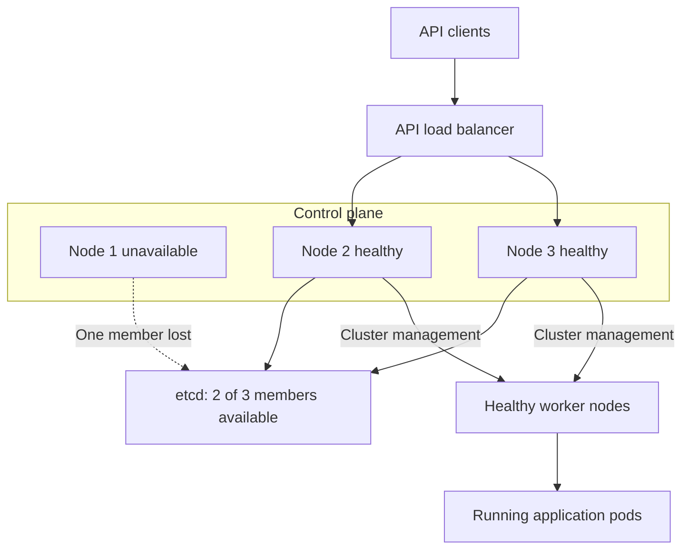
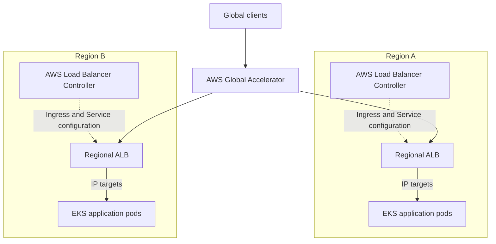
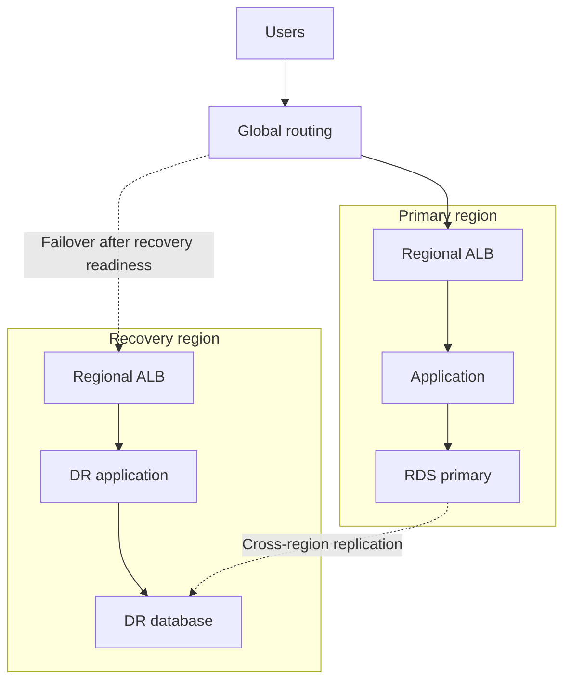
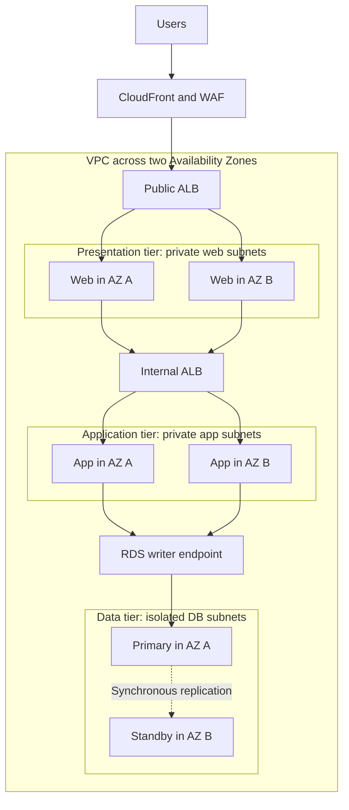

Here are interview-ready answers for **Sigmoid—7 YOE DevOps Engineer**. The coding examples use **Python** and explicit `for` loops.

## 1. Reverse a string using a `for` loop

**Traverse the string from the last character to the first, collect the characters, and join them.**

```python
def reverse_string(text):
    reversed_chars = []

    for index in range(len(text) - 1, -1, -1):
        reversed_chars.append(text[index])

    return "".join(reversed_chars)


print(reverse_string("Hello"))   # olleH
print(reverse_string("DevOps"))  # spOveD
print(reverse_string(""))        # ""
```

For `"Hello"`, the loop visits:

| Index | Character |
|---:|---|
| 4 | `o` |
| 3 | `l` |
| 2 | `l` |
| 1 | `e` |
| 0 | `H` |

**Complexity:** O(n) time and O(n) additional space.

Using a list followed by `join()` avoids repeatedly building larger strings inside the loop.

---

## 2. Check whether a string is a palindrome using a `for` loop

**Compare characters at matching positions from opposite ends. Stop immediately if a pair differs.**

```python
def is_palindrome(text):
    for index in range(len(text) // 2):
        opposite_index = len(text) - 1 - index

        if text[index] != text[opposite_index]:
            return False

    return True


print(is_palindrome("madam"))   # True
print(is_palindrome("abccba"))  # True
print(is_palindrome("hello"))   # False
```

For `"madam"`:

- First comparison: `m == m`.
- Second comparison: `a == a`.
- The middle character does not need comparison.

**Complexity:** O(n) time and O(1) additional space.

This function compares characters exactly. For case-insensitive matching, normalize first:

```python
print(is_palindrome("Madam".casefold()))  # True
```

Whether to ignore spaces and punctuation depends on the requirement. The basic function treats empty strings and single-character strings as palindromes.

---

## 3. In `"Hello World Hello"`, how many times does “hello” occur?

**It occurs twice when matching case-insensitively as a whole word.**

```python
def count_word(text, target):
    count = 0
    target_normalized = target.casefold()

    for word in text.split():
        if word.casefold() == target_normalized:
            count += 1

    return count


text = "Hello World Hello"

print(count_word(text, "hello"))  # 2
```

How the loop works:

| Word | Matches `hello`? | Running count |
|---|---|---:|
| `Hello` | Yes | 1 |
| `World` | No | 1 |
| `Hello` | Yes | 2 |

This counts whitespace-separated words. Consequently, `"helloworld"` does not match `"hello"`. If `"Hello,"` should also count, add punctuation-aware tokenization.

For the fixed target `"hello"`, **time complexity is O(n)** and **additional space is O(n)** because `split()` creates the word list.

If “repeated” means occurrences **after the first**, there is one repetition; the total occurrence count is two.

---

## 4. What is the difference between ReplicaSet and ReplicationController?

**Both maintain a desired number of pods. ReplicaSet is the newer resource and supports more expressive label selectors.**

| Aspect | ReplicationController | ReplicaSet |
|---|---|---|
| API version | `v1` | `apps/v1` |
| Purpose | Maintain the desired pod count | Maintain the desired pod count |
| Selector support | Equality-based labels | Equality-based and set-based requirements |
| Selector structure | Simple label map | `matchLabels` and `matchExpressions` |
| Typical usage | Older applications | Usually managed by a Deployment |
| Rolling updates by itself | No | No |

ReplicaSet supports set-based requirements such as `In`, `NotIn`, `Exists`, and `DoesNotExist`. ReplicationController does not support these set-based requirements. [Kubernetes](https://kubernetes.io/docs/concepts/workloads/controllers/replicaset/?utm_source=chatgpt.com)

Example ReplicationController selector:

```yaml
selector:
  app: orders-api
  environment: production
```

Example ReplicaSet selector:

```yaml
selector:
  matchLabels:
    app: orders-api
  matchExpressions:
    - key: environment
      operator: In
      values:
        - production
        - staging
```

These are selector fragments; a controller’s pod template must satisfy its selector.

### Practical example

Suppose the desired count is three:

- If a selected pod is deleted, the controller creates a replacement.
- If there are too many selected pods under its management, it reduces the count.
- A pod stuck in `CrashLoopBackOff` can still count as an existing pod. Maintaining three pods does not guarantee three healthy application instances.

**For new applications, normally create a Deployment rather than a standalone ReplicaSet.** A Deployment manages ReplicaSets and provides declarative rolling updates and rollback history. [Kubernetes](https://kubernetes.io/docs/concepts/workloads/controllers/replicationcontroller/?utm_source=chatgpt.com)

---

## 5. What backup policies would you implement for Kubernetes?

**Back up Kubernetes state, persistent data, and the dependencies needed to restore the application. Define the policy around RPO and RTO.**

- **RPO—Recovery Point Objective:** how much data loss is acceptable.
- **RTO—Recovery Time Objective:** how long restoration can take.

For example, a critical database might require an RPO of 15 minutes and an RTO of one hour. Backup frequency, log retention, and restore procedures must support those targets.

### What needs backing up?

| Layer | What to protect | Typical approach |
|---|---|---|
| Kubernetes resources | Deployments, Services, CRDs, RBAC, ConfigMaps, Secrets, PVC definitions | Velero and version-controlled configuration |
| Self-managed control-plane state | Kubernetes objects stored in etcd | Consistent etcd snapshots |
| Persistent volume contents | Files stored on application volumes | Supported CSI snapshots, data movement, or filesystem backup |
| Database contents | Records and recovery logs | Database-native backup and point-in-time recovery |
| Recovery dependencies | Required certificates, encryption configuration, keys, images, and infrastructure definitions | Secure, versioned recovery storage |

**An etcd snapshot protects Kubernetes state; it does not contain the application data stored inside persistent volumes.** Kubernetes recommends protecting snapshots because they contain sensitive cluster information. [Kubernetes](https://kubernetes.io/docs/tasks/administer-cluster/configure-upgrade-etcd/?utm_source=chatgpt.com)

### Example policy

The following is an illustrative policy, with different protection requirements for different assets:

| Asset | Backup frequency | Example retention |
|---|---|---|
| Self-managed etcd | Every 15 minutes and before major changes | 7 days |
| Kubernetes application resources | Hourly | 30 days |
| Critical database | Daily base backup plus continuous recovery logs | 30 days |
| Noncritical file volumes | Daily | 30 days |
| Release configuration and images | Every release | Cover the supported recovery period |

### Example: etcd snapshot

For a kubeadm-style installation with the appropriate certificates:

```bash
etcdctl \
  --endpoints=https://127.0.0.1:2379 \
  --cacert=/etc/kubernetes/pki/etcd/ca.crt \
  --cert=/etc/kubernetes/pki/etcd/healthcheck-client.crt \
  --key=/etc/kubernetes/pki/etcd/healthcheck-client.key \
  snapshot save /secure-backup/etcd.db

etcdutl snapshot status /secure-backup/etcd.db --write-out=table
```

Use certificate paths appropriate to the installation. Current guidance uses `etcdutl` for snapshot inspection and restoration. [Kubernetes](https://kubernetes.io/docs/tasks/administer-cluster/configure-upgrade-etcd/?utm_source=chatgpt.com)

### Example: Velero schedule

Assuming Velero, backup storage, and the required volume snapshot integration are configured:

```bash
velero schedule create payments-hourly \
  --schedule="0 * * * *" \
  --include-namespaces=payments \
  --ttl=720h0m0s \
  --snapshot-volumes
```

This requests hourly backups with 30-day retention. Verify the resulting backup status and volume coverage; the command alone does not prove that every volume’s data was protected. [Backup Reference](https://velero.io/docs/main/backup-reference/?utm_source=chatgpt.com)

A CSI snapshot can remain in the underlying storage provider. When the recovery design requires volume data in object storage, configure supported snapshot data movement or another suitable backup mechanism. [CSI Snapshot Data Movement](https://velero.io/docs/main/csi-snapshot-data-movement/?utm_source=chatgpt.com)

### Operational requirements

- Store backups outside the cluster’s failure boundary.
- Encrypt them and restrict read/delete permissions.
- Monitor failed, incomplete, and missing backups.
- Use database-native procedures or application-aware hooks for consistency. A successful volume snapshot alone does not demonstrate application-consistent recovery. [Backup Hooks](https://velero.io/docs/main/backup-hooks/?utm_source=chatgpt.com)
- Perform scheduled restore drills and measure actual RPO/RTO.
- Verify that the recovery environment can access the required storage, images, configuration, and decryption keys.

For managed EKS, AWS operates the control plane. Your recovery policy still needs to protect application resources, configuration, and workload data.

**The strongest interview point:** “I measure backup success through tested restoration, not just through a successful backup job.”

---

## 6. How do you handle deployment failures?

**First identify the failure stage, protect the healthy application version, and decide whether rollback or a forward fix is appropriate.**

A failure could occur during image building, registry push, manifest validation, pod scheduling, startup, or application health checks.

### Step 1: Detect the failure

Make rollout verification part of the deployment pipeline:

```bash
kubectl -n payments rollout status \
  deployment/payments-api \
  --timeout=6m
```

Follow this with application smoke tests and checks of error rate, latency, and important business operations.

**A successful `kubectl apply` does not prove that the application is healthy.**

Also, `progressDeadlineSeconds` does **not** trigger automatic rollback. Kubernetes reports `ProgressDeadlineExceeded`; your deployment process or another controller must decide how to respond. [Kubernetes](https://kubernetes.io/docs/concepts/workloads/controllers/deployment/?utm_source=chatgpt.com)

### Step 2: Diagnose the cause

```bash
kubectl -n payments get pods -l app=payments-api -o wide

kubectl -n payments describe deployment payments-api

kubectl -n payments describe pod <pod-name>

kubectl -n payments logs <pod-name> -c api --tail=100

kubectl -n payments logs <pod-name> -c api --previous

kubectl -n payments get events \
  --sort-by=.metadata.creationTimestamp
```

Use the actual pod and container names. `--previous` retrieves logs from the previous container instance when available.

| Observation | Common investigation |
|---|---|
| `ImagePullBackOff` | Image name/tag, registry access, pull credentials, network |
| `CrashLoopBackOff` | Application logs, startup command, configuration, dependencies |
| `OOMKilled` | Memory limits and application memory usage |
| `Pending` | Resource capacity, taints, affinity, PVC binding |
| Running but not Ready | Readiness endpoint, dependency health, probe settings |

Pod status, events, and container logs are the main starting points for troubleshooting. [Kubernetes](https://kubernetes.io/docs/tasks/debug/debug-application/debug-pods/?utm_source=chatgpt.com)

### Step 3: Recover

If the previous application version remains compatible, roll back to a retained healthy revision:

```bash
kubectl -n payments rollout history deployment/payments-api

# Example: revision 3 is the retained healthy revision.
kubectl -n payments rollout undo \
  deployment/payments-api \
  --to-revision=3

kubectl -n payments rollout status \
  deployment/payments-api \
  --timeout=6m
```

Then repeat the application health checks. Kubernetes supports rolling back a Deployment to an available revision. [Kubernetes](https://kubernetes.io/docs/tasks/run-application/update-deployment-rolling/?utm_source=chatgpt.com)

For GitOps-managed deployments, update or revert the desired configuration in Git so reconciliation maintains the recovered version.

**Check rollback compatibility:** reverting a Deployment’s pod template does not undo database migrations or restore ConfigMap/Secret contents changed in place. Some failures require a forward fix.

### Example: protect the existing version

```yaml
spec:
  replicas: 3
  progressDeadlineSeconds: 300
  strategy:
    type: RollingUpdate
    rollingUpdate:
      maxUnavailable: 0
      maxSurge: 1
```

With three healthy old replicas and a bad image in the new release:

- Kubernetes can create one additional new pod.
- That pod fails to pull its image.
- The existing healthy replicas can continue serving.
- The pipeline detects the stalled rollout and initiates the approved recovery action.

This strategy requires enough spare resources for the additional pod. Readiness probes are also essential because they determine when containers are ready to receive traffic. [Kubernetes](https://kubernetes.io/docs/concepts/workloads/controllers/deployment/?utm_source=chatgpt.com)

To reduce future failures, use immutable image versions, configuration validation, realistic probes, staged promotion, and canary checks. Record the cause and improve the check that should have caught it.

---

## 7. What happens if the master node suddenly fails?

“Master node” is the older term for a **control-plane node**.

**The outcome depends on whether the control plane is highly available and whether etcd still has quorum.**

| Situation | Control-plane impact | Existing applications |
|---|---|---|
| Single control-plane node fails | API access, scheduling, and reconciliation become unavailable | Pods on healthy workers generally continue running |
| One node in a healthy HA control plane fails | Remaining instances can continue managing the cluster | Usually continue, with possible brief management disruption |
| etcd loses quorum | Cluster-state updates cannot proceed | Existing pods may continue, but management and recovery actions stall |

### A. Single control-plane node

The worker’s kubelet and networking components run locally. Therefore, losing the control plane does not automatically stop every existing application container.

However:

- New pods cannot be scheduled normally.
- Deployments and scaling changes cannot be processed.
- Controllers cannot reconcile desired state.
- A pod lost with a failed worker cannot be replaced on another worker through normal scheduling.

The kubelet can still restart containers in existing pods according to their configuration. Application availability remains dependent on healthy workers and application dependencies. [Kubernetes](https://kubernetes.io/docs/concepts/architecture/?utm_source=chatgpt.com)

### B. Highly available control plane

In an HA design:

1. The API load balancer removes the failed backend.
2. Healthy API server instances continue serving requests.
3. Scheduler and controller-manager leadership can move to healthy instances.
4. etcd continues accepting updates if a majority of members remain available.

Scheduler and controller-manager support leader election for replicated HA deployments. [Kubernetes](https://kubernetes.io/docs/reference/command-line-tools-reference/kube-controller-manager/?utm_source=chatgpt.com)

The following shows an illustrative three-node **stacked etcd** topology after one node fails:



With stacked etcd, one node failure removes both a control-plane instance and its etcd member. External etcd separates those failure domains. [Kubernetes](https://kubernetes.io/docs/setup/production-environment/tools/kubeadm/ha-topology/?utm_source=chatgpt.com)

### C. Why etcd quorum matters

| etcd members | Required majority | Member failures tolerated |
|---:|---:|---:|
| 1 | 1 | 0 |
| 3 | 2 | 1 |
| 5 | 3 | 2 |

Having several API servers is insufficient if their etcd cluster cannot reach quorum. Without quorum, etcd cannot agree on cluster-state updates. [etcd](https://etcd.io/docs/v3.6/faq/?utm_source=chatgpt.com)

### Recovery approach

- Determine whether the failure is the node, API server, network, or etcd.
- Check surviving control-plane and etcd members.
- If quorum remains, replace the failed member/node using the documented procedure.
- If quorum is permanently lost, use the tested snapshot recovery procedure.
- After recovery, verify scheduling, controllers, networking, storage, and application health.

Kubernetes etcd recovery also requires correct membership and revision handling so controllers do not retain stale state. [etcd](https://etcd.io/docs/v3.6/op-guide/recovery/?utm_source=chatgpt.com)

For **EKS**, AWS runs the control plane across multiple Availability Zones and detects and replaces unhealthy control-plane instances. You remain responsible for the resilience of worker capacity and application data. [Amazon EKS](https://docs.aws.amazon.com/eks/latest/userguide/disaster-recovery-resiliency.html?utm_source=chatgpt.com)


Download the YAML files, RBAC example, Python script, and supplied log: sigmoid-devops-examples.zip[sigmoid-devops-examples.zip](sandbox:/workspace/scratch/8dc6806ebb9b/sigmoid-devops-examples.zip).

The YAML was checked locally, and the script was tested against your sample.

## 1. What is Terraform taint?

**Taint marks an existing resource in Terraform state for replacement during a subsequent apply.** Marking it does not immediately destroy the resource.

Older command:

```bash
terraform taint aws_instance.app
```

The command is deprecated. The recommended approach is to request replacement through a plan:

```bash
terraform plan \
  -replace=aws_instance.app \
  -out=replacement.tfplan

terraform apply replacement.tfplan
```

This makes the replacement visible in the plan before execution. [HashiCorp Developer](https://developer.hashicorp.com/terraform/cli/commands/taint?utm_source=chatgpt.com)

**Example:** an EC2 instance exists, but its bootstrap configuration is damaged. A replacement plan can recreate it using the desired configuration.

To remove a taint marker:

```bash
terraform untaint aws_instance.app
```

Untainting changes Terraform’s marker; it does not repair the underlying resource.

---

## 2. How do you limit resource usage in Kubernetes? Write requests and limits YAML.

**Use container requests and limits, then apply namespace policies with LimitRange and ResourceQuota.**

| Mechanism | Purpose |
|---|---|
| Requests | Used for scheduling; CPU requests also influence allocation under contention |
| Limits | Restrict container resource consumption |
| LimitRange | Set defaults and permitted resource bounds within a namespace |
| ResourceQuota | Cap aggregate declared resources and object counts within a namespace |

CPU limits are enforced through throttling. Exceeding a memory limit can result in an OOM kill. **Requests are not usage ceilings.** [Kubernetes](https://kubernetes.io/docs/concepts/configuration/manage-resources-containers/?utm_source=chatgpt.com)

### Container requests and limits

```yaml
apiVersion: v1
kind: Pod
metadata:
  name: resource-demo
  namespace: devops-demo
spec:
  containers:
    - name: web
      image: nginx:alpine
      resources:
        requests:
          cpu: 200m
          memory: 128Mi
        limits:
          cpu: 500m
          memory: 256Mi
```

Here:

- `200m` means a CPU request of **0.2 CPU**.
- `500m` means a CPU limit of **0.5 CPU**.
- `128Mi` is the memory request.
- `256Mi` is the memory limit.

Requests and limits apply to each container. Account for sidecars when sizing the pod.

### Namespace defaults and bounds

```yaml
apiVersion: v1
kind: LimitRange
metadata:
  name: container-defaults
  namespace: devops-demo
spec:
  limits:
    - type: Container
      min:
        cpu: 100m
        memory: 64Mi
      max:
        cpu: "1"
        memory: 1Gi
      defaultRequest:
        cpu: 200m
        memory: 128Mi
      default:
        cpu: 500m
        memory: 256Mi
```

LimitRange can supply missing values and reject configurations outside its constraints. [Kubernetes](https://kubernetes.io/docs/concepts/policy/limit-range/?utm_source=chatgpt.com)

### Namespace aggregate budget

```yaml
apiVersion: v1
kind: ResourceQuota
metadata:
  name: namespace-budget
  namespace: devops-demo
spec:
  hard:
    requests.cpu: "2"
    requests.memory: 2Gi
    limits.cpu: "4"
    limits.memory: 4Gi
    pods: "10"
```

This caps the namespace’s aggregate declared requests and limits. Quota enforcement happens during admission; it does not continuously throttle a namespace based on measured CPU consumption. [Kubernetes](https://kubernetes.io/docs/concepts/policy/resource-quotas/?utm_source=chatgpt.com)

The downloadable resource example also creates the namespace.

---

## 3. Write the requested readiness-probe Deployment

```yaml
apiVersion: apps/v1
kind: Deployment
metadata:
  name: space-alien-welcome-message-generator
spec:
  replicas: 1

  selector:
    matchLabels:
      app: space-alien-welcome-message-generator

  template:
    metadata:
      labels:
        app: space-alien-welcome-message-generator
    spec:
      containers:
        - name: httpd
          image: httpd:alpine
          ports:
            - containerPort: 80

          readinessProbe:
            exec:
              command:
                - stat
                - /tmp/ready
            initialDelaySeconds: 10
            periodSeconds: 5
```

**How it works:** `stat /tmp/ready` fails while the file is absent. Once the command succeeds, the readiness probe can mark the container ready. The configured initial delay is ten seconds and the period is five seconds. [Kubernetes](https://kubernetes.io/docs/concepts/workloads/pods/probes/?utm_source=chatgpt.com)

Test it:

```bash
kubectl apply -f space-alien-welcome-message-generator.yaml

kubectl get pods \
  -l app=space-alien-welcome-message-generator

kubectl exec \
  deployment/space-alien-welcome-message-generator \
  -- touch /tmp/ready

kubectl rollout status \
  deployment/space-alien-welcome-message-generator
```

The exec command is expressed as separate executable and argument entries. No shell is needed.

---

## 4. What happens if liveness is healthy but readiness fails?

**The container continues running, but the pod becomes unready and is excluded from normal traffic through matching Services.**

| Property | Result |
|---|---|
| Container process | Continues running |
| Pod phase | Can remain `Running` |
| Pod readiness | `False` |
| Normal Service traffic | Pod is excluded as a ready backend |
| Restart due solely to readiness failure | No |
| Readiness checks | Continue |

Readiness failure does not trigger the restart behavior associated with liveness failure. [Kubernetes](https://kubernetes.io/docs/concepts/workloads/pods/probes/?utm_source=chatgpt.com)

**Example:** an API process is alive, but its database connection is unavailable:

- Liveness succeeds because the process is functioning.
- Readiness fails because the application cannot serve useful requests.
- Traffic can go to other ready replicas.

A Deployment rollout may stall if the new replicas never become ready.

Readiness controls backend eligibility; it does not act as a network firewall preventing every possible direct connection to the pod.

---

## 5. How do you identify data loss when switching back between databases?

Assuming this means **database failover and failback**, use replication evidence and application-level reconciliation.

**Do not switch an old primary back into service merely because it is running again.** It may be missing writes committed on the promoted database.

### Approach

1. **Identify the authoritative primary and fence competing writers.** Prevent both databases from accepting independent writes.
2. **Preserve evidence.** Retain relevant recovery logs, transaction records, and application acknowledgements.
3. **Compare replication positions.** Use WAL positions, binlog/GTID positions, or the database’s equivalent.
4. **Reconcile important records.** Compare expected transaction IDs, key ranges, counts, and content checksums.
5. **Rejoin or rebuild the old database as a replica.** Let it catch up before a controlled failback.

With asynchronous replication, acknowledged transactions can be lost if they had not reached the standby before the primary failed. [postgresql.org](https://www.postgresql.org/docs/current/warm-standby.html?utm_source=chatgpt.com)

### PostgreSQL example

After stopping new writes and draining outstanding transactions, capture the current primary’s durable WAL position:

```sql
SELECT pg_current_wal_flush_lsn();
```

On the candidate standby:

```sql
SELECT pg_last_wal_replay_lsn();
```

The first reports the WAL flush position; the second reports the position replayed during recovery. [postgresql.org](https://www.postgresql.org/docs/current/functions-admin.html?utm_source=chatgpt.com)

Verify that the standby has replayed the required position **on the appropriate shared replication history**. Numerically similar LSNs on divergent timelines do not prove identical data.

Also:

- A WAL gap measures bytes, not the number of missing rows.
- Equal row counts do not prove equal contents.
- Gaps in auto-increment IDs do not automatically mean data loss.
- A successful database connection does not prove recovery completeness.

If the original database is unavailable and no independent expected-write record exists, report the estimated loss window and verification limits rather than claiming zero loss.

---

## 6. Have you integrated a global load balancer with Kubernetes?

Describe your actual experience. An **AWS/EKS architecture you can explain** uses Global Accelerator with regional ALBs.



Global Accelerator provides fixed entry-point IP addresses and routes traffic to regional endpoints using health, location, and configured routing controls. Regional ALBs perform HTTP routing. [AWS Global Accelerator](https://docs.aws.amazon.com/global-accelerator/latest/dg/introduction-how-it-works.html?utm_source=chatgpt.com)

### Integration steps

1. Deploy the application in each regional cluster.
2. Configure the AWS Load Balancer Controller and Kubernetes Ingress/Service resources.
3. Create regional ALBs and verify target health.
4. Add the ALBs to Global Accelerator endpoint groups.
5. Configure traffic distribution, DNS, TLS, and application health checks.
6. Test regional failure and recovery.

In ALB **IP target mode**, traffic goes directly to pod IPs. The Kubernetes Service and Ingress objects configure that integration; traffic does not necessarily traverse a ClusterIP hop. [Amazon EKS](https://docs.aws.amazon.com/eks/latest/userguide/alb-ingress.html?utm_source=chatgpt.com)

Keep session state and database recovery requirements in the regional design. Global traffic steering does not itself synchronize application data.

**Operational detail:** endpoint failover changes routing for new connections. Established connections do not migrate automatically to another regional application instance. [AWS Global Accelerator](https://docs.aws.amazon.com/global-accelerator/latest/dg/introduction-how-it-works.html?utm_source=chatgpt.com)

---

## 7. How do you enable RBAC for ServiceAccounts?

**A ServiceAccount provides a workload identity. A Role and RoleBinding authorize that identity to perform Kubernetes API operations.**

Assuming RBAC is enabled on the cluster:

```yaml
apiVersion: v1
kind: ServiceAccount
metadata:
  name: pod-reader
  namespace: devops-demo
---
apiVersion: rbac.authorization.k8s.io/v1
kind: Role
metadata:
  name: read-pods
  namespace: devops-demo
rules:
  - apiGroups: [""]
    resources: ["pods"]
    verbs: ["get", "list", "watch"]
---
apiVersion: rbac.authorization.k8s.io/v1
kind: RoleBinding
metadata:
  name: pod-reader-binding
  namespace: devops-demo
subjects:
  - kind: ServiceAccount
    name: pod-reader
    namespace: devops-demo
roleRef:
  apiGroup: rbac.authorization.k8s.io
  kind: Role
  name: read-pods
```

RoleBinding connects the ServiceAccount to the Role. These permissions allow reading pods in `devops-demo`. RBAC grants are additive, so consider any other bindings that apply. [Kubernetes](https://kubernetes.io/docs/reference/access-authn-authz/rbac/?utm_source=chatgpt.com)

Assign the account in a pod’s spec, or a Deployment’s pod template:

```yaml
spec:
  serviceAccountName: pod-reader
```

ServiceAccounts are intended for workload authentication, with authorization configured separately. [Kubernetes](https://kubernetes.io/docs/concepts/security/service-accounts/?utm_source=chatgpt.com)

From an administrator identity permitted to impersonate the ServiceAccount:

```bash
kubectl auth can-i list pods \
  --namespace=devops-demo \
  --as=system:serviceaccount:devops-demo:pod-reader

kubectl auth can-i delete pods \
  --namespace=devops-demo \
  --as=system:serviceaccount:devops-demo:pod-reader
```

With only the demonstrated grants, the expected answers are `yes` and `no`.

A ClusterRole can be bound within one namespace using a RoleBinding. Use a ClusterRoleBinding when the required authorization must apply at cluster scope.

Kubernetes RBAC and AWS IAM permissions are separate authorization systems.

---

## 8. A Terraform resource was created, but provisioning failed. What happens?

**If a creation-time provisioner fails under its default failure behavior, Terraform marks the resource as tainted and the apply fails.**

For example:

1. Terraform creates an EC2 instance.
2. A `remote-exec` provisioner attempts application installation.
3. Installation fails.
4. The instance can remain present and tracked as tainted.
5. A subsequent plan normally proposes destroying and recreating it. [HashiCorp Developer](https://developer.hashicorp.com/terraform/language/provisioners?utm_source=chatgpt.com)

Terraform does not automatically undo every successful change from that apply.

You can configure a provisioner with:

```hcl
on_failure = continue
```

This changes its failure handling and default tainting behavior. It is appropriate only when failure of that operation is acceptable.

**Distinguish provisioner failure from provider/API failure.** A partially created cloud object may be tracked in returned state, or it may require reconciliation if the provider could not return its identity. Inspect both Terraform state and the actual infrastructure before recovery.

---

## 9. What is the purpose of `null_resource`?

**`null_resource` is a Terraform-managed placeholder that can hold provisioners and participate in dependency relationships without representing a normal cloud resource.**

A common use is running a script when a configuration input changes:

```hcl
resource "null_resource" "configure_app" {
  triggers = {
    config_hash = filesha256("${path.module}/app-config.json")
  }

  provisioner "local-exec" {
    command = "bash scripts/configure-app.sh"
  }
}
```

When a value in the `triggers` map changes, Terraform replaces the null resource and reruns its creation-time provisioners. [Terraform Registry](https://registry.terraform.io/providers/hashicorp/null/3.2.1/docs/resources/resource?utm_source=chatgpt.com)

Example uses include bootstrap steps, external integrations, or an operation that lacks a suitable provider resource.

Current Terraform also offers the built-in **`terraform_data`** resource:

```hcl
resource "terraform_data" "configure_app" {
  triggers_replace = filesha256("${path.module}/app-config.json")

  provisioner "local-exec" {
    command = "bash scripts/configure-app.sh"
  }
}
```

`terraform_data` supports lifecycle-managed values and provisioner execution without requiring the null provider. [HashiCorp Developer](https://developer.hashicorp.com/terraform/language/resources/terraform-data?utm_source=chatgpt.com)

Terraform tracks the placeholder and its inputs; it does not model every side effect performed inside the script. Prefer provider-supported configuration or bootstrap mechanisms where those can represent the desired state.

---

## 10. A developer committed a hardcoded password. How do you handle it through CI?

**Rotate or revoke the exposed credential first, then remove the hardcoding and strengthen prevention.** Deleting the latest occurrence does not invalidate a leaked credential. [GitHub Docs](https://docs.github.com/en/authentication/keeping-your-account-and-data-secure/removing-sensitive-data-from-a-repository?utm_source=chatgpt.com)

### Immediate response

- Stop further promotion of the affected release.
- Rotate the password and update authorized consumers.
- Review relevant access/audit logs.
- Remove the hardcoded value and obtain it through an appropriate secret-management mechanism.
- Inspect affected build logs, artifacts, and container images.

Evaluate whether repository-history cleanup is required. Rewriting shared history requires coordinated handling of branches, tags, and existing clones; credential rotation remains the immediate access-control remedy.

### CI prevention

Run secret scanning before building or publishing artifacts. For example, with a pinned Gitleaks installation:

```bash
gitleaks git . \
  --redact \
  --exit-code 1 \
  --log-opts="--all"
```

Gitleaks can scan Git patches and return a failing exit code when it finds leaks. Redaction reduces exposure in scanner output. [GitHub](https://github.com/gitleaks/gitleaks?utm_source=chatgpt.com)

For routine PR checks, scan the required commit range after fetching its history. Use periodic full-history scans as well. Handle known historical findings through reviewed remediation or baselines.

Also enable repository push protection for supported secret formats and add rules for organization-specific credentials. Push protection can block a leak before it reaches the repository. [GitHub Docs](https://docs.github.com/en/code-security/concepts/secret-security/command-line-push-protection?utm_source=chatgpt.com)

---

## 11. What is your approach when a Terraform deployment fails?

**Treat an apply as potentially partial. Determine what changed, repair the cause, and review a fresh recovery plan.**

| Failure stage | Recovery focus |
|---|---|
| Validation or planning | Fix configuration, variables, credentials, or provider initialization |
| Provider/API operation | Inspect state and actual infrastructure for completed or partial changes |
| Provisioner | Fix the bootstrap operation and review any proposed replacement |
| Backend state persistence | Preserve recovery state and repair state storage before another apply |
| Interrupted operation | Verify process and lock status before continuing |

A practical sequence is:

1. Identify the exact failing operation and preserve its diagnostics.
2. Confirm the correct backend, environment, configuration revision, and identity.
3. Inspect resources already recorded in state.
4. Reconcile partially created objects and import an existing object if necessary.
5. Repair the underlying issue.
6. Generate and review a new plan.

```bash
terraform validate

terraform state list

terraform state show aws_instance.app

terraform plan \
  -var-file=env/dev.tfvars \
  -out=recovery.tfplan

terraform apply recovery.tfplan
```

Verify the previous apply has stopped before clearing an abandoned lock.

**State-storage failure deserves special handling:** if Terraform cannot persist state to the remote backend, it can write recovery state locally. Preserve that snapshot and follow the documented recovery process before performing another deployment. [HashiCorp Developer](https://developer.hashicorp.com/terraform/language/state/backends?utm_source=chatgpt.com)

Do not assume that reverting configuration restores the previous infrastructure exactly; the resulting plan may include replacements or additional changes.

---

## 12. Write a script to capture repeated failures

**The supplied input and expected output do not match the stated “more than 3” rule.**

Exact counts are:

| Error message | Count | More than 3? |
|---|---:|---|
| `Connection failed to database` | 4 | Yes |
| `Timeout while reading from API` | 2 | No |
| `Timeout while reading` | 1 | No |

Even grouping the last message with the API timeouts produces **three**, which is still not more than three.

### Python implementation

```python
from collections import Counter
import re
import sys

ERROR_LINE = re.compile(
    r"^\d{4}-\d{2}-\d{2}\s+"
    r"\d{2}:\d{2}:\d{2}\s+ERROR:\s*(.+)$"
)

counts = Counter()

with open(sys.argv[1], encoding="utf-8") as log_file:
    for line in log_file:
        match = ERROR_LINE.fullmatch(line.rstrip("\r\n"))

        if match:
            message = match.group(1).strip()

            if message:
                counts[message] += 1

alerted = False

for message, count in counts.items():
    if count > 3:
        print(f"[ALERT] {message!r} occurred more than 3 times")
        alerted = True

sys.exit(1 if alerted else 0)
```

Run:

```bash
python3 capture_failures.py sample_failures.log
```

Correct output for the supplied input:

```text
[ALERT] 'Connection failed to database' occurred more than 3 times
```

The downloaded script additionally supports a configurable threshold, displaying counts, and file/argument error handling.

To produce the second alert, either supply at least four matching API errors or explicitly change the policy to **“at least three”** with an agreed normalization rule for the truncated message.

This implementation counts across the entire file. A sliding time window would require an additional requirement.

---

## 13. What is a DNS custom resolver?

**A DNS resolver answers or forwards DNS queries for clients. A custom resolver lets you control where particular names are resolved.**

Examples include corporate domains, hybrid-cloud private names, and Kubernetes upstream DNS.

### Kubernetes example

CoreDNS normally handles cluster names and forwards other queries to upstream resolvers. You can add a domain-specific forwarding block:

```text
corp.internal:53 {
    errors
    cache 30
    forward . 10.20.0.10 10.20.0.11
}
```

This sends queries for `corp.internal` to the specified corporate DNS servers. Keep the existing CoreDNS configuration that serves the Kubernetes cluster domain. [Kubernetes](https://kubernetes.io/docs/tasks/administer-cluster/dns-custom-nameservers/?utm_source=chatgpt.com)

For example:

- `orders.default.svc.cluster.local` resolves through Kubernetes DNS.
- `database.corp.internal` is forwarded to corporate DNS.
- Other names use the configured default upstream.

### AWS hybrid DNS

| Component | Direction and purpose |
|---|---|
| Resolver inbound endpoint | Allows on-premises DNS to forward queries into AWS |
| Resolver outbound endpoint | Allows AWS Resolver to forward selected queries to external/on-premises DNS |
| Forwarding rule | Specifies which domain should use the external resolver |

Inbound and outbound endpoints serve different directions of hybrid resolution. [Amazon Route 53](https://docs.aws.amazon.com/Route53/latest/DeveloperGuide/resolver-forwarding-outbound-queries.html?utm_source=chatgpt.com)

Verify routing and both UDP/TCP port 53 connectivity, and avoid forwarding loops. Useful diagnostics include `dig`, CoreDNS logs, query latency, and `SERVFAIL` rates.

---

## 14. Which metrics do you use for monitoring?

**Start with user-facing reliability, then monitor the components that explain failures and capacity pressure.**

The four golden signals are **latency, traffic, errors, and saturation**. [sre golden signals](https://sre.google/sre-book/monitoring-distributed-systems/?utm_source=chatgpt.com)

| Area | Useful metrics |
|---|---|
| Application latency | p50, p95, p99; successful and failed request latency |
| Traffic | Requests/second, concurrent requests, messages processed |
| Errors | Failed-request percentage, timeouts, dependency failures |
| Saturation | CPU contention/throttling, queue depth, pending work |
| Kubernetes | Ready replicas, unavailable replicas, restarts, OOM kills, Pending pods, node pressure |
| Compute | CPU usage, available memory, load and resource headroom |
| Storage | Free space, inodes, read/write latency, IOPS |
| Database | Replication lag, connections, locks, query latency, transaction failures |
| DNS/network | DNS latency, `SERVFAIL`, packet loss, connection errors |
| Delivery/recovery | Deployment failures, rollout duration, backup freshness, restore results |

### Example alert

For an API, an example condition might be:

```text
Failed-request percentage exceeds 1% over five minutes,
with enough traffic to make the measurement meaningful.
```

Tune thresholds from the service’s SLO and load-test results.

For Kubernetes, CPU usage alone is insufficient. A service can have low average CPU while experiencing throttling, unavailable replicas, or pods that cannot be scheduled.

An example monitoring stack is Prometheus, kube-state-metrics, node exporters, Grafana, Alertmanager, and CloudWatch for AWS service metrics. Correlate alerts with logs and traces during diagnosis.

Keep metric labels bounded—for example, environment, service, route, and status—so cardinality remains manageable. [Prometheus](https://prometheus.io/docs/practices/naming/?utm_source=chatgpt.com)


These answers use AWS examples with `us-east-1` and `us-west-2`. I treat “us-south” in the question as the primary region.

**1. If a load balancer’s region goes down, what happens?**

An AWS ALB or NLB is a **regional resource**. It can distribute traffic across Availability Zones within its region, but it does not automatically move into another region.

During a complete regional outage:

- Requests to that regional application can fail or time out.
- Its DNS name may still resolve; DNS resolution does not prove application availability.
- Healthy servers in another region do not help unless traffic routing and application recovery have been configured.

For regional recovery, deploy a second application stack and use global routing:

| Option | How regional failover works |
|---|---|
| Route 53 failover routing | Returns the secondary endpoint when the primary is unhealthy; recovery depends partly on health detection and DNS caching. |
| AWS Global Accelerator | Routes new connections to another healthy regional endpoint after detecting failure. Existing connections must reconnect. |

Route 53 supports primary/secondary failover records; Global Accelerator supports health-based routing across regional endpoints. Neither creates the replacement application stack for you. [Amazon Route 53](https://docs.aws.amazon.com/Route53/latest/DeveloperGuide/routing-policy-failover.html?utm_source=chatgpt.com)



The recovery application must have usable data, credentials, network access, and sufficient capacity. A healthy load balancer alone is insufficient.

**Interview answer:** “Multi-AZ load balancing handles failures within a region. For a regional outage, I need another regional application stack and Route 53 or Global Accelerator to redirect traffic.”

---

**2. RDS is in us-west, with cross-region read replicas. How do you redirect traffic without paying for another database?**

**Promote an existing healthy read replica.** You already have another database instance because each read replica has its own compute and storage.

For a standard RDS PostgreSQL or MySQL example, my recovery procedure is:

1. Confirm the primary failure.
2. Fence the old writer: prevent the original application from resuming writes unexpectedly.
3. Choose the healthiest replica using replication progress and available capacity.
4. Promote that replica to an independent writable database.
5. Verify that promotion completed and the database accepts writes.
6. Update the application’s database endpoint configuration.
7. Refresh application connection pools and validate transactions.
8. Enable application traffic to the recovery region.

Read-replica promotion is a recovery operation, not merely a DNS change. RDS can reboot the replica during promotion, and promotion takes time. [Amazon Relational Database Service](https://docs.aws.amazon.com/AmazonRDS/latest/UserGuide/USER_ReadRepl.Promote.html?utm_source=chatgpt.com)

Example: promote a replica located in `us-east-1`, while the original writer was in `us-west-2`:

```bash
aws rds promote-read-replica \
  --region us-east-1 \
  --db-instance-identifier orders-dr

aws rds wait db-instance-available \
  --region us-east-1 \
  --db-instance-identifier orders-dr
```

After confirming it is writable, retrieve its endpoint and update the application’s `DB_HOST` configuration. The web ALB does not redirect SQL database connections.

Cross-region replication is asynchronous, so recently acknowledged writes might not have reached the replica before the outage. Assess this against the business’s **RPO**, the acceptable data-loss window. **RTO** is the acceptable recovery time. [Amazon Relational Database Service](https://docs.aws.amazon.com/AmazonRDS/latest/UserGuide/USER_ReadRepl.Promote.html?utm_source=chatgpt.com)

**What if the client cannot afford a continuously running replica?**

| Design | Normal operating cost | Recovery trade-off |
|---|---|---|
| Cross-region backup and restore | Lower; backup storage and transfer | Must restore a DB before serving traffic |
| Pilot light | Core data resources remain running | Must create or scale application resources |
| Warm standby | Smaller application stack stays running | Faster recovery, but capacity may need scaling |
| Full second-region stack | Higher | Less provisioning needed during recovery |

RDS supports cross-region replication of automated backups for supported configurations. This avoids continuously running recovery DB compute, but recovery requires restoring an instance. [Amazon Relational Database Service](https://docs.aws.amazon.com/AmazonRDS/latest/UserGuide/USER_ReplicateBackups.html?utm_source=chatgpt.com)

A smaller replica can reduce compute cost, provided it keeps up with replication and can support recovery traffic. Storage and replication-transfer costs still apply.

After recovery, rebuild or reconfigure replication from the new primary. Other replicas do not automatically start following it. Failback should be a planned operation.

**Interview answer:** “I would promote an existing cross-region replica and update the application’s database configuration. If the client cannot fund a running replica, I would propose cross-region backups and explicitly agree on the longer recovery time.”

---

**3. Which deployment strategy is best when only one Pod is running?**

The key distinction is **one steady-state replica** versus **a strict maximum of one Pod at any time**.

| Constraint | Suitable strategy | Result |
|---|---|---|
| One replica normally, but temporary extra capacity is available | Rolling update | Old Pod can serve while the replacement starts |
| Only one Pod is permitted at any time | Recreate | Downtime during replacement |
| Controlled traffic switching and quick application rollback are priorities | Blue/green | Requires blue and green to coexist |

For a stateless web application, I would usually choose a rolling update with:

```yaml
spec:
  replicas: 1
  minReadySeconds: 10
  strategy:
    type: RollingUpdate
    rollingUpdate:
      maxSurge: 1
      maxUnavailable: 0
```

These are fields within a Deployment:

- `maxSurge: 1` allows an additional Pod during the rollout.
- `maxUnavailable: 0` prevents deliberately removing the available old Pod before the replacement becomes available.
- `minReadySeconds: 10` requires the replacement to remain ready before it counts as available. [Kubernetes](https://kubernetes.io/docs/concepts/workloads/controllers/deployment/?utm_source=chatgpt.com)

Use a meaningful readiness probe, available scheduling capacity, graceful shutdown, and compatible database migrations.

If the new Pod cannot schedule or become ready, the rollout can stall while the old Pod continues serving. This configuration supports deployment continuity; **one replica still provides no ongoing application redundancy** against an unexpected Pod or node failure.

For applications that require exclusive storage access or prohibit concurrent instances, Recreate may be necessary.

---

**4. In blue/green deployment, exactly which configuration changes to reroute traffic?**

It depends on the routing layer.

| Routing layer | Configuration to change |
|---|---|
| Kubernetes Service | `spec.selector` |
| Ingress routing to separate Services | Backend Service reference |
| AWS ALB | Listener rule’s `forward` action or target-group weights |
| DNS-based switching | DNS record target or routing configuration |

**Kubernetes example**

Assume:

- Blue Pods have labels `app: web`, `slot: blue`.
- Green Pods have labels `app: web`, `slot: green`.
- The external Ingress continues targeting the stable Service `web-live`.

Initially, the Service selects blue:

```yaml
apiVersion: v1
kind: Service
metadata:
  name: web-live
spec:
  selector:
    app: web
    slot: blue
  ports:
    - port: 80
      targetPort: 8080
```

After testing green through a preview Service, change **the live Service selector**:

```bash
kubectl patch service web-live --type=merge \
  -p '{"spec":{"selector":{"app":"web","slot":"green"}}}'
```

Rollback the traffic switch:

```bash
kubectl patch service web-live --type=merge \
  -p '{"spec":{"selector":{"app":"web","slot":"blue"}}}'
```

Kubernetes updates the Service’s EndpointSlices to match the selected Pods. Keep the Deployment selectors unchanged. [Kubernetes](https://kubernetes.io/docs/concepts/services-networking/service/?utm_source=chatgpt.com)

**AWS ALB example**

Create separate blue and green target groups. Change the relevant listener rule:

| Stage | Blue weight | Green weight |
|---|---:|---:|
| Before release | 100 | 0 |
| Optional validation phase | 95 | 5 |
| After cutover | 0 | 100 |

The exact ALB field is:

```text
Actions[].ForwardConfig.TargetGroups[].Weight
```

For a single-target forwarding action, change `TargetGroupArn`. If routing uses the listener’s default action, modify that default action instead.

**Weighted ALB target groups do not automatically fail over to another target group when one group is empty or unhealthy.** Deployment automation must make the routing decision. [Elastic Load Balancing](https://docs.aws.amazon.com/elasticloadbalancing/latest/application/rule-action-types.html?utm_source=chatgpt.com)

Retain blue during the observation period and allow existing connections to drain. With GitOps or a Kubernetes ALB controller, update the source configuration so reconciliation preserves the switch.

Application rollback also requires database schema compatibility; switching traffic does not undo database writes.

---

**5. A new web deployment happened today. How do you detect issues before users report them?**

I would combine **synthetic checks, release-specific monitoring, and controlled exposure**.

**Synthetic checks**

Run customer journeys regularly, including when real traffic is low:

- Open the website and verify expected content.
- Log in using a test account.
- Search or retrieve data.
- Perform a safe test transaction.
- Verify its resulting state.
- Check certificate validity and response time.

CloudWatch Synthetics supports scheduled endpoint and browser checks that follow customer-like workflows. [Amazon CloudWatch](https://docs.aws.amazon.com/AmazonCloudWatch/latest/monitoring/CloudWatch_Synthetics_Canaries.html?utm_source=chatgpt.com)

**Monitor the release**

| Area | Useful signals |
|---|---|
| Availability | Synthetic success, HTTP errors |
| Performance | p95/p99 latency, dependency response time |
| Application | Exceptions, timeouts, failed transactions |
| Kubernetes | Readiness, restarts, OOM kills, CPU throttling |
| Database | Connection failures, locks, query latency |
| Frontend | JavaScript errors, page-load failures |
| Business | Order completion, payment success, login success |

Tag logs, metrics, and traces with the release version, then compare the new version against the previous version and its baseline. Latency, traffic, errors, and saturation are useful starting signals. [sre golden signals](https://sre.google/sre-book/monitoring-distributed-systems/?utm_source=chatgpt.com)

**Example**

Before deployment:

- p95 latency: 250 ms.
- HTTP 5xx rate: 0.1%.

After deployment:

- p95 latency: 900 ms.
- HTTP 5xx rate: 3%.
- Database timeout exceptions increase.

The release pipeline should pause promotion or initiate the agreed rollback procedure when these conditions exceed defined thresholds with sufficient traffic.

For a new release, expose a small traffic percentage first and increase it only after checks pass. A readiness probe returning `200` cannot prove that login, checkout, or data correctness works.

---

**6. What practical difficulties arise with infrastructure in two regions?**

| Difficulty | Practical approach |
|---|---|
| Replication lag and possible data loss | Monitor replication progress; define and test RPO |
| Conflicting writes during recovery | Establish one authoritative writer and fence the old one |
| Increased latency | Keep application requests close to their database; reduce cross-region calls |
| Additional cost | Account for replicated storage, compute, transfer, networking, and observability |
| Configuration drift | Reuse Terraform modules with separate regional configuration and state |
| Regional dependencies | Prepare images, secrets, certificates, keys, and required services in recovery |
| Insufficient recovery capacity | Validate quotas and test scaling to the expected recovery load |
| Session and cache behavior | Use an explicit session strategy; avoid relying on instance-local state |
| Monitoring failure | Run external checks and maintain monitoring outside the primary region |
| Difficult failback | Resynchronize data and perform a controlled return |
| Data-location restrictions | Replicate only to approved regions |

A common failure is having recovery servers available but keeping their image registry, database credentials, or deployment pipeline dependent on the failed region.

**Interview answer:** “The hardest part is consistent data and coordinated recovery. I validate that the second region can serve the application independently, then regularly test failover and failback.”

---

**7. Write a shell script to delete log files older than 30 days**

This GNU/Linux script uses **last modification time** and supports previewing the matches.

```bash
#!/usr/bin/env bash
set -euo pipefail

if (( $# < 1 || $# > 2 )); then
  printf 'Usage: %s LOG_DIRECTORY [--dry-run|--delete]\n' "$0" >&2
  exit 2
fi

log_dir=$(realpath -e -- "$1")
mode="${2:---dry-run}"

if [[ ! -d "$log_dir" || "$log_dir" == / ]]; then
  printf 'Use a specific application log directory.\n' >&2
  exit 2
fi

find_args=(
  "$log_dir" -xdev -type f
  \( -name '*.log' -o -name '*.log.*' \)
  ! -newermt '30 days ago'
)

case "$mode" in
  --dry-run)
    TZ=UTC0 find "${find_args[@]}" -print
    ;;
  --delete)
    TZ=UTC0 find "${find_args[@]}" -delete -print
    ;;
  *)
    printf 'Unknown mode: %s\n' "$mode" >&2
    exit 2
    ;;
esac
```

Usage:

```bash
# Preview
bash delete_old_logs.sh /var/log/myapp --dry-run

# Delete matching files
bash delete_old_logs.sh /var/log/myapp --delete
```

The script:

- Matches regular `.log` and rotated `.log.*` files.
- Uses a cutoff of 30 days ago in UTC.
- Preserves directories and descendant symlinks.
- Avoids crossing into other mounted filesystems.

`-mtime +30` rounds age down to complete 24-hour periods, so it generally starts matching at 31 days. The timestamp comparison avoids that extra-day boundary. It includes files modified at or before the cutoff. [gnu.org](https://www.gnu.org/software/findutils/manual/html_node/find_html/Age-Ranges.html?utm_source=chatgpt.com)

Use this against rotated logs under the agreed retention policy. For continuing rotation of active application logs, configure `logrotate`.

---

**8. Explain the failover mechanism in a load balancer**

Separate the failure levels:

| Failure | Recovery mechanism |
|---|---|
| One application target fails | Health checks remove it from normal traffic selection; remaining healthy targets serve |
| An EC2 instance fails | ASG replaces it using configured health checks |
| An Availability Zone fails | Multi-AZ load balancer and surviving targets serve traffic |
| A region fails | Global routing selects another regional stack |
| Database fails | Database recovery is required; application load balancing does not elect a DB writer |

For ALB, configure a target-group health check such as:

```text
Protocol: HTTP
Path: /ready
Success code: 200
Interval: 10 seconds
Unhealthy threshold: 2
Healthy threshold: 2
```

Choose values suitable for the application. The readiness endpoint should reflect whether the application can serve its intended workload.

ALB normally routes requests to healthy targets. However, **if all registered targets in a target group are unhealthy, ALB can fail open and route to those unhealthy targets**. Health checks are therefore not a general traffic-blocking mechanism. [Elastic Load Balancing](https://docs.aws.amazon.com/elasticloadbalancing/latest/application/target-group-health-checks.html?utm_source=chatgpt.com)

Also enable **ELB health checks in the ASG** if application health failures should cause instance replacement. ASG does not use ELB health results for replacement by default. [Amazon EC2 Auto Scaling](https://docs.aws.amazon.com/autoscaling/ec2/userguide/getting-started-elastic-load-balancing.html?utm_source=chatgpt.com)

Client timeouts, retries with backoff, and idempotency are still necessary because failover does not preserve every in-flight request.

---

**9. Can an ASG and load balancer be in different regions?**

**They cannot use the normal direct ASG-to-load-balancer attachment across regions.**

For managed integration, the load balancer and target group must be in the same AWS account, VPC, and region as the ASG. The target group must use the `instance` target type. [Amazon EC2 Auto Scaling](https://docs.aws.amazon.com/autoscaling/ec2/userguide/getting-started-elastic-load-balancing.html?utm_source=chatgpt.com)

There is a technical distinction: an ALB using **private IP targets** can reach targets in a peered VPC in another region, with appropriate routing and security configuration. That requires separate management of target registration as instances change; it is not native cross-region ASG attachment. [Elastic Load Balancing](https://docs.aws.amazon.com/elasticloadbalancing/latest/application/load-balancer-target-groups.html?utm_source=chatgpt.com)

The usual design is:

- Region A: ALB A with ASG A.
- Region B: ALB B with ASG B.
- Route 53 or Global Accelerator above both regional stacks.

This also removes the dependency on one regional load balancer.

---

**10. How do you create a sub-user in a Dockerfile?**

Create a Linux user and group inside the image, then set `USER` so the application runs under that identity.

Example using an Alpine-based image:

```dockerfile
FROM python:3.13-alpine

ENV PYTHONDONTWRITEBYTECODE=1 \
    PYTHONUNBUFFERED=1

RUN addgroup -S -g 10001 app \
    && adduser -S -D -H -u 10001 -G app app

WORKDIR /app

COPY --chown=10001:10001 app.py /app/app.py

USER 10001:10001

EXPOSE 8080

CMD ["python", "app.py"]
```

Explanation:

| Instruction | Purpose |
|---|---|
| `addgroup` | Creates the application group |
| `adduser` | Creates the application user |
| `COPY --chown` | Gives the copied file the specified ownership |
| `USER 10001:10001` | Sets the default runtime UID and GID |
| `EXPOSE 8080` | Documents the application port; it does not publish it |

`USER` selects an identity; it does not itself create an account. It affects subsequent build instructions and the default runtime identity. [Docker Docs](https://docs.docker.com/reference/dockerfile/?utm_source=chatgpt.com)

Verify:

```bash
docker run --rm my-web:1.0.0 id
```

In Kubernetes, complement this with `runAsNonRoot`, disabled privilege escalation, dropped capabilities, and a read-only root filesystem where the application supports them.

---

**11. How do you create custom Docker images?**

A custom image packages the application, its runtime dependencies, and its startup configuration.

My process is:

1. Select a suitable base image.
2. Write the Dockerfile.
3. Exclude unnecessary files from the build context.
4. Build the image.
5. Run application tests and security scans.
6. Publish an immutable release to a registry.
7. Deploy the tested image reference.

Using the Dockerfile above:

```bash
docker build --pull -t my-web:1.0.0 .

docker run --rm \
  --read-only \
  --cap-drop ALL \
  --security-opt no-new-privileges \
  -p 8080:8080 \
  my-web:1.0.0
```

For larger applications, use multi-stage builds to keep compilers and build tooling out of the runtime image. Arrange dependency-copying steps before frequently changing application code to improve caching. Use reviewed base-image versions or digests and refresh them through the release process. [Docker Docs](https://docs.docker.com/build/building/best-practices/?utm_source=chatgpt.com)

Example publication to ECR, assuming the repository exists and the caller has permission:

```bash
REGISTRY="123456789012.dkr.ecr.us-east-1.amazonaws.com"

aws ecr get-login-password --region us-east-1 |
  docker login --username AWS --password-stdin "$REGISTRY"

docker tag my-web:1.0.0 "$REGISTRY/my-web:1.0.0"

docker push "$REGISTRY/my-web:1.0.0"
```

Replace the account ID with your account. ECR publication requires registry authentication, tagging, and pushing the image. [Amazon ECR](https://docs.aws.amazon.com/AmazonECR/latest/userguide/docker-push-ecr-image.html?utm_source=chatgpt.com)

Inject credentials at runtime from the platform’s secret mechanism. Do not bake them into image layers.

---

**12. How do you enable debug logs in Terraform?**

Set `TF_LOG` and optionally `TF_LOG_PATH`:

```bash
(
  umask 077

  export TF_LOG=DEBUG
  export TF_LOG_PATH="$PWD/terraform-debug.log"

  terraform plan -no-color
)
```

The subshell confines the environment changes to that command block.

| Variable | Purpose |
|---|---|
| `TF_LOG` | Enables logs and sets verbosity |
| `TF_LOG_PATH` | Appends logs to the specified file |
| `TF_LOG_CORE` | Controls Terraform core logging |
| `TF_LOG_PROVIDER` | Controls provider logging |

Verbosity, from most to least detailed:

```text
TRACE, DEBUG, INFO, WARN, ERROR
```

`TF_LOG_PATH` alone does not enable logging. Start with `DEBUG`; use `TRACE` when more detail is needed. [HashiCorp Developer](https://developer.hashicorp.com/terraform/internals/debugging?utm_source=chatgpt.com)

If you exported variables in the current shell, disable them afterward:

```bash
unset TF_LOG TF_LOG_PATH TF_LOG_CORE TF_LOG_PROVIDER
```

Treat debug logs as potentially sensitive, redact them before sharing, and keep them out of source control.

---

**13. Design a secure, highly available three-tier architecture**

Assume a web application with a PostgreSQL database:

1. **Presentation tier:** serves the web interface.
2. **Application tier:** executes business logic.
3. **Data tier:** stores persistent application data.



The public ALB is one regional load balancer enabled across two public subnets.

**Network layout**

Example VPC: `10.0.0.0/16`.

| Subnet purpose | AZ A | AZ B | Default routing |
|---|---|---|---|
| Public ALB and NAT | `10.0.0.0/24` | `10.0.1.0/24` | Internet gateway |
| Private web | `10.0.10.0/24` | `10.0.11.0/24` | Local NAT if outbound internet is required |
| Private application | `10.0.20.0/24` | `10.0.21.0/24` | Local NAT if outbound internet is required |
| Isolated database | `10.0.30.0/24` | `10.0.31.0/24` | No default internet or NAT route |

Place a NAT gateway in each AZ’s public subnet where outbound internet access is required. Use VPC endpoints for supported AWS services to reduce internet dependency. AWS documents this pattern with private servers, multi-AZ load balancing, and NAT gateways in both AZs. [Amazon Virtual Private Cloud](https://docs.aws.amazon.com/vpc/latest/userguide/vpc-example-private-subnets-nat.html?utm_source=chatgpt.com)

**Security-group boundaries**

For this example:

| Destination | Allowed source | Port |
|---|---|---:|
| Public ALB | CloudFront origin-facing prefix list | 443 |
| Web servers | Public ALB security group | 8080 |
| Internal ALB | Web security group | 443 |
| App servers | Internal ALB security group | 8080 |
| RDS PostgreSQL | App security group | 5432 |

Security-group references allow traffic from matching interfaces; they do not create network routes or inherit the referenced group’s rules. [Amazon Virtual Private Cloud](https://docs.aws.amazon.com/vpc/latest/userguide/security-group-rules.html?utm_source=chatgpt.com)

If WAF is applied only at CloudFront, prevent direct ALB access from bypassing it. Combine the CloudFront origin-facing prefix list with a secret origin header required by the ALB listener rule. [Amazon CloudFront](https://docs.aws.amazon.com/AmazonCloudFront/latest/DeveloperGuide/restrict-access-to-load-balancer.html?utm_source=chatgpt.com)

Additional controls:

- HTTPS with appropriate certificates and backend TLS where required.
- IAM roles with permissions specific to each workload.
- Secrets Manager for database credentials.
- Encryption for databases, volumes, backups, and object storage.
- SSM-based administration with controlled access.
- Central application logs, ALB access logs, CloudTrail, and alerts.
- Authentication and authorization at the application layer.

**Availability**

- Separate web and app ASGs, each with at least two instances across AZs.
- Health checks and autoscaling based on suitable workload metrics.
- Stateless application instances or an explicit shared-session design.
- RDS PostgreSQL Multi-AZ DB instance with a synchronous standby.
- Automated backups and regularly tested restores.

The standby in this RDS Multi-AZ DB-instance design provides availability and does not serve read traffic. During supported failures, RDS changes the writer endpoint’s DNS mapping; applications must reconnect. [Amazon Relational Database Service](https://docs.aws.amazon.com/AmazonRDS/latest/UserGuide/Concepts.MultiAZSingleStandby.html?utm_source=chatgpt.com)

**Regional disaster recovery**

This architecture handles failures within its region. For a full regional outage, add the cross-region backup or replica strategy from Question 2 and a recoverable application stack.

**Interview answer:** “I isolate web, application, and database access, distribute compute across AZs, and use RDS Multi-AZ for database availability. I design cross-region recovery separately according to the required RPO, RTO, and budget.”

---

**14. Python: longest substring without duplicate characters**

Use a **sliding window** and track each character’s most recent index.

When a repeated character appears inside the current window, move the window’s left boundary just past its previous occurrence.

```python
#!/usr/bin/env python3

import argparse


def length_of_longest_substring(s: str) -> int:
    last_seen: dict[str, int] = {}
    left = 0
    best = 0

    for right, char in enumerate(s):
        previous = last_seen.get(char, -1)

        # Move left only if the repeat is inside the current window.
        if previous >= left:
            left = previous + 1

        last_seen[char] = right
        best = max(best, right - left + 1)

    return best


def main() -> None:
    parser = argparse.ArgumentParser()
    parser.add_argument("s", help="String to examine")
    args = parser.parse_args()

    print(length_of_longest_substring(args.s))


if __name__ == "__main__":
    main()
```

Run:

```bash
python3 longest_substring.py "abcabcbb"  # 3
python3 longest_substring.py "bbbbb"     # 1
python3 longest_substring.py "pwwkew"    # 3
```

**Walkthrough for `pwwkew`**

| Index | Character | Left boundary | Current unique window | Best length |
|---:|---|---:|---|---:|
| 0 | p | 0 | `p` | 1 |
| 1 | w | 0 | `pw` | 2 |
| 2 | w | 2 | `w` | 2 |
| 3 | k | 2 | `wk` | 2 |
| 4 | e | 2 | `wke` | 3 |
| 5 | w | 3 | `kew` | 3 |

The answer is **3**. Both `wke` and `kew` are valid contiguous substrings.

`pwke` is a subsequence because it skips a character; it is not a substring.

Complexity:

- **Time:** `O(n)` with average constant-time dictionary operations.
- **Space:** `O(min(n, character-set size))`.

The `previous >= left` condition matters. For `abba`, the final `a` appeared outside the current window, so moving `left` backward would incorrectly include duplicate characters.

The supplied examples and additional cases passed local checks. The scripts, Docker example, Kubernetes manifests, and architecture are included in sigmoid-regional-failover-examples.zip[sigmoid-regional-failover-examples.zip](sandbox:/workspace/scratch/8dc6806ebb9b/sigmoid-regional-failover-examples.zip). Docker builds and live AWS/Kubernetes deployments were not performed.
