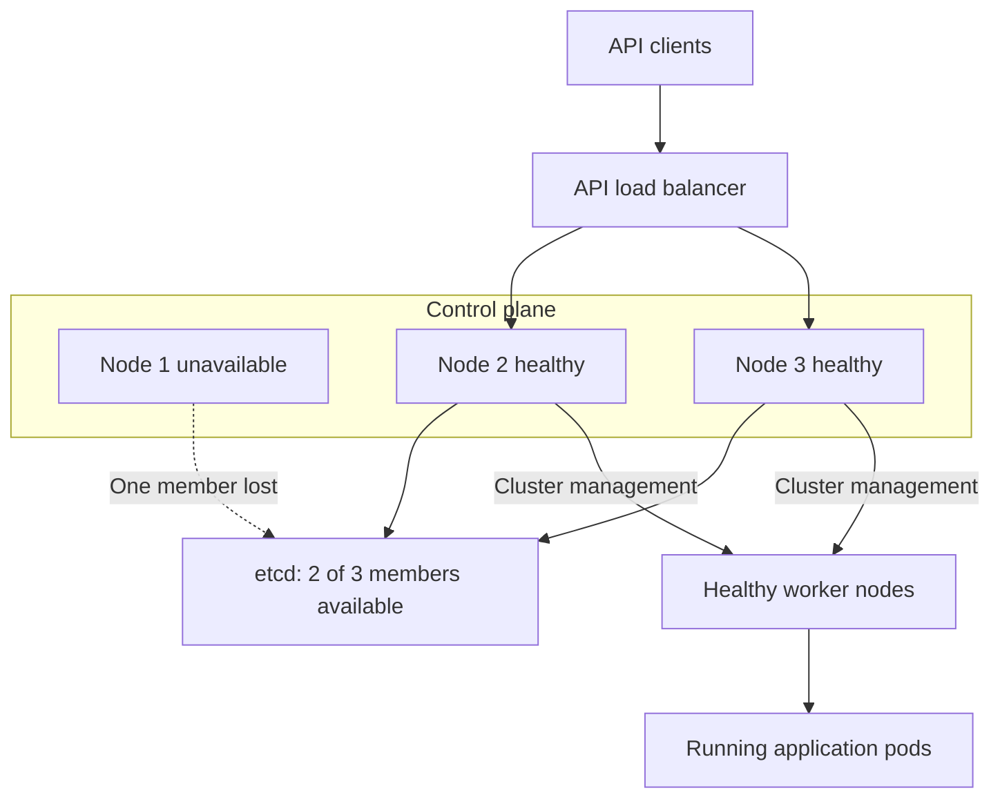

Here are interview-ready answers for **Sigmoid—7 YOE DevOps Engineer**. The coding examples use **Python** and explicit `for` loops.

## 1. Reverse a string using a `for` loop

**Traverse the string from the last character to the first, collect the characters, and join them.**

```python
def reverse_string(text):
    reversed_chars = []

    for index in range(len(text) - 1, -1, -1):
        reversed_chars.append(text[index])

    return "".join(reversed_chars)


print(reverse_string("Hello"))   # olleH
print(reverse_string("DevOps"))  # spOveD
print(reverse_string(""))        # ""
```

For `"Hello"`, the loop visits:

| Index | Character |
|---:|---|
| 4 | `o` |
| 3 | `l` |
| 2 | `l` |
| 1 | `e` |
| 0 | `H` |

**Complexity:** O(n) time and O(n) additional space.

Using a list followed by `join()` avoids repeatedly building larger strings inside the loop.

---

## 2. Check whether a string is a palindrome using a `for` loop

**Compare characters at matching positions from opposite ends. Stop immediately if a pair differs.**

```python
def is_palindrome(text):
    for index in range(len(text) // 2):
        opposite_index = len(text) - 1 - index

        if text[index] != text[opposite_index]:
            return False

    return True


print(is_palindrome("madam"))   # True
print(is_palindrome("abccba"))  # True
print(is_palindrome("hello"))   # False
```

For `"madam"`:

- First comparison: `m == m`.
- Second comparison: `a == a`.
- The middle character does not need comparison.

**Complexity:** O(n) time and O(1) additional space.

This function compares characters exactly. For case-insensitive matching, normalize first:

```python
print(is_palindrome("Madam".casefold()))  # True
```

Whether to ignore spaces and punctuation depends on the requirement. The basic function treats empty strings and single-character strings as palindromes.

---

## 3. In `"Hello World Hello"`, how many times does “hello” occur?

**It occurs twice when matching case-insensitively as a whole word.**

```python
def count_word(text, target):
    count = 0
    target_normalized = target.casefold()

    for word in text.split():
        if word.casefold() == target_normalized:
            count += 1

    return count


text = "Hello World Hello"

print(count_word(text, "hello"))  # 2
```

How the loop works:

| Word | Matches `hello`? | Running count |
|---|---|---:|
| `Hello` | Yes | 1 |
| `World` | No | 1 |
| `Hello` | Yes | 2 |

This counts whitespace-separated words. Consequently, `"helloworld"` does not match `"hello"`. If `"Hello,"` should also count, add punctuation-aware tokenization.

For the fixed target `"hello"`, **time complexity is O(n)** and **additional space is O(n)** because `split()` creates the word list.

If “repeated” means occurrences **after the first**, there is one repetition; the total occurrence count is two.

---

## 4. What is the difference between ReplicaSet and ReplicationController?

**Both maintain a desired number of pods. ReplicaSet is the newer resource and supports more expressive label selectors.**

| Aspect | ReplicationController | ReplicaSet |
|---|---|---|
| API version | `v1` | `apps/v1` |
| Purpose | Maintain the desired pod count | Maintain the desired pod count |
| Selector support | Equality-based labels | Equality-based and set-based requirements |
| Selector structure | Simple label map | `matchLabels` and `matchExpressions` |
| Typical usage | Older applications | Usually managed by a Deployment |
| Rolling updates by itself | No | No |

ReplicaSet supports set-based requirements such as `In`, `NotIn`, `Exists`, and `DoesNotExist`. ReplicationController does not support these set-based requirements. [Kubernetes](https://kubernetes.io/docs/concepts/workloads/controllers/replicaset/?utm_source=chatgpt.com)

Example ReplicationController selector:

```yaml
selector:
  app: orders-api
  environment: production
```

Example ReplicaSet selector:

```yaml
selector:
  matchLabels:
    app: orders-api
  matchExpressions:
    - key: environment
      operator: In
      values:
        - production
        - staging
```

These are selector fragments; a controller’s pod template must satisfy its selector.

### Practical example

Suppose the desired count is three:

- If a selected pod is deleted, the controller creates a replacement.
- If there are too many selected pods under its management, it reduces the count.
- A pod stuck in `CrashLoopBackOff` can still count as an existing pod. Maintaining three pods does not guarantee three healthy application instances.

**For new applications, normally create a Deployment rather than a standalone ReplicaSet.** A Deployment manages ReplicaSets and provides declarative rolling updates and rollback history. [Kubernetes](https://kubernetes.io/docs/concepts/workloads/controllers/replicationcontroller/?utm_source=chatgpt.com)

---

## 5. What backup policies would you implement for Kubernetes?

**Back up Kubernetes state, persistent data, and the dependencies needed to restore the application. Define the policy around RPO and RTO.**

- **RPO—Recovery Point Objective:** how much data loss is acceptable.
- **RTO—Recovery Time Objective:** how long restoration can take.

For example, a critical database might require an RPO of 15 minutes and an RTO of one hour. Backup frequency, log retention, and restore procedures must support those targets.

### What needs backing up?

| Layer | What to protect | Typical approach |
|---|---|---|
| Kubernetes resources | Deployments, Services, CRDs, RBAC, ConfigMaps, Secrets, PVC definitions | Velero and version-controlled configuration |
| Self-managed control-plane state | Kubernetes objects stored in etcd | Consistent etcd snapshots |
| Persistent volume contents | Files stored on application volumes | Supported CSI snapshots, data movement, or filesystem backup |
| Database contents | Records and recovery logs | Database-native backup and point-in-time recovery |
| Recovery dependencies | Required certificates, encryption configuration, keys, images, and infrastructure definitions | Secure, versioned recovery storage |

**An etcd snapshot protects Kubernetes state; it does not contain the application data stored inside persistent volumes.** Kubernetes recommends protecting snapshots because they contain sensitive cluster information. [Kubernetes](https://kubernetes.io/docs/tasks/administer-cluster/configure-upgrade-etcd/?utm_source=chatgpt.com)

### Example policy

The following is an illustrative policy, with different protection requirements for different assets:

| Asset | Backup frequency | Example retention |
|---|---|---|
| Self-managed etcd | Every 15 minutes and before major changes | 7 days |
| Kubernetes application resources | Hourly | 30 days |
| Critical database | Daily base backup plus continuous recovery logs | 30 days |
| Noncritical file volumes | Daily | 30 days |
| Release configuration and images | Every release | Cover the supported recovery period |

### Example: etcd snapshot

For a kubeadm-style installation with the appropriate certificates:

```bash
etcdctl \
  --endpoints=https://127.0.0.1:2379 \
  --cacert=/etc/kubernetes/pki/etcd/ca.crt \
  --cert=/etc/kubernetes/pki/etcd/healthcheck-client.crt \
  --key=/etc/kubernetes/pki/etcd/healthcheck-client.key \
  snapshot save /secure-backup/etcd.db

etcdutl snapshot status /secure-backup/etcd.db --write-out=table
```

Use certificate paths appropriate to the installation. Current guidance uses `etcdutl` for snapshot inspection and restoration. [Kubernetes](https://kubernetes.io/docs/tasks/administer-cluster/configure-upgrade-etcd/?utm_source=chatgpt.com)

### Example: Velero schedule

Assuming Velero, backup storage, and the required volume snapshot integration are configured:

```bash
velero schedule create payments-hourly \
  --schedule="0 * * * *" \
  --include-namespaces=payments \
  --ttl=720h0m0s \
  --snapshot-volumes
```

This requests hourly backups with 30-day retention. Verify the resulting backup status and volume coverage; the command alone does not prove that every volume’s data was protected. [Backup Reference](https://velero.io/docs/main/backup-reference/?utm_source=chatgpt.com)

A CSI snapshot can remain in the underlying storage provider. When the recovery design requires volume data in object storage, configure supported snapshot data movement or another suitable backup mechanism. [CSI Snapshot Data Movement](https://velero.io/docs/main/csi-snapshot-data-movement/?utm_source=chatgpt.com)

### Operational requirements

- Store backups outside the cluster’s failure boundary.
- Encrypt them and restrict read/delete permissions.
- Monitor failed, incomplete, and missing backups.
- Use database-native procedures or application-aware hooks for consistency. A successful volume snapshot alone does not demonstrate application-consistent recovery. [Backup Hooks](https://velero.io/docs/main/backup-hooks/?utm_source=chatgpt.com)
- Perform scheduled restore drills and measure actual RPO/RTO.
- Verify that the recovery environment can access the required storage, images, configuration, and decryption keys.

For managed EKS, AWS operates the control plane. Your recovery policy still needs to protect application resources, configuration, and workload data.

**The strongest interview point:** “I measure backup success through tested restoration, not just through a successful backup job.”

---

## 6. How do you handle deployment failures?

**First identify the failure stage, protect the healthy application version, and decide whether rollback or a forward fix is appropriate.**

A failure could occur during image building, registry push, manifest validation, pod scheduling, startup, or application health checks.

### Step 1: Detect the failure

Make rollout verification part of the deployment pipeline:

```bash
kubectl -n payments rollout status \
  deployment/payments-api \
  --timeout=6m
```

Follow this with application smoke tests and checks of error rate, latency, and important business operations.

**A successful `kubectl apply` does not prove that the application is healthy.**

Also, `progressDeadlineSeconds` does **not** trigger automatic rollback. Kubernetes reports `ProgressDeadlineExceeded`; your deployment process or another controller must decide how to respond. [Kubernetes](https://kubernetes.io/docs/concepts/workloads/controllers/deployment/?utm_source=chatgpt.com)

### Step 2: Diagnose the cause

```bash
kubectl -n payments get pods -l app=payments-api -o wide

kubectl -n payments describe deployment payments-api

kubectl -n payments describe pod <pod-name>

kubectl -n payments logs <pod-name> -c api --tail=100

kubectl -n payments logs <pod-name> -c api --previous

kubectl -n payments get events \
  --sort-by=.metadata.creationTimestamp
```

Use the actual pod and container names. `--previous` retrieves logs from the previous container instance when available.

| Observation | Common investigation |
|---|---|
| `ImagePullBackOff` | Image name/tag, registry access, pull credentials, network |
| `CrashLoopBackOff` | Application logs, startup command, configuration, dependencies |
| `OOMKilled` | Memory limits and application memory usage |
| `Pending` | Resource capacity, taints, affinity, PVC binding |
| Running but not Ready | Readiness endpoint, dependency health, probe settings |

Pod status, events, and container logs are the main starting points for troubleshooting. [Kubernetes](https://kubernetes.io/docs/tasks/debug/debug-application/debug-pods/?utm_source=chatgpt.com)

### Step 3: Recover

If the previous application version remains compatible, roll back to a retained healthy revision:

```bash
kubectl -n payments rollout history deployment/payments-api

# Example: revision 3 is the retained healthy revision.
kubectl -n payments rollout undo \
  deployment/payments-api \
  --to-revision=3

kubectl -n payments rollout status \
  deployment/payments-api \
  --timeout=6m
```

Then repeat the application health checks. Kubernetes supports rolling back a Deployment to an available revision. [Kubernetes](https://kubernetes.io/docs/tasks/run-application/update-deployment-rolling/?utm_source=chatgpt.com)

For GitOps-managed deployments, update or revert the desired configuration in Git so reconciliation maintains the recovered version.

**Check rollback compatibility:** reverting a Deployment’s pod template does not undo database migrations or restore ConfigMap/Secret contents changed in place. Some failures require a forward fix.

### Example: protect the existing version

```yaml
spec:
  replicas: 3
  progressDeadlineSeconds: 300
  strategy:
    type: RollingUpdate
    rollingUpdate:
      maxUnavailable: 0
      maxSurge: 1
```

With three healthy old replicas and a bad image in the new release:

- Kubernetes can create one additional new pod.
- That pod fails to pull its image.
- The existing healthy replicas can continue serving.
- The pipeline detects the stalled rollout and initiates the approved recovery action.

This strategy requires enough spare resources for the additional pod. Readiness probes are also essential because they determine when containers are ready to receive traffic. [Kubernetes](https://kubernetes.io/docs/concepts/workloads/controllers/deployment/?utm_source=chatgpt.com)

To reduce future failures, use immutable image versions, configuration validation, realistic probes, staged promotion, and canary checks. Record the cause and improve the check that should have caught it.

---

## 7. What happens if the master node suddenly fails?

“Master node” is the older term for a **control-plane node**.

**The outcome depends on whether the control plane is highly available and whether etcd still has quorum.**

| Situation | Control-plane impact | Existing applications |
|---|---|---|
| Single control-plane node fails | API access, scheduling, and reconciliation become unavailable | Pods on healthy workers generally continue running |
| One node in a healthy HA control plane fails | Remaining instances can continue managing the cluster | Usually continue, with possible brief management disruption |
| etcd loses quorum | Cluster-state updates cannot proceed | Existing pods may continue, but management and recovery actions stall |

### A. Single control-plane node

The worker’s kubelet and networking components run locally. Therefore, losing the control plane does not automatically stop every existing application container.

However:

- New pods cannot be scheduled normally.
- Deployments and scaling changes cannot be processed.
- Controllers cannot reconcile desired state.
- A pod lost with a failed worker cannot be replaced on another worker through normal scheduling.

The kubelet can still restart containers in existing pods according to their configuration. Application availability remains dependent on healthy workers and application dependencies. [Kubernetes](https://kubernetes.io/docs/concepts/architecture/?utm_source=chatgpt.com)

### B. Highly available control plane

In an HA design:

1. The API load balancer removes the failed backend.
2. Healthy API server instances continue serving requests.
3. Scheduler and controller-manager leadership can move to healthy instances.
4. etcd continues accepting updates if a majority of members remain available.

Scheduler and controller-manager support leader election for replicated HA deployments. [Kubernetes](https://kubernetes.io/docs/reference/command-line-tools-reference/kube-controller-manager/?utm_source=chatgpt.com)

The following shows an illustrative three-node **stacked etcd** topology after one node fails:



With stacked etcd, one node failure removes both a control-plane instance and its etcd member. External etcd separates those failure domains. [Kubernetes](https://kubernetes.io/docs/setup/production-environment/tools/kubeadm/ha-topology/?utm_source=chatgpt.com)

### C. Why etcd quorum matters

| etcd members | Required majority | Member failures tolerated |
|---:|---:|---:|
| 1 | 1 | 0 |
| 3 | 2 | 1 |
| 5 | 3 | 2 |

Having several API servers is insufficient if their etcd cluster cannot reach quorum. Without quorum, etcd cannot agree on cluster-state updates. [etcd](https://etcd.io/docs/v3.6/faq/?utm_source=chatgpt.com)

### Recovery approach

- Determine whether the failure is the node, API server, network, or etcd.
- Check surviving control-plane and etcd members.
- If quorum remains, replace the failed member/node using the documented procedure.
- If quorum is permanently lost, use the tested snapshot recovery procedure.
- After recovery, verify scheduling, controllers, networking, storage, and application health.

Kubernetes etcd recovery also requires correct membership and revision handling so controllers do not retain stale state. [etcd](https://etcd.io/docs/v3.6/op-guide/recovery/?utm_source=chatgpt.com)

For **EKS**, AWS runs the control plane across multiple Availability Zones and detects and replaces unhealthy control-plane instances. You remain responsible for the resilience of worker capacity and application data. [Amazon EKS](https://docs.aws.amazon.com/eks/latest/userguide/disaster-recovery-resiliency.html?utm_source=chatgpt.com)
