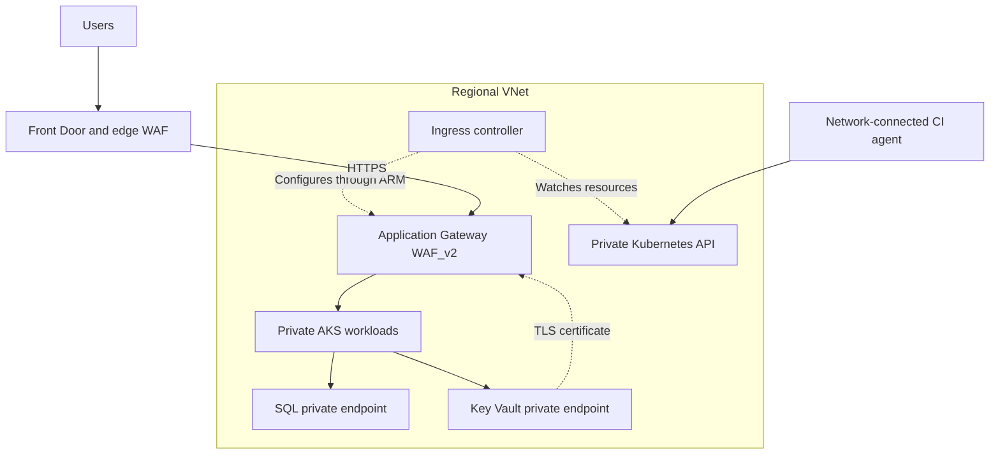
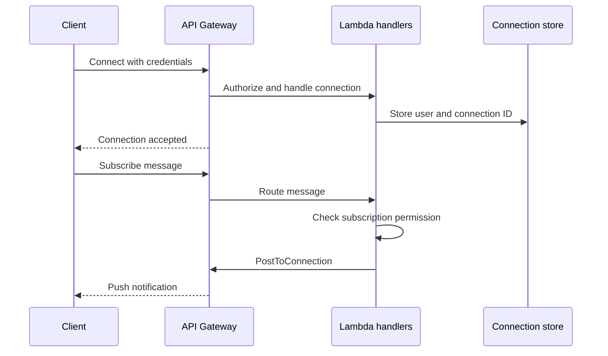
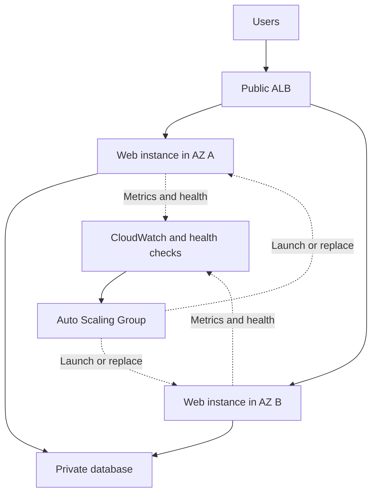

Below are Azure-focused answers for a **5-year DevOps interview**. Project descriptions are reference examples—adapt them to your actual experience.

**1. What is the difference between Application Gateway and Front Door?**

Both handle HTTP/HTTPS traffic at **Layer 7**, but serve different scopes.

| Aspect | Application Gateway | Azure Front Door |
|---|---|---|
| Scope | Regional | Global |
| Deployment | In a dedicated VNet subnet | Microsoft’s global edge network |
| Main purpose | Regional application routing and load balancing | Global routing, acceleration, caching, and regional failover |
| Routing | Host-based and path-based routing | Host/path routing and selection among origins |
| Backends | Can directly reach private backends through network connectivity | Supports public origins; Premium supports Private Link for supported origins |
| WAF | Available with `WAF_v2` | Edge WAF; capabilities depend on tier |
| Caching | Not a CDN | Supports edge caching |
| TLS termination | At the regional gateway | At the edge, with HTTPS forwarding to origins |

**Example:** For an application used mainly within one region, Application Gateway may be sufficient. For a global application deployed in India and Europe, Front Door can route users to healthy regional origins. Application Gateway can provide regional ingress in each region. [Microsoft Learn](https://learn.microsoft.com/en-us/azure/frontdoor/front-door-faq?utm_source=chatgpt.com)

Front Door provides traffic routing; regional recovery still requires healthy applications and an appropriate database recovery strategy.

**2. How do you protect endpoints in AKS?**

First distinguish **application endpoints** from the **Kubernetes API endpoint**.

| Area | Protection |
|---|---|
| Public application ingress | HTTPS, WAF, appropriate rate limits, and controlled routing |
| Application authentication | Validate OAuth/OIDC tokens, audience, scopes, and application permissions |
| Kubernetes API | Private API endpoint, Microsoft Entra integration, and least-privilege RBAC |
| Pod communication | NetworkPolicies restricting approved inbound and outbound traffic |
| Secrets | Key Vault, workload identity, and controlled secret access |
| Workloads | Nonroot execution, restricted privileges, approved images, and security scanning |
| Azure dependencies | Private endpoints and private DNS where required |

A private AKS API does **not** automatically make every application private. Application exposure is configured separately. [Microsoft Learn](https://learn.microsoft.com/en-us/azure/aks/secure-aks?utm_source=chatgpt.com)

A reference architecture:



When Front Door uses a public origin, restrict the origin to the `AzureFrontDoor.Backend` service tag **and** validate the specific `X-Azure-FDID` value. This helps prevent bypassing the edge controls through direct origin access. [Microsoft Learn](https://learn.microsoft.com/en-us/azure/frontdoor/origin-security?utm_source=chatgpt.com)

**3. What networking are you using in AKS?**

A sample project answer:

> “Our reference deployment uses Azure CNI Pod Subnet with Cilium. Nodes and Pods have separate subnets, and Pod IPs are reachable from connected networks. Cilium handles service routing and network-policy enforcement. Application Gateway provides ingress, and the Kubernetes API is private.”

The networking choice has two parts:

| Decision | Options |
|---|---|
| IP allocation and routing model | Azure CNI Overlay or Azure CNI Pod Subnet |
| Data plane and policy enforcement | Azure CNI powered by Cilium for supported Linux deployments |

**Azure CNI Pod Subnet** provides VNet-routable Pod addresses and suits integrations requiring direct Pod connectivity. **Overlay** uses a separate Pod CIDR and conserves VNet addresses; traffic leaving the cluster is generally translated to a node address. [Microsoft Learn](https://learn.microsoft.com/azure/aks/concepts-network-cni-overview?trk=article-ssr-frontend-pulse_little-text-block\&utm_source=chatgpt.com)

For the reference flat-network setup, Application Gateway reaches backend Pod IPs. AGIC watches Kubernetes resources and programs the gateway through Azure Resource Manager; user traffic does not pass through the AGIC Pod. [Microsoft Learn](https://learn.microsoft.com/en-us/azure/application-gateway/ingress-controller-overview?utm_source=chatgpt.com)

Current AGIC also supports Overlay, subject to version, subnet, delegation, and topology requirements. It is inaccurate to say that AGIC never supports Overlay.

For IP planning, include maximum Pods, maximum nodes, upgrade surge capacity, system Pods, and address-release delays—not just current usage. [Microsoft Learn](https://learn.microsoft.com/en-us/azure/aks/configure-azure-cni-dynamic-ip-allocation?utm_source=chatgpt.com)

**4. How do you optimize cloud costs?**

I start with cost allocation and usage measurements, then optimize the largest controllable costs.

| Area | Actions |
|---|---|
| Visibility | Tag ownership/environment, review Cost Management, budgets, and Advisor |
| VMs | Right-size from usage, deallocate idle nonproduction machines |
| AKS | Tune requests, autoscale workloads and nodes, remove unused capacity |
| Commitments | Evaluate reservations or savings plans after establishing stable demand |
| Interruptible jobs | Consider Spot capacity when interruption is acceptable |
| App Service | Right-size plans and share plans where workload isolation permits |
| SQL | Tune queries and capacity; consider suitable serverless or pooled options |
| Storage | Remove abandoned resources and apply appropriate lifecycle/retention |
| Logging | Retain useful data and control unnecessary ingestion |
| Networking | Review egress, cross-region traffic, and unnecessary gateways |

For example, running a development VM for **40 hours instead of 168 hours per week** reduces its operating time by approximately **76%**. Compute savings depend on deallocation and billing; disks and other retained resources can still incur charges.

For AKS, reduce excessive resource requests carefully: they influence scheduling and scaling. Keep the minimum capacity required by availability targets. Azure Advisor provides AKS-specific cost recommendations. [Microsoft Learn](https://learn.microsoft.com/en-us/azure/aks/cost-advisors?utm_source=chatgpt.com)

Budget alerts notify you; they are not automatic spending caps.

**5. How do you block a particular domain in Application Gateway?**

Clarify what “block a domain” means:

| Meaning | Appropriate control |
|---|---|
| Reject requests addressed to a hostname | Application Gateway WAF rule matching `Host` |
| Prevent workloads accessing an external domain | Egress firewall or supported FQDN policy |
| Reject requests associated with a website | Header filtering may help, but `Origin`/`Referer` are not reliable caller identity |

For incoming requests to `blocked.example.com`, create a WAF custom rule:

```hcl
custom_rules {
  name      = "BlockSpecificHostname"
  priority  = 10
  rule_type = "MatchRule"
  action    = "Block"

  match_conditions {
    match_variables {
      variable_name = "RequestHeaders"
      selector      = "Host"
    }

    operator           = "Regex"
    negation_condition = false
    match_values       = ["^blocked[.]example[.]com[.]?(:[0-9]+)?$"]
    transforms         = ["Lowercase"]
  }
}
```

This matches the exact hostname, allowing for case normalization, a trailing dot, or a port. It does not accidentally match `blocked.example.com.evil.test`.

The WAF policy must:

- Be enabled in **Prevention** mode.
- Be associated with the relevant `WAF_v2` gateway or listener.
- Have priorities reviewed against other custom rules.

Detection mode logs a match without blocking it. [Microsoft Learn](https://learn.microsoft.com/en-us/azure/web-application-firewall/ag/custom-waf-rules-overview?utm_source=chatgpt.com)

If Front Door rewrites the origin `Host` header, verify what Application Gateway receives. A rule for the original public hostname may belong at Front Door.

**6. How do you write a Terraform module?**

Define a reusable interface around a cohesive component:

- **Inputs:** configurable names, location, SKU, settings, and tags.
- **Resources:** implementation.
- **Outputs:** IDs, URLs, and identities needed by callers.
- **Provider requirements:** compatibility constraints.
- **Documentation:** assumptions and usage examples.

An App Service module could contain:

```hcl
resource "azurerm_service_plan" "this" {
  name                = "${var.app_name}-plan"
  resource_group_name = var.resource_group_name
  location            = var.location
  os_type             = "Linux"
  sku_name            = var.sku_name
}

resource "azurerm_linux_web_app" "this" {
  name                = var.app_name
  resource_group_name = var.resource_group_name
  location            = var.location
  service_plan_id     = azurerm_service_plan.this.id
  https_only          = true

  identity {
    type = "SystemAssigned"
  }

  site_config {
    always_on           = true
    minimum_tls_version = "1.2"
    ftps_state          = "Disabled"

    application_stack {
      node_version = "22-lts"
    }
  }
}

output "app_url" {
  value = "https://${azurerm_linux_web_app.this.default_hostname}"
}
```

The calling root supplies the inputs:

```hcl
module "app_service" {
  source              = "../../modules/app-service"
  app_name            = var.app_name
  resource_group_name = azurerm_resource_group.this.name
  location            = var.location
  sku_name            = "P1v3"
}
```

Normally, provider configuration and backend ownership stay in the root. The child declares provider requirements and receives configuration from its caller. [HashiCorp Developer](https://developer.hashicorp.com/terraform/language/modules/develop/structure?utm_source=chatgpt.com)

The downloadable example includes input validation, outputs, managed identities, health checks, and an optional staging slot.

**7. How do you upgrade a Terraform module?**

1. Read release notes and compatibility requirements.
2. Update the selected module version or Git reference.
3. Initialize dependencies.
4. Validate and inspect the plan.
5. Test in a lower environment.
6. Apply the reviewed production change.

For a registry module:

```hcl
module "app_service" {
  source  = "app.terraform.io/example-org/app-service/azurerm"
  version = "1.3.0"

  # Module inputs...
}
```

The address above is illustrative; use your actual registry address.

```bash
terraform init -upgrade
terraform fmt -check -recursive
terraform validate
terraform plan -out=upgrade.tfplan

# After reviewing the plan:
terraform apply upgrade.tfplan
```

Important distinctions:

- Registry modules use `version`.
- Git modules use a source reference such as `?ref=v1.3.0`.
- Local modules change with the repository; they do not support a module `version` argument.
- `.terraform.lock.hcl` locks **providers**, not remote module versions.
- `init -upgrade` can also update providers within their constraints. [HashiCorp Developer](https://developer.hashicorp.com/terraform/language/modules/configuration?utm_source=chatgpt.com)

If resource addresses change, use an appropriate `moved` block instead of allowing unintended replacement:

```hcl
moved {
  from = azurerm_linux_web_app.web
  to   = azurerm_linux_web_app.this
}
```

Reverting the module version alone does not necessarily undo infrastructure or data changes already applied.

**8. Screen-sharing exercise: write the Terraform structure**

I would create this structure and explain the responsibilities:

| Path | Purpose |
|---|---|
| `modules/app-service/main.tf` | App Service resources |
| `modules/app-service/variables.tf` | Inputs and validation |
| `modules/app-service/outputs.tf` | URLs, IDs, and identities |
| `modules/app-service/versions.tf` | Terraform/provider requirements |
| `environments/dev/main.tf` | Development module invocation |
| `environments/dev/providers.tf` | Development provider configuration |
| `environments/dev/versions.tf` | Requirements and backend declaration |
| `environments/dev/terraform.tfvars` | Development values |
| `environments/dev/backend.hcl` | Development state location |
| `environments/prod/…` | Equivalent production root with separate values/state |

Backend declaration:

```hcl
terraform {
  backend "azurerm" {}
}
```

Example backend configuration:

```hcl
resource_group_name  = "rg-terraform-state"
storage_account_name = "youruniquestateaccount"
container_name       = "tfstate"
key                  = "sonata/dev/app-service.tfstate"
use_azuread_auth      = true
```

Production uses a different key and appropriately scoped access.

```bash
terraform init -backend-config=backend.hcl
terraform validate
terraform plan -out=deployment.tfplan
terraform apply deployment.tfplan
```

The Azure Blob backend supports state locking. Authenticate through an approved identity and grant the required state-storage permissions. Keep credentials out of backend files, and commit the generated provider lock file. [HashiCorp Developer](https://developer.hashicorp.com/terraform/language/backend/azurerm?utm_source=chatgpt.com)

**9. How do you monitor when Pods go down?**

Monitor **workload availability**, not just individual Pod existence. Pods are normally replaced during rollouts and scaling.

A reference setup uses:

- Managed Prometheus for Kubernetes metrics.
- Grafana for dashboards.
- Container insights for logs and events.
- Azure Monitor alerts routed to the incident system.
- Application/synthetic checks for customer impact.

Azure provides recommended AKS alerts, including deployment replica mismatches and unhealthy workloads. [Microsoft Learn](https://learn.microsoft.com/en-us/azure/aks/monitor-aks?utm_source=chatgpt.com)

Example Prometheus rule:

```yaml
- alert: DeploymentAvailableReplicasLow
  expr: |
    max by (cluster, namespace, deployment) (
      kube_deployment_status_replicas_available{namespace="production"}
    )
    <
    max by (cluster, namespace, deployment) (
      kube_deployment_spec_replicas{namespace="production"}
    )
  for: 5m
  labels:
    severity: warning
```

Also watch:

| Signal | What it indicates |
|---|---|
| `CrashLoopBackOff` | Repeated container failures |
| Increasing restart count | Instability |
| OOM events with restarts | Memory-related failures |
| Extended Pending state | Scheduling or capacity problems |
| Node NotReady | Node availability problem |
| API errors/latency | Customer-facing impact |

A missing metric series does not automatically trigger a numerical comparison. Include monitoring-health and synthetic checks.

**10. Which metrics alert when VM CPU or memory exceeds 75%?**

For Azure VMs:

| Requirement | Metric | Condition |
|---|---|---|
| CPU above 75% | `Percentage CPU` | Greater than 75 |
| Memory pressure above 75% | `Available Memory Percentage` | Less than 25 |

These are listed under the `Microsoft.Compute/virtualMachines` metric namespace. [Microsoft Learn](https://learn.microsoft.com/en-us/azure/azure-monitor/reference/supported-metrics/microsoft-compute-virtualmachines-metrics?utm_source=chatgpt.com)

Example CPU criteria:

```hcl
criteria {
  metric_namespace = "Microsoft.Compute/virtualMachines"
  metric_name      = "Percentage CPU"
  aggregation      = "Average"
  operator         = "GreaterThan"
  threshold        = 75
}
```

A common policy evaluates the **five-minute average every minute**, with an Action Group for notifications. This differs from requiring every individual sample to exceed 75%.

Confirm the VM emits the required memory data. Where necessary, configure guest collection through Azure Monitor Agent and data collection rules.

For Linux node_exporter, an available-memory-based expression is:

```promql
100 * (
  1 - node_memory_MemAvailable_bytes / node_memory_MemTotal_bytes
) > 75
```

Using available memory accounts for reclaimable memory better than simply counting all cache as unavailable.

**11. Where do you store Application Gateway TLS certificates?**

My preferred source of truth is **Azure Key Vault**.

The setup is:

1. Store/import the certificate with the required exportable private key.
2. Assign Application Gateway a user-assigned managed identity.
3. Grant that identity appropriate secret-read permissions.
4. Configure network access between the gateway and Key Vault.
5. Reference the certificate’s **versionless secret URI** from the HTTPS listener configuration.

Terraform resource fragment:

```hcl
identity {
  type         = "UserAssigned"
  identity_ids = [var.gateway_identity_id]
}

ssl_certificate {
  name                = "public-tls"
  key_vault_secret_id = "https://example-vault.vault.azure.net/secrets/public-tls/"
}
```

Application Gateway retrieves and installs the certificate locally for TLS termination. With a versionless reference, it can discover renewed versions; the documented polling interval is approximately four hours, and configuration changes also trigger a check. [Microsoft Learn](https://learn.microsoft.com/en-us/azure/application-gateway/key-vault-certs?utm_source=chatgpt.com)

Monitor expiry and retrieval failures. Avoid embedding a PFX or its password in source code or Terraform input files.

**12. How long would you take to write IaC and deploy App Service?**

Give an estimate with clear assumptions:

| Scope | Illustrative estimate |
|---|---|
| Adapt an existing module with access/state ready | About 30–60 minutes for configuration and review |
| Write a new basic module and validate it | Approximately 2–4 hours |
| Production setup with networking, secrets, monitoring, and pipeline integration | Roughly 1–3 working days, depending on dependencies |

These are planning estimates, not Azure provisioning guarantees.

A good interview response is:

> “For a basic App Service using an approved module, I can usually prepare the configuration and reviewed plan within an hour. I estimate provisioning and smoke testing separately. For production, I first account for private networking, identities, diagnostics, deployment slots, and pipeline requirements.”

**13. How do you build CI/CD in Azure DevOps?**

My workflow would be:

1. Protect the target branch with review and build-validation policies.
2. Run tests and required security/quality checks.
3. Build one versioned artifact.
4. Deploy it to development and run integration checks.
5. Promote the same artifact through later environments.
6. Deploy an approved production candidate, verify it, and monitor the release.

For Azure authentication, use an Azure Resource Manager service connection with **workload identity federation**, scoped to the required resources. [Microsoft Learn](https://learn.microsoft.com/en-us/azure/devops/pipelines/release/configure-workload-identity?view=azure-devops\&utm_source=chatgpt.com)

A simplified deployment stage:

```yaml
- stage: DeployDev
  dependsOn: Build
  condition: and(
    succeeded(),
    eq(variables['Build.SourceBranch'], 'refs/heads/main')
    )
  jobs:
    - deployment: DeployApplication
      environment: development
      strategy:
        runOnce:
          deploy:
            steps:
              - download: current
                artifact: application

              - task: AzureCLI@2
                inputs:
                  azureSubscription: sc-azure-dev-wif
                  scriptType: bash
                  scriptLocation: inlineScript
                  inlineScript: |
                    set -euo pipefail
                    az webapp deploy \
                      --resource-group "$RG" \
                      --name "$APP" \
                      --src-path "$PACKAGE" \
                      --type zip
                env:
                  RG: $(resourceGroup)
                  APP: $(appName)
                  PACKAGE: $(Pipeline.Workspace)/application/app.zip
```

For production App Service, I would deploy to a staging slot, check it, swap to production, and verify the production endpoint. Environment-specific settings can remain sticky.

Two interview details matter:

- For **Azure Repos Git**, PR validation is configured through the target branch’s Build validation policy.
- Environment approvals/checks are configured on protected Azure DevOps resources; naming an environment in YAML does not create its approval policy. [Microsoft Learn](https://learn.microsoft.com/en-us/azure/devops/pipelines/repos/azure-repos-git?view=azure-devops\&utm_source=chatgpt.com)

Private AKS or private deployment endpoints require an agent with the necessary network routes and DNS resolution.

**14. Azure SQL CPU exceeds 75%—how do you upgrade it?**

Assuming **Azure SQL Database**, this normally means **scaling compute capacity**, not upgrading the database engine version.

I would:

1. Check whether `cpu_percent` remains high over an appropriate window.
2. Use Query Store to identify expensive queries or execution-plan regressions.
3. Check concurrency, indexing, blocking, and related resource limits.
4. Tune avoidable workload costs.
5. Increase vCores/DTUs when capacity is the bottleneck.
6. Verify latency, errors, throughput, and cost afterward. [Microsoft Learn](https://learn.microsoft.com/en-us/azure/azure-monitor/reference/supported-metrics/microsoft-sql-servers-databases-metrics?utm_source=chatgpt.com)

Example: increasing provisioned General Purpose capacity:

```bash
az sql db update \
  --resource-group rg-production \
  --server sql-production \
  --name orders \
  --edition GeneralPurpose \
  --family Gen5 \
  --capacity 4 \
  --compute-model Provisioned
```

For a Terraform-managed database, change the existing resource:

```hcl
resource "azurerm_mssql_database" "orders" {
  name      = "orders"
  server_id = var.sql_server_id

  # Example: increase from GP_Gen5_2
  sku_name = "GP_Gen5_4"
}
```

Review the plan and apply through the normal infrastructure workflow.

Scaling can involve a cutover and transient connection interruptions, so applications need appropriate retry behavior. Capacity changes do not guarantee proportional query-speed improvements. [Microsoft Learn](https://learn.microsoft.com/en-us/azure/azure-sql/database/single-database-scale?view=azuresql\&utm_source=chatgpt.com)

If an emergency CLI change is made, update Terraform’s desired configuration afterward to prevent a later apply from reverting it.

**15. Have you used Terraform Cloud?**

Answer using your actual experience. Terraform Cloud is now called **HCP Terraform**.

A knowledge-based answer could be:

> “HCP Terraform provides centralized state, remote runs, workspace access controls, and VCS-driven planning. I would separate development and production workspaces, scope their credentials independently, and use reviewed plans before applying production changes.”

Capabilities to explain include:

- Remote state and locking.
- VCS-triggered and speculative plans.
- Workspace variables and reusable variable sets.
- Team permissions and controlled applies.
- Private module registry.
- Policy and integration features, depending on entitlement. [HashiCorp Developer](https://developer.hashicorp.com/terraform/cloud-docs?utm_source=chatgpt.com)

For Azure, HCP Terraform supports dynamic provider credentials through OIDC, reducing the need for long-lived client secrets. [HashiCorp Developer](https://docs.hashicorp.com/terraform/cloud-docs/dynamic-provider-credentials/azure-configuration?utm_source=chatgpt.com)

An Azure Blob backend principally supplies state storage and locking; HCP Terraform also supplies a managed execution and collaboration workflow.

**16. Do you use Helm charts for AKS deployments?**

A sample answer:

> “In a Helm-based deployment, we package Deployment, Service, Ingress, autoscaling, and related configuration in a chart. Environment values supply differences such as replicas, resource requests, hostnames, and image references. We promote an approved image version or digest.”

Example production values:

```yaml
replicaCount: 3

image:
  repository: example.azurecr.io/sonata-api
  digest: "sha256:REPLACE_WITH_APPROVED_DIGEST"

resources:
  requests:
    cpu: 100m
    memory: 128Mi
  limits:
    cpu: 500m
    memory: 512Mi

autoscaling:
  enabled: true
  minReplicas: 3
  maxReplicas: 10
  targetCPUUtilizationPercentage: 75
```

Validate and deploy:

```bash
helm lint ./helm/sonata-api -f helm/values-prod.yaml

helm template api ./helm/sonata-api \
  -n production -f helm/values-prod.yaml

# Helm 4:
helm upgrade --install api ./helm/sonata-api \
  -n production --create-namespace \
  -f helm/values-prod.yaml \
  --set-string image.digest="$IMAGE_DIGEST" \
  --wait --timeout 5m --rollback-on-failure
```

For Helm 3, the corresponding upgrade rollback option is `--atomic`. [Helm](https://docs.helm.sh/docs/helm/helm_upgrade/?utm_source=chatgpt.com)

For recovery:

```bash
helm history api -n production
helm rollback api PREVIOUS_REVISION -n production --wait
```

Important details:

- Chart `version`, `appVersion`, and the image reference are separate concepts.
- Keep secrets in an appropriate secret-management system.
- When HPA manages replicas, avoid resetting the Deployment replica count on every upgrade.
- HPA CPU utilization is relative to **CPU requests**, unlike the VM metric in question 10.
- Helm rollback does not undo database migrations or external data changes.

The complete examples are available in sonata-azure-devops-examples.zip[sonata-azure-devops-examples.zip](sandbox:/workspace/scratch/8dc6806ebb9b/sonata-azure-devops-examples.zip). YAML parsing, module-path checks, and hostname-regex checks passed. Terraform/provider validation, Helm rendering, and live Azure deployments remain unverified.

Below are answers to all **30 Sonata Software questions**, with examples and architecture diagrams. Treat the experience-based responses as **sample wording to adapt to your actual projects**.

The runnable examples and configuration templates are also available in sonata-aws-devops-examples.zip[sonata-aws-devops-examples.zip](sandbox:/workspace/scratch/8dc6806ebb9b/sonata-aws-devops-examples.zip).

---

**1. What AWS services have you worked on?**

A strong answer connects services to responsibilities instead of listing names.

**Sample answer:**

“In my project, I manage infrastructure, deployment automation, security, monitoring, and availability for a web application. These are the main AWS services involved.”

| Area | Services | Example responsibility |
|---|---|---|
| Compute | EC2, Auto Scaling, Lambda | Run applications, replace unhealthy instances, automate event processing |
| Containers | EKS or ECS, ECR | Deploy services and manage container images |
| Networking | VPC, ALB, Route 53, NAT Gateway | Design private networks, route requests, configure outbound connectivity |
| Storage | S3, EBS | Store application assets, backups, and persistent volumes |
| Database | RDS, Aurora | Configure availability, backups, monitoring, and maintenance |
| Security | IAM, KMS, Secrets Manager, ACM, WAF | Manage permissions, credentials, encryption, certificates, and application protection |
| Observability | CloudWatch, CloudTrail | Monitor application health and audit AWS activity |
| Delivery | CodeDeploy, AppConfig | Deploy releases and safely update runtime configuration |

Then describe one implementation you actually owned: its problem, architecture, your contribution, and how you verified the result.

---

**2. What is a cold start in Lambda?**

A cold start happens when Lambda needs to initialize an execution environment before running an invocation. Initialization includes starting the runtime, loading dependencies, and running application initialization code.

It can occur on initial invocation, during scaling, or when Lambda replaces an environment. Later invocations may reuse an initialized environment, but reuse is not guaranteed. [AWS Lambda](https://docs.aws.amazon.com/lambda/latest/dg/lambda-runtime-environment.html?utm_source=chatgpt.com)

**Example:** A Python function imports a large library and initializes database clients before its handler runs. An invocation requiring a new environment pays that initialization cost; an invocation using an existing environment usually avoids it.

Ways to reduce the impact:

- Reduce dependencies and unnecessary initialization.
- Reuse SDK clients across invocations where appropriate.
- Benchmark memory settings because they also affect available CPU.
- Use **provisioned concurrency** for latency-sensitive functions.
- Evaluate **SnapStart** where supported, including snapshot compatibility.

**Reserved concurrency** controls concurrency allocation; it does not initialize environments. Provisioned concurrency initializes capacity ahead of requests, although overflow and environment resets can still introduce cold starts. [AWS Lambda](https://docs.aws.amazon.com/lambda/latest/dg/lambda-concurrency.html?utm_source=chatgpt.com)

Measure initialization duration and application p95/p99 latency before choosing a mitigation.

---

**3. Have you worked on API Gateway?**

**Sample answer:**

“I used API Gateway to expose backend APIs through a managed endpoint. I configured routes, integrations, authentication, throttling, custom domains, and access logging. For Lambda integrations, I also managed execution permissions, timeouts, and error responses.”

For an orders API:

- `GET /orders/{id}` retrieves an order.
- `POST /orders` creates an order.
- An authorizer establishes the caller’s identity.
- Backend code checks whether that caller can access the requested order.
- Logs and metrics identify failed requests and slow integrations.

Choose the API Gateway product deliberately: **REST APIs**, **HTTP APIs**, and **WebSocket APIs** have different features. For example, REST APIs provide features such as request validation, usage plans, direct WAF integration, and private API endpoints. [Amazon API Gateway](https://docs.aws.amazon.com/apigateway/latest/developerguide/http-api-vs-rest.html?utm_source=chatgpt.com)

---

**4. What is the difference between REST APIs and WebSocket APIs in API Gateway?**

| Aspect | REST API | WebSocket API |
|---|---|---|
| Communication | Request followed by response | Persistent, bidirectional connection |
| Client address | URL and HTTP method | Connection ID and message route |
| Routing example | `GET /products/123` | Message containing `"action": "subscribe"` |
| Server-initiated updates | Usually require polling or another mechanism | Backend can push to connected clients |
| Typical use | CRUD, checkout, account management | Chat, notifications, live dashboards |
| Application state | Usually maintained outside individual requests | Often includes connection-to-user mappings |
| Connection lifecycle | Individual HTTP exchanges | Connect, messages, disconnect, reconnect |

API Gateway WebSocket APIs provide `$connect`, `$disconnect`, and `$default` routes, along with application-defined routes. Backends can send messages through the API Gateway Management API. [Amazon API Gateway](https://docs.aws.amazon.com/apigateway/latest/developerguide/apigateway-websocket-api-overview.html?utm_source=chatgpt.com)

A notification application might work like this:



For WebSocket APIs, a Lambda authorizer operates on **`$connect`**. Backend handlers still need to authorize subsequent actions and handle expired or revoked access. [Amazon API Gateway](https://docs.aws.amazon.com/apigateway/latest/developerguide/apigateway-websocket-api-lambda-auth.html?utm_source=chatgpt.com)

---

**5. How do you protect API Gateway?**

I protect both the API endpoint and the backend application.

| Control | Purpose |
|---|---|
| HTTPS and appropriate TLS configuration | Protect traffic in transit |
| IAM, Cognito, or Lambda authorizer as supported | Authenticate callers |
| Backend authorization | Enforce ownership, tenant boundaries, and permitted actions |
| Throttling | Reduce overload and abusive request rates |
| Request validation | Reject invalid request structure before backend processing |
| WAF on REST APIs | Filter malicious requests and apply rate-based rules |
| Resource policies/private endpoints where supported | Restrict where requests can originate |
| Access logs and alarms | Detect errors, abuse, latency, and integration failures |
| Least-privilege integration roles | Limit what the backend integration can access |

**Example:** For `GET /customers/{customerId}`, a valid token establishes identity. The backend must additionally verify that the caller is permitted to access that customer.

Important distinctions:

- **API keys identify consumers and support usage plans; they are not authentication.**
- Native JWT authorizers are an **HTTP API** feature; REST APIs use their supported authorizer options.
- Direct WAF integration is available for **REST APIs**, with different protection options required for other API types.
- A private backend integration does not automatically make the API endpoint private. [Amazon API Gateway](https://docs.aws.amazon.com/apigateway/latest/developerguide/apigateway-control-access-to-api.html?utm_source=chatgpt.com)

---

**6. What is the difference between NAT Gateway and Internet Gateway?**

| Aspect | Internet Gateway | Public NAT Gateway |
|---|---|---|
| Main purpose | Provide internet connectivity for appropriately routed resources | Provide outbound internet access for private resources |
| Typical client | EC2 with a public IPv4 address | EC2 with only a private IPv4 address |
| New inbound connections | Possible when routing and security controls permit | Cannot initiate connections to private instances through the NAT |
| Routing | Public subnet route points to the IGW | Private subnet route points to the NAT |
| Relationship | Connects the VPC to the internet | Public NAT internet traffic ultimately uses an IGW |

For a **zonal public NAT Gateway**:

1. Place the NAT in a public subnet.
2. Associate an Elastic IP.
3. Route that subnet’s internet traffic to the IGW.
4. Route private subnet internet traffic to the NAT.

An IGW route alone does not make a private IPv4 instance internet-accessible; the instance also needs a public address and suitable security controls. [Amazon Virtual Private Cloud](https://docs.aws.amazon.com/vpc/latest/userguide/VPC_Internet_Gateway.html?utm_source=chatgpt.com)

AWS also offers **regional NAT Gateway availability mode**, which does not require a public subnet to host the gateway. **Private NAT Gateway** is another option for private connectivity and does not provide internet access through an IGW. [Amazon Virtual Private Cloud](https://docs.aws.amazon.com/vpc/latest/userguide/nat-gateways-regional.html?utm_source=chatgpt.com)

---

**7. If an IAM user has both an explicit deny and an allow policy, what happens?**

**An applicable explicit deny overrides an allow.**

“Applicable” means the statement matches the requested action, resource, and conditions.

**Example:**

- Allow `s3:GetObject` on `example-bucket/*`.
- Deny `s3:GetObject` on `example-bucket/restricted/*`.

The user can read other permitted objects, but reads under `restricted/` return `AccessDenied`.

An explicit deny in an applicable identity policy, resource policy, or organizational control cannot be overcome by adding another allow. When no applicable permission grants access, the result is an implicit deny. [AWS Identity and Access Management](https://docs.aws.amazon.com/IAM/latest/UserGuide/reference_policies_evaluation-logic.html?utm_source=chatgpt.com)

---

**8. What is the difference between managed and inline IAM policies?**

| Aspect | Managed policy | Inline policy |
|---|---|---|
| Identity | Independent policy with its own ARN | Embedded in a user, group, or role |
| Reuse | Can attach to multiple identities | Belongs to one identity |
| Types | AWS managed or customer managed | Created directly for that identity |
| Maintenance | Central updates affect attached identities | Updated separately for each identity |
| Deleting the identity | Policy can continue to exist | Its inline policy is deleted |
| Typical use | Shared, centrally maintained permissions | Permissions intentionally tied to one identity |

**Example:** Several application roles needing identical S3 access can share a customer managed policy.

I generally prefer reusable customer managed policies for controlled application permissions. AWS managed policies are convenient, but their scope and updates still need review. [AWS Identity and Access Management](https://docs.aws.amazon.com/IAM/latest/UserGuide/access_policies_managed-vs-inline.html?utm_source=chatgpt.com)

---

**9. How do you retrieve Secrets Manager secrets using Python?**

Use Boto3 with credentials supplied by a workload role or the normal AWS credential chain.

This example expects a JSON object stored in `SecretString`:

```python
import json
import boto3
from botocore.config import Config


def get_json_secret(secret_id: str, region: str) -> dict:
    client = boto3.client(
        "secretsmanager",
        region_name=region,
        config=Config(
            connect_timeout=3,
            read_timeout=5,
            retries={
                "mode": "standard",
                "total_max_attempts": 4,
            },
        ),
    )

    response = client.get_secret_value(
        SecretId=secret_id,
        VersionStage="AWSCURRENT",
    )

    try:
        value = json.loads(response["SecretString"])
    except (KeyError, json.JSONDecodeError):
        raise ValueError(
            "Expected a valid JSON SecretString"
        ) from None

    if not isinstance(value, dict):
        raise ValueError("Expected a JSON object")

    return value
```

Use the returned credentials directly when creating the database connection; do not print them.

The role needs:

- `secretsmanager:GetSecretValue` for the required secret.
- Appropriate `kms:Decrypt` permission when using a customer managed KMS key.

AWS recommends caching secret values to reduce latency and API cost. Production caching must refresh appropriately when credentials rotate. Plain-text and binary secrets require handlers suited to their formats. [Boto3 1.43.108 documentation](https://boto3.amazonaws.com/v1/documentation/api/latest/reference/services/secretsmanager/client/get_secret_value.html?utm_source=chatgpt.com)

---

**10. How do you protect secrets in Secrets Manager?**

| Area | Implementation |
|---|---|
| Application access | Allow the workload role to read only its required secret ARNs |
| Administration | Separate read, update, rotation, and policy-management permissions |
| Resource policies | Prevent broad access and use public-policy validation |
| Encryption | Use KMS with an appropriate key policy |
| Network | Use a Secrets Manager interface VPC endpoint where appropriate |
| Rotation | Rotate credentials and update the actual database/service |
| Auditing | Monitor access and changes through CloudTrail and supporting alerts |
| Application handling | Avoid secrets in logs, repositories, images, artifacts, or error messages |

**Example:** The orders service can read `prod/orders/database`, but cannot read another application’s credentials or modify secret policies.

For customer managed keys, restrict decryption to Secrets Manager using `kms:ViaService` and, where appropriate, the secret’s encryption context.

Endpoint restrictions need careful testing because overly broad denies can also block legitimate rotation or service integrations. [AWS Secrets Manager](https://docs.aws.amazon.com/secretsmanager/latest/userguide/best-practices.html?utm_source=chatgpt.com)

**Secret rotation and KMS key rotation are separate:** one changes the credential; the other changes encryption key material.

---

**11. How do you encrypt secrets in Secrets Manager?**

Secrets Manager automatically encrypts secret values at rest using KMS.

You can select:

- The AWS managed key, `aws/secretsmanager`.
- A customer managed symmetric KMS key when you need custom key policies or cross-account access.

Secrets Manager uses **envelope encryption**:

1. KMS generates a data key.
2. Secrets Manager encrypts the secret with that data key.
3. It stores the encrypted data key alongside the encrypted secret.
4. For an authorized retrieval, KMS decrypts the data key.
5. Secrets Manager returns the decrypted value over TLS.

The application normally calls `GetSecretValue`; it does not manually decrypt the secret through KMS. Secret names, descriptions, and tags should not contain sensitive values because those metadata fields are not encrypted like the secret value. [AWS Secrets Manager](https://docs.aws.amazon.com/secretsmanager/latest/userguide/security-encryption.html?utm_source=chatgpt.com)

---

**12. How do you automatically configure EC2 instances and replace them when they fail?**

I combine a **Launch Template, repeatable application configuration, an Auto Scaling Group, and health checks**.

For configuration:

- Build a tested AMI with the application and required agents.
- Use idempotent user data for remaining bootstrap tasks.
- Use Systems Manager State Manager when ongoing configuration enforcement is needed. Associations can target newly added managed instances. [AWS Systems Manager](https://docs.aws.amazon.com/systems-manager/latest/APIReference/API_CreateAssociation.html?utm_source=chatgpt.com)

For replacement:

- Create an ASG across at least two Availability Zones.
- Set an appropriate desired capacity.
- Attach the ALB target group.
- Enable **ELB health checks on the ASG**.
- Configure a health-check grace period that permits application startup.



**Example:** An instance passes EC2 status checks, but its web process has stopped. The ALB marks it unhealthy. With ELB health checks enabled, the ASG can replace it.

By default, an ASG does not replace an instance merely because its ALB health check fails; that health-check integration must be enabled. [Amazon EC2 Auto Scaling](https://docs.aws.amazon.com/autoscaling/ec2/userguide/health-checks-overview.html?utm_source=chatgpt.com)

Store durable application data outside disposable web instances.

---

**13. Have you worked on AWS Auto Scaling?**

**Sample answer:**

“I configured EC2 Auto Scaling Groups using Launch Templates, private subnets across multiple AZs, and ALB target groups. I managed minimum, desired, and maximum capacity, target tracking policies, startup warmup, health checks, and instance refreshes.”

A concrete example:

- Minimum: `2` instances.
- Initial desired: `2`.
- Maximum: `6`.
- CPU target: `60%`.
- Application health checks through the ALB.
- Replacement deployments through rolling instance refresh.

Explain why your project chose its scaling metric and how you verified that scaling improved application performance.

---

**14. What are the use cases of Auto Scaling?**

| Use case | Example |
|---|---|
| Variable request load | Add web instances during increased traffic |
| Availability | Replace failed instances and maintain desired capacity |
| Predictable peaks | Increase capacity before a known business event |
| Worker demand | Add consumers when queue backlog per worker increases |
| Cost control | Reduce excess capacity after demand falls |

Choose a metric that reflects demand **relative to available capacity**.

For example, queue backlog per worker can be useful for a processing service. Raw queue length alone can be misleading when the number of workers changes.

Autoscaling also depends on the application’s bottleneck. Adding web servers may not help if every request is waiting on a saturated database.

---

**15. Will Auto Scaling automatically scale up? How do you configure it?**

An ASG maintains desired capacity and replaces unhealthy instances. **Load-driven scaling requires a configured scaling policy.**

For target tracking:

1. Configure minimum and maximum capacity.
2. Choose a suitable metric.
3. Set its target value.
4. Configure instance warmup.
5. Ensure metrics arrive frequently enough.
6. Load-test scaling and confirm application health.

For an ASG already managed as `aws_autoscaling_group.web`:

```hcl
resource "aws_autoscaling_policy" "cpu" {
  name                   = "web-cpu-target"
  autoscaling_group_name = aws_autoscaling_group.web.name
  policy_type            = "TargetTrackingScaling"

  target_tracking_configuration {
    target_value = 60

    predefined_metric_specification {
      predefined_metric_type = "ASGAverageCPUUtilization"
    }
  }
}
```

AWS creates and manages the CloudWatch alarms for target tracking. Scaling respects configured capacity limits and accounts for warmup and available metric data. [Amazon EC2 Auto Scaling](https://docs.aws.amazon.com/autoscaling/ec2/userguide/as-scaling-target-tracking.html?utm_source=chatgpt.com)

**The ALB distributes requests; the ASG scaling policy changes instance capacity.**

---

**16. How do you deploy updates to EC2 web servers with minimal downtime?**

Two common approaches are **rolling replacement** and **blue/green deployment**.

| Approach | Implementation | Trade-off |
|---|---|---|
| Rolling replacement | Introduce a new AMI/template version and replace instances gradually | Lower temporary capacity cost, but versions coexist |
| Blue/green | Create a separate new environment, validate it, then switch traffic | Easier traffic rollback, but requires additional capacity |

For rolling replacement:

1. Build and test a new AMI.
2. Create a new Launch Template version.
3. Start an ASG instance refresh.
4. Launch and validate replacement instances before removing healthy capacity.
5. Drain old connections.
6. Monitor errors, latency, and refresh status.
7. Restore the previous tested configuration if required.

For example, minimum healthy capacity of `100%` and maximum capacity of `150%` permits extra replacement capacity during the refresh, subject to sufficient quotas and resources. [Amazon EC2 Auto Scaling](https://docs.aws.amazon.com/autoscaling/ec2/userguide/instance-refresh-overview.html?utm_source=chatgpt.com)

For blue/green, traffic changes through the **ALB listener/rule configuration and target groups**. If implementing a canary with weighted target groups, explicitly control those weights and monitor the new release.

CodeDeploy’s deployment options differ by compute platform; do not assume EC2 has the same percentage-based canary configurations as ECS or Lambda. [AWS CodeDeploy](https://docs.aws.amazon.com/codedeploy/latest/userguide/deployment-configurations.html?utm_source=chatgpt.com)

Minimal downtime also requires external session state, graceful shutdown, and backward-compatible database changes.

---

**17. What is the difference between traditional RDS and Aurora?**

**Aurora is part of Amazon RDS.** “Traditional RDS” usually means non-Aurora RDS engines.

| Aspect | Non-Aurora RDS | Aurora |
|---|---|---|
| Engines | Includes MySQL, PostgreSQL, Oracle, SQL Server, and others | MySQL-compatible and PostgreSQL-compatible |
| Storage architecture | Depends on engine and deployment type | Distributed storage shared by cluster instances |
| Availability | Multi-AZ options vary by deployment type | Cluster storage spans multiple AZs; readers can support failover |
| Read scaling | Supported read-replica options | Aurora reader instances share cluster storage |
| Compute | Provisioned instance choices | Provisioned instances and Serverless v2 options |
| Selection | Engine compatibility, operational needs, and cost | Aurora compatibility, scaling, availability, and workload economics |

Aurora’s shared storage allows another cluster instance to access the existing cluster volume rather than creating a separate full copy of table data. [Amazon Aurora](https://docs.aws.amazon.com/AmazonRDS/latest/AuroraUserGuide/Aurora.Overview.StorageReliability.html?utm_source=chatgpt.com)

A useful interview distinction:

- An RDS **Multi-AZ DB instance** standby does not serve reads.
- Supported RDS **Multi-AZ DB clusters** have a writer and two readable instances across three AZs. [Amazon Relational Database Service](https://docs.aws.amazon.com/AmazonRDS/latest/UserGuide/multi-az-db-clusters-concepts.html?utm_source=chatgpt.com)

Choose using workload testing and total cost; Aurora is not automatically the best choice for every application.

---

**18. How does Aurora handle automatic backups?**

Aurora automatically performs **continuous, incremental backups** and supports point-in-time recovery.

- Retention is configurable from **1–35 days**.
- Automated backups are stored in AWS-managed S3.
- Automated backups cannot be disabled.
- Manual snapshots can be retained beyond the automated retention window.
- A normal point-in-time restore creates a **new cluster**. [Amazon Aurora](https://docs.aws.amazon.com/AmazonRDS/latest/AuroraUserGuide/Aurora.Managing.Backups.html?utm_source=chatgpt.com)

**Example:** An accidental update damages data at 14:10.

The recovery process is:

1. Identify a suitable restore time before the bad update.
2. Restore a new cluster and establish its compute capacity.
3. Validate the data and application behavior.
4. Reconcile legitimate writes that occurred afterward.
5. Change the application connection configuration when ready.

Check `LatestRestorableTime`; do not assume recovery includes every write up to the current instant.

Backups address data recovery. Multi-AZ availability addresses infrastructure failures. Both are needed.

---

**19. Have you worked on AppConfig?**

**Sample answer, if applicable:**

“I used AppConfig to manage runtime configuration separately from application releases. I configured applications, environments, configuration profiles, validators, deployment strategies, and CloudWatch alarms for rollback.”

**Example:** Introduce a new checkout implementation through a feature flag.

A suitable process is:

1. Validate the configuration structure and allowed values.
2. Deploy it to a test environment.
3. Roll it out gradually.
4. Observe checkout errors and latency.
5. Automatically roll back if configured alarms indicate a problem.

AppConfig supports deployment monitoring and automatic rollback through CloudWatch alarms. [AWS AppConfig](https://docs.aws.amazon.com/appconfig/latest/userguide/monitoring-deployments.html?utm_source=chatgpt.com)

Use an agent or extension to cache configuration rather than fetching it for every request. Application code must read and apply configuration changes; distributing a configuration does not automatically change application behavior.

If you have only studied AppConfig, state that clearly and explain this implementation approach.

---

**20. Have you worked on Terraform?**

**Sample answer:**

“I use Terraform to provision and maintain infrastructure through reviewed code. I write reusable modules, separate environment configuration and state, pin dependencies, and integrate planning and applying into CI/CD.”

Describe responsibilities such as:

- Provisioning networking, IAM, compute, storage, and database resources.
- Reviewing plans for replacements and destructive changes.
- Managing remote state and locking.
- Importing existing resources when appropriate.
- Investigating drift and partial apply failures.
- Testing module changes in a lower environment before production.

A good example includes a change that required judgment, such as replacing infrastructure while preserving data and availability.

---

**21. I created an S3 bucket through Terraform and want to change its name. Is that possible?**

An existing S3 bucket **cannot be renamed in place**. Changing its `bucket` argument in Terraform requires replacement. [Amazon Simple Storage Service](https://docs.aws.amazon.com/AmazonS3/latest/userguide/create-bucket-overview.html?utm_source=chatgpt.com)

For a bucket containing application data, use a migration:

1. Keep the original bucket under its existing Terraform address.
2. Add `prevent_destroy` while the migration is underway.
3. Create a second bucket with the new name.
4. Configure encryption, permissions, versioning, lifecycle, and integrations.
5. Copy data and account for writes/deletes during the migration.
6. Verify inventory, suitable checksums, and application behavior.
7. Update clients and dependent services.
8. Retain the original bucket for a defined recovery period.

For example:

```bash
aws s3 sync s3://old-bucket s3://new-bucket
```

This copies current objects according to sync behavior; it does **not** migrate complete version history or all bucket configuration.

`create_before_destroy` only changes replacement ordering. It does not copy data.

Similarly, `terraform state mv` or a `moved` block changes Terraform addressing, not the physical bucket name.

---

**22. What is a data block in Terraform?**

A data block reads information from an existing source. A resource block manages an object’s lifecycle.

| Block | Example responsibility |
|---|---|
| `data` | Read an existing VPC, AMI, or account identity |
| `resource` | Create and manage a security group, instance, or bucket |

Example: read a VPC owned by the networking team and create an application security group inside it.

```hcl
data "aws_vpc" "shared" {
  id = var.vpc_id
}

resource "aws_security_group" "application" {
  name        = "application"
  description = "Application security group"
  vpc_id      = data.aws_vpc.shared.id
}
```

This configuration manages the security group; it does not take ownership of the VPC.

Data sources are usually read during planning, but Terraform may defer a read until apply when their inputs depend on values not yet known. [HashiCorp Developer](https://developer.hashicorp.com/terraform/language/data-sources?utm_source=chatgpt.com)

Also remember that reading a secret through a data source can place its value in state. Marking a value sensitive does not automatically exclude it from state.

---

**23. How do you handle multiple environments in Terraform?**

I share modules while separating **configuration, state, permissions, and deployment controls**.

| Component | Dev | Production |
|---|---|---|
| Root configuration | `environments/dev` | `environments/prod` |
| AWS account | Development account | Production account |
| State location | Development backend/key | Production backend/key |
| IAM role | Dev deployment role | Restricted production role |
| Capacity | Smaller defaults | Availability-oriented sizing |
| Delivery | Faster feedback | Reviewed plan and production approval |

For S3 remote state:

```hcl
terraform {
  backend "s3" {
    bucket       = "example-prod-terraform-state"
    key          = "web/terraform.tfstate"
    region       = "us-east-1"
    encrypt      = true
    use_lockfile = true
  }
}
```

Enable state-bucket versioning, restrict access, and protect state and plan artifacts. Native S3 locking uses `use_lockfile`; DynamoDB-based locking is deprecated. [HashiCorp Developer](https://developer.hashicorp.com/terraform/language/backend/s3?utm_source=chatgpt.com)

**CLI workspaces separate state, but do not independently provide account or IAM isolation.** They can suit similar deployments, while separate roots/accounts often make production boundaries clearer.

---

**24. What are Terraform modules?**

A module packages related Terraform configuration behind inputs and outputs.

**Example:** A web-service module might manage:

- Launch Template.
- Auto Scaling Group.
- Scaling policy.
- Required outputs for monitoring or deployment integration.

Its caller supplies environment-specific values:

```hcl
module "web" {
  source = "../../modules/web-asg"

  name                  = "prod-web"
  ami_id                = var.ami_id
  ami_owner_account_id  = var.account_id
  private_subnet_ids    = var.private_subnet_ids
  security_group_ids    = var.security_group_ids
  instance_profile_name = var.instance_profile_name
  target_group_arn      = var.target_group_arn
}
```

A typical module contains `main.tf`, `variables.tf`, `outputs.tf`, `versions.tf`, and documentation.

Modules help standardize implementation across environments. Keep their interfaces focused, document prerequisites, and use controlled versions for remotely sourced modules. [HashiCorp Developer](https://developer.hashicorp.com/terraform/language/block/module?utm_source=chatgpt.com)

---

**25. Have you worked on GitLab?**

**Sample answer:**

“I used GitLab repositories and merge requests with GitLab CI/CD. I configured pipelines, runners, job dependencies, artifacts, caching, environment variables, security checks, and controlled deployments.”

An example flow:

- **Merge request:** lint, tests, security checks, Terraform validation.
- **Default branch:** build the release and generate an infrastructure plan.
- **Test environment:** deploy and run integration/smoke tests.
- **Production:** review and approve deployment of the intended artifact or plan.
- **After deployment:** verify health, error rate, latency, and rollback readiness.

For AWS authentication, use GitLab OIDC ID tokens and scoped AWS role trust to obtain temporary credentials, rather than storing long-lived AWS access keys. [GitLab Docs](https://docs.gitlab.com/ci/cloud_services/aws/?utm_source=chatgpt.com)

---

**26. What are rules in GitLab?**

GitLab `rules` determine whether a job is included and how it runs.

Rules are evaluated **in order, stopping at the first match**. They can use conditions such as `if`, `changes`, and `exists`.

- `workflow: rules` controls whether a pipeline is created.
- Job-level `rules` controls job inclusion and behavior. [GitLab Docs](https://docs.gitlab.com/ci/jobs/job_rules/?utm_source=chatgpt.com)

Example:

```yaml
stages: [test, deploy]

workflow:
  rules:
    - if: '$CI_PIPELINE_SOURCE == "merge_request_event"'
    - if: '$CI_PIPELINE_SOURCE == "push" && $CI_COMMIT_BRANCH == $CI_DEFAULT_BRANCH'
    - when: never

tests:
  stage: test
  image: python:3.12-slim
  script:
    - python -m unittest discover -s tests -v
  rules:
    - if: '$CI_PIPELINE_SOURCE == "merge_request_event"'
    - if: '$CI_PIPELINE_SOURCE == "push" && $CI_COMMIT_BRANCH == $CI_DEFAULT_BRANCH'
    - when: never

deploy_production:
  stage: deploy
  script:
    - ./ci/deploy.sh
  environment:
    name: production
  rules:
    - if: '$CI_PIPELINE_SOURCE == "push" && $CI_COMMIT_BRANCH == $CI_DEFAULT_BRANCH'
      when: manual
      allow_failure: false
    - when: never
```

Here, merge requests run tests; default-branch pushes run tests and expose a blocking manual production job. The deployment script must exist in the real repository.

Production protection also requires configured branch/environment permissions and scoped cloud credentials. A YAML condition alone is not an authorization boundary.

---

**27. Which scripting languages have you used?**

**Sample answer:**

“I mainly use Bash for command orchestration and Linux automation, and Python for AWS SDK integration, structured data processing, and more complex logic.”

| Language | Suitable examples |
|---|---|
| Bash | Wrap CLI commands, run maintenance tasks, manage process exit statuses |
| Python | Process logs, call AWS APIs, generate reports, validate structured input |
| PowerShell, if applicable | Automate Windows or Microsoft platform operations |

Explain your choice:

“For a short sequence of Linux commands, Bash is convenient. For structured API responses, validation, and maintainable error handling, I prefer Python.”

Then discuss a script you actually wrote and how it handles failures.

---

**28. What is the difference between `&` and `&&` in shell scripting?**

| Operator | Meaning |
|---|---|
| `command &` | Start the command asynchronously in the background |
| `command1 && command2` | Run `command2` only if `command1` succeeds |

Example of background execution:

```bash
./generate-report.sh &
report_pid=$!

echo "Other work can continue"

if wait "$report_pid"; then
  echo "Report completed"
else
  report_status=$?
  echo "Report failed: $report_status" >&2
  exit "$report_status"
fi
```

`$!` captures the background process ID. `wait` obtains its completion status.

Example of conditional execution:

```bash
terraform validate && terraform plan
```

The plan runs only if validation returns exit status `0`. `&&` does not run commands in parallel. [gnu.org](https://www.gnu.org/s/bash/manual/html_node/Lists.html?utm_source=chatgpt.com)

These meanings apply to shell command lists; arithmetic expressions use their own operator semantics.

---

**29. What is the “search keyword” in Python?**

Python has **no reserved keyword named `search`**.

The interviewer may mean one of these operations:

| Requirement | Python operation |
|---|---|
| Find a regex match anywhere | `re.search()` |
| Check substring membership | `"ERROR" in text` |
| Find a substring’s index | `text.find("ERROR")` |
| Match regex from the beginning | `re.match()` |
| Match the entire string | `re.fullmatch()` |

Example:

```python
import re

line = "2026-10-07 ERROR connection failed"

match = re.search(r"\bERROR\b", line)

if match:
    print("Found:", match.group())
    print("Position:", match.start())
```

`re.search()` returns a match object or `None`; word boundaries prevent matching `ERROR` inside a larger token such as `NOTERROR`. [Python 3.14.8 documentation](https://docs.python.org/3/library/re.html?utm_source=chatgpt.com)

For a simple substring check:

```python
if "ERROR" in line:
    print("Contains ERROR")
```

Avoid using `if line.find("ERROR"):` because position `0` is false, while “not found” returns `-1`, which is truthy.

---

**30. What is the difference between shallow copy and deep copy in Python?**

| Operation | Behavior |
|---|---|
| `b = a` | Both names reference the same object |
| `copy.copy(a)` | Creates a new outer container, sharing nested objects |
| `copy.deepcopy(a)` | Recursively copies nested objects, subject to their copy behavior |

Example:

```python
from copy import copy, deepcopy

original = {"ports": [80, 443]}
shallow = copy(original)
deep = deepcopy(original)

shallow["ports"].append(8080)
deep["ports"].append(8443)

print(original)
print(shallow)
print(deep)
```

Output:

```text
{'ports': [80, 443, 8080]}
{'ports': [80, 443, 8080]}
{'ports': [80, 443, 8443]}
```

The shallow copy shares the original nested list. The deep copy has an independent nested list. Adding a new top-level key to the shallow dictionary would not add that key to the original dictionary.

Use shallow copying when sharing nested objects is intentional. Use deep copying when nested mutable data needs independence. Deep copying has additional cost and is not a general mechanism for duplicating resources such as open files or sockets. [Python 3.14.7 documentation](https://docs.python.org/3/library/copy.html?highlight=all\&utm_source=chatgpt.com)

---

The download contains Python, Bash, IAM, Terraform, AppConfig, and GitLab examples. **Ten Python tests and the Bash checks passed.** Terraform and GitLab templates were checked structurally; cloud deployment and Terraform/GitLab execution were not performed.
