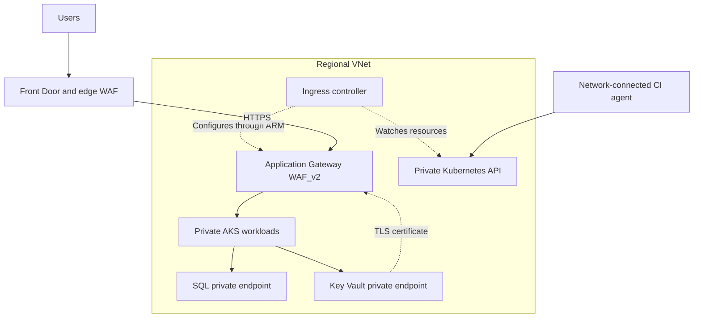

Below are Azure-focused answers for a **5-year DevOps interview**. Project descriptions are reference examples—adapt them to your actual experience.

**1. What is the difference between Application Gateway and Front Door?**

Both handle HTTP/HTTPS traffic at **Layer 7**, but serve different scopes.

| Aspect | Application Gateway | Azure Front Door |
|---|---|---|
| Scope | Regional | Global |
| Deployment | In a dedicated VNet subnet | Microsoft’s global edge network |
| Main purpose | Regional application routing and load balancing | Global routing, acceleration, caching, and regional failover |
| Routing | Host-based and path-based routing | Host/path routing and selection among origins |
| Backends | Can directly reach private backends through network connectivity | Supports public origins; Premium supports Private Link for supported origins |
| WAF | Available with `WAF_v2` | Edge WAF; capabilities depend on tier |
| Caching | Not a CDN | Supports edge caching |
| TLS termination | At the regional gateway | At the edge, with HTTPS forwarding to origins |

**Example:** For an application used mainly within one region, Application Gateway may be sufficient. For a global application deployed in India and Europe, Front Door can route users to healthy regional origins. Application Gateway can provide regional ingress in each region. [Microsoft Learn](https://learn.microsoft.com/en-us/azure/frontdoor/front-door-faq?utm_source=chatgpt.com)

Front Door provides traffic routing; regional recovery still requires healthy applications and an appropriate database recovery strategy.

**2. How do you protect endpoints in AKS?**

First distinguish **application endpoints** from the **Kubernetes API endpoint**.

| Area | Protection |
|---|---|
| Public application ingress | HTTPS, WAF, appropriate rate limits, and controlled routing |
| Application authentication | Validate OAuth/OIDC tokens, audience, scopes, and application permissions |
| Kubernetes API | Private API endpoint, Microsoft Entra integration, and least-privilege RBAC |
| Pod communication | NetworkPolicies restricting approved inbound and outbound traffic |
| Secrets | Key Vault, workload identity, and controlled secret access |
| Workloads | Nonroot execution, restricted privileges, approved images, and security scanning |
| Azure dependencies | Private endpoints and private DNS where required |

A private AKS API does **not** automatically make every application private. Application exposure is configured separately. [Microsoft Learn](https://learn.microsoft.com/en-us/azure/aks/secure-aks?utm_source=chatgpt.com)

A reference architecture:



When Front Door uses a public origin, restrict the origin to the `AzureFrontDoor.Backend` service tag **and** validate the specific `X-Azure-FDID` value. This helps prevent bypassing the edge controls through direct origin access. [Microsoft Learn](https://learn.microsoft.com/en-us/azure/frontdoor/origin-security?utm_source=chatgpt.com)

**3. What networking are you using in AKS?**

A sample project answer:

> “Our reference deployment uses Azure CNI Pod Subnet with Cilium. Nodes and Pods have separate subnets, and Pod IPs are reachable from connected networks. Cilium handles service routing and network-policy enforcement. Application Gateway provides ingress, and the Kubernetes API is private.”

The networking choice has two parts:

| Decision | Options |
|---|---|
| IP allocation and routing model | Azure CNI Overlay or Azure CNI Pod Subnet |
| Data plane and policy enforcement | Azure CNI powered by Cilium for supported Linux deployments |

**Azure CNI Pod Subnet** provides VNet-routable Pod addresses and suits integrations requiring direct Pod connectivity. **Overlay** uses a separate Pod CIDR and conserves VNet addresses; traffic leaving the cluster is generally translated to a node address. [Microsoft Learn](https://learn.microsoft.com/azure/aks/concepts-network-cni-overview?trk=article-ssr-frontend-pulse_little-text-block\&utm_source=chatgpt.com)

For the reference flat-network setup, Application Gateway reaches backend Pod IPs. AGIC watches Kubernetes resources and programs the gateway through Azure Resource Manager; user traffic does not pass through the AGIC Pod. [Microsoft Learn](https://learn.microsoft.com/en-us/azure/application-gateway/ingress-controller-overview?utm_source=chatgpt.com)

Current AGIC also supports Overlay, subject to version, subnet, delegation, and topology requirements. It is inaccurate to say that AGIC never supports Overlay.

For IP planning, include maximum Pods, maximum nodes, upgrade surge capacity, system Pods, and address-release delays—not just current usage. [Microsoft Learn](https://learn.microsoft.com/en-us/azure/aks/configure-azure-cni-dynamic-ip-allocation?utm_source=chatgpt.com)

**4. How do you optimize cloud costs?**

I start with cost allocation and usage measurements, then optimize the largest controllable costs.

| Area | Actions |
|---|---|
| Visibility | Tag ownership/environment, review Cost Management, budgets, and Advisor |
| VMs | Right-size from usage, deallocate idle nonproduction machines |
| AKS | Tune requests, autoscale workloads and nodes, remove unused capacity |
| Commitments | Evaluate reservations or savings plans after establishing stable demand |
| Interruptible jobs | Consider Spot capacity when interruption is acceptable |
| App Service | Right-size plans and share plans where workload isolation permits |
| SQL | Tune queries and capacity; consider suitable serverless or pooled options |
| Storage | Remove abandoned resources and apply appropriate lifecycle/retention |
| Logging | Retain useful data and control unnecessary ingestion |
| Networking | Review egress, cross-region traffic, and unnecessary gateways |

For example, running a development VM for **40 hours instead of 168 hours per week** reduces its operating time by approximately **76%**. Compute savings depend on deallocation and billing; disks and other retained resources can still incur charges.

For AKS, reduce excessive resource requests carefully: they influence scheduling and scaling. Keep the minimum capacity required by availability targets. Azure Advisor provides AKS-specific cost recommendations. [Microsoft Learn](https://learn.microsoft.com/en-us/azure/aks/cost-advisors?utm_source=chatgpt.com)

Budget alerts notify you; they are not automatic spending caps.

**5. How do you block a particular domain in Application Gateway?**

Clarify what “block a domain” means:

| Meaning | Appropriate control |
|---|---|
| Reject requests addressed to a hostname | Application Gateway WAF rule matching `Host` |
| Prevent workloads accessing an external domain | Egress firewall or supported FQDN policy |
| Reject requests associated with a website | Header filtering may help, but `Origin`/`Referer` are not reliable caller identity |

For incoming requests to `blocked.example.com`, create a WAF custom rule:

```hcl
custom_rules {
  name      = "BlockSpecificHostname"
  priority  = 10
  rule_type = "MatchRule"
  action    = "Block"

  match_conditions {
    match_variables {
      variable_name = "RequestHeaders"
      selector      = "Host"
    }

    operator           = "Regex"
    negation_condition = false
    match_values       = ["^blocked[.]example[.]com[.]?(:[0-9]+)?$"]
    transforms         = ["Lowercase"]
  }
}
```

This matches the exact hostname, allowing for case normalization, a trailing dot, or a port. It does not accidentally match `blocked.example.com.evil.test`.

The WAF policy must:

- Be enabled in **Prevention** mode.
- Be associated with the relevant `WAF_v2` gateway or listener.
- Have priorities reviewed against other custom rules.

Detection mode logs a match without blocking it. [Microsoft Learn](https://learn.microsoft.com/en-us/azure/web-application-firewall/ag/custom-waf-rules-overview?utm_source=chatgpt.com)

If Front Door rewrites the origin `Host` header, verify what Application Gateway receives. A rule for the original public hostname may belong at Front Door.

**6. How do you write a Terraform module?**

Define a reusable interface around a cohesive component:

- **Inputs:** configurable names, location, SKU, settings, and tags.
- **Resources:** implementation.
- **Outputs:** IDs, URLs, and identities needed by callers.
- **Provider requirements:** compatibility constraints.
- **Documentation:** assumptions and usage examples.

An App Service module could contain:

```hcl
resource "azurerm_service_plan" "this" {
  name                = "${var.app_name}-plan"
  resource_group_name = var.resource_group_name
  location            = var.location
  os_type             = "Linux"
  sku_name            = var.sku_name
}

resource "azurerm_linux_web_app" "this" {
  name                = var.app_name
  resource_group_name = var.resource_group_name
  location            = var.location
  service_plan_id     = azurerm_service_plan.this.id
  https_only          = true

  identity {
    type = "SystemAssigned"
  }

  site_config {
    always_on           = true
    minimum_tls_version = "1.2"
    ftps_state          = "Disabled"

    application_stack {
      node_version = "22-lts"
    }
  }
}

output "app_url" {
  value = "https://${azurerm_linux_web_app.this.default_hostname}"
}
```

The calling root supplies the inputs:

```hcl
module "app_service" {
  source              = "../../modules/app-service"
  app_name            = var.app_name
  resource_group_name = azurerm_resource_group.this.name
  location            = var.location
  sku_name            = "P1v3"
}
```

Normally, provider configuration and backend ownership stay in the root. The child declares provider requirements and receives configuration from its caller. [HashiCorp Developer](https://developer.hashicorp.com/terraform/language/modules/develop/structure?utm_source=chatgpt.com)

The downloadable example includes input validation, outputs, managed identities, health checks, and an optional staging slot.

**7. How do you upgrade a Terraform module?**

1. Read release notes and compatibility requirements.
2. Update the selected module version or Git reference.
3. Initialize dependencies.
4. Validate and inspect the plan.
5. Test in a lower environment.
6. Apply the reviewed production change.

For a registry module:

```hcl
module "app_service" {
  source  = "app.terraform.io/example-org/app-service/azurerm"
  version = "1.3.0"

  # Module inputs...
}
```

The address above is illustrative; use your actual registry address.

```bash
terraform init -upgrade
terraform fmt -check -recursive
terraform validate
terraform plan -out=upgrade.tfplan

# After reviewing the plan:
terraform apply upgrade.tfplan
```

Important distinctions:

- Registry modules use `version`.
- Git modules use a source reference such as `?ref=v1.3.0`.
- Local modules change with the repository; they do not support a module `version` argument.
- `.terraform.lock.hcl` locks **providers**, not remote module versions.
- `init -upgrade` can also update providers within their constraints. [HashiCorp Developer](https://developer.hashicorp.com/terraform/language/modules/configuration?utm_source=chatgpt.com)

If resource addresses change, use an appropriate `moved` block instead of allowing unintended replacement:

```hcl
moved {
  from = azurerm_linux_web_app.web
  to   = azurerm_linux_web_app.this
}
```

Reverting the module version alone does not necessarily undo infrastructure or data changes already applied.

**8. Screen-sharing exercise: write the Terraform structure**

I would create this structure and explain the responsibilities:

| Path | Purpose |
|---|---|
| `modules/app-service/main.tf` | App Service resources |
| `modules/app-service/variables.tf` | Inputs and validation |
| `modules/app-service/outputs.tf` | URLs, IDs, and identities |
| `modules/app-service/versions.tf` | Terraform/provider requirements |
| `environments/dev/main.tf` | Development module invocation |
| `environments/dev/providers.tf` | Development provider configuration |
| `environments/dev/versions.tf` | Requirements and backend declaration |
| `environments/dev/terraform.tfvars` | Development values |
| `environments/dev/backend.hcl` | Development state location |
| `environments/prod/…` | Equivalent production root with separate values/state |

Backend declaration:

```hcl
terraform {
  backend "azurerm" {}
}
```

Example backend configuration:

```hcl
resource_group_name  = "rg-terraform-state"
storage_account_name = "youruniquestateaccount"
container_name       = "tfstate"
key                  = "sonata/dev/app-service.tfstate"
use_azuread_auth      = true
```

Production uses a different key and appropriately scoped access.

```bash
terraform init -backend-config=backend.hcl
terraform validate
terraform plan -out=deployment.tfplan
terraform apply deployment.tfplan
```

The Azure Blob backend supports state locking. Authenticate through an approved identity and grant the required state-storage permissions. Keep credentials out of backend files, and commit the generated provider lock file. [HashiCorp Developer](https://developer.hashicorp.com/terraform/language/backend/azurerm?utm_source=chatgpt.com)

**9. How do you monitor when Pods go down?**

Monitor **workload availability**, not just individual Pod existence. Pods are normally replaced during rollouts and scaling.

A reference setup uses:

- Managed Prometheus for Kubernetes metrics.
- Grafana for dashboards.
- Container insights for logs and events.
- Azure Monitor alerts routed to the incident system.
- Application/synthetic checks for customer impact.

Azure provides recommended AKS alerts, including deployment replica mismatches and unhealthy workloads. [Microsoft Learn](https://learn.microsoft.com/en-us/azure/aks/monitor-aks?utm_source=chatgpt.com)

Example Prometheus rule:

```yaml
- alert: DeploymentAvailableReplicasLow
  expr: |
    max by (cluster, namespace, deployment) (
      kube_deployment_status_replicas_available{namespace="production"}
    )
    <
    max by (cluster, namespace, deployment) (
      kube_deployment_spec_replicas{namespace="production"}
    )
  for: 5m
  labels:
    severity: warning
```

Also watch:

| Signal | What it indicates |
|---|---|
| `CrashLoopBackOff` | Repeated container failures |
| Increasing restart count | Instability |
| OOM events with restarts | Memory-related failures |
| Extended Pending state | Scheduling or capacity problems |
| Node NotReady | Node availability problem |
| API errors/latency | Customer-facing impact |

A missing metric series does not automatically trigger a numerical comparison. Include monitoring-health and synthetic checks.

**10. Which metrics alert when VM CPU or memory exceeds 75%?**

For Azure VMs:

| Requirement | Metric | Condition |
|---|---|---|
| CPU above 75% | `Percentage CPU` | Greater than 75 |
| Memory pressure above 75% | `Available Memory Percentage` | Less than 25 |

These are listed under the `Microsoft.Compute/virtualMachines` metric namespace. [Microsoft Learn](https://learn.microsoft.com/en-us/azure/azure-monitor/reference/supported-metrics/microsoft-compute-virtualmachines-metrics?utm_source=chatgpt.com)

Example CPU criteria:

```hcl
criteria {
  metric_namespace = "Microsoft.Compute/virtualMachines"
  metric_name      = "Percentage CPU"
  aggregation      = "Average"
  operator         = "GreaterThan"
  threshold        = 75
}
```

A common policy evaluates the **five-minute average every minute**, with an Action Group for notifications. This differs from requiring every individual sample to exceed 75%.

Confirm the VM emits the required memory data. Where necessary, configure guest collection through Azure Monitor Agent and data collection rules.

For Linux node_exporter, an available-memory-based expression is:

```promql
100 * (
  1 - node_memory_MemAvailable_bytes / node_memory_MemTotal_bytes
) > 75
```

Using available memory accounts for reclaimable memory better than simply counting all cache as unavailable.

**11. Where do you store Application Gateway TLS certificates?**

My preferred source of truth is **Azure Key Vault**.

The setup is:

1. Store/import the certificate with the required exportable private key.
2. Assign Application Gateway a user-assigned managed identity.
3. Grant that identity appropriate secret-read permissions.
4. Configure network access between the gateway and Key Vault.
5. Reference the certificate’s **versionless secret URI** from the HTTPS listener configuration.

Terraform resource fragment:

```hcl
identity {
  type         = "UserAssigned"
  identity_ids = [var.gateway_identity_id]
}

ssl_certificate {
  name                = "public-tls"
  key_vault_secret_id = "https://example-vault.vault.azure.net/secrets/public-tls/"
}
```

Application Gateway retrieves and installs the certificate locally for TLS termination. With a versionless reference, it can discover renewed versions; the documented polling interval is approximately four hours, and configuration changes also trigger a check. [Microsoft Learn](https://learn.microsoft.com/en-us/azure/application-gateway/key-vault-certs?utm_source=chatgpt.com)

Monitor expiry and retrieval failures. Avoid embedding a PFX or its password in source code or Terraform input files.

**12. How long would you take to write IaC and deploy App Service?**

Give an estimate with clear assumptions:

| Scope | Illustrative estimate |
|---|---|
| Adapt an existing module with access/state ready | About 30–60 minutes for configuration and review |
| Write a new basic module and validate it | Approximately 2–4 hours |
| Production setup with networking, secrets, monitoring, and pipeline integration | Roughly 1–3 working days, depending on dependencies |

These are planning estimates, not Azure provisioning guarantees.

A good interview response is:

> “For a basic App Service using an approved module, I can usually prepare the configuration and reviewed plan within an hour. I estimate provisioning and smoke testing separately. For production, I first account for private networking, identities, diagnostics, deployment slots, and pipeline requirements.”

**13. How do you build CI/CD in Azure DevOps?**

My workflow would be:

1. Protect the target branch with review and build-validation policies.
2. Run tests and required security/quality checks.
3. Build one versioned artifact.
4. Deploy it to development and run integration checks.
5. Promote the same artifact through later environments.
6. Deploy an approved production candidate, verify it, and monitor the release.

For Azure authentication, use an Azure Resource Manager service connection with **workload identity federation**, scoped to the required resources. [Microsoft Learn](https://learn.microsoft.com/en-us/azure/devops/pipelines/release/configure-workload-identity?view=azure-devops\&utm_source=chatgpt.com)

A simplified deployment stage:

```yaml
- stage: DeployDev
  dependsOn: Build
  condition: and(
    succeeded(),
    eq(variables['Build.SourceBranch'], 'refs/heads/main')
    )
  jobs:
    - deployment: DeployApplication
      environment: development
      strategy:
        runOnce:
          deploy:
            steps:
              - download: current
                artifact: application

              - task: AzureCLI@2
                inputs:
                  azureSubscription: sc-azure-dev-wif
                  scriptType: bash
                  scriptLocation: inlineScript
                  inlineScript: |
                    set -euo pipefail
                    az webapp deploy \
                      --resource-group "$RG" \
                      --name "$APP" \
                      --src-path "$PACKAGE" \
                      --type zip
                env:
                  RG: $(resourceGroup)
                  APP: $(appName)
                  PACKAGE: $(Pipeline.Workspace)/application/app.zip
```

For production App Service, I would deploy to a staging slot, check it, swap to production, and verify the production endpoint. Environment-specific settings can remain sticky.

Two interview details matter:

- For **Azure Repos Git**, PR validation is configured through the target branch’s Build validation policy.
- Environment approvals/checks are configured on protected Azure DevOps resources; naming an environment in YAML does not create its approval policy. [Microsoft Learn](https://learn.microsoft.com/en-us/azure/devops/pipelines/repos/azure-repos-git?view=azure-devops\&utm_source=chatgpt.com)

Private AKS or private deployment endpoints require an agent with the necessary network routes and DNS resolution.

**14. Azure SQL CPU exceeds 75%—how do you upgrade it?**

Assuming **Azure SQL Database**, this normally means **scaling compute capacity**, not upgrading the database engine version.

I would:

1. Check whether `cpu_percent` remains high over an appropriate window.
2. Use Query Store to identify expensive queries or execution-plan regressions.
3. Check concurrency, indexing, blocking, and related resource limits.
4. Tune avoidable workload costs.
5. Increase vCores/DTUs when capacity is the bottleneck.
6. Verify latency, errors, throughput, and cost afterward. [Microsoft Learn](https://learn.microsoft.com/en-us/azure/azure-monitor/reference/supported-metrics/microsoft-sql-servers-databases-metrics?utm_source=chatgpt.com)

Example: increasing provisioned General Purpose capacity:

```bash
az sql db update \
  --resource-group rg-production \
  --server sql-production \
  --name orders \
  --edition GeneralPurpose \
  --family Gen5 \
  --capacity 4 \
  --compute-model Provisioned
```

For a Terraform-managed database, change the existing resource:

```hcl
resource "azurerm_mssql_database" "orders" {
  name      = "orders"
  server_id = var.sql_server_id

  # Example: increase from GP_Gen5_2
  sku_name = "GP_Gen5_4"
}
```

Review the plan and apply through the normal infrastructure workflow.

Scaling can involve a cutover and transient connection interruptions, so applications need appropriate retry behavior. Capacity changes do not guarantee proportional query-speed improvements. [Microsoft Learn](https://learn.microsoft.com/en-us/azure/azure-sql/database/single-database-scale?view=azuresql\&utm_source=chatgpt.com)

If an emergency CLI change is made, update Terraform’s desired configuration afterward to prevent a later apply from reverting it.

**15. Have you used Terraform Cloud?**

Answer using your actual experience. Terraform Cloud is now called **HCP Terraform**.

A knowledge-based answer could be:

> “HCP Terraform provides centralized state, remote runs, workspace access controls, and VCS-driven planning. I would separate development and production workspaces, scope their credentials independently, and use reviewed plans before applying production changes.”

Capabilities to explain include:

- Remote state and locking.
- VCS-triggered and speculative plans.
- Workspace variables and reusable variable sets.
- Team permissions and controlled applies.
- Private module registry.
- Policy and integration features, depending on entitlement. [HashiCorp Developer](https://developer.hashicorp.com/terraform/cloud-docs?utm_source=chatgpt.com)

For Azure, HCP Terraform supports dynamic provider credentials through OIDC, reducing the need for long-lived client secrets. [HashiCorp Developer](https://docs.hashicorp.com/terraform/cloud-docs/dynamic-provider-credentials/azure-configuration?utm_source=chatgpt.com)

An Azure Blob backend principally supplies state storage and locking; HCP Terraform also supplies a managed execution and collaboration workflow.

**16. Do you use Helm charts for AKS deployments?**

A sample answer:

> “In a Helm-based deployment, we package Deployment, Service, Ingress, autoscaling, and related configuration in a chart. Environment values supply differences such as replicas, resource requests, hostnames, and image references. We promote an approved image version or digest.”

Example production values:

```yaml
replicaCount: 3

image:
  repository: example.azurecr.io/sonata-api
  digest: "sha256:REPLACE_WITH_APPROVED_DIGEST"

resources:
  requests:
    cpu: 100m
    memory: 128Mi
  limits:
    cpu: 500m
    memory: 512Mi

autoscaling:
  enabled: true
  minReplicas: 3
  maxReplicas: 10
  targetCPUUtilizationPercentage: 75
```

Validate and deploy:

```bash
helm lint ./helm/sonata-api -f helm/values-prod.yaml

helm template api ./helm/sonata-api \
  -n production -f helm/values-prod.yaml

# Helm 4:
helm upgrade --install api ./helm/sonata-api \
  -n production --create-namespace \
  -f helm/values-prod.yaml \
  --set-string image.digest="$IMAGE_DIGEST" \
  --wait --timeout 5m --rollback-on-failure
```

For Helm 3, the corresponding upgrade rollback option is `--atomic`. [Helm](https://docs.helm.sh/docs/helm/helm_upgrade/?utm_source=chatgpt.com)

For recovery:

```bash
helm history api -n production
helm rollback api PREVIOUS_REVISION -n production --wait
```

Important details:

- Chart `version`, `appVersion`, and the image reference are separate concepts.
- Keep secrets in an appropriate secret-management system.
- When HPA manages replicas, avoid resetting the Deployment replica count on every upgrade.
- HPA CPU utilization is relative to **CPU requests**, unlike the VM metric in question 10.
- Helm rollback does not undo database migrations or external data changes.

The complete examples are available in sonata-azure-devops-examples.zip[sonata-azure-devops-examples.zip](sandbox:/workspace/scratch/8dc6806ebb9b/sonata-azure-devops-examples.zip). YAML parsing, module-path checks, and hostname-regex checks passed. Terraform/provider validation, Helm rendering, and live Azure deployments remain unverified.
