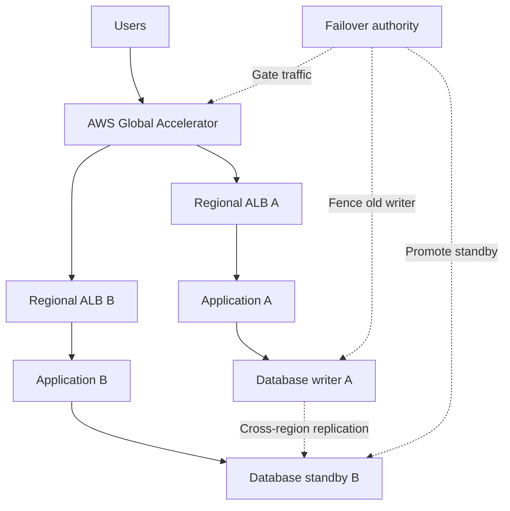
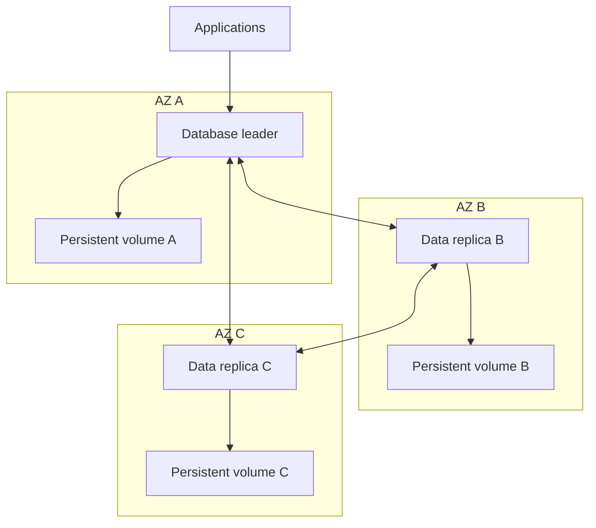
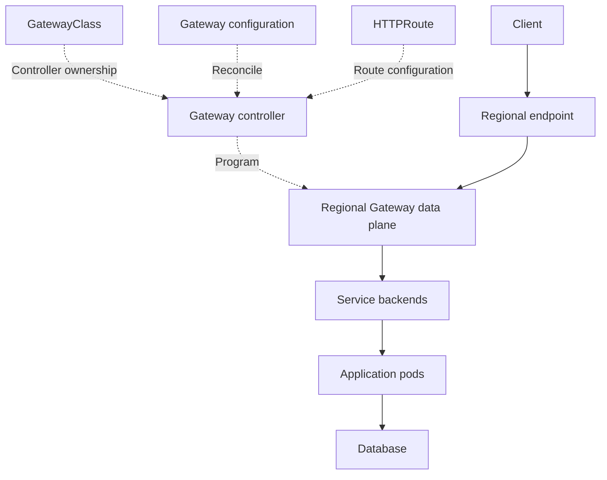
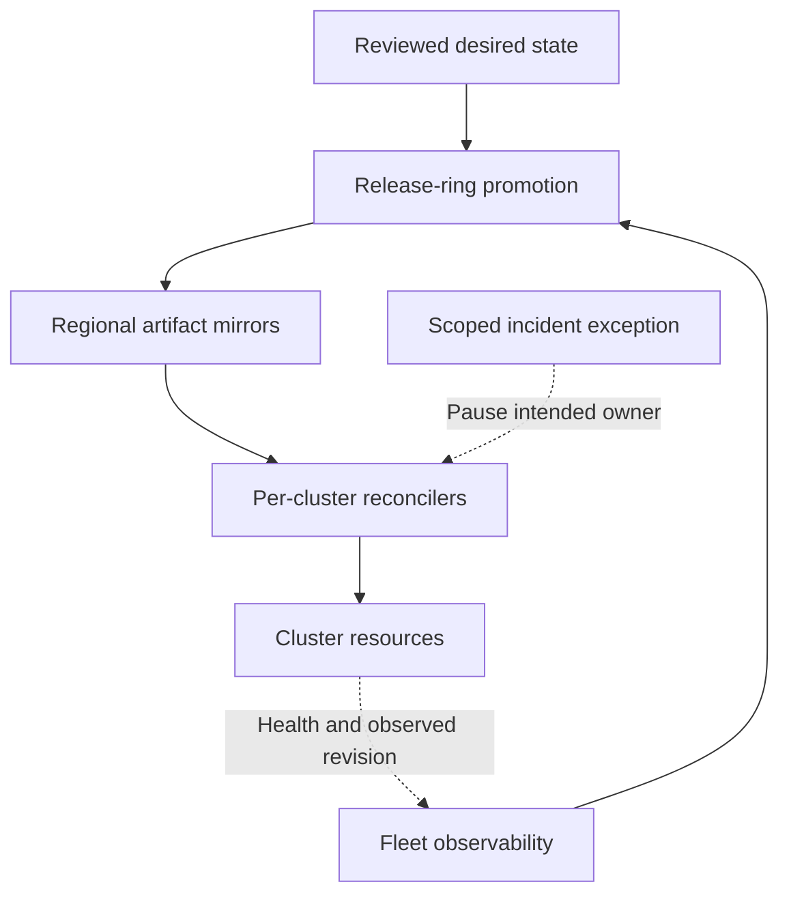

These answers focus on the decisions, failure modes, and evidence expected in senior DevOps/SRE interviews. The incident examples are **hypothetical**; replace them with incidents you actually handled.

sre-production-scenarios-examples.zip[Download the configuration and scripting examples](sandbox:/workspace/scratch/8dc6806ebb9b/sre-production-scenarios-examples.zip).

---

**1. How would you respond to a production outage during peak hours?**

My first priority is restoring service safely while preserving enough evidence to understand the incident.

1. **Confirm impact:** Check critical user journeys, affected regions/tenants, errors, latency, and data integrity.
2. **Declare the incident:** Establish severity, an incident commander, operational ownership, and a communication channel.
3. **Stop unrelated changes:** Pause deployments that could complicate diagnosis.
4. **Mitigate:** Roll back a suspected release, disable a feature, shed noncritical traffic, or fail over when the destination is ready.
5. **Investigate in parallel:** Correlate deployment events, logs, traces, infrastructure changes, and dependency health.
6. **Verify recovery:** Use real user journeys and business outcomes, rather than only healthy infrastructure dashboards.
7. **Follow up:** Produce a timeline and corrective actions with owners and verification criteria.

**Example:** Checkout failures begin immediately after a deployment. If the previous version remains compatible with the database, restore that release while investigating the new version.

Adding servers is appropriate when capacity is the bottleneck. It can worsen an outage when the database is already saturated.

A useful interview phrase is: **“Mitigation and root-cause investigation proceed in parallel; restoration does not need to wait for a complete RCA.”** [Learn sre incident management and response](https://sre.google/resources/practices-and-processes/incident-management-guide/?utm_source=chatgpt.com)

---

**2. How do you guarantee zero-downtime deployments in Kubernetes?**

I would describe the conditions under which the deployment meets its availability objective. **`maxUnavailable: 0` alone cannot guarantee zero failed requests.**

The design needs:

- Multiple replicas and spare rollout capacity.
- Readiness checks that reflect the ability to serve requests.
- Startup probes for initialization.
- Graceful shutdown and connection draining.
- Load-balancer propagation time accounted for.
- Compatible old/new application versions and database schemas.
- External session state where necessary.
- Progressive delivery with application-level health checks.

Key Deployment settings, shown as a fragment:

```yaml
spec:
  replicas: 3
  minReadySeconds: 15
  strategy:
    type: RollingUpdate
    rollingUpdate:
      maxUnavailable: 0
      maxSurge: 1
  template:
    spec:
      terminationGracePeriodSeconds: 60
      containers:
        - name: app
          image: registry.example.com/orders:approved-release
          readinessProbe:
            httpGet:
              path: /ready
              port: 8080
          lifecycle:
            preStop:
              httpGet:
                path: /drain
                port: 8080
```

The application must implement `/drain`: become unready, allow routing changes to propagate, and finish requests within the shutdown budget. The grace period includes the `preStop` hook. [Kubernetes](https://kubernetes.io/docs/concepts/workloads/controllers/deployment/?utm_source=chatgpt.com)

A PDB helps with applicable voluntary evictions. It does not prevent an AZ failure or directly govern a Deployment’s rolling-update strategy. [Kubernetes](https://kubernetes.io/docs/concepts/workloads/pods/disruptions/?utm_source=chatgpt.com)

---

**3. How do you decide between rollback and a hotfix?**

I compare the **time to safe recovery**, compatibility, and confidence in the change.

| Situation | Likely response |
|---|---|
| New release caused the issue; previous release is compatible | Roll back |
| Feature can be disabled safely | Disable it first |
| Previous version cannot work with the changed schema | Restore compatibility or apply a targeted fix |
| Issue exists in both versions | Fix the underlying cause |
| Suspected rollback could corrupt data | Investigate compatibility before executing |
| Small, understood fix can be tested quickly | Consider a hotfix |

**Example:** Version 2.3 introduces errors, while 2.2 works with the current schema. Roll back to 2.2.

If 2.3 removed a column required by 2.2, reverting the application alone will fail. Restore compatibility or deploy a targeted correction.

In GitOps, revert the desired release in Git or explicitly pause reconciliation during an emergency. Otherwise, the controller may restore the problematic desired state.

Rollback also needs to cover configuration changes. A Deployment rollback does not automatically restore separately modified Secrets, ConfigMaps, or database data.

---

**4. How would you design a system to survive an AWS region outage?**

Start with **RTO**, the acceptable recovery time, and **RPO**, the acceptable data-loss window.

| Design | Recovery characteristics | Cost/complexity |
|---|---|---|
| Backup and restore | Rebuild after failure | Lowest standing cost; slower recovery |
| Pilot light | Core data infrastructure already exists | Application capacity still needs activation |
| Warm standby | Reduced but functional secondary environment | Faster recovery; additional standing capacity |
| Active-active | Multiple regions serve traffic | Highest consistency and operational complexity |

For a transactional application, a common choice is warm standby:



The secondary needs application artifacts, secrets, certificates, encryption-key access, network connectivity, quotas, and sufficient capacity.

The failover sequence is:

1. Confirm the failure and destination readiness.
2. Fence the old writer.
3. Promote the secondary database.
4. Update application connectivity.
5. Enable traffic.
6. Verify reads, writes, and reconciliation.

Aurora Global Database uses asynchronous cross-region replication, so unplanned failover can lose recent transactions depending on replication lag. [Amazon Aurora](https://docs.aws.amazon.com/AmazonRDS/latest/AuroraUserGuide/aurora-global-database-disaster-recovery.html?utm_source=chatgpt.com)

If the requirement is RPO zero for a complete region loss, select a data architecture that synchronously commits across suitable regional failure domains, accepting its latency and partition-availability trade-offs.

---

**5. How would you investigate a sudden three-times increase in the AWS bill?**

First establish whether the increase represents additional usage, a pricing/commitment change, or a different reporting basis.

1. Compare equal-duration periods using the same cost metric.
2. Group costs by account, service, region, usage type, and relevant ownership tags.
3. Identify the largest **absolute increases**.
4. Use Cost and Usage Reports/Data Exports for deeper resource-level investigation.
5. Correlate the increase with deployments, traffic, scaling, and CloudTrail activity.

| Cost driver | Investigation |
|---|---|
| EC2 | Instance count/type changes, forgotten environments, burstable CPU credits |
| NAT/data transfer | Changed traffic paths, cross-AZ traffic, missing endpoints |
| CloudWatch | Verbose logs, retention changes, excessive custom metrics |
| S3 | Storage growth, old versions, requests, incomplete multipart uploads |
| Database | Instance changes, replicas, I/O, retained snapshots |
| Unexpected regions/resources | Unauthorized activity or incorrect automation |

**Example:** A new deployment downloads large S3 artifacts repeatedly through a NAT path. Verify the traffic and retry behavior, then correct the download loop and evaluate an S3 endpoint.

Billing information can lag. Confirm ongoing growth with live service metrics. After correction, add ownership, anomaly detection, and budget notifications; those notifications are not a hard spending cap. [AWS Cost Management](https://docs.aws.amazon.com/cost-management/latest/userguide/ce-what-is.html?utm_source=chatgpt.com)

---

**6. How can you shorten a CI/CD pipeline that takes 45 minutes?**

Measure the **critical path**, including time waiting for agents.

| Bottleneck | Improvement |
|---|---|
| Agent queue | Right-size runner capacity and use isolated ephemeral agents |
| Dependency downloads | Cache using dependency lockfiles, platform, and toolchain version |
| Large checkout | Fetch only necessary history when the job permits it |
| Sequential independent checks | Run them in parallel |
| Long test suite | Identify slow tests and split balanced test shards |
| Rebuilding per environment | Build once and promote the same immutable artifact |
| Image build | Improve layer ordering and trusted build-cache reuse |
| Obsolete verification jobs | Cancel superseded checks safely |

**Example:** Independent integration tests take 15 minutes and a source scan takes eight minutes. Running them concurrently reduces that portion from 23 to approximately 15 minutes, assuming sufficient agents.

However, analysis importing coverage must wait for the coverage report. Parallelism cannot remove a real dependency.

Also avoid occupying a Jenkins executor while waiting for a remote quality gate. Optimize expensive stages while retaining the controls that detect broken releases.

---

**7. How do you stop broken code from reaching production?**

Use several independent controls:

1. Protected branches and required reviews.
2. Tests for business behavior, contracts, and integration boundaries.
3. Secret scanning, SAST, dependency/container scanning, and IaC checks.
4. A blocking quality gate.
5. Build once; identify releases by immutable digest.
6. Test the artifact in a representative environment.
7. Progressive deployment with synthetic and business-health checks.
8. Admission and deployment permissions that prevent bypassing the approved path.

Protect pipeline definitions themselves: an application PR should not silently disable its own mandatory checks.

**Example:** A checkout release passes unit tests but violates the payment-service contract. Contract testing catches it before deployment; a canary provides another opportunity to detect unexpected production behavior.

Passing checks does not prove the absence of defects. Progressive exposure and tested rollback procedures limit the impact of defects that escape.

---

**8. How do you start troubleshooting when a Kubernetes cluster feels slow?**

First define what is slow: **API operations, scheduling, startup, or application requests**.

```bash
kubectl get nodes
kubectl get pods -A -o wide
kubectl get events -A --sort-by=.metadata.creationTimestamp
kubectl top nodes
kubectl top pods -A
```

| Symptom | Investigate |
|---|---|
| Slow `kubectl` operations | API-server latency, admission webhooks, etcd, API load |
| Pods remain Pending | Resources, quotas, taints, affinity, topology, PVC binding |
| Slow pod startup | Image pulls, initialization, secret/config retrieval, probes |
| Slow requests | Traces, DNS, network loss, CPU throttling, connection pools, dependencies |
| Nodes struggle | Memory/IO pressure, filesystem capacity, conntrack, system reservations |

Compare affected and unaffected nodes, zones, applications, and release versions.

`kubectl top` is a current CPU/memory view. It does not establish whether a node has intermittent disk latency, a short memory spike, or network congestion.

Avoid restarting the cluster before identifying the failing layer.

---

**9. How do you guarantee zero-downtime Kubernetes deployments?**

This repeats question 2. The additional interview point is **how you prove the design works**.

| Test | Evidence |
|---|---|
| Roll out under peak-like load | Successful transactions and stable latency |
| Send requests during termination | In-flight requests complete without resets |
| Fail readiness on the new version | Old healthy capacity remains available |
| Combine rollout with node disruption | Remaining capacity meets demand |
| Exercise long-lived connections | Reconnect/drain behavior works |
| Test old/new versions together | API and database compatibility holds |

For a stateless singleton, surge capacity can permit a new pod to become ready before the old pod stops. It still lacks protection against an unrelated pod/node failure.

A stateful singleton with exclusive storage or writer ownership requires an application-specific availability design. Deployment rollout settings cannot supply database replication or failover.

Native Deployment progress failure also does not automatically roll back the application; that needs delivery automation or an operator decision.

---

**10. Metrics look healthy, but users are complaining. What do you do?**

Treat the complaints as evidence that either the system or the monitoring definition is incomplete.

1. Obtain affected journey, timestamp, region, tenant, browser/device, and request ID.
2. Reproduce from the user’s network or a comparable external location.
3. Trace DNS, TLS, frontend loading, authentication, API processing, and dependencies.
4. Segment metrics by the affected cohort.
5. Check business correctness, not only HTTP success.
6. Confirm monitoring freshness and collection health.

Common explanations include:

- Global averages hiding one unhealthy tenant or region.
- HTTP `200` responses containing application errors.
- Frontend JavaScript failures invisible to backend monitoring.
- DNS, CDN, certificate, authentication, or network problems.
- Slow asynchronous processing after the API responds.
- Missing or stale telemetry.

**Example:** API latency is normal, but order confirmation takes five minutes because the worker queue is backed up.

Add journey synthetics, real-user monitoring, queue age, and business-success SLIs to cover the missing behavior. [Monitoring Systems with Advanced Analytics](https://sre.google/workbook/monitoring/?utm_source=chatgpt.com)

---

**11. How do you avoid noisy or false alerts?**

Design alerts around actionable service impact, with diagnostic signals available alongside them.

For a 99.9% availability SLO, the allowed error fraction is `0.001`. An example fast-burn alert is:

```promql
(
  service:sli_error_ratio:5m > 14.4 * 0.001
)
and on(service)
(
  service:sli_error_ratio:1h > 14.4 * 0.001
)
```

The recording rules must measure properly defined eligible and failed requests. Preserve region/tenant/cluster dimensions where the SLO requires that scope.

Additional controls:

- Use multiple evaluation windows.
- Group related alerts.
- Distinguish paging from tickets.
- Apply carefully scoped inhibition.
- Handle missing telemetry explicitly.
- Cover low-traffic services with synthetics or suitable absolute failure conditions.
- Test alerts against known incidents.

A CPU spike alone often belongs on a dashboard or capacity warning. An inability to complete checkout may warrant an immediate page. Multiwindow burn-rate alerting helps distinguish sustained budget consumption from brief fluctuations. [Prometheus Alerting: Turn SLOs into Alerts](https://sre.google/workbook/alerting-on-slos/?utm_source=chatgpt.com)

---

**12. How do you prevent alert fatigue?**

This includes the operational process around alert rules.

Every page should identify:

- The affected service or journey.
- The owner.
- Why action is needed now.
- The first diagnostic steps.
- Relevant dashboards and a runbook.

Review alert outcomes regularly:

| Finding | Action |
|---|---|
| Alert never requires immediate action | Convert to a ticket or dashboard |
| Several alerts describe one incident | Group or inhibit within the affected scope |
| Alert repeatedly flaps | Investigate the cause and evaluation logic |
| Recurring incident generates many pages | Fix the recurring failure |
| Alert has no owner/runbook | Establish ownership before paging |
| Silence remains indefinitely | Require expiry and review |

Measure page volume, actionable-page percentage, repeated alerts, and missed incidents.

Do not solve fatigue by broadly suppressing meaningful failures. Improve the relationship between a page and a useful response. [Devops On-Call](https://sre.google/workbook/on-call/?hl=ca\&utm_source=chatgpt.com)

---

**13. Jenkins should run a pipeline once N commits are pushed. How would you do it?**

A Jenkins **quiet period is time-based**, not commit-count-based. [jenkins.io](https://www.jenkins.io/doc/book/pipeline/syntax/?utm_source=chatgpt.com)

I would use a lightweight dispatcher:

1. Receive an authenticated webhook.
2. Fetch the current protected branch.
3. Read its persisted last-scheduled SHA.
4. Count newly reachable commits:

```bash
git rev-list --count LAST_SCHEDULED_SHA..CURRENT_SHA
```

5. If the count reaches N, transactionally reserve a build candidate.
6. Trigger Jenkins with the exact `COMMIT_SHA` and a unique `BATCH_ID`.
7. Deduplicate the candidate before expensive build stages run.

Define the semantics explicitly:

- Count commits separately per repository/branch.
- Decide whether merge-branch commits count or only first-parent commits.
- Ignore duplicate and out-of-order webhook deliveries.
- Reject unexpected history rewrites.
- Persist the counter outside disposable workspaces.

**Example:** N is five; seven new commits arrive together. A threshold-based implementation schedules one build containing all seven.

If the requirement is exactly one build per group of five, reserve intermediate commit boundaries and retain the remainder.

HTTP retries can enqueue duplicates. Durable candidate claiming is needed for logical once-per-candidate execution. The download includes a tested reservation/outbox example.

---

**14. What vulnerability reports do you have in SonarQube?**

I would explain the findings, their relevance, and how they affect release decisions.

| Finding/report | Meaning |
|---|---|
| Security vulnerability/security issue | A security problem detected by analysis |
| Security hotspot | Security-sensitive code requiring contextual review |
| Security rating | Summary assessment based on applicable findings |
| Standards reports | Findings grouped against supported security standards |

Examples can include injection paths, unsafe command execution, path traversal, exposed credentials, or insecure cryptographic usage, depending on the language, rules, and product capabilities.

For an issue, review its rule, location, severity/impact, and any source-to-sink flow before choosing a correction.

**Example:** Replace SQL constructed from user input with the database driver’s parameterized query mechanism.

Security Hotspots are not automatically confirmed vulnerabilities. Terminology differs between Standard Experience and MQR mode, and dedicated standards reports have edition requirements. [docs.sonarsource.com](https://docs.sonarsource.com/sonarqube-server/2025.6/user-guide/viewing-reports/security-reports?utm_source=chatgpt.com)

In Jenkins, a configured quality gate should block the release when required conditions fail. Dependency and container-image assessment must also be covered by the appropriate scanning tools or enabled product capabilities.

---

**15. Write Terraform to start an EC2 instance at 80% CPU and copy an image from S3.**

I interpret this as:

> A running web fleet reaches average CPU of at least 80% for three consecutive minutes; launch additional EC2 capacity and download a versioned container-image archive during bootstrap.

Terraform provisions the automation. **CloudWatch and Auto Scaling respond to runtime CPU.**

Core scaling resources:

```hcl
resource "aws_autoscaling_policy" "add_one" {
  name                      = "web-add-one"
  autoscaling_group_name    = aws_autoscaling_group.web.name
  policy_type               = "StepScaling"
  adjustment_type           = "ChangeInCapacity"
  metric_aggregation_type   = "Average"
  estimated_instance_warmup = 300

  step_adjustment {
    metric_interval_lower_bound = 0
    scaling_adjustment          = 1
  }
}

resource "aws_cloudwatch_metric_alarm" "cpu_high" {
  alarm_name          = "web-average-cpu-80"
  namespace           = "AWS/EC2"
  metric_name         = "CPUUtilization"
  statistic           = "Average"
  period              = 60
  evaluation_periods  = 3
  datapoints_to_alarm = 3
  threshold           = 80
  comparison_operator = "GreaterThanOrEqualToThreshold"
  treat_missing_data  = "notBreaching"

  dimensions = {
    AutoScalingGroupName = aws_autoscaling_group.web.name
  }

  alarm_actions = [aws_autoscaling_policy.add_one.arn]
}
```

Step scaling changes capacity when its alarm breaches, subject to configured bounds and warmup behavior. [Amazon EC2 Auto Scaling](https://docs.aws.amazon.com/autoscaling/ec2/userguide/as-scaling-simple-step.html?utm_source=chatgpt.com)

The Launch Template supplies bootstrap user data. Its essential operations are:

```bash
aws s3api get-object \
  --bucket "$ARTIFACT_BUCKET" \
  --key "$ARTIFACT_KEY" \
  --version-id "$ARTIFACT_VERSION" \
  /opt/web/image.tar

printf '%s  %s\n' "$EXPECTED_SHA256" /opt/web/image.tar |
  sha256sum -c -

docker load --input /opt/web/image.tar
docker run --detach --pull=never \
  --name web --publish 8080:8080 "$EXPECTED_IMAGE_ID"
```

The complete download adds scoped IAM, an instance profile, IMDSv2, retries, encrypted EBS, health checks, and container restrictions.

Two different interpretations need different implementations:

- **Existing stopped EC2:** An alarm invokes Lambda/SSM Automation with permission to call `StartInstances`.
- **AMI disk image in S3:** Import/register the image first; copying an archive does not make it a bootable AMI.

---

**16. How will you secure Jenkins pipelines?**

Secure the controller, agents, credentials, pipeline definitions, and release authority.

| Area | Controls |
|---|---|
| Controller | Supported updates, TLS, access control, controller isolation |
| Build agents | Ephemeral agents, separate trusted/untrusted pools, least privilege |
| PR builds | No production credentials or production network access |
| Credentials | Scoped binding, short-lived workload credentials, no secret logging |
| Pipeline code | Required review and controlled shared libraries |
| Build tools | Approved images/tools and restricted execution privileges |
| Artifacts | Immutable identity, scanning, signatures, controlled promotion |
| Deployment | Environment-specific roles and protected approval paths |

Avoid exposing the host Docker socket to untrusted jobs; it can provide powerful access to the host.

Credential masking is not a security boundary. Code that can access a credential may deliberately exfiltrate it.

Keep production deployment authority outside the reach of arbitrary untrusted PR code, and use narrowly scoped workload roles rather than broad static AWS keys. Jenkins recommends isolating builds and using fresh agents where appropriate. [jenkins.io](https://www.jenkins.io/doc/book/security/securing-builds/?utm_source=chatgpt.com)

---

**17. Design Kubernetes to survive a full AZ failure without data loss, running stateful workloads at scale.**

Define the guarantee precisely: **RPO zero for acknowledged writes during one AZ failure**, under the database’s supported durability and quorum assumptions.

A StatefulSet with three replicas does not establish that guarantee by itself.



| Concern | Design |
|---|---|
| Control plane | Managed multi-AZ control plane, or correctly distributed etcd quorum |
| Data durability | Database-level synchronous/quorum acknowledgement |
| Placement | Data-bearing members distributed across three AZs |
| Storage | Independent durable volumes per replica |
| Networking | Cross-AZ connectivity, redundant DNS, sufficient IP capacity |
| Controllers | Leader election and tested operator recovery |
| Quorum | Majority remains available after losing one AZ |
| Capacity | Surviving AZs can support demand and recovery work |
| Fencing | An isolated old writer cannot continue accepting conflicting writes |
| Recovery | Rebuild lost replicas from surviving data and logs |

**Example:** A three-data-member MongoDB replica set, one member per AZ, with correctly configured majority/journal durability. Losing one member leaves two members able to maintain majority; durability settings and safe election/reconfiguration remain essential. [mongodb.com](https://www.mongodb.com/docs/v8.3/reference/replica-configuration/?utm_source=chatgpt.com)

EBS volumes are zonal. A volume from the failed AZ cannot simply attach in another AZ. Use surviving database replicas, then provision replacement storage and rebuild the lost replica. `WaitForFirstConsumer` helps align provisioning with pod topology; it does not replicate data. [Amazon EBS](https://docs.aws.amazon.com/ebs/latest/userguide/ebs-volume-lifecycle.html?utm_source=chatgpt.com)

At scale, enforce placement **per shard/replica group**, not merely across the total pod count. Test AZ loss, fencing, recovery throughput, and acknowledged-write integrity.

---

**18. Explain Gateway API request flow with multiple GatewayClasses across regions. How do you prevent split-brain routing?**

Separate **configuration ownership**, **traffic routing**, and **database writer ownership**.

A GatewayClass is cluster-scoped. It identifies the controller implementing a class of Gateways; it is not a global traffic-routing object. [Gateway API](https://gateway-api.sigs.k8s.io/reference/api-types/gatewayclass/?utm_source=chatgpt.com)

The flow is:

1. Global DNS or a global traffic service selects a regional endpoint.
2. The client connects to that region’s programmed Gateway data plane.
3. The listener handles its protocol, port, hostname, and TLS configuration.
4. An attached HTTPRoute matches the request.
5. The configured backend receives traffic through the implementation’s Service/pod routing.
6. CNI/network rules permit the connection.
7. The backend accesses the correct authorized database endpoint.



GatewayClass, Gateway, and HTTPRoute objects configure the path; application requests do not pass through those API objects.

Cross-namespace Route-to-Gateway attachment uses `allowedRoutes`. A cross-namespace Service backend reference requires the appropriate ReferenceGrant. [Gateway API](https://gateway-api.sigs.k8s.io/reference/api-types/referencegrant/?utm_source=chatgpt.com)

To prevent split brain:

- Controllers own only their intended classes/resources.
- One authority owns the global traffic policy.
- Regional DNS controllers own distinct regional names.
- Publish endpoints only after current-generation status and data-plane checks pass.
- Coordinate failover with database promotion and writer fencing.
- Account for cached DNS and existing connections.

Independent cluster-local Leases do not establish a global writer lease. Routing away from an old region also does not prevent that region from accepting writes.

---

**19. Pods restart intermittently even though liveness and readiness pass. How do you debug it?**

First distinguish a **container restart** from a **pod replacement**.

```bash
kubectl describe pod POD -n NAMESPACE
kubectl logs POD -n NAMESPACE -c CONTAINER --previous
kubectl get pod POD -n NAMESPACE -o json
kubectl describe node NODE
```

Inspect pod UID, restart count, termination reason, exit code, timestamps, node, and events.

| Evidence | Possible cause |
|---|---|
| `OOMKilled` | Container or node memory exhaustion |
| Exit `137` | SIGKILL; investigate the cause rather than assuming OOM |
| Pod `Evicted` | Memory, disk, PID, or ephemeral-storage pressure |
| New pod UID | Controller replacement, eviction, or another lifecycle action |
| Several pods affected on one node | Node, runtime, kernel, shutdown, or interruption |
| Application exit without probe failure | Process can terminate between probe samples |

Then correlate kubelet/container-runtime logs, kernel OOM messages, cgroup memory information, filesystem pressure, and infrastructure events.

Healthy probes do not prevent OOM kills or node-pressure eviction. Kubelet eviction can act independently of those probes, and an OOM-killed container may restart according to its restart policy. [Kubernetes](https://kubernetes.io/docs/concepts/scheduling-eviction/node-pressure-eviction/?from=20423\&from_column=20423\&utm_source=chatgpt.com)

Short memory spikes may occur between scrapes. Retain termination evidence centrally because the pod and its previous logs may disappear.

---

**20. What happens internally when etcd latency exceeds 500 ms?**

First identify the measurement: request latency, WAL fsync, backend commit, or peer network RTT.

**500 ms is not a universal failure threshold.** The outcome depends on sustained load, tail latency, and configured timeouts.

| Component | Expected impact under sustained storage latency |
|---|---|
| API server | Slow persistence, increased request latency and possible timeouts |
| Scheduler | Delayed observations and slow binding writes |
| Controllers | Slower reconciliation and growing work queues |
| Leader election | Lease renewal can become unreliable if timing budgets are exceeded |
| Kubelets | Status/lease updates can be delayed |
| Existing application traffic | May continue through already programmed data paths |

Schedulers and controllers generally access etcd through the API server. Some cached reads can remain responsive while storage-dependent operations are slow.

Check:

- `etcd_disk_wal_fsync_duration_seconds`
- `etcd_disk_backend_commit_duration_seconds`
- `etcd_server_proposals_pending`
- Peer RTT and leadership changes
- API request latency and controller work queues

High disk latency can slow proposals and destabilize leadership. Increasing timeouts may hide symptoms without fixing the storage or resource bottleneck. [etcd](https://etcd.io/docs/v3.6/metrics/?utm_source=chatgpt.com)

Investigate disk contention, CPU starvation, network latency, database size, and excessive API writes. Preserve quorum during maintenance.

---

**21. Design a multi-tenant platform where teams cannot affect resource usage, network traffic, or upgrade cycles.**

The independent upgrade requirement strongly favors **separate clusters per tenant or compatible trust group**.

| Requirement | Controls |
|---|---|
| CPU/memory isolation | Requests, limits, quotas, appropriate node pools |
| API/object usage | RBAC, object quotas, API fairness and admission controls |
| Network isolation | Default-deny policies, narrow allowances, application authorization |
| Security boundary | Pod Security, workload identity, restricted node access |
| Storage/IO isolation | Appropriate storage limits and dedicated capacity when required |
| Independent upgrades | Separate cluster/control-plane lifecycle |
| Shared AWS limits | Account/quota separation or controlled allocation |

Namespaces support organizational isolation, but they share a control plane and usually other infrastructure. Dedicated node pools still share cluster-level networking/controllers and upgrade dependencies.

Virtual clusters can separate tenant APIs, but underlying nodes, CNI, and CSI may remain shared.

For strict isolation, use separate clusters/accounts where justified, a standard platform baseline, and controlled shared services. Kubernetes documentation distinguishes namespace-based and stronger cluster-based tenancy models. [Kubernetes](https://kubernetes.io/docs/concepts/security/multi-tenancy/?trk=public_post_comment-text\&utm_source=chatgpt.com)

Also note: standard ResourceQuota does not independently provide network bandwidth or database-throughput isolation.

---

**22. How would you implement zero-trust networking without a service mesh?**

Combine network enforcement with application-level identity and authorization.

1. Default-deny ingress and egress.
2. Permit only required source/destination/port combinations.
3. Use application-native TLS/mTLS.
4. Issue short-lived workload identities.
5. Authorize callers by verified identity and permitted operation.
6. Restrict secrets/cloud permissions.
7. Protect identity labels, namespaces, and service accounts.
8. Observe and test allowed and denied paths.

**Example:** Orders accepts an authenticated caller identified as the checkout workload and authorizes only the required operations. A successful TCP connection is not sufficient authorization.

SPIRE can attest workloads and issue SPIFFE identities that applications use for authentication, without requiring a mesh proxy. [SPIFFE](https://spiffe.io/docs/latest/spire-about/spire-concepts/?utm_source=chatgpt.com)

Standard NetworkPolicy controls network reachability; it does not provide TLS or application authorization. Enforcement also depends on the CNI, with implementation-specific behavior around host networking and existing connections. [Kubernetes](https://kubernetes.io/docs/concepts/services-networking/network-policies/?utm_source=chatgpt.com)

For certificate rotation, ensure the application refreshes certificates/trust appropriately rather than loading them only at startup.

---

**23. Describe an HPA misconfiguration that caused cascading failure. How would you redesign it?**

**Hypothetical incident:**

Three pods each request `100m` CPU but use `400m` during peak traffic. The HPA sees **400% utilization relative to requests**, with a target of 70%.

Its basic desired-replica calculation is:

\[
\left\lceil3\times\frac{400}{70}\right\rceil=18
\]

Actual changes are further governed by scaling behavior and readiness/metric handling. [Kubernetes](https://kubernetes.io/docs/concepts/workloads/autoscaling/horizontal-pod-autoscale/?utm_source=chatgpt.com)

Each new pod opens a database pool of 50 connections. Increasing replicas raises potential connections from 150 to 900. The database saturates; requests accumulate, memory rises, pods restart, and retries amplify load.

Immediate mitigation:

- Cap replica growth at a tested safe level.
- Reduce connection pressure and retries.
- Shed noncritical work.
- Restore controlled operation before re-enabling aggressive scaling.

Redesign:

- Correct CPU requests using measurements.
- Choose metrics representing useful per-pod demand.
- Bound scale-up rate and stabilize scale-down.
- Derive maximum replicas from downstream capacity.
- Use bounded pools, backpressure, timeouts, and retry budgets.
- Maintain adequate node capacity.
- Keep liveness independent of transient downstream failure.

A useful constraint is:

\[
\text{replicas}\times\text{processes per pod}\times\text{pool size}
+\text{other clients}
\leq\text{safe connection budget}
\]

Connections are only one constraint; validate query throughput and I/O as well.

---

**24. How do you safely refactor a Terraform monorepo with hundreds of state files into modules?**

Separate **code refactoring** from **moving ownership between states**.

For each state:

1. Inventory addresses, physical IDs, providers, outputs, and dependencies.
2. Back up/version state and establish ownership.
3. Preserve existing resource arguments and provider versions.
4. Extract modules with stable interfaces and `for_each` keys.
5. Add explicit address moves.
6. Review a saved plan showing no physical resource changes.
7. Migrate in small batches and verify consumers.

Inside one state:

```hcl
moved {
  from = aws_s3_bucket.assets
  to   = module.storage.aws_s3_bucket.assets
}
```

This changes Terraform’s address mapping, not the physical bucket. [HashiCorp Developer](https://developer.hashicorp.com/terraform/language/modules/develop/refactoring?utm_source=chatgpt.com)

Cross-state movement requires a different procedure: coordinated deployment freeze, preserved IDs/configuration, and controlled `removed` with `destroy = false` plus destination import, or carefully managed state-transfer commands.

A `moved` block alone cannot transfer ownership between independent backends. Avoid simultaneous active ownership in two states. [HashiCorp Developer](https://developer.hashicorp.com/terraform/language/state/refactor?utm_source=chatgpt.com)

Keep resource changes and provider upgrades out of the refactor. The download contains a plan guard that rejects managed mutations during an address-only migration.

---

**25. How does Terraform handle dependency graphs? How can circular dependencies appear?**

Terraform builds a graph containing resource operations and provider configuration.

Dependencies come from:

- Attribute references.
- Explicit `depends_on`.
- Provider configuration.
- State objects requiring destruction.
- Replacement ordering and lifecycle constraints.

It validates the graph for cycles and runs operations when their dependencies are ready, subject to parallelism limits. Creation and destruction can require different ordering. [HashiCorp Developer](https://developer.hashicorp.com/terraform/internals/graph?utm_source=chatgpt.com)

**Example cycle:** Security group A has an inline rule referencing B; B has an inline rule referencing A.

Resolve it by creating both groups independently, then creating separate rule resources referencing both:

```hcl
resource "aws_vpc_security_group_ingress_rule" "backend" {
  security_group_id            = aws_security_group.backend.id
  referenced_security_group_id = aws_security_group.frontend.id
  ip_protocol                  = "tcp"
  from_port                    = 8443
  to_port                      = 8443
}
```

Other cycles arise from overly broad module dependencies, mutually dependent outputs, or configuring a Kubernetes provider from a cluster that itself depends on Kubernetes resources.

Across separate states, a deployment dependency cycle can exist even when each individual Terraform graph is acyclic.

---

**26. Multiple teams use the same AWS account. How do you prevent overwriting resources?**

Use explicit resource ownership, separate state, and scoped permissions.

- Assign one authoritative owner to each resource or agreed field/object boundary.
- Give each team separate backend keys and deployment roles.
- Restrict access to other teams’ state.
- Scope AWS permissions using supported ARN and tag conditions.
- Protect ownership tags from unauthorized modification.
- Centralize shared foundations such as VPCs and shared IAM.
- Expose stable outputs or discovery interfaces to consumers.
- Maintain an ownership registry and check imports.

**Critical distinction:** State locking prevents concurrent operations against the **same state**. It does not prevent another state from managing the same AWS resource.

**Example:** The platform team owns the VPC. Application teams discover its subnet IDs and manage their own application resources.

Avoid competing authoritative configurations, such as one team managing all inline security-group rules while another manages overlapping standalone rules. For strong isolation or independently constrained quotas, separate AWS accounts provide a clearer boundary.

---

**27. Describe a failure caused by `terraform apply`. What guardrails prevent recurrence?**

**Hypothetical incident:** A module change switches application ingress from port 8080 to port 80. Terraform successfully applies the rule change, but the ALB can no longer reach the application.

Recovery:

1. Restore the approved network rule.
2. Verify target health and actual requests.
3. Reconcile the correction into the authoritative configuration.
4. Investigate why review and testing missed the contract change.

Guardrails:

| Failure class | Control |
|---|---|
| Incorrect application port | Interface validation and connectivity tests |
| Unexpected replacement/deletion | Plan-policy checks and appropriate protection |
| Wrong environment/account | Scoped roles and account validation |
| Module-default regression | Controlled versions and representative testing |
| Partial failure | Recovery runbooks and post-apply verification |
| Unreviewed change | Apply the reviewed saved plan through protected delivery |

Terraform apply is not a transaction with automatic rollback of all completed actions.

Restoring an old state file also does not restore the actual infrastructure. Determine what changed and reconcile safely.

Guardrails can prevent this specific regression and reduce risk; they cannot permanently eliminate every possible production failure.

---

**28. Why can a container exit immediately even though it works locally? Give three causes.**

| Cause | Example | Investigation/fix |
|---|---|---|
| Main process exits | Wrapper backgrounds the server and completes | Run the server in foreground; use `exec` appropriately |
| Production configuration/permissions differ | Missing secret, unreadable configuration, read-only filesystem | Inspect startup errors, mounted files, UID, and environment |
| Startup exceeds memory limit | Local machine has ample RAM; production limit is much lower | Inspect termination reason/cgroup limits; fix initialization or sizing |

**Example of the first cause:**

```sh
# Container can exit when this shell completes:
my-server &

# Keep the application as the main process:
exec my-server
```

Inspect the effective command, entrypoint, exit status, and logs. Local success with bind mounts, root privileges, or different resource limits does not reproduce the production runtime.

A restart policy can repeatedly restart the failure, producing a crash loop; it does not correct the underlying problem.

---

**29. How do you design images for ultra-fast cold starts?**

Measure the whole path:

> Scheduling → image retrieval/unpacking → process initialization → dependency setup → readiness.

Optimize the stage that dominates.

- Use a minimal compatible runtime image.
- Keep compilers/build tools out of the final stage.
- Reuse stable layers and trusted caches.
- Avoid downloading dependencies at startup.
- Use regional registries and appropriate network access.
- Reduce unnecessary initialization.
- Give startup enough CPU.
- Consider warm pod/node capacity where justified.
- Use immutable images and appropriate architecture manifests.

A static Go service can use a multistage build:

```dockerfile
ARG BUILD_IMAGE
FROM ${BUILD_IMAGE} AS build
WORKDIR /src
COPY go.mod main.go ./
RUN CGO_ENABLED=0 go build -trimpath -o /out/server .

FROM scratch
COPY --from=build /out/server /server
USER 10001:10001
ENTRYPOINT ["/server"]
```

Supply an approved builder image pinned by digest. Add runtime assets, such as CA certificates, when required. Multistage builds let the final image include selected outputs without carrying the builder environment. [Docker Docs](https://docs.docker.com/build/building/multi-stage/?utm_source=chatgpt.com)

A small image with slow database initialization still starts slowly. Lambda additionally requires a compatible runtime interface or adapter; an ordinary HTTP container is not automatically a Lambda image. [AWS Lambda](https://docs.aws.amazon.com/lambda/latest/dg/images-create.html?utm_source=chatgpt.com)

---

**30. How would you design GitOps for 1,000+ clusters with drift detection and controlled emergency overrides?**

I would use a fleet architecture with bounded failure domains and explicit release promotion.



A pull-based reconciler per cluster reduces dependence on one controller’s access to every cluster. A centralized Argo CD design is also possible, but requires controller sharding, rendering capacity, cache sizing, and measured API concurrency. [Declarative GitOps CD for Kubernetes](https://argo-cd.readthedocs.io/en/latest/operator-manual/high_availability/?utm_source=chatgpt.com)

Key controls:

- Cluster inventory with region, tenant, environment, version, and release ring.
- Reusable bases with small overlays.
- Immutable artifact/release references.
- Canary rings followed by bounded batches.
- Business-health gates between rings.
- Aggregated desired/observed revisions, drift, reconcile failures, and freshness.
- Per-cluster identities and clear resource ownership.
- Protection against fleet-wide accidental pruning.
- Explicit ownership of fields such as HPA-managed replicas.

For an emergency fix:

1. Prefer a fast reviewed desired-state change.
2. If necessary, pause the owning reconciler.
3. Ensure its parent/fleet controller will not immediately undo the pause.
4. Restrict the exception by scope, incident, owner, and expiry.
5. Capture the correction in Git.
6. Review and resume reconciliation.
7. Verify convergence.

Flux supports suspending reconciliation, but the surrounding exception/expiry workflow must be implemented. [Flux](https://fluxcd.io/flux/components/kustomize/kustomizations/?utm_source=chatgpt.com)

If using Argo CD ApplicationSet Progressive Syncs, verify its behavior in the chosen version: application health gates are not automatically business-SLO gates, and RollingSync has specific autosync behavior. [Declarative GitOps CD for Kubernetes](https://argo-cd.readthedocs.io/en/stable/operator-manual/applicationset/Progressive-Syncs/?utm_source=chatgpt.com)

---

The download includes Jenkins commit batching, Terraform CPU/S3 automation, Kubernetes rollout and isolation examples, alerting rules, and refactor checks. **Nineteen local tests passed.** Cloud deployment, Kubernetes admission, Jenkins execution, Terraform validation, and container builds were not performed.
