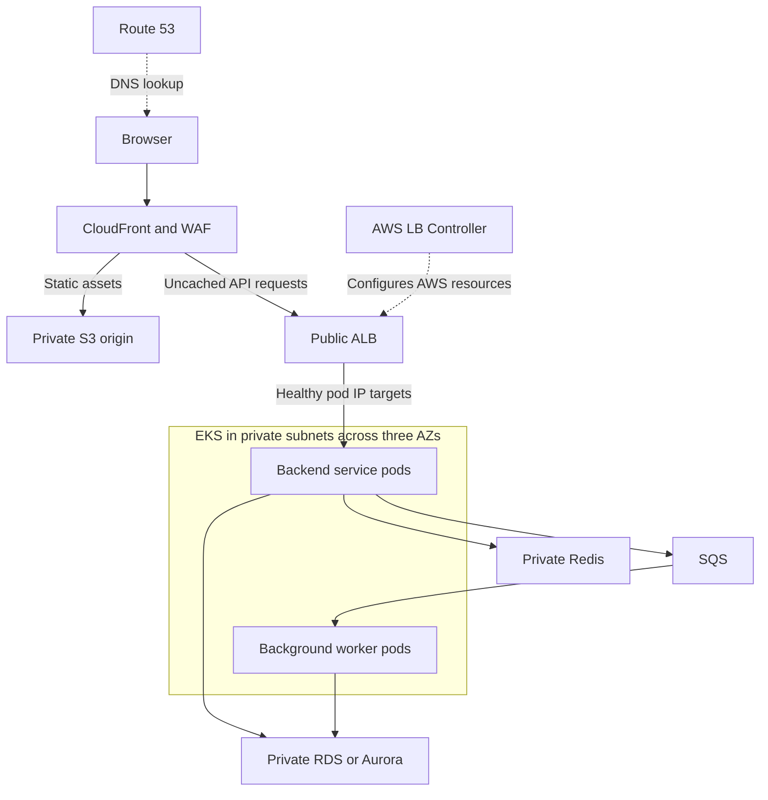
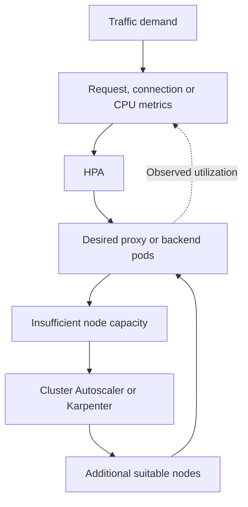

Below are **model interview answers using one example AWS project**. Replace the project domain, scale, and responsibilities with your actual experience.

The reusable Helm, Terraform, EFS, access-control, and pipeline examples are available in squareops-devops-examples.zip[squareops-devops-examples.zip](sandbox:/workspace/scratch/8dc6806ebb9b/squareops-devops-examples.zip).

**Q1. Explain the infrastructure and application setup of your last project.**

A good answer connects the business application, architecture, your responsibilities, and the reasons behind the design.

**Sample answer:**

> “The project is a customer-facing application with a static web frontend and several backend services. The frontend is hosted in S3 and delivered through CloudFront. Backend services run as containers on EKS, using worker nodes in private subnets across three Availability Zones. The database is a managed RDS or Aurora deployment in private database subnets.
>
> I manage infrastructure through Terraform, Kubernetes deployments through Helm, CI/CD pipelines, access controls, monitoring, cluster upgrades, and production troubleshooting.”



The follow-ups can be answered as follows:

| Follow-up | Example answer |
|---|---|
| Where is the frontend hosted? | Compiled HTML, JavaScript, CSS, and images are stored in S3. CloudFront delivers them to users. |
| Where is the backend hosted? | EKS pods on EC2 worker nodes in private subnets. |
| Where is the database stored? | RDS/Aurora managed storage, accessed through a private database endpoint. |
| AWS or multi-cloud? | Application infrastructure is on AWS. Using GitHub Actions as a CI service does not make the application multi-cloud. |
| What do you manage personally? | Terraform, deployment automation, Kubernetes configuration, access, observability, upgrades, and incident response. State the actual ownership boundaries. |
| What do the microservices do? | For example: catalog serves product information, orders processes purchases, and notification workers consume queue messages. |
| Why this architecture? | CDN delivery suits static assets; services can scale independently; managed databases reduce database infrastructure work; multiple AZs improve availability. |

For the frontend, use a **private S3 REST origin with CloudFront Origin Access Control**. An S3 website endpoint uses a different configuration and does not support OAC. [Amazon CloudFront](https://docs.aws.amazon.com/AmazonCloudFront/latest/DeveloperGuide/private-content-restricting-access-to-s3.html?utm_source=chatgpt.com)

If CloudFront also forwards `/api/*`, configure the required HTTP methods, headers, cookies, and authorization handling. Disable caching for personalized responses and writes unless an explicit, safe caching design exists.

---

**Q2. What exactly do you do in AWS Cloud in this project?**

Describe concrete activities rather than listing AWS services.

| Area | Responsibilities |
|---|---|
| Networking | Create VPCs, public/private subnets, route tables, NAT gateways, endpoints, and security groups through Terraform. |
| Compute | Provision EKS, managed node groups, launch templates where needed, and node autoscaling. |
| Application delivery | Manage ECR repositories, ALB integration, DNS, certificates, and deployment configuration. |
| Storage | Configure S3 encryption, public access restrictions, versioning, lifecycle rules, and retention. |
| Identity | Manage IAM roles, workload identities, EKS access entries, and Kubernetes RBAC. |
| Operations | Configure logs, metrics, alerts, backups, upgrades, and incident runbooks. |
| Cost | Review billing, rightsize workloads, tune requests, remove unused resources, and select suitable purchasing/storage options. |

For an S3 lifecycle example:

> “Application logs remain in their required operational storage class for the agreed retention period. Older logs transition to a suitable archive class, and expired data is deleted according to the retention policy. I also handle old object versions and incomplete multipart uploads.”

For cost optimization:

> “I first identify the largest cost drivers and utilization. Then I rightsize nodes and pod requests, use autoscaling, consider Spot for interruption-tolerant workloads, and evaluate Savings Plans for stable usage. I measure savings against availability and performance.”

**IAM and Kubernetes RBAC are separate:** IAM governs AWS access; Kubernetes RBAC governs actions against Kubernetes resources.

---

**Q3. On which compute platform are the applications hosted? Why EKS?**

> “Backend applications run on EKS. AWS manages the control plane, while we manage workload configuration, worker capacity, networking integration, add-ons, and application reliability.”

Choose EKS when the project benefits from:

- Kubernetes APIs, operators, Helm, or existing Kubernetes tooling.
- Detailed scheduling and workload controls.
- A consistent deployment model across Kubernetes environments.
- An established team capability for operating Kubernetes.

ECS can be a better choice for an AWS-focused application that does not require Kubernetes features. EKS should have a reason beyond familiarity.

**Worker-node management:**

- Maintain reliable baseline capacity for critical system components.
- Use managed node groups for controlled node updates.
- Use Karpenter for flexible application-node provisioning, or Cluster Autoscaler for node-group scaling.
- Separate workloads through labels, taints, tolerations, and capacity policies.
- Maintain AZ coverage and enough capacity for disruption and deployment surges.

**Replica count:** Three replicas across available AZ capacity is a reasonable example for a critical stateless API. Actual counts come from load testing, availability requirements, and downstream limits.

HPA scales **pods**. Cluster Autoscaler and Karpenter address **node capacity**.

---

**Q4. Have you created an EKS cluster? Explain the process.**

A practical Terraform-based process is:

1. **Design the network.**  
   Use multiple AZs, public subnets for internet-facing load balancers, private subnets for workers, and isolated database subnets.

2. **Plan addressing and routes.**  
   Account for node and pod IPs, control-plane interfaces, load balancers, endpoints, and upgrade headroom. Provide NAT or suitable VPC endpoints for required outbound access.

3. **Create IAM roles.**  
   Configure the EKS cluster role, worker-node role, administrator access, and dedicated workload roles.

4. **Create the EKS control plane.**  
   Select an approved Kubernetes version, endpoint-access configuration, logging, and authentication mode.

5. **Configure networking and nodes.**  
   Set up compatible VPC CNI credentials/add-ons, then provision managed worker groups.

6. **Install platform components.**  
   Configure CoreDNS, kube-proxy, storage drivers, metrics, load balancer integration, and autoscaling as required.

7. **Bootstrap and validate access.**  
   Create an administrator access entry and authorization, generate kubeconfig, and test the cluster.

EKS cluster subnets must span at least two different AZs. AWS requires at least six available IP addresses per selected subnet and recommends at least sixteen; worker and pod capacity needs considerably more planning. [Amazon EKS](https://docs.aws.amazon.com/eks/latest/userguide/network-reqs.html?utm_source=chatgpt.com)

```bash
aws eks update-kubeconfig \
  --name squareops-dev \
  --region ap-south-1 \
  --role-arn arn:aws:iam::111122223333:role/EKSAdmin

kubectl get nodes
kubectl get pods -A
```

**Important:** Generating kubeconfig does not grant cluster authorization. The role needs an access entry and appropriate permissions. A private API also requires network connectivity from the workstation or deployment runner.

---

**Q5. Have you upgraded an EKS cluster? How?**

> “I treat upgrades as a planned compatibility and availability change. I rehearse in a representative lower environment, review upgrade insights, confirm workload compatibility, upgrade the control plane, and gradually replace workers.”

The approach:

1. Review API removals, CRDs, admission webhooks, Helm charts, and controller compatibility.
2. Check CNI, CoreDNS, kube-proxy, CSI drivers, and autoscaler compatibility.
3. Back up application data and Kubernetes configuration, and verify recovery.
4. Check replicas, PDBs, scheduling constraints, storage topology, free IPs, and spare capacity.
5. Upgrade the control plane **one minor version at a time**.
6. Update worker groups gradually.
7. Reconcile compatible add-on and client versions.
8. Validate application behavior and observe production metrics.

Some compatibility prerequisites must be updated before the control plane; follow each component’s documented upgrade order. [Amazon EKS](https://docs.aws.amazon.com/eks/latest/userguide/update-cluster.html?utm_source=chatgpt.com)

**Node draining:** Normal managed node-group rolling updates drain nodes and respect PDBs. A force update bypasses that protection and can interrupt workloads. [Amazon EKS](https://docs.aws.amazon.com/eks/latest/userguide/update-managed-node-group.html?utm_source=chatgpt.com)

**Do deployments get recreated?**

- Deployment objects do not need blanket recreation for a control-plane upgrade.
- Pods on replaced nodes are terminated and recreated on compatible capacity.
- Updating an application pod template can separately trigger a rollout.

**Post-upgrade checks:** Nodes, readiness, restarts, DNS, RBAC, workload AWS credentials, ALB target health, storage mounts, autoscaling, telemetry, and authenticated user journeys.

**Current rollback behavior:** AWS now documents a conditional rollback to the previous minor version within seven days of an in-place upgrade. Eligibility and compatibility requirements apply. Prepare incompatible nodes and add-ons first; control-plane rollback does not undo application changes or data writes. [Amazon EKS](https://docs.aws.amazon.com/eks/latest/userguide/rollback-cluster.html?utm_source=chatgpt.com)

---

**Q6. How do you give a teammate kubectl access to the same cluster?**

Separate the process into **identity, network connectivity, and authorization**.

1. Give the teammate access to an approved IAM role through federation or IAM Identity Center.
2. Allow role assumption and `eks:DescribeCluster` for the intended cluster.
3. Create an EKS access entry for that role.
4. Grant namespace-scoped permissions through an EKS access policy or Kubernetes RBAC.
5. Generate kubeconfig and test the teammate’s actual access.

An access entry can map an IAM role to a Kubernetes group:

```bash
aws eks create-access-entry \
  --cluster-name squareops-prod \
  --principal-arn arn:aws:iam::111122223333:role/TeamReadOnly \
  --type STANDARD \
  --kubernetes-groups squareops-readers
```

The administrator then creates a RoleBinding for `squareops-readers`. Access entries do not automatically create matching RBAC objects. [Amazon EKS](https://docs.aws.amazon.com/eks/latest/userguide/creating-access-entries.html?utm_source=chatgpt.com)

```yaml
apiVersion: rbac.authorization.k8s.io/v1
kind: RoleBinding
metadata:
  name: application-readers
  namespace: prod
subjects:
  - kind: Group
    name: squareops-readers
    apiGroup: rbac.authorization.k8s.io
roleRef:
  kind: ClusterRole
  name: view
  apiGroup: rbac.authorization.k8s.io
```

Here, a **RoleBinding referencing a ClusterRole still grants access within `prod`**. Use a ClusterRoleBinding only when cluster-wide access is intended.

Alternatively, associate a namespace-scoped EKS access policy. These policies grant Kubernetes permissions; they are different from IAM policies. [Amazon EKS](https://docs.aws.amazon.com/eks/latest/userguide/access-policies.html?utm_source=chatgpt.com)

Do not attach `AmazonEKSClusterPolicy` to every teammate expecting it to grant kubectl access.

---

**Q7. In which Kubernetes resource do you map IAM users and roles?**

**For legacy EKS, the expected answer is the `aws-auth` ConfigMap in `kube-system`.** AWS now recommends EKS access entries, and `aws-auth` is deprecated. Access entries are AWS-side objects rather than Kubernetes ConfigMaps. [docs.aws.amazon.com](https://docs.aws.amazon.com/eks/latest/userguide/auth-configmap.html?utm_source=chatgpt.com)

Legacy format:

```yaml
data:
  mapRoles: |
    - rolearn: arn:aws:iam::111122223333:role/TeamReadOnly
      username: team-reader:{{SessionName}}
      groups:
        - squareops-readers
  mapUsers: |
    - userarn: arn:aws:iam::111122223333:user/legacy-user
      username: legacy-user
      groups:
        - squareops-readers
```

`aws-auth` is stored as Kubernetes cluster state, not in a worker-node file or the user’s kubeconfig.

Common mistakes include malformed YAML, incorrect ARNs or groups, unsupported role paths in legacy mappings, and removing node-role mappings. A valid mapping without authorization still leaves the user unable to perform actions.

During migration, verify equivalent access entries before removing old mappings. In hybrid authentication mode, access entries take precedence for a principal present in both mechanisms. [docs.aws.amazon.com](https://docs.aws.amazon.com/eks/latest/userguide/migrating-access-entries.html?utm_source=chatgpt.com)

---

**Q8. Have you worked with Helm? Why use it instead of plain YAML?**

Helm packages related Kubernetes manifests into a versioned chart and renders them using configurable values.

It is useful for reusable application deployment, environment configuration, dependencies, and release history. Plain YAML remains suitable for small configurations that do not need that packaging.

| Chart path | Purpose |
|---|---|
| `Chart.yaml` | Chart name, version, metadata, and dependencies. |
| `values.yaml` | Default configuration values. |
| `templates/deployment.yaml` | Deployment template. |
| `templates/service.yaml` | Service template. |
| `templates/_helpers.tpl` | Reusable template helpers. |
| `charts/` | Chart dependencies. |
| `crds/` | Custom resource definitions, when applicable. |

Files in `templates/` are rendered using values and release information. [Helm](https://docs.helm.sh/docs/topics/charts/?utm_source=chatgpt.com)

Manage environments with reviewed override files:

```bash
helm upgrade --install api ./sample-api \
  --namespace qa \
  --values values.yaml \
  --values values-qa.yaml \
  --wait
```

Later override files take precedence over earlier ones, and command-line overrides take higher precedence. [Helm](https://docs.helm.sh/docs/chart_template_guide/values_files/?utm_source=chatgpt.com)

Use the same application artifact across environments; change environment configuration separately.

---

**Q9. How do you securely inject sensitive data into Helm?**

The preferred pattern is to keep the secret value outside Helm and pass a **Secret reference**:

```yaml
existingSecret: squareops-db
```

For AWS:

1. Store the credential in Secrets Manager.
2. Give the approved secret controller or application identity narrowly scoped permissions.
3. Use External Secrets Operator to create a Kubernetes Secret, or use an appropriate CSI/direct retrieval pattern.
4. Reference or mount the secret from the application.

ESO supports different AWS authentication routes. Its IRSA `serviceAccountRef` pattern differs from its EKS Pod Identity pattern, which authenticates the controller identity. [External Secrets Operator](https://external-secrets.io/latest/provider/aws-access/?utm_source=chatgpt.com)

**Sealed Secrets** encrypts a secret into a `SealedSecret` resource that can be committed to Git. The cluster controller decrypts it. Protect and back up the controller’s private keys; the default sealing scope binds the secret to its name and namespace. [GitHub](https://github.com/bitnami/sealed-secrets/blob/main/README.md?utm_source=chatgpt.com)

| Flag | Purpose |
|---|---|
| `--set` | Set a value from the command line. |
| `--set-string` | Force a value to remain a string. |
| `--set-file` | Load a value from a file’s contents. |

`--set-file` does **not** encrypt the value. Secret values passed into Helm can reach rendered manifests, release storage, or logs. [Helm](https://helm.sh/docs/helm/helm_upgrade/?utm_source=chatgpt.com)

Also plan credential rotation: updating a Secret does not automatically make every running application reload it.

---

**Q10. Can a public Helm chart be customized?**

Yes. Use the chart’s documented configuration options through your own values file.

```bash
helm show values vendor/app --version 1.2.3

helm upgrade --install app vendor/app \
  --version 1.2.3 \
  --values values-prod.yaml \
  --wait
```

Keep chart versions pinned and overrides in Git. For upgrades:

- Read release notes and compare new defaults.
- Check values-schema and API changes.
- Render and review the resulting manifests.
- Test in a lower environment.
- Check whether changes replace resources, restart pods, or affect storage.

Editing a downloaded chart directly creates maintenance work: future upstream versions do not automatically incorporate your modifications.

For additional functionality, use supported extension values, a parent chart, a companion chart, or a deliberately maintained fork.

---

**Q11. How do you add extra Kubernetes manifests to a public Helm chart?**

There are three common approaches:

| Approach | Where the extra manifest goes |
|---|---|
| Supported `extraObjects`/`extraDeploy` option | In the vendor-documented values structure. |
| Parent chart | In the parent’s `templates/`, with the public chart as a dependency. |
| Maintained fork | In the fork’s `templates/`. |

A parent chart keeps upstream customization separate from your additional resources. Dependency values are placed under the dependency’s name or alias. [Helm](https://docs.helm.sh/docs/chart_template_guide/subcharts_and_globals/?utm_source=chatgpt.com)

Example parent template:

```yaml
apiVersion: v1
kind: ConfigMap
metadata:
  name: {{ .Release.Name }}-extra-config
data:
  FEATURE_MODE: {{ .Values.extraConfig.featureMode | quote }}
```

Parent values:

```yaml
extraConfig:
  featureMode: safe
```

Creating this ConfigMap does not make the upstream application consume it. Wire it through a supported configuration option.

This can break the release if you introduce invalid manifests, duplicate resource names, incompatible values, or conflicting ownership. A values file alone cannot add arbitrary templates to a chart that does not support them.

---

**Q12. How do you implement shared storage across pods on different EKS nodes?**

For a shared Linux filesystem, a common AWS choice is **Regional EFS through the EFS CSI driver**.

The driver connects Kubernetes storage objects to EFS and supports access-point-based dynamic provisioning. [Amazon EKS](https://docs.aws.amazon.com/eks/latest/userguide/efs-csi.html?utm_source=chatgpt.com)

The setup requires an EFS filesystem, mount targets in the worker AZs, appropriate driver IAM, network connectivity, and restricted NFS access.

```yaml
apiVersion: storage.k8s.io/v1
kind: StorageClass
metadata:
  name: shared-efs
provisioner: efs.csi.aws.com
parameters:
  provisioningMode: efs-ap
  fileSystemId: fs-REPLACE
  directoryPerms: "770"
  uid: "10001"
  gid: "10001"
reclaimPolicy: Retain
mountOptions:
  - tls
---
apiVersion: v1
kind: PersistentVolumeClaim
metadata:
  name: shared-files
spec:
  accessModes:
    - ReadWriteMany
  storageClassName: shared-efs
  resources:
    requests:
      storage: 5Gi
```

Mount the PVC in the Deployment’s pod specification:

```yaml
containers:
  - name: app
    image: your-approved-image
    volumeMounts:
      - name: shared
        mountPath: /data
volumes:
  - name: shared
    persistentVolumeClaim:
      claimName: shared-files
```

Match application permissions to the access-point UID/GID. The EFS PVC size request does not impose an EFS filesystem quota.

Shared mounting also does not make simultaneous writes safe. Applications must coordinate file access.

---

**Q13. With one node and several pods, can EBS provide shared storage?**

**Yes, multiple pods on the same node can use an ordinary RWO PVC**, provided the application safely coordinates its writes.

RWO means **one node**, rather than one pod. [Kubernetes](https://kubernetes.io/docs/concepts/storage/persistent-volumes/?utm_source=chatgpt.com)

| Access mode | Meaning |
|---|---|
| `ReadWriteOnce` — RWO | Read/write access from one node; potentially several pods there. |
| `ReadWriteOncePod` — RWOP | Read/write access restricted to one pod, using supported CSI capabilities. |
| `ReadWriteMany` — RWX | Read/write access from multiple nodes, when supported by the storage system. |
| `ReadOnlyMany` — ROX | Declared read-only access from multiple nodes, when supported. |

Ordinary EBS filesystem storage is not a general shared filesystem across nodes.

EFS is **not mandatory**. You need a suitable RWX storage system when multiple nodes require the same shared filesystem. Alternatives depend on the workload; object storage may remove the filesystem-sharing requirement entirely.

---

**Q14. What is a Pod Disruption Budget?**

A PDB limits permitted **voluntary evictions** so a replicated application retains an acceptable number of available pods.

| Disruption | Examples |
|---|---|
| Voluntary | Node drain, maintenance, or autoscaler removal using eviction. |
| Involuntary | Node/AZ failure, hardware failure, or resource-pressure disruption. |

A PDB cannot prevent involuntary failures, although unavailable pods reduce the remaining disruption allowance. Direct deletion can bypass eviction protection, and Deployment rolling updates are governed by the Deployment strategy rather than the PDB. [Kubernetes](https://kubernetes.io/docs/concepts/workloads/pods/disruptions/?trk=public_post_comment-text\&utm_source=chatgpt.com)

```yaml
apiVersion: policy/v1
kind: PodDisruptionBudget
metadata:
  name: api
spec:
  minAvailable: 2
  selector:
    matchLabels:
      app: api
```

With three healthy matching pods, this permits one voluntary disruption.

Use:

- **`minAvailable`** when you must preserve a minimum count, such as a quorum.
- **`maxUnavailable`** when you want to limit how many replicas can be disrupted.

Do not specify both in the same PDB. A single-replica application with `minAvailable: 1` can block maintenance but still cannot survive that pod’s failure.

---

**Q15. How do you debug CrashLoopBackOff?**

CrashLoopBackOff indicates repeated container termination followed by restart backoff. It is a symptom.

Start with:

```bash
kubectl describe pod POD -n prod
kubectl logs POD -n prod -c app
kubectl logs POD -n prod -c app --previous

kubectl get events -n prod \
  --field-selector involvedObject.name=POD \
  --sort-by=.metadata.creationTimestamp
```

Previous-container logs are especially useful because the current container may terminate before inspection. [Kubernetes](https://kubernetes.io/docs/tasks/debug/debug-application/debug-running-pod/?utm_source=chatgpt.com)

Then inspect:

| Evidence | Possible cause |
|---|---|
| Application stack trace | Code failure or invalid startup configuration. |
| `OOMKilled` | Memory limit exceeded or excessive startup memory. |
| Exit code `0` repeatedly | Main process finishes instead of remaining in the foreground. |
| Probe-failure events | Incorrect path/port/timing or unhealthy application. |
| Permission errors | Wrong UID/GID, volume permissions, or read-only filesystem. |
| Missing configuration | Incorrect ConfigMap/Secret references or keys. |
| Dependency failures | Database, DNS, TLS, credentials, or network restrictions. |

Inspect requests, limits, last termination reason, entrypoint, mounted files, and configuration references without exposing secret values.

A **readiness failure removes the pod from normal service traffic; it does not restart the container**. Liveness or startup probe failures can restart it. [Kubernetes](https://kubernetes.io/docs/tasks/configure-pod-container/configure-liveness-readiness-probes/?utm_source=chatgpt.com)

---

**Q16. During peak traffic, ingress requests are slow. How do you debug?**

First determine **which component handles the traffic**.

In ALB IP-target mode, requests go from ALB directly to pod IPs. The AWS Load Balancer Controller configures AWS resources; requests do not flow through its controller pods. Increasing controller replicas does not directly increase request-processing capacity. [AWS Load Balancer Controller](https://kubernetes-sigs.github.io/aws-load-balancer-controller/latest/how-it-works/?utm_source=chatgpt.com)

For a proxy data plane such as Envoy or HAProxy, inspect the proxy itself.

A practical sequence:

1. **Locate latency:** Compare edge, load balancer, ingress proxy, backend, and database timings using request IDs and traces.
2. **Check load balancer health:** Target response time, healthy targets, connection behavior, access logs, and load-balancer versus target errors.
3. **Check proxy capacity:** CPU throttling, memory, active connections, queues, worker limits, file descriptors, and replicas.
4. **Check Kubernetes routing:** Service selectors, EndpointSlices, readiness, target registration, and Pending/restarting pods.
5. **Check backend dependencies:** Database connections, locks, slow queries, cache misses, queues, and retry amplification.
6. **Check node/network capacity:** Available pod IPs, DNS, conntrack, bandwidth, and node pressure.

Useful commands:

```bash
kubectl top pods -n ingress-system
kubectl top nodes
kubectl get hpa -A
kubectl get pods -n prod -o wide

kubectl get endpointslices -n prod \
  -l kubernetes.io/service-name=api
```

Do not assume “load balancer throttling” from a high utilization metric alone. Controller AWS API throttling, load balancer capacity limits, and slow backend responses are different problems.

Mitigate the demonstrated bottleneck and verify user-visible tail latency.

---

**Q17. Increase ingress replicas permanently or dynamically?**

Use a **reliable minimum baseline plus dynamic scaling where it helps**.

Static capacity is useful for redundancy, predictable loads, and absorbing sudden bursts. Keeping peak capacity permanently can waste money, but aggressive scale-down can harm availability.

| Mechanism | What it addresses |
|---|---|
| Minimum replicas | Availability and immediate traffic headroom. |
| HPA | Pod capacity based on suitable metrics. |
| Cluster Autoscaler | Node-group capacity for unschedulable pods. |
| Karpenter | Node provisioning based on pod scheduling requirements. |
| Scheduled scaling | Predictable events requiring capacity before traffic arrives. |



For CPU-based HPA, utilization is measured relative to requests. Correct requests and metric availability matter. Scale-down stabilization helps avoid oscillation. [Kubernetes](https://kubernetes.io/docs/tasks/run-application/horizontal-pod-autoscale/?utm_source=chatgpt.com)

For ALB-based ingress, AWS manages the load balancer data plane; scale the backend and its nodes according to evidence. Keep controller replicas for controller availability.

---

**Q18. Why choose EFS over EBS? Which is cheaper and faster?**

Choose according to the required access pattern.

| Dimension | EBS | EFS |
|---|---|---|
| Storage type | Block storage | Managed NFS filesystem |
| Typical use | Per-instance/per-pod disks, database volumes | Shared files across nodes |
| AZ scope | Volume belongs to one AZ | Regional filesystem supports access across AZs |
| Ordinary multi-node sharing | No | Yes |
| Performance consideration | Often suitable for latency-sensitive block I/O | Suitable for shared access and aggregate filesystem throughput |
| Cost consideration | Volume capacity and performance configuration | Storage class, throughput/access behavior, and related charges |

EBS performance depends on volume type, provisioned settings, instance limits, and workload. EFS performance depends on its performance/throughput configuration and access pattern. [Amazon EBS](https://docs.aws.amazon.com/ebs/latest/userguide/general-purpose.html?utm_source=chatgpt.com)

**Neither is universally cheaper or faster.**

For example:

- A database with its own replicated storage may use an EBS volume per replica.
- Several application pods needing the same filesystem may use EFS.
- User-uploaded objects may fit S3 better than either.

Compare realistic usage and benchmark the application.

---

**Q19. Can EBS attach to multiple nodes? Who enforces restrictions?**

The interview answer needs an exception:

> “Ordinary EBS volumes have a single attachment. EBS Multi-Attach supports selected io1/io2 volumes attached to multiple supported instances within the same AZ, with additional coordination requirements.”

Standard ext4/XFS filesystems are not safe for independent simultaneous multi-host writers. [Amazon EBS](https://docs.aws.amazon.com/en_en/ebs/latest/userguide/ebs-volumes-multi.html?utm_source=chatgpt.com)

The current EBS CSI documentation describes its Multi-Attach support as **io2, RWX, raw Block mode**, requiring application-level coordination or fencing. This is different from ordinary multi-node filesystem sharing. [GitHub](https://github.com/kubernetes-sigs/aws-ebs-csi-driver/blob/master/docs/multi-attach.md?utm_source=chatgpt.com)

Restriction enforcement involves several layers:

- Kubernetes uses PVC/PV access modes and topology during matching and scheduling.
- Attach/detach logic and the CSI driver request attachments.
- AWS enforces the volume’s actual attachment capabilities.
- The node-side driver performs device setup and mounting.

Access modes alone are not filesystem authorization or write protection. RWOP provides stronger single-pod exclusivity; RWO allows multiple pods on the same node.

---

**Q20. What CI/CD tools have you used? Explain GitHub Actions and iOS automation.**

Name the tools you have actually used. For this example:

> “GitHub Actions runs CI, Terraform provisions infrastructure, ECR stores images, and Helm deploys to EKS.”

The application pipeline is:

1. PR checks: formatting, linting, unit tests, dependency checks, secret scanning, and SAST.
2. Build the container once.
3. Scan the image and generate provenance/SBOM as required.
4. Publish an immutable digest.
5. Deploy to the appropriate environment.
6. Run smoke/integration tests and observe application metrics.
7. Promote that same artifact.

**Secrets:** Use GitHub OIDC for temporary AWS credentials, with narrowly scoped trust and environment-specific roles. Avoid long-lived AWS keys. [GitHub Docs](https://docs.github.com/en/actions/how-tos/secure-your-work/security-harden-deployments/oidc-in-aws?utm_source=chatgpt.com)

After OIDC authentication, deployment includes:

```bash
aws eks update-kubeconfig \
  --name "$EKS_CLUSTER" \
  --region "$AWS_REGION"

helm upgrade --install api ./helm/sample-api \
  --namespace "$TARGET_ENV" \
  --values "helm/environments/$TARGET_ENV.yaml" \
  --set-string "image.digest=$IMAGE_DIGEST" \
  --wait --timeout 10m
```

The role still needs EKS authorization. A private cluster requires a runner with private API connectivity. Pin actions to approved full commit SHAs.

**iOS automation:**

- Use a compatible macOS/Xcode runner.
- Resolve dependencies.
- Run simulator tests.
- For distribution, install signing material into a temporary keychain.
- Archive/export the application.
- Upload through the approved distribution process.
- Clean up signing material.

```bash
xcodebuild test \
  -workspace MyApp.xcworkspace \
  -scheme MyApp \
  -destination 'platform=iOS Simulator,name=AVAILABLE_DEVICE'
```

Select a simulator actually available on the runner. Xcode’s command-line tooling supports testing, archiving, and exporting builds. [developer.apple.com](https://developer.apple.com/library/archive/technotes/tn2339/_index.html?utm_source=chatgpt.com)

---

**Q21. How do you handle multi-environment pipelines?**

Use **artifact promotion, separate configuration, and environment-specific permissions**.

| Stage | Entry and exit conditions |
|---|---|
| PR | Required checks and code review pass. |
| Dev | Deploy the built digest; smoke and integration checks pass. |
| QA | Promote the same digest; regression, security, and relevant performance checks pass. |
| Prod | Approved candidate, production authorization, rollout checks, and observation gate. |

A suitable branching strategy is short-lived branches into protected `main`, with release tags identifying approved candidates.

An environment does not need a separate long-lived source branch. Long-lived environment branches can diverge and complicate promotion.

Keep these separate per environment:

- AWS accounts and deployment roles.
- Terraform state.
- Clusters or appropriately isolated environments.
- Databases and secrets.
- Helm override files.

GitHub environments can enforce deployment branches, reviewers, and secret-access protection. Feature availability depends on the plan and repository visibility. [GitHub Docs](https://docs.github.com/en/actions/reference/workflows-and-actions/deployments-and-environments?utm_source=chatgpt.com)

Serialize deployments to each environment. Approval should cover the candidate digest, source commit, test results, and intended changes.

---

**Q22. How do you implement rolling deployments? What happens to old pods?**

A Deployment creates a new ReplicaSet and gradually shifts replicas from the old ReplicaSet to the new one.

```yaml
spec:
  replicas: 3
  minReadySeconds: 15
  strategy:
    type: RollingUpdate
    rollingUpdate:
      maxSurge: 1
      maxUnavailable: 0
```

| Setting | Meaning |
|---|---|
| `maxSurge: 1` | Allow one additional replica above the desired count during rollout. |
| `maxUnavailable: 0` | Do not intentionally reduce available replicas below the desired count. |
| `minReadySeconds: 15` | Require a new pod to remain ready for the stated interval before counting it as available. |

With three replicas, Kubernetes can start an additional new pod, wait for availability, and then remove an old pod. Terminating pods can temporarily increase the actual pod count beyond the simple surge calculation. [Kubernetes](https://kubernetes.io/docs/concepts/workloads/controllers/deployment/?utm_source=chatgpt.com)

Old pods should drain traffic, finish accepted work, and handle SIGTERM before their termination grace period expires.

Availability also depends on readiness quality, load balancer target registration, spare capacity, compatible database changes, and application shutdown behavior. Configuration alone cannot guarantee zero downtime.

Monitor:

```bash
kubectl rollout status deployment/api -n prod
```

For Helm-managed applications, use the release’s rollback process when appropriate. Rolling back manifests does not undo database migrations or external writes.

---

**Q23. Have you used Terraform? Show modules, provider, backend, locking, data, and module blocks.**

Terraform describes infrastructure and tracks the resources it manages in state.

A practical structure separates reusable modules from environment roots:

```text
terraform/
  modules/
    eks/
      main.tf
      variables.tf
      outputs.tf
      versions.tf
  live/
    dev/
      main.tf
      provider.tf
      versions.tf
      variables.tf
      backend.hcl
    qa/
      ...
    prod/
      ...
```

**Provider configuration:**

```hcl
provider "aws" {
  region              = var.aws_region
  allowed_account_ids = [var.account_id]

  assume_role {
    role_arn = var.terraform_role_arn
  }
}
```

Use temporary credentials and pin approved provider versions. Commit the dependency lock file.

**Remote backend:**

```hcl
terraform {
  required_version = ">= 1.10, < 2.0"

  backend "s3" {
    bucket       = "company-prod-terraform-state"
    key          = "eks/prod/terraform.tfstate"
    region       = "ap-south-1"
    encrypt      = true
    use_lockfile = true
  }
}
```

Create the backend bucket separately, with versioning, encryption, public access blocked, and restricted IAM.

Native S3 locking uses a `.tflock` object. Current HashiCorp documentation marks DynamoDB-based locking as deprecated. Backend credentials are resolved separately from AWS provider credentials. [HashiCorp Developer](https://developer.hashicorp.com/terraform/language/backend/s3?utm_source=chatgpt.com)

**Data versus resource versus module:**

| Block | Purpose |
|---|---|
| `data` | Read information about an existing object. |
| `resource` | Declare an object Terraform manages. |
| `module` | Instantiate reusable Terraform configuration. |

```hcl
data "aws_vpc" "existing" {
  id = var.vpc_id
}

data "aws_subnets" "private" {
  filter {
    name   = "vpc-id"
    values = [data.aws_vpc.existing.id]
  }

  tags = {
    Tier = "private"
  }
}

module "eks" {
  source = "../../modules/eks"

  cluster_name       = "squareops-prod"
  private_subnet_ids = data.aws_subnets.private.ids

  # Other required module inputs...
}
```

This reads an existing network and passes its subnet IDs to an EKS module. Reading the VPC does not transfer its lifecycle ownership to that module.

Use separate roots, state keys, and roles for environments with different security or operational boundaries. Workspaces separate state but do not create account-level security isolation.

The downloadable pack contains **55 reference files**. YAML/JSON parsing, Bash syntax checks, and invalid-input checks passed. Terraform validation, Helm rendering, Kubernetes admission, and live deployments were not run; prerequisites and placeholders are documented in the pack.
