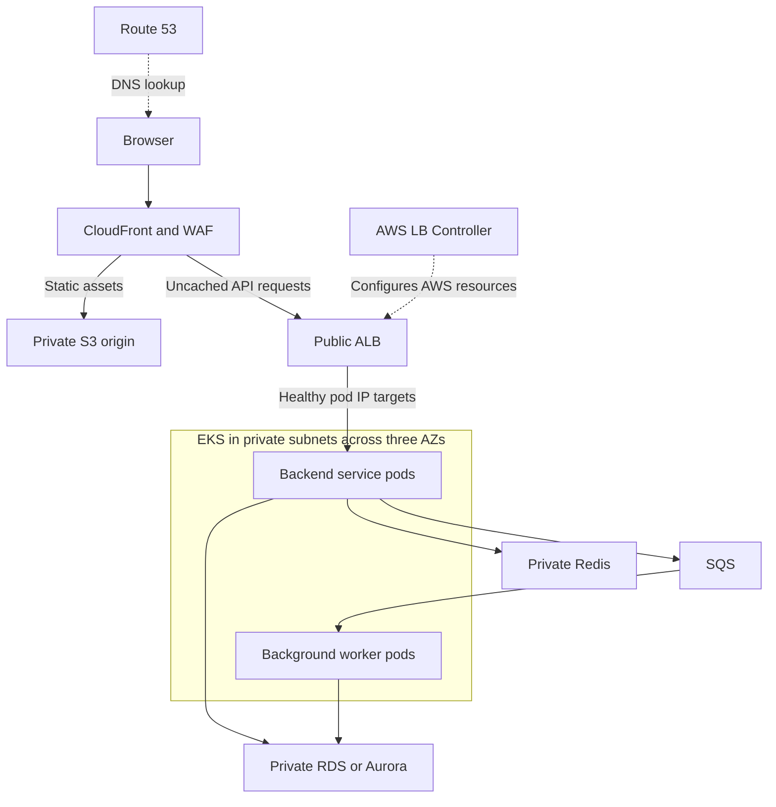
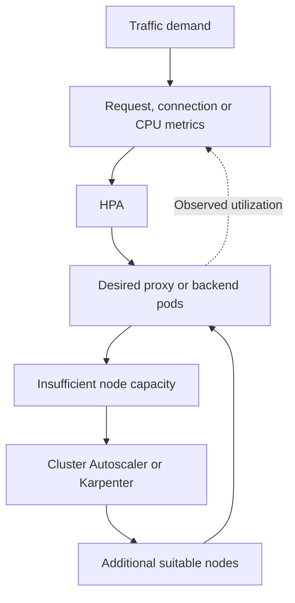
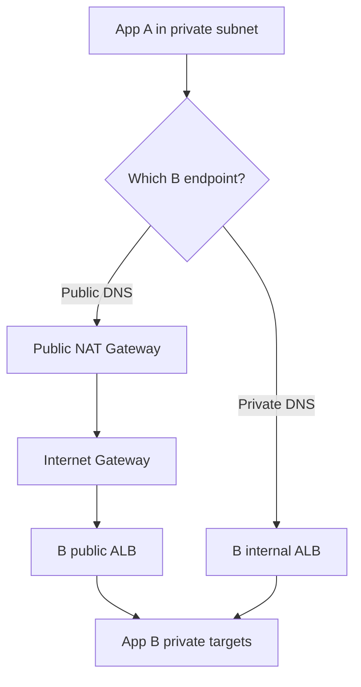
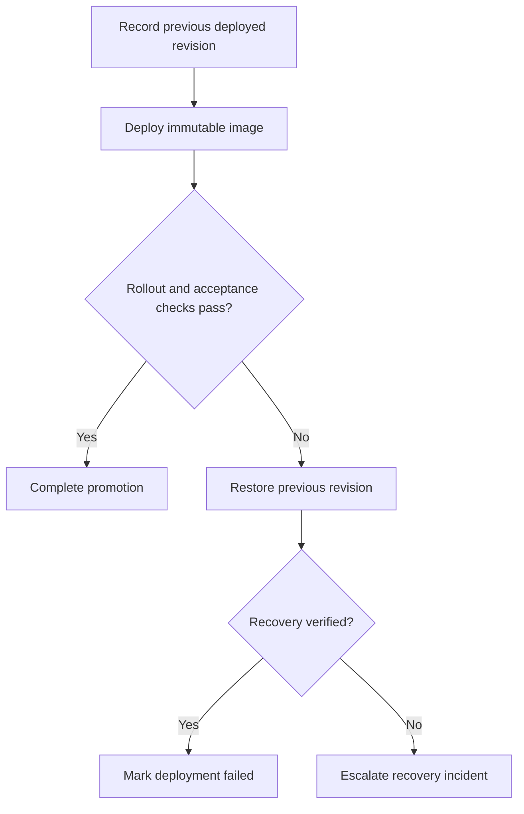

Below are **model interview answers using one example AWS project**. Replace the project domain, scale, and responsibilities with your actual experience.

The reusable Helm, Terraform, EFS, access-control, and pipeline examples are available in squareops-devops-examples.zip[squareops-devops-examples.zip](sandbox:/workspace/scratch/8dc6806ebb9b/squareops-devops-examples.zip).

**Q1. Explain the infrastructure and application setup of your last project.**

A good answer connects the business application, architecture, your responsibilities, and the reasons behind the design.

**Sample answer:**

> “The project is a customer-facing application with a static web frontend and several backend services. The frontend is hosted in S3 and delivered through CloudFront. Backend services run as containers on EKS, using worker nodes in private subnets across three Availability Zones. The database is a managed RDS or Aurora deployment in private database subnets.
>
> I manage infrastructure through Terraform, Kubernetes deployments through Helm, CI/CD pipelines, access controls, monitoring, cluster upgrades, and production troubleshooting.”



The follow-ups can be answered as follows:

| Follow-up | Example answer |
|---|---|
| Where is the frontend hosted? | Compiled HTML, JavaScript, CSS, and images are stored in S3. CloudFront delivers them to users. |
| Where is the backend hosted? | EKS pods on EC2 worker nodes in private subnets. |
| Where is the database stored? | RDS/Aurora managed storage, accessed through a private database endpoint. |
| AWS or multi-cloud? | Application infrastructure is on AWS. Using GitHub Actions as a CI service does not make the application multi-cloud. |
| What do you manage personally? | Terraform, deployment automation, Kubernetes configuration, access, observability, upgrades, and incident response. State the actual ownership boundaries. |
| What do the microservices do? | For example: catalog serves product information, orders processes purchases, and notification workers consume queue messages. |
| Why this architecture? | CDN delivery suits static assets; services can scale independently; managed databases reduce database infrastructure work; multiple AZs improve availability. |

For the frontend, use a **private S3 REST origin with CloudFront Origin Access Control**. An S3 website endpoint uses a different configuration and does not support OAC. [Amazon CloudFront](https://docs.aws.amazon.com/AmazonCloudFront/latest/DeveloperGuide/private-content-restricting-access-to-s3.html?utm_source=chatgpt.com)

If CloudFront also forwards `/api/*`, configure the required HTTP methods, headers, cookies, and authorization handling. Disable caching for personalized responses and writes unless an explicit, safe caching design exists.

---

**Q2. What exactly do you do in AWS Cloud in this project?**

Describe concrete activities rather than listing AWS services.

| Area | Responsibilities |
|---|---|
| Networking | Create VPCs, public/private subnets, route tables, NAT gateways, endpoints, and security groups through Terraform. |
| Compute | Provision EKS, managed node groups, launch templates where needed, and node autoscaling. |
| Application delivery | Manage ECR repositories, ALB integration, DNS, certificates, and deployment configuration. |
| Storage | Configure S3 encryption, public access restrictions, versioning, lifecycle rules, and retention. |
| Identity | Manage IAM roles, workload identities, EKS access entries, and Kubernetes RBAC. |
| Operations | Configure logs, metrics, alerts, backups, upgrades, and incident runbooks. |
| Cost | Review billing, rightsize workloads, tune requests, remove unused resources, and select suitable purchasing/storage options. |

For an S3 lifecycle example:

> “Application logs remain in their required operational storage class for the agreed retention period. Older logs transition to a suitable archive class, and expired data is deleted according to the retention policy. I also handle old object versions and incomplete multipart uploads.”

For cost optimization:

> “I first identify the largest cost drivers and utilization. Then I rightsize nodes and pod requests, use autoscaling, consider Spot for interruption-tolerant workloads, and evaluate Savings Plans for stable usage. I measure savings against availability and performance.”

**IAM and Kubernetes RBAC are separate:** IAM governs AWS access; Kubernetes RBAC governs actions against Kubernetes resources.

---

**Q3. On which compute platform are the applications hosted? Why EKS?**

> “Backend applications run on EKS. AWS manages the control plane, while we manage workload configuration, worker capacity, networking integration, add-ons, and application reliability.”

Choose EKS when the project benefits from:

- Kubernetes APIs, operators, Helm, or existing Kubernetes tooling.
- Detailed scheduling and workload controls.
- A consistent deployment model across Kubernetes environments.
- An established team capability for operating Kubernetes.

ECS can be a better choice for an AWS-focused application that does not require Kubernetes features. EKS should have a reason beyond familiarity.

**Worker-node management:**

- Maintain reliable baseline capacity for critical system components.
- Use managed node groups for controlled node updates.
- Use Karpenter for flexible application-node provisioning, or Cluster Autoscaler for node-group scaling.
- Separate workloads through labels, taints, tolerations, and capacity policies.
- Maintain AZ coverage and enough capacity for disruption and deployment surges.

**Replica count:** Three replicas across available AZ capacity is a reasonable example for a critical stateless API. Actual counts come from load testing, availability requirements, and downstream limits.

HPA scales **pods**. Cluster Autoscaler and Karpenter address **node capacity**.

---

**Q4. Have you created an EKS cluster? Explain the process.**

A practical Terraform-based process is:

1. **Design the network.**  
   Use multiple AZs, public subnets for internet-facing load balancers, private subnets for workers, and isolated database subnets.

2. **Plan addressing and routes.**  
   Account for node and pod IPs, control-plane interfaces, load balancers, endpoints, and upgrade headroom. Provide NAT or suitable VPC endpoints for required outbound access.

3. **Create IAM roles.**  
   Configure the EKS cluster role, worker-node role, administrator access, and dedicated workload roles.

4. **Create the EKS control plane.**  
   Select an approved Kubernetes version, endpoint-access configuration, logging, and authentication mode.

5. **Configure networking and nodes.**  
   Set up compatible VPC CNI credentials/add-ons, then provision managed worker groups.

6. **Install platform components.**  
   Configure CoreDNS, kube-proxy, storage drivers, metrics, load balancer integration, and autoscaling as required.

7. **Bootstrap and validate access.**  
   Create an administrator access entry and authorization, generate kubeconfig, and test the cluster.

EKS cluster subnets must span at least two different AZs. AWS requires at least six available IP addresses per selected subnet and recommends at least sixteen; worker and pod capacity needs considerably more planning. [Amazon EKS](https://docs.aws.amazon.com/eks/latest/userguide/network-reqs.html?utm_source=chatgpt.com)

```bash
aws eks update-kubeconfig \
  --name squareops-dev \
  --region ap-south-1 \
  --role-arn arn:aws:iam::111122223333:role/EKSAdmin

kubectl get nodes
kubectl get pods -A
```

**Important:** Generating kubeconfig does not grant cluster authorization. The role needs an access entry and appropriate permissions. A private API also requires network connectivity from the workstation or deployment runner.

---

**Q5. Have you upgraded an EKS cluster? How?**

> “I treat upgrades as a planned compatibility and availability change. I rehearse in a representative lower environment, review upgrade insights, confirm workload compatibility, upgrade the control plane, and gradually replace workers.”

The approach:

1. Review API removals, CRDs, admission webhooks, Helm charts, and controller compatibility.
2. Check CNI, CoreDNS, kube-proxy, CSI drivers, and autoscaler compatibility.
3. Back up application data and Kubernetes configuration, and verify recovery.
4. Check replicas, PDBs, scheduling constraints, storage topology, free IPs, and spare capacity.
5. Upgrade the control plane **one minor version at a time**.
6. Update worker groups gradually.
7. Reconcile compatible add-on and client versions.
8. Validate application behavior and observe production metrics.

Some compatibility prerequisites must be updated before the control plane; follow each component’s documented upgrade order. [Amazon EKS](https://docs.aws.amazon.com/eks/latest/userguide/update-cluster.html?utm_source=chatgpt.com)

**Node draining:** Normal managed node-group rolling updates drain nodes and respect PDBs. A force update bypasses that protection and can interrupt workloads. [Amazon EKS](https://docs.aws.amazon.com/eks/latest/userguide/update-managed-node-group.html?utm_source=chatgpt.com)

**Do deployments get recreated?**

- Deployment objects do not need blanket recreation for a control-plane upgrade.
- Pods on replaced nodes are terminated and recreated on compatible capacity.
- Updating an application pod template can separately trigger a rollout.

**Post-upgrade checks:** Nodes, readiness, restarts, DNS, RBAC, workload AWS credentials, ALB target health, storage mounts, autoscaling, telemetry, and authenticated user journeys.

**Current rollback behavior:** AWS now documents a conditional rollback to the previous minor version within seven days of an in-place upgrade. Eligibility and compatibility requirements apply. Prepare incompatible nodes and add-ons first; control-plane rollback does not undo application changes or data writes. [Amazon EKS](https://docs.aws.amazon.com/eks/latest/userguide/rollback-cluster.html?utm_source=chatgpt.com)

---

**Q6. How do you give a teammate kubectl access to the same cluster?**

Separate the process into **identity, network connectivity, and authorization**.

1. Give the teammate access to an approved IAM role through federation or IAM Identity Center.
2. Allow role assumption and `eks:DescribeCluster` for the intended cluster.
3. Create an EKS access entry for that role.
4. Grant namespace-scoped permissions through an EKS access policy or Kubernetes RBAC.
5. Generate kubeconfig and test the teammate’s actual access.

An access entry can map an IAM role to a Kubernetes group:

```bash
aws eks create-access-entry \
  --cluster-name squareops-prod \
  --principal-arn arn:aws:iam::111122223333:role/TeamReadOnly \
  --type STANDARD \
  --kubernetes-groups squareops-readers
```

The administrator then creates a RoleBinding for `squareops-readers`. Access entries do not automatically create matching RBAC objects. [Amazon EKS](https://docs.aws.amazon.com/eks/latest/userguide/creating-access-entries.html?utm_source=chatgpt.com)

```yaml
apiVersion: rbac.authorization.k8s.io/v1
kind: RoleBinding
metadata:
  name: application-readers
  namespace: prod
subjects:
  - kind: Group
    name: squareops-readers
    apiGroup: rbac.authorization.k8s.io
roleRef:
  kind: ClusterRole
  name: view
  apiGroup: rbac.authorization.k8s.io
```

Here, a **RoleBinding referencing a ClusterRole still grants access within `prod`**. Use a ClusterRoleBinding only when cluster-wide access is intended.

Alternatively, associate a namespace-scoped EKS access policy. These policies grant Kubernetes permissions; they are different from IAM policies. [Amazon EKS](https://docs.aws.amazon.com/eks/latest/userguide/access-policies.html?utm_source=chatgpt.com)

Do not attach `AmazonEKSClusterPolicy` to every teammate expecting it to grant kubectl access.

---

**Q7. In which Kubernetes resource do you map IAM users and roles?**

**For legacy EKS, the expected answer is the `aws-auth` ConfigMap in `kube-system`.** AWS now recommends EKS access entries, and `aws-auth` is deprecated. Access entries are AWS-side objects rather than Kubernetes ConfigMaps. [docs.aws.amazon.com](https://docs.aws.amazon.com/eks/latest/userguide/auth-configmap.html?utm_source=chatgpt.com)

Legacy format:

```yaml
data:
  mapRoles: |
    - rolearn: arn:aws:iam::111122223333:role/TeamReadOnly
      username: team-reader:{{SessionName}}
      groups:
        - squareops-readers
  mapUsers: |
    - userarn: arn:aws:iam::111122223333:user/legacy-user
      username: legacy-user
      groups:
        - squareops-readers
```

`aws-auth` is stored as Kubernetes cluster state, not in a worker-node file or the user’s kubeconfig.

Common mistakes include malformed YAML, incorrect ARNs or groups, unsupported role paths in legacy mappings, and removing node-role mappings. A valid mapping without authorization still leaves the user unable to perform actions.

During migration, verify equivalent access entries before removing old mappings. In hybrid authentication mode, access entries take precedence for a principal present in both mechanisms. [docs.aws.amazon.com](https://docs.aws.amazon.com/eks/latest/userguide/migrating-access-entries.html?utm_source=chatgpt.com)

---

**Q8. Have you worked with Helm? Why use it instead of plain YAML?**

Helm packages related Kubernetes manifests into a versioned chart and renders them using configurable values.

It is useful for reusable application deployment, environment configuration, dependencies, and release history. Plain YAML remains suitable for small configurations that do not need that packaging.

| Chart path | Purpose |
|---|---|
| `Chart.yaml` | Chart name, version, metadata, and dependencies. |
| `values.yaml` | Default configuration values. |
| `templates/deployment.yaml` | Deployment template. |
| `templates/service.yaml` | Service template. |
| `templates/_helpers.tpl` | Reusable template helpers. |
| `charts/` | Chart dependencies. |
| `crds/` | Custom resource definitions, when applicable. |

Files in `templates/` are rendered using values and release information. [Helm](https://docs.helm.sh/docs/topics/charts/?utm_source=chatgpt.com)

Manage environments with reviewed override files:

```bash
helm upgrade --install api ./sample-api \
  --namespace qa \
  --values values.yaml \
  --values values-qa.yaml \
  --wait
```

Later override files take precedence over earlier ones, and command-line overrides take higher precedence. [Helm](https://docs.helm.sh/docs/chart_template_guide/values_files/?utm_source=chatgpt.com)

Use the same application artifact across environments; change environment configuration separately.

---

**Q9. How do you securely inject sensitive data into Helm?**

The preferred pattern is to keep the secret value outside Helm and pass a **Secret reference**:

```yaml
existingSecret: squareops-db
```

For AWS:

1. Store the credential in Secrets Manager.
2. Give the approved secret controller or application identity narrowly scoped permissions.
3. Use External Secrets Operator to create a Kubernetes Secret, or use an appropriate CSI/direct retrieval pattern.
4. Reference or mount the secret from the application.

ESO supports different AWS authentication routes. Its IRSA `serviceAccountRef` pattern differs from its EKS Pod Identity pattern, which authenticates the controller identity. [External Secrets Operator](https://external-secrets.io/latest/provider/aws-access/?utm_source=chatgpt.com)

**Sealed Secrets** encrypts a secret into a `SealedSecret` resource that can be committed to Git. The cluster controller decrypts it. Protect and back up the controller’s private keys; the default sealing scope binds the secret to its name and namespace. [GitHub](https://github.com/bitnami/sealed-secrets/blob/main/README.md?utm_source=chatgpt.com)

| Flag | Purpose |
|---|---|
| `--set` | Set a value from the command line. |
| `--set-string` | Force a value to remain a string. |
| `--set-file` | Load a value from a file’s contents. |

`--set-file` does **not** encrypt the value. Secret values passed into Helm can reach rendered manifests, release storage, or logs. [Helm](https://helm.sh/docs/helm/helm_upgrade/?utm_source=chatgpt.com)

Also plan credential rotation: updating a Secret does not automatically make every running application reload it.

---

**Q10. Can a public Helm chart be customized?**

Yes. Use the chart’s documented configuration options through your own values file.

```bash
helm show values vendor/app --version 1.2.3

helm upgrade --install app vendor/app \
  --version 1.2.3 \
  --values values-prod.yaml \
  --wait
```

Keep chart versions pinned and overrides in Git. For upgrades:

- Read release notes and compare new defaults.
- Check values-schema and API changes.
- Render and review the resulting manifests.
- Test in a lower environment.
- Check whether changes replace resources, restart pods, or affect storage.

Editing a downloaded chart directly creates maintenance work: future upstream versions do not automatically incorporate your modifications.

For additional functionality, use supported extension values, a parent chart, a companion chart, or a deliberately maintained fork.

---

**Q11. How do you add extra Kubernetes manifests to a public Helm chart?**

There are three common approaches:

| Approach | Where the extra manifest goes |
|---|---|
| Supported `extraObjects`/`extraDeploy` option | In the vendor-documented values structure. |
| Parent chart | In the parent’s `templates/`, with the public chart as a dependency. |
| Maintained fork | In the fork’s `templates/`. |

A parent chart keeps upstream customization separate from your additional resources. Dependency values are placed under the dependency’s name or alias. [Helm](https://docs.helm.sh/docs/chart_template_guide/subcharts_and_globals/?utm_source=chatgpt.com)

Example parent template:

```yaml
apiVersion: v1
kind: ConfigMap
metadata:
  name: {{ .Release.Name }}-extra-config
data:
  FEATURE_MODE: {{ .Values.extraConfig.featureMode | quote }}
```

Parent values:

```yaml
extraConfig:
  featureMode: safe
```

Creating this ConfigMap does not make the upstream application consume it. Wire it through a supported configuration option.

This can break the release if you introduce invalid manifests, duplicate resource names, incompatible values, or conflicting ownership. A values file alone cannot add arbitrary templates to a chart that does not support them.

---

**Q12. How do you implement shared storage across pods on different EKS nodes?**

For a shared Linux filesystem, a common AWS choice is **Regional EFS through the EFS CSI driver**.

The driver connects Kubernetes storage objects to EFS and supports access-point-based dynamic provisioning. [Amazon EKS](https://docs.aws.amazon.com/eks/latest/userguide/efs-csi.html?utm_source=chatgpt.com)

The setup requires an EFS filesystem, mount targets in the worker AZs, appropriate driver IAM, network connectivity, and restricted NFS access.

```yaml
apiVersion: storage.k8s.io/v1
kind: StorageClass
metadata:
  name: shared-efs
provisioner: efs.csi.aws.com
parameters:
  provisioningMode: efs-ap
  fileSystemId: fs-REPLACE
  directoryPerms: "770"
  uid: "10001"
  gid: "10001"
reclaimPolicy: Retain
mountOptions:
  - tls
---
apiVersion: v1
kind: PersistentVolumeClaim
metadata:
  name: shared-files
spec:
  accessModes:
    - ReadWriteMany
  storageClassName: shared-efs
  resources:
    requests:
      storage: 5Gi
```

Mount the PVC in the Deployment’s pod specification:

```yaml
containers:
  - name: app
    image: your-approved-image
    volumeMounts:
      - name: shared
        mountPath: /data
volumes:
  - name: shared
    persistentVolumeClaim:
      claimName: shared-files
```

Match application permissions to the access-point UID/GID. The EFS PVC size request does not impose an EFS filesystem quota.

Shared mounting also does not make simultaneous writes safe. Applications must coordinate file access.

---

**Q13. With one node and several pods, can EBS provide shared storage?**

**Yes, multiple pods on the same node can use an ordinary RWO PVC**, provided the application safely coordinates its writes.

RWO means **one node**, rather than one pod. [Kubernetes](https://kubernetes.io/docs/concepts/storage/persistent-volumes/?utm_source=chatgpt.com)

| Access mode | Meaning |
|---|---|
| `ReadWriteOnce` — RWO | Read/write access from one node; potentially several pods there. |
| `ReadWriteOncePod` — RWOP | Read/write access restricted to one pod, using supported CSI capabilities. |
| `ReadWriteMany` — RWX | Read/write access from multiple nodes, when supported by the storage system. |
| `ReadOnlyMany` — ROX | Declared read-only access from multiple nodes, when supported. |

Ordinary EBS filesystem storage is not a general shared filesystem across nodes.

EFS is **not mandatory**. You need a suitable RWX storage system when multiple nodes require the same shared filesystem. Alternatives depend on the workload; object storage may remove the filesystem-sharing requirement entirely.

---

**Q14. What is a Pod Disruption Budget?**

A PDB limits permitted **voluntary evictions** so a replicated application retains an acceptable number of available pods.

| Disruption | Examples |
|---|---|
| Voluntary | Node drain, maintenance, or autoscaler removal using eviction. |
| Involuntary | Node/AZ failure, hardware failure, or resource-pressure disruption. |

A PDB cannot prevent involuntary failures, although unavailable pods reduce the remaining disruption allowance. Direct deletion can bypass eviction protection, and Deployment rolling updates are governed by the Deployment strategy rather than the PDB. [Kubernetes](https://kubernetes.io/docs/concepts/workloads/pods/disruptions/?trk=public_post_comment-text\&utm_source=chatgpt.com)

```yaml
apiVersion: policy/v1
kind: PodDisruptionBudget
metadata:
  name: api
spec:
  minAvailable: 2
  selector:
    matchLabels:
      app: api
```

With three healthy matching pods, this permits one voluntary disruption.

Use:

- **`minAvailable`** when you must preserve a minimum count, such as a quorum.
- **`maxUnavailable`** when you want to limit how many replicas can be disrupted.

Do not specify both in the same PDB. A single-replica application with `minAvailable: 1` can block maintenance but still cannot survive that pod’s failure.

---

**Q15. How do you debug CrashLoopBackOff?**

CrashLoopBackOff indicates repeated container termination followed by restart backoff. It is a symptom.

Start with:

```bash
kubectl describe pod POD -n prod
kubectl logs POD -n prod -c app
kubectl logs POD -n prod -c app --previous

kubectl get events -n prod \
  --field-selector involvedObject.name=POD \
  --sort-by=.metadata.creationTimestamp
```

Previous-container logs are especially useful because the current container may terminate before inspection. [Kubernetes](https://kubernetes.io/docs/tasks/debug/debug-application/debug-running-pod/?utm_source=chatgpt.com)

Then inspect:

| Evidence | Possible cause |
|---|---|
| Application stack trace | Code failure or invalid startup configuration. |
| `OOMKilled` | Memory limit exceeded or excessive startup memory. |
| Exit code `0` repeatedly | Main process finishes instead of remaining in the foreground. |
| Probe-failure events | Incorrect path/port/timing or unhealthy application. |
| Permission errors | Wrong UID/GID, volume permissions, or read-only filesystem. |
| Missing configuration | Incorrect ConfigMap/Secret references or keys. |
| Dependency failures | Database, DNS, TLS, credentials, or network restrictions. |

Inspect requests, limits, last termination reason, entrypoint, mounted files, and configuration references without exposing secret values.

A **readiness failure removes the pod from normal service traffic; it does not restart the container**. Liveness or startup probe failures can restart it. [Kubernetes](https://kubernetes.io/docs/tasks/configure-pod-container/configure-liveness-readiness-probes/?utm_source=chatgpt.com)

---

**Q16. During peak traffic, ingress requests are slow. How do you debug?**

First determine **which component handles the traffic**.

In ALB IP-target mode, requests go from ALB directly to pod IPs. The AWS Load Balancer Controller configures AWS resources; requests do not flow through its controller pods. Increasing controller replicas does not directly increase request-processing capacity. [AWS Load Balancer Controller](https://kubernetes-sigs.github.io/aws-load-balancer-controller/latest/how-it-works/?utm_source=chatgpt.com)

For a proxy data plane such as Envoy or HAProxy, inspect the proxy itself.

A practical sequence:

1. **Locate latency:** Compare edge, load balancer, ingress proxy, backend, and database timings using request IDs and traces.
2. **Check load balancer health:** Target response time, healthy targets, connection behavior, access logs, and load-balancer versus target errors.
3. **Check proxy capacity:** CPU throttling, memory, active connections, queues, worker limits, file descriptors, and replicas.
4. **Check Kubernetes routing:** Service selectors, EndpointSlices, readiness, target registration, and Pending/restarting pods.
5. **Check backend dependencies:** Database connections, locks, slow queries, cache misses, queues, and retry amplification.
6. **Check node/network capacity:** Available pod IPs, DNS, conntrack, bandwidth, and node pressure.

Useful commands:

```bash
kubectl top pods -n ingress-system
kubectl top nodes
kubectl get hpa -A
kubectl get pods -n prod -o wide

kubectl get endpointslices -n prod \
  -l kubernetes.io/service-name=api
```

Do not assume “load balancer throttling” from a high utilization metric alone. Controller AWS API throttling, load balancer capacity limits, and slow backend responses are different problems.

Mitigate the demonstrated bottleneck and verify user-visible tail latency.

---

**Q17. Increase ingress replicas permanently or dynamically?**

Use a **reliable minimum baseline plus dynamic scaling where it helps**.

Static capacity is useful for redundancy, predictable loads, and absorbing sudden bursts. Keeping peak capacity permanently can waste money, but aggressive scale-down can harm availability.

| Mechanism | What it addresses |
|---|---|
| Minimum replicas | Availability and immediate traffic headroom. |
| HPA | Pod capacity based on suitable metrics. |
| Cluster Autoscaler | Node-group capacity for unschedulable pods. |
| Karpenter | Node provisioning based on pod scheduling requirements. |
| Scheduled scaling | Predictable events requiring capacity before traffic arrives. |



For CPU-based HPA, utilization is measured relative to requests. Correct requests and metric availability matter. Scale-down stabilization helps avoid oscillation. [Kubernetes](https://kubernetes.io/docs/tasks/run-application/horizontal-pod-autoscale/?utm_source=chatgpt.com)

For ALB-based ingress, AWS manages the load balancer data plane; scale the backend and its nodes according to evidence. Keep controller replicas for controller availability.

---

**Q18. Why choose EFS over EBS? Which is cheaper and faster?**

Choose according to the required access pattern.

| Dimension | EBS | EFS |
|---|---|---|
| Storage type | Block storage | Managed NFS filesystem |
| Typical use | Per-instance/per-pod disks, database volumes | Shared files across nodes |
| AZ scope | Volume belongs to one AZ | Regional filesystem supports access across AZs |
| Ordinary multi-node sharing | No | Yes |
| Performance consideration | Often suitable for latency-sensitive block I/O | Suitable for shared access and aggregate filesystem throughput |
| Cost consideration | Volume capacity and performance configuration | Storage class, throughput/access behavior, and related charges |

EBS performance depends on volume type, provisioned settings, instance limits, and workload. EFS performance depends on its performance/throughput configuration and access pattern. [Amazon EBS](https://docs.aws.amazon.com/ebs/latest/userguide/general-purpose.html?utm_source=chatgpt.com)

**Neither is universally cheaper or faster.**

For example:

- A database with its own replicated storage may use an EBS volume per replica.
- Several application pods needing the same filesystem may use EFS.
- User-uploaded objects may fit S3 better than either.

Compare realistic usage and benchmark the application.

---

**Q19. Can EBS attach to multiple nodes? Who enforces restrictions?**

The interview answer needs an exception:

> “Ordinary EBS volumes have a single attachment. EBS Multi-Attach supports selected io1/io2 volumes attached to multiple supported instances within the same AZ, with additional coordination requirements.”

Standard ext4/XFS filesystems are not safe for independent simultaneous multi-host writers. [Amazon EBS](https://docs.aws.amazon.com/en_en/ebs/latest/userguide/ebs-volumes-multi.html?utm_source=chatgpt.com)

The current EBS CSI documentation describes its Multi-Attach support as **io2, RWX, raw Block mode**, requiring application-level coordination or fencing. This is different from ordinary multi-node filesystem sharing. [GitHub](https://github.com/kubernetes-sigs/aws-ebs-csi-driver/blob/master/docs/multi-attach.md?utm_source=chatgpt.com)

Restriction enforcement involves several layers:

- Kubernetes uses PVC/PV access modes and topology during matching and scheduling.
- Attach/detach logic and the CSI driver request attachments.
- AWS enforces the volume’s actual attachment capabilities.
- The node-side driver performs device setup and mounting.

Access modes alone are not filesystem authorization or write protection. RWOP provides stronger single-pod exclusivity; RWO allows multiple pods on the same node.

---

**Q20. What CI/CD tools have you used? Explain GitHub Actions and iOS automation.**

Name the tools you have actually used. For this example:

> “GitHub Actions runs CI, Terraform provisions infrastructure, ECR stores images, and Helm deploys to EKS.”

The application pipeline is:

1. PR checks: formatting, linting, unit tests, dependency checks, secret scanning, and SAST.
2. Build the container once.
3. Scan the image and generate provenance/SBOM as required.
4. Publish an immutable digest.
5. Deploy to the appropriate environment.
6. Run smoke/integration tests and observe application metrics.
7. Promote that same artifact.

**Secrets:** Use GitHub OIDC for temporary AWS credentials, with narrowly scoped trust and environment-specific roles. Avoid long-lived AWS keys. [GitHub Docs](https://docs.github.com/en/actions/how-tos/secure-your-work/security-harden-deployments/oidc-in-aws?utm_source=chatgpt.com)

After OIDC authentication, deployment includes:

```bash
aws eks update-kubeconfig \
  --name "$EKS_CLUSTER" \
  --region "$AWS_REGION"

helm upgrade --install api ./helm/sample-api \
  --namespace "$TARGET_ENV" \
  --values "helm/environments/$TARGET_ENV.yaml" \
  --set-string "image.digest=$IMAGE_DIGEST" \
  --wait --timeout 10m
```

The role still needs EKS authorization. A private cluster requires a runner with private API connectivity. Pin actions to approved full commit SHAs.

**iOS automation:**

- Use a compatible macOS/Xcode runner.
- Resolve dependencies.
- Run simulator tests.
- For distribution, install signing material into a temporary keychain.
- Archive/export the application.
- Upload through the approved distribution process.
- Clean up signing material.

```bash
xcodebuild test \
  -workspace MyApp.xcworkspace \
  -scheme MyApp \
  -destination 'platform=iOS Simulator,name=AVAILABLE_DEVICE'
```

Select a simulator actually available on the runner. Xcode’s command-line tooling supports testing, archiving, and exporting builds. [developer.apple.com](https://developer.apple.com/library/archive/technotes/tn2339/_index.html?utm_source=chatgpt.com)

---

**Q21. How do you handle multi-environment pipelines?**

Use **artifact promotion, separate configuration, and environment-specific permissions**.

| Stage | Entry and exit conditions |
|---|---|
| PR | Required checks and code review pass. |
| Dev | Deploy the built digest; smoke and integration checks pass. |
| QA | Promote the same digest; regression, security, and relevant performance checks pass. |
| Prod | Approved candidate, production authorization, rollout checks, and observation gate. |

A suitable branching strategy is short-lived branches into protected `main`, with release tags identifying approved candidates.

An environment does not need a separate long-lived source branch. Long-lived environment branches can diverge and complicate promotion.

Keep these separate per environment:

- AWS accounts and deployment roles.
- Terraform state.
- Clusters or appropriately isolated environments.
- Databases and secrets.
- Helm override files.

GitHub environments can enforce deployment branches, reviewers, and secret-access protection. Feature availability depends on the plan and repository visibility. [GitHub Docs](https://docs.github.com/en/actions/reference/workflows-and-actions/deployments-and-environments?utm_source=chatgpt.com)

Serialize deployments to each environment. Approval should cover the candidate digest, source commit, test results, and intended changes.

---

**Q22. How do you implement rolling deployments? What happens to old pods?**

A Deployment creates a new ReplicaSet and gradually shifts replicas from the old ReplicaSet to the new one.

```yaml
spec:
  replicas: 3
  minReadySeconds: 15
  strategy:
    type: RollingUpdate
    rollingUpdate:
      maxSurge: 1
      maxUnavailable: 0
```

| Setting | Meaning |
|---|---|
| `maxSurge: 1` | Allow one additional replica above the desired count during rollout. |
| `maxUnavailable: 0` | Do not intentionally reduce available replicas below the desired count. |
| `minReadySeconds: 15` | Require a new pod to remain ready for the stated interval before counting it as available. |

With three replicas, Kubernetes can start an additional new pod, wait for availability, and then remove an old pod. Terminating pods can temporarily increase the actual pod count beyond the simple surge calculation. [Kubernetes](https://kubernetes.io/docs/concepts/workloads/controllers/deployment/?utm_source=chatgpt.com)

Old pods should drain traffic, finish accepted work, and handle SIGTERM before their termination grace period expires.

Availability also depends on readiness quality, load balancer target registration, spare capacity, compatible database changes, and application shutdown behavior. Configuration alone cannot guarantee zero downtime.

Monitor:

```bash
kubectl rollout status deployment/api -n prod
```

For Helm-managed applications, use the release’s rollback process when appropriate. Rolling back manifests does not undo database migrations or external writes.

---

**Q23. Have you used Terraform? Show modules, provider, backend, locking, data, and module blocks.**

Terraform describes infrastructure and tracks the resources it manages in state.

A practical structure separates reusable modules from environment roots:

```text
terraform/
  modules/
    eks/
      main.tf
      variables.tf
      outputs.tf
      versions.tf
  live/
    dev/
      main.tf
      provider.tf
      versions.tf
      variables.tf
      backend.hcl
    qa/
      ...
    prod/
      ...
```

**Provider configuration:**

```hcl
provider "aws" {
  region              = var.aws_region
  allowed_account_ids = [var.account_id]

  assume_role {
    role_arn = var.terraform_role_arn
  }
}
```

Use temporary credentials and pin approved provider versions. Commit the dependency lock file.

**Remote backend:**

```hcl
terraform {
  required_version = ">= 1.10, < 2.0"

  backend "s3" {
    bucket       = "company-prod-terraform-state"
    key          = "eks/prod/terraform.tfstate"
    region       = "ap-south-1"
    encrypt      = true
    use_lockfile = true
  }
}
```

Create the backend bucket separately, with versioning, encryption, public access blocked, and restricted IAM.

Native S3 locking uses a `.tflock` object. Current HashiCorp documentation marks DynamoDB-based locking as deprecated. Backend credentials are resolved separately from AWS provider credentials. [HashiCorp Developer](https://developer.hashicorp.com/terraform/language/backend/s3?utm_source=chatgpt.com)

**Data versus resource versus module:**

| Block | Purpose |
|---|---|
| `data` | Read information about an existing object. |
| `resource` | Declare an object Terraform manages. |
| `module` | Instantiate reusable Terraform configuration. |

```hcl
data "aws_vpc" "existing" {
  id = var.vpc_id
}

data "aws_subnets" "private" {
  filter {
    name   = "vpc-id"
    values = [data.aws_vpc.existing.id]
  }

  tags = {
    Tier = "private"
  }
}

module "eks" {
  source = "../../modules/eks"

  cluster_name       = "squareops-prod"
  private_subnet_ids = data.aws_subnets.private.ids

  # Other required module inputs...
}
```

This reads an existing network and passes its subnet IDs to an EKS module. Reading the VPC does not transfer its lifecycle ownership to that module.

Use separate roots, state keys, and roles for environments with different security or operational boundaries. Workspaces separate state but do not create account-level security isolation.

The downloadable pack contains **55 reference files**. YAML/JSON parsing, Bash syntax checks, and invalid-input checks passed. Terraform validation, Helm rendering, Kubernetes admission, and live deployments were not run; prerequisites and placeholders are documented in the pack.


Below are model interview answers for all 21 questions. Replace experience statements and savings figures with what you have actually done.

The accompanying squareops-round2-examples.zip[squareops-round2-examples.zip](sandbox:/workspace/scratch/8dc6806ebb9b/squareops-round2-examples.zip) contains IAM policies, CloudWatch configuration, Terraform, Jenkins pipelines, rollback scripts, and troubleshooting runbooks.

**1. Which AWS services do you have the most hands-on experience with?**

A strong answer connects each service to something you built, secured, or troubleshot:

> “My strongest experience is with EC2, IAM, VPC, S3, RDS, and CloudWatch. I use Terraform to provision infrastructure, implement access controls, automate deployments, and investigate production issues.”

Use examples that match your experience:

| Service | Practical responsibilities to explain |
|---|---|
| EC2 | Launch Templates, AMIs, Auto Scaling Groups, patching, instance recovery and right-sizing |
| IAM | Roles, instance profiles, least-privilege policies and cross-account access |
| VPC | CIDR planning, public/private subnets, routes, NAT, security groups and NACLs |
| S3 | Encryption, access policies, versioning, lifecycle and storage optimization |
| RDS | Backups, Multi-AZ, connections, query performance and capacity monitoring |
| CloudWatch | Dashboards, logs, custom metrics, alarms and scaling policies |

For “Are you confident?”, describe a concrete task:

> “I’m confident configuring and troubleshooting these services. For example, I can trace an application connectivity problem through DNS, routes, security groups, NACLs, and the target service.”

For cost optimization, explain the **baseline, change, measured result, and availability impact**.

---

**2. Create an EC2 role allowing only S3 and DynamoDB, denying all other services**

There are three components:

1. A **trust policy** allowing EC2 to assume the role.
2. A **permissions policy** defining permitted actions.
3. An **instance profile** used to associate the role with EC2. [AWS Identity and Access Management](https://docs.aws.amazon.com/IAM/latest/UserGuide/id_roles_use_switch-role-ec2.html?utm_source=chatgpt.com)

Trust policy:

```json
{
  "Version": "2012-10-17",
  "Statement": [
    {
      "Effect": "Allow",
      "Principal": {
        "Service": "ec2.amazonaws.com"
      },
      "Action": "sts:AssumeRole"
    }
  ]
}
```

Permissions policy, using example resources:

```json
{
  "Version": "2012-10-17",
  "Statement": [
    {
      "Sid": "ListApplicationBucket",
      "Effect": "Allow",
      "Action": "s3:ListBucket",
      "Resource": "arn:aws:s3:::example-app-bucket"
    },
    {
      "Sid": "AccessApplicationObjects",
      "Effect": "Allow",
      "Action": [
        "s3:GetObject",
        "s3:PutObject",
        "s3:DeleteObject"
      ],
      "Resource": "arn:aws:s3:::example-app-bucket/*"
    },
    {
      "Sid": "AccessApplicationTable",
      "Effect": "Allow",
      "Action": [
        "dynamodb:GetItem",
        "dynamodb:PutItem",
        "dynamodb:UpdateItem",
        "dynamodb:DeleteItem",
        "dynamodb:Query",
        "dynamodb:Scan",
        "dynamodb:DescribeTable"
      ],
      "Resource": [
        "arn:aws:dynamodb:ap-south-1:111122223333:table/AppData",
        "arn:aws:dynamodb:ap-south-1:111122223333:table/AppData/index/*"
      ]
    },
    {
      "Sid": "DenyOtherServices",
      "Effect": "Deny",
      "NotAction": [
        "s3:*",
        "dynamodb:*"
      ],
      "Resource": "*"
    }
  ]
}
```

The logic is:

- The `Allow` statements grant selected operations on selected resources.
- `Deny` with `NotAction` denies actions outside the two named service namespaces.
- Being excluded from the deny **does not grant permission**.
- An applicable explicit deny overrides an allow from another policy.
- `Resource: "*"` makes the service restriction apply globally. [AWS Identity and Access Management](https://docs.aws.amazon.com/IAM/latest/UserGuide/reference_policies_elements_notaction.html?utm_source=chatgpt.com)

Create the role and instance profile, add the role to the profile, and associate the profile through the EC2 instance or Launch Template.

**Important follow-up:** This restriction also blocks CloudWatch, SSM, and KMS operations. An S3 workload requiring SSE-KMS might therefore fail. The CloudWatch agent example in question 5 needs an appropriately designed identity.

One technical exception: `sts:GetCallerIdentity` can still return identity information even when explicitly denied; AWS documents it as requiring no permissions. [AWS Security Token Service](https://docs.aws.amazon.com/STS/latest/APIReference/API_GetCallerIdentity.html?utm_source=chatgpt.com)

---

**3. What exact cost optimization steps have you implemented?**

Explain changes in this form:

> “I established a cost baseline, identified waste, implemented changes incrementally, and checked performance and availability afterward.”

| Area | Example optimization | Evidence to check |
|---|---|---|
| EC2 | Right-size consistently underused instances | CPU, memory, network and peak utilization |
| Nonproduction | Schedule shutdown outside working hours | Required operating hours |
| Purchasing | Savings Plans or Reserved Instances for stable usage | Coverage, utilization and commitment risk |
| EBS | Remove unused volumes; tune provisioned capacity | Attachment, throughput and IOPS requirements |
| S3 | Lifecycle transitions and expiry | Access patterns, retrieval costs and retention requirements |
| Networking | Reduce unnecessary NAT processing and cross-AZ traffic | Billing breakdown and traffic paths |
| Logging | Set retention and reduce unnecessary ingestion | Investigation and compliance requirements |

Purchase commitments **after** right-sizing. Cover predictable baseline usage rather than an occasional peak.

A hypothetical calculation:

```text
Comparable baseline monthly cost = $10,000
Monthly cost after optimization  =  $7,000

Savings = (10,000 - 7,000) / 10,000 × 100
        = 30%
```

Normalize for traffic growth and unusual one-time charges. Do not present this percentage as your experience unless you measured it.

**Public versus internal ALB cost**

Both have ALB-hour and LCU charges. An internal ALB is not free. AWS’s US East pricing example uses **$0.0225 per ALB-hour** and **$0.008 per LCU-hour**; consumed public IPv4 addresses have a separate **$0.005 per address-hour** charge. [aws.amazon.com](https://aws.amazon.com/elasticloadbalancing/pricing/?utm_source=chatgpt.com)

Illustration using 730 hours and a constant one LCU:

| Item | Illustrative monthly amount |
|---|---:|
| ALB hours plus one LCU | $22.27 |
| Two public IPv4 addresses | $7.30 additional |
| Combined example | $29.57 |

This excludes NAT, transfer, taxes, and other charges. Actual public IP count and LCU usage can vary.

The right comparison is the **whole traffic path**. A second internal ALB adds another load balancer bill, but might eliminate substantial NAT processing for internal calls.

---

**4. Two applications share a VPC and each has a public ALB. How does App A call App B?**

**App A’s outbound request does not pass through App A’s own ALB.** Its ALB handles incoming requests to A.

If A calls B’s internet-facing ALB DNS name, that name resolves to public addresses. An internal ALB resolves to private addresses. In both cases, the ALB forwards to targets using their private addresses. [Elastic Load Balancing](https://docs.aws.amazon.com/elasticloadbalancing/latest/userguide/how-elastic-load-balancing-works.html?utm_source=chatgpt.com)

Assume App A runs in a private subnet and uses a public NAT Gateway for IPv4 egress:



The public route uses A’s configured egress path. Public NAT translates the source address and uses the IGW for internet-facing destinations. [Amazon Virtual Private Cloud](https://docs.aws.amazon.com/vpc/latest/userguide/vpc-nat-gateway.html?utm_source=chatgpt.com)

Other cases:

- A public EC2 instance with a public address and an IGW route can connect without NAT.
- A private instance without a suitable egress path cannot reach B’s public IPv4 endpoint.
- Calling B’s internal endpoint uses private routing within the VPC.

**Does the public call traverse the public internet?** It uses public addressing and the public endpoint path. That does not prove packets physically traverse a third-party internet network; AWS-to-AWS traffic can remain on AWS’s network.

For service-to-service calls, an internal endpoint often provides simpler access controls and avoids NAT processing. Compare the resulting costs before adding another ALB.

---

**5. How do you configure Auto Scaling based on memory and disk?**

EC2 does not publish guest memory percentage or filesystem fullness by default. Detailed EC2 monitoring does not add those metrics. Install the **CloudWatch Agent** to publish them. Disk I/O metrics and disk space utilization are different measurements. [Amazon Elastic Compute Cloud](https://docs.aws.amazon.com/AWSEC2/latest/UserGuide/viewing_metrics_with_cloudwatch.html?utm_source=chatgpt.com)

Example Linux configuration:

```json
{
  "agent": {
    "metrics_collection_interval": 60
  },
  "metrics": {
    "namespace": "CWAgent",
    "append_dimensions": {
      "InstanceId": "${aws:InstanceId}",
      "AutoScalingGroupName": "${aws:AutoScalingGroupName}"
    },
    "aggregation_dimensions": [
      ["AutoScalingGroupName"]
    ],
    "metrics_collected": {
      "mem": {
        "measurement": ["used_percent"]
      },
      "disk": {
        "measurement": ["used_percent"],
        "resources": ["/"]
      }
    }
  }
}
```

This publishes `mem_used_percent` and `disk_used_percent`, including an ASG-level aggregation. The namespace and dimensions in a scaling policy must match the published metric. [Amazon CloudWatch](https://docs.aws.amazon.com/en_en/AmazonCloudWatch/latest/monitoring/CloudWatch-Agent-Configuration-File-Details.html?utm_source=chatgpt.com)

Memory target-tracking example:

```hcl
resource "aws_autoscaling_policy" "memory" {
  name                      = "memory-target"
  autoscaling_group_name    = var.asg_name
  policy_type               = "TargetTrackingScaling"
  estimated_instance_warmup = 300

  target_tracking_configuration {
    target_value = 70

    customized_metric_specification {
      namespace   = "CWAgent"
      metric_name = "mem_used_percent"
      statistic   = "Average"

      dimensions {
        name  = "AutoScalingGroupName"
        value = var.asg_name
      }
    }
  }
}
```

Target tracking creates and manages its CloudWatch alarms. For step scaling, create the alarm separately and connect its action to the scaling policy.

**Memory caveat:** Adding instances must reduce the relevant utilization. Scaling does not fix a memory leak on an existing instance. Target tracking works best with a metric that changes predictably as capacity changes. [Amazon EC2 Auto Scaling](https://docs.aws.amazon.com/autoscaling/ec2/userguide/as-scaling-target-tracking.html?utm_source=chatgpt.com)

**Disk caveat:** Adding an instance does not free space on a full existing disk. Usually:

- Alert on high disk usage.
- Investigate retention, temporary files and application behavior.
- Expand the volume and filesystem where appropriate.
- Use horizontal scaling only when new capacity actually redistributes storage demand.

Use per-instance alerts or an appropriate maximum aggregation; a group average can hide one full disk.

For consistent provisioning, bake the agent into the AMI or configure it during bootstrap. Update the Launch Template for future instances; update existing instances separately or use a controlled instance refresh.

---

**6. In a versioned bucket, how do you delete objects and older versions after ten days?**

First clarify **which ten-day clock** the requirement means.

| Term | Meaning |
|---|---|
| Current version | Latest version for an object key |
| Noncurrent version | A version superseded by a newer version or delete marker |
| Delete marker | Makes an ordinary GET behave as though the object is deleted |

Example lifecycle configuration applying to the entire bucket:

```json
{
  "Rules": [
    {
      "ID": "ExpireCurrentAndNoncurrentVersions",
      "Status": "Enabled",
      "Filter": {
        "Prefix": ""
      },
      "Expiration": {
        "Days": 10
      },
      "NoncurrentVersionExpiration": {
        "NoncurrentDays": 10
      },
      "AbortIncompleteMultipartUpload": {
        "DaysAfterInitiation": 10
      }
    },
    {
      "ID": "RemoveExpiredDeleteMarkers",
      "Status": "Enabled",
      "Filter": {
        "Prefix": ""
      },
      "Expiration": {
        "ExpiredObjectDeleteMarker": true
      }
    }
  ]
}
```

The important timing:

| Approximate time | What happens to a single unchanged object |
|---|---|
| Day 0 | Version uploaded |
| Day 10 | Current expiration creates a delete marker; the data version becomes noncurrent |
| Day 20 | The data version becomes eligible for noncurrent expiration |

**Ten current days plus ten noncurrent days can retain the underlying data for roughly twenty days.** Noncurrent age starts when a version becomes noncurrent, and lifecycle processing is asynchronous. [Amazon Simple Storage Service](https://docs.aws.amazon.com/us_en/AmazonS3/latest/userguide/lifecycle-expire-general-considerations.html?utm_source=chatgpt.com)

Previous versions require a `NoncurrentVersionExpiration` action; current expiration alone does not permanently remove them. Expired delete marker cleanup belongs in a separate rule from an expiration containing `Days`. [Amazon Simple Storage Service](https://docs.aws.amazon.com/AmazonS3/latest/userguide/lifecycle-configuration-examples.html?utm_source=chatgpt.com)

If the requirement is “permanently remove every version at a precise deadline measured from original creation,” this simple lifecycle configuration is insufficient. Define a version-aware purge process, account for Object Lock, and verify deletion.

The ZIP scopes its example to `logs/` to illustrate selective retention.

---

**7. The application is slow and you suspect RDS. What do you check?**

Start by proving that time is being spent at the database. Check application traces, query duration and connection-pool waiting time.

Then correlate these signals:

| Metric | What it helps identify |
|---|---|
| `CPUUtilization` | Expensive queries or CPU saturation |
| `FreeableMemory` and `SwapUsage` | Memory pressure |
| `DatabaseConnections` | Connection growth or pool misconfiguration |
| `ReadLatency`, `WriteLatency` | Storage response delays |
| Read/write IOPS and throughput | Storage workload or capacity constraints |
| `DiskQueueDepth` | Outstanding I/O |
| `FreeStorageSpace` | Storage exhaustion |
| Replica lag | Delayed replica reads |

These metrics need to be interpreted together. Low free memory alone does not prove a problem; database caching affects memory utilization. [Amazon Relational Database Service](https://docs.aws.amazon.com/AmazonRDS/latest/UserGuide/rds-metrics.html?utm_source=chatgpt.com)

Next inspect:

- Top SQL and database load.
- Wait events, blocking sessions and long transactions.
- Slow-query and error logs.
- Query plans and recent schema changes.
- Application connection pooling and retries.
- Enhanced Monitoring for operating-system detail.

Interviewers may use the term **Performance Insights**. Current AWS documentation presents database-load, SQL and wait analysis through **CloudWatch Database Insights**. [Amazon Relational Database Service](https://docs.aws.amazon.com/AmazonRDS/latest/UserGuide/USER_DatabaseInsights.html?utm_source=chatgpt.com)

Example:

> “CPU is moderate, but latency and lock waits are high. I would investigate blocking transactions before deciding that the instance needs more CPU.”

---

**8. RDS has memory pressure and cannot be resized. What can you do immediately without downtime?**

First reduce avoidable load: pause a batch job, reduce excessive application concurrency, or stop an uncontrolled retry loop.

Then inspect sessions and queries.

| Action | Immediate usefulness | Impact |
|---|---|---|
| Cancel an identified expensive query | Can act immediately | That query can fail |
| Terminate unnecessary sessions | Can release session resources | Connections are disconnected; transactions may roll back |
| Reduce pool sizes or excessive concurrency | Useful when connections contribute to pressure | Must preserve adequate application capacity |
| Route eligible reads to an existing replica | Useful if routing already supports it | Replica consistency and capacity must be considered |
| Create a new read replica | Takes time | Provisioning, catch-up and routing changes are required |

For RDS MySQL:

```sql
SHOW FULL PROCESSLIST;

-- Cancel the current query:
CALL mysql.rds_kill_query(123);

-- Terminate the connection:
CALL mysql.rds_kill(123);
```

For PostgreSQL:

```sql
-- Cancel the current query:
SELECT pg_cancel_backend(123);

-- Terminate the session:
SELECT pg_terminate_backend(123);
```

Cancellation and termination are different operations. Identify the owner and transaction before acting. [Amazon Relational Database Service](https://docs.aws.amazon.com/AmazonRDS/latest/UserGuide/Appendix.MySQL.CommonDBATasks.End.html?utm_source=chatgpt.com)

**“No database restart” does not mean “no user impact.”** A cancelled request can fail, and rollback or memory cleanup may take time.

Creating a replica is not an instant remedy. AWS also documents possible brief primary I/O suspension during the initial snapshot in some configurations; Multi-AZ can avoid that suspension by taking the snapshot from the secondary. [Amazon Relational Database Service](https://docs.aws.amazon.com/AmazonRDS/latest/UserGuide/USER_ReadRepl.Create.html?utm_source=chatgpt.com)

---

**9. Internet traffic enters through an IGW. Which security control comes first: NACL or security group?**

Among those two controls, the conceptual inbound path is:

1. Traffic reaches the destination subnet boundary, where its NACL applies.
2. Traffic reaches the resource’s network interface, where its security groups apply.

An architecture can contain earlier controls such as an edge WAF or network firewall.

| Property | NACL | Security group |
|---|---|---|
| Scope | Subnet | Associated network interfaces/resources |
| State | Stateless | Stateful |
| Rule types | Allow and deny | Allow |
| Evaluation | First matching numbered rule | Applicable allow rules combined |
| Return traffic | Must be allowed explicitly | Allowed response traffic is tracked |

Both controls must permit the flow. There is no general “allow in one overrides deny in the other” rule. [Amazon Virtual Private Cloud](https://docs.aws.amazon.com/vpc/latest/userguide/vpc-network-acls.html?utm_source=chatgpt.com)

---

**10. A NACL denies a CIDR, but the security group allows it. Can the source access the ALB?**

**No, if the effective matching NACL rule denies the traffic.** The security group cannot override that denial.

“Effective matching rule” matters because NACLs evaluate rules in numerical order. An earlier matching allow rule can prevent a later deny rule from being reached.

Also check the return path: NACLs are stateless, so required response traffic and ephemeral ports must be permitted. [Amazon Virtual Private Cloud](https://docs.aws.amazon.com/vpc/latest/userguide/vpc-network-acls.html?utm_source=chatgpt.com)

A rule such as:

```text
203.0.113.25/32
```

matches exactly one IPv4 address: `203.0.113.25`.

---

**11. Does `10.11.7.44` belong to `10.11.0.0/16`?**

**Yes.**

The range is:

```text
10.11.0.0 through 10.11.255.255
```

A `/16` fixes the first 16 bits, so the first two octets must be `10.11`.

---

**12. Does `10.11.44.76` belong to `10.1.0.0/16`?**

**No.**

That network contains:

```text
10.1.0.0 through 10.1.255.255
```

The address starts with `10.11`, not `10.1`.

---

**13. What does `/32` represent, and how do you calculate CIDR membership?**

IPv4 has 32 bits. A prefix `/n` identifies the network portion.

```text
Total addresses = 2^(32 - n)
```

| Prefix | Total IPv4 addresses |
|---|---:|
| `/16` | 65,536 |
| `/24` | 256 |
| `/32` | 1 |

`192.0.2.10/32` represents exactly `192.0.2.10`. Do not subtract network and broadcast addresses when interpreting a `/32` host rule.

For membership:

```text
IP address AND subnet mask = network address
```

For `/16`, the mask is `255.255.0.0`.

Python example:

```python
from ipaddress import ip_address, ip_network

checks = [
    ("10.11.7.44", "10.11.0.0/16"),
    ("10.11.44.76", "10.1.0.0/16"),
    ("192.0.2.10", "192.0.2.10/32"),
]

for address, network in checks:
    belongs = ip_address(address) in ip_network(network)
    print(address, network, belongs)
```

Output:

```text
10.11.7.44 10.11.0.0/16 True
10.11.44.76 10.1.0.0/16 False
192.0.2.10 192.0.2.10/32 True
```

AWS usable subnet capacity is a separate calculation because AWS reserves addresses.

---

**14. How do you ensure a push to `staging` deploys only to staging?**

Use a **Jenkins Multibranch Pipeline** with SCM webhooks. Jenkins discovers branches containing a Jenkinsfile and creates branch-specific jobs. [jenkins.io](https://www.jenkins.io/doc/book/pipeline/multibranch/?utm_source=chatgpt.com)

Map branches to deployment environments:

| Branch | Deployment target |
|---|---|
| `dev` | Development |
| `staging` | Staging |
| `prod` | Production, with required approval |

A staging stage:

```groovy
stage('Deploy staging') {
    when {
        beforeAgent true
        allOf {
            branch 'staging'
            expression { !env.CHANGE_ID }
        }
    }

    agent {
        label 'trusted-staging-deployer'
    }

    environment {
        TARGET_ENV = 'staging'
        EKS_CLUSTER = 'staging-eks'
        AWS_REGION = 'ap-south-1'
    }

    steps {
        sh './ci/deploy.sh'
    }
}
```

The PR check prevents a pull-request build from becoming a deployment. Exact branch conditions control which environment stage runs. [jenkins.io](https://www.jenkins.io/doc/book/pipeline/syntax/?utm_source=chatgpt.com)

Important controls:

- Separate credentials or roles for each environment.
- Restrict production deployment identities and agents.
- Protect production branches.
- Validate the AWS account before deployment.
- Promote the same tested image digest through environments.

Branch conditions alone are not a security boundary: somebody able to change the Jenkinsfile could change those conditions.

Webhooks trigger work on repository events; constant polling is unnecessary. Periodic indexing can reconcile missed events. Separate deployment pipelines are also valid when stronger operational separation is required.

---

**15. How do you implement automatic rollback in CI/CD?**

Define measurable rollback criteria, such as:

- Rollout timeout.
- Failed readiness or smoke tests.
- Error rate above an agreed threshold.
- Latency breaching a deployment acceptance threshold.
- A failed critical business transaction.

A safe flow records the previous working release **before** changing it:



For Helm, capture the previous deployed revision and use:

```bash
helm rollback sample-api "$PREVIOUS_REVISION" \
  --namespace production \
  --wait \
  --timeout 10m
```

For a Kubernetes Deployment:

```bash
kubectl rollout undo deployment/sample-api -n production
kubectl rollout status deployment/sample-api -n production
```

**A standard Kubernetes Deployment does not automatically undo a failed rollout.** It manages rollout progress and retains revision information; CI/CD, GitOps tooling, or a rollout controller decides when to roll back. [Kubernetes](https://kubernetes.io/docs/concepts/workloads/controllers/deployment/?utm_source=chatgpt.com)

Helm flags depend on the installed major version: Helm 3 uses `--atomic`; current Helm 4 documentation describes `--rollback-on-failure`. These options do not replace business acceptance checks after deployment. [Helm](https://helm.sh/docs/helm/helm_upgrade/?utm_source=chatgpt.com)

Rollback also requires backward-compatible configuration and database migrations. Reverting an image does not undo database writes.

The ZIP includes a script that restores a captured deployed Helm revision and reports the deployment as failed even when recovery succeeds.

---

**16. How do you integrate SonarQube with Jenkins?**

The sequence is:

1. Run tests and generate coverage reports.
2. Run the Sonar scanner.
3. Wait for the quality gate.
4. Permit promotion only when the gate passes.

Generate a project analysis token from **My Account → Security**, with appropriate project permissions and expiry. Store it as Jenkins **Secret text**, not in Git or the Jenkinsfile. Configure the SonarQube server and scanner in Jenkins. [docs.sonarsource.com](https://docs.sonarsource.com/sonarqube-server/user-guide/managing-tokens?utm_source=chatgpt.com)

Example analysis and gate stages:

```groovy
stage('Sonar analysis') {
    agent { label 'trusted-ci-agent' }

    steps {
        script {
            def scanner = tool 'SonarScanner'

            withSonarQubeEnv(
                installationName: 'SonarQube',
                credentialsId: 'sonar-project-analysis-token'
            ) {
                withEnv(["SONAR_SCANNER_HOME=${scanner}"]) {
                    sh '''
                        set +x
                        SONAR_TOKEN="$SONAR_AUTH_TOKEN" \
                          "$SONAR_SCANNER_HOME/bin/sonar-scanner"
                    '''
                }
            }
        }
    }
}

stage('Quality gate') {
    steps {
        timeout(time: 10, unit: 'MINUTES') {
            waitForQualityGate(
                abortPipeline: true,
                webhookSecretId: 'sonar-webhook-secret'
            )
        }
    }
}
```

Use pipeline-level `agent none` so waiting for the gate does not occupy an executor unnecessarily.

Configure a SonarQube webhook pointing to:

```text
https://jenkins.example.com/sonarqube-webhook/
```

Include the trailing slash and configure webhook secret verification. The Jenkins integration associates the analysis task with `waitForQualityGate`. [docs.sonarsource.com](https://docs.sonarsource.com/sonarqube-server/analyzing-source-code/ci-integration/jenkins-integration/pipeline-pause?utm_source=chatgpt.com)

A **quality gate** is a pass/fail decision based on agreed conditions. Example project thresholds:

| Condition | Example threshold |
|---|---|
| Coverage on new code | At least 80% |
| Duplication on new code | At most 3% |
| Security/reliability findings | Meet the project’s agreed ratings and issue criteria |

These are example thresholds, not universal requirements.

For JavaScript coverage:

```properties
sonar.javascript.lcov.reportPaths=coverage/lcov.info
```

The test tooling produces coverage; SonarQube imports it. SonarQube analysis complements dependency, container, IaC, and secret scanning.

---

**17. A Jenkins job starts but gets stuck. How do you debug it?**

First identify **what it is waiting for**.

| Symptom | Investigation |
|---|---|
| Waiting for an executor | Agent labels, online status, executor capacity |
| Waiting for input | Approval step |
| Waiting for a lock | Lock holder and concurrency settings |
| Waiting for quality gate | Sonar task and webhook delivery |
| Shell command hangs | Child processes, network calls and interactive prompts |
| Agent disappears | Remoting logs, networking and agent lifecycle |
| Controller becomes unresponsive | CPU, memory, GC, disk and thread dumps |

Then:

- Inspect the last console message and Pipeline stage.
- Check agent CPU, memory, disk space and inodes.
- Check controller and agent logs.
- Inspect running processes.
- Test DNS and connectivity to external services.
- Check API throttling, credentials and proxy configuration.
- Add appropriate command and stage timeouts.

Jenkins troubleshooting guidance includes collecting diagnostic information and thread dumps for hangs. [jenkins.io](https://www.jenkins.io/doc/book/troubleshooting/?utm_source=chatgpt.com)

Restart an agent when evidence shows that the agent or remoting connection is broken. Capture useful evidence first.

Before rerunning, inspect partial side effects: a stuck Terraform or deployment command may already have changed infrastructure. Do not blindly repeat it.

---

**18. Terraform generated an RDS password, but you did not save it. Can you retrieve it?**

**Usually yes, if it was generated by a conventional `random_password` resource and the relevant state is available.**

Terraform normally stores that generated value in state:

- Local backend: the local state file.
- Remote backend: the configured remote state store.

Marking a value `sensitive` hides it in many displays; it does not remove it from state or encrypt the value within the state document. [HashiCorp Developer](https://developer.hashicorp.com/terraform/language/manage-sensitive-data?utm_source=chatgpt.com)

If an existing root output exposes it:

```hcl
output "db_password" {
  value     = random_password.db.result
  sensitive = true
}
```

An authorized operator can retrieve it in a controlled terminal:

```bash
terraform output -raw db_password
```

If no output exists, an authorized operator can use `terraform console` and the correct resource address:

```hcl
nonsensitive(random_password.db.result)
```

Avoid exposing it in CI logs, shared terminals, tickets, or a full state dump.

If state is unavailable, check the approved secret store or state backups. RDS does not return an existing database password through its API; otherwise, perform a controlled reset.

For future designs:

- Protect state using restricted access, encryption, versioning and auditing.
- Consider RDS-managed master credentials in Secrets Manager. [Amazon Relational Database Service](https://docs.aws.amazon.com/AmazonRDS/latest/UserGuide/rds-secrets-manager.html?utm_source=chatgpt.com)
- Where supported, use ephemeral values and write-only arguments. Write-only arguments require Terraform 1.11 or later and provider support. [HashiCorp Developer](https://developer.hashicorp.com/terraform/language/manage-sensitive-data/write-only?utm_source=chatgpt.com)

Passing a normal `random_password.result` into a write-only argument does not remove the password from the `random_password` resource’s own state.

---

**19. What is a custom Terraform module?**

A custom module is a reusable collection of Terraform configuration with a defined input and output interface.

Example:

> “Our secure S3 module creates a bucket, blocks public access, configures encryption and versioning, and exposes the bucket ARN. Environment configurations supply the bucket name and tags.”

Benefits include consistent defaults, less duplication, reviewable changes and controlled version upgrades.

A module is not a separate language construct with its own execution engine. It is Terraform configuration called from another module. [HashiCorp Developer](https://developer.hashicorp.com/terraform/language/modules/syntax?utm_source=chatgpt.com)

---

**20. What does a module contain?**

Typical contents:

| File or directory | Purpose |
|---|---|
| `main.tf` | Resources, data sources, locals and child module calls |
| `variables.tf` | Inputs, types, defaults and validation |
| `outputs.tf` | Values exposed to callers |
| `versions.tf` | Terraform and provider requirements |
| `README.md` | Usage, assumptions and examples |
| `examples/` | Example root configurations |
| `tests/` | Relevant module validation |

These filenames are conventions. Terraform loads the module’s `.tf` files together; file names do not determine execution order. [HashiCorp Developer](https://developer.hashicorp.com/terraform/language/modules/develop/structure?utm_source=chatgpt.com)

A reusable child module should declare provider requirements. Configure provider credentials and account selection in the root module, passing provider aliases when needed.

---

**21. What goes in `main.tf`, `variables.tf`, `outputs.tf`, and `providers.tf`? How do you call a module?**

A small module example:

`variables.tf`:

```hcl
variable "bucket_name" {
  type        = string
  description = "Globally unique S3 bucket name"
}

variable "tags" {
  type    = map(string)
  default = {}
}
```

`main.tf`:

```hcl
resource "aws_s3_bucket" "this" {
  bucket        = var.bucket_name
  force_destroy = false
  tags          = var.tags
}

resource "aws_s3_bucket_public_access_block" "this" {
  bucket = aws_s3_bucket.this.id

  block_public_acls       = true
  block_public_policy     = true
  ignore_public_acls      = true
  restrict_public_buckets = true
}
```

`outputs.tf`:

```hcl
output "bucket_arn" {
  value = aws_s3_bucket.this.arn
}
```

The **root module’s** `providers.tf` configures AWS:

```hcl
provider "aws" {
  region = var.aws_region

  allowed_account_ids = [var.aws_account_id]

  assume_role {
    role_arn = var.deployment_role_arn
  }
}
```

The root calls the child module:

```hcl
module "app_bucket" {
  source = "../modules/secure-bucket"

  bucket_name = var.bucket_name

  tags = {
    Environment = var.environment
    ManagedBy   = "Terraform"
  }
}

output "application_bucket_arn" {
  value = module.app_bucket.bucket_arn
}
```

`source` identifies the module; other arguments supply its inputs. Access outputs through `module.<name>.<output>`. Pin remote module versions or Git references for predictable upgrades. [HashiCorp Developer](https://developer.hashicorp.com/terraform/language/modules/syntax?utm_source=chatgpt.com)

For shared state, configure a remote backend separately:

```hcl
terraform {
  backend "s3" {
    bucket       = "example-terraform-state"
    key          = "staging/application/terraform.tfstate"
    region       = "ap-south-1"
    encrypt      = true
    use_lockfile = true
  }
}
```

The state bucket must already exist. Current Terraform supports native S3 lockfiles; DynamoDB-based locking is deprecated. Use separate state keys and restricted deployment identities for environments. [HashiCorp Developer](https://developer.hashicorp.com/terraform/language/backend/s3?utm_source=chatgpt.com)

The example pack passed **19 local tests**, JSON parsing, and Bash syntax checks. Deployment tests used mocks; Terraform validation, Jenkins execution, and live AWS changes were not performed.
