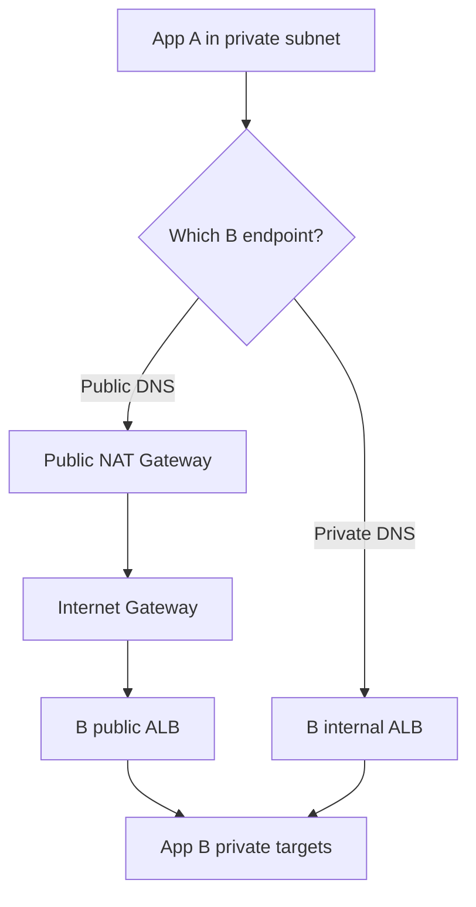
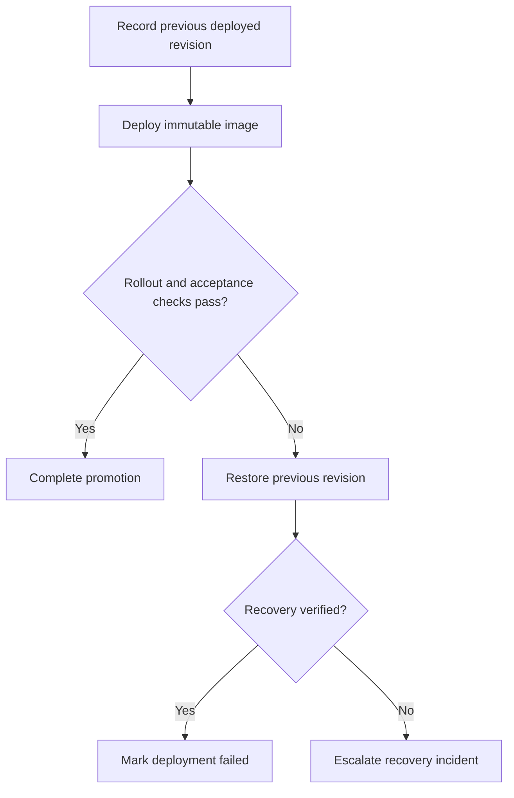

Below are model interview answers for all 21 questions. Replace experience statements and savings figures with what you have actually done.

The accompanying squareops-round2-examples.zip[squareops-round2-examples.zip](sandbox:/workspace/scratch/8dc6806ebb9b/squareops-round2-examples.zip) contains IAM policies, CloudWatch configuration, Terraform, Jenkins pipelines, rollback scripts, and troubleshooting runbooks.

**1. Which AWS services do you have the most hands-on experience with?**

A strong answer connects each service to something you built, secured, or troubleshot:

> “My strongest experience is with EC2, IAM, VPC, S3, RDS, and CloudWatch. I use Terraform to provision infrastructure, implement access controls, automate deployments, and investigate production issues.”

Use examples that match your experience:

| Service | Practical responsibilities to explain |
|---|---|
| EC2 | Launch Templates, AMIs, Auto Scaling Groups, patching, instance recovery and right-sizing |
| IAM | Roles, instance profiles, least-privilege policies and cross-account access |
| VPC | CIDR planning, public/private subnets, routes, NAT, security groups and NACLs |
| S3 | Encryption, access policies, versioning, lifecycle and storage optimization |
| RDS | Backups, Multi-AZ, connections, query performance and capacity monitoring |
| CloudWatch | Dashboards, logs, custom metrics, alarms and scaling policies |

For “Are you confident?”, describe a concrete task:

> “I’m confident configuring and troubleshooting these services. For example, I can trace an application connectivity problem through DNS, routes, security groups, NACLs, and the target service.”

For cost optimization, explain the **baseline, change, measured result, and availability impact**.

---

**2. Create an EC2 role allowing only S3 and DynamoDB, denying all other services**

There are three components:

1. A **trust policy** allowing EC2 to assume the role.
2. A **permissions policy** defining permitted actions.
3. An **instance profile** used to associate the role with EC2. [AWS Identity and Access Management](https://docs.aws.amazon.com/IAM/latest/UserGuide/id_roles_use_switch-role-ec2.html?utm_source=chatgpt.com)

Trust policy:

```json
{
  "Version": "2012-10-17",
  "Statement": [
    {
      "Effect": "Allow",
      "Principal": {
        "Service": "ec2.amazonaws.com"
      },
      "Action": "sts:AssumeRole"
    }
  ]
}
```

Permissions policy, using example resources:

```json
{
  "Version": "2012-10-17",
  "Statement": [
    {
      "Sid": "ListApplicationBucket",
      "Effect": "Allow",
      "Action": "s3:ListBucket",
      "Resource": "arn:aws:s3:::example-app-bucket"
    },
    {
      "Sid": "AccessApplicationObjects",
      "Effect": "Allow",
      "Action": [
        "s3:GetObject",
        "s3:PutObject",
        "s3:DeleteObject"
      ],
      "Resource": "arn:aws:s3:::example-app-bucket/*"
    },
    {
      "Sid": "AccessApplicationTable",
      "Effect": "Allow",
      "Action": [
        "dynamodb:GetItem",
        "dynamodb:PutItem",
        "dynamodb:UpdateItem",
        "dynamodb:DeleteItem",
        "dynamodb:Query",
        "dynamodb:Scan",
        "dynamodb:DescribeTable"
      ],
      "Resource": [
        "arn:aws:dynamodb:ap-south-1:111122223333:table/AppData",
        "arn:aws:dynamodb:ap-south-1:111122223333:table/AppData/index/*"
      ]
    },
    {
      "Sid": "DenyOtherServices",
      "Effect": "Deny",
      "NotAction": [
        "s3:*",
        "dynamodb:*"
      ],
      "Resource": "*"
    }
  ]
}
```

The logic is:

- The `Allow` statements grant selected operations on selected resources.
- `Deny` with `NotAction` denies actions outside the two named service namespaces.
- Being excluded from the deny **does not grant permission**.
- An applicable explicit deny overrides an allow from another policy.
- `Resource: "*"` makes the service restriction apply globally. [AWS Identity and Access Management](https://docs.aws.amazon.com/IAM/latest/UserGuide/reference_policies_elements_notaction.html?utm_source=chatgpt.com)

Create the role and instance profile, add the role to the profile, and associate the profile through the EC2 instance or Launch Template.

**Important follow-up:** This restriction also blocks CloudWatch, SSM, and KMS operations. An S3 workload requiring SSE-KMS might therefore fail. The CloudWatch agent example in question 5 needs an appropriately designed identity.

One technical exception: `sts:GetCallerIdentity` can still return identity information even when explicitly denied; AWS documents it as requiring no permissions. [AWS Security Token Service](https://docs.aws.amazon.com/STS/latest/APIReference/API_GetCallerIdentity.html?utm_source=chatgpt.com)

---

**3. What exact cost optimization steps have you implemented?**

Explain changes in this form:

> “I established a cost baseline, identified waste, implemented changes incrementally, and checked performance and availability afterward.”

| Area | Example optimization | Evidence to check |
|---|---|---|
| EC2 | Right-size consistently underused instances | CPU, memory, network and peak utilization |
| Nonproduction | Schedule shutdown outside working hours | Required operating hours |
| Purchasing | Savings Plans or Reserved Instances for stable usage | Coverage, utilization and commitment risk |
| EBS | Remove unused volumes; tune provisioned capacity | Attachment, throughput and IOPS requirements |
| S3 | Lifecycle transitions and expiry | Access patterns, retrieval costs and retention requirements |
| Networking | Reduce unnecessary NAT processing and cross-AZ traffic | Billing breakdown and traffic paths |
| Logging | Set retention and reduce unnecessary ingestion | Investigation and compliance requirements |

Purchase commitments **after** right-sizing. Cover predictable baseline usage rather than an occasional peak.

A hypothetical calculation:

```text
Comparable baseline monthly cost = $10,000
Monthly cost after optimization  =  $7,000

Savings = (10,000 - 7,000) / 10,000 × 100
        = 30%
```

Normalize for traffic growth and unusual one-time charges. Do not present this percentage as your experience unless you measured it.

**Public versus internal ALB cost**

Both have ALB-hour and LCU charges. An internal ALB is not free. AWS’s US East pricing example uses **$0.0225 per ALB-hour** and **$0.008 per LCU-hour**; consumed public IPv4 addresses have a separate **$0.005 per address-hour** charge. [aws.amazon.com](https://aws.amazon.com/elasticloadbalancing/pricing/?utm_source=chatgpt.com)

Illustration using 730 hours and a constant one LCU:

| Item | Illustrative monthly amount |
|---|---:|
| ALB hours plus one LCU | $22.27 |
| Two public IPv4 addresses | $7.30 additional |
| Combined example | $29.57 |

This excludes NAT, transfer, taxes, and other charges. Actual public IP count and LCU usage can vary.

The right comparison is the **whole traffic path**. A second internal ALB adds another load balancer bill, but might eliminate substantial NAT processing for internal calls.

---

**4. Two applications share a VPC and each has a public ALB. How does App A call App B?**

**App A’s outbound request does not pass through App A’s own ALB.** Its ALB handles incoming requests to A.

If A calls B’s internet-facing ALB DNS name, that name resolves to public addresses. An internal ALB resolves to private addresses. In both cases, the ALB forwards to targets using their private addresses. [Elastic Load Balancing](https://docs.aws.amazon.com/elasticloadbalancing/latest/userguide/how-elastic-load-balancing-works.html?utm_source=chatgpt.com)

Assume App A runs in a private subnet and uses a public NAT Gateway for IPv4 egress:



The public route uses A’s configured egress path. Public NAT translates the source address and uses the IGW for internet-facing destinations. [Amazon Virtual Private Cloud](https://docs.aws.amazon.com/vpc/latest/userguide/vpc-nat-gateway.html?utm_source=chatgpt.com)

Other cases:

- A public EC2 instance with a public address and an IGW route can connect without NAT.
- A private instance without a suitable egress path cannot reach B’s public IPv4 endpoint.
- Calling B’s internal endpoint uses private routing within the VPC.

**Does the public call traverse the public internet?** It uses public addressing and the public endpoint path. That does not prove packets physically traverse a third-party internet network; AWS-to-AWS traffic can remain on AWS’s network.

For service-to-service calls, an internal endpoint often provides simpler access controls and avoids NAT processing. Compare the resulting costs before adding another ALB.

---

**5. How do you configure Auto Scaling based on memory and disk?**

EC2 does not publish guest memory percentage or filesystem fullness by default. Detailed EC2 monitoring does not add those metrics. Install the **CloudWatch Agent** to publish them. Disk I/O metrics and disk space utilization are different measurements. [Amazon Elastic Compute Cloud](https://docs.aws.amazon.com/AWSEC2/latest/UserGuide/viewing_metrics_with_cloudwatch.html?utm_source=chatgpt.com)

Example Linux configuration:

```json
{
  "agent": {
    "metrics_collection_interval": 60
  },
  "metrics": {
    "namespace": "CWAgent",
    "append_dimensions": {
      "InstanceId": "${aws:InstanceId}",
      "AutoScalingGroupName": "${aws:AutoScalingGroupName}"
    },
    "aggregation_dimensions": [
      ["AutoScalingGroupName"]
    ],
    "metrics_collected": {
      "mem": {
        "measurement": ["used_percent"]
      },
      "disk": {
        "measurement": ["used_percent"],
        "resources": ["/"]
      }
    }
  }
}
```

This publishes `mem_used_percent` and `disk_used_percent`, including an ASG-level aggregation. The namespace and dimensions in a scaling policy must match the published metric. [Amazon CloudWatch](https://docs.aws.amazon.com/en_en/AmazonCloudWatch/latest/monitoring/CloudWatch-Agent-Configuration-File-Details.html?utm_source=chatgpt.com)

Memory target-tracking example:

```hcl
resource "aws_autoscaling_policy" "memory" {
  name                      = "memory-target"
  autoscaling_group_name    = var.asg_name
  policy_type               = "TargetTrackingScaling"
  estimated_instance_warmup = 300

  target_tracking_configuration {
    target_value = 70

    customized_metric_specification {
      namespace   = "CWAgent"
      metric_name = "mem_used_percent"
      statistic   = "Average"

      dimensions {
        name  = "AutoScalingGroupName"
        value = var.asg_name
      }
    }
  }
}
```

Target tracking creates and manages its CloudWatch alarms. For step scaling, create the alarm separately and connect its action to the scaling policy.

**Memory caveat:** Adding instances must reduce the relevant utilization. Scaling does not fix a memory leak on an existing instance. Target tracking works best with a metric that changes predictably as capacity changes. [Amazon EC2 Auto Scaling](https://docs.aws.amazon.com/autoscaling/ec2/userguide/as-scaling-target-tracking.html?utm_source=chatgpt.com)

**Disk caveat:** Adding an instance does not free space on a full existing disk. Usually:

- Alert on high disk usage.
- Investigate retention, temporary files and application behavior.
- Expand the volume and filesystem where appropriate.
- Use horizontal scaling only when new capacity actually redistributes storage demand.

Use per-instance alerts or an appropriate maximum aggregation; a group average can hide one full disk.

For consistent provisioning, bake the agent into the AMI or configure it during bootstrap. Update the Launch Template for future instances; update existing instances separately or use a controlled instance refresh.

---

**6. In a versioned bucket, how do you delete objects and older versions after ten days?**

First clarify **which ten-day clock** the requirement means.

| Term | Meaning |
|---|---|
| Current version | Latest version for an object key |
| Noncurrent version | A version superseded by a newer version or delete marker |
| Delete marker | Makes an ordinary GET behave as though the object is deleted |

Example lifecycle configuration applying to the entire bucket:

```json
{
  "Rules": [
    {
      "ID": "ExpireCurrentAndNoncurrentVersions",
      "Status": "Enabled",
      "Filter": {
        "Prefix": ""
      },
      "Expiration": {
        "Days": 10
      },
      "NoncurrentVersionExpiration": {
        "NoncurrentDays": 10
      },
      "AbortIncompleteMultipartUpload": {
        "DaysAfterInitiation": 10
      }
    },
    {
      "ID": "RemoveExpiredDeleteMarkers",
      "Status": "Enabled",
      "Filter": {
        "Prefix": ""
      },
      "Expiration": {
        "ExpiredObjectDeleteMarker": true
      }
    }
  ]
}
```

The important timing:

| Approximate time | What happens to a single unchanged object |
|---|---|
| Day 0 | Version uploaded |
| Day 10 | Current expiration creates a delete marker; the data version becomes noncurrent |
| Day 20 | The data version becomes eligible for noncurrent expiration |

**Ten current days plus ten noncurrent days can retain the underlying data for roughly twenty days.** Noncurrent age starts when a version becomes noncurrent, and lifecycle processing is asynchronous. [Amazon Simple Storage Service](https://docs.aws.amazon.com/us_en/AmazonS3/latest/userguide/lifecycle-expire-general-considerations.html?utm_source=chatgpt.com)

Previous versions require a `NoncurrentVersionExpiration` action; current expiration alone does not permanently remove them. Expired delete marker cleanup belongs in a separate rule from an expiration containing `Days`. [Amazon Simple Storage Service](https://docs.aws.amazon.com/AmazonS3/latest/userguide/lifecycle-configuration-examples.html?utm_source=chatgpt.com)

If the requirement is “permanently remove every version at a precise deadline measured from original creation,” this simple lifecycle configuration is insufficient. Define a version-aware purge process, account for Object Lock, and verify deletion.

The ZIP scopes its example to `logs/` to illustrate selective retention.

---

**7. The application is slow and you suspect RDS. What do you check?**

Start by proving that time is being spent at the database. Check application traces, query duration and connection-pool waiting time.

Then correlate these signals:

| Metric | What it helps identify |
|---|---|
| `CPUUtilization` | Expensive queries or CPU saturation |
| `FreeableMemory` and `SwapUsage` | Memory pressure |
| `DatabaseConnections` | Connection growth or pool misconfiguration |
| `ReadLatency`, `WriteLatency` | Storage response delays |
| Read/write IOPS and throughput | Storage workload or capacity constraints |
| `DiskQueueDepth` | Outstanding I/O |
| `FreeStorageSpace` | Storage exhaustion |
| Replica lag | Delayed replica reads |

These metrics need to be interpreted together. Low free memory alone does not prove a problem; database caching affects memory utilization. [Amazon Relational Database Service](https://docs.aws.amazon.com/AmazonRDS/latest/UserGuide/rds-metrics.html?utm_source=chatgpt.com)

Next inspect:

- Top SQL and database load.
- Wait events, blocking sessions and long transactions.
- Slow-query and error logs.
- Query plans and recent schema changes.
- Application connection pooling and retries.
- Enhanced Monitoring for operating-system detail.

Interviewers may use the term **Performance Insights**. Current AWS documentation presents database-load, SQL and wait analysis through **CloudWatch Database Insights**. [Amazon Relational Database Service](https://docs.aws.amazon.com/AmazonRDS/latest/UserGuide/USER_DatabaseInsights.html?utm_source=chatgpt.com)

Example:

> “CPU is moderate, but latency and lock waits are high. I would investigate blocking transactions before deciding that the instance needs more CPU.”

---

**8. RDS has memory pressure and cannot be resized. What can you do immediately without downtime?**

First reduce avoidable load: pause a batch job, reduce excessive application concurrency, or stop an uncontrolled retry loop.

Then inspect sessions and queries.

| Action | Immediate usefulness | Impact |
|---|---|---|
| Cancel an identified expensive query | Can act immediately | That query can fail |
| Terminate unnecessary sessions | Can release session resources | Connections are disconnected; transactions may roll back |
| Reduce pool sizes or excessive concurrency | Useful when connections contribute to pressure | Must preserve adequate application capacity |
| Route eligible reads to an existing replica | Useful if routing already supports it | Replica consistency and capacity must be considered |
| Create a new read replica | Takes time | Provisioning, catch-up and routing changes are required |

For RDS MySQL:

```sql
SHOW FULL PROCESSLIST;

-- Cancel the current query:
CALL mysql.rds_kill_query(123);

-- Terminate the connection:
CALL mysql.rds_kill(123);
```

For PostgreSQL:

```sql
-- Cancel the current query:
SELECT pg_cancel_backend(123);

-- Terminate the session:
SELECT pg_terminate_backend(123);
```

Cancellation and termination are different operations. Identify the owner and transaction before acting. [Amazon Relational Database Service](https://docs.aws.amazon.com/AmazonRDS/latest/UserGuide/Appendix.MySQL.CommonDBATasks.End.html?utm_source=chatgpt.com)

**“No database restart” does not mean “no user impact.”** A cancelled request can fail, and rollback or memory cleanup may take time.

Creating a replica is not an instant remedy. AWS also documents possible brief primary I/O suspension during the initial snapshot in some configurations; Multi-AZ can avoid that suspension by taking the snapshot from the secondary. [Amazon Relational Database Service](https://docs.aws.amazon.com/AmazonRDS/latest/UserGuide/USER_ReadRepl.Create.html?utm_source=chatgpt.com)

---

**9. Internet traffic enters through an IGW. Which security control comes first: NACL or security group?**

Among those two controls, the conceptual inbound path is:

1. Traffic reaches the destination subnet boundary, where its NACL applies.
2. Traffic reaches the resource’s network interface, where its security groups apply.

An architecture can contain earlier controls such as an edge WAF or network firewall.

| Property | NACL | Security group |
|---|---|---|
| Scope | Subnet | Associated network interfaces/resources |
| State | Stateless | Stateful |
| Rule types | Allow and deny | Allow |
| Evaluation | First matching numbered rule | Applicable allow rules combined |
| Return traffic | Must be allowed explicitly | Allowed response traffic is tracked |

Both controls must permit the flow. There is no general “allow in one overrides deny in the other” rule. [Amazon Virtual Private Cloud](https://docs.aws.amazon.com/vpc/latest/userguide/vpc-network-acls.html?utm_source=chatgpt.com)

---

**10. A NACL denies a CIDR, but the security group allows it. Can the source access the ALB?**

**No, if the effective matching NACL rule denies the traffic.** The security group cannot override that denial.

“Effective matching rule” matters because NACLs evaluate rules in numerical order. An earlier matching allow rule can prevent a later deny rule from being reached.

Also check the return path: NACLs are stateless, so required response traffic and ephemeral ports must be permitted. [Amazon Virtual Private Cloud](https://docs.aws.amazon.com/vpc/latest/userguide/vpc-network-acls.html?utm_source=chatgpt.com)

A rule such as:

```text
203.0.113.25/32
```

matches exactly one IPv4 address: `203.0.113.25`.

---

**11. Does `10.11.7.44` belong to `10.11.0.0/16`?**

**Yes.**

The range is:

```text
10.11.0.0 through 10.11.255.255
```

A `/16` fixes the first 16 bits, so the first two octets must be `10.11`.

---

**12. Does `10.11.44.76` belong to `10.1.0.0/16`?**

**No.**

That network contains:

```text
10.1.0.0 through 10.1.255.255
```

The address starts with `10.11`, not `10.1`.

---

**13. What does `/32` represent, and how do you calculate CIDR membership?**

IPv4 has 32 bits. A prefix `/n` identifies the network portion.

```text
Total addresses = 2^(32 - n)
```

| Prefix | Total IPv4 addresses |
|---|---:|
| `/16` | 65,536 |
| `/24` | 256 |
| `/32` | 1 |

`192.0.2.10/32` represents exactly `192.0.2.10`. Do not subtract network and broadcast addresses when interpreting a `/32` host rule.

For membership:

```text
IP address AND subnet mask = network address
```

For `/16`, the mask is `255.255.0.0`.

Python example:

```python
from ipaddress import ip_address, ip_network

checks = [
    ("10.11.7.44", "10.11.0.0/16"),
    ("10.11.44.76", "10.1.0.0/16"),
    ("192.0.2.10", "192.0.2.10/32"),
]

for address, network in checks:
    belongs = ip_address(address) in ip_network(network)
    print(address, network, belongs)
```

Output:

```text
10.11.7.44 10.11.0.0/16 True
10.11.44.76 10.1.0.0/16 False
192.0.2.10 192.0.2.10/32 True
```

AWS usable subnet capacity is a separate calculation because AWS reserves addresses.

---

**14. How do you ensure a push to `staging` deploys only to staging?**

Use a **Jenkins Multibranch Pipeline** with SCM webhooks. Jenkins discovers branches containing a Jenkinsfile and creates branch-specific jobs. [jenkins.io](https://www.jenkins.io/doc/book/pipeline/multibranch/?utm_source=chatgpt.com)

Map branches to deployment environments:

| Branch | Deployment target |
|---|---|
| `dev` | Development |
| `staging` | Staging |
| `prod` | Production, with required approval |

A staging stage:

```groovy
stage('Deploy staging') {
    when {
        beforeAgent true
        allOf {
            branch 'staging'
            expression { !env.CHANGE_ID }
        }
    }

    agent {
        label 'trusted-staging-deployer'
    }

    environment {
        TARGET_ENV = 'staging'
        EKS_CLUSTER = 'staging-eks'
        AWS_REGION = 'ap-south-1'
    }

    steps {
        sh './ci/deploy.sh'
    }
}
```

The PR check prevents a pull-request build from becoming a deployment. Exact branch conditions control which environment stage runs. [jenkins.io](https://www.jenkins.io/doc/book/pipeline/syntax/?utm_source=chatgpt.com)

Important controls:

- Separate credentials or roles for each environment.
- Restrict production deployment identities and agents.
- Protect production branches.
- Validate the AWS account before deployment.
- Promote the same tested image digest through environments.

Branch conditions alone are not a security boundary: somebody able to change the Jenkinsfile could change those conditions.

Webhooks trigger work on repository events; constant polling is unnecessary. Periodic indexing can reconcile missed events. Separate deployment pipelines are also valid when stronger operational separation is required.

---

**15. How do you implement automatic rollback in CI/CD?**

Define measurable rollback criteria, such as:

- Rollout timeout.
- Failed readiness or smoke tests.
- Error rate above an agreed threshold.
- Latency breaching a deployment acceptance threshold.
- A failed critical business transaction.

A safe flow records the previous working release **before** changing it:



For Helm, capture the previous deployed revision and use:

```bash
helm rollback sample-api "$PREVIOUS_REVISION" \
  --namespace production \
  --wait \
  --timeout 10m
```

For a Kubernetes Deployment:

```bash
kubectl rollout undo deployment/sample-api -n production
kubectl rollout status deployment/sample-api -n production
```

**A standard Kubernetes Deployment does not automatically undo a failed rollout.** It manages rollout progress and retains revision information; CI/CD, GitOps tooling, or a rollout controller decides when to roll back. [Kubernetes](https://kubernetes.io/docs/concepts/workloads/controllers/deployment/?utm_source=chatgpt.com)

Helm flags depend on the installed major version: Helm 3 uses `--atomic`; current Helm 4 documentation describes `--rollback-on-failure`. These options do not replace business acceptance checks after deployment. [Helm](https://helm.sh/docs/helm/helm_upgrade/?utm_source=chatgpt.com)

Rollback also requires backward-compatible configuration and database migrations. Reverting an image does not undo database writes.

The ZIP includes a script that restores a captured deployed Helm revision and reports the deployment as failed even when recovery succeeds.

---

**16. How do you integrate SonarQube with Jenkins?**

The sequence is:

1. Run tests and generate coverage reports.
2. Run the Sonar scanner.
3. Wait for the quality gate.
4. Permit promotion only when the gate passes.

Generate a project analysis token from **My Account → Security**, with appropriate project permissions and expiry. Store it as Jenkins **Secret text**, not in Git or the Jenkinsfile. Configure the SonarQube server and scanner in Jenkins. [docs.sonarsource.com](https://docs.sonarsource.com/sonarqube-server/user-guide/managing-tokens?utm_source=chatgpt.com)

Example analysis and gate stages:

```groovy
stage('Sonar analysis') {
    agent { label 'trusted-ci-agent' }

    steps {
        script {
            def scanner = tool 'SonarScanner'

            withSonarQubeEnv(
                installationName: 'SonarQube',
                credentialsId: 'sonar-project-analysis-token'
            ) {
                withEnv(["SONAR_SCANNER_HOME=${scanner}"]) {
                    sh '''
                        set +x
                        SONAR_TOKEN="$SONAR_AUTH_TOKEN" \
                          "$SONAR_SCANNER_HOME/bin/sonar-scanner"
                    '''
                }
            }
        }
    }
}

stage('Quality gate') {
    steps {
        timeout(time: 10, unit: 'MINUTES') {
            waitForQualityGate(
                abortPipeline: true,
                webhookSecretId: 'sonar-webhook-secret'
            )
        }
    }
}
```

Use pipeline-level `agent none` so waiting for the gate does not occupy an executor unnecessarily.

Configure a SonarQube webhook pointing to:

```text
https://jenkins.example.com/sonarqube-webhook/
```

Include the trailing slash and configure webhook secret verification. The Jenkins integration associates the analysis task with `waitForQualityGate`. [docs.sonarsource.com](https://docs.sonarsource.com/sonarqube-server/analyzing-source-code/ci-integration/jenkins-integration/pipeline-pause?utm_source=chatgpt.com)

A **quality gate** is a pass/fail decision based on agreed conditions. Example project thresholds:

| Condition | Example threshold |
|---|---|
| Coverage on new code | At least 80% |
| Duplication on new code | At most 3% |
| Security/reliability findings | Meet the project’s agreed ratings and issue criteria |

These are example thresholds, not universal requirements.

For JavaScript coverage:

```properties
sonar.javascript.lcov.reportPaths=coverage/lcov.info
```

The test tooling produces coverage; SonarQube imports it. SonarQube analysis complements dependency, container, IaC, and secret scanning.

---

**17. A Jenkins job starts but gets stuck. How do you debug it?**

First identify **what it is waiting for**.

| Symptom | Investigation |
|---|---|
| Waiting for an executor | Agent labels, online status, executor capacity |
| Waiting for input | Approval step |
| Waiting for a lock | Lock holder and concurrency settings |
| Waiting for quality gate | Sonar task and webhook delivery |
| Shell command hangs | Child processes, network calls and interactive prompts |
| Agent disappears | Remoting logs, networking and agent lifecycle |
| Controller becomes unresponsive | CPU, memory, GC, disk and thread dumps |

Then:

- Inspect the last console message and Pipeline stage.
- Check agent CPU, memory, disk space and inodes.
- Check controller and agent logs.
- Inspect running processes.
- Test DNS and connectivity to external services.
- Check API throttling, credentials and proxy configuration.
- Add appropriate command and stage timeouts.

Jenkins troubleshooting guidance includes collecting diagnostic information and thread dumps for hangs. [jenkins.io](https://www.jenkins.io/doc/book/troubleshooting/?utm_source=chatgpt.com)

Restart an agent when evidence shows that the agent or remoting connection is broken. Capture useful evidence first.

Before rerunning, inspect partial side effects: a stuck Terraform or deployment command may already have changed infrastructure. Do not blindly repeat it.

---

**18. Terraform generated an RDS password, but you did not save it. Can you retrieve it?**

**Usually yes, if it was generated by a conventional `random_password` resource and the relevant state is available.**

Terraform normally stores that generated value in state:

- Local backend: the local state file.
- Remote backend: the configured remote state store.

Marking a value `sensitive` hides it in many displays; it does not remove it from state or encrypt the value within the state document. [HashiCorp Developer](https://developer.hashicorp.com/terraform/language/manage-sensitive-data?utm_source=chatgpt.com)

If an existing root output exposes it:

```hcl
output "db_password" {
  value     = random_password.db.result
  sensitive = true
}
```

An authorized operator can retrieve it in a controlled terminal:

```bash
terraform output -raw db_password
```

If no output exists, an authorized operator can use `terraform console` and the correct resource address:

```hcl
nonsensitive(random_password.db.result)
```

Avoid exposing it in CI logs, shared terminals, tickets, or a full state dump.

If state is unavailable, check the approved secret store or state backups. RDS does not return an existing database password through its API; otherwise, perform a controlled reset.

For future designs:

- Protect state using restricted access, encryption, versioning and auditing.
- Consider RDS-managed master credentials in Secrets Manager. [Amazon Relational Database Service](https://docs.aws.amazon.com/AmazonRDS/latest/UserGuide/rds-secrets-manager.html?utm_source=chatgpt.com)
- Where supported, use ephemeral values and write-only arguments. Write-only arguments require Terraform 1.11 or later and provider support. [HashiCorp Developer](https://developer.hashicorp.com/terraform/language/manage-sensitive-data/write-only?utm_source=chatgpt.com)

Passing a normal `random_password.result` into a write-only argument does not remove the password from the `random_password` resource’s own state.

---

**19. What is a custom Terraform module?**

A custom module is a reusable collection of Terraform configuration with a defined input and output interface.

Example:

> “Our secure S3 module creates a bucket, blocks public access, configures encryption and versioning, and exposes the bucket ARN. Environment configurations supply the bucket name and tags.”

Benefits include consistent defaults, less duplication, reviewable changes and controlled version upgrades.

A module is not a separate language construct with its own execution engine. It is Terraform configuration called from another module. [HashiCorp Developer](https://developer.hashicorp.com/terraform/language/modules/syntax?utm_source=chatgpt.com)

---

**20. What does a module contain?**

Typical contents:

| File or directory | Purpose |
|---|---|
| `main.tf` | Resources, data sources, locals and child module calls |
| `variables.tf` | Inputs, types, defaults and validation |
| `outputs.tf` | Values exposed to callers |
| `versions.tf` | Terraform and provider requirements |
| `README.md` | Usage, assumptions and examples |
| `examples/` | Example root configurations |
| `tests/` | Relevant module validation |

These filenames are conventions. Terraform loads the module’s `.tf` files together; file names do not determine execution order. [HashiCorp Developer](https://developer.hashicorp.com/terraform/language/modules/develop/structure?utm_source=chatgpt.com)

A reusable child module should declare provider requirements. Configure provider credentials and account selection in the root module, passing provider aliases when needed.

---

**21. What goes in `main.tf`, `variables.tf`, `outputs.tf`, and `providers.tf`? How do you call a module?**

A small module example:

`variables.tf`:

```hcl
variable "bucket_name" {
  type        = string
  description = "Globally unique S3 bucket name"
}

variable "tags" {
  type    = map(string)
  default = {}
}
```

`main.tf`:

```hcl
resource "aws_s3_bucket" "this" {
  bucket        = var.bucket_name
  force_destroy = false
  tags          = var.tags
}

resource "aws_s3_bucket_public_access_block" "this" {
  bucket = aws_s3_bucket.this.id

  block_public_acls       = true
  block_public_policy     = true
  ignore_public_acls      = true
  restrict_public_buckets = true
}
```

`outputs.tf`:

```hcl
output "bucket_arn" {
  value = aws_s3_bucket.this.arn
}
```

The **root module’s** `providers.tf` configures AWS:

```hcl
provider "aws" {
  region = var.aws_region

  allowed_account_ids = [var.aws_account_id]

  assume_role {
    role_arn = var.deployment_role_arn
  }
}
```

The root calls the child module:

```hcl
module "app_bucket" {
  source = "../modules/secure-bucket"

  bucket_name = var.bucket_name

  tags = {
    Environment = var.environment
    ManagedBy   = "Terraform"
  }
}

output "application_bucket_arn" {
  value = module.app_bucket.bucket_arn
}
```

`source` identifies the module; other arguments supply its inputs. Access outputs through `module.<name>.<output>`. Pin remote module versions or Git references for predictable upgrades. [HashiCorp Developer](https://developer.hashicorp.com/terraform/language/modules/syntax?utm_source=chatgpt.com)

For shared state, configure a remote backend separately:

```hcl
terraform {
  backend "s3" {
    bucket       = "example-terraform-state"
    key          = "staging/application/terraform.tfstate"
    region       = "ap-south-1"
    encrypt      = true
    use_lockfile = true
  }
}
```

The state bucket must already exist. Current Terraform supports native S3 lockfiles; DynamoDB-based locking is deprecated. Use separate state keys and restricted deployment identities for environments. [HashiCorp Developer](https://developer.hashicorp.com/terraform/language/backend/s3?utm_source=chatgpt.com)

The example pack passed **19 local tests**, JSON parsing, and Bash syntax checks. Deployment tests used mocks; Terraform validation, Jenkins execution, and live AWS changes were not performed.
