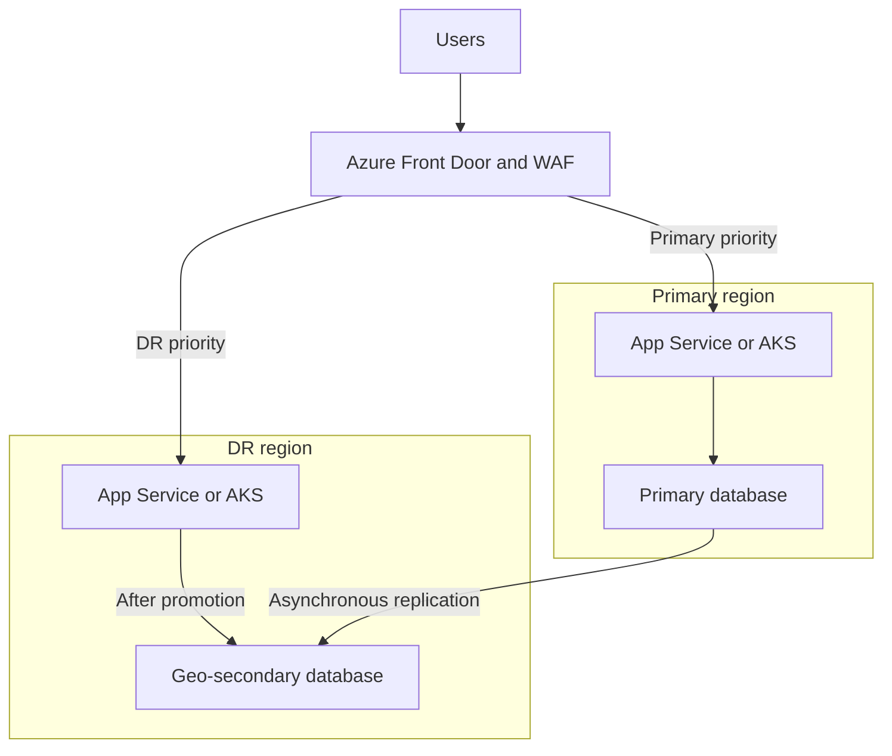

These are model answers for a senior candidate. Adapt the project examples to your actual experience.

Download the working templates and runbooks: synechron-azure-devops-examples.zip[synechron-azure-devops-examples.zip](sandbox:/workspace/scratch/8dc6806ebb9b/synechron-azure-devops-examples.zip).

**1. What is Azure Boards? What does it contain?**

Azure Boards is the work-management service in Azure DevOps. Teams use it to plan requirements, track implementation, organize sprints, and connect work to code changes.

| Component | Purpose |
|---|---|
| Work items | Track requirements, tasks, bugs and other work |
| Boards | Visualize workflow using Kanban columns |
| Backlogs | Prioritize upcoming work |
| Sprints | Plan iterations and track sprint tasks |
| Queries | Find work using filters |
| Delivery Plans | View dependencies and delivery across teams |
| Analytics | Report on progress and trends |

Work-item types depend on the selected process: Basic, Agile, Scrum, or CMMI. For example, Agile commonly uses epics, features, user stories, tasks, and bugs. [Microsoft Learn](https://learn.microsoft.com/en-us/azure/devops/boards/get-started/what-is-azure-boards?view=azure-devops\&utm_source=chatgpt.com)

**Example:** For “automate AKS deployment,” create a feature, divide it into pipeline and infrastructure tasks, assign owners, and link the implementation PRs. Acceptance criteria might require successful deployment, smoke tests, and a tested rollback.

---

**2. What is `pom.xml` in Maven?**

POM means **Project Object Model**. The `pom.xml` describes a Maven project and tells Maven how to build it.

It commonly contains:

- Project coordinates: `groupId`, `artifactId`, and `version`.
- Dependencies and their versions.
- Build plugins.
- Packaging type, such as JAR or WAR.
- Properties, repositories, profiles, and modules. [Maven](https://maven.apache.org/guides/introduction/introduction-to-the-pom.html?utm_source=chatgpt.com)

Simple example:

```xml
<project xmlns="http://maven.apache.org/POM/4.0.0">
  <modelVersion>4.0.0</modelVersion>

  <groupId>com.example</groupId>
  <artifactId>orders-service</artifactId>
  <version>1.0.0</version>
  <packaging>jar</packaging>

  <properties>
    <maven.compiler.source>17</maven.compiler.source>
    <maven.compiler.target>17</maven.compiler.target>
    <project.build.sourceEncoding>UTF-8</project.build.sourceEncoding>
  </properties>

  <build>
    <finalName>app</finalName>
  </build>
</project>
```

```bash
mvn clean verify
```

This runs the relevant lifecycle phases, including compilation, tests, packaging, and configured verification.

A **dependency** is something your application uses. A **plugin** performs a build operation.

An important distinction: `mvn deploy` publishes an artifact to a repository; it does not inherently deploy the application to Azure.

---

**3. Write the structure of an Azure pipeline**

The main hierarchy is **pipeline → stages → jobs → steps**. A deployment job additionally records deployment activity against an Azure DevOps environment. [Microsoft Learn](https://learn.microsoft.com/en-us/azure/devops/pipelines/yaml-schema/?view=azure-pipelines\&utm_source=chatgpt.com)

This example assumes an existing Maven web application that produces an executable `target/app.jar`, an existing App Service, and a configured service connection:

```yaml
trigger:
  branches:
    include:
      - main

pool:
  vmImage: ubuntu-24.04

variables:
  azureConnection: REPLACE_WIF_CONNECTION
  appName: REPLACE_WEBAPP_NAME

stages:
- stage: Build
  jobs:
  - job: BuildApplication
    steps:
    - checkout: self

    - task: Maven@4
      inputs:
        mavenPOMFile: pom.xml
        goals: clean verify
        options: -B -ntp
        javaHomeOption: JDKVersion
        jdkVersionOption: '1.17'
        publishJUnitResults: true
        testResultsFiles: '**/surefire-reports/TEST-*.xml'

    - task: PublishPipelineArtifact@1
      inputs:
        targetPath: $(Build.SourcesDirectory)/target/app.jar
        artifact: app

- stage: Deploy
  dependsOn: Build
  condition: and(succeeded(), eq(variables['Build.SourceBranch'], 'refs/heads/main'), ne(variables['Build.Reason'], 'PullRequest'))

  jobs:
  - deployment: DeployApplication
    environment: development

    strategy:
      runOnce:
        deploy:
          steps:
          - download: none

          - task: DownloadPipelineArtifact@2
            inputs:
              buildType: current
              artifactName: app
              targetPath: $(Pipeline.Workspace)/release

          - task: AzureWebApp@1
            inputs:
              azureSubscription: $(azureConnection)
              appType: webAppLinux
              appName: $(appName)
              package: $(Pipeline.Workspace)/release/app.jar
```

Maven builds and tests the application; Pipeline Artifacts transfer the exact built package between jobs; `AzureWebApp@1` deploys it. [Microsoft Learn](https://learn.microsoft.com/en-us/azure/devops/pipelines/tasks/reference/maven-v4?view=azure-pipelines\&utm_source=chatgpt.com)

For production, add security checks, staging validation, and approval. **Environment approvals and resource checks are configured outside YAML**, so modifying the pipeline file cannot modify those checks. [Microsoft Learn](https://learn.microsoft.com/en-us/azure/devops/pipelines/process/approvals?view=azure-devops\&utm_source=chatgpt.com)

For Azure Repos, configure PR build validation through branch policies. Do not assume a YAML `pr:` trigger provides Azure Repos PR validation.

The ZIP also includes a staging-slot deployment and approved production swap example.

---

**4. Write a simple Dockerfile**

For a prebuilt Java application:

```dockerfile
FROM eclipse-temurin:17-jre-jammy

WORKDIR /app

RUN groupadd --gid 10001 appgroup \
    && useradd --uid 10001 --gid appgroup \
       --no-create-home --shell /usr/sbin/nologin appuser

COPY --chown=10001:10001 target/app.jar /app/app.jar

USER 10001:10001
EXPOSE 8080

ENTRYPOINT ["java", "-jar", "/app/app.jar"]
CMD ["--server.port=8080"]
```

The command-line argument assumes a Spring Boot-compatible application.

```bash
mvn clean verify
docker build -t orders-service:1.0 .
docker run --rm -p 8080:8080 orders-service:1.0
```

Explain each instruction:

| Instruction | Purpose |
|---|---|
| `FROM` | Select the base image |
| `WORKDIR` | Set the working directory |
| `RUN` | Execute commands during image construction |
| `COPY` | Add the application artifact |
| `USER` | Run the application without root privileges |
| `EXPOSE` | Document the listening port |
| `ENTRYPOINT` | Define the application command |
| `CMD` | Supply default arguments |

`EXPOSE` does not publish a port; `-p` does that.

For production, select supported base images, pin approved digests, use `.dockerignore`, scan the image, and keep credentials out of image layers. [Docker Docs](https://docs.docker.com/build/building/best-practices/?utm_source=chatgpt.com)

---

**5. How do you troubleshoot a failed pod in AKS? Give commands**

Start with **status, events, termination information, and logs**. Collect evidence before deleting the pod.

Connect using a dedicated kubeconfig:

```bash
az aks get-credentials \
  --resource-group REPLACE_RESOURCE_GROUP \
  --name REPLACE_AKS_CLUSTER \
  --file ./aks-interview.kubeconfig

export KUBECONFIG="$PWD/aks-interview.kubeconfig"
kubectl config current-context
```

Initial investigation:

```bash
kubectl get pods -n app -o wide

kubectl describe pod REPLACE_POD -n app

kubectl get events -n app \
  --sort-by=.metadata.creationTimestamp

kubectl logs REPLACE_POD -n app \
  -c REPLACE_CONTAINER --tail=200

kubectl logs REPLACE_POD -n app \
  -c REPLACE_CONTAINER --previous --tail=200
```

`--previous` is particularly useful when a container has restarted. Kubernetes recommends inspecting pod state and recent events as the first troubleshooting step. [Kubernetes](https://kubernetes.io/docs/tasks/debug/debug-application/debug-pods/?utm_source=chatgpt.com)

Then investigate according to the symptom:

| Symptom | Likely investigation |
|---|---|
| `Pending` | Capacity, requests, affinity, taints and PVC binding |
| `ContainerCreating` | Volume attachment, CNI, subnet IP availability |
| `ImagePullBackOff` | Image reference, registry permissions, DNS and connectivity |
| `CrashLoopBackOff` | Previous logs, application arguments, configuration and probes |
| `OOMKilled` | Memory limit, usage history and application leaks |
| `Evicted` | Node memory/disk pressure and ephemeral storage |
| Running but unready | Probe configuration, dependencies and application listening port |
| Node `NotReady` | Node conditions, kubelet, runtime, networking and Azure health |

Resource and node checks:

```bash
kubectl top pod REPLACE_POD -n app --containers
kubectl top nodes

kubectl get nodes
kubectl describe node REPLACE_NODE

kubectl get pvc -n app
kubectl describe pvc REPLACE_PVC -n app
```

Termination details:

```bash
kubectl get pod REPLACE_POD -n app \
  -o jsonpath='{range .status.containerStatuses[*]}{.name}{" reason="}{.lastState.terminated.reason}{" exit="}{.lastState.terminated.exitCode}{"\n"}{end}'
```

If the application starts but traffic fails:

```bash
kubectl get service,ingress -n app

kubectl get endpointslice -n app \
  -l kubernetes.io/service-name=orders-service

kubectl get networkpolicy -n app
```

Use Azure Monitor/Container Insights and historical metrics to correlate failures with deployments. `kubectl top` shows recent usage and may miss a short memory spike.

---

**6. What is the Terraform drift command?**

There is **no `terraform drift` command**.

Drift means infrastructure changed outside Terraform—for example, somebody modified an NSG rule through the portal.

Use:

```bash
terraform plan
```

A normal plan refreshes observed resource information and shows proposed changes needed to match the configuration.

For changes relative to recorded state:

```bash
terraform plan -refresh-only
```

Refresh-only mode plans updates to Terraform’s state and outputs without proposing changes to remote infrastructure. Running the plan does not persist those state updates. [HashiCorp Developer](https://developer.hashicorp.com/terraform/cli/commands/plan?utm_source=chatgpt.com)

For automation:

```bash
terraform plan \
  -refresh-only \
  -detailed-exitcode \
  -input=false
```

| Exit code | Meaning |
|---|---|
| `0` | No planned differences |
| `1` | Planning error |
| `2` | Planned differences exist |

Do not confuse exit code `2` with failure. Also inspect whether differences represent infrastructure drift, output changes, or provider behavior. [HashiCorp Developer](https://developer.hashicorp.com/terraform/cli/commands/plan?utm_source=chatgpt.com)

**Example:** A portal change enables public access on a storage account. Detect it, review a normal plan, and decide whether to restore the approved configuration or update the code through review.

`terraform apply -refresh-only` updates state; it does **not** update your HCL to accept the manual change.

---

**7. What are the different types of Azure storage?**

Separate **storage services**, **account choices**, and **redundancy options**.

| Service | Typical use |
|---|---|
| Blob Storage | Object storage for documents, logs, backups and media |
| Azure Files | Shared file storage using supported SMB/NFS configurations |
| Queue Storage | Simple asynchronous message queues |
| Table Storage | NoSQL key-value-style structured data |
| Managed Disks | Block storage for Azure VMs |
| Data Lake Storage Gen2 | Analytics-oriented Blob Storage with hierarchical namespace |

These have different access patterns and interfaces. [Microsoft Learn](https://learn.microsoft.com/en-us/azure/storage/common/storage-introduction?utm_source=chatgpt.com)

Common storage account choices include general-purpose v2 and specialized premium accounts for block blobs, file shares, or page blobs. Managed Disks are managed separately rather than requiring you to manage their underlying storage account.

Redundancy is another dimension:

| Option | Protection |
|---|---|
| LRS | Copies within one datacenter |
| ZRS | Copies across availability zones in the region |
| GRS | Primary-region copies plus asynchronous replication to another region |
| GZRS | Zone redundancy in the primary plus geo-replication |
| RA-GRS / RA-GZRS | Adds read access to the secondary |

Geo-replication is asynchronous, and redundancy does not replace backup protection against deletion or corruption. [Microsoft Learn](https://learn.microsoft.com/en-us/azure/storage/common/storage-redundancy?utm_source=chatgpt.com)

---

**8. How do you store credentials in Azure Pipelines?**

For Azure authentication, prefer an **Azure Resource Manager service connection with workload identity federation**. It avoids storing a long-lived client secret. Scope its permissions and authorize only the required pipelines. [Microsoft Learn](https://learn.microsoft.com/en-us/azure/devops/pipelines/library/connect-to-azure?view=azure-devops\&utm_source=chatgpt.com)

For application secrets:

- Store them in Azure Key Vault.
- Retrieve only the secrets the job needs.
- Alternatively, use restricted secret variables or variable groups.
- Map secrets to process environment variables.
- Avoid printing secrets or passing them through command-line arguments.

Example:

```yaml
steps:
- task: AzureKeyVault@2
  inputs:
    azureSubscription: REPLACE_WIF_CONNECTION
    KeyVaultName: REPLACE_VAULT_NAME
    SecretsFilter: api-token
    RunAsPreJob: false

- bash: python3 scripts/call_internal_api.py
  env:
    API_TOKEN: $(api-token)
```

`AzureKeyVault@2` makes fetched secrets available as variables to subsequent tasks. Its identity needs the appropriate vault permissions, and the agent needs network access. [Microsoft Learn](https://learn.microsoft.com/en-us/azure/devops/pipelines/tasks/reference/azure-key-vault-v2?view=azure-pipelines\&utm_source=chatgpt.com)

Secret masking is not foolproof. Restrict who can edit pipelines that consume credentials, and do not provide production secrets to untrusted PR builds. [Microsoft Learn](https://learn.microsoft.com/en-us/azure/devops/pipelines/security/secrets?view=azure-devops\&utm_source=chatgpt.com)

---

**9. What are the different types of Azure subscriptions?**

This question often mixes **commercial offers**, **billing agreements**, and **environment organization**.

Common offers or purchasing routes include:

| Category | Example |
|---|---|
| Consumption-based | Pay-as-you-go |
| Evaluation | Azure free account/trial |
| Developer benefits | Visual Studio subscriptions |
| Education | Azure for Students |
| Development/testing | Pay-as-you-go Dev/Test or Enterprise Dev/Test |
| Partner purchasing | Azure through CSP |

Microsoft maintains an official offer list; availability and terms depend on the offer. [Microsoft Azure](https://azure.microsoft.com/en-us/support/legal/offer-details/?utm_source=chatgpt.com)

Enterprise Agreement, Microsoft Customer Agreement, and partner agreements describe billing relationships rather than application environments.

“Production subscription” and “development subscription” describe an organization’s separation strategy:

> “We separate production and nonproduction subscriptions to isolate access, policies, budgets, quotas, and operational risk.”

Subscriptions are units of management, billing, and scale. They can be organized according to environment, ownership, application portfolio, and governance requirements. [Microsoft Learn](https://learn.microsoft.com/en-us/azure/cloud-adoption-framework/ready/landing-zone/design-area/resource-org-subscriptions?utm_source=chatgpt.com)

---

**10. How would you implement DC/DR in Azure? Which services would you use?**

Start by defining:

- **RTO:** How long the application can remain unavailable.
- **RPO:** How much recent data loss is acceptable.
- Failure scope: a VM, availability zone, datacenter, or entire region.

For a web application, a possible active-passive architecture is:



This is a design example; its recovery guarantees depend on the selected services and data replication.

| Requirement | Services or approach |
|---|---|
| HTTP traffic routing | Front Door Standard/Premium with health probes and WAF |
| DNS-based routing | Traffic Manager where appropriate |
| VM disaster recovery | Azure Site Recovery |
| Database recovery | Azure SQL failover groups or engine-native replication |
| Backup and restore | Azure Backup plus tested application/database restores |
| AKS recovery | Separate regional cluster, IaC/GitOps and data recovery |
| Regional image availability | ACR Premium geo-replication |
| Detection | Azure Monitor and Application Insights |

Front Door can route across origin groups; Site Recovery replicates supported VM workloads and orchestrates recovery. [Microsoft Learn](https://learn.microsoft.com/en-us/azure/frontdoor/origin?utm_source=chatgpt.com)

For Azure SQL, use a failover-group listener so the application does not require a new connection string after geo-failover. Forced failover can lose recent writes because replication is asynchronous. [Microsoft Learn](https://learn.microsoft.com/en-us/azure/azure-sql/database/failover-group-sql-db?view=azuresql\&utm_source=chatgpt.com)

For AKS, deploy an independent cluster in the DR region. Recreate workloads through declarative configuration and recover their data using supported backup or application replication. AKS Backup supports specific cross-region recovery scenarios with prerequisites that must be verified. [Microsoft Learn](https://learn.microsoft.com/en-us/azure/aks/reliability-multi-region-deployment-models?utm_source=chatgpt.com)

A safe recovery sequence is:

1. Confirm the primary failure and invoke the recovery process.
2. Establish one authoritative database writer.
3. Recover dependencies, secrets, networking and application capacity.
4. Enable DR readiness after data and dependencies are ready.
5. Route traffic and validate business transactions.
6. Perform controlled failback later.

**Two application deployments do not automatically provide zero data loss.** Test complete failover and measure the achieved RTO/RPO.

---

**11. What issues have you faced in your project?**

Use actual incidents. Explain each using:

**Symptom → evidence → root cause → mitigation → prevention → result.**

Examples to adapt:

| Incident | Evidence | Mitigation and prevention |
|---|---|---|
| AKS image pull failure | Events showed registry access denial | Correct identity/permissions; validate registry connectivity |
| Pod OOM kills | Termination reason and memory history | Fix leak or justified capacity; add load tests and alerts |
| Deployment broke configuration | Errors began after a config revision | Recover compatible release; validate configuration before promotion |
| Pipeline could not reach private resources | Agent DNS/routes failed | Use a private-connected agent; document required connectivity |
| Terraform detected a console hotfix | Refresh-only and normal plans showed differences | Reconcile approved code; schedule drift detection |
| Slow database responses | Traces, locks, queries and connection metrics | Address the actual bottleneck; add targeted monitoring |

An illustrative answer:

> “After a release, pods started restarting. Previous container logs and termination details showed memory exhaustion. We restored the previous compatible release, investigated the application’s memory behavior, and added load testing and memory alerts before promoting the corrected version.”

Replace that narrative with your real evidence and personal contribution. Avoid claiming that increasing a limit permanently fixed a leak.

---

**12. Will you register App Service first or deploy it?**

Clarify what “register” means.

**If it means the resource provider:** Ensure `Microsoft.Web` is registered in the subscription before provisioning App Service resources. The portal or deployment tooling may register it automatically. [Microsoft Learn](https://learn.microsoft.com/en-us/azure/azure-resource-manager/management/resource-providers-and-types?utm_source=chatgpt.com)

```bash
az provider show \
  --namespace Microsoft.Web \
  --query registrationState \
  --output tsv

az provider register \
  --namespace Microsoft.Web \
  --wait
```

Then create:

1. Resource group and supporting infrastructure.
2. App Service plan.
3. Web App.
4. Identity, settings, connectivity and deployment slots.
5. Application deployment.

**If it means an Entra app registration:** That is an identity configuration used for authentication or API access. It is not universally required before deploying application code.

App Service authentication can use an existing or newly created Entra application registration. [Microsoft Learn](https://learn.microsoft.com/en-us/azure/app-service/configure-authentication-provider-aad?utm_source=chatgpt.com)

---

**13. Have you used scripting languages for automation?**

A model answer:

> “I use Bash for command orchestration, Python for API calls and data processing, and PowerShell where Azure administration or Windows workloads benefit from it.”

Give specific examples:

| Language | Automation examples |
|---|---|
| Bash | Terraform checks, packaging and deployment commands |
| Python | Health checks, inventory, log processing and API integration |
| PowerShell | Azure administration and Windows configuration |

A good script should have input validation, bounded timeouts, useful exit codes, safe credential handling, and clear failure reporting.

For example, the included health checker can validate a JSON health response:

```bash
python3 scripts/healthcheck.py \
  https://app.example.com/healthz \
  --expected-status ok \
  --timeout 5
```

It returns nonzero when the check fails, allowing the pipeline to stop promotion.

Explain idempotency where relevant: rerunning automation should not accidentally duplicate resources or repeat a destructive action.

---

**14. What is Azure Artifacts?**

Azure Artifacts is a package-management service in Azure DevOps.

It provides feeds for publishing and consuming packages such as Maven, npm, NuGet, Python, Cargo, and Universal Packages. Feeds support access control and upstream package sources. [Microsoft Learn](https://learn.microsoft.com/en-us/azure/devops/artifacts/start-using-azure-artifacts?view=azure-devops\&utm_source=chatgpt.com)

**Example:** A team publishes an internal Java library:

```text
com.company:payment-common:1.2.0
```

Other services consume that version through their Maven dependencies.

Distinguish three services:

| Service | Stores |
|---|---|
| Azure Artifacts | Versioned packages and dependencies |
| Pipeline Artifacts | Files produced by a pipeline run |
| Azure Container Registry | Container images and related artifacts |

In the pipeline above, the application JAR is passed between stages as a **Pipeline Artifact**.

---

**15. What is a self-hosted agent versus a Microsoft-hosted agent?**

An agent executes pipeline jobs.

| Area | Microsoft-hosted | Self-hosted |
|---|---|---|
| Infrastructure | Microsoft manages it | Your organization manages it |
| Job environment | Fresh VM for each job | Depends on your lifecycle design |
| Tooling | Preinstalled image tools | Custom tooling |
| Maintenance | Microsoft handles host maintenance | Your responsibility |
| Private connectivity | Must design access appropriately | Can run inside your private network |
| Isolation | Fresh environment per job | Must deliberately enforce isolation |

Microsoft-hosted VMs are discarded after their job, so files do not automatically persist into the next job. [Microsoft Learn](https://learn.microsoft.com/en-us/azure/devops/pipelines/agents/agents?view=azure-devops\&utm_source=chatgpt.com)

Hosted example:

```yaml
pool:
  vmImage: ubuntu-24.04
```

Self-hosted example:

```yaml
pool:
  name: private-azure-agents
  demands:
    - Agent.OS -equals Linux
```

Choose self-hosted agents when you need private endpoint connectivity, special tools, or particular hardware.

For self-hosted agents, patch the hosts, protect credentials, clean workspaces, and separate trusted deployment jobs from untrusted PR execution. Ephemeral self-hosted agents can improve isolation.

---

**16. What is the difference between Docker `CMD` and `ENTRYPOINT`?**

| Instruction | Purpose |
|---|---|
| `ENTRYPOINT` | Defines the executable and stable arguments |
| `CMD` | Defines a default command, or default arguments for an entrypoint |

Together:

```dockerfile
ENTRYPOINT ["java", "-jar", "/app/app.jar"]
CMD ["--server.port=8080"]
```

Default execution:

```text
java -jar /app/app.jar --server.port=8080
```

Override the default arguments:

```bash
docker run --rm -p 9090:9090 \
  orders-service:1.0 --server.port=9090
```

Override the executable:

```bash
docker run --rm \
  --entrypoint java orders-service:1.0 -version
```

Use exec-form JSON arrays so the application receives signals directly. A shell-form entrypoint has different argument and signal behavior. Only the last `CMD` and the last `ENTRYPOINT` in the resulting stage take effect. [Docker Docs](https://docs.docker.com/reference/dockerfile/?utm_source=chatgpt.com)

---

**17. How do you configure SonarQube with Azure DevOps?**

Assuming the question means Azure Pipelines integration:

1. Ensure the SonarQube server is reachable from the agent.
2. Create the SonarQube project and an appropriately scoped analysis token.
3. Configure a SonarQube service connection in Azure DevOps.
4. Ensure the SonarQube extension/tasks are available.
5. Generate test and coverage reports.
6. Run analysis and enforce the quality gate before deployment.

For Maven:

```yaml
steps:
- task: SonarQubePrepare@8
  inputs:
    SonarQube: REPLACE_SONAR_SERVICE_CONNECTION
    scannerMode: other
    extraProperties: |
      sonar.projectKey=orders-service
      sonar.coverage.jacoco.xmlReportPaths=target/site/jacoco/jacoco.xml
      sonar.qualitygate.wait=true
      sonar.qualitygate.timeout=300

- task: Maven@4
  inputs:
    mavenPOMFile: pom.xml
    goals: clean verify
    options: -B -ntp
    javaHomeOption: JDKVersion
    jdkVersionOption: '1.17'
    sonarQubeRunAnalysis: true
    sqMavenPluginVersionChoice: latest

- task: SonarQubePublish@8
  condition: succeededOrFailed()
  inputs:
    pollingTimeoutSec: '300'
```

For Maven/Gradle, analysis runs through the build integration; do not add a redundant standalone analysis task. Match task versions to the installed extension. Pin the scanner version for production builds. [docs.sonarsource.com](https://docs.sonarsource.com/sonarqube-server/2025.6/devops-platform-integration/azure-devops-integration/adding-analysis-to-pipeline/gradle-or-maven-project?utm_source=chatgpt.com)

The application’s build must generate the JaCoCo XML report. SonarQube imports coverage rather than generating it.

A quality gate evaluates agreed conditions—for example, minimum coverage on new code, acceptable duplication, and security/reliability criteria.

**Publishing the gate result and enforcing it are different concerns.** Here, `sonar.qualitygate.wait=true` makes analysis wait for the result and fail when the gate fails; downstream deployment should require successful completion. [docs.sonarsource.com](https://docs.sonarsource.com/sonarqube-server/analyzing-source-code/analysis-parameters/parameters-not-settable-in-ui?utm_source=chatgpt.com)

The example pack passed **17 mocked helper tests**, YAML/XML parsing, and Bash syntax checks. Azure deployments, Docker/Maven builds, and live SonarQube execution were not run.
