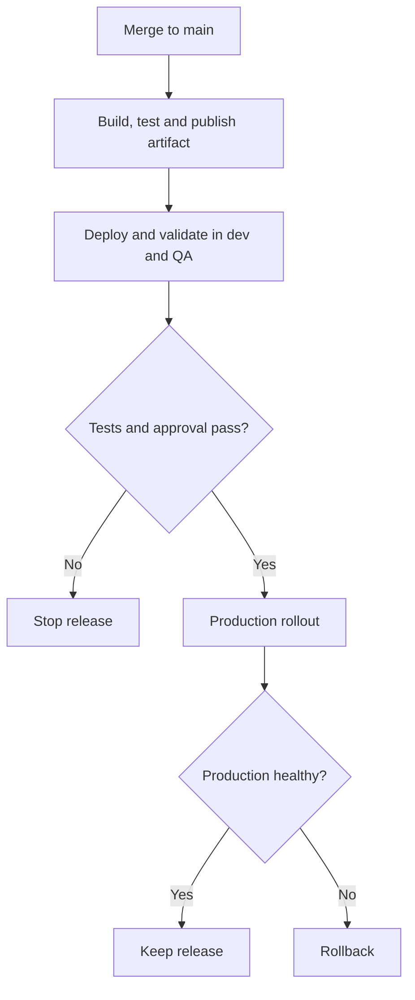
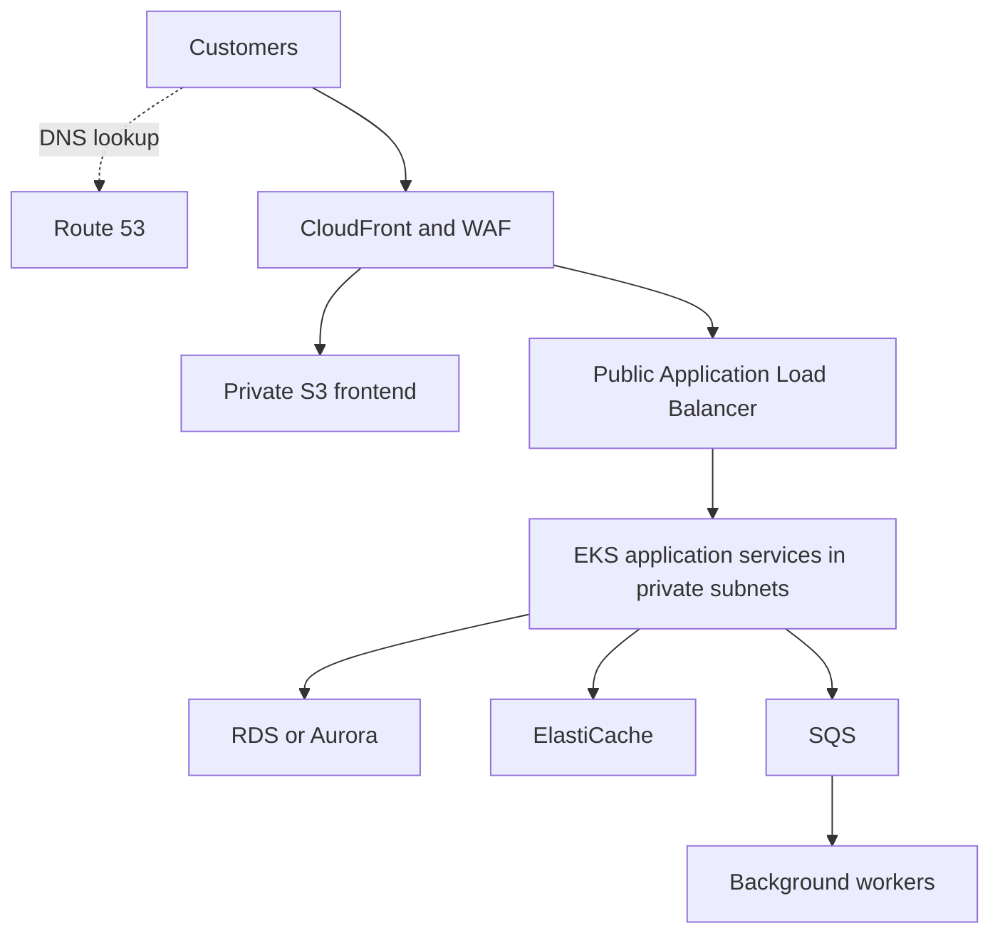
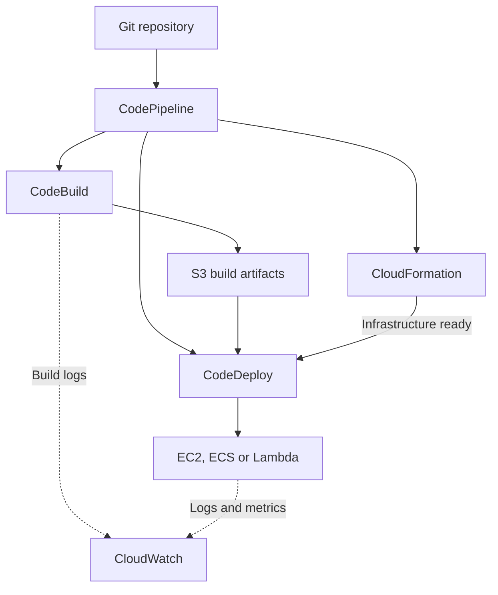

Ansible Tower appears twice in your list, so it is covered once below. The examples are suitable for explaining both the concepts and their use in a production DevOps environment.

**1. What is JFrog Artifactory?**

JFrog Artifactory is a **repository manager for software packages and build artifacts**. An artifact is an output produced during software development—for example, a JAR file, Python package, Docker image, or Helm chart.

Artifactory supports multiple package formats, allowing teams to manage their dependencies and release artifacts in one platform. It also maintains metadata that helps connect an artifact to the build that produced it. [jfrog.com](https://jfrog.com/help/r/jfrog-artifactory-documentation/jfrog-artifactory?utm_source=chatgpt.com)

Its main benefits include:

- **Centralized storage:** Applications and pipelines download packages from a controlled location.
- **Version management:** Each release has an identifiable package version or image digest.
- **Dependency caching:** Frequently used external dependencies can be served through Artifactory.
- **Access control:** Different teams receive appropriate read and publish permissions.
- **Traceability:** Build information identifies the dependencies and outputs associated with a release.

**Example:** Jenkins builds `payment-service-1.4.2.jar`, tests it, and publishes it to Artifactory. Deployment pipelines then retrieve that exact artifact for QA, staging, and production.

A useful production practice is **build once and promote the same artifact through environments**. Environment-specific configuration is supplied during deployment.

---

**2. What is Ansible Tower?**

Ansible Tower was Red Hat’s centralized platform for managing Ansible automation. Its successor is **automation controller**, a component of **Red Hat Ansible Automation Platform**.

It provides a web interface and API to define, execute, delegate, and audit automation. [redhat.com](https://www.redhat.com/en/technologies/management/ansible/automation-controller?intcmp=701f20000012ngPAAQ\&utm_source=chatgpt.com)

| Component | Purpose |
|---|---|
| Project | Connects automation content, usually playbooks stored in Git |
| Inventory | Defines the servers and groups targeted by automation |
| Credentials | Supplies authentication for repositories and managed systems |
| Job template | Combines a playbook, inventory, credentials, and execution settings |
| Workflow | Connects jobs using sequences, parallel execution, and conditions |
| RBAC | Controls who can view, modify, or execute automation |
| Execution environment | Packages the dependencies needed to run automation consistently |

**Example setup:**

1. Store a deployment playbook in Git.
2. Configure a controller project pointing to that repository.
3. Create the production inventory and associate credentials.
4. Create a job template for the deployment playbook.
5. Grant the release team permission to execute it.
6. Launch it through the UI, a schedule, or a CI/CD integration.

Jenkins can invoke controller automation through its API as part of a deployment pipeline. [Red Hat Documentation](https://docs.redhat.com/en/documentation/red_hat_ansible_automation_platform/2.6/html/using_automation_execution/index?utm_source=chatgpt.com)

**Ansible versus controller:** Ansible performs automation; controller coordinates its execution across users and environments.

**AWX** is an open-source upstream project that provides a web interface, REST API, and task engine built on Ansible. It contributes to Red Hat Ansible Automation Platform. [GitHub](https://github.com/ansible/awx?utm_source=chatgpt.com)

---

**3. What is Nagios, and how do you integrate Jenkins with Nagios?**

Nagios is a monitoring system for hosts, services, and infrastructure. It executes checks, evaluates their results, and generates notifications when configured conditions are met.

Checks commonly return **OK, WARNING, CRITICAL, or UNKNOWN** states. Nagios uses plugins to monitor services such as HTTP, SSH, and application-specific endpoints. [Nagios Open Source](https://www.nagios.org/projects/nagios-core/?utm_source=chatgpt.com)

For Jenkins, I would monitor three areas:

| Area | Checks |
|---|---|
| Infrastructure | CPU, memory, filesystem usage, Jenkins process, network connectivity |
| Jenkins platform | HTTPS availability, controller health, available agents, queue growth |
| Delivery workflow | Failures or excessive duration in important build and deployment jobs |

**Integration steps:**

1. Register the Jenkins server as a Nagios host.
2. Add an HTTPS check for its frontend.
3. Add host checks through an appropriate monitoring agent, such as NRPE.
4. Add authenticated Jenkins API or Metrics plugin checks.
5. Configure thresholds, retries, notifications, and maintenance windows.
6. Test the checks manually and validate the Nagios configuration.

Nagios can check network-accessible services directly; host attributes such as memory and process information usually require an agent or another mechanism exposing those measurements. [Nagios Core Documentation](https://assets.nagios.com/downloads/nagioscore/docs/nagioscore/4/en/monitoring-publicservices.html?utm_source=chatgpt.com)

**Example HTTPS check**

This example assumes `check_curl` from Monitoring Plugins is installed, and the host `jenkins-controller` already exists:

```text
define command {
    command_name    check_jenkins_https
    command_line    $USER1$/check_curl -H jenkins.example.com -S -D -p 443 -u /login -e 200 -w 2 -c 5 -t 10
}

define service {
    use                     generic-service
    host_name               jenkins-controller
    service_description     Jenkins HTTPS
    check_command           check_jenkins_https
}
```

Here:

- `-S` enables HTTPS.
- `-D` verifies the certificate and hostname.
- `-u /login` selects the endpoint.
- `-e 200` checks the response status.
- `-w 2` sets a two-second warning threshold.
- `-c 5` sets a five-second critical threshold.
- `-t 10` sets the timeout.

Adjust the hostname, path, and thresholds for your installation. [check_curl](https://www.monitoring-plugins.org/doc/man/check_curl.html?utm_source=chatgpt.com)

A successful login-page check establishes frontend availability. For deeper health monitoring, the Jenkins **Metrics plugin** exposes health-check results and operational measurements, with permissions controlling access. [Jenkins plugin](https://plugins.jenkins.io/metrics/?utm_source=chatgpt.com)

For job monitoring, a custom Nagios plugin can query an endpoint such as:

```text
https://jenkins.example.com/job/production-release/lastCompletedBuild/api/json
```

It can evaluate the completed build’s result and age, then return an appropriate Nagios status. Use a dedicated account with limited permissions and store its API token securely. Jenkins supports authenticated access to its remote API. [jenkins.io](https://www.jenkins.io/doc/book/using/remote-access-api/?utm_source=chatgpt.com)

---

**4. What are Ansible roles?**

An Ansible role is a **reusable, organized collection of automation content**.

For example, a `nginx` role might install Nginx, generate its configuration, start its service, and reload it when configuration changes.

Roles follow a standard directory structure:

| Path inside a role | Purpose |
|---|---|
| `tasks/main.yml` | Tasks executed by the role |
| `handlers/main.yml` | Actions triggered by notifications |
| `defaults/main.yml` | Easily overridden default variables |
| `vars/main.yml` | Variables with higher precedence |
| `templates/` | Jinja2 templates |
| `files/` | Files copied to managed hosts |
| `meta/main.yml` | Role metadata and dependencies |

A role only needs the directories it uses. [Ansible Community Documentation](https://docs.ansible.com/ansible/latest/playbook_guide/playbooks_reuse_roles.html?utm_source=chatgpt.com)

Initialize a role:

```bash
ansible-galaxy role init roles/nginx
```

Use it in a playbook:

```yaml
---
- name: Configure web servers
  hosts: web
  become: true

  roles:
    - role: nginx
      vars:
        nginx_port: 8080
        nginx_server_name: app.example.com
```

Execute the playbook:

```bash
ansible-playbook -i inventory.ini site.yml
```

The same role can configure dev, QA, and production using different variable values. This reduces duplication and keeps changes consistent.

---

**5. What is a Jinja2 template?**

Jinja2 is a template engine used by Ansible to generate files from variables and logic.

Instead of maintaining separate configuration files for every environment, you maintain one template and supply environment-specific values.

Its common syntax is:

| Syntax | Meaning |
|---|---|
| `{{ variable }}` | Insert a value |
| `` | Conditional logic |
| `` | Loop |
| `{# comment #}` | Template comment |
| `{{ value \| default('something') }}` | Apply a filter |

These expressions are processed during rendering. [Jinja Documentation (3.1.x)](https://jinja.palletsprojects.com/en/stable/templates/?utm_source=chatgpt.com)

**Example: `roles/nginx/templates/nginx.conf.j2`**

```jinja2
events {
    worker_connections 1024;
}

http {
    server {
        listen {{ nginx_port }};
        server_name {{ nginx_server_name }};

        location /health {
            default_type text/plain;
            return 200 "ok\n";
        }
    }
}
```

With the variables from the previous example, Ansible renders a configuration listening on port `8080` for `app.example.com`.

Assuming Nginx is installed and running, the role could contain this task:

```yaml
- name: Render validated Nginx configuration
  ansible.builtin.template:
    src: nginx.conf.j2
    dest: /etc/nginx/nginx.conf
    owner: root
    group: root
    mode: "0644"
    validate: "nginx -t -c %s"
  notify: Reload nginx
```

And this handler:

```yaml
- name: Reload nginx
  ansible.builtin.service:
    name: nginx
    state: reloaded
```

The candidate configuration is validated before installation. A changed file triggers the reload handler. [Ansible Community Documentation](https://docs.ansible.com/ansible/latest/collections/ansible/builtin/template_module.html?utm_source=chatgpt.com)

**`copy` versus `template`:** Use `copy` for a static file and `template` when its content must be generated dynamically.

**Role versus template:** A role organizes a complete automation function; a template generates a particular file. A role can contain multiple templates.

---

**6. What is JFrog Xray?**

JFrog Xray is a **Software Composition Analysis—SCA—tool** that analyzes software components and dependencies for security and compliance risks.

It integrates with Artifactory and supports analysis of source dependencies, build information, and packaged binaries. Its findings include vulnerabilities, malicious packages, license risks, and operational issues. It also supports SBOM-related capabilities. [jfrog.com](https://jfrog.com/help/r/jfrog-security-documentation/jfrog-xray?utm_source=chatgpt.com)

Two important concepts are:

- **Policy:** Defines the conditions that constitute a violation and the associated actions.
- **Watch:** Defines the repositories, builds, or release bundles to which policies apply.

For example, a policy could restrict artifacts containing critical vulnerabilities or prohibited licenses. A watch could apply that policy to the production container repository. [docs.jfrog.com](https://docs.jfrog.com/security/docs/policies-in-jfrog-xray?utm_source=chatgpt.com)

**Typical pipeline integration:**

1. Build and test the application.
2. Publish its artifacts and build information.
3. Execute the relevant Xray scan.
4. Evaluate policy violations.
5. Continue promotion when the security requirements are satisfied.
6. Fix rejected dependencies or base images, rebuild, and rescan.

**Example:** Your application directly depends on library A, which depends on vulnerable library B. Xray’s dependency analysis helps identify the risk introduced through that transitive dependency.

In an interview, explain both **how findings are detected** and **how your pipeline acts on them**.

---

**7. What are the use cases of JFrog?**

“JFrog” refers to a platform containing products such as Artifactory and Xray. Common DevOps use cases include:

| Use case | Example |
|---|---|
| Store internal packages | Publish shared Java libraries or Python packages |
| Store deployment artifacts | Retain application packages and container images |
| Cache external dependencies | Proxy Maven Central or an external package registry |
| Trace releases | Associate artifacts with build numbers and Git revisions |
| Enforce security policies | Evaluate dependency and license findings using Xray |
| Promote releases | Move an approved artifact through release stages |
| Support multiple sites | Synchronize repositories across configured locations |
| Apply retention | Remove eligible old builds and unused cached artifacts |

A remote Artifactory repository fetches and caches artifacts **on demand**, when clients request them. It does not automatically download the entire upstream repository. [docs.jfrog.com](https://docs.jfrog.com/artifactory/docs/remote-repositories?utm_source=chatgpt.com)

Build information is especially useful during incidents. Given a release, you can investigate the artifacts and dependencies associated with its build. JFrog CLI can collect and publish this information to Artifactory. [docs.jfrog.com](https://docs.jfrog.com/artifactory/docs/build-integration?utm_source=chatgpt.com)

**Practical example:** If release `1.4.2` fails in production, the pipeline can redeploy the retained, previously approved `1.4.1` artifact.

---

**8. How do you find Linux mount-point space?**

Start with:

```bash
df -h
```

This displays filesystem capacity, used space, available space, percentage utilization, and mount points.

Useful commands are:

```bash
# Filesystem usage and filesystem type
df -hT

# Usage of the filesystem containing this directory
df -h /var/lib/jenkins

# Inode usage
df -i
```

The `-h` option makes sizes human-readable. The `-i` option reports inode usage. A filesystem can have free storage space but still fail to create files when its inodes are exhausted. [gnu.org](https://www.gnu.org/s/coreutils/manual/html_node/df-invocation.html?utm_source=chatgpt.com)

Identify the filesystem containing a path:

```bash
findmnt -T /var/lib/jenkins
```

The `-T` option accepts a path, including a directory that is below the actual mount point. [Linux manual page](https://www.man7.org/linux/man-pages/man8/findmnt.8.html?utm_source=chatgpt.com)

Find which directories consume space:

```bash
sudo du -xhd1 /var/lib/jenkins | sort -h
```

Here, `-x` stays within the filesystem, and `-d1` summarizes one directory level.

**`df` versus `du`:** `df` reports filesystem usage; `du` measures the space used by files and directories. [gnu.org](https://www.gnu.org/s/coreutils/manual/html_node/du-invocation.html?utm_source=chatgpt.com)

---

**9. What Ansible modules have you used?**

For an experience-based answer, select modules you have actually used and describe the automation they performed.

Common production modules include:

| Category | Modules | Typical purpose |
|---|---|---|
| Package management | `apt`, `dnf`, `package`, `pip` | Install software and dependencies |
| Service management | `service`, `systemd_service` | Start, stop, enable, or reload services |
| Users and groups | `user`, `group` | Manage operating-system accounts |
| Files and configuration | `file`, `copy`, `template` | Manage directories, permissions, and configuration |
| Targeted file edits | `lineinfile`, `blockinfile` | Maintain specific configuration entries |
| Downloads and archives | `get_url`, `unarchive` | Download and extract application packages |
| Scheduling | `cron` | Manage scheduled tasks |
| Validation | `uri`, `assert`, `wait_for` | Check endpoints and required conditions |
| Troubleshooting | `debug`, `stat`, `setup` | Inspect values, files, and host facts |
| Command execution | `command`, `shell` | Execute operations requiring commands |

These modules are available in the `ansible.builtin` collection. Prefer fully qualified names such as `ansible.builtin.template`. [Ansible Community Documentation](https://docs.ansible.com/projects/ansible/latest/collections/ansible/builtin/index.html?utm_source=chatgpt.com)

**Example you can explain:** A web-server role installs the package, creates directories, renders configuration, enables the service, and checks its health endpoint.

A useful follow-up distinction:

- **`command`** executes a command without a shell.
- **`shell`** supports shell features such as pipelines and redirection.

Prefer a dedicated module when available. Command-based tasks may need conditions such as `creates` or `removes` to avoid repeatedly performing the same operation. [Ansible Community Documentation](https://docs.ansible.com/projects/ansible/latest/collections/ansible/builtin/command_module.html?utm_source=chatgpt.com)

---

**10. What is the difference between a GitHub repository and JFrog Artifactory?**

The comparison is between **source-code management** and **artifact management**.

| Aspect | GitHub Git repository | Artifactory repository |
|---|---|---|
| Main content | Source code, configuration, pipeline definitions | Packages, binaries, container images |
| Version identity | Commits, branches, tags | Package versions, checksums, image digests |
| Main activities | Commit, review, merge, track changes | Publish, resolve, download, promote artifacts |
| Typical consumers | Developers and source-checkout stages | Build tools and deployment pipelines |
| Traceability | History of source changes | Artifacts and associated build information |

GitHub repositories retain files and their revision history. Artifactory local repositories store artifacts published by an organization. [GitHub Docs](https://docs.github.com/en/repositories/creating-and-managing-repositories/about-repositories?utm_source=chatgpt.com)

**Example workflow:**

1. Developers push source code to GitHub.
2. Jenkins checks out the repository.
3. Jenkins builds and tests the application.
4. The resulting package is published to Artifactory.
5. Deployment pipelines retrieve that package.

GitHub also offers **GitHub Packages**, which supports package and container hosting. Therefore, GitHub’s broader platform overlaps with some artifact-management capabilities; a Git repository and a package repository still serve different functions. [GitHub Docs](https://docs.github.com/en/packages/learn-github-packages/introduction-to-github-packages?utm_source=chatgpt.com)

---

**11. What is a branching strategy?**

A branching strategy defines how a team develops features, integrates changes, prepares releases, and handles production fixes.

For frequent application releases, a practical approach is **short-lived feature branches with a protected main branch**.

**Typical workflow:**

1. Create a feature branch from `main`.
2. Commit and push small, focused changes.
3. Open a pull request.
4. Run tests, quality checks, and security checks.
5. Complete the required review.
6. Merge into `main`.

This follows the general GitHub flow model of branches, pull requests, review, and integration. [GitHub Docs](https://docs.github.com/en/get-started/using-github/github-flow?utm_source=chatgpt.com)

Example commands:

```bash
git switch main
git pull --ff-only
git switch -c feature/payment-validation

# Make changes
git add .
git commit -m "Add payment validation"
git push -u origin feature/payment-validation
```

After integration, the pipeline can build a versioned artifact and promote it through dev, QA, staging, and production. Release tags identify the source revision associated with the artifact.

**Other approaches:**

| Strategy | Typical use |
|---|---|
| Trunk-based development | Frequent integration using small changes and very short branches |
| GitHub flow | Feature branches and pull requests around a main branch |
| Gitflow | Structured releases using `develop`, release branches, and hotfix branches |

Gitflow supports a more elaborate release process. Its original author also notes that simpler approaches can suit applications delivered continuously. [nvie.com](https://nvie.com/posts/a-successful-git-branching-model/?utm_source=chatgpt.com)

In an interview, explain your actual branch rules, merge checks, release identification, and hotfix process.

---

**12. What are the different repository types in JFrog Artifactory?**

The main repository types are **local, remote, virtual, and federated**.

| Repository type | Purpose | Example |
|---|---|---|
| **Local** | Stores artifacts your organization publishes | `maven-releases-local` |
| **Remote** | Proxies an upstream repository and caches requested artifacts | `maven-central-remote` |
| **Virtual** | Aggregates repositories behind one logical endpoint | `maven-all` |
| **Federated** | Synchronizes content between configured repositories at different sites | A shared repository across regional Artifactory installations |

JFrog Distribution also uses **Release Bundle repositories** for signed collections of artifacts, subject to the applicable subscription and configuration. [jfrog.com](https://jfrog.com/help/r/jfrog-artifactory-documentation/repository-management?utm_source=chatgpt.com)

**Local repository**

Your pipeline publishes application packages here. For example, a release pipeline uploads `payment-service-1.4.2.jar` to `maven-releases-local`.

**Remote repository**

Artifactory retrieves a requested dependency from the configured upstream and caches it. Subsequent requests can use the cached artifact.

**Virtual repository**

Developers configure one endpoint that resolves artifacts from selected internal and upstream repositories.

For example, `maven-all` could aggregate:

- `maven-releases-local`
- `maven-snapshots-local`
- `maven-central-remote`

For supported package types, publishing through a virtual endpoint requires a configured default deployment repository. The artifact is stored in the underlying target repository. [docs.jfrog.com](https://docs.jfrog.com/artifactory/docs/virtual-repositories?utm_source=chatgpt.com)

**Federated repository**

Configured federation members synchronize repository content across sites. This is useful when teams in different locations need access to the same internally published artifacts.

Finally, distinguish **repository type** from **package format**: “local” describes how a repository operates; “Maven,” “npm,” or “Docker” describes the packages it manages.


Below are detailed answers with practical examples. For questions about project experience, adapt the sample explanations to work you have actually performed.

**1. What is a role in Ansible?**

An Ansible role organizes related automation into a reusable structure.

For example, a `webserver` role can install Nginx, generate configuration, enable the service, and reload it when configuration changes.

| Role path | Purpose |
|---|---|
| `tasks/main.yml` | Tasks performed by the role |
| `handlers/main.yml` | Actions triggered by notifications |
| `defaults/main.yml` | Default variables that callers can easily override |
| `vars/main.yml` | Variables with higher precedence |
| `templates/` | Jinja2 configuration templates |
| `files/` | Static files |
| `meta/main.yml` | Metadata and role dependencies |

Roles let you reuse automation across applications and environments. [docs.ansible.com](https://docs.ansible.com/ansible/latest/playbook_guide/playbooks_reuse_roles.html?utm_source=chatgpt.com)

Initialize a role:

```bash
ansible-galaxy role init roles/webserver
```

Use it in a playbook:

```yaml
---
- name: Configure web servers
  hosts: web
  become: true

  roles:
    - role: webserver
      vars:
        http_port: 8080
```

The same role can configure dev, QA, and production with different inventory variables.

---

**2. How do you encrypt data in Ansible?**

Use **Ansible Vault** to encrypt sensitive content such as passwords, API keys, and credentials.

You can encrypt an entire file or individual variables. Usually, keeping automation readable and encrypting the secret variables makes reviews easier.

```bash
# Encrypt an existing file
ansible-vault encrypt secrets.yml

# Create a new encrypted file
ansible-vault create new-secrets.yml

# Edit an encrypted file
ansible-vault edit secrets.yml

# View its decrypted contents
ansible-vault view secrets.yml

# Change its encryption password
ansible-vault rekey secrets.yml
```

Vault supports encrypted variables files, including files loaded through `vars_files` and inventory group variables. [Ansible Community Documentation](https://docs.ansible.com/ansible/latest/vault_guide/vault_encrypting_content.html?utm_source=chatgpt.com)

Reference the encrypted variables file inside your play:

```yaml
vars_files:
  - secrets.yml
```

Execute the playbook:

```bash
ansible-playbook -i inventory.ini deploy.yml --ask-vault-pass
```

For separate environment passwords:

```bash
ansible-playbook -i inventory.ini deploy.yml \
  --vault-id prod@prompt
```

In CI/CD, retrieve the Vault password from a secret store and supply it through a protected password file or executable Vault password client. [Ansible Community Documentation](https://docs.ansible.com/ansible/latest/vault_guide/vault_using_encrypted_content.html?utm_source=chatgpt.com)

**Production consideration:** Vault protects stored content. Tasks can still expose decrypted values in logs, so sensitive tasks should use `no_log: true` where appropriate.

---

**3. What does idempotent mean in Ansible?**

Idempotency means **repeating an operation produces the same intended final state without repeatedly making unnecessary changes**.

Example:

```yaml
- name: Ensure Nginx is installed
  ansible.builtin.package:
    name: nginx
    state: present
```

If Nginx is absent, Ansible installs it. On subsequent runs, Ansible detects that it is already installed and leaves it in that state.

Another example:

```yaml
- name: Ensure Nginx is running
  ansible.builtin.service:
    name: nginx
    state: started
```

A running service stays running without an unnecessary restart.

Most Ansible modules check the desired state before acting, but **not every module or playbook is automatically idempotent**. [Ansible Community Documentation](https://docs.ansible.com/ansible/latest/playbook_guide/playbooks_intro.html?utm_source=chatgpt.com)

For example, this command appends another line every time:

```yaml
- name: Append configuration
  ansible.builtin.shell: echo "setting=true" >> /etc/example.conf
```

A better choice is `ansible.builtin.lineinfile`, which can ensure the required line exists.

Idempotency makes automation easier to rerun after a partial failure and helps maintain consistent configuration.

---

**4. What is a module in Ansible?**

A module is a unit of functionality that Ansible invokes to perform an action.

Examples include installing packages, creating users, copying files, managing services, and interacting with APIs.

| Module | Purpose |
|---|---|
| `ansible.builtin.package` | Manage operating-system packages |
| `ansible.builtin.user` | Manage user accounts |
| `ansible.builtin.copy` | Copy static files |
| `ansible.builtin.template` | Generate files from Jinja2 templates |
| `ansible.builtin.service` | Manage services |
| `ansible.builtin.uri` | Interact with HTTP endpoints |
| `ansible.builtin.command` | Execute commands without a shell |

Modules can be invoked through playbook tasks or ad-hoc commands. [Ansible Community Documentation](https://docs.ansible.com/ansible/latest/module_plugin_guide/modules_intro.html?utm_source=chatgpt.com)

Ad-hoc example:

```bash
ansible web -i inventory.ini \
  -m ansible.builtin.ping
```

The Ansible `ping` module checks Ansible connectivity and the availability of a usable Python interpreter; it is different from an ICMP network ping.

**Module versus role:** A module performs a specific action. A role organizes multiple tasks, modules, variables, files, and handlers into reusable automation.

---

**5. What are libraries in Python?**

A Python library is reusable code that provides functionality so you do not have to implement everything yourself.

Related terms:

- **Module:** An importable unit, often a `.py` file.
- **Package:** A structure that groups related modules.
- **Library:** A broader term for reusable functionality supplied through modules and packages. [Python 3.15.0 documentation](https://docs.python.org/3/tutorial/modules.html?utm_source=chatgpt.com)

Common DevOps examples:

| Library or module | Use |
|---|---|
| `os`, `pathlib` | Environment variables and filesystem operations |
| `json` | Read and generate JSON |
| `subprocess` | Execute external programs |
| `logging` | Record application or automation logs |
| `requests` | Make HTTP requests |
| `boto3` | Interact with AWS services |
| Azure SDK packages | Automate Azure operations |

The first four rows contain functionality supplied by Python’s standard library. Third-party libraries are installed separately. [Python 3.15.0 documentation](https://docs.python.org/3/library/index.html?utm_source=chatgpt.com)

Example:

```python
import json
from pathlib import Path

settings = json.loads(Path("settings.json").read_text())
print(settings["environment"])
```

For a project with a dependency file:

```bash
python -m venv .venv
source .venv/bin/activate
python -m pip install -r requirements.txt
```

In production automation, also handle timeouts, retries, exceptions, logging, and dependency versions.

---

**6. What are deployment groups in Azure DevOps?**

A deployment group is a **logical collection of target machines used by classic release pipelines**.

Each target machine has a deployment agent installed. The release pipeline runs deployment tasks against those registered targets.

For example, a `production-web` deployment group might contain three application VMs. Tags such as `web`, `api`, or `region-a` allow the pipeline to select particular machines. [Microsoft Learn](https://learn.microsoft.com/en-us/azure/devops/pipelines/release/deployment-groups/?view=azure-devops\&utm_source=chatgpt.com)

Typical setup:

1. Open **Pipelines → Deployment groups**.
2. Create the group.
3. Generate its Windows or Linux registration script.
4. Register each target machine.
5. Assign useful tags.
6. Configure a deployment-group job in the classic release pipeline.

**Important distinction:**

| Concept | Purpose |
|---|---|
| Agent pool | Provides agents that execute pipeline jobs |
| Deployment group | Groups deployment target machines for classic releases |
| YAML environment | Represents deployment destinations and records deployment history |

Deployment groups are available in **classic release pipelines**. YAML pipelines use **deployment jobs and environments**. [Microsoft Learn](https://learn.microsoft.com/en-us/azure/devops/pipelines/release/deployment-groups/?view=azure-devops\&utm_source=chatgpt.com)

---

**7. How do you configure approvals in a pipeline?**

For Azure DevOps YAML pipelines, configure approval checks on a protected resource, commonly the production environment.

Steps:

1. Open **Pipelines → Environments**.
2. Select the production environment.
3. Open **Approvals and checks**.
4. Add an **Approvals** check.
5. Select the approvers.
6. Configure instructions, timeout, and self-approval settings.
7. Reference that environment from the production deployment job.

The approval check must complete before the stage consuming the protected resource can begin. These checks are managed outside the pipeline YAML. [Microsoft Learn](https://learn.microsoft.com/en-us/azure/devops/pipelines/process/approvals?view=azure-devops\&utm_source=chatgpt.com)

Example production stage, added after an existing `QA` stage:

```yaml
- stage: Production
  dependsOn: QA
  condition: succeeded()

  jobs:
  - deployment: DeployProduction
    environment: production

    strategy:
      runOnce:
        deploy:
          steps:
          - download: current
            artifact: app

          - task: AzureWebApp@1
            inputs:
              azureSubscription: azure-prod-connection
              appType: webAppLinux
              appName: example-app-prod
              package: $(Pipeline.Workspace)/app/app.zip
```

This assumes an earlier stage publishes `app.zip` as the `app` artifact and the App Service and service connection already exist. The deployment task supports package-based App Service deployments. [Microsoft Learn](https://learn.microsoft.com/en-us/azure/devops/pipelines/tasks/reference/azure-web-app-v1?view=azure-pipelines\&utm_source=chatgpt.com)

For stronger enforcement, protect the production service connection as well and restrict which pipelines can use it.

For **classic release pipelines**, configure approvers through the stage’s **pre-deployment conditions**. [Microsoft Learn](https://learn.microsoft.com/en-us/azure/devops/pipelines/release/approvals/approvals?view=azure-devops\&utm_source=chatgpt.com)

`ManualValidation@1` provides another option: an explicit pause inside an agentless YAML job. It serves a different purpose from resource-managed approval checks. [Microsoft Learn](https://learn.microsoft.com/en-us/azure/devops/pipelines/tasks/reference/manual-validation-v1?view=azure-pipelines\&utm_source=chatgpt.com)

---

**8. What is the difference between Microsoft-hosted and self-hosted agents?**

An agent is the machine and software that execute pipeline jobs.

| Aspect | Microsoft-hosted agent | Self-hosted agent |
|---|---|---|
| Infrastructure owner | Microsoft | Your organization |
| Maintenance | Microsoft maintains the hosted image | You maintain the machine and installed software |
| Job environment | Fresh VM for each job | Usually a persistent machine |
| Tool customization | Install additional tools during jobs | Preinstall and control tools |
| Local caches | Require explicit caching or artifact transfer | Can persist between runs |
| Private connectivity | Must have a reachable network path | Can run inside your private network |
| Capacity | Hosted-agent capacity and allowances | Your infrastructure and agent capacity |
| Typical use | Standard builds and tests | Private systems or specialized build requirements |

Microsoft discards the hosted VM after each job, so files created in one job are unavailable in the next unless transferred through artifacts or another mechanism. [Microsoft Learn](https://learn.microsoft.com/en-us/azure/devops/pipelines/agents/hosted?view=azure-devops\&utm_source=chatgpt.com)

Microsoft-hosted example:

```yaml
pool:
  vmImage: ubuntu-latest
```

Self-hosted example:

```yaml
pool:
  name: private-linux-agents
```

A common design uses hosted agents for standard builds and self-hosted agents for deployments requiring private network access. Self-hosted agents also require appropriate isolation, patching, and workspace cleanup. [Microsoft Learn](https://learn.microsoft.com/en-us/azure/devops/pipelines/agents/agents?view=azure-devops\&utm_source=chatgpt.com)

---

**9. What is the difference between monolithic and microservices architectures?**

A **monolithic application** is deployed as one application unit, even if its code contains several well-separated modules.

A **microservices application** consists of independently deployable services organized around business capabilities.

| Aspect | Monolithic | Microservices |
|---|---|---|
| Deployment | Application released as a unit | Services can be released independently |
| Scaling | Scale instances of the application | Scale individual services |
| Communication | Mostly internal calls between modules | Network APIs and messaging |
| Technology choices | Usually a common technology stack | Services can use different technologies |
| Data | Often shared data access | Clear service ownership of data |
| Operations | Simpler initial operation | More distributed-system complexity |
| Testing | Easier local integration | Requires contract and cross-service testing |

For an online store, a monolith could contain catalog, payment, and order modules in one application. A microservices implementation could deploy those capabilities as separate services.

Microservices provide independent scaling and delivery, but introduce challenges such as network failures, distributed tracing, interface compatibility, and data consistency. [Microsoft Learn](https://learn.microsoft.com/en-us/azure/architecture/guide/architecture-styles/microservices?utm_source=chatgpt.com)

The choice depends on business needs, team boundaries, release frequency, and operational maturity. A modular monolith can be an appropriate design for a smaller application.

---

**10. Explain an automation you have implemented in a project.**

A strong answer explains the problem, your contribution, implementation, and measurable impact.

**Sample project answer to adapt:**

> “I automated application deployment across dev and QA. Previously, deployments required manual package copying, configuration updates, and service restarts.
>
> I created an Azure DevOps pipeline that builds a versioned package, runs tests and quality checks, and publishes the artifact. Deployment stages retrieve that artifact and supply configuration from environment-specific settings and a secret store.
>
> I added health checks after deployment and ensured that failures stop further promotion. The release history identifies the source commit, artifact version, target environment, and deployment result.”

You should be ready to explain:

- Which scripts or pipeline templates you personally wrote.
- How authentication and secrets were handled.
- How the automation behaved on failure.
- How it was tested.
- How deployment time and failure rates changed.

Use actual measurements from your project when available.

---

**11. Explain how the pipeline triggers and progresses across environments.**

A practical model is **validate changes, build once, and promote the resulting artifact**.



There are two distinct activities:

- **Triggering a pipeline:** A matching push, pull request policy, schedule, manual request, or pipeline-completion event starts a run.
- **Progressing through environments:** Stage dependencies, conditions, test results, and resource checks determine which stage runs next.

For example, a push to `main` can start CI:

```yaml
trigger:
  branches:
    include:
      - main
```

For **Azure Repos Git**, pull-request validation is configured through the target branch’s **Build validation policy**. Azure Repos does not use YAML `pr:` triggers. [Microsoft Learn](https://learn.microsoft.com/en-us/azure/devops/pipelines/repos/azure-repos-git?view=azure-devops\&utm_source=chatgpt.com)

Within a multi-stage pipeline:

- Dev depends on a successful build.
- QA depends on successful dev deployment and validation.
- Production depends on successful QA and required approvals.

Use `dependsOn` and stage conditions to express those dependencies. [Microsoft Learn](https://learn.microsoft.com/en-us/azure/devops/pipelines/process/stages?view=azure-devops\&utm_source=chatgpt.com)

Each environment consumes the same selected artifact version. Configuration, secrets, service connections, and deployment targets differ by environment.

If build and release are separate pipelines, the release pipeline should select a specific successful build artifact and retain its version throughout promotion.

---

**12. What should a developer and DevOps engineer do to run the pipeline?**

The developer and DevOps engineer share responsibility for making the application buildable, testable, and deployable.

| Activity | Developer contribution | DevOps contribution |
|---|---|---|
| Build definition | Maintain application build scripts and dependency files | Configure pipeline tasks and agent requirements |
| Tests | Write and maintain tests | Execute tests and publish results |
| Configuration | Define required settings and application behavior | Supply environment settings and secrets securely |
| Packaging | Maintain application packaging requirements | Publish versioned artifacts or images |
| Deployment | Support health checks and migration compatibility | Implement deployment, approval, and rollback processes |

A typical workflow is:

1. Developer creates a feature branch.
2. Makes changes and runs local checks.
3. Commits and pushes the branch.
4. Opens a pull request.
5. The validation pipeline runs.
6. Developer fixes failed tests or analysis findings.
7. Reviewers approve and merge the change.
8. Post-merge CI builds the release artifact.
9. Deployment stages promote it through the environments.

Example Git commands:

```bash
git switch -c feature/order-validation

# Make and review changes
git add .
git commit -m "Add order validation"
git push -u origin feature/order-validation
```

The remote push or pull-request event starts the configured validation workflow. Pipeline prerequisites include repository access, available agents, authorized service connections, required variables, and secret access. [Microsoft Learn](https://learn.microsoft.com/en-us/azure/devops/pipelines/repos/azure-repos-git?view=azure-devops\&utm_source=chatgpt.com)

---

**13. What deployment strategies do you use in Kubernetes? Explain canary and blue-green.**

Common strategies are:

| Strategy | Approach | Main consideration |
|---|---|---|
| Recreate | Stop the old version, then start the new version | Usually introduces downtime |
| Rolling update | Gradually replace old pods | Old and new versions overlap |
| Blue-green | Prepare a parallel version, then switch traffic | Requires additional capacity |
| Canary | Send a small traffic share to the new version, then expand | Requires meaningful monitoring and traffic control |

Native Kubernetes Deployments support `RollingUpdate` and `Recreate`. Blue-green and canary require additional resources and routing logic, or a controller such as Argo Rollouts. [Kubernetes](https://kubernetes.io/docs/concepts/workloads/controllers/deployment/?utm_source=chatgpt.com)

**Rolling update**

```yaml
strategy:
  type: RollingUpdate
  rollingUpdate:
    maxSurge: 1
    maxUnavailable: 0
```

This permits one additional pod during the rollout and requests that no available replicas be lost during replacement. Readiness checks and sufficient cluster capacity are essential.

**Blue-green deployment**

1. Blue serves production traffic.
2. Deploy the new version into green.
3. Validate green through a preview route or service.
4. Switch the production traffic route to green.
5. Retain blue temporarily for rollback.
6. Allow traffic propagation and connection draining before removing blue.

For example, a production Service can select pods labeled `version: blue`, then switch to `version: green`.

Argo Rollouts supports active and preview Services and a delay before scaling down the previous ReplicaSet. [Kubernetes Progressive Delivery Controller](https://argo-rollouts.readthedocs.io/en/stable/features/bluegreen/?utm_source=chatgpt.com)

**Canary deployment**

1. Keep the stable version serving most traffic.
2. Deploy the new version.
3. Route a small share, such as 10%, to it.
4. Observe errors, latency, resource usage, and business success metrics.
5. Increase exposure progressively.
6. Abort and restore stable traffic if the acceptance criteria fail.

A rollout might progress through **10% → 25% → 50% → 100%**.

Pod-count ratios provide approximate distribution. For controlled traffic percentages, integrate the rollout with supported ingress or service-mesh traffic routing. [Kubernetes Progressive Delivery Controller](https://argo-rollouts.readthedocs.io/en/stable/features/canary/?utm_source=chatgpt.com)

Argo Rollouts analysis can evaluate monitoring measurements and apply configured success or failure criteria. [Kubernetes Progressive Delivery Controller](https://argo-rollouts.readthedocs.io/en/stable/features/analysis/?utm_source=chatgpt.com)

For both strategies, overlapping application versions must remain compatible with the database schema and shared dependencies.

---

**14. What is DevSecOps? Which tools can scan images and code?**

DevSecOps integrates security into development, delivery, and production operations.

It includes automated checks and shared responsibility for addressing security findings throughout the application lifecycle.

| Security area | Example tool | What it checks |
|---|---|---|
| Static code analysis | SonarQube | Source-code quality and security findings |
| Dependency analysis | OWASP Dependency-Check | Known vulnerabilities in dependencies |
| Container analysis | Trivy, JFrog Xray | Vulnerable components in packaged images |
| Secret detection | Gitleaks | Credentials accidentally included in source |
| Infrastructure controls | Policy-as-code tooling | Unsafe infrastructure configurations |

SonarQube supports Azure DevOps integration and quality gates. Dependency-Check analyzes dependencies for known vulnerabilities, while Trivy and Xray provide component analysis for artifacts and images. [Sonar](https://www.sonarsource.com/integrations/azure/?utm_source=chatgpt.com)

Gitleaks provides secret detection. [GitHub](https://github.com/gitleaks/gitleaks?utm_source=chatgpt.com)

Example image scan:

```bash
trivy image \
  --scanners vuln \
  --severity HIGH,CRITICAL \
  --exit-code 1 \
  registry.example.com/payment-service:build-123
```

The nonzero exit code makes the command fail when matching findings are detected, allowing the pipeline to enforce its policy. Trivy otherwise defaults to a successful exit code even when findings exist. [Trivy](https://trivy.dev/docs/latest/configuration/others/?utm_source=chatgpt.com)

A practical pipeline performs source and dependency checks, builds the image, scans the final image, and only promotes it when the required gates pass.

When answering an experience question, explain which tools you integrated, where they ran, and how findings were remediated.

---

**15. What is the difference between classic and YAML pipelines?**

| Aspect | Classic pipeline | YAML pipeline |
|---|---|---|
| Definition | Azure DevOps visual editor | YAML stored in a repository |
| Change management | Portal-managed changes and history | Git commits and pull-request reviews |
| Reuse | Task groups and reusable UI configurations | Templates and parameters |
| Build and deployment | Classic builds and classic releases | Multi-stage pipeline definitions |
| VM deployment targets | Deployment groups in classic releases | Environments and deployment jobs |
| Approvals | Classic release stage approvals | Protected-resource approvals and checks |
| Main advantage | Accessible visual configuration | Versioned, reviewable pipeline code |

YAML pipelines commonly use an `azure-pipelines.yml` file. Classic pipelines are configured through the Azure DevOps web interface. Both support build and deployment capabilities, with differences in feature availability. [Microsoft Learn](https://learn.microsoft.com/en-us/azure/devops/pipelines/get-started/pipelines-get-started?view=azure-devops\&utm_source=chatgpt.com)

For a new project, YAML usually provides a useful foundation because application and pipeline changes can be reviewed together.

Existing classic pipelines can still be maintained where they meet the project’s needs. Security in either approach depends on permissions, service connections, secret handling, and deployment controls.

---

**16. Explain pipeline steps for Angular, Java, and .NET.**

All three follow a common delivery pattern:

1. Check out source.
2. Select the required toolchain.
3. Restore dependencies.
4. Run tests and analysis.
5. Build the deployable output.
6. Publish a versioned artifact or image.
7. Deploy to nonproduction.
8. Run deployment validation.
9. Apply production approvals.
10. Deploy, monitor, and retain a rollback option.

Their build tools and outputs differ.

**Angular pipeline**

Typical steps:

1. Select a Node.js version supported by the project’s Angular version.
2. Run `npm ci` using the committed lock file.
3. Run linting and unit tests.
4. Run source and dependency analysis.
5. Create the production build.
6. Publish the generated browser assets.
7. Deploy to static hosting or a web server.
8. Validate application routes and backend connectivity.

Assuming the project defines the relevant npm scripts:

```bash
npm ci
npm run lint
npm run test:ci
npm run build -- --configuration production
```

Angular’s production build creates deployable assets under its configured output path. The hosting server must also handle client-side routing appropriately. [Angular](https://angular.dev/tools/cli/deployment?utm_source=chatgpt.com)

Possible Azure targets include Azure Static Web Apps or an appropriately configured web-hosting solution.

For promotion of the same artifact across environments, supply environment-specific API addresses through runtime configuration or suitable relative routes. Values compiled into the JavaScript bundle require a different build when those values change.

**Java pipeline**

Typical steps:

1. Select the required JDK.
2. Build with Maven or Gradle.
3. Run unit tests and configured integration tests.
4. Execute source and dependency analysis.
5. Package the intended JAR or WAR.
6. Publish it, or build and scan a container image.
7. Deploy to App Service, AKS, or another suitable target.
8. Validate startup, health endpoints, and database connectivity.

Maven example:

```bash
./mvnw -B clean verify
```

The `verify` lifecycle executes the project’s configured test and verification steps. Integration tests require the appropriate project/plugin configuration.

Publish the intended deployable artifact from `target/`. Azure Pipelines supports Java builds using tools such as Maven and Gradle. [Microsoft Learn](https://learn.microsoft.com/en-us/azure/devops/pipelines/ecosystems/java?view=azure-devops\&utm_source=chatgpt.com)

**.NET pipeline**

Typical steps:

1. Install the SDK required by the project.
2. Restore NuGet dependencies.
3. Build in Release configuration.
4. Run tests and collect results.
5. Execute code analysis.
6. Publish the application.
7. Package and publish the output.
8. Deploy and run health checks.

Example:

```bash
dotnet restore MyApp.sln

dotnet build MyApp.sln \
  --configuration Release \
  --no-restore

dotnet test MyApp.sln \
  --configuration Release \
  --no-build \
  --logger trx

dotnet publish src/MyApp/MyApp.csproj \
  --configuration Release \
  --no-restore \
  --output publish
```

For App Service, package the published application output into a deployment ZIP. For AKS, build a container image from that output, scan it, push it to the registry, and deploy the selected image version. Azure Pipelines supports the restore, build, test, publish, and deployment workflow for .NET applications. [Microsoft Learn](https://learn.microsoft.com/en-us/azure/devops/pipelines/ecosystems/dotnet-core?view=azure-devops\&utm_source=chatgpt.com)

Legacy **.NET Framework** applications may require Windows agents and different build tools. For every stack, failed tests or required security gates should stop promotion to the next environment.

Below are detailed answers to all 28 questions. The e-commerce project is an example you can adapt to your actual experience.

**1. What is an Ansible Playbook?**

An Ansible playbook is a YAML file that describes automation tasks and the hosts on which those tasks should run.

A playbook contains one or more **plays**. Each play identifies a group of hosts and defines tasks, variables, roles, and optionally handlers. Tasks call Ansible modules to perform operations such as installing packages, creating users, or deploying applications. [docs.ansible.com](https://docs.ansible.com/ansible/latest/playbook_guide/playbooks_intro.html?utm_source=chatgpt.com)

Example:

```yaml
---
- name: Configure web servers
  hosts: webservers
  become: true

  tasks:
    - name: Install Nginx
      ansible.builtin.package:
        name: nginx
        state: present

    - name: Start and enable Nginx
      ansible.builtin.service:
        name: nginx
        state: started
        enabled: true
```

Execute it with:

```bash
ansible-playbook -i inventory.ini site.yml
```

Here, `webservers` is an inventory group, and `become: true` enables privilege escalation.

**2. What is an Ansible Role?**

A role organizes reusable automation into a standard directory structure. For example, a `webserver` role can contain everything required to install and configure Nginx.

| Directory | Purpose |
|---|---|
| `tasks/` | Main automation tasks |
| `handlers/` | Actions triggered by notifications |
| `defaults/` | Default variable values |
| `vars/` | Role variables |
| `templates/` | Jinja2 configuration templates |
| `files/` | Files copied to managed hosts |
| `meta/` | Role metadata and dependencies |

Unused directories can be omitted. Roles help teams reuse automation across applications and environments. [Ansible Community Documentation](https://docs.ansible.com/projects/ansible/latest/playbook_guide/playbooks_reuse_roles.html?utm_source=chatgpt.com)

Question 17 shows how to create and use one.

**3. What is Ansible Tower?**

Ansible Tower was Red Hat’s centralized platform for running and managing Ansible automation. Its successor is **automation controller**, which is part of Red Hat Ansible Automation Platform. [redhat.com](https://www.redhat.com/en/technologies/management/ansible/automation-controller?utm_source=chatgpt.com)

It provides:

- A web interface and REST API.
- Centralized inventories and credential management.
- Projects connected to source control.
- Job templates and workflows.
- Scheduled automation.
- Role-based access control and execution history.

For example, an operations engineer can run an approved patching job against production without receiving the underlying SSH credentials.

A job template brings together the playbook, inventory, credentials, and execution environment needed to run the automation.

**4. What is the difference between PV and PVC in Kubernetes?**

| Aspect | PersistentVolume — PV | PersistentVolumeClaim — PVC |
|---|---|---|
| Represents | Storage available to the cluster | An application’s storage request |
| Scope | Cluster-wide | Namespaced |
| Specifies | Capacity, access modes, storage details | Required capacity, access modes, StorageClass |
| Created by | Administrator or provisioner | Application deployment or user |
| Used by | Bound to a PVC | Referenced by a Pod |

A PV represents backing storage, such as an EBS volume or an NFS export. A PVC requests suitable storage and binds to a matching PV. [Kubernetes](https://kubernetes.io/docs/concepts/storage/persistent-volumes/?utm_source=chatgpt.com)

With dynamic provisioning, a StorageClass and provisioner can create storage when a PVC requests it.

**5. What are ConfigMap and Scheduler in Kubernetes?**

These serve different purposes.

**ConfigMap**

A ConfigMap stores non-sensitive configuration as key-value pairs. Applications can consume it through environment variables, command arguments, or mounted configuration files.

Examples include an application environment, feature flags, and service URLs. Passwords and API keys belong in a secret-management mechanism rather than a ConfigMap. [Kubernetes](https://kubernetes.io/docs/concepts/configuration/configmap/?utm_source=chatgpt.com)

```yaml
apiVersion: v1
kind: ConfigMap
metadata:
  name: app-config
data:
  APP_ENV: "production"
  LOG_LEVEL: "info"
```

**Scheduler**

The scheduler selects a node for a Pod that has not yet been assigned one.

It filters unsuitable nodes, then scores the remaining candidates. It considers resource requests, affinity rules, taints and tolerations, and storage constraints.

The scheduler assigns the node; the **kubelet on that node starts and manages the containers**. [Kubernetes](https://kubernetes.io/docs/concepts/scheduling-eviction/kube-scheduler/?utm_source=chatgpt.com)

**6. Explain your current e-commerce project and its architecture.**

An example answer you can adapt:

“Our e-commerce application has a frontend, backend APIs, and a data layer. We separate components so that they can scale independently and failures have a smaller impact.”



The components would work as follows:

- **Route 53:** Resolves the application domain.
- **CloudFront:** Delivers frontend assets and caches suitable responses.
- **WAF:** Filters malicious HTTP requests.
- **S3:** Stores the static frontend. CloudFront can access a private S3 origin using Origin Access Control. [Amazon CloudFront](https://docs.aws.amazon.com/AmazonCloudFront/latest/DeveloperGuide/private-content-restricting-access-to-s3.html?utm_source=chatgpt.com)
- **ALB:** Routes API requests to application targets.
- **EKS:** Runs catalog, cart, order, inventory, and payment integration services.
- **RDS/Aurora:** Stores transactional data.
- **ElastiCache:** Supports caching and suitable session-related workloads.
- **SQS and workers:** Handle asynchronous work such as notifications and order processing.

For availability, distribute application capacity across Availability Zones. Keep databases private, use workload IAM identities, store secrets centrally, and monitor latency, errors, saturation, and business transactions.

The pipeline builds and tests an immutable artifact, scans it, deploys it to lower environments, and promotes the same artifact to production.

**7. What types of nodes did you deploy on AWS?**

If the interviewer means **EKS compute options**, explain the options you actually used:

| Option | Explanation |
|---|---|
| Managed node groups | EC2 worker nodes with EKS-managed node-group lifecycle operations |
| Self-managed nodes | EC2 workers whose provisioning and lifecycle you manage |
| EKS Auto Mode | AWS manages more of the compute and supporting infrastructure |
| Fargate | Runs eligible Pods without managing EC2 worker instances |

The available compute options differ in customization, maintenance responsibilities, and workload support. [Amazon EKS](https://docs.aws.amazon.com/eks/latest/userguide/eks-compute.html?utm_source=chatgpt.com)

A practical answer might be:

“We used managed EC2 node groups in private subnets, with separate groups for general application workloads and workloads requiring additional memory.”

If the interviewer means **EC2 instance categories**, discuss general-purpose, compute-optimized, memory-optimized, or accelerated-computing instances, and explain why each matched the workload.

**8. What is the difference between Interface Endpoint and Gateway Endpoint in AWS?**

Both allow supported services to be accessed without routing through an internet gateway or NAT gateway.

| Aspect | Interface endpoint | Gateway endpoint |
|---|---|---|
| Technology | AWS PrivateLink | Route-table-based connectivity |
| Implementation | Network interfaces with private IP addresses | Routes using service prefix lists |
| Services | Many supported AWS and partner services | Amazon S3 and DynamoDB |
| Security groups | Attached to endpoint interfaces | No endpoint security group |
| Cost | Endpoint usage and processing charges | No additional gateway endpoint charge |
| Typical example | Private access to Secrets Manager | Private-subnet access to S3 |

Interface endpoints require appropriate security-group rules and DNS configuration. Gateway endpoints require association with the relevant VPC route tables. [Amazon Virtual Private Cloud](https://docs.aws.amazon.com/vpc/latest/privatelink/create-interface-endpoint.html?utm_source=chatgpt.com)

For example, private EC2 instances can use an S3 gateway endpoint to upload files without a NAT gateway. **S3 supports both endpoint types**, so the choice depends on the connectivity requirements.

**9. What does idempotent mean in Ansible?**

Idempotency means that running the same automation repeatedly produces the intended state without making unnecessary changes.

For example:

```yaml
- name: Ensure Nginx is installed
  ansible.builtin.package:
    name: nginx
    state: present
```

The first run installs Nginx if necessary. A later run finds it installed and normally reports `ok`.

Not every task is automatically idempotent. A shell command that repeatedly appends a line can create duplicates. Prefer a suitable module, such as `lineinfile`, or add appropriate execution conditions. [docs.ansible.com](https://docs.ansible.com/ansible/latest/playbook_guide/playbooks_intro.html?utm_source=chatgpt.com)

**10. How does Kubernetes work? How do control-plane and worker nodes communicate?**

The control plane manages cluster state; worker nodes execute workloads.

| Location | Component | Responsibility |
|---|---|---|
| Control plane | API server | Receives and validates Kubernetes API requests |
| Control plane | etcd | Stores cluster state |
| Control plane | Scheduler | Assigns Pods to nodes |
| Control plane | Controller manager | Reconciles resources toward desired state |
| Worker | kubelet | Ensures assigned Pod containers run |
| Worker | Container runtime | Starts and stops containers |
| Worker | Networking components | Provide Pod connectivity and Service traffic handling |

Examples of networking components include a CNI implementation and kube-proxy, or an alternative Service data plane. [Kubernetes](https://kubernetes.io/docs/concepts/overview/components/?utm_source=chatgpt.com)

When you apply a Deployment:

1. `kubectl` submits it to the API server.
2. The API server validates and stores the object.
3. Controllers create the required ReplicaSet and Pods.
4. The scheduler assigns each Pod to a suitable node.
5. The node’s kubelet observes the assignment and starts the containers through the runtime.
6. The kubelet reports status back to the API server.

Nodes communicate with the control plane through the API server using authenticated HTTPS connections. Workers do **not** read etcd directly. The API server also communicates with kubelets for operations such as fetching logs and executing commands. [Kubernetes](https://kubernetes.io/docs/concepts/architecture/control-plane-node-communication/?utm_source=chatgpt.com)

Application Pod-to-Pod traffic uses the cluster network and is separate from this control-plane communication.

**11. What is CrashLoopBackOff, and how do you troubleshoot it?**

`CrashLoopBackOff` indicates that a container repeatedly terminates and Kubernetes is delaying its restart attempts. It is a displayed container restart condition, rather than a Pod phase. [Kubernetes](https://kubernetes.io/docs/concepts/workloads/pods/pod-lifecycle/?utm_source=chatgpt.com)

Start with:

```bash
kubectl get pod app-pod -n prod
kubectl describe pod app-pod -n prod

kubectl logs app-pod -n prod -c app
kubectl logs app-pod -n prod -c app --previous

kubectl get events -n prod --sort-by=.metadata.creationTimestamp
```

`--previous` retrieves logs from the previous container instance and is particularly useful after a crash. [Kubernetes](https://kubernetes.io/docs/tasks/debug/debug-application/debug-running-pod/?utm_source=chatgpt.com)

Then investigate:

- **Application failure:** Exceptions, invalid configuration, or startup errors.
- **Command failure:** Incorrect executable, arguments, or working directory.
- **Missing dependencies:** Database, DNS, credentials, or mounted files.
- **Memory:** Check the last termination reason for `OOMKilled`; exit code 137 alone does not prove an OOM.
- **Probes:** Startup or liveness probes may kill the container prematurely. Readiness failure alone does not restart it. 
- **Permissions:** File ownership, execution permissions, or security-context restrictions.

If logs are empty and the container cannot stay running, inspect termination details and events. Use an appropriate debugging container or a diagnostic copy of the Pod when necessary.

Fix the identified cause, then verify that restart counts stabilize and application health recovers.

**12. Why does a Pod show Pending status?**

A Pod is `Pending` while Kubernetes is arranging its execution. This can include waiting for scheduling or completing startup activities. [Kubernetes](https://kubernetes.io/docs/concepts/workloads/pods/pod-lifecycle/?utm_source=chatgpt.com)

The first command is:

```bash
kubectl describe pod app-pod -n prod
```

Look at the scheduling condition and events. Common causes include:

- Insufficient allocatable CPU or memory for the Pod’s **requests**.
- No node matching its node selector or required affinity.
- Untolerated node taints.
- Unavailable or unhealthy nodes.
- Unbound PVCs or incompatible storage topology.
- Node Pod-capacity limits.

The scheduler’s event message usually identifies the scheduling constraint. [Kubernetes](https://kubernetes.io/docs/tasks/debug/debug-application/debug-pods/?utm_source=chatgpt.com)

Useful checks:

```bash
kubectl get nodes
kubectl describe node worker-node
kubectl get pvc -n prod
kubectl describe pvc app-data -n prod
```

If the Pod already has a node assigned, investigate image pulls, volume attachment, container initialization, and CNI/IP allocation.

For a StorageClass using `WaitForFirstConsumer`, delayed volume binding can be expected until suitable placement is determined.

**13. If a rollback fails, how will you handle it?**

First, stop further promotion and preserve any healthy application capacity. Then determine why the previous version cannot become healthy.

```bash
kubectl rollout history deployment/web -n prod
kubectl describe deployment web -n prod
kubectl get pods -n prod
kubectl get events -n prod --sort-by=.metadata.creationTimestamp
```

Investigate whether:

- The previous image is still available and accessible.
- Its configuration and secrets remain compatible.
- Nodes have enough capacity.
- Storage and dependencies are healthy.
- GitOps reconciliation is restoring a different desired version.

A Deployment rollback restores a previous **Pod template**. It does not undo database migrations, recover deleted data, or automatically revert separately changed configuration. [kubernetes.io](https://kubernetes.io/docs/concepts/workloads/controllers/deployment/?utm_source=chatgpt.com)

The recovery approach depends on the cause:

- Restore the known-good image and compatible configuration.
- Reapply an approved release manifest if the required revision is unavailable.
- Switch traffic to a healthy deployment when available.
- Use a forward fix if the old application is incompatible with a completed database migration.
- Restore a database only through a validated recovery procedure that accounts for potential data loss.

Finally, verify customer-facing transactions and error rates, and align the source-controlled desired state with the recovered release.

**14. What is the command for rolling back to a specific Kubernetes revision?**

```bash
# List available revisions
kubectl rollout history deployment/web -n prod

# Inspect the desired revision
kubectl rollout history deployment/web -n prod --revision=3

# Roll back to revision 3
kubectl rollout undo deployment/web -n prod --to-revision=3

# Verify completion
kubectl rollout status deployment/web -n prod --timeout=120s
```

The `--to-revision` option selects the revision. That revision must still exist in the Deployment’s retained history. [Kubernetes](https://kubernetes.io/docs/reference/kubectl/generated/kubectl_rollout/kubectl_rollout_undo/?utm_source=chatgpt.com)

For GitOps-managed applications, update the Git configuration to the intended release as well.

**15. What is a PVC in Kubernetes?**

A PersistentVolumeClaim is an application’s request for persistent storage.

Example:

```yaml
apiVersion: v1
kind: PersistentVolumeClaim
metadata:
  name: app-data
  namespace: prod
spec:
  accessModes:
    - ReadWriteOnce
  storageClassName: gp3
  resources:
    requests:
      storage: 10Gi
```

This assumes that the `prod` namespace and a functioning StorageClass named `gp3` already exist. The StorageClass determines how dynamic provisioning occurs. [Kubernetes](https://kubernetes.io/docs/concepts/storage/dynamic-provisioning/?utm_source=chatgpt.com)

A Pod references the claim through its volumes:

```yaml
volumes:
  - name: data
    persistentVolumeClaim:
      claimName: app-data
```

The container then mounts that volume using `volumeMounts`.

**ReadWriteOnce means read/write access from one node**, not necessarily one Pod. Whether backing storage survives PVC deletion depends on the PV’s reclaim policy. [Kubernetes](https://kubernetes.io/docs/concepts/storage/persistent-volumes/?utm_source=chatgpt.com)

**16. How does Ansible work?**

Ansible runs from a **control node**, which reads the inventory, variables, and automation instructions.

For a typical Linux task:

1. Ansible identifies the target hosts.
2. It connects, usually through SSH.
3. It executes the appropriate module on each target.
4. The module checks or changes the target’s state.
5. Ansible collects the result and reports success, changes, or failure.

Ansible generally does not require a persistent agent on managed servers. Most Linux modules require a suitable Python interpreter. Windows automation commonly uses WinRM or supported SSH connections and PowerShell-based modules. [Ansible Community Documentation](https://docs.ansible.com/projects/ansible/latest/getting_started/introduction.html?utm_source=chatgpt.com)

Some cloud and API modules run from the controller rather than directly on a managed server.

SSH authentication establishes access; `become` provides additional privileges when the task requires them.

**17. What is an Ansible Role, and how do you create it?**

Create the role skeleton:

```bash
ansible-galaxy role init roles/webserver
```

The Galaxy CLI provides the role initialization command. [Ansible Community Documentation](https://docs.ansible.com/projects/ansible/latest/cli/ansible-galaxy.html?utm_source=chatgpt.com)

Add defaults in `roles/webserver/defaults/main.yml`:

```yaml
web_package: nginx
web_service: nginx
```

Add tasks in `roles/webserver/tasks/main.yml`:

```yaml
---
- name: Install web server
  ansible.builtin.package:
    name: "{{ web_package }}"
    state: present

- name: Start web server
  ansible.builtin.service:
    name: "{{ web_service }}"
    state: started
    enabled: true
```

Reference the role from a playbook:

```yaml
---
- name: Configure web servers
  hosts: webservers
  become: true

  roles:
    - webserver
```

Execute:

```bash
ansible-playbook -i inventory.ini site.yml
```

A role is invoked within a play; its task file alone is not a complete playbook.

**18. When you run a module like yum or apt and get “command not found,” what is the reason?**

Identify **which machine and command** produced the error.

If `ansible` itself is not found, check installation and `PATH` on the control node. If the error concerns a package manager on the target, investigate the target operating system.

Common causes are:

- Using `apt` on a Red Hat-family system.
- Using `yum` or `dnf` on a Debian-family system.
- Running against a minimal container without the expected package manager.
- A missing executable or incorrect `PATH`.
- Missing Python package-manager bindings.
- An incorrect Python interpreter selection.

The `apt` module requires the appropriate APT Python support; `dnf` requires its corresponding Python bindings. [Ansible Community Documentation](https://docs.ansible.com/projects/ansible/latest/collections/ansible/builtin/apt_module.html?utm_source=chatgpt.com)

Check the detected package manager:

```bash
ansible apphost -i inventory.ini \
  -m ansible.builtin.setup \
  -a 'filter=ansible_pkg_mgr'
```

For basic package operations, this is often convenient:

```yaml
- name: Install Git
  ansible.builtin.package:
    name: git
    state: present
```

It selects the appropriate backend, but that backend and its prerequisites must still be available.

**19. What is a Terraform state file interpreter?**

“Terraform state file interpreter” is not a standard Terraform term. The likely question is about **how Terraform reads and uses state**.

State records the relationship between configuration resource addresses and actual infrastructure objects.

For example:

```text
aws_instance.web → EC2 instance i-0123456789abcdef0
```

It also records attributes and metadata that help Terraform manage resources. [HashiCorp Developer](https://developer.hashicorp.com/terraform/language/state/purpose?utm_source=chatgpt.com)

During planning, Terraform uses:

- Configuration: what you want.
- State: which objects Terraform manages.
- Provider API responses: what currently exists.

Terraform Core processes the configuration and state, while providers communicate with platforms such as AWS and Azure. State is not executable code.

Useful commands:

```bash
terraform state list
terraform show
```

State can contain sensitive information, so protect it with appropriate access controls and secure storage. [HashiCorp Developer](https://developer.hashicorp.com/terraform/language/state?utm_source=chatgpt.com)

**20. What do you do if `terraform apply` takes too much time?**

Find the bottleneck before changing execution settings.

1. **Identify the slow resource.**  
   Determine whether Terraform is waiting for a state lock, refreshing resources, or creating a specific object.

2. **Check the cloud-side operation.**  
   Databases and Kubernetes clusters can take substantial time. Inspect their status, events, quotas, and capacity errors.

3. **Check connectivity and retries.**  
   DNS failures, API throttling, authentication retries, and provider issues can cause delays.

4. **Review dependencies.**  
   Unnecessarily broad `depends_on` relationships can reduce parallel execution.

5. **Tune concurrency when justified.**  
   Terraform’s default parallelism is 10:

   ```bash
   terraform apply -parallelism=20
   ```

   Higher concurrency helps independent operations but can worsen API throttling. Keep state locking enabled. [HashiCorp Developer](https://developer.hashicorp.com/terraform/cli/commands/apply?utm_source=chatgpt.com)

6. **Review timeouts and state boundaries.**  
   Increase a resource timeout when the operation legitimately needs longer. Split oversized configurations into independently managed stacks where their ownership and lifecycle justify it.

For deeper investigation:

```bash
TF_LOG=DEBUG terraform apply
```

Terraform supports diagnostic logging through environment variables. Protect these logs because they may contain sensitive information. [HashiCorp Developer](https://developer.hashicorp.com/terraform/cli/config/environment-variables?utm_source=chatgpt.com)

**21. How do you assign and print a variable in Bash?**

```bash
app_environment="qa"

printf '%s\n' "$app_environment"
```

Output:

```text
qa
```

Key points:

- Assignment has no spaces around `=`.
- Use `$` when reading the variable.
- Quote expansions to preserve spaces and avoid unintended splitting.
- Use `export` when child processes need the variable.

```bash
export app_environment="production"
```

Exported variables become part of the environment passed to child processes. [gnu.org](https://www.gnu.org/software/bash/manual/html_node/Environment.html?utm_source=chatgpt.com)

**22. What are Lists and Tuples in Python?**

Both are ordered collections that support indexing, iteration, and duplicate values.

| Feature | List | Tuple |
|---|---|---|
| Syntax | `["dev", "qa"]` | `("dev", "qa")` |
| Mutability | Mutable | Immutable |
| Add/remove items | Supported | Requires constructing another tuple |
| Common use | Collections that change | Fixed groups of values |

```python
environments = ["dev", "qa"]
environments.append("prod")

coordinates = (10, 20)

print(environments)
print(coordinates[0])
```

A one-item tuple needs a comma:

```python
single_environment = ("prod",)
```

Tuple immutability prevents replacing its elements. However, a tuple can contain a mutable object, such as a list, whose contents can still change. [Python 3.15.0 documentation](https://docs.python.org/3/tutorial/datastructures.html?utm_source=chatgpt.com)

**23. How do you restrict access to AWS resources for a specific user?**

Define the user’s required tasks and grant only the necessary actions on the necessary resources.

For human access, a common approach is federation through IAM Identity Center and appropriately scoped roles or permission sets. If IAM users are required, manage permissions through suitable groups and policies.

A policy can restrict:

- **Actions:** Such as starting an instance.
- **Resources:** Specific instance or bucket ARNs.
- **Conditions:** Such as approved tags or regions.

IAM policies define permissions, and explicit denies override applicable allows. [AWS Identity and Access Management](https://docs.aws.amazon.com/IAM/latest/UserGuide/access_policies.html?utm_source=chatgpt.com)

Also review existing grants. Adding a narrow policy does not remove access granted by another policy.

Validate access with policy analysis and testing, and audit activity through CloudTrail. Network access must be configured separately: IAM permission alone does not provide connectivity to a private resource.

**24. How do you restrict a user to only EC2 and RDS access?**

First define what “access” means: viewing resources, starting/stopping them, creating them, or administering them.

For example, this policy allows inventory viewing and start/stop operations on selected EC2 and RDS instances:

```json
{
  "Version": "2012-10-17",
  "Statement": [
    {
      "Sid": "ReadEC2AndRDS",
      "Effect": "Allow",
      "Action": [
        "ec2:Describe*",
        "rds:Describe*"
      ],
      "Resource": "*"
    },
    {
      "Sid": "OperateSelectedEC2",
      "Effect": "Allow",
      "Action": [
        "ec2:StartInstances",
        "ec2:StopInstances"
      ],
      "Resource": "arn:aws:ec2:ap-south-1:111122223333:instance/i-0123456789abcdef0"
    },
    {
      "Sid": "OperateSelectedRDS",
      "Effect": "Allow",
      "Action": [
        "rds:StartDBInstance",
        "rds:StopDBInstance"
      ],
      "Resource": "arn:aws:rds:ap-south-1:111122223333:db:orders"
    }
  ]
}
```

AWS supports resource-scoped start/stop permissions for these operations. Replace the example ARNs with your resources. [Amazon Elastic Compute Cloud](https://docs.aws.amazon.com/AWSEC2/latest/UserGuide/ExamplePolicies_EC2.html?utm_source=chatgpt.com)

To maintain the restriction:

- Remove unrelated permission grants.
- Prevent the user from assigning themselves broader permissions.
- Consider a permissions boundary to cap identity-based permissions.
- Use explicit denies or organization controls where a strict restriction requires them.

A permissions boundary does not grant access by itself. [AWS Identity and Access Management](https://docs.aws.amazon.com/IAM/latest/UserGuide/access_policies_boundaries.html?utm_source=chatgpt.com)

Creating resources may require narrowly scoped supporting permissions, such as `iam:PassRole`. RDS management access also does not automatically grant SQL access inside the database.

**25. When you create a VPC, what default components are added?**

For a basic custom VPC, AWS provides or associates:

| Component | Purpose |
|---|---|
| Main route table | Contains local routing for the VPC |
| Default security group | Default instance-level security group |
| Default network ACL | Default subnet-level network ACL |
| Default DHCP options association | Supplies default DHCP configuration |

These defaults accompany VPC creation. [Amazon Virtual Private Cloud](https://docs.aws.amazon.com/vpc/latest/userguide/vpc-subnet-basics.html?utm_source=chatgpt.com)

Creating only a custom VPC does not automatically create your application subnets, NAT gateways, or an internet gateway.

A **default VPC** additionally comes with default public subnets, an internet gateway, and supporting configuration. [Amazon Virtual Private Cloud](https://docs.aws.amazon.com/vpc/latest/userguide/default-vpc.html?utm_source=chatgpt.com)

The console’s **“VPC and more”** workflow can create additional components according to your selections.

**26. What is an Ansible Role, and how do you create it?**

This repeats question 17.

Create the reusable role skeleton with:

```bash
ansible-galaxy role init roles/webserver
```

Implement its tasks and variables, then invoke it from a playbook.

**27. Explain the AWS architecture: CodePipeline, CodeBuild, CodeDeploy, CloudFormation, and CloudWatch.**

The referenced diagram is not attached. A typical architecture using these services would be:



**CodePipeline — orchestration**

Coordinates source, build, test, approval, and deployment actions. It passes artifacts between actions and controls the release workflow. [AWS CodePipeline](https://docs.aws.amazon.com/codepipeline/latest/userguide/concepts.html?utm_source=chatgpt.com)

**CodeBuild — build and test**

Runs build commands in managed compute. A `buildspec.yml` commonly defines dependency installation, tests, compilation, packaging, and output artifacts. [AWS CodeBuild](https://docs.aws.amazon.com/codebuild/latest/userguide/concepts.html?utm_source=chatgpt.com)

**CloudFormation — infrastructure**

Creates and updates infrastructure from templates, such as networks, IAM roles, compute resources, and load balancers. Review change sets before significant production updates. [AWS CloudFormation](https://docs.aws.amazon.com/AWSCloudFormation/latest/UserGuide/Welcome.html?utm_source=chatgpt.com)

**CodeDeploy — application deployment**

Deploys applications to supported platforms, including EC2/on-premises instances, ECS, and Lambda. Deployment instructions and lifecycle hooks depend on the platform.

**EKS is not a native CodeDeploy compute platform.** EKS deployments typically use a Kubernetes deployment step or GitOps tooling. [AWS CodeDeploy](https://docs.aws.amazon.com/codedeploy/latest/userguide/welcome.html?utm_source=chatgpt.com)

**CloudWatch — operational visibility**

Collects configured logs and metrics, supports dashboards, and evaluates alarms. Use it to monitor build failures, application errors, infrastructure health, and deployment outcomes. [Amazon CloudWatch](https://docs.aws.amazon.com/AmazonCloudWatch/latest/monitoring/WhatIsCloudWatch.html?utm_source=chatgpt.com)

A typical release therefore checks out code, builds and tests it, prepares infrastructure where necessary, deploys the artifact, and verifies application health.

**28. Do you have Windows or Linux experience? What file permissions exist in Linux?**

For the experience portion, describe your actual work:

- **Linux:** Package installation, services, SSH, logs, process troubleshooting, disk usage, permissions, and shell automation.
- **Windows:** PowerShell, Windows services, Event Viewer, IIS, scheduled tasks, and NTFS permissions.

Linux’s basic permissions apply to the **owner, group, and others**:

| Permission | Symbol | Numeric value | File meaning | Directory meaning |
|---|---|---:|---|---|
| Read | `r` | 4 | Read contents | List entries |
| Write | `w` | 2 | Modify contents | Create/remove entries, normally with execute permission |
| Execute | `x` | 1 | Execute the file | Traverse/access the directory |

Example:

```bash
ls -l app.conf
chmod 640 app.conf
chown appuser:appgroup app.conf
```

`640` means:

- Owner: read and write.
- Group: read.
- Others: no permissions.

For a deployment script:

```bash
chmod 750 deploy.sh
```

The owner gets read/write/execute, the group gets read/execute, and others get no access.

Additional mechanisms include **setuid, setgid, the sticky bit, and ACLs**. Also understand `umask`, which removes permission bits from the defaults used when creating files and directories.

**1. What is Terraform drift?**

Terraform drift occurs when the actual infrastructure differs from the configuration Terraform is supposed to manage, usually because a change happened outside Terraform.

For example:

- Terraform defines an EC2 instance as `t3.medium`.
- Someone changes it to `t3.large` through the AWS console.
- The Terraform configuration still specifies `t3.medium`.

A normal plan refreshes information from the provider and identifies the difference:

```bash
terraform plan
```

Depending on the resource and configuration, Terraform may propose updating or replacing the resource to restore the configured state. [HashiCorp Developer](https://developer.hashicorp.com/terraform/tutorials/state/resource-drift?utm_source=chatgpt.com)

There are two main ways to resolve drift:

- **The manual change was unauthorized:** Review and apply the plan that restores the intended configuration.
- **The manual change was legitimate:** Update the Terraform configuration, review it through source control, and verify that the next plan matches the intended infrastructure.

You can also inspect external changes using:

```bash
terraform plan -refresh-only
```

Applying a refresh-only plan updates Terraform’s recorded state without changing infrastructure. It does **not** rewrite your Terraform configuration, so a subsequent normal plan may still propose changes. [HashiCorp Developer](https://developer.hashicorp.com/terraform/cli/commands/plan?utm_source=chatgpt.com)

Not every external change produces a corrective action—for example, an attribute deliberately covered by `ignore_changes`.

**2. What is the difference between `COPY` and `ADD` in a Dockerfile?**

Both place files into an image, but `ADD` has additional source-handling capabilities.

| Capability | `COPY` | `ADD` |
|---|---|---|
| Copy files from the build context | Yes | Yes |
| Automatically extract recognized local tar archives | No | Yes |
| Fetch a supported remote URL | No | Yes |
| Clone a Git repository | No | Yes |
| Copy from another build stage using `--from` | Yes | No equivalent `--from` operation |

Examples:

```dockerfile
# Copies the archive as a file
COPY application.tar.gz /opt/

# Extracts the local archive into the destination
ADD application.tar.gz /opt/application/
```

For ordinary file copying, use `COPY`: its behavior is straightforward. Use `ADD` when you specifically need its archive extraction or remote-source functionality. Pin and verify external sources when using them. [Docker Docs](https://docs.docker.com/reference/dockerfile/?utm_source=chatgpt.com)

**3. If a Docker image becomes very large with many layers, how would you reduce its size?**

First, identify what contributes the most:

```bash
docker image ls
docker image history --no-trunc my-app:1.0
```

The history command helps identify large image layers. [Docker Docs](https://docs.docker.com/engine/reference/commandline/image_history/?utm_source=chatgpt.com)

Then take these steps:

1. **Use a multi-stage build.**  
   Compile the application in a builder stage, then copy only the required artifacts into the runtime stage. Compilers, build tools, and intermediate files stay outside the final image. [Docker Docs](https://docs.docker.com/build/building/multi-stage/?utm_source=chatgpt.com)

2. **Choose a suitable minimal base image.**  
   Use a smaller runtime image that still provides the libraries your application needs.

3. **Install only runtime dependencies.**  
   Avoid shipping development packages, test tools, and unused utilities.

4. **Clean temporary files in the same instruction that creates them.**

   ```dockerfile
   RUN apt-get update \
       && apt-get install -y --no-install-recommends curl \
       && rm -rf /var/lib/apt/lists/*
   ```

   Deleting files in a later layer does not remove their contents from an earlier layer. Docker’s build guidance recommends combining package installation and cleanup appropriately. [Docker Docs](https://docs.docker.com/build/building/best-practices/?utm_source=chatgpt.com)

5. **Use `.dockerignore`.**  
   Exclude unnecessary files such as `.git`, local logs, caches, and dependencies that will be installed during the build. This is especially important when using `COPY . .`. [Docker Docs](https://docs.docker.com/build/cache/optimize/?utm_source=chatgpt.com)

6. **Keep build credentials out of image layers.**  
   Use temporary build-secret mechanisms rather than copying credentials into the image and deleting them afterward.

**Layer count alone does not determine image size.** A small image can have many small layers; one instruction can also produce a very large layer.

**4. If a Dockerfile has 10 layers and layer 6 fails, where does the rebuild start after fixing it?**

For a sequential build in the same stage, **steps 1–5 are normally reused from cache, and execution resumes at step 6**.

| Steps | Expected behavior |
|---|---|
| 1–5 | Reuse successfully cached results |
| 6 | Execute the corrected instruction |
| 7–10 | Execute using the new result of step 6 |

Docker checks whether an instruction and its inputs match cached results. Changing step 6 invalidates the dependent steps after it. [Docker Docs](https://docs.docker.com/build/cache/invalidation/?utm_source=chatgpt.com)

This assumes:

- The earlier instructions and their inputs are unchanged.
- The builder still has the cache.
- You are not using `--no-cache`.

For example, if fixing the application changes a file copied at **step 3**, rebuilding can start at step 3 instead.

In a CI environment with a fresh builder, you need an imported or persistent cache to obtain those cache hits. Also, Dockerfile instructions and filesystem layers are not exactly the same thing; the caching explanation concerns build steps.

**5. What is the difference between bind mounts and Docker volumes?**

Both make data available inside a container, but their management differs.

| Aspect | Bind mount | Docker volume |
|---|---|---|
| Source | A specified host file or directory | Storage managed by Docker |
| Host path | Explicitly chosen | Usually managed internally |
| Typical use | Development source code and configuration files | Persistent application data |
| Host dependency | Depends on the specified host path | Managed through Docker’s volume interface |
| Management | Host filesystem tools | Docker commands and volume drivers |

Bind-mount example:

```bash
docker run \
  --mount type=bind,source="$PWD/config",target=/app/config,readonly \
  my-app:1.0
```

The source directory must exist on the **Docker daemon’s host**, which matters when using a remote daemon. [Docker Docs](https://docs.docker.com/engine/storage/bind-mounts/?utm_source=chatgpt.com)

Named-volume example:

```bash
docker volume create app-data

docker run \
  --mount type=volume,source=app-data,target=/var/lib/app \
  my-app:1.0
```

Named volumes can remain after their containers are removed. Docker manages their lifecycle separately. A default local volume still resides on one Docker host; it does not automatically become shared storage across hosts. [Docker Docs](https://docs.docker.com/engine/storage/volumes/?utm_source=chatgpt.com)

**6. Why do we need a StatefulSet when we can attach a PVC to a Deployment?**

**A PVC provides persistent storage. A StatefulSet adds stable identities and storage associations for individual replicas.**

Attaching a PVC to a Deployment can preserve application data, but it does not give each replica a persistent identity.

| Requirement | Deployment with a PVC | StatefulSet |
|---|---|---|
| Data persistence | Supported | Supported |
| Stable individual Pod names | Replacement Pods receive new names | Stable ordinal names, such as `mysql-0` |
| Stable per-replica network identity | Requires additional arrangements | Supported through its identity and Service configuration |
| Separate storage for each replica | Not automatically created by a shared PVC reference | Supported with `volumeClaimTemplates` |
| Ordered lifecycle | No ordinal ordering guarantee | Ordered behavior by default |

StatefulSets are useful when replicas represent identifiable members of a database, broker, or other distributed system. [Kubernetes](https://kubernetes.io/docs/concepts/workloads/controllers/statefulset/?utm_source=chatgpt.com)

For example, a StatefulSet using a claim template named `data` might associate:

| Pod | PVC |
|---|---|
| `mysql-0` | `data-mysql-0` |
| `mysql-1` | `data-mysql-1` |
| `mysql-2` | `data-mysql-2` |

A replacement for `mysql-1` reconnects to its existing storage association. [Kubernetes](https://kubernetes.io/docs/tutorials/stateful-application/basic-stateful-set/?utm_source=chatgpt.com)

A StatefulSet does **not** configure database replication, elect a primary, or guarantee application-level high availability. Those functions require database-specific configuration or an operator.

**7. Will a StatefulSet Pod always remain on the same node?**

**No. A StatefulSet preserves the replica’s identity and storage association, not its node assignment.**

Suppose `mysql-0` runs on `worker-a`. If that node fails, Kubernetes can create a replacement `mysql-0` on another eligible node.

The replacement has:

- The same ordinal name.
- The same associated PVC.
- A new Pod UID.
- Potentially a different Pod IP.

An existing Pod is not moved between nodes; Kubernetes replaces it. StatefulSet storage is remounted for the replacement when the storage system and placement constraints allow it. [Kubernetes](https://kubernetes.io/docs/tutorials/stateful-application/basic-stateful-set/?utm_source=chatgpt.com)

Storage can limit the replacement’s placement:

- A zonal disk generally requires a compatible node in its zone.
- A local PV may be tied to a particular node.
- Node selectors or required affinity can restrict eligible nodes.

Storage topology and binding configuration therefore affect whether recovery can proceed. [Kubernetes](https://kubernetes.io/docs/concepts/storage/storage-classes/?utm_source=chatgpt.com)

Deployment Pods can also be replaced on different eligible nodes.

**8. If MySQL can run with a Deployment and PVC, why use a StatefulSet?**

A Deployment with one replica and one PVC **can run a single MySQL instance**. Kubernetes documents this approach.

For that design, an update strategy such as:

```yaml
spec:
  replicas: 1
  strategy:
    type: Recreate
```

stops the old Pod before starting the replacement during an update. This avoids overlapping database instances during the rollout, but introduces downtime. [Kubernetes](https://kubernetes.io/docs/tasks/run-application/run-single-instance-stateful-application/?utm_source=chatgpt.com)

A StatefulSet becomes useful for a database topology with identifiable members and separate storage.

In a configured primary/replica setup, you might have:

| Pod | Assigned database role | Storage |
|---|---|---|
| `mysql-0` | Primary | Its own PVC |
| `mysql-1` | Replica | Its own PVC |
| `mysql-2` | Replica | Its own PVC |

Stable identities help replication configuration identify peers, while separate storage prevents members from sharing one data directory. Kubernetes’ replicated MySQL example configures replication separately from the StatefulSet itself. [Kubernetes](https://kubernetes.io/docs/tasks/run-application/run-replicated-stateful-application/?utm_source=chatgpt.com)

The choice depends on the application’s identity, storage, and lifecycle requirements. Running a database does not automatically make StatefulSet mandatory.

**9. What happens if we scale a Deployment using one PVC from 1 to 3 replicas?**

**All three Pods reference the same PVC.** Scaling a Deployment does not create a new PVC for each replica.

The outcome depends on the access mode and storage capabilities:

| Access mode | Expected behavior |
|---|---|
| `ReadWriteOnce` — RWO | Read/write mounting is limited to one node. Multiple Pods on that node can potentially share it; Pods on other nodes may encounter attachment errors. |
| `ReadWriteOncePod` — RWOP | With compatible CSI storage, only one Pod can use the claim; additional Pods cannot concurrently mount it. |
| `ReadWriteMany` — RWX | Supported storage can be mounted read/write from multiple nodes. All replicas still see the shared data. |

The important distinction is that **RWO means one node, rather than one Pod**. [Kubernetes](https://kubernetes.io/docs/concepts/storage/persistent-volumes/?utm_source=chatgpt.com)

Even when mounting succeeds, the application must support concurrent access.

For ordinary MySQL instances, pointing several servers at the same data directory is unsafe. They can encounter file-lock conflicts or damage data. MySQL specifies that separate instances should use separate data directories. [dev.mysql.com](https://dev.mysql.com/doc/refman/8.4/en/multiple-servers.html?utm_source=chatgpt.com)

For a replicated MySQL architecture, use separate storage for each member and configure replication between them. Simply setting `replicas: 3` does not create a working database cluster.

Useful checks are:

```bash
kubectl get pods -n prod -o wide
kubectl get pvc -n prod
kubectl describe pod <pod-name> -n prod
```

Inspect events for attachment errors, and application logs for database locking or startup failures.

**10. What Kubernetes Services exist apart from ClusterIP, NodePort, and LoadBalancer?**

The additional standard Service type is **`ExternalName`**.

A **headless Service** is also a common configuration, but it is not a separate `spec.type`.

| Option | Purpose |
|---|---|
| `ExternalName` | Maps a Kubernetes Service name to another DNS name |
| Headless Service | Supports discovery of individual endpoints without assigning a Service virtual IP |

**ExternalName example:**

```yaml
apiVersion: v1
kind: Service
metadata:
  name: external-database
spec:
  type: ExternalName
  externalName: database.example.com
```

DNS resolves the Service name through a CNAME to the specified hostname. Kubernetes does not proxy traffic through a Service IP for this type.

**Headless Service example:**

```yaml
apiVersion: v1
kind: Service
metadata:
  name: mysql
spec:
  clusterIP: None
  selector:
    app: mysql
  ports:
    - port: 3306
      targetPort: 3306
```

With selectors, DNS can return the selected endpoint addresses so clients can discover individual members. This is useful for StatefulSets and applications that manage their own connections to peers. [Kubernetes](https://kubernetes.io/docs/concepts/services-networking/service/?utm_source=chatgpt.com)

Ingress and Gateway are separate resources used for traffic routing; they are not additional Service types.

**11. Why does a Deployment Pod have two apparently random parts in its name?**

Consider:

```text
web-7c8d4f6b9-x2abc
```

The name has three parts:

| Part | Meaning |
|---|---|
| `web` | Deployment name |
| `7c8d4f6b9` | Pod-template hash used in the ReplicaSet name |
| `x2abc` | Generated suffix that makes the Pod name unique |

The middle section is **a hash derived from the Pod template**, rather than an arbitrary random string. The Deployment uses it to distinguish ReplicaSets representing different templates. [Kubernetes](https://kubernetes.io/docs/concepts/workloads/controllers/deployment/?utm_source=chatgpt.com)

Therefore, replicas from the same ReplicaSet might be named:

```text
web-7c8d4f6b9-x2abc
web-7c8d4f6b9-k9mnp
web-7c8d4f6b9-r4tuv
```

They share the template hash but have different final suffixes.

Changing the image, environment variables, resource settings, or other Pod-template fields can produce a new ReplicaSet with a different hash. Scaling an unchanged Deployment generally adds Pods under the existing ReplicaSet.

Inspect this relationship with:

```bash
kubectl get replicasets
kubectl get pods --show-labels
```

The middle hash identifies the template; it is not directly an image digest, Git commit, or release version.
