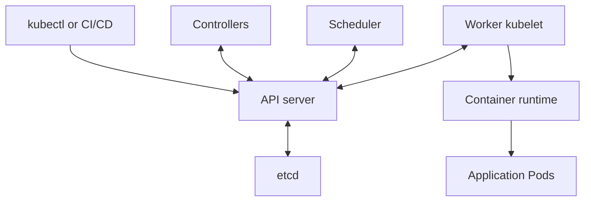

**1. Explain Kubernetes architecture.**

Kubernetes consists of a **control plane**, which manages the cluster, and **worker nodes**, which run application workloads.

The system continuously compares the desired state with the actual state and takes action to reconcile differences.

| Location | Component | Responsibility |
|---|---|---|
| Control plane | **kube-apiserver** | Entry point for Kubernetes API requests; handles validation, authentication, and authorization |
| Control plane | **etcd** | Stores Kubernetes objects and cluster state |
| Control plane | **kube-scheduler** | Selects suitable nodes for unscheduled Pods |
| Control plane | **kube-controller-manager** | Runs controllers that reconcile resources, such as Deployments and nodes |
| Control plane | **cloud-controller-manager** | Optional integration with cloud infrastructure |
| Worker | **kubelet** | Ensures containers belonging to assigned Pods are running |
| Worker | **Container runtime** | Runs containers, commonly through containerd or CRI-O |
| Worker | **kube-proxy or an alternative data plane** | Implements Service traffic handling |

These are the principal Kubernetes components. [Kubernetes](https://kubernetes.io/docs/concepts/overview/components/?utm_source=chatgpt.com)



When you apply a Deployment:

1. `kubectl` sends the manifest to the API server.
2. The API server validates and stores it.
3. Controllers create the required ReplicaSet and Pods.
4. The scheduler assigns the Pods to suitable nodes.
5. Each node’s kubelet starts its assigned containers through the runtime.
6. The kubelet reports their status to the API server.

Control-plane components and nodes communicate through the API server. Workers do not connect directly to etcd. [Kubernetes](https://kubernetes.io/docs/concepts/architecture/control-plane-node-communication/?utm_source=chatgpt.com)

Other important supporting components include:

- **CNI implementation:** Provides Pod networking.
- **CoreDNS:** Provides cluster DNS and service discovery.
- **CSI drivers:** Integrate supported storage systems.

If a container crashes, the kubelet can restart it according to its restart policy. If a managed Pod disappears, its controller creates a replacement.

**2. What is the difference between a Deployment and a StatefulSet?**

A Deployment manages **interchangeable replicas**. A StatefulSet manages replicas that need **stable individual identities**.

| Aspect | Deployment | StatefulSet |
|---|---|---|
| Typical workloads | Web applications, APIs, background workers | Database members, brokers, distributed systems |
| Pod names | Generated names, such as `web-7c8d4f6b9-x2abc` | Ordinal names, such as `mysql-0`, `mysql-1` |
| Replica identity | Replicas are generally interchangeable | Each replica has a persistent identity |
| Network identity | Usually accessed through a shared Service | Can provide stable per-Pod DNS through a headless Service |
| Per-replica storage | No native claim-template mechanism | Supports `volumeClaimTemplates` |
| Startup and scaling | No ordinal ordering guarantee | Ordered behavior by default |
| Update strategies | `RollingUpdate` or `Recreate` | `RollingUpdate` or `OnDelete` |

These differences determine which controller fits an application’s lifecycle requirements. [Kubernetes](https://kubernetes.io/docs/concepts/workloads/controllers/deployment/?utm_source=chatgpt.com)

For example, a StatefulSet can associate:

| Pod | PersistentVolumeClaim |
|---|---|
| `mysql-0` | `data-mysql-0` |
| `mysql-1` | `data-mysql-1` |

If `mysql-1` is replaced, its replacement retains that ordinal identity and reconnects to its existing storage association.

Important points:

- A Deployment **can use a PVC** and run a stateful application.
- StatefulSets provide additional identity, storage, and lifecycle guarantees.
- A StatefulSet Pod can be recreated on a different eligible node.
- StatefulSet does not configure database replication or failover; the application or an operator must handle those functions.

**3. Explain Docker networking, its types, and the default network.**

Docker networking controls how containers communicate with each other, the host, and external systems.

For ordinary Linux Docker Engine bridge networking, containers have separate network namespaces, virtual interfaces, and IP addresses.

| Network driver or mode | How it works | Typical use |
|---|---|---|
| **bridge** | Connects containers through a virtual bridge on one Docker host | Applications running on a single host |
| **host** | Shares the host’s network namespace | Workloads requiring direct host networking |
| **none** | Provides no external network connectivity; loopback remains available | Isolated workloads |
| **overlay** | Connects containers across Docker hosts | Multi-host networking, commonly Docker Swarm |
| **macvlan** | Gives containers their own MAC addresses on the physical network | Legacy applications requiring direct LAN presence |
| **ipvlan** | Provides container addressing while sharing the parent interface’s MAC | Underlay network integration |

Docker provides these built-in networking options and supports additional plugins. [Docker Docs](https://docs.docker.com/engine/network/drivers/?utm_source=chatgpt.com)

**Default network**

On standard Linux Docker Engine, a container started without `--network` joins the network named **`bridge`**.

```bash
docker run -d --name web nginx
docker network inspect bridge
```

A user-defined bridge is usually preferable for an application:

```bash
docker network create app-net

docker run -d \
  --name web \
  --network app-net \
  -p 8080:80 \
  nginx
```

User-defined bridges provide automatic DNS resolution between containers using their names or aliases. The default bridge does not provide the same automatic container-name discovery. [Docker Docs](https://docs.docker.com/engine/network/drivers/bridge/?utm_source=chatgpt.com)

In the example, `8080:80` publishes host port **8080** to container port **80**.

Two common interview distinctions:

- `EXPOSE` documents an intended container port; it does not publish it.
- `localhost` inside a normally isolated container refers to that container’s network namespace.

Port publishing is controlled through options such as `-p`. [Docker Docs](https://docs.docker.com/engine/network/?utm_source=chatgpt.com)

**4. What are Terraform provisioners?**

Provisioners execute commands or copy files as part of a resource’s creation or destruction lifecycle.

Providers manage infrastructure through APIs. Provisioners perform additional operations that Terraform cannot fully model as managed resource state.

| Provisioner | Purpose | Execution location |
|---|---|---|
| **local-exec** | Runs a command or script | The machine executing Terraform |
| **remote-exec** | Runs commands on a remote resource | Remote machine, using a configured connection |
| **file** | Copies files or directories | From the Terraform runner to a remote machine |

For `remote-exec` and `file`, you generally need connection settings, credentials, and network reachability. [HashiCorp Developer](https://developer.hashicorp.com/terraform/language/provisioners?utm_source=chatgpt.com)

Minimal example:

```hcl
resource "terraform_data" "example" {
  provisioner "local-exec" {
    command = "echo 'Executing on the Terraform runner'"
  }
}
```

If Terraform runs in Jenkins, this command runs on the relevant Jenkins agent—not automatically on an EC2 instance.

Key behavior:

- Creation-time provisioners normally run when their containing resource is created.
- They do not automatically rerun on every `terraform apply`.
- By default, a failed creation-time provisioner can mark the resource as tainted, leading to replacement on a later apply.

Use provisioners when suitable alternatives are unavailable. Prefer mechanisms such as **cloud-init/user data, prebuilt machine images, or Ansible** for configuration management because Terraform cannot reliably predict a script’s side effects. [HashiCorp Developer](https://developer.hashicorp.com/terraform/language/provisioners?utm_source=chatgpt.com)

**5. What is a Terraform state file?**

Terraform state records the relationship between resources declared in your configuration and actual infrastructure objects.

For example:

```text
aws_instance.web → EC2 instance i-0123456789abcdef0
```

Without this association, Terraform would not know which existing instance belongs to `aws_instance.web`.

State also records resource attributes, metadata, and output values. Terraform uses it alongside configuration and provider information to determine required changes. [HashiCorp Developer](https://developer.hashicorp.com/terraform/language/state?utm_source=chatgpt.com)

With the local backend, state is normally stored in `terraform.tfstate`. For team workflows, use a secured remote backend with locking and recovery capabilities.

Example S3 backend:

```hcl
terraform {
  backend "s3" {
    bucket       = "company-terraform-state"
    key          = "prod/application/terraform.tfstate"
    region       = "ap-south-1"
    encrypt      = true
    use_lockfile = true
  }
}
```

The bucket must already exist, and the Terraform execution identity needs appropriate permissions.

Current Terraform supports native S3 lockfiles through `use_lockfile`. Enable bucket versioning for recovery; DynamoDB-based locking for this backend is deprecated. [HashiCorp Developer](https://developer.hashicorp.com/terraform/language/backend/s3?utm_source=chatgpt.com)

Important practices:

- Separate state according to environment, ownership, and infrastructure boundaries.
- Restrict access and encrypt stored state.
- Keep state out of source control.
- Avoid manually editing its JSON.
- Preserve recoverable versions or backups.

State can contain secrets. Marking a value `sensitive` generally redacts its display; it does not by itself prevent that value from being stored in state. [HashiCorp Developer](https://developer.hashicorp.com/terraform/language/manage-sensitive-data?utm_source=chatgpt.com)

Useful commands:

```bash
terraform state list
terraform state show aws_instance.web
```

If state is lost, restore a valid backup. If none exists, reconstruct resource associations through imports and matching configuration before applying changes.

**6. What is the difference between a Docker image and a container?**

An **image** is the packaged application artifact. A **container** is an instance created from that image.

| Aspect | Image | Container |
|---|---|---|
| Contains | Application files, dependencies, and configuration | Image contents plus runtime configuration and a writable layer |
| Lifecycle | Built, tagged, pushed, pulled, deleted | Created, started, stopped, restarted, deleted |
| Running processes | None by itself | Runs processes when started |
| Mutability | Image content is immutable | Writable layer can change |
| Reuse | One image can create many containers | Each container is a separate instance |

Images consist of filesystem layers and configuration. Containers add execution and isolation around that packaged content. [Docker Docs](https://docs.docker.com/get-started/docker-concepts/the-basics/what-is-an-image/?utm_source=chatgpt.com)

Assuming the application listens on port 8080:

```bash
# Build one image
docker build -t shop-api:1.0 .

# Create two containers from it
docker run -d --name shop-1 -p 8080:8080 shop-api:1.0
docker run -d --name shop-2 -p 8081:8080 shop-api:1.0
```

The containers share image layers but have separate writable layers, processes, and normally separate network namespaces.

Inspect them with:

```bash
docker image ls
docker ps -a
```

Additional distinctions:

- A container can exist in a stopped state.
- Linux containers share the Linux kernel of the host or hosting VM.
- Image content is immutable, but a tag such as `latest` can be reassigned.
- Removing a container removes its writable layer; mounted storage has a separate lifecycle.

**7. What is the difference between a Docker bind mount and a volume?**

Both expose storage inside a container. The main difference is **who manages the storage location**.

| Aspect | Bind mount | Docker volume |
|---|---|---|
| Source | An explicitly specified host file or directory | Storage managed by Docker |
| Path selection | You choose the host path | Docker manages the storage location |
| Common use | Source code, configuration files, development | Persistent application data |
| Host dependency | Requires the specified host path | Managed through Docker’s volume interface |
| Management | Host filesystem tools | Docker CLI, API, and volume drivers |

**Bind-mount example**

Assuming the source directory exists:

```bash
docker run \
  --mount type=bind,source="$PWD/config",target=/app/config,readonly \
  my-app:1.0
```

The container reads the host’s configuration directory at `/app/config`. The `readonly` option prevents writes through that mount.

Bind-mount paths refer to the **Docker daemon’s host**, which matters when your client connects to a remote Docker daemon. [Docker Docs](https://docs.docker.com/engine/storage/bind-mounts/?utm_source=chatgpt.com)

**Named-volume example**

```bash
docker volume create app-data

docker run \
  --mount type=volume,source=app-data,target=/app/data \
  my-app:1.0
```

Docker manages `app-data`, and its contents can survive removal of the container. You can inspect it with:

```bash
docker volume inspect app-data
```

Volumes have a lifecycle independent of the containers that use them. A default local volume remains tied to its Docker host; it does not automatically provide shared storage or backups across hosts. [Docker Docs](https://docs.docker.com/engine/storage/volumes/?utm_source=chatgpt.com)
