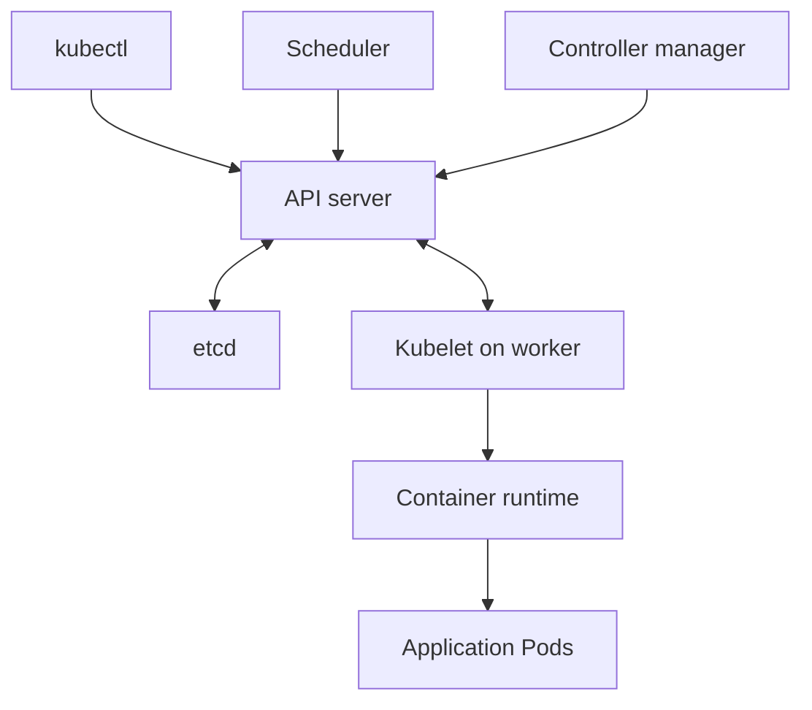
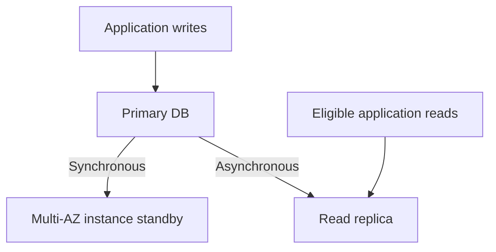

Below are answers to all **28 Verizon questions**, with examples and commands. For questions about your project, use your actual counts, versions, and responsibilities.

The complete guide also covers the preceding **21 Synechron questions**:

- :chatgpt-content-reference{index="28"}[verizon-synechron-devops-study-guide.md](sandbox:/workspace/scratch/8dc6806ebb9b/verizon-synechron-devops-study-guide.md)
- synechron-3yr-devops-examples.zip[synechron-3yr-devops-examples.zip](sandbox:/workspace/scratch/8dc6806ebb9b/synechron-3yr-devops-examples.zip)

---

**1. What are the disadvantages of each Kubernetes deployment model?**

If the interviewer means **deployment strategies**:

| Strategy | How it works | Disadvantages |
|---|---|---|
| **Recreate** | Stop old Pods, then create new ones | Causes downtime; startup failure extends the outage |
| **Rolling update** | Gradually replace old Pods | Versions coexist, so APIs/database schemas must remain compatible; needs sufficient capacity |
| **Blue-green** | Run two versions and switch traffic | Additional infrastructure cost; database changes can make rollback difficult; existing connections may remain on the old version |
| **Canary** | Send limited traffic to the new version | Requires traffic control and reliable monitoring; a small sample may miss problems |

Kubernetes Deployment directly supports `Recreate` and `RollingUpdate`. Blue-green and canary usually involve multiple Deployments plus a Service, Gateway, ingress, or rollout controller.

For example, `maxUnavailable: 0` and `maxSurge: 1` allow a replacement Pod to become ready before an old Pod is removed. Availability still depends on capacity, readiness checks, and application behavior. [Kubernetes](https://kubernetes.io/docs/concepts/workloads/controllers/deployment/?utm_source=chatgpt.com)

If “models” means **workload controllers**, Deployment lacks stable per-replica identity, StatefulSet introduces storage/rollout complexity, and DaemonSet scales with nodes rather than incoming requests.

---

**2. Which Kubernetes architecture component does not run as a Pod?**

The usual answer is **kubelet**. It normally runs as a host service, often managed by systemd. The container runtime, such as containerd, also normally runs on the host.

In a typical kubeadm cluster, API server, scheduler, controller manager, and etcd run as **static Pods**. Installation methods differ; managed services such as EKS manage the control plane separately. [Kubernetes](https://kubernetes.io/docs/concepts/architecture/?utm_source=chatgpt.com)



The scheduler chooses a node; kubelet on that node starts and supervises the containers.

---

**3. Explain Kubernetes QoS.**

QoS means **Quality of Service**. For conventional container-level resource configuration:

| Class | Conditions | Example |
|---|---|---|
| **Guaranteed** | Every container has CPU and memory requests/limits, with request equal to limit | CPU: `500m/500m`; memory: `256Mi/256Mi` |
| **Burstable** | Some CPU/memory resources are specified, but Guaranteed conditions are not met | CPU: `100m/500m`; memory: `128Mi/256Mi` |
| **BestEffort** | No CPU or memory requests/limits | No resource configuration |

Check the class:

```bash
kubectl get pod my-pod -n app \
  -o jsonpath='{.status.qosClass}{"\n"}'
```

QoS influences resource-pressure handling. Eviction also considers usage relative to requests and Pod priority; it is not simply an unconditional ordering by class. Guaranteed does not protect against node failure or exceeding a memory limit.

Newer Pod-level resource settings can also participate in classification. [Kubernetes](https://kubernetes.io/docs/tasks/configure-pod-container/quality-service-pod/?utm_source=chatgpt.com)

---

**4. What are the disadvantages of EBS volumes in EKS?**

The main limitations are:

- **AZ dependency:** an EBS volume cannot attach to a node in another Availability Zone.
- **Limited sharing:** typical EBS filesystem PVCs use `ReadWriteOnce`, allowing read-write mounting on one node.
- **Recovery delays:** moving storage between nodes can involve attach/detach delays.
- **Operational dependencies:** EBS CSI driver and AWS permissions must work.
- **Fargate limitation:** EBS volumes cannot be mounted by EKS Fargate Pods.

`ReadWriteOnce` means **one node**, not necessarily one Pod.

Selected `io1`/`io2` volumes support Multi-Attach within the same AZ, but concurrent writers require appropriate application/filesystem coordination. This is not ordinary shared RWX storage.

For a shared filesystem across nodes/AZs, consider EFS. For a database, design replication and recovery separately. [Amazon EKS](https://docs.aws.amazon.com/eks/latest/userguide/ebs-csi.html?utm_source=chatgpt.com)

---

**5. Why don’t application Pods run on control-plane nodes by default?**

Kubeadm normally applies this taint:

```text
node-role.kubernetes.io/control-plane:NoSchedule
```

Ordinary application Pods do not tolerate it. This protects critical control-plane services from application resource contention.

```bash
kubectl get nodes \
  -o custom-columns=NAME:.metadata.name,TAINTS:.spec.taints
```

A toleration permits scheduling on such a node; it does not force it. Allowing this can be reasonable in a single-node lab, but production needs explicit isolation and capacity planning.

EKS application Pods do not run on its AWS-managed control plane. [Kubernetes](https://kubernetes.io/docs/setup/production-environment/tools/kubeadm/create-cluster-kubeadm/?utm_source=chatgpt.com)

---

**6. Explain requests and limits.**

- **Request:** resource requirement used by the scheduler for placement.
- **Limit:** constraint on resource consumption.

CPU limits generally cause **throttling**. Exceeding a memory limit can cause an **OOM kill**.

```yaml
apiVersion: v1
kind: Pod
metadata:
  name: resources-demo
spec:
  containers:
    - name: web
      image: nginx:alpine
      resources:
        requests:
          cpu: "100m"
          memory: "128Mi"
        limits:
          cpu: "500m"
          memory: "256Mi"
```

Here:

- `100m` = 0.1 CPU.
- `500m` = 0.5 CPU.
- Memory request = 128 MiB.
- Memory limit = 256 MiB.

This is a Burstable Pod. A memory request is a scheduling budget, not memory physically allocated in advance. Size resources from measured usage and peaks. [Kubernetes](https://kubernetes.io/docs/tasks/configure-pod-container/assign-cpu-resource/?utm_source=chatgpt.com)

---

**7. How do you ensure container security while writing a Dockerfile?**

Use a maintained minimal base, run as non-root, install only necessary dependencies, exclude credentials, and scan the final image.

Example for a Flask application whose requirements include Gunicorn:

```dockerfile
FROM python:3.12-slim

WORKDIR /app
COPY requirements.txt .
RUN pip install --no-cache-dir -r requirements.txt

RUN groupadd --gid 10001 appgroup \
    && useradd --uid 10001 --gid appgroup \
       --no-create-home --shell /usr/sbin/nologin appuser

COPY --chown=10001:10001 app.py .
USER 10001:10001

EXPOSE 8000
CMD ["gunicorn", "--bind", "0.0.0.0:8000", "app:app"]
```

For production:

- Pin an approved base-image digest and update it regularly.
- Use multi-stage builds to exclude build tools.
- Exclude `.env`, credentials, and unnecessary files using `.dockerignore`.
- Use BuildKit secret mounts for build secrets; avoid secret-bearing `ARG` or `ENV`.
- Apply runtime restrictions such as dropping capabilities and disabling privilege escalation.

A Dockerfile alone does not enforce complete runtime security. [Docker Docs](https://docs.docker.com/build/building/best-practices/?utm_source=chatgpt.com)

---

**8. How many clusters and Pods per node are in your project?**

Give actual project values:

> “We operate [number] clusters for [environments/regions]. Worker nodes use [instance types]. The observed Pod count per node is approximately [range], depending on resource requests, networking limits, and placement rules.”

Useful commands:

```bash
kubectl get nodes
kubectl get pods -A -o wide

kubectl get nodes \
  -o custom-columns=NODE:.metadata.name,POD_CAPACITY:.status.allocatable.pods
```

There is no universal Pod-per-node number. Capacity depends on kubelet configuration, CPU/memory requests, CNI/IP availability, and instance networking limits.

---

**9. Which Kubernetes version have you used? Have you upgraded it?**

State your real version and contribution:

> “I worked with version [X]. I [owned/assisted with] upgrading to [Y], including compatibility checks, node replacement, and post-upgrade validation.”

Check versions:

```bash
kubectl version

kubectl get nodes \
  -o custom-columns=NODE:.metadata.name,KUBELET:.status.nodeInfo.kubeletVersion
```

Explain the upgrade approach:

1. Check deprecated APIs and component compatibility.
2. Back up application data and relevant configuration.
3. Rehearse in nonproduction.
4. Ensure replicas, spare capacity, and disruption budgets.
5. Upgrade through supported version steps.
6. Update compatible add-ons and workers gradually.
7. Validate networking, storage, DNS, workloads, latency, and errors.

For EKS, use its managed upgrade procedure. **Current EKS documentation permits an eligible rollback to the previous minor version within seven days of an upgrade**, with compatibility requirements; add-ons and some node types need separate handling. [Amazon EKS](https://docs.aws.amazon.com/eks/latest/userguide/update-cluster.html?utm_source=chatgpt.com)

---

**10. How do you switch between Kubernetes clusters?**

```bash
kubectl config get-contexts
kubectl config current-context
kubectl config use-context production
```

For an individual command:

```bash
kubectl --context=development get pods -n app
```

Explicit `--context` is useful in automation because it makes the target visible. Switching context does not grant access. [Kubernetes](https://kubernetes.io/docs/concepts/configuration/organize-cluster-access-kubeconfig/?utm_source=chatgpt.com)

---

**11. What is a Kubernetes context?**

A context combines:

| Component | Meaning |
|---|---|
| Cluster | API endpoint and trust information |
| User | Authentication configuration |
| Namespace | Default namespace |

For example, `production-payments` could identify a production cluster, an AWS-role credential configuration, and the `payments` namespace.

```bash
kubectl config set-context production --namespace=payments
```

This updates the namespace of an existing named context. RBAC still controls permitted operations. [Kubernetes](https://kubernetes.io/docs/concepts/configuration/organize-cluster-access-kubeconfig/?utm_source=chatgpt.com)

---

**12. Is etcd SQL or NoSQL? Why?**

etcd is a **distributed key-value store**, commonly classified as NoSQL.

It stores keys and values rather than relational tables queried through SQL. Kubernetes uses it to persist cluster state.

etcd supports transactions, revisions, watches, and strong consistency through Raft consensus. NoSQL does not automatically mean eventual consistency.

A three-member etcd cluster needs two members for quorum. Losing quorum prevents normal progress of state-changing operations. [etcd](https://etcd.io/docs/v3.6/learning/data_model/?utm_source=chatgpt.com)

---

**13. Init container versus sidecar container**

| Init container | Sidecar |
|---|---|
| Regular init containers complete before application containers start | Runs alongside the application |
| Prepares files, validates configuration, or performs startup prerequisites | Ships logs, proxies traffic, or supplies another supporting service |
| Declared under `initContainers` | Traditionally under `containers`; native sidecars use `initContainers` with `restartPolicy: Always` |

Example: an init container prepares configuration in a shared volume; the application then reads it. A logging sidecar continuously forwards logs.

Modern native sidecars are an important exception to “all init containers run to completion”:

```yaml
initContainers:
  - name: helper
    image: busybox:1.37
    restartPolicy: Always
    command: ["sh", "-c", "while true; do sleep 3600; done"]
```

This demonstrates lifecycle behavior; a production sidecar would run a useful supporting process. [Kubernetes](https://kubernetes.io/docs/concepts/workloads/pods/init-containers/?utm_source=chatgpt.com)

---

**14. Liveness versus readiness probes**

| Probe | Question | Failure behavior |
|---|---|---|
| Readiness | Can this Pod receive traffic? | Marks it unready; removes it from ordinary Service traffic |
| Liveness | Is the container stuck? | Terminates/restarts it according to restart policy |
| Startup | Has initialization completed? | Allows startup time before liveness/readiness checks begin |

Example container configuration:

```yaml
readinessProbe:
  httpGet:
    path: /readyz
    port: 8000
  periodSeconds: 5

livenessProbe:
  httpGet:
    path: /livez
    port: 8000
  periodSeconds: 10
  failureThreshold: 3
```

The application must implement these endpoints meaningfully.

If liveness passes but readiness fails, the container normally keeps running while ordinary Service traffic stops reaching it. Avoid making a shared database outage trigger liveness failures across every replica. [Kubernetes](https://kubernetes.io/docs/tasks/configure-pod-container/configure-liveness-readiness-startup-probes/?utm_source=chatgpt.com)

---

**15. What is OOM? How do you resolve it?**

OOM means **out of memory**. Distinguish container memory-limit exhaustion from node-level memory pressure and kubelet eviction.

Investigate:

```bash
kubectl describe pod my-pod -n app
kubectl logs my-pod -n app -c web --previous
kubectl top pod my-pod -n app --containers
kubectl describe node worker-1
```

Check termination reason, historical memory usage, resource settings, application logs, and node events. Current metrics may miss the peak before a restart.

Resolve the cause by:

- Fixing leaks or unbounded caches.
- Reducing worker/concurrency counts.
- Setting application heap sizes below the container limit.
- Right-sizing requests/limits.
- Addressing node overpacking or insufficient capacity.

Exit code **137 means SIGKILL in common cases; it does not by itself prove OOM**. Confirm `OOMKilled` and supporting evidence. [Kubernetes](https://kubernetes.io/docs/tasks/configure-pod-container/assign-memory-resource/?utm_source=chatgpt.com)

---

**16. Hard link versus soft link in Linux**

| Property | Hard link | Soft/symbolic link |
|---|---|---|
| Reference | Same inode/data | Another path |
| Cross-filesystem | Normally no | Yes |
| Directory linking | Normally disallowed | Supported |
| Original name deleted | Still accesses the file | Can become dangling |
| Inode | Same | Different |

Example in a disposable directory:

```bash
printf 'hello\n' > original.txt
ln original.txt hard.txt
ln -s original.txt soft.txt

ls -li original.txt hard.txt soft.txt
rm original.txt
cat hard.txt
```

`hard.txt` remains readable. `soft.txt` points to a missing path. Data is reclaimed after the last hard link and relevant open references are gone. [Debian Manpages](https://manpages.debian.org/testing/coreutils/ln.1.en.html?utm_source=chatgpt.com)

---

**17. Explain Linux cron jobs.**

Cron schedules commands using five fields:

```text
minute hour day-of-month month day-of-week
```

Run a script every day at 02:00:

```cron
0 2 * * * /opt/app/report.sh >> /var/log/app-report.log 2>&1
```

Manage the user’s schedule:

```bash
crontab -l
crontab -e
```

Use absolute paths, appropriate permissions, logging, and an overlap-prevention mechanism such as `flock`. Check timezone configuration.

User crontabs have no username field; system crontabs commonly include one. Kubernetes CronJob is a separate controller. [Debian Manpages](https://manpages.debian.org/testing/cron/crontab.5.en.html?utm_source=chatgpt.com)

---

**18. AWS Secrets Manager versus Parameter Store**

| Aspect | Secrets Manager | Parameter Store |
|---|---|---|
| Main purpose | Secret/credential management | Configuration and optional secrets |
| Encryption | AWS KMS | KMS for `SecureString` |
| Rotation | Managed rotation integrations/workflows | Requires custom automation for equivalent credential rotation |
| Typical values | Database passwords, API credentials | Endpoints, configuration, secure values |
| Pricing | Secret storage/API usage | Depends on tier, throughput/API options, and KMS usage |

Choose Secrets Manager when credential rotation is a central requirement. Parameter Store is useful for configuration and suitable secure values.

Both require least-privilege IAM and controlled KMS access. Parameter Store can store passwords; it is not always free under every usage model. [AWS Secrets Manager](https://docs.aws.amazon.com/secretsmanager/latest/userguide/intro.html?utm_source=chatgpt.com)

---

**19. Does Docker `-p` represent port or publish?**

It means **`--publish`**.

```bash
docker run --rm -p 127.0.0.1:8080:80 nginx:alpine
```

This publishes container port **80** on host loopback port **8080**.

- `-p`: explicitly publish a port.
- `-P`: publish exposed ports using automatically assigned host ports.
- Dockerfile `EXPOSE`: metadata; does not publish the port itself.

Omitting the host IP normally publishes on host interfaces, potentially exposing the service more broadly. [Docker Docs](https://docs.docker.com/engine/containers/run/?utm_source=chatgpt.com)

---

**20. Is Linux an OS or a kernel?**

Technically, **Linux is the kernel**. It manages processes, memory, devices, filesystems, and system calls.

A distribution such as Ubuntu or RHEL combines that kernel with userspace software to form a complete operating system.

In everyday usage, “Linux” also refers to this operating-system family. [kernel.org](https://www.kernel.org/linux.html?utm_source=chatgpt.com)

---

**21. Explain the Linux filesystem hierarchy.**

| Directory | Purpose |
|---|---|
| `/` | Root of the filesystem tree |
| `/etc` | Configuration |
| `/home` | Ordinary users’ home directories |
| `/root` | Root user’s home |
| `/usr` | Installed userspace software/libraries |
| `/var` | Logs, caches, spools, changing service data |
| `/tmp` | Temporary files |
| `/run` | Runtime state |
| `/dev` | Device nodes |
| `/proc` | Process/kernel information |
| `/sys` | Kernel/device interfaces |
| `/boot` | Boot-related files |
| `/opt` | Additional application packages |
| `/mnt` | Temporary/manual mounts |
| `/media` | Removable-media mounts |

`/usr` does not mean user home directories. Modern distributions often implement `/bin`, `/sbin`, and `/lib` as links into `/usr`. [refspecs.linuxfoundation.org](https://refspecs.linuxfoundation.org/FHS_3.0/fhs/ch03.html?utm_source=chatgpt.com)

---

**22. Other ways to connect to EC2 without a PEM key**

The main options are:

1. **Session Manager:** requires SSM Agent, appropriate instance/operator IAM permissions, and connectivity to SSM endpoints.
2. **EC2 Instance Connect:** supplies a temporary SSH public key; requires supported configuration, permissions, and network connectivity.
3. **Another authorized access path:** an existing key/user, bastion, or configured serial-console recovery.
4. **Offline root-volume recovery:** for suitable EBS-backed Linux instances, attach the root volume to a recovery instance and update `authorized_keys`. This involves downtime.

Example:

```bash
aws ssm start-session --target i-0123456789abcdef0
```

The local CLI needs the Session Manager plugin. Losing a key does not bypass authentication; AWS cannot provide the original private key again. [Amazon Elastic Compute Cloud](https://docs.aws.amazon.com/AWSEC2/latest/UserGuide/connect-with-systems-manager-session-manager.html?utm_source=chatgpt.com)

---

**23. How do you scale RDS vertically and horizontally?**

**Vertical scaling:** change the DB instance class for more CPU/memory.

Steps: identify the bottleneck, tune queries where appropriate, confirm supported classes and backups, schedule the change, then monitor the result.

```bash
aws rds modify-db-instance \
  --db-instance-identifier app-db \
  --db-instance-class db.r6g.large \
  --no-apply-immediately
```

The class is illustrative. Changes can involve interruption, restart, or failover. With this option, the modification remains pending until its maintenance window.

**Horizontal read scaling:** create read replicas on supported engines and route eligible reads to them.

```bash
aws rds create-db-instance-read-replica \
  --db-instance-identifier app-db-read-1 \
  --source-db-instance-identifier app-db \
  --db-instance-class db.r6g.large
```

Check backup prerequisites, replica availability, and replication lag. Writes remain on the primary; adding a read replica does not automatically scale writes.

RDS storage autoscaling increases storage capacity, not CPU/memory. [Amazon Relational Database Service](https://docs.aws.amazon.com/AmazonRDS/latest/UserGuide/Overview.DBInstance.Modifying.html?utm_source=chatgpt.com)

---

**24. RDS Multi-AZ versus read replicas**

For a **traditional Multi-AZ DB instance**:

| Aspect | Multi-AZ | Read replica |
|---|---|---|
| Purpose | High availability | Read scaling |
| Replication | Synchronous | Generally asynchronous |
| Secondary serves reads | No | Yes |
| Failover | Managed automatic failover | Promotion/routing must be designed |
| Application endpoint | Reuses DB endpoint after failover | Separate replica endpoint |

An important exception: **Multi-AZ DB clusters have readable standby instances**. Aurora also has a different architecture. Specify the deployment type when answering. [Amazon Relational Database Service](https://docs.aws.amazon.com/AmazonRDS/latest/UserGuide/Concepts.MultiAZ.html?utm_source=chatgpt.com)



---

**25. How do you delete old or untagged ECR images?**

Use an **ECR lifecycle policy**, preview it, and retain images needed for running workloads and rollback.

Example: expire untagged images older than seven days **since push**:

```json
{
  "rules": [
    {
      "rulePriority": 1,
      "description": "Expire old untagged images",
      "selection": {
        "tagStatus": "untagged",
        "countType": "sinceImagePushed",
        "countUnit": "days",
        "countNumber": 7
      },
      "action": {
        "type": "expire"
      }
    }
  ]
}
```

Save as `ecr-lifecycle.json`, then preview:

```bash
aws ecr start-lifecycle-policy-preview \
  --repository-name my-app \
  --lifecycle-policy-text file://ecr-lifecycle.json

aws ecr get-lifecycle-policy-preview --repository-name my-app
```

After the preview reaches `COMPLETE` and its results are reviewed:

```bash
aws ecr put-lifecycle-policy \
  --repository-name my-app \
  --lifecycle-policy-text file://ecr-lifecycle.json
```

This replaces the existing policy, so merge existing rules first. Expiration normally occurs within 24 hours of eligibility. ECR does not know whether an untagged digest is still needed by an application. [Amazon ECR](https://docs.aws.amazon.com/AmazonECR/latest/userguide/lifecycle_policy_examples.html?utm_source=chatgpt.com)

---

**26. What are the types of variables in Linux?**

Usually the question means **shell variables and parameters**:

| Type | Example |
|---|---|
| Shell variable | `APP_ENV=dev` |
| Exported environment variable | `export APP_ENV` |
| Bash function-local variable | `local attempts=3` |
| Read-only variable | `readonly APP_REGION=us-east-1` |
| Positional parameter | `$1`, `$2` |
| Special parameter | `$?`, `$#`, `$@`, `$$`, `$!` |

```bash
APP_ENV=dev
export APP_ENV

deploy() {
  local attempts=3
  printf '%s %s\n' "$APP_ENV" "$attempts"
}
deploy
```

Exported values are inherited by subsequently launched child processes. Bash also supports arrays and integer attributes. A shell-global variable is not automatically visible to all processes on the machine. [Debian Manpages](https://manpages.debian.org/testing/bash/bash.1.en.html?utm_source=chatgpt.com)

---

**27. `kill` versus `kill -9`; how many signals exist?**

- `kill PID` normally sends **SIGTERM**, allowing application cleanup.
- `kill -9 PID` sends **SIGKILL**, which cannot be caught, blocked, or ignored.

```bash
kill -TERM 12345
# If forced termination is justified:
kill -KILL 12345

kill -l
```

The common interview answer is **64 signal numbers on common Linux systems**. Some numbers are reserved internally by libc; typical glibc systems reserve 32 and 33, so user-facing lists can contain fewer names. Architecture/implementation differences exist.

```bash
kill -0 12345
```

Signal zero checks existence/permission to signal; it does not deliver a signal. [Debian Manpages](https://manpages.debian.org/testing/manpages/signal.7.en.html?utm_source=chatgpt.com)

---

**28. How do you check processes without `ps` or `top`?**

```bash
pgrep -a nginx
pidof nginx

# Inspect an identified PID:
cat /proc/12345/status
cat /proc/12345/comm

# Current shell's jobs:
jobs -l

# A systemd-managed service:
systemctl status nginx
```

- `pgrep -a`: matching PIDs and command lines.
- `pidof`: matching PIDs.
- `/proc/PID/status`: process state and metadata.
- `/proc/PID/comm`: short process name.
- `jobs`: only jobs belonging to the current shell.

Process inspection is subject to permissions, and processes can exit while you inspect them. [Debian Manpages](https://manpages.debian.org/testing/procps/pgrep.1.en.html?utm_source=chatgpt.com)

The guide’s shell syntax and YAML/JSON examples were checked, alongside local link, variable-scope, and signal demonstrations. Cloud and cluster commands are examples; they were not executed against live infrastructure.
