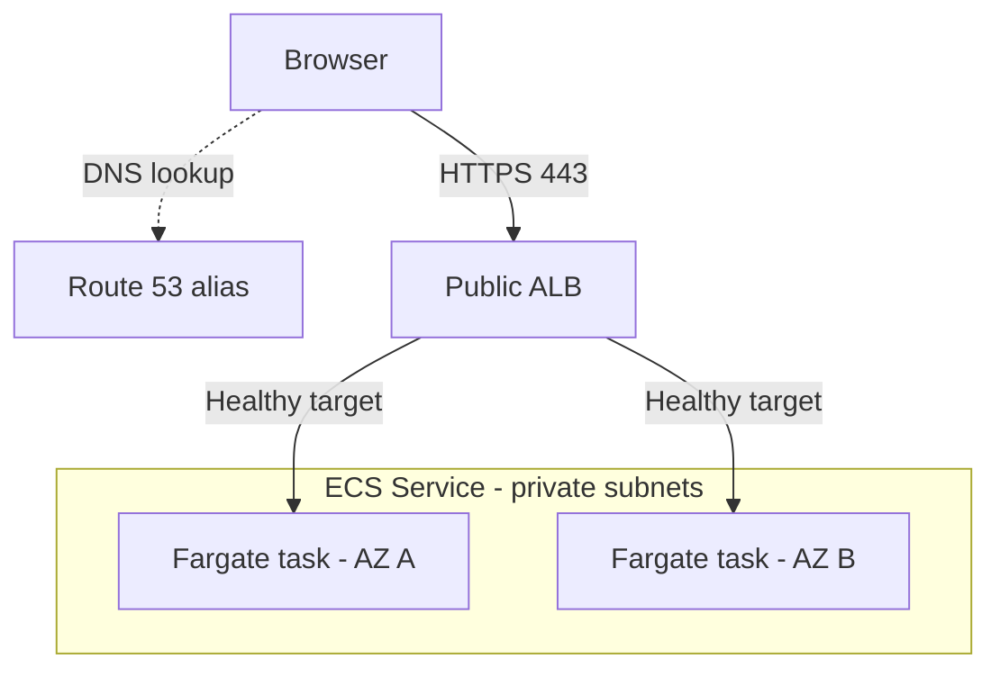

Here are answers to all **19 Virtusa questions**, with the implementation details expected in a Tech Lead interview.

The complete guide includes additional manifests and examples: virtusa-tech-lead-devops-study-guide.md[virtusa-tech-lead-devops-study-guide.md](sandbox:/workspace/scratch/8dc6806ebb9b/virtusa-tech-lead-devops-study-guide.md).

---

**1. Deployment vs ReplicaSet vs DaemonSet vs StatefulSet**

| Resource | Responsibility | Typical use | Important YAML keywords |
|---|---|---|---|
| **Deployment** | Manages ReplicaSets and application rollouts | Stateless APIs, frontend applications | `replicas`, `selector`, `template`, `strategy`, `revisionHistoryLimit` |
| **ReplicaSet** | Maintains a specified number of matching Pods | Usually managed by a Deployment | `replicas`, `selector.matchLabels`, `template` |
| **DaemonSet** | Runs a Pod on each eligible node | Logging, monitoring, networking agents | `selector`, `template`, `updateStrategy`, node selection and tolerations |
| **StatefulSet** | Provides stable Pod identities and per-replica storage | Databases and other stateful systems | `serviceName`, `volumeClaimTemplates`, `podManagementPolicy`, `updateStrategy` |

A Deployment creates and manages ReplicaSets; the ReplicaSets maintain the Pods. Prefer a Deployment over a standalone ReplicaSet for ordinary application releases. [Kubernetes](https://kubernetes.io/docs/concepts/workloads/controllers/deployment/?utm_source=chatgpt.com)

For a Deployment, under `spec`:

```yaml
replicas: 3
strategy:
  type: RollingUpdate
  rollingUpdate:
    maxSurge: 1
    maxUnavailable: 0
```

This permits an additional Pod while keeping existing ready replicas available, provided sufficient capacity exists.

**Canary is not a native Deployment strategy value.** Deployment supports `RollingUpdate` and `Recreate`. Canary normally uses separate stable/canary Deployments and traffic splitting through a Gateway, ingress, load balancer, or rollout controller.

DaemonSet has no `replicas` field. StatefulSet provides identities such as `database-0`, but does not itself implement database replication, backups, or failover. [Kubernetes](https://kubernetes.io/docs/concepts/workloads/controllers/daemonset/?utm_source=chatgpt.com)

---

**2. What does `Chart.yaml` contain?**

The correct Helm filename is **`Chart.yaml`**, with a capital **C**. It contains chart metadata:

```yaml
apiVersion: v2
name: festival-web
description: Helm chart for the festival website
type: application
version: 0.1.0
appVersion: "1.0.0"
```

Important distinctions:

- `version`: chart package version.
- `appVersion`: application version metadata.
- `apiVersion: v2`: Helm chart format, not a Kubernetes resource API version.
- Optional fields include `dependencies`, `kubeVersion`, `maintainers`, and `sources`.

Changing `appVersion` does not automatically change the container image unless the templates use it. [Helm](https://helm.sh/docs/topics/charts/?utm_source=chatgpt.com)

---

**3. Which files are present in a Helm chart?**

| File/directory | Purpose |
|---|---|
| `Chart.yaml` | Chart metadata |
| `values.yaml` | Default configuration |
| `templates/` | Kubernetes manifest templates |
| `templates/_helpers.tpl` | Reusable named templates |
| `templates/NOTES.txt` | Optional release instructions |
| `charts/` | Dependency charts |
| `Chart.lock` | Dependency resolution lock |
| `crds/` | Optional CustomResourceDefinitions |
| `values.schema.json` | Optional values validation |
| `.helmignore` | Packaging exclusions |
| `README.md` | Documentation |

Common commands:

```bash
helm create festival-web
helm lint ./festival-web
helm template festival-web ./festival-web
```

The exact templates depend on the application. A chart might include Deployment, Service, HPA, Gateway/Ingress, and ConfigMap templates. [Helm](https://helm.sh/docs/helm/helm_create/?utm_source=chatgpt.com)

---

**4. What do you declare in `values.yaml`?**

Declare inputs that should be configurable across environments:

```yaml
replicaCount: 2

image:
  repository: yourorg/festival-web
  tag: "1.0.0"

service:
  type: ClusterIP
  port: 80

resources:
  requests:
    cpu: "100m"
    memory: "128Mi"
  limits:
    cpu: "500m"
    memory: "256Mi"

autoscaling:
  enabled: true
  minReplicas: 2
  maxReplicas: 30

existingSecret: festival-web-secrets
```

The templates must consume these keys; adding a value alone has no effect.

For example:

```helm
image: "{{ .Values.image.repository }}:{{ .Values.image.tag }}"
```

Deploy with environment overrides:

```bash
helm upgrade --install festival-web ./festival-web \
  --namespace production --create-namespace \
  -f values-production.yaml
```

The default filename is `values.yaml`; override files passed through `-f` can have other names.

Keep plaintext secrets out of committed values. When HPA manages replicas, avoid having Helm repeatedly force a fixed replica count. [Helm](https://helm.sh/docs/chart_template_guide/values_files/?utm_source=chatgpt.com)

---

**5. Node affinity vs Pod affinity**

**Node affinity** selects nodes using **node labels**.

Example: run application Pods on nodes labeled `nodepool=apps`.

```yaml
# Under Pod spec
affinity:
  nodeAffinity:
    requiredDuringSchedulingIgnoredDuringExecution:
      nodeSelectorTerms:
        - matchExpressions:
            - key: nodepool
              operator: In
              values:
                - apps
```

**Pod affinity** places Pods relative to **other Pods**, using a topology domain.

Example: prefer the same AZ as Pods labeled `app=cache`.

```yaml
affinity:
  podAffinity:
    preferredDuringSchedulingIgnoredDuringExecution:
      - weight: 100
        podAffinityTerm:
          labelSelector:
            matchLabels:
              app: cache
          topologyKey: topology.kubernetes.io/zone
```

- `required...`: hard scheduling constraint.
- `preferred...`: preference.
- `IgnoredDuringExecution`: relevant label changes do not automatically relocate existing Pods.

For availability, use Pod anti-affinity or topology spread constraints to distribute replicas. Hard constraints can leave Pods Pending when capacity is unavailable. [Kubernetes](https://kubernetes.io/docs/concepts/scheduling-eviction/assign-pod-node/?utm_source=chatgpt.com)

---

**6. What are taints and tolerations?**

A **taint** repels Pods from a node. A matching **toleration** permits scheduling there.

```bash
kubectl taint nodes worker-1 dedicated=platform:NoSchedule
```

Pod configuration:

```yaml
tolerations:
  - key: dedicated
    operator: Equal
    value: platform
    effect: NoSchedule
```

| Effect | Behavior |
|---|---|
| `NoSchedule` | Blocks new Pods without a matching toleration |
| `PreferNoSchedule` | Soft avoidance |
| `NoExecute` | Also evicts existing Pods that do not tolerate it |

A toleration does **not** force the Pod onto that node. For dedicated placement, combine it with a node label and required node affinity.

Example: taint GPU nodes so ordinary applications avoid them; GPU workloads receive matching tolerations and appropriate resource/node selection. [Kubernetes](https://kubernetes.io/docs/concepts/scheduling-eviction/taint-and-toleration/?utm_source=chatgpt.com)

---

**7. What command unlocks Terraform state?**

```bash
terraform force-unlock LOCK_ID
```

Use the lock identifier reported in the error, with the correct backend and workspace.

First confirm that the lock is stale and no Terraform operation still owns it. Unlocking a live operation can permit concurrent state writes.

The command removes the state lock; it does not modify infrastructure. Backend behavior differs, and another process’s local state cannot simply be unlocked this way. [HashiCorp Developer](https://developer.hashicorp.com/terraform/cli/commands/force-unlock?utm_source=chatgpt.com)

---

**8. What is a Terraform module?**

A module is a collection of Terraform configuration files in a directory. The working directory is the **root module**; reusable modules are called as **child modules**.

Typical files:

| File | Purpose |
|---|---|
| `main.tf` | Resources and module calls |
| `variables.tf` | Inputs |
| `outputs.tf` | Exported values |
| `versions.tf` | Terraform/provider requirements |
| `README.md` | Usage documentation |

Example:

```hcl
module "web" {
  source        = "./modules/web"
  ami_id        = var.approved_ami_id
  instance_type = "t3.small"
}
```

A good module exposes a clear interface and implements reviewed defaults for networking, identity, storage, tagging, and security.

Version reusable remote modules so consumers can upgrade deliberately. Child modules normally inherit provider configuration; backend configuration belongs to the root. [HashiCorp Developer](https://developer.hashicorp.com/terraform/language/modules?utm_source=chatgpt.com)

---

**9. Multiple EC2 instances were created manually. How do you update them through Terraform?**

First **import** them into Terraform state, then reconcile configuration and apply the intended changes.

For resources declared with `for_each`:

```bash
terraform init

terraform import 'aws_instance.web["web-1"]' i-0123456789abcdef0
terraform import 'aws_instance.web["web-2"]' i-0fedcba9876543210

terraform plan
```

The corresponding resource addresses must already exist in configuration.

The safe sequence is:

1. Inventory existing AMIs, instance types, networking, disks, IAM profiles, and tags.
2. Write configuration matching the current infrastructure.
3. Import each instance into one unique address.
4. Review the plan and resolve unintended changes.
5. Modify the desired setting.
6. Review and apply the new plan.

CLI import associates an existing object with state; it does not automatically produce complete matching configuration. Importing the same instance into multiple addresses is unsafe. [HashiCorp Developer](https://developer.hashicorp.com/terraform/cli/commands/import?utm_source=chatgpt.com)

Modern import blocks also support multiple resources:

```hcl
import {
  for_each = local.existing_instances
  to       = aws_instance.web[each.key]
  id       = each.value.id
}
```

Changing an instance type may involve stop/start; changing its AMI can require replacement. Import does not guarantee a disruption-free update. [HashiCorp Developer](https://developer.hashicorp.com/terraform/language/block/import?utm_source=chatgpt.com)

---

**10. Write a Python program to reverse a string**

```python
def reverse_string(text: str) -> str:
    result = []

    for index in range(len(text) - 1, -1, -1):
        result.append(text[index])

    return "".join(result)


if __name__ == "__main__":
    text = input("Enter a string: ")
    print(reverse_string(text))
```

Example:

```text
Input:  DevOps
Output: spOveD
```

Time complexity: **O(n)**. Additional space: **O(n)**.

The concise Python form is:

```python
reversed_text = text[::-1]
```

---

**11. List vs tuple in Python**

| Property | List | Tuple |
|---|---|---|
| Syntax | `[1, 2, 3]` | `(1, 2, 3)` |
| Mutable | Yes | No |
| Typical use | Changing collection | Fixed record/sequence |
| Hashable | No | Only if every element is hashable |
| Ordered/duplicates | Supported | Supported |

```python
servers = ["api-1", "api-2"]
servers.append("api-3")

database_endpoint = ("db.example.internal", 5432)
host, port = database_endpoint

single_item_tuple = ("production",)
```

The comma creates a single-item tuple.

Tuple immutability is not recursive: a mutable object inside a tuple can still change. [Python 3.15.0 documentation](https://docs.python.org/3/tutorial/datastructures.html?utm_source=chatgpt.com)

---

**12. Docker ENTRYPOINT vs CMD**

- **ENTRYPOINT:** defines the executable.
- **CMD:** provides the default command or arguments.

```dockerfile
ENTRYPOINT ["python", "app.py"]
CMD ["--port", "8080"]
```

For an application supporting those arguments:

```bash
docker run myapp:1.0.0
# python app.py --port 8080

docker run myapp:1.0.0 --port 9090
# python app.py --port 9090
```

Arguments after the image replace CMD while preserving ENTRYPOINT.

Override the executable explicitly:

```bash
docker run --rm --entrypoint /bin/sh myapp:1.0.0 \
  -c 'echo debug'
```

Prefer exec-form arrays for predictable argument handling and signal delivery. [Docker Docs](https://docs.docker.com/reference/dockerfile/?utm_source=chatgpt.com)

---

**13. Docker COPY vs RUN**

| Instruction | Purpose |
|---|---|
| `COPY` | Copies files into the image |
| `RUN` | Executes a command during image build |

```dockerfile
WORKDIR /app
COPY requirements.txt .
RUN pip install --no-cache-dir -r requirements.txt
COPY app.py .
```

This ordering helps caching: changing application code does not necessarily rerun dependency installation.

Both operate at build time. Container startup is configured using CMD/ENTRYPOINT. Filesystem changes from COPY/RUN contribute image layers. [Docker Docs](https://docs.docker.com/reference/dockerfile/?utm_source=chatgpt.com)

---

**14. Explain website traffic to ECS on Fargate. How is DNS configured?**

Fargate manages the underlying compute servers. You still configure networking, load balancing, DNS, certificates, IAM, and the application.

A typical architecture is:



Configure:

1. Fargate tasks using `awsvpc` networking.
2. An ECS Service maintaining the desired tasks.
3. An internet-facing ALB in public subnets.
4. An HTTPS listener with an ACM certificate.
5. A target group using **`ip` target type**.
6. A Route 53 alias pointing the website domain to the ALB.
7. Task security-group access from the ALB security group on the application port.

The browser resolves DNS, connects to the ALB, and the ALB forwards the request to a healthy task’s ENI IP/container port. Route 53 handles resolution; it does not proxy the HTTP request.

ECS registers and deregisters targets when tasks change, so the public hostname stays stable. [Amazon Elastic Container Service](https://docs.aws.amazon.com/AmazonECS/latest/developerguide/alb.html?utm_source=chatgpt.com)

Private tasks need appropriate outbound connectivity for images, logs, and secrets through NAT or applicable VPC endpoints. That outbound path is separate from ALB ingress.

A **task definition alone does not provide a website endpoint**; the Service and load-balancer integration supply the running service architecture. [Amazon Elastic Container Service](https://docs.aws.amazon.com/AmazonECS/latest/developerguide/fargate-task-networking.html?utm_source=chatgpt.com)

---

**15. What is an ECS task definition?**

A task definition is a **versioned blueprint** describing how a task runs.

It includes:

- Container images and names.
- CPU/memory.
- Network mode and port mappings.
- Environment variables and secret references.
- IAM roles.
- Logging, health checks, and volumes.

Example Fargate definition:

```json
{
  "family": "festival-web",
  "networkMode": "awsvpc",
  "requiresCompatibilities": ["FARGATE"],
  "cpu": "512",
  "memory": "1024",
  "executionRoleArn": "arn:aws:iam::123456789012:role/ecsTaskExecutionRole",
  "containerDefinitions": [
    {
      "name": "web",
      "image": "yourorg/festival-web:1.0.0",
      "essential": true,
      "portMappings": [
        {
          "containerPort": 8080,
          "protocol": "tcp"
        }
      ]
    }
  ]
}
```

The image and role are illustrative.

- **Task definition:** blueprint.
- **Task:** running instance.
- **Service:** maintains tasks and manages relevant deployment/load-balancer integration. [Amazon Elastic Container Service](https://docs.aws.amazon.com/AmazonECS/latest/developerguide/task_definitions.html?utm_source=chatgpt.com)

The **execution role** supports operations such as image pulls and log delivery. The **task role** gives application code permission to access AWS services. [Amazon Elastic Container Service](https://docs.aws.amazon.com/AmazonECS/latest/developerguide/task_execution_IAM_role.html?utm_source=chatgpt.com)

---

**16. Commands to build, tag, and push an image to Docker Hub**

```bash
# Build using the Dockerfile in the current directory.
docker build -t festival-web:1.0.0 .

# Add the Docker Hub repository name.
docker tag festival-web:1.0.0 \
  your-dockerhub-user/festival-web:1.0.0

# Authenticate using your actual username/token.
docker login --username your-dockerhub-user

# Push.
docker push your-dockerhub-user/festival-web:1.0.0
```

You can build directly with the destination tag:

```bash
docker build -t your-dockerhub-user/festival-web:1.0.0 .
```

If the image already exists locally and needs no modification, skip the build and just tag/push it.

Tagging adds another name for an image; it does not rebuild layers. Use versioned tags and immutable digests for controlled promotion. [Docker Docs](https://docs.docker.com/reference/cli/docker/image/build/?utm_source=chatgpt.com)

---

**17. How do you increase Pods during festival traffic and reduce them afterward?**

Use **HPA** for demand-driven replica scaling:

```yaml
apiVersion: autoscaling/v2
kind: HorizontalPodAutoscaler
metadata:
  name: festival-web
spec:
  scaleTargetRef:
    apiVersion: apps/v1
    kind: Deployment
    name: festival-web
  minReplicas: 2
  maxReplicas: 30
  metrics:
    - type: Resource
      resource:
        name: cpu
        target:
          type: Utilization
          averageUtilization: 65
  behavior:
    scaleDown:
      stabilizationWindowSeconds: 300
```

Prerequisites include a working metrics API and CPU requests on the relevant containers.

The target is **65% of CPU requests**, not CPU limits or node capacity. As demand drops, HPA scales toward the minimum of two replicas. [Kubernetes](https://kubernetes.io/docs/tasks/run-application/horizontal-pod-autoscale/?utm_source=chatgpt.com)

For predictable festival traffic:

- Prewarm Pods and node capacity before the event.
- Use scheduled scaling, such as KEDA cron combined with a demand metric.
- Ensure node autoscaling can supply capacity.
- Check IP availability, quotas, database connections, and external dependencies.
- Load-test thresholds and scale-down behavior.

KEDA should own its generated HPA; avoid multiple autoscalers competing for the same Deployment. More Pods will not fix an overloaded database automatically. [KEDA](https://keda.sh/docs/latest/scalers/cron/?utm_source=chatgpt.com)

---

**18. CloudFormation vs Terraform**

| Aspect | CloudFormation | Terraform |
|---|---|---|
| Platform | AWS-managed IaC service | IaC tool with providers |
| Configuration | YAML/JSON | Usually HCL |
| Scope | Strong AWS-native integration; extensible | AWS and many other providers |
| Preview | Change sets | `terraform plan` |
| State | Managed by AWS service | Configured Terraform backend/platform |
| Reuse | Nested stacks, modules, StackSets | Modules |
| Failure handling | Stack rollback for many failures | No universal automatic rollback of all applied changes |

Choose based on the platform’s requirements and established operating model.

For either tool, use reviewed changes, limited deployment permissions, drift detection, and protection against unintended deletion. A failed Terraform apply can leave some changes completed; inspect the resulting state and next plan. [AWS CloudFormation](https://docs.aws.amazon.com/AWSCloudFormation/latest/UserGuide/Welcome.html?utm_source=chatgpt.com)

---

**19. ECS vs Fargate**

**ECS is the orchestration service. Fargate is a managed compute option.**

The practical comparison is usually:

| ECS on EC2 | ECS on Fargate |
|---|---|
| You manage worker instances and capacity | AWS manages underlying workers |
| You handle host OS maintenance | Host maintenance is managed |
| More host-level configuration/control | Supported task/platform constraints |
| Can suit specialized or consistently utilized workloads | Can reduce worker-management effort |

With either option, you still manage application images, task definitions, IAM, networking, deployments, and observability.

Fargate also supports eligible EKS workloads; it is not exclusive to ECS. [Amazon Elastic Container Service](https://docs.aws.amazon.com/AmazonECS/latest/developerguide/AWS_Fargate.html?utm_source=chatgpt.com)

The Python examples were executed, and shell syntax plus YAML/JSON parsing were checked. Live Helm rendering, Terraform plans, Docker builds, and AWS deployments were not run.
