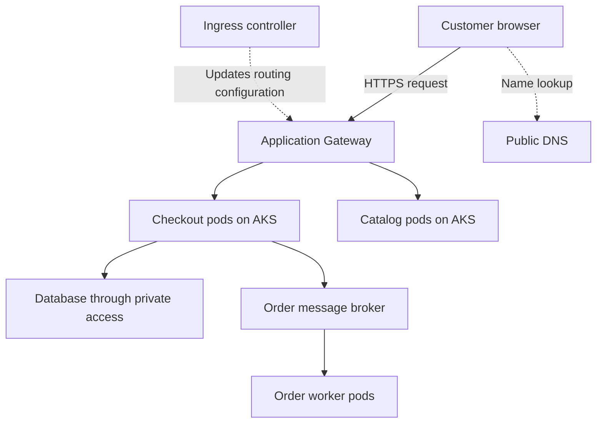

This responsibility means owning the platform across its lifecycle: choosing an architecture that can tolerate failures, implementing it consistently, and keeping applications available during incidents, scaling, and upgrades.

For interview preparation, study it through this practical scenario: **an online ordering application runs on AKS and must continue serving customers when a pod, node, or availability zone fails.**

**1. Design the platform around business requirements**

Start by defining what “highly available” means for the application.

| Requirement       | Example                                                     | Why it matters                                 |
| ----------------- | ----------------------------------------------------------- | ---------------------------------------------- |
| Availability SLO  | 99.9% successful checkout requests over 30 days             | Establishes a measurable reliability target    |
| Latency SLO       | 99% of checkout requests complete within 800 ms             | Prevents a slow service from appearing healthy |
| Peak demand       | 3,000 requests per second                                   | Determines capacity and scaling requirements   |
| Failure tolerance | Continue operating after one zone fails                     | Determines placement and spare capacity        |
| RTO               | Restore service within 30 minutes after a regional disaster | Guides the recovery architecture               |
| RPO               | Lose no more than five minutes of recoverable data          | Guides replication and backup design           |

These are illustrative targets. Agree on them with application and business owners before selecting infrastructure.

Also identify critical dependencies. An available AKS cluster does not make checkout available if its database, DNS, identity service, or payment provider is unavailable.

**2. Choose failure boundaries deliberately**

Design for several different failure scopes:

| Failure                           | Typical design response                                      |
| --------------------------------- | ------------------------------------------------------------ |
| Application process crashes       | Restart the container and investigate the cause              |
| Pod becomes unhealthy             | Stop sending it traffic and create a replacement             |
| Worker node fails                 | Use surviving replicas and reschedule affected pods          |
| Availability zone fails           | Serve traffic from replicas and capacity in other zones      |
| Application release is defective  | Stop promotion and restore a compatible version              |
| Database becomes unavailable      | Use the database’s tested availability or recovery mechanism |
| Entire region becomes unavailable | Execute a coordinated regional recovery plan                 |

The key principle is **redundancy plus usable failover capacity**. Having replicas in three zones is insufficient if the remaining two zones cannot handle the workload.

**3. Build the Azure foundation**

For the ordering project, your infrastructure design should address:

* **Network organization:** Plan VNets, subnets, address ranges, routing, private endpoints, and DNS. Reserve room for growth and temporary upgrade capacity.
* **Traffic entry:** Choose load balancing and ingress that fit HTTP routing, TLS, WAF, and backend-reachability requirements.
* **Identity:** Separate human access, infrastructure automation, cluster operations, and application identities.
* **Dependencies:** Select appropriate availability, backup, and recovery configurations for databases, storage, caches, and messaging.
* **Governance:** Define ownership, tagging, access boundaries, policies, and operational responsibilities.

**Practical scenario:** AKS tries to add nodes during a sale, but the subnet has insufficient free addresses. The application becomes overloaded even though autoscaling is configured correctly.

Your design should therefore treat IP addresses, subscription quotas, and regional compute capacity as scaling prerequisites.

**4. Design Kubernetes workloads for availability**

Each application needs more than a Deployment with several replicas.

| Kubernetes concept | Purpose                                           | Practical example                                                      |
| ------------------ | ------------------------------------------------- | ---------------------------------------------------------------------- |
| Replicas           | Provide multiple serving instances                | Run several checkout pods so one failure does not remove the service   |
| Topology spread    | Distribute replicas across failure domains        | Avoid placing every checkout pod on one node or in one zone            |
| Readiness probe    | Decide whether an instance should receive traffic | Keep a starting or temporarily unusable pod out of normal routing      |
| Liveness probe     | Detect a condition where restarting may help      | Restart a locally stuck application process                            |
| Startup probe      | Allow bounded initialization time                 | Give a slow-starting application time to initialize                    |
| Resource requests  | Inform scheduling and resource allocation         | Reserve an appropriate amount of CPU and memory per pod                |
| Resource limits    | Bound resource consumption where configured       | Prevent uncontrolled memory consumption from affecting other workloads |
| Disruption budget  | Limit eligible voluntary evictions                | Preserve enough replicas during maintenance                            |
| Graceful shutdown  | Allow work to finish during termination           | Drain checkout requests before a pod exits                             |

A disruption budget does **not** protect against every outage. It cannot prevent an unexpected zone failure, and deployment rollouts require their own availability controls.

**Practical scenario:** A liveness probe checks database connectivity. When the database slows down, all application pods restart repeatedly.

The improvement is to distinguish local application health from dependency health. Restarting every application instance usually does not repair a shared database failure.

**5. Design scaling across the entire request path**

There are several separate scaling problems:

* **Application replicas:** Can more pods handle additional requests?
* **Worker nodes:** Is there enough capacity to schedule those pods?
* **Dependencies:** Can the database, cache, broker, and external APIs handle additional concurrency?
* **Scaling delay:** Can existing capacity absorb demand while new instances become ready?

Consider a measured example:

* One checkout pod supports 150 requests per second at acceptable latency.
* Peak traffic is 3,000 requests per second.
* The simple minimum is `3,000 ÷ 150 = 20 pods`.

That minimum provides no throughput headroom at the measured operating point.

If you run 30 pods evenly across three zones, losing one zone leaves 20. You can theoretically handle the peak, but only if the measured throughput remains valid and shared dependencies continue working.

**Practical trap:** Each of those 30 pods allows 50 database connections. Together they can attempt 1,500 connections. If the database’s safe connection budget is 600, adding pods can make the incident worse.

Explain scaling as a system-wide capacity decision, not just an HPA setting.

**6. Build repeatably with infrastructure and delivery automation**

Use a controlled implementation process:

1. Define the Azure infrastructure in Terraform.
2. Review plans for replacements, permissions, exposure, and capacity changes.
3. Build and test application images through CI.
4. Promote an immutable artifact through environments.
5. Deploy the declared application configuration through the selected deployment controller.
6. Verify infrastructure behavior and the customer journey after changes.

**Practical scenario:** Staging works, but production fails because an engineer manually added a DNS configuration only in staging.

The durable improvement is to represent the required configuration in the owning infrastructure code, verify environment differences, and detect unexplained drift.

A successful Terraform apply or Kubernetes rollout is one verification step. Neither proves that a customer can place an order.

**7. Support the platform through observability and incident response**

Monitor customer outcomes and the underlying components.

| Layer                | Useful evidence                                             |
| -------------------- | ----------------------------------------------------------- |
| Customer journey     | Checkout success, latency, synthetic transactions           |
| Gateway and ingress  | Request failures, backend health, TLS and routing errors    |
| Application          | Exceptions, dependency calls, queueing, version changes     |
| Kubernetes           | Readiness, restarts, scheduling failures, node conditions   |
| Azure infrastructure | Quotas, resource health, network behavior, scaling failures |
| Dependencies         | Database connections, query latency, queue lag, throttling  |

During an incident, use a consistent sequence:

1. Confirm customer impact and scope.
2. Identify recent changes and affected dependencies.
3. Collect evidence that distinguishes competing hypotheses.
4. Apply the safest useful mitigation.
5. Verify recovery through the customer journey.
6. Record contributing causes and assign preventive improvements.

**Worked scenario:** Checkout returns intermittent errors after a deployment. Pods are Running, but some new replicas fail readiness.

Investigate the new version’s configuration, startup behavior, dependency access, and resource usage. Compare healthy and unhealthy replicas. If evidence points to the release, restore a compatible version through the owning deployment process and verify checkout success.

Restarting the entire cluster would introduce additional disruption without addressing the evidence.

**8. Maintain availability during upgrades and recovery**

Maintenance is part of availability engineering.

Before a cluster or node-pool upgrade, verify:

* Workload and API compatibility.
* Healthy replicas and appropriate placement.
* Disruption and rollout settings.
* Temporary node capacity, quota, and available IP addresses.
* Application startup and graceful shutdown behavior.
* A supported recovery approach.
* Customer-level monitoring during the operation.

For disaster recovery, test the complete service: infrastructure, application configuration, images, secrets, identity, data, dependencies, and routing.

**Practical scenario:** The recovery cluster starts successfully, but checkout fails because it cannot access the payment credential. This demonstrates that cluster recovery and service recovery are different milestones.

**How to explain this responsibility in an interview**

> “I start by defining availability, latency, capacity, and recovery objectives for the customer journey. I then identify failure domains and critical dependencies, design redundant Azure and AKS capacity, and configure workloads for healthy routing, graceful termination, and controlled scaling. I build the platform through reviewed infrastructure and deployment automation. Operationally, I use customer-level SLOs and component telemetry to detect failures, lead mitigation, and verify recovery. I also test upgrades, failure scenarios, and restores so availability is supported by evidence.”

Support that explanation with one real project: the architecture you chose, a failure you handled, the tradeoffs you made, and the measured outcome.

These topics describe different parts of the same platform:

* **VNets and subnets** organize the Azure network.
* **Networking** determines how traffic travels and what can communicate.
* **DNS** lets applications find destinations by name.
* **VMSS** manages groups of virtual machines.
* **AKS** runs and coordinates containerized applications.
* **Application Gateway** receives and routes application traffic.
* **Cloud-native architecture** defines how applications use these capabilities to scale, recover, and evolve.

Consider an online shopping platform with catalog, checkout, payment, and order-processing services. The explanations below use that project throughout.

**1. AKS — Azure Kubernetes Service**

AKS is Azure’s managed Kubernetes service. Kubernetes coordinates containerized workloads: it schedules them, maintains the desired number of replicas, and supports service discovery and deployment.

An AKS cluster has two main parts:

| Part          | Responsibility                                         |
| ------------- | ------------------------------------------------------ |
| Control plane | Stores cluster configuration and coordinates workloads |
| Worker nodes  | Provide the compute where application containers run   |

Azure operates the AKS control plane. Your responsibilities depend on the operating mode, but application configuration, reliability, access, and dependency behavior still require engineering ownership. [Microsoft: AKS core concepts](https://learn.microsoft.com/en-us/azure/aks/core-aks-concepts).

**How the control plane works**

Suppose you declare that checkout should have six replicas.

* The **API server** accepts the desired configuration.
* **etcd** stores Kubernetes configuration and state.
* Controllers notice that six replicas are required.
* The **scheduler** selects eligible nodes for unscheduled pods.
* Each node’s **kubelet** works with the container runtime to run the assigned containers.

Controllers repeatedly compare desired and observed state. If a pod disappears, Kubernetes attempts to restore the declared replica count. This process is called **reconciliation**. [Kubernetes components](https://kubernetes.io/docs/concepts/overview/components/).

**Objects you must understand**

| Object     | Meaning                                                        | Shopping-platform example                                 |
| ---------- | -------------------------------------------------------------- | --------------------------------------------------------- |
| Pod        | A scheduling unit containing one or more related containers    | One checkout instance                                     |
| Deployment | Maintains replicated application pods and manages updates      | Six checkout replicas                                     |
| Service    | Provides a stable access abstraction for selected pods         | A stable checkout endpoint                                |
| Namespace  | Organizes resources and scopes many policies                   | `orders`                                                  |
| ConfigMap  | Stores non-secret application configuration                    | Payment timeout settings                                  |
| Secret     | Holds sensitive configuration under Kubernetes access controls | A credential, where that delivery approach is appropriate |
| Node pool  | A group of worker nodes with common configuration              | General-purpose application nodes                         |

Kubernetes Secrets require proper protection; base64 encoding alone does not encrypt their contents.

**System and application node pools**

System node pools primarily host essential cluster workloads such as DNS components. User node pools primarily host applications.

Separate pools can accommodate different requirements:

* General-purpose nodes for APIs.
* Memory-oriented nodes for memory-heavy processing.
* Specialized nodes for GPU workloads.
* Different operating systems where supported.

Separation alone does not guarantee isolation. Scheduling rules, permissions, resource policies, and network controls must match the intended boundaries.

**Practical scenario: pods remain Pending**

Checkout scales from six to twelve replicas, but six new pods remain Pending.

Investigate:

1. Is there enough allocatable CPU and memory?
2. Do taints or affinity rules prevent placement?
3. Are required volumes available?
4. Can the cluster add nodes?
5. Are Azure quota, address availability, or node-pool limits blocking growth?

A Pending pod is often a scheduling or capacity problem. Restarting existing application pods may make the situation worse.

---

**2. VNets — Azure Virtual Networks**

A VNet is the foundation of private networking in Azure. It provides an address space in which supported Azure resources can communicate.

A VNet can connect to:

* Other VNets through peering.
* On-premises networks through appropriate connectivity.
* Supported Azure services through private networking mechanisms.
* Internet destinations through the configured outbound path. [Microsoft: Virtual Network overview](https://learn.microsoft.com/en-us/azure/virtual-network/virtual-networks-overview).

**Understanding address space**

An illustrative production VNet could use:

```text
10.20.0.0/16
```

The `/16` describes the network prefix. This range contains 65,536 total IPv4 addresses before considering how it is divided and reserved.

Address planning should consider:

* Existing corporate networks.
* Other Azure environments.
* AKS nodes and, depending on networking mode, pods.
* Private endpoints.
* Future expansion.
* Temporary capacity during upgrades.

**Practical scenario: overlapping networks**

Your Azure VNet and an on-premises network both use `10.20.0.0/16`.

When you connect them, the same destination address can refer to two different locations. This creates routing ambiguity and may require renumbering or a carefully designed translation solution.

The best time to prevent overlap is before deploying the platform.

**Hub-and-spoke design**

A common enterprise pattern uses:

* A **hub** for shared connectivity, DNS, or network security.
* **Spokes** for application environments.

For example, production AKS runs in a production spoke, while shared on-premises connectivity lives in the hub.

Peering is not automatically transitive: connecting spoke A to the hub and spoke B to the hub does not automatically create unrestricted A-to-B connectivity.

---

**3. Subnets**

A subnet is a portion of a VNet’s address space. It organizes resources and provides a place to associate certain network settings.

An illustrative design:

| Subnet              | Example range    | Intended purpose                     |
| ------------------- | ---------------- | ------------------------------------ |
| Application Gateway | `10.20.0.0/24`   | Gateway instances                    |
| AKS nodes           | `10.20.4.0/22`   | Worker-node addresses                |
| Private endpoints   | `10.20.8.0/24`   | Private access to supported services |
| Reserved space      | Remaining ranges | Growth and future services           |

These are learning examples, not recommended sizes for every deployment.

**What subnet design affects**

Subnet decisions influence:

* IP-address capacity.
* Security-rule association.
* Routing configuration.
* Service-specific deployment requirements.
* Future expansion.

A subnet is not automatically a security boundary. Traffic restrictions require appropriate controls.

**Subnet versus availability zone**

These concepts solve different problems:

* A subnet organizes network addresses.
* An availability zone represents a physical failure domain.

Do not assume that one subnet means one zone, or that separate subnets automatically provide resilience to a zone failure.

**Practical scenario: upgrades fail**

An AKS upgrade needs temporary extra nodes. The node subnet has enough addresses for normal operation but insufficient space for upgrade capacity.

Result: maintenance stalls despite acceptable CPU utilization.

Plan addresses for **maximum operational demand**, including growth and upgrades, rather than only the initial node count.

---

**4. Networking**

Networking covers how packets reach destinations, how connections are established, and which traffic is permitted.

For this role, separate four questions:

| Question                                              | Mechanism         |
| ----------------------------------------------------- | ----------------- |
| What address belongs to this name?                    | DNS               |
| Which path reaches that address?                      | Routing           |
| Is this traffic permitted?                            | Security controls |
| Which healthy application instance should receive it? | Load balancing    |

Successful DNS resolution answers only the first question.

**Azure networking versus Kubernetes networking**

Azure networking connects nodes, gateways, private endpoints, and other resources.

Kubernetes networking adds application-level connectivity, including:

* Pod-to-pod communication.
* Service discovery.
* Service-to-pod forwarding.
* Inbound application exposure.
* Pod network policy.

AKS integrates these through its selected network plugin and data plane. [Microsoft: AKS networking concepts](https://learn.microsoft.com/en-us/azure/aks/concepts-network).

**Pod IP, node IP, and Service IP**

| Address    | Represents                                                 | Operational significance                              |
| ---------- | ---------------------------------------------------------- | ----------------------------------------------------- |
| Node IP    | A worker machine’s network interface                       | Relevant to node connectivity and some outbound paths |
| Pod IP     | A particular pod                                           | Can change when the pod is replaced                   |
| Service IP | A virtual service address in common Service configurations | Provides stable discovery while backends change       |

A Service IP is generally not an ordinary VM interface address.

**Azure CNI networking choices**

With **Azure CNI Overlay**, pods use a separate pod address space. Traffic leaving the cluster is translated to node addressing, and external systems cannot simply assume direct reachability to overlay pod addresses.

Other Azure CNI designs provide pod addresses from VNet address space. This affects address consumption and external routing.

Choose based on scale, connectivity requirements, network policy, and supported ingress integration. [Microsoft: Azure CNI Overlay](https://learn.microsoft.com/en-us/azure/aks/azure-cni-overlay).

**Network Security Groups**

NSGs allow or deny traffic using rules based on properties such as addresses, ports, and protocol.

Key points:

* Lower numerical priority means higher precedence.
* NSGs are stateful.
* Effective controls may involve both subnet and network-interface settings.
* An NSG does not inspect an HTTP request for SQL injection; that is an application-security concern. [Microsoft: NSGs](https://learn.microsoft.com/en-us/azure/virtual-network/network-security-groups-overview).

**Routes, firewalls, and NAT**

A route determines a packet’s next hop. Azure supplies system routes; user-defined routes can steer traffic through a firewall or other supported destination. Correct routing does not guarantee permission to pass. [Microsoft: Azure routing](https://learn.microsoft.com/en-us/azure/virtual-network/virtual-networks-udr-overview).

NAT translates addresses, commonly for outbound connections. It can provide predictable egress addressing, but connection capacity and the actual configured path still matter.

**Practical scenario: payment calls fail only during peak traffic**

Possible causes include:

* Outbound connection or SNAT pressure.
* Excessive new connections instead of connection reuse.
* Firewall limits.
* Payment-provider throttling.
* Application connection-pool exhaustion.

Check connection behavior and dependency responses alongside CPU and pod counts.

---

**5. DNS — Domain Name System**

DNS maps names to records so clients can discover destinations without hard-coding addresses.

Common records include:

| Record | Purpose                                            | Example                               |
| ------ | -------------------------------------------------- | ------------------------------------- |
| A      | Maps a name to an IPv4 address                     | `shop.example.com` to an IPv4 address |
| AAAA   | Maps a name to an IPv6 address                     | IPv6 destination                      |
| CNAME  | Makes a name an alias of another name              | `www` aliases another hostname        |
| TXT    | Stores text used by verification and other systems | Domain verification                   |

DNS responses are cached. TTL affects how long a cached answer can remain valid.

**Public Azure DNS**

Public DNS hosts records intended for public resolution. For example, `shop.example.com` resolves to the shopping platform’s public entry point.

DNS provides discovery; it does not inspect application requests or grant access. [Microsoft: Azure DNS overview](https://learn.microsoft.com/en-us/azure/dns/dns-overview).

**Azure Private DNS**

Private DNS provides name resolution for private network scenarios. Private zones and their network links must match the clients that need to resolve those names.

For a private endpoint, the application should resolve the service hostname to the intended private destination through a correctly configured DNS path. [Microsoft: Azure Private DNS](https://learn.microsoft.com/en-us/azure/dns/private-dns-overview).

**Kubernetes DNS and CoreDNS**

Inside a cluster, applications can discover Services through DNS.

For a Service named `payment` in namespace `orders`, a typical fully qualified name is:

```text
payment.orders.svc.cluster.local
```

Here:

* `payment` is the Service.
* `orders` is the namespace.
* `svc` identifies the service DNS hierarchy.
* `cluster.local` is the commonly used cluster domain, which can vary.

Normal and headless Services resolve differently, so understand the Service type you are investigating. [Kubernetes: DNS for Services and Pods](https://kubernetes.io/docs/concepts/services-networking/dns-pod-service/).

**Practical scenario: database access works from a VM but fails from a pod**

Investigate from the failing workload’s network context:

```bash
kubectl -n orders exec <pod> -- cat /etc/resolv.conf
kubectl -n orders exec <pod> -- nslookup <database-hostname>
kubectl -n kube-system get pods -l k8s-app=kube-dns
```

These commands assume the container has the required utilities.

Compare the answer with the expected destination. Then inspect CoreDNS forwarding, upstream resolvers, private-zone links, and hybrid DNS configuration.

Use the error to narrow the investigation:

* `NXDOMAIN`: the queried name was reported nonexistent.
* DNS timeout: the resolver path or service may be failing.
* Correct private IP but connection timeout: investigate routing, filtering, or the destination.
* TLS failure: inspect certificates and hostnames.
* Authorization failure: inspect identity and permissions.

---

**6. Application Gateway**

Application Gateway is an Azure application traffic service commonly used for HTTP/HTTPS routing, TLS handling, and WAF integration.

For the shopping platform, it can direct catalog requests to catalog backends and checkout requests to checkout backends. [Microsoft: Application Gateway overview](https://learn.microsoft.com/en-us/azure/application-gateway/overview).

**Its main components**

| Component        | Purpose                                | Example                                  |
| ---------------- | -------------------------------------- | ---------------------------------------- |
| Frontend IP      | Address clients connect to             | Public shopping endpoint                 |
| Listener         | Matches incoming connection properties | HTTPS on port 443 for `shop.example.com` |
| Routing rule     | Selects the destination behavior       | `/checkout/*` to checkout                |
| Backend pool     | Lists possible destinations            | Checkout backend addresses               |
| Backend settings | Configure backend communication        | HTTPS, port, hostname, timeout           |
| Health probe     | Tests backend eligibility              | Request to a suitable health endpoint    |

A listener and routing rule must connect to the correct backend configuration. A healthy application can still be unreachable through an incorrectly configured gateway. [Microsoft: Application Gateway components](https://learn.microsoft.com/en-us/azure/application-gateway/application-gateway-components).

**TLS termination and re-encryption**

With TLS termination, the gateway handles the client’s TLS connection.

The backend connection is a separate decision:

* HTTP sends unencrypted application traffic on that backend leg.
* HTTPS encrypts the backend leg and requires correct certificate and hostname handling.

Client-side HTTPS alone does not prove that every downstream connection is encrypted.

**Application Gateway and AKS**

Application Gateway Ingress Controller, or **AGIC**, watches Kubernetes configuration and updates Application Gateway.

AGIC manages configuration; it is not the proxy carrying every customer request. In supported configurations, Application Gateway routes directly to pod backends. The actual path depends on the chosen networking and ingress integration. [Microsoft: AGIC overview](https://learn.microsoft.com/en-us/azure/application-gateway/ingress-controller-overview).

This distinction matters when drawing architecture diagrams: a Kubernetes Service declaration does not always represent another physical packet hop.

**Practical scenario: 502 after a deployment**

Suppose the application begins listening on port 8081, but the backend configuration still targets 8080.

Investigate:

1. Which component generated the 502?
2. What does gateway backend health report?
3. Does the probe use the right host, path, port, and protocol?
4. Does the application listen at that destination?
5. Can the gateway reach it?
6. If using HTTPS, does backend TLS validation succeed?

Correct the owning configuration and verify a complete customer request.

**Application Gateway versus Azure Load Balancer**

For interview purposes:

* Use the Azure Load Balancer discussion for transport-level traffic distribution.
* Use the Application Gateway discussion for HTTP-aware routing, TLS, and WAF requirements.

Avoid claiming that Application Gateway supports only Layer 7: current documentation also describes TCP/TLS proxy capabilities. The HTTP-oriented use case remains central to this JD. [Microsoft: listener protocols](https://learn.microsoft.com/en-us/azure/application-gateway/application-gateway-components).

---

**7. VMSS — Virtual Machine Scale Sets**

VMSS manages a group of virtual machines using a coordinated configuration and lifecycle model.

It supports scenarios requiring multiple compute instances, scaling, and availability distribution. It does not, by itself, manage Kubernetes pods or understand application correctness. [Microsoft: VMSS overview](https://learn.microsoft.com/en-us/azure/virtual-machine-scale-sets/overview).

**How VMSS relates to AKS**

AKS node pools commonly use VMSS underneath. Kubernetes then schedules pods onto those worker VMs.

The hierarchy is:

| Level          | Example                                                       |
| -------------- | ------------------------------------------------------------- |
| AKS cluster    | Production ordering cluster                                   |
| Node pool      | Application compute pool                                      |
| Underlying VMs | Worker nodes managed through the selected pool implementation |
| Pods           | Checkout, catalog, and worker instances                       |

Not every AKS node-pool implementation should be assumed to use VMSS; current AKS documentation also describes directly managed VM node pools. [Microsoft: AKS node pools](https://learn.microsoft.com/en-us/azure/aks/core-aks-concepts).

**Pod scaling versus node scaling**

* HPA changes application replica counts.
* Cluster Autoscaler changes node capacity according to scheduling needs and its policies.

For example:

1. Demand increases.
2. HPA requests additional checkout replicas.
3. Some pods cannot fit.
4. Cluster Autoscaler evaluates whether adding suitable nodes would help.
5. Azure provisions capacity, subject to constraints.
6. Kubernetes schedules the waiting pods.

AKS Cluster Autoscaler operates with node-pool configuration and limits. [Microsoft: AKS Cluster Autoscaler](https://learn.microsoft.com/en-us/azure/aks/cluster-autoscaler-overview).

**Practical scenario: scaling adds no capacity**

Check:

* Maximum node count.
* Subscription vCPU quota.
* VM availability.
* Address availability.
* Pod placement constraints.
* Whether the available node size can satisfy the pod.

Operate AKS-owned capacity through supported AKS mechanisms. Competing manual or independent scaling controls can produce inconsistent behavior.

---

**8. Cloud-native architectures**

Cloud-native architecture designs applications to use cloud operating characteristics effectively: automation, elastic capacity, managed services, observable behavior, and recoverable infrastructure.

Containers and microservices can support this approach, but packaging an existing application into a container does not automatically make its behavior resilient. [Microsoft: cloud-native definition](https://learn.microsoft.com/en-us/dotnet/architecture/cloud-native/definition).

For the shopping project, focus on these design properties:

| Property                        | Meaning                                             | Practical scenario                                         |
| ------------------------------- | --------------------------------------------------- | ---------------------------------------------------------- |
| Stateless application instances | Durable state does not depend on one pod            | A replacement checkout pod can continue serving customers  |
| Independent deployment          | Components can change with controlled compatibility | Update catalog without redeploying payment                 |
| Asynchronous processing         | Suitable work is decoupled through messages         | Send confirmation emails after order creation              |
| Bounded dependency calls        | Timeouts and retries have limits                    | A slow payment provider cannot occupy every request worker |
| Idempotency                     | Repeated requests do not repeat unintended effects  | Retrying checkout does not create duplicate charges        |
| Declarative infrastructure      | Desired configuration is recorded and reproducible  | Recreate a damaged environment through reviewed code       |
| Observability                   | Behavior can be investigated from signals           | Trace a slow checkout into its database dependency         |
| Graceful degradation            | Nonessential failures do not stop essential work    | Recommendations fail while checkout remains available      |

**Practical scenario: payment response is lost**

The payment provider processes a charge, but the network response never reaches checkout.

A naïve retry may charge the customer again.

A better design uses:

1. A stable payment-operation identifier.
2. Idempotent processing where supported.
3. A way to query or reconcile payment status.
4. Explicit pending or uncertain states.
5. An audit trail connecting order and payment.

Kubernetes cannot solve this business-consistency problem. It belongs in application and integration design.

**How the components work together**

In a compatible Application Gateway and AKS design:



The diagram separates DNS lookup, application traffic, and routing configuration. AKS worker nodes sit within the chosen Azure network design; VMSS may supply their underlying compute.

When troubleshooting, follow that same separation: **resolve the name, verify the network path, identify the traffic-handling component, inspect the workload, and validate its dependencies.**

