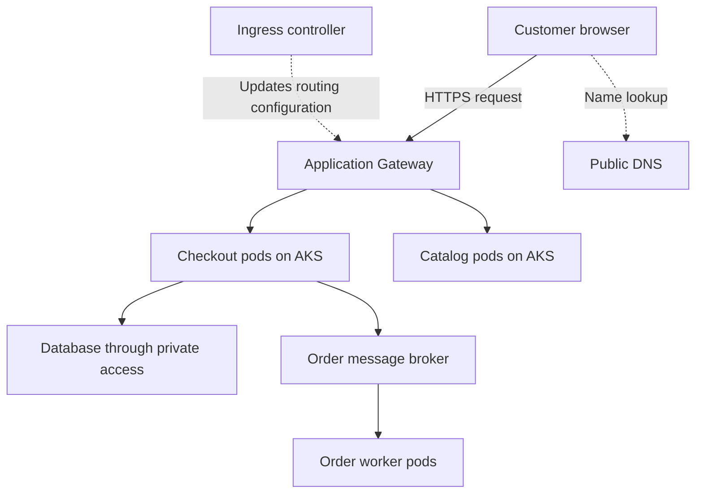
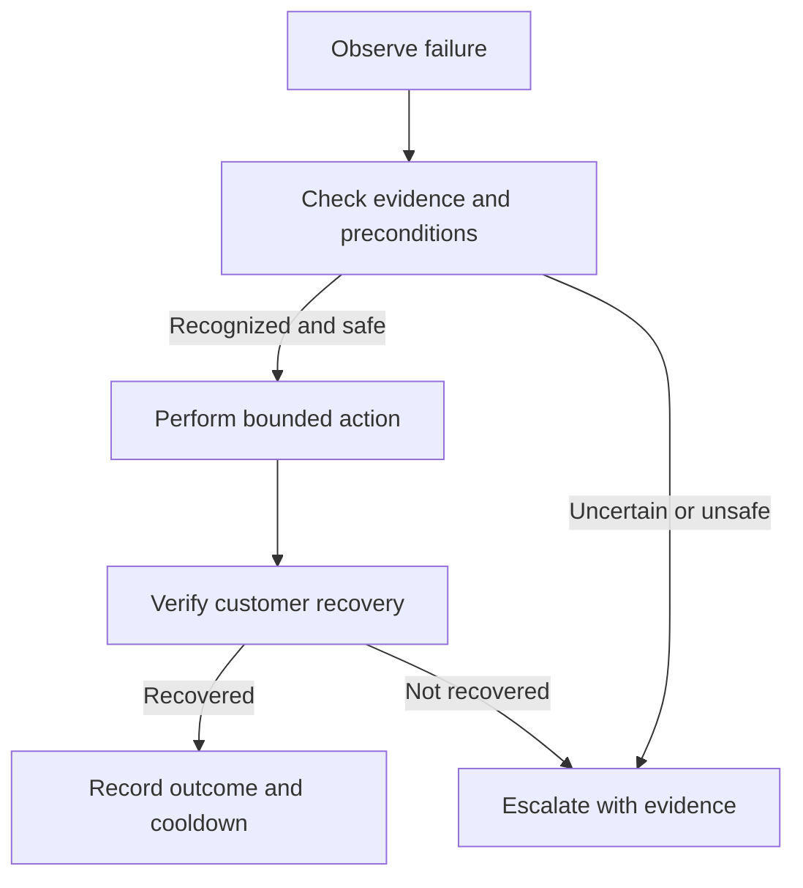

This responsibility means owning the platform across its lifecycle: choosing an architecture that can tolerate failures, implementing it consistently, and keeping applications available during incidents, scaling, and upgrades.

For interview preparation, study it through this practical scenario: **an online ordering application runs on AKS and must continue serving customers when a pod, node, or availability zone fails.**

**1. Design the platform around business requirements**

Start by defining what “highly available” means for the application.

| Requirement       | Example                                                     | Why it matters                                 |
| ----------------- | ----------------------------------------------------------- | ---------------------------------------------- |
| Availability SLO  | 99.9% successful checkout requests over 30 days             | Establishes a measurable reliability target    |
| Latency SLO       | 99% of checkout requests complete within 800 ms             | Prevents a slow service from appearing healthy |
| Peak demand       | 3,000 requests per second                                   | Determines capacity and scaling requirements   |
| Failure tolerance | Continue operating after one zone fails                     | Determines placement and spare capacity        |
| RTO               | Restore service within 30 minutes after a regional disaster | Guides the recovery architecture               |
| RPO               | Lose no more than five minutes of recoverable data          | Guides replication and backup design           |

These are illustrative targets. Agree on them with application and business owners before selecting infrastructure.

Also identify critical dependencies. An available AKS cluster does not make checkout available if its database, DNS, identity service, or payment provider is unavailable.

**2. Choose failure boundaries deliberately**

Design for several different failure scopes:

| Failure                           | Typical design response                                      |
| --------------------------------- | ------------------------------------------------------------ |
| Application process crashes       | Restart the container and investigate the cause              |
| Pod becomes unhealthy             | Stop sending it traffic and create a replacement             |
| Worker node fails                 | Use surviving replicas and reschedule affected pods          |
| Availability zone fails           | Serve traffic from replicas and capacity in other zones      |
| Application release is defective  | Stop promotion and restore a compatible version              |
| Database becomes unavailable      | Use the database’s tested availability or recovery mechanism |
| Entire region becomes unavailable | Execute a coordinated regional recovery plan                 |

The key principle is **redundancy plus usable failover capacity**. Having replicas in three zones is insufficient if the remaining two zones cannot handle the workload.

**3. Build the Azure foundation**

For the ordering project, your infrastructure design should address:

* **Network organization:** Plan VNets, subnets, address ranges, routing, private endpoints, and DNS. Reserve room for growth and temporary upgrade capacity.
* **Traffic entry:** Choose load balancing and ingress that fit HTTP routing, TLS, WAF, and backend-reachability requirements.
* **Identity:** Separate human access, infrastructure automation, cluster operations, and application identities.
* **Dependencies:** Select appropriate availability, backup, and recovery configurations for databases, storage, caches, and messaging.
* **Governance:** Define ownership, tagging, access boundaries, policies, and operational responsibilities.

**Practical scenario:** AKS tries to add nodes during a sale, but the subnet has insufficient free addresses. The application becomes overloaded even though autoscaling is configured correctly.

Your design should therefore treat IP addresses, subscription quotas, and regional compute capacity as scaling prerequisites.

**4. Design Kubernetes workloads for availability**

Each application needs more than a Deployment with several replicas.

| Kubernetes concept | Purpose                                           | Practical example                                                      |
| ------------------ | ------------------------------------------------- | ---------------------------------------------------------------------- |
| Replicas           | Provide multiple serving instances                | Run several checkout pods so one failure does not remove the service   |
| Topology spread    | Distribute replicas across failure domains        | Avoid placing every checkout pod on one node or in one zone            |
| Readiness probe    | Decide whether an instance should receive traffic | Keep a starting or temporarily unusable pod out of normal routing      |
| Liveness probe     | Detect a condition where restarting may help      | Restart a locally stuck application process                            |
| Startup probe      | Allow bounded initialization time                 | Give a slow-starting application time to initialize                    |
| Resource requests  | Inform scheduling and resource allocation         | Reserve an appropriate amount of CPU and memory per pod                |
| Resource limits    | Bound resource consumption where configured       | Prevent uncontrolled memory consumption from affecting other workloads |
| Disruption budget  | Limit eligible voluntary evictions                | Preserve enough replicas during maintenance                            |
| Graceful shutdown  | Allow work to finish during termination           | Drain checkout requests before a pod exits                             |

A disruption budget does **not** protect against every outage. It cannot prevent an unexpected zone failure, and deployment rollouts require their own availability controls.

**Practical scenario:** A liveness probe checks database connectivity. When the database slows down, all application pods restart repeatedly.

The improvement is to distinguish local application health from dependency health. Restarting every application instance usually does not repair a shared database failure.

**5. Design scaling across the entire request path**

There are several separate scaling problems:

* **Application replicas:** Can more pods handle additional requests?
* **Worker nodes:** Is there enough capacity to schedule those pods?
* **Dependencies:** Can the database, cache, broker, and external APIs handle additional concurrency?
* **Scaling delay:** Can existing capacity absorb demand while new instances become ready?

Consider a measured example:

* One checkout pod supports 150 requests per second at acceptable latency.
* Peak traffic is 3,000 requests per second.
* The simple minimum is `3,000 ÷ 150 = 20 pods`.

That minimum provides no throughput headroom at the measured operating point.

If you run 30 pods evenly across three zones, losing one zone leaves 20. You can theoretically handle the peak, but only if the measured throughput remains valid and shared dependencies continue working.

**Practical trap:** Each of those 30 pods allows 50 database connections. Together they can attempt 1,500 connections. If the database’s safe connection budget is 600, adding pods can make the incident worse.

Explain scaling as a system-wide capacity decision, not just an HPA setting.

**6. Build repeatably with infrastructure and delivery automation**

Use a controlled implementation process:

1. Define the Azure infrastructure in Terraform.
2. Review plans for replacements, permissions, exposure, and capacity changes.
3. Build and test application images through CI.
4. Promote an immutable artifact through environments.
5. Deploy the declared application configuration through the selected deployment controller.
6. Verify infrastructure behavior and the customer journey after changes.

**Practical scenario:** Staging works, but production fails because an engineer manually added a DNS configuration only in staging.

The durable improvement is to represent the required configuration in the owning infrastructure code, verify environment differences, and detect unexplained drift.

A successful Terraform apply or Kubernetes rollout is one verification step. Neither proves that a customer can place an order.

**7. Support the platform through observability and incident response**

Monitor customer outcomes and the underlying components.

| Layer                | Useful evidence                                             |
| -------------------- | ----------------------------------------------------------- |
| Customer journey     | Checkout success, latency, synthetic transactions           |
| Gateway and ingress  | Request failures, backend health, TLS and routing errors    |
| Application          | Exceptions, dependency calls, queueing, version changes     |
| Kubernetes           | Readiness, restarts, scheduling failures, node conditions   |
| Azure infrastructure | Quotas, resource health, network behavior, scaling failures |
| Dependencies         | Database connections, query latency, queue lag, throttling  |

During an incident, use a consistent sequence:

1. Confirm customer impact and scope.
2. Identify recent changes and affected dependencies.
3. Collect evidence that distinguishes competing hypotheses.
4. Apply the safest useful mitigation.
5. Verify recovery through the customer journey.
6. Record contributing causes and assign preventive improvements.

**Worked scenario:** Checkout returns intermittent errors after a deployment. Pods are Running, but some new replicas fail readiness.

Investigate the new version’s configuration, startup behavior, dependency access, and resource usage. Compare healthy and unhealthy replicas. If evidence points to the release, restore a compatible version through the owning deployment process and verify checkout success.

Restarting the entire cluster would introduce additional disruption without addressing the evidence.

**8. Maintain availability during upgrades and recovery**

Maintenance is part of availability engineering.

Before a cluster or node-pool upgrade, verify:

* Workload and API compatibility.
* Healthy replicas and appropriate placement.
* Disruption and rollout settings.
* Temporary node capacity, quota, and available IP addresses.
* Application startup and graceful shutdown behavior.
* A supported recovery approach.
* Customer-level monitoring during the operation.

For disaster recovery, test the complete service: infrastructure, application configuration, images, secrets, identity, data, dependencies, and routing.

**Practical scenario:** The recovery cluster starts successfully, but checkout fails because it cannot access the payment credential. This demonstrates that cluster recovery and service recovery are different milestones.

**How to explain this responsibility in an interview**

> “I start by defining availability, latency, capacity, and recovery objectives for the customer journey. I then identify failure domains and critical dependencies, design redundant Azure and AKS capacity, and configure workloads for healthy routing, graceful termination, and controlled scaling. I build the platform through reviewed infrastructure and deployment automation. Operationally, I use customer-level SLOs and component telemetry to detect failures, lead mitigation, and verify recovery. I also test upgrades, failure scenarios, and restores so availability is supported by evidence.”

Support that explanation with one real project: the architecture you chose, a failure you handled, the tradeoffs you made, and the measured outcome.

These topics describe different parts of the same platform:

* **VNets and subnets** organize the Azure network.
* **Networking** determines how traffic travels and what can communicate.
* **DNS** lets applications find destinations by name.
* **VMSS** manages groups of virtual machines.
* **AKS** runs and coordinates containerized applications.
* **Application Gateway** receives and routes application traffic.
* **Cloud-native architecture** defines how applications use these capabilities to scale, recover, and evolve.

Consider an online shopping platform with catalog, checkout, payment, and order-processing services. The explanations below use that project throughout.

**1. AKS — Azure Kubernetes Service**

AKS is Azure’s managed Kubernetes service. Kubernetes coordinates containerized workloads: it schedules them, maintains the desired number of replicas, and supports service discovery and deployment.

An AKS cluster has two main parts:

| Part          | Responsibility                                         |
| ------------- | ------------------------------------------------------ |
| Control plane | Stores cluster configuration and coordinates workloads |
| Worker nodes  | Provide the compute where application containers run   |

Azure operates the AKS control plane. Your responsibilities depend on the operating mode, but application configuration, reliability, access, and dependency behavior still require engineering ownership. [Microsoft: AKS core concepts](https://learn.microsoft.com/en-us/azure/aks/core-aks-concepts).

**How the control plane works**

Suppose you declare that checkout should have six replicas.

* The **API server** accepts the desired configuration.
* **etcd** stores Kubernetes configuration and state.
* Controllers notice that six replicas are required.
* The **scheduler** selects eligible nodes for unscheduled pods.
* Each node’s **kubelet** works with the container runtime to run the assigned containers.

Controllers repeatedly compare desired and observed state. If a pod disappears, Kubernetes attempts to restore the declared replica count. This process is called **reconciliation**. [Kubernetes components](https://kubernetes.io/docs/concepts/overview/components/).

**Objects you must understand**

| Object     | Meaning                                                        | Shopping-platform example                                 |
| ---------- | -------------------------------------------------------------- | --------------------------------------------------------- |
| Pod        | A scheduling unit containing one or more related containers    | One checkout instance                                     |
| Deployment | Maintains replicated application pods and manages updates      | Six checkout replicas                                     |
| Service    | Provides a stable access abstraction for selected pods         | A stable checkout endpoint                                |
| Namespace  | Organizes resources and scopes many policies                   | `orders`                                                  |
| ConfigMap  | Stores non-secret application configuration                    | Payment timeout settings                                  |
| Secret     | Holds sensitive configuration under Kubernetes access controls | A credential, where that delivery approach is appropriate |
| Node pool  | A group of worker nodes with common configuration              | General-purpose application nodes                         |

Kubernetes Secrets require proper protection; base64 encoding alone does not encrypt their contents.

**System and application node pools**

System node pools primarily host essential cluster workloads such as DNS components. User node pools primarily host applications.

Separate pools can accommodate different requirements:

* General-purpose nodes for APIs.
* Memory-oriented nodes for memory-heavy processing.
* Specialized nodes for GPU workloads.
* Different operating systems where supported.

Separation alone does not guarantee isolation. Scheduling rules, permissions, resource policies, and network controls must match the intended boundaries.

**Practical scenario: pods remain Pending**

Checkout scales from six to twelve replicas, but six new pods remain Pending.

Investigate:

1. Is there enough allocatable CPU and memory?
2. Do taints or affinity rules prevent placement?
3. Are required volumes available?
4. Can the cluster add nodes?
5. Are Azure quota, address availability, or node-pool limits blocking growth?

A Pending pod is often a scheduling or capacity problem. Restarting existing application pods may make the situation worse.

---

**2. VNets — Azure Virtual Networks**

A VNet is the foundation of private networking in Azure. It provides an address space in which supported Azure resources can communicate.

A VNet can connect to:

* Other VNets through peering.
* On-premises networks through appropriate connectivity.
* Supported Azure services through private networking mechanisms.
* Internet destinations through the configured outbound path. [Microsoft: Virtual Network overview](https://learn.microsoft.com/en-us/azure/virtual-network/virtual-networks-overview).

**Understanding address space**

An illustrative production VNet could use:

```text
10.20.0.0/16
```

The `/16` describes the network prefix. This range contains 65,536 total IPv4 addresses before considering how it is divided and reserved.

Address planning should consider:

* Existing corporate networks.
* Other Azure environments.
* AKS nodes and, depending on networking mode, pods.
* Private endpoints.
* Future expansion.
* Temporary capacity during upgrades.

**Practical scenario: overlapping networks**

Your Azure VNet and an on-premises network both use `10.20.0.0/16`.

When you connect them, the same destination address can refer to two different locations. This creates routing ambiguity and may require renumbering or a carefully designed translation solution.

The best time to prevent overlap is before deploying the platform.

**Hub-and-spoke design**

A common enterprise pattern uses:

* A **hub** for shared connectivity, DNS, or network security.
* **Spokes** for application environments.

For example, production AKS runs in a production spoke, while shared on-premises connectivity lives in the hub.

Peering is not automatically transitive: connecting spoke A to the hub and spoke B to the hub does not automatically create unrestricted A-to-B connectivity.

---

**3. Subnets**

A subnet is a portion of a VNet’s address space. It organizes resources and provides a place to associate certain network settings.

An illustrative design:

| Subnet              | Example range    | Intended purpose                     |
| ------------------- | ---------------- | ------------------------------------ |
| Application Gateway | `10.20.0.0/24`   | Gateway instances                    |
| AKS nodes           | `10.20.4.0/22`   | Worker-node addresses                |
| Private endpoints   | `10.20.8.0/24`   | Private access to supported services |
| Reserved space      | Remaining ranges | Growth and future services           |

These are learning examples, not recommended sizes for every deployment.

**What subnet design affects**

Subnet decisions influence:

* IP-address capacity.
* Security-rule association.
* Routing configuration.
* Service-specific deployment requirements.
* Future expansion.

A subnet is not automatically a security boundary. Traffic restrictions require appropriate controls.

**Subnet versus availability zone**

These concepts solve different problems:

* A subnet organizes network addresses.
* An availability zone represents a physical failure domain.

Do not assume that one subnet means one zone, or that separate subnets automatically provide resilience to a zone failure.

**Practical scenario: upgrades fail**

An AKS upgrade needs temporary extra nodes. The node subnet has enough addresses for normal operation but insufficient space for upgrade capacity.

Result: maintenance stalls despite acceptable CPU utilization.

Plan addresses for **maximum operational demand**, including growth and upgrades, rather than only the initial node count.

---

**4. Networking**

Networking covers how packets reach destinations, how connections are established, and which traffic is permitted.

For this role, separate four questions:

| Question                                              | Mechanism         |
| ----------------------------------------------------- | ----------------- |
| What address belongs to this name?                    | DNS               |
| Which path reaches that address?                      | Routing           |
| Is this traffic permitted?                            | Security controls |
| Which healthy application instance should receive it? | Load balancing    |

Successful DNS resolution answers only the first question.

**Azure networking versus Kubernetes networking**

Azure networking connects nodes, gateways, private endpoints, and other resources.

Kubernetes networking adds application-level connectivity, including:

* Pod-to-pod communication.
* Service discovery.
* Service-to-pod forwarding.
* Inbound application exposure.
* Pod network policy.

AKS integrates these through its selected network plugin and data plane. [Microsoft: AKS networking concepts](https://learn.microsoft.com/en-us/azure/aks/concepts-network).

**Pod IP, node IP, and Service IP**

| Address    | Represents                                                 | Operational significance                              |
| ---------- | ---------------------------------------------------------- | ----------------------------------------------------- |
| Node IP    | A worker machine’s network interface                       | Relevant to node connectivity and some outbound paths |
| Pod IP     | A particular pod                                           | Can change when the pod is replaced                   |
| Service IP | A virtual service address in common Service configurations | Provides stable discovery while backends change       |

A Service IP is generally not an ordinary VM interface address.

**Azure CNI networking choices**

With **Azure CNI Overlay**, pods use a separate pod address space. Traffic leaving the cluster is translated to node addressing, and external systems cannot simply assume direct reachability to overlay pod addresses.

Other Azure CNI designs provide pod addresses from VNet address space. This affects address consumption and external routing.

Choose based on scale, connectivity requirements, network policy, and supported ingress integration. [Microsoft: Azure CNI Overlay](https://learn.microsoft.com/en-us/azure/aks/azure-cni-overlay).

**Network Security Groups**

NSGs allow or deny traffic using rules based on properties such as addresses, ports, and protocol.

Key points:

* Lower numerical priority means higher precedence.
* NSGs are stateful.
* Effective controls may involve both subnet and network-interface settings.
* An NSG does not inspect an HTTP request for SQL injection; that is an application-security concern. [Microsoft: NSGs](https://learn.microsoft.com/en-us/azure/virtual-network/network-security-groups-overview).

**Routes, firewalls, and NAT**

A route determines a packet’s next hop. Azure supplies system routes; user-defined routes can steer traffic through a firewall or other supported destination. Correct routing does not guarantee permission to pass. [Microsoft: Azure routing](https://learn.microsoft.com/en-us/azure/virtual-network/virtual-networks-udr-overview).

NAT translates addresses, commonly for outbound connections. It can provide predictable egress addressing, but connection capacity and the actual configured path still matter.

**Practical scenario: payment calls fail only during peak traffic**

Possible causes include:

* Outbound connection or SNAT pressure.
* Excessive new connections instead of connection reuse.
* Firewall limits.
* Payment-provider throttling.
* Application connection-pool exhaustion.

Check connection behavior and dependency responses alongside CPU and pod counts.

---

**5. DNS — Domain Name System**

DNS maps names to records so clients can discover destinations without hard-coding addresses.

Common records include:

| Record | Purpose                                            | Example                               |
| ------ | -------------------------------------------------- | ------------------------------------- |
| A      | Maps a name to an IPv4 address                     | `shop.example.com` to an IPv4 address |
| AAAA   | Maps a name to an IPv6 address                     | IPv6 destination                      |
| CNAME  | Makes a name an alias of another name              | `www` aliases another hostname        |
| TXT    | Stores text used by verification and other systems | Domain verification                   |

DNS responses are cached. TTL affects how long a cached answer can remain valid.

**Public Azure DNS**

Public DNS hosts records intended for public resolution. For example, `shop.example.com` resolves to the shopping platform’s public entry point.

DNS provides discovery; it does not inspect application requests or grant access. [Microsoft: Azure DNS overview](https://learn.microsoft.com/en-us/azure/dns/dns-overview).

**Azure Private DNS**

Private DNS provides name resolution for private network scenarios. Private zones and their network links must match the clients that need to resolve those names.

For a private endpoint, the application should resolve the service hostname to the intended private destination through a correctly configured DNS path. [Microsoft: Azure Private DNS](https://learn.microsoft.com/en-us/azure/dns/private-dns-overview).

**Kubernetes DNS and CoreDNS**

Inside a cluster, applications can discover Services through DNS.

For a Service named `payment` in namespace `orders`, a typical fully qualified name is:

```text
payment.orders.svc.cluster.local
```

Here:

* `payment` is the Service.
* `orders` is the namespace.
* `svc` identifies the service DNS hierarchy.
* `cluster.local` is the commonly used cluster domain, which can vary.

Normal and headless Services resolve differently, so understand the Service type you are investigating. [Kubernetes: DNS for Services and Pods](https://kubernetes.io/docs/concepts/services-networking/dns-pod-service/).

**Practical scenario: database access works from a VM but fails from a pod**

Investigate from the failing workload’s network context:

```bash
kubectl -n orders exec <pod> -- cat /etc/resolv.conf
kubectl -n orders exec <pod> -- nslookup <database-hostname>
kubectl -n kube-system get pods -l k8s-app=kube-dns
```

These commands assume the container has the required utilities.

Compare the answer with the expected destination. Then inspect CoreDNS forwarding, upstream resolvers, private-zone links, and hybrid DNS configuration.

Use the error to narrow the investigation:

* `NXDOMAIN`: the queried name was reported nonexistent.
* DNS timeout: the resolver path or service may be failing.
* Correct private IP but connection timeout: investigate routing, filtering, or the destination.
* TLS failure: inspect certificates and hostnames.
* Authorization failure: inspect identity and permissions.

---

**6. Application Gateway**

Application Gateway is an Azure application traffic service commonly used for HTTP/HTTPS routing, TLS handling, and WAF integration.

For the shopping platform, it can direct catalog requests to catalog backends and checkout requests to checkout backends. [Microsoft: Application Gateway overview](https://learn.microsoft.com/en-us/azure/application-gateway/overview).

**Its main components**

| Component        | Purpose                                | Example                                  |
| ---------------- | -------------------------------------- | ---------------------------------------- |
| Frontend IP      | Address clients connect to             | Public shopping endpoint                 |
| Listener         | Matches incoming connection properties | HTTPS on port 443 for `shop.example.com` |
| Routing rule     | Selects the destination behavior       | `/checkout/*` to checkout                |
| Backend pool     | Lists possible destinations            | Checkout backend addresses               |
| Backend settings | Configure backend communication        | HTTPS, port, hostname, timeout           |
| Health probe     | Tests backend eligibility              | Request to a suitable health endpoint    |

A listener and routing rule must connect to the correct backend configuration. A healthy application can still be unreachable through an incorrectly configured gateway. [Microsoft: Application Gateway components](https://learn.microsoft.com/en-us/azure/application-gateway/application-gateway-components).

**TLS termination and re-encryption**

With TLS termination, the gateway handles the client’s TLS connection.

The backend connection is a separate decision:

* HTTP sends unencrypted application traffic on that backend leg.
* HTTPS encrypts the backend leg and requires correct certificate and hostname handling.

Client-side HTTPS alone does not prove that every downstream connection is encrypted.

**Application Gateway and AKS**

Application Gateway Ingress Controller, or **AGIC**, watches Kubernetes configuration and updates Application Gateway.

AGIC manages configuration; it is not the proxy carrying every customer request. In supported configurations, Application Gateway routes directly to pod backends. The actual path depends on the chosen networking and ingress integration. [Microsoft: AGIC overview](https://learn.microsoft.com/en-us/azure/application-gateway/ingress-controller-overview).

This distinction matters when drawing architecture diagrams: a Kubernetes Service declaration does not always represent another physical packet hop.

**Practical scenario: 502 after a deployment**

Suppose the application begins listening on port 8081, but the backend configuration still targets 8080.

Investigate:

1. Which component generated the 502?
2. What does gateway backend health report?
3. Does the probe use the right host, path, port, and protocol?
4. Does the application listen at that destination?
5. Can the gateway reach it?
6. If using HTTPS, does backend TLS validation succeed?

Correct the owning configuration and verify a complete customer request.

**Application Gateway versus Azure Load Balancer**

For interview purposes:

* Use the Azure Load Balancer discussion for transport-level traffic distribution.
* Use the Application Gateway discussion for HTTP-aware routing, TLS, and WAF requirements.

Avoid claiming that Application Gateway supports only Layer 7: current documentation also describes TCP/TLS proxy capabilities. The HTTP-oriented use case remains central to this JD. [Microsoft: listener protocols](https://learn.microsoft.com/en-us/azure/application-gateway/application-gateway-components).

---

**7. VMSS — Virtual Machine Scale Sets**

VMSS manages a group of virtual machines using a coordinated configuration and lifecycle model.

It supports scenarios requiring multiple compute instances, scaling, and availability distribution. It does not, by itself, manage Kubernetes pods or understand application correctness. [Microsoft: VMSS overview](https://learn.microsoft.com/en-us/azure/virtual-machine-scale-sets/overview).

**How VMSS relates to AKS**

AKS node pools commonly use VMSS underneath. Kubernetes then schedules pods onto those worker VMs.

The hierarchy is:

| Level          | Example                                                       |
| -------------- | ------------------------------------------------------------- |
| AKS cluster    | Production ordering cluster                                   |
| Node pool      | Application compute pool                                      |
| Underlying VMs | Worker nodes managed through the selected pool implementation |
| Pods           | Checkout, catalog, and worker instances                       |

Not every AKS node-pool implementation should be assumed to use VMSS; current AKS documentation also describes directly managed VM node pools. [Microsoft: AKS node pools](https://learn.microsoft.com/en-us/azure/aks/core-aks-concepts).

**Pod scaling versus node scaling**

* HPA changes application replica counts.
* Cluster Autoscaler changes node capacity according to scheduling needs and its policies.

For example:

1. Demand increases.
2. HPA requests additional checkout replicas.
3. Some pods cannot fit.
4. Cluster Autoscaler evaluates whether adding suitable nodes would help.
5. Azure provisions capacity, subject to constraints.
6. Kubernetes schedules the waiting pods.

AKS Cluster Autoscaler operates with node-pool configuration and limits. [Microsoft: AKS Cluster Autoscaler](https://learn.microsoft.com/en-us/azure/aks/cluster-autoscaler-overview).

**Practical scenario: scaling adds no capacity**

Check:

* Maximum node count.
* Subscription vCPU quota.
* VM availability.
* Address availability.
* Pod placement constraints.
* Whether the available node size can satisfy the pod.

Operate AKS-owned capacity through supported AKS mechanisms. Competing manual or independent scaling controls can produce inconsistent behavior.

---

**8. Cloud-native architectures**

Cloud-native architecture designs applications to use cloud operating characteristics effectively: automation, elastic capacity, managed services, observable behavior, and recoverable infrastructure.

Containers and microservices can support this approach, but packaging an existing application into a container does not automatically make its behavior resilient. [Microsoft: cloud-native definition](https://learn.microsoft.com/en-us/dotnet/architecture/cloud-native/definition).

For the shopping project, focus on these design properties:

| Property                        | Meaning                                             | Practical scenario                                         |
| ------------------------------- | --------------------------------------------------- | ---------------------------------------------------------- |
| Stateless application instances | Durable state does not depend on one pod            | A replacement checkout pod can continue serving customers  |
| Independent deployment          | Components can change with controlled compatibility | Update catalog without redeploying payment                 |
| Asynchronous processing         | Suitable work is decoupled through messages         | Send confirmation emails after order creation              |
| Bounded dependency calls        | Timeouts and retries have limits                    | A slow payment provider cannot occupy every request worker |
| Idempotency                     | Repeated requests do not repeat unintended effects  | Retrying checkout does not create duplicate charges        |
| Declarative infrastructure      | Desired configuration is recorded and reproducible  | Recreate a damaged environment through reviewed code       |
| Observability                   | Behavior can be investigated from signals           | Trace a slow checkout into its database dependency         |
| Graceful degradation            | Nonessential failures do not stop essential work    | Recommendations fail while checkout remains available      |

**Practical scenario: payment response is lost**

The payment provider processes a charge, but the network response never reaches checkout.

A naïve retry may charge the customer again.

A better design uses:

1. A stable payment-operation identifier.
2. Idempotent processing where supported.
3. A way to query or reconcile payment status.
4. Explicit pending or uncertain states.
5. An audit trail connecting order and payment.

Kubernetes cannot solve this business-consistency problem. It belongs in application and integration design.

**How the components work together**

In a compatible Application Gateway and AKS design:



The diagram separates DNS lookup, application traffic, and routing configuration. AKS worker nodes sit within the chosen Azure network design; VMSS may supply their underlying compute.

When troubleshooting, follow that same separation: **resolve the name, verify the network path, identify the traffic-handling component, inspect the workload, and validate its dependencies.**


These responsibilities form a continuous engineering cycle:

**Define the platform in code → deploy controlled changes → observe production → investigate failures → improve the design and automation.**

For your Azure/AKS interview, you should be able to explain both the implementation and the operational decisions behind it.

We’ll use an example platform with AKS, Application Gateway, private networking, a database, and GitHub Actions.

**1. What implementing Infrastructure as Code actually means**

Infrastructure as Code means describing infrastructure in version-controlled files and using automation to create and maintain it.

Instead of manually creating a VNet, configuring subnets, and deploying AKS through the Azure portal, you declare their desired configuration.

Terraform then compares:

* **Configuration:** What you want.
* **State:** Terraform’s recorded mapping of resources.
* **Actual infrastructure:** What currently exists in Azure.

It calculates the changes needed to reconcile them.

The engineering value is not simply faster provisioning. It is also:

* Reproducible environments.
* Reviewable infrastructure changes.
* Traceability to an owner and commit.
* Consistent platform standards.
* Detection of unexpected changes.
* A repeatable foundation for recovery.

Terraform does not continuously reconcile infrastructure by itself. A person, pipeline, or managed execution service must run it.

**2. Understand Terraform’s main building blocks**

| Concept     | Purpose                                  | Azure example                                        |
| ----------- | ---------------------------------------- | ---------------------------------------------------- |
| Provider    | Connects Terraform to a platform API     | AzureRM provider                                     |
| Resource    | Declares an object Terraform manages     | VNet, subnet, AKS cluster                            |
| Data source | Reads existing information               | An existing shared resource group                    |
| Variable    | Supplies an input                        | Environment, location, address range                 |
| Local value | Holds a reusable expression              | Common naming or tags                                |
| Output      | Exposes a result                         | Subnet ID used by another component                  |
| Module      | Groups resources behind an interface     | Reusable AKS platform module                         |
| State       | Records resource mappings and attributes | Configuration address mapped to an Azure resource ID |
| Backend     | Determines where state is stored         | Azure Blob Storage                                   |

A module is useful when it packages a coherent capability with clear inputs, outputs, and ownership. Terraform supports local and remote module sources. [HashiCorp: Modules](https://developer.hashicorp.com/terraform/language/modules).

**3. Start with architecture and ownership**

Before writing Terraform, decide which resources belong together and who owns their lifecycle.

For the example project:

| Infrastructure area  | Resources                                        | Operational owner                     |
| -------------------- | ------------------------------------------------ | ------------------------------------- |
| Shared connectivity  | Hub network, central DNS, connectivity           | Network/platform team                 |
| Application network  | Spoke VNet, subnets, routes                      | Platform team                         |
| Kubernetes platform  | AKS, node pools, identities                      | Platform team                         |
| Application delivery | Deployments, Services, application configuration | Application team through GitOps       |
| Data services        | Database, backups, access configuration          | Data/application owners               |
| Observability        | Collection settings, dashboards, alerts          | Shared platform and service ownership |

This avoids two common problems:

* One enormous Terraform state controls everything.
* Several tools attempt to manage the same configuration.

For example, Terraform can manage AKS infrastructure while ArgoCD manages application manifests. If ArgoCD owns a Deployment, an unrelated Terraform configuration should not also keep changing it.

**4. Organize the Terraform repository**

A practical structure could use these paths:

| Path                     | Contents                                     |
| ------------------------ | -------------------------------------------- |
| `modules/network/`       | VNet, subnets, related outputs               |
| `modules/aks/`           | Cluster and node-pool configuration          |
| `modules/identity/`      | Identities and role assignments              |
| `modules/observability/` | Diagnostic settings and monitoring resources |
| `environments/dev/`      | Development root configuration               |
| `environments/staging/`  | Staging root configuration                   |
| `environments/prod/`     | Production root configuration                |

Each environment calls reusable modules with its own settings.

For example:

* Development uses smaller capacity.
* Production uses appropriate redundancy and headroom.
* Production access is restricted separately.
* The environments retain consistent application-facing interfaces.

Use separate state and access boundaries where the lifecycle or risk warrants them. Different variable files alone do not isolate state.

**5. Write declarative resources and dependencies**

This illustrative Terraform fragment creates a resource group, VNet, and subnet. Provider configuration and authentication are assumed; this is not a complete production platform.

```hcl
variable "environment" {
  type = string
}

variable "location" {
  type = string
}

locals {
  prefix = "orders-${var.environment}"

  tags = {
    Environment = var.environment
    Owner       = "platform-team"
    ManagedBy   = "Terraform"
  }
}

resource "azurerm_resource_group" "platform" {
  name     = "${local.prefix}-rg"
  location = var.location
  tags     = local.tags
}

resource "azurerm_virtual_network" "platform" {
  name                = "${local.prefix}-vnet"
  location            = azurerm_resource_group.platform.location
  resource_group_name = azurerm_resource_group.platform.name
  address_space       = ["10.20.0.0/16"]
  tags                = local.tags
}

resource "azurerm_subnet" "aks_nodes" {
  name                 = "aks-nodes"
  resource_group_name  = azurerm_resource_group.platform.name
  virtual_network_name = azurerm_virtual_network.platform.name
  address_prefixes     = ["10.20.4.0/22"]
}

output "aks_node_subnet_id" {
  value = azurerm_subnet.aks_nodes.id
}
```

Notice the references:

```hcl
virtual_network_name = azurerm_virtual_network.platform.name
```

Terraform can infer that the subnet depends on the VNet. You normally do not need to add `depends_on` for a relationship already expressed through references.

The sample address ranges must be checked against the organization’s existing networks and anticipated capacity.

**6. Protect Terraform state**

State is essential because it connects configuration addresses to actual Azure resources.

For team use, Azure Blob Storage is a common backend. The AzureRM backend supports state locking using Azure Storage capabilities. Authentication to state storage is distinct from authorization to provision infrastructure. [HashiCorp: AzureRM backend](https://developer.hashicorp.com/terraform/language/backend/azurerm).

An illustrative backend declaration:

```hcl
terraform {
  backend "azurerm" {}
}
```

Supply environment-specific non-secret backend settings during initialization:

```bash
terraform init \
  -backend-config="storage_account_name=<state-account>" \
  -backend-config="container_name=tfstate" \
  -backend-config="key=prod/platform.tfstate" \
  -backend-config="use_azuread_auth=true"
```

The storage account and container must already exist. Bootstrap them through a separately controlled process.

For production:

* Restrict access to the state container.
* Enable appropriate recovery protection.
* Keep state and plan files out of source control.
* Control network access without preventing authorized runners from reaching storage.
* Document recovery and lock-handling procedures.

Marking a value `sensitive` does not automatically remove it from state. Terraform offers additional sensitive-data capabilities where supported, but state and plans must still be protected. [HashiCorp: Sensitive data](https://developer.hashicorp.com/terraform/language/manage-sensitive-data).

**Practical failure:** Terraform can create Azure resources but cannot read its state.

Possible explanation: the identity has management-plane permissions but lacks blob data-plane permissions, or the runner cannot reach the storage endpoint.

**7. Build a controlled infrastructure pipeline**

A useful pipeline has distinct validation, decision, execution, and verification stages.

| Stage                         | Purpose                                     |
| ----------------------------- | ------------------------------------------- |
| Formatting                    | Keep configuration consistent               |
| Validation                    | Detect invalid Terraform configuration      |
| Linting and security analysis | Identify suspicious or undesirable patterns |
| Policy checks                 | Enforce platform requirements               |
| Plan                          | Show proposed infrastructure changes        |
| Review                        | Evaluate risk and intended behavior         |
| Apply                         | Execute the approved change                 |
| Operational verification      | Confirm the platform actually works         |

Basic commands:

```bash
terraform fmt -check -recursive
terraform init
terraform validate
terraform plan -out=tfplan
terraform show -no-color tfplan
```

After the required review:

```bash
terraform apply tfplan
```

A saved plan allows the pipeline to apply the reviewed proposal. Re-plan when it becomes stale or material conditions change. Plan files can contain sensitive information and should be treated accordingly. [HashiCorp: Terraform plan](https://developer.hashicorp.com/terraform/cli/commands/plan).

For GitHub Actions, OIDC federation can provide short-lived Azure authentication. Constrain trust to the intended workflow context and grant the Azure identity only the required permissions. The GitHub `id-token: write` permission allows requesting an identity token; it does not itself grant Azure resource access. [GitHub: OIDC with Azure](https://docs.github.com/en/actions/how-tos/secure-your-work/security-harden-deployments/oidc-in-azure).

**What reviewers should inspect**

A plan can be syntactically valid and still be operationally dangerous.

Look for:

* Unexpected deletion or replacement.
* Expanded permissions.
* Public exposure.
* Network changes affecting connectivity.
* Reduced capacity.
* Changes to data retention or recovery.
* Changes outside the intended scope.

A green `terraform apply` means the infrastructure operations completed. Follow it with DNS, connectivity, identity, and application checks.

**8. Handle drift, imports, refactoring, and failed applies**

These distinguish production Terraform experience from basic provisioning knowledge.

**Drift**

An engineer changes a route in the Azure portal during an incident. Terraform configuration still declares the previous route.

Decide whether the live change is:

* An authorized improvement to capture in code.
* A temporary mitigation to replace with a durable fix.
* An unintended change to revert.

Scheduled plans can detect differences, but they do not decide the correct business intent.

**Imports**

Importing associates an existing resource with a Terraform address. You must also ensure the configuration describes the intended resource settings. Review the resulting plan before applying anything. [HashiCorp: Import](https://developer.hashicorp.com/terraform/language/import).

**Refactoring**

Renaming a Terraform address can appear as deletion and creation unless you express the move appropriately:

```hcl
moved {
  from = azurerm_resource_group.platform
  to   = azurerm_resource_group.shared
}
```

A moved block preserves the address relationship; it cannot make an incompatible resource-property change non-destructive. [HashiCorp: Refactoring modules](https://developer.hashicorp.com/terraform/language/modules/develop/refactoring).

**Partial apply failure**

Suppose Terraform creates a VNet but fails while creating AKS.

The next step is to inspect:

1. The error.
2. Actual Azure resources.
3. State mappings.
4. The fresh plan after correcting the cause.

Do not delete state to “start again.” Also, reverting a Git commit does not automatically undo all infrastructure effects. Some changes need forward fixes, migrations, or data restoration.

**9. Automate platform operations beyond provisioning**

Terraform is one part of platform automation.

| Operation                       | Suitable mechanism               | What success means                                 |
| ------------------------------- | -------------------------------- | -------------------------------------------------- |
| Provision networks and clusters | Terraform pipeline               | Declared infrastructure exists and works           |
| Deploy application versions     | CI plus GitOps                   | Intended artifact serves correct requests          |
| Scale application replicas      | HPA or appropriate event scaling | Demand is handled within objectives                |
| Add node capacity               | AKS scaling mechanisms           | Required pods can schedule                         |
| Check certificate expiry        | Scheduled inventory automation   | Risks reach the right owner early                  |
| Detect infrastructure drift     | Scheduled Terraform plans        | Differences are identified and evaluated           |
| Validate backups                | Restore workflow                 | Restored data and application behavior pass checks |
| Collect incident evidence       | Read-only diagnostic automation  | Responders obtain useful evidence quickly          |

AKS Cluster Autoscaler evaluates node scaling using Kubernetes scheduling considerations. It is separate from application replica scaling. [Microsoft: AKS Cluster Autoscaler](https://learn.microsoft.com/en-us/azure/aks/cluster-autoscaler-overview).

**Design automation to fail safely**

For any operational automation, define:

* Preconditions.
* Scope.
* Permissions.
* Timeouts.
* Retry limits.
* Concurrency limits.
* Verification.
* Escalation when it cannot achieve the outcome.

**Practical example: a stuck order worker**

A weak automation restarts all workers whenever queue depth is high.

A better automation:

1. Confirms that processing progress has stopped.
2. Checks whether the broker and database are healthy.
3. Collects diagnostic evidence.
4. Restarts one eligible worker.
5. Verifies renewed progress.
6. Stops after a bounded attempt if recovery fails.

High queue depth may reflect a slow database. Restarting every worker can increase reconnect load and deepen the incident.

**10. Troubleshoot production issues using hypotheses and evidence**

Complex incidents often cross layers. A visible application failure may originate in networking, identity, storage, or a shared dependency.

Begin with:

* Which customer operation is failing?
* When did it start?
* Which regions, versions, or users are affected?
* Is it an error, latency, correctness, or availability problem?
* What changed?
* What evidence would disprove the current hypothesis?

Establish incident roles and communications while technical investigation proceeds. Clear coordination prevents conflicting changes and preserves an incident timeline. [Google SRE: Incident response](https://sre.google/workbook/incident-response/).

Use a layer-by-layer investigation:

| Layer              | Evidence                                               |
| ------------------ | ------------------------------------------------------ |
| Customer entry     | DNS results, connection errors, external probes        |
| Gateway            | Access logs, backend health, TLS and routing           |
| Kubernetes routing | Service selectors, EndpointSlices, readiness           |
| Application        | Exceptions, traces, configuration, deployment version  |
| Node resources     | Conditions, CPU, memory, disk, networking              |
| Dependencies       | Database waits, connections, queue lag, API throttling |
| Azure platform     | Quotas, provisioning failures, service health          |

Avoid changing multiple unrelated settings simultaneously. You lose the ability to identify what affected the outcome.

**11. Collect useful Kubernetes evidence**

These are read-only diagnostic examples:

```bash
kubectl config current-context

kubectl -n orders get deploy,pods,svc,endpointslices -o wide

kubectl -n orders get events \
  --sort-by=.metadata.creationTimestamp

kubectl -n orders describe pod <pod>

kubectl -n orders logs <pod> \
  -c <container> --tail=200

kubectl -n orders logs <pod> \
  -c <container> --previous --tail=200

kubectl describe node <node>

kubectl -n orders top pods
```

Understand what each tells you:

* **Events:** Scheduling, mounting, pulling, and other operational failures.
* **Describe:** Conditions, configuration, and termination reasons.
* **Previous logs:** Evidence from a container that restarted.
* **Node conditions:** Pressure and health problems.
* **Top:** Recent resource consumption, assuming metrics are available.

Current utilization alone is insufficient. A short historical memory spike may explain an OOM even when the restarted container now uses little memory.

**12. Worked incident: checkout latency rises after scaling**

Assume these fictional observations:

* Checkout p99 rises from 400 ms to 4 seconds.
* Application CPU averages 40%.
* HPA increases replicas from 10 to 30.
* Database connections approach their limit.
* Errors increase after the additional replicas start.

**Step 1 — State the hypothesis**

More replicas increased aggregate database connections, causing contention and waiting.

**Step 2 — Verify**

Check:

* Connection-pool configuration per pod.
* Active and waiting database connections.
* Trace time spent waiting for a connection.
* Database query and lock behavior.
* Replica count and deployment timeline.

Suppose each pod permits 50 connections:

```text
10 pods × 50 = 500 possible connections
30 pods × 50 = 1,500 possible connections
```

If the database safely supports only 600 connections for this workload, scaling has increased contention.

**Step 3 — Mitigate**

Choose based on evidence:

* Bound incoming demand.
* Reduce unnecessary retries.
* Adjust the connection budget.
* Restore the previous compatible configuration if a change caused the issue.
* Control replica growth while preserving sufficient serving capacity.

Reducing replicas without controlling demand may overload the remaining pods, so consider the full request path.

**Step 4 — Verify recovery**

Look for:

* Customer success returning.
* Latency recovering.
* Database wait time falling.
* Backlog draining.
* No duplicate order or payment side effects.

**Step 5 — Prevent recurrence**

Add:

* A total connection-budget model.
* Load tests that exercise autoscaling.
* Dependency saturation alerts.
* Safer defaults in the application chart.
* Capacity limits tied to measured dependency behavior.

This is how incident response becomes a platform improvement.

**13. Drive performance improvements**

Performance asks: **How efficiently and quickly does the service perform useful work?**

Start with a measured baseline:

* Request throughput.
* p50, p95, and p99 latency.
* Error fraction.
* CPU and memory behavior.
* Database and external-call duration.
* Queue waiting.
* Cost per successful transaction.

Then identify the bottleneck.

| Evidence                            | Possible explanation                     | Investigation                             |
| ----------------------------------- | ---------------------------------------- | ----------------------------------------- |
| High CPU and long computation spans | Expensive application work               | CPU profiling                             |
| High latency with low CPU           | Waiting on locks, I/O, or dependencies   | Traces and wait metrics                   |
| Repeated OOM termination            | Memory limit or growth problem           | Memory history and profiling              |
| CPU throttling                      | CPU limit constrains execution           | Throttling metrics and workload tests     |
| Database latency                    | Slow queries, locks, connection pressure | Query plans and database diagnostics      |
| Queue growth                        | Processing rate below arrival rate       | Consumer throughput and dependency limits |

Kubernetes requests influence scheduling; CPU limits can cause throttling, and memory-limit breaches can cause termination. Tune them using observed workload behavior. [Kubernetes: Resource management](https://kubernetes.io/docs/concepts/configuration/manage-resources-containers/).

**Example improvement**

A trace shows checkout performs three independent reads sequentially:

```text
Inventory: 120 ms
Shipping estimate: 100 ms
Customer profile: 80 ms
```

If they are truly independent, controlled parallel execution could reduce that portion of latency. But it also increases concurrent downstream work.

Test the improvement under representative load and verify dependency capacity. Faster execution for one request does not always improve the whole system.

**14. Drive scalability improvements**

Scalability asks: **Can capacity grow with demand while service quality remains acceptable?**

Evaluate:

* How throughput changes as replicas increase.
* Whether new pods can schedule.
* Node-provisioning and application-startup delay.
* Shared database and broker ceilings.
* Partitioning and hot keys.
* Quotas and IP capacity.
* Recovery capacity after a failure.

**Worked sizing example**

Suppose one measured pod handles 100 requests per second within the latency target.

For 2,000 requests per second:

```text
Simple minimum = 2,000 / 100 = 20 pods
```

If you target 70% of that measured throughput per pod:

```text
Required pods = ceil(2,000 / 70) = 29
```

This remains an estimate. It assumes the shared dependencies allow that throughput.

**Queue example**

If 500 messages arrive per second and consumers process 400:

```text
Backlog growth = 100 messages per second
```

Adding consumers helps only if parallel processing is possible and the dependency is not already saturated.

If the restored processing rate becomes 600 per second, the backlog drains at only:

```text
600 - 500 = 100 messages per second
```

Distinguish total processing capacity from spare capacity available to recover backlog.

**15. Drive reliability improvements**

Reliability asks: **Does the service consistently deliver the required outcome, including during failures and changes?**

Translate incident findings into durable controls:

| Incident finding                         | Reliability improvement                            |
| ---------------------------------------- | -------------------------------------------------- |
| All replicas shared one failure domain   | Improve placement and surviving capacity           |
| Bad releases affected all users          | Use staged rollout and customer-level verification |
| Slow dependencies exhausted workers      | Bound deadlines, retries, and concurrency          |
| Recovery needed undocumented steps       | Automate and rehearse the runbook                  |
| Backups existed but restoration failed   | Add regular application-level restore tests        |
| Alerts arrived after customer complaints | Improve customer-impact detection                  |
| Manual infrastructure changes recurred   | Improve the supported workflow and drift handling  |

Use SLOs and error-budget consumption to prioritize work. Burn-rate alerts identify how quickly the service is consuming its permitted failure budget. [Google SRE: Alerting on SLOs](https://sre.google/workbook/alerting-on-slos/).

A useful improvement proposal states:

> “Connection exhaustion caused three checkout incidents. We will enforce a total connection budget and test scaling against it. Success means the platform handles the agreed peak without connection-related errors and maintains its latency objective.”

That connects a recurring failure, an engineering change, and measurable evidence.

**16. How to explain your approach in an interview**

You can structure your answer like this:

> “I define Azure infrastructure through reusable Terraform modules, with environment-specific state and access boundaries. Changes go through validation, policy checks, reviewed plans, controlled execution, and operational verification. I automate routine operations with clear ownership, bounded actions, and recovery checks.
>
> During production incidents, I establish customer impact, investigate the request path, and use metrics, logs, traces, and recent changes to test hypotheses. After mitigation, I convert the findings into improvements such as safer scaling, better resource sizing, connection budgets, deployment controls, or recovery automation. I validate those improvements against representative load and the service’s reliability objectives.”

Prepare one real example for each part: **a Terraform change you designed, an operation you automated, a complex incident you diagnosed, and an improvement whose outcome you measured.**


These responsibilities connect **understanding production behavior, delivering changes safely, and recovering quickly when something fails**.

For this role, you should be able to design the full operating model—not just install monitoring tools or write a deployment pipeline.

We’ll use an example throughout: an online ordering platform running on AKS, with checkout, payment, catalog, and order-processing services.

**1. Understand monitoring, logging, tracing, and observability**

Each capability answers a different question.

| Capability    | Main question                                          | Example                                         |
| ------------- | ------------------------------------------------------ | ----------------------------------------------- |
| Monitoring    | Is the system meeting expected conditions?             | Checkout error rate exceeds its threshold       |
| Metrics       | How much, how often, or how fast?                      | 2,000 requests/second; p99 latency of 900 ms    |
| Logging       | What happened in a particular operation?               | A database connection attempt timed out         |
| Tracing       | Where did a request spend time across services?        | Checkout waited 2 seconds for payment           |
| Alerting      | Who needs to act, and how urgently?                    | Page the checkout on-call engineer              |
| Observability | Can we explain the system’s behavior from its signals? | Identify why only one application version fails |

OpenTelemetry provides instrumentation and collection concepts for signals such as metrics, logs, and traces. It is not, by itself, a complete storage and analysis backend. [OpenTelemetry signals](https://opentelemetry.io/docs/concepts/signals/).

A production investigation typically moves between signals:

1. A metric reveals increased checkout failures.
2. A dashboard identifies the affected version and region.
3. A trace shows database connection waiting.
4. Correlated logs reveal connection-pool timeouts.
5. Deployment history identifies the configuration change.

No single signal necessarily explains the whole incident.

**2. Design observability from customer journeys**

Start with what customers need to accomplish.

For the ordering platform:

* Browse the catalog.
* Add items to a basket.
* Complete payment.
* Receive an order confirmation.
* Track order status.

Then identify what successful behavior means.

| Journey          | Useful indicators                                                 |
| ---------------- | ----------------------------------------------------------------- |
| Browse catalog   | Success ratio, latency, data freshness                            |
| Checkout         | Correctly completed attempts, latency                             |
| Payment          | Successful processing, duplicate prevention, reconciliation delay |
| Order processing | Queue age, processing success, completion time                    |

For example, HTTP 200 does not necessarily mean checkout succeeded. The response might contain a business failure, or the order might never reach the processing system.

Define where measurements occur. Application metrics will miss failures that prevent requests from reaching the application, so combine them with gateway telemetry or external checks where necessary.

**Practical design process**

1. Identify critical journeys and dependencies.
2. Define SLIs and SLOs.
3. Specify required metrics, logs, and traces.
4. Instrument applications and platform components.
5. Configure collection, storage, access, and retention.
6. Build dashboards and alerts.
7. Inject controlled failures to verify detection and diagnosis.
8. Maintain the monitoring system itself.

The final step matters: a silent telemetry pipeline must not look like a perfectly healthy application.

**3. Establish consistent telemetry fields**

Signals become much more useful when they share identifiers.

For the project, standardize:

| Field                         | Purpose                               |
| ----------------------------- | ------------------------------------- |
| Service name                  | Identify the component                |
| Environment                   | Separate production from test         |
| Region or cluster             | Locate affected infrastructure        |
| Application version           | Compare releases                      |
| Trace ID                      | Correlate one request across services |
| Operation or normalized route | Compare the same type of work         |
| Outcome or error type         | Distinguish failure mechanisms        |

A structured log might look like:

```json
{
  "timestamp": "2026-09-10T10:15:30Z",
  "level": "ERROR",
  "service": "checkout",
  "environment": "production",
  "version": "1.8.4",
  "trace_id": "example-trace-id",
  "operation": "CreateOrder",
  "error_type": "DatabaseConnectionTimeout",
  "duration_ms": 2100
}
```

Keep credentials, payment details, and unnecessary personal data out of telemetry.

Also distinguish fields suitable for logs from labels suitable for metrics. A trace ID is useful in a log, but usually unsuitable as a metric label because it creates enormous numbers of distinct series.

**4. Understand the role of each observability tool**

The tools in the JD have overlapping capabilities. You do not need to collect every signal in every tool.

| Tool          | Typical role in an enterprise platform                      |
| ------------- | ----------------------------------------------------------- |
| Prometheus    | Collect and query numerical time-series metrics             |
| Grafana       | Visualize data from configured sources and support alerting |
| Splunk        | Search and analyze operational events and logs              |
| Dynatrace     | Investigate application performance and dependency behavior |
| Azure Monitor | Monitor Azure resources and application telemetry           |

A reasonable project design might use:

* Prometheus-compatible metrics for Kubernetes and applications.
* Grafana for operational dashboards.
* Azure Monitor for Azure resource telemetry.
* Dynatrace for application performance investigation.
* Splunk for established enterprise log workflows.

That is an illustrative division of responsibility. Choose based on existing platforms, cost, coverage, and operational ownership.

Avoid five tools generating five separate pages for the same incident.

**5. Prometheus: implement useful metrics**

Prometheus collects metrics as time series with labels and supports queries through PromQL. A common collection pattern is scraping instrumented endpoints. Recording rules can precompute useful expressions, while alerting rules evaluate conditions. [Prometheus overview](https://prometheus.io/docs/introduction/overview/).

Understand these metric types:

| Type      | Behavior                            | Example            |
| --------- | ----------------------------------- | ------------------ |
| Counter   | Increases, with possible resets     | Requests processed |
| Gauge     | Increases or decreases              | Active connections |
| Histogram | Records an observation distribution | Request duration   |

For services, apply **RED**:

* **Rate:** How many requests arrive?
* **Errors:** How many fail?
* **Duration:** How long do they take?

For resources, apply **USE**:

* **Utilization:** How busy is the resource?
* **Saturation:** How much work is waiting?
* **Errors:** What resource failures occur?

The following queries assume illustrative application metric names.

Request rate:

```promql
sum(
  rate(http_requests_total{
    service="checkout",
    environment="production"
  }[5m])
)
```

Server-error fraction:

```promql
sum(
  rate(http_requests_total{
    service="checkout",
    environment="production",
    status=~"5.."
  }[5m])
)
/
sum(
  rate(http_requests_total{
    service="checkout",
    environment="production"
  }[5m])
)
```

Handle zero traffic and missing telemetry separately. This 5xx fraction is a diagnostic metric; it may not represent the complete business-success SLI.

For a classic histogram, calculate fleet p99 from aggregated buckets:

```promql
histogram_quantile(
  0.99,
  sum by (le) (
    rate(http_request_duration_seconds_bucket{
      service="checkout",
      environment="production"
    }[5m])
  )
)
```

Do not average per-pod p99 values to obtain service p99. Histogram bucket selection also affects estimation quality. [Prometheus histograms](https://prometheus.io/docs/practices/histograms/).

**Practical scenario**

Average latency is 120 ms, but a subset of customers waits several seconds. Inspect the distribution and affected routes rather than relying on the average.

Then correlate the slow requests with traces and dependency behavior.

**6. Grafana: build dashboards that support decisions**

Grafana queries configured data sources and presents panels, variables, and dashboards. It should not be assumed to store all the underlying telemetry itself. [Grafana fundamentals](https://grafana.com/docs/grafana/latest/fundamentals/).

Build several views for different decisions.

| Dashboard            | Intended user                   | Main content                                               |
| -------------------- | ------------------------------- | ---------------------------------------------------------- |
| Reliability overview | Service owners                  | SLO attainment, budget remaining, active incidents         |
| Service operations   | On-call engineer                | Rate, errors, latency, dependencies, deployed version      |
| AKS platform         | Platform engineer               | Node conditions, Pending pods, restarts, resource pressure |
| Delivery             | Release/platform teams          | Workflow failures, deployment duration, sync health        |
| Capacity             | Platform and application owners | Demand, saturation, limits, scaling headroom               |

For a checkout operations dashboard, place panels in this order:

1. Customer success and latency.
2. Traffic and error-budget burn.
3. Affected region and application version.
4. Dependency latency and connection pressure.
5. Pod and node diagnostics.

Add deployment annotations and drill-down links.

**Practical quality check:** Ask an engineer unfamiliar with the incident to identify the affected service and next diagnostic step. If they must search through 40 unrelated panels, redesign the dashboard.

Use consistent units. A threshold of `500` means very different things when one panel displays milliseconds and another seconds.

**7. Splunk: make logs searchable and correlated**

Splunk’s Search Processing Language, or SPL, searches events and transforms results through a pipeline. Useful concepts include indexes, sourcetypes, field extraction, time filtering, `stats`, and `timechart`. [Splunk search language](https://help.splunk.com/en/splunk-enterprise/search/search-manual/9.4/search-overview/about-the-search-language).

For example:

```text
index=orders sourcetype=checkout earliest=-30m
| eval is_error=if(status>=500,1,0)
| bin _time span=5m
| stats count as requests
        sum(is_error) as failures
        by _time
| eval error_pct=100.0*failures/requests
```

Assumptions:

* Each record represents one request.
* `status` is parsed correctly.
* The selected events are not duplicated.

To investigate one request:

```text
index=orders trace_id="example-trace-id" earliest=-30m
| sort 0 _time
| table _time service version level error_type message
```

**Practical scenario**

Checkout reports database errors only for version `1.8.4`.

Compare versions, error types, and timestamps. Check whether the new version changed connection settings or credentials. Logs should support a hypothesis that can be verified, rather than simply produce a long list of exceptions.

Control ingestion volume and retention deliberately. Excessive debug logging can increase cost and obscure the useful evidence.

**8. Dynatrace: investigate application and dependency performance**

Application performance monitoring connects service behavior with requests and dependencies. Dynatrace provides application-observability capabilities for this investigation; available features depend on the deployed configuration and product offering. [Dynatrace application observability](https://docs.dynatrace.com/docs/observe/application-observability).

For the project, ensure the telemetry identifies:

* Checkout and payment services.
* Application versions.
* Kubernetes context.
* Relevant downstream calls.
* Errors and request duration.

**Practical investigation**

A dashboard shows checkout p99 increasing, but CPU is normal.

Inspect representative slow traces:

| Operation                 | Observed duration |
| ------------------------- | ----------------: |
| Checkout application work |             70 ms |
| Inventory lookup          |             90 ms |
| Payment call              |          2,100 ms |

This points toward payment-path waiting, but further evidence is needed. Check:

* Is the delay at the provider or in a local connection pool?
* Are retries multiplying calls?
* Is the problem limited to one region or version?
* Do fast requests use a different path?

Automated problem correlation can accelerate investigation. Treat its conclusions as hypotheses to verify against the request evidence.

**9. Azure Monitor: connect Azure and application evidence**

Azure Monitor covers Azure monitoring capabilities across metrics, logs, application telemetry, and related experiences. Application Insights supports application investigation, while Log Analytics provides log querying. [Azure Monitor overview](https://learn.microsoft.com/en-us/azure/azure-monitor/fundamentals/overview).

For the example platform, collect relevant:

* Application Gateway diagnostics.
* AKS telemetry.
* Azure resource changes.
* Application request and dependency telemetry.
* Database metrics and diagnostics.

An illustrative query for the workspace-based `AppRequests` table:

```kusto
AppRequests
| where TimeGenerated > ago(30m)
| summarize
    ObservedRequests=count(),
    ObservedFailures=countif(Success == false),
    ObservedP95ms=percentile(DurationMs, 95)
    by bin(TimeGenerated, 5m), AppRoleName
| extend ObservedErrorPct =
    100.0 * ObservedFailures / ObservedRequests
```

These are statistics over stored records. With sampled telemetry, they are not automatically accurate full-traffic totals or percentiles. Check the collection policy and schema before using the query for SLO accounting. The table includes fields such as `ItemCount` relevant to sampled-event representation. [Azure Monitor: AppRequests](https://learn.microsoft.com/en-us/azure/azure-monitor/reference/tables/apprequests).

**Practical scenario**

Application Gateway failures begin shortly after a network change.

Correlate gateway diagnostics with resource-change evidence and application health. This helps distinguish application failure from a path that no longer reaches healthy backends.

**10. Define reliability metrics and actionable alerts**

A useful set includes:

| Metric                 | Purpose                                           |
| ---------------------- | ------------------------------------------------- |
| Availability SLI       | Measure successful eligible operations            |
| Latency SLI            | Measure operations meeting a latency threshold    |
| Error-budget remaining | Show remaining permitted failures                 |
| Burn rate              | Show how quickly the budget is being consumed     |
| Detection time         | Measure delay before recognizing impact           |
| Recovery time          | Measure delay before acceptable service returns   |
| Alert actionability    | Measure whether pages lead to useful intervention |
| Incident recurrence    | Reveal unresolved failure patterns                |

For a 99.9% request-success SLO:

```text
Permitted bad fraction = 1 - 0.999 = 0.001
```

If the observed error fraction is 1%:

```text
Burn rate = 0.01 / 0.001 = 10
```

Multi-window burn-rate alerts combine sustained evidence with a shorter confirmation window. This helps detect ongoing budget consumption while reducing stale alerts after recovery. [Google SRE: Alerting on SLOs](https://sre.google/workbook/alerting-on-slos/).

An effective page includes:

* Affected service and environment.
* Customer-impact description.
* Current evidence.
* Owner.
* Dashboard and runbook links.
* Clear escalation behavior.

Alertmanager supports grouping, deduplication, routing, silences, and inhibition. Those functions help prevent a shared dependency failure from producing hundreds of independent notifications. [Prometheus Alertmanager](https://prometheus.io/docs/alerting/latest/alertmanager/).

Retain distinct monitoring for missing data. “No errors received” is ambiguous when collection itself has stopped.

**11. Design CI/CD with GitHub Actions**

Separate the responsibilities:

* **Continuous integration:** Validate changes and produce trustworthy artifacts.
* **Continuous delivery:** Keep validated changes ready for controlled release.
* **Continuous deployment:** Automatically release qualifying changes under defined controls.
* **GitOps:** Reconcile a running environment with declared, versioned desired state.

A GitHub Actions workflow contains triggers, jobs, steps, dependencies, permissions, and runner selection. Reusable workflows can standardize common delivery tasks. [GitHub workflow syntax](https://docs.github.com/en/actions/reference/workflows-and-actions/workflow-syntax).

For the ordering project, design this workflow:

| Stage             | Work performed                                 | Evidence                             |
| ----------------- | ---------------------------------------------- | ------------------------------------ |
| Pull request      | Tests, static checks, configuration validation | Test and review results              |
| Trusted build     | Produce the container image                    | Image digest and source revision     |
| Verification      | Scan and validate the artifact                 | Results tied to that digest          |
| Publication       | Store the immutable artifact                   | Registry reference                   |
| Promotion request | Update deployment configuration                | Reviewed Git change                  |
| Deployment        | Reconcile the target environment               | Running revision and resource health |
| Verification      | Exercise customer behavior                     | Synthetic checkout and SLO evidence  |

**Build once and promote the same artifact.** Rebuilding separately for production can produce different bytes from those tested in staging.

Use caching for speed, but do not treat a dependency cache as the authoritative release artifact.

**12. Secure and support self-hosted runners**

A runner executes workflow jobs. Self-hosted runners give control over the machine, installed tools, and network placement, while making you responsible for their operation. [GitHub self-hosted runners](https://docs.github.com/en/actions/concepts/runners/self-hosted-runners).

They are useful when workflows must access private resources, such as a private Terraform backend.

Design for:

* Separate trust boundaries for different workloads.
* Restricted repository access.
* Minimal permissions.
* Controlled outbound connectivity.
* Patching and trusted machine images.
* Clean job environments.
* Central logs and capacity monitoring.

Ephemeral runners reduce retained job state, but they do not make an overprivileged job safe.

Use OIDC federation for short-lived Azure authentication where suitable. Configure trust for the actual expected workflow context and grant narrow Azure authorization. [GitHub OIDC with Azure](https://docs.github.com/en/actions/how-tos/secure-your-work/security-harden-deployments/oidc-in-azure).

**Support scenario: jobs remain queued**

Investigate:

1. Do runner labels match the workflow?
2. Is the runner online and available?
3. Does the repository have access to its runner group?
4. Can the scaling mechanism provision workers?
5. Are capacity limits or network restrictions blocking registration?

**Support scenario: runner compromise**

Isolate the runner, investigate credentials and artifacts exposed during the affected interval, and rebuild from a trusted basis. Deleting the machine does not establish that artifacts it produced are trustworthy.

**13. Implement GitOps with ArgoCD**

ArgoCD compares declared configuration with live Kubernetes resources and reconciles differences according to policy.

Understand these separate states:

* **Synced:** Desired and live configuration match under the comparison rules.
* **Healthy:** Supported resource health checks report acceptable conditions.
* **OutOfSync:** Differences exist.
* **Degraded:** A resource reports an unhealthy condition.

Automated sync, pruning, and self-healing are separate settings. Pruning permits removal of resources deleted from desired configuration; self-healing can reconcile live drift. [ArgoCD automated sync](https://argo-cd.readthedocs.io/en/stable/user-guide/auto_sync/).

A practical repository arrangement:

| Repository area          | Contents                                |
| ------------------------ | --------------------------------------- |
| Application source       | Code, tests, build workflow             |
| Deployment configuration | Environment manifests and image digests |
| Infrastructure           | Terraform configuration                 |

An ArgoCD Application connects a configuration source to a destination cluster and namespace. AppProjects constrain permitted sources, destinations, and resource types. [ArgoCD projects](https://argo-cd.readthedocs.io/en/stable/user-guide/projects/).

Sync hooks and waves can organize deployment operations. They do not eliminate the need for application dependency handling or careful database migration design. [ArgoCD sync waves](https://argo-cd.readthedocs.io/en/stable/user-guide/sync-waves/).

**Practical promotion**

1. CI publishes checkout image digest A.
2. A reviewed change selects A in staging.
3. ArgoCD reconciles staging.
4. Functional and reliability checks pass.
5. Another reviewed change selects A in production.
6. Production checks confirm customer behavior.

ArgoCD synchronization alone does not provide every capability required for traffic-based canaries or automatic analysis. Add suitable rollout and routing mechanisms when needed.

**14. Handle GitOps incidents correctly**

**Case: Synced but checkout fails**

The declared configuration may itself be wrong. Check application behavior, resource health, dependency access, and the deployed artifact.

**Case: a manual fix keeps disappearing**

ArgoCD self-healing may be restoring Git’s declared state. Coordinate emergency changes through the agreed process and reconcile the intended configuration back into Git.

**Case: rollback does not restore service**

The previous image may be incompatible with a new database schema or event format. Recovery must account for data and configuration compatibility.

For a GitOps rollback, restore a known compatible desired revision and verify that reconciliation occurred. A Git revert is not proof of customer recovery.

**15. Develop automation and self-healing**

Automation executes repeatable operational work. Self-healing adds a feedback loop:



Examples:

| Condition                      | Possible response                   | Required constraint                               |
| ------------------------------ | ----------------------------------- | ------------------------------------------------- |
| Locally stuck process          | Restart the affected container      | Probe must detect a condition restart can fix     |
| Sustained traffic growth       | Increase capacity                   | Respect dependency and infrastructure limits      |
| Worker stops progressing       | Restart one eligible worker         | Check dependency health and preserve evidence     |
| Defective release              | Restore compatible desired version  | Verify attribution and rollback compatibility     |
| Approaching certificate expiry | Renew through the supported process | Confirm the application loads the new certificate |

Kubernetes already provides some recovery mechanisms. Readiness controls traffic eligibility; liveness can trigger container restart; startup probes accommodate initialization. Their design determines whether they help or cause restart loops. [Kubernetes probes](https://kubernetes.io/docs/concepts/workloads/pods/probes/).

For custom remediation, require:

* An explicit recognized condition.
* Scoped permissions.
* Bounded actions and retries.
* A concurrency limit.
* A cooldown.
* Evidence capture.
* Verification and escalation.

**Practical example: growing order queue**

High queue depth alone should not trigger restarts.

First determine whether:

* Messages are still being processed.
* Arrival rate exceeds processing capacity.
* The broker is healthy.
* The database is slowing consumers.
* One worker has stopped making progress.

If a healthy dependency supports all other workers and only one worker is stuck, a bounded restart may help. If the database is unavailable, restarting every worker may create a connection storm.

**16. Measure how the design reduces MTTR**

Define MTTR explicitly because organizations use it to mean repair, recovery, or resolution. For this example, measure from customer-impact onset until acceptable service is restored.

Break recovery into stages:

| Stage        | Improvement                                              |
| ------------ | -------------------------------------------------------- |
| Detection    | Customer-impact alerts                                   |
| Engagement   | Correct ownership and routing                            |
| Diagnosis    | Correlated metrics, logs, traces, and deployment history |
| Mitigation   | Tested runbooks and bounded automation                   |
| Verification | External checks and business-outcome evidence            |

Illustrative incident comparison:

| Stage        |     Before |      After |
| ------------ | ---------: | ---------: |
| Detection    |  8 minutes |  2 minutes |
| Engagement   |  5 minutes |  2 minutes |
| Diagnosis    | 20 minutes |  6 minutes |
| Mitigation   | 10 minutes |  4 minutes |
| Verification |  7 minutes |  3 minutes |
| Total        | 50 minutes | 17 minutes |

These are hypothetical results. To demonstrate a real improvement, compare similar incidents, retain timestamps, and inspect the distribution—not just one favorable average.

Also measure automation success, incorrect remediations, repeated incidents, and operator effort. Faster recovery that creates data errors is not a successful outcome.

**17. An integrated interview scenario**

A checkout deployment increases database connections per pod. Traffic rises, replicas scale out, and database waiting increases.

A strong operational response would be:

1. An SLO alert identifies customer impact.
2. Grafana shows the affected version and region.
3. Dynatrace traces reveal database waiting.
4. Splunk logs identify connection-pool timeouts.
5. Azure Monitor supplies relevant database and infrastructure evidence.
6. The team verifies that the configuration change caused the regression.
7. A compatible configuration is restored through the deployment process.
8. ArgoCD reconciles the intended state.
9. Synthetic checkout and SLO metrics confirm recovery.
10. Follow-up work adds connection-budget controls and scaling tests.

For this principal-level role, leadership means **helping engineers make sound reliability decisions, coordinating teams around shared outcomes, and turning recurring operational problems into lasting improvements**.

You should demonstrate how you build capability across teams while remaining technically involved.

Consider an example: several application teams share an Azure/AKS platform. Releases sometimes cause outages, alerts are noisy, and incidents frequently require senior engineers to intervene.

**1. Mentor engineers through practical work**

Start by understanding each engineer’s current capability. Someone may write excellent Terraform but struggle to diagnose application latency. Another may handle incidents confidently but need help designing safe automation.

Use a simple assessment:

| Area               | What the engineer should demonstrate            |
| ------------------ | ----------------------------------------------- |
| SRE fundamentals   | Define a meaningful SLI, SLO, and error budget  |
| Troubleshooting    | Form hypotheses and gather evidence             |
| Reliability design | Recognize failure domains and dependency risks  |
| Delivery           | Explain rollout, verification, and recovery     |
| Automation         | Build bounded, observable operational workflows |
| Incident response  | Communicate impact and coordinate recovery      |
| Ownership          | Maintain runbooks and complete preventive work  |

Assess through discussions and exercises rather than judging only years of experience.

**Create a specific development goal**

A weak goal is:

> “Improve Kubernetes knowledge.”

A useful goal is:

> “Within four weeks, independently diagnose three common AKS workload failures, explain the evidence, and update the relevant runbooks.”

The second goal establishes what the engineer will practise and how progress will be observed.

**Use a gradual transfer of responsibility**

1. **Demonstrate:** Investigate an issue while explaining your decisions.
2. **Work together:** Let the engineer choose the next diagnostic step.
3. **Observe:** Have the engineer lead while you provide support.
4. **Delegate:** Give them ownership within an agreed scope.
5. **Review:** Discuss decisions, evidence, and lessons afterward.

The goal is an engineer who can reason independently, not someone who has memorized your commands.

**2. Teach SRE principles through customer outcomes**

Engineers often start with infrastructure health:

> “All pods are Running, so the application is healthy.”

Help them connect platform conditions to customer behavior:

> “Can a customer complete checkout correctly and within the expected time?”

Use a real service to teach:

* **SLI:** What do we measure?
* **SLO:** What target matters to users?
* **Error budget:** How much failure is permitted?
* **Alerting:** When does someone need to act?
* **Toil:** Which repeated work should become an engineering improvement?

**Practical mentoring exercise**

Ask an engineer to define checkout availability.

Then challenge the definition:

* Does HTTP 200 always mean success?
* What about requests that fail before reaching the application?
* Are authentication failures included?
* What happens when telemetry disappears?
* Who owns the objective?
* What action follows excessive error-budget consumption?

Have them revise the specification until another engineer could implement the measurement consistently.

This teaches that an SLO is an operating agreement supported by instrumentation, rather than just a dashboard percentage.

**3. Teach troubleshooting as evidence-based reasoning**

During investigations, ask questions that develop judgment:

* What is the confirmed customer impact?
* What are the competing explanations?
* Which observation would distinguish them?
* What changed recently?
* What is the smallest useful mitigation?
* How will we verify recovery?

**Example: checkout latency rises**

An engineer proposes increasing pod replicas.

Instead of immediately accepting or rejecting the idea, ask:

> “What evidence suggests application compute is the bottleneck?”

They investigate and find:

* CPU is moderate.
* Database connection waiting is high.
* More replicas create more database connections.

The learning outcome is understanding why scaling can worsen a shared dependency bottleneck.

After the incident, ask the engineer to document:

1. Initial hypothesis.
2. Evidence collected.
3. Evidence that changed the hypothesis.
4. Mitigation and its tradeoffs.
5. Recovery checks.
6. Preventive improvement.

That record is more valuable than a list of commands without context.

**4. Mentor reliability engineering through design reviews**

Use design reviews to examine failure behavior before production.

For an AKS-hosted service, discuss:

| Design question                            | What it reveals                               |
| ------------------------------------------ | --------------------------------------------- |
| What happens when one pod fails?           | Replica and routing behavior                  |
| What happens when one zone fails?          | Placement and surviving capacity              |
| What happens when the database slows down? | Timeouts, concurrency, and backpressure       |
| What happens when a request is retried?    | Idempotency and duplicate effects             |
| What happens during deployment?            | Compatibility and rollout safety              |
| What happens during recovery?              | Dependencies, data, and operational readiness |

**Practical exercise: payment timeout**

Ask an engineer to design recovery after a payment request times out.

A simple retry might duplicate a charge. Have them explore:

* Stable operation identifiers.
* Idempotent handling.
* Payment-status reconciliation.
* Explicit pending states.
* Audit evidence.

This develops reliability thinking beyond “Kubernetes will restart it.”

Give feedback on the reasoning, including alternatives and constraints, rather than only whether their design matches your preferred implementation.

**5. Develop operational excellence through ownership**

Operational excellence means services can be changed, diagnosed, supported, and recovered consistently.

Give engineers ownership of a service’s operational needs:

* Service description and dependencies.
* SLOs and dashboards.
* Actionable alerts.
* Deployment and recovery procedures.
* Capacity assumptions.
* Access requirements.
* Incident follow-ups.

Pair less-experienced engineers with supported on-call or incident-shadowing opportunities. Increase responsibility as they demonstrate readiness; an unsupported production emergency is a poor training environment.

**Make runbooks usable**

A runbook should explain:

* What the alert means.
* How to confirm impact.
* Which evidence to collect.
* When each mitigation is appropriate.
* When to stop and escalate.
* How to verify recovery.

Test it with someone who did not write it. If they cannot follow it successfully, improve the document or underlying tooling.

**Measure mentoring outcomes**

Look for:

* Better hypotheses and diagnostic decisions.
* More independent ownership.
* Fewer avoidable escalations.
* Better incident communication.
* Higher-quality changes and runbooks.
* Reduced recurrence of known mistakes.

A lower escalation count alone is ambiguous: people might also be delaying necessary requests for help.

**6. Collaborate by defining a shared reliability outcome**

Cross-team work fails when each team optimizes only its own component.

For example:

* Engineering sees an application timeout.
* Networking sees permitted routes.
* Security sees compliant permissions.
* Cloud engineering sees healthy Azure resources.

Every team can report success while checkout remains unavailable.

Start with a shared statement:

> “Checkout must remain available during normal deployments and meet its agreed latency objective at peak demand.”

Then identify the dependencies and responsibilities required to achieve it.

| Team           | Primary contribution                             | Shared reliability work                                           |
| -------------- | ------------------------------------------------ | ----------------------------------------------------------------- |
| Engineering    | Application behavior and business correctness    | Probes, retries, connection limits, instrumentation               |
| Security       | Identity, authorization, and security controls   | Safe access patterns, certificate rotation, incident containment  |
| Cloud/platform | Azure infrastructure and Kubernetes operations   | Capacity, upgrades, deployment patterns, recovery                 |
| Networking     | Connectivity, routing, DNS, and traffic controls | Reachability, ingress, egress, private access, network resilience |

Exact ownership varies by organization. Agree on it explicitly rather than assuming it from team names.

**7. Use shared evidence to resolve cross-team incidents**

Consider a deployment where AKS pods cannot access Key Vault.

Assign investigations by the actual request path:

| Question                                        | Likely contributors         | Evidence                                           |
| ----------------------------------------------- | --------------------------- | -------------------------------------------------- |
| Does the hostname resolve correctly?            | Networking and platform     | DNS answer from the workload context               |
| Can traffic reach the endpoint?                 | Networking and cloud        | Routes, filtering, connection tests                |
| Can the workload obtain a token?                | Security and platform       | Federation configuration and authentication errors |
| Is the identity authorized?                     | Security and resource owner | Role scope and denied operation                    |
| Is the application using the intended identity? | Engineering                 | SDK configuration and application evidence         |

A principal engineer coordinates these checks and maintains the overall picture.

Avoid passing a ticket between teams with statements such as “our layer is fine.” Ask each team to provide evidence and identify the next boundary to investigate.

After recovery, fix the underlying integration gap. That might mean adding an automated private-endpoint connectivity check to environment provisioning.

**8. Resolve disagreements through options and tradeoffs**

Suppose Security requests private access to a service, while Engineering worries that it will disrupt delivery.

Structure the discussion:

1. Establish the actual requirement.
2. Describe current behavior and constraints.
3. Identify feasible options.
4. Compare reliability, security, delivery effort, cost, and supportability.
5. Pilot the preferred option.
6. Record the decision and remaining risks.

An architecture decision record can capture:

* Context.
* Options considered.
* Selected approach.
* Consequences.
* Owners.
* Conditions that would trigger reconsideration.

**Example**

For private AKS deployment access, compare runner placement and connectivity options. Evaluate who maintains the runners, how access is restricted, and what happens when the runner environment fails.

A technically valid design that nobody can operate reliably is incomplete.

**9. Drive continuous improvement from evidence**

Build a regular improvement cycle:

**Observe → prioritize → implement → validate → standardize.**

Use several sources of evidence:

* Incident and postmortem findings.
* Error-budget consumption.
* Repeated support requests.
* On-call interruptions.
* Failed changes.
* Capacity constraints.
* Developer feedback.
* Recovery exercises.

Turn observations into explicit problem statements.

Weak:

> “We need better monitoring.”

Stronger:

> “Responders spend approximately 20 minutes identifying the affected dependency because logs and traces do not share request identifiers.”

The stronger statement points toward a specific intervention and a measurable result.

**Prioritize a reliability backlog**

| Problem                                        | Proposed improvement                    | Evidence of success                                 |
| ---------------------------------------------- | --------------------------------------- | --------------------------------------------------- |
| Repeated database connection exhaustion        | Define and enforce connection budgets   | Peak-load test meets objectives without exhaustion  |
| Deployment regressions affect every user       | Introduce staged release verification   | Regression detected before broad rollout            |
| Manual setup creates inconsistent environments | Provide reusable infrastructure modules | New environments pass standard checks               |
| Restore procedures are unreliable              | Automate and rehearse restores          | Recovery and data-integrity targets demonstrated    |
| Alerts produce little useful action            | Review routing and alert conditions     | Fewer non-actionable pages without missed incidents |

Prioritize using customer impact, recurrence, risk, effort, and dependencies. Do not let the loudest request automatically become the highest priority.

**10. Validate improvements before declaring success**

Suppose you introduce a new alert.

Installing the rule is implementation, not evidence of improvement.

Verify:

* It detects the intended failure.
* It reaches the correct owner.
* The message supports action.
* It resolves appropriately.
* Missing telemetry is handled.
* It does not create unacceptable noise.

Similarly:

* A new backup requires a restore test.
* A new autoscaler requires load and recovery testing.
* A new deployment process requires failure and rollback exercises.
* A new platform template requires successful use by another team.

When reviewing results, compare similar workloads and incident types. A faster recovery from an easy incident does not prove a general improvement in incident response.

**11. Encourage adoption of modern platform practices**

Adoption improves when the platform makes useful work easier.

Treat application teams as platform users. Ask:

* Which setup tasks take the most time?
* Which failures repeatedly require platform support?
* Which approvals or handoffs cause avoidable delay?
* Which controls are difficult to implement correctly?
* Which existing tools already work well?

Then build a supported standard path for common needs.

For the Azure/AKS project, that could include:

| Capability            | What the platform provides                       |
| --------------------- | ------------------------------------------------ |
| Infrastructure        | Versioned Terraform modules                      |
| Application packaging | Supported Helm chart patterns                    |
| CI                    | Reusable GitHub Actions workflows                |
| Deployment            | Documented ArgoCD onboarding                     |
| Identity              | A supported workload-identity pattern            |
| Observability         | Standard telemetry fields and starter dashboards |
| Reliability           | SLO templates and readiness guidance             |
| Operations            | Tested runbooks and diagnostic tools             |

The platform should include documentation, support ownership, and upgrade guidance—not just repositories containing code.

**12. Introduce changes through pilots and feedback**

A practical adoption sequence is:

1. Select one willing application team.
2. Understand its actual requirements.
3. Build the smallest useful platform capability.
4. Help the team use it in a representative environment.
5. Observe difficulties and revise the design.
6. Document the supported approach.
7. Expand to other teams.
8. Maintain a clear exception and migration process.

**Example: adopting GitOps**

Start with a suitable service and establish:

* Who can change deployment configuration.
* How artifacts are promoted.
* How drift is handled.
* How emergency changes work.
* How recovery is verified.
* Who supports the controller and repositories.

Only expand after the first team can operate the workflow confidently.

Do not equate adoption with installation. A team that has ArgoCD installed but bypasses it for every important deployment has not adopted a sustainable operating model.

**13. Measure both platform and organizational outcomes**

Useful measures include:

| Outcome              | Possible measure                                           |
| -------------------- | ---------------------------------------------------------- |
| Easier onboarding    | Time until a team completes its first supported deployment |
| Reliable delivery    | Changes requiring remediation                              |
| Faster diagnosis     | Time spent locating the failure mechanism                  |
| Less toil            | Repeated manual hours per month                            |
| Better self-service  | Successful operations completed without intervention       |
| Reliability          | SLO attainment and recurring customer-impact incidents     |
| Adoption             | Teams actively using and maintaining supported patterns    |
| Developer experience | Feedback about usability and unresolved friction           |

Balance metrics. Increased deployment frequency is not automatically good if change failures rise. Reduced support tickets are not automatically good if teams are blocked and have stopped asking.

**14. A practical first 90 days**

| Period     | Focus                                               | Concrete outputs                                                                           |
| ---------- | --------------------------------------------------- | ------------------------------------------------------------------------------------------ |
| Days 1–30  | Understand people, services, and recurring problems | Capability assessment, ownership map, incident themes, prioritized backlog                 |
| Days 31–60 | Mentor through practical improvements               | Paired investigations, one SLO pilot, improved runbooks, one automation                    |
| Days 61–90 | Validate and expand successful patterns             | Failure-exercise results, pilot feedback, reusable platform capability, next-quarter goals |

Use regular mentoring sessions, service-reliability reviews, and cross-team working sessions. Keep each meeting tied to decisions, evidence, or development goals.

**15. How to present this in an interview**

A strong answer can follow this structure:

> “I mentor engineers through real service ownership, paired investigations, design reviews, and progressively delegated responsibility. I focus on customer outcomes, evidence-based troubleshooting, and safe operational decisions.
>
> Across Engineering, Security, Cloud, and Networking, I establish shared reliability objectives and explicit ownership. During incidents, I coordinate investigations using evidence from each layer. Afterward, I turn contributing causes into a prioritized improvement backlog.
>
> For platform adoption, I start with developer pain points, pilot a supported pattern with one team, measure the result, and improve it before expanding. I judge success through independent ownership, fewer recurring incidents, reduced toil, and easier delivery.”

Support this with a real example showing **who you helped, what changed in their decisions or behavior, how teams worked together, and what measurable outcome followed**.

These responsibilities mean **owning service reliability from design through daily operations, incidents, recovery, and continuous improvement**.

For a principal engineer, the expectation is that you can explain:

* What reliability the business needs.
* How the platform measures and achieves it.
* How teams respond when it fails.
* How incidents lead to lasting improvements.
* How delivery continues without taking uncontrolled risks.

The scenarios below are realistic, illustrative DevOps projects—not claims about a particular company.

**1. Start with a reference project**

Imagine an online retail platform with:

| Component           | Implementation                                              |
| ------------------- | ----------------------------------------------------------- |
| Customer entry      | DNS and Application Gateway with WAF                        |
| Application compute | AKS running catalog, checkout, and payment services         |
| Infrastructure      | Terraform                                                   |
| Delivery            | GitHub Actions and ArgoCD                                   |
| Data                | Managed database, cache, and message broker                 |
| Observability       | Prometheus, Grafana, Azure Monitor, and application tracing |
| Recovery            | Secondary-region infrastructure and tested data recovery    |

During normal operations, the platform handles 300 requests per second. During a promotion, it may receive 3,000 requests per second.

Your job is to ensure that customers can complete orders successfully, even during traffic growth, deployments, and some infrastructure failures.

A healthy AKS control plane alone does not establish that outcome.

---

**2. Champion SRE practices across the organization**

“Champion SRE” means helping teams adopt a consistent way to measure reliability, make risk decisions, and improve operations.

It involves changing everyday engineering behavior.

**Scenario: five teams operate differently**

Suppose:

* One team monitors only CPU.
* Another has hundreds of alerts.
* A third cannot reliably roll back releases.
* Incident response depends on two senior engineers.
* Nobody can state how much customer-facing downtime occurred last month.

Start by establishing a common minimum operating standard.

| Standard                | Evidence required                                  |
| ----------------------- | -------------------------------------------------- |
| Named service ownership | Engineering owner and escalation route             |
| Reliability objectives  | Defined SLIs, SLOs, and review process             |
| Useful observability    | Customer-impact dashboard and diagnostic telemetry |
| Controlled delivery     | Reviewed changes and verified deployment behavior  |
| Incident readiness      | Severity criteria, roles, and tested runbooks      |
| Recovery readiness      | Restore procedures and exercise results            |
| Continuous improvement  | Owned, prioritized preventive work                 |

Apply these standards according to service criticality. A payment service and an internal reporting tool do not necessarily need identical objectives.

**How to introduce the standard**

1. Select one important service with a willing team.
2. Establish its current reliability and operational problems.
3. Implement a small set of improvements.
4. Measure the outcome.
5. Publish reusable templates and examples.
6. Expand based on demonstrated value.

For example, a checkout team might introduce customer-success metrics, a useful incident runbook, and a staged deployment process. Other teams can then adopt that pattern.

The objective is better decisions and outcomes—not merely completing a checklist.

---

**3. Define SLIs, SLOs, and error budgets**

These concepts turn reliability into something teams can measure and act on.

| Concept      | Meaning                                       | Example                                                    |
| ------------ | --------------------------------------------- | ---------------------------------------------------------- |
| SLI          | A measurement of service behavior             | Fraction of eligible checkout attempts completed correctly |
| SLO          | A target for that measurement over a window   | At least 99.9% success over rolling 30 days                |
| Error budget | Permitted unsuccessful behavior under the SLO | 0.1% of eligible attempts                                  |
| SLA          | An agreement that may include consequences    | Contractual availability commitment                        |

SLOs should reflect meaningful user outcomes and influence engineering priorities. Teams also need an agreed policy for acting on the results. [Google SRE: Implementing SLOs](https://sre.google/workbook/implementing-slos/).

**Define the measurement precisely**

For checkout, document:

* Which attempts are eligible.
* What counts as success.
* Where the measurement is collected.
* How retries are counted.
* Which exclusions apply.
* How missing telemetry is handled.
* Who owns the measurement.

For example, a response returning HTTP 200 with an unsuccessful business outcome should not automatically count as a successful order.

Similarly, counting only application requests may miss customers who cannot reach the gateway.

**Worked availability example**

Suppose the completed measurement window contains:

```text
Eligible checkout attempts = 2,000,000
Failed eligible attempts  = 600
Successful attempts       = 1,999,400
```

Then:

```text
Availability SLI
= 1,999,400 / 2,000,000
= 99.97%
```

For a 99.9% SLO:

```text
Allowed failed attempts
= 2,000,000 × 0.001
= 2,000
```

Therefore:

```text
Budget consumed = 600 / 2,000 = 30%
Budget remaining = 1,400 failed attempts
```

For a rolling window, totals and remaining budget change continuously as events enter and leave the window.

**Define more than availability**

A service can succeed eventually while being frustratingly slow.

Illustrative objectives might be:

| Journey               | Objective                                                                   |
| --------------------- | --------------------------------------------------------------------------- |
| Checkout availability | 99.9% of eligible attempts complete correctly                               |
| Checkout latency      | 99% of eligible attempts complete correctly within 800 ms                   |
| Order processing      | 99.5% of accepted orders reach the next processing stage within two minutes |
| Catalog freshness     | 99% of eligible reads use data no older than the agreed threshold           |

Define each denominator and measurement window explicitly.

**Request-based versus time-based availability**

A time-based 99.9% objective over exactly 30 days allows:

```text
30 × 24 × 60 × 0.001 = 43.2 minutes
```

A request-based budget cannot generally be converted into minutes because traffic is not uniform.

Ten minutes of failure during a major sale can affect far more users than ten minutes overnight.

---

**4. Manage the error budget as a decision mechanism**

An error budget is useful when it changes what the team does.

An illustrative policy:

| Condition                        | Operating response                             |
| -------------------------------- | ---------------------------------------------- |
| Budget healthy                   | Normal delivery with established controls      |
| Budget burning rapidly           | Investigate and mitigate active impact         |
| Repeated significant consumption | Prioritize the dominant failure mechanism      |
| Budget exhausted                 | Restrict risky changes under the agreed policy |
| Urgent security or recovery fix  | Use a documented exception path                |

The policy should be agreed before a release dispute or outage.

**Scenario: launch versus reliability**

A team wants to launch a promotion feature, but checkout has exhausted its budget through repeated database connection incidents.

As the principal engineer:

1. Explain the customer impact and supporting evidence.
2. Identify whether the launch increases the same risk.
3. Evaluate a narrower rollout or feature flag.
4. Prioritize the connection-budget fix.
5. Apply the established policy with product and engineering owners.
6. Record any exception and its accountable decision-maker.

Do not change the SLO just to make the release appear acceptable.

**Burn-rate example**

For a 99.9% SLO:

```text
Permitted error fraction = 0.001
Observed error fraction = 0.01
Burn rate = 0.01 / 0.001 = 10
```

The service is consuming budget at ten times the sustainable rate. Multi-window alerts can distinguish sustained, ongoing impact from short or recovered spikes. [Google SRE: Alerting on SLOs](https://sre.google/workbook/alerting-on-slos/).

---

**5. Improve availability, scalability, performance, and resilience**

These terms are related but answer different questions.

| Property     | Question                                                 |
| ------------ | -------------------------------------------------------- |
| Availability | Can users successfully use the service now?              |
| Performance  | How quickly and efficiently does it perform useful work? |
| Scalability  | Can capacity increase with demand?                       |
| Resilience   | Can it withstand and recover from disruption?            |

**Scenario A: improve availability**

Checkout has three replicas, but all run on one node.

A node failure removes all serving instances.

Improvements:

* Distribute replicas across nodes and appropriate zones.
* Maintain surviving capacity.
* Use readiness checks that reflect traffic eligibility.
* Test graceful termination during updates.
* Identify single points of failure in dependencies.

Verify the improvement through a controlled node-failure exercise and customer-path checks.

Three replicas provide little protection when they share the same failure domain.

**Scenario B: improve performance**

Checkout p99 rises to four seconds while average CPU remains moderate.

Traces show most time waiting for database connections.

Possible improvements:

* Reduce unnecessary database calls.
* Tune queries and indexes based on evidence.
* Bound connection pools.
* Remove excessive retries.
* Cache suitable data with an explicit freshness requirement.

Re-run the same representative load test. Check correctness, dependency load, and cost alongside latency.

**Scenario C: improve scalability**

HPA creates more checkout replicas, but throughput stops increasing.

Possible causes include:

* Database saturation.
* Node-capacity constraints.
* Queue partition limits.
* A serialized application operation.
* External API throttling.

Scaling is a system-wide property. More pods cannot overcome every shared bottleneck.

**Scenario D: improve resilience**

The recommendation service becomes unavailable.

A resilient shopping application continues catalog browsing and checkout while temporarily omitting recommendations.

For essential dependencies, use appropriate deadlines, bounded retries, backpressure, and explicit degraded behavior. Payment processing also needs idempotency and reconciliation because a timeout does not prove that a charge failed.

---

**6. Reduce operational toil**

Toil is repetitive operational work that scales with service growth and produces little enduring improvement. Identifying and reducing it creates time for engineering. [Google SRE: Eliminating toil](https://sre.google/workbook/eliminating-toil/).

Examples include:

* Manually creating similar environments.
* Repeatedly collecting the same incident evidence.
* Restarting a known stuck worker.
* Checking certificates by hand.
* Repeatedly correcting the same configuration drift.

**Quantify the problem**

Suppose engineers perform a manual environment setup 20 times monthly, taking 45 minutes each:

```text
20 × 45 minutes = 900 minutes = 15 hours per month
```

If automation requires 30 hours to build, nominal time payback is two months before maintenance costs.

Also consider avoided errors, reduced waiting, and interruption cost.

**Scenario: environment provisioning**

Before:

* Engineers create resources manually.
* Network settings differ.
* Monitoring is sometimes omitted.
* Application teams wait for platform support.

Improvement:

1. Create reusable Terraform modules.
2. Validate inputs and policy.
3. Provide a controlled execution workflow.
4. Run post-provisioning connectivity and identity checks.
5. Publish clear outputs and ownership.
6. Measure successful self-service use.

Provisioning speed matters, but consistent working environments are the stronger outcome.

**Self-healing example**

A worker stops making progress.

A safe remediation workflow:

1. Confirms processing has actually stopped.
2. Checks broker and database health.
3. Collects logs and diagnostic state.
4. Restarts one eligible instance.
5. Verifies renewed progress.
6. Stops or escalates if recovery fails.

Add retry limits, cooldowns, and concurrency controls.

High queue depth alone should not trigger fleet-wide restarts. A slow database could be the real cause, and reconnecting every worker may worsen it.

**Proactive monitoring**

Monitor leading risks such as:

* Certificate expiry.
* Storage growth.
* Address and quota headroom.
* Backup failures.
* Increasing queue age.
* Unsustainable connection growth.

A forecast should trigger a useful action with an owner—not simply another dashboard.

---

**7. Lead incident response**

Incident management aims to restore acceptable service while controlling additional risk.

Establish severity based on customer impact. The exact labels are organization-specific.

| Example severity | Illustrative impact                                          |
| ---------------- | ------------------------------------------------------------ |
| Critical         | Widespread checkout failure or serious correctness risk      |
| High             | Significant degradation or a major affected customer segment |
| Moderate         | Limited impact with a working alternative                    |

Assign roles appropriate to incident size:

* **Incident commander:** Coordinates decisions and priorities.
* **Technical responders:** Investigate and mitigate.
* **Communications owner:** Provides clear updates.
* **Timeline recorder:** Preserves actions and evidence.

During smaller incidents, one person may fill multiple roles. Clear responsibilities and coordination remain important. [Google SRE: Incident response](https://sre.google/workbook/incident-response/).

**Worked incident: sale-day checkout failures**

At 10:00, checkout errors rise after a configuration release.

| Time  | Observation or action                                        |
| ----- | ------------------------------------------------------------ |
| 10:00 | Customer failures begin                                      |
| 10:02 | SLO alert fires                                              |
| 10:04 | Incident declared and roles assigned                         |
| 10:07 | New replicas and database connections correlate with failure |
| 10:10 | Responders confirm connection-pool waiting                   |
| 10:14 | Compatible configuration restored                            |
| 10:18 | Customer success and latency recover                         |
| 10:25 | Backlog and transaction checks confirm stability             |

The timeline is illustrative.

**Your decisions as incident lead**

* Pause unrelated changes that could complicate investigation.
* State confirmed impact separately from hypotheses.
* Assign focused investigations.
* Select a mitigation supported by evidence.
* Avoid several simultaneous uncontrolled changes.
* Verify customer recovery and data correctness.

A status update might say:

> “Checkout has elevated failures since 10:00 UTC. Catalog browsing remains available. We have identified database connection pressure and are validating a configuration recovery. The next update is at 10:20 UTC.”

Do not announce recovery solely because pods are Running.

---

**8. Conduct RCA and blameless postmortems**

RCA explains how the failure occurred. A postmortem also examines impact, detection, response, and improvements.

Many incidents have several contributing conditions. “The engineer made a mistake” does not explain why the system allowed one change to create widespread failure.

A blameless review examines the information, assumptions, and controls present at the time while retaining clear ownership of improvements. [Google SRE: Postmortem culture](https://sre.google/sre-book/postmortem-culture/).

**Continue the checkout incident**

The analysis finds:

| Category           | Finding                                                          |
| ------------------ | ---------------------------------------------------------------- |
| Trigger            | A release increased per-pod database connections                 |
| Amplifier          | Autoscaling increased aggregate connections further              |
| Missing protection | No total connection budget                                       |
| Test gap           | Tests did not exercise scaling against realistic database limits |
| Detection gap      | Database saturation was not clearly visible                      |
| Response gap       | Runbook did not explain the scaling/dependency interaction       |

The causal explanation is stronger than “database overloaded.”

**Write actionable follow-ups**

| Action                             | Owner               | Verification                            |
| ---------------------------------- | ------------------- | --------------------------------------- |
| Define aggregate connection limits | Application team    | Peak-load test                          |
| Add connection-wait telemetry      | Observability owner | Controlled saturation exercise          |
| Improve release checks             | Delivery team       | Bad configuration detected in staging   |
| Update incident runbook            | Service owner       | Another engineer completes the exercise |
| Review similar services            | Platform lead       | Documented findings and actions         |

Set due dates and priorities. Track completion and effectiveness.

A completed ticket that does not reduce the failure risk is not a successful preventive action.

---

**9. Develop disaster recovery, backup, and business continuity**

These concepts cover different scopes.

| Concept             | Purpose                                                       |
| ------------------- | ------------------------------------------------------------- |
| High availability   | Continue service through expected component failures          |
| Backup              | Preserve recoverable copies of data                           |
| Disaster recovery   | Restore service after major disruption                        |
| Business continuity | Keep essential business functions operating during disruption |
| RTO                 | Target restoration time                                       |
| RPO                 | Target maximum data loss measured in time                     |

Recovery planning must connect technology with business requirements and dependencies. [Microsoft: Business continuity, HA, and DR](https://learn.microsoft.com/en-us/azure/reliability/concept-business-continuity-high-availability-disaster-recovery).

**Scenario: a regional outage**

Assume the business proposes:

```text
RTO = 30 minutes
RPO = 5 minutes
```

These are targets to design and test—not guarantees created by deploying another AKS cluster.

The recovery platform needs:

* Required infrastructure and capacity.
* Deployable application images.
* Compatible configuration.
* Working identities and secrets.
* Recoverable database state.
* Message-processing and reconciliation procedures.
* DNS or traffic-routing changes.
* Monitoring and operator access.

Multi-region AKS architecture requires coordination across clusters and their dependencies. [Microsoft: Multi-region AKS](https://learn.microsoft.com/en-us/azure/architecture/reference-architectures/containers/aks-multi-region/aks-multi-cluster).

**Illustrative recovery exercise**

1. Establish impact and declare recovery.
2. Determine which database state is authoritative.
3. Check replication status and potential data loss.
4. Restore or promote the recovery data service.
5. Verify application configuration and identity.
6. Confirm recovery capacity.
7. Shift traffic.
8. Test complete orders and payment reconciliation.
9. Record actual recovery time and data loss.
10. Plan failback separately.

Prevent conflicting writers where the data design requires one authority.

**Backup is not the same as replication**

Replication may reproduce accidental deletion or corrupted data.

Therefore, test scenarios such as:

* Region unavailable.
* Database accidentally deleted.
* Bad application update corrupts records.
* Credentials required for recovery are inaccessible.

Each may need a different recovery approach.

**Restore verification**

A successful backup job is only one piece of evidence.

A meaningful restore test:

* Restores to an isolated target.
* Checks expected records and integrity.
* Connects the application.
* Exercises business operations.
* Measures elapsed time.
* Records missing steps or dependencies.

**Business continuity example**

During an outage, support teams may need an approved way to view recent order status and communicate delays.

That requires accessible procedures, roles, and communications. Do not invent an unsafe fallback that accepts payments or orders without reliable reconciliation.

---

**10. Conduct capacity planning**

Capacity planning estimates what the service needs under normal demand, peaks, failures, and maintenance.

Consider:

* Request volume and concurrency.
* Payload and transaction mix.
* CPU and memory.
* Database connections and throughput.
* Queue processing.
* Storage growth.
* Network and outbound connection limits.
* Quotas and IP addresses.
* Scale-out and startup delay.

**Worked example: peak checkout demand**

Suppose a representative test shows one pod handles 150 requests per second while meeting latency requirements.

For 3,000 requests per second:

```text
Minimum at measured throughput
= 3,000 / 150
= 20 pods
```

If the design targets 70% of that measured throughput per pod:

```text
Required pods
= ceil(3,000 / (150 × 0.70))
= 29 pods
```

Now include zone-failure tolerance.

With 45 pods evenly distributed across three zones, losing one zone leaves 30 pods:

```text
30 × 150 × 0.70 = 3,150 requests per second
```

Under these simplified assumptions, that exceeds the 3,000-request target.

But verify:

* Nodes can host those replicas.
* Remaining zones have the required capacity.
* The database can sustain the load.
* Routing distributes traffic correctly.
* Real workload behavior matches the test.

Arithmetic provides a planning estimate; a failure-under-load exercise provides stronger evidence.

**Use several test types**

| Test               | Purpose                                     |
| ------------------ | ------------------------------------------- |
| Load               | Validate expected demand                    |
| Stress             | Discover limits and failure behavior        |
| Spike              | Test sudden demand changes                  |
| Soak               | Find long-duration leaks or degradation     |
| Failure under load | Verify remaining capacity during disruption |

A test against a health endpoint does not represent a real checkout transaction.

---

**11. Perform reliability assessments and operational risk reviews**

A reliability assessment asks whether the service can meet its objectives.

Review:

* Architecture and failure domains.
* Dependency behavior.
* Deployment compatibility.
* Observability.
* Capacity evidence.
* Data recovery.
* Runbooks and ownership.
* Previously unresolved incident findings.

An operational risk review records what could go wrong and how the organization will handle it.

| Risk                      | Consequence                           | Control or improvement               | Owner             |
| ------------------------- | ------------------------------------- | ------------------------------------ | ----------------- |
| Limited subnet headroom   | Scaling or upgrades fail              | Capacity review and address plan     | Platform          |
| Untested database restore | Recovery exceeds target               | Scheduled restore exercise           | Data owner        |
| Unbounded retries         | Dependency overload spreads           | Retry and deadline policy            | Engineering       |
| Shared credentials        | Access failures or excessive exposure | Scoped identity and rotation process | Security/platform |
| One expert knows recovery | Delayed incident handling             | Tested runbook and paired exercises  | Service owner     |

Use qualitative or numerical scoring to support prioritization, but recognize that scores are estimates.

A review should produce decisions: fix, mitigate, accept with an accountable owner, or postpone the change.

---

**12. Distinguish Incident, Problem, Change, and Release Management**

These processes work together but serve different purposes.

| Process             | Main purpose                                   | Checkout example                                   |
| ------------------- | ---------------------------------------------- | -------------------------------------------------- |
| Incident management | Restore service                                | Recover from current connection exhaustion         |
| Problem management  | Eliminate recurring or latent causes           | Address the recurring connection-budget weakness   |
| Change management   | Evaluate and control modification risk         | Review the proposed pool and scaling configuration |
| Release management  | Coordinate delivery of a version or capability | Promote the tested checkout update                 |

**Incident management**

Focus on impact, coordination, mitigation, communication, and recovery verification.

The service may be restored using a temporary workaround.

**Problem management**

After three similar incidents, create a problem record covering the shared cause.

Investigate:

* Why the issue recurs.
* Which services are exposed.
* What temporary workaround exists.
* What permanent improvement is required.
* How effectiveness will be verified.

Closing an incident does not mean its underlying problem has been solved.

**Change management**

Match controls to risk.

Illustrative categories:

* **Standard:** Repeatable, understood, and pre-authorized under an established procedure.
* **Normal:** Evaluated through the organization’s change process.
* **Emergency:** Expedited to address urgent impact, with recorded ownership and follow-up.

Automation can enforce required tests, environment controls, and evidence. Not every routine change needs a large manual meeting.

**Release management**

Coordinate artifact versions, configuration, migrations, rollout stages, and customer enablement.

Deployment and release can be separate. A feature may be deployed but remain disabled until verification is complete.

Progressive exposure and health checks can reduce the number of users affected by a defective release. [Microsoft: Safe deployment practices](https://learn.microsoft.com/en-us/azure/well-architected/operational-excellence/safe-deployments).

**Scenario: a database schema change**

Use a compatible sequence:

1. Add the new optional schema element.
2. Deploy code that works during the transition.
3. Observe behavior.
4. Migrate existing data if required.
5. Retire the old behavior later.
6. Remove obsolete schema only after compatibility is confirmed.

Rolling back an image is insufficient if the database was changed incompatibly.

---

**13. Bring the responsibilities together in one project story**

For the retail platform, a coherent SRE improvement project could be:

1. Establish service ownership and customer-facing SLOs.
2. Baseline failures, latency, toil, and recovery capability.
3. Identify database connection exhaustion as a major recurring risk.
4. Define connection and capacity budgets.
5. Add representative scaling and failure tests.
6. Improve dashboards and budget-burn alerts.
7. Introduce controlled deployment and recovery procedures.
8. Automate routine diagnostics and safe operational tasks.
9. Run restore and regional-recovery exercises.
10. Review outcomes and remaining risks with engineering and business owners.

The evidence you present should include:

* SLO specifications.
* Before-and-after operational measurements.
* Load and failure-test results.
* Incident timelines and postmortems.
* Recovery exercise results.
* Owned improvement actions.

In an interview, explain **the customer problem, your decisions, the tradeoffs, how the teams executed the work, and the evidence that reliability improved**. Keep illustrative scenarios separate from your own project experience.


As a **cloud architect**, you decide how the platform meets business requirements, tolerates failures, controls access, and recovers. As a **cloud engineer**, you implement those decisions, automate operations, diagnose failures, and prove that the platform works.

The distinction is useful, but the responsibilities overlap:

| Area        | Cloud architect focuses on                | Cloud engineer focuses on                               |
| ----------- | ----------------------------------------- | ------------------------------------------------------- |
| Reliability | Failure tolerance and recovery objectives | Configuration, testing, and operational evidence        |
| Networking  | Connectivity and isolation design         | Routes, DNS, security rules, and troubleshooting        |
| Compute     | Service selection and capacity strategy   | Provisioning, scaling, patching, and upgrades           |
| Security    | Identity boundaries and access model      | Role assignments, federation, rotation, and diagnostics |
| Operations  | Ownership and operating standards         | Monitoring, incidents, automation, and maintenance      |

The following scenarios use a **fictional retail ordering platform on Azure**. They represent realistic engineering situations rather than documented incidents at a named company.

**1. Disaster recovery and business continuity**

Start with the business consequences of failure.

For an ordering platform, ask:

* How long can checkout remain unavailable?
* Can previously accepted orders be lost?
* Can catalog browsing continue while checkout is unavailable?
* What happens if payment succeeds but order creation fails?
* Who decides to invoke regional recovery?

These answers determine the architecture.

**Understand the terms**

| Term                | Meaning                                     | Example                                    |
| ------------------- | ------------------------------------------- | ------------------------------------------ |
| High availability   | Maintain service through expected failures  | Continue serving after a worker node fails |
| Disaster recovery   | Restore service after major disruption      | Recover from a regional outage             |
| Backup              | Preserve recoverable data copies            | Restore accidentally deleted orders        |
| Business continuity | Maintain essential business functions       | Support customers while systems recover    |
| RTO                 | Target time to restore service              | Checkout restored within 30 minutes        |
| RPO                 | Target maximum data loss, expressed in time | At most five minutes of data loss          |

Business continuity includes people, communications, and processes as well as infrastructure. Recovery requirements should be negotiated with business owners and tested against the complete workload. [Microsoft: Business continuity, HA, and DR](https://learn.microsoft.com/en-us/azure/reliability/concept-business-continuity-high-availability-disaster-recovery).

**Choose a recovery strategy**

| Strategy           | Design                                                   | Main tradeoff                                           |
| ------------------ | -------------------------------------------------------- | ------------------------------------------------------- |
| Backup and restore | Recreate infrastructure and restore data                 | Lower standby cost, potentially longer recovery         |
| Pilot light        | Keep essential recovery components available             | More preparation required before serving traffic        |
| Warm standby       | Maintain a functioning environment with reduced capacity | Faster recovery, ongoing cost and scaling dependency    |
| Active-active      | Multiple regions serve traffic                           | More complex routing, consistency, and failure handling |

These labels describe architectural patterns. They do not establish an RTO by themselves.

**Practical scenario: the primary region becomes unavailable**

Assume the proposed objectives are:

```text
RTO: 30 minutes
RPO: 5 minutes
```

The secondary region contains AKS, networking, access configuration, and a supported data-recovery arrangement.

As the architect, identify the full recovery dependency chain:

* Application images.
* Database state.
* Message broker and processing state.
* Secrets and identities.
* DNS and traffic management.
* Network access to external services.
* Sufficient compute capacity.
* Monitoring and operator access.

Multi-region AKS requires coordinated regional infrastructure and dependencies; a second cluster alone does not establish recoverability. [Microsoft: Multi-region AKS architecture](https://learn.microsoft.com/en-us/azure/architecture/reference-architectures/containers/aks-multi-region/aks-multi-cluster).

As the engineer, execute a tested sequence:

1. Confirm customer impact and invoke the recovery process.
2. Establish the authoritative data state.
3. Assess replication lag or available recovery points.
4. Prevent conflicting writes where the design requires one writer.
5. Promote or restore the data service.
6. Validate application configuration and identity access.
7. Confirm serving capacity.
8. Shift traffic through the selected routing mechanism.
9. Test complete orders and payment reconciliation.
10. Record actual recovery time and data loss.

**Worked recovery measurement**

Suppose impact starts at 14:00 and the recovered service accepts verified orders at 14:24.

Actual restoration time is 24 minutes, assuming those are the agreed measurement boundaries.

If the latest complete recovered transaction sequence ends at 13:58, the recovered data is two minutes behind the failure point. Validate that conclusion using transaction evidence, not just a replication-status indicator.

For payments, even a small data gap may require reconciliation with the provider.

**Backup scenario: accidental deletion**

An engineer accidentally deletes order records. Replication propagates the deletion to the secondary region.

Regional failover will not recover the deleted records.

Instead:

* Restore to an appropriate earlier point in an isolated target.
* Verify data integrity.
* Identify valid transactions created after that point.
* Plan reconciliation and controlled restoration.
* Test the application against the recovered data.

AKS Backup can protect supported Kubernetes resources and persistent-volume data, subject to its supported configurations and recovery capabilities. It does not replace separate recovery planning for an external managed database. [Microsoft: AKS Backup](https://learn.microsoft.com/en-us/azure/backup/azure-kubernetes-service-backup-overview).

**Business continuity scenario**

During recovery, customer support may need approved access to recent order status and a clear customer-update process. Warehouse teams may need rules about which already-confirmed orders they can continue processing.

Avoid creating an emergency workflow that accepts payments without reliable transaction tracking.

---

**2. Microsoft Azure at an expert level**

“Expert-level Azure” means connecting services into an operable platform and defending the tradeoffs. Knowing portal steps is only one part of that capability.

**Design the organizational foundation**

Azure landing zones address governance, security, connectivity, and workload environments. They distinguish shared platform capabilities from environments owned by workload teams. [Microsoft: Azure landing zones](https://learn.microsoft.com/en-us/azure/cloud-adoption-framework/ready/landing-zone/).

For the project, establish:

* Subscription and resource-group boundaries.
* Production and non-production access.
* Shared networking and DNS ownership.
* Policy and naming requirements.
* Cost allocation and ownership tags.
* Monitoring and incident routing.
* Infrastructure delivery and recovery access.

**Understand control-plane and data-plane permissions**

Creating a resource and using its contents are different operations.

For example, an identity might be able to manage a storage account but lack permission to read blobs. A workload might reach Key Vault successfully but receive an authorization error when requesting a secret.

Troubleshoot separately:

1. Can the client reach the endpoint?
2. Can it acquire the correct token?
3. Is the token issued for the intended identity and audience?
4. Does that identity have the required permission at the correct scope?

**Practical scenario: development works, production fails**

The application retrieves secrets in development using a developer’s broad permissions. In production, its workload identity receives a denial.

The architectural problem is an inconsistent identity model.

The engineering response is to identify the production principal, verify federation and role scope, and test the required operation. Broadly granting Owner access would conceal the real requirement and expand risk.

AKS workload identity connects Kubernetes service-account identity with Microsoft Entra authentication through federated trust. Resource authorization must still be configured. [Microsoft: AKS workload identity](https://learn.microsoft.com/en-us/azure/aks/workload-identity-overview).

**Make architecture reviewable**

For major decisions, record:

* Business requirement.
* Options considered.
* Selected approach.
* Failure behavior.
* Security and cost implications.
* Operational owner.
* Conditions that would trigger reconsideration.

For example, selecting a managed application service instead of AKS may reduce operational burden when Kubernetes-specific capabilities are unnecessary. An architect should justify the platform choice for the workload.

---

**3. Azure Kubernetes Service**

AKS provides a managed Kubernetes control plane and compute for containerized workloads. Nodes run application pods; node pools group compute with common characteristics.

AKS supports different operating modes and node-management approaches. Your application still needs appropriate configuration, capacity, dependency handling, and operational ownership. [Microsoft: AKS core concepts](https://learn.microsoft.com/en-us/azure/aks/core-aks-concepts).

**Architectural decisions**

For a production cluster, decide:

* Public or private control-plane connectivity.
* Network and pod-addressing model.
* Ingress integration.
* System and application node-pool strategy.
* Workload identity.
* Availability-zone placement.
* Scaling limits.
* Upgrade and maintenance approach.
* Persistent-data ownership.
* Monitoring and recovery design.

Use a reference architecture as a starting point, then adapt it to actual requirements. [Microsoft: AKS baseline architecture](https://learn.microsoft.com/en-us/azure/architecture/reference-architectures/containers/aks/baseline-aks).

**Engineering implementation**

Configure the application’s:

* Replicas and placement.
* Readiness, startup, and liveness behavior.
* CPU and memory requests.
* Appropriate limits.
* Graceful termination.
* Deployment availability controls.
* Autoscaling.
* Dependency timeouts and connection budgets.

**Practical scenario: upgrade stalls**

An AKS node-pool upgrade cannot progress.

Potential causes include:

* A disruption budget allows no eligible eviction.
* Replacement pods cannot schedule.
* Insufficient address space for temporary nodes.
* Subscription quota.
* Capacity unavailable for the selected VM size.
* A workload that never becomes ready.

Investigate the specific constraint. Do not remove all disruption controls merely to make the upgrade continue.

For future maintenance, test representative workloads, reserve surge capacity, and verify customer behavior throughout the change.

**Practical scenario: more replicas do not help**

HPA requests more pods, but they remain Pending.

Cluster Autoscaler can evaluate additional node capacity when pods cannot schedule, subject to its configuration and infrastructure constraints. It is a separate mechanism from application replica scaling. [Microsoft: AKS Cluster Autoscaler](https://learn.microsoft.com/en-us/azure/aks/cluster-autoscaler-overview).

Check scheduling events, node-pool limits, requested resources, placement rules, quota, and address availability.

---

**4. VNets, subnets, DNS, and NSGs**

A useful troubleshooting distinction is:

| Question                                  | Responsible mechanism          |
| ----------------------------------------- | ------------------------------ |
| What destination does this name identify? | DNS                            |
| Which path reaches it?                    | Routing                        |
| Is traffic allowed?                       | Security controls              |
| Is the destination accepting work?        | Service and application health |

One successful check does not prove the others.

**VNets and subnets**

A VNet provides Azure private networking. Subnets divide its address space and support resource placement and network configuration. VNets can connect to other networks using supported connectivity mechanisms. [Microsoft: Virtual Network overview](https://learn.microsoft.com/en-us/azure/virtual-network/virtual-networks-overview).

An illustrative address plan:

| Network area               | Example        |
| -------------------------- | -------------- |
| Production VNet            | `10.20.0.0/16` |
| Application Gateway subnet | `10.20.0.0/24` |
| AKS node subnet            | `10.20.4.0/22` |
| Private-endpoint subnet    | `10.20.8.0/24` |

These are examples, not universal sizing recommendations.

Account for corporate-network overlap, pod-network choices, growth, private endpoints, and upgrades.

Azure reserves addresses within subnets, so total CIDR address count is not the same as usable resource capacity. Subnets also do not correspond directly to availability zones. [Microsoft: Virtual Network FAQ](https://learn.microsoft.com/en-us/azure/virtual-network/virtual-networks-faq).

**Practical scenario: overlapping address ranges**

Azure and the corporate network both use the same private range. Hybrid connectivity now has ambiguous destinations.

The architect should prevent overlap through coordinated address planning. If discovered later, evaluate renumbering or a carefully designed translation approach, including the operational complexity.

**DNS**

For private access, the workload must resolve the service name through the intended DNS path.

Azure Private DNS zones and their VNet links support private name-resolution scenarios. [Microsoft: Azure Private DNS](https://learn.microsoft.com/en-us/azure/dns/private-dns-overview).

**Practical scenario: private database works from a VM but not AKS**

Check from the failing workload context:

```bash
kubectl -n orders exec <pod> -- cat /etc/resolv.conf
kubectl -n orders exec <pod> -- nslookup <database-hostname>
```

These assume the image contains the utilities.

Compare:

* Returned addresses.
* The resolver used.
* CoreDNS behavior.
* Upstream forwarding.
* Private-zone links.
* DNS reachability.

If the name resolves correctly, continue to transport, TLS, and identity checks.

**NSGs**

NSGs use prioritized rules to permit or deny traffic. Lower numerical priority has higher precedence, and NSGs are stateful. Effective subnet and interface controls must be considered together. [Microsoft: NSGs](https://learn.microsoft.com/en-us/azure/virtual-network/network-security-groups-overview).

**Practical scenario: application timeout after a rule change**

A restrictive rule blocks traffic needed between the gateway and backend.

As the engineer:

1. Identify source, destination, protocol, and port.
2. Inspect effective rules.
3. Check routing and other controls.
4. Apply a narrowly scoped correction.
5. Verify from the actual request path.
6. Reconcile the correction into infrastructure code.

Opening every port to every source may restore connectivity while introducing a larger problem.

---

**5. Azure Application Gateway**

Application Gateway is commonly used for HTTP-aware routing, TLS handling, and WAF integration. Its main components include frontend addresses, listeners, routing rules, backend pools, backend settings, and health probes.

Current documentation also describes TCP/TLS proxy capabilities, so avoid defining it as exclusively Layer 7. For this project, focus on its web-application role. [Microsoft: Application Gateway components](https://learn.microsoft.com/en-us/azure/application-gateway/application-gateway-components).

**Example design**

| Requirement                  | Configuration concept                       |
| ---------------------------- | ------------------------------------------- |
| Accept HTTPS for the shop    | Listener and certificate                    |
| Route `/catalog` separately  | Path-based routing                          |
| Reach checkout instances     | Backend pool                                |
| Use HTTPS to the backend     | Backend settings and certificate validation |
| Exclude unavailable backends | Health probes                               |
| Inspect web requests         | WAF policy                                  |

**Architect’s decisions**

Determine:

* Where TLS terminates.
* Whether backend traffic is encrypted.
* Whether an additional regional or global entry layer is necessary.
* How health checks represent useful service.
* How routing changes are owned.
* How the chosen AKS ingress integration works.

Do not assume Application Gateway alone implements the complete regional traffic-failover design.

**Practical scenario: 502 after a release**

Checkout changes its listening port, but the gateway’s effective backend configuration retains the old port.

Investigate:

1. Which component emitted the error?
2. What does backend health report?
3. Are host, path, port, and protocol correct?
4. Is the backend listening?
5. Is the network path permitted?
6. If encrypted, does backend TLS validation succeed?

Correct the owning configuration and verify checkout externally.

**Practical scenario: WAF blocks legitimate checkout**

A new WAF policy rejects a valid request payload.

Inspect the matched rule and request context. Use a narrow reviewed adjustment rather than disabling the entire WAF. Re-test both the affected application behavior and the intended protection.

---

**6. Azure Load Balancer**

Azure Load Balancer distributes transport-layer flows across backend instances. Important concepts include frontend IP configuration, backend pools, health probes, and load-balancing rules. Public and internal configurations support different connectivity needs. [Microsoft: Azure Load Balancer](https://learn.microsoft.com/en-us/azure/load-balancer/load-balancer-overview).

**Compare the common use cases**

| Requirement                            | Typical starting point                                |
| -------------------------------------- | ----------------------------------------------------- |
| TCP/UDP flow distribution              | Azure Load Balancer                                   |
| HTTP hostname or path routing          | Application Gateway                                   |
| WAF inspection                         | Application Gateway WAF or another suitable WAF layer |
| Internal transport endpoint            | Internal Load Balancer                                |
| Global HTTP entry and regional routing | Evaluate an appropriate global service                |

Selection depends on the entire requirement, not only one product feature.

**Practical scenario: private TCP service**

A legacy processing service runs on several VMs and listens on a custom TCP port.

The architect chooses an internal load-balancing design. The engineer configures backend membership, the forwarding rule, the probe, and network access.

If clients cannot connect, inspect:

* Frontend address and port.
* Backend membership.
* Probe health.
* Application listener.
* NSGs and routes.
* Whether failures affect only new or also established connections.

A successful TCP probe proves a narrower condition than a completed business transaction. Add application-level monitoring where needed.

**Practical scenario: uneven utilization**

One backend is much busier than another.

Transport flow distribution does not guarantee equal CPU usage. Long-lived connections and unequal request workloads can create imbalance.

Inspect connection patterns and application behavior before assuming the load balancer is malfunctioning.

---

**7. Azure VM Scale Sets**

VMSS provides coordinated management of multiple VMs, including scaling and lifecycle capabilities. It supplies compute; it does not automatically make application state, transactions, or recovery correct. [Microsoft: VMSS overview](https://learn.microsoft.com/en-us/azure/virtual-machine-scale-sets/overview).

**Architectural decisions**

Determine:

* VM sizes and operating images.
* Failure-domain distribution.
* Scaling signals and limits.
* Startup and warm-up time.
* Image and patching process.
* Session and durable-state handling.
* Quota and supply assumptions.

For a stateless API, instances should be replaceable without losing essential business state.

**Practical scenario: a traffic spike arrives before scale-out finishes**

A service scales out only after CPU rises, but new instances require several minutes to initialize. Customers experience failures before additional capacity becomes useful.

Possible improvements:

* Maintain justified minimum headroom.
* Reduce startup time.
* Use scheduled preparation for known events.
* Select signals that reflect growing demand.
* Bound admission during overload.
* Verify downstream capacity.

Test the complete scaling response, not merely whether VM count increased.

**VMSS underneath AKS**

AKS node pools commonly use VMSS, although other node-pool implementations also exist. For AKS-owned compute, use supported AKS lifecycle and scaling controls instead of introducing competing independent changes to underlying resources. [Microsoft: AKS node-pool concepts](https://learn.microsoft.com/en-us/azure/aks/core-aks-concepts).

An architect should understand the underlying compute while preserving clear control ownership.

---

**8. Azure Monitor and cloud operations**

Azure Monitor brings together Azure metrics, logs, application telemetry, alerting, and related monitoring experiences. Collection configuration, permissions, schemas, and retention determine what evidence is available. [Microsoft: Azure Monitor overview](https://learn.microsoft.com/en-us/azure/azure-monitor/fundamentals/overview).

**Design monitoring around decisions**

| Layer    | Useful evidence                                           |
| -------- | --------------------------------------------------------- |
| Customer | Checkout success and latency                              |
| Gateway  | Errors, backend health, request patterns                  |
| AKS      | Scheduling failures, readiness, restarts, node conditions |
| Compute  | Resource pressure and provisioning failures               |
| Database | Query latency, connections, storage, replication          |
| Network  | DNS, connectivity, filtering, outbound constraints        |
| Delivery | Application version and infrastructure changes            |

Build dashboards that allow movement from customer impact to diagnostic detail.

For example:

1. Checkout success falls.
2. The affected region is identified.
3. Gateway telemetry confirms backend failures.
4. AKS events reveal Pending pods.
5. Azure provisioning evidence reveals quota exhaustion.

That sequence connects application symptoms with the cloud-level cause.

**Service Health versus Resource Health**

Azure Service Health provides information about relevant service incidents, maintenance, and advisories. Resource Health focuses on the health of individual resources.

Use these alongside your workload telemetry. A platform-status signal does not replace a customer-path test. [Microsoft: Azure Service Health](https://learn.microsoft.com/en-us/azure/service-health/overview).

**Daily cloud operations**

Typical responsibilities include:

* Investigating active incidents.
* Reviewing failed deployments and provisioning.
* Monitoring capacity, quotas, and cost anomalies.
* Checking certificate and credential lifecycle.
* Reviewing backup and restore evidence.
* Planning updates and maintenance.
* Detecting unexplained infrastructure drift.
* Maintaining runbooks and ownership.

Automate repetitive checks, but ensure failures in the automation are visible.

**Practical scenario: monitoring disappears during the outage**

The application and its only monitoring components share the failed region.

Design monitoring and recovery access so a major workload failure does not remove all diagnostic visibility. Decide which telemetry, alerts, and operational records must remain available independently.

---

**9. How to demonstrate architect-level ownership**

For this project, produce concrete evidence:

| Deliverable                          | What it demonstrates                   |
| ------------------------------------ | -------------------------------------- |
| Architecture decision records        | Why the design was selected            |
| Address and connectivity plan        | How components communicate             |
| Identity model                       | Who and what can access resources      |
| Terraform and deployment workflows   | How the design is reproduced           |
| Capacity and failure tests           | Whether the platform meets demand      |
| Recovery runbook and exercise report | Whether RTO and RPO are achievable     |
| Operational dashboards               | How customer impact is detected        |
| Incident and improvement records     | How the platform becomes more reliable |

In an interview, use one connected story:

> “I translated the business recovery and availability requirements into a regional Azure/AKS design, including data, identity, networking, and capacity dependencies. I implemented it through controlled infrastructure and delivery workflows, then validated it through load, failure, and restore exercises. During production issues, I used evidence from the customer path through Azure resources to identify the failing boundary and verify recovery.”

These skills cover the lifecycle of a containerized application: **package it with Docker, deploy it through Helm, operate it on Kubernetes, expose it through an ingress implementation, and maintain capacity and reliability as it changes.**

We’ll use a realistic example: a retail platform running catalog, checkout, and order-processing services on AKS. The scenarios are illustrative.

**1. Kubernetes administration: understand what you operate**

Kubernetes maintains a declared desired state.

For example, you declare:

> “Run six checkout replicas, expose them through a Service, and replace unhealthy instances.”

Kubernetes controllers continuously work toward that state.

| Component         | Responsibility                               |
| ----------------- | -------------------------------------------- |
| API server        | Accepts Kubernetes API requests              |
| etcd              | Stores cluster configuration and state       |
| Scheduler         | Selects nodes for eligible, unscheduled pods |
| Controllers       | Reconcile desired and observed state         |
| Kubelet           | Manages assigned workloads on each node      |
| Container runtime | Runs containers                              |

In AKS, Azure manages the control plane. You still need to understand these components to distinguish application, scheduling, node, and platform failures. [Kubernetes components](https://kubernetes.io/docs/concepts/overview/components/).

**Know the main workload objects**

| Object      | Purpose                                             | Project example                                 |
| ----------- | --------------------------------------------------- | ----------------------------------------------- |
| Pod         | Runs one or more closely related containers         | A checkout instance                             |
| Deployment  | Manages replicated, replaceable application pods    | Checkout API                                    |
| StatefulSet | Provides stable identity and storage associations   | A stateful workload requiring those properties  |
| DaemonSet   | Runs agents on eligible nodes                       | Node-level telemetry agent                      |
| Job         | Runs finite work                                    | A controlled data-processing task               |
| CronJob     | Creates Jobs on a schedule                          | Periodic reconciliation                         |
| Service     | Provides stable access to selected backends         | Internal checkout endpoint                      |
| Namespace   | Organizes resources and scopes many policies        | `orders`                                        |
| ConfigMap   | Holds non-secret configuration                      | Feature settings                                |
| Secret      | Holds sensitive configuration under access controls | Credentials where this mechanism is appropriate |

A StatefulSet does not automatically implement database replication, backups, or disaster recovery. A namespace does not automatically provide complete tenant isolation.

**Your administration responsibilities**

Typical work includes:

* Managing access and service accounts.
* Maintaining workload configuration.
* Reviewing node and pod health.
* Managing quotas and resource policies.
* Validating storage and networking.
* Supporting deployments and maintenance.
* Maintaining observability and runbooks.
* Planning upgrades and recovery.

For a shared platform, establish who owns infrastructure, cluster configuration, and application resources. Avoid Terraform, GitOps controllers, and manual scripts repeatedly overwriting one another.

---

**2. Kubernetes troubleshooting: investigate the failing layer**

Start with the customer symptom:

* Is the application unreachable?
* Does it return errors?
* Is it slow?
* Does it produce incorrect results?
* Is the issue limited to a version, node, region, or route?

Then inspect the relevant Kubernetes objects. Kubernetes troubleshooting guidance separates pod, Service, termination, and runtime investigations. [Troubleshooting applications](https://kubernetes.io/docs/tasks/debug/debug-application/).

A useful diagnostic sequence is:

```bash
kubectl config current-context

kubectl -n orders get deploy,pods,svc,endpointslices -o wide

kubectl -n orders get events \
  --sort-by=.metadata.creationTimestamp

kubectl -n orders describe pod <pod>

kubectl -n orders logs <pod> \
  -c <container> --tail=200

kubectl -n orders logs <pod> \
  -c <container> --previous --tail=200

kubectl get nodes
kubectl describe node <node>
```

The `--previous` option is useful when a container has restarted and a previous instance’s logs are available.

**Scenario A: pods remain Pending**

Possible reasons:

* Insufficient requested CPU or memory capacity.
* Taints without matching tolerations.
* Affinity or topology constraints.
* Unavailable persistent storage.
* Namespace quota.
* Node-pool growth blocked by Azure constraints.

Example: a pod requests 10 GiB of memory, but no eligible node has that much allocatable memory available.

Adding several small nodes may not help. The pod must fit on one eligible node.

**What you do:** Read scheduling events, identify the exact constraint, and address it through the owning configuration.

**Scenario B: CrashLoopBackOff**

This indicates repeated container failures with restart backoff; it is not the underlying cause.

Investigate:

* Previous logs.
* Exit code and termination reason.
* Startup command.
* Required configuration.
* File permissions.
* Probe failures.
* Dependency initialization.

Example: the new image expects `DATABASE_HOST`, but the chart supplies `DB_HOST`. Correcting the configuration is more useful than restarting nodes.

**Scenario C: OOMKilled**

The container was terminated because of an out-of-memory condition.

Compare:

* Configured memory limits.
* Historical memory consumption.
* Startup peaks.
* Load patterns.
* Application memory retention.
* Node pressure.

Raising the limit can be a temporary mitigation, but it may only delay a leak’s recurrence.

**Scenario D: pods are Running, but the Service fails**

Check:

* Service selectors.
* Pod labels.
* EndpointSlices.
* Readiness.
* Service port and `targetPort`.
* Application listening address.
* Network policies.

Example: the Deployment uses `app: checkout-v2`, while the Service still selects `app: checkout`.

The application instances may be healthy, but the Service selects none of them.

**Scenario E: persistent volume will not attach**

Inspect the PVC, storage class, pod events, access mode, topology requirements, and existing attachments.

A workload may be scheduled somewhere incompatible with its volume constraints. Deleting storage objects without understanding their lifecycle can put data at risk.

---

**3. Configure probes and termination correctly**

| Probe     | Question                                                |
| --------- | ------------------------------------------------------- |
| Startup   | Has initialization completed?                           |
| Readiness | Can this instance accept its intended traffic?          |
| Liveness  | Is this instance in a condition where restart may help? |

Readiness affects traffic eligibility; liveness can trigger restart. A startup probe allows bounded initialization before the other probes become active. [Kubernetes probes](https://kubernetes.io/docs/concepts/workloads/pods/probes/).

**Practical scenario: database outage causes restart storms**

Every checkout pod’s liveness probe checks the database.

When the database slows down, all pods restart, creating additional connection attempts and losing useful diagnostic state.

Improve the design by separating local process health from dependency behavior. Decide carefully whether dependency failure should affect readiness; removing every backend can also have consequences.

**Graceful shutdown**

During termination, the application should:

1. Stop accepting new work appropriately.
2. Finish or safely relinquish existing work.
3. Close connections.
4. Exit within the configured grace period.

For an order worker, make sure an interrupted message is handled without losing work or duplicating unintended side effects.

---

**4. Docker: package the application consistently**

Docker tools build and run container images.

| Term          | Meaning                                                |
| ------------- | ------------------------------------------------------ |
| Dockerfile    | Build instructions                                     |
| Image         | Packaged filesystem and execution configuration        |
| Container     | A running instance of an image                         |
| Registry      | Stores and distributes images                          |
| Volume        | Storage managed outside the container’s writable layer |
| Build context | Files available to the build                           |

Containers typically share the host kernel rather than each booting a complete guest operating system. [Docker overview](https://docs.docker.com/get-started/docker-overview/).

Modern Kubernetes does not require Docker Engine on every node. Docker-built compatible images can run through Kubernetes container runtimes such as containerd.

**What makes a good production image**

* Only necessary runtime dependencies.
* A suitable, maintained base image.
* Reproducible dependency selection.
* No embedded credentials.
* Appropriate non-root execution.
* Predictable startup and shutdown.
* Clear stdout/stderr logging.
* An immutable deployment reference.

Multi-stage builds separate compilation tools from the runtime image. A `.dockerignore` reduces unwanted build-context content. Base-image updates require a deliberate rebuild and validation process. [Docker build practices](https://docs.docker.com/build/building/best-practices/).

**Practical commands**

Assuming an existing project with a Dockerfile and an application listening on port 8080:

```bash
docker build -t checkout:study .

docker run --rm \
  --name checkout-study \
  -p 127.0.0.1:8080:8080 \
  checkout:study
```

From another terminal:

```bash
docker logs checkout-study
docker inspect checkout-study
docker stats checkout-study
```

**Scenario: works locally, fails in AKS**

Investigate differences in:

* CPU architecture.
* Environment variables.
* User and filesystem permissions.
* Working directory.
* Available files.
* Resource limits.
* Network and identity access.
* Startup command.

A common networking mistake is binding the application only to `127.0.0.1` inside the container. Other pods and routing components normally need it listening on the appropriate container interface, often `0.0.0.0`.

**Scenario: a restart loses uploaded files**

The application stored important files in the container’s writable layer.

Choose durable storage appropriate to the application. Container replacement should not destroy business data.

---

**5. Helm: package and configure Kubernetes deployments**

Helm packages Kubernetes resources into **charts**.

A chart commonly contains:

| File or directory    | Purpose                          |
| -------------------- | -------------------------------- |
| `Chart.yaml`         | Chart metadata and dependencies  |
| `values.yaml`        | Default configuration            |
| `templates/`         | Kubernetes manifest templates    |
| `values.schema.json` | Optional input-schema validation |
| `charts/`            | Chart dependencies               |

The chart version and application version have different meanings: changing a chart does not necessarily mean changing the application image. [Helm charts](https://helm.sh/docs/topics/charts/).

**Practical example**

A values file could contain:

```yaml
replicaCount: 3

service:
  port: 80
  targetPort: 8080

resources:
  requests:
    cpu: 250m
    memory: 256Mi
  limits:
    memory: 512Mi
```

A Deployment template might use:

```yaml
spec:
  replicas: {{ .Values.replicaCount }}
```

Staging and production can use different values while sharing the chart.

**Validate the rendered result**

```bash
helm lint ./checkout-chart

helm template checkout ./checkout-chart \
  --namespace orders \
  -f values-staging.yaml > rendered.yaml

kubectl apply --dry-run=server -f rendered.yaml
```

The last command requires appropriate cluster access. It validates server admission, not performance or business correctness.

**Scenario: production fails after a chart change**

The application now listens on 8081, but production values still select 8080.

Investigate:

1. The intended values.
2. The actual rendered manifest.
3. The live Service and Deployment.
4. The application listener.
5. End-to-end request behavior.

Reviewing only the template is insufficient because environment overrides affect the final resources.

**Helm with ArgoCD**

When ArgoCD uses a Helm chart, Helm is used to render manifests while ArgoCD manages application reconciliation. This differs from operating the workload as a conventional Helm-managed release. [ArgoCD Helm integration](https://argo-cd.readthedocs.io/en/stable/user-guide/helm/).

Choose the owning delivery mechanism and use it consistently. A direct Helm rollback may not represent the intended recovery path for an ArgoCD-managed application.

---

**6. Ingress controllers: expose applications**

An **Ingress resource** declares HTTP/HTTPS routing intent. An **ingress controller** implements that intent using its supported proxy or cloud integration.

Creating an Ingress object alone does not necessarily create working routing. Kubernetes documentation also identifies Gateway API as the newer direction for traffic-routing capabilities. [Kubernetes Ingress](https://kubernetes.io/docs/concepts/services-networking/ingress/).

For example:

| Request                     | Intended backend       |
| --------------------------- | ---------------------- |
| `shop.example.com/catalog`  | Catalog Service        |
| `shop.example.com/checkout` | Checkout Service       |
| `admin.example.com`         | Administration Service |

Understand:

* Controller selection and `IngressClass`.
* Host and path matching.
* Backend Service and port.
* TLS certificates.
* Controller-specific annotations.
* Timeout and request-size behavior.
* WAF or authentication integration.
* Actual network reachability.

**Current support consideration**

The community **Ingress NGINX** project’s retirement date was March 2026, after which its announced policy provides no further releases or security fixes. This refers to that specific project, not every product using NGINX. For new platform work, select a maintained implementation or supported Gateway API approach. [Kubernetes retirement announcement](https://kubernetes.io/blog/2025/11/11/ingress-nginx-retirement/).

**Scenario: 404 from the ingress layer**

Possible explanations:

* Hostname does not match.
* Path does not match.
* Wrong ingress class.
* Controller did not accept the resource.
* A default backend handled the request.

Find which component generated the response and inspect effective routing.

**Scenario: 502 or 504**

Check:

* Backend health and readiness.
* Service selector and endpoints.
* Port and protocol.
* Network path.
* TLS/SNI configuration.
* Application and dependency response time.

Do not assume increasing a timeout fixes the cause. It may simply keep failing requests waiting longer.

**Scenario: controller migration**

Inventory existing behavior before migration:

* Rewrites.
* Redirects.
* Authentication.
* TLS.
* Large uploads.
* WebSockets.
* Client-IP handling.
* Timeouts.

Deploy and test the replacement, compare behavior with representative requests, shift traffic in a controlled way, and retain a recovery path.

An annotation used by one implementation may have no equivalent effect in another.

---

**7. Scaling: distinguish pods, resources, and nodes**

| Mechanism            | What changes                                   | Typical purpose                     |
| -------------------- | ---------------------------------------------- | ----------------------------------- |
| HPA                  | Replica count                                  | Respond to application demand       |
| VPA                  | Resource sizing recommendations or adjustments | Improve CPU/memory sizing           |
| Cluster Autoscaler   | Node capacity                                  | Make room for schedulable workloads |
| Event-driven scaling | Replicas based on external demand              | Process queues or events            |

**Horizontal Pod Autoscaler**

HPA evaluates configured metrics and adjusts replicas. With a CPU utilization target, usage is commonly assessed relative to resource requests.

A simplified calculation is:

```text
Desired replicas
= ceil(current replicas × current metric / target metric)
```

If four pods average 90% CPU utilization against a 60% target:

```text
ceil(4 × 90 / 60) = 6 replicas
```

Actual behavior also includes metric availability, stabilization, tolerances, and configured limits. [Kubernetes HPA](https://kubernetes.io/docs/concepts/workloads/autoscaling/horizontal-pod-autoscale/).

**Cluster Autoscaler**

Additional replicas may require additional nodes. AKS Cluster Autoscaler evaluates node scaling using scheduling considerations and node-pool constraints. [AKS Cluster Autoscaler](https://learn.microsoft.com/en-us/azure/aks/cluster-autoscaler-overview).

Check quota, address capacity, VM availability, and node-pool limits. Scaling cannot resolve an impossible placement constraint.

**Scenario: more pods make checkout slower**

Each pod permits 50 database connections.

```text
10 pods: up to 500 connections
30 pods: up to 1,500 connections
```

If the database cannot support that workload, additional replicas increase waiting and failures.

Scale the complete service within its dependency limits. Use connection budgets, admission controls, and realistic load tests.

**Event-processing scenario**

A queue receives 500 messages per second, while consumers process 400. Backlog grows by 100 per second.

Additional consumers help only if partitions, ordering, and dependencies permit parallelism. Monitor queue age and recovery rate, not just replica count.

---

**8. Upgrade clusters with an operational plan**

Separate:

* Application upgrades.
* Helm chart and configuration changes.
* Kubernetes version upgrades.
* Node-image updates.
* Add-on and networking changes.

These have different compatibility and recovery risks.

For AKS, review supported upgrade paths, workload compatibility, surge capacity, maintenance settings, and disruption behavior. Do not assume downgrading Kubernetes is a routine recovery option. [AKS upgrade guidance](https://learn.microsoft.com/en-us/azure/aks/upgrade-options).

**Before an upgrade**

Verify:

1. Deprecated or removed API usage.
2. Controller, policy, storage, and networking compatibility.
3. Representative staging behavior.
4. Healthy replicas and appropriate distribution.
5. Node quota and subnet headroom.
6. Disruption and rollout settings.
7. Recovery procedures.
8. Customer-level monitoring.

**PodDisruptionBudgets**

A PDB limits eligible voluntary evictions. It does not prevent all outages, and Deployment updates have their own rollout controls. An overly restrictive PDB can block maintenance. [Kubernetes disruptions](https://kubernetes.io/docs/concepts/workloads/pods/disruptions/).

**Scenario: upgrade cannot drain a node**

A three-replica application has a PDB requiring all three replicas to remain available.

Investigate whether the requirement is intentional and whether additional healthy capacity can support maintenance. Correct the design through the owning configuration rather than blindly bypassing controls.

During the upgrade, verify request success, latency, scheduling, and dependency behavior. A successful infrastructure operation does not establish application recovery.

---

**9. Performance tuning: measure before changing**

Start with the service’s bottleneck.

| Symptom               | Evidence to collect                     | Possible direction                        |
| --------------------- | --------------------------------------- | ----------------------------------------- |
| High CPU              | Profiles and per-container metrics      | Reduce expensive computation              |
| High latency, low CPU | Traces, locks, I/O and dependency waits | Remove waiting or contention              |
| Memory growth         | Profiles and historical usage           | Fix retention or size appropriately       |
| CPU throttling        | Limit and throttling metrics            | Reassess CPU limits and workload behavior |
| Slow startup          | Image pull and initialization timing    | Reduce image size and startup work        |
| Queue growth          | Arrival and useful processing rates     | Address consumer or dependency capacity   |
| Node pressure         | Node conditions and resource history    | Improve placement or node sizing          |

Requests influence scheduling. CPU limits can cause throttling, while memory-limit violations can result in termination. Size using measured behavior, including startup and peak demand. [Kubernetes resource management](https://kubernetes.io/docs/concepts/configuration/manage-resources-containers/).

**Practical tuning cycle**

1. Establish a baseline.
2. Identify a bottleneck using evidence.
3. Make one justified change.
4. Repeat representative testing.
5. Compare latency, throughput, errors, and resource cost.
6. Test relevant failure conditions.
7. Record the result and limitations.

**Example**

A checkout API performs repeated identical catalog reads. Caching suitable data reduces database work and improves latency.

Validate cache freshness, invalidation, memory use, and behavior after a cache failure. A performance improvement should not introduce incorrect pricing or a new uncontrolled dependency.

**10. A practical project exercise**

**Infrastructure as Code and automation mean managing cloud infrastructure through repeatable, reviewable engineering workflows.** As a cloud or DevOps engineer, your responsibility includes creating infrastructure, changing it safely, detecting unexpected changes, recovering from failures, and eventually retiring it.

For your Azure DevOps/SRE preparation, understand these four areas together:

| Area                                    | Main question                                                   | Example                                                        |
| --------------------------------------- | --------------------------------------------------------------- | -------------------------------------------------------------- |
| **Terraform**                           | How do we describe and manage the required infrastructure?      | Define an Azure VNet, AKS cluster, and managed identities      |
| **Platform automation**                 | How do we make operational tasks repeatable?                    | Automatically onboard an application team                      |
| **Infrastructure provisioning**         | How do we create a working environment?                         | Build networking, compute, access, and monitoring              |
| **Infrastructure lifecycle management** | How do we safely operate and change that environment over time? | Upgrade AKS, handle drift, migrate resources, and decommission |

The examples below use a hypothetical **Orders platform** running on Azure Kubernetes Service.

---

**1. Infrastructure as Code: the foundation**

Imagine your team needs development, staging, and production environments containing:

* Azure networking and private DNS.
* AKS clusters.
* Container registries.
* Managed identities and role assignments.
* Monitoring and alerting.
* Database connectivity.

If engineers configure each environment manually, differences accumulate:

* Staging has a DNS link that production lacks.
* One subnet permits traffic that another blocks.
* Production has a manually added role assignment.
* Nobody knows why a particular setting exists.

Infrastructure as Code, or **IaC**, expresses the intended configuration in files that you can version, review, validate, and execute.

For example:

```hcl
resource "azurerm_resource_group" "platform" {
  name     = "rg-orders-dev"
  location = "eastus"

  tags = {
    environment = "dev"
    application = "orders"
    owner       = "platform-team"
  }
}
```

This declares the desired resource group.

Your repository also records:

* Who changed it.
* Why they changed it.
* What reviewers approved.
* Which configuration produced the current environment.

**Practical scenario**

A security team requires all new environments to include an owner tag and approved network configuration.

You add these requirements to a reusable module and validation pipeline. New environments receive the standard automatically, while existing environments receive a reviewed upgrade.

The engineering benefit is consistent implementation and traceable change.

---

**2. Terraform: how it works**

Terraform is a declarative infrastructure management tool.

You describe the desired infrastructure. Terraform uses providers to interact with services such as Azure and determines the actions required to reach that configuration.

Three things are central:

| Element                   | Meaning                                                        |
| ------------------------- | -------------------------------------------------------------- |
| **Configuration**         | What your code says should exist                               |
| **State**                 | Terraform’s mapping between code addresses and managed objects |
| **Actual infrastructure** | What currently exists in Azure                                 |

Suppose your code defines a subnet, and someone changes its configuration through the Azure portal.

During planning, Terraform normally reads current resource information and evaluates the difference against your configuration.

You then decide whether to restore the declared configuration or update the code to adopt the change.

Terraform state establishes the relationship between a resource address, such as `azurerm_subnet.aks`, and its Azure resource ID. Protect that mapping and avoid manually editing state JSON. [Terraform state documentation](https://developer.hashicorp.com/terraform/language/state)

**Important operational distinction:** ordinary Terraform CLI execution does not continuously reconcile infrastructure. Your pipeline or scheduled workflow must invoke it.

---

**3. Terraform building blocks you must understand**

| Concept     | Purpose                                      | Azure example                 |
| ----------- | -------------------------------------------- | ----------------------------- |
| Provider    | Implements interactions with an external API | AzureRM provider              |
| Resource    | Manages an infrastructure object             | VNet, subnet, AKS cluster     |
| Data source | Reads information about an existing object   | Shared resource group         |
| Variable    | Supplies an input                            | Environment or address range  |
| Local value | Calculates or consolidates expressions       | Naming prefix and common tags |
| Output      | Exposes a result                             | Subnet ID                     |
| Module      | Groups reusable configuration                | Standard network module       |
| Backend     | Determines where state is stored             | Azure Blob Storage            |

**Provider**

```hcl
provider "azurerm" {
  features {}

  subscription_id = var.subscription_id
}
```

The provider requires authentication and authorization to perform its work.

A provider configuration and a state backend configuration serve different purposes. Access to Azure resources does not automatically imply access to the state storage account.

**Variable**

```hcl
variable "environment" {
  type = string

  validation {
    condition = contains(
      ["dev", "staging", "prod"],
      var.environment
    )

    error_message = "Use dev, staging, or prod."
  }
}
```

Validation catches an unsupported input before it becomes part of a deployment.

**Local value**

```hcl
locals {
  name_prefix = "orders-${var.environment}"

  common_tags = {
    environment = var.environment
    application = "orders"
    managed_by  = "terraform"
  }
}
```

Locals reduce repeated expressions and keep naming consistent.

**Data source**

```hcl
data "azurerm_resource_group" "shared" {
  name = "rg-shared-network"
}
```

This reads the resource group. It does not transfer management of that resource group to this configuration.

**Output**

```hcl
output "aks_subnet_id" {
  value = azurerm_subnet.aks.id
}
```

Another deployment layer can consume this identifier without hardcoding it.

---

**4. Practical Terraform example: provisioning Azure networking**

The following excerpt creates a resource group, VNet, and subnet. Authentication and version constraints belong in the surrounding root configuration.

```hcl
variable "environment" {
  type = string
}

variable "location" {
  type    = string
  default = "eastus"
}

resource "azurerm_resource_group" "platform" {
  name     = "rg-orders-${var.environment}"
  location = var.location
}

resource "azurerm_virtual_network" "platform" {
  name                = "vnet-orders-${var.environment}"
  location            = azurerm_resource_group.platform.location
  resource_group_name = azurerm_resource_group.platform.name

  address_space = ["10.40.0.0/16"]
}

resource "azurerm_subnet" "aks" {
  name                 = "snet-aks"
  resource_group_name  = azurerm_resource_group.platform.name
  virtual_network_name = azurerm_virtual_network.platform.name

  address_prefixes = ["10.40.1.0/24"]
}
```

The references establish dependencies:

* The VNet references the resource group.
* The subnet references the VNet.
* Terraform can order those operations accordingly.

Use explicit `depends_on` when a real dependency is not represented by an ordinary reference. Adding it everywhere makes dependency relationships broader and less precise.

**Architectural consideration**

The example address ranges are illustrative. Before implementing them, evaluate:

* Existing corporate and peered network ranges.
* AKS networking mode.
* Maximum node count.
* Upgrade surge capacity.
* Private endpoint requirements.
* Future expansion.

Terraform can provision an unsuitable design just as consistently as a suitable one. Design review remains essential.

---

**5. The Terraform execution workflow**

A typical workflow is:

```bash
terraform init
terraform fmt -check -recursive
terraform validate
terraform plan -out=tfplan
terraform show tfplan
terraform apply tfplan
```

| Command        | What you should understand                                          |
| -------------- | ------------------------------------------------------------------- |
| `init`         | Initializes the backend and installs required dependencies          |
| `fmt -check`   | Checks formatting                                                   |
| `validate`     | Checks configuration consistency; does not prove Azure connectivity |
| `plan`         | Calculates proposed changes                                         |
| `show`         | Displays the saved plan                                             |
| `apply tfplan` | Executes the saved plan                                             |

A plan can propose creation, modification, deletion, or replacement. **Replacement deserves particular attention because it can involve destroying an existing object.**

Applying the saved plan connects execution to the reviewed proposal. It does not guarantee that every cloud operation will succeed: permissions, quotas, service conditions, or infrastructure may change. [Terraform plan documentation](https://developer.hashicorp.com/terraform/cli/commands/plan)

**Practical scenario: an unexpected replacement**

An engineer changes a property expecting an in-place update. Terraform instead proposes replacing a critical resource.

Before proceeding:

1. Identify the property causing replacement.
2. Determine the effect on attached resources and data.
3. Check whether the existing service can remain available.
4. Design migration or traffic cutover if needed.
5. Define recovery conditions.

A successful plan review considers service impact, not just syntax.

---

**6. State management in a team**

For a team, use a protected remote backend.

An illustrative Azure backend configuration is:

```hcl
terraform {
  backend "azurerm" {
    resource_group_name  = "rg-platform-state"
    storage_account_name = "exampletfstate123"
    container_name       = "tfstate"
    key                  = "orders/dev/network.tfstate"

    use_azuread_auth = true
  }
}
```

The referenced storage account and container must already exist. Create them through a separate bootstrap process.

The Azure backend supports state locking through Azure Blob Storage capabilities. Locking helps prevent concurrent writers from modifying the same state. [Azure backend documentation](https://developer.hashicorp.com/terraform/language/backend/azurerm)

**Practical scenario: two simultaneous pipelines**

Two engineers merge changes affecting the same production state.

Use both:

* Pipeline concurrency control to serialize deployments.
* Backend locking to protect state writes.

If a lock remains after a failed job, investigate whether an operation is still active before unlocking it.

**State security**

State and saved plans can contain sensitive information.

For example:

```hcl
variable "database_password" {
  type      = string
  sensitive = true
}
```

`sensitive = true` redacts normal display. It does **not** automatically prevent storage in state.

Terraform also supports mechanisms for omitting certain ephemeral or write-only values, subject to Terraform version, provider support, and usage restrictions. [Sensitive data documentation](https://developer.hashicorp.com/terraform/language/manage-sensitive-data)

---

**7. Modules: reusable infrastructure with a clear interface**

A module groups related resources behind inputs and outputs.

For your Orders platform, possible modules include:

| Module                  | Responsibility                              |
| ----------------------- | ------------------------------------------- |
| Network                 | VNets, subnets, network associations        |
| AKS                     | Cluster and node-pool configuration         |
| Identity                | Managed identities and scoped permissions   |
| Monitoring              | Diagnostic settings and alert configuration |
| Application environment | Compose the approved building blocks        |

An illustrative module call:

```hcl
module "network" {
  source = "../../modules/network"

  environment = "dev"
  location    = "eastus"
  vnet_cidr   = "10.40.0.0/16"

  subnets = {
    aks              = "10.40.1.0/24"
    private_endpoints = "10.40.2.0/24"
  }
}
```

A useful module has a clear purpose and understandable inputs. Avoid modules with dozens of unrelated switches that make every deployment behave differently. [Terraform module documentation](https://developer.hashicorp.com/terraform/language/modules/develop)

**Using `for_each`**

Within the network module:

```hcl
resource "azurerm_subnet" "this" {
  for_each = var.subnets

  name                 = each.key
  address_prefixes     = [each.value]
  resource_group_name  = azurerm_resource_group.this.name
  virtual_network_name = azurerm_virtual_network.this.name
}
```

The resource identities use meaningful keys:

```text
azurerm_subnet.this["aks"]
azurerm_subnet.this["private_endpoints"]
```

This is useful when resources have distinct identities. Changing a key changes the Terraform address, so a rename needs deliberate migration handling. [Terraform `for_each` documentation](https://developer.hashicorp.com/terraform/language/meta-arguments/for_each)

**Project scenario**

Five application teams need an approved private network pattern.

The platform team maintains the module. Application teams select supported inputs. A module update is tested in development and staging before production adoption.

This creates reuse without removing change control.

---

**8. Environment separation and deployment boundaries**

Development and production need clear separation in:

* State.
* Credentials and permissions.
* Configuration.
* Deployment controls.
* Potential impact of mistakes.

An example structure:

| Root configuration     | State key                     |
| ---------------------- | ----------------------------- |
| Development networking | `orders/dev/network.tfstate`  |
| Development AKS        | `orders/dev/aks.tfstate`      |
| Production networking  | `orders/prod/network.tfstate` |
| Production AKS         | `orders/prod/aks.tfstate`     |

Separate infrastructure according to ownership, dependencies, and change frequency.

For example, a shared production network may support many applications. It should not be destroyed as part of removing one application environment.

Avoid excessive fragmentation too: hundreds of tiny states can create difficult coordination and dependency problems.

**Practical rule:** choose boundaries that let a team make a coherent change while limiting unintended impact.

---

**9. Infrastructure provisioning: producing a usable environment**

Provisioning includes more than creating an AKS resource.

For the Orders platform, a complete provisioning process covers:

| Stage                 | What gets established                                 | Verification                          |
| --------------------- | ----------------------------------------------------- | ------------------------------------- |
| Requirements          | Region, capacity, availability and connectivity needs | Design review                         |
| Networking            | VNets, subnets, routing and DNS                       | Name resolution and connectivity      |
| Identity              | Deployment and workload identities                    | Required operations succeed           |
| Compute               | AKS and node pools                                    | Nodes ready and workloads schedulable |
| Dependencies          | Registry and database access                          | Image pull and application connection |
| Observability         | Logs, metrics and alerts                              | Telemetry arrives                     |
| Application readiness | Runtime configuration and routing                     | Customer transaction completes        |

**Scenario: Terraform succeeds, application fails**

Terraform creates:

* AKS.
* A private database endpoint.
* A private DNS zone.

However, the required VNet link is missing.

The application cannot resolve the expected private address.

Your investigation should establish:

1. Which name the application resolves.
2. Which address DNS returns.
3. Whether the querying network can use the private DNS zone.
4. Whether traffic can reach the resulting address.
5. Whether authentication works after connectivity succeeds.

The fix is a reviewed DNS configuration change followed by an application transaction check.

**Provisioning is complete when the intended service works, not merely when `terraform apply` exits successfully.**

---

**10. Platform automation: automating recurring engineering work**

Platform automation covers workflows around the infrastructure.

Examples include:

* Onboarding application teams.
* Creating temporary environments.
* Registering dashboards and alerts.
* Checking certificate expiration.
* Detecting configuration drift.
* Scheduling approved maintenance.
* Collecting incident evidence.
* Cleaning up expired resources.

Terraform is one component of this system.

| Tool or mechanism        | Typical responsibility                         |
| ------------------------ | ---------------------------------------------- |
| Terraform                | Provision and manage cloud resources           |
| GitHub Actions           | Coordinate validation and deployment workflows |
| Python, Bash, PowerShell | Implement operational tasks and integrations   |
| Helm                     | Package Kubernetes configuration               |
| Argo CD                  | Reconcile Git-defined Kubernetes applications  |
| Azure APIs and CLI       | Perform service-specific operations            |

**Define ownership carefully.** If Terraform and another controller continuously manage the same property, they may repeatedly overwrite each other.

For example, decide how Terraform’s configuration and AKS autoscaling share responsibility for a node pool. Do not have an unrelated script continually force a fixed node count.

---

**11. Practical platform automation: application onboarding**

Suppose a developer requests an environment for a new service.

The request supplies:

```yaml
application: order-history
environment: dev
owner: commerce-team
data_classification: internal
```

An onboarding workflow can:

1. Validate required information.
2. Select an approved platform template.
3. Generate configuration.
4. Open a pull request.
5. Run Terraform validation and planning.
6. Provision approved resources.
7. Configure the Kubernetes application through GitOps.
8. Verify image pulls, routing, telemetry, and a sample transaction.
9. Return environment details to the team.

The generated pull request makes the proposed environment reviewable before creation.

**What makes this good automation?**

* Repeating the request does not create duplicates.
* Failures report the affected stage.
* Partial completion is recorded.
* A retry resumes safely.
* Temporary environments have an owner and expiry.
* The workflow verifies its result.

Measure improvements through environment lead time, failure rate, and manual intervention required. Use observed values rather than assumed savings.

---

**12. Terraform in a CI/CD pipeline**

A practical pipeline separates validation, planning, deployment, and verification.

| Phase            | Example checks or actions                                        |
| ---------------- | ---------------------------------------------------------------- |
| Pull request     | Formatting, validation, security checks, module tests            |
| Trusted planning | Generate a plan for the exact candidate revision                 |
| Review           | Inspect replacements, deletions, permissions and cost impact     |
| Deployment       | Apply the approved saved plan                                    |
| Verification     | Test connectivity, telemetry, and customer behavior              |
| Evidence         | Record revision, plan, results and relevant resource identifiers |

Protect plan artifacts because they can contain sensitive values.

Do not give untrusted pull-request code production credentials.

For GitHub Actions and Azure, OpenID Connect can exchange a trusted workflow identity for short-lived Azure access. The federated trust must match the intended repository and workflow context, and the Azure identity still needs appropriately scoped permissions. [GitHub’s Azure OIDC documentation](https://docs.github.com/en/actions/how-tos/secure-your-work/security-harden-deployments/oidc-in-azure)

**Scenario: stale plan**

A production plan is reviewed, but another deployment modifies the same state before it is applied.

Generate a new plan and review the resulting changes. Approval of an earlier proposal should not silently authorize a different proposal.

---

**13. Automation should be idempotent and bounded**

**Idempotency** means repeated execution achieves the intended result without introducing duplicates or unnecessary changes.

For example:

* “Ensure this role assignment exists” is suitable.
* “Create another role assignment on every execution” is not.

For an operational task, define:

| Requirement         | Example                                               |
| ------------------- | ----------------------------------------------------- |
| Scope               | One named environment                                 |
| Preconditions       | Environment has an approved expiry and no active hold |
| Concurrency control | Only one cleanup run per environment                  |
| Retry policy        | Retry transient API errors a limited number of times  |
| Completion check    | Confirm targeted resources are gone                   |
| Audit record        | Record resources, outcome and errors                  |

**Self-healing scenario**

An alert reports a growing worker queue.

A useful automation first checks:

* Whether the dependency is slow.
* Whether workers are healthy.
* Whether replica limits have been reached.
* Whether increasing concurrency is safe.

Blindly restarting every worker can increase retries while leaving the actual dependency problem unchanged.

Use Terraform for infrastructure changes. Avoid treating it as the default mechanism for every rapid application recovery action.

---

**14. Infrastructure lifecycle management**

Lifecycle management covers infrastructure from creation through retirement.

| Lifecycle stage | Engineering responsibility                      |
| --------------- | ----------------------------------------------- |
| Design          | Define requirements and dependencies            |
| Provision       | Create the environment                          |
| Validate        | Demonstrate functional readiness                |
| Operate         | Monitor capacity, access and reliability        |
| Change          | Modify configuration safely                     |
| Upgrade         | Maintain supported software and providers       |
| Recover         | Restore service after failure                   |
| Retire          | Remove infrastructure and residual dependencies |

**Day 2 operations** are especially important in interviews. An engineer who can create a cluster must also explain how they upgrade it, handle failures, and remove it safely.

---

**15. Detecting and resolving infrastructure drift**

Drift is a difference between declared configuration and actual infrastructure.

A scheduled workflow can run:

```bash
terraform plan -detailed-exitcode
```

The exit codes are:

| Code | Meaning                |
| ---- | ---------------------- |
| `0`  | No proposed changes    |
| `1`  | Planning error         |
| `2`  | Proposed changes exist |

Handle code `2` as a detected difference, rather than a failed Terraform execution. [Terraform plan documentation](https://developer.hashicorp.com/terraform/cli/commands/plan)

**Scenario: emergency NSG change**

During an incident, an engineer adds a network rule through the portal.

After service restoration:

1. Identify the rule and incident justification.
2. Determine whether it should remain.
3. Update code if the change is valid.
4. Otherwise restore the approved configuration.
5. Verify the affected application path.

Automatically reverting every detected change can undo a valid incident mitigation. Classify the change before remediation.

---

**16. Importing existing infrastructure**

Existing infrastructure often predates Terraform.

An import block connects an existing object to a Terraform resource address:

```hcl
import {
  to = azurerm_resource_group.platform

  id = "/subscriptions/SUBSCRIPTION_ID/resourceGroups/rg-orders-prod"
}
```

You also need the corresponding resource configuration.

A careful adoption process is:

1. Inventory the resource and its dependencies.
2. Confirm which team owns it.
3. Describe the intended configuration.
4. Import it into the correct state.
5. Review the plan.
6. Resolve unintended changes before applying.

Import does not prove that your configuration matches every important property. [Terraform import documentation](https://developer.hashicorp.com/terraform/language/import)

**Scenario**

A manually created production network must become Terraform-managed.

Adopt it in small, understood groups. Avoid combining ownership transfer with a major network redesign in the same change.

---

**17. Refactoring infrastructure without recreating it**

Renaming a Terraform resource changes its address.

Suppose:

```text
azurerm_virtual_network.old
```

becomes:

```text
azurerm_virtual_network.platform
```

A `moved` block records the relationship:

```hcl
moved {
  from = azurerm_virtual_network.old
  to   = azurerm_virtual_network.platform
}
```

Terraform can then interpret the address change as a refactor rather than treating the old and new addresses as unrelated objects. Inspect the plan to verify the result. [Terraform refactoring documentation](https://developer.hashicorp.com/terraform/language/modules/develop/refactoring)

**Remember the distinction:**

* **Import:** bring an existing object under a Terraform address.
* **Move:** change the address of an already managed object.

---

**18. Lifecycle controls and their limits**

Terraform offers resource lifecycle controls:

| Setting                 | Purpose                                                       | Limitation                                                                          |
| ----------------------- | ------------------------------------------------------------- | ----------------------------------------------------------------------------------- |
| `create_before_destroy` | Create a replacement before deleting the old resource         | Requires sufficient capacity and compatible naming/dependencies                     |
| `prevent_destroy`       | Reject a planned destruction while the rule applies           | Does not protect against external deletion or removal of the resource configuration |
| `ignore_changes`        | Delegate specified property changes to another owner          | Can hide unwanted changes if used broadly                                           |
| `replace_triggered_by`  | Replace a resource when specified managed dependencies change | Requires careful impact review                                                      |

These settings influence Terraform’s behavior; they do not provide application-level failover or data migration. [Terraform lifecycle reference](https://developer.hashicorp.com/terraform/language/meta-arguments/lifecycle)

**Practical example**

Creating a replacement database before deleting the original does not move the original database’s data or switch application connections safely.

You still need replication or restore, validation, cutover, and a recovery strategy.

---

**19. Upgrades, partial failures, and recovery**

**Provider and module upgrades**

Treat dependency upgrades as changes requiring testing.

* Upgrade deliberately.
* Inspect the lock-file difference.
* Test representative environments.
* Review infrastructure plans.
* Promote through environments.

The `.terraform.lock.hcl` file records provider selections and checksums. It does not lock remote module versions; specify module versions or immutable source references separately. [Terraform dependency lock documentation](https://developer.hashicorp.com/terraform/language/files/dependency-lock)

**Partial apply failure**

Suppose Terraform creates the network successfully, but AKS provisioning fails because of quota.

Terraform apply is not an all-or-nothing transaction.

Investigate:

1. Which resources were created.
2. Which operations failed.
3. What state recorded.
4. Whether Azure is still processing a request.
5. What a new plan proposes after fixing the cause.

Do not delete state simply because an apply failed.

**Recovery from a harmful change**

Reverting Git is only the beginning. The reverted configuration produces another infrastructure change that must be planned and assessed.

For a harmful firewall rule, recovery may be a straightforward configuration restoration.

For deleted data, recovery may require restoring a backup and reconnecting the application.

**A Terraform state backup restores management information; it does not restore application data.**

---

**20. Testing infrastructure properly**

Use several levels of verification:

| Test level                | What it establishes                                        |
| ------------------------- | ---------------------------------------------------------- |
| Formatting and validation | Configuration is consistently written and internally valid |
| Module tests              | Inputs and expected configuration behavior are correct     |
| Policy checks             | The proposal meets organizational rules                    |
| Deployment tests          | Azure can create the intended resources                    |
| Integration tests         | Components communicate correctly                           |
| Customer checks           | The business operation succeeds                            |
| Recovery exercises        | Service can be restored within the intended conditions     |

Terraform’s test framework supports assertions and plan/apply test runs. Apply-based tests can create actual resources, so use a disposable environment with appropriate cleanup. [Terraform testing documentation](https://developer.hashicorp.com/terraform/language/tests)

For your Orders platform, useful acceptance checks include:

* AKS nodes become ready.
* A workload pulls its image.
* Private dependency names resolve correctly.
* The worker reaches its dependency.
* An order is accepted and completed.
* Metrics and traces arrive.
* The previous compatible configuration can be restored.

---

**21. Decommissioning is part of the job**

Removing infrastructure requires dependency awareness.

Before retiring an environment:

1. Confirm its owner and that it is no longer required.
2. Identify retained data and backup requirements.
3. Check consumers of its DNS, network, identities, and services.
4. Review the destroy plan.
5. Remove the approved resources.
6. Verify that residual access and billable resources are addressed.

For a disposable environment:

```bash
terraform plan -destroy -out=destroy.tfplan
terraform show destroy.tfplan
terraform apply destroy.tfplan
```

**Scenario**

A temporary test environment is no longer needed, but its resource group contains a shared registry.

A broad resource-group deletion would affect other teams. Correct ownership and state boundaries should make that dependency visible before deletion.

---

**22. How to explain this in an interview**

A strong answer connects implementation to operational outcomes:

> “I use Terraform modules to define approved Azure infrastructure patterns, with separate deployment identities and state boundaries for environments. Changes pass through validation, plan review, and controlled deployment. After provisioning, I verify DNS, connectivity, workload access, telemetry, and customer transactions. I also manage drift, provider upgrades, imports, refactoring, recovery, and decommissioning. Platform automation coordinates these workflows and records evidence so repeated operations are reliable and traceable.”

Support that explanation with an actual project example:

| Interview question                        | Evidence to discuss                                       |
| ----------------------------------------- | --------------------------------------------------------- |
| How did you make provisioning repeatable? | Module inputs, pipeline stages, environment checks        |
| How did you protect production?           | State boundaries, scoped access, reviewed plans           |
| How did you handle drift?                 | Detected change, investigation, reconciliation            |
| How did you recover from failure?         | Actual resources/state, mitigation, customer verification |
| How did automation reduce toil?           | Measured manual steps, lead time, or intervention rate    |
| How did you manage lifecycle changes?     | Upgrade, migration, rollback, and retirement procedures   |

The strongest preparation is to practise one complete cycle: **provision an environment, verify it, introduce a controlled change, diagnose a failure, recover customer service, and retire the environment with evidence.**
